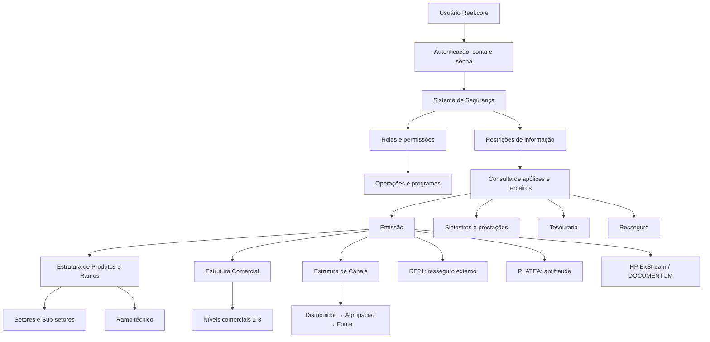
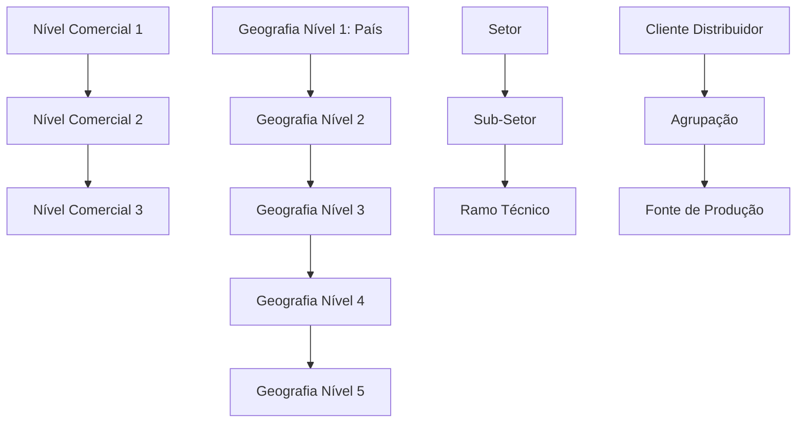
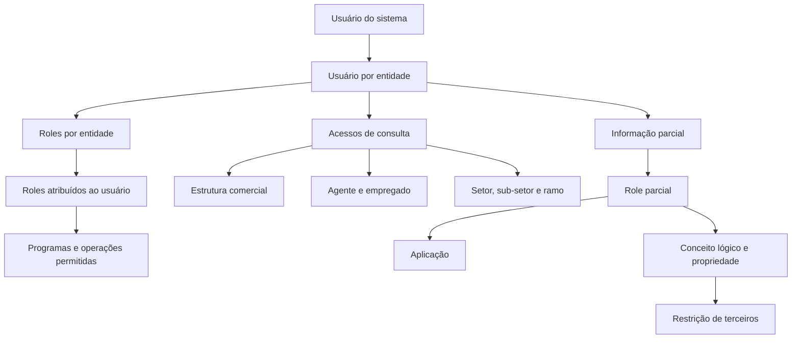

# Base de Conhecimento RAG — Configuração Corporativa do Reef.core

## 1. Metadados do Documento
- **Arquivo de Origem:** Não identificado; conteúdo bruto fornecido em conversa.
- **Tipo de Documento:** Manual funcional e especificação de catálogos de configuração.
- **Domínio / Sistema:** Reef.core / MAPFRE.
- **Público-Alvo:** Arquitetos, desenvolvedores, administradores funcionais, operação, segurança, finanças e negócio.
- **Data/Versão Identificada:** Dezembro de 2023 é citado para HP ExStream e DOCUMENTUM; demais versão não identificada.

---

## 2. Resumo Executivo & Contexto de Negócio

O documento descreve o modelo de parametrização corporativa do **Reef.core**, sistema transacional utilizado pelas entidades MAPFRE. O conteúdo cobre catálogos funcionais, estruturas organizacionais, produtos, canais, segurança, interface, tarefas, estruturas de informação, comunicação e integrações documentais.

A configuração é baseada em repositórios de informação inicialmente vazios ou pré-carregados pelo núcleo. O modelo diferencia conteúdos corporativos imutáveis — especialmente registros associados à instalação `TRN` — de conteúdos que podem ser complementados ou mantidos localmente pelas entidades MAPFRE.

A estrutura organizacional é tratada por três dimensões principais: **estrutura comercial** de três níveis, **estrutura geográfica** de cinco níveis e **estrutura de canais** de três níveis. Essas dimensões são reutilizadas para segmentação operacional, atribuição de usuários, controle de acesso, classificação de agentes, fontes de produção e consulta de informações.

A estrutura de produtos organiza setores, sub-setores, ramos técnicos, tratamentos e ramos contábeis. O ramo técnico é o principal ponto de parametrização funcional, pois controla emissão, sinistros, contabilidade, coasseguro, resseguro, cálculo de prêmio, recibos, comissões, antifraude, ACO, impressão e integrações externas como RE21 e PLATEA.

O documento também estabelece que a autenticação não equivale à autorização: usuários se autenticam por conta e senha, mas permissões decorrem da configuração de roles, programas, operações, ramos e restrições de informação parcial. Diversas configurações exigem responsabilidade do time local de Tecnologia, Processos, Administração e Finanças ou Segurança Corporativa.

---

## 3. Arquitetura, Componentes & Tecnologias Envolvidas

### Componentes e domínios identificados

| Componente / Domínio | Papel no Reef.core |
| :--- | :--- |
| **Reef.core** | Núcleo transacional para gestão de apólices, contratos, sinistros, tesouraria, produtos, usuários e catálogos. |
| **TRN** | Instalação do núcleo; suas configurações devem ser preservadas nos catálogos que a utilizam. |
| **NewTron** | Versão atual do Reef.core, relacionada a operações funcionais. |
| **TronWeb** | Versão legacy do Reef.core, relacionada a programas e permissões legadas. |
| **FUJI** | Orquestrador do frontal do Reef.core; trata aplicações como MicroFrontEnd ou por emulação via iframe. |
| **RE21** | Solução corporativa externa para resolução de cessões e colocações de resseguro. |
| **PLATEA** | Integração para identificação precoce e prevenção de fraude. |
| **ACO** | Área Corporativa de Operações; define controles proativos de marcas. |
| **ACNC** | Área Corporativa de Negócio e Clientes; estabelece classificação corporativa de canais e distribuidores. |
| **HP ExStream** | Ferramenta corporativa de geração e envio de documentos e notificações, citada para dezembro de 2023. |
| **DOCUMENTUM** | Ferramenta corporativa de armazenamento e gestão documental, citada para dezembro de 2023. |
| **Oracle** | Banco e tecnologia citados em tabelas, procedimentos, listas referenciadas e estruturas de informação. |
| **LDAP** | Mecanismo de autenticação mencionado para usuários da aplicação. |
| **Java / JSPOOL** | Cliente e parâmetros Java por usuário; papéis de acesso no servidor de aplicações. |



### Estruturas piramidais



> **Nota de Análise:** O material descreve extensivamente configurações funcionais e catálogos, mas não fornece contratos HTTP, payloads JSON, portas, topologia física de servidores ou versões técnicas das aplicações.

---

## 4. Regras de Negócio, Especificações Funcionais & Processos

### 4.1 Moedas e tipos de câmbio

- O sistema é multidivisa e permite definir moedas para cálculos de prêmio, liquidação de sinistros e prestações e liquidação periódica de comissões.
- A definição de moeda deve respeitar a **ISO 4217**, com códigos de três letras.
- Uma moeda pode ser:
  - moeda real;
  - unidade de conta reajustável, como `UF` no Chile e `UDI` no México;
  - moeda fictícia, como Tréboles no plano de fidelização.
- O atributo de número de decimais regula o comportamento dos cálculos internos.
- Para uma moeda e uma data determinada, o sistema permite a captura de **um único tipo de câmbio**.
- O tipo de câmbio contém companhia, moeda, data de câmbio e valor do tipo de câmbio.

### 4.2 Estrutura comercial

- A estrutura comercial é piramidal e possui três níveis.
- As denominações locais dos níveis podem ser configuradas segundo costumes locais.
- Exemplo MAPFRE Espanha:
  - Nível 1: Territorial;
  - Nível 2: Sub Central;
  - Nível 3: Oficina / Sucursal.
- Os níveis utilizam atividades de terceiros não alteráveis:
  - nível 1: atividade `42`;
  - nível 2: atividade `43`;
  - nível 3: atividade `44`.
- Para o primeiro nível, se a atividade 42 não possuir tipo de documento identificador associado, o sistema aplica o tipo configurado nos parâmetros da instalação.
- Para segundo nível, o texto informa a mesma regra usando a atividade 43, ainda que a pergunta frequente mencione “primeiro nível”; a informação foi preservada como apresentada.
- Cada nível pode ser inabilitado para captura ou alteração.
- A propriedade **Emissão** diferencia código real de nível genérico:
  - nível 1: apenas um registro sem a propriedade ativada;
  - nível 2: apenas um registro sem a propriedade ativada por dupla primeiro/segundo nível;
  - nível 3: apenas um registro sem a propriedade ativada por combinação primeiro/segundo/terceiro nível.
- A propriedade **Tipo de Distribuição** do terceiro nível é descontinuada e não pode ser reutilizada localmente.
- O terceiro nível inclui data oficial de abertura da oficina/sucursal e marca própria para indicar se a unidade pertence ou não à companhia.

### 4.3 Estrutura geográfica

- A estrutura geográfica possui cinco níveis, inicialmente vazios.
- O primeiro nível representa países e deve usar **ISO 3166-1 alfa-3**.
- As denominações dos cinco níveis e do código postal podem ser localizadas por idioma.
- Exemplos de nomenclaturas:
  - Espanha/TRN: País, Comunidade/Cidade Autônoma, Província, Município/Localidade, Distrito;
  - Chile/EUR: País, Região, Província, Comunas, Localidades;
  - México/MMX: País, Entidades Federativas, Municípios/Demarcação Territorial, Localidades/Delegações, Colônias.
- Recomenda-se carregar e manter codificações de Correios locais “AS-IS”.
- Códigos postais podem ser inabilitados e classificados como reais ou genéricos.
- O quinto nível e calendários oficiais possuem data de validade para preservar histórico.

### 4.4 Calendário oficial

- O calendário registra dias não úteis e feriados vinculados aos quatro primeiros níveis geográficos.
- O registro contém data do feriado/não útil, inabilitação e data de validade.
- Recomenda-se registrar datas conforme publicação oficial, utilizando possíveis WebServices ou APIs locais.

### 4.5 FATCA

- FATCA é a lei norte-americana de conformidade tributária para contas estrangeiras.
- O catálogo identifica países sujeitos à regra.
- Os códigos de países FATCA devem seguir ISO 3166-1 alfa-3.
- A inabilitação exclui o país dos processos FATCA.
- O texto contém uma descrição inconsistente associada a um atributo “Inhabilitación” sobre prefixo telefônico; a propriedade operacional claramente definida como válida é a inabilitação do país para processos FATCA.

### 4.6 Produtos, setores, sub-setores e ramos

- A estrutura de produtos possui quatro níveis descritos como companhias, setores, sub-setores e ramos técnicos.
- Todo ramo deve estar obrigatoriamente associado a um setor e a um sub-setor.
- Cada companhia pode definir até `999` ramos.
- O ramo genérico `999` é fictício, de uso interno e exclusivo da aplicação; ramos reais podem ser usados para emissão.
- Setores e sub-setores controlam se podem ser associados a ramos por meio de marca de emissão.
- Só pode existir um sub-setor com marca de emissão inativa.
- Tratamentos disponíveis e não ampliáveis:
  - `A`: Automóveis;
  - `D`: Diversos;
  - `T`: Transportes;
  - `V`: Vida & Acidentes.

### 4.7 Regras relevantes do ramo técnico

| Grupo | Regras e comportamento |
| :--- | :--- |
| Multi risco | Permite mais de um objeto segurado por apólice. |
| Multi períodos | Para apólices com duração superior a um ano, registra informação econômica por período quando ativado; quando desativado, registra em um único período. |
| Registro de hora/minutos | Obriga captura de hora e minuto na data de efeito de apólice/suplemento. |
| Respeitar dia de vencimento | Obriga preservar o dia da data de vencimento. |
| Cláusulas | Permite cláusulas automáticas ou manuais em apólice, objeto ou cobertura; impressão local deve considerar textos e idiomas. |
| Anexos | Permite anexos na apólice e/ou no objeto segurado, com texto livre ou modelos predefinidos. |
| Arrastar anexos | Transfere anexos de orçamento para apólice quando ativado. |
| Anexos multilíngues | Permite modelos em qualquer idioma, independente do idioma do emissor. |
| Orçamento obrigatório | Não permite emissão de apólice sem orçamento anterior. |
| Reutilizar orçamento | Permite que várias apólices do ramo usem o mesmo orçamento/cotação. |
| Autorização de orçamento | Exige orçamento totalmente autorizado se controles técnicos de auditoria foram executados; não exige, por si só, orçamento obrigatório. |
| Retomada da apólice | Pode permitir que qualquer usuário habilitado retome apólice suspensa; se desativada, somente o emissor original pode retomá-la. |
| Cancelamento de suplementos | Define se controles técnicos podem ser executados em suplementos de anulação. |
| Numeração da apólice | Pode ser automaticamente alterada em renovações, mantendo rastreabilidade. |
| Motivos de suplemento | Por padrão exige um motivo; a propriedade permite capturar mais de um. |
| Modalidade comercial | Valores: sem modalidade, explícita ou implícita. |
| Formação da imagem | Pode usar data do sistema, data de efeito do suplemento ou data de efeito da apólice. |
| Campos obsoletos | Máximo de riscos para emissão/impressão on-line, fracionamento de pagamento, distribuição proporcional de comissões, regeneração de suplementos retroativos e data contábil padrão são apontados como descontinuados ou obsoletos. |

### 4.8 Formação da modalidade e imagem do ramo

| Propriedade | Valores / regra |
| :--- | :--- |
| Formação da modalidade | `SIN MODALIDAD`: inicialmente oferece todas as coberturas do ramo. |
| Formação da modalidade | `EXPLÍCITA`: coberturas dependem da resposta a um atributo e o contratante escolhe a modalidade. |
| Formação da modalidade | `IMPLÍCITA`: coberturas dependem de respostas a dois ou mais atributos; o contratante pode não conhecer previamente a modalidade derivada. |
| Formação da imagem | `1`: data do sistema. |
| Formação da imagem | `2`: data de efeito do suplemento. |
| Formação da imagem | `3`: data de efeito da apólice. |

### 4.9 Tratamentos

| Código | Tratamento | Comportamento descrito |
| :--- | :--- | :--- |
| `D` | Diversos | Comportamento padrão do Reef.core. |
| `A` | Automóveis | Inclui tratamento de acessórios não presentes no veículo padrão. |
| `T` | Transportes | Permite aplicações, apólices flutuantes e declarações de alta, baixa e modificação de risco. |
| `V` | Vida | Inclui modalidades, suplementos específicos, resgates e questionários. |

- Tratamento de emissão, sinistros e contábil podem ter valores diferentes no mesmo ramo.
- Tratamento de automóveis é obrigatório para a estrutura de captura de acessórios.
- Tratamento de transportes habilita reutilização de declaração prévia, renumeração em aplicações e suspensão/rejeição de aplicações.
- Tratamento de vida pode habilitar certificados para seguros coletivos e gestão de fundos para seguros de poupança ou mistos.

### 4.10 Coasseguro e resseguro

| Parâmetro | Valores / regra |
| :--- | :--- |
| Tipo de coasseguro permitido | `0` Exento; `1` Somente cedido; `2` Somente aceito; `3` Cedido/aceito. |
| Quadro de coasseguro obrigatório | Obriga definir distribuição por quadro de coasseguro. |
| Comissão externa de coasseguro | Indica cálculo não padrão; não exige percentuais no momento da emissão. |
| Tipo de resseguro permitido | `0` Seguro direto; `1` Resseguro aceito por contrato; `2` Resseguro aceito facultativo; `3` Resseguro cedido/aceito. |
| RE21 externo | Quando ativado, a emissão chama RE21 para resolver cessões usando coberturas e parametrização de contratos, políticas, planos e regras do sistema externo. |
| Controles técnicos RE21 | Podem ser gerados em emissão ou sinistros quando RE21 falha ou termina anormalmente. |
| Momento de RE21 | A colocação pode ocorrer on-line ou de forma diferida. |

### 4.11 Prêmios, recibos e comissões

- **Prorrata:** ativada calcula proporcionalmente ao período de vigência; desativada utiliza escala.
- **Alterar prorrata:** permite ao emissor escolher prorrata ou escala em apólices temporárias.
- **Ano de cálculo:** `360` ou `365` dias; ano bissexto não modifica os valores do parâmetro.
- **Prêmios manuais:**
  1. cálculo automático;
  2. automático ou manual;
  3. manual.
- **Taxa manual:** permite capturar taxa ou prêmio anual da cobertura quando prêmios manuais estão habilitados.
- **Modificar tipo de câmbio:** pode permitir alteração e validação do câmbio contábil em moeda diferente da local. O documento recomenda controle técnico e aprovação por Administração e Finanças.
- **Pricing dinâmico:** após o cálculo de prêmios, permite chamar componente local para ajustar valores segundo critérios de negócio.
- **Recibos por período:** aplicável a apólices plurianuais com multi períodos.
- **Modificar recibos:** permite alterar datas e valores com privilégios; o sistema valida coerência.
- **Remessa de recibos:** quando ativada, remete para cobrança recibos com data de efeito menor ou igual à data do sistema.
- **Emissão sem recibos:** exige componente local de validação explícita.
- **Cobrança em emissão:** exige componente local e role de caixa para o emissor.
- **Agentes:** toda apólice deve ter agente principal; máximo de agentes deve estar no intervalo `[1..4]`.
- **Modificar porcentagens de comissão:** apenas possível quando multi períodos está desativado.
- **Comissão de carteira:** após ao menos uma renovação, com propriedade ativada calcula como carteira; caso contrário, como nova produção.

### 4.12 Segurança e controle de acesso



- Autenticação por senha não equivale a autorização; autorização é concedida por roles.
- Usuários são identificados como `NUUMA` nas entidades MAPFRE.
- Recomenda-se usar a mesma identificação do diretório ativo.
- Acesso de consulta pode usar códigos genéricos para acesso total ou limitar usuários a estruturas comerciais, agentes, setores, sub-setores e ramos.
- Recomenda-se privilegiar restrição de acesso em vez de concessão irrestrita.
- Se um usuário não puder visualizar todos os dados de um terceiro, não poderá modificá-lo.
- A restrição para pessoas físicas e jurídicas simultaneamente usa valor `Z`.
- A restrição a todas as propriedades de um conceito lógico usa o valor genérico `ZZZZ...ZZZZ`.
- LDAP exige ativar a propriedade de usuário de rede e manter inativa a propriedade de modificação de usuário.

### 4.13 Estruturas de informação e dados variáveis

- Estruturas de informação permitem criar tabelas específicas na base de dados para suportar dados heterogêneos de Emissão, Sinistros e Terceiros.
- A configuração é responsabilidade do Departamento de Tecnologia Local.
- Agrupações predefinidas incluem estruturas de terceiros, sinistros, expedientes, trâmites, salvamentos, perícias, emissão, anexos, tarefas e liquidação de expedientes.
- Dados variáveis podem ser:
  - colunas de tabelas Oracle ou Oracle Nested;
  - parte de chave primária;
  - visíveis, obrigatórios ou modificáveis;
  - validados mesmo sem valor;
  - preenchidos por valor padrão, variável global ou lógica de negócio;
  - associados a programas de ajuda, tabelas de validação e listas de valores.
- Dados variáveis não modificáveis não executam lógica de negócio do dado variável; descrição e validação devem ser tratadas por lógica inicial.
- `AL000020` é citado como programa de ajuda padrão para listas reduzidas.
- Nível de dado variável deve ser constante `5` somente para dados solicitados repetidamente por uma lista de valores associada.

### 4.14 Aplicações, programas e interface

- Aplicações possuem código, nomenclatura, URL base, indicação de MicroFrontEnd, inabilitação e data de validade.
- Exemplo de URL fornecido: `https://tron-desa-espejo.mapfre.net`.
- Aplicações citadas: `GDC`, `TSY`, `LSS` e `SPL`.
- Programas podem ter tipologias `DLG`, `DLM`, `FRM`, `HTM`, `INP`, `JAV`, `MEN`, `PCO`, `PL`, `PNL`, `SH`, `TAR`, `VEP`, `WIN`, `WTW` e `GP`.
- Menus são recursivos:
  - menu principal de operações: `MAIN`;
  - menu principal de programas: `AM0000000`.
- Textos, mensagens, etiquetas, listas e menus associados à instalação `TRN` não podem ser alterados.
- Listas de valores padrão devem começar com `TIP_`.
- Nos catálogos personalizáveis, só podem coexistir registros `TRN` e registros da instalação local.
- Operações funcionais são configuradas corporativamente e não podem ser modificadas.

### 4.15 Tarefas

- Uma tarefa pode ser processo, parte de processo, carta ou relatório.
- Pode exigir parâmetros, ser executada diretamente ou diferida, e ter ou não tela de resultados.
- Tarefas iniciadas por `TRN` são tarefas de núcleo.
- Parâmetros podem ter ordem, visibilidade, obrigatoriedade, valor padrão, lógica prévia, lógica de validação, programa de ajuda, catálogo de validação, versão e lista de ocorrências.

---

## 5. Tabelas de Parâmetros, Ambientes e Estruturas de Dados

### 5.1 Moedas e câmbio

| Item / Parâmetro | Descrição / Função | Tipo / Valores / Formato | Ambiente / Observações |
| :--- | :--- | :--- | :--- |
| Código de moeda | Identifica a divisa no sistema | Código de moeda | Deve respeitar ISO 4217. |
| Código ISO | Código de três letras da divisa | ISO 4217 | Obrigatório como norma de referência. |
| Marca moeda real/unidade de conta | Diferencia moeda real de unidade reajustável | Moeda real, unidade de conta ou moeda fictícia | Exemplos: UF, UDI e Tréboles. |
| Número de decimais | Define precisão interna de cálculos | Numérico | Afeta cálculo interno. |
| Companhia | Companhia da definição de câmbio | Código de companhia | Tipo de câmbio. |
| Data de câmbio | Data de obtenção do câmbio médio de compra e venda | Data | Somente um câmbio por moeda e data. |
| Valor do tipo de câmbio | Valor de câmbio da moeda | Valor monetário | Associado a data específica. |

### 5.2 Estruturas corporativas

| Estrutura | Níveis | Chaves / Restrições | Observações |
| :--- | :--- | :--- | :--- |
| Comercial | 3 | Atividades fixas 42, 43 e 44 | Pode possuir denominações locais. |
| Geográfica | 5 | Nível 1 usa ISO 3166-1 alfa-3 | Inclui códigos postais e calendário oficial. |
| Produtos | Setor → Sub-setor → Ramo | Ramo associado obrigatoriamente a setor e sub-setor | Até 999 ramos por companhia. |
| Canais | Distribuidor → Agrupação → Fonte | Níveis 1 e 2 corporativos; nível 3 local | Fonte identifica origem comercial de uma apólice. |

### 5.3 Canais: primeiro nível

| Código | Cliente distribuidor | Abreviatura |
| :--- | :--- | :--- |
| `01` | Direto | Dir.r |
| `02` | Rede Própria - Agencial | Prop. |
| `03` | Rede Externa - Corretores | Ext. |
| `04` | Bancário | Ban. |
| `05` | Acordos | Acu. |

### 5.4 Canais: segundo nível

| Código | Agrupação | Abreviatura |
| :--- | :--- | :--- |
| `10` | Oficinas Diretas | OFD. |
| `11` | Direto Grandes Contas | DGC. |
| `12` | Direto Digital | DD. |
| `13` | Direto Telefônico | DT. |
| `24` | Delegados | DEL. |
| `25` | Agentes Exclusivos | AG.EX. |
| `36` | Agentes Vinculados | AG.V. |
| `37` | Agentes Não Vinculados | AGNV. |
| `38` | Corretores Locais | CORL. |
| `39` | Corretores Globais | CORG. |
| `410` | Bancário | BANC. |
| `511` | Acordos | ACU. |

### 5.5 Ramos contábeis

| Posição | Composição do ramo contábil |
| :--- | :--- |
| `1` | Setor |
| `2–3` | Sub-setor |
| `4–6` | Agrupamento |
| `7–9` | Sequência |

| Ramo | Modalidade | Cobertura | Dado variável | Valor | Ramo contábil |
| :--- | :--- | :--- | :--- | :--- | :--- |
| `401` | Todo Risco | Danos Próprios | `COD_TIP_VEHI` | AUTOMÓVEIS | `101401001` |
| `401` | Todo Risco plus | Danos Próprios | `COD_TIP_VEHI` | AUTOMÓVEIS | `101401007` |
| `401` | Todo Risco | Danos Próprios | `COD_TIP_VEHI` | MOTOCICLETAS | `101401002` |
| `401` | Todo Risco | Danos Próprios | `COD_TIP_VEHI` | CAMINHÕES | `101401003` |

### 5.6 Catálogos transversais

| Catálogo | Função | Regra / Responsável |
| :--- | :--- | :--- |
| Códigos do sistema | Identifica processos e subsistemas | Pré-configurado corporativamente; não alterar. |
| Datas de processos | Controla datas contábeis de emissão, sinistros e finanças | Manutenção pela Administração e Finanças local. |
| Formas de compensação | Registra meios de compensação em tesouraria | Inicialmente pré-configurado; manutenção por Administração e Finanças local. |
| Conceitos econômicos | Acumula importes de conceitos de desagregação | Até 999 conceitos econômicos de recibo. |
| Conceitos econômicos de comissões | Registra valores a liquidar a produtor, organizador ou assessor | Atuação: `P`, `O`, `A`. |

### 5.7 Formas de compensação

| Código | Descrição |
| :--- | :--- |
| `1` | Cheque bancário |
| `2` | Dinheiro |
| `3` | Por transferência |
| `4` | Contas gestão |
| `5` | Cartão |
| `6` | Banco dinheiro transferência |
| `7` | Arquivo bancário |

### 5.8 Servidor de aplicações

| Parâmetro | Descrição / Regra |
| :--- | :--- |
| Roles de acesso | `SUA/ADM`, `PRG`, `AJP/EJP`, `UJP`, `OJP`, `WTWPRG`, `WTWADM`. |
| Roles padrão | Usuários são criados com `PRG` e `OJP`. |
| Múltiplos roles | Devem ser separados por espaço em branco. |
| Usuário de rede | Deve ser ativado quando LDAP é a autenticação. |
| Modificar usuário | Deve ficar inativo quando LDAP está ativado. |
| Dias de validade da senha | `0` significa que não há validação de expiração. |
| Comprimento mínimo e máximo | `0` significa que não há validação do respectivo limite. |
| Cadeia direta | Substitui definições individuais; inclui usuário/senha do servidor, usuário/senha de banco e cadeia de conexão. |

### 5.9 Módulos Reef.core

| Código | Módulo |
| :--- | :--- |
| `TRN` | Reef.core |
| `SS` | Sistema de Segurança |
| `DC` | Dados Comuns |
| `EM` | Emissão |
| `TS` | Sinistros |
| `GC` | Gestão de Cobranças / Tesouraria |
| `RE` | Resseguro |
| `CA` | Coasseguro |
| `CO` | Contabilidade |

---

## 6. Bateria de Perguntas & Respostas para RAG (FAQ Sintético)

### P1: Como o Reef.core diferencia autenticação de autorização?
**R:** A autenticação permite que o usuário se identifique no sistema por conta e senha. A autorização é independente e determina quais recursos, programas e operações o usuário pode utilizar. No Reef.core, a autorização é concedida pela configuração e atribuição de roles aos usuários.

### P2: Qual padrão deve ser usado para cadastrar moedas e países?
**R:** Moedas devem respeitar a norma ISO 4217, que usa códigos de três letras. Países no primeiro nível da estrutura geográfica e no catálogo FATCA devem utilizar códigos ISO 3166-1 alfa-3.

### P3: É possível registrar mais de um tipo de câmbio para a mesma moeda na mesma data?
**R:** Não. O sistema permite capturar somente um único tipo de câmbio para uma moeda em uma data determinada. A configuração de câmbio inclui companhia, moeda, data e valor do câmbio.

### P4: Quais atividades de terceiros identificam os níveis da estrutura comercial?
**R:** O primeiro nível usa obrigatoriamente a atividade `42`, o segundo nível usa a atividade `43` e o terceiro nível usa a atividade `44`. Esses valores são constantes do núcleo e não podem ser modificados.

### P5: Como funciona a propriedade Multi períodos em um ramo?
**R:** Para apólices com duração superior a um ano, quando Multi períodos está ativada, a informação econômica é registrada separadamente para cada período da apólice. Quando está desativada, a informação econômica é registrada em um único período, mesmo em apólices plurianuais.

### P6: Quais tratamentos de ramo podem ser configurados no Reef.core?
**R:** Os tratamentos disponíveis são `A` para Automóveis, `D` para Diversos, `T` para Transportes e `V` para Vida & Acidentes. A lista é predefinida no núcleo e não pode ser ampliada. Um ramo pode ter tratamentos distintos para emissão, sinistros e contabilidade.

### P7: Quando o Reef.core chama a solução externa RE21?
**R:** Quando a propriedade de colocação de resseguro em sistema externo está ativada no ramo, o Reef.core chama RE21 para resolver cessões de resseguro. RE21 utiliza as coberturas contratadas e a parametrização de contratos, políticas, planos de colocação e regras de negócio configuradas no sistema externo.

### P8: Como limitar a consulta de apólices de um usuário?
**R:** É possível restringir o acesso por primeiro, segundo e terceiro níveis comerciais; agente; empregado do agente; setor; sub-setor; e ramo técnico. Para acesso total, devem ser usados os códigos genéricos. A recomendação do documento é privilegiar a restrição de acesso em vez da concessão sem restrições.

### P9: O que acontece se um usuário tiver restrição parcial sobre os dados de um terceiro?
**R:** Se o usuário não puder acessar completamente todos os dados de um terceiro, também não poderá modificá-los. O documento considera incoerente permitir que um usuário altere informação que não pode consultar integralmente.

### P10: Quais configurações associadas a TRN podem ser alteradas localmente?
**R:** Registros associados à instalação `TRN` pertencem ao núcleo e não devem ser modificados. O documento aplica essa regra a listas de valores, filtros, textos, mensagens, etiquetas, menus, programas e outras configurações de núcleo.

### P11: O que é uma fonte de produção na estrutura de canais?
**R:** É o terceiro nível da estrutura de canais. Identifica de forma única o cliente distribuidor, o canal de comercialização e atributos complementares do agente que comercializou uma apólice. A fonte de produção é vinculada ao agente durante a emissão e deve ser mantida durante a vigência da apólice, podendo ser alterada na renovação.

### P12: Como são configuradas estruturas de informação?
**R:** Estruturas de informação registram e classificam dados heterogêneos em tabelas específicas da base de dados. São associadas a agrupações e compostas por dados variáveis. A configuração adequada é responsabilidade do Departamento de Tecnologia Local.

---

## 7. Glossário de Termos, Siglas & Conceitos-Chave

- **ACO:** Área Corporativa de Operações; define controles proativos de marcas.
- **ACNC:** Área Corporativa de Negócio e Clientes; estabelece classificações corporativas de clientes distribuidores e agrupações.
- **APLICAÇÃO:** Portal ou aplicação Reef.core com código, nomenclatura, URL base e indicação de MicroFrontEnd.
- **Câmbio:** Valor de conversão de uma moeda para uma data específica.
- **Coasseguro cedido:** MAPFRE atua como companhia líder.
- **Coasseguro aceito:** MAPFRE participa em percentual de apólice liderada por outra companhia.
- **Conceito econômico:** Contêiner que acumula importes de conceitos de desagregação para geração de recibos.
- **Declaração prévia:** No tratamento de Transportes, registro semelhante a orçamento com dados parciais de viagem, posteriormente complementado para emissão de aplicação.
- **FATCA:** Foreign Account Tax Compliance Act, lei norte-americana para controle de evasão fiscal por contas no exterior.
- **FUJI:** Orquestrador do frontal do Reef.core.
- **Informação parcial:** Modelo de restrição de visualização de conceitos lógicos e propriedades.
- **LDAP:** Mecanismo de autenticação de usuários mencionado para a aplicação.
- **MicroFrontEnd:** Aplicação tratada por FUJI como componente de frontal real, em vez de emulação por iframe.
- **NUUMA:** Denominação do código identificador do usuário nas entidades MAPFRE.
- **PLATEA:** Integração antifraude para emissão e sinistros.
- **Ramo técnico:** Unidade de classificação de riscos e principal objeto de parametrização operacional do produto.
- **RE21:** Solução corporativa externa de colocação e cessão de resseguro.
- **Reef.core:** Núcleo transacional corporativo descrito no documento.
- **Role:** Agrupamento de funções e permissões atribuíveis a usuários.
- **TRN:** Instalação do núcleo Reef.core e prefixo de tarefas de núcleo.
- **UF:** Unidade de Fomento do Chile, citada como unidade de conta.
- **UDI:** Unidade de Inversão do México, citada como unidade de conta.

---

## 8. Notas Críticas, Riscos & Limitações

- Configurações de núcleo identificadas por `TRN` não devem ser modificadas. Alterações nesses registros podem afetar o funcionamento do núcleo.
- O documento identifica propriedades explicitamente **descontinuadas, obsoletas ou não reutilizáveis**, incluindo:
  - tipo de distribuição do terceiro nível comercial;
  - número máximo de riscos para emissão e impressão on-line;
  - estrutura de captura/distribuição do plano de pagamento;
  - cálculo de fracionamento de pagamento;
  - distribuição proporcional de comissões;
  - regeneração de suplementos retroativos;
  - data contábil padrão;
  - programa externo, código TronWeb e status de programas;
  - variável global de ajuda;
  - marcas de controle de etiquetas e mensagens.
- A alteração de câmbio possui impacto contábil e o documento recomenda auditoria, aprovação de Administração e Finanças e controle técnico.
- A emissão sem recibos, cobrança em emissão, inspeções, pricing dinâmico, integração externa de seleção de risco e outras extensões dependem de componentes desenvolvidos pela Tecnologia local.
- A integração de resseguro com RE21 pode produzir controles técnicos quando a chamada falha ou termina de forma anormal.
- A configuração de usuários de servidor, parâmetros Java e estruturas de informação é responsabilidade exclusiva ou principal de Tecnologia Local.
- A recomendação de acesso é aplicar restrições de informação antes de conceder acesso total.
- O material contém trechos com erros aparentes de redação, numeração ou associação de atributos, como referências de FAQ do terceiro nível comercial à atividade 43. Esses trechos foram tratados como conteúdo fonte, sem correção inferencial.
- **Nota de Análise:** O documento cita `https://tron-desa-espejo.mapfre.net` apenas como exemplo de URL base. Não há evidência de que seja um ambiente atualmente ativo nem de que represente uma URL operacional válida.

---

## 9. Conteúdo Bruto Estruturado (Referência Fiel)

```text
O conteúdo bruto fornecido é um manual extenso de parametrização do Reef.core e está organizado nos seguintes blocos de referência:

1. Definição de moedas e tipos de câmbio
   - Moedas do sistema.
   - Código ISO 4217.
   - Moeda real, unidade de conta, número de decimais.
   - Companhia, moeda, data e valor de câmbio.
   - Regra: um único tipo de câmbio por moeda e data.

2. Estrutura comercial
   - Organização comercial funcional, por produto, geográfica, por cliente e mista.
   - Estrutura piramidal em três níveis.
   - Denominações locais dos níveis.
   - Primeiro nível: atividade fixa 42.
   - Segundo nível: atividade fixa 43.
   - Terceiro nível: atividade fixa 44.
   - Dados identificativos, contato, propriedades operativas e inabilitação.
   - Emissão, níveis genéricos, marca própria e data de abertura.

3. Estrutura geográfica
   - Estrutura piramidal em cinco níveis.
   - Primeiro nível: países com ISO 3166-1 alfa-3.
   - Segundo, terceiro, quarto e quinto níveis geográficos.
   - Códigos postais, calendário oficial e FATCA.
   - Recomenda-se manter codificações do serviço de Correios local.

4. Estrutura de produtos
   - Companhias, setores, sub-setores e ramos técnicos.
   - Ramos contábeis padrão e por dado variável.
   - Ramo contábil composto por nove posições:
     1 setor; 2-3 sub-setor; 4-6 agrupamento; 7-9 sequência.
   - Tratamentos A, D, T e V.
   - Regras de emissão, sinistros, contabilidade, prêmios, recibos, agentes,
     comissões, coasseguro, resseguro, PLATEA e ACO.

5. Estrutura de canais
   - Nível 1: clientes distribuidores.
   - Nível 2: agrupações.
   - Nível 3: fontes de produção.
   - Clientes distribuidores corporativos:
     01 Direto; 02 Rede Própria - Agencial; 03 Rede Externa - Corretores;
     04 Bancário; 05 Acordos.
   - Níveis 1 e 2 são corporativos; fontes de produção são definidas localmente.

6. Catálogos gerais e transversais
   - Códigos do sistema.
   - Datas de processo.
   - Formas de compensação.
   - Conceitos econômicos.
   - Conceitos econômicos para liquidação de comissões.

7. Sistema de segurança
   - Usuários, roles, atribuição de roles, parâmetros de consulta,
     usuários no servidor de aplicações e parâmetros Java.
   - Controle de consulta por estrutura comercial, agente e produto.
   - Informação parcial, conceitos lógicos, aplicações e restrições de terceiros.
   - Usuários identificados como NUUMA.
   - Autenticação não implica autorização.

8. Estruturas de informação
   - Agrupações de estruturas.
   - Estruturas de informação.
   - Associação de estruturas às agrupações.
   - Dados variáveis, tabelas Oracle, validações e listas de valores.

9. Tarefas
   - Definição de tarefas e de parâmetros.
   - Tarefas podem ser processos, partes de processos, cartas ou relatórios.
   - Tarefas TRN pertencem ao núcleo.

10. Programas, menus, mensagens, etiquetas, textos e listas de valores
    - Instalações, módulos, programas, operações, menus e menus suspensos.
    - Textos, mensagens, etiquetas, listas e filtros.
    - Configurações TRN pertencem ao núcleo e não devem ser alteradas.

11. Anotações e notificações
    - Anotações, títulos, textos enriquecidos e destinatários.
    - Integrações documentais citadas:
      HP ExStream para geração e envio;
      DOCUMENTUM para armazenamento e gestão documental.
    - Referência temporal: dezembro de 2023.
```
