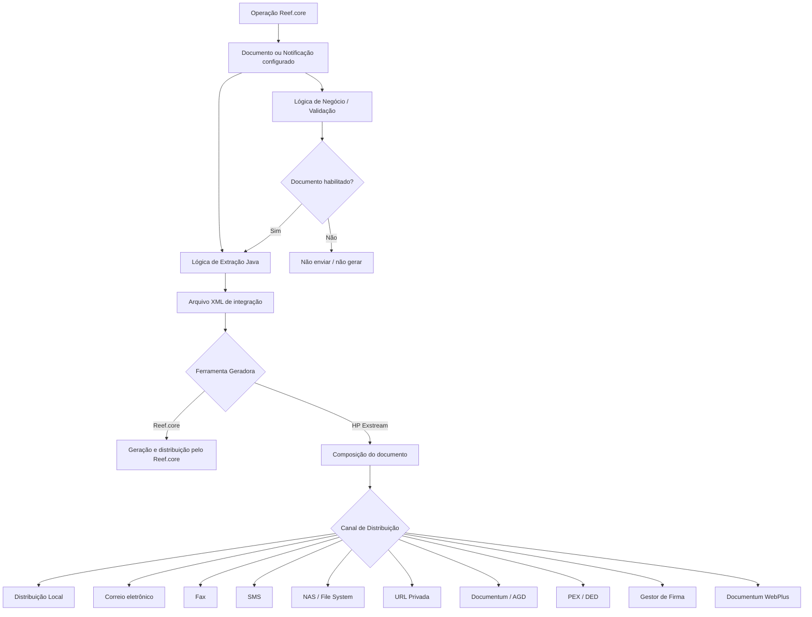
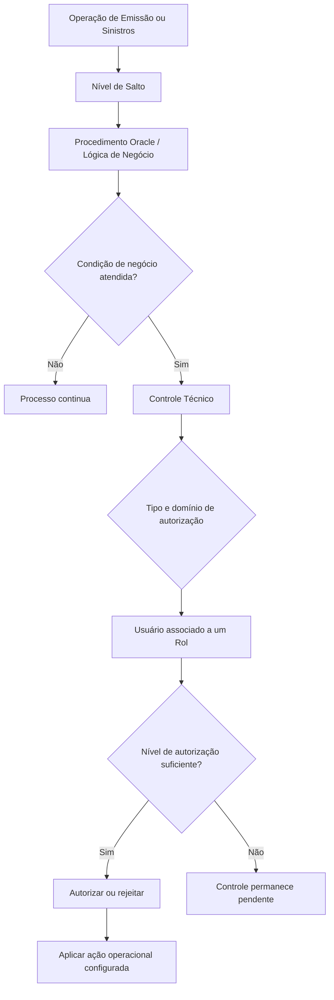
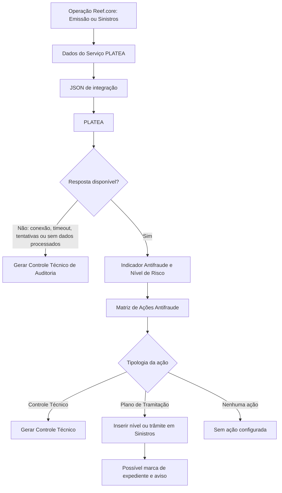

# Documentação Reef.core: Documentos, Controles Técnicos, PLATEA, Marcas e Elementos Comuns

## 1. Metadados do Documento
- **Arquivo de Origem:** Não identificado — conteúdo bruto fornecido na solicitação.
- **Tipo de Documento:** Manual Operacional / Especificação Funcional.
- **Domínio / Sistema:** Reef.core / MAPFRE.
- **Público-Alvo:** Arquitetos, desenvolvedores, operação, equipes de Tecnologia e Processos, áreas de negócio, emissão, sinistros e antifraude.
- **Data/Versão Identificada:** Não identificada.

---

## 2. Resumo Executivo & Contexto de Negócio

O conteúdo documenta catálogos, propriedades e regras funcionais do **Reef.core**, com foco na configuração de documentos e notificações, controles técnicos, integração antifraude com a plataforma **PLATEA**, funcionalidade de marcas e elementos comuns transversais da instalação. O objetivo é permitir que entidades MAPFRE locais parametrizem comportamentos de negócio sem alterar os controles nativos e estáticos do núcleo.

A configuração de documentos e notificações permite identificar, gerar, distribuir, armazenar, versionar, validar e inabilitar comunicações destinadas a terceiros. O documento descreve múltiplos canais de distribuição, incluindo resposta síncrona local, correio eletrônico, fax, SMS, NAS, URL privada, Documentum/AGD, fornecedor externo, assinatura eletrônica e Documentum WebPlus.

Os **Controles Técnicos** são regras de negócio dinâmicas, configuradas localmente, que complementam as validações nativas do Reef.core. Enquanto as validações nativas não podem ser evitadas, os controles técnicos permitem aplicar critérios técnicos, comerciais ou administrativos específicos da entidade, especialmente nos processos de Emissão e Sinistros. A execução ocorre por procedimentos Oracle e pode ser especializada por sistema, nível de salto, estrutura de produtos e estrutura comercial.

A integração com **PLATEA** habilita a avaliação de indicadores antifraude durante Emissão e Sinistros. O nível de risco retornado por PLATEA pode gerar controles técnicos, inserir níveis ou trâmites em planos de tramitação de sinistros, marcar expedientes como possível fraude ou apresentar avisos. Quando PLATEA não responde, ocorre automaticamente a geração de um Controle Técnico de Auditoria.

A funcionalidade de **Marcas** permite detectar e tratar condições relativas a terceiros, objetos segurados, apólices e fatos previamente configurados. O mecanismo opera de forma proativa durante a emissão e, conforme a configuração, pode disparar controles técnicos ou lógicas de negócio. O material também registra limitações, responsabilidades locais e diversos trechos explicitamente marcados como “EN CONSTRUCCIÓN” ou “Pendiente”.

---

## 3. Arquitetura, Componentes & Tecnologias Envolvidas

### Componentes e domínios identificados

| Componente / Domínio | Papel documentado |
| :--- | :--- |
| **Reef.core** | Núcleo do sistema para gestão de apólices, contratos, sinistros, prestações, tesouraria, terceiros, notificações e controles técnicos. |
| **MAPFRE** | Grupo e entidades locais responsáveis por configurações, regras de negócio e operações locais. |
| **HP Exstream** | Ferramenta corporativa de geração de documentos; utiliza modelos EXSTREAM e integração XML. |
| **Documentum / AGD** | Gestor documental corporativo utilizado para arquivamento de documentos. |
| **Documentum WebPlus** | Mecanismo de acesso a documentos do gestor documental por link enviado por correio eletrônico. |
| **NAS / File System** | Destino de distribuição de documentos por sistema de arquivos. |
| **PEX / DED** | Distribuição para fornecedor externo; o documento é depositado em File System para posterior Distribuição Externalizada de Documentação. |
| **Gestor de Firma** | Serviço externo de assinatura eletrônica, incluindo exemplos como assinatura por terceiros de confiança e assinatura biométrica. |
| **PLATEA** | Plataforma Tecnológica de Lucha contra el Fraude do Grupo MAPFRE. |
| **Oracle Procedures** | Subrotinas usadas pelo Reef.core para avaliar condições e gerar controles técnicos. |
| **BPM** | Business Process Management opcional nos processos de Gestão de Apólices e Contratos e Gestão de Sinistros e Prestações. |
| **RE21** | Sistema de resseguro mencionado na propriedade de companhia de resseguro externo. |
| **ComeRound** | Plataforma corporativa citada como exemplo de integração possível com PLATEA. |

### Fluxo de documentos e notificações



### Fluxo de controles técnicos



### Fluxo de integração antifraude com PLATEA



---

## 4. Regras de Negócio, Especificações Funcionais & Processos

### 4.1 Documentos e notificações

- Um documento ou notificação pode ser classificado como contratual, comercial, informativo, voz do cliente ou operacional.
- A propriedade **Compañía** identifica a entidade sobre a qual ocorre a configuração.
- O **Código del Documento/Notificación** é a chave identificadora no sistema.
- A **Fecha de Validez** determina a partir de quando a definição fica disponível; o uso correto viabiliza histórico, rastreabilidade e exploração de alterações.
- A propriedade **Entrada o Salida** define o âmbito de uso segundo os valores permitidos no catálogo do núcleo.
- A **Versión** identifica a versão do documento ou notificação.
- A inabilitação impede o uso do atributo, documento, variável ou configuração correspondente.

### 4.2 Regras de distribuição documental

- **Distribuição Local:** retorno síncrono pela resposta do serviço web ao transacional, responsável por exibir ou imprimir.
- **Correio Eletrônico:** documento enviado como anexo aos endereços indicados.
- **Fax:** documento enviado ao telefone indicado.
- **SMS:** mensagem enviada ao telefone móvel indicado.
- **File System:** documento depositado em uma NAS.
- **URL Privada:** documento acessível por link enviado por e-mail; a chave de acesso pode ser encaminhada por SMS ou inferida a partir de dados como DNI ou número da apólice.
- **Documentum / AGD:** documento arquivado no gestor documental corporativo.
- **PEX / DED:** documento depositado em File System para posterior distribuição externalizada.
- **Assinatura Eletrônica:** documento encaminhado a serviço externo de assinatura.
- **Documentum WebPlus:** documentos no gestor documental corporativo ficam acessíveis por link enviado ao cliente.

### 4.3 Extração, composição e envio de documentos

A lógica de extração é um programa Java que gera um arquivo XML. O programa Java extrai do operacional as informações requeridas para integração com a ferramenta responsável pela composição e envio.

O conteúdo XML depende do canal de distribuição e das etiquetas necessárias. Para enviar uma carta de encerramento de sinistro como anexo de e-mail, o documento descreve duas ações:

1. Preparar o e-mail: endereço do destinatário, remetente, assunto e corpo.
2. Gerar e anexar o arquivo físico: modelo corporativo, dados de composição e valores extraídos do operacional.

Exemplos de dados de composição mencionados:

- Logotipo.
- Assinatura e dados registrais da entidade MAPFRE.
- Nome e sobrenome do beneficiário.
- Valor final da indenização.

A Tecnologia e Processos da entidade MAPFRE local é responsável pela configuração e implementação corretas das lógicas de extração e validação.

### 4.4 Variáveis e etiquetas de documentos

- Uma variável é vinculada a um documento/notificação, companhia, canal de distribuição, idioma, código de variável e data de validade.
- O valor pode ser obtido de terceiros, apólices, sinistros ou recibos, ou pode ser constante.
- Exemplos apresentados:
  - `EMAIL_ASUNTO`: valor constante `Improcedencia de Siniestro`.
  - `EMAIL_FROM`: valor constante `mapfre@mapfre.com`.
  - `EMAIL_TO`: sem valor fixo; obtido dos dados do tomador pela lógica de extração.

### 4.5 Associações de documentos a operações

O material lista associações de documentos/notificações a operações de:

- Contabilidade.
- Emissão.
- Sinistros.
- Terceiros.
- Tesouraria.

Em todas as associações são recorrentes:

- Companhia.
- Identificador da operação (`opr_idn_val`).
- Código do documento/notificação.
- Data de validade.
- Filtro de operação (`opr_fit`, indicado como `ok/ko`).
- Inabilitação.

**Nota de Análise:** as seções de associação a Contabilidade, Emissão, Sinistros, Terceiros e Tesouraria estão identificadas como **“EN CONSTRUCCIÓN”** e não detalham regras de precedência, contratos de dados ou algoritmos de avaliação.

### 4.6 Controles técnicos

As validações nativas ou “out-of-the-box” são estáticas, inerentes ao núcleo e não podem ser desconsideradas pela parametrização local. Exemplos citados:

- Data de vencimento de apólice deve ser igual ou posterior à data de efeito.
- Abertura de sinistro exige apólice previamente identificada no sistema.
- Dados de cobrança, comissão e plano de pagamento devem estar habilitados e vigentes.
- Não é possível emitir suplemento de anulação para apólice já anulada.
- Não é possível reabilitar apólice que não tenha sido anulada previamente.

Os controles técnicos são regras dinâmicas estabelecidas voluntária e localmente pela entidade MAPFRE, como:

- Restringir subscrição de veículos esportivos com mais de cinco anos.
- Impedir emissão de apólice Múltiple Empresarial com soma segurada de incêndio superior a 5.000.000 Euros.
- Permitir liquidação parcial inferior a 1.000 Dólares sem visto do perito, em determinadas condições.

### 4.7 Autorização de controles técnicos

- Controles técnicos de Auditoria possuem nível mínimo de autorização.
- O usuário autorizador deve ter nível igual ou superior ao nível configurado para o controle.
- A faixa tradicional citada é de `NIVEL0` a `NIVEL09`.
- Somente um rol pode ser associado a cada usuário.
- Um rol pode ser especializado por sistema, setor, subsetor, ramo, nível de salto, níveis da estrutura comercial e sistema/departamento autorizador.
- Um controle cujo sistema de autorização seja Resseguro somente pode ser autorizado ou rejeitado por rol e usuário habilitados para isso.

### 4.8 Níveis de salto

Os níveis de salto são os pontos do programa nos quais controles técnicos podem ser executados. O conteúdo do catálogo de níveis de salto **não deve ser alterado**.

Os níveis apresentados abrangem:

- Sistema 2: Emissão, incluindo dados fixos e variáveis da apólice, terceiros, riscos, coberturas, resseguro, menu, validador de emissão, inspeções, comissões e reabilitação.
- Sistema 3: Liquidações.
- Sistema 5: Dados de recibos.
- Sistema 7: Sinistros e expedientes, incluindo identificação, dados, coberturas, encerramento, reabilitação, faturamento e planos de renda.

### 4.9 Operativa de controles técnicos

Cada controle técnico pode definir:

- Tipo de controle técnico, limitado a valores corporativos não expansíveis.
- Execução em apólices, suplementos e renovações.
- Reavaliação de condições em suplementos.
- Lógica de negócio de autorização.
- Lógica de negócio de rejeição, exclusiva para Sinistros e Prestações.
- Ação em caso de rejeição on-line.
- Domínio de autorização.
- Sistema/departamento autorizador.
- Obrigatoriedade de observações ao autorizar ou rejeitar.
- Estrutura Detalhe, propriedade descontinuada e que não deve ser reutilizada.

### 4.10 Palavras, termos e frases reservadas

- Aplicável exclusivamente aos Ramos Técnicos de **Caución y Crédito** no processo de Emissão.
- Controla termos obrigatórios em textos anexos e cláusulas.
- O controle técnico predefinido para essa validação é o **2209**.
- A configuração inicial é predefinida.
- A manutenção posterior é atribuída à Direção de Administração e Finanças da entidade MAPFRE local.

### 4.11 PLATEA e ações antifraude

PLATEA é a plataforma interna do Grupo MAPFRE para prevenção, detecção, investigação, medição e controle de fraude. O documento aponta aplicação em diferentes canais, ramos e momentos da cotação e contratação.

Ações possíveis por indicador e nível de risco:

1. Inserção de nível no plano de tramitação — exclusiva de Sinistros.
2. Inserção de trâmite específico no plano de tramitação — exclusiva de Sinistros.
3. Geração de controles técnicos — disponível para Emissão e Sinistros.
4. Nenhuma ação, quando a entidade assim estabelecer.

Falhas de resposta de PLATEA que geram Controle Técnico de Auditoria:

- Falta de conexão.
- Número de tentativas de conexão excedido.
- Timeout.
- Ausência de informação processada para orçamento, apólice, sinistro, expediente ou outro elemento avaliado.

### 4.12 Marcas e fatos

A funcionalidade de marcas está implementada, no momento descrito, somente no processo de Emissão. As marcas permitem controle proativo ou reativo sobre informações de terceiros, objetos segurados e apólices.

O tratamento proativo pode identificar, por exemplo, um terceiro em nova emissão com registro prévio de alcoolemia positiva. Ações antecipadas podem ser especializadas por:

- Ramo técnico.
- Contrato e subcontrato.
- Estrutura de canais.
- Operação funcional.
- Marca.
- Severidade.
- Controle técnico ou lógica de negócio.

Os fatos podem ser baseados em:

- Dado fixo.
- Dado variável.
- Intervenção de terceiro.

Para dados fixos, a única tipologia implementada mencionada é **Número de Póliza**. Para dados variáveis, podem ser usados dados configurados por ramo em nível de apólice ou risco. Para intervenções, podem ser usados papéis como tomador, tomador alternativo, beneficiário e segurado.

---

## 5. Tabelas de Parâmetros, Ambientes e Estruturas de Dados

### 5.1 Propriedades de documentos e notificações

| Item / Parâmetro | Descrição / Função | Tipo / Valores / Formato | Ambiente / Observações |
| :--- | :--- | :--- | :--- |
| Companhia | Código da companhia para a qual a configuração é realizada | Código | Obrigatório nos catálogos descritos |
| Código do Documento/Notificação | Chave identificadora do documento ou notificação | Código | Identifica o registro no sistema |
| Data de Validade | Data a partir da qual a definição fica disponível | Data | Mantém histórico e rastreabilidade |
| Entrada ou Saída | Âmbito de uso do documento/notificação | Valores do catálogo do núcleo | Valores específicos não detalhados |
| Versão | Versão do documento ou notificação | Versão | Não são fornecidas regras de versionamento |
| Idioma | Chave do idioma usado na definição | Ex.: espanhol, inglês, turco | Aplicável a documentos e variáveis |
| Nome do Documento/Notificação | Denominação no idioma da definição | Texto | Aplicável à definição do documento |
| Inabilitação | Desativa o uso da configuração | Indicador | Impede utilização operacional |

### 5.2 Canais de distribuição

| Canal | Descrição / Função | Tipo / Valores / Formato | Ambiente / Observações |
| :--- | :--- | :--- | :--- |
| Distribuição Local | Retorna documento síncrono ao transacional via serviço web | Resposta síncrona | Transacional apresenta ou imprime |
| Correio Eletrônico | Envia documento como anexo | Endereços de e-mail | Requer remetente, destinatário, assunto e corpo |
| Fax | Envia documento ao telefone indicado | Telefone | Canal de fax |
| SMS | Envia mensagem ao telefone móvel | Telefone móvel | Mensageria |
| File System | Deposita documento em NAS | Sistema de arquivos | NAS |
| URL Privada | Disponibiliza documento por link na Internet | Link e chave de acesso | Chave pode ser enviada por SMS ou inferida por dado do cliente |
| Gestor Documental | Arquiva documento | Documentum / AGD | Gestor documental corporativo |
| Provedor Externo | Deposita documento para DED | PEX / File System – DED | Distribuição externalizada |
| Assinatura Eletrônica | Encaminha documento ao gestor externo de assinatura | Serviço externo | Pode envolver assinatura biométrica ou terceiros de confiança |
| Gestor Documental via Vínculo | Disponibiliza documento residente no gestor por link | Documentum WebPlus | Link enviado por e-mail |

### 5.3 Ferramentas geradoras

| Item / Parâmetro | Descrição / Função | Tipo / Valores / Formato | Ambiente / Observações |
| :--- | :--- | :--- | :--- |
| Plantilla Diseño Documento | Código do modelo EXSTREAM base para extração Java | Código | Suporta etiquetas e canais de distribuição |
| Ferramenta Geradora | Define a ferramenta que gera e distribui | `1 Reef.core`; `2 HP EXSTREAM` | Valores explícitos no documento |
| Lógica de Extração | Programa Java que gera XML | Programa Java | Extrai dados operacionais |
| Indexação Gestor Documental | Método de indexação no gestor documental | Modelo e tipo documental local | Aplicável quando houver armazenamento |
| Método de Obtenção do Documento | Método de obtenção conforme catálogo núcleo | Valores do catálogo do núcleo | Valores não detalhados |
| Lógica de Negócio - Validação | Avalia habilitação e envio do documento | Procedimento / lógica local | Responsabilidade local de Tecnologia e Processos |
| Aplica Retenção | Propriedade listada sem descrição | `Pendiente` | Sem detalhamento adicional |

### 5.4 Níveis de salto configurados

| Sistema | Nível de Salto | Denominação |
| :--- | :--- | :--- |
| 2 | 1 | DATOS FIJOS PÓLIZA |
| 2 | 2 | DATOS VARIABLES PÓLIZA |
| 2 | 3 | TERCEROS |
| 2 | 4 | DATOS VARIABLES RIESGO |
| 2 | 5 | DATOS VARIABLES AGRAVANTES |
| 2 | 6 | COBERTURAS |
| 2 | 7 | REASEGURO |
| 2 | 8 | OPCIONES DEL MENU |
| 2 | 9 | VALIDADOR DE EMISIÓN |
| 2 | 10 | SELECCIÓN RIESGOS VIDA |
| 2 | 11 | INSPECCIONES/INSPECTIONS |
| 2 | 12 | COMISIONES |
| 2 | 13 | REHABILITACIÓN INTERVENCIONES RIESGO |
| 3 | 1 | DAT.FIJOS LIQUIDACIONES |
| 3 | 2 | COBERTURAS LIQUIDACIONES |
| 5 | 1 | DATOS DEL RECIBO |
| 7 | 1 | IDENTIFICACIÓN DEL SINIESTRO |
| 7 | 2 | DATOS SINIESTRO |
| 7 | 3 | CAUSAS CONSECUENCIAS SINIESTRO |
| 7 | 4 | DATOS COMPLEMENTARIOS SINIESTRO |
| 7 | 5 | DATOS FIJOS DEL EXPEDIENTE |
| 7 | 6 | COBERTURAS DEL EXPEDIENTE |
| 7 | 7 | TERMINACIÓN DE EXPEDIENTES |
| 7 | 8 | REHABILITACIÓN DE SINIESTROS |
| 7 | 9 | REHABILITACIÓN DE EXPEDIENTES |
| 7 | 10 | ALTA FACTURACIÓN |
| 7 | 11 | CAMBIO VALORACIÓN EN LA FACTURACIÓN |
| 7 | 12 | PLANES DE RENTA |

### 5.5 Valores genéricos de especialização

| Contexto | Campo | Valor genérico | Finalidade |
| :--- | :--- | :--- | :--- |
| Autorização / procedimentos | Setor | `9999` | Aplicação a todos os setores |
| Autorização / procedimentos | Subsetor | `9999` | Aplicação a todos os subsetores |
| Autorização / procedimentos | Ramo | `999` | Aplicação a todos os ramos |
| Autorização / procedimentos | Primeiro nível comercial | `99` | Aplicação a todos os primeiros níveis |
| Autorização / procedimentos | Segundo nível comercial | `999` | Aplicação a todos os segundos níveis |
| Autorização / procedimentos | Terceiro nível comercial | `9999` | Aplicação a todos os terceiros níveis / escritórios |
| Procedimentos | Estrutura de informação | `ZZZZZZZZZZ` | Aplicação a qualquer estrutura de informação |
| Âmbito PLATEA | Estruturas geográfica, comercial, produtos e canais | `9999` ou `ZZZZ` | Especialização ou generalização conforme campo numérico ou alfanumérico |
| Marcas | Ramo técnico | `999` | Ramo genérico |
| Marcas | Contrato | `99999` | Contrato genérico |
| Marcas | Subcontrato | `99999` | Subcontrato genérico |
| Marcas | Níveis de canais | `9999` | Valor genérico para nível de canais |

### 5.6 Parâmetros de ações antifraude

| Item / Parâmetro | Descrição / Função | Tipo / Valores / Formato | Ambiente / Observações |
| :--- | :--- | :--- | :--- |
| Módulo Reef.core | Módulo afetado | `EM` Emissão; `TS` Sinistros | Tesouraria e fornecedores de Terceiros previstos para futuro |
| Operação Reef.core | Operação impactada | Código | Configuração por operação |
| Indicador Antifraude | Código do indicador PLATEA | Código | Deve corresponder à codificação PLATEA |
| Ação Antifraude | Código da ação | Código | Parte da matriz de ações |
| Nível de Risco | Severidade de um indicador segundo PLATEA | Valores configurados no Reef.core | Não detalha lista de níveis |
| Tipologia da Ação | Tipo de resposta do Reef.core | Controle técnico; plano de tramitação; nenhuma ação | Inserção de trâmites é exclusiva de Sinistros |
| Código do Controle Técnico | Controle a gerar | Código de erro | Aplicável para ação de controle técnico |
| Plano de Tramitação | Plano configurado localmente | Código | Apenas Sinistros |
| Nível do Plano | Agrupamento de trâmites | Código | Apenas Sinistros |
| Trâmite do Nível | Trâmite do plano | Código | Apenas Sinistros |
| Marca Expediente | Etiqueta expediente como possível fraude | Indicador | Apenas Sinistros |
| Aviso do Plano | Exibe aviso no expediente | Texto / configuração | Apenas Sinistros |
| Inabilitação | Desativa o registro | Indicador | Impede uso |
| Data de Validade | Data inicial de vigência | Data | Mantém histórico |

### 5.7 Dados de integração PLATEA no processo de Emissão

| Item / Parâmetro | Descrição / Função | Tipo / Valores / Formato | Ambiente / Observações |
| :--- | :--- | :--- | :--- |
| Companhia | Companhia configurada | Código | Contexto da integração |
| Ramo Técnico | Ramo da estrutura de produtos | Código | Configuração por ramo |
| Sequência | Ordem consecutiva | Número | Sequencial |
| Identificador | Chave do atributo PLATEA | Ex.: `ID-Contratante` | Identifica dado de integração |
| Continente do Dado | Tipologia do dado Reef.core | Valores corporativos | Usado na formação do JSON |
| Dado Variável | Nome do dado variável | Nome / código | Aplicável se continente for dado variável |
| Intervenção | Papel do terceiro | Tomador, beneficiário, condutor etc. | Aplicável para tipo intervenção |
| Intervenção Principal | Indica se é intervenção principal | Indicador | Aplicável para intervenção |
| Intervenção Cálculo | Indica intervenção usada no cálculo de primas | Indicador | Aplicável para intervenção |
| Conceito Lógico | Origem da informação fixa | Conceito lógico | Responsabilidade da Tecnologia Local |
| Propriedade do Conceito Lógico | Propriedade específica do conceito lógico | Propriedade | Responsabilidade da Tecnologia Local |
| Tipo de Resultado | Define detalhe ou acumulado | Detalhe / acumulado | Acumulado soma múltiplas linhas |

### 5.8 Estados e propriedades de fatos de marcas

| Item / Parâmetro | Descrição / Função | Tipo / Valores / Formato | Ambiente / Observações |
| :--- | :--- | :--- | :--- |
| Situação da Póliza/Aplicação | Estado da apólice ou aplicação | Expirada; vigente; anulada; reabilitada; suspensa | No momento do cumprimento do fato |
| Modificável | Permite excluir apólice/aplicação do tratamento antecipado | Indicador | Não modificável quando existem marcas obrigatórias vigentes por ramo |
| Selecionada para Tratamento | Inclui ou não no tratamento antecipado | Indicador | Depende de ser modificável |
| Tipologia do Objeto | Objeto da condição do fato | Dado fixo; dado variável; intervenção | Dado fixo implementado: número de apólice |
| Data de Efeito do Movimento | Data de efeito do último suplemento | Data | Para apólice que cumpre o fato |
| Data de Vencimento do Movimento | Data de vencimento do último suplemento | Data | Para apólice que cumpre o fato |

### 5.9 Parâmetros de instalação explicitamente citados

| Item / Parâmetro | Descrição / Função | Tipo / Valores / Formato | Ambiente / Observações |
| :--- | :--- | :--- | :--- |
| Dia de início semanal | Define início da semana | Dia | Propriedade transversal |
| Hora/minutos em suplementos | Hora exibida na data de efeito | Exemplos: `00:00`, `12:00`, `24:00` | Quando o ramo exigir captura |
| BPM em Gestão de Apólices e Contratos | Ativa BPM no processo | Indicador | Emissão |
| BPM em Gestão de Sinistros e Prestações | Ativa BPM no processo | Indicador | Sinistros |
| Novo Modelo de Terceiros | Indica uso do modelo evoluído | Indicador | Modelos antigo e novo são exclusivos |
| Código genérico de terceiros | Código genérico para acessos | `999999` | Novo modelo de terceiros |
| Base de Dados do Sistema | Tecnologia da base | ORACLE | Valor explicitamente indicado |
| Formato de data sem separadores | Formato de data | `DDMMYYYY` | Sistema |
| Constante YES | Compatibilidade inglês/espanhol | Constante | Sem valor adicional |
| Constante NO | Compatibilidade inglês/espanhol | Constante | Sem valor adicional |
| Conjunto de caracteres | Codificação do sistema | Ex.: `iso-8859-1` | Exemplo citado |
| Chave de instalação | Identifica instalação ou país | Ex.: `TRN`, `MMT`, `EUR` | Distingue núcleo e extensões locais |
| Máximo de registros em consultas | Limita resultado de consultas | Número | Protege desempenho |
| Idioma da instalação | Idioma padrão das etiquetas | Código de idioma | Aplicação |

---

## 6. Bateria de Perguntas & Respostas para RAG (FAQ Sintético)

### P1: Qual é a diferença entre validações nativas do Reef.core e controles técnicos?
**R:** As validações nativas são controles estáticos e inerentes ao núcleo do Reef.core, não podendo ser evitados pela parametrização local. Os controles técnicos são regras dinâmicas que entidades MAPFRE podem definir localmente para aplicar critérios técnicos, comerciais ou administrativos específicos, principalmente nos processos de Emissão e Sinistros.

### P2: Como um documento pode ser disponibilizado por URL privada?
**R:** Na distribuição por URL privada, o documento fica acessível na Internet por um link enviado ao cliente por correio eletrônico. O acesso é obtido por uma chave que pode ser enviada por SMS ou comunicada indiretamente, sem exibi-la no e-mail, usando informações como Documento Nacional de Identidade ou número da apólice.

### P3: Qual componente gera o XML necessário para integração documental?
**R:** A lógica de extração, implementada como programa Java, gera o arquivo XML. Esse programa extrai do operacional as informações requeridas pelo documento ou notificação e prepara os dados necessários para a ferramenta de composição e envio.

### P4: O que ocorre se PLATEA não retornar uma resposta para uma avaliação antifraude?
**R:** Quando não há conexão, o limite de tentativas é excedido, ocorre timeout ou PLATEA ainda não possui dados processados para o elemento avaliado, Reef.core gera automaticamente um Controle Técnico de Auditoria.

### P5: Quais ações antifraude podem ser executadas pelo Reef.core?
**R:** Reef.core pode gerar controles técnicos para Emissão ou Sinistros; em Sinistros, também pode inserir um nível no plano de tramitação ou inserir um trâmite específico. A configuração pode ainda não definir nenhuma ação para determinado nível de risco.

### P6: Quais são os canais de distribuição documental suportados?
**R:** O documento lista distribuição local síncrona, correio eletrônico, fax, SMS, File System/NAS, URL privada, Documentum/AGD, PEX/DED, assinatura eletrônica e Documentum WebPlus.

### P7: Quem pode autorizar um Controle Técnico de Auditoria?
**R:** Um usuário somente pode autorizar um Controle Técnico de Auditoria se possuir nível de autorização igual ou superior ao nível configurado para o controle. Além disso, o usuário precisa estar associado a um rol autorizado no contexto aplicável de sistema, produto, estrutura comercial e departamento autorizador.

### P8: É possível alterar o catálogo de níveis de salto dos controles técnicos?
**R:** Não. O documento afirma expressamente que o conteúdo do catálogo de níveis de salto não deve ser modificado.

### P9: Para que serve a propriedade “Evaluar Condiciones en Suplementos”?
**R:** Essa propriedade permite determinar se um controle técnico deve ser executado novamente durante um suplemento quando os dados e condições que causaram o controle não tenham mudado em relação à apólice. A equipe local de Tecnologia deve registrar as condições de execução na lógica associada ao controle.

### P10: Como são usados valores genéricos em procedimentos e autorizações?
**R:** Valores genéricos permitem que configurações sejam aplicadas amplamente, sem repetir registros para todas as combinações. Exemplos: setor e subsetor `9999`, ramo `999`, primeiro nível comercial `99`, segundo nível comercial `999`, terceiro nível comercial `9999` e estrutura de informação `ZZZZZZZZZZ`.

### P11: Qual controle técnico valida palavras ou frases obrigatórias em Caución y Crédito?
**R:** O Reef.core utiliza o Controle Técnico predefinido de código **2209** para verificar palavras, termos ou frases obrigatórias em textos anexos e cláusulas dos Ramos Técnicos de Caución y Crédito, exclusivamente no processo de Emissão.

### P12: Uma pessoa usuária pode ter mais de um rol de controle técnico?
**R:** Não. O documento estabelece que somente um rol pode ser associado por usuário para fins de controles técnicos.

### P13: Quais são os tipos de objeto disponíveis para definir um fato de marca?
**R:** Os tipos são Dado Fixo, Dado Variável e Intervenção. Para dado fixo, a única implementação citada é Número de Póliza. Dados variáveis podem ser configurados por ramo em nível de apólice ou risco; intervenções abrangem figuras como tomador, beneficiário e segurado.

### P14: O que representa o identificador PLATEA `ID-Contratante`?
**R:** É apresentado como exemplo de identificador de atributo definido em PLATEA para identificar o dado do tomador do seguro na configuração de dados do serviço PLATEA para o processo de Emissão.

---

## 7. Glossário de Termos, Siglas & Conceitos-Chave

- **AGD:** Gestor documental corporativo citado como destino de arquivamento em Documentum.
- **BPM:** Business Process Management; pode ser ativado nos processos de Gestão de Apólices e Contratos e Gestão de Sinistros e Prestações.
- **CC.PP:** Abreviação presente no exemplo de México; o documento não expande formalmente o termo.
- **DED:** Distribuição Externalizada de Documentação.
- **DNI:** Documento Nacional de Identidad, citado como possível elemento de acesso a documentos por URL privada.
- **EM:** Código do módulo de Emissão no contexto de ações antifraude.
- **Exstream / HP Exstream:** Ferramenta corporativa de geração e composição de documentos.
- **File System:** Sistema de arquivos usado como destino de documentos.
- **Gestor de Firma:** Serviço externo responsável por ações de assinatura eletrônica.
- **MAPFRE:** Grupo e entidades seguradoras referidos ao longo do documento.
- **NAS:** Destino de armazenamento em rede citado para distribuição documental.
- **NIF:** Número de Identificación Fiscal utilizado na Espanha.
- **Oracle Procedures:** Procedimentos Oracle usados para executar regras e avaliar condições de controles técnicos.
- **PEX:** Canal de fornecedor externo associado à deposição de documentos para DED.
- **PLATEA:** Plataforma Tecnológica de Lucha contra el Fraude do Grupo MAPFRE.
- **RE21:** Sistema de resseguro citado na definição de companhia.
- **Reef.core:** Núcleo funcional documentado, com módulos de emissão, sinistros, tesouraria, terceiros e catálogos transversais.
- **Rol:** Chave de perfil funcional usada para determinar autoridade sobre controles técnicos.
- **SMS:** Canal de mensageria para telefone móvel.
- **TS:** Código do módulo de Sinistros no contexto de ações antifraude.
- **URL Privada:** Link de Internet para acesso protegido a um documento.
- **XML:** Arquivo gerado pela lógica de extração Java para integração documental.

---

## 8. Notas Críticas, Riscos & Limitações

- **Seções incompletas:** as associações de documentos às operações de Contabilidade, Emissão, Sinistros, Terceiros e Tesouraria estão marcadas como **“EN CONSTRUCCIÓN”**.
- **Funcionalidade pendente:** a propriedade **Aplica Retención** está marcada como `== Pendiente ==`.
- **Funcionalidades pendentes:** **Consulta Actividad Extendida** e **Consulta Asegurado Limitada** também estão marcadas como `== Pendiente ==`.
- **Estrutura Detalhe obsoleta:** a propriedade está descontinuada no núcleo e não deve ser usada ou reutilizada localmente.
- **Valores corporativos fechados:** tipos de controle técnico e domínios de autorização usam valores corporativos que não podem ser ampliados.
- **Níveis de salto imutáveis:** o documento determina que o catálogo de níveis de salto não deve ser alterado.
- **Responsabilidade local:** Tecnologia e Processos local é responsável por lógicas de extração, validação, nomeação de lógicas de negócio, procedimentos de autorização/rejeição e diversos parâmetros tecnológicos.
- **PLATEA e continuidade operacional:** indisponibilidade de PLATEA gera automaticamente Controle Técnico de Auditoria; a operação deve considerar esse efeito.
- **Marcas limitadas a Emissão:** embora haja intenção corporativa de ampliar o recurso, a funcionalidade está implementada apenas em Emissão no estado documentado.
- **Dados pessoais e RGPD:** a configuração de RGPD e ferramenta de proteção de dados é local; a documentação menciona que cabe à Tecnologia e Processos codificar os valores adequadamente.
- **Modelos de Terceiros:** os modelos antigo e novo são mutuamente exclusivos em uma instalação.
- **Nota de Análise:** o conteúdo menciona diversos catálogos, menus e vínculos, mas não fornece esquemas físicos de banco, endpoints, contratos JSON completos, versões de software, URLs, portas ou mecanismos de autenticação.

---

## 9. Conteúdo Bruto Estruturado (Referência Fiel)

```text
DEFINICIÓN de los Atributos de los Documentos/Notificaciones
Objetivo
Detallar las Propiedades de todos aquellos Documentos o posibles Notificaciones que se pueden generar y enviar a Terceras Personas cualesquiera que sea su clasificación: Contractuales, Comerciales, Informativas, Voz del Cliente, Operativas,...

Canales de Distribución
Distribución Local
Esta propiedad establece si el documento se devuelve de forma síncrona en la respuesta del servicio web entregándolo al transaccional, siendo éste quien se encargará de presentarlo por pantalla o enviarlo a una impresora.

Distribución Correo Electrónico
El documento se enviará como documento adjunto en un correo electrónico a las direcciones indicadas.

Distribución por Fax
Fax El Documento se enviará por Fax al Teléfono indicado.

Distribución por SMS (Mensajería)
SMS Se enviará un mensaje al Teléfono móvil indicado.

Distribución File System
Sistema de archivos – File System El Documento se depositará en una NAS.

Distribución URL Privada
Url privada El documento será accesible a través de Internet, mediante un link que se enviará al cliente por correo electrónico.

Distribución Gestor Documental
Documentum el documento se archivará en el gestor documental corporativo (AGD).

Distribución Proveedor Externo
PEX / File System – DED (Distribución en proveedor externo) El Documento será depositado en un file System para su posterior incorporación al proceso de Distribución Externalizada de Documentación (DED).

Distribución Firma Electrónica
Firma Electrónica El documento se envía al servicio externo del Gestor de Firma.

DEFINICIÓN de los CONTROLES TÉCNICOS
Reef.core contempla ‘validaciones’ de caja o ‘validaciones out-of-the-box’ [...] Estas validaciones son estáticas y no se pueden soslayar.

Estas reglas de negocio que las entidades MAPFRE pueden establecer voluntaria y localmente sobre determinadas operaciones, las denominaremos de aquí en adelante como Controles Técnicos.

DEFINICIÓN de los NIVELES de SALTO de los Controles Técnicos
El núcleo del Sistema cuenta con la facilidad de tener almacenados en la Base de Datos los posibles 'sitios' (también denominados niveles de salto) en los que se pueden ejecutar los Controles Técnicos durante la ejecución de los procesos de Emisión y Siniestros.

No debe modificarse su contenido.

DEFINICIÓN Operativa de los CONTROLES TÉCNICOS
Una vez creados los Controles Técnicos a nivel de compañía, se tienen que parametrizar una serie de propiedades que lo clasifican y operativamente modulan su comportamiento en los Procesos de Emisión y de Siniestros.

Estructura Detalle
La funcionalidad de esta propiedad está descontinuada en el núcleo del sistema por lo cual no debe usarse o reutilizarse para ningún propósito de ámbito local al ser una propiedad obsoleta.

CONFIGURACIÓN de los PROCEDIMIENTOS de los CONTROLES TÉCNICOS
Los controles técnicos se ejecutan en Reef.core mediante llamadas a Procedimientos Oracle, que no son sino subrutinas Software ó lógicas de negocio que verifican las condiciones del proceso [...] y determinan la necesidad de crear internamente los Controles Técnicos.

DEFINICIÓN SELECCIÓN DIGITAL del RIESGO (PLATEA)
PLATEA es la materialización de la Plataforma Tecnológica de Lucha contra el Fraude desarrollada internamente por y para las entidades del Grupo MAPFRE.

Objetivo
Integrar Reef.core y PLATEA para poder realizar distintas acciones en el Sistema dependiendo del nivel de riesgo [...] devuelto por PLATEA en los procesos de Emisión y Siniestros.

DEFINICIÓN de las ACCIONES ANTIFRAUDE
NOTA: Si no se obtiene una respuesta de PLATEA, ya sea porque no haya conexión, se haya superado el número de intentos de conexión, se haya producido un timeout o PLATEA no disponga aún de información procesada [...] se generará automáticamente un Control Técnico de Auditoría.

DEFINICIÓN MARCAS
Las Marcas en Reef.core permiten controlar en los procesos de emisión de las entidades aseguradoras si se cumplen o no determinadas condiciones sobre la información de los Terceros y de los objetos asegurados que se pretenden contratar o sobre pólizas ya consolidadas en el sistema.

El Área Corporativa de Operaciones ha planteado la posibilidad de incluir en otros procesos más allá del proceso de emisión la funcionalidad de las marcas si bien hoy por hoy únicamente está implementada en dicho proceso.

DEFINICIÓN DE ELEMENTOS COMUNES
Elementos que son Comunes o Transversales a todos los módulos del sistema así como el orden en el que se debe realizar su definición.

DEFINICIÓN de Los Parámetros Iniciales de la Instalación
NOTA: Es competencia de la Dirección de Tecnología Local la identificación y definición de todos estos parámetros.

(1) ¿Son excluyentes los dos Modelos de Información de Terceros en una instalación?
Sí, o bien se utiliza el Modelo Antiguo o bien se emplea el Nuevo Modelo.

DOCUMENTACIÓN - COMUNES
En este documento se indican los puntos relacionados con la funcionalidad del Módulo en el Sistema.
La información se encuentra dividida en los apartados siguientes:
Definición
Operación
Modelo de datos
```
