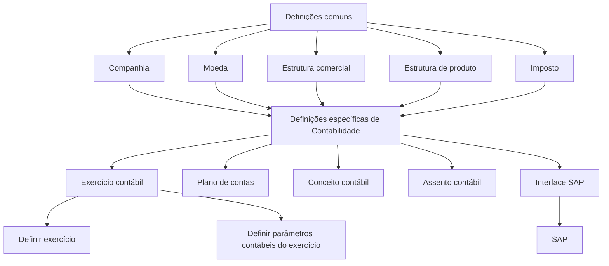
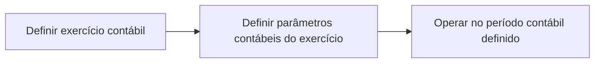

# Definição de Exercício Contábil e Documentação do Módulo de Contabilidade

## 1. Metadados do Documento
- **Arquivo de Origem:** Não identificado no conteúdo fornecido
- **Tipo de Documento:** Manual Operacional / Documentação Funcional em construção
- **Domínio / Sistema:** Contabilidade — Reef.core
- **Público-Alvo:** Desenvolvedores, Arquitetos, Operação e Analistas Funcionais
- **Data/Versão Identificada:** Não identificada

---

## 2. Resumo Executivo & Contexto de Negócio

O conteúdo descreve a definição de um **exercício contábil**, entendido como o período temporal no qual serão realizadas as operações contábeis de uma companhia. A configuração do exercício determina datas de abertura e encerramento, uma chave identificadora e condições operacionais relacionadas ao fechamento, à abertura definitiva e à habilitação do período.

A definição de exercício contábil é apresentada como uma etapa da configuração do módulo de Contabilidade. O processo indicado possui duas ações: **definir o exercício contábil** e **definir os parâmetros contábeis do exercício**. O texto, contudo, detalha propriedades do exercício, mas não apresenta os parâmetros contábeis específicos que devem ser definidos.

No contexto do Reef.core, a configuração da Contabilidade depende de definições comuns que não pertencem exclusivamente ao módulo contábil: companhia, moeda, estrutura comercial, estrutura de produto e imposto. Após essas definições, são configurados elementos específicos do módulo, incluindo exercício contábil, plano de contas, conceito contábil, assento contábil e interface SAP.

O documento também define a organização da documentação de Contabilidade em três categorias: **Definição**, **Operação** e **Modelo de Dados**. Essas categorias cobrem, respectivamente, os conceitos necessários para configurar o módulo, as operações funcionais suportadas e a documentação das tabelas e movimentações de elementos de dados.

---

## 3. Arquitetura, Componentes & Tecnologias Envolvidas

### Componentes e conceitos identificados

| Componente / Conceito | Papel descrito no conteúdo |
| :--- | :--- |
| Reef.core | Sistema citado como responsável por realizar diferentes operações da companhia. |
| Companhia | Entidade para a qual o exercício contábil é definido; seu código é uma propriedade do exercício. |
| Moeda | Definição das divisas com as quais serão criadas as apólices e outros elementos. |
| Estrutura comercial | Definição da organização territorial da companhia. |
| Estrutura de produto | Definição de como serão organizados os ramos comercializados. |
| Imposto | Definição dos tipos de obrigações tributárias, suas características e formas de cálculo. |
| Exercício contábil | Período temporal para realização de operações contábeis. |
| Plano de contas | Definição das contas utilizadas pela companhia no exercício contábil e dos parâmetros correspondentes a cada conta. |
| Conceito contábil | Identificador que agrupa lançamentos contábeis para consulta posterior. |
| Assento contábil | Definição dos tipos e características dos lançamentos contábeis utilizados pela companhia. |
| Interface SAP | Definição das informações enviadas ao SAP e da relação de dados entre os dois sistemas. |
| SAP | Sistema externo destinatário das informações definidas na interface SAP. |

### Fluxo de definição do módulo de Contabilidade



### Processo de definição do exercício contábil



> **Nota de Análise:** O conteúdo indica a etapa “definir parâmetros contábeis do exercício”, mas não detalha quais parâmetros são configurados, seus tipos, valores permitidos ou efeitos funcionais.

---

## 4. Regras de Negócio, Especificações Funcionais & Processos

### 4.1 Objetivo do exercício contábil

O exercício contábil deve definir o período de tempo no qual serão realizadas as operações contábeis. O exercício também contém condições que determinam a forma de trabalho sobre esse período.

### 4.2 Processo de definição

O processo apresentado possui as seguintes etapas:

1. **Definir exercício contábil.**
2. **Definir parâmetros contábeis do exercício.**

A documentação detalha a primeira etapa por meio das propriedades do exercício contábil.

### 4.3 Regras para identificação do exercício

- O atributo **Exercício** é a chave que identifica o exercício contábil.
- Quando o exercício coincide com o ano natural, é usual utilizar os dígitos do ano como chave.
- A codificação não é restrita ao ano natural; outra codificação pode ser utilizada.
- Caso existam vários exercícios dentro de um mesmo ano natural, a chave pode diferenciar os períodos adicionando um identificador ao ano.

Exemplos apresentados:

- Exercício único coincidente com o ano: `2023`.
- Primeiro exercício de um ano com dois exercícios: `20231`.
- Segundo exercício de um ano com dois exercícios: `20232`.

### 4.4 Regras para datas de abertura e fechamento

- A **Data de abertura** indica a data de início do exercício contábil.
- A **Data de fechamento** indica a data de término do exercício contábil.
- O exercício pode coincidir com um ano natural.
- O exercício pode abranger dois anos naturais.
- Um mesmo ano natural pode conter mais de um exercício contábil.

Cenários exemplificados:

1. **Exercício anual**
   - Exercício: `2023`
   - Data de abertura: `01/01/2023`
   - Data de fechamento: `31/12/2023`

2. **Exercício entre dois anos naturais**
   - Exercício: `2223`
   - Data de abertura: `01/07/2022`
   - Data de fechamento: `30/06/2023`

3. **Dois exercícios no mesmo ano natural**
   - Primeiro exercício:
     - Exercício: `20231`
     - Data de abertura: `01/01/2023`
     - Data de fechamento: `30/06/2023`
   - Segundo exercício:
     - Exercício: `20232`
     - Data de abertura: `01/07/2023`
     - Data de fechamento: `31/12/2023`

### 4.5 Regras de fechamento

- O atributo **Cierre** informa se o exercício contábil está fechado.
- Quando o exercício está fechado, não podem ser realizadas novas operações nesse exercício.
- O processo de fechamento pode ser executado várias vezes.
- O exercício é considerado fechado definitivamente quando o atributo **Cierre** assim o indicar.

### 4.6 Regras de abertura definitiva

- O atributo **Apertura definitiva** informa se o exercício está aberto definitivamente.
- O assento de abertura pode ser executado várias vezes.
- A abertura é definitiva quando o atributo **Apertura definitiva** indicar essa condição.

### 4.7 Regras de habilitação

- O atributo **Inhabilitado** informa se o exercício está habilitado para utilização.
- Um exercício inabilitado não pode ser utilizado.
- Um exercício inabilitado não pode ser utilizado nem mesmo para consulta.
- Um exercício inabilitado deve ser tratado como se não existisse.

### 4.8 Dependências de configuração do módulo

As definições comuns necessárias para a definição do módulo de Contabilidade são:

1. Companhia.
2. Moeda.
3. Estrutura comercial.
4. Estrutura de produto.
5. Imposto.

As definições específicas do módulo de Contabilidade são:

1. Exercício contábil.
2. Plano de contas.
3. Conceito contábil.
4. Assento contábil.
5. Interface SAP.

### 4.9 Organização da documentação de Contabilidade

| Seção documental | Escopo definido |
| :--- | :--- |
| Definição | Documentos que detalham os conceitos a serem definidos e a ordem necessária para obter a definição que permite operar um módulo funcional. |
| Operação | Documentos relacionados às operações funcionais suportadas pelo módulo. |
| Modelo de dados | Documentação orientada às tabelas da aplicação e à movimentação detalhada de elementos como tabelas, linhas e colunas em função das operações funcionais. |

---

## 5. Tabelas de Parâmetros, Ambientes e Estruturas de Dados

### 5.1 Propriedades do exercício contábil

| Item / Parâmetro | Descrição / Função | Tipo / Valores / Formato | Ambiente / Observações |
| :--- | :--- | :--- | :--- |
| Companhia | Contém o código da companhia para a qual o exercício contábil está sendo definido. | Código de companhia; formato não detalhado. | Propriedade obrigatória descrita para a definição do exercício. |
| Exercício | Chave de identificação do exercício contábil. | Codificação livre; exemplos: `2023`, `20231`, `20232`, `2223`. | Usualmente utiliza os dígitos do ano quando coincide com o ano natural. |
| Data de abertura | Indica a data de início do exercício contábil. | Data; exemplos no formato `DD/MM/AAAA`. | Exemplo anual: `01/01/2023`. |
| Data de fechamento | Indica a data de término do exercício contábil. | Data; exemplos no formato `DD/MM/AAAA`. | Exemplo anual: `31/12/2023`. |
| Cierre | Indica se o exercício está fechado. | Estado lógico; valores exatos não especificados. | Impede novas operações no exercício quando indica fechamento. O fechamento pode ser executado várias vezes. |
| Apertura definitiva | Indica se a abertura do exercício é definitiva. | Estado lógico; valores exatos não especificados. | O assento de abertura pode ser executado várias vezes antes de a abertura ser definitiva. |
| Inhabilitado | Indica se o exercício está habilitado para trabalho. | Estado lógico; valores exatos não especificados. | Quando inabilitado, não pode ser usado nem consultado; é tratado como inexistente. |

### 5.2 Exemplos de períodos contábeis

| Cenário | Exercício | Data de abertura | Data de fechamento | Observações |
| :--- | :--- | :--- | :--- | :--- |
| Exercício único no ano natural | `2023` | `01/01/2023` | `31/12/2023` | O exercício coincide com o ano natural. |
| Exercício que abrange dois anos naturais | `2223` | `01/07/2022` | `30/06/2023` | O exercício inicia em 2022 e termina em 2023. |
| Primeiro exercício no ano natural | `20231` | `01/01/2023` | `30/06/2023` | Primeiro de dois exercícios durante 2023. |
| Segundo exercício no ano natural | `20232` | `01/07/2023` | `31/12/2023` | Segundo de dois exercícios durante 2023. |

### 5.3 Elementos comuns necessários para Contabilidade

| Item / Parâmetro | Descrição / Função | Tipo / Valores / Formato | Ambiente / Observações |
| :--- | :--- | :--- | :--- |
| Companhia | Define a entidade ou entidades com as quais serão criadas as apólices e os demais elementos. | Definição organizacional. | Elemento comum necessário ao módulo de Contabilidade. |
| Moeda | Define as divisas com as quais Reef.core realizará as diferentes operações da companhia. | Definição de divisas. | Elemento comum necessário ao módulo de Contabilidade. |
| Estrutura comercial | Define como será estabelecida a organização territorial da companhia. | Definição organizacional. | Elemento comum necessário ao módulo de Contabilidade. |
| Estrutura de produto | Define como estarão organizados os ramos comercializados. | Definição de produto. | Elemento comum necessário ao módulo de Contabilidade. |
| Imposto | Define tipos de obrigações tributárias, características e formas de cálculo. | Definição tributária. | Elemento comum necessário ao módulo de Contabilidade. |

### 5.4 Elementos específicos de Contabilidade

| Item / Parâmetro | Descrição / Função | Tipo / Valores / Formato | Ambiente / Observações |
| :--- | :--- | :--- | :--- |
| Exercício contábil | Define o período no qual serão realizadas as operações contábeis. | Período contábil. | Após cada fechamento de exercício, deve ser definido um novo exercício. |
| Plano de contas | Define as contas usadas pela companhia no exercício e os parâmetros de cada conta. | Estrutura de contas. | Relacionado ao exercício contábil. |
| Conceito contábil | Define o identificador que agrupa os lançamentos contábeis para consulta posterior. | Identificador. | Permite agrupamento de apontamentos contábeis. |
| Assento contábil | Define tipos e características dos lançamentos contábeis utilizados pela companhia. | Definição de lançamentos. | Elemento específico do módulo. |
| Interface SAP | Define as informações enviadas ao SAP e a relação dos dados entre os dois sistemas. | Interface de integração. | O documento não detalha formatos, protocolos ou campos de integração. |

---

## 6. Bateria de Perguntas & Respostas para RAG (FAQ Sintético)

### P1: Qual é o objetivo da definição de exercício contábil?
**R:** O objetivo é definir o período de tempo no qual serão realizadas as operações contábeis. O exercício também estabelece condições para a forma de trabalho sobre esse período, incluindo fechamento, abertura definitiva e habilitação.

### P2: Quais são as etapas do processo de definição do exercício contábil?
**R:** O processo apresentado possui duas etapas: definir o exercício contábil e definir os parâmetros contábeis do exercício. O conteúdo fornecido detalha as propriedades do exercício, mas não especifica os parâmetros contábeis dessa segunda etapa.

### P3: Como o exercício contábil é identificado?
**R:** O atributo **Exercício** é a chave identificadora do exercício contábil. Quando o período coincide com o ano natural, normalmente são usados os dígitos do ano, como `2023`. Quando existem dois exercícios no mesmo ano, os exemplos fornecidos são `20231` e `20232`.

### P4: Um exercício contábil pode abranger dois anos naturais?
**R:** Sim. O conteúdo apresenta o exemplo do exercício `2223`, com data de abertura em `01/07/2022` e data de fechamento em `30/06/2023`. Portanto, o exercício não precisa coincidir com o ano natural.

### P5: O que acontece quando um exercício contábil está fechado?
**R:** Quando o atributo **Cierre** indica que o exercício está fechado, não podem ser realizadas mais operações nesse exercício. O processo de fechamento pode ser executado várias vezes e o fechamento definitivo ocorre quando o atributo indica essa condição.

### P6: O que significa “Apertura definitiva” no exercício contábil?
**R:** **Apertura definitiva** indica que o exercício está aberto definitivamente. O assento de abertura pode ser executado várias vezes até que esse atributo indique que a abertura passou a ser definitiva.

### P7: Um exercício inabilitado pode ser consultado?
**R:** Não. Um exercício marcado como **Inhabilitado** não pode ser usado nem mesmo para consulta. O documento determina que um exercício inabilitado deve ser tratado como se não existisse.

### P8: Quais definições comuns são necessárias antes da configuração de Contabilidade?
**R:** As definições comuns listadas são Companhia, Moeda, Estrutura Comercial, Estrutura de Produto e Imposto. Embora não pertençam exclusivamente ao módulo de Contabilidade, são necessárias para sua definição.

### P9: Quais elementos pertencem especificamente ao módulo de Contabilidade?
**R:** Os elementos específicos são Exercício Contábil, Plano de Contas, Conceito Contábil, Assento Contábil e Interface SAP.

### P10: O que é definido no plano de contas?
**R:** O plano de contas define as contas utilizadas pela companhia dentro do exercício contábil e os parâmetros correspondentes a cada conta.

### P11: Qual é a finalidade do conceito contábil?
**R:** O conceito contábil define o identificador que agrupa os apontamentos ou lançamentos contábeis para consulta posterior.

### P12: O que a interface SAP deve definir?
**R:** A interface SAP deve definir as informações que serão levadas ao SAP e a relação entre os dados dos dois sistemas. O documento não apresenta detalhes sobre métodos de integração, formatos de mensagem ou campos trocados.

### P13: O que deve ocorrer após cada fechamento de exercício?
**R:** Após cada fechamento de exercício, deve ser definido um novo exercício contábil.

### P14: Como a documentação de Contabilidade é organizada?
**R:** A documentação é organizada em Definição, Operação e Modelo de Dados. Definição trata dos conceitos e da ordem de configuração; Operação trata das operações funcionais; e Modelo de Dados trata das tabelas e do movimento de tabelas, linhas e colunas conforme as operações funcionais.

---

## 7. Glossário de Termos, Siglas & Conceitos-Chave

- **Apertura definitiva:** Atributo que indica que a abertura do exercício contábil é definitiva.
- **Assento contábil:** Tipos e características dos lançamentos contábeis com os quais a companhia trabalha.
- **Cierre:** Atributo que indica se um exercício contábil está fechado para novas operações.
- **Companhia:** Entidade para a qual o exercício contábil é definido; seu código é uma propriedade do exercício.
- **Conceito contábil:** Identificador que agrupa apontamentos contábeis para consulta posterior.
- **Estrutura comercial:** Definição da organização territorial da companhia.
- **Estrutura de produto:** Definição da organização dos ramos comercializados.
- **Exercício contábil:** Período temporal durante o qual são realizadas operações contábeis.
- **Imposto:** Definição das obrigações tributárias, características e formas de cálculo.
- **Inhabilitado:** Atributo que torna o exercício indisponível para operação e consulta.
- **Interface SAP:** Definição das informações enviadas ao SAP e da relação dos dados entre os sistemas.
- **Modelo de dados:** Documentação orientada às tabelas da aplicação, incluindo movimentação de tabelas, linhas e colunas.
- **Moeda:** Definição das divisas usadas pelo Reef.core nas operações da companhia.
- **Plano de contas:** Conjunto de contas usadas pela companhia no exercício contábil, incluindo parâmetros por conta.
- **Reef.core:** Sistema mencionado como responsável por executar diferentes operações da companhia.
- **SAP:** Sistema destinatário das informações configuradas por meio da Interface SAP.

---

## 8. Notas Críticas, Riscos & Limitações

- O documento contém a indicação **“EN CONSTRUCCIÓN”**, sinalizando conteúdo em construção.
- Não há nome de arquivo, autor, data, versão, ambiente, URLs, servidores, portas ou informações de implantação identificáveis no texto fornecido.
- A etapa de definição de parâmetros contábeis do exercício é citada, porém seus parâmetros não são detalhados.
- O conteúdo não informa validações entre datas, por exemplo, se a data de fechamento deve ser posterior à data de abertura.
- O documento não especifica os valores possíveis dos atributos **Cierre**, **Apertura definitiva** e **Inhabilitado**, embora descreva seus efeitos funcionais.
- A Interface SAP é citada sem detalhamento de protocolos, contratos, campos, formatos de dados, mecanismos de transporte ou tratamento de erros.
- Não são apresentados métodos HTTP, APIs, tabelas físicas, colunas, chaves de banco de dados ou contratos JSON.
- Não há detalhamento operacional do processo de criação de apólices, apesar de o texto relacionar Companhia e Moeda à criação desses elementos.
- O vínculo para **“DEFINICION de compañía”** é mencionado, mas seu conteúdo não foi fornecido.

---

## 9. Conteúdo Bruto Estruturado (Referência Fiel)

```text
EN CONSTRUCCIÓN
DEFINICIÓN de ejercicio contable
Objetivo
Definir el periodo de tiempo en el que se realizarán las operaciones contables y las condiciones que determinarán la forma de trabajar sobre este período.
Proceso a seguir
DEFINIR ejercicio DEFINIR parámetros contable del ejercicio
(1) (2)
1. DEFINIR ejercicio contable
1. DEFINIR parámetros del ejercicio

DEFINICIÓN de Ejercicio contable
Objetivo
El objetivo es definir el periodo de tiempo en el que se realizarán las operaciones contables.
Propiedades
Compañía
Este atributo contiene el código de la compañía para la que se está definiendo el ejercicio contable.
Ejercicio
Este atributo será la clave con la que se identifica el ejercicio contable.
Normalmente, si el ejercicio coincide con el año natural, se suelen utilizar como clave los dígitos del año, pero puede utilizarse cualquier otra codificación.
Ejemplo
Si hay un único ejercicio y coincide con el año
Ejercicio: 2023
Si hay más de un ejercicio en el mismo año
Ejercicio: 20231 (para el primer ejercicio)
Ejercicio: 20232 (para el segundo ejercicio)
Fecha de apertura
Este atributo indica la fecha en la que inicia el ejercicio contable.
Ejemplo
Si el ejercicio se inicia el primer día del año
Fecha de apertura: 01/01/2023
Fecha de cierre
Este atributo indica la fecha en la que finaliza el ejercicio contable.
Ejemplo
Si el ejercicio coincide con el año natural
Ejercicio: 2023

Fecha de apertura: 01/01/2023
Fecha de cierre: 31/12/2023
Si el ejercicio está entre dos años naturales
Ejercicio: 2223
Fecha de apertura: 01/07/2022
Fecha de cierre: 30/06/2023
Si hay más de un ejercicio en el mismo año natural a. Primer ejercicio
Ejercicio: 20231
Fecha de apertura: 01/01/2023
Fecha de cierre: 30/06/2023 b. Segundo ejercicio
Ejercicio: 20232
Fecha de apertura: 01/07/2023
Fecha de cierre: 31/12/2023
Cierre
Este atributo indica si el ejercicio contable está cerrado, es decir, no pueden realizarse más operaciones en este ejercicio.
El proceso de cierre puede ejecutarse varias veces, considerando que el ejercicio está cerrado definitivamente cuando este atributo así lo indica.
Apertura definitiva
Este atributo indica si el ejercicio está abierto definitivamente.
El asiento de apertura se puede ejecutar varias veces hasta que en este atributo se indique que la apertura es definitiva.
Inhabilitado
Este atributo indica si el ejercicio está habilitado o no, para poder trabajar.
Un ejercicio inhabilitado no se puede utilizar, ni siquiera en consulta, es como si no existiera.
Vínculos
DEFINICION de compañía
Preguntas frecuentes

EN CONSTRUCCIÓN
DEFINICIÓN DE CONTABILIDAD
Elementos que intervienen en la definición y orden en el que se debe realizar.
COMÚN
En este nivel se encuentran definiciones que no pertenecen exclusivamente al módulo de contabilidad, pero son necesarias para poder realizar la definición de dicho módulo
COMPAÑÍA MONEDA ESTRUCTURA COMERCIAL
Definición de la entidad o entidades con Definición de las divisas con las que Definición de como se va a establecer la las que se van a crear las pólizas y por Reef.core va a realizar las distintas organización territorial de la compañía consiguiente el resto de elementos operaciones de la compañía
ESTRUCTURA PRODUCTO IMPUESTO
Definición de como estarán organizados Definir los tipos de obligaciones tributarias los ramos que se comercializan que se deben tener en cuenta, así como sus características y formas de cálculo
CONTABILIDAD
Definiciones específicas del módulo de Contabilidad
EJERCICIO CONTABLE PLAN DE CUENTAS CONCEPTO CONTABLE
Se define el periodo de tiempo en el que Definición de las cuentas utilizadas por la Se define el identificador que agrupa los se realizarán las operaciones contables. compañía dentro del ejercicio contable y apuntes contables para su posterior consulta

Después de cada cierre de ejercicio se los parámetros correspondientes a cada debe definir el nuevo ejercicio cuenta
ASIENTO CONTABLE INTERFAZ SAP
Definición de los tipos y características de Definición de la información que se llevará los asientos contables con los que a SAP así como la relación de los datos de trabajará la compañía ambos sistemas

DOCUMENTACIÓN - CONTABILIDAD
En este apartado se aborda todo aquello relacionado con la funcionalidad del sistema. La información se encuentra dividida en los apartados siguientes:
Definición
Operación
Modelo de datos
DEFINICIÓN
Documentos que detallan aquellos conceptos que se han de definir y el orden que se ha de seguir para conseguir la definición necesaria con lo que poder operar un módulo funcional.
OPERACIÓN
Documentos relacionados con las operaciones funcionales que el módulo soporta.
MODELO DE DATOS
Documentación orientada hacia las tablas de la aplicación. Adicionalmente, se describe con detalle el movimiento de distintos elementos como tablas, filas y columnas atendiendo a las operaciones funcionales.
```
