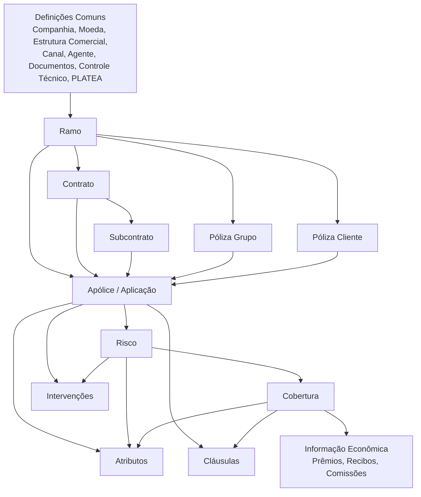
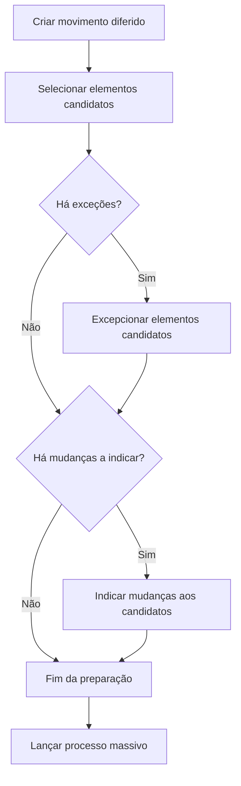

# Reef.core — Definições de Emissão, Ramo, Coberturas e Processos Massivos

## 1. Metadados do Documento
- **Arquivo de Origem:** Não identificado — texto bruto fornecido pelo usuário.
- **Tipo de Documento:** Manual Operacional e Especificação Funcional/Técnica.
- **Domínio / Sistema:** Reef.core; emissão e administração de seguros MAPFRE.
- **Público-Alvo:** Desenvolvedores, Arquitetos, Operação, Analistas Funcionais e Negócio.
- **Data/Versão Identificada:** Não identificada.

---

## 2. Resumo Executivo & Contexto de Negócio

O documento descreve o modelo funcional de configuração e operação do módulo de emissão do **Reef.core**, abrangendo produtos de seguros de automóvel, vida, transportes, saúde e ramos gerais. O núcleo do modelo é o **ramo**, cuja definição governa a emissão, alteração, renovação, cancelamento, tarifação, intervenções, coberturas, cláusulas e controles técnicos das apólices.

A configuração é hierárquica. Uma definição padrão de ramo pode ser alterada por **contrato** e, em nível mais específico, por **subcontrato**. Essa estrutura permite oferecer condições diferenciadas para clientes, grupos empresariais ou colaboradores sem alterar a definição geral do ramo.

O documento também detalha elementos centrais de uma apólice: apólice grupo, apólice cliente, numeração, atributos, intervenções, coberturas, limites, intervalos, coasseguro, acessórios e cláusulas. Cada elemento possui regras de vigência, habilitação, obrigatoriedade, cálculo, validação e utilização durante a emissão ou em suplementos.

Em âmbito operacional, o Reef.core permite executar movimentos em linha ou de modo diferido por meio de **processos massivos**. O processo massivo define a operação, seleciona candidatos, permite exceções, registra alterações e executa operações como renovação, anulação por falta de pagamento, alteração, regularização de vida e suspensão de aportação pactuada.

> **Nota de Análise:** diversas seções do material estão explicitamente marcadas como **“EN CONSTRUCCIÓN”**. Nesses casos, o documento cita o objeto funcional, mas não fornece detalhamento completo de regras, telas, contratos técnicos ou exemplos.

---

## 3. Arquitetura, Componentes & Tecnologias Envolvidas

### Componentes e entidades funcionais

| Componente / Entidade | Papel no Reef.core |
| :--- | :--- |
| Ramo | Define características gerais do produto/seguro e governa emissão, riscos e coberturas. |
| Contrato | Altera seletivamente definições de negócio de um ramo. |
| Subcontrato | Altera definições aplicáveis à combinação de ramo e contrato. |
| Póliza grupo | Agrupa apólices independentes sob uma chave comum. |
| Póliza cliente | Agrupa apólices de um cliente, família ou grupo empresarial. |
| Cobertura | Define proteção securitária, capital, prima, franquia, comportamento e cálculo. |
| Atributo | Campo configurável para registrar informações requeridas pela apólice, risco, cobertura ou ocorrência. |
| Intervenção | Figura de negócio que associa terceiros à apólice ou ao risco, como tomador, pagador ou beneficiário. |
| Coaseguro | Distribui participação de prêmio e sinistros entre seguradoras. |
| Processo massivo | Executa operações diferidas sobre múltiplas apólices, aplicações ou riscos. |
| Controle técnico | Validações que podem reter, autorizar ou rejeitar operações. |
| PLATEA | Aplicação/ativo citado para integração e contexto operacional. |
| RE21 | Módulo de resseguro para o qual atributos podem ser exportados. |
| Oracle | Tecnologia citada para tabelas de ajuda de atributos. |

### Hierarquia de definição e emissão



### Fluxo de criação de processo massivo



### Modelo técnico citado para processos massivos

| Tabela | Descrição | Uso indicado |
| :--- | :--- | :--- |
| `G2000510` | Processos massivos | Registro do processo diferido, data, ordem, tipo de movimento, filtros, exceções e processo personalizado. |
| `A2000500` | Pólizas a tratar nos processos massivos | Registro das apólices candidatas ao processo. |
| `A2000510` | Riscos afetados para a formação de um processo massivo | Registro dos riscos afetados pelas apólices candidatas. |
| `A2000030` | Dados fixos da apólice | Atualizado no suplemento de alteração de plano de pagamento. |
| `A2000032` | Mudanças de plano de pagamento da apólice | Controla plano novo, anterior, vigência e identificador do movimento. |
| `A2000033` | Motivos de suplemento da apólice | Registra motivos do suplemento. |
| `A2000161` | Conceitos econômicos de recibo da apólice | Registra anulação e constituição dos conceitos econômicos por mudança de plano. |
| `A2990700` | Recibos/cotas da apólice | Registra recibos/cotas anulados e constituídos. |
| `A2990701` | Comissões por cota da apólice | Registra comissões associadas às cotas. |
| `A2990702` | Comissões externas por cota da apólice | Registra comissões externas associadas às cotas. |
| `A5020301` | Movimentos ou histórico de cotas | Mantém histórico das cotas afetadas. |

---

## 4. Regras de Negócio, Especificações Funcionais & Processos

### 4.1 Póliza grupo

Uma póliza grupo agrupa apólices independentes, inclusive de ramos distintos. A identificação da apólice grupo aceita qualquer valor e não possui estrutura obrigatória de numeração.

Cada apólice associada possui uma **sequência**, análoga ao número de risco dentro de uma apólice. A propriedade de sequência da póliza grupo informa o último identificador associado ao grupo.

Uma póliza grupo inabilitada não pode ser atribuída a novas apólices. O documento determina que a criação do número de póliza grupo é manual; não existe geração automática.

### 4.2 Contrato e subcontrato

O contrato permite alterar determinados conceitos de negócio de um ramo já definido. A alteração não se aplica obrigatoriamente a todos os conceitos do ramo.

No exemplo apresentado, o ramo Automóvel possui a cobertura **Acidentes** inabilitada sem contrato. No contrato `SANTANDER`, a cobertura Acidentes está habilitada, demonstrando que o contrato pode substituir a condição padrão do ramo.

O subcontrato aplica alterações ainda mais específicas sobre um ramo e um contrato previamente definidos. O exemplo apresenta o subcontrato `ASEGURADO CON SEGURO DE VIDA`, associado ao contrato `SANTANDER`, como mecanismo para alterar o comportamento de coberturas.

> **Nota de Análise:** há contradições textuais nos exemplos de cobertura de contrato/subcontrato, incluindo descrições que não correspondem aos valores “SI/NO” exibidos nas tabelas. A interpretação operacional deve ser validada com a configuração efetiva do Reef.core.

### 4.3 Numeração de apólice e orçamento

- A numeração de apólice e a numeração de orçamento não podem ter formatos coincidentes.
- Toda numeração deve conter um componente sequencial.
- A composição deve assegurar disponibilidade de números ao longo do tempo.
- O ano pode ser usado na composição para segmentar sequências por período.
- O formato de apólice é definido por setor e se aplica a todos os ramos do setor.
- Após existir apólice emitida para o setor, o formato não pode ser alterado.
- O número máximo de posições da apólice é **13**.
- O componente consecutivo `N` é obrigatório.
- Além de `N`, deve existir ao menos um elemento adicional no formato.
- O tamanho de `N` é o número de posições remanescentes até atingir 13.

### 4.4 Coberturas

A cobertura é a obrigação principal da seguradora em um contrato de seguro, limitada à soma segurada, para assumir consequências econômicas de um sinistro.

A definição de cobertura abrange, entre outras, as seguintes dimensões:

- Identificador, nome e tipo de cobertura.
- Ramo, modalidade de vida, ordem e vigência.
- Origem e moeda da soma segurada.
- Relação com cobertura principal.
- Obrigatoriedade de contratação.
- Necessidade de acessórios.
- Cessão ao resseguro.
- Inspeção de risco.
- Cálculo de comissão de nova produção e carteira.
- Impressão obrigatória.
- Ramo contábil.
- Franquia.
- Moeda e método de cálculo de tarifa.
- Revalorização, comportamento em suplementos e validações.

Uma cobertura relacionada depende da contratação da cobertura principal. Se a principal não for contratada ou for excluída, a cobertura relacionada não pode permanecer contratada. A cobertura relacionada pode assumir um percentual da soma segurada da cobertura principal.

Quando uma cobertura reduz a soma segurada por ocorrência de sinistro, o Reef.core gera uma ordem para suplemento de redução de soma segurada por sinistro. Para restaurar o capital, o cliente deve executar suplemento de restituição de soma segurada.

### 4.5 Tipos de cobertura

| Código | Tipo | Visível | Soma segurada | Prima | Regra principal |
| :--- | :--- | :---: | :---: | :---: | :--- |
| `1` | Informativa | Sim | Não | Não | Atua como separador visual na contratação. |
| `2` | Básica adicional | Sim | Sim | Não | Oferece soma segurada a outras coberturas. |
| `3` | Real dependente | Sim | Sim | Sim | Obtém soma segurada de outra cobertura. |
| `4` | Real independente | Sim | Sim | Sim | Possui soma segurada e prima próprias. |
| `5` | Serviços | Sim | Não | Sim | Exibe contratação como incluída ou excluída. |
| `6` | Capital ilimitado | Sim | Não | Sim | Exibe literal “ILIMITADA”. |
| `7` | Sinistros | Não | Não | Não | Associa expedientes que não exigem cobertura contratada. |
| `8` | Fictícia risco | Não | Não | Não | Associa informação econômica ao risco. |
| `9` | Fictícia póliza | Não | Não | Não | Associa informação econômica à apólice. |
| `R` | Fictícia ajuste risco | Não | Não | Não | É a última cobertura calculada no nível de risco. |

### 4.6 Atributos

Os atributos registram dados não disponibilizados nativamente pelo Reef.core ou dados que influenciam a tarifa. Devem ser agrupados em formulários de apólice, risco, cobertura ou ocorrência.

Regras relevantes:

- Campos podem ser de tipo caráter, número ou data.
- O formato padrão de data é `ddmmyyyy`; pode ser configurado como `mmddyyyy`.
- Atributos que afetam cálculo devem ser configurados corretamente, pois determinam quando o Reef.core recalcula o risco em suplemento.
- Atributos únicos não podem ter o mesmo valor em outra apólice vigente, exceto quando o valor coincide com o valor padrão.
- Todo atributo que afeta cálculo é sempre solicitado em orçamento.
- Atributos obrigatórios bloqueiam a continuidade do processo até receberem valor.
- Por padrão, o conteúdo é gravado em maiúsculas; a configuração pode permitir minúsculas.
- Validações podem ocorrer somente com conteúdo ou mesmo para atributo vazio.
- Atributos podem ser exportados ao módulo RE21.
- Atributos podem participar de formulários de inspeção e de busca de inspeções.

### 4.7 Intervenções

Intervenções representam figuras de negócio que agrupam terceiros em uma apólice ou risco. As intervenções não são de criação livre; novas intervenções devem ser solicitadas para inclusão no sistema.

A intervenção de tomador é obrigatória no ramo. Outras intervenções podem ser configuradas como opcionais, mesmo quando presentes no ramo.

Intervenções exclusivas de nível de apólice:

- Tomador.
- Tomadores alternos.
- Pagador.

A configuração permite definir número mínimo e máximo de terceiros, principal, terceiro de cálculo, percentuais, cessão de direitos, informações de financiamento, terceiro de referência, lógica de solicitação, validação global e carga massiva em batch.

### 4.8 Coasseguro

O quadro de coasseguro reúne seguradoras que participam de um acordo de coasseguro e suas condições de participação.

- No **coasseguro cedido**, todas as companhias participantes devem ser incluídas, inclusive MAPFRE, e a soma dos percentuais deve ser igual a 100.
- No **coasseguro aceito**, apenas a companhia líder é identificada e o percentual representa a participação da MAPFRE, devendo ser menor que 100.
- Podem ser definidos até quatro percentuais de comissão para repartir comissão do agente, despesas, acréscimos ou outros importes acordados.

### 4.9 Processos massivos

Um processo massivo executa de forma diferida uma operação sobre uma ou mais apólices, aplicações ou riscos. O fluxo envolve:

1. Criar o movimento diferido.
2. Selecionar candidatos.
3. Excepcionar candidatos, quando necessário.
4. Indicar mudanças a aplicar.
5. Lançar o processo massivo.

Formas de seleção:

- Movimentos predefinidos pelo Reef.core.
- Ferramenta de seleção de apólices/riscos.
- Processo personalizado da instalação.

Filtros predefinidos citados:

- Anulação por falta de pagamento.
- Recibos impagados.
- Regularização de vida.
- Renovação.
- Suspensão de aportação pactada.

### 4.10 Alteração de plano de pagamento

A operação permite refinanciar e/ou alterar o plano de pagamento de uma apólice ou aplicação. Não permite modificar outras informações, exceto o gestor de cobrança.

Somente recibos em situação **emitido pendente** podem participar. Recibos selecionados são cancelados e novos recibos são gerados conforme a definição do novo plano de pagamento. É permitido selecionar parte, totalidade ou nenhum dos demais recibos pendentes.

O processo gera conjuntos de registros para anular cotas do plano anterior e constituir cotas do novo plano em tabelas econômicas, de recibos, comissões e histórico.

---

## 5. Tabelas de Parâmetros, Ambientes e Estruturas de Dados

### 5.1 Componentes de numeração de apólice

| Item / Parâmetro | Descrição / Função | Tipo / Valores / Formato | Ambiente / Observações |
| :--- | :--- | :--- | :--- |
| Companhia | Identifica companhia no número da apólice. | Comprimento `2`; abreviatura `C`. | Elemento opcional de formato. |
| Setor | Identifica setor. | Comprimento `2`; abreviatura `S`. | Formato definido por setor. |
| Ramo | Identifica ramo. | Comprimento `3`; abreviatura `R`. | Exemplo: `RRRAANNNNNNNN`. |
| Estrutura comercial nível 1 | Primeiro nível comercial. | Comprimento `2`; abreviatura `1`. | Opcional. |
| Estrutura comercial nível 2 | Segundo nível comercial. | Comprimento `3`; abreviatura `2`. | Exemplo: `RRRAA222NNNNN`. |
| Estrutura comercial nível 3 | Terceiro nível comercial. | Comprimento `3`; abreviatura `3`. | Opcional. |
| Ano | Ano de geração. | Comprimento `2`; abreviatura `A`. | Pode segmentar sequências anuais. |
| Número consecutivo | Garante unicidade. | Comprimento variável; abreviatura `N`. | Obrigatório; completa 13 posições. |

### 5.2 Tipos de gestor de cobrança

| Tipo | Descrição | Condição de utilização | Chave associada |
| :---: | :--- | :--- | :--- |
| `1` | Agente | Sempre. | Chave do agente principal. |
| `2` | Banco | Quando o pagador possui conta bancária. | Entidade e escritório bancário. |
| `3` | Cobrador | Quando a figura estiver definida na companhia. | Chave do cobrador. |
| `4` | Débito automático em conta | Quando o pagador possui conta bancária. | Entidade e escritório bancário. |
| `5` | Gestor direto | Sempre. | Escritório, nível 3. |
| `6` | Gestor piloto coasseguro | Quando a apólice é de coasseguro aceito. | Seguradora líder. |
| `7` | Escritório comercial | Sempre. | Escritório, nível 3. |
| `8` | Débito com cartão de crédito | Quando o pagador possui cartão de crédito. | Entidade e escritório bancário. |
| `10` | Gestor de impagados | Nunca; exclusivo do processo de impagados. | Não se aplica. |

### 5.3 Campos centrais de `G2000510 — PROCESOS MASIVOS`

| Item / Parâmetro | Descrição / Função | Tipo / Valores / Formato | Ambiente / Observações |
| :--- | :--- | :--- | :--- |
| `COD_CIA` | Companhia. | Obrigatório. | Identifica a entidade do processo. |
| `FEC_TRATAMIENTO` | Data de tratamento. | Obrigatório. | Data de execução do processo massivo. |
| `NUM_ORDEN` | Número do processo massivo. | Obrigatório. | Diferencia processos na mesma data; `0` é reservado. |
| `TIP_MVTO_BATCH` | Tipo de movimento massivo. | Obrigatório. | Define a operação diferida. |
| `TXT_ALIAS` | Nome ou descrição do processo. | Opcional. | Exemplo citado: “Renovación de agosto”. |
| `TIP_SITU_FILTRO` | Situação do movimento. | Obrigatório. | Criação: `1-Sin filtrar`; filtragem: `2-Filtrando`, `3-Ya filtrado`; exceção: `4-Excepcionando`, `5-Ya excepcionado`. |
| `NOM_PRG_EXCEPCION` | Procedimento de exceção. | Opcional. | Lógica para excluir elementos. |
| `MCA_RECALCULA_FECHA` | Marca de recálculo de data. | Obrigatório. | Indica uso de data já calculada ou recálculo. |
| `TIP_FECHA_BASE` | Tipo de data-base. | Opcional. | Base do recálculo. |
| `COD_USR` | Usuário que atualizou a linha. | Obrigatório. | Auditoria. |
| `FEC_ACTU` | Data de atualização. | Opcional. | Auditoria. |
| `TXT_MCA_PROCESO_ESTANDAR` | Indica processo padrão. | Opcional. | Diferencia processo padrão/guiado. |
| `IDN_PROCESO_PERSONALIZADO` | Identificador do processo personalizado. | Opcional. | Processo massivo personalizado. |

### 5.4 Operadores da ferramenta de filtragem

| Categoria | Valores permitidos |
| :--- | :--- |
| Operador de relação | `AND`, `OR` |
| Operador de comparação | `=`, `!=`, `<`, `<=`, `>`, `>=`, `BETWEEN`, `NOT BETWEEN`, `LIKE`, `NOT LIKE`, `EXISTS`, `NOT EXISTS` |
| Exemplo documentado | Tabela `a2000030`, relação `AND`, coluna `cod_ramo`, comparação `=`, condição `400`. |

### 5.5 Dados da alteração de plano de pagamento

| Campo / Elemento | Regra documentada |
| :--- | :--- |
| Apólice | Deve existir e não estar anulada. |
| Aplicação | Obrigatória quando o ramo possui tratamento de transportes e a alteração não afeta a apólice marco. |
| Suplemento | Deve ser definido como suplemento de alteração de plano de pagamento. |
| Efeito | Data-base para gerar novos recibos conforme o novo plano. |
| Plano de pagamento | Pode ser diferente ou igual ao existente; permite refinanciamento. |
| Importe da primeira cota | Aplicável somente se o plano permitir; aceita importe ou percentual com `%`. |
| Gestor de cobrança | Pode ser alterado; novos recibos recebem o novo gestor. |
| Conta de cobrança | Obrigatória para tipos de gestor `2`, `4` e `8`. |
| Recibos selecionados | Devem estar em situação “emitido pendente”. |

---

## 6. Bateria de Perguntas & Respostas para RAG (FAQ Sintético)

### P1: Como uma póliza grupo é criada e numerada no Reef.core?
**R:** A póliza grupo agrupa apólices independentes sob uma chave comum. O documento determina que o número de póliza grupo aceita qualquer valor, não segue estrutura predefinida e sua criação é manual. O Reef.core não cria automaticamente esse número.

### P2: Qual é a diferença entre contrato e subcontrato?
**R:** O contrato altera determinados conceitos de negócio da definição padrão de um ramo. O subcontrato atua sobre um ramo e um contrato previamente definidos, permitindo uma especialização adicional das regras para condições ainda mais específicas.

### P3: Quais regras devem ser observadas para o formato do número de apólice?
**R:** O formato é definido por setor, aplica-se aos ramos desse setor, tem tamanho máximo de 13 posições e não pode ser modificado após a emissão de alguma apólice do setor. O componente consecutivo `N` é obrigatório e deve preencher as posições restantes até 13. O formato deve possuir ao menos um componente adicional além de `N`.

### P4: Quando uma cobertura relacionada pode ser contratada?
**R:** Uma cobertura relacionada depende de uma cobertura principal. Se a principal não estiver contratada, a relacionada não poderá ser contratada. Se a principal for excluída, as coberturas relacionadas também serão excluídas.

### P5: O que acontece quando uma cobertura reduz sua soma segurada após um sinistro?
**R:** Quando a característica de redução por sinistro está ativa e um sinistro afeta a cobertura, o Reef.core gera uma ordem para criar um suplemento de redução de soma segurada por sinistro. Para recompor o capital, o cliente deve realizar um suplemento de restituição de soma segurada.

### P6: Qual tipo de cobertura deve ser utilizado apenas como separador visual na tela de contratação?
**R:** O tipo **Informativa**, código `1`, atua como separador visual. Não possui soma segurada nem prima e não é considerado cobertura securitária propriamente dita.

### P7: Como funciona a seleção de apólices em processos massivos?
**R:** As apólices podem ser selecionadas por movimentos predefinidos pelo Reef.core, pela ferramenta de filtragem de apólices/riscos ou por lógica personalizada da instalação. A ferramenta de filtragem utiliza tabelas e colunas previamente definidas, relações `AND`/`OR`, operadores de comparação e condições.

### P8: Quais apólices são selecionadas automaticamente para renovação massiva?
**R:** O filtro de renovação extrai apólices vencidas, não temporais e ainda não renovadas na data definida para o processo massivo.

### P9: Qual é a condição para uma apólice entrar no processo de anulação por falta de pagamento?
**R:** A apólice deve possuir pelo menos um recibo não cobrado até a data do processo massivo somada ao período de graça configurado e não pode estar no processo de impagados. Quando houver vários recibos não cobrados, o processo considera o mais antigo.

### P10: Quais recibos podem participar de uma alteração de plano de pagamento?
**R:** Apenas recibos em situação **emitido pendente** podem participar. Os recibos selecionados são cancelados e seus valores são redistribuídos em novos recibos conforme o novo plano de pagamento.

### P11: Quais são as regras percentuais do coasseguro cedido e aceito?
**R:** No coasseguro cedido, todas as seguradoras participantes, inclusive MAPFRE, devem ser incluídas e a soma dos percentuais deve ser 100. No coasseguro aceito, identifica-se a seguradora líder e o percentual representa a participação da MAPFRE, devendo ser inferior a 100.

### P12: Quando um atributo é automaticamente solicitado em um orçamento?
**R:** Todo atributo declarado como participante do cálculo é sempre solicitado em um orçamento. Para atributos que não afetam cálculo, a solicitação em orçamento depende da configuração específica.

---

## 7. Glossário de Termos, Siglas & Conceitos-Chave

- **Apólice:** Contrato de seguro que cobre um ou mais riscos.
- **Aplicação:** Apólice de duração temporal baseada em uma apólice marco, citada para o negócio de transportes.
- **Atributo:** Campo configurável para registrar ou calcular informação de apólice, risco, cobertura ou ocorrência.
- **Cobertura:** Obrigação da seguradora de assumir consequências econômicas de um sinistro, dentro do limite contratado.
- **Contrato:** Conjunto de condições que altera a definição padrão de um ramo.
- **Controle técnico:** Processo de validação que pode reter, autorizar ou rejeitar uma operação.
- **Franquia:** Parte pela qual o segurado responde, conforme configuração da cobertura.
- **MAPFRE:** Companhia mencionada como participante de operações, coasseguro, emissão e cobrança.
- **PLATEA:** Aplicação ou ativo citado para integração e configuração de contexto.
- **Prerreovação / Prerenovação:** Renovação virtual que calcula condições e custo para o novo período, sem efetivar o movimento real.
- **RE21:** Módulo de resseguro que pode receber atributos exportados pelo Reef.core.
- **Reef.core:** Sistema central descrito para definição, emissão, alteração e gestão de seguros.
- **Ramo:** Tipo de seguro e unidade principal de configuração do produto.
- **Risco:** Elemento segurado dentro de uma apólice; uma apólice pode ter um ou vários riscos.
- **Subcontrato:** Especialização de regras aplicável a um contrato e ramo.
- **Suplemento:** Movimento que altera informações de uma apólice ou aplicação.
- **Tomador:** Terceiro responsável pela contratação da apólice.
- **Unit Linked:** Modalidade de vida citada no processo de regularização de vida.

---

## 8. Notas Críticas, Riscos & Limitações

- O material contém múltiplas seções marcadas como **“EN CONSTRUCCIÓN”**, sem detalhamento suficiente para implementação integral.
- Não foram identificadas versões de sistema, endpoints, contratos HTTP, eventos de integração, credenciais, URLs, portas ou mecanismos de autenticação.
- O documento cita integração com PLATEA e RE21, mas não detalha interfaces técnicas, protocolos ou modelos de mensagens.
- Há exemplos de contrato e subcontrato com inconsistências entre valores tabelados e explicações narrativas; recomenda-se validação funcional antes de parametrização.
- A ferramenta de filtragem massiva depende do conhecimento do modelo de dados de emissão, e o documento alerta que a ordem de tabelas e colunas selecionadas influencia diretamente o desempenho.
- As tabelas técnicas descrevem campos e efeitos, mas não fornecem chaves primárias, chaves estrangeiras, índices, tipos físicos Oracle ou procedimentos armazenados.
- O conteúdo menciona lógica de negócio em vários pontos, mas não descreve a linguagem, assinatura, ciclo de execução ou tratamento de erros dessas lógicas.

---

## 9. Conteúdo Bruto Estruturado (Referência Fiel)

```text
DEFINICIÓN de póliza grupo
Objetivo
Reef.core permite agrupar varias pólizas (...) bajo una clave.
A esta clave se la denomina póliza grupo.

Propiedades
Nº de póliza grupo
Identificador de la póliza grupo. Acepta cualquier valor.
Descripción
Nombre que se va a asociar a la póliza grupo.
Descripción corta
Nombre corto que se asociará a la póliza grupo.
Obliga a existencia de contrato
Indica si el uso de esta póliza grupo obligará al uso de un contrato (...)
Secuencia
Toda póliza que es asociada a una póliza grupo dispone de un valor (...)
Inhabilitada
Especifica si la póliza grupo se encuentra operativa o no en el sistema.

Preguntas frecuentes
¿Existe una estructura del número de póliza grupo (...)?
No, la numeración de una póliza grupo no atiende a una estructura.
¿Se puede crear un número de póliza grupo de forma automática?
No, la creación (...) se realiza de forma manual.

DEFINICIÓN de contrato
Objetivo
Bajo este concepto se permite realizar alteraciones de un ramo ya definido.
Estas alteraciones afectan a un número de conceptos de negocio (no a todos).

DEFINICIÓN de subcontrato
Objetivo
Bajo este concepto se permite realizar alteraciones de un ramo y un contrato ya definido.

DEFINICIÓN de numeración
Las numeraciones no están prefijadas en Reef.core.
Las numeraciones de póliza y presupuesto no pueden coincidir en el formato.
Siempre una numeración debe contener un número de secuencia.

DEFINICIÓN del formato del número de póliza
El tamaño máximo del número de póliza es de 13 posiciones.
El elemento número consecutivo (N) es obligatorio.
Al menos debe existir un elemento adicional al número consecutivo.

ELEMENTO | LONGITUD | ABREVIATURA
Compañía | 2 | C
Sector | 2 | S
Ramo | 3 | R
Estructura comercial - primer nivel | 2 | 1
Estructura comercial - segundo nivel | 3 | 2
Estructura comercial - tercer nivel | 3 | 3
Año | 2 | A
Nº consecutivo | ¿? | N

DEFINICIÓN de cobertura
La obligación principal del asegurador en un contrato de seguro (...)
hasta el límite de la suma asegurada (...)
de las consecuencias económicas que se deriven de un siniestro.

DEFINICIÓN de tipo de cobertura
TIPO | DESCRIPCIÓN
1 | INFORMATIVA
2 | BÁSICA ADICIONAL
3 | REAL DEPENDIENTE
4 | REAL INDEPENDIENTE
5 | SERVICIOS
6 | CAPITAL ILIMITADO
7 | SINIESTROS
8 | FICTICIA RIESGO
9 | FICTICIA PÓLIZA
R | FICTICIA AJUSTE RIESGO

RESUMEN
TIPO | VISIBLE | CON SUMA ASEGURADA | CON PRIMA
INFORMATIVA | SI | NO | NO
BÁSICA ADICIONAL | SI | SI | NO
REAL DEPENDIENTE | SI | SI | SI
REAL INDEPENDIENTE | SI | SI | SI
SERVICIOS | SI | NO | SI
CAPITAL ILIMITADO | SI | NO | SI
SINIESTROS | NO | NO | NO
FICTICIA RIESGO | NO | NO | NO
FICTICIA PÓLIZA | NO | NO | NO
FICTICIA AJUSTE RIESGO | NO | NO | NO

DEFINICIÓN de Intervenciones
Las intervenciones han sido establecidas previamente y no son de libre creación.
Salvo la intervención de tomador de la póliza no son obligatorias de incluir en un ramo.

INTERVENCIÓN EXCLUSIVA DE NIVEL PÓLIZA
TOMADOR
TOMADORES ALTERNOS
PAGADOR

DEFINICIÓN de cuadro de coaseguro
En coaseguro cedido (...) la suma de los porcentajes de participación (...)
debe ser 100.
En coaseguro aceptado este porcentaje debe ser menor a 100
y equivale a la participación de MAPFRE.

CREAR proceso masivo en Emisión
1. CREAR movimiento diferido
2. SELECCIONAR elementos candidatos
3. EXCEPCIONAR elementos candidatos
4. INDICAR cambios a realizar sobre los elementos candidatos

G2000510 — PROCESOS MASIVOS
COD_CIA — COMPAÑIA
FEC_TRATAMIENTO — FECHA EN LA QUE SE REALIZA EL PROCESO MASIVO
NUM_ORDEN — NUMERO DEL PROCESO MASIVO
TIP_MVTO_BATCH — TIPO DEL PROCESO MASIVO
TXT_ALIAS — NOMBRE QUE SE QUIERA DAR AL PROCESO
TIP_SITU_FILTRO — SITUACION DEL MOVIMIENTO
NOM_PRG_EXCEPCION — PROCEDIMIENTO DE EXCEPCION
MCA_RECALCULA_FECHA — MARCA DE RECALCULO
TIP_FECHA_BASE — FECHA BASE DEL RECÁLCULO
COD_USR — USUARIO QUE ACTUALIZO LA FILA
FEC_ACTU — FECHA DE ACTUALIZACION DE LA FILA
IDN_PROCESO_PERSONALIZADO — IDENTIFICADOR DEL PROCESO MASIVO

FILTRAR póliza en emisión - Renovación
Extraer de la cartera aquellas pólizas vencidas,
no temporales y no renovadas a la fecha definida
en el proceso masivo.

FILTRAR póliza en emisión - Anulación por falta de pago
Extraer de la cartera aquellas pólizas que dispongan de al menos
un recibo que no haya sido cobrado a la fecha definida
en el proceso masivo más el periodo de gracia establecido.

ALTERAR Póliza plan pago
Permite la refinanciación y/o cambio en el plan de pago de una póliza o aplicación.
Para que un recibo pueda intervenir, debe encontrarse en situación emitido pendiente.

Tipo de gestor
1 AGENTE
2 BANCO
3 COBRADOR
4 DÉBITO AUTOMÁTICO EN CUENTA
5 GESTOR DIRECTO
6 GESTOR PILOTO COASEGURO
7 OFICINA COMERCIAL
8 DÉBITO CON TARJETA DE CRÉDITO
10 GESTOR DE IMPAGOS
```

> **Nota de integridade:** o texto bruto completo fornecido contém extensas repetições das matrizes de definição por ramo — Automóvel, Vida, Transportes, Saúde e Ramos Gerais — além de várias seções “EN CONSTRUCCIÓN”. Esta seção preserva os trechos estruturais e tabelas mais relevantes para recuperação; o conteúdo integral original deve permanecer retido como anexo imutável da fonte primária.
