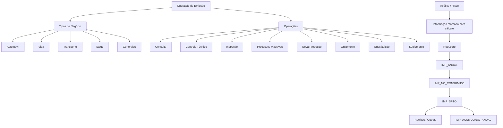
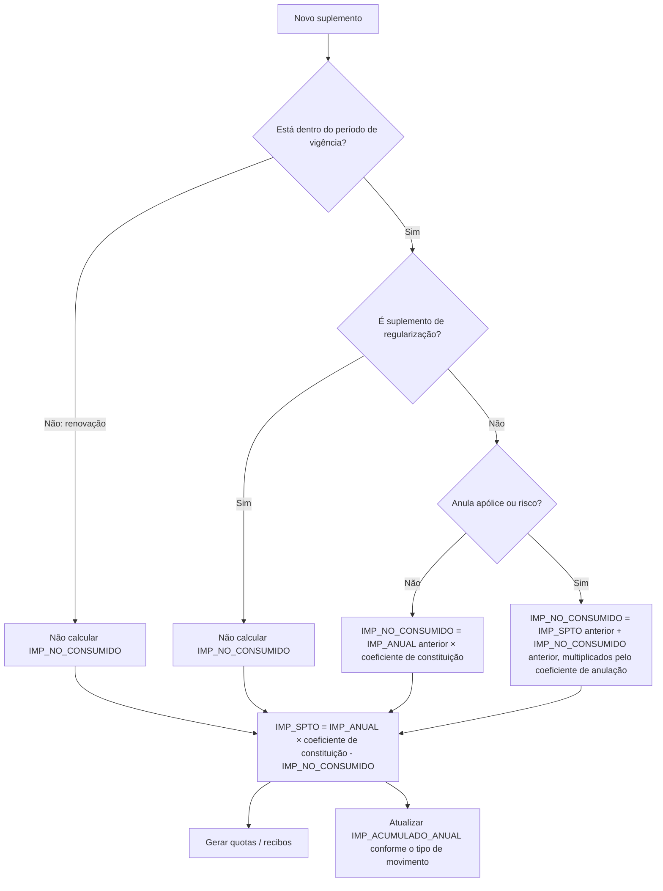

# Documentação de Operação de Emissão e Conceitos Econômicos de Apólices

## 1. Metadados do Documento
- **Arquivo de Origem:** `Não identificado — conteúdo bruto fornecido na solicitação`
- **Tipo de Documento:** Especificação Técnica e Documentação Operacional
- **Domínio / Sistema:** Operação de Emissão, Reef.core e produtos de seguros MAPFRE
- **Público-Alvo:** Operação, Negócio, Analistas Funcionais, Desenvolvedores e Arquitetos
- **Data/Versão Identificada:** Não identificada

---

## 2. Resumo Executivo & Contexto de Negócio

O conteúdo reúne documentação de operação de emissão para os domínios de Transportes, Saúde e Generales, além de uma visão transversal dos tipos de negócio Automóvil, Vida, Transporte, Salud e Generales. As operações documentadas incluem consulta, controle técnico, inspeção, processos massivos, nova produção, orçamento, substituição e suplemento, dependendo do domínio de negócio.

A parte técnica mais detalhada descreve o comportamento dos conceitos de desagregação econômica de uma apólice ou risco no modelo de dados `A2100170 — CONCEPTOS DE DESGLOSE ECONÓMICO DE LA PÓLIZA`. O foco recai sobre as colunas `IMP_ANUAL`, `IMP_NO_CONSUMIDO`, `IMP_SPTO` e `IMP_ACUMULADO_ANUAL`, incluindo condições de cálculo, sinais financeiros, exceções, fórmulas e exemplos de suplementos durante o período de vigência.

O documento estabelece que `IMP_ANUAL` é a base anual do conceito econômico e pode depender de informações de apólice e/ou risco marcadas como relevantes para cálculo tarifário. O Reef.core utiliza essa marcação para identificar alterações em suplementos e aplicar a parametrização correspondente. O exemplo fornecido trata de um recargo por idade do segurado.

Também é apresentada uma comparação funcional entre apólice multi-risco e apólice grupo. A comparação cobre número de apólices, vencimento, moeda, câmbio, plano de pagamento, recibos, resseguro, cosseguro, tomador, terceiros, atributos, gestor de cobrança, textos anexos, cláusulas, comissões, importes que afetam a apólice, riscos, ordem de comunicação de modificações e suplementos que afetam a informação da apólice.

O conteúdo não apresenta URLs, servidores, portas, contratos HTTP, APIs, tecnologias de infraestrutura, topologia de microsserviços ou detalhes de implementação do Reef.core. A documentação é predominantemente funcional, operacional e orientada a regras de cálculo econômico e modelagem de apólices.

---

## 3. Arquitetura, Componentes & Tecnologias Envolvidas

### Componentes e entidades identificados

| Componente / Entidade | Papel descrito no conteúdo | Observações |
| :--- | :--- | :--- |
| Operação de Emissão | Contexto operacional central da documentação | Abrange diferentes tipos de negócio e operações. |
| Reef.core | Sistema responsável por reconhecer mudanças em suplementos e aplicar parametrizações de cálculo | Não há descrição de APIs, arquitetura interna ou tecnologias utilizadas. |
| MAPFRE | Entidade que recebe ou devolve importes econômicos | O sinal dos importes define recebimento positivo ou devolução negativa. |
| `A2100170` | Tabela de conceitos de desagregação econômica da apólice | Armazena chaves da apólice, risco, cobertura, conceito econômico e importes. |
| Apólice | Entidade de seguro utilizada nos cálculos e comparações | Pode ser multi-risco ou grupo. |
| Risco | Entidade segurada vinculada à apólice | Pode influenciar o cálculo de `IMP_ANUAL`. |
| Suplemento | Movimento que modifica a situação econômica da apólice ou risco | Pode anular ou manter vigente a apólice/risco. |
| Renovação | Movimento que cria novo período de vigência | Não calcula `IMP_NO_CONSUMIDO`. |
| Regularização | Tipo de suplemento excepcional | Não calcula `IMP_NO_CONSUMIDO`. |
| Recibo | Resultado posterior associado ao valor de `IMP_SPTO` | `IMP_SPTO` é utilizado para criar quotas/recibos. |



> **Nota de Análise:** O conteúdo cita o Reef.core como responsável por reconhecer alterações em dados que afetam a tarifa durante suplementos. O documento não detalha os métodos, contratos JSON, integrações, tecnologias ou interfaces expostas pelo sistema.

---

## 4. Regras de Negócio, Especificações Funcionais & Processos

### 4.1 Tipos de negócio e operações de emissão

Os tipos de negócio identificados são:

- Automóvil
- Vida
- Transporte
- Salud
- Generales

As operações mencionadas no catálogo documental incluem:

- Consulta
- Controle técnico
- Inspeção
- Processos massivos
- Nova produção
- Orçamento
- Substituição
- Suplemento
- Alteração de apólice e plano de pagamento
- Alteração de aplicação e plano de pagamento
- Criação de processo massivo de emissão
- Emissão de apólice

### 4.2 Conceito econômico de recargo por idade

O exemplo econômico considera um conceito de desagregação que aplica um recargo conforme a idade do segurado.

| Idade | Recargo |
| :--- | ---: |
| 15 | 150,00 |
| 16 | 160,00 |
| 17 | 170,00 |
| 18 | 180,00 |
| 19 | 365,00 |
| >= 20 | 0,00 |

### 4.3 Regras de `IMP_ANUAL`

`IMP_ANUAL` é o importe correspondente a um ano de cobertura. Esse importe é a base utilizada para calcular as demais colunas econômicas abordadas no documento.

Regras identificadas:

1. `IMP_ANUAL` é expresso com sinal.
   - Valor positivo: importe que a MAPFRE receberá.
   - Valor negativo: importe que a MAPFRE devolverá.
2. `IMP_ANUAL` não intervém diretamente na geração de quotas.
3. O valor depende de informação do risco e/ou da apólice declarada como relevante para cálculo.
4. No exemplo, a informação que afeta o cálculo é a idade do segurado.
5. Qualquer informação da apólice e/ou do risco pode interferir no cálculo, desde que esteja registrada e marcada como afetando a tarifa.
6. Essa marcação é necessária para que o Reef.core reconheça, em um suplemento, se houve alteração e atue conforme a parametrização definida.

Exemplo de `IMP_ANUAL` para segurado de 15 anos:

| Cenário | Efeito | Vencimento | Dias de vigência | `IMP_ANUAL` |
| :--- | :--- | :--- | ---: | ---: |
| 1 | 01 Enero 2023 | 01 Enero 2024 | 365 | 150,00 |
| 2 | 01 Enero 2023 | 01 Octubre 2023 | 273 | 150,00 |
| 3 | 01 Enero 2023 | 01 Julio 2023 | 181 | 150,00 |
| 4 | 01 Enero 2023 | 01 Abril 2023 | 90 | 150,00 |

### 4.4 Regras de `IMP_NO_CONSUMIDO`

`IMP_NO_CONSUMIDO` representa conceitualmente o importe que deve ser devolvido ou cobrado, dependendo do sinal, quando um conceito de desagregação deixa de ser aplicável.

O cálculo equivale a uma simulação, pelo Reef.core, da anulação do conceito de desagregação. A apuração ocorre quando as datas do novo suplemento do risco afetado já são conhecidas e antes de qualquer modificação ser aplicada ao risco.

Regras de aplicabilidade:

1. O cálculo ocorre sempre que um suplemento é realizado dentro do período de vigência.
2. Uma renovação não está dentro do período vigente da apólice; ela cria um novo período de vigência.
3. Em suplemento de renovação, `IMP_NO_CONSUMIDO` não é calculado porque não há componente consumido nem não consumido.
4. Suplementos de regularização são exceção e também não calculam `IMP_NO_CONSUMIDO`.
5. Existem dois cenários:
   - o suplemento anula a apólice ou o risco;
   - o suplemento mantém a apólice ou o risco vigente.
6. Os cálculos são realizados sobre o último suplemento não anulado.
7. Um suplemento anulado não existe para o Reef.core.

#### Suplemento que não anula apólice ou risco

Para suplementos que não anulam a apólice ou o risco, o cálculo depende de:

- `IMP_ANUAL` do movimento anterior não anulado;
- coeficiente de constituição.

Fórmula:

```text
IMP_NO_CONSUMIDO := IMP_ANUAL * coeficiente_de_constitución
```

Exemplo documentado, usando 365 dias por ano:

| Suplemento | Efeito | Vencimento | Dias de vigência | Coeficiente de constituição | Importe anual do suplemento anterior | `IMP_NO_CONSUMIDO` |
| :--- | :--- | :--- | ---: | ---: | ---: | ---: |
| 0 | 01 Enero 2023 | 01 Enero 2024 | 365 | 1,000000000 | 0,00 | 0,00 |
| 1 | 01 Febrero 2023 | 01 Enero 2024 | 334 | 0,915068493 | 1.000,00 | 915,07 |
| 2 | 01 Marzo 2023 | 01 Enero 2024 | 306 | 0,838356164 | 1.100,00 | 922,19 |
| 4 | 01 Mayo 2023 | 01 Enero 2024 | 245 | 0,671232877 | 700,00 | 469,86 |

#### Suplemento que anula apólice ou risco

Para suplementos que anulam a apólice ou o risco, o cálculo depende de:

- `IMP_NO_CONSUMIDO` do suplemento anterior não anulado;
- `IMP_SPTO` do suplemento anterior não anulado;
- coeficiente de anulação.

Fórmula:

```text
IMP_NO_CONSUMIDO := (IMP_SPTO + IMP_NO_CONSUMIDO) * coeficiente_de_anulación
```

O documento apresenta um exemplo de suplemento de anulação como o último movimento de uma apólice anteriormente modificada. O extrato bruto possui valores de algumas colunas truncados na extração; por esse motivo, não é possível reconstruir integralmente todas as células numéricas sem inferência.

### 4.5 Regras de `IMP_SPTO`

`IMP_SPTO` é o valor que a MAPFRE deve receber ou devolver, expresso com sinal. É o valor utilizado posteriormente para criar quotas.

O cálculo de `IMP_SPTO` depende de:

- `IMP_ANUAL`;
- coeficiente de constituição;
- `IMP_NO_CONSUMIDO` da situação anterior, quando o movimento ocorre dentro do período de vigência.

Quando um suplemento é realizado e o conceito de desagregação existia anteriormente, deve-se considerar o valor ainda não consumido desde a data do novo suplemento até o vencimento. Esse valor deve ser devolvido considerando a alteração da situação econômica.

Fórmula:

```text
IMP_SPTO := IMP_ANUAL * coeficiente_de_constitución - IMP_NO_CONSUMIDO
```

Exemplo documentado:

| Suplemento | Efeito | Vencimento | Dias de vigência | Coeficiente de constituição | `IMP_NO_CONSUMIDO` | `IMP_SPTO` | `IMP_ANUAL` |
| :--- | :--- | :--- | ---: | ---: | ---: | ---: | ---: |
| 0 | 01 Enero 2023 | 01 Enero 2024 | 365 | 1,000000000 | 0,00 | 1000,00 | 1.000,00 |
| 1 | 01 Febrero 2023 | 01 Enero 2024 | 334 | 0,915068493 | 915,07 | 91,51 | 1.100,00 |
| 2 | 01 Marzo 2023 | 01 Enero 2024 | 306 | 0,838356164 | 922,19 | -335,34 | 700,00 |
| 4 | 01 Mayo 2023 | 01 Enero 2024 | 245 | 0,671232877 | 469,86 | 536,99 | 1.500,00 |

### 4.6 Regras de `IMP_ACUMULADO_ANUAL`

`IMP_ACUMULADO_ANUAL` contém o importe que será obtido se todos os recibos gerados no período de vigência forem cobrados. O valor corresponde à soma de `IMP_SPTO` de todos os suplementos gerados no período de vigência.

Regras:

1. Na renovação da apólice, a coluna é inicializada com o valor de `IMP_SPTO`.
2. Para determinados movimentos, o valor é igual ao `IMP_SPTO` do próprio movimento.
3. Para os demais movimentos, o valor é a soma de `IMP_SPTO` atual e `IMP_ACUMULADO_ANUAL` do suplemento anterior.

| Movimento | Fórmula |
| :--- | :--- |
| Presupuesto | `IMP_ACUMULADO_ANUAL = IMP_SPTO` |
| Declaración | `IMP_ACUMULADO_ANUAL = IMP_SPTO` |
| Nueva póliza | `IMP_ACUMULADO_ANUAL = IMP_SPTO` |
| Nueva aplicación | `IMP_ACUMULADO_ANUAL = IMP_SPTO` |
| Renovación | `IMP_ACUMULADO_ANUAL = IMP_SPTO` |
| Resto | `IMP_ACUMULADO_ANUAL = IMP_SPTO (suplemento actual) + IMP_ACUMULADO_ANUAL (suplemento anterior)` |

Exemplo documentado:

| Suplemento | Tipo | `IMP_SPTO` | `IMP_ACUMULADO_ANUAL` |
| :--- | :--- | ---: | ---: |
| 0 | XX | 170,00 | 170,00 |
| 1 | AD | 127,50 | 297,50 |
| 2 | AP | -85,00 | 212,50 |
| 3 | AD | 42,52 | 250,02 |
| 4 | RF | 170,00 | 170,00 |
| 5 | AP | -10,00 | 160,00 |

### 4.7 Fluxo econômico de suplemento



### 4.8 Comparação: apólice multi-risco versus apólice grupo

| Critério | Apólice multi-risco | Apólice grupo |
| :--- | :--- | :--- |
| Número de apólice | Um número de apólice | Múltiplos números de apólice e um número de apólice grupo |
| Vencimento | Vencimento unificado de todos os riscos; o vencimento é o da apólice | Apólices independentes podem possuir vencimentos distintos, embora possam ser unificados por definição |
| Moeda | Uma apólice, uma moeda | Múltiplas apólices podem permitir múltiplas moedas se não houver controle adequado |
| Tipo de câmbio | Uma apólice, um tipo de câmbio | Múltiplas apólices, múltiplos tipos de câmbio |
| Plano de pagamento | Uma apólice, um plano de pagamento | Múltiplas apólices podem permitir múltiplos planos de pagamento se não houver controle adequado |
| Recibos | Um recibo por apólice | Um recibo por cada apólice independente que forma a apólice grupo |
| Tipo de resseguro | Uma apólice, um tipo de resseguro | Múltiplas apólices, múltiplos tipos de resseguro |
| Cosseguro | Uma apólice, um tipo de cosseguro | Múltiplas apólices podem possuir múltiplos tipos de cosseguro se não houver controle adequado |
| Tomador | Uma apólice, um tomador | Múltiplas apólices podem possuir múltiplos tomadores se não houver controle adequado |
| Intervenções de cliente | Mesmos terceiros para cada intervenção | Múltiplas apólices podem possuir múltiplos terceiros por intervenção se não houver controle adequado |
| Atributos de apólice | Valores únicos | Múltiplas apólices podem possuir múltiplos valores se não houver controle adequado |
| Gestor de cobrança | Uma apólice, um gestor | Múltiplas apólices podem possuir múltiplos gestores se não houver controle adequado |
| Textos anexos | Uma apólice, um texto | Múltiplas apólices, múltiplos textos |
| Cláusulas | Uma apólice, cláusulas únicas | Múltiplas apólices podem possuir múltiplas cláusulas se não houver controle adequado |
| Comissões | Afetam a apólice segundo a definição | Cada apólice independente pode possuir comissão distinta se não houver controle adequado |
| Importes que afetam somente a apólice | Cálculo é realizado sem problema | Atribuição é complexa, pois o importe deve ser alocado a uma apólice do grupo e essa apólice pode deixar o grupo |
| Riscos | Múltiplos riscos em uma única apólice | Uma apólice independente pode ter um risco; outras podem ter múltiplos riscos se a definição permitir |
| Ordem de comunicação de modificações | Comunicação fora da ordem pode exigir anulação de suplementos; pode ser minimizada com o modelo um risco, uma apólice | A comunicação em ordens distintas pode não afetar o mesmo risco |
| Suplementos sobre dados de apólice | Um suplemento altera plano de pagamento, agente, tomador, atributos, anulação, reabilitação, renovação e outras informações | É necessário executar um suplemento para cada apólice independente pertencente ao grupo |

---

## 5. Tabelas de Parâmetros, Ambientes e Estruturas de Dados

### 5.1 Estrutura da tabela `A2100170`

| Item / Parâmetro | Descrição / Função | Tipo / Valores / Formato | Ambiente / Observações |
| :--- | :--- | :--- | :--- |
| `COD_CIA` | Companhia | Não especificado | Chave de identificação da companhia |
| `NUM_POLIZA` | Apólice | Não especificado | Identificador da apólice |
| `NUM_SPTO` | Número de suplemento | Não especificado | Identificador do suplemento |
| `NUM_APLI` | Número de aplicação | Não especificado | Identificador da aplicação |
| `NUM_SPTO_APLI` | Suplemento da aplicação | Não especificado | Relacionado à aplicação |
| `NUM_RIESGO` | Risco | Não especificado | Identificador do risco |
| `NUM_PERIODO` | Período | Não especificado | Aplicável a apólices multianuais |
| `COD_COB` | Cobertura | Não especificado | Código da cobertura |
| `COD_DESGLOSE` | Conceito de desagregação econômica | Não especificado | Código do conceito econômico de desagregação |
| `COD_ECO` | Conceito econômico de recibo | Não especificado | Código do conceito econômico |
| `NUM_BLOQUE_ESTUDIO` | Número de bloco de estudo | Não se usa | Campo explicitamente indicado como não utilizado |
| `IMP_ACUMULADO_ANUAL` | Importe acumulado anual | Valor monetário com sinal | Soma de `IMP_SPTO` no período de vigência, conforme regras de movimento |
| `IMP_SPTO` | Importe do suplemento | Valor monetário com sinal | Base para criação posterior de quotas |
| `IMP_NO_CONSUMIDO` | Importe não consumido | Valor monetário com sinal | Calculado em suplementos dentro da vigência, salvo exceções |
| `IMP_ANUAL` | Importe anual | Valor monetário com sinal | Base para os demais cálculos |
| `COD_RAMO` | Ramo | Não especificado | Identificador do ramo de seguro |

### 5.2 Parâmetros de cálculo identificados

| Item / Parâmetro | Descrição / Função | Tipo / Valores / Formato | Ambiente / Observações |
| :--- | :--- | :--- | :--- |
| Dias do ano | Base de dias usada nos exemplos | `365` | Utilizado nos exemplos de coeficiente |
| Coeficiente de constituição | Fator aplicado para apurar importes não consumidos e de suplemento | Decimal | Exemplos: `1,000000000`, `0,915068493`, `0,838356164`, `0,671232877` |
| Coeficiente de anulação | Fator aplicado na anulação da apólice ou risco | Decimal | Exemplo: `0,751020408` |
| Idade do segurado | Informação de risco usada no exemplo tarifário | Inteiro | Deve estar registrada e marcada como afetando a tarifa |
| Sinal do importe | Determina recebimento ou devolução pela MAPFRE | Positivo ou negativo | Positivo representa recebimento; negativo representa devolução |

### 5.3 Operações documentadas por domínio

| Domínio / Sistema | Operação / Documento | Descrição / Função | Ambiente / Observações |
| :--- | :--- | :--- | :--- |
| Transportes | Reemplazo | Operação de substituição | Sem detalhamento adicional |
| Transportes | Suplemento | Inclui alterar apólice e plano de pagamento; alterar aplicação e plano de pagamento | Sem detalhamento adicional |
| Salud | Consulta | Operação de consulta | Sem detalhamento adicional |
| Salud | Control técnico | Operação de controle técnico | Sem detalhamento adicional |
| Salud | Inspección | Operação de inspeção | Sem detalhamento adicional |
| Salud | Procesos masivos | Criar processo massivo de emissão | Sem detalhamento adicional |
| Salud | Nueva producción | Emitir apólice | Sem detalhamento adicional |
| Salud | Presupuesto | Operação de orçamento | Sem detalhamento adicional |
| Salud | Reemplazo | Operação de substituição | Sem detalhamento adicional |
| Salud | Suplemento | Alterar apólice e plano de pagamento | Sem detalhamento adicional |
| Generales | Consulta | Operação de consulta | Sem detalhamento adicional |
| Generales | Control técnico | Operação de controle técnico | Sem detalhamento adicional |
| Generales | Inspección | Operação de inspeção | Sem detalhamento adicional |
| Generales | Procesos masivos | Criar processo massivo de emissão | Sem detalhamento adicional |
| Generales | Nueva producción | Emitir apólice | Sem detalhamento adicional |
| Generales | Presupuesto | Operação de orçamento | Sem detalhamento adicional |
| Generales | Reemplazo | Operação de substituição | Sem detalhamento adicional |
| Generales | Suplemento | Alterar apólice e plano de pagamento | Sem detalhamento adicional |

---

## 6. Bateria de Perguntas & Respostas para RAG (FAQ Sintético)

### P1: O que representa a coluna `IMP_ANUAL` na tabela de conceitos econômicos?
**R:** `IMP_ANUAL` é o importe correspondente a um ano de cobertura. É a base de cálculo das demais colunas econômicas abordadas no documento, é expresso com sinal positivo ou negativo e não intervém diretamente na geração de quotas. O sinal positivo representa um importe que a MAPFRE receberá; o sinal negativo representa um importe que a MAPFRE devolverá.

### P2: Quais informações podem afetar o cálculo de `IMP_ANUAL`?
**R:** O cálculo de `IMP_ANUAL` pode ser condicionado por informações do risco e/ou da apólice que tenham sido declaradas como relevantes para cálculo. No exemplo fornecido, a idade do segurado determina o recargo aplicado. A informação deve estar registrada e marcada como afetando a tarifa para que o Reef.core reconheça alterações em suplementos e aplique a parametrização correspondente.

### P3: Quando `IMP_NO_CONSUMIDO` deve ser calculado?
**R:** `IMP_NO_CONSUMIDO` é calculado quando há suplemento dentro do período de vigência da apólice. O cálculo é realizado após serem conhecidas as datas do novo suplemento do risco afetado e antes de qualquer modificação ser aplicada. O objetivo é determinar o importe a devolver ou cobrar se o conceito de desagregação deixar de ser aplicável.

### P4: Em quais situações `IMP_NO_CONSUMIDO` não é calculado?
**R:** `IMP_NO_CONSUMIDO` não é calculado em suplemento de renovação, pois a renovação cria um novo período de vigência e não existem importes consumidos ou não consumidos no período anterior. Suplementos de tipo regularização também são exceção e não calculam essa coluna.

### P5: Como calcular `IMP_NO_CONSUMIDO` quando o suplemento não anula a apólice ou o risco?
**R:** Para suplementos que mantêm a apólice ou o risco vigente, deve-se usar o `IMP_ANUAL` do movimento anterior não anulado e o coeficiente de constituição. A fórmula é: `IMP_NO_CONSUMIDO := IMP_ANUAL × coeficiente_de_constitución`. O cálculo deve considerar o último suplemento não anulado.

### P6: Como calcular `IMP_NO_CONSUMIDO` em um suplemento de anulação?
**R:** Quando o suplemento anula a apólice ou o risco, a fórmula é `IMP_NO_CONSUMIDO := (IMP_SPTO + IMP_NO_CONSUMIDO) × coeficiente_de_anulación`. Devem ser utilizados o `IMP_SPTO` e o `IMP_NO_CONSUMIDO` do último suplemento não anulado, juntamente com o coeficiente de anulação.

### P7: Qual é a fórmula de cálculo de `IMP_SPTO`?
**R:** A fórmula documentada é `IMP_SPTO := IMP_ANUAL × coeficiente_de_constitución - IMP_NO_CONSUMIDO`. `IMP_SPTO` representa o importe que a MAPFRE deve receber ou devolver e é o valor utilizado posteriormente para criar quotas.

### P8: Como `IMP_ACUMULADO_ANUAL` é atualizado?
**R:** Para movimentos de orçamento, declaração, nova apólice, nova aplicação e renovação, `IMP_ACUMULADO_ANUAL` é igual a `IMP_SPTO`. Para os demais movimentos, `IMP_ACUMULADO_ANUAL` é calculado como a soma do `IMP_SPTO` do suplemento atual com o `IMP_ACUMULADO_ANUAL` do suplemento anterior.

### P9: Qual é a principal diferença entre apólice multi-risco e apólice grupo em relação ao número de apólices?
**R:** A apólice multi-risco possui um único número de apólice e pode conter múltiplos riscos. A apólice grupo é composta por múltiplas apólices independentes e possui adicionalmente um número de apólice grupo.

### P10: Por que cálculos que afetam somente a apólice são mais complexos em uma apólice grupo?
**R:** Em uma apólice grupo, as apólices são independentes. Para realizar um cálculo que afete a apólice, mas não os riscos, é necessário atribuir o importe a uma das apólices componentes. Essa atribuição é complexa porque a apólice selecionada pode deixar o grupo, exigindo a transferência do importe para outra apólice do grupo.

### P11: Como os suplementos que afetam informações gerais da apólice diferem entre os dois modelos?
**R:** Em uma apólice multi-risco, um único suplemento pode alterar informações como plano de pagamento, agente, tomador, atributos de apólice, anulação, reabilitação ou renovação. Em uma apólice grupo, essas alterações exigem um suplemento para cada apólice independente que integra o grupo.

### P12: Quais tipos de negócio são explicitamente citados na documentação de emissão?
**R:** A documentação de operação em emissão cita os tipos de negócio Automóvil, Vida, Transporte, Salud e Generales. O conteúdo também apresenta conjuntos documentais específicos para Transportes, Salud e Generales.

---

## 7. Glossário de Termos, Siglas & Conceitos-Chave

- **`A2100170`:** Tabela denominada `CONCEPTOS DE DESGLOSE ECONÓMICO DE LA PÓLIZA`.
- **Apólice grupo:** Conjunto composto por múltiplas apólices independentes e um número de apólice grupo.
- **Apólice multi-risco:** Apólice única que pode reunir múltiplos riscos.
- **Cobertura (`COD_COB`):** Código da cobertura associada ao conceito econômico.
- **Coeficiente de anulação:** Fator utilizado para apurar `IMP_NO_CONSUMIDO` quando o suplemento anula a apólice ou o risco.
- **Coeficiente de constituição:** Fator utilizado no cálculo de `IMP_NO_CONSUMIDO` e `IMP_SPTO`.
- **Conceito de desagregação econômica (`COD_DESGLOSE`):** Conceito econômico detalhado para uma apólice, risco ou cobertura.
- **Conceito econômico de recibo (`COD_ECO`):** Código do conceito econômico de recibo.
- **Cosseguro:** Atributo de seguro tratado como único em apólice multi-risco e potencialmente múltiplo em apólice grupo.
- **`IMP_ACUMULADO_ANUAL`:** Valor acumulado de `IMP_SPTO` no período de vigência, conforme o tipo de movimento.
- **`IMP_ANUAL`:** Importe de um ano de cobertura, usado como base para os demais cálculos econômicos.
- **`IMP_NO_CONSUMIDO`:** Importe não consumido calculado no contexto de suplementos durante a vigência.
- **`IMP_SPTO`:** Importe do suplemento, utilizado posteriormente para criação de quotas.
- **MAPFRE:** Entidade que recebe importes positivos ou devolve importes negativos no contexto descrito.
- **Reef.core:** Sistema citado como responsável por identificar mudanças relevantes para tarifa em suplementos e atuar segundo a parametrização marcada.
- **Regularização:** Tipo de suplemento que não calcula `IMP_NO_CONSUMIDO`.
- **Renovação:** Movimento que cria um novo período de vigência e não calcula `IMP_NO_CONSUMIDO`.
- **Risco:** Elemento segurado associado à apólice, podendo conter informações que afetam o cálculo tarifário.
- **Suplemento:** Movimento que altera a situação de uma apólice ou risco, podendo anular ou manter a vigência.

---

## 8. Notas Críticas, Riscos & Limitações

- O conteúdo bruto é composto por fragmentos documentais e apresenta tabelas parcialmente truncadas, especialmente no exemplo de suplemento de anulação. Não é seguro reconstruir os valores ausentes sem fonte adicional.
- Não foram identificados detalhes de arquitetura técnica do Reef.core, tais como APIs, protocolos, bancos de dados, infraestrutura, ambientes, URLs, portas ou contratos de integração.
- As operações de emissão para Transportes, Salud e Generales são listadas, mas seus fluxos operacionais detalhados não foram apresentados.
- O documento destaca que informações de apólice e risco devem estar registradas e marcadas como afetando a tarifa; a ausência dessa marcação pode impedir que o Reef.core identifique alterações relevantes durante suplementos.
- A comunicação de modificações fora da ordem adequada pode complicar operações em apólices multi-risco e, em alguns casos, exigir anulação de suplementos.
- Apólices grupo apresentam risco de inconsistência operacional caso não sejam controlados atributos que podem divergir entre apólices independentes, como moeda, plano de pagamento, cosseguro, tomador, comissões, terceiros, cláusulas e gestor de cobrança.
- Cálculos que afetam a apólice, mas não os riscos, são explicitamente caracterizados como muito complexos no modelo de apólice grupo.
- **Nota de Análise:** O documento cita o Reef.core, porém não detalha os métodos, contratos de dados ou interfaces técnicas expostas pelo sistema.

---

## 9. Conteúdo Bruto Estruturado (Referência Fiel)

```text
DOCUMENTACIÓN de OPERACIÓN de EMISIÓN (Transportes) -
REEMPLAZO
OPERACIONES

DOCUMENTACIÓN de OPERACIÓN de EMISIÓN (Transportes) -
SUPLEMENTO
OPERACIONES
ALTERAR Póliza plan pago
ALTERAR Aplicación plan pago

DOCUMENTACIÓN de OPERACIÓN de EMISIÓN (Transportes)
Documentación orientada a la operación y tipo de negocio
TIPOS DE OPERACIÓN

DOCUMENTACIÓN de OPERACIÓN de EMISIÓN (Salud) - CONSULTA
OPERACIONES

DOCUMENTACIÓN de OPERACIÓN de EMISIÓN (Salud) - CONTROL
TÉCNICO
OPERACIONES

DOCUMENTACIÓN de OPERACIÓN de EMISIÓN (Salud) - INSPECCIÓN
OPERACIONES

DOCUMENTACIÓN de OPERACIÓN de EMISIÓN (Salud) - PROCESOS
MASIVOS
OPERACIONES
CREAR proceso masivo emisión

DOCUMENTACIÓN de OPERACIÓN de EMISIÓN (Salud) - NUEVA
PRODUCCIÓN
OPERACIONES
EMITIR Póliza

DOCUMENTACIÓN de OPERACIÓN de EMISIÓN (Salud) -
PRESUPUESTO
OPERACIONES

DOCUMENTACIÓN de OPERACIÓN de EMISIÓN (Salud) - REEMPLAZO
OPERACIONES

DOCUMENTACIÓN de OPERACIÓN de EMISIÓN (Salud) -
SUPLEMENTO
OPERACIONES
ALTERAR Póliza plan pago

DOCUMENTACIÓN de OPERACIÓN de EMISIÓN (Salud)
Documentación orientada a la operación y tipo de negocio
TIPOS DE OPERACIÓN

DOCUMENTACIÓN de OPERACIÓN de EMISIÓN (Generales) -
CONSULTA
OPERACIONES

DOCUMENTACIÓN de OPERACIÓN de EMISIÓN (Generales) -
CONTROL TÉCNICO
OPERACIONES

DOCUMENTACIÓN de OPERACIÓN de EMISIÓN (Generales) -
INSPECCIÓN
OPERACIONES

DOCUMENTACIÓN de OPERACIÓN de EMISIÓN (Generales) -
PROCESOS MASIVOS
OPERACIONES
CREAR proceso masivo emisión

DOCUMENTACIÓN de OPERACIÓN de EMISIÓN (Generales) - NUEVA
PRODUCCIÓN
OPERACIONES
EMITIR Póliza

DOCUMENTACIÓN de OPERACIÓN de EMISIÓN (Generales) -
PRESUPUESTO
OPERACIONES

DOCUMENTACIÓN de OPERACIÓN de EMISIÓN (Generales) -
REEMPLAZO
OPERACIONES

DOCUMENTACIÓN de OPERACIÓN de EMISIÓN (Generales) -
SUPLEMENTO
OPERACIONES
ALTERAR Póliza plan pago

DOCUMENTACIÓN de OPERACIÓN de EMISIÓN (Generales)
Imagen GENERALES Documentación orientada a la operación y tipo de negocio
TIPOS DE OPERACIÓN

OPERACIÓN en EMISIÓN
Documentación orientada a la operación y tipo de negocio.
TIPOS DE NEGOCIO
AUTOMÓVIL VIDA TRANSPORTE
SALUD GENERALES

Conceptos de desglose - Información económica
Objetivo
Conocer cual es el contenido y el comportamiento de las columnas que contienen la información económica de una póliza/riesgo (marcadas en negrita).
Modelo de datos involucrado
TABLA DESCRIPCIÓN
A2100170 CONCEPTOS DE DESGLOSE ECONÓMICO DE LA PÓLIZA
COLUMNA COMENTARIOS
COD_CIA COMPAÑÍA
NUM_POLIZA PÓLIZA
NUM_SPTO NUMERO DE SUPLEMENTO
NUM_APLI NUMERO DE APLICACIÓN
NUM_SPTO_APLI SUPLEMENTO DE LA APLICACIÓN
NUM_RIESGO RIESGO
NUM_PERIODO PERIODO (PARA PÓLIZAS MULTIANUALES)
COD_COB COBERTURA
COD_DESGLOSE CONCEPTO DE DESGLOSE ECONÓMICO
COD_ECO CONCEPTO ECONÓMICO DE RECIBO
NUM_BLOQUE_ESTUDIO NO SE USA

COLUMNA COMENTARIOS
IMP_ACUMULADO_ANUAL IMPORTE ACUMULADO ANUAL
IMP_SPTO IMPORTE DEL SUPLEMENTO
IMP_NO_CONSUMIDO IMPORTE NO CONSUMIDO
IMP_ANUAL IMPORTE ANUAL
COD_RAMO RAMO
A continuación y con el fin de entender mejor el sentido de las columnas que ocupan este documento, se establece unas bases para posteriormente realizar ejemplos:
Se supone que existe un concepto de desglose que, dependiendo de la edad del asegurado aplicará un recargo. Para ello se cuenta con la siguiente tabla que determina para cada edad el monto a aplicar:
Recargo por edad
EDAD RECARGO
15 150,00
16 160,00
17 170,00
18 180,00
19 365,00
>= 20 0,00
Columnas
Las columnas tratadas en este documento son:
IMP_ANUAL
IMP_NO_CONSUMIDO
IMP_SPTO
IMP_ACUMULADO_ANUAL
IMP_ANUAL
Importe que corresponde a un año de cobertura. Es el importe base con el que se halla el resto de columnas que intervienen en este documento. Viene expresado con signo (positivo importe que MAPFRE recibirá, negativo importe que MAPFRE devolverá). Este importe no interviene en la generación de cuotas.
Este importe viene condicionado por:
La información del riesgo y/o la información de la póliza que ha debido ser declarada como que afecta al cálculo (en el ejemplo es la edad del asegurado).
Es decir, cualquier información que disponga la póliza y/o riesgo puede intervenir en el modo en el que se halla esta columna. Es importante que la información esté registrada y marcada como que afecta a la tarifa para que Reef.core, en caso de suplemento pueda conocer que hubo o no cambio y así actuar según la parametrización marcada.

Ejemplo
La información por la que viene condicionado el cálculo es:
EDAD DEL ASEGURADO
15
Con esta información, se muestran varios escenarios:
ESCENARIO EFECTO VENCIMIENTO DÍAS DE VIGENCIA IMP_ANUAL
1 01 Enero 2023 01 Enero 2024 365 150,00
2 01 Enero 2023 01 Octubre 2023 273 150,00
3 01 Enero 2023 01 Julio 2023 181 150,00
4 01 Enero 2023 01 Abril 2023 90 150,00
IMP_NO_CONSUMIDO
Conceptualmente es el importe que habría que devolver o cobrar (depende del signo), en caso que el concepto de desglose deje de aplicarse.
Es decir, Reef.core simula la anulación del concepto de desglose.
Este cálculo se realiza en el momento que se conocen las fechas del nuevo suplemento del riesgo afectado y previo a realizar cualquier modificación sobre este.
Efecto Importe
Modificación
Riesgo del no seleccionado riesgo consumido de Fin riesgo establecido hallado
Este importe se calcula siempre que se realiza un suplemento, y el suplemento se encuentra dentro del periodo de vigencia. Por ejemplo, una renovación no se realiza dentro del periodo de vigencia de la póliza, sino que está creando un nuevo periodo de vigencia. Es por lo que en un suplemento de renovación no se halla esta columna, ya que no hay ni consumido, ni sin consumir.
Existe una excepción a la regla anterior y aplica a los suplementos de tipo de regularización, que no calcula esta columna.
Hay dos formas de hallar este importe:
1. El suplemento implica la anulación de la póliza/riesgo
2. El suplemento dejará la póliza o el riesgo vigente
Dependiendo del modo en el que la póliza/riesgo quedará, esta columna viene condicionada por:
Para suplementos que NO anulan la póliza/riesgo:
- El importe anual (columna IMP_ANUAL) del movimiento anterior (no anulado 1)
- El llamado coeficiente de constitución
Se aplica la fórmula siguiente sobre el último suplemento no anulado:
1 imp_no_consumido := IMP_ANUAL * coeficiente_de_constitución
Ejemplo
Para este ejemplo se va a tomar una supuesta póliza que ha sufrido una serie de modificaciones a lo largo del tiempo y el objetivo es hallar el importe no consumido. Hay que recordar que como se ha comentado previamente, este importe se halla nada más conocer las fechas del movimiento:

PARÁMETRO DÍAS AÑO
365
SUPLEMENTO EFECTO VENCIMIENTO DÍAS COEFICIENTE IMPORTE IMPORTE
VIGENCIA DE ANUAL NO
CONSTITUCIÓN SUPLEMENTO CONSUMIDO
ANTERIOR
0 01 Enero 2023 01 Enero 2024 365 1,000000000 0,00 0,00
1 01 Febrero 2023 01 Enero 2024 334 0,915068493 1.000,00 915,07
2 01 Marzo 2023 01 Enero 2024 306 0,838356164 1.100,00 922,19
4 01 Mayo 2023 01 Enero 2024 245 0,671232877 700,00 469,86
Para suplementos que SI anulan la póliza/riesgo:
- El importe no consumido (columna IMP_NO_CONSUMIDO) del suplemento anterior (no anulado 1)
- El importe del suplemento (columna IMP_SPTO) del suplemento anterior (no anulado 1)
- El llamado coeficiente de anulación
Se aplica la fórmula siguiente sobre el último suplemento no anulado:
1 imp_no_consumido := (IMP_SPTO + IMP_NO_CONSUMIDO) * coeficiente_de_anulación
Ejemplo
Para este ejemplo se va a tomar la misma póliza que en el ejemplo anterior y se va a simular un suplemento que anula la póliza. En este caso el suplemento de anulación es el último mostrado en la tabla
PARÁMETRO DÍAS AÑO
365
SUPLEMENTO EFECTO VENCIMIENTO DÍAS COEFICIENTE COEFICIENTE IMPORTE IMPO
DE DE DE NO SUPLEME
VIGENCIA CONSTITUCIÓN ANULACIÓN CONSUMIDO
0 01 01 Enero 2024 365 1,000000000 N.A. 0,00 100
Enero
2023
1 01 01 Enero 2024 334 0,915068493 N.A. 915,07 9
Febrero
2023
2 01 01 Enero 2024 306 0,838356164 N.A. 922,19 -33
Marzo
2023

SUPLEMENTO EFECTO VENCIMIENTO DÍAS COEFICIENTE COEFICIENTE IMPORTE IMPO
DE DE DE NO SUPLEME
VIGENCIA CONSTITUCIÓN ANULACIÓN CONSUMIDO
4 01 01 Enero 2024 245 0,671232877 N.A. 469,86 53
Mayo
2023
5 01 Julio 01 Enero 2024 184 N.A. 0,751020408 756,16 -75
2023
IMP_SPTO
Monto a recibir o a devolver (el importe se expresa con signo) por parte de MAPFRE. Con este importe es con el que se crean posteriormente las cuotas.
Este importe viene condicionado por:
El importe anual (columna IMP_ANUAL), que como se comentó es la base para determinar el valor a recibir o devolver
El llamado coeficiente de constitución
En caso de movimiento dentro del periodo de vigencia, el importe no consumido (columna IMP_NO_CONSUMIDO) de la situación anterior
Es decir, si se realiza un suplemento y el concepto de desglose existía, hay que considerar cuanto importe no se ha consumido desde la fecha del suplemento que se está realizando hasta el vencimiento, ya que este importe ha de ser devuelto teniendo en cuenta que la situación puede cambiar
La fórmula que aplica para esta columna es:
1 imp_spto := IMP_ANUAL * coeficiente_de_constitución - IMP_NO_CONSUMIDO
Ejemplo
Este ejemplo simula una póliza que tiene varios suplementos a lo largo del tiempo
PARÁMETRO DÍAS AÑO
365
SUPLEMENTO EFECTO VENCIMIENTO DÍAS COEFICIENTE IMPORTE IMPORTE IMPORTE
DE DE NO SUPLEMENTO ANUAL
VIGENCIA CONSTITUCIÓN CONSUMIDO
0 01 01 Enero 2024 365 1,000000000 0,00 1000,00 1.000,00
Enero
2023
1 01 01 Enero 2024 334 0,915068493 915,07 91,51 1.100,00
Febrero
2023
2 01 01 Enero 2024 306 0,838356164 922,19 -335,34 700,00
Marzo
2023

SUPLEMENTO EFECTO VENCIMIENTO DÍAS COEFICIENTE IMPORTE IMPORTE IMPORTE
DE DE NO SUPLEMENTO ANUAL
VIGENCIA CONSTITUCIÓN CONSUMIDO
4 01 01 Enero 2024 245 0,671232877 469,86 536,99 1.500,00
Mayo
2023
IMP_ACUMULADO_ANUAL
Contiene el importe que se obtendrá si se cobran todos los recibos generados en el periodo de vigencia. Es decir, contiene la suma de la columna IMP_SPTO de todos los suplementos generados en el periodo de vigencia. Esta columna se inicializa en la renovación de la póliza con el importe del suplemento (columna IMP_SPTO)
Para cada suplemento que se realiza, esta columna se halla de la forma:
MOVIMIENTO FÓRMULA
Presupuesto IMP_ACUMULADO_ANUAL = IMP_SPTO
Declaración IMP_ACUMULADO_ANUAL = IMP_SPTO
Nueva póliza IMP_ACUMULADO_ANUAL = IMP_SPTO
Nueva aplicación IMP_ACUMULADO_ANUAL = IMP_SPTO
Renovación IMP_ACUMULADO_ANUAL = IMP_SPTO
Resto IMP_ACUMULADO_ANUAL = IMP_SPTO (suplemento actual) + IMP_ACUMULADO_ANUAL (suplemento anterior)
Ejemplo
A continuación se muestra los importes de suplemento que se han generado en un periodo de vigencia para una póliza:
SUPLEMENTO TIPO IMP_SPTO
0 XX 170,00
1 AD 127,50
2 AP -85,00
3 AD 42,52
4 RF 170,00
5 AP -10,00
Ahora se muestra el contenido de la columna IMP_ACUMULADO_ANUAL
SUPLEMENTO IMP_SPTO IMP_ACUMULADO_ANUAL
0 170,00 170,00
1 127,50 297,50

SUPLEMENTO IMP_SPTO IMP_ACUMULADO_ANUAL
2 -85,00 212,50
3 42,52 250,02
4 170,00 170,00
5 -10,00 160,00
1. Se refiere a un suplemento que no haya sido anulado, ya que un suplemento anulado, para Reef.core no existe
Checking links...

PÓLIZA MULTI-RIESGO vs PÓLIZA GRUPO
En este documento se van a enfrentar las distintas características que tiene una póliza multi-riesgo y una póliza grupo con el fin de, cuando no se tiene claro por cual decidirse, poder tomar la mejor decisión
NÚMERO DE PÓLIZA
PÓLIZA MULTI-RIESGO
Un número de póliza
PÓLIZA GRUPO
Múltiples números de póliza, un número de póliza grupo
VENCIMIENTO DE LA PÓLIZA
PÓLIZA MULTI-RIESGO
Vencimiento unificado de cada uno de los riesgos (el vencimiento es el de la póliza)
PÓLIZA GRUPO
Al ser pólizas independientes, el vencimiento de cada una de las pólizas puede ser distinto (aunque se puede unificar por definición)
MONEDA
PÓLIZA MULTI-RIESGO
Una póliza, una moneda
PÓLIZA GRUPO
Múltiples pólizas, permitirían múltiples monedas si no se controla adecuadamente
TIPO DE CAMBIO
PÓLIZA MULTI-RIESGO
Una póliza, un tipo de cambio
PÓLIZA GRUPO
Múltiples pólizas, múltiples tipos de cambio

PLAN DE PAGO
PÓLIZA MULTI-RIESGO
Una póliza, un plan de pago
PÓLIZA GRUPO
Múltiples pólizas, permitirían múltiples planes de pago si no se controla adecuadamente
RECIBOS
PÓLIZA MULTI-RIESGO
Un recibo por póliza
PÓLIZA GRUPO
Un recibo por póliza (Es decir, tantos recibos como pólizas independientes forman la póliza grupo)
TIPO DE REASEGURO
PÓLIZA MULTI-RIESGO
Una póliza, un tipo de reaseguro
PÓLIZA GRUPO
Múltiples pólizas, múltiples tipos de reaseguro
COASEGURO
PÓLIZA MULTI-RIESGO
Una póliza, un tipo de coaseguro
PÓLIZA GRUPO
Múltiples pólizas, múltiples tipos de coaseguro si no se controla adecuadamente
TOMADOR
PÓLIZA MULTI-RIESGO
Una póliza, un tomador
PÓLIZA GRUPO
Múltiples pólizas, múltiples tomadores si no se controla adecuadamente
INTERVENCIONES DE CLIENTE EN PÓLIZA
PÓLIZA MULTI-RIESGO
Una póliza, mismos terceros para cada intervención
PÓLIZA GRUPO
Múltiples pólizas, múltiples terceros en cada intervención si no se controla adecuadamente
ATRIBUTOS DE PÓLIZA
PÓLIZA MULTI-RIESGO
Una póliza, valores únicos
PÓLIZA GRUPO

Múltiples pólizas, múltiples valores si no se controla adecuadamente
GESTOR DE COBRO
PÓLIZA MULTI-RIESGO
Una póliza, un gestor
PÓLIZA GRUPO
Múltiples pólizas, múltiples gestores si no se controla adecuadamente
TEXTOS ANEXOS
PÓLIZA MULTI-RIESGO
Una póliza, un texto
PÓLIZA GRUPO
Múltiples pólizas, múltiples textos
CLÁUSULAS DE PÓLIZA
PÓLIZA MULTI-RIESGO
Una póliza, unas cláusulas
PÓLIZA GRUPO
Múltiples pólizas, múltiples cláusulas si no se controla adecuadamente
COMISIONES
PÓLIZA MULTI-RIESGO
Al ser una única póliza, las comisiones afectan a la póliza según definición
PÓLIZA GRUPO
Hay que tener en cuenta que al ser pólizas independientes, cada una podría disponer de una comisión distinta si no se controla adecuadamente
IMPORTES QUE AFECTAN A LA PÓLIZA
PÓLIZA MULTI-RIESGO
Este tipo de cálculo que no puede afectar a los riesgos y sí a la póliza se realiza sin problema
PÓLIZA GRUPO
Para este tipo de póliza, realizar un cálculo que afecte a la póliza y no a sus riesgos (pólizas independientes), es una labor muy compleja ya que hay que asignar el importe a una de las pólizas que forman el grupo, teniendo en cuenta que esa póliza puede salir del grupo, por lo que sería necesario asignar ese importe a otra de las pólizas del grupo
RIESGOS DE LA PÓLIZA
PÓLIZA MULTI-RIESGO
Múltiples riesgos en una póliza
PÓLIZA GRUPO
Un riesgo en alguna de las pólizas independientes, múltiples riesgos en otras pólizas independientes (si la definición lo permite)
ORDEN EN LA COMUNICACIÓN DE MODIFICACIONES

PÓLIZA MULTI-RIESGO
Si la comunicación no llega en el orden adecuado, la operación se puede complicar al tener que recurrir a la anulación de suplementos en algunos casos, algo que se puede minimizar si se utiliza el modelo de un riesgo, una póliza. Es decir, se hace un suplemento por riesgo
PÓLIZA GRUPO
Al ser Múltiples pólizas, la comunicación de modificaciones en órdenes distintos, puede que no afecte al mismo riesgo
SUPLEMENTOS (ENDOSOS) QUE AFECTAN A INFORMACIÓN DE PÓLIZA
PÓLIZA MULTI-RIESGO
Si es necesario realizar cualquier modificación a la información de la póliza o a la póliza completa (cambio de plan de pago, cambio de agente, cambio de tomador, cambio en atributos de póliza, anulación, rehabilitación, renovación, etc.), con un suplemento se realiza en cambio
PÓLIZA GRUPO
En los casos anteriores es necesario realizar un suplemento por cada una de las pólizas independientes que forman la póliza grupo

VERSUS en EMISIÓN
Documentos orientados a enfrentar distintos elementos cuando no se tiene una decisión clara a la hora de afrontar una necesidad
PÓLIZA
Póliza multi-riesgo vs Póliza grupo
```
