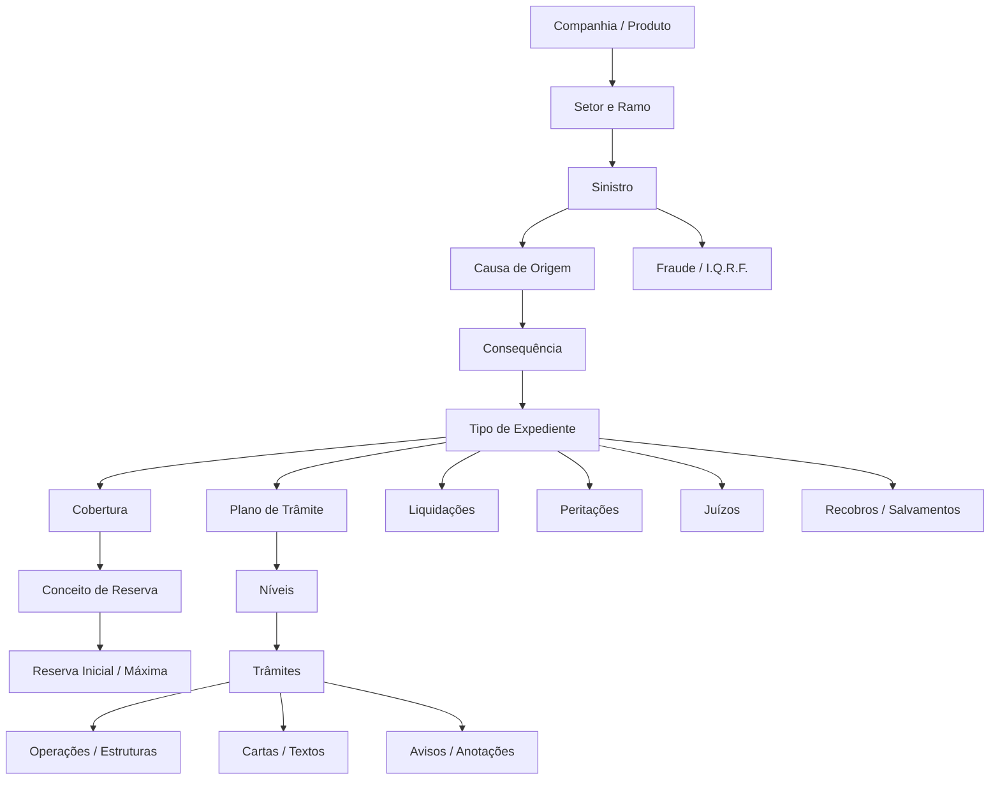
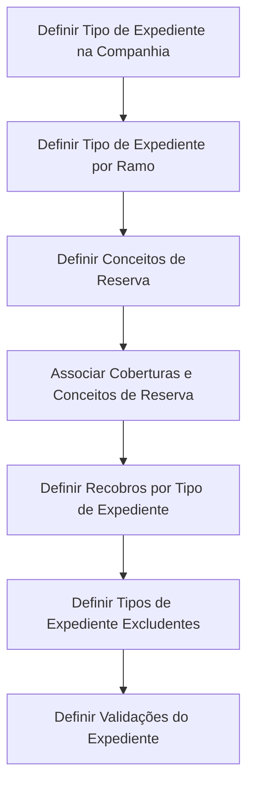
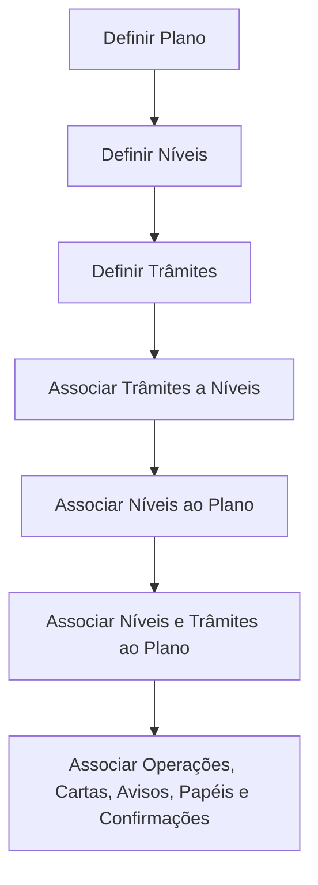

# Definições Funcionais e Técnicas do Módulo de Sinistros Reef.core

## 1. Metadados do Documento
- **Arquivo de Origem:** Não identificado; conteúdo bruto fornecido na conversa.
- **Tipo de Documento:** Especificação funcional e técnica / Manual operacional.
- **Domínio / Sistema:** Reef.core — módulos de Sinistros, Expedientes, Liquidações, Peritações, Juízos, Salvamentos, Fraude, I.Q.R.F., Planos de Trâmite e processos batch.
- **Público-Alvo:** Arquitetos, analistas funcionais, desenvolvedores, operação de sinistros, tesouraria e administradores de produto.
- **Data/Versão Identificada:** Não identificada.

---

## 2. Resumo Executivo & Contexto de Negócio

O conteúdo documenta a parametrização corporativa necessária para operar o módulo de sinistros do Reef.core. O modelo cobre a abertura, alteração, reabilitação e encerramento de sinistros; a criação e condução de expedientes; reservas; liquidações; planos de trâmite; recobros; perícias; processos judiciais; salvamentos; fraude; I.Q.R.F.; e operações batch.

A configuração é organizada por níveis de abrangência: companhia, setor, ramo, tipo de expediente, cobertura, conceito de reserva, causa, consequência, plano de trâmite e operação. A utilização de valores genéricos permite reutilização de definições, incluindo setor `9999` para todos os setores e ramo `999` para todos os ramos, nos pontos em que esses valores são explicitamente previstos.

O documento estabelece que grande parte do comportamento pode ser determinado por parâmetros fixos ou por lógicas de negócio. Diversas propriedades admitem os valores `1: Si`, `2: No`, `3: Procedimiento` e `4: Función` — ou, em alguns trechos, `3,4: Lógica de Negocio`. Quando houver lógica, a decisão depende de fatores adicionais não detalhados pelo documento.

O plano de trâmite é apresentado como o mecanismo operacional central para conduzir um expediente da abertura ao encerramento. Ele organiza níveis, trâmites, operações, cartas, avisos, anotações, papéis e confirmações do tratador. A atribuição de supervisores e tratadores depende de catálogos de especialização, relação entre escritórios comerciais e tratadores, e carga de trabalho.

> **Nota de Análise:** O documento descreve extensivamente catálogos, regras e atributos, porém não especifica contratos de API, métodos HTTP, versões de banco de dados, tecnologias de implementação ou URLs de ambientes.

---

## 3. Arquitetura, Componentes & Tecnologias Envolvidas

### Componentes funcionais identificados

| Componente | Função documentada |
| :--- | :--- |
| Reef.core | Sistema principal de configuração e operação de sinistros. |
| Módulo de Sinistros | Abertura, alteração, término, reabilitação e validações de sinistros. |
| Módulo de Expedientes | Gestão de tipos de dano, coberturas, reservas, recobros e encerramento. |
| Plano de Trâmite | Guia operacional de tratamento de expedientes por níveis e trâmites. |
| Liquidações | Geração, alteração, anulação e validação de ordens de pagamento. |
| Tesouraria | Origem de conceitos de cobrança/pagamento e tratamento de ordens de pagamento. |
| Peritações | Solicitação, resultado, danos e ordens de reparação. |
| Juízos | Associação de expedientes a processos judiciais e suas validações. |
| Salvamentos | Gestão de inventários, leilões, recuperação e venda de bens. |
| Fraude | Cadastro, alteração, classificação, motivos, estados e valores de fraude. |
| I.Q.R.F. | Incidências, queixas, reclamações e felicitações. |
| Controle Técnico | Retenção, autorização e controle de condições operacionais. |
| Processos Batch | Execução diferida de operações de sinistros mediante tabelas de buzón. |
| Mapfre Services | Sistema externo citado para envio de e-mails quando `Email externo = 'S'`. |



### Fluxo de definição de um tipo de expediente



### Fluxo de definição de plano de trâmite



---

## 4. Regras de Negócio, Especificações Funcionais & Processos

### 4.1 Características gerais de sinistros

- A solicitação de causas na abertura de expedientes, na alteração de avaliação e na anulação de liquidação depende de propriedades gerais. Caso a solicitação esteja ativa, as causas correspondentes devem estar previamente definidas.
- O uso de datas de controle no plano de trâmite determina se cada trâmite terá prazo de conclusão calculado desde sua ativação.
- O uso de calendários faz com que feriados e férias do tratador sejam tratados como dias não úteis no cálculo de avisos, datas de controle e demais datas do plano.
- O uso de papéis restringe a execução de operações, tais como ativar, finalizar ou atrasar trâmites; executar programas; gerar comunicações; modificar datas de controle; incluir trâmites e incluir níveis.
- Um juízo pode ser associado a um ou vários sinistros, conforme propriedade específica.
- Em faturamento múltiplo, a distribuição proporcional pode ser automática quando uma fatura afeta diversos expedientes.
- É possível liquidar honorários e despesas mesmo se a indenização estiver retida por controle técnico, quando a propriedade correspondente permitir.
- O registro de faturas pode validar se o conceito de cobrança/pagamento está definido para a atividade da fatura ou aceitar conceitos genéricos.

### 4.2 Extemporaneidade

A extemporaneidade mede o intervalo entre a data de ocorrência e a data de denúncia/notificação à companhia. O sinistro é considerado fora do prazo quando esse intervalo superar o número máximo de dias definido para a combinação de setor e ramo.

- O setor pode ser genérico para aplicação a todos os setores.
- O ramo pode ser genérico para aplicação a todos os ramos do setor.
- A validação não é obrigatória: uma lógica por ramo pode definir se ela se aplica.
- O documento cita exceções para clientes VIP e situações em que o sinistro fica retido para autorização ou rejeição.

### 4.3 Abertura e validações de sinistros

- A abertura de sinistros futuros pode ser permitida, proibida ou decidida por lógica de negócio.
- A avaliação global do sinistro pode ser solicitada na abertura.
- A data de ocorrência pode ser alterada se a configuração permitir; após a alteração, o sistema verifica mudanças nas condições da apólice.
- Suplementos temporários podem ser sinistrados conforme regra configurada.
- Apólices ou riscos não vigentes podem ser sinistrados em casos configurados; o documento cita especialmente ramos de Vida quando a morte do segurado causa a anulação.
- A atribuição inicial de supervisor utiliza uma lógica núcleo baseada em catálogos de supervisores, escritórios comerciais e tratadores, especialização e número de casos pendentes.
- Validações próprias podem ser executadas ao final da abertura e da alteração de sinistros.

### 4.4 Causas, consequências, expedientes, coberturas e reservas

- Apenas causas do tipo **Origem do Siniestro** são associadas a consequências.
- Uma causa de origem não tratável impede a solicitação de consequências e a abertura de expedientes até que seja substituída por causa tratável.
- Cada combinação de ramo, causa, consequência, tipo de expediente, cobertura e conceito de reserva pode possuir valor inicial, valor máximo e lógica de cálculo.
- Consequências incompatíveis podem ser controladas no nível:
  - `Causa + Consequência + Tipo de Expediente + Cobertura`; ou
  - `Causa + Consequência + Tipo de Expediente + Cobertura + Conceito de Reserva`.
- Quando duas consequências afetam o mesmo tipo de expediente e cobertura, mas conceitos de reserva distintos, o sistema abre um único expediente contendo os conceitos de reserva correspondentes.
- Tipos de expediente excludentes não podem coexistir no mesmo sinistro conforme sua configuração.

### 4.5 Tipos de expediente e recobros

- Um tipo de expediente é uma tipologia de dano e pode ser reutilizado em um ou vários ramos.
- Um tipo de expediente pode ser positivo ou negativo; o sistema controla o sinal do importe final conforme essa definição.
- Tipos de expediente podem ser agrupados por natureza, como danos materiais, danos pessoais ou roubos.
- Um tipo de expediente pode ser inabilitado para novas aberturas.
- Recobros podem ser:
  - `R`: recuperação econômica;
  - `D`: recuperação de dedutível/franquia;
  - `S`: salvamento ou recuperação material.
- Um expediente de recobro exige expediente de não recobro previamente aberto para associação.
- Um recobro pode ser associado a vários expedientes de não recobro.
- Um recobro pode assumir a avaliação do expediente principal mediante configuração ou lógica de negócio.

### 4.6 Plano de trâmite

- O plano pode conter níveis, e cada nível pode conter trâmites.
- Níveis e trâmites podem ser iniciais ou opcionais.
- Um nível associado a um plano não se torna obrigatório apenas por estar associado.
- Um trâmite pode ser incluído manualmente ou exclusivamente por processo automático/batch.
- Trâmites podem executar operações, estruturas, programas, tarefas, documentos e cartas.
- Cada operação de um trâmite pode ter lógica prévia e posterior à execução.
- A visibilidade de operações e cartas na consulta do centro telefônico pode ser controlada para evitar divulgação indevida, como informações de fraude ou rejeição de sinistro.
- A confirmação do tratador exige que o trâmite tenha estrutura registrada e que essa estrutura utilize o programa `AS750000`.

### 4.7 Liquidações

- As liquidações representam ordens de pagamento de expedientes.
- Os conceitos de cobrança e pagamento devem ser associados tanto aos tipos de expediente/conceitos de reserva quanto às atividades dos beneficiários.
- O documento estabelece precedência de definições:
  - Para imposto, a definição do documento de pagamento prevalece sobre a definição do conceito de cobrança/pagamento.
  - Para retenções, a definição do terceiro prevalece sobre a definição do conceito de cobrança/pagamento.
- A aplicação de prêmios pendentes pode ocorrer na data de ocorrência, no vencimento da apólice ou não ocorrer.
- A ordem de pagamento pode ser excluída do pagamento automático.
- É possível configurar autorização pela tesouraria, cálculo de impostos, ajuste de imposto, liquidação com reserva zero, liquidação acima da avaliação, restauração da reserva em anulação e retificação de meses anteriores.

### 4.8 Eventos catastróficos

- Eventos catastróficos agrupam sinistros ligados a fenômenos determinados.
- O evento possui período de início e fim, data limite de denúncia, tipo, código identificador e descrição.
- Na abertura e alteração de sinistros, o Reef.core valida se a data de ocorrência está dentro do período do evento.
- O Reef.core também valida a data máxima de denúncia do evento.
- O documento informa que o CORE não controla automaticamente se o evento ocorreu no local do sinistro.

---

## 5. Tabelas de Parâmetros, Ambientes e Estruturas de Dados

### 5.1 Valores recorrentes de decisão

| Item / Parâmetro | Descrição / Função | Tipo / Valores / Formato | Ambiente / Observações |
| :--- | :--- | :--- | :--- |
| Decisão fixa | Define comportamento binário. | `1: Si`, `2: No` | Aplicável a diversas propriedades. |
| Procedimento | Decisão por procedimento de negócio. | `3: Procedimiento` | Exige lógica associada. |
| Função | Decisão por função de negócio. | `4: Función` | Exige lógica associada. |
| Lógica de negócio | Determina comportamento condicionado. | `3,4` em vários catálogos | Critérios internos não detalhados. |
| Setor genérico | Abrangência para todos os setores. | `9999` | Quando explicitamente permitido. |
| Ramo genérico | Abrangência para todos os ramos. | `999` | Quando explicitamente permitido. |
| Moeda da apólice | Usa a moeda da apólice no expediente. | `99` | Valor especial para moeda do expediente. |

### 5.2 Formato do número de sinistro

| Item / Parâmetro | Descrição / Função | Tipo / Valores / Formato | Ambiente / Observações |
| :--- | :--- | :--- | :--- |
| Código de companhia | Candidato à composição do número. | Código | Ordem configurável. |
| Código de setor | Candidato à composição do número. | Código | Ordem configurável. |
| Código de ramo | Candidato à composição do número. | Código | Ordem configurável. |
| Terceiro nível comercial | Candidato à composição do número. | Código | Ordem configurável. |
| Ano de reserva | Candidato à composição do número. | 2 ou 4 posições | Comprimento configurável. |
| Consecutivo | Candidato à composição do número. | Sequencial | Completa o tamanho desejado. |
| Comprimento máximo | Limite total do número de sinistro. | Até 15 posições | Número é único por companhia. |
| Alteração da definição | Restrição de manutenção. | Não permitida após abertura | Não pode ser alterada após existir sinistro aberto. |

### 5.3 Conceitos de reserva

| Item / Parâmetro | Descrição / Função | Tipo / Valores / Formato | Ambiente / Observações |
| :--- | :--- | :--- | :--- |
| Conceito de reserva | Chave do desdobramento econômico da reserva. | Código | Definido por companhia. |
| Indenização | Reserva para indenizações. | `I` | Ex.: segurado, oficina, clínica, prejudicado. |
| Honorários | Reserva para profissionais. | `H` | Ex.: advogado externo, perito externo. |
| Despesas | Reserva de gastos de profissionais. | `G` | Ex.: despesas de advogado/perito. |
| Inabilitado | Bloqueia novas associações. | Marca | Não associa a tipo/cobertura quando inabilitado. |

### 5.4 Encerramento de trâmites pendentes

| Código | Ação ao finalizar expediente |
| :--- | :--- |
| `N` | Não finaliza nada. |
| `D` | Finaliza trâmites definidos pendentes. |
| `A` | Finaliza avisos pendentes. |
| `T` | Finaliza tudo. |

### 5.5 Tipos de movimentos batch de sinistros

| Código | Movimento | Resultado funcional |
| :--- | :--- | :--- |
| `10` | Abertura de sinistro | Abre sinistro e tenta abrir expedientes. |
| `11` | Alteração de sinistro | Modifica dados do sinistro. |
| `12` | Término de sinistro | Termina sinistros sem expedientes. |
| `14` | Reabilitação de sinistro | Reabilita sinistro terminado para incluir novo expediente. |
| `20` | Abertura de expediente pelo batch | Abre expediente e cria avaliação. |
| `21` | Abertura de expediente | Abre expediente e cria avaliação. |
| `22` | Alteração de expediente | Modifica dados do expediente. |
| `23` | Término de expediente | Termina expediente. |
| `24` | Reabilitação de expediente | Reabilita expediente terminado. |
| `25` | Alteração de avaliação | Modifica avaliação de expediente pendente. |
| `30` | Liquidação | Gera ordem de pagamento. |
| `31` | Retificação de liquidação | Modifica liquidação não paga. |
| `32` | Anulação de liquidação | Anula liquidação não paga. |
| `33` | Justificante avulso | Liquidação para expediente terminado. |
| `40` | Criar aviso | Cria aviso no plano de trâmite. |
| `41` | Criar anotação livre | Cria anotação no plano de trâmite. |
| `42` | Criar nível | Inclui nível no plano de trâmite. |
| `43` | Criar trâmite | Inclui trâmite no plano de trâmite. |
| `44` | Reatribuir tratador | Altera tratador do expediente. |
| `46` | Finalizar trâmite | Finaliza trâmite pendente. |
| `50-53` | Plano de renda mensal | Cria, anula ou termina plano de renda. |
| `60-62` | Peritação | Solicita, registra resultado, dano ou ordem de reparação. |
| `70-77` | Salvamentos | Opera inventários, leilões, venda, liberação e anulação. |
| `80-81` | Juízos | Cria/altera demanda, sentença, associação e intervenção. |
| `110-114` | Fraude | Cria ou altera fraude de sinistro/expediente. |
| `115-118` | I.Q.R.F. | Cria ou altera I.Q.R.F. de sinistro/expediente. |

### 5.6 Estrutura técnica batch `B7000910`

| Coluna | Obrigatória | Descrição |
| :--- | :--- | :--- |
| `FEC_TRATAMIENTO` | Sim | Data de execução do processo massivo. |
| `TIP_MVTO_BATCH_STRO` | Sim | Tipo do movimento batch. |
| `NUM_ORDEN` | Sim | Número do processo massivo. |
| `TXT_ALIAS` | Não | Nome ou descrição atribuída ao processo. |
| `TIP_SITU` | Sim | Situação da linha; criação usa `1-Sin Procesar`. |
| `COD_CIA` | Sim | Companhia. |
| `COD_SECTOR` | Sim | Setor. |
| `COD_RAMO` | Sim | Ramo. |
| `NUM_SINI_REF` | Sim | Sinistro de referência de outros sistemas. |
| `NUM_SINI` | Sim | Número do sinistro. |
| `NUM_EXP` | Sim | Número do expediente. |
| `NUM_LIQ_REF` / `NUM_LIQ` | Sim | Referência e número da liquidação. |
| `SUB_TIP_TRAMITE` | Sim | Tipo de trâmite. |
| `NUM_JUICIO_REF` / `NUM_JUICIO` | Não | Referência e número do juízo. |
| `COD_INVENTARIO_REF` / `COD_INVENTARIO` | Não | Referência e número de inventário. |
| `COD_SUBASTA_REF` / `COD_SUBASTA` | Não | Referência e número de leilão. |
| `COD_BATCH_REF` / `IDN_BATCH` | Não | Referência e identificador batch. |
| `NUM_SQN_VAL` | Não | Sequência de avaliação. |
| `IDN_FRAUDE` / `IDN_FRAUDE_REF` | Não | Identificador e referência de fraude. |
| `IDN_IQRF` / `IDN_IQRF_REF` | Não | Identificador e referência I.Q.R.F. |
| `COD_USR_CAPTURA` | Sim | Usuário que simula a captura. |
| `COD_USR` | Sim | Usuário que atualizou a linha. |
| `FEC_ACTU` | Sim | Data de atualização da linha. |

---

## 6. Bateria de Perguntas & Respostas para RAG (FAQ Sintético)

### P1: Como o Reef.core determina se um sinistro é extemporâneo?
**R:** O sistema compara a data de ocorrência com a data de denúncia ou notificação. O sinistro é extemporâneo se a diferença superar o número máximo de dias configurado por setor e ramo. A validação pode ser desativada ou decidida por lógica de negócio no ramo.

### P2: Um número de sinistro pode mudar de formato após existirem sinistros abertos?
**R:** Não. O documento informa que a definição do formato não pode ser alterada após a abertura de um sinistro. O número é único por companhia e tem no máximo 15 posições.

### P3: Qual a diferença entre conceitos de reserva e conceitos de cobrança/pagamento?
**R:** Conceitos de reserva definem o desdobramento econômico a provisionar, como indenização, honorários e despesas. Conceitos de cobrança/pagamento detalham como o beneficiário será pago ou cobrado e podem ter impostos e retenções associados.

### P4: Quando um expediente de recobro pode ser aberto?
**R:** Um recobro exige um expediente de não recobro previamente aberto para que seja associado. O recobro pode ser aberto automaticamente quando a associação, o ramo e a lógica configurada permitirem.

### P5: O que acontece se duas consequências usam a mesma cobertura, mas conceitos de reserva diferentes?
**R:** O sistema abre um único expediente para a mesma combinação de tipo de expediente e cobertura, incluindo os diferentes conceitos de reserva afetados.

### P6: Como funcionam as datas de controle no plano de trâmite?
**R:** Quando a propriedade de uso de datas de controle está ativa, cada trâmite possui um número de dias para conclusão calculado a partir da ativação. Caso o uso de calendários esteja ativo, feriados e férias do tratador são considerados dias não úteis.

### P7: Qual requisito é necessário para utilizar a Confirmação do Tratador?
**R:** O trâmite deve possuir uma estrutura registrada na tabela de estruturas, associada à agrupação de trâmites e vinculada ao programa `AS750000`.

### P8: Uma liquidação pode exceder a avaliação atual do expediente?
**R:** Depende da configuração de validações de liquidação. A propriedade pode permitir, impedir ou usar procedimento/função. O documento registra que a liquidação faz ajuste automático de avaliação quando superior, mas algumas companhias podem obrigar alteração prévia da avaliação.

### P9: Como um evento catastrófico é validado durante a abertura de sinistro?
**R:** O Reef.core consulta a data de início e fim do evento para validar se a data de ocorrência pertence ao período. Também compara a data de denúncia com a data máxima de comunicação do evento.

### P10: O CORE valida se a localização do sinistro pertence à área do evento catastrófico?
**R:** Não. O documento afirma que a informação de localização do sinistro não é CORE. A validação poderia ser implementada na estrutura de local do sinistro ou em controle técnico.

### P11: Para que servem os papéis no plano de trâmite?
**R:** Os papéis controlam quais usuários podem executar operações do plano, incluindo ativar ou finalizar trâmites, executar programas, gerar comunicações, modificar datas de controle e inserir níveis ou trâmites.

### P12: Como são escolhidos tratadores para novos expedientes?
**R:** A lógica núcleo utiliza o catálogo de definição de tratadores, a relação entre escritórios comerciais e tratadores, especializações, quantidade de casos pendentes e quantidade máxima diária de expedientes atribuíveis.

---

## 7. Glossário de Termos, Siglas & Conceitos-Chave

- **AS750000:** Programa associado à ferramenta de Confirmação do Tratador.
- **Batch / Processo Massivo:** Operação diferida executada com dados registrados em tabelas de buzón.
- **Buzón:** Estrutura/tabela utilizada para armazenar dados de operações diferidas.
- **Cobertura:** Obrigação principal do contrato de seguro afetada pelo sinistro.
- **Conceito de Reserva:** Classificação econômica para provisionamento: indenização, honorários ou despesas.
- **Expediente:** Unidade de tratamento do dano derivado de um sinistro.
- **I.Q.R.F.:** Incidência, Queixa, Reclamação e Felicitação.
- **Lógica de Negócio:** Regra configurável que decide ou calcula comportamento dependente de condições adicionais.
- **Peritação:** Processo de avaliação técnica de danos.
- **Plano de Trâmite:** Estrutura de níveis, trâmites, operações e comunicações que orienta o tratamento de expedientes.
- **Recobro:** Recuperação de valores ou bens associada a expediente de não recobro.
- **Ramo:** Linha de negócio ou produto de seguro.
- **Reserva:** Provisão econômica para possíveis pagamentos de um expediente.
- **Salvamento:** Recuperação material, classificada como recobro tipo `S`.
- **Setor:** Agrupador de ramos utilizado em configurações e regras.
- **Tratador:** Usuário responsável pela gestão operacional de expedientes.

---

## 8. Notas Críticas, Riscos & Limitações

- Diversas propriedades dependem de lógicas de negócio, mas o documento não descreve implementação, critérios, assinatura ou contratos dessas lógicas.
- O conteúdo usa referências recorrentes a Reef.core e, em alguns trechos, menciona convivência entre “Reef.core e Reef.core”; não há detalhamento suficiente para distinguir versões, instâncias ou sistemas.
- Existem blocos marcados como **EN CONSTRUCCIÓN**, especialmente nas operações batch e visões técnicas; esses trechos não devem ser tratados como especificação completa.
- As tabelas técnicas apresentadas são parciais: `B7000910`, `B7000900`, `B7000930` e `ML_PLY_NWT_XX_ATR_LSS` são citadas, mas nem todas possuem o modelo integral no conteúdo fornecido.
- O documento contém inconsistências textuais e possíveis erros de extração, como “Catrastróficos”, datas de exemplo incompatíveis e linhas repetidas.
- Não há especificação suficiente para inferir APIs, integrações técnicas, esquemas completos, rotas, credenciais, políticas de autenticação ou parâmetros de infraestrutura.
- O controle de localização de evento catastrófico não é executado automaticamente pelo CORE, segundo o próprio documento.
- A associação de escritórios comerciais e tratadores não é obrigatória universalmente; ela depende dos critérios de atribuição utilizados pela companhia.

---

## 9. Conteúdo Bruto Estruturado (Referência Fiel)

```text
Referência primária: conteúdo bruto integral fornecido pelo solicitante nesta conversa.

Principais blocos literais identificados:
- DEFINICIÓN Características del Módulo de Siniestros
- DEFINICIÓN de Extemporaneidad
- DEFINICIÓN de VALIDACIONES SINIESTROS
- DEFINICIÓN de VALORES INICIALES SINIESTROS
- DEFINICIÓN de VALORES INICIALES PERSONA DE CONTACTO DEL SINIESTRO
- DEFINICIÓN de Formato del Número de Siniestro
- DEFINICIÓN Tipo de expediente
- Definición Coberturas y Concepto de Reserva por Tipo de Expediente
- DEFINICIÓN de Recobros por Tipo de Expediente
- DEFINICIÓN Tipo de Expedientes Excluyente
- DEFINICIÓN Tipo de Expediente Por Ramo
- DEFINICIÓN Validaciones Tipo de Expediente
- DEFINICIÓN Concepto de Reserva
- DEFINICIÓN Generar Carta
- DEFINICIÓN Confirmación del tramitador
- DEFINICIÓN y Generación Cartas-Email desde el Plan de tramitación
- DEFINICIÓN Observaciones de Estructuras en el Plan
- DEFINICIÓN Plan Tramitación
- DEFINICIÓN Trámites
- DEFINICIÓN Asociar Estructuras - Operaciones a un Trámite
- DEFINICIÓN Asociar Niveles a un Plan de Tramitación
- DEFINICIÓN Niveles de tramitación
- DEFINICIÓN Planes de Tramitación
- DEFINICIÓN Roles del Plan de Tramitación
- DEFINICIÓN Asociar Textos a Trámite
- DEFINICIÓN Tipos de Anotaciones
- DEFINICIÓN Tipos de Avisos
- DEFINICIÓN Causas-Consecuencias
- DEFINICIÓN Causa Consecuencias por Ramo
- DEFINICIÓN de Consecuencias
- DEFINICIÓN Provisión por Causa, Consecuencias, Tipos Expediente, Cobertura y concepto de reserva
- DEFINICIÓN Causas por Ramo
- DEFINICIÓN Causas por Tipo
- DEFINICIÓN Tipos de Expedientes por Causa Consecuencia
- DEFINICIÓN Estructura Tramitadora
- DEFINICIÓN Oficinas Tramitadoras
- DEFINICIÓN Relación entre Oficinas Gestoras y Tramitadoras
- DEFINICIÓN Estructuras de Información de los Módulos Siniestros
- DEFINICIÓN de Documentos
- DEFINICIÓN Restricciones y Observaciones del plan por programa
- DEFINICIÓN Liquidaciones
- Definición Aplicación Primas Pendientes
- Definición Conceptos de Pago por Actividad de Tercero
- Definición Conceptos de Pago por Tipo de Expediente
- Definición Convenios de pago por Ramo Actividad y/o Tercero
- DEFINICIÓN de Validaciones en la Liquidación
- DEFINICIÓN de Valores Iniciales de Las Liquidaciones
- DEFINICIÓN Eventos Catastróficos
- DEFINICIÓN de Ubicaciones de Eventos
- DEFINICIÓN Sub-límites
- DEFINICIÓN de SINIESTROS
- DOCUMENTACIÓN de DEFINICIÓN de SINIESTROS (Automóvil)
- EN CONSTRUCCIÓN: processos massivos e modelos técnicos de buzón.

O texto bruto integral permanece como fonte de auditoria fornecida na entrada desta solicitação. Este artefato não adiciona fatos além do material original; ele normaliza, relaciona e estrutura os conteúdos para recuperação híbrida e vetorial.
```
