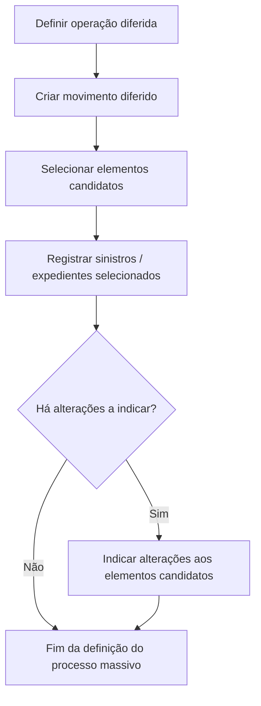
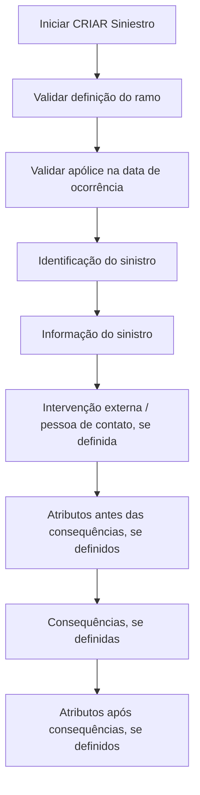
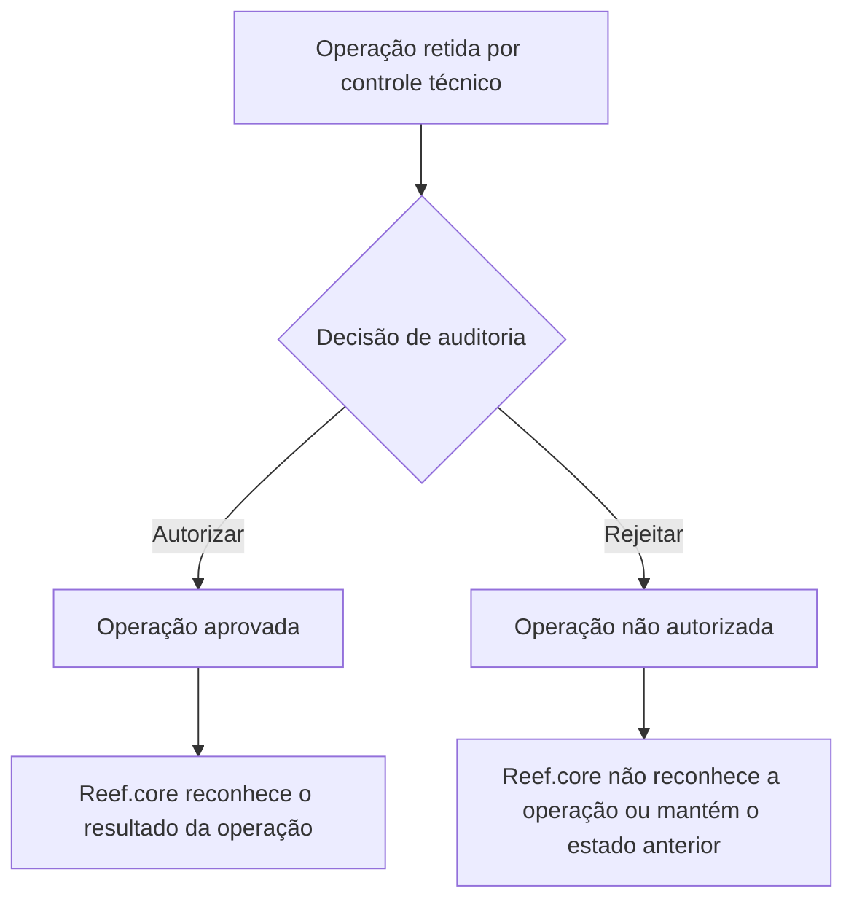

# Documentação de Operação de Sinistros — Reef.core: Processos Massivos, Operações Funcionais e Modelo de Dados

## 1. Metadados do Documento
- **Arquivo de Origem:** Não identificado — conteúdo bruto fornecido no prompt.
- **Tipo de Documento:** Manual Operacional, Documentação Funcional e Modelo de Dados.
- **Domínio / Sistema:** Gestão de Sinistros — Reef.core.
- **Público-Alvo:** Desenvolvedores, Arquitetos, Operação, Tramitadores, Supervisores, Chefes de Sinistros e Analistas Funcionais.
- **Data/Versão Identificada:** Não identificada.

---

## 2. Resumo Executivo & Contexto de Negócio

O conteúdo descreve a documentação operacional do módulo de **Sinistros** do sistema **Reef.core**, cobrindo operações funcionais, processos massivos, estrutura de dados e modalidades de negócio. A documentação apresenta operações aplicáveis aos domínios Comum, Automóvel, Vida, Transportes, Saúde e Gerais, com variações de módulos disponíveis conforme o tipo de negócio.

O processo de sinistros inclui operações sobre sinistros, expedientes, liquidações, peritações, salvamentos, juízos, fraude, IQRF, planos de tramitação, planos de renda, serviços, controle técnico, processos massivos e consultas. Diversas operações podem ser executadas em linha ou de forma diferida por meio de processos massivos.

O mecanismo de **processo massivo** permite definir uma operação diferida, selecionar os elementos candidatos — por exemplo, sinistros, expedientes ou liquidações — e indicar alterações que serão aplicadas aos elementos selecionados. Cada instalação é responsável por criar a lógica personalizada de seleção dos elementos que participarão do processo massivo.

A criação de sinistros depende da definição prévia do ramo e da existência de uma apólice vigente na data de ocorrência do sinistro, salvo exceções explicitamente configuradas. A operação abrange identificação do sinistro, informações gerais, intervenções externas, atributos, consequências e demais elementos determinados pela definição do ramo.

O documento também descreve o controle técnico como um mecanismo de autorização ou rejeição de operações retidas. A autorização faz com que o restante do Reef.core reconheça a operação aprovada; a rejeição impede que a operação seja reconhecida ou preserva a situação anterior, conforme o tipo de operação.

---

## 3. Arquitetura, Componentes & Tecnologias Envolvidas

O documento não descreve tecnologias de implementação, protocolos, APIs, URLs, versões de software, infraestrutura, servidores ou contratos técnicos. O conteúdo é predominantemente funcional e orientado ao modelo de dados do Reef.core.

### Componentes funcionais identificados

| Componente / Módulo | Função descrita |
| :--- | :--- |
| Reef.core | Sistema no qual são realizadas operações de sinistros, expedientes, liquidações e processos relacionados. |
| Sinistro | Entidade principal associada à ocorrência comunicada à companhia. |
| Expediente | Entidade associada a danos decorrentes de um sinistro. |
| Liquidação | Operação de criação ou gestão de ordem de pagamento para beneficiário. |
| Processo massivo | Processo que determina uma operação diferida, os elementos afetados e as alterações aplicáveis. |
| Controle técnico | Conjunto de operações de autorização e rejeição para operações retidas por auditoria. |
| Plano de tramitação | Estrutura de gestão de trâmites, níveis, avisos, anotações, cartas e datas de controle. |
| Plano de Renda / P.R.M. | Operações para criação, anulação, término e consulta de planos de renda. |
| Peritações | Gestão de solicitações, resultados, danos e ordens de reparação. |
| Salvamentos | Gestão de salvados, inventários, subastas, vendas e saídas. |
| Serviços | Gestão de ordens, serviços de fornecedores, bloqueios, notificações e estados. |
| Fraude | Registro, modificação e consulta de fraude associada a sinistros ou expedientes. |
| IQRF | Registro, alteração e consulta de Incidência, Queja, Reclamación ou Felicitación. |
| Juízos | Gestão de demandas, sentenças, intervenções e associação de expedientes a juízos. |
| Menu do Tramitador | Ferramenta operacional principal para consulta e gestão de trabalho do tramitador. |
| Menu Supervisor e Chefe de Sinistros | Ferramenta de controle de gestão e auditoria baseada no Plano de Tramitação. |
| B7000900 | Buzón de datos fijos del siniestro. |
| B7000910 | Maestra de procesos masivo de siniestros. |

### Fluxo funcional de processo massivo



### Fluxo operacional de criação de sinistro



### Fluxo de controle técnico



> **Nota de Análise:** O documento menciona tabelas, colunas e operações funcionais, mas não detalha mecanismos de integração, métodos HTTP, contratos JSON, banco de dados físico, chaves primárias, relacionamentos, índices ou tecnologias de persistência.

---

## 4. Regras de Negócio, Especificações Funcionais & Processos

### 4.1 Processo massivo em Sinistros

Um processo massivo é aplicável quando uma operação do Reef.core pode ser realizada de maneira diferida. O processo determina:

1. Qual operação diferida será realizada.
2. Quais elementos serão afetados pela operação.
3. Quais alterações serão aplicadas aos elementos selecionados.

O fluxo obrigatório apresentado é:

1. **Criar movimento diferido.**
2. **Selecionar elementos candidatos.**
3. **Indicar mudanças aos elementos candidatos**, quando houver alterações a aplicar.

Os elementos candidatos podem ser sinistros, expedientes, liquidações ou outros elementos mencionados no contexto da operação. A seleção é uma atividade personalizada por instalação.

### 4.2 Seleção e registro de elementos candidatos

A seleção de elementos candidatos consiste em extrair, do universo de sinistros, expedientes, liquidações ou outros elementos, aqueles que devem participar do processo massivo.

Após a seleção, os sinistros ou expedientes selecionados são registrados como candidatos. O documento informa que o registro não requer uma etapa adicional, pois é consequência da etapa de seleção.

Exemplos apresentados de processos de seleção:

- Selecionar sinistros ou expedientes abertos com reserva média e sem alteração de valoração para aplicar a operação de mudança de valoração, elevando a reserva em 15%.
- Selecionar sinistros sem expedientes e abertos há mais de 15 anos para aplicar a operação de término de sinistro sem expedientes.
- Carregar sinistros comunicados em um Centro Telefônico para aplicar a operação de abertura de sinistro.
- Criar lógicas próprias de seleção para criar, modificar, criar juízo, criar peritação ou criar IQRF.

### 4.3 Regras para identificação do sinistro

| Propriedade | Regra funcional |
| :--- | :--- |
| Data de ocorrência | Indica a data em que ocorreu o sinistro. Não pode ser superior ao dia corrente, exceto se a definição do ramo estabelecer o contrário. Pode possuir valor inicial definido. |
| Hora de ocorrência | Indica a hora da ocorrência. Quando a definição do ramo determinar obrigatoriedade de hora e minutos para a data de efeito da apólice, a abertura do sinistro exige hora e minutos de ocorrência. Pode possuir hora inicial definida. |
| Data de notificação | Indica a data em que o sinistro foi informado à companhia. Pode possuir valor inicial definido no ramo. Não pode ser superior ao dia corrente. |
| Extemporaneidade | Quando o ramo definir validação de extemporaneidade, a validação é realizada conforme os dias máximos definidos. Caso haja validação, deve ser definida a extemporaneidade. |
| Hora de notificação | Indica a hora em que a companhia tomou conhecimento do sinistro. Se a data de notificação for a data corrente, a hora não pode ser superior ao momento de registro do sinistro. Pode possuir valor inicial definido no ramo. |
| Apólice | Número de contrato afetado pelo sinistro. Deve estar vigente na data de ocorrência, salvo exceções definidas para apólices fixas sem aplicações. A apólice também é validada contra retenção por controle técnico. |
| Aplicação | É solicitada apenas quando a apólice possui aplicações. Em apólices fixas, recebe o valor `0`. Deve estar vigente na data de ocorrência, salvo exceções definidas. |
| Risco | Identifica o risco afetado. Quando a apólice possui um único risco, o risco existente é informado por padrão. Deve estar vigente na data de ocorrência, salvo exceções configuradas. |
| Suplemento da apólice | Na obtenção da modificação da apólice correspondente à data de ocorrência, são considerados suplementos temporais, salvo definição contrária. |
| Suplemento da aplicação | Na obtenção da modificação da aplicação correspondente à data de ocorrência, são considerados suplementos temporais, salvo definição contrária. |
| Suplemento do risco | Na obtenção da modificação do risco correspondente à data de ocorrência, são considerados suplementos temporais, salvo definição contrária. |
| Nome do risco | O nome do objeto assegurado é configurado por definição. |

### 4.4 Informações do sinistro

| Informação | Regra funcional |
| :--- | :--- |
| Evento catastrófico | Indica se o sinistro decorre de evento catastrófico. O evento deve ser definido antes da realização da operação. |
| Motivo do sinistro | Representa a causa ou origem que desencadeou o sinistro. As causas devem ser definidas previamente, associadas aos ramos e relacionadas às possíveis consequências de cada causa-origem. |
| Importe do sinistro | Representa a estimativa do sinistro. É exibido somente quando houver definição correspondente no ramo. |

### 4.5 Criação de sinistro

A operação **CRIAR Siniestro** permite criar um novo sinistro no Reef.core.

Premissas identificadas:

- O ramo deve estar previamente definido.
- As informações solicitadas dependem da definição do ramo.
- É necessária uma apólice vigente na data do sinistro.
- O conteúdo e a ordem das informações exibidas dependem da definição de sinistros para o ramo.

Ordem funcional apresentada:

1. Informação de sinistro.
2. Identificação do sinistro.
3. Informação do sinistro.
4. Intervenção externa ou pessoa de contato, quando aplicável.
5. Atributos anteriores às consequências, quando aplicável.
6. Consequências, quando aplicável.
7. Atributos posteriores às consequências, quando aplicável.

### 4.6 Liquidações

A operação **GENERAR Liquidación** permite criar uma liquidação para um expediente. A informação requerida depende da definição do ramo.

A sequência apresentada é:

1. Dados de entrada da liquidação:
   - Sinistro.
   - Expediente.
   - Liquidação de referência.
2. Informação da liquidação:
   - Beneficiário.
   - Documento de pagamento.
   - Emissor do documento de pagamento.
   - Dados do pagamento.
   - Informação adicional da liquidação, opcional.
   - Importes da liquidação.

Regras específicas de operações de liquidação:

| Operação | Regra descrita |
| :--- | :--- |
| Gerar liquidação | Cria uma ordem de pagamento para beneficiário. |
| Gerar liquidação de expediente terminado | Cria uma ordem de pagamento para beneficiário quando o expediente está terminado. |
| Modificar liquidação | Permite alterar dados e importes desde que a liquidação não esteja paga. |
| Anular liquidação | Cancela uma liquidação e reverte seus movimentos desde que a liquidação não esteja paga. |
| Consultar liquidação | Visualiza todas as informações de uma liquidação. |

### 4.7 Controle técnico

O controle técnico abrange operações de autorização e rejeição de controles técnicos de auditoria.

| Operação | Resultado ao autorizar | Resultado ao rejeitar |
| :--- | :--- | :--- |
| Abertura de sinistro | O sinistro retido é aprovado e reconhecido pelo Reef.core. | O sinistro não é autorizado e não existe para o restante do Reef.core. |
| Modificação de sinistro | A modificação é aprovada e reconhecida pelo Reef.core. | A modificação não é autorizada e não existe para o restante do Reef.core. |
| Reabilitação de sinistro | A reabilitação é aprovada e o sinistro volta a estar pendente. | O sinistro permanece terminado. |
| Abertura de expediente | O expediente retido é aprovado e reconhecido pelo Reef.core. | O expediente não é autorizado e não existe para o restante do Reef.core. |
| Mudança de valoração | A nova valoração do expediente é reconhecida pelo Reef.core. | O Reef.core mantém a valoração anterior à alteração. |
| Reabilitação de expediente | A reabilitação é aprovada e o expediente volta a estar pendente. | O expediente permanece terminado. |
| Liquidação | A liquidação e a ordem de pagamento são reconhecidas pelo Reef.core. | A liquidação não existe para o restante do Reef.core. |
| Criação de faturamento | A nova fatura é reconhecida pelo Reef.core. | A fatura não existe. |
| Modificação de faturamento | A modificação da fatura é reconhecida pelo Reef.core. | O Reef.core mantém a situação anterior à modificação. |
| Plano de renda | O plano de renda é reconhecido pelo Reef.core. | O plano de renda não existe para o restante do Reef.core. |

### 4.8 Catálogo de operações por módulo

| Módulo | Operações identificadas |
| :--- | :--- |
| Tramitação de sinistros | Criar sinistro, modificar sinistro, terminar sinistro, reabilitar sinistro, consultar sinistro. |
| Tramitação de expedientes | Criar expediente, modificar dados, valorar, modificar valoração, terminar, reabilitar e consultar expediente. |
| Liquidações | Gerar, gerar para expediente terminado, modificar, anular e consultar liquidação. |
| Peritações | Criar e modificar solicitação, criar e modificar resultado, criar e modificar dano, criar, modificar e anular ordem de reparação, consultar peritação. |
| Salvamentos | Criar entrada, criar, modificar, associar sinistro, associar expediente, criar e modificar subasta, associar inventário à subasta, vender, liberar, anular, criar saída e consultar salvamentos. |
| Serviços | Criar ordem, criar serviço, atribuir serviço, modificar serviço, modificar estados, criar notificações manuais, gerir bloqueios, fechar, cancelar, reabrir, consultar avanços e consultar histórico de movimentos. |
| Plano de tramitação | Criar plano, incluir trâmite, incluir nível, ativar e finalizar trâmite, criar avisos, criar anotações, finalizar e atrasar avisos, criar carta/e-mail, modificar data de controle e consultar plano. |
| Plano de renda | Criar, anular, terminar, terminar sem anular e consultar plano de renda. |
| Fraude | Criar, modificar e consultar fraude em sinistro ou expediente. |
| IQRF | Criar, modificar e consultar IQRF em sinistro ou expediente. |
| Juízos | Criar e modificar demanda, associar juízo a expediente, criar e modificar sentença, criar e modificar intervenção e consultar juízo. |
| Consultas | Consultas de trabalhos, avisos, trâmites, cartas, expedientes sem atividade, expedientes atribuídos e estado de controle de trâmites. |

---

## 5. Tabelas de Parâmetros, Ambientes e Estruturas de Dados

> **Nota de Análise:** O documento não informa tipos físicos de dados, tamanhos, domínios, chaves, índices, ambientes, servidores ou URLs. Os valores `S`, `N.A.`, `SI`, `NO` e `1-Sin Procesar` são preservados conforme a extração original.

### 5.1 Tabela B7000900 — Buzón de Datos Fijos del Siniestro

| Item / Parâmetro | Descrição / Função | Tipo / Valores / Formato | Ambiente / Observações |
| :--- | :--- | :--- | :--- |
| B7000900 | Buzón de datos fijos del siniestro. | Tabela | Associada à operação CRIAR Siniestro — Motivo — Buzón. |
| FEC_TRATAMIENTO | Data em que é realizado o processo massivo. | Cambia: S; Obrigatória: SI | — |
| TIP_MVTO_BATCH_STRO | Tipo do movimento batch. | Cambia: S; Obrigatória: SI | — |
| COD_CIA | Companhia. | Cambia: S; Obrigatória: SI | — |
| NUM_SINI | Sinistro. | Cambia: S; Obrigatória: SI | — |
| NUM_SINI_REF | Sinistro de referência de outros sistemas. | Cambia: S; Obrigatória: SI | — |
| NUM_POLIZA | Apólice. | Cambia: S; Obrigatória: SI | — |
| NUM_RIESGO | Risco. | Cambia: S; Obrigatória: SI | — |
| NUM_APLI | Número de aplicação. | Cambia: S; Obrigatória: SI | — |
| FEC_SINI | Data de ocorrência do sinistro. | Cambia: S; Obrigatória: SI | — |
| FEC_DENU_SINI | Data de notificação ou denúncia do sinistro. | Cambia: S; Obrigatória: SI | — |
| HORA_SINI | Hora de ocorrência do sinistro. | Cambia: S; Obrigatória: NO | — |
| COD_CAUSA_SINI | Causa do sinistro. | Cambia: S; Obrigatória: SI | — |
| COD_EVENTO | Evento catastrófico que originou o sinistro. | Cambia: S; Obrigatória: NO | — |
| NOM_CONTACTO | Pessoa de contato. | Cambia: S; Obrigatória: NO | — |
| APE_CONTACTO | Sobrenomes do contato. | Cambia: S; Obrigatória: NO | — |
| TEL_PAIS_CONTACTO | País do telefone da pessoa de contato. | Cambia: S; Obrigatória: NO | — |
| TEL_ZONA_CONTACTO | Zona do telefone da pessoa de contato. | Cambia: S; Obrigatória: NO | — |
| TEL_NUMERO_CONTACTO | Número de telefone da pessoa de contato. | Cambia: S; Obrigatória: NO | — |
| MCA_CULPABLE | Indica se é ou não culpável pelo sinistro. | Cambia: S; Obrigatória: NO | — |
| COD_USR | Usuário que atualizou a linha. | Cambia: S; Obrigatória: SI | — |
| FEC_ACTU | Data de atualização da linha. | Cambia: S; Obrigatória: SI | — |
| TIP_DOCUM_CONTACTO | Tipo de documento da pessoa de contato. | Cambia: S; Obrigatória: NO | — |
| COD_DOCUM_CONTACTO | Documento da pessoa de contato. | Cambia: S; Obrigatória: NO | — |
| TIP_RELACION | Relação com o segurado. | Cambia: S; Obrigatória: NO | — |
| EMAIL_CONTACTO | Endereço de correio eletrônico da pessoa de contato. | Cambia: S; Obrigatória: NO | — |
| HORA_DENU_SINI | Hora da denúncia do sinistro. | Cambia: S; Obrigatória: NO | — |
| NUM_ORDEN | Número do processo massivo. | Cambia: S; Obrigatória: SI | — |
| IMP_VAL_INI_SINI | Importe estimado da valoração do sinistro. | Cambia: S; Obrigatória: NO | — |
| NUM_SINI_REF_MOD | Sinistro de referência de outros sistemas para modificação. | Cambia: S; Obrigatória: NO | — |
| TXT_CNH_CLR | Meio de contato móvel. | Cambia: S; Obrigatória: NO | — |
| TXT_CNH_TLP | Meio de contato telefone. | Cambia: S; Obrigatória: NO | — |
| TXT_CNH_EML | Meio de contato e-mail. | Cambia: S; Obrigatória: NO | — |

### 5.2 Tabela B7000910 — Maestra Procesos Masivo de Siniestros

| Item / Parâmetro | Descrição / Função | Tipo / Valores / Formato | Ambiente / Observações |
| :--- | :--- | :--- | :--- |
| B7000910 | Maestra procesos masivo de siniestros. | Tabela | Associada à seleção de sinistro/expediente. |
| FEC_TRATAMIENTO | Data em que é realizado o processo massivo. | Cambia: S; Obrigatória: SI | — |
| TIP_MVTO_BATCH_STRO | Tipo do movimento batch. | Cambia: S; Obrigatória: SI | — |
| NUM_ORDEN | Número do processo massivo. | Cambia: S; Obrigatória: SI | — |
| TXT_ALIAS | Nome desejado para o processo. | Cambia: S; Obrigatória: NO | — |
| TIP_SITU | Situação na qual a linha se encontra. | Cambia: S; Valor: `1-Sin Procesar`; Obrigatória: SI | — |
| COD_CIA | Companhia. | Cambia: S; Obrigatória: SI | — |
| COD_SECTOR | Setor. | Cambia: S; Obrigatória: SI | — |
| COD_RAMO | Ramo. | Cambia: S; Obrigatória: SI | — |
| NUM_SINI_REF | Sinistro de referência de outros sistemas. | Cambia: S; Obrigatória: SI | — |
| NUM_SINI | Sinistro. | Cambia: S; Obrigatória: SI | — |
| NUM_EXP | Número de expediente. | Cambia: S; Obrigatória: SI | — |
| NUM_LIQ_REF | Número de liquidação de referência. | Cambia: S; Obrigatória: SI | — |
| NUM_LIQ | Número de liquidação. | Cambia: S; Obrigatória: SI | — |
| SUB_TIP_TRAMITE | Tipo de trâmite. | Cambia: S; Obrigatória: SI | — |
| NUM_JUICIO_REF | Número do juízo de referência. | Cambia: S; Obrigatória: NO | — |
| NUM_JUICIO | Número do juízo. | Cambia: S; Obrigatória: NO | — |
| COD_INVENTARIO_REF | Inventário de referência. | Cambia: S; Obrigatória: NO | — |
| COD_INVENTARIO | Número de inventário. | Cambia: S; Obrigatória: NO | — |
| COD_SUBASTA_REF | Código de subasta de referência. | Cambia: S; Obrigatória: NO | — |
| COD_SUBASTA | Subasta. | Cambia: S; Obrigatória: NO | — |
| COD_BATCH_REF | Código de referência para processos batch. | Cambia: S; Obrigatória: NO | — |
| IDN_BATCH | Identificador batch. | Cambia: S; Obrigatória: NO | — |
| NUM_SQN_VAL | Sequência. | Cambia: S; Obrigatória: NO | — |
| IDN_FRAUDE | Identificador de fraude. | Cambia: S; Obrigatória: NO | — |
| IDN_FRAUDE_REF | Referência de identificador de fraude. | Cambia: S; Obrigatória: NO | — |
| IDN_IQRF | Identificador IQRF. | Cambia: S; Obrigatória: NO | — |
| IDN_IQRF_REF | Referência de identificador IQRF. | Cambia: S; Obrigatória: NO | — |
| COD_USR_CAPTURA | Usuário que simula a captura. | Cambia: S; Obrigatória: SI | — |
| COD_USR | Usuário que atualizou a linha. | Cambia: S; Obrigatória: SI | — |
| FEC_ACTU | Data de atualização da linha. | Cambia: S; Obrigatória: SI | — |

### 5.3 Cobertura de módulos por tipo de negócio

| Tipo de negócio | Módulos citados |
| :--- | :--- |
| Comum | Não detalhado individualmente no conteúdo fornecido. |
| Automóvel | Tramita sinistro, tramita expediente, liquidações, peritações, salvamentos, juízos, plano de renda, IQRF, fraude, plano de tramitação, serviços, controle técnico, processos massivos e consultas. |
| Vida | Tramita sinistro, tramita expediente, liquidações, juízos, plano de renda, IQRF, fraude, plano de tramitação, controle técnico, processos massivos e consultas. |
| Transportes | Tramita sinistro, tramita expediente, liquidações, peritações, salvamentos, juízos, IQRF, fraude, plano de tramitação, controle técnico, processos massivos e consultas. |
| Saúde | Tramita sinistro, tramita expediente, liquidações, juízos, IQRF, fraude, plano de tramitação, serviços, controle técnico, processos massivos e consultas. |
| Gerais | Tramita sinistro, tramita expediente, liquidações, peritações, salvamentos, juízos, plano de renda, IQRF, fraude, plano de tramitação, serviços, controle técnico, processos massivos e consultas. |

---

## 6. Bateria de Perguntas & Respostas para RAG (FAQ Sintético)

### P1: O que é um processo massivo no Reef.core?
**R:** Um processo massivo é o mecanismo utilizado para definir uma operação diferida, determinar quais elementos serão afetados e indicar as alterações que serão aplicadas. Os elementos podem incluir sinistros, expedientes, liquidações e outros elementos relacionados à operação.

### P2: Quais são as etapas para definir um processo massivo de sinistros?
**R:** O processo possui três etapas: criar o movimento diferido, selecionar os elementos candidatos e indicar alterações aos elementos candidatos quando houver mudanças a aplicar.

### P3: Como os sinistros e expedientes são incluídos em um processo massivo?
**R:** Primeiro são selecionados os sinistros ou expedientes que deverão participar do processo. Depois, esses elementos são registrados como candidatos. O registro é consequência da seleção e não exige uma etapa adicional independente.

### P4: A data de ocorrência de um sinistro pode ser futura?
**R:** Não. A data de ocorrência não pode ser superior ao dia corrente, exceto quando a definição do ramo especificar o contrário.

### P5: Em que condição a hora de ocorrência do sinistro se torna obrigatória?
**R:** A hora e os minutos de ocorrência são obrigatórios quando, na definição do ramo, a data de efeito da apólice exigir hora e minutos.

### P6: Quais validações são aplicadas à apólice na criação de um sinistro?
**R:** A apólice deve estar vigente na data de ocorrência do sinistro. Podem existir exceções para apólices fixas sem aplicações, conforme a definição. Também é validado se a apólice está retida por controle técnico.

### P7: Quando a aplicação deve ser informada durante a criação de um sinistro?
**R:** A aplicação é solicitada somente quando a apólice possui aplicações. Se a apólice for fixa, a aplicação assume o valor `0`. A aplicação também deve estar vigente na data de ocorrência, salvo exceções definidas.

### P8: O que acontece quando uma abertura de sinistro retida por controle técnico é autorizada?
**R:** O sinistro retido passa a estar aprovado e o restante do Reef.core passa a reconhecê-lo como sinistro.

### P9: O que ocorre quando uma modificação de valoração de expediente é rejeitada pelo controle técnico?
**R:** A modificação não é autorizada e o Reef.core mantém a valoração anterior ao pedido de alteração.

### P10: Uma liquidação pode ser modificada ou anulada depois de paga?
**R:** Não. A modificação de liquidação é permitida somente quando ela não está paga. A anulação também só pode ser realizada quando a liquidação não está paga.

### P11: Qual é a finalidade da tabela B7000900?
**R:** A tabela B7000900 é descrita como o “Buzón de Datos Fijos del Siniestro” e participa da operação “CREAR Siniestro — Motivo — Buzón”. Ela contém dados do processo massivo, identificação do sinistro, apólice, risco, ocorrência, contato, usuário, atualização e estimativa de valoração.

### P12: Qual é a finalidade da tabela B7000910?
**R:** A tabela B7000910 é descrita como a tabela mestra de processos massivos de sinistros. Ela armazena dados do processo massivo, situação, companhia, setor, ramo, sinistro, expediente, liquidação, juízo, inventário, subasta, batch, fraude, IQRF e usuários de captura e atualização.

### P13: Que operações de fraude estão disponíveis no Reef.core?
**R:** O documento lista criação, modificação e consulta de fraude para sinistros e para expedientes.

### P14: O que significa IQRF no contexto do documento?
**R:** IQRF está associado ao registro, alteração e consulta de uma Incidencia, Queja, Reclamación ou Felicitación vinculada a um sinistro ou expediente.

### P15: Qual é o objetivo do Menu Supervisor e Chefe de Sinistros?
**R:** O menu é uma ferramenta de organização do trabalho de gestão e auditoria baseada no Plano de Tramitação. Para supervisores, apresenta tramitadores e a quantidade de expedientes que atendem aos filtros. Para chefes de sinistros, apresenta supervisores e a quantidade de tramitadores que atendem às condições.

---

## 7. Glossário de Termos, Siglas & Conceitos-Chave

- **B7000900:** Tabela denominada “Buzón de Datos Fijos del Siniestro”.
- **B7000910:** Tabela denominada “Maestra Procesos Masivo de Siniestros”.
- **Batch:** Termo usado para identificar movimento ou processo batch/diferido.
- **Controle Técnico:** Processo de auditoria que autoriza ou rejeita operações retidas.
- **Expediente:** Entidade associada aos danos causados por um sinistro.
- **IQRF:** Incidencia, Queja, Reclamación o Felicitación.
- **Liquidação:** Operação de criação, alteração, anulação ou consulta de ordem de pagamento associada a expediente.
- **P.R.M. / Plano de Renda:** Módulo de criação, anulação, término e consulta de planos de renda.
- **Processo Massivo:** Processo para executar operação diferida sobre um ou vários elementos candidatos.
- **Ramo:** Configuração funcional que determina dados, validações e comportamento operacional aplicável ao sinistro.
- **Reef.core:** Sistema de referência no qual são executadas as operações documentadas.
- **Salvamento:** Bem ou elemento salvado associado a sinistro, expediente, inventário, subasta ou venda.
- **Sinistro:** Ocorrência comunicada à companhia e tratada pelo módulo de sinistros.
- **Tramitador:** Usuário responsável pela operação e gestão de expedientes e trâmites.
- **Valoração:** Reserva ou valor atribuído a um expediente por cobertura e conceito de reserva.

---

## 8. Notas Críticas, Riscos & Limitações

- O material contém diversas marcações **“EN CONSTRUCCIÓN”**, indicando conteúdo incompleto ou em elaboração.
- O documento não identifica arquivo de origem, autor, versão, data, ambiente, servidor, URL, credenciais, APIs, métodos HTTP ou contratos de integração.
- As tabelas B7000900 e B7000910 apresentam descrições funcionais das colunas, mas não especificam tipos físicos, formatos, chaves, integridade referencial ou índices.
- A lógica de seleção de elementos para processos massivos é explicitamente personalizada por instalação; portanto, o documento não fornece uma regra universal ou implementação única de seleção.
- O conteúdo afirma que várias operações podem ocorrer em linha ou de modo diferido, mas não detalha critérios técnicos de agendamento, execução, reprocessamento, concorrência, auditoria ou tratamento de falhas.
- As regras da criação de sinistro dependem da definição do ramo. O documento não fornece o catálogo completo de definições, exceções, valores iniciais, causas, consequências ou parametrizações por ramo.
- O documento menciona operações de controle técnico, mas não descreve perfis autorizadores, níveis de aprovação, trilha de auditoria, prazos ou critérios de rejeição.
- Há trechos com problemas de codificação, como “CONSTRUCCI?N”, “Informaci?n” e “p?liza”. Esses problemas devem ser preservados na extração bruta e normalizados com cautela em processos posteriores.

---

## 9. Conteúdo Bruto Estruturado (Referência Fiel)

```text
DOCUMENTACIÓN - SINIESTROS

En este apartado se aborda todo aquello relacionado con la funcionalidad del sistema.
La información se encuentra dividida en los apartados siguientes:

Definición
Operación
Modelo de datos

DEFINICIÓN
Documentos que detallan aquellos conceptos que se han de definir y el orden que se ha de seguir para conseguir la definición necesaria con lo que poder operar un módulo funcional.

OPERACIÓN
Documentos relacionados con las operaciones funcionales que el módulo soporta.

MODELO DE DATOS
Documentación orientada hacia las tablas de la aplicación. Adicionalmente, se describe con detalle el movimiento de distintos elementos como tablas, filas y columnas atendiendo a las operaciones funcionales.

OPERACIÓN en SINIESTROS
Documentación orientada a la operación y tipo de negocio.

TIPOS DE NEGOCIO
COMÚN
AUTOMÓVIL
VIDA
TRANSPORTE
SALUD
GENERALES

CREAR proceso masivo en Siniestros

¿En que consiste?
Reef.core está formado por una serie de operaciones. Ciertas operaciones se pueden realizar tanto en el momento (en línea), como diferidas en el tiempo. Cuando una operación se puede diferir, además, se permite determinar a qué elementos afectará la operación (puede ser uno o varios elementos).

Al proceso que determina qué operación diferida se va a realizar, a qué elementos afectará esa operación y qué modificaciones sufrirán los elementos, se le denomina proceso masivo.

Objetivo
Conocer que acciones se deben realizar para que posteriormente se pueda lanzar una operación de forma diferida. Este documento no se centra en ninguna operación en concreto.

Proceso a seguir
1. CREAR movimiento diferido
2. SELECCIONAR elementos candidatos
3. INDICAR cambios a elementos candidatos

SELECCIONAR elemento candidato en Siniestros

¿En que consiste?
Es la inclusión de aquellos elementos que inicialmente se pretende afectar en el proceso masivo. Es decir, del universo de elementos como pueden ser siniestros, expedientes, liquidaciones, se extraen aquellos que se quieren procesar.

Objetivo
Conocer las formas en las que se puede incluir elementos para que estos formen parte del movimiento en el proceso masivo.

Proceso a seguir
1. SELECCIONAR Siniestro
2. REGISTRAR Siniestro

REGISTRAR siniestro

¿En que consiste?
Tomar los siniestros/expedientes seleccionadas para un proceso masivo y convertirlas en candidatos para este proceso.

Objetivo
Conocer aquellos siniestros/expedientes que participarían en el proceso masivo.

Proceso a seguir
No es necesario seguir paso alguno, ya que es consecuencia del paso anterior.

SELECCIONAR siniestros

¿En que consiste?
Determinar qué siniestro/expediente serán candidatos a participar en el proceso masivo que se está definiendo.

Objetivo
Extraer aquellos siniestros/expedientes con los que se pretende realizar la operación que se está definiendo.

Proceso a seguir
Para que los elementos candidatos lleguen al proceso masivo, cada instalación tendrá un proceso personalizado.

Ejemplos de Procesos de Selección:
- Proceso para extraer todos aquellos siniestros/expedientes que se abrieron con la reserva promedio y no se ha realizado sobre ellos ningún cambio de valoración. La operación sería CAMBIAR valoración del Expediente para subir la reserva un 15%.
- Proceso para extraer todos aquellos siniestros que no tengan expedientes, y que se hayan abierto hace más de 15 años. La operación sería TERMINAR Siniestro sin Expedientes.
- Proceso para volcar los siniestros comunicados en un Centro Telefónico. La operación sería APERTURAR Siniestro.

CREAR siniestro

¿En que consiste?
Esta operación permite crear un nuevo siniestro en Reef.core.

Objetivo
Conocer la información mínima necesaria con la que poder realizar la operación.

Premisas
Para poder realizar esta operación es necesario que se haya definido el ramo, la información solicitada depende de la definición que se haya realizado del ramo. Se necesita una póliza vigente a la fecha del siniestro.

Proceso a seguir
INFORMACIÓN DE SINIESTRO
- Identificación del siniestro
- Información del siniestro
- Intervención Externa (Persona de Contacto)
- Atributos antes de las Consecuencias
- Consecuencias
- Atributos después de Consecuencias

Identificación del siniestro

Fecha de ocurrencia
Indica la fecha en la que se produjo el siniestro.
Esta fecha no puede ser superior a la del día, excepto que en la definición del ramo se especifique lo contrario.
Se puede definir un valor inicial.

Hora de ocurrencia
Indica la hora en la que se produjo el siniestro.
Si en la definición del ramo la fecha de efecto de la póliza la hora y minutos es obligatoria, en la apertura del siniestro será obligatorio introducir hora y minutos de ocurrencia.
Se puede definir una hora de ocurrencia inicial.

Fecha de Notificación
Indica la fecha en la que el siniestro ha sido informado a la empresa.
Esta fecha puede tomar un valor inicial, si así se ha definido en el ramo.
Cuando se introduzca la fecha de notificación, se validará que no sea superior a la del día.
Si el ramo tiene definido que se valide la extemporaneidad, realizará dicha validación con los días máximos fijados. Si se valida hay que definir la extemporaneidad.

Hora de Notificación
Indica la hora en la que la compañía tiene conocimiento del siniestro.
Si la fecha es la del día no podrá ser una hora superior a la del momento que se está ingresando el siniestro.
Esta hora puede tomar un valor inicial, si así se ha definido en el ramo.

Póliza
Número de contrato (póliza) a la que afecta el siniestro.
Tiene que estar vigente a la fecha de ocurrencia del siniestro.
Mediante la definición, se puede haber excepciones en Pólizas fijas, sin aplicaciones en el que se puede permitir que la póliza no esté vigente.
También se verifica que la póliza no esté retenida por control técnico.

Aplicación
Indica la aplicación a la que afecta el siniestro.
Sólo pedirá este atributo, si la póliza tiene aplicaciones.
Si la póliza es fija, tomará el valor 0.
La aplicación puede tomar un valor inicial, si así se ha definido en el ramo.
La aplicación tiene que estar vigente a la fecha de ocurrencia del siniestro.

Riesgo
Indica el riesgo que se ve afectado por el siniestro.
Si la póliza tiene sólo un riesgo, saldrá por defecto el riesgo existente.
El riesgo puede tomar un valor inicial, si así se ha definido en el ramo.
El riesgo tiene que estar vigente a la fecha de ocurrencia del siniestro.

Información del siniestro

Evento Catastrófico
Indica si el siniestro ha sucedido como consecuencia de un evento catastrófico.
Previo a realizar la operación, se ha tenido que definir el evento.

Motivo del siniestro
Indica el origen del siniestro, la causa que desencadenó el siniestro.
Las causas origen del siniestro deben definirse previamente, asociarse a los ramos y posteriormente definir las posibles consecuencias para cada causa-origen.

Importe del Siniestro
Este atributo contendrá la estimación del siniestro.
Se mostrará sólo cuando así se haya definido en el ramo.

B7000900
BUZON DE DATOS FIJOS DEL SINIESTRO

FEC_TRATAMIENTO | FECHA EN LA QUE SE REALIZA EL PROCESO MASIVO | Obligatoria: SI
TIP_MVTO_BATCH_STRO | TIPO DEL MOVIMIENTO BATCH | Obligatoria: SI
COD_CIA | COMPANIA | Obligatoria: SI
NUM_SINI | SINIESTRO | Obligatoria: SI
NUM_SINI_REF | SINIESTRO REFERENCIA DE OTROS SISTEMAS | Obligatoria: SI
NUM_POLIZA | POLIZA | Obligatoria: SI
NUM_RIESGO | RIESGO | Obligatoria: SI
NUM_APLI | NUMERO DE APLICACION | Obligatoria: SI
FEC_SINI | FECHA DE OCURRENCIA DEL SINIESTRO | Obligatoria: SI
FEC_DENU_SINI | FECHA DE NOTIFICACION, DENUNCIA DEL SINIESTRO | Obligatoria: SI
HORA_SINI | HORA DE OCURRENCIA DEL SINIESTRO | Obligatoria: NO
COD_CAUSA_SINI | CAUSA DEL SINIESTRO | Obligatoria: SI
COD_EVENTO | EVENTO CATRASTROFICO QUE ORIGINO EL SINIESTRO | Obligatoria: NO
NOM_CONTACTO | PERSONA DE CONTACTO | Obligatoria: NO
APE_CONTACTO | APELLIDOS DEL CONTACTO | Obligatoria: NO
TEL_PAIS_CONTACTO | PAIS DEL TELEFEONO PERSONA DE CONTACTO | Obligatoria: NO
TEL_ZONA_CONTACTO | ZONA DEL TELEFEONO PERSONA DE CONTACTO | Obligatoria: NO
TEL_NUMERO_CONTACTO | NUMERO DE TELEFONO PERSONA DE CONTACTO | Obligatoria: NO
MCA_CULPABLE | SI ES O NO CULPABLE DEL SINIESTRO | Obligatoria: NO
COD_USR | USUARIO QUE ACTUALIZO LA FILA | Obligatoria: SI
FEC_ACTU | FECHA DE ACTUALIZACION DE LA FILA | Obligatoria: SI
TIP_DOCUM_CONTACTO | TIPO DE DOCUMENTO DE LA PERSONA DE CONTACTO | Obligatoria: NO
COD_DOCUM_CONTACTO | DOCUMENTO DE LA PERSONA DE CONTACTO | Obligatoria: NO
TIP_RELACION | RELACION CON EL ASEGURADO | Obligatoria: NO
EMAIL_CONTACTO | DIRECCION DE CORREO ELECTRONICO DE LA PERSONA DE CONTACTO | Obligatoria: NO
HORA_DENU_SINI | HORA DE LA DENUNCIA DEL SINIESTRO | Obligatoria: NO
NUM_ORDEN | NUMERO DEL PROCESO MASIVO | Obligatoria: SI
IMP_VAL_INI_SINI | IMPORTE DE ESTIMACIÓN DE LA VALORACION DEL SINIESTRO | Obligatoria: NO
NUM_SINI_REF_MOD | SINIESTRO DE REFERENCIA DE OTROS SISTEMAS PARA MODIFICACION | Obligatoria: NO
TXT_CNH_CLR | MEDIO CONTACTO MOVIL | Obligatoria: NO
TXT_CNH_TLP | MEDIO CONTACTO TELEFONO | Obligatoria: NO
TXT_CNH_EML | MEDIO CONTACTO EMAIL | Obligatoria: NO

B7000910
MAESTRA PROCESOS MASIVO DE SINIESTROS

FEC_TRATAMIENTO | FECHA EN LA QUE SE REALIZA EL PROCESO MASIVO | Obligatoria: SI
TIP_MVTO_BATCH_STRO | TIPO DEL MOVIMIENTO BATCH | Obligatoria: SI
NUM_ORDEN | NUMERO DEL PROCESO MASIVO | Obligatoria: SI
TXT_ALIAS | NOMBRE QUE SE QUIERA DAR AL PROCESO | Obligatoria: NO
TIP_SITU | SITUACION EN LA QUE SE ENCUENTRA LA FILA | Valor: 1-Sin Procesar | Obligatoria: SI
COD_CIA | COMPANIA | Obligatoria: SI
COD_SECTOR | SECTOR | Obligatoria: SI
COD_RAMO | RAMO | Obligatoria: SI
NUM_SINI_REF | SINIESTRO REFERENCIA DE OTROS SISTEMAS | Obligatoria: SI
NUM_SINI | SINIESTRO | Obligatoria: SI
NUM_EXP | NUMERO DE EXPEDIENTE | Obligatoria: SI
NUM_LIQ_REF | NUMERO DE LIQUIDACION DE REFERENCIA | Obligatoria: SI
NUM_LIQ | NUMERO DE LIQUIDACION | Obligatoria: SI
SUB_TIP_TRAMITE | TIPO DE TRAMITE | Obligatoria: SI
NUM_JUICIO_REF | NUMERO DEL JUICIO DE REFERENCIA | Obligatoria: NO
NUM_JUICIO | NUMERO DEL JUICIO | Obligatoria: NO
COD_INVENTARIO_REF | INVENTARIO DE REFERENCIA | Obligatoria: NO
COD_INVENTARIO | NUMERO DE INVENTARIO | Obligatoria: NO
COD_SUBASTA_REF | CODIGO DE SUBASTA DE REFERENCIA | Obligatoria: NO
COD_SUBASTA | SUBASTA | Obligatoria: NO
COD_BATCH_REF | CODIGO DE REFERENCIA PARA PROCESOS BATCH | Obligatoria: NO
IDN_BATCH | IDENTIFICADOR BATCH | Obligatoria: NO
NUM_SQN_VAL | SECUENCIA | Obligatoria: NO
IDN_FRAUDE | IDENTIFICADOR DE FRAUDE | Obligatoria: NO
IDN_FRAUDE_REF | REFERENCIA DE IDENTIFICADOR DE FRAUDE | Obligatoria: NO
IDN_IQRF | IDENTIFICADOR IQRF | Obligatoria: NO
IDN_IQRF_REF | REFERENCIA DE IDENTIFICADOR IQRF | Obligatoria: NO
COD_USR_CAPTURA | USUARIO QUE SIMULA LA CAPTURA | Obligatoria: SI
COD_USR | USUARIO QUE ACTUALIZO LA FILA | Obligatoria: SI
FEC_ACTU | FECHA DE ACTUALIZACION DE LA FILA | Obligatoria: SI
```
