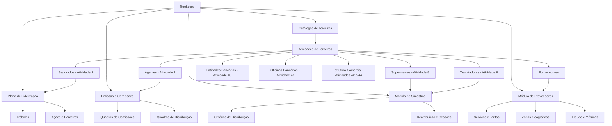
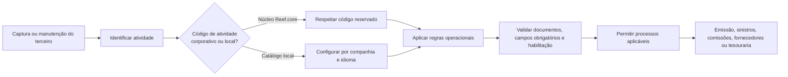

# Catálogos de Terceiros, Configurações Operacionais e Especializações de Reef.core

## 1. Metadados do Documento
- **Arquivo de Origem:** Não identificado — texto bruto fornecido na solicitação.
- **Tipo de Documento:** Especificação Técnica / Manual Funcional.
- **Domínio / Sistema:** Reef.core / MAPFRE / Gestão de Terceiros, Siniestros, Proveedores, Agentes e Fidelização.
- **Público-Alvo:** Desenvolvedores, Arquitetos, Operação, Tecnologia e Processos, Negócio, Tesouraria e Administração e Finanças.
- **Data/Versão Identificada:** Não identificada.

---

## 2. Resumo Executivo & Contexto de Negócio

O documento descreve a configuração funcional de catálogos de dados de terceiros no sistema **Reef.core**, utilizado no contexto operacional de entidades MAPFRE. Os catálogos classificam, identificam, validam, habilitam, inabilitam e relacionam pessoas físicas, pessoas jurídicas, agentes, segurados, fornecedores, entidades bancárias, supervisores, tramitadores e estruturas comerciais.

A **Atividade do Terceiro** é o principal eixo de classificação do modelo. Ela identifica a função que um terceiro desempenha no ecossistema segurador e determina processos operacionais aplicáveis. Por exemplo, um agente pode integrar o processo de cálculo de comissões; um perito pode participar da gestão de sinistros; um empregado pode receber descontos comerciais na emissão de apólices.

O núcleo de Reef.core reserva os códigos de atividade de **1 a 99**, além do código **999**, para uso exclusivo do sistema. Outros catálogos, como atividades econômicas, categorias, classificações, qualidades, perfis financeiros, regimes fiscais, documentos identificativos, cargos, consentimentos e relações entre terceiros, são configuráveis localmente, em geral por companhia e idioma.

O documento também descreve especializações por tipo de terceiro: segurados possuem configurações do Plano de Fidelização; agentes possuem quadros de comissões, fontes de produção, escritórios habilitados e subsídios; supervisores e tramitadores possuem critérios de distribuição de sinistros; fornecedores possuem catálogos de serviços, tarifas, zonas geográficas, acesso, desempenho e fraude.

A governança local é recorrente: diversas definições dependem da **Direção de Tecnologia local**, do departamento de **Tecnologia e Processos**, da área de **Administração e Finanças** ou das direções de negócio da entidade MAPFRE local. O documento enfatiza a necessidade de preservar valores corporativos configurados no núcleo Reef.core quando a operação exige padronização corporativa.

---

## 3. Arquitetura, Componentes & Tecnologias Envolvidas

### Componentes e domínios identificados

| Componente / Domínio | Função descrita |
| :--- | :--- |
| **Reef.core** | Núcleo do sistema que mantém catálogos, validações, terceiros, sinistros, emissão, comissões, fornecedores e meios de pagamento. |
| **Modelo de Dados de Terceiros** | Estrutura de dados para pessoas físicas, jurídicas, agentes, segurados, entidades bancárias, tramitadores e supervisores. |
| **Novo Modelo de Informação de Terceiros** | Modelo no qual entidades bancárias, escritórios bancários e níveis comerciais podem ser tratados como terceiros. |
| **Modelo antigo de dados de terceiros** | Modelo legado que deve ser considerado ao configurar atributos obrigatórios. |
| **Tabelas Oracle** | Catálogos do modelo de dados utilizados para configurar validações obrigatórias. |
| **Sequências Oracle** | Sequências locais necessárias quando documentos ou tokens são configurados para geração automática. |
| **Módulo de Notificações** | Substitui a funcionalidade obsoleta de métodos de envio. |
| **Módulo de Siniestros** | Gerencia supervisores, tramitadores, distribuição, especialização, reasignação e cessões temporárias de expedientes. |
| **Módulo de Juicios** | Referenciado para identificar sinistros ou expedientes em processo judicial. |
| **Estrutura de Produtos** | Fornece Setor, Ramo Técnico, tratamento de emissão e outros elementos para especialização operacional. |
| **Estrutura Comercial** | Organiza primeiro, segundo e terceiro níveis; também fornece escritórios comerciais e fontes de produção. |
| **Estrutura Geográfica** | Fornece níveis geográficos, código postal e dados de endereço. |
| **Tesouraria** | Mantém códigos de impostos, retenções, meios de cobrança/pagamento e tokenização. |
| **Plano de Fidelização** | Controla Tréboles, ações, tipos de ações e parceiros colaboradores. |
| **Módulo de Proveedores** | Configura fornecedores, serviços, tarifas, zonas, acessos, métricas e fraude. |
| **Sistema de Segurança** | Referenciado na configuração de papéis de acesso de fornecedores. |



### Fluxo de classificação e utilização de terceiros



---

## 4. Regras de Negócio, Especificações Funcionais & Processos

### 4.1 Atividades de Terceiros

A atividade representa uma qualidade associada a terceiros que permite vinculá-los à capacidade de executar determinada função no sistema. As atividades identificam processos, procedimentos e fluxos operacionais nos quais o terceiro intervém ou pode intervir.

Regras relevantes:

1. Os códigos de atividade de **1 a 99** e o código **999** são reservados para uso exclusivo do núcleo.
2. A atividade pode determinar a participação automática em processos. Um agente pode participar do cálculo de comissões; um perito pode receber atribuições de perícia; um empregado pode participar de descontos comerciais.
3. O atributo **Permite Documentos Fictícios** determina se a atividade pode estar associada a terceiros com documentos não reais ou fictícios.
4. O atributo **Corresponde a Proveedor** habilita definições específicas de fornecedor, incluindo zonas de atuação, serviços permitidos e horários.
5. O atributo **Código de Tercero** define se existe código interno do terceiro.
6. Quando o código interno estiver ativo, o sistema pode configurar sua geração automática.
7. O **Código de Estructura** identifica o programa ou estrutura para captura, manutenção e consulta de terceiros daquela atividade.
8. A definição do nome da estrutura e da agrupação de estruturas é responsabilidade da Direção de Tecnologia local.
9. O atributo de consulta para usuários de agências controla acesso à informação e reduz risco de infração ao Regulamento Geral de Proteção de Dados.
10. A atividade pode habilitar a geração de documentação mediante integração com o Módulo de Notificações.

### 4.2 Atividades Econômicas

Atividades econômicas classificam terceiros, empresas ou autônomos conforme o setor produtivo e suas subdivisões. O catálogo é entregue inicialmente vazio para configuração local segundo necessidades e regulamentações locais.

Regras relevantes:

- A configuração é realizada por companhia e idioma.
- O nível de risco ou vulnerabilidade pode assumir os valores: **Sin Riesgo**, **Bajo**, **Medio**, **Alto** e **Crítico**.
- A inabilitação bloqueia uso da atividade econômica na captura ou modificação do terceiro.
- A data de validade determina a disponibilidade operacional e suporta histórico de mudanças.
- A entidade MAPFRE local deve definir classificação apropriada para estatísticas internas ou utilizar classificações da Área Corporativa de Negócio e Clientes.

### 4.3 Campos obrigatórios por atividade

Reef.core permite configurar obrigatoriedade de atributos do modelo de dados durante a criação de terceiros.

Regras de seleção:

- **Ramo Técnico 999**: validação aplicável a todos os ramos.
- **Atividade 999**: validação aplicável a todas as atividades.
- **Intervenção `ZZ`**: validação aplicável a todas as intervenções associadas à atividade.
- **Âmbito `ZZ`**: valor genérico mencionado para pessoa física, jurídica ou ambas.
- O atributo deve ser identificado corretamente segundo o modelo de dados antigo ou novo.
- A lógica de negócio para obrigatoriedade e inabilitação é desenvolvida pela Direção de Tecnologia local.
- O conceito lógico evita ambiguidade de atributos iguais em contextos diferentes, como `PRS_PCE` para acionistas e representantes legais.

### 4.4 Identificação por documentos

Os tipos de documentos identificativos permitem identificação inequívoca de pessoas físicas e jurídicas.

Regras relevantes:

- Um tipo de documento pode ser aplicável a pessoa física, jurídica ou ambas.
- Quando aplicável a ambas, o atributo de uso deve permanecer sem valor.
- Um documento pode ser real ou fictício.
- Documentos alternativos permitem identificar o mesmo terceiro por chaves distintas, como NIF, NUU ou TEC.
- A captura de documentos alternativos não é permitida nos processos de Gestão de Pólizas e Contratos nem de Gestão de Siniestros e Prestaciones.
- A geração automática exige definição local da sequência Oracle utilizada.

### 4.5 Plano de Fidelização

O Plano de Fidelização permite associar Tréboles aos clientes segurados.

Regras relevantes:

1. O Trébol é a moeda do Plano de Fidelização.
2. Cada Trébol equivale a valor econômico definido por país.
3. Tréboles não podem ser convertidos em dinheiro.
4. Tréboles não expiram enquanto o cliente mantiver produtos contratados com MAPFRE.
5. Quando existir quantidade mínima de Tréboles, o canje ocorre automaticamente no primeiro recibo de renovação, emissão ou suplemento.
6. O sistema mantém registro de obtenção e canje de Tréboles.
7. O cliente pode consultar saldo via web, aplicações, escritório ou Centro de Clientes.
8. As ações de código **1 — Cobro del Recibo** e **2 — Anulado de Cobro del Recibo** devem ser definidas obrigatoriamente.
9. Ações positivas indicam Tréboles que podem ser redimidos para desconto de prêmio.
10. Ações negativas representam Tréboles monetizáveis, por exemplo em aquisição de serviços de parceiro externo.
11. Para ações que impactam recibos e admitem canje, como emissão, suplemento ou renovação, o número de Tréboles deve ser zero.
12. A lógica de negócio pode calcular dinamicamente a quantidade de Tréboles.

### 4.6 Agentes e comissões

Agentes são identificados pela atividade **2**. Configurações específicas incluem tipologias, quadros de comissões, quadros de distribuição, escritórios habilitados, subsídios, fontes de produção e métodos de envio de documentação.

Regras relevantes:

- O quadro de comissões vincula agente, tratamento de emissão e quadro de comissões.
- A inabilitação do quadro pode afetar somente nova produção ou também movimentos de carteira.
- Comissão de nova produção é percebida exclusivamente no primeiro ano de vigência da apólice.
- Comissão de carteira é associada a apólices vigentes em anos sucessivos.
- Um quadro de distribuição não pode ser modificado durante a emissão após estar pré-definido.
- Uma apólice pode possuir até seis figuras independentes de intermediação: agente principal, segundo, terceiro, quarto, organizador e assessor.
- O executivo de conta pode existir como sétima figura, mas não recebe comissões.
- O segundo, terceiro e quarto agentes repartem a comissão calculada para o agente principal.
- Organizador e assessor possuem comissões próprias.
- Caso o quadro de distribuição não tenha quadro de comissões associado, Reef.core obriga a captura do quadro durante a emissão.

### 4.7 Supervisores e tramitadores

Supervisores são identificados pela atividade **8** e tramitadores pela atividade **9**.

Regras de distribuição:

- Sinistros podem ser distribuídos por carga de trabalho ou por critérios específicos.
- Critérios de especialização incluem setor, ramo técnico, apólice, agente, contrato, subcontrato, estrutura comercial, tipo de expediente e características do sinistro.
- O setor genérico é **9999**.
- O ramo técnico genérico é **999**.
- O tipo de expediente genérico é **ZZZ**.
- A quantidade máxima de expedientes e o número de pendências podem impedir uma atribuição, mesmo se todos os critérios forem atendidos.
- Configurações de especialização também afetam a reassinatura de supervisores.
- Cessões temporárias entre tramitadores podem ocorrer por carga, eficiência, doença, férias ou ausência temporária.
- Na cessão, as operações ficam registradas com o usuário do tramitador destinatário, mas o código de tramitador permanece sendo o do cedente.
- A cessão futura entre supervisores é mencionada como funcionalidade não habilitada.

### 4.8 Fornecedores

Um terceiro é fornecedor apenas quando o atributo correspondente da atividade assim o determina explicitamente.

Domínios de configuração:

- Blocos de informação.
- Papéis de acesso.
- Permissões de acesso por papel e atividade.
- Tipologias e categorias.
- Estados e causas de estado.
- Serviços e critérios de atribuição.
- Zonas geográficas.
- Tarifas e conceitos tarifários.
- Métricas de serviço.
- Fraudes, classificações, tipologias, motivos, conclusões e estados.
- Incidências, queixas, reclamações e felicitações — I.Q.R.F.
- Formação, mencionada como bloco ainda não implementado.

A lógica de negócio para atribuição de serviços pode avaliar proximidade, capacidade e avaliação. A nomenclatura, implementação e associação desta lógica são responsabilidades do departamento local de Tecnologia e Processos.

---

## 5. Tabelas de Parâmetros, Ambientes e Estruturas de Dados

### 5.1 Atividades de terceiros reservadas pelo núcleo

| Código | Atividade |
| :--- | :--- |
| 1 | Tomadores / Asegurados |
| 2 | Agentes |
| 3 | Peritos |
| 4 | Inspectores |
| 5 | Médicos |
| 6 | Abogados |
| 7 | Procuradores |
| 8 | Supervisores |
| 9 | Tramitadores |
| 10 | Proveedores |
| 11 | Ejecutivos de Cta. |
| 12 | Cobradores |
| 13 | Aseguradoras |
| 14 | Reaseguradoras |
| 15 | Empleados |
| 16 | Brokers |
| 17 | Talleres |
| 18 | Clínicas |
| 19 | Juzgados |
| 20 | Cristaleros |
| 21 | Cerrajeros |
| 22 | Plomeros |
| 23 | Electricistas |
| 24 | Grúas |
| 25 | Investigadores |
| 26 | Recuperadores |
| 27 | Ajustadores |
| 28 | Herreros |
| 29 | Tribunales |
| 30 | Terceros Seg. MOTOR |
| 31 | Terceros Seg. SALUD |
| 32 | Terceros Seg. PATRIMONIALES |
| 33 | Depósitos |
| 34 | Notarías |
| 35 | Centros de Peritación |
| 36 | Comisarías |
| 37 | Empleados de Agentes |
| 38 | Filial |
| 39 | Compañías |
| 40 | Entidades Bancarias |
| 41 | Oficinas Bancarias |
| 42 | Primer Nivel Est. Comercial |
| 43 | Segundo Nivel Est. Comercial |
| 44 | Tercer Nivel Est. Comercial |
| 45 | Representantes Legales |
| 99 | Otros Beneficiarios |
| 999 | Código reservado / genérico conforme ao contexto do catálogo |

### 5.2 Catálogos Oracle para validação de campos obrigatórios

| Atividade | Catálogo do Modelo de Dados |
| :--- | :--- |
| Asegurado | X1000802 |
| Agente | A1001332 |
| Tercero Genérico | A1001300 |
| Supervisor | A1001338 |
| Tramitador | A1001339 |
| Aseguradora | A1000600 |
| Reaseguradora | G2000157 |
| Broker | G2000155 |
| Empleado de Agente | A1001337 |
| Compañía | A1000900 |
| Entidad Bancaria | A5020900 |
| Oficina Bancaria | A5020910 |
| Primer Nivel Estructura Comercial | A1000700 |
| Segundo Nivel Estructura Comercial | A1000701 |
| Tercer Nivel Estructura Comercial | A1000702 |

### 5.3 Valores genéricos relevantes

| Item / Parâmetro | Descrição / Função | Tipo / Valores / Formato | Ambiente / Observações |
| :--- | :--- | :--- | :--- |
| Ramo Técnico genérico | Aplica validação ou especialização a todos os ramos | `999` | Campos obrigatórios, supervisores e tramitadores |
| Setor genérico | Aplica configuração a todos os setores | `9999` | Supervisores e tramitadores |
| Atividade genérica | Aplica validação a todas as atividades | `999` | Campos obrigatórios |
| Intervenção genérica | Aplica validação a todas as intervenções | `ZZ` | Campos obrigatórios |
| Âmbito genérico | Valor genérico mencionado para âmbito da validação | `ZZ` | Pessoa física, jurídica ou ambas |
| Tipo de expediente genérico | Aplica atuação a todos os tipos de expediente | `ZZZ` | Atuação secundária de tramitador |
| Documento padrão de bancos | Tipo de documento quando não existir documento próprio | `THP` | Entidades e escritórios bancários |
| Código de atividade bancária | Constante para entidade bancária | `40` | Não modificável |
| Código de atividade de oficina bancária | Constante para escritório bancário | `41` | Não modificável |

### 5.4 Catálogos multipropósito obrigatoriamente respeitados

| Código | Catálogo |
| :--- | :--- |
| 1 | Tipo de Sociedad |
| 2 | Grupo Empresarial |
| 3 | Titulación |
| 4 | Zonas Horarias |
| 5 | Segmentación Clientes |
| 6 | Dispositivo |
| 7 | Canal |

### 5.5 Exemplos de classificações e catálogos

| Catálogo | Código | Descrição |
| :--- | :--- | :--- |
| Atividade econômica | 001 | Actividad Comercial |
| Atividade econômica | 002 | Actividad Administraciones Públicas - AA.P |
| Atividade econômica | 003 | Actividad Industrial |
| Atividade econômica | 004 | Actividad Servicios |
| Rating | 001 | Grado Inversión Baa2 |
| Rating | 002 | Grado Inversión Baa3 |
| Rating | 003 | Grado Especulativo Ba1 |
| Cargo jurídico | CEO | Consejero Delegado |
| Cargo jurídico | CFO | Chief Financial Oficer |
| Cargo jurídico | CMO | Chief Marketing Oficer |
| Cargo jurídico | CIO | Chief Information Oficer |
| Meio de pagamento | 001 | Cuenta Bancaria / Cuenta Corriente |
| Meio de pagamento | AAA | Pago Móvil/Celular / Apple Pay |
| Meio de pagamento | AA1 | Tarjeta Bancaria / Crédito |
| Estado da licença | 001 | En Vigor |
| Estado da licença | CAD | Caducado |
| Estado da licença | 04A | Suspendido |

### 5.6 Tipos de ação do Plano de Fidelização

| Tipo | Descrição |
| :--- | :--- |
| 1 | REDIMIR GENÉRICO |
| 2 | INCREMENTAR GENÉRICO |

### 5.7 Classificação de subsídios de agentes

| Parâmetro | Valores corporativos citados |
| :--- | :--- |
| Classificação da subvenção | `1` SUBVENCIÓN MENSUAL; `2` APLICACIÓN EN EL COBRO Y ANULADO DE COBRO DE LOS RECIBOS |
| Forma de aplicação | `1` IMPORTE; `2` PORCENTAJE; `3` LÓGICA DE NEGOCIO |
| Agrupação contábil do conceito de ajuste | Deve ser do tipo `MP` |
| Restrição tributária | Códigos de conceitos de ajuste devem estar livres de impostos |

### 5.8 Estados e fraude de fornecedores

| Catálogo | Código | Descrição |
| :--- | :--- | :--- |
| Classificação de fraude | DOL | Doloso |
| Classificação de fraude | OCA | Ocasional |
| Estado da gestão de fraude | ASG | Asignado |
| Estado da gestão de fraude | CLD | Concluido |
| Estado da gestão de fraude | INV | Investigación de Campo |
| Estado da gestão de fraude | RDI | En Revisión DISMA |
| Estado da gestão de fraude | REV | En Revisión |
| Motivo de fraude | APD | Documentos Apócrifos |
| Motivo de fraude | CIO | Reclamo Lesiones Fuera Accidente |
| Motivo de fraude | CSD | Reclamo Mismos Daños |
| Motivo de fraude | DPR | Daños Preexistentes |
| Motivo de fraude | FRI | Fraude Interno |
| Tipo de conclusão | ACP | Procedente |
| Tipo de conclusão | RJT | Rechazado |
| Tipologia de fraude | FNC | Fraude no Confirmado |
| Tipologia de fraude | FRC | Fraude Confirmado |
| Tipologia de fraude | FRP | Fraude Parcial |
| Tipologia de fraude | FWE | Fraude Identificado sin Pruebas |
| Tipologia de fraude | PEG | Pago Ex-Gratia |
| Tipologia de fraude | POC | Pago a Criterio |

---

## 6. Bateria de Perguntas & Respostas para RAG (FAQ Sintético)

### P1: Qual é a função da atividade de um terceiro em Reef.core?
**R:** A atividade é uma classificação que associa um terceiro à sua capacidade de realizar determinada função no sistema. A atividade identifica processos, procedimentos e fluxos operacionais nos quais o terceiro participa ou pode participar. Por exemplo, a atividade de agente permite participação no processo de cálculo de comissões; a de perito permite atuação em tarefas de sinistros; e a de empregado pode habilitar descontos comerciais em apólices.

### P2: Quais códigos de atividade devem ser obrigatoriamente respeitados?
**R:** Os códigos de atividade de 1 a 99, além do código 999, são reservados e de uso exclusivo pelo núcleo de Reef.core. A codificação local não deve substituir, reutilizar ou alterar esses códigos corporativos.

### P3: Como configurar validações obrigatórias de dados de terceiros?
**R:** A configuração utiliza companhia, catálogo Oracle do modelo de dados, ramo técnico, código de atividade, intervenção, âmbito, atributo do catálogo e conceito lógico. O ramo técnico `999` representa todos os ramos, a atividade `999` representa todas as atividades e a intervenção `ZZ` representa todas as intervenções relacionadas à atividade. A lógica para obrigatoriedade ou inabilitação pode ser desenvolvida pela Direção de Tecnologia local.

### P4: Documentos alternativos podem ser usados em todos os processos?
**R:** Não. Documentos alternativos podem identificar um mesmo terceiro por chaves diferentes, mas sua captura não é permitida e não deve ser permitida nos processos de Gestão de Pólizas e Contratos nem de Gestão de Siniestros e Prestaciones.

### P5: Como funciona o uso dos Tréboles no Plano de Fidelização?
**R:** Tréboles são a moeda do Plano de Fidelização MAPFRE. Não podem ser convertidos em dinheiro, não expiram enquanto o cliente mantiver produtos MAPFRE e são canjeados automaticamente quando houver quantidade mínima, no primeiro recibo de renovação, emissão ou suplemento. Todas as obtenções e canjes devem ser registrados, e o cliente deve conseguir consultar o saldo pelos canais disponibilizados pela entidade.

### P6: Quais ações do Plano de Fidelização são obrigatórias?
**R:** As ações de código `1 — Cobro del Recibo` e `2 — Anulado de Cobro del Recibo` devem obrigatoriamente estar definidas para a entidade.

### P7: Qual é a diferença entre comissão de nova produção e comissão de carteira?
**R:** A comissão de nova produção é percebida exclusivamente durante o primeiro ano de vigência da apólice e normalmente possui valor superior para estimular captação de novas operações. A comissão de carteira é originada por apólices vigentes em anos subsequentes e persiste enquanto as apólices originadas pela gestão comercial do agente estiverem vigentes.

### P8: Quantas figuras de intermediação podem existir em uma apólice?
**R:** A apólice pode conter até seis figuras independentes de intermediação: agente principal, segundo agente, terceiro agente, quarto agente, organizador e assessor. Pode existir adicionalmente um executivo de conta, que não recebe comissão, mas pode estar comercialmente associado ao agente principal.

### P9: Quais critérios podem especializar a atribuição de sinistros a um tramitador?
**R:** A atribuição pode considerar setor, ramo técnico, número de apólice, agente, apólice grupo, contrato, subcontrato, níveis da estrutura comercial, tipo de expediente, processo judicial, perda total, ocorrência no exterior, cliente VIP e existência de contrário em MAPFRE. A atribuição também depende da carga máxima e da quantidade de expedientes pendentes.

### P10: O que acontece quando um tramitador recebe temporariamente os expedientes de outro?
**R:** Durante uma cessão temporária, as operações executadas permanecem registradas com o código de usuário do tramitador que efetivamente realizou a operação. Entretanto, o código de tramitador associado aos casos continua sendo o do tramitador cedente.

### P11: Quem é responsável por definir a lógica de atribuição de serviços a fornecedores?
**R:** A responsabilidade pela nomenclatura, implementação e associação da lógica de negócio para atribuição de serviços a fornecedores pertence ao departamento de Tecnologia e Processos da entidade MAPFRE local. A lógica pode considerar critérios como proximidade, capacidade e avaliação.

### P12: Quais restrições existem na configuração de meios de cobrança e pagamento?
**R:** Devem ser respeitados obrigatoriamente os tipos de meios de cobrança/pagamento, os tipos de validação e os tipos de mascaramento definidos e habilitados pelo núcleo de Reef.core. Cada código de meio de cobrança/pagamento pode exigir método específico de validação e mascaramento conforme seu tipo.

### P13: Como entidades bancárias são identificadas no novo modelo de terceiros?
**R:** Entidades bancárias usam a atividade constante `40`, que não pode ser modificada. Devem possuir tipo e chave de documento identificativo; quando não houver documento próprio, o tipo de documento é `THP`. O catálogo também contém chave bancária, dados de contato, estrutura geográfica, SWIFT/BIC, tipo de entidade, tipo de instituição, tipo de domicialização e outros atributos operacionais.

### P14: Qual é o status dos métodos de envio de documentação?
**R:** O catálogo de métodos de envio está descontinuado e obsoleto no núcleo do sistema. Ele não pode ser usado nem reutilizado para finalidades locais. A funcionalidade foi substituída pelo Módulo de Notificações de Reef.core.

### P15: Quais blocos de fornecedores ainda não estão implementados?
**R:** O bloco de informação de formação de fornecedores é indicado como pendente de funcionalidade e não implementado. Essa limitação aparece tanto nos tipos de acesso aos blocos quanto na configuração de blocos por atividade do fornecedor.

---

## 7. Glossário de Termos, Siglas & Conceitos-Chave

- **Asegurado:** Segurado ou cliente identificado pela atividade `1`.
- **BIC:** *Bank Identifier Code*; denominação alternativa ao código SWIFT.
- **BM25:** Não mencionado no documento-fonte; não utilizado como regra funcional de Reef.core.
- **Catálogo:** Repositório configurável de códigos, descrições, relações e regras operacionais.
- **Código de Actividad:** Código que classifica o terceiro conforme sua função no sistema.
- **Código SWIFT:** Código alfanumérico de 8 ou 11 dígitos utilizado para identificar banco receptor de transferência internacional.
- **Concepto Contable:** Conceito de cobrança e pagamento diverso utilizado, entre outros usos, para pagamento a fornecedores.
- **DPM:** Daños Materiales Propios; exemplo de tipo de expediente.
- **I.Q.R.F.:** Incidencias, Quejas, Reclamaciones y Felicitaciones.
- **KYC:** *Know Your Customer*; citado no contexto de práticas para identificação de clientes.
- **Lógica de Negocio:** Componente ou regra de software desenvolvida localmente para calcular, validar, obrigar, inabilitar ou selecionar comportamentos.
- **MAPFRE:** Entidade corporativa referenciada no documento.
- **Módulo de Notificaciones:** Módulo que substitui a funcionalidade obsoleta dos métodos de envio.
- **PEP / P.E.P.:** *Politically Exposed Person*; pessoa politicamente exposta.
- **Ramo Técnico:** Classificação de produtos de seguro utilizada em validações e especializações.
- **Reef.core:** Sistema núcleo descrito no documento.
- **SEPA:** Zona Única de Pagamentos em Europa.
- **Siniestro:** Sinistro.
- **THP:** Tipo de documento padrão para entidades ou escritórios bancários sem documento identificativo próprio.
- **Token / Toquen:** Ficha digital que substitui o número tradicional de conta ou cartão em transações.
- **Tramitador:** Responsável pela gestão de expedientes de sinistros.
- **Trébol:** Moeda utilizada no Plano de Fidelização MAPFRE.
- **Proveedor:** Terceiro configurado como fornecedor.
- **ZZ / ZZZ:** Valores genéricos usados em determinados contextos de validação e especialização.

---

## 8. Notas Críticas, Riscos & Limitações

- **Códigos corporativos reservados:** códigos de atividade de 1 a 99 e 999 não devem ser redefinidos localmente.
- **Proteção de dados:** a permissão de consulta para usuários de agências controla acesso a informações de terceiros e busca reduzir risco de infração ao Regulamento Geral de Proteção de Dados.
- **Modelo de dados:** a configuração de campos obrigatórios depende de identificar corretamente se a instalação usa o modelo antigo ou o novo modelo de terceiros.
- **Dependência tecnológica local:** lógicas de negócio, sequências Oracle, nomes de estruturas e valores de listas de valores podem depender da Direção de Tecnologia local.
- **Métodos de envio obsoletos:** o catálogo de métodos de envio foi substituído pelo Módulo de Notificações e não deve ser reutilizado.
- **Documentos alternativos:** não podem ser capturados em Gestão de Pólizas e Contratos nem em Gestão de Siniestros e Prestaciones.
- **Capacidade operacional:** critérios de atribuição de sinistros não garantem atribuição quando o tramitador atingiu máximo de expedientes ou possui muitas pendências.
- **Cessões entre supervisores:** o documento declara que a possibilidade de cessão futura de sinistros entre supervisores ainda não está habilitada.
- **Bloco de formação de fornecedores:** o bloco está pendente de funcionalidade e não implementado.
- **Inconsistências textuais do documento:** as seções de Primeiro, Segundo e Terceiro Nível da Estrutura Comercial referem-se repetidamente ao “Primer Nivel” e a “Tramitador” em campos de inabilitação; a análise preserva o conteúdo sem inferir correções funcionais.
- **Nota de Análise:** o documento descreve diversos catálogos e propriedades, mas não apresenta contratos de API, métodos HTTP, URLs, portas, formatos JSON, versões de software ou topologia de infraestrutura.
- **Nota de Análise:** a seção de fornecedores lista vários catálogos, mas nem todos possuem detalhamento de campos ou regras operacionais no conteúdo fornecido.

---

## 9. Conteúdo Bruto Estruturado (Referência Fiel)

```text
O conteúdo bruto de referência foi fornecido integralmente na solicitação e compreende, entre outros, os seguintes blocos literais de documentação:

- DEFINICIÓN de las Actividades de los Terceros
- DEFINICIÓN de las Actividades Económicas
- DEFINICIÓN de las Agrupaciones de Terceros
- DEFINICIÓN de los Códigos de Calificación (Rating)
- DEFINICIÓN de los Campos Obligatorios en el Registro de la Información de los Terceros, por Actividad del Tercero
- DEFINICIÓN de Cargos en Personas Jurídicas
- DEFINICIÓN del Catálogo de Catálogos Multipropósito de Terceros
- DEFINICIÓN de Categorías
- DEFINICIÓN de las Causas de Inhabilitación por Actividad del Tercero
- DEFINICIÓN de las Causas de Inhabilitación de Terceros
- DEFINICIÓN de las Clasificaciones de Terceros
- DEFINICIÓN de los Códigos de Calidad
- DEFINICIÓN de los Consentimientos de los Asegurados
- DEFINICIÓN de Departamentos de Empresas
- DEFINICIÓN de Tipos de Documentos Identificativos de Terceros
- DEFINICIÓN de las ENTIDADES COMERCIALIZADORAS de los Medios de Cobro y Pago de los Terceros
- DEFINICIÓN de los Estados del Permiso de Conducir
- DEFINICIÓN de Impuestos y Retenciones por Actividad
- DEFINICIÓN de las Intervenciones Permitidas por Código de Actividad de los Terceros
- DEFINICIÓN de las Clasificaciones de los Medios de Cobro/Pago
- DEFINICIÓN de Niveles de Estudios de Terceros
- DEFINICIÓN de Parentescos y Relaciones entre Terceros
- DEFINICIÓN de Perfiles Financieros de Terceros
- DEFINICIÓN de Cargos de Personas Políticamente Expuestas
- DEFINICIÓN de Profesiones/Ocupaciones
- DEFINICIÓN de Regímenes Fiscales
- DEFINICIÓN de los Tipos de Personas Jurídicas
- DEFINICIÓN de las Titulaciones de los Terceros
- DEFINICIÓN de los Tipos de Token en los Medios de Cobro o Pago
- DEFINICIÓN de los ASEGURADOS
- DEFINICIÓN del PLAN de FIDELIZACIÓN de la Entidad MAPFRE
- DEFINICIÓN de las ACCIONES que permiten SUMAR/RESTAR TRÉBOLES
- DEFINICIÓN de las SOCIOS COLABORADORES del PLAN de FIDELIZACIÓN
- DEFINICIÓN de los TIPOS de ACCIONES que permiten Sumar/Restar TRÉBOLES
- DEFINICIÓN de los AGENTES
- DEFINICIÓN de los Cuadros de Comisiones de un Agente
- DEFINICIÓN de los Cuadros de Comisiones de la Compañía
- Cuadro de distribución de comisiones
- DEFINICIÓN de la Relación de Agentes y Fuentes de Producción
- DEFINICIÓN de los Métodos de Envío
- DEFINICIÓN de las Oficinas Habilitadas por Agente
- DEFINICIÓN de las SUBVENCIONES Concedidas a los Agentes
- DEFINICIÓN de las Tipologías de Agentes
- DEFINICIÓN de los TERCEROS GENÉRICOS
- DEFINIR los GRUPOS FAMILIARES o JERARQUIZADOS de los TERCEROS
- DEFINICIÓN de las Posibles RELACIONES y CONEXIONES de los TERCEROS
- CONFIGURAR las RELACIONES Existentes entre TERCEROS
- DEFINICIÓN de los SUPERVISORES
- DEFINIR los CRITERIOS de ASIGNACIÓN del SUPERVISOR
- DEFINIR la Información del SUPERVISOR, RESPONSABLE de SUPERVISORES
- DEFINIR Información del SUPERVISOR de SINIESTROS
- DEFINICIÓN de los TRAMITADORES
- DEFINIR Actuaciones del Tramitador
- DEFINIR CESIONES TEMPORALES de Expedientes del TRAMITADOR
- DEFINIR CRITERIOS de ASIGNACIÓN del TRAMITADOR
- DEFINIR Información del TRAMITADOR de SINIESTROS
- DEFINICIÓN de las Compañías ASEGURADORAS
- DEFINICIÓN de las Compañías REASEGURADORAS
- DEFINIR Códigos de Calificación para reaseguradoras
- DEFINICIÓN de los BROKERS
- DEFINICIÓN de los EMPLEADOS de AGENTES
- DEFINICIÓN de las COMPAÑÍAS
- DEFINICIÓN de las ENTIDADES BANCARIAS
- DEFINICIÓN de Entidades Bancarias
- DEFINICIÓN de las OFICINAS BANCARIAS
- DEFINICIÓN de las Oficinas Bancarias
- DEFINICIÓN del PRIMER NIVEL de la ESTRUCTURA COMERCIAL
- DEFINICIÓN del SEGUNDO NIVEL de la ESTRUCTURA COMERCIAL
- DEFINICIÓN del TERCER NIVEL de la ESTRUCTURA COMERCIAL
- DEFINICIONES de PROVEEDORES
- DEFINICIÓN de los CRITERIOS de ASIGNACIÓN de los SERVICIOS a PROVEEDORES
- CONFIGURAR ACCESOS a BLOQUES de INFORMACIÓN por ACTIVIDAD y ROL del PROVEEDOR
- CONFIGURAR BLOQUES de INFORMACIÓN por ACTIVIDAD del PROVEEDOR
- DEFINICIÓN de las CATEGORÍAS de los PROVEEDORES
- DEFINICIÓN de las CAUSAS por ESTADO del PROVEEDOR
- DEFINICIÓN de CLASIFICACIONES de FRAUDES
- CONFIGURACIÓN de los CONCEPTOS de TARIFA de los PROVEEDORES por ZONA GEOGRÁFICA y TARIFA
- DEFINICIÓN de los CONCEPTOS de TARIFA de los PROVEEDORES
- DEFINICIÓN de CONTROL de IMPORTES del FRAUDE por RAMO
- DEFINICIÓN de los ESTADOS de GESTIÓN de los FRAUDES
- DEFINICIÓN de FRAUDE
- DEFINICIÓN de las MÉTRICAS de SERVICIO de los PROVEEDORES
- DEFINICIÓN de los MOTIVOS de los FRAUDES por TIPOS de FRAUDES
- DEFINICIÓN de los MOTIVOS de los FRAUDES
- CONFIGURAR ROLES de ACCESO de PROVEEDORES
- DEFINICIÓN de los SERVICIOS por Actividad, Tipología y Categoría del PROVEEDOR
- DEFINICIÓN de los SERVICIOS de PROVEEDORES
- CONFIGURACIÓN de las TARIFAS por Actividad, Tipología y Categoría del PROVEEDOR
- DEFINICIÓN de TARIFAS de PROVEEDORES
- DEFINICIÓN de TIPOLOGÍAS de CONCLUSIÓN de FRAUDES
- DEFINICIÓN de las TIPOLOGÍAS de los FRAUDES
- CONFIGURACIÓN de las TIPOLOGÍAS de los PROVEEDORES por ACTIVIDAD
- DEFINICIÓN de las TIPOLOGÍAS de los PROVEEDORES
- CONFIGURACIÓN de las TIPOLOGÍAS y CATEGORÍAS de los PROVEEDORES por ACTIVIDAD
- RELACIÓN de ZONAS GEOGRÁFICAS y ESTRUCTURA GEOGRÁFICA en PROVEEDORES

Nota de fidelidade: esta seção indexa os títulos e conteúdos tratados na transcrição fornecida. Para auditoria literal completa, o texto bruto original da solicitação deve ser preservado como artefato-fonte separado, pois contém toda a redação, exemplos, tabelas e repetições extraídas do documento.
```
