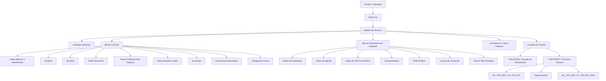
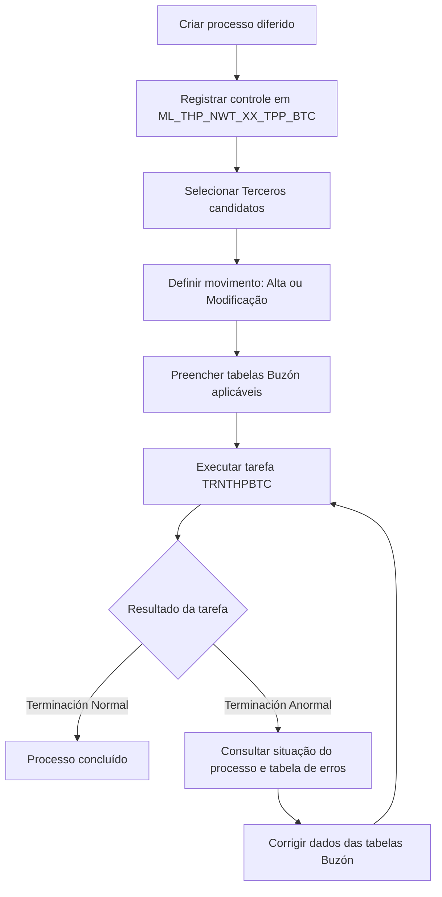

# Reef.core — Gestão de Terceiros, Asegurados, Proveedores e Processos Massivos Diferidos

## 1. Metadados do Documento
- **Arquivo de Origem:** `Texto bruto fornecido na conversa`
- **Tipo de Documento:** Manual Operacional e Especificação Técnica
- **Domínio / Sistema:** Reef.core — Módulo de Terceros
- **Público-Alvo:** Desenvolvedores, Arquitetos, Operação, Analistas Funcionais e Negócio
- **Data/Versão Identificada:** Não identificada

---

## 2. Resumo Executivo & Contexto de Negócio

O documento descreve o módulo **Terceros** do sistema **Reef.core**, utilizado para cadastrar, consultar, modificar, inabilitar e processar informações de pessoas físicas e jurídicas. Um Tercero pode assumir múltiplas atividades, tais como Asegurado, Agente, Proveedor, Tercero Genérico, Supervisor, Tramitador, Companhia Aseguradora, Companhia Reaseguradora, Broker, Entidade Bancária e níveis da estrutura comercial.

O módulo organiza informações em blocos compartilhados — dados básicos, identificação, contatos, endereços, documentos alternativos, representantes legais, acionistas, dados bancários, obrigações fiscais e informações de Pessoas Politicamente Expostas — e em blocos específicos por atividade. Para Asegurados, existem ainda consentimentos, perfil analítico, licença de condução, dados de cliente e classificação como Tercero No Deseado.

O documento também apresenta o processamento massivo/diferido de Terceros. Esse processo usa tabelas de controle e tabelas-buzón para registrar candidatos, movimentos de criação ou modificação, detalhes por bloco de informação e erros resultantes da validação. A execução ocorre pela tarefa **`TRNTHPBTC`**, enquanto a geração de documentação do Tercero ocorre pela tarefa **`TRNJVC001`**.

O modelo prioriza histórico temporal, qualidade de dados, inabilitação controlada, rastreabilidade e consistência entre blocos. Datas de validade, indicadores de inabilitação, documentos identificadores, códigos de atividade e chaves de companhia são elementos recorrentes para garantir a operação correta no Reef.core.

---

## 3. Arquitetura, Componentes & Tecnologias Envolvidas

### Componentes funcionais identificados

| Componente | Responsabilidade |
| :--- | :--- |
| **Reef.core** | Sistema central que suporta a gestão de Terceros, catálogos, processos diferidos, tarefas e consultas. |
| **Módulo de Terceros** | Cadastro, consulta, alteração, inabilitação e tratamento de pessoas físicas e jurídicas. |
| **Catálogos Maestros** | Definem valores válidos para atividades, documentos, categorias, impostos, profissões, consentimentos, meios de pagamento, moedas, países e outros domínios. |
| **Lanzador de Tareas** | Mecanismo utilizado para executar tarefas do núcleo do sistema. |
| **TRNJVC001** | Tarefa do núcleo para geração e envio de documentos de saída do Tercero, segundo a configuração de Notificações. |
| **TRNTHPBTC** | Tarefa usada para executar processos massivos/diferidos do módulo de Terceros. |
| **Tabelas de Controle Batch** | Registram candidatos, identificação do processo, status, ordem e thread de execução. |
| **Tabelas Buzón** | Armazenam dados de entrada para criação ou modificação massiva de Terceros. |
| **Tabela de Erros Batch** | Registra erros de processamento, observações e rota em que cada erro ocorreu. |
| **Módulo de Notificações** | Configura a geração e envio de documentos de saída associados ao Tercero. |
| **Configuração de Companhia** | Determina parâmetros locais, obrigatoriedade de campos, controles de prevenção a lavagem de dinheiro e comportamento de telas. |

### Arquitetura funcional



### Fluxo do processo massivo/diferido



---

## 4. Regras de Negócio, Especificações Funcionais & Processos

### 4.1 Conceito de Tercero

- **Tercero** é a entidade gerida pelo módulo e pode ser pessoa física ou pessoa jurídica.
- O documento declara que **Personas Físicas**, **Personas Jurídicas** e **Terceros** podem ser usados como termos equivalentes na documentação do módulo, embora determinados blocos sejam exclusivos de uma tipologia.
- A obrigatoriedade, habilitação e disponibilidade de campos dependem:
  1. do código de atividade do Tercero;
  2. da classificação como pessoa física ou jurídica;
  3. de configurações locais;
  4. de parâmetros de companhia;
  5. de alterações locais implementadas na instalação.

### 4.2 Atividades de Terceros

As definições específicas são organizadas por código de atividade. O documento cita:

- Asegurado;
- Agente;
- Tercero Genérico;
- Supervisor;
- Tramitador;
- Companhia Aseguradora;
- Companhia Reaseguradora;
- Broker de Seguros;
- Empregado de Agência/Agente;
- Companhia do Sistema;
- Entidade Bancária;
- Oficina Bancária;
- Primeiro, Segundo e Terceiro Nível da Estrutura Comercial;
- Proveedor.

### 4.3 Gestão de Zonas Geográficas para Proveedores

As zonas geográficas permitem dividir a organização territorial de países para uso por Proveedores. Existem dois níveis funcionais:

1. **Definição de Zonas Geográficas configuradas para Proveedores**;
2. **Associação de Zonas Geográficas ao Proveedor por atividade, tipologia e categoria**.

Regras identificadas:

- A associação pode ser inabilitada.
- A data de validade determina quando uma configuração se torna operacional e suporta histórico.
- Não existe recomendação corporativa obrigatória para padronizar códigos de zonas.
- A entidade MAPFRE deve avaliar a conveniência de usar o catálogo de forma transversal.
- O documento sugere distinguir zonas relacionadas a **Tarifas** das zonas relacionadas a **Asignaciones de Proveedores**.

### 4.4 Regras de identificação e histórico

- O Tipo e a Chave do Documento Identificador identificam o Tercero.
- Um documento principal pode relacionar diversos documentos a uma mesma pessoa ou entidade.
- O **ID único do Tercero** pode ser gerado por lógica de negócio local para rastreabilidade, integração e cruzamento de informações.
- O ID único **não substitui** o código interno do Tercero em Reef.core.
- A data de validade é usada de forma recorrente para indicar quando um registro se torna operacional e para manter o histórico das mudanças.

### 4.5 Regras de inabilitação

- A inabilitação indica que determinado registro deixou de ser aplicável aos processos operacionais.
- O documento prevê inabilitação para Terceros, contatos, endereços, documentos alternativos, representantes legais, acionistas, consentimentos, meios de pagamento, obrigações fiscais e zonas geográficas.
- Para dados de Asegurado, caso seja marcada a inabilitação, deve ser indicada uma causa de inabilitação quando aplicável.
- Existe uma regra explícita de coerência no processo massivo: se um Tercero for indicado como inabilitado, deve ser informada a causa correspondente.

### 4.6 Regras para contatos

- Um meio de contato pode ter um uso, tipo, valor, sequência, prioridade, indicação de padrão, validação, validade e inabilitação.
- Só pode existir **um meio de contato por defeito por uso de meio de contato**.
- Só pode existir **um meio de contato prioritário para o total de meios de contato do Tercero**.
- Um contato de referência recebe notificações quando:
  - o controle de limite de prêmios para prevenção à lavagem de dinheiro está ativo na companhia;
  - o Tercero é pessoa jurídica;
  - foi informado que o Tercero deve receber notificações.
- E-mail deve conter formato de e-mail; telefone deve obedecer às regras dos planos nacionais de numeração telefônica.

### 4.7 Regras para endereços

- Só pode existir uma direção padrão por Tercero.
- Só pode existir uma direção fiscal por Tercero.
- O campo **Complemento Dirección** é excludente em relação ao campo **Complemento País**.
- Complemento País pode ser utilizado sem validação quando a estrutura territorial do país da direção não existir nos catálogos locais.
- Latitude e longitude devem ser fornecidas em graus, minutos e segundos, acompanhadas da orientação cardinal.

### 4.8 Regras para meios de cobrança e pagamento

- Um Tercero pode ter contas, cartões e outros meios de cobrança/pagamento.
- Só pode existir um meio padrão entre todos os meios de cobrança/pagamento do Tercero.
- Só pode existir um meio prioritário por tipo de meio de cobrança/pagamento.
- Após a validação de um meio de cobrança/pagamento, o sistema permite somente sua inabilitação, e não a modificação de seus dados.
- O valor real do meio pode ser conta ou cartão; o documento também prevê valor mascarado, valor criptografado, chave de criptografia e token.

### 4.9 Regras para acionistas

- A gestão de acionistas é aplicável quando o Tercero é pessoa jurídica.
- O objetivo inclui apoiar o cumprimento de normas de prevenção a lavagem de ativos monetários.
- A soma dos percentuais dos acionistas não inabilitados não pode superar **100%**.
- Um acionista pode ser registrado já marcado como inabilitado.

### 4.10 Pessoas Politicamente Expostas e representantes legais

- Um Tercero pode ser identificado como Pessoa Politicamente Exposta ou relacionado a familiar/colaborador com essa condição.
- A marca de Pessoa Politicamente Exposta habilita o painel de detalhes correspondente.
- Representantes legais podem ter marca de Pessoa Politicamente Exposta, Pessoa Investigada e realização de atividades ilícitas.
- A descrição de atividades ilícitas deve ser informada quando a marca de atividades ilícitas estiver ativa.
- O representante legal deve estar previamente registrado no sistema e identificado pelo código de atividade **45**, conforme descrito para a consulta de representantes legais.

### 4.11 Tercero No Deseado

- Um Tercero pode ser classificado como não desejado por qualidade, validade, setor, ramo, terceiro nível comercial, agente, estado, causa e comentários.
- O código genérico **9999** para setor permite marcar o Tercero como não desejado para todos os setores.
- O código genérico **999** para ramo permite marcar o Tercero como não desejado para todos os ramos.
- O código genérico **9999** para terceiro nível da estrutura comercial permite marcar o Tercero como não desejado para todas as oficinas.
- Também é possível aplicar a classificação somente a um setor, ramo ou oficina específicos.

### 4.12 Processo massivo/diferido

1. Criar o movimento diferido no catálogo de controle.
2. Informar companhia, identificador do processo, data de tratamento, ordem e thread.
3. Selecionar Terceros candidatos.
4. Definir o tipo de movimento: **Alta** ou **Modificación**.
5. Preencher as tabelas Buzón aplicáveis.
6. Garantir coerência entre os dados registrados nos diferentes buzones.
7. Executar a tarefa **`TRNTHPBTC`**.
8. Consultar o histórico de execução.
9. Se a situação for **Terminación Anormal**, consultar o catálogo mestre de processos diferidos e a tabela de erros.
10. Corrigir os dados inválidos e executar novamente o processo até a conclusão.

Estados possíveis do processo para candidatos:

1. **Sin Filtrar**;
2. **Detalle Filtrado**;
3. **Excepcionando**;
4. **Ya Excepcionado**;
5. **Ya Tratado**.

As inabilitações ou reabilitações específicas de Terceros devem ser tratadas como movimento de **Modificación**.

---

## 5. Tabelas de Parâmetros, Ambientes e Estruturas de Dados

### 5.1 Catálogos e blocos funcionais

| Item / Parâmetro | Descrição / Função | Tipo / Valores / Formato | Ambiente / Observações |
| :--- | :--- | :--- | :--- |
| Companhia | Identifica a companhia sobre a qual é feita uma definição ou processo. | Código de companhia | Presente em catálogos e tabelas massivas. |
| Código de Atividade | Define a atividade do Tercero. | Código de atividade | Determina disponibilidade e obrigatoriedade de blocos. |
| Tipologia | Classifica o tipo de Proveedor. | Código/chave | Usado em zonas geográficas de Proveedores. |
| Categoria | Classifica o Proveedor. | Código/chave | Usado na associação de zonas geográficas. |
| Zona Geográfica | Divisão geográfica usada por Proveedores. | Código de zona | Pode ser de tarifa, atribuição ou ambos. |
| Inhabilitación | Desativa um registro para uso operacional. | Indicador | Exige coerência com causa quando aplicável. |
| Fecha de Validez | Define o início de vigência operacional. | Data | Mantém histórico de mudanças. |
| Documento Identificador | Identifica pessoa física ou jurídica. | Tipo + chave | Pode ser principal ou alternativo. |
| ID Único | Identificador local de integração. | Código gerado por lógica local | Não substitui código interno do Tercero. |
| Persona Física/Jurídica | Define a tipologia do Tercero. | Indicador | Afeta campos e blocos disponíveis. |
| Persona Políticamente Expuesta | Indica condição PEP do Tercero ou relacionado. | Indicador | Habilita bloco específico. |
| Consentimiento | Representa manifestação de vontade sobre dados pessoais. | Tipo, código, formato e datas | Valores de exemplo: publicidade, cessão de dados e perfilado. |
| Medio Cobro/Pago | Registra conta, cartão ou outro meio financeiro. | Tipo, classe, valor, token e moeda | Pode ser padrão, prioritário, validado ou inabilitado. |
| Perfil Analítico | Armazena atributos analíticos de Asegurado. | Indicadores, probabilidades, contagens e códigos | Carga e cálculo são responsabilidade local. |

### 5.2 Tabelas técnicas do processo massivo

| Tabela | Descrição | Finalidade |
| :--- | :--- | :--- |
| `ML_THP_NWT_XX_TPP_BTC` | Tabela de controle de processos massivos de Terceros | Criação do movimento diferido e seleção de candidatos. |
| `ML_THP_NWT_XX_SHL` | Tabela Buzón de acionistas | Dados de acionistas no movimento diferido. |
| `T_THP_TRN_M_ACV` | Tabela Buzón de atividades de um Tercero | Atividades associadas ao Tercero. |
| `T_THP_TRN_M_AGN` | Tabela Buzón de agente | Informações específicas do Agente. |
| `ML_THP_NWT_XX_UNI` | Tabela Buzón de asignación Asegurado No Deseado | Classificação de Asegurado/Tercero não desejado. |
| `T_THP_TRN_M_INY` | Tabela Buzón Tercero Asegurado | Informações específicas de Asegurado. |
| `ML_THP_NWT_XX_TMN` | Tabela Buzón de consentimento de cliente | Consentimentos do Tercero. |
| `ML_THP_NWT_XX_CNT` | Tabela Buzón de contatos de Terceros | Meios de contato do Tercero. |
| `ML_THP_NWT_XX_ADR` | Tabela Buzón de direções de Terceros | Endereços do Tercero. |
| `ML_THP_NWT_XX_ARM` | Tabela Buzón de documentos alternativos | Documentos alternativos do Tercero. |
| `T_THP_TRN_M_LCN` | Tabela Buzón de licenças de um Tercero | Licença ou permissão de condução. |
| `ML_THP_NWT_XX_PCM` | Buzón de meios de pagamento e cobrança | Dados bancários e meios financeiros. |
| `ML_THP_NWT_XX_TXL_CNY` | Tabela Buzón de países com obrigações fiscais | Obrigações tributárias em outros países. |
| `ML_TPD_NWT_XX_ALP` | Tabela Buzón de definição de perfil analítico | Perfil analítico do Asegurado. |
| `T_THP_TRN_M_PRS` | Tabela Buzón pessoa | Dados pessoais ou jurídicos do Tercero. |
| `ML_THP_NWT_XX_PRS_PCE` | Tabela Buzón de Pessoas Politicamente Expostas | Dados PEP. |
| `ML_THP_NWT_XX_LGR` | Tabela Buzón de representantes legais | Representantes legais do Tercero. |
| `ML_TRN_NWT_XX_GTP` | Tabela Buzón Tercero Genérico | Informações específicas de Tercero Genérico. |
| `ML_THP_NWT_XX_TPP_BTC_ERR` | Tabela Buzón de erros de processos batch de Terceros | Erros resultantes da execução massiva. |

### 5.3 Campos principais da tabela de controle do processo massivo

| Campo | Obrigatório | Descrição |
| :--- | :---: | :--- |
| `CMP_VAL` | Sim | Companhia. |
| `BTC_IDN_VAL` | Sim | Identificador do processo batch/diferido. |
| `POC_DAT` | Sim | Data de tratamento. |
| `POC_ORD_NBR` | Sim | Número de ordem do processo. |
| `PRC_THD_VAL` | Sim | Thread/hilo do processo. |
| `BTC_MVM_THP_TYP_VAL` | Sim | Tipo de movimento batch; na criação indicada como valor `1`. |
| `THP_DCM_TYP_VAL` | Sim | Tipo do documento do Tercero. |
| `THP_DCM_VAL` | Sim | Documento do Tercero. |
| `THP_ACV_VAL` | Sim | Atividade do Tercero. |
| `PRC_STS_VAL` | Sim | Situação do processo; inicia com valor `1`, sem processar. |
| `USR_VAL` | Sim | Usuário que atualizou a linha. |
| `MDF_DAT` | Sim | Data de modificação. |

### 5.4 Campos essenciais de cada Buzón

| Buzón | Chaves e campos obrigatórios destacados |
| :--- | :--- |
| **Acionistas** | Identificador, sequência, companhia, tipo/chave de documento do Tercero, atividade, tipo/chave de documento do acionista, data de validade, indicador PEP, indicador de linha inabilitada, usuário e data de modificação. |
| **Atividades** | Identificador, sequência, companhia, documento do Tercero, atividade, usuário e data de modificação. |
| **Agente** | Identificador, sequência, companhia, documento, atividade, código de Tercero, data de validade, usuário e data de modificação. |
| **Asegurado No Deseado** | Identificador, sequência, companhia, atividade, documento, qualidade, setor, ramo, níveis comerciais, agente, validade, estado de qualidade, causa, usuário e data de modificação. |
| **Asegurado** | Identificador, sequência, companhia, documento, atividade, usuário e data de modificação. |
| **Consentimentos** | Identificador, sequência, companhia, documento, atividade, código de consentimento, tipo de consentimento, validade, tipo de forma, datas de início/fim, inabilitação, usuário e data de modificação. |
| **Contatos** | Identificador, sequência, companhia, documento, atividade, sequência do meio, validade, tipo/uso/valor do contato, padrão, prioritário, validação, inabilitação, usuário e data de modificação. |
| **Direções** | Identificador, sequência, companhia, documento, atividade, sequência de direção, validade, uso, tipo de domicílio, direção, padrão, validação, inabilitação, usuário e data de modificação. |
| **Documentos Alternativos** | Identificador, sequência, companhia, documento, atividade, documento alternativo, validade, inabilitação, validação, usuário e data de modificação. |
| **Licença** | Identificador, sequência, companhia, documento, atividade, sequência de licença, usuário e data de modificação. |
| **Meios de Cobro/Pago** | Identificador, sequência, companhia, documento, atividade, sequência, validade, tipo, classe, entidade, país, titular, valor criptografado, token, moeda, validação, padrão, preferência, inabilitação, usuário e data de modificação. |
| **Obrigações Fiscais** | Identificador, sequência, companhia, documento, país adicional, identificador fiscal local, data de registro, inabilitação, usuário e data de modificação. |
| **Perfil Analítico** | Identificador, sequência, companhia, documento, validade, inabilitação, usuário e data de modificação. |
| **Pessoa** | Identificador, sequência, companhia, documento, usuário e data de modificação. |
| **PEP** | Identificador, sequência, companhia, documento, validade, familiar/colaborador, inabilitação, usuário e data de modificação. |
| **Representantes Legais** | Identificador, sequência, companhia, documento, atividade, documento do representante, validade, PEP, inabilitação, pessoa investigada, atividades ilícitas, usuário e data de modificação. |
| **Tercero Genérico** | Identificador, sequência, companhia, documento, atividade, validade, usuário e data de modificação. |
| **Erros Batch** | Companhia, identificador batch, data, ordem, thread, tipo de movimento, documento, atividade, sequência de erro, identificador de erro, observação do erro, rota do erro, usuário e data de modificação. |

---

## 6. Bateria de Perguntas & Respostas para RAG (FAQ Sintético)

### P1: Qual tarefa executa o processo massivo/diferido de Terceros no Reef.core?
**R:** O processo massivo/diferido do módulo de Terceros é executado pela tarefa **`TRNTHPBTC`** por meio do Lanzador de Tarefas do sistema. Antes da execução, as informações dos Terceros devem estar registradas na tabela de controle e nas tabelas Buzón correspondentes.

### P2: Qual tarefa gera documentos de saída para um Tercero?
**R:** A geração de documentos é executada pela tarefa de núcleo **`TRNJVC001`**. A tarefa gera e envia documentos de saída conforme a configuração realizada no módulo de Notificações e desde que a atividade do Tercero tenha essa funcionalidade habilitada.

### P3: Quais tipos de movimento estão disponíveis para um Tercero no processo massivo?
**R:** O processo massivo suporta os movimentos **Alta** e **Modificación**. As operações específicas de inabilitar ou reabilitar um Tercero devem ser implementadas usando o tipo de movimento **Modificación**.

### P4: Qual é a situação inicial de um candidato no processo massivo de Terceros?
**R:** A situação inicial é o valor **1**, denominado **Sin Filtrar** ou **Sin Procesar**, dependendo do trecho técnico/funcional consultado. Os demais estados listados são Detalle Filtrado, Excepcionando, Ya Excepcionado e Ya Tratado.

### P5: O que deve ser feito quando a execução massiva termina com “Terminación Anormal”?
**R:** Deve-se consultar o catálogo mestre de processos diferidos e a tabela `ML_THP_NWT_XX_TPP_BTC_ERR`, verificar as validações que falharam, corrigir os dados nas tabelas Buzón e executar novamente a tarefa `TRNTHPBTC`. O documento indica que a revisão deve contar, atualmente, com a participação da área de Tecnologia da MAPFRE local.

### P6: Quais são as regras para contatos padrão e prioritários?
**R:** Para cada uso de meio de contato, somente um contato pode ser marcado como padrão. Para o conjunto total de meios de contato de um Tercero, somente um pode ser marcado como prioritário.

### P7: O que ocorre após validar um meio de cobrança ou pagamento?
**R:** Após a comprovação e validação de um meio de cobrança/pagamento, o sistema permite somente sua inabilitação. A modificação dos dados do meio validado deixa de ser permitida.

### P8: Qual regra se aplica à soma dos percentuais acionários?
**R:** A soma dos percentuais dos acionistas que não estejam inabilitados não pode superar **100%**.

### P9: Como marcar um Tercero como não desejado para todos os setores, ramos ou oficinas?
**R:** O documento define os códigos genéricos: **9999** para todos os setores, **999** para todos os ramos e **9999** para todas as oficinas/terceiro nível da estrutura comercial.

### P10: O ID único substitui o código interno do Tercero no Reef.core?
**R:** Não. O ID único pode ser atribuído por lógica de negócio local para rastreabilidade, integração e cruzamento de dados entre sistemas, mas não substitui o código interno do Tercero, que é próprio do Reef.core.

### P11: Quando um contato pode ser designado como Tercero de Referência?
**R:** O contato pode ser usado como referência para notificações quando o controle de limite de prêmios para prevenção à lavagem de dinheiro estiver ativo, o Tercero for pessoa jurídica e houver indicação de que notificações devem ser enviadas a esse Tercero.

### P12: Qual é a relação entre Complemento Dirección e Complemento País?
**R:** A captura de dados em **Complemento Dirección** é excludente da captura em **Complemento País**. Complemento País é usado para registrar, sem validação, endereços de países cuja estrutura territorial não esteja disponível nos catálogos.

---

## 7. Glossário de Termos, Siglas & Conceitos-Chave

- **Asegurado:** Tercero utilizado como segurado ou cliente.
- **BTC:** Identificador associado ao processo batch/massivo.
- **Buzón:** Tabela de entrada usada para detalhar informações de um Tercero em processos diferidos.
- **CLTV / C.L.T.V.:** *Customer Lifetime Value*; previsão do valor financeiro esperado de um cliente durante seu relacionamento com a empresa.
- **CMP:** Companhia.
- **DNI:** Documento Nacional de Identidade.
- **NIF:** Número de Identificação Fiscal.
- **PEP / Persona Políticamente Expuesta:** Pessoa politicamente exposta.
- **PRC_STS_VAL:** Campo de situação/status do processo.
- **PRC_THD_VAL:** Campo de thread/hilo do processo.
- **Reef.core:** Sistema citado como núcleo de gestão de Terceros e processos associados.
- **RUT:** Rol Único Tributário / Registro Único Tributário, conforme país citado.
- **RFC:** Registro Federal de Causantes, citado para México.
- **TIN:** Tax Identification Number, citado para Malta.
- **Tercero:** Pessoa física ou jurídica administrada pelo módulo.
- **Tercero No Deseado:** Classificação usada para restringir ou controlar um Tercero em determinados contextos.
- **TRNJVC001:** Tarefa de geração de documentos do Tercero.
- **TRNTHPBTC:** Tarefa de execução de processos massivos/diferidos de Terceros.
- **VLD_DAT:** Campo de data de validade.
- **Zona Geográfica:** Divisão territorial configurada para uso em processos do sistema.

---

## 8. Notas Críticas, Riscos & Limitações

- **Configuração local:** Obrigatoriedade de campos, códigos, catálogos, formatos e comportamento funcional podem variar por companhia, atividade, tipologia de Tercero e implementação local.
- **Coerência entre Buzones:** O processo massivo exige coerência dos dados entre tabelas. Exemplo explícito: um Tercero inabilitado deve possuir causa de inabilitação; obrigações fiscais exigem dados no bloco correspondente.
- **Qualidade de dados:** Diversos blocos incluem indicadores de validação. A consistência dos dados de perfil analítico é responsabilidade da entidade seguradora local.
- **Dados sensíveis:** O documento inclui dados identificadores, PEP, informações bancárias, obrigações fiscais, dados de contato, dados de saúde/deficiência e atributos financeiros. A implementação deve respeitar controles de acesso, confidencialidade e proteção de dados aplicáveis.
- **Processo de erro:** A recuperação de erros em processos diferidos depende de inspeção de tabelas de erro, correção de dados e novas execuções sucessivas.
- **Dependência operacional:** O documento registra que a revisão do processo massivo deve ser feita com participação da área de Tecnologia da MAPFRE local.
- **Limitação documental:** O conteúdo cita catálogos, telas, links e exemplos, mas não apresenta contratos de APIs, esquemas físicos completos, DDL, regras de autenticação, endpoints HTTP ou integrações externas detalhadas.

---

## 9. Conteúdo Bruto Estruturado (Referência Fiel)

```text
O conteúdo bruto fornecido descreve o Módulo de Terceros do Reef.core,
incluindo definição de zonas geográficas para Proveedores, catálogos de
Terceros, processos de criação, consulta, modificação e inabilitação,
processos massivos/diferidos, tabelas Buzón, tabelas de controle, tabelas
de erro, tarefas TRNJVC001 e TRNTHPBTC, dados de Asegurados, Agentes,
Terceros Genéricos, contatos, direções, documentos alternativos, meios de
cobro/pagamento, obrigações fiscais, Pessoas Politicamente Expostas,
representantes legais, acionistas, perfil analítico, consentimentos e
licenças de condução.

Nota de auditoria: a mensagem de origem contém a transcrição integral
fornecida pelo usuário. Esta seção preserva a referência estruturada dos
trechos, tabelas, campos e regras extraídos nas seções anteriores sem
introduzir fatos não presentes no conteúdo original.
```
