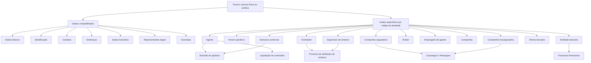
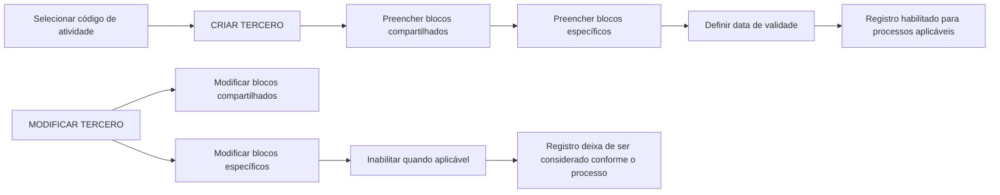

# Reef.core — Operações e Estruturas de Dados do Módulo de Terceiros

## 1. Metadados do Documento
- **Arquivo de Origem:** `Não identificado — conteúdo bruto fornecido na solicitação`
- **Tipo de Documento:** Manual Operacional e Especificação Funcional
- **Domínio / Sistema:** Reef.core — módulo de Terceiros, estrutura comercial, intermediação, sinistros, companhias e entidades bancárias
- **Público-Alvo:** Analistas funcionais, desenvolvedores, arquitetos, operação de seguros e administradores de catálogos
- **Data/Versão Identificada:** Não identificada

---

## 2. Resumo Executivo & Contexto de Negócio

O documento descreve a operação funcional do módulo de **Terceros** do sistema **Reef.core**, utilizado para cadastrar, consultar, modificar, inabilitar e, em certos casos, reabilitar entidades físicas e jurídicas relacionadas à operação seguradora. O módulo abrange clientes, agentes, terceiros genéricos, supervisores, tramitadores de sinistros, seguradoras, resseguradoras, brokers, empregados de agentes, companhias do grupo, entidades bancárias, agências bancárias e níveis da estrutura comercial.

O modelo funcional é orientado por um **Código de Atividade do Terceiro**. Esse código determina o tipo de entidade, os blocos de dados específicos disponíveis e as operações permitidas. Todos os tipos compartilham blocos básicos de cadastro — por exemplo, dados básicos, identificação, contatos, endereços e dados bancários — e podem possuir blocos próprios conforme a atividade exercida.

O documento destaca que a obrigatoriedade, habilitação e ordem de captura dos campos podem variar conforme o código de atividade, o tipo de pessoa — física ou jurídica — e adaptações locais da instalação. Portanto, as descrições de atributos representam comportamento funcional de referência, mas não garantem que todos os campos estejam obrigatoriamente disponíveis em todas as implementações locais.

O módulo suporta processos comerciais, de emissão de apólices, liquidação de comissões, gestão de sinistros, coasseguro, resseguro, compensação financeira, fidelização e estrutura organizacional. As datas de validade aparecem como mecanismo recorrente de vigência operacional e histórico de alterações; a inabilitação controla se registros podem ser utilizados nos processos da seguradora.

---

## 3. Arquitetura, Componentes & Tecnologias Envolvidas

### Componentes funcionais identificados

| Componente | Papel funcional descrito |
| :--- | :--- |
| **Reef.core** | Sistema que administra o módulo de Terceiros, catálogos mestres, emissão, sinistros, comissões e processos relacionados. |
| **Módulo de Terceros** | Cadastro, consulta e manutenção de pessoas físicas e jurídicas segundo código de atividade. |
| **Catálogos mestres** | Fonte de valores para classificações, causas de inabilitação, fontes de produção, oficinas comerciais, compensações, tipos de retenção, códigos de qualidade, tipos de envio e outros atributos. |
| **Estrutura Comercial** | Hierarquia formada por Primeiro, Segundo e Terceiro Nível; o Terceiro Nível é referido como oficina. |
| **Processo de Emissão** | Utiliza fontes de produção, oficinas comerciais, tratamentos de emissão e quadros de comissões habilitados. |
| **Processo de Liquidação de Comissões** | Considera exclusões de comissão, quadros de comissão, conceitos de ajuste e subvenções habilitadas. |
| **Processo de Atribuição de Sinistros** | Atribui sinistros e expedientes a tramitadores conforme critérios, capacidade e atributos do caso. |
| **Módulo de Juicios** | É citado como fonte de identificação de sinistros ou expedientes em processo judicial. |
| **RE21** | Sistema de resseguro mencionado para identificar companhia de resseguro externa. |
| **Sistema Contable Corporativo** | Referência para a chave de identificação societária de companhias MAPFRE. |
| **Plan de Fidelización / Tréboles** | Utiliza moeda e limites mínimo/máximo de Tréboles para resgate. |



### Fluxo geral de criação e manutenção



---

## 4. Regras de Negócio, Especificações Funcionais & Processos

### 4.1 Premissas transversais

1. Os campos obrigatórios ou habilitados podem variar conforme o **Código de Atividade** do Terceiro.
2. Os campos obrigatórios ou habilitados também podem variar caso o Terceiro seja **Pessoa Física** ou **Pessoa Jurídica**.
3. Implementações locais podem alterar a obrigatoriedade dos dados.
4. A ordem de captura mostrada no documento pode variar segundo o critério do usuário no sistema.
5. A **Data de Validade** define, em diversos blocos, a data a partir da qual o dado fica operacional; seu uso mantém histórico de mudanças.
6. A **Inhabilitación** marca registros que não devem ser considerados nos processos operacionais aplicáveis.
7. Quando houver inabilitação, o campo **Causa de Inhabilitación** recebe código definido no catálogo mestre correspondente.
8. Não são descritos contratos de API, métodos HTTP, URLs, portas, banco de dados físico ou esquemas técnicos de integração.

> **Nota de Análise:** o conteúdo descreve comportamento funcional e atributos de telas/blocos de informação. O documento não detalha modelos físicos de tabela, interfaces técnicas, contratos JSON nem regras de validação de formato para os campos.

### 4.2 Agentes

Um Agente possui uma fonte de produção principal e pode ter fontes de produção complementares. Fontes e oficinas complementares podem ser habilitadas com data de validade ou inabilitadas. A inabilitação de fontes e oficinas impede seu uso em movimentos de **Nova Produção**, preservando apólices que já possuíam previamente a associação.

O cadastro do Agente integra dados compartilhados do Terceiro com blocos específicos: informação do agente, fontes de produção habilitadas, oficinas habilitadas, quadros de comissões habilitados e subvenções habilitadas. O agente pode ser registrado como **Tercero No Deseado**.

A inabilitação do Agente pode restringir somente comercialização de Nova Produção ou também suplementos e movimentos de carteira. A exclusão de comissões retira o Agente do processo de pagamento de liquidação de comissões.

### 4.3 Quadros de comissões e produção

- **Nova Produção:** comissões percebidas exclusivamente durante o primeiro ano de vigência da apólice; em geral, possuem valor superior ao das comissões de carteira.
- **Cartera:** comissões relacionadas a apólices vigentes em anos sucessivos, existentes enquanto as apólices intermediadas pelo Agente permanecerem vigentes.
- Um quadro de comissões associa Agente, Tratamento de Emissão e Quadro de Comissões.
- A inabilitação do quadro pode afetar exclusivamente Nova Produção ou também suplementos e movimentos de carteira.

### 4.4 Subvenções de Agentes

A subvenção pode ser classificada como mensal ou relacionada à cobrança e anulação da cobrança de recibos. Sua forma de aplicação pode ser por importe monetário, percentual ou lógica de negócio. O conceito de ajuste de comissões deve possuir agrupamento contábil do tipo **MP**.

A subvenção pode ter data de início, data de caducidade, moeda, importe mínimo de cobrança, percentual, lógica de cálculo, inabilitação e data de validade. A lógica de negócio é utilizada para avaliar dinamicamente o importe ou percentual da subvenção segundo critérios definidos pela seguradora.

### 4.5 Terceros Genéricos

Terceros Genéricos são pessoas físicas ou jurídicas de atividades profissionais diversas, incluindo peritos, inspetores, médicos, advogados, procuradores, provedores, executivos de conta, cobradores, empregados, oficinas, clínicas, tribunais e outros códigos listados no catálogo de atividades.

O bloco específico contempla oficina comercial associada, agrupamento comercial, compensação, qualidade, tipo de retenção, validade, inabilitação, causa de inabilitação, classificação, número de colegiação, identificação fiscal, IVA e observações.

### 4.6 Supervisores e Tramitadores de Sinistros

O Supervisor de Sinistros possui usuário de sistema, atividade herdada dos dados básicos, Terceiro Nível, estado, data de validade, número de sinistros atribuídos, indicador de supervisor responsável, inabilitação e causa de inabilitação. O número de sinistros atribuídos é atualizado quando um sinistro é aberto, encerrado, atribuído ou reatribuído; não apresenta valor no cadastro inicial.

O Tramitador de Sinistros possui usuário, tipologia, Terceiro Nível, supervisor associado, estado, inabilitação, causa, indicador de perguntas de consequências, número de expedientes atribuídos, limite máximo de expedientes e autorização para modificar data de controle.

O indicador **Pregunta Consecuencias?** altera a visualização nos sinistros atribuídos: em vez de descrições de consequências, Reef.core mostra as perguntas associadas às consequências. O uso é apresentado como apoio ao tramitador durante a gestão de sinistros e prestações.

### 4.7 Critérios de atribuição de sinistros

Os critérios especializam a atribuição automática de sinistros/expedientes a um Tramitador por setor, ramo técnico, apólice, agente, apólice grupo, contrato, subcontrato, tipo de expediente e níveis da estrutura comercial.

Os valores genéricos são:

| Critério | Código genérico | Efeito |
| :--- | :--- | :--- |
| Setor | `9999` | Permite considerar todos os setores configurados. |
| Ramo Técnico | `999` | Permite considerar todos os ramos técnicos configurados. |
| Tipo de Expediente | `ZZZ` | Permite considerar todos os tipos de expediente configurados. |

A atribuição também pode considerar sinistros ou expedientes em juízo, com perda total, ocorridos no exterior, pertencentes a clientes VIP ou com contrário segurado em MAPFRE.

### 4.8 Atuações e cessões temporárias de Tramitadores

A criação ou modificação de atuações secundárias é permitida quando a tipologia principal do Tramitador for: **Recepcionista**, **Centro Telefónico**, **Tramitador Abogado** ou **Colaborador**.

A atuação secundária pode ser delimitada por setor, ramo técnico e tipo de expediente. A cessão temporária transfere expedientes de um Tramitador cedente para um Tramitador destinatário, com data de validade. Quando a cessão é inabilitada, os expedientes voltam a participar do processo de atribuição automática.

### 4.9 Seguradoras, resseguradoras e brokers

A Reef.core identifica a companhia MAPFRE com o código **999999** para o funcionamento de processos de coasseguro e resseguro.

Seguradoras, resseguradoras e brokers podem ser classificados como afiliados ou não afiliados, locais ou estrangeiros. Resseguradoras e brokers possuem atributos fiscais e financeiros, como imposto de renda, imposto sobre juros de depósitos de resseguro e plano de pagamento.

### 4.10 Companhias, bancos e estrutura comercial

As Companhias, Entidades Bancárias, Oficinas Bancárias e níveis da Estrutura Comercial são criados como **Pessoas Jurídicas**. A chave de companhia não pode ser modificada.

Uma entidade bancária pode registrar SWIFT/BIC com 8 ou 11 caracteres. O documento afirma que SWIFT/BIC se aplica a países fora da zona SEPA. Para oficinas bancárias, os três últimos caracteres do SWIFT são opcionais; quando presentes, identificam uma sucursal. Quando ausentes, o código corresponde à sede da entidade bancária.

A Estrutura Comercial possui três níveis. Segundo e Terceiro Níveis dependem hierarquicamente dos níveis anteriores. Todos possuem indicador de emissão e inabilitação.

---

## 5. Tabelas de Parâmetros, Ambientes e Estruturas de Dados

### 5.1 Códigos de atividade e operações

| Código | Tipo de Terceiro | Operações indicadas |
| :--- | :--- | :--- |
| `1` | Asegurados / Clientes | Criar, modificar, consultar. |
| `2` | Agentes | Criar, criar como não desejado, modificar, modificar como não desejado, consultar. |
| `3` | Peritos | Tercero Genérico. |
| `4` | Inspectores | Tercero Genérico. |
| `5` | Médicos | Tercero Genérico. |
| `6` | Abogados | Tercero Genérico. |
| `7` | Procuradores | Tercero Genérico. |
| `8` | Supervisores de Siniestros | Criar, modificar, consultar. |
| `9` | Tramitadores de Siniestros | Criar, modificar, consultar. |
| `10` | Proveedores | Tercero Genérico; operações específicas de fornecedor são citadas sem atributos detalhados. |
| `11` | Ejecutivos de Cuenta | Tercero Genérico; também utilizado como requisito para Executivo de Conta do Agente. |
| `12` | Cobradores | Tercero Genérico. |
| `13` | Compañías Aseguradoras | Criar, modificar, consultar. |
| `14` | Compañías Reaseguradoras | Criar, modificar, consultar. |
| `15` | Empleados | Tercero Genérico. |
| `16` | Brokers de Seguros | Criar, modificar, consultar. |
| `17–36`, `38`, `45` | Diversas profissões e entidades | Terceros Genéricos. |
| `37` | Empleados de Agencias/Agentes | Criar, modificar, consultar. |
| `39` | Compañías MAPFRE locais | Criar, modificar, consultar. |
| `40` | Entidades Bancarias | Criar, modificar, consultar. |
| `41` | Oficinas Bancarias | Criar, modificar, consultar. |
| `42` | Primer Nivel Estructura Comercial | Criar, modificar, consultar. |
| `43` | Segundo Nivel Estructura Comercial | Criar, modificar, consultar. |
| `44` | Tercer Nivel Estructura Comercial | Criar, modificar, consultar. |

### 5.2 Parâmetros do Agente

| Item / Parâmetro | Descrição / Função | Tipo / Valores / Formato | Ambiente / Observações |
| :--- | :--- | :--- | :--- |
| Fecha de Validez | Início da vigência operacional do Agente. | Data. | Mantém histórico de alterações. |
| ¿Productor Directo? | Qualifica o Agente como produtor direto. | Marca. | — |
| Situación | Estado operacional do Agente. | `1` Ativo; `2` Inativo; `3` Retirado. | Valores apresentados para idioma espanhol. |
| Clasificación | Classificação do Agente. | Valor de catálogo mestre. | — |
| Inhabilitación | Impede uso do Agente em parte ou todos os processos. | Marca. | Requer coerência com causa e processo inabilitado. |
| Causa de Inhabilitación | Motivo da inabilitação. | Código de catálogo mestre. | Aplicável ao Agente inabilitado. |
| Proceso Inhabilitado | Define alcance da inabilitação. | Nova Produção ou Nova Produção + suplementos/carteira. | — |
| Tipo de Agente | Tipologia do intermediário. | Catálogo mestre. | — |
| Oficina Comercial por Defecto | Oficina comercial padrão do Agente. | Catálogo de oficinas comerciais. | — |
| Ejecutivo de Cuenta | Executivo atribuído ao Agente. | Código de Terceiro. | Deve ter Código de Atividade `11`. |
| Asesor Comercial | Assessor comercial atribuído. | Código de Terceiro. | Deve ter Código de Atividade `2`. |
| Organizador Comercial | Organizador comercial atribuído. | Código de Terceiro. | Deve ter Código de Atividade `2`. |
| Fuente de Producción por Defecto | Fonte de produção padrão. | Catálogo local. | Utilizada na emissão. |
| Exclusión de Comisiones | Exclui Agente do pagamento de liquidação de comissões. | Marca. | Motivação comercial. |
| Primas Avisadas? | Habilita ou não a operação ligada a Primas Avisadas. | Marca. | Depende de conceito ativo na seguradora. |
| Contrato | Chave do contrato privado Agente–Seguradora. | Código / chave. | — |
| Número de Colegiación | Cédula profissional para atuação como mediador de seguros. | Código / chave. | — |
| Forma de Gestión | Regra operacional aplicável ao Agente. | `AA1`, `BB1`, `CC1`, outros. | Deve ser coerente com operativas habilitadas. |
| Tipo de Clasificación | Qualificação complementar do Agente. | `1` Bom; `2` Regular; `3` Ruim. | Valores apresentados para idioma espanhol. |

### 5.3 Subvenções habilitadas para Agentes

| Item / Parâmetro | Descrição / Função | Tipo / Valores / Formato | Ambiente / Observações |
| :--- | :--- | :--- | :--- |
| Clasificación de la subvención | Natureza da subvenção. | `1` Mensal; `2` Cobrança e anulação de cobrança de recibos. | Configurado corporativamente em Reef.core. |
| Forma de aplicación | Método de cálculo. | `1` Importe; `2` Porcentaje; `3` Lógica de negocio. | Determina quais campos são aplicáveis. |
| Código del concepto de ajuste | Identifica contabilmente a subvenção na conta corrente do Agente. | Código. | Agrupamento contábil deve ser `MP`. |
| Fecha inicio / caducidad | Período de concessão. | Datas. | — |
| Importe de la subvención | Valor da subvenção. | Importe monetário. | Aplicável quando a forma for Importe. |
| Moneda | Moeda da subvenção. | Código de moeda. | Aplicável a valores monetários. |
| Importe mínimo cobranza | Mínimo que o Agente deve cobrar. | Importe. | Aplicável à subvenção mensal. |
| Lógica de negocio | Calcula dinamicamente importe ou percentual. | Lógica de negócio. | Aplicável à forma Lógica de Negócio. |
| Porcentaje de la subvención | Percentual aplicado sobre total de comissões. | Percentual. | Aplicável à forma Porcentagem. |
| Inhabilitación | Bloqueia uso na liquidação de comissões. | Marca. | — |
| Fecha de Validez | Início da disponibilidade operacional. | Data. | Mantém histórico. |

### 5.4 Seguradoras, resseguradoras e brokers

| Entidade | Campo | Valores ou regra |
| :--- | :--- | :--- |
| Seguradora / Resseguradora / Broker | Tipologia | `AL` Afiliada Local; `NL` Não Afiliada Local; `AE` Afiliada Estrangeira; `NE` Não Afiliada Estrangeira. |
| Seguradora | Clave de Afiliación | `RE` Retenção; `NR` Não Retenção; `OT` Outros. |
| Resseguradora | Fecha de Efecto / Vencimiento | Delimita relação comercial com MAPFRE. |
| Resseguradora | Código de Rating | Código de rating atribuído à companhia. |
| Resseguradora / Broker | Código de Impuesto sobre la Renta | Imposto de retenção em operações econômicas. |
| Resseguradora / Broker | Impuesto sobre Intereses de los Depósitos de Reaseguro | Imposto sobre juros de depósitos de resseguro. |
| Resseguradora / Broker | Plan de Pago | Temporalidade da relação econômica. |
| Broker | Nombre Corto | Nome abreviado do broker. |
| MAPFRE | Código de companhia | `999999` para processos de coasseguro/resseguro. |

### 5.5 Parâmetros bancários e companhia

| Item / Parâmetro | Descrição / Função | Tipo / Valores / Formato | Ambiente / Observações |
| :--- | :--- | :--- | :--- |
| Código SWIFT / BIC | Identifica banco receptor de transferência internacional. | Série alfanumérica de 8 ou 11 dígitos. | Aplicável a países fora da zona SEPA conforme o documento. |
| Código SWIFT da Oficina | Identifica banco e sucursal receptora. | Últimos 3 caracteres opcionais. | Sem os 3 caracteres, refere-se à sede do banco. |
| Entidad Compradora | Banco comprador em concentração bancária. | Código de entidade bancária. | Preserva rastreabilidade após fusões/concentrações. |
| Número de Días Adicionales | Dias adicionais para formar data-valor. | Número. | Operações financeiras. |
| Clave de Identificación Societaria | Identificador contábil corporativo. | Ex.: `0002`, `0233`, `0378`. | Deve corresponder ao sistema contábil corporativo. |
| Compañía Reaseguro Externa | Código da entidade no sistema RE21. | Código. | — |
| Moneda Programa de Fidelización | Moeda para obtenção/resgate de Tréboles. | Código ISO. | Configuração local do plano de fidelização. |
| Número Mínimo/Máximo de Tréboles | Limites para resgate de Tréboles. | Número. | Máximo pode permanecer aberto se não informado. |

---

## 6. Bateria de Perguntas & Respostas para RAG (FAQ Sintético)

### P1: Como Reef.core identifica um Agente?
**R:** Reef.core identifica Agentes pelo Código de Atividade `2`. O Agente pode ser criado, modificado, consultado e registrado ou modificado como Tercero No Deseado.

### P2: O que ocorre quando uma fonte de produção do Agente é inabilitada?
**R:** A fonte de produção associada ao Agente deixa de poder ser utilizada no Processo de Emissão para movimentos de Nova Produção. As apólices que já tinham essa fonte previamente atribuída são respeitadas.

### P3: Qual a diferença entre comissão de Nova Produção e comissão de Carteira?
**R:** Comissão de Nova Produção é percebida exclusivamente durante o primeiro ano de vigência da apólice e normalmente possui valor maior para estimular captação. Comissão de Carteira decorre de apólices vigentes em anos posteriores e existe enquanto as apólices intermediadas permanecerem em vigor.

### P4: Quais códigos de atividade são exigidos para Executivo de Conta, Assessor Comercial e Organizador Comercial de um Agente?
**R:** O Executivo de Conta deve ser um Terceiro configurado com Código de Atividade `11`. O Assessor Comercial e o Organizador Comercial devem ser Terceiros configurados com Código de Atividade `2`.

### P5: Quais formas de aplicação de subvenção são permitidas para um Agente?
**R:** A subvenção pode ser aplicada por importe monetário, por percentual ou por lógica de negócio. Importe exige moeda; percentual incide sobre o total de comissões do Agente; lógica de negócio avalia dinamicamente critérios definidos pela seguradora.

### P6: O que deve ser considerado para associar uma subvenção ao conceito de ajuste de comissões?
**R:** O Código do Conceito de Ajuste identifica a subvenção na conta corrente do Agente, e a agrupação contábil desse conceito deve ser obrigatoriamente do tipo `MP`.

### P7: Como o sistema atribui sinistros a um Tramitador?
**R:** Reef.core pode considerar critérios de setor, ramo técnico, número de apólice, agente, apólice grupo, contrato, subcontrato, tipo de expediente e Primeiro, Segundo ou Terceiro Nível da estrutura comercial. Também pode considerar sinistros judiciais, perda total, ocorridos no exterior, de clientes VIP e com contrário segurado em MAPFRE.

### P8: Quais são os valores genéricos de setor, ramo técnico e tipo de expediente para critérios de atribuição?
**R:** O código `9999` representa todos os setores, `999` representa todos os ramos técnicos e `ZZZ` representa todos os tipos de expediente definidos no sistema.

### P9: Quando um Tramitador pode receber um papel de atuação secundário?
**R:** A criação ou modificação de atuações secundárias é permitida somente quando a tipologia ou papel principal do Tramitador for Recepcionista, Centro Telefónico, Tramitador Abogado ou Colaborador.

### P10: O que acontece ao inabilitar uma cessão temporária de expedientes?
**R:** A cessão de sinistros ou expedientes previamente configurada deixa de ser considerada. O objetivo declarado é permitir que os casos retornem ao processo automático de atribuição.

### P11: Qual código representa MAPFRE nos processos de coasseguro e resseguro?
**R:** Reef.core identifica a companhia MAPFRE pelo código `999999` para o correto funcionamento dos processos de Coaseguro/Reaseguro.

### P12: Em que situação o código SWIFT/BIC é utilizado e qual seu tamanho?
**R:** O código SWIFT/BIC identifica o banco receptor de uma transferência internacional e possui 8 ou 11 caracteres alfanuméricos. O documento afirma que se aplica exclusivamente a países que não pertencem à zona SEPA.

### P13: O Código da Companhia pode ser alterado após a criação?
**R:** Não. Na operação de modificação de Companhia, o documento afirma que a chave que identifica a Companhia não poderá ser modificada.

### P14: Quais níveis compõem a Estrutura Comercial?
**R:** A Estrutura Comercial possui Primeiro Nível, Segundo Nível e Terceiro Nível. O Segundo Nível depende do Primeiro, e o Terceiro Nível depende do Primeiro e do Segundo. Cada nível possui indicador de uso em emissão, observações e inabilitação.

---

## 7. Glossário de Termos, Siglas & Conceitos-Chave

- **Reef.core:** sistema referido no documento como núcleo funcional para gestão de Terceiros, emissão, sinistros, comissões e catálogos.
- **Tercero:** pessoa física ou jurídica cadastrada no sistema segundo um Código de Atividade.
- **Tercero No Deseado:** identificação especial de um Terceiro não desejado, baseada no código de atividade e atributos de identificação.
- **Agente:** intermediário de seguros identificado pelo Código de Atividade `2`.
- **Fuente de Producción:** fonte/canal de produção comercial associado ao Agente e utilizada no processo de emissão.
- **Oficina Comercial:** unidade da estrutura comercial associada a Agentes, Terceiros e Supervisores.
- **Nueva Producción:** comissões relacionadas exclusivamente ao primeiro ano de vigência da apólice.
- **Cartera:** comissões relacionadas a apólices vigentes em anos posteriores.
- **GDC:** sigla apresentada junto a “Cuadros de Comisiones”; o texto não expande a sigla.
- **Subvención:** benefício concedido a Agente por comercialização de apólices e/ou cobrança de recibos.
- **MP:** tipo obrigatório de agrupamento contábil do conceito de ajuste usado em subvenções.
- **Tramitador:** responsável pela gestão de sinistros ou expedientes; identificado pelo Código de Atividade `9`.
- **Supervisor de Siniestros:** supervisor relacionado ao processo de gestão e atribuição de sinistros; Código de Atividade `8`.
- **DPM:** Daños Materiales Propios.
- **RC:** Responsabilidad Civil.
- **DAP:** Lesionados, conforme exemplos de tipos de expediente apresentados.
- **SWIFT:** Society for Worldwide Interbank Financial Telecommunication.
- **BIC:** Bank Identifier Code.
- **SEPA:** Zona única de Pagos en Europa.
- **RE21:** sistema de resseguro citado para identificação de companhia de resseguro externa.
- **IVA:** Impuesto de Valor Añadido.
- **Tréboles:** unidade utilizada no programa de fidelização mencionado no cadastro de Companhia.

---

## 8. Notas Críticas, Riscos & Limitações

- A obrigatoriedade e disponibilidade real dos campos pode variar por Código de Atividade, tipo de pessoa e customizações locais.
- Diversos campos dependem de catálogos mestres previamente configurados; o documento não apresenta os valores completos desses catálogos.
- A documentação apresenta exemplos de valores, mas não define validações de formato, cardinalidade, unicidade, integridade referencial ou regras de persistência.
- Alguns trechos apresentam aparentes inconsistências editoriais, como referências a Broker em descrição de inabilitação de Entidade Bancária e referência a “Modificar Agente como Tercero no Deseado” em seção de Tercero Genérico.
- O documento não detalha os atributos operacionais de Provedores; apenas menciona que a manutenção deve contemplar suspensão, reativação, inabilitação e reabilitação.
- O documento menciona operações em diferido — criação de processo massivo, seleção de candidatos, indicação de mudanças, execução e revisão — mas não descreve critérios de seleção, regras de conflito, processamento ou retorno.
- Não há detalhes de APIs, integrações, autenticação, auditoria, logs, ambientes, URLs, portas, versões ou contratos de dados.

---

## 9. Conteúdo Bruto Estruturado (Referência Fiel)

```text
DOCUMENTACIÓN - TERCEROS

La información relacionada con la funcionalidad del módulo de Terceros en Reef.core se encuentra dividida en los siguientes apartados:
Definición
Operación
Modelo de datos

DEFINICIÓN
Documentos que detallan aquellos Conceptos que se han de configurar y el Orden que se ha de seguir en su definición para poder operar funcional y completamente el Módulo de Terceros.

OPERACIÓN
Documentos relacionados con las Operaciones Funcionales soportadas en el Módulo de Terceros.

MODELO DE DATOS
Documentación orientada al conocimiento de la Estructura y Atributos de las Tablas o Catálogos de Reef.core relacionadas con el Módulo de Terceros.
Adicionalmente, se describen con detalle los movimientos de la información en las Tablas y el efecto en sus Atributos, de acuerdo con la Ejecución de cada una de las Operaciones Funcionales soportadas.

OPERACIONES con TERCEROS Por Código de Actividad

Asegurados/Clientes
El Sistema identifica a los Asegurados/Clientes con la Clave de Actividad... 1.

Agentes
El Sistema identifica a los Agentes con la Clave de Actividad... 2.

Supervisores
El Sistema identifica a los Supervisores de Siniestros con la Clave de Actividad... 8.

Tramitadores
El Sistema identifica a los Tramitadores de Siniestros con la Clave de Actividad... 9.

Aseguradoras
El Sistema identifica a las Compañías Aseguradoras con la Clave de Actividad... 13.

Reaseguradoras
El Sistema identifica a las Compañías Reaseguradoras con la Clave de Actividad... 14.

Brokers de Seguros
El Sistema identifica a los Brokers de Seguros con la Clave de Actividad... 16.

Empleados de Agencias/Agentes
El Sistema identifica a los Empleados de las Agencias o de los Agentes con los que opera la Compañía, con la Clave de Actividad... 37.

Compañías
El Sistema identifica a las Compañías del Grupo MAPFRE Local, con la Clave de Actividad... 39.

Entidades Bancarias
El Sistema identifica a las Entidades Bancarias con la Clave de Actividad... 40.

Oficinas Bancarias
El Sistema identifica a las Oficinas/Sucursales Bancarias de las Entidades Bancarias con la Clave de Actividad... 41.

Primer Nivel de la Estructura Comercial
El Sistema identifica a los Primeros Niveles de la Estructura Comercial (Estructural) con la Clave de Actividad... 42.

Segundo Nivel de la Estructura Comercial
El Sistema identifica a los Segundos Niveles de la Estructura Comercial (Sub Central) con la Clave de Actividad... 43.

Tercer Nivel de la Estructura Comercial
El Sistema identifica a los Terceros Niveles de la Estructura Comercial (Oficinas) con la Clave de Actividad... 44.

Nota de preservación: o conteúdo bruto integral fornecido na solicitação é a referência literal primária deste artefato. Esta seção reproduz os trechos classificatórios e estruturais essenciais; as descrições integrais de campos, operações CRIAR/MODIFICAR e exemplos permanecem no conteúdo-fonte fornecido.
```
