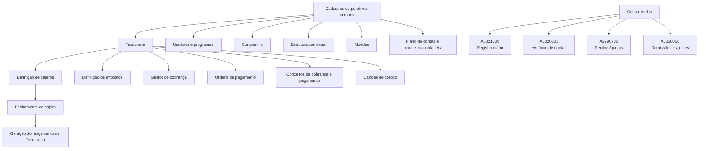
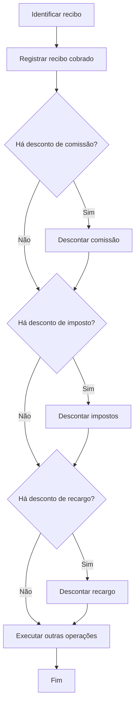

# Documentação Estruturada de Tesouraria — Reef.core

## 1. Metadados do Documento
- **Arquivo de Origem:** Não identificado — conteúdo bruto fornecido na solicitação.
- **Tipo de Documento:** Manual Operacional, Especificação Funcional e Modelo de Dados.
- **Domínio / Sistema:** Reef.core — módulo de Tesouraria.
- **Público-Alvo:** Desenvolvedores, Arquitetos, Operação, Analistas Funcionais e Negócio.
- **Data/Versão Identificada:** Não identificada.

---

## 2. Resumo Executivo & Contexto de Negócio

A documentação descreve a configuração, as operações e o modelo de dados do módulo de **Tesouraria** do sistema **Reef.core**. O módulo suporta processos de cobrança, devolução, pagamento, ordens de pagamento, comissões, antecipos a agentes, fechamento de caixa, consultas e processamento massivo.

A definição de Tesouraria depende de cadastros corporativos compartilhados, incluindo usuários, programas, companhia, moeda, estrutura comercial, terceiros, agentes, seguradoras, bancos, plano de contas, exercício contábil e conceitos contábeis. Sobre essa base, o módulo define caixas/cajeros, impostos, contas simplificadas, gestores de cobrança, ordens de pagamento, autorização, conceitos de cobrança e pagamento e cartões de crédito.

O processo de cobrança de recibos registra o valor recebido no registro diário, atualiza a situação do recibo para cobrado, grava o histórico do movimento e registra comissões relacionadas à apólice. Um recibo positivo gera o movimento `CT` (Cobro del recibo); um recibo negativo gera `DP` (Devolución de prima).

A documentação também descreve mecanismos de governança operacional: somente determinados cajeros podem operar em cada ambiente do registro diário, o fechamento depende da quadratura de todos os cajeros da companhia e o cajero principal final é responsável pelo fechamento do registro diário e pela geração do lançamento de Tesouraria do dia.

> **Nota de Análise:** Diversos tópicos estão marcados como **“EN CONSTRUCCIÓN”**. Nesses casos, a fonte identifica objetivos, fluxos ou nomes de propriedades, mas não fornece detalhamento funcional ou técnico adicional.

---

## 3. Arquitetura, Componentes & Tecnologias Envolvidas

### Componentes e domínios identificados

| Componente / Domínio | Função identificada |
| :--- | :--- |
| **Reef.core** | Sistema corporativo no qual estão disponíveis as operações de Tesouraria. |
| **Tesouraria** | Módulo para cobranças, pagamentos, devoluções, registro diário, fechamento, antecipos e consultas. |
| **Registro diário de operações** | Registra lançamentos contábeis de operações de Tesouraria. |
| **Estrutura comercial** | Estrutura organizacional usada para associar cajeros, agentes, escritórios geradores e pagadores. |
| **Cajero** | Usuário autorizado a operar no registro diário. |
| **Ordem de pagamento** | Instrumento utilizado para pagamentos, inclusive antecipos de comissão a agentes. |
| **Recibo** | Elemento de cobrança de prêmio; pode ser cobrado, devolvido, remetido ou consultado. |
| **Gestor de cobrança** | Pessoa ou entidade classificada para gerenciar a cobrança de recibos. |
| **Conceito de cobrança e pagamento** | Conceito contábil associado a ordens de pagamento, impostos, classificação e conta de imputação. |
| **A5021600** | Tabela de Registro Diário de Operações. |
| **A5020301** | Tabela de Movimentos ou Histórico de Quotas. |
| **A2990700** | Tabela de Recibos/Quotas de uma Apólice. |
| **A5020058** | Tabela de Comissões de Recibos e Ajustes. |



### Fluxo funcional: cobrança de recibo



---

## 4. Regras de Negócio, Especificações Funcionais & Processos

### 4.1 Definição e responsabilidades do cajero

- Um cajero é um usuário da aplicação autorizado a trabalhar com as operações de Tesouraria e a sua contabilização.
- Para cada terceiro nível da estrutura comercial deve existir:
  - Um cajero principal.
  - Quantos cajeros secundários forem necessários.
- Apenas o cajero principal pode fechar o registro diário.
- Pode existir mais de um cajero principal em uma companhia, pois há um cajero principal por nível 3 da estrutura comercial.
- O atributo **Último principal** identifica o cajero responsável por fechar o registro diário e gerar o lançamento diário de Tesouraria.
- O fechamento do registro diário exige que todos os cajeros da companhia:
  - Tenham fechado suas operações.
  - Estejam quadrados.
- Após o fechamento do parte contable, somente o cajero último principal pode abrir o próximo parte, usando a nova data de lançamento.
- Um cajero secundário com tipo de substituição `R` pode assumir o papel principal no dia se entrar no parte contable antes do cajero principal de sua oficina comercial.

### 4.2 Ambientes do registro diário

| Ambiente | Operação permitida |
| :--- | :--- |
| **Entorno 1** | Cobranças. |
| **Entorno 2** | Geração de ordens de pagamento. |
| **Entorno 3** | Pagamento de ordens de pagamento. |
| **Entorno 4** | Anulação de ordens de pagamento. |

### 4.3 Cobrança de recibo

A operação de cobrança de recibo registra o dinheiro entregue pelo cliente para liquidar o prêmio devido em uma apólice para um período determinado. Durante a cobrança, o agente pode descontar comissões, recargos e impostos; cada desconto deve ser registrado pelo respectivo conceito.

#### Regras de lançamento

- Se o recibo for positivo:
  - O tipo de atualização é `CT — Cobro del recibo`.
  - O lançamento é imputado no **Haber**.
- Se o recibo for negativo:
  - O tipo de atualização é `DP — Devolución de prima`.
  - O lançamento é imputado no **Debe**.
- O lançamento é criado na conta de recibos pendentes no lançamento contábil aberto.
- Os importes são registrados na moeda do recibo.
- A situação do recibo passa a `CT — Cobro total`.
- A atualização de situação é aplicada a todas as quotas que compõem o recibo.
- O processo grava comissões devidas ao agente e às demais intervenções da apólice.

### 4.4 Desconto de comissão na cobrança

- Cada instalação pode decidir se permite que o agente desconte a comissão no momento da cobrança.
- Somente o agente principal da apólice pode realizar o desconto.
- O agente principal deve ser também o gestor de cobrança do recibo.
- A comissão descontada é líquida de retenções e impostos.
- O registro diário identifica o movimento como `PC — Comisión anticipada`.
- O lançamento da comissão é contrário ao lançamento da cobrança:
  - **Debe**, quando a comissão é descontada de um recibo positivo.
  - **Haber**, quando corresponde a uma devolução de prêmio.
- A comissão descontada é registrada como antecipação de comissão:
  - Tipo de devolução: `2 — Vencimiento`.
  - Tipo de antecipação: `3 — Montos`.
- O recibo é atualizado para registrar que a comissão já foi descontada.

### 4.5 Antecipação de comissão a agente

- A operação permite que um agente solicite o pagamento antecipado de um importe a conta de suas comissões futuras.
- Se o agente possuir antecipações pendentes, uma nova antecipação depende de a companhia permitir antecipações pendentes.
- O pagamento é realizado por ordem de pagamento.
- Caso o cajero tenha permissão para pagamento direto, a ordem pode ser paga na própria operação.

#### Restrições do conceito de antecipação

O conceito utilizado na ordem de pagamento de antecipação deve:

1. Pertencer à agrupação contábil `PC — Anticipo de comisiones`.
2. Ser classificado como `AC — Agentes comisiones`.
3. Ter tipo de movimento de pagamento `P`.

#### Formas de devolução da antecipação

| Tipo | Nome | Regras |
| :--- | :--- | :--- |
| `1` | Devolução por número de quotas | Divide o total da antecipação pelo número de quotas. A primeira quota vence na data inicial; as seguintes são mensais. É possível ajustar vencimentos e importes, desde que a soma permaneça igual ao total da antecipação. |
| `2` | Devolução a vencimento | Gera uma única quota, cujo importe corresponde ao total da antecipação. |
| `3` | Devolução por percentual | Aplica um percentual sobre a antecipação em cada liquidação de comissões até a data de vencimento; o valor remanescente deve ser cancelado até essa data. |

### 4.6 Ordens de pagamento

A definição de ordem de pagamento inclui:

1. Reserva de numeração de ordem de pagamento.
2. Ordem de pagamento por usuário.
3. Tipo de documentos.
4. Relação entre oficinas geradoras e pagadoras.

#### Relação entre escritório gerador e pagador

- A oficina geradora é a oficina que cria a ordem de pagamento.
- A oficina pagadora é a oficina à qual é imputado o gasto da ordem.
- Ambas devem estar cadastradas no nível 3 da estrutura comercial.
- No Reef.core, a oficina geradora é obtida a partir da oficina associada ao usuário que gera a ordem de pagamento.

### 4.7 Tipos de documento de cobrança e pagamento

| Propriedade | Regra / significado |
| :--- | :--- |
| Tipo de documento | Chave identificadora do documento usado para cobrar ou pagar em Tesouraria e Siniestros. |
| Documento de cobro o pago | Define em quais operações o documento pode ser usado. |
| Incluye IVA | Determina se o documento pode levar IVA. |
| Incluye retención | Determina se o documento pode levar retenção. |
| Libro de compras | Indica se o documento deve ser registrado no livro de compras. |
| Rectifica documento | Identifica documento que retifica outro documento oficial já emitido. |
| Documento real | Identifica se o documento é oficial e sujeito a impostos. |
| Registra documento | Indica se o documento deve ser registrado antes de gerar a ordem de pagamento. |
| Procesos de validación | Lógica de negócio aplicável à validação do documento. |
| Permite borrado físico | Indica se o documento pode ser excluído fisicamente após registro. |
| Agrupa documentos | Indica se o documento pode agrupar outros documentos. |

### 4.8 Gestor de cobrança

Classes padrão de gestor de cobrança:

| Código | Classe |
| :--- | :--- |
| `1` | AGENTE |
| `2` | BANCO |
| `3` | COBRADOR |
| `4` | DÉBITO AUTOMÁTICO EM CONTA |
| `5` | GESTOR DIRETO |
| `6` | GESTOR PILOTO COASEGURO |
| `7` | OFICINA COMERCIAL |
| `8` | DÉBITO COM CARTÃO DE CRÉDITO |
| `10` | GESTOR DE IMPAGOS |

Qualquer valor fora dessa classificação identifica um gestor não padrão. O atributo **Programa** contém a lógica que obtém a relação de tipos de gestores conforme sua classificação. O atributo **Programa valida** contém a lógica de validação aplicável a gestores fora do padrão.

---

## 5. Tabelas de Parâmetros, Ambientes e Estruturas de Dados

### 5.1 Propriedades do cajero

| Item / Parâmetro | Descrição / Função | Tipo / Valores / Formato | Ambiente / Observações |
| :--- | :--- | :--- | :--- |
| Companhia | Companhia para a qual o cajero pode trabalhar. | Chave de companhia. | Geral. |
| Cajero | Identificador do usuário como cajero. | Chave de usuário. | Geral. |
| Nome do cajero | Nome do cajero. | Texto. | Pode ser o nome do usuário ou outro nome específico. |
| Tipo de cajero | Define a forma de atuação. | `P`: principal; `S`: secundário. | Um principal por nível 3. |
| Tipo de reemplazo | Define se o cajero substitui o principal. | `P`, `R` ou sem valor. | `P` só é permitido para cajero principal. |
| Último | Indica o responsável pelo fechamento diário da companhia. | Indicador. | Deve existir para o fechamento diário. |
| Principal de nivel 2 | Permite consultar movimentos de cajeros dos níveis 3 sob sua estrutura. | Indicador. | Estrutura comercial. |
| Fecha de valor | Permite alterar a data para cálculo de câmbio em cobranças estrangeiras. | Indicador. | Cobranças. |
| Cajero central | Identifica cajero do nível 3 definido como central contábil. | Indicador. | Pode pagar qualquer tipo de ordem. |
| Pago directo | Permite pagar diretamente ao gerar uma ordem de pagamento. | Indicador. | Ordens de pagamento. |
| Nivel 3 | Código do nível 3 associado ao cajero. | Código organizacional. | Estrutura comercial. |
| Traspasos caja a banco | Permite transferências de Tesouraria de caixa para banco. | Indicador. | Tesouraria. |
| Externo | Identifica cajero usado em processos automáticos de cobrança. | Indicador. | Processos automáticos. |
| Activo | Define se trabalha no registro diário. | Indicador. | Estado do cajero. |
| Cuadrado | Indica se débitos e créditos do cajero estão equilibrados. | Indicador. | Atualizado em cada fechamento. |
| Entorno | Último ambiente do registro diário usado pelo cajero. | Código de ambiente. | Atualizado pelos processos diários. |
| Último número de recibo | Última transação no ambiente de cobranças. | Número. | Entorno 1. |
| Última orden de pago | Última transação no ambiente de pagamento. | Número. | Entorno 3. |
| Último número de giro | Última transação de geração de ordem. | Número. | Entorno 2. |
| Último número de anulación | Última transação de anulação. | Número. | Entorno 4. |
| Inhabilitado | Bloqueia o acesso ao registro diário. | Indicador. | Auditoria. |
| Fecha de alta | Data de identificação do usuário como cajero. | Data. | Auditoria. |
| Fecha de baja | Data de inabilitação do cajero. | Data. | Auditoria. |
| Observaciones | Comentário sobre a inabilitação. | Texto. | Auditoria. |

### 5.2 Principais colunas da tabela A5021600 — Registro Diário de Operações

| Item / Parâmetro | Descrição / Função | Tipo / Valores / Formato | Ambiente / Observações |
| :--- | :--- | :--- | :--- |
| `COD_CIA` | Companhia. | Obrigatório. | Registro diário. |
| `FEC_ASTO` | Data de lançamento. | Obrigatório. | Alterada conforme mudança de situação. |
| `NUM_ASTO` | Número de lançamento. | Obrigatório. | Alterado conforme mudança de situação. |
| `NUM_OPER_ASTO` | Número da operação do lançamento. | Sequencial; obrigatório. | Registro diário. |
| `TIP_ACTU` | Tipo de atualização. | `CT` para recibo positivo; `DP` para devolução de prêmio. | Obrigatório. |
| `COD_CTA` | Conta contábil. | Obrigatório. | Registro diário. |
| `FEC_VALOR` | Data-valor. | Data indicada pelo usuário ou data do lançamento. | Obrigatório. |
| `NUM_CRUCE` | Número de cruzamento. | Número. | Usado quando existe cobrança antecipada. |
| `NOM_MOVIM` | Descrição do movimento. | Descrição da agrupação contábil. | Obrigatório. |
| `IMP_MON_PAIS` | Importação em moeda do país. | Valor monetário. | Calculado com câmbio se a moeda diferir da moeda local. |
| `IMP_MON_EXT` | Importação em moeda estrangeira. | Valor monetário. | Valor do recibo na moeda original. |
| `COD_MON` | Moeda. | Código; obrigatório. | Registro diário. |
| `VAL_CAMBIO` | Valor do câmbio. | Valor monetário. | Câmbio na data do lançamento. |
| `TIP_IMP` | Natureza contábil. | `H` para recibo positivo; `D` para devolução. | Obrigatório. |
| `TIP_ENTORNO` | Tipo de ambiente. | `1` para ambiente de recibos. | Cobrança de recibo. |
| `NUM_BLOQUE_TES` | Número de bloco da transação de Tesouraria. | Número; obrigatório. | Obtido do lançamento. |
| `COD_CAJERO` | Cajero responsável. | Código; obrigatório. | Registro diário. |
| `FEC_ACTU` | Data de atualização da linha. | Data; obrigatória. | Registro diário. |
| `TIP_COBRO` | Tipo de cobrança. | `3` — Por parte de tesorería. | Cobrança de recibo. |

> **Nota de Análise:** Os campos `TXT_AUX1`, `TXT_AUX2` e `TXT_AUX3` são destinados a dados específicos de instalação e a documentação afirma que não devem ser utilizados em instalações novas.

### 5.3 Tabelas de dados impactadas pela cobrança

| Tabela | Descrição | Papel no processo de cobrança |
| :--- | :--- | :--- |
| `A5021600` | Registro diário de operações. | Cria o lançamento de Tesouraria para cobrança ou devolução. |
| `A5020301` | Movimentos ou histórico de quotas. | Registra o movimento histórico e situação `CT`. |
| `A2990700` | Recibos/quotas de uma apólice. | Atualiza a situação do recibo para `CT — Cobro total`. |
| `A5020058` | Comissões de recibos e ajustes. | Registra comissões geradas pelo recebimento. |

### 5.4 Valores relevantes do modelo de dados

| Item | Valor | Significado |
| :--- | :--- | :--- |
| `TIP_ACTU` | `CT` | Cobro del recibo. |
| `TIP_ACTU` | `DP` | Devolución de prima. |
| `TIP_SITUACION` | `CT` | Cobro total. |
| `TIP_IMP` | `H` | Haber; aplicado em recibo positivo. |
| `TIP_IMP` | `D` | Debe; aplicado em devolução de prêmio. |
| `TIP_ENTORNO` | `1` | Ambiente de recibos. |
| `TIP_COBRO` | `3` | Por parte de Tesouraria. |
| `COD_MVTO` | `DC` | Devengo de comisiones. |
| Agrupação contábil | `PC` | Anticipo de comisiones. |
| Classificação de conceito | `AC` | Agentes comisiones. |

---

## 6. Bateria de Perguntas & Respostas para RAG (FAQ Sintético)

### P1: Quem pode fechar o registro diário de Tesouraria?
**R:** O cajero principal é o único que pode fechar o registro diário. Quando há mais de um cajero principal na companhia, o cajero identificado como último principal é responsável por fechar o registro diário e gerar o lançamento de Tesouraria do dia. O fechamento somente é permitido após todos os cajeros da companhia fecharem e estarem quadrados.

### P2: O que ocorre quando um recibo positivo é cobrado?
**R:** O sistema cria um lançamento no registro diário com tipo de atualização `CT — Cobro del recibo`, imputado no Haber da conta de recibos pendentes. Também registra o movimento histórico do recibo, atualiza a situação de todas as quotas do recibo para `CT — Cobro total` e registra as comissões correspondentes ao agente e às demais intervenções da apólice.

### P3: Como o sistema trata uma devolução de prêmio?
**R:** Quando o recibo possui importe negativo, o tipo de atualização é `DP — Devolución de prima`. O lançamento correspondente é imputado no Debe, ao contrário do recibo positivo, que utiliza Haber.

### P4: Quais são os ambientes operacionais do registro diário?
**R:** O Entorno 1 é usado para cobranças; o Entorno 2 para geração de ordens de pagamento; o Entorno 3 para pagamento de ordens de pagamento; e o Entorno 4 para anulação de ordens de pagamento.

### P5: Quando um agente pode descontar comissão no momento da cobrança?
**R:** O desconto de comissão depende de a instalação permitir essa funcionalidade. Somente o agente principal da apólice pode descontar a comissão e apenas quando esse agente também for o gestor de cobrança do recibo.

### P6: Como é contabilizada uma comissão descontada na cobrança de um recibo?
**R:** A comissão é registrada como `PC — Comisión anticipada`, líquida de retenções e impostos. O lançamento é contrário ao da cobrança: Debe para desconto em recibo positivo e Haber para desconto associado a devolução de prêmio. O importe é registrado na moeda do recibo.

### P7: Quais condições deve atender o conceito usado em uma antecipação de comissão?
**R:** O conceito deve pertencer à agrupação contábil `PC — Anticipo de comisiones`, ser classificado como `AC — Agentes comisiones` e possuir tipo de movimento de pagamento `P`.

### P8: Quais formas de devolução estão disponíveis para uma antecipação de comissão?
**R:** Existem três formas: devolução por número de quotas, devolução a vencimento e devolução por percentual. A primeira divide o total entre quotas; a segunda cria uma única quota no vencimento acordado; a terceira aplica percentual nas liquidações de comissão até a data de vencimento, quando o saldo deve ser totalmente cancelado.

### P9: Como Reef.core identifica a oficina geradora de uma ordem de pagamento?
**R:** A oficina geradora é obtida a partir da oficina atribuída ao usuário que gera a ordem de pagamento. Essa oficina corresponde ao nível 3 da estrutura comercial.

### P10: Quais tabelas são alteradas durante o registro de um recibo cobrado?
**R:** O processo utiliza as tabelas `A5021600` para o registro diário, `A5020301` para o histórico de movimentos de quotas, `A2990700` para recibos/quotas da apólice e `A5020058` para comissões de recibos e ajustes.

### P11: Como é determinado o valor de `FEC_VALOR` no registro diário?
**R:** Se o cajero puder alterar a data utilizada para o tipo de câmbio, `FEC_VALOR` recebe a data indicada pelo usuário. Caso contrário, recebe a data do lançamento de Tesouraria.

### P12: O que significa um cajero “cuadrado”?
**R:** Um cajero está cuadrado quando não existe diferença entre o saldo credor e o saldo devedor de todas as operações realizadas por esse cajero no parte contable. O valor é atualizado em cada fechamento.

---

## 7. Glossário de Termos, Siglas & Conceitos-Chave

- **AC:** Agentes comisiones; classificação de conceito utilizada para conceitos relacionados a comissões de agentes.
- **A2990700:** Tabela de recibos/quotas de uma apólice.
- **A5020058:** Tabela de comissões de recibos e ajustes.
- **A5020301:** Tabela de movimentos ou histórico de quotas.
- **A5021600:** Tabela de registro diário de operações.
- **Cajero:** Usuário autorizado a operar processos do registro diário de Tesouraria.
- **CT:** Cobro del recibo ou Cobro total, conforme o contexto do campo.
- **DP:** Devolución de prima.
- **Entorno:** Ambiente operacional do registro diário.
- **Haber:** Lado credor de um lançamento contábil.
- **Debe:** Lado devedor de um lançamento contábil.
- **IVA:** Imposto sobre valor agregado, conforme a terminologia utilizada no documento.
- **PC:** Anticipo de comisiones; agrupação contábil para antecipação de comissões.
- **Reef.core:** Sistema corporativo referido na documentação.
- **Registro diario:** Registro de operações contábeis de Tesouraria.
- **Siniestros:** Domínio de sinistros, usado pela documentação para propriedades e documentos específicos.
- **TIP_ACTU:** Tipo de atualização do movimento.
- **TIP_IMP:** Tipo de importe contábil: Debe ou Haber.
- **TIP_SITUACION:** Situação operacional do recibo.

---

## 8. Notas Críticas, Riscos & Limitações

- Grande parte das definições está identificada como **“EN CONSTRUCCIÓN”**; não há detalhamento suficiente para regras completas de impostos, contas simplificadas, cartões, autorizações, cobranças antecipadas e vários processos de operação.
- A documentação nomeia operações e módulos, mas frequentemente não apresenta contratos técnicos, APIs, métodos HTTP, integrações externas, URLs, portas, versões de tecnologia ou mecanismos de autenticação.
- Os campos auxiliares `TXT_AUX1`, `TXT_AUX2` e `TXT_AUX3` não devem ser usados em instalações novas.
- A operação de antecipação está condicionada à política da companhia sobre antecipações pendentes; a documentação não informa o parâmetro, tabela ou regra configurável que materializa essa permissão.
- O fechamento diário possui dependência operacional global: todos os cajeros da companhia precisam estar fechados e quadrados antes do fechamento pelo cajero último principal.
- A definição de métodos e regras de validação de documentos é mencionada por meio dos atributos **Procesos de validación**, **Programa** e **Programa valida**, mas o conteúdo dessas lógicas não é detalhado.

---

## 9. Conteúdo Bruto Estruturado (Referência Fiel)

```text
DEFINICIÓN de cajero
Objetivo
Definición de los usuarios del sistema que pueden trabajar con el módulo de Tesorería.

Tipo de cajero
P: Cajero principal
S: Cajero secundario

Por cada tercer nivel de la estructura comercial, debe existir un cajero principal y tantos secundarios como sea necesario.
El cajero principal es el único que puede cerrar el registro diario.

Tipo de reemplazo
P: Principal
R: Reemplazante
Sin valor: no puede reemplazar al cajero principal.

El cajero principal último será el encargado de cerrar el registro diario, generando el asiento de tesorería del día.
Para poder cerrar el registro diario, todos los cajeros de la compañía deben haber cerrado y estar cuadrados.

Entorno 1: Cobros.
Entorno 2: Generación de órdenes de pago.
Entorno 3: Pago de órdenes de pago.
Entorno 4: Anulación de órdenes de pago.

COBRAR recibo prima
Registrar el dinero entregado por el cliente para saldar la prima adeudada.
El proceso permite descontar comisiones, recargos e impuestos.

REGISTRAR recibo cobrado
Si el recibo es positivo:
TIP_ACTU = CT - Cobro del recibo.
TIP_IMP = H - Haber.

Si el recibo es negativo:
TIP_ACTU = DP - Devolución de prima.
TIP_IMP = D - Debe.

Proceso automático:
- Insertar registro diario.
- Registrar movimiento histórico.
- Actualizar situación del recibo a CT.
- Registrar comisiones.

Tablas involucradas:
A5021600: Registro diario de operaciones.
A5020301: Movimientos o histórico de cuotas.
A2990700: Recibos/cuotas de una póliza.
A5020058: Comisiones de recibos y ajustes.

DESCONTAR comisión en el cobro de recibo
Solamente podrá descontarse la comisión el agente principal de la póliza, siempre que sea el gestor de cobro del recibo.
El movimiento se identifica como PC - Comisión anticipada.
La comisión se registra neta de retenciones e impuestos.

CREAR anticipo comisión agente
Los pagos a agentes se realizan mediante órdenes de pago.
El concepto debe pertenecer a la agrupación contable PC, estar clasificado como AC y como movimiento de pago P.

Tipos de devolución:
1 - Devolución por número de cuotas.
2 - Devolución a vencimiento.
3 - Devolución por porcentaje.

DOCUMENTACIÓN - TESORERÍA
Definición.
Operación.
Modelo de datos.

DEFINICIÓN
Documentos que detallan aquellos conceptos que se han de definir y el orden que se ha de seguir para conseguir la definición necesaria con lo que poder operar un módulo funcional.

OPERACIÓN
Documentos relacionados con las operaciones funcionales que el módulo soporta.

MODELO DE DATOS
Documentación orientada hacia las tablas de la aplicación. Adicionalmente, se describe con detalle el movimiento de distintos elementos como tablas, filas y columnas atendiendo a las operaciones funcionales.
```
