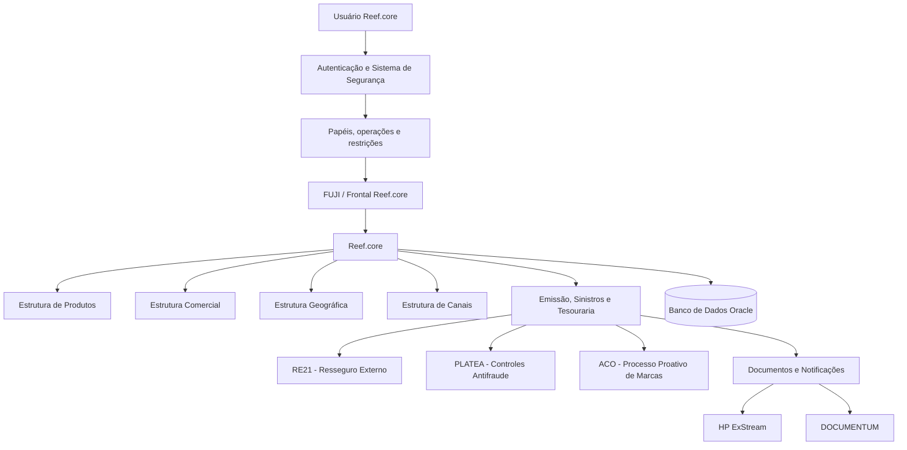
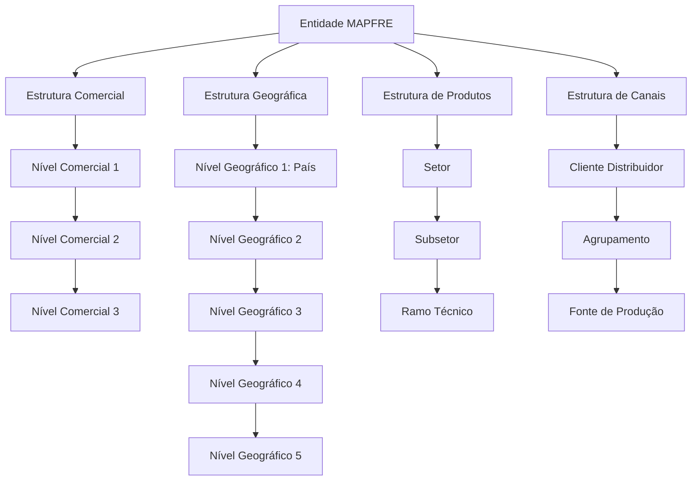
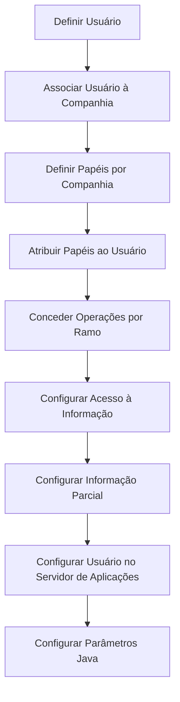

# Documentação Funcional e de Configuração do Reef.core: Catálogos Corporativos, Estruturas, Segurança e Operação

## 1. Metadados do Documento
- **Arquivo de Origem:** Não identificado no conteúdo extraído.
- **Tipo de Documento:** Manual Operacional / Especificação Funcional.
- **Domínio / Sistema:** Reef.core / MAPFRE.
- **Público-Alvo:** Desenvolvedores, Arquitetos, Operação, Administração e Finanças, Segurança, Tecnologia Local, Negócio.
- **Data/Versão Identificada:** Dezembro de 2023 é citado no módulo de Notificações; versão geral não identificada.

---

## 2. Resumo Executivo & Contexto de Negócio

O documento descreve o modelo funcional e os catálogos de parametrização do **Reef.core**, sistema transacional utilizado por entidades MAPFRE para suportar operações de seguros. O conteúdo cobre estruturas corporativas, comerciais, geográficas, de produtos, canais de distribuição, segurança, dados variáveis, programas, menus, notificações e documentos.

A configuração do Reef.core é baseada em repositórios de informação específicos, muitos inicialmente vazios para preenchimento local e outros pré-configurados pelo núcleo corporativo. O documento distingue explicitamente catálogos que podem ser complementados localmente daqueles cuja configuração corporativa, especialmente registros associados à instalação `TRN`, não pode ser alterada.

A estrutura de produtos organiza setores, subsetores, ramos técnicos, modalidades, coberturas e ramos contábeis. O ramo técnico é o principal ponto de parametrização operacional, pois define comportamento de emissão, sinistros, contabilidade, prêmios, recibos, comissões, cosseguro, resseguro, inspeções, integrações externas, PLATEA, ACO e seleção de riscos.

A estrutura comercial possui três níveis, enquanto a estrutura geográfica possui cinco níveis e suporta catálogos complementares de códigos postais, feriados, calendários e países FATCA. A estrutura de canais também possui três níveis: clientes distribuidores, agrupamentos e fontes de produção. As duas primeiras camadas são definidas corporativamente; a granularidade do terceiro nível é responsabilidade da entidade MAPFRE local.

O documento também detalha controles de segurança. A autenticação de usuários não implica autorização: o acesso é concedido por meio de papéis, operações, restrições por ramo, estrutura comercial, estrutura de produtos e papéis de informação parcial. A tecnologia local é responsável por determinadas configurações, como parâmetros Java por usuário, estruturas de informação e dados de acesso no servidor de aplicações.

---

## 3. Arquitetura, Componentes & Tecnologias Envolvidas

### Componentes e domínios identificados

| Componente / Domínio | Função identificada |
| :--- | :--- |
| **Reef.core** | Sistema transacional central para gestão de seguros, emissão, sinistros, tesouraria, segurança, produtos e catálogos. |
| **NewTron** | Versão atual do Reef.core, associada a operações funcionais. |
| **TronWeb** | Versão legada do Reef.core, associada a programas e permissões legadas. |
| **FUJI** | Orquestrador do frontal do Reef.core; pode tratar aplicações como MicroFrontEnds. |
| **RE21** | Solução corporativa externa para resolver cessões e colocações de resseguro. |
| **PLATEA** | Integração para identificação e prevenção de fraude em emissão e sinistros. |
| **ACO** | Área Corporativa de Operações; define controles proativos de marcas. |
| **ACNC** | Área Corporativa de Negócio e Clientes; define classificações corporativas de canais. |
| **HP ExStream** | Ferramenta corporativa de geração e envio de documentos e notificações, citada como vigente em dezembro de 2023. |
| **DOCUMENTUM** | Ferramenta corporativa de armazenamento e gestão documental, citada como vigente em dezembro de 2023. |
| **Oracle** | Banco de dados citado em tabelas, procedimentos, estruturas de informação e listas de valores. |
| **LDAP** | Mecanismo de autenticação que pode ser ativado para usuários da aplicação. |
| **JSPOOL** | Conjunto de papéis de acesso no servidor de aplicações. |
| **ITSEMAP** | Entidade mencionada como possível responsável por inspeção visual de objetos segurados. |



### Modelo hierárquico de estruturas organizacionais



---

## 4. Regras de Negócio, Especificações Funcionais & Processos

### 4.1 Moedas e tipos de câmbio

- O sistema é multimoeda e permite definir moedas e divisas usadas, entre outros casos, para cálculo de prêmios, liquidação de sinistros e prestações e liquidação periódica de comissões.
- A moeda deve possuir código de moeda/divisa, código ISO, descrição, indicação de moeda real ou unidade de conta e número de decimais.
- A codificação das moedas deve respeitar a norma **ISO 4217**.
- Uma unidade de conta pode ter valor reajustado periodicamente por preços, como:
  - `UF` — Unidad de Fomento no Chile.
  - `UDI` — Unidad de Inversión no México.
- O documento cita “Tréboles” como moeda fictícia usada em plano de fidelização.
- O sistema permite cadastrar apenas **um único tipo de câmbio por data** para uma moeda/divisa.
- O tipo de câmbio possui companhia, moeda, data de câmbio e valor do tipo de câmbio.

### 4.2 Estrutura comercial

- A estrutura comercial é piramidal e contém exatamente **três níveis**.
- Os repositórios dos níveis comerciais são entregues inicialmente sem conteúdo.
- As denominações dos três níveis podem ser configuradas de acordo com costumes locais.
- Exemplo de denominações para MAPFRE Espanha:
  - Nível 1: Territorial.
  - Nível 2: Sub Central.
  - Nível 3: Oficina / Sucursal.

#### Regras por nível comercial

| Nível | Atividade de Terceiro | Associação obrigatória | Regra de emissão |
| :--- | :--- | :--- | :--- |
| Primeiro nível | `42` | Companhia, identificação, contatos e geografia | Somente um registro com propriedade de emissão desativada. |
| Segundo nível | `43` | Deve estar associado a um primeiro nível | Somente um registro com emissão desativada por dupla Primeiro/Segundo Nível. |
| Terceiro nível | `44` | Associado indiretamente ao primeiro e diretamente ao segundo nível | Somente um registro com emissão desativada por combinação Primeiro/Segundo/Terceiro Nível. |

- Os códigos de atividade `42`, `43` e `44` pertencem ao núcleo e **não podem ser modificados**.
- Caso a atividade do nível não tenha documento identificador associado, o sistema atribui o tipo de documento definido nos parâmetros da instalação.
- O tipo de documento identificador para o primeiro nível é `THP` quando não houver documentos próprios associados.
- A propriedade **Inhabilitación** impede o uso da chave na captura e/ou alteração de níveis comerciais.
- A propriedade **Emisión** determina se o código é real ou genérico e é destinada ao uso interno do núcleo.
- A estrutura comercial e a estrutura de canais possuem propósitos diferentes:
  - Canais: margem de contribuição por cliente distribuidor.
  - Organização comercial: combinação de capital, trabalho, recursos e tecnologia para maximizar a criação de valor.

#### Regras exclusivas do terceiro nível comercial

- **Tipo de Distribuição** está descontinuado e não pode ser reutilizado localmente.
- Originalmente, Tipo de Distribuição definia a distribuição contábil de saldos de cosseguro/resseguro por entidade, setor, subsetor ou ramo contábil.
- **Fecha de Apertura** registra a data oficial de abertura da oficina/sucursal comercial.
- **Marca Propia** informa se a sucursal/oficina pertence à companhia ou é associada/externa.

### 4.3 Estrutura geográfica

- A estrutura geográfica é piramidal e possui **cinco níveis**.
- O primeiro nível representa países e deve usar a norma **ISO 3166-1 alfa-3**.
- O quinto nível pode representar distritos, delegações, comunas ou outros conceitos locais equivalentes.
- Denominações dos níveis podem variar conforme instalação e idioma.

| Instalação | Nível 1 | Nível 2 | Nível 3 | Nível 4 | Nível 5 |
| :--- | :--- | :--- | :--- | :--- | :--- |
| TRN — Espanha/Núcleo | País | Comunidade/Cidade Autônoma | Província | Município/Localidade | Distrito |
| EUR — MAPFRE Chile | País | Região | Província | Comunas | Localidades |
| MMX — MAPFRE México | País | Entidades Federativas | Municípios / Demarcação Territorial | Localidades / Delegações | Colônias |

#### Códigos postais

- Um código postal pode ser associado aos cinco níveis da estrutura geográfica.
- A descrição do código postal deve ser coerente com o idioma do primeiro nível geográfico associado.
- Recomenda-se carregar e manter os códigos do serviço postal local **AS-IS**.
- Um código postal pode ser inabilitado.
- Pode existir apenas um registro de nível genérico por subconjunto de Primeiro, Terceiro e Quarto níveis.

#### Calendário oficial

- O calendário oficial registra dias não úteis e feriados por níveis geográficos.
- A data de validade define quando um feriado passa a ser operacional e permite manter histórico.
- Recomenda-se utilizar publicação oficial e possíveis WebServices ou APIs locais para manter o calendário.

#### FATCA

- O catálogo identifica países sujeitos à norma FATCA.
- Os códigos devem seguir a norma ISO 3166-1 alfa-3.
- Um país FATCA pode ser inabilitado para impedir sua consideração nos processos FATCA.
- O documento identifica FATCA como a lei norte-americana **Foreign Account Tax Compliance Act**, aprovada em 2010 e em vigor desde 2013.

### 4.4 Estrutura de produtos e ramo técnico

- A estrutura de produtos é piramidal e possui quatro níveis:
  1. Companhias.
  2. Setores.
  3. Subsetores.
  4. Ramos técnicos.
- Todo ramo técnico deve estar obrigatoriamente associado a um setor e a um subsetor.
- O sistema permite configurar até `999` ramos por companhia.
- O ramo `999` é fictício, necessário para uso interno, e não é um ramo real de emissão.

#### Tratamentos disponíveis

| Código | Tratamento | Efeito principal |
| :--- | :--- | :--- |
| `A` | Automóveis | Permite acessórios de veículos no processo de emissão. |
| `D` | Diversos | Comportamento padrão do Reef.core. |
| `T` | Transportes | Suporta aplicações, apólices flutuantes e declarações de altas, baixas e alterações de risco. |
| `V` | Vida & Accidentes | Suporta modalidades, questionários, resgates e características de seguros de pessoas. |

- Não é possível ampliar a relação de tratamentos.
- Tratamento de emissão, sinistros e contabilidade podem ter valores diferentes para o mesmo ramo.

#### Regras de emissão e apólices

| Propriedade | Regra funcional |
| :--- | :--- |
| Multi riesgo | Permite mais de um objeto segurado/segurado na apólice. |
| Identificador do objeto segurado | Exige lógica de negócio para identificar univocamente riscos nos módulos. |
| Multi periodos | Para apólices superiores a um ano, registra informação econômica por período quando ativado. |
| Registrar hora/minutos | Obriga capturar hora e minuto da data de efeito da apólice/suplemento. |
| Respetar día vencimiento | Obriga respeitar o dia da data de vencimento. |
| Cláusulas | Permite cláusulas em apólices, objetos segurados ou coberturas; impressão local deve considerar texto e idioma. |
| Anexos | Permite anexos em apólices e/ou objetos segurados. |
| Arrastrar anexos desde presupuesto | Copia anexos de orçamento para apólice emitida a partir dele. |
| Anexos en varios idiomas | Permite modelos de anexo em qualquer idioma, independentemente do idioma do emissor. |
| Emisión de presupuesto obligatoria | Sem orçamento prévio, a apólice não pode ser emitida. |
| Reutilizar presupuesto | Permite que várias apólices reutilizem a mesma cotação/orçamento. |
| Autorización de presupuesto obligatoria | Orçamento com controles técnicos só pode gerar apólice se estiver totalmente autorizado. |
| Póliza a disposición de cualquier usuario | Autoriza qualquer usuário habilitado a recuperar e retomar uma apólice suspensa. |
| Cambiar numeración de la póliza | Altera automaticamente a numeração em suplementos de renovação e mantém rastreabilidade. |
| Capturar 1 o n motivos | Por padrão há um motivo de suplemento; ativação permite múltiplos motivos. |

#### Modalidade e formação de imagem

| Propriedade | Valores / comportamento |
| :--- | :--- |
| Formação da modalidade | `SIN MODALIDAD`, `EXPLÍCITA`, `IMPLÍCITA`. |
| Sem modalidade | Oferece inicialmente todas as coberturas definidas no ramo. |
| Explícita | As coberturas dependem da resposta de um único atributo. |
| Implícita | As coberturas dependem das respostas de dois ou mais atributos. |
| Formação de imagem | Data do sistema, data de efeito do suplemento ou data de efeito da apólice. |

- Na formação de imagem por data de efeito da apólice, suplementos sempre utilizam a definição com a qual a apólice foi originalmente emitida.

#### Prêmios e cálculos

| Propriedade | Regra |
| :--- | :--- |
| Prorrata | Quando ativada, calcula valores proporcionalmente ao período de vigência. Desativada, usa escala. |
| Cambiar prorrata | Permite ao usuário escolher prorrata ou escala em apólices temporárias. |
| Considerar el 29 de febrero | Inclui 29 de fevereiro no cálculo interno de coeficientes. |
| Año de 360/365 días | Define ano de 360 ou 365 dias; ano bissexto não altera esses valores. |
| Primas manuales | Valores: cálculo automático; automático ou manual; manual. |
| Tasa manual | Permite capturar taxa ou prêmio anual da cobertura quando prêmios manuais estão habilitados. |
| Modificar tipo de cambio | Permite validar e alterar tipo de câmbio contábil em emissão em moeda diferente da moeda local. |
| Mostrar importes totales | Exibe total dos conceitos de decomposição da cobertura, exceto em apólices multirriscos com mais de um objeto. |
| Pricing dinámico | Permite chamada a serviço para ajustar prêmios calculados por componente local. |

- A modificação de tipo de câmbio deve ser auditada, respaldada e aprovada pela Direção de Administração e Finanças.
- Recomenda-se controle técnico automático quando o câmbio divergir do tipo oficial carregado.

#### Recibos, cobrança e comissões

- A geração de recibos por período somente se aplica a planos de pagamento e depende de Multi períodos.
- A alteração manual de recibos requer privilégios de usuário; o sistema valida coerência automaticamente.
- A remessa disponibiliza o recibo ao gestor de cobrança e altera seu estado e data de mudança.
- Toda apólice deve possuir agente principal; o número máximo de agentes deve estar entre `1` e `4`.
- A alteração de percentuais de comissão somente pode ser ativada para ramos com Multi períodos desativado.
- O cálculo de fracionamento de pagamento está descontinuado e não pode ser reutilizado.
- A distribuição proporcional de comissões está descontinuada.

#### Cosseguro e resseguro

| Propriedade | Valores / regra |
| :--- | :--- |
| Tipo de cosseguro permitido | `0` Isento, `1` Somente cedido, `2` Somente aceito, `3` Cedido/aceito. |
| Tipo de resseguro permitido | `0` Somente seguro direto, `1` Resseguro aceito por contrato, `2` Resseguro aceito facultativo, `3` Resseguro cedido/aceito. |
| Colocação externa de resseguro | Quando ativada, Reef.core chama RE21 para cessões de resseguro. |
| Controle técnico de emissão | Pode ser gerado se RE21 não executar ou terminar anormalmente. |
| Controle técnico de sinistros | Pode ser gerado se operações de sinistros no RE21 falharem. |
| Execução da colocação | Pode ocorrer on-line ou de forma diferida. |

### 4.5 Estrutura de canais

- A estrutura de canais possui três níveis:
  1. Clientes distribuidores.
  2. Agrupamentos.
  3. Fontes de produção.
- Os níveis 1 e 2 são corporativos e não podem ser alterados pelas entidades locais.
- A entidade local configura as fontes de produção, preservando compatibilidade com classificações corporativas.

| Código | Cliente distribuidor |
| :--- | :--- |
| `01` | Direto |
| `02` | Rede Própria — Agencial |
| `03` | Rede Externa — Corretores |
| `04` | Bancário |
| `05` | Acordos |

| Código | Agrupamento |
| :--- | :--- |
| `10` | Oficinas Diretas |
| `11` | Direto Grandes Contas |
| `12` | Direto Digital |
| `13` | Direto Telefônico |
| `24` | Delegados |
| `25` | Agentes Exclusivos |
| `36` | Agentes Vinculados |
| `37` | Agentes Não Vinculados |
| `38` | Corretores Locais |
| `39` | Corretores Globais |
| `410` | Bancário |
| `511` | Acordos |

- Fontes de produção identificam, para uma apólice, o cliente distribuidor, o canal de comercialização e atributos adicionais do agente.
- A fonte de produção deve ser mantida durante a vigência da apólice e pode ser alterada na renovação.

### 4.6 Segurança e controle de acesso



- Autenticação não implica autorização.
- Papéis conectam usuários às funcionalidades e operações.
- Um usuário pode possuir um ou mais papéis.
- Restrições de consulta podem ser aplicadas por:
  - Níveis da estrutura comercial.
  - Agente e empregado de agente.
  - Setor, subsetor e ramo técnico.
- Para acesso total, utilizam-se códigos genéricos.
- O documento recomenda priorizar restrições de acesso sobre permissões irrestritas.
- Caso um usuário não possa visualizar integralmente dados de terceiros, ele também não pode modificá-los.

### 4.7 Estruturas de informação e dados variáveis

- Estruturas de informação permitem criar tabelas específicas no banco de dados para lidar com dados heterogêneos dos módulos de emissão, sinistros ou terceiros.
- A configuração é responsabilidade do Departamento de Tecnologia Local.
- Dados variáveis definem atributos/colunas de uma estrutura de informação.
- Um dado variável pode ser coluna de tabela Oracle, coluna de tabela Nested, chave primária, visível, modificável, obrigatório, validado mesmo nulo, preenchido por padrão ou controlado por lógica de negócio.
- Dados variáveis não modificáveis não executam sua lógica de negócio normal; validação ou descrição deve ser resolvida na lógica inicial.
- O valor `AL000020` é recomendado como programa de ajuda para relações pequenas de valores.
- A propriedade “Variable Global de Ayuda” está descontinuada e não pode ser reutilizada.

### 4.8 Programas, listas, menus e instalações

- Registros associados à instalação `TRN` pertencem ao núcleo e não podem ser alterados.
- Em catálogos personalizáveis por país, podem coexistir somente registros `TRN` e registros da instalação local.
- Códigos de listas de valores devem iniciar com `TIP_`.
- O menu principal da estrutura de menus possui valor constante `MAIN`.
- O menu principal de programas possui valor constante `AM0000000`.
- A dupla Código do Módulo + Código da Etiqueta forma a chave interna das etiquetas.
- Uma operação funcional deve iniciar com verbo em maiúsculas e o restante em minúsculas.
- Nomes de textos de operação devem refletir a ação executada, com ortografia e acentos, sem abreviações.

### 4.9 Tarefas

- Uma tarefa pode ser processo, parte de processo, carta ou relatório.
- Uma tarefa pode exigir parâmetros, possuir tela própria de parâmetros, ser executada diretamente ou de forma diferida e possuir ou não tela de resultados.
- Tarefas cujo código inicia com `TRN` são tarefas do núcleo Reef.core.
- Exemplos citados:
  - `TRN00001` — Processo de Fechamento Contábil.
  - `TRN00002` — Cálculo de Reservas de Fim de Mês.
  - `TRN00003` — Carta de Solicitação de Documentos.
  - `TRN00004` — Relatório de Carteira.

### 4.10 Anotações, documentos e notificações

- Anotações podem gerar textos simples ou enriquecidos, enviados por e-mail, correio ordinário, SMS e outros meios.
- Uma anotação possui companhia, código, nome, data de edição, tipo, nível, indicação de texto enriquecido e inabilitação.
- Textos enriquecidos podem incorporar dados dinâmicos, como número de sinistro e data de ocorrência.
- O módulo de notificações e documentos integra Reef.core com ferramentas de geração, envio, armazenamento e gestão documental.
- Em dezembro de 2023, as ferramentas corporativas citadas são:
  - **HP ExStream** para geração e envio.
  - **DOCUMENTUM** para armazenamento e gestão documental.
- Um documento/notificação pode possuir múltiplos destinatários para uma mesma tipologia.

---

## 5. Tabelas de Parâmetros, Ambientes e Estruturas de Dados

| Item / Parâmetro | Descrição / Função | Tipo / Valores / Formato | Ambiente / Observações |
| :--- | :--- | :--- | :--- |
| Código ISO da Moeda | Código internacional da moeda/divisa | ISO 4217; três letras | Obrigatório respeitar a norma ISO 4217. |
| Código do País | Código de primeiro nível geográfico e FATCA | ISO 3166-1 alfa-3 | Países, territórios dependentes e zonas geográficas especiais. |
| Número de decimais | Controla cálculos internos de moeda | Número de decimais | Associado à moeda/divisa. |
| Atividade do nível comercial 1 | Identifica primeiro nível como terceiro | Constante `42` | Não modificável. |
| Atividade do nível comercial 2 | Identifica segundo nível como terceiro | Constante `43` | Não modificável. |
| Atividade do nível comercial 3 | Identifica terceiro nível como terceiro | Constante `44` | Não modificável. |
| Tipo de documento identificador | Identificação do nível comercial ou usuário | Exemplo: `THP` | No primeiro nível, `THP` quando não há documentos próprios. |
| Ramo contábil | Chave para contabilização de cobertura | Nove posições | Posição 1: Setor; 2–3: Subsetor; 4–6: Agrupamento; 7–9: Sequência. |
| Dado variável automóveis | Atributo obrigatório em ramo contábil dinâmico de automóveis | `COD_TIP_VEHI` | Obrigatório quando ramo técnico possui tratamento de Automóveis. |
| Tratamento | Especializa emissão, sinistro e contabilidade | `A`, `D`, `T`, `V` | Relação fechada; não expansível. |
| Tipo de cosseguro | Define modalidades permitidas | `0`, `1`, `2`, `3` | Isento; cedido; aceito; cedido/aceito. |
| Tipo de resseguro | Define atuação da MAPFRE | `0`, `1`, `2`, `3` | Seguro direto; aceito por contrato; facultativo; cedido/aceito. |
| Número máximo de agentes | Limita agentes por apólice | Inteiro entre `1` e `4` | Agente principal é obrigatório. |
| Tipo de informação de consulta | Agrupamento da informação econômica | `P`, `R`, `S`, `T` | Apólice, ramo, setor, resumo totais. |
| Pessoa Física/Jurídica em restrição | Alvo de restrição de terceiros | `Z` para ambos | Aplicável a restrições por papel. |
| Código genérico de ramo | Especialização geral de listas ou operações | `999` | Pode representar todos os ramos; ramo 999 é fictício para uso interno. |
| Código de instalação núcleo | Identifica configuração padrão | `TRN` | Não pode ser alterado. |
| Código de lista de valores | Identificador interno de lista | Deve iniciar por `TIP_` | Aplicável a listas de valores Reef.core. |
| Menu principal de estrutura | Menu principal de operações | `MAIN` | Estrutura de menus Reef.core. |
| Menu principal de programas | Menu principal de programas | `AM0000000` | Menus de programas. |
| Programa de ajuda padrão | Ajuda para poucos valores possíveis | `AL000020` | Dados variáveis de estrutura de informação. |
| Tabela transitória | Tabela de criação prévia de listas referenciadas | `X1010300` | Usada por lógica de negócio de criação prévia. |
| URL base de aplicação | URL de acesso a aplicação ou portal | Exemplo: `https://tron-desa-espejo.mapfre.net` | Exemplo fornecido no documento. |
| Papéis padrão servidor | Papéis criados por padrão | `PRG` e `OJP` | Múltiplos papéis devem ser separados por espaço. |
| Dias de validade da senha | Expiração da chave de acesso | `0` desativa validação de expiração | Servidor de aplicações. |
| Comprimento mínimo/máximo | Política de senha | `0` desativa validação correspondente | Servidor de aplicações. |

---

## 6. Bateria de Perguntas & Respostas para RAG (FAQ Sintético)

### P1: Qual norma deve ser utilizada para configurar moedas no Reef.core?
**R:** A definição de moedas e divisas deve respeitar a norma ISO 4217. O código ISO da moeda é composto por três letras e identifica a divisa mundial configurada no sistema.

### P2: Quantos tipos de câmbio podem ser cadastrados para uma moeda em uma mesma data?
**R:** O sistema permite a captura de um único tipo de câmbio para uma moeda/divisa em uma data determinada. O registro considera companhia, moeda, data de câmbio e valor do tipo de câmbio.

### P3: Qual é a diferença entre estrutura comercial e estrutura de canais?
**R:** A estrutura de canais atende a uma necessidade corporativa de obtenção do Margem de Contribuição por Cliente Distribuidor. A estrutura comercial atende à organização de funções e recursos da entidade, combinando capital, trabalho, recursos e tecnologia para maximizar a criação de valor.

### P4: Quais códigos de atividade identificam os níveis da estrutura comercial?
**R:** O primeiro nível utiliza a atividade `42`, o segundo nível utiliza `43` e o terceiro nível utiliza `44`. Esses valores pertencem ao núcleo do sistema e não podem ser modificados.

### P5: Como o Reef.core trata apólices plurianuais quando Multi periodos está ativado?
**R:** Quando Multi periodos está ativado e a apólice possui duração superior a um ano, o Reef.core registra internamente as informações econômicas separadamente para cada período. Se Multi periodos estiver desativado, o registro econômico ocorre em um único período, mesmo que a apólice possua vários períodos de vigência.

### P6: Quais são os tratamentos disponíveis para um ramo técnico?
**R:** Os tratamentos disponíveis são Automóveis (`A`), Diversos (`D`), Transportes (`T`) e Vida & Accidentes (`V`). A relação é fechada e não pode ser ampliada localmente.

### P7: Quando Reef.core chama a solução RE21?
**R:** Quando a propriedade de colocação de resseguro em sistema externo está ativada no ramo, Reef.core chama a solução corporativa RE21 para resolver cessões de resseguro utilizando as coberturas contratadas, contratos, políticas, planos de colocação e regras de negócio configuradas no sistema externo.

### P8: Quais códigos de instalação podem coexistir em catálogos localmente personalizáveis?
**R:** Podem coexistir somente registros da instalação do núcleo `TRN` e registros da instalação local. Os registros `TRN` representam a configuração padrão do núcleo e não podem ser alterados.

### P9: Como são controladas as permissões de consulta de um usuário?
**R:** As permissões podem ser restringidas por níveis da estrutura comercial, agente, empregado do agente, setor, subsetor e ramo técnico. Para acesso total, devem ser utilizados códigos genéricos. O documento recomenda priorizar restrições de acesso sobre concessões irrestritas.

### P10: O que ocorre se um usuário possuir informação parcial para dados de terceiros?
**R:** Se um usuário não puder acessar integralmente todos os dados de um terceiro, ele também não poderá modificá-los. O documento considera incoerente permitir alteração de dados que o usuário não pode consultar completamente.

### P11: Qual é a composição do código de ramo contábil?
**R:** O ramo contábil possui nove posições: posição 1 para setor, posições 2 e 3 para subsetor, posições 4 a 6 para agrupamento e posições 7 a 9 para sequência.

### P12: Qual é o papel das fontes de produção na estrutura de canais?
**R:** A fonte de produção identifica unívoca e inequivocamente, para uma apólice, o cliente distribuidor, o canal de comercialização e atributos adicionais do agente que comercializou a apólice. Ela deve ser mantida durante a vigência e pode ser alterada na renovação.

### P13: Quais ferramentas corporativas eram citadas para documentos e notificações em dezembro de 2023?
**R:** O documento cita HP ExStream como ferramenta corporativa de geração e envio de documentos e DOCUMENTUM como ferramenta corporativa de armazenamento e gestão documental.

### P14: O que significa remessa de recibo no Reef.core?
**R:** Remessa é o processo no qual parte da informação do recibo é alterada, especificamente seu estado e a data da alteração. O recibo passa a ficar disponível para o gestor de cobrança, que prossegue com o fluxo de cobrança definido pela entidade local.

### P15: Quais papéis são atribuídos por padrão ao usuário no servidor de aplicações?
**R:** Por padrão, os usuários são criados com os papéis `PRG` e `OJP`. Para atribuir mais de um papel, os valores devem ser separados por um espaço em branco.

---

## 7. Glossário de Termos, Siglas & Conceitos-Chave

- **ACO:** Área Corporativa de Operações; define controles proativos de marcas.
- **ACNC:** Área Corporativa de Negócio e Clientes; estabelece classificações corporativas de clientes distribuidores e agrupamentos.
- **BB.DD:** Base de Dados.
- **FATCA:** *Foreign Account Tax Compliance Act*, lei norte-americana voltada ao controle de evasão fiscal relacionada a contas estrangeiras.
- **FUJI:** Orquestrador do frontal de Reef.core, capaz de tratar aplicações como MicroFrontEnds.
- **IBNR:** Cálculo de reservas de sinistros citado como exemplo de tarefa.
- **ISO 3166-1 alfa-3:** Norma para representação de países, territórios dependentes e áreas geográficas especiais por códigos de três letras.
- **ISO 4217:** Norma internacional para códigos de moedas/divisas.
- **LDAP:** Mecanismo de autenticação de usuários.
- **MicroFrontEnd:** Aplicação ou portal que pode ser tratado diretamente pelo orquestrador FUJI, em vez de emulação por `iframe`.
- **NUUMA:** Nome utilizado nas entidades MAPFRE para a chave de identificação de usuário.
- **PLATEA:** Integração do Reef.core para controles antifraude em emissão e sinistros.
- **RE21:** Solução corporativa externa usada para resolução de cessões de resseguro.
- **Reef.core:** Sistema transacional central descrito no documento.
- **TRN:** Código da instalação do núcleo Reef.core; registros associados não podem ser modificados.
- **TronWeb:** Versão legada do Reef.core.
- **NewTron:** Versão atual do Reef.core.
- **UF:** Unidad de Fomento, unidade de conta citada para Chile.
- **UDI:** Unidad de Inversión, unidade de conta citada para México.
- **JSPOOL:** Contexto de papéis de acesso no servidor de aplicações.
- **Ramo Técnico:** Unidade de classificação de riscos com propriedades de emissão, sinistro, contabilidade e operação.
- **Ramo Contábil:** Chave associada à cobertura que relaciona a contabilização à conta correspondente.
- **Remessa de recibo:** Colocação do recibo à disposição do gestor de cobrança, mediante alteração de estado e data.
- **Controle técnico:** Resultado de regra de negócio que pode requerer autorização, rejeição ou suspensão de operação.
- **Informação parcial:** Mecanismo de restrição de visualização de conceitos lógicos ou propriedades por papel, aplicação e usuário.

---

## 8. Notas Críticas, Riscos & Limitações

- **Nota de Análise:** O documento é funcional e de parametrização; não detalha contratos JSON, métodos HTTP, esquemas de APIs nem portas de integração.
- Vários atributos são explicitamente classificados como **descontinuados**, **obsoletos** ou proibidos para reutilização local, incluindo Tipo de Distribuição no terceiro nível comercial, cálculo de fracionamento de pagamento, distribuição proporcional de comissões, variável global de ajuda e diversos atributos legados de programas.
- Registros da instalação `TRN` pertencem ao núcleo e não devem ser alterados. Alterações nesses registros podem comprometer o funcionamento do sistema.
- O documento atribui responsabilidades importantes à Tecnologia Local, incluindo desenvolvimento de componentes de negócio, integração de inspeções, regras de seleção de riscos, validação de emissão sem recibos, distribuição de prêmios e configuração de estruturas de informação.
- A modificação do tipo de câmbio possui impacto contábil e deve ser auditada, respaldada e aprovada pela Direção de Administração e Finanças.
- A configuração de acesso a dados deve priorizar restrição, não concessão ampla.
- A configuração de usuário no servidor de aplicações contém credenciais, cadeias de conexão e políticas de senha; essas informações exigem tratamento seguro.
- O conteúdo extraído contém caracteres corrompidos, como `denición`, `conguración` e `ocina`. Esses caracteres foram preservados na fonte, mas devem ser normalizados cuidadosamente caso a transcrição seja usada para indexação literal.
- Algumas páginas estão marcadas como **EN CONSTRUCCIÓN**, **Pendiente Revisión** ou vazias, indicando documentação incompleta.
- A página 41 descreve um atributo “Inhabilitación” como identificador de prefixo telefônico de país FATCA, mas a seção seguinte descreve corretamente Inhabilitación como controle de exclusão dos processos FATCA. Essa inconsistência deve ser validada antes de implementação.

---

## 9. Conteúdo Bruto Estruturado (Referência Fiel)

```text
--- [PÁGINAS 1–4] ---

DEFINICIÓN de las MONEDAS
- Sistema multidivisa.
- Uso para cálculos de primas, liquidaciones de siniestros/prestaciones y comisiones.
- Definición de monedas y tipos de cambio.
- Código de moneda/divisa.
- Código ISO 4217 de tres letras.
- Descripción de moneda.
- Marca de divisa real o unidad de cuenta.
- Ejemplos de unidad de cuenta: UF en Chile y UDI en México.
- Caso particular: Tréboles como moneda ficticia del Plan de Fidelización.
- Número de decimales para cálculos internos.
- Tipos de cambio: compañía, moneda, fecha de cambio y valor.
- Restricción: un único tipo de cambio para una fecha determinada.

--- [PÁGINAS 5–20] ---

DEFINICIÓN de la ESTRUCTURA COMERCIAL
- Organizaciones comerciales: por funciones, productos, geográfica, clientes y mixta.
- MAPFRE suele utilizar organización geográfica o mixta.
- Estructura piramidal de tres niveles.
- Denominaciones configurables localmente.
- Ejemplo MAPFRE España:
  Nivel 1 Territorial.
  Nivel 2 Sub Central.
  Nivel 3 Oficina / Sucursal.
- Nivel 1:
  Actividad tercero constante 42.
  Tipo documento THP si no hay documentos propios.
  Datos de identificación, contacto, geografía, domicilio, responsable, teléfono, fax, correo.
  Emisión e inhabilitación.
- Nivel 2:
  Actividad tercero constante 43.
  Asociado a primer nivel.
  Emisión e inhabilitación.
- Nivel 3:
  Actividad tercero constante 44.
  Asociado a primer y segundo nivel.
  Tipo de distribución descontinuado.
  Fecha de apertura.
  Marca propia para oficinas internas, asociadas o externas.
- La estructura de canales no sustituye a estructura comercial.

--- [PÁGINAS 21–41] ---

DEFINICIÓN de la ESTRUCTURA GEOGRÁFICA
- Estructura piramidal de cinco niveles.
- Catálogos: denominaciones, niveles, códigos postales, días inhábiles/festivos y países FATCA.
- Códigos postales:
  Asociación con cinco niveles geográficos.
  Descripción coherente con idioma.
  Inhabilitación y nivel real/genérico.
  Recomendación: códigos oficiales del servicio postal local.
- Denominaciones locales:
  Compañía, idioma y descripciones/abreviaturas de niveles 1 a 5 y código postal.
- Calendario oficial:
  Niveles geográficos, fecha inhábil/festivo, inhabilitación y fecha de validez.
  Recomendación: publicación oficial, WebServices o APIs locales.
- Nivel 1 — países:
  ISO 3166-1 alfa-3.
  Ejemplos PAN, USA, ESP y MEX.
- Niveles 2 a 5:
  Claves jerárquicas, descripciones, vernáculos, abreviaturas, nivel real, inhabilitación y, en nivel 5, fecha de validez.
- FATCA:
  Países sujetos a norma FATCA.
  Código ISO 3166-1 alfa-3.
  País FATCA puede ser inhabilitado.

--- [PÁGINAS 42–72] ---

DEFINICIÓN de la ESTRUCTURA de PRODUCTOS
- Niveles: compañías, sectores, subsectores y ramos técnicos.
- Catálogos anexos: tratamientos, ramos contables estándar y ramos contables por dato variable.
- Ramo contable:
  Asociado a coberturas y cuenta contable.
  Código de nueve posiciones:
  1 sector.
  2–3 subsector.
  4–6 agrupamiento.
  7–9 secuencia.
- Ramo contable por dato variable:
  Si tratamiento de emisión es Automóviles, dato variable obligatorio COD_TIP_VEHI.
- Ramo técnico:
  Hasta 999 ramos por compañía.
  Asociación obligatoria con sector y subsector.
  Propiedades para emisión, siniestros, contabilidad, primas, recibos, comisiones, PLATEA, ACO, cosseguro y resseguro.
- Tratamientos:
  A Automóviles.
  D Diversos.
  T Transportes.
  V Vida & Accidentes.
- RE21:
  Integración para colocación externa de resseguro.
- Pregunta frecuente:
  Tasa = Capital / Prima Anual de la Cobertura.
- Declaración previa:
  Presupuesto parcial de transportes que puede convertirse posteriormente en aplicación definitiva.

--- [PÁGINAS 73–81] ---

DEFINICIÓN de la ESTRUCTURA de CANALES
- Tres niveles:
  1 Clientes distribuidores.
  2 Agrupaciones.
  3 Fuentes de producción.
- Nivel 1 corporativo:
  01 Directo.
  02 Red Propia - Agencial.
  03 Red Externa - Corredores.
  04 Bancario.
  05 Acuerdos.
- Nivel 2 corporativo:
  Oficinas Directas, Directo Grandes Cuentas, Directo Digital, Directo Telefónico,
  Delegados, Agentes Exclusivos, Agentes Vinculados, Agentes No Vinculados,
  Corredores Locales, Corredores Globales, Bancario y Acuerdos.
- Nivel 3:
  Responsabilidad local; debe mantener sincronía con niveles corporativos.
  Identifica cliente distribuidor, canal comercial y atributos del agente.

--- [PÁGINAS 82–91] ---

OTROS CATÁLOGOS GENERALES/TRANSVERSALES
- Códigos del sistema:
  Catálogo inicial corporativo no modificable.
- Conceptos económicos / liquidación de comisiones:
  Compañía, concepto económico, concepto de desglose, actuación del intermediario y tipología de agrupamiento.
  Actuación: P Productor, O Organizador, A Asesor.
- Conceptos económicos:
  Hasta 999 por compañía.
  Contenedores de importes de conceptos de desglose.
- Fechas de procesos:
  Emisión, siniestros y administración/finanzas.
  Mantenimiento responsabilidad de Administración y Finanzas.
- Formas de compensación:
  1 Cheque bancario.
  2 Efectivo.
  3 Por transferencia.
  4 Cuentas gestión.
  5 Tarjeta.
  6 Banco efectivo transferencia.
  7 Fichero bancario.

--- [PÁGINAS 92–123] ---

DEFINICIÓN del SISTEMA de SEGURIDAD
- Autenticación no implica autorización.
- Autorización mediante roles.
- Catálogos:
  Usuarios, roles por compañía, roles por usuario, parámetros de consulta,
  usuario en servidor de aplicaciones, parámetros Java, grupos, accesos,
  información parcial y restricciones.
- Accesos de creación/modificación de terceros:
  Compañía, NUUMA y código de actividad.
  Valor genérico 999 permitido.
- Accesos de consulta:
  Restricciones por estructura comercial, agente, sector, subsector y ramo.
- Operaciones Reef.core:
  Compañía, ramo técnico, usuario y operación.
- Aplicaciones:
  Código, nomenclatura, URL base y marca de MicroFrontEnd para FUJI.
- Usuarios:
  Clave NUUMA, nombre, idioma y menú por defecto.
- Usuarios por entidad:
  Compañía, usuario, número único, documento identificador, contacto,
  tercer nivel comercial, agrupamiento, información parcial y usuario de agencia.
- Servidor de aplicaciones:
  Roles SUA/ADM, PRG, AJP/EJP, UJP, OJP, WTWPRG y WTWADM.
  Por defecto PRG y OJP.
  LDAP, usuario de red, políticas de clave, conexión a base de datos y cadena directa.

--- [PÁGINAS 124–142] ---

DEFINICIÓN de ESTRUCTURAS de INFORMACIÓN Y TAREAS
- Estructuras de información:
  Tablas específicas para datos heterogéneos de emisión, siniestros y terceros.
- Agrupaciones:
  Terceros, datos fijos de siniestro, expedientes, trámites, salvamentos,
  peritaciones, emisión, anexos, tareas, consecuencias y liquidación.
- Datos variables:
  Orden, columna, objeto, tabla Nested, clave primaria, visibilidad,
  modificación, obligatoriedad, valores por defecto, lógica inicial,
  lógica de negocio, ayuda, catálogo, versión, listas de valores, panel y validación online.
- Tareas:
  Procesos, partes de proceso, cartas o listados.
  Pueden requerir parámetros, ejecutarse directamente o diferido y mostrar resultados.
  Tareas TRN son del núcleo.

--- [PÁGINAS 143–186] ---

PROGRAMAS, MENÚS, MENSAJES, ETIQUETAS, TEXTOS Y AYUDAS
- Catálogos:
  Instalaciones, módulos, paneles, operaciones, programas, menús,
  mensajes, etiquetas, textos, listas de valores, filtros y opciones.
- Instalación TRN:
  Configuración núcleo no alterable.
- Módulos:
  TRN Reef.core.
  SS Sistema de Seguridad.
  DC Datos Comunes.
  EM Emisión.
  TS Siniestros.
  GC Gestión de Cobros / Tesorería.
  RE Reaseguro.
  CA Coaseguro.
  CO Contabilidad.
- Programas:
  Tipologías DLG, DLM, FRM, HTM, INP, JAV, MEN, PCO, PL, PNL, SH, TAR,
  VEP, WIN, WTW y GP.
- Listas de valores:
  Código debe comenzar por TIP_.
- Menús:
  MAIN como menú principal de estructura.
  AM0000000 como menú principal de programas.
- Operaciones:
  Nombre inicia con verbo en mayúsculas.
- Textos:
  Operaciones funcionales deben reflejar acción, sin abreviaturas y con ortografía correcta.

--- [PÁGINAS 187–200] ---

ANOTACIONES, DOCUMENTOS Y NOTIFICACIONES
- Anotaciones:
  Notas para emisión y siniestros; envío por e-mail, correo ordinario, SMS y otros medios.
- Catálogos:
  Anotaciones, textos, asuntos/títulos y destinatarios.
- Texto enriquecido:
  Puede incluir variables de póliza o siniestro.
- Notificaciones y documentos:
  Integración con herramientas corporativas de generación, distribución,
  almacenamiento y gestión documental.
- Herramientas identificadas a diciembre de 2023:
  HP ExStream para generación y envío.
  DOCUMENTUM para almacenamiento y gestión documental.
- Destinatarios:
  Intervenciones de póliza, agentes, gestores de cobro, estructura comercial,
  terceros de siniestros, estructura tramitadora y destinatarios derivados.
- Un documento/notificación puede enviarse a múltiples destinatarios
  de una misma tipología cuando la marca mul_dcn esté activada.
```
