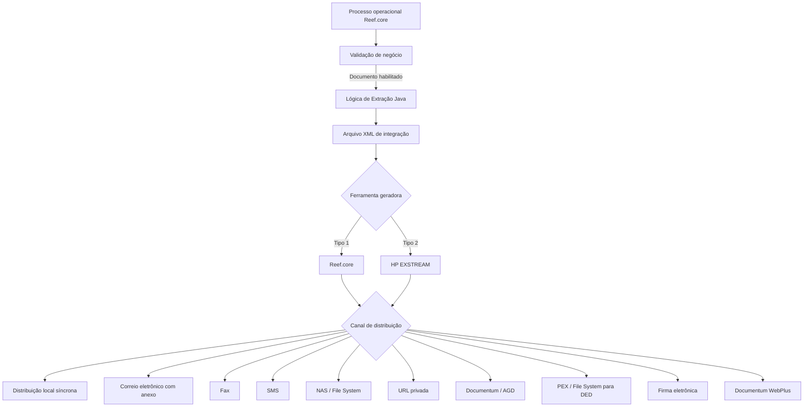
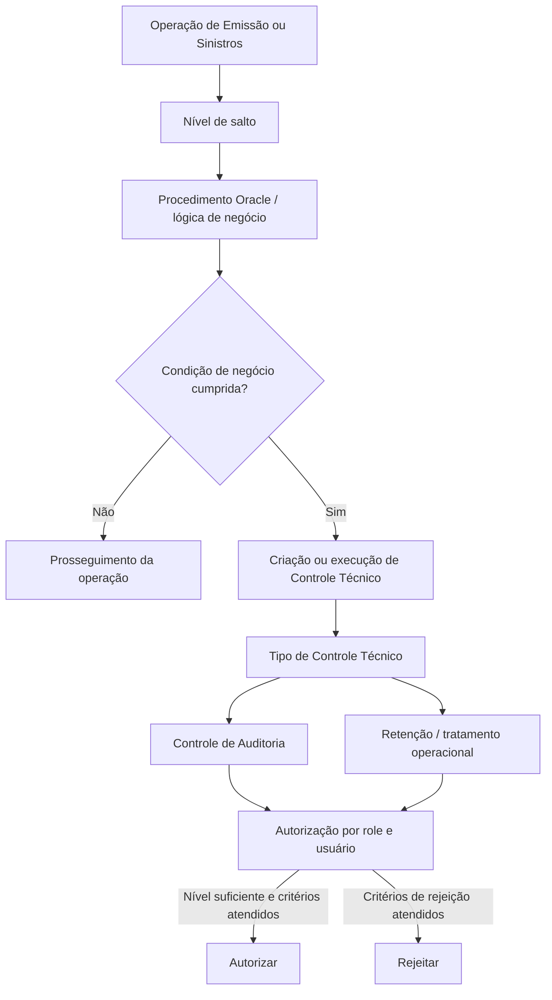
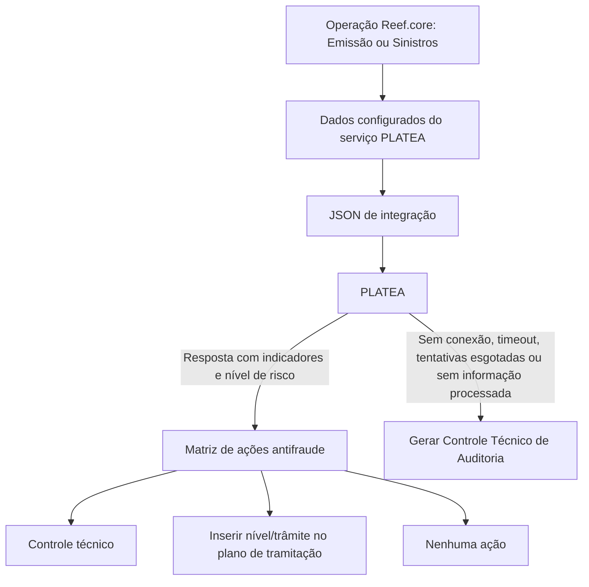

# Documentação Reef.core — Documentos, Controles Técnicos, PLATEA, Marcas e Elementos Comuns

## 1. Metadados do Documento
- **Arquivo de Origem:** Não identificado no texto extraído; conteúdo identificado como “DOCUMENTACIÓN Reef / Mapfredocument”.
- **Tipo de Documento:** Manual funcional e documentação de configuração.
- **Domínio / Sistema:** Reef.core / Grupo MAPFRE.
- **Público-Alvo:** Desenvolvedores, Arquitetos, Tecnologia e Processos locais, Operação, áreas de Emissão, Sinistros, Tesouraria, Terceiros e Administração/Finanças.
- **Data/Versão Identificada:** Não identificada.
- **Estado documental identificado:** Fonte aprovada (“Approved Source”); diversas seções marcadas como “EN CONSTRUCCIÓN” ou “Pendiente”.

---

## 2. Resumo Executivo & Contexto de Negócio

O documento descreve catálogos funcionais e parâmetros de configuração do **Reef.core**, sistema corporativo utilizado por entidades MAPFRE para suportar processos de seguros, incluindo Emissão, Sinistros e Prestações, Tesouraria, Contabilidade, Terceiros, gestão de documentos, controles técnicos, prevenção a fraude e marcas.

A primeira parte apresenta a configuração de **Documentos e Notificações**. O sistema permite definir documentos por companhia, código, idioma, versão, validade, canais de distribuição, ferramenta geradora, lógica de extração, regras de validação, indexação documental e método de obtenção. Os documentos podem atender classificações contratuais, comerciais, informativas, operacionais e de Voz do Cliente.

A documentação detalha os **Controles Técnicos**, que são validações de negócio dinâmicas e configuráveis localmente. Eles complementam as validações estáticas e obrigatórias do núcleo do Reef.core. Os controles podem ser associados a processos, níveis de salto, procedimentos Oracle, níveis de autorização, roles e usuários, permitindo retenção, autorização, rejeição e auditoria conforme regras locais.

Também é apresentada a integração entre **Reef.core e PLATEA**, plataforma interna MAPFRE de luta contra fraude. PLATEA classifica indicadores antifraude por nível de risco; Reef.core utiliza essa classificação para executar controles técnicos ou, no módulo de Sinistros, inserir níveis ou trâmites em planos de tramitação. Quando PLATEA não responde, o sistema gera automaticamente um Controle Técnico de Auditoria.

Por fim, o documento descreve a funcionalidade de **Marcas**, aplicada atualmente ao processo de Emissão. Marcas permitem tratar condições relacionadas a terceiros, objetos segurados e apólices, de forma proativa ou reativa. A configuração envolve tipos, severidades, fatos, detalhes de fatos, ações antecipadas e marcas obrigatórias por ramo técnico. A documentação também estabelece elementos comuns e transversais, como companhias, idiomas, estruturas geográficas, comerciais, de produtos, canais e parâmetros iniciais da instalação.

---

## 3. Arquitetura, Componentes & Tecnologias Envolvidas

### Componentes e capacidades identificadas

| Componente / Sistema | Responsabilidade descrita |
| :--- | :--- |
| **Reef.core** | Núcleo corporativo de seguros para processos de Emissão, Sinistros, Tesouraria, Terceiros, Contabilidade e outros módulos. |
| **Mapfredocument** | Contexto documental identificado no cabeçalho da fonte. |
| **HP EXSTREAM** | Ferramenta corporativa possível para composição e distribuição de documentos. |
| **Reef.core como ferramenta geradora** | Alternativa na qual o próprio Reef.core realiza geração e distribuição de documentos/notificações. |
| **Lógica de Extração Java** | Programa Java que extrai dados operacionais e gera XML para integração com ferramenta de composição e envio. |
| **Oracle Procedures** | Procedimentos Oracle usados para executar controles técnicos e avaliar condições de processos. |
| **Documentum / AGD** | Gestor documental corporativo para arquivamento de documentos. |
| **Documentum WebPlus** | Acesso web a documentos residentes no gestor documental corporativo por vínculo enviado ao cliente. |
| **NAS / File System** | Destino de distribuição de documentos por sistema de arquivos. |
| **DED** | Processo de Distribuição Externalizada de Documentação, alimentado por File System. |
| **Gestor de Firma Eletrônica** | Serviço externo para assinatura por terceiros de confiança, assinatura biométrica ou outros tipos de assinatura solicitados. |
| **PLATEA** | Plataforma Tecnológica de Luta contra o Fraude do Grupo MAPFRE. |
| **ComeRound** | Plataforma corporativa citada como exemplo de integração possível com PLATEA. |
| **RE21** | Sistema de resseguro externo referenciado na configuração de companhias. |
| **BPM** | Business Process Management, configurável para Gestão de Apólices e Contratos e Gestão de Sinistros e Prestações. |
| **OneTrust** | Exemplo de ferramenta de proteção de dados/RGPD. |

### Fluxo de documentos e notificações



### Fluxo de controle técnico



### Fluxo de integração antifraude PLATEA



> **Nota de Análise:** o documento cita integração por JSON com PLATEA, porém não detalha endpoint, protocolo, autenticação, payload completo, contratos de resposta ou mecanismos de retentativa.

---

## 4. Regras de Negócio, Especificações Funcionais & Processos

### 4.1 Documentos e notificações

- Documentos e notificações podem ser classificados como contratuais, comerciais, informativos, Voz do Cliente ou operacionais.
- Cada documento/notificação é configurado por companhia, código, data de validade, entrada ou saída, versão e estado de inabilitação.
- A data de validade determina quando a definição fica disponível; o uso correto permite manter histórico, rastreabilidade e exploração posterior das alterações.
- A distribuição local devolve o documento de forma síncrona na resposta do serviço web; o transacional realiza a apresentação em tela ou impressão.
- A lógica de extração é implementada em Java e deve extrair do operacional todos os dados requeridos para a composição e envio.
- A extração varia conforme o canal de distribuição e as etiquetas necessárias.
- Para envio de carta de quitação de sinistro por e-mail com anexo, são necessárias duas ações:
  1. Preparar e-mail: endereço destinatário, remetente, assunto e corpo.
  2. Gerar e anexar o documento físico: template corporativo e dados necessários à composição.
- A lógica de validação define se um documento/notificação deve ser habilitado e enviado à ferramenta corporativa de distribuição.
- Exemplo: em MAPFRE México, frotas de automóveis não devem imprimir certificados diretamente; a validação pode impedir a distribuição local direta e exigir processamento batch.
- A configuração e implementação das lógicas de extração e validação são responsabilidade da área local de Tecnologia e Processos.
- O atributo “Aplica Retención” está identificado como pendente.
- O atributo de inabilitação impede a utilização do documento/notificação ou de seus atributos.

### 4.2 Variáveis de informação de documentos

- Variáveis ou etiquetas são usadas para formar corretamente os arquivos XML de documentos/notificações.
- A variável é associada a companhia, documento/notificação, canal de distribuição, idioma, código da variável e data de validade.
- O valor pode ser obtido de terceiro, apólice, sinistro ou recibo, ou receber um valor padrão.
- Exemplo de notificação de improcedência de sinistro:
  - `EMAIL_ASUNTO`: valor constante “Improcedencia de Siniestro”.
  - `EMAIL_FROM`: valor constante `mapfre@mapfre.com`.
  - `EMAIL_TO`: obtido nos dados do tomador durante a execução da lógica de extração.
- Uma variável inabilitada não pode ser usada.

### 4.3 Associações de documentos a operações

- O documento identifica associações para Contabilidade, Emissão, Sinistros, Terceiros e Tesouraria.
- Essas seções estão marcadas como **“EN CONSTRUCCIÓN”**; o objetivo detalhado não foi fornecido.
- A associação utiliza, entre outros, companhia, identificador da operação, código de documento/notificação, data de validade, filtro da operação e inabilitação.
- Em Emissão e Sinistros há especialização por estrutura comercial, grupo de apólice, acordo, subacordo, ramo e dados específicos do processo.
- Em Sinistros também são citados plano de tramitação, tipo de expediente e código de trâmite.
- Um documento/notificação inabilitado não é avaliado nem considerado durante a execução da operação.

### 4.4 Controles técnicos

- Validações “out-of-the-box” do Reef.core são estáticas, inerentes ao núcleo e não podem ser removidas por configuração local.
- Exemplos de validações estáticas:
  - Vencimento de apólice deve ser igual ou posterior à data de efeito.
  - Um sinistro só pode ser aberto sobre apólice previamente identificada no sistema.
  - Códigos de gestor de cobrança, comissão e plano de pagamento precisam estar vigentes e habilitados.
  - Não é permitido emitir suplemento de cancelamento sobre apólice já cancelada nem reabilitar apólice não cancelada.
- Controles Técnicos são regras locais, voluntárias e dinâmicas, aplicáveis a etapas específicas dos processos.
- Exemplos de controles técnicos:
  - Permitir ou não a subscrição de veículos esportivos com mais de cinco anos, conforme sinistralidade e apetite de risco.
  - Impedir emissão de apólice Múltiple Empresarial com soma segurada de Incêndio acima de 5.000.000 euros.
  - Permitir liquidações parciais em Danos Materiais abaixo de 1.000 dólares sem visto do perito.
- Controles técnicos são normalmente executados nos processos de Gestão de Apólices e Contratos e Gestão de Sinistros e Prestações.
- Boa prática: agrupar a identificação dos controles segundo os processos sobre os quais serão executados.

### 4.5 Níveis de autorização, roles e usuários

- Controles Técnicos de Auditoria precisam ter código de nível de autorização.
- Para autorizar um controle técnico, o usuário deve ter nível igual ou superior ao nível configurado para o controle.
- O repositório de níveis de autorização é entregue inicialmente vazio.
- O intervalo tradicional citado para entidades MAPFRE é de `NIVEL0` a `NIVEL09`.
- Roles determinam a capacidade de aprovar controles técnicos.
- A associação Usuário por Role determina a autoridade de autorização em Emissão e Sinistros.
- **Regra explícita:** somente um role pode ser associado a cada usuário.
- A especialização de autorização pode considerar sistema, nível de salto, estrutura de produtos, estrutura comercial, role e sistema/departamento autorizador.
- Um controle cujo departamento autorizador seja Resseguro somente pode ser autorizado ou rejeitado por role e usuário cujo nível permita essa ação.

### 4.6 Níveis de salto e procedimentos

- Níveis de salto são pontos de execução de regras técnicas nos processos de Emissão e Sinistros.
- Os níveis são entregues pré-configurados e o documento determina que **seu conteúdo não deve ser modificado**.
- Controles técnicos são executados via procedimentos Oracle.
- Os procedimentos verificam condições, avaliam dados de apólice, suplemento, sinistro, expediente ou liquidação e determinam a necessidade de criar controles técnicos.
- Os procedimentos podem ser especializados por sistema, nível de salto, estrutura de produtos, estrutura comercial, menu, opção de menu e estrutura de informação.
- A nomenclatura da lógica de negócio é responsabilidade de Tecnologia local.
- Boa prática: identificar na nomenclatura a condição avaliada e respeitar a guia de escrita existente no Reef.core.

### 4.7 Configuração operacional de controles técnicos

- Cada controle técnico deve possuir uma tipologia corporativa; novos valores não podem ser incluídos localmente.
- Pode ser configurado para execução em:
  - Apólices.
  - Suplementos.
  - Renovações.
- “Avaliar Condições em Suplementos” evita reexecução quando as condições não mudaram em relação à apólice; exige que a lógica registre as condições de execução.
- A lógica de autorização é desenvolvida pela Tecnologia local e define critérios de autorização.
- A lógica de rejeição é exclusiva do processo de Sinistros e Prestações; seu desenvolvimento, implementação e nomenclatura também são responsabilidade local.
- A ação em caso de rejeição se aplica apenas a operações on-line e usa valores corporativos.
- O domínio de autorização e o sistema/departamento autorizador são valores corporativos não extensíveis.
- Quando “Observações Obligatorias” está ativo, o usuário deve informar motivo(s) de autorização ou rejeição.
- “Estructura Detalle” está descontinuada, é obsoleta e não deve ser usada ou reutilizada.

### 4.8 Palavras, termos e frases reservadas

- Aplicável exclusivamente a Ramos Técnicos de Caución e Crédito no Processo de Emissão.
- Textos anexos ou cláusulas precisam usar palavras, termos ou expressões obrigatórias.
- A violação gera o Controle Técnico predefinido **2209**.
- O campo de escopo aceita:
  - `A`: possíveis textos anexos capturados.
  - `C`: possíveis cláusulas selecionadas.
- A configuração inicial é pré-definida.
- A manutenção posterior é responsabilidade da Direção de Administração e Finanças da entidade MAPFRE local.

### 4.9 PLATEA e antifraude

- PLATEA é plataforma tecnológica interna para prevenção, detecção antecipada, investigação, medição e controle de fraude.
- PLATEA pode ser aplicada a canais, ramos e diferentes momentos de cotação e contratação.
- A integração Reef.core–PLATEA permite tomar ações conforme o nível de risco devolvido nos processos de Emissão e Sinistros.
- O indicador PLATEA deve usar a mesma chave em PLATEA e Reef.core para permitir o emparelhamento das plataformas.
- Somente indicadores que podem produzir alguma ação no Reef.core precisam ser definidos; não é obrigatório registrar todos os indicadores existentes em PLATEA.
- Quando não há resposta PLATEA por indisponibilidade, tentativas esgotadas, timeout ou ausência de dados processados, o Reef.core gera automaticamente um Controle Técnico de Auditoria.
- As ações iniciais suportadas são:
  - Inserção de nível no plano de tramitação, exclusiva de Sinistros.
  - Inserção de trâmite específico no plano de tramitação, exclusiva de Sinistros.
  - Criação de controle técnico em Emissão ou Sinistros.
  - Nenhuma ação.
- Ação antifraude pode marcar expediente como possível fraude e incluir aviso no expediente de sinistro.
- A abrangência dos indicadores pode ser especializada por estruturas geográficas, comerciais, de produtos e canais.
- Valores genéricos aceitos no âmbito de indicadores: `9999` para campos numéricos e `ZZZZ` para campos alfanuméricos.

### 4.10 Dados do serviço PLATEA para Emissão

- A configuração determina os dados necessários para montar o JSON de integração com PLATEA.
- Cada dado possui ramo técnico, sequência, identificador PLATEA, continente/tipologia do dado e origem.
- Para dados variáveis, deve ser indicado o nome do dado variável.
- Para intervenções, devem ser especificados papel do terceiro, condição de intervenção principal e condição de intervenção usada para cálculo de prêmio.
- Para dados fixos, devem ser especificados conceito lógico e propriedade do conceito lógico.
- A responsabilidade pela atribuição de conceito lógico e propriedade é da Direção de Tecnologia Local.
- O resultado pode ser:
  - **Detalhe:** cada linha retornada é entregue individualmente.
  - **Acumulado:** várias linhas retornadas são somadas.

### 4.11 Marcas

- Marcas controlam condições sobre terceiros, objetos segurados e apólices.
- O processo pode ser:
  - **Proativo:** antes ou durante operação de Emissão, baseado em coincidências com fatos configurados.
  - **Reativo:** após consolidação de apólices, conforme informação disponível.
- A funcionalidade está implementada atualmente somente no processo de Emissão.
- As marcas possuem tipologia, severidade, idioma, nomenclatura, observação, validade e inabilitação.
- As marcas podem ser obrigatórias por ramo técnico.
- Ações antecipadas podem ser especializadas por ramo, contrato, subcontrato, níveis de canal, operação, marca e severidade.
- Atualmente, a única tipologia de ação antecipada implementada é a execução de controles técnicos.
- A ação pode indicar código de controle técnico; se não houver código, pode apontar lógica de negócio.
- Ramo genérico: `999`.
- Contrato e subcontrato genéricos: `99999`.
- Níveis genéricos de canal: `9999`.

### 4.12 Fatos e detalhes de fatos de marcas

- Um fato é o cumprimento de uma marca e severidade configuradas para avaliar dados de terceiros e/ou objetos segurados.
- A configuração dos fatos é manual.
- Um fato pode atuar sobre:
  - Dado fixo.
  - Dado variável.
  - Intervenção.
- Para dado fixo, a única tipologia atualmente implementada é Número de Apólice.
- Dados variáveis podem ser associados em nível de apólice ou risco.
- Intervenções podem contemplar tomador, tomador alterno, beneficiário, segurado e outras figuras de terceiros.
- Para intervenção, podem ser configurados endereço, documento identificador, e-mail, telefone, nome, sobrenomes e dados geográficos.
- A busca de fatos considera movimentos cuja vigência esteja entre a data da consulta e um número de anos anteriores indicado nos parâmetros do ramo.
- Usuários podem incluir ou excluir resultados do tratamento antecipado quando a apólice/aplicação for modificável.
- Se existirem registros vigentes de marcas obrigatórias por ramo no momento da criação do fato, a apólice fica não modificável.
- Situações possíveis da apólice/aplicação: Expirada, Vigente, Anulada, Rehabilitada ou Suspendida.
- O campo `obs_val` permite registrar explicação sobre finalidade, benefício e área relacionada ao fato ou marca.
- Não há padrão obrigatório de codificação, mas é recomendável avaliar agrupamento transversal para exploração posterior.

### 4.13 Elementos comuns e instalação

- Elementos comuns são transversais a todos os módulos e devem ser definidos em ordem adequada.
- Incluem parâmetros de instalação, companhias, idiomas, moedas, estrutura geográfica, estrutura comercial, estrutura de produtos, canais, catálogos gerais, segurança, estruturas de informação, tarefas, programas, menus, mensagens, ajudas, anotações, notificações, controles técnicos, PLATEA e marcas.
- O sistema suporta até **99 entidades**.
- A chave societária deve corresponder ao identificador da sociedade no sistema contábil corporativo.
- O campo “Atividade que identifica a entidade” possui valor constante `39`.
- O RGPD pode ser habilitado e requer indicação da ferramenta utilizada.
- Tecnologia e Processos locais são responsáveis pela configuração adequada de ferramentas RGPD, identificador único de terceiros e programas de abertura de sinistros/expedientes.
- A identificação única de terceiros exige desenvolvimento local de componente de software.
- Os dois modelos de informação de terceiros são mutuamente exclusivos: usa-se o modelo antigo ou o novo modelo.
- Para modelo antigo, parâmetros podem permitir múltiplas contas bancárias ou cartões.
- O banco de dados identificado para o sistema é **ORACLE**.
- O formato de data sem separadores é `DDMMYYYY`.
- A chave de instalação distingue registros de núcleo e extensões locais; exemplos: `TRN`, `MMT` e `EUR`.
- Idiomas devem respeitar ISO 639-1 ou ISO 639-2 com códigos de duas letras; o sistema também está preparado para ISO 639-3 com três letras.

---

## 5. Tabelas de Parâmetros, Ambientes e Estruturas de Dados

### 5.1 Canais de distribuição de documentos

| Item / Parâmetro | Descrição / Função | Tipo / Valores / Formato | Ambiente / Observações |
| :--- | :--- | :--- | :--- |
| Distribuição Local | Retorna documento de modo síncrono na resposta do serviço web. | Distribuição síncrona. | O transacional apresenta em tela ou envia à impressora. |
| Correio Eletrônico | Envia documento como anexo de e-mail. | E-mail para endereços indicados. | Requer destinatário, remetente, assunto e corpo. |
| Fax | Envia documento ao telefone informado. | Fax. | Telefone de destino obrigatório. |
| SMS | Envia mensagem ao telefone móvel indicado. | Mensageria SMS. | Conteúdo documental não é detalhado. |
| File System | Deposita o documento em NAS. | Sistema de arquivos. | Destino citado como NAS. |
| URL Privada | Permite acesso por link enviado por e-mail. | Link web com chave de acesso. | Chave pode ser enviada por SMS ou informada sem exposição explícita. |
| Gestor Documental | Arquiva documento no gestor documental corporativo. | Documentum / AGD. | Requer método de indexação. |
| Provedor Externo | Deposita documento em File System para posterior DED. | PEX / File System – DED. | Integra processo externalizado de documentação. |
| Firma Eletrônica | Envia documento a gestor externo de assinatura. | Assinatura por terceiros de confiança, biométrica ou outra solicitada. | Tipo de assinatura depende da requisição. |
| Gestor Documental via Vínculo | Disponibiliza documentos do Documentum por link externo. | Documentum WebPlus. | Link enviado por e-mail; acesso protegido por chave. |

### 5.2 Ferramentas geradoras de documentos

| Item / Parâmetro | Descrição / Função | Tipo / Valores / Formato | Ambiente / Observações |
| :--- | :--- | :--- | :--- |
| Ferramenta Geradora | Determina gerador e distribuidor de documento/notificação. | `1` Reef.core; `2` HP EXSTREAM. | O documento não descreve outras ferramentas. |
| Plantilla Diseño Documento | Código de template EXSTREAM utilizado como base de extração Java. | Código de template. | Considera canais e etiquetas a preencher. |
| Lógica de Extração | Programa Java que gera XML e extrai dados do operacional. | Componente Java. | Responsabilidade local de Tecnologia e Processos. |
| Lógica de Negócio – Validação | Decide habilitação e envio para distribuição. | Procedimento/lógica local. | Pode impedir distribuição direta em casos específicos. |
| Indexação Gestor Documental | Método de indexação no gestor documental. | Modelo e tipo documental local. | Aplicável quando houver armazenamento no gestor. |

### 5.3 Níveis de salto configurados

| Sistema | Nível de Salto | Denominação |
| :--- | :--- | :--- |
| 2 | 1 | DATOS FIJOS PÓLIZA |
| 2 | 2 | DATOS VARIABLES PÓLIZA |
| 2 | 3 | TERCEROS |
| 2 | 4 | DATOS VARIABLES RIESGO |
| 2 | 5 | DATOS VARIABLES AGRAVANTES |
| 2 | 6 | COBERTURAS |
| 2 | 7 | REASEGURO |
| 2 | 8 | OPCIONES DEL MENU |
| 2 | 9 | VALIDADOR DE EMISIÓN |
| 2 | 10 | SELECCIÓN RIESGOS VIDA |
| 2 | 11 | INSPECCIONES/INSPECTIONS |
| 2 | 12 | COMISIONES |
| 2 | 13 | REHABILITACIÓN INTERVENCIONES RIESGO |
| 3 | 1 | DAT.FIJOS LIQUIDACIONES |
| 3 | 2 | COBERTURAS LIQUIDACIONES |
| 5 | 1 | DATOS DEL RECIBO |
| 7 | 1 | IDENTIFICACIÓN DEL SINIESTRO |
| 7 | 2 | DATOS SINIESTRO |
| 7 | 3 | CAUSAS CONSECUENCIAS SINIESTRO |
| 7 | 4 | DATOS COMPLEMENTARIOS SINIESTRO |
| 7 | 5 | DATOS FIJOS DEL EXPEDIENTE |
| 7 | 6 | COBERTURAS DEL EXPEDIENTE |
| 7 | 7 | TERMINACIÓN DE EXPEDIENTES |
| 7 | 8 | REHABILITACIÓN DE SINIESTROS |
| 7 | 9 | REHABILITACIÓN DE EXPEDIENTES |
| 7 | 10 | ALTA FACTURACIÓN |
| 7 | 11 | CAMBIO VALORACIÓN EN LA FACTURACIÓN |
| 7 | 12 | PLANES DE RENTA |

### 5.4 Valores genéricos de especialização

| Estrutura / Parâmetro | Valor genérico | Significado |
| :--- | :--- | :--- |
| Setor | `9999` | Todos os setores. |
| Subsetor | `9999` | Todos os subsetores. |
| Ramo técnico | `999` | Todos os ramos técnicos. |
| Primeiro nível comercial | `99` | Todos os primeiros níveis comerciais. |
| Segundo nível comercial | `999` | Todos os segundos níveis comerciais. |
| Terceiro nível comercial / escritório | `9999` | Todos os terceiros níveis comerciais/escritórios. |
| Estrutura de informação | `ZZZZZZZZZZ` | Qualquer estrutura de informação. |
| Indicadores antifraude – campo numérico | `9999` | Valor genérico para especialização ampla. |
| Indicadores antifraude – campo alfanumérico | `ZZZZ` | Valor genérico para especialização ampla. |
| Marcas – ramo técnico | `999` | Ramo técnico genérico. |
| Marcas – contrato | `99999` | Contrato genérico. |
| Marcas – subcontrato | `99999` | Subcontrato genérico. |
| Marcas – níveis de canais | `9999` | Nível genérico da estrutura de canais. |

### 5.5 Campos de ações antifraude

| Item / Parâmetro | Descrição / Função | Tipo / Valores / Formato | Ambiente / Observações |
| :--- | :--- | :--- | :--- |
| Módulo Reef.core | Módulo afetado pela ação. | `EM` Emissão; `TS` Sinistros. | Futuramente pode abranger Tesouraria e fornecedores de Terceiros. |
| Operação Reef.core | Operação afetada. | Código de operação. | Associada ao indicador e ação. |
| Indicador Antifraude | Indicador PLATEA avaliado. | Código PLATEA. | Deve coincidir com chave do PLATEA. |
| Nível de Risco | Severidade do indicador devolvida por PLATEA. | Valores configurados por Reef.core. | Determina ação aplicável. |
| Tipologia de ação | Ação que Reef.core executa. | Plano/trâmite, controle técnico ou nenhuma ação. | Plano/trâmite exclusivo de Sinistros. |
| Código de Controle Técnico | Controle acionado. | Código de erro/controle. | Aplicável quando tipo de ação for controle técnico. |
| Plano de Tramitação | Plano local de Sinistros. | Código de plano. | Aplicável somente a Sinistros. |
| Nível do Plano | Agrupamento de trâmites. | Código de nível. | Aplicável somente a Sinistros. |
| Trâmite do Nível | Trâmite específico inserido. | Código de trâmite. | Aplicável somente a Sinistros. |
| Marca Expediente | Etiqueta expediente como possível fraude. | Indicador de marcação. | Exclusivo de Sinistros. |
| Aviso do Plano | Cria aviso no expediente. | Texto/aviso configurado. | Exclusivo de Sinistros. |
| Data de Validade | Início de vigência do registro. | Data. | Permite histórico. |
| Inabilitação | Desativa registro de ação. | Indicador. | Registro não é utilizado. |

### 5.6 Parâmetros iniciais relevantes

| Item / Parâmetro | Descrição / Função | Tipo / Valores / Formato | Ambiente / Observações |
| :--- | :--- | :--- | :--- |
| Dia de início semanal | Define primeiro dia da semana. | Parâmetro transversal. | Valor não detalhado. |
| Hora/minutos padrão em suplementos | Hora mostrada na data de efeito quando obrigatória. | Exemplos `00:00`, `12:00`, `24:00`. | Aplicável à Emissão. |
| BPM em Gestão de Apólices e Contratos | Habilita execução via BPM. | Sim/Não. | Processo de Emissão. |
| BPM em Gestão de Sinistros e Prestações | Habilita execução via BPM. | Sim/Não. | Processo de Sinistros. |
| Novo Modelo de Terceiros | Indica adoção do novo modelo de dados de terceiros. | Sim/Não. | Modelos antigo e novo são mutuamente exclusivos. |
| Código genérico de terceiros | Código genérico para acessos à base. | `999999`. | Relacionado ao novo modelo. |
| Contas bancárias múltiplas | Permite uma ou várias contas. | Sim/Não. | Aplicável ao modelo antigo. |
| Cartões múltiplos | Permite um ou vários cartões. | Sim/Não. | Aplicável ao modelo antigo. |
| Base de Dados do Sistema | Banco que suporta informações do sistema. | ORACLE. | Declarado explicitamente. |
| Formato de data sem separadores | Formato de campos de data. | `DDMMYYYY`. | Parâmetro tecnológico. |
| Conjunto de caracteres | Codificação de caracteres utilizada. | Exemplo `iso-8859-1`. | Valor depende da instalação. |
| Chave da instalação | Identifica instalação/país e extensões locais. | Exemplos `TRN`, `MMT`, `EUR`. | Diferencia núcleo de extensões locais. |
| Máximo de registros em consultas | Limita resultados de consultas. | Número máximo. | Minimiza impacto no desempenho. |
| Idioma da instalação | Idioma padrão de etiquetas da aplicação. | Código de idioma. | Aplicável a programas do sistema. |

---

## 6. Bateria de Perguntas & Respostas para RAG (FAQ Sintético)

### P1: Qual é a diferença entre uma validação padrão do Reef.core e um Controle Técnico?
**R:** Validações padrão do Reef.core são estáticas, inerentes ao núcleo e não podem ser evitadas por parametrização local. Controles Técnicos são regras de negócio dinâmicas que as entidades MAPFRE podem configurar localmente em pontos específicos de processos como Emissão e Sinistros, de acordo com necessidades técnicas, comerciais ou administrativas.

### P2: Como Reef.core decide se um documento deve ser distribuído?
**R:** A definição do documento contém uma Lógica de Negócio de Validação que decide se o documento ou notificação deve ser habilitado e enviado à ferramenta corporativa responsável pela distribuição. Essa lógica pode restringir um canal aparentemente habilitado; por exemplo, pode impedir impressão local direta de certificados de frota e exigir processamento batch.

### P3: Quais ferramentas podem gerar documentos ou notificações no Reef.core?
**R:** O catálogo de Ferramenta Geradora prevê dois valores: `1` para Reef.core e `2` para HP EXSTREAM. A configuração define qual ferramenta será responsável pela geração e distribuição do documento ou notificação.

### P4: O que acontece quando PLATEA não responde a uma solicitação do Reef.core?
**R:** Reef.core gera automaticamente um Controle Técnico de Auditoria quando não recebe resposta do PLATEA por falta de conexão, número de tentativas esgotado, timeout ou ausência de informação processada sobre o elemento avaliado, como orçamento, apólice, sinistro ou expediente.

### P5: Quais ações antifraude Reef.core suporta inicialmente?
**R:** Reef.core suporta inserção de nível no plano de tramitação, inserção de trâmite específico no plano de tramitação, geração de controles técnicos e ausência de ação. A inserção de nível ou trâmite é exclusiva do módulo de Sinistros; controles técnicos podem ser usados em Emissão e Sinistros.

### P6: Um usuário pode possuir vários roles de Controle Técnico?
**R:** Não. A documentação estabelece explicitamente que somente um role pode ser associado a cada usuário no catálogo de Usuários por Role de Controles Técnicos.

### P7: Qual nível de autorização um usuário precisa ter para autorizar um Controle Técnico de Auditoria?
**R:** O usuário precisa ter nível de autorização igual ou superior ao nível de autorização configurado para o Controle Técnico de Auditoria. Além disso, as especializações por role, sistema, produto, estrutura comercial, nível de salto e departamento autorizador devem permitir a ação.

### P8: Os níveis de salto dos Controles Técnicos podem ser alterados localmente?
**R:** Não. O catálogo de níveis de salto é entregue com conteúdo pré-configurado, e a documentação determina que seu conteúdo não deve ser modificado.

### P9: Como uma marca pode gerar uma ação antecipada durante a Emissão?
**R:** Reef.core identifica coincidências entre dados da operação de emissão e fatos previamente configurados para uma marca. A ação antecipada pode ser especializada por ramo, contrato, subcontrato, estrutura de canais, operação, marca e severidade. Atualmente, a única ação implementada é disparar um Controle Técnico ou, sem código de controle, executar uma lógica de negócio.

### P10: Quais dados podem compor um fato de marca associado a uma intervenção de terceiro?
**R:** Um fato pode utilizar a figura da intervenção, como Tomador, Tomador alterno, Beneficiário ou Segurado, e pode detalhar endereço, documento identificador, e-mail, telefone, nome, sobrenomes, país, estado, província, cidade, código postal e elementos complementares de endereço.

### P11: O que significa usar o valor genérico `9999` em configurações de PLATEA?
**R:** Em propriedades numéricas de estruturas geográficas, comerciais, de produtos ou de canais, `9999` pode ser usado como valor genérico para ampliar o escopo e facilitar a manutenção. Para campos alfanuméricos, o documento cita `ZZZZ` como valor genérico.

### P12: Quais canais de distribuição documental podem disponibilizar documentos por link?
**R:** A Distribuição URL Privada disponibiliza documento pela Internet por link enviado por e-mail. Documentum WebPlus também disponibiliza documentos residentes no gestor documental corporativo por link. Nos dois casos, o acesso pode ser protegido por chave enviada por SMS ou obtida por informação conhecida pelo usuário, como documento de identidade ou número de apólice.

---

## 7. Glossário de Termos, Siglas & Conceitos-Chave

- **AGD:** Gestor documental corporativo citado como destino de arquivamento via Documentum.
- **BPM:** Business Process Management; mecanismo de execução configurável para processos de Apólices/Contratos e Sinistros/Prestações.
- **DED:** Distribuição Externalizada de Documentação.
- **EM:** Código do módulo de Emissão do Reef.core.
- **EXSTREAM:** HP EXSTREAM, ferramenta corporativa de composição e distribuição de documentos.
- **File System:** Sistema de arquivos utilizado como destino de distribuição ou integração.
- **HP EXSTREAM:** Ferramenta corporativa selecionável para geração e distribuição de documentos/notificações.
- **JSON:** Formato de integração usado para formar dados enviados ao PLATEA.
- **Lógica de Extração:** Programa Java que extrai dados do operacional e gera XML de integração documental.
- **Marca:** Sinal ou classificação configurável para controlar condições relacionadas a terceiros, objetos segurados e apólices.
- **NAS:** Destino de armazenamento em rede utilizado na distribuição por File System.
- **Nível de Salto:** Ponto específico do programa/processo no qual uma regra de negócio ou Controle Técnico é executado.
- **PLATEA:** Plataforma Tecnológica de Luta contra o Fraude do Grupo MAPFRE.
- **PEX:** Distribuição em provedor externo por File System, relacionada ao processo DED.
- **RGPD:** Regulamento Geral de Proteção de Dados.
- **Reef.core:** Núcleo do sistema corporativo de seguros descrito no documento.
- **Role:** Perfil que determina a capacidade de usuários autorizarem ou não controles técnicos.
- **TS:** Código do módulo de Sinistros do Reef.core.
- **URL Privada:** Link de acesso à documentação enviado ao cliente, com acesso protegido por chave.
- **XML:** Arquivo produzido pela lógica de extração para integração com a composição e distribuição de documentos.

---

## 8. Notas Críticas, Riscos & Limitações

- Diversas seções de associação de documentos a operações estão marcadas como **“EN CONSTRUCCIÓN”**; o objetivo e o comportamento completo dessas associações não são detalhados.
- Os atributos “Aplica Retención”, “Consulta Actividad Extendida” e “Consulta Asegurado Limitada” aparecem como **pendentes**.
- O documento não apresenta URLs, portas, protocolos de transporte, credenciais, autenticação, contratos completos de API, esquemas XML ou payloads JSON.
- Os procedimentos Oracle, lógicas Java e lógicas de autorização/rejeição são citados, mas seus nomes concretos, assinaturas, tabelas e código não são fornecidos.
- O campo “Estructura Detalle” dos controles técnicos está descontinuado e não deve ser usado.
- A tipologia de Controle Técnico, o Domínio de Autorização e a Ação em caso de Rejeição utilizam valores corporativos que não podem ser ampliados localmente.
- O conteúdo dos Níveis de Salto não deve ser alterado.
- A funcionalidade de Marcas está implementada atualmente apenas no processo de Emissão, apesar de existir intenção corporativa de avaliar expansão para outros processos.
- A manutenção de palavras reservadas para Caución e Crédito é atribuída à Direção de Administração e Finanças local.
- A lógica de extração, validação documental, autorização, rejeição, identificador único de terceiros e nomenclaturas de programas são responsabilidades da Tecnologia e Processos locais.
- Os modelos antigo e novo de Terceiros são mutuamente exclusivos em uma instalação.
- A documentação descreve valores e configurações funcionais, mas não detalha governança de mudança, auditoria de parametrização, segregação de funções ou processo de implantação.

---

## 9. Conteúdo Bruto Estruturado (Referência Fiel)

```text
--- [PÁGINAS 1 A 6] ---
Definição de atributos, variáveis e documentos/notificações no Reef.core.

Objetivo dos documentos/notificações:
Identificar e configurar documentos ou notificações gerados e enviados a terceiras pessoas, incluindo classificações contratuais, comerciais, informativas, Voz do Cliente e operativas.

Atributos de documentos/notificações:
- Companhia.
- Código do Documento/Notificação.
- Data de Validade.
- Entrada ou Saída.
- Versão.
- Canais de Distribuição.
- Plantilla Diseño Documento.
- Ferramenta Geradora.
- Lógica de Extração.
- Indexação Gestor Documental.
- Método de Obtenção do Documento.
- Lógica de Negócio – Validação.
- Aplica Retención: pendente.
- Inabilitação.

Canais:
- Distribuição Local.
- Correio Eletrônico.
- Fax.
- SMS.
- File System / NAS.
- URL Privada.
- Documentum / AGD.
- PEX / File System – DED.
- Firma Eletrônica.
- Documentum WebPlus.

Ferramenta Geradora:
1 Reef.core.
2 HP EXSTREAM.

Variáveis:
- Companhia.
- Código do Documento/Notificação.
- Canal de Distribuição.
- Idioma.
- Código da Variável.
- Data de Validade.
- Valor da Variável.
- Inabilitação.

--- [PÁGINAS 7 A 16] ---
Associação de documentos/notificações a operações de:
- Contabilidade.
- Emissão.
- Sinistros.
- Terceiros.
- Tesouraria.

As seções são identificadas como “EN CONSTRUCCIÓN”.

Campos citados:
- Companhia.
- opr_idn_val: identificador de operação.
- enc_val: classe de lançamento.
- Chaves de primeiro, segundo e terceiro níveis.
- gpp_val: apólice grupo.
- del_val: acordo.
- sbl_val: subacordo.
- lob_val: ramo.
- enr_typ_val: tipo de suplemento.
- enr_val: código de suplemento.
- enr_sbd_val: subcódigo de suplemento.
- hpn_val: plano de tramitação.
- Tipo de Expediente.
- pcs_val: código do trâmite.
- Código do Documento/Notificação.
- Data de Validade.
- opr_fit: filtro de operação OK/KO.
- Inabilitação.

--- [PÁGINAS 17 A 38] ---
Definição de Controles Técnicos.

Validações padrão Reef.core:
- São estáticas.
- Não podem ser removidas por parametrização local.
- São inerentes às operações de uma seguradora.

Controles Técnicos:
- Regras locais e dinâmicas.
- Normalmente executadas em Gestão de Apólices e Contratos e Gestão de Sinistros e Prestações.
- Catálogos: controles, níveis de salto, procedimentos, níveis de autorização, roles, usuários por role e especializações de autorização.

Níveis de autorização:
- Usuário precisa ter nível igual ou superior para autorizar controle de auditoria.
- Repositório inicialmente vazio.
- Faixa tradicional: NIVEL0 a NIVEL09.

Níveis de salto:
Sistema 2:
1 DATOS FIJOS PÓLIZA
2 DATOS VARIABLES PÓLIZA
3 TERCEROS
4 DATOS VARIABLES RIESGO
5 DATOS VARIABLES AGRAVANTES
6 COBERTURAS
7 REASEGURO
8 OPCIONES DEL MENU
9 VALIDADOR DE EMISIÓN
10 SELECCIÓN RIESGOS VIDA
11 INSPECCIONES/INSPECTIONS
12 COMISIONES
13 REHABILITACIÓN INTERVENCIONES RIESGO

Sistema 3:
1 DAT.FIJOS LIQUIDACIONES
2 COBERTURAS LIQUIDACIONES

Sistema 5:
1 DATOS DEL RECIBO

Sistema 7:
1 IDENTIFICACIÓN DEL SINIESTRO
2 DATOS SINIESTRO
3 CAUSAS CONSECUENCIAS SINIESTRO
4 DATOS COMPLEMENTARIOS SINIESTRO
5 DATOS FIJOS DEL EXPEDIENTE
6 COBERTURAS DEL EXPEDIENTE
7 TERMINACIÓN DE EXPEDIENTES
8 REHABILITACIÓN DE SINIESTROS
9 REHABILITACIÓN DE EXPEDIENTES
10 ALTA FACTURACIÓN
11 CAMBIO VALORACIÓN EN LA FACTURACIÓN
12 PLANES DE RENTA

Regra:
Não deve ser modificado o conteúdo do catálogo de níveis de salto.

--- [PÁGINAS 39 A 50] ---
PLATEA e antifraude.

PLATEA:
Plataforma Tecnológica de Luta contra o Fraude desenvolvida internamente para entidades do Grupo MAPFRE.

Objetivo:
Integrar Reef.core e PLATEA para executar ações conforme o nível de risco devolvido por PLATEA em Emissão e Sinistros.

Ações Antifraude:
- Módulo Reef.core: EM ou TS.
- Operação Reef.core.
- Código do Indicador Antifraude.
- Código da Ação Antifraude.
- Nível de Risco.
- Tipologia de Ação.
- Código do Controle Técnico.
- Plano de Tramitação.
- Nível do Plano de Tramitação.
- Trâmite do Nível.
- Marca Expediente.
- Aviso do Plano de Tramitação.
- Inabilitação.
- Data de Validade.

Se PLATEA não responder por indisponibilidade, tentativas esgotadas, timeout ou ausência de informação processada:
- Reef.core gera automaticamente Controle Técnico de Auditoria.

Dados do serviço PLATEA em Emissão:
- Companhia.
- Ramo Técnico.
- Sequência.
- Identificador.
- Continente do Dado.
- Dado Variável.
- Intervenção.
- Intervenção Principal.
- Intervenção Cálculo.
- Conceito Lógico.
- Propriedade do Conceito Lógico.
- Tipo de Resultado: detalhe ou acumulado.

--- [PÁGINAS 51 A 70] ---
Marcas.

Objetivo:
Controlar condições sobre terceiros, objetos segurados e apólices em operações de emissão.

Processos:
- Proativo.
- Reativo.

Catálogos:
- Tipos de Marcas.
- Definição de Marcas.
- Marcas por Ramo Técnico.
- Severidades.
- Fatos.
- Detalhe dos Fatos.
- Ações Antecipadas.

Ações Antecipadas:
- Companhia.
- Ramo Técnico.
- Contrato.
- Subcontrato.
- Primeiro, segundo e terceiro níveis da estrutura de canais.
- Operação.
- Marca.
- Severidade/Gravidade.
- Tipo de ação.
- Código do Controle Técnico.
- Lógica de Negócio.
- Inabilitação.
- Data de Validade.

Fatos:
- Companhia.
- Ramo Técnico.
- Marca.
- Severidade/Gravidade.
- Identificador do Fato.
- Sequência/Ordem.
- Tipologia do Objeto: Dado Fixo, Dado Variável ou Intervenção.
- Intervenção do Terceiro.
- Atributo.
- Valor do Dado Fixo/Dado Variável.
- Documento identificador.
- Nome e sobrenomes.
- Dados de endereço.
- obs_val.
- Inabilitação.
- Data de Validade.

--- [PÁGINAS 71 A 87] ---
Elementos comuns e parâmetros iniciais.

Elementos comuns:
- Parâmetros de Instalação.
- Companhias do Sistema.
- Idiomas.
- Moedas.
- Estrutura Geográfica.
- Estrutura Comercial.
- Estrutura de Produtos.
- Estrutura de Clientes Distribuidores.
- Estrutura de Canais.
- Catálogos Gerais.
- Sistema de Segurança.
- Estruturas de Informação.
- Tarefas.
- Programas, Menus, Mensagens e Ajudas.
- Anotações.
- Notificações.
- Controles Técnicos.
- PLATEA.
- Marcas.

Companhias:
- Máximo de 99 entidades.
- Identificação tributária.
- Identificação patronal.
- Identificação societária.
- Razão social.
- Estrutura geográfica.
- Endereço, telefone e fax.
- CEO.
- Moeda ISO.
- Companhia de resseguro externo RE21.
- Feriados.
- Atividade constante 39.
- RGPD e ferramenta RGPD.
- Tratamento de terceiros duplicados.
- ID único de terceiros.
- Informação parcial.
- Limites de exportação.
- Limites de prêmios para prevenção de lavagem de dinheiro.
- Termos/frases obrigatórios em Caución e Crédito.
- Programas de abertura de sinistros e expedientes.
- Plano de fidelização.

Idiomas:
- ES: Español / Esp.
- TR: Türkçe / Turk.
- EN: English / Eng.
- Recomendação de ISO 639-1, ISO 639-2 ou ISO 639-3.

Parâmetros tecnológicos:
- Base de Dados do Sistema: ORACLE.
- Formato de data sem separadores: DDMMYYYY.
- Conjunto de caracteres: exemplo iso-8859-1.
- Chave de instalação: TRN, MMT, EUR.
- Máximo de registros em consultas.
- Idioma da instalação.

Documentação de Comuns:
- Definição.
- Operação.
- Modelo de Dados.
```
