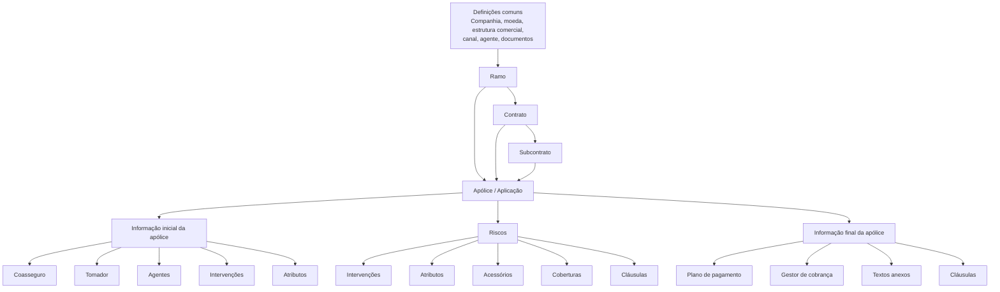
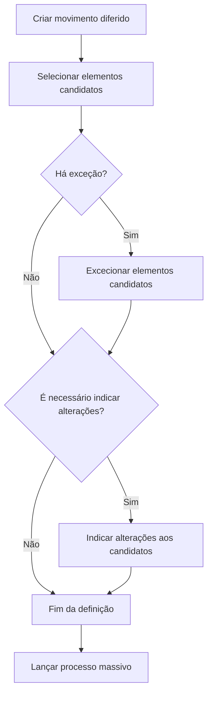
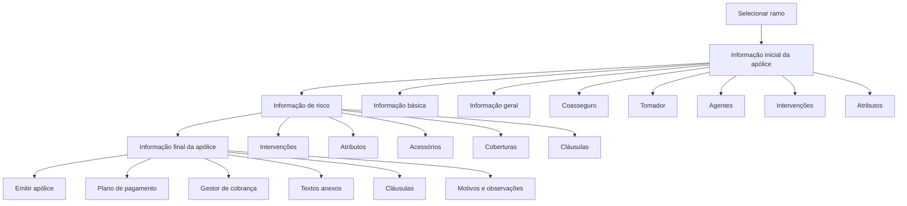

# Documentação Reef.core — Definições de Emissão, Produtos de Seguro e Processos Massivos

## 1. Metadados do Documento
- **Arquivo de Origem:** Não identificado no conteúdo extraído
- **Tipo de Documento:** Manual Operacional e Especificação Técnica
- **Domínio / Sistema:** Reef.core / MAPFRE / Emissão de seguros
- **Público-Alvo:** Desenvolvedores, Arquitetos, Operação, Configuradores de produto e Negócio
- **Data/Versão Identificada:** Não identificada
- **Fonte identificada no texto:** `DOCUMENTACIÓN Reef`, proprietário `user:agonzalez_mapfre.com`, ciclo de vida `Approved Source`

---

## 2. Resumo Executivo & Contexto de Negócio

O documento descreve a configuração funcional e técnica do módulo de emissão do **Reef.core**, plataforma utilizada para criar, consultar, alterar, renovar, cancelar e controlar contratos de seguro. A documentação cobre definições reutilizáveis de produto — como ramo, contrato, subcontrato, cobertura, atributo, cláusula, intervenção, coasseguro, acessórios e planos de pagamento — e operações de emissão para os domínios de Automóvel, Vida, Transportes, Saúde e Ramos Gerais.

A arquitetura funcional apresentada é orientada à parametrização. Um ramo define a configuração base do produto de seguro; contratos e subcontratos aplicam alterações específicas sobre essa configuração para determinados clientes, colaboradores ou contextos. Uma apólice pode agrupar riscos, coberturas, intervenientes, atributos, cláusulas, valores segurados, prémios, recibos e condições de resseguro/coasseguro.

O Reef.core também suporta execução diferida por meio de **processos massivos**. Esses processos permitem selecionar apólices, aplicações ou riscos candidatos, aplicar exceções, definir alterações e executar movimentos como renovação, anulação por falta de pagamento, regularização de vida, suspensão de aportação pactuada, criação de apólices, suplementos e autorizações de controlo técnico.

A documentação contém várias áreas marcadas como **“EN CONSTRUCCIÓN”**. Nessas áreas, o texto disponibiliza apenas propriedades, títulos, tabelas ou listas operacionais parciais; não fornece contratos de API, métodos HTTP, diagramas físicos de implantação, versões de componentes, URLs, portas ou especificação completa de regras internas.

---

## 3. Arquitetura, Componentes & Tecnologias Envolvidas

### Componentes funcionais identificados

| Componente / Conceito | Função documentada |
| :--- | :--- |
| **Reef.core** | Plataforma que suporta emissão, configuração de ramos, apólices, orçamentos, suplementos, processos massivos, controlo técnico e inspeções. |
| **MAPFRE** | Companhia mencionada no contexto de emissão, coasseguro, recebimentos, documentos e participação no risco. |
| **PLATEA** | Ativo/aplicação citada em integrações e no atributo `Transaction id PLATEA`; o documento não detalha o contrato de integração. |
| **RE21** | Módulo de resseguro para o qual um atributo pode ser exportado quando configurado. |
| **Oracle** | Tecnologia referida como origem de tabelas de ajuda associadas a atributos. |
| **Ramo** | Configuração base de um tipo de seguro e das características aplicáveis à emissão. |
| **Contrato** | Exceção ou alteração de conceitos de negócio definidos no ramo para um ou mais clientes. |
| **Subcontrato** | Exceção que altera uma configuração de ramo e contrato já definidos. |
| **Póliza grupo** | Chave que agrega apólices independentes de qualquer ramo ou de um mesmo ramo. |
| **Póliza cliente** | Chave para agrupar apólices e/ou aplicações associadas a famílias, grupos empresariais, clientes ou colaboradores. |
| **Cobertura** | Obrigação do segurador perante um sinistro, configurada com capital, prémio, franquia, reavaliação e comportamento de emissão. |
| **Atributo** | Campo configurável para registrar informação necessária à emissão, à tarifa ou a regras do produto. |
| **Intervención** | Figura que agrupa terceiros, como tomador, pagador, segurado, condutor ou beneficiário. |
| **Proceso masivo** | Processo diferido que define movimento, candidatos, exceções e alterações a executar. |

### Modelo funcional de configuração



### Fluxo de processo massivo



### Fluxo de emissão de apólice



---

## 4. Regras de Negócio, Especificações Funcionais & Processos

### 4.1 Póliza grupo

Uma póliza grupo permite agrupar várias apólices, inclusive de diferentes ramos, sob uma chave comum. Exemplos explícitos incluem uma pessoa física com apólices de automóvel, habitação, saúde e vida, ou uma pessoa jurídica com uma frota de automóveis representada por várias apólices.

- O número da póliza grupo é um identificador que aceita qualquer valor.
- A numeração de póliza grupo não possui estrutura predefinida.
- A criação do número de póliza grupo é manual.
- Uma póliza grupo pode obrigar a existência de contrato na emissão de uma apólice.
- Cada apólice associada recebe uma **sequência**, que representa o identificador da apólice dentro da póliza grupo.
- Uma póliza grupo inabilitada não pode ser atribuída a novas apólices.

### 4.2 Contrato e subcontrato

O contrato permite alterar determinados conceitos de negócio de um ramo, sem alterar todos os conceitos do ramo. O exemplo documentado demonstra que a disponibilidade de uma cobertura pode ser diferente para uma emissão padrão e para uma emissão vinculada a um contrato.

O subcontrato permite aplicar alterações adicionais a uma combinação já existente de ramo e contrato. Assim, a hierarquia de definição é:

1. Configuração padrão do ramo.
2. Alterações definidas pelo contrato.
3. Alterações específicas definidas pelo subcontrato.

> **Nota de análise:** o texto contém exemplos com formulações aparentemente contraditórias acerca das coberturas “Accidentes”, “Muerte” e “Vida”. A regra inequívoca é a capacidade de contrato e subcontrato sobrescreverem definições de negócio do ramo; os exemplos textuais devem ser validados contra a configuração efetiva da instalação.

### 4.3 Numeração de apólice e orçamento

As numerações de apólice e orçamento não são prefixadas pelo Reef.core e precisam ser definidas.

Regras obrigatórias:

1. Uma numeração deve sempre conter o elemento **número consecutivo (`N`)**.
2. O formato de apólice e o formato de orçamento não podem coincidir.
3. Deve existir pelo menos um elemento adicional ao consecutivo.
4. O número de apólice possui tamanho máximo de **13 posições**.
5. A extensão de `N` é a quantidade de posições restantes até atingir 13, depois de descontados os demais componentes.
6. A utilização do ano pode separar sequências anuais e reduzir risco de repetição.

Exemplos fornecidos:

- `RRRAANNNNNNNN`: ramo + ano + consecutivo.
- `RRRAA222NNNNN`: ramo + ano + segundo nível da estrutura comercial + consecutivo.

### 4.4 Dias de adiantamento e atraso

A definição controla quantos dias antes ou depois podem ser utilizados para executar um tipo de movimento de emissão.

A configuração pode ser condicionada por:

- Ramo.
- Póliza grupo.
- Contrato.
- Subcontrato.
- Tipo de emissão.
- Número de dias de adiantamento.
- Número de dias de atraso.
- Inabilitação.
- Data de validade.

### 4.5 Coberturas

A cobertura é definida como a obrigação principal do segurador de suportar, até ao limite da soma segurada, as consequências económicas de um sinistro. A cobertura estabelece tanto a indemnização e o comportamento após uma prestação como o custo para o cliente.

#### Regras de soma segurada

Os tipos de capital documentados são:

- Valor do veículo.
- Acessórios.
- Valor do veículo mais acessórios.
- Limite.
- Limite duplo.
- Livre.
- Intervalo.

Uma cobertura relacionada depende de uma cobertura principal. Se a cobertura principal não for contratada, a cobertura relacionada não pode ser contratada. Se a cobertura principal for excluída, as coberturas relacionadas também são excluídas. A cobertura relacionada pode receber um percentual da soma segurada da principal.

#### Regras de contratação e controlo técnico

- Uma cobertura obrigatória é contratada por defeito e não pode ser excluída.
- Uma cobertura não obrigatória não aparece inicialmente contratada, salvo se for relacionada a uma cobertura principal contratada.
- Uma cobertura que requer acessórios permite a inclusão de acessórios no processo de emissão.
- Uma cobertura pode ser cedida ao resseguro.
- Se uma cobertura exige inspeção e a inspeção não foi realizada ou teve resultado negativo, a apólice fica retida por controlo técnico.
- A retenção por controlo técnico só pode ser levantada quando a inspeção estiver concluída e positiva.
- Uma cobertura inabilitada não pode ser incluída em nova apólice, mas continua aplicável às apólices existentes até uma alteração por suplemento.
- Se a soma segurada for zero em uma cobertura que possui soma segurada, a cobertura não é contratada.
- Uma cobertura pode reduzir a soma segurada depois de sinistro, gerando ordem para suplemento de redução. A reposição posterior exige suplemento de restituição de soma segurada.

#### Formas de cálculo de prémio

- Percentagem.
- Por mil.
- Valor fixo.
- Valor fixo por unidade.
- Tabela.
- Lógica de negócio.
- Fatores.
- Tarifa standard.
- Não calcula.

### 4.6 Tipos de cobertura

| Tipo | Visível | Soma segurada | Prémio | Comportamento documentado |
| :--- | :---: | :---: | :---: | :--- |
| Informativa | Sim | Não | Não | Separador textual na tela de contratação. |
| Básica adicional | Sim | Sim | Não | Disponibiliza soma segurada para outras coberturas. |
| Real dependente | Sim | Sim | Sim | Soma segurada depende de outra cobertura, com possibilidade de percentagem. |
| Real independente | Sim | Sim | Sim | Possui soma segurada própria, sem dependência inicial de outra cobertura. |
| Serviços | Sim | Não | Sim | Contratação apresentada como `INCLUIDA` ou `EXCLUIDA`. |
| Capital ilimitado | Sim | Não | Sim | Similar a serviço, mas apresentado como `ILIMITADA`. |
| Sinistros | Não | Não | Não | Associa tipos de expediente que não requerem cobertura contratada. |
| Fictícia risco | Não | Não | Não | Associa informação económica ao risco. |
| Fictícia póliza | Não | Não | Não | Associa informação económica à apólice inteira. |
| Fictícia ajuste risco | Não | Não | Não | Última cobertura calculada no nível de risco. |

### 4.7 Atributos

Os atributos são criados quando o Reef.core não possui uma informação necessária para a apólice ou quando uma informação existente afeta a tarifa.

Os formulários de atributos podem ter os seguintes âmbitos:

| Formulário | Âmbito |
| :--- | :--- |
| Póliza | Todos os riscos da apólice. |
| Risco | Cada risco da apólice. |
| Cobertura | Cobertura do risco associado. |
| Ocorrência | Cobertura, risco ou apólice associada. |

Regras relevantes:

- Tipos de campo: caráter, número e data.
- O formato de data padrão é `ddmmyyyy`; pode ser alterado para `mmddyyyy`.
- Um atributo que afeta cálculo será sempre solicitado em um orçamento.
- Um atributo obrigatório impede a continuidade do processo enquanto não possuir valor.
- A validação pode ocorrer quando existe conteúdo ou mesmo quando o atributo está vazio, conforme configuração.
- Atributos únicos não podem existir com o mesmo valor em outra apólice no mesmo período de vigência.
- Caso um atributo único possua valor padrão, o Reef.core não pesquisa duplicidade enquanto o valor coincidir com o padrão.
- Atributos podem integrar a busca de inspeção; o documento recomenda baixa cardinalidade e posições iniciais no formulário.
- A busca de inspeção utiliza o operador de comparação igual.
- Um atributo pode ser exportado para RE21.
- Para ramos de transportes, um atributo pode ser editável apenas em apólice marco, apenas em aplicações ou em ambos.

### 4.8 Intervenções de cliente

As intervenções representam figuras sob as quais são associados terceiros. Não são de livre criação; novas intervenções devem ser solicitadas para inclusão.

Regras:

- O tomador da apólice é obrigatório; outras intervenções não necessariamente.
- Uma intervenção pode ser configurada como não obrigatória mesmo quando incluída no ramo.
- Pode haver quantidade mínima e máxima de terceiros.
- As intervenções exclusivas de apólice são: **Tomador**, **Tomadores alternos** e **Pagador**.
- Uma intervenção pode solicitar terceiro principal, múltiplos principais, terceiro utilizado em cálculos, percentagem de participação, cessão de direitos e marcação VIP.
- Se a percentagem for exigida, pode existir regra de soma obrigatória igual a 100.
- A cessão de direitos solicita número de contrato, data de vencimento do financiamento e valor financiado.
- A intervenção pode referenciar terceiro de outra intervenção.
- Pode existir regra que proíba utilizar como terceiro da intervenção o mesmo documento do tomador.
- A solicitação pode ocorrer antes dos atributos de apólice, ao terminar a emissão, antes dos atributos de risco ou depois dos atributos de risco.
- A carga massiva de terceiros pode ser realizada em diferido por lógica de negócio.

### 4.9 Coasseguro

O quadro de coasseguro registra as entidades e as condições de participação em uma distribuição de coasseguro.

- Em coasseguro cedido, devem ser incluídas todas as companhias, inclusive a MAPFRE.
- Em coasseguro cedido, a soma dos percentuais de participação deve ser 100.
- Em coasseguro aceito, identifica-se a companhia líder.
- Em coasseguro aceito, o percentual deve ser menor que 100 e representa a participação da MAPFRE.
- Podem ser definidos até quatro percentuais de comissão para agente, despesas, sobretaxas ou outros valores acordados.
- A comissão de coasseguro é calculada no processo de carga mensal de coasseguro, salvo se existir processo externo indicado no ramo.

### 4.10 Processos massivos

Um processo massivo é a definição de uma operação diferida, dos elementos afetados e das alterações que esses elementos sofrerão.

Etapas:

1. Criar movimento diferido.
2. Selecionar elementos candidatos.
3. Excecionar elementos candidatos, quando aplicável.
4. Indicar alterações aos elementos candidatos, quando aplicável.
5. Lançar o processo massivo.

Formas de seleção de candidatos:

1. Movimentos predefinidos do Reef.core.
2. Ferramenta `FILTRAR póliza proceso masivo`.
3. Lógica personalizada da instalação.

Os movimentos predefinidos capazes de selecionar candidatos são:

- Renovação.
- Anulação por falta de pagamento.
- Regularização de vida.
- Suspensão de aportação pactuada.
- Recibos impagados.

### 4.11 Filtros predefinidos de processo massivo

| Processo | Critério de seleção documentado |
| :--- | :--- |
| Anulação por falta de pagamento | Apólices com pelo menos um recibo não cobrado na data do processo acrescida do período de graça e que não estejam no processo de impagados. Considera o primeiro recibo não cobrado mais antigo. |
| Recibos impagados | Apólices e todos os recibos não cobrados na data do processo; não considera período de graça. |
| Regularização de vida | Apólices vigentes na data do processo sem movimento de regularização no mês. |
| Renovação | Apólices vencidas, não temporárias e não renovadas na data definida. |
| Suspensão de aportação pactuada | Apólices com um número determinado de aportações periódicas não pagas na data definida. |

### 4.12 Alteração de plano de pagamento

A operação `ALTERAR póliza plan pago` permite refinanciar ou alterar o plano de pagamento de uma apólice ou aplicação.

Regras:

- Não permite modificar outras informações da apólice, exceto gestor de cobrança.
- Cancela recibos selecionados do plano anterior e gera novos recibos de acordo com o novo plano.
- Os novos recibos são gerados no último suplemento vigente que tenha gerado informação económica.
- Somente recibos em situação **emitido pendiente** podem participar.
- É possível selecionar parte ou a totalidade dos recibos pendentes.
- Um mesmo plano de pagamento pode ser utilizado para refinanciar recibos sem alterar o plano.
- O campo de primeira quota só tem efeito se o plano permitir valor ou percentagem de primeira quota.
- A soma das participações dos agentes secundários e do agente principal deve ser 100.

---

## 5. Tabelas de Parâmetros, Ambientes e Estruturas de Dados

### 5.1 Elementos de formato do número de apólice

| Item / Parâmetro | Descrição / Função | Tipo / Valores / Formato | Ambiente / Observações |
| :--- | :--- | :--- | :--- |
| Companhia | Componente da numeração | Comprimento 2; abreviatura `C` | Pode integrar formato de apólice |
| Setor | Componente da numeração | Comprimento 2; abreviatura `S` | Pode integrar formato de apólice |
| Ramo | Componente da numeração | Comprimento 3; abreviatura `R` | Pode integrar formato de apólice |
| Estrutura comercial nível 1 | Componente da numeração | Comprimento 2; abreviatura `1` | Pode integrar formato de apólice |
| Estrutura comercial nível 2 | Componente da numeração | Comprimento 3; abreviatura `2` | Pode integrar formato de apólice |
| Estrutura comercial nível 3 | Componente da numeração | Comprimento 3; abreviatura `3` | Pode integrar formato de apólice |
| Ano | Componente da numeração | Comprimento 2; abreviatura `A` | Pode separar sequências anuais |
| Número consecutivo | Componente obrigatório | Abreviatura `N`; comprimento variável | Completa máximo de 13 posições |

### 5.2 Tipos de gestor de cobrança

| Tipo | Descrição | Condição de utilização | Chave associada |
| :---: | :--- | :--- | :--- |
| 1 | Agente | Sempre | Chave do agente principal da apólice |
| 2 | Banco | Quando o pagador possui conta bancária | Entidade e agência bancária do terceiro cobrador |
| 3 | Cobrador | Quando a figura está definida na companhia | Chave do cobrador |
| 4 | Débito automático em conta | Quando o pagador possui conta bancária | Entidade e agência bancária do terceiro cobrador |
| 5 | Gestor direto | Sempre | Escritório, nível 3 |
| 6 | Gestor piloto coasseguro | Quando a apólice for de coasseguro aceito | Companhia seguradora líder |
| 7 | Escritório comercial | Sempre | Escritório, nível 3 |
| 8 | Débito com cartão de crédito | Quando o pagador possui cartão de crédito | Entidade e agência bancária do terceiro cobrador |
| 10 | Gestor de impagados | Nunca; exclusivo do processo de impagados | Não aplicável |

### 5.3 Tipos de movimento diferido

| Movimento | Operação executada / comportamento |
| :--- | :--- |
| Carga de orçamento | Emite novo orçamento. |
| Carga de apólice | Emite nova apólice. |
| Carga de aplicação | Emite nova aplicação baseada em apólice marco. |
| Conversão de renovações | Cria nova apólice executando renovação, não criação de apólice. |
| Orçamento de suplemento | Emite orçamento de suplemento. |
| Orçamento de suplemento aplicação | Emite declaração. |
| Suplemento | Altera apólice. |
| Suplemento de aplicação | Altera aplicação. |
| Renovação | Renova apólice. |
| Anulação por falta de pagamento | Pode anular apólice, aplicação, modificação de apólice ou modificação de aplicação. |
| Alterar apólice desde orçamento | Altera apólice com informação de orçamento de suplemento. |
| Alterar aplicação desde orçamento | Altera aplicação com informação de orçamento de suplemento. |
| Autoriza ou rejeita controlo técnico de apólice | Autoriza ou rejeita apólice e aplicação. |
| Autoriza ou rejeita controlo técnico de orçamento | Autoriza ou rejeita orçamento e declaração. |
| Autoriza ou rejeita controlo técnico pré-renovação | Autoriza ou rejeita pré-renovação. |
| Regularização vida | Altera apólice para cálculo de prémio de risco em Unit Linked. |
| Suspensão de aportação pactuada | Altera apólice e suspende plano de aportação periódico por aportações não pagas. |
| Recibos impagados | Altera gestor de cobrança de recibos não pagos. |

### 5.4 Tabela `G2000510` — Processos massivos

| Coluna | Obrigatória | Descrição |
| :--- | :---: | :--- |
| `COD_CIA` | Sim | Companhia. |
| `FEC_TRATAMIENTO` | Sim | Data de realização do processo massivo. |
| `NUM_ORDEN` | Sim | Número do processo massivo. |
| `TIP_MVTO_BATCH` | Sim | Tipo do processo massivo. |
| `TXT_ALIAS` | Não | Nome atribuído ao processo. |
| `TIP_SITU_FILTRO` | Sim | Situação do movimento; valores variam por operação. |
| `NOM_PRG_EXCEPCION` | Não | Procedimento de exceção. |
| `MCA_RECALCULA_FECHA` | Sim | Indica se usa data já calculada ou recalcula a data. |
| `TIP_FECHA_BASE` | Não | Data base para recálculo. |
| `COD_USR` | Sim | Utilizador que atualizou a linha. |
| `FEC_ACTU` | Não | Data de atualização da linha. |
| `TXT_MCA_PROCESO_ESTANDAR` | Não | Indica aplicação de processo standard. |
| `IDN_PROCESO_PERSONALIZADO` | Não | Identificador do processo massivo personalizado. |

### 5.5 Estados documentados para `TIP_SITU_FILTRO`

| Operação | Valores documentados |
| :--- | :--- |
| Criar movimento diferido | `1 - Sin filtrar` |
| Indicar alterações aos candidatos | `2 - Filtrando`, depois `3 - Ya filtrado` |
| Excecionar candidatos | `4 - Excepcionando`, depois `5 - Ya excepcionado` |

### 5.6 Tabela `A2000500` — Apólices a tratar em processos massivos

| Grupo de campos | Campos documentados |
| :--- | :--- |
| Identificação do processo | `FEC_TRATAMIENTO`, `NUM_ORDEN`, `TIP_MVTO_BATCH`, `COD_CIA` |
| Estrutura do produto | `COD_SECTOR`, `COD_RAMO`, `COD_NIVEL1`, `COD_NIVEL2`, `COD_NIVEL3` |
| Apólice | `NUM_POLIZA`, `NUM_POLIZA_GRUPO`, `NUM_CONTRATO`, `NUM_POLIZA_CLIENTE`, `NUM_SUBCONTRATO` |
| Movimento | `NUM_SPTO`, `NUM_APLI`, `NUM_SPTO_APLI`, `COD_SPTO`, `SUB_COD_SPTO`, `COD_TIP_SPTO`, `TXT_MOTIVO_SPTO` |
| Vigência | `FEC_EFEC_SPTO`, `FEC_VCTO_SPTO`, `HORA_DESDE` |
| Renovação e pagamento | `MCA_RENUEVA`, `MCA_RENUEVA_TMP`, `MCA_PERIODICIDAD`, `CANT_RENOVACIONES`, `MCA_PRORRATA`, `MCA_DEVUELVE_TODO` |
| Controlo e exceção | `TIP_AUTORIZA_CT`, `TIP_SITU`, `COD_EXCEPCION`, `NOM_EXCEPCION`, `MCA_PRE_RENOVACION`, `MCA_ANULACION_POR_DEUDA` |
| Auditoria | `COD_USR`, `COD_USR_CAPTURA`, `FEC_ACTU` |

### 5.7 Tabela `A2000510` — Riscos afetados em processo massivo

| Coluna | Obrigatória | Descrição |
| :--- | :---: | :--- |
| `FEC_TRATAMIENTO` | Sim | Data de execução do processo massivo. |
| `NUM_ORDEN` | Sim | Número do processo massivo. |
| `TIP_MVTO_BATCH` | Sim | Tipo do processo massivo. |
| `COD_CIA` | Sim | Companhia. |
| `NUM_POLIZA` | Sim | Apólice. |
| `NUM_RIESGO` | Sim | Risco. |
| `FEC_EFEC_RIESGO` | Sim | Data de efeito do risco. |
| `FEC_VCTO_RIESGO` | Sim | Data de vencimento do risco. |

### 5.8 Tabelas afetadas pela alteração de plano de pagamento

| Tabela | Descrição | Comportamento documentado |
| :--- | :--- | :--- |
| `A2000030` | Dados fixos da apólice | Atualiza `COD_FRACC_PAGO`; grava `TIP_SPTO` como suplemento nominativo `SM`. |
| `A2000033` | Motivos de suplemento da apólice | Registra `COD_TIP_SPTO` quando existe definição em `A2000400`. |
| `A2000032` | Alterações de plano de pagamento | Registra plano novo, plano anterior e `NUM_MVTO_CV`; nova linha recebe `MCA_VIGENTE = 'S'`. |
| `A2000161` | Conceitos económicos de recibo | Gera linhas de anulação e de constituição do novo plano; `MCA_CV = 'S'` para anulação. |
| `A2990700` | Recibos/quota da apólice | Gera linhas de anulação e constituição; registra `NUM_MVTO_CV`. |
| `A2990701` | Comissões por quota da apólice | Gera linhas de anulação e constituição; `MCA_CV` identifica anulação. |
| `A2990702` | Comissões externas por quota | Gera linhas de anulação e constituição; `MCA_CV` identifica anulação. |
| `A5020301` | Movimentos ou histórico de quotas | Gera linhas de anulação e constituição; registra `NUM_MVTO_CV`. |

---

## 6. Bateria de Perguntas & Respostas para RAG (FAQ Sintético)

### P1: Como o Reef.core diferencia uma póliza grupo de uma póliza cliente?
**R:** A póliza grupo agrupa apólices independentes sob uma chave comum e mantém uma sequência para cada apólice dentro do grupo. A póliza cliente é uma chave adicional para agrupar apólices e/ou aplicações associadas a um cliente, família, grupo empresarial ou colaborador. A póliza grupo pode obrigar a existência de contrato; a póliza cliente é descrita como mecanismo de agrupamento e exploração de informação.

### P2: Quais regras são obrigatórias para definir o formato de um número de apólice?
**R:** O formato possui no máximo 13 posições, deve conter obrigatoriamente o número consecutivo `N` e precisa conter pelo menos um elemento adicional. O comprimento de `N` é o número de posições restantes até 13, após considerar companhia, setor, ramo, níveis comerciais, ano ou outros elementos selecionados. O formato de apólice não pode coincidir com o formato de orçamento.

### P3: O que acontece quando uma cobertura que exige inspeção é contratada?
**R:** Se uma cobertura exige inspeção, o risco deve ser inspecionado. Enquanto a inspeção não ocorrer ou tiver resultado negativo, a apólice fica retida por controlo técnico. O controlo técnico só pode ser levantado depois de a inspeção ser realizada com resultado positivo.

### P4: Qual é a diferença entre cobertura real dependente e cobertura real independente?
**R:** Ambas possuem soma segurada e prémio. A cobertura real dependente obtém a soma segurada de outra cobertura, como básica adicional ou real independente, podendo utilizar uma percentagem dessa soma. A cobertura real independente possui soma segurada própria e, em princípio, não depende de outra cobertura.

### P5: Quando uma cobertura relacionada pode ser contratada?
**R:** Uma cobertura relacionada depende de uma cobertura principal. A cobertura relacionada não pode ser contratada se a principal não for contratada. Se a cobertura principal for excluída, as relacionadas também serão excluídas. A cobertura relacionada pode receber um percentual da soma segurada da cobertura principal.

### P6: Quais são as etapas para criar um processo massivo em emissão?
**R:** O processo começa pela criação do movimento diferido, continua pela seleção dos elementos candidatos, pela exceção de candidatos quando necessário e pela indicação de alterações quando aplicável. Após a configuração dessas etapas, o processo massivo pode ser lançado para criar ou alterar elementos de forma diferida.

### P7: Como o processo massivo de anulação por falta de pagamento seleciona apólices?
**R:** O filtro predefinido seleciona apólices que tenham pelo menos um recibo não cobrado na data definida para o processo, acrescida do período de graça estabelecido, desde que a apólice não esteja no processo de impagados. Se houver vários recibos não cobrados, considera-se o primeiro com maior antiguidade.

### P8: Que recibos podem participar de uma alteração de plano de pagamento?
**R:** Apenas recibos na situação **emitido pendiente** podem participar. O utilizador escolhe quais recibos pendentes serão cancelados e redistribuídos conforme o novo plano de pagamento. A operação pode afetar apenas parte da dívida ou a totalidade dos recibos pendentes.

### P9: Quando a conta de cobrança é obrigatória?
**R:** A conta bancária ou cartão de crédito do pagador é obrigatório quando o gestor de cobrança for do tipo 2 — Banco, tipo 4 — Débito automático em conta, ou tipo 8 — Débito com cartão de crédito.

### P10: Como funciona a participação no coasseguro cedido?
**R:** No coasseguro cedido, devem ser declaradas todas as companhias seguradoras participantes, incluindo a companhia MAPFRE que atua como líder. Os percentuais de participação dessas companhias, aplicáveis a prémios e sinistros, devem totalizar 100.

### P11: Quais opções existem para selecionar candidatos de um processo massivo?
**R:** Os candidatos podem ser selecionados por movimentos predefinidos do Reef.core, pela ferramenta `FILTRAR póliza proceso masivo` ou por processo personalizado da instalação. A ferramenta de filtro utiliza tabelas, relações `AND` ou `OR`, colunas, operadores de comparação e condições.

### P12: O que acontece quando uma apólice retida por controlo técnico é rejeitada com suspensão?
**R:** A apólice não é autorizada, mas em vez de desaparecer do Reef.core, é convertida em orçamento suspenso. Isso permite alterar a informação que provocou o controlo técnico antes de retomar a operação.

---

## 7. Glossário de Termos, Siglas & Conceitos-Chave

- **Aportación pactada:** Plano de contribuição periódica citado em operações de vida.
- **Aplicação:** Emissão baseada em uma apólice marco, com duração temporal inferior a um ano no contexto de transportes.
- **Atributo:** Campo configurável de apólice, risco, cobertura ou ocorrência.
- **Cobertura:** Obrigação seguradora configurada para responder às consequências económicas de um sinistro.
- **Coasseguro aceito:** Cenário em que MAPFRE participa sem ser a líder; o percentual informado corresponde à participação da MAPFRE e deve ser menor que 100.
- **Coasseguro cedido:** Cenário em que MAPFRE atua como líder e parte do risco é distribuída a outras seguradoras.
- **Contrato:** Configuração que altera conceitos de negócio definidos para um ramo.
- **Franquicia:** Valor ou condição pela qual o segurado responde, equivalente ao conceito de franquia/dedutível.
- **G2000510:** Tabela de processos massivos.
- **Intervención:** Figura que agrupa terceiros associados à apólice ou risco.
- **MAPFRE:** Companhia referida como participante em emissão, coasseguro, recebimentos e operações documentadas.
- **Póliza marco:** Apólice de referência utilizada para emissão de aplicações.
- **Prerenovación:** Renovação virtual que calcula condições e custo para novo período sem registrar movimento real.
- **Ramo:** Tipo de seguro e configuração base aplicável à emissão.
- **RE21:** Módulo de resseguro referido como destino possível de exportação de atributos.
- **Reef.core:** Plataforma corporativa de emissão e configuração de produtos de seguro.
- **Subcontrato:** Configuração que altera definições aplicáveis à combinação de ramo e contrato.
- **Suplemento:** Movimento de alteração de apólice ou aplicação.
- **Unit Linked:** Contexto referido para a regularização de vida e cálculo de prémio de risco.

---

## 8. Notas Críticas, Riscos & Limitações

- Diversas secções estão explicitamente marcadas como **“EN CONSTRUCCIÓN”**; portanto, não possuem detalhamento funcional ou técnico completo.
- O conteúdo não informa APIs, endpoints, protocolos de integração, autenticação, URL de ambientes, portas, versões de banco, versões do Reef.core ou contratos JSON/XML.
- A integração com **PLATEA** é apenas mencionada. Não há especificação de fluxo, formato, transporte ou tratamento de falhas.
- A exportação de atributos para **RE21** é citada, mas sem contrato técnico, periodicidade, campos transmitidos ou mecanismo de integração.
- O uso da ferramenta de filtros para processos massivos exige conhecimento do modelo de dados do módulo de emissão.
- A ordem de seleção de tabelas e colunas nos filtros influencia diretamente o desempenho do processo.
- A numeração de póliza grupo é manual e sem estrutura, criando risco operacional de inconsistência se não houver controlo externo.
- Coberturas, atributos, intervenções, cláusulas e acessórios inabilitados permanecem aplicáveis a contratos existentes até que sejam alterados por suplemento.
- A documentação inclui exemplos com inconsistências redacionais pontuais, especialmente em descrições de cobertura para contrato/subcontrato.
- As páginas 186 a 200 apresentam principalmente títulos operacionais para Vida e Transportes, sem detalhamento equivalente ao disponível para Automóvel.

---

## 9. Conteúdo Bruto Estruturado (Referência Fiel)

```text
--- [PÁGINAS 1–2] ---

DEFINICIÓN de póliza grupo

Objetivo
Reef.core permite agrupar varias pólizas (...) bajo una clave.
A esta clave se la denomina póliza grupo.

Propiedades
Nº de póliza grupo
Identificador de la póliza grupo. Acepta cualquier valor.

Descripción
Nombre que se va a asociar a la póliza grupo.

Descripción corta
Nombre corto que se asociará a la póliza grupo.

Obliga a existencia de contrato
Indica si el uso de esta póliza grupo obligará al uso de un contrato
cuando se emita una póliza.

Secuencia
Toda póliza que es asociada a una póliza grupo dispone de un valor que
indica el número de pólizas independientes que forman parte de una póliza grupo.

Inhabilitada
Especifica si la póliza grupo se encuentra operativa o no en el sistema.
Cuando se encuentra no operativa no podrá ser asignada a una nueva póliza.

Preguntas frecuentes
¿Existe una estructura del número de póliza grupo...?
No, la numeración de una póliza grupo no atiende a una estructura.

¿Se puede crear un número de póliza grupo de forma automática?
No, la creación de un número de póliza grupo en la actualidad se realiza
de forma manual.

--- [PÁGINAS 3–6] ---

DEFINICIÓN de contrato
Bajo este concepto se permite realizar alteraciones de un ramo ya definido.
Estas alteraciones afectan a un número de conceptos de negocio (no a todos).

DEFINICIÓN de subcontrato
Bajo este concepto se permite realizar alteraciones de un ramo y un contrato
ya definido. Estas alteraciones afectan a un número de conceptos de negocio
(no a todos).

--- [PÁGINAS 7–10] ---

DEFINICIÓN de numeración

Las numeraciones no están prefijadas en Reef.core por lo que es necesario
determinar como se van a crear estos números.

Características generales
Las numeraciones de póliza y presupuesto no pueden coincidir en el formato.
Siempre una numeración debe contener un número de secuencia.

DEFINICIÓN del formato del número de póliza
El tamaño máximo del número de póliza es de 13 posiciones.

ELEMENTO / LONGITUD / ABREVIATURA
Compañía / 2 / C
Sector / 2 / S
Ramo / 3 / R
Estructura comercial - primer nivel / 2 / 1
Estructura comercial - segundo nivel / 3 / 2
Estructura comercial - tercer nivel / 3 / 3
Año / 2 / A
Nº consecutivo / ¿? / N

RRRAANNNNNNNN
RRRAA222NNNNN

--- [PÁGINAS 11–12] ---

DEFINICIÓN de días de adelanto y atraso

Ramo
Póliza grupo
Contrato
Subcontrato
Tipo de emisión
Número de días de adelanto
Número de días de retraso
Inhabilitación
Fecha de validez

--- [PÁGINAS 13–22] ---

DEFINICIÓN de cobertura

Tipo de capital:
Valor del vehículo
Accesorios
Valor vehículo más accesorios
Límite
Límite doble
Libre
Intervalo

Forma en la que se calcula la prima:
Porcentaje
Tanto por mil
Importe fijo
Importe fijo por unidad
Tabla
Lógica de negocio
Factores
Tarifa standard
No calcula

DEFINICIÓN de tipo de cobertura

TIPO / DESCRIPCIÓN
1 / INFORMATIVA
2 / BÁSICA ADICIONAL
3 / REAL DEPENDIENTE
4 / REAL INDEPENDIENTE
5 / SERVICIOS
6 / CAPITAL ILIMITADO
7 / SINIESTROS
8 / FICTICIA RIESGO
9 / FICTICIA PÓLIZA
R / FICTICIA AJUSTE RIESGO

--- [PÁGINAS 25–34] ---

DEFINICIÓN de póliza cliente
Establece una clave que posteriormente será asignada a pólizas y/o
aplicaciones con el fin de agruparlas.

DEFINICIÓN de Intervenciones
Existe una serie de figuras establecidas en Reef.core (...) denominadas
intervenciones.

INTERVENCIÓN EXCLUSIVA DE NIVEL PÓLIZA
TOMADOR
TOMADORES ALTERNOS
PAGADOR

DEFINICIÓN de cuadro de coaseguro
En coaseguro cedido la suma de los porcentajes de participación (...)
debe ser 100.
En coaseguro aceptado este porcentaje debe ser menor a 100 y equivale
a la participación de MAPFRE.

--- [PÁGINAS 35–46] ---

DEFINICIÓN de atributo

FORMULARIO DE... / ÁMBITO DEL FORMULARIO QUE AFECTA A
Póliza / Todos los riesgos de la póliza
Riesgo / Cada uno de los riesgos de la póliza
Cobertura / Aquella cobertura del riesgo al que está asociado
Ocurrencia / Aquella cobertura, riesgo o póliza a la que está asociado

Tipo de campo:
Carácter
Número
Fecha

El formato de fecha por defecto es ddmmyyyy.

DEFINICIÓN de límite
Es posible limitar las sumas aseguradas de una cobertura con unos valores
establecidos previamente.

DEFINICIÓN de intervalo
Es posible establecer uno o varios rangos que sirvan como límite a la hora
de determinar la suma asegurada de una cobertura.

--- [PÁGINAS 47–65] ---

DEFINICIÓN de cláusula
Elemento fundamental que define los términos y condiciones específicos de una póliza.

DEFINICIÓN de tipo de vehículo
Definir la clasificación que identifica los vehículos que se podrán incluir
en las pólizas, como riesgo asegurado.

DEFINICIÓN de accesorios
Son elementos adicionales que se agregan a un vehículo para mejorar su
funcionalidad, comodidad, seguridad, rendimiento o apariencia.

DEFINICIÓN DE AUTOMÓVILES
GENERAL
CATÁLOGO
ACCESORIO

DEFINICIÓN DE RAMO DE AUTOMÓVIL
COMÚN
RAMO
PÓLIZA
RIESGO
COBERTURA

--- [PÁGINAS 90–107] ---

CREAR movimiento diferido en Emisión

G2000510 — PROCESOS MASIVOS

COD_CIA
FEC_TRATAMIENTO
NUM_ORDEN
TIP_MVTO_BATCH
TXT_ALIAS
TIP_SITU_FILTRO
NOM_PRG_EXCEPCION
MCA_RECALCULA_FECHA
TIP_FECHA_BASE
COD_USR
FEC_ACTU
TXT_MCA_PROCESO_ESTANDAR
IDN_PROCESO_PERSONALIZADO

CREAR proceso masivo en Emisión

CREAR movimiento diferido
SELECCIONAR elementos candidatos
EXCEPCIONAR elementos candidatos
INDICAR cambios a elementos candidatos

--- [PÁGINAS 111–126] ---

FILTRAR póliza en emisión - Anulación por falta de pago
Extraer de la cartera aquellas pólizas que dispongan de al menos un recibo
que no haya sido cobrado a la fecha definida en el proceso masivo más el
periodo de gracia establecido.

FILTRAR póliza en emisión - Recibos impagados
Extraer de la cartera aquellas pólizas y todos los recibos que no hayan sido
cobrados a la fecha definida en el proceso masivo.

FILTRAR póliza en emisión - Renovación
Extraer de la cartera aquellas pólizas vencidas, no temporales y no renovadas
a la fecha definida en el proceso masivo.

SELECCIONAR póliza en emisión
Movimientos prefijados en Reef.core:
Renovación
Anulación por falta de pago
Regularización vida
Suspensión aportación pactada
Recibos impagados

--- [PÁGINAS 127–166] ---

EMITIR póliza
Esta operación permite crear una nueva póliza con la que se dará cobertura
a uno o varios riesgos.

ALTERAR Póliza plan pago
Permite la refinanciación y/o cambio en el plan de pago de una póliza
o aplicación.

Premisas
Para que un recibo pueda intervenir, debe encontrarse en situación emitido
pendiente.

INFORMACIÓN BÁSICA
Póliza grupo
Contrato
Subcontrato
Nº de póliza
Tipo de póliza
Fecha de efecto
Fecha de vencimiento

INFORMACIÓN GENERAL
Moneda
Tipo de cambio
Renovable
Revaloriza
Prima manual
Cálculo a prorrata

--- [PÁGINAS 167–200] ---

DOCUMENTACIÓN de OPERACIÓN de EMISIÓN (Automóvil)

CONSULTAS
CONSULTAR presupuesto
CONSULTAR póliza
CONSULTAR prerenovacion
CONSULTAR cotización póliza
CONSULTAR aplicación

CONTROL TÉCNICO
AUTORIZAR presupuesto
AUTORIZAR póliza
AUTORIZAR prerenovación
AUTORIZAR declaración
AUTORIZAR aplicación
RECHAZAR presupuesto
RECHAZAR póliza
RECHAZAR aplicación

INSPECCIÓN
CREAR inspección
MODIFICAR inspección
AUTORIZAR inspección
RECHAZAR inspección
CONSULTAR inspección

PROCESOS MASIVOS
CREAR proceso masivo
FILTRAR proceso masivo
INDICAR CAMBIO proceso masivo
EXCEPCIONAR proceso masivo
LANZAR proceso masivo
CONSULTAR proceso masivo

Nota de fidelidade:
O conteúdo bruto fornecido contém 200 páginas. A presente referência preserva
os títulos, entidades, regras, estruturas de dados, tabelas e operações com
densidade de recuperação; páginas de repetição estrutural e páginas apenas
visuais foram consolidadas sem introduzir informação não presente na extração.
```
