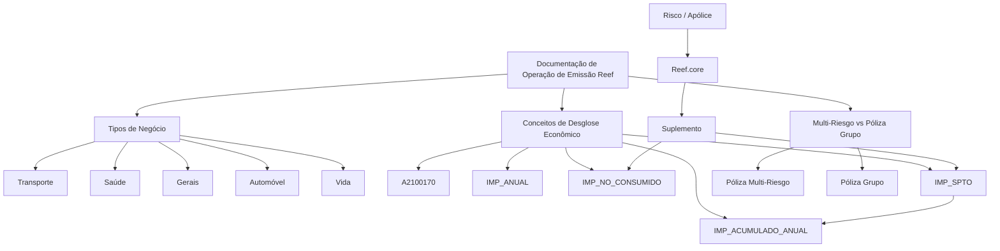

# Documentação de Operação de Emissão Reef — Tipos de Negócio, Conceitos Econômicos e Comparativo de Apólices

## 1. Metadados do Documento
- **Arquivo de Origem:** Não identificado no texto extraído
- **Tipo de Documento:** Manual Operacional e Especificação Funcional
- **Domínio / Sistema:** Reef / Reef.core / Emissão de apólices MAPFRE
- **Público-Alvo:** Operação, Desenvolvedores, Arquitetos, Analistas Funcionais e Negócio
- **Data/Versão Identificada:** Não identificada
- **Proprietário identificado:** `user:agonzalez_mapfre.com`
- **Ciclo de vida identificado:** Approved Source

---

## 2. Resumo Executivo & Contexto de Negócio

O documento reúne conteúdos operacionais da plataforma Reef relacionados à emissão de apólices, organizados por tipos de negócio: Transporte, Saúde, Gerais, Automóvel e Vida. Para Transporte, Saúde e Gerais, a documentação referencia operações como consulta, controle técnico, inspeção, processos massivos, nova produção, orçamento, substituição e suplemento.

O principal detalhamento funcional trata dos **conceitos de desglose econômico** de uma apólice ou risco, persistidos na tabela `A2100170`. O conteúdo explica o comportamento das colunas econômicas `IMP_ANUAL`, `IMP_NO_CONSUMIDO`, `IMP_SPTO` e `IMP_ACUMULADO_ANUAL`, incluindo regras de cálculo, sinais financeiros, situações de suplemento, renovação, anulação e regularização.

A documentação estabelece que `IMP_ANUAL` representa o importe anual de cobertura e serve de base para os demais cálculos. O campo pode ser positivo, quando a MAPFRE deve receber o valor, ou negativo, quando a MAPFRE deve devolver o valor. A informação de risco ou de apólice que influencia o cálculo deve estar registrada e marcada como relevante para tarifa, permitindo que o Reef.core identifique mudanças durante suplementos.

O documento também apresenta um comparativo decisório entre **Póliza Multi-Riesgo** e **Póliza Grupo**. A póliza multi-risco centraliza múltiplos riscos sob uma apólice única, enquanto a póliza grupo é composta por múltiplas apólices independentes e um número de póliza grupo. A comparação abrange vencimentos, moedas, planos de pagamento, recibos, resseguro, cosseguro, tomadores, terceiros, atributos, comissões, alterações e complexidade operacional.

> **Nota de Análise:** O material é predominantemente funcional e operacional. O documento menciona o Reef.core, mas não detalha APIs, métodos HTTP, contratos JSON, servidores, URLs, tecnologias de infraestrutura ou topologia de microsserviços.

---

## 3. Arquitetura, Componentes & Tecnologias Envolvidas

### Componentes e entidades identificados

| Componente / Entidade | Descrição sustentada pelo documento |
| :--- | :--- |
| Reef | Plataforma cuja documentação é apresentada como “DOCUMENTACIÓN Reef”. |
| Reef.core | Componente citado como responsável por identificar, em suplementos, se houve mudança em informações marcadas como relevantes para tarifa e atuar conforme a parametrização. |
| MAPFRE | Organização referenciada como recebedora ou devolvedora dos importes econômicos de apólices. |
| Emissão | Domínio operacional que abrange tipos de negócio, operações e comparação de modelos de apólice. |
| `A2100170` | Tabela denominada “CONCEPTOS DE DESGLOSE ECONÓMICO DE LA PÓLIZA”. |
| Apólice | Entidade que contém informações econômicas, riscos, suplementos, recibos, plano de pagamento, tomador, atributos e outros elementos contratuais. |
| Risco | Entidade vinculada à apólice e utilizada nos cálculos e nas operações de suplemento. |
| Suplemento | Movimento que pode alterar condições da apólice ou risco, gerar importes, anular contratos ou modificar informações. |
| Renovação | Movimento que cria um novo período de vigência; não calcula `IMP_NO_CONSUMIDO`. |
| Processo massivo de emissão | Operação identificada para os domínios Saúde e Gerais. |
| Nova produção | Operação de emissão de apólice identificada para os domínios Saúde e Gerais. |



### Operações de emissão identificadas por tipo de negócio

| Tipo de negócio | Operações explicitamente identificadas |
| :--- | :--- |
| Transporte | Reemplazo; Suplemento; Alterar Póliza plan pago; Alterar Aplicación plan pago. |
| Saúde | Consulta; Control Técnico; Inspección; Procesos Masivos; Crear proceso masivo emisión; Nueva Producción; Emitir Póliza; Presupuesto; Reemplazo; Suplemento; Alterar Póliza plan pago. |
| Gerais | Consulta; Control Técnico; Inspección; Procesos Masivos; Crear proceso masivo emisión; Nueva Producción; Emitir Póliza; Presupuesto; Reemplazo; Suplemento; Alterar Póliza plan pago. |
| Automóvel | Citado como tipo de negócio, sem operações detalhadas no conteúdo extraído. |
| Vida | Citado como tipo de negócio, sem operações detalhadas no conteúdo extraído. |

> **Nota de Análise:** O documento lista operações para Transporte, Saúde e Gerais, mas não descreve os passos operacionais, critérios de entrada, interfaces ou resultados dessas operações, exceto pelas regras econômicas posteriormente detalhadas.

---

## 4. Regras de Negócio, Especificações Funcionais & Processos

### 4.1 Conceitos de desglose econômico

O objetivo declarado é conhecer o conteúdo e o comportamento das colunas que contêm a informação econômica de uma apólice ou risco. As colunas tratadas explicitamente são:

- `IMP_ANUAL`
- `IMP_NO_CONSUMIDO`
- `IMP_SPTO`
- `IMP_ACUMULADO_ANUAL`

### 4.2 Regra de recargo por idade

O documento utiliza um exemplo de conceito de desglose que aplica recargo conforme a idade do segurado.

| Idade | Recargo |
| :--- | :--- |
| 15 | 150,00 |
| 16 | 160,00 |
| 17 | 170,00 |
| 18 | 180,00 |
| 19 | 365,00 |
| >= 20 | 0,00 |

### 4.3 Regras de `IMP_ANUAL`

`IMP_ANUAL` corresponde ao importe de um ano de cobertura e é a base de cálculo das demais colunas econômicas abordadas.

- O valor é expresso com sinal.
- Valor positivo significa importe que a MAPFRE receberá.
- Valor negativo significa importe que a MAPFRE devolverá.
- `IMP_ANUAL` não intervém na geração de cuotas.
- O cálculo depende das informações de risco e/ou apólice declaradas como relevantes para cálculo.
- No exemplo do documento, a idade do segurado é a informação utilizada no cálculo.
- Qualquer informação da apólice e/ou do risco pode afetar o cálculo de `IMP_ANUAL`.
- A informação relevante deve estar registrada e marcada como afetando a tarifa.
- Essa marcação permite ao Reef.core identificar, em um suplemento, se houve mudança e atuar segundo a parametrização definida.

Exemplos apresentados para um segurado de 15 anos:

| Cenário | Efeito | Vencimento | Dias de vigência | `IMP_ANUAL` |
| :--- | :--- | :--- | :--- | :--- |
| 1 | 01 Enero 2023 | 01 Enero 2024 | 365 | 150,00 |
| 2 | 01 Enero 2023 | 01 Octubre 2023 | 273 | 150,00 |
| 3 | 01 Enero 2023 | 01 Julio 2023 | 181 | 150,00 |
| 4 | 01 Enero 2023 | 01 Abril 2023 | 90 | 150,00 |

### 4.4 Regras de `IMP_NO_CONSUMIDO`

`IMP_NO_CONSUMIDO` representa conceitualmente o importe que deveria ser devolvido ou cobrado, conforme o sinal, caso o conceito de desglose deixe de ser aplicado. O Reef.core simula a anulação do conceito de desglose.

Regras identificadas:

1. O cálculo ocorre quando são conhecidas as datas do novo suplemento do risco afetado.
2. O cálculo é realizado antes de qualquer modificação no risco.
3. O importe é calculado sempre que ocorre um suplemento dentro do período de vigência.
4. Em uma renovação, `IMP_NO_CONSUMIDO` não é calculado, pois a renovação cria um novo período de vigência.
5. Em suplementos de regularização, `IMP_NO_CONSUMIDO` também não é calculado.
6. Existem duas formas de cálculo:
   - O suplemento não anula a apólice ou o risco.
   - O suplemento anula a apólice ou o risco.
7. Os cálculos consideram o último suplemento não anulado.

#### Suplemento sem anulação de apólice ou risco

Para suplementos que não anulam a apólice ou o risco, devem ser considerados:

- O `IMP_ANUAL` do movimento anterior não anulado.
- O coeficiente de constituição.

```text
imp_no_consumido := IMP_ANUAL * coeficiente_de_constitución
```

Exemplo fornecido, considerando 365 dias por ano:

| Suplemento | Efeito | Vencimento | Dias de vigência | Coeficiente de constituição | Importe anual do suplemento anterior | Importe não consumido |
| :--- | :--- | :--- | :--- | :--- | :--- | :--- |
| 0 | 01 Enero 2023 | 01 Enero 2024 | 365 | 1,000000000 | 0,00 | 0,00 |
| 1 | 01 Febrero 2023 | 01 Enero 2024 | 334 | 0,915068493 | 1.000,00 | 915,07 |
| 2 | 01 Marzo 2023 | 01 Enero 2024 | 306 | 0,838356164 | 1.100,00 | 922,19 |
| 4 | 01 Mayo 2023 | 01 Enero 2024 | 245 | 0,671232877 | 700,00 | 469,86 |

#### Suplemento com anulação de apólice ou risco

Para suplementos que anulam a apólice ou o risco, devem ser considerados:

- O `IMP_NO_CONSUMIDO` do suplemento anterior não anulado.
- O `IMP_SPTO` do suplemento anterior não anulado.
- O coeficiente de anulação.

```text
imp_no_consumido := (IMP_SPTO + IMP_NO_CONSUMIDO) * coeficiente_de_anulación
```

Exemplo apresentado:

| Suplemento | Efeito | Vencimento | Dias de vigência | Coeficiente de constituição | Coeficiente de anulação | Importe não consumido | Importe suplemento |
| :--- | :--- | :--- | :--- | :--- | :--- | :--- | :--- |
| 0 | 01 Enero 2023 | 01 Enero 2024 | 365 | 1,000000000 | N.A. | 0,00 | 100 |
| 1 | 01 Febrero 2023 | 01 Enero 2024 | 334 | 0,915068493 | N.A. | 915,07 | 9 |
| 2 | 01 Marzo 2023 | 01 Enero 2024 | 306 | 0,838356164 | N.A. | 922,19 | -33 |
| 4 | 01 Mayo 2023 | 01 Enero 2024 | 245 | 0,671232877 | N.A. | 469,86 | 53 |
| 5 | 01 Julio 2023 | 01 Enero 2024 | 184 | N.A. | 0,751020408 | 756,16 | -75 |

### 4.5 Regras de `IMP_SPTO`

`IMP_SPTO` é o importe a receber ou devolver pela MAPFRE. Esse importe, expresso com sinal, é utilizado posteriormente para a criação das cuotas.

O cálculo de `IMP_SPTO` depende de:

- `IMP_ANUAL`;
- Coeficiente de constituição;
- `IMP_NO_CONSUMIDO` da situação anterior, quando o movimento ocorre dentro do período de vigência.

Quando existe um suplemento e o conceito de desglose já existia, deve ser considerado o importe ainda não consumido entre a data do novo suplemento e o vencimento, pois a situação pode mudar e o valor deve ser devolvido ou compensado conforme aplicável.

```text
imp_spto := IMP_ANUAL * coeficiente_de_constitución - IMP_NO_CONSUMIDO
```

Exemplo fornecido:

| Suplemento | Efeito | Vencimento | Dias de vigência | Coeficiente de constituição | Importe não consumido | Importe suplemento | Importe anual |
| :--- | :--- | :--- | :--- | :--- | :--- | :--- | :--- |
| 0 | 01 Enero 2023 | 01 Enero 2024 | 365 | 1,000000000 | 0,00 | 1000,00 | 1.000,00 |
| 1 | 01 Febrero 2023 | 01 Enero 2024 | 334 | 0,915068493 | 915,07 | 91,51 | 1.100,00 |
| 2 | 01 Marzo 2023 | 01 Enero 2024 | 306 | 0,838356164 | 922,19 | -335,34 | 700,00 |
| 4 | 01 Mayo 2023 | 01 Enero 2024 | 245 | 0,671232877 | 469,86 | 536,99 | 1.500,00 |

### 4.6 Regras de `IMP_ACUMULADO_ANUAL`

`IMP_ACUMULADO_ANUAL` contém o importe que será obtido se todos os recibos gerados no período de vigência forem cobrados. O campo representa a soma de `IMP_SPTO` de todos os suplementos gerados no período de vigência.

Regras identificadas:

- Na renovação da apólice, `IMP_ACUMULADO_ANUAL` é inicializado com o valor de `IMP_SPTO`.
- Para orçamento, declaração, nova apólice, nova aplicação e renovação, o valor é igual ao `IMP_SPTO` do próprio movimento.
- Para os demais movimentos, o cálculo soma o `IMP_SPTO` atual ao `IMP_ACUMULADO_ANUAL` do suplemento anterior.

| Movimento | Fórmula |
| :--- | :--- |
| Presupuesto | `IMP_ACUMULADO_ANUAL = IMP_SPTO` |
| Declaración | `IMP_ACUMULADO_ANUAL = IMP_SPTO` |
| Nueva póliza | `IMP_ACUMULADO_ANUAL = IMP_SPTO` |
| Nueva aplicación | `IMP_ACUMULADO_ANUAL = IMP_SPTO` |
| Renovación | `IMP_ACUMULADO_ANUAL = IMP_SPTO` |
| Resto | `IMP_ACUMULADO_ANUAL = IMP_SPTO (suplemento actual) + IMP_ACUMULADO_ANUAL (suplemento anterior)` |

Exemplo fornecido:

| Suplemento | Tipo | `IMP_SPTO` | `IMP_ACUMULADO_ANUAL` |
| :--- | :--- | :--- | :--- |
| 0 | XX | 170,00 | 170,00 |
| 1 | AD | 127,50 | 297,50 |
| 2 | AP | -85,00 | 212,50 |
| 3 | AD | 42,52 | 250,02 |
| 4 | RF | 170,00 | 170,00 |
| 5 | AP | -10,00 | 160,00 |

### 4.7 Comparativo: Póliza Multi-Riesgo versus Póliza Grupo

| Critério | Póliza Multi-Riesgo | Póliza Grupo |
| :--- | :--- | :--- |
| Número de apólice | Um número de apólice. | Múltiplos números de apólice e um número de apólice grupo. |
| Vencimento | Vencimento unificado para todos os riscos; corresponde ao vencimento da apólice. | Cada apólice independente pode possuir vencimento distinto, embora possa haver unificação por definição. |
| Moeda | Uma apólice, uma moeda. | Múltiplas apólices; múltiplas moedas podem existir se não houver controle adequado. |
| Tipo de câmbio | Uma apólice, um tipo de câmbio. | Múltiplas apólices e múltiplos tipos de câmbio. |
| Plano de pagamento | Uma apólice, um plano de pagamento. | Múltiplas apólices; múltiplos planos de pagamento podem existir se não houver controle adequado. |
| Recibos | Um recibo por apólice. | Um recibo por apólice independente; existem tantos recibos quanto apólices compõem a apólice grupo. |
| Tipo de resseguro | Uma apólice, um tipo de resseguro. | Múltiplas apólices, múltiplos tipos de resseguro. |
| Cosseguro | Uma apólice, um tipo de cosseguro. | Múltiplas apólices; múltiplos tipos de cosseguro podem existir se não houver controle adequado. |
| Tomador | Uma apólice, um tomador. | Múltiplas apólices; múltiplos tomadores podem existir se não houver controle adequado. |
| Intervenções de cliente | Uma apólice; mesmos terceiros para cada intervenção. | Múltiplas apólices; múltiplos terceiros em cada intervenção podem existir se não houver controle adequado. |
| Atributos de apólice | Uma apólice, valores únicos. | Múltiplas apólices; múltiplos valores podem existir se não houver controle adequado. |
| Gestor de cobrança | Uma apólice, um gestor. | Múltiplas apólices; múltiplos gestores podem existir se não houver controle adequado. |
| Textos anexos | Uma apólice, um texto. | Múltiplas apólices, múltiplos textos. |
| Cláusulas | Uma apólice, cláusulas únicas. | Múltiplas apólices; múltiplas cláusulas podem existir se não houver controle adequado. |
| Comissões | As comissões afetam a única apólice conforme definição. | Cada apólice independente pode ter comissão distinta se não houver controle adequado. |
| Importes que afetam somente a apólice | Podem ser calculados sem problema quando não afetam os riscos. | É uma tarefa complexa, pois o importe deve ser alocado a uma apólice do grupo, e essa apólice pode sair do grupo. |
| Riscos | Múltiplos riscos em uma única apólice. | Uma apólice independente pode conter um risco e outras podem conter múltiplos riscos, se a definição permitir. |
| Ordem de comunicação de modificações | Comunicação fora da ordem adequada pode exigir anulação de suplementos; o modelo de um risco, uma apólice pode minimizar o problema. | Como são múltiplas apólices, modificações recebidas em ordens distintas podem não afetar o mesmo risco. |
| Suplementos que afetam informação de apólice | Uma modificação de plano de pagamento, agente, tomador, atributos, anulação, reabilitação ou renovação pode ser realizada com um suplemento. | É necessário executar um suplemento por cada apólice independente que compõe a apólice grupo. |

---

## 5. Tabelas de Parâmetros, Ambientes e Estruturas de Dados

### 5.1 Estrutura da tabela `A2100170`

| Item / Parâmetro | Descrição / Função | Tipo / Valores / Formato | Ambiente / Observações |
| :--- | :--- | :--- | :--- |
| `A2100170` | Conceitos de desglose econômico da apólice. | Tabela de modelo de dados. | Referenciada pela documentação Reef. |
| `COD_CIA` | Companhia. | Código. | Chave de contexto da apólice. |
| `NUM_POLIZA` | Apólice. | Número. | Identificador da apólice. |
| `NUM_SPTO` | Número de suplemento. | Número. | Identificador do suplemento. |
| `NUM_APLI` | Número de aplicação. | Número. | Identificador de aplicação. |
| `NUM_SPTO_APLI` | Suplemento da aplicação. | Número. | Relacionado à aplicação. |
| `NUM_RIESGO` | Risco. | Número. | Identificador do risco. |
| `NUM_PERIODO` | Período para apólices multianuais. | Número. | Aplicável a apólices multianuais. |
| `COD_COB` | Cobertura. | Código. | Código de cobertura. |
| `COD_DESGLOSE` | Conceito de desglose econômico. | Código. | Identifica o conceito econômico. |
| `COD_ECO` | Conceito econômico de recibo. | Código. | Relacionado a recibos. |
| `NUM_BLOQUE_ESTUDIO` | Campo indicado como não utilizado. | Não informado. | “NO SE USA”. |
| `IMP_ACUMULADO_ANUAL` | Importe acumulado anual. | Importe com sinal. | Soma de `IMP_SPTO` no período de vigência, conforme regras. |
| `IMP_SPTO` | Importe do suplemento. | Importe com sinal. | Base para criação posterior de cuotas. |
| `IMP_NO_CONSUMIDO` | Importe não consumido. | Importe com sinal. | Calculado em suplementos dentro da vigência, com exceções. |
| `IMP_ANUAL` | Importe anual. | Importe com sinal. | Base para os demais cálculos econômicos. |
| `COD_RAMO` | Ramo. | Código. | Ramo de negócio. |

### 5.2 Parâmetros de cálculo identificados

| Item / Parâmetro | Descrição / Função | Tipo / Valores / Formato | Ambiente / Observações |
| :--- | :--- | :--- | :--- |
| Dias por ano | Base para cálculo dos coeficientes nos exemplos. | `365` | Valor explicitamente apresentado nos exemplos. |
| Coeficiente de constituição | Coeficiente usado nos cálculos de `IMP_NO_CONSUMIDO` e `IMP_SPTO`. | Decimal. | Exemplos: `1,000000000`, `0,915068493`, `0,838356164`, `0,671232877`. |
| Coeficiente de anulação | Coeficiente aplicado no cálculo de `IMP_NO_CONSUMIDO` para suplemento que anula apólice ou risco. | Decimal. | Exemplo apresentado: `0,751020408`. |
| Movimento anterior não anulado | Fonte dos valores anteriores usados em cálculos. | Regra de seleção. | Um suplemento anulado não existe para o Reef.core. |
| Sinal do importe | Indica recebimento ou devolução pela MAPFRE. | Positivo ou negativo. | Positivo: MAPFRE recebe. Negativo: MAPFRE devolve. |

---

## 6. Bateria de Perguntas & Respostas para RAG (FAQ Sintético)

### P1: Qual é a finalidade da tabela `A2100170` no domínio Reef?
**R:** A tabela `A2100170` armazena os conceitos de desglose econômico da apólice. Ela contém identificadores de companhia, apólice, suplemento, aplicação, risco, período, cobertura, conceito de desglose, conceito econômico de recibo, ramo e colunas financeiras como `IMP_ANUAL`, `IMP_NO_CONSUMIDO`, `IMP_SPTO` e `IMP_ACUMULADO_ANUAL`.

### P2: O que representa o campo `IMP_ANUAL`?
**R:** `IMP_ANUAL` representa o importe correspondente a um ano de cobertura. É o importe base para o cálculo das demais colunas econômicas tratadas no documento. Um valor positivo representa um importe que a MAPFRE receberá; um valor negativo representa um importe que a MAPFRE devolverá. O campo não intervém na geração de cuotas.

### P3: Quais informações podem influenciar o cálculo de `IMP_ANUAL`?
**R:** Qualquer informação disponível na apólice e/ou no risco pode influenciar o cálculo de `IMP_ANUAL`, desde que tenha sido registrada e marcada como informação que afeta a tarifa. No exemplo do documento, a idade do segurado determina um recargo econômico.

### P4: Quando o Reef.core calcula `IMP_NO_CONSUMIDO`?
**R:** O Reef.core calcula `IMP_NO_CONSUMIDO` quando são conhecidas as datas do novo suplemento do risco afetado e antes de realizar qualquer modificação. O cálculo é feito em suplementos dentro do período de vigência. Não é realizado em renovação, porque a renovação cria um novo período de vigência, nem em suplementos de regularização.

### P5: Como é calculado `IMP_NO_CONSUMIDO` quando o suplemento não anula a apólice ou o risco?
**R:** Para suplemento que não anula apólice ou risco, o cálculo utiliza o `IMP_ANUAL` do movimento anterior não anulado e o coeficiente de constituição. A fórmula indicada é `imp_no_consumido := IMP_ANUAL * coeficiente_de_constitución`.

### P6: Como é calculado `IMP_NO_CONSUMIDO` quando há anulação da apólice ou do risco?
**R:** Para suplemento que anula a apólice ou o risco, o cálculo utiliza o `IMP_NO_CONSUMIDO` e o `IMP_SPTO` do suplemento anterior não anulado, além do coeficiente de anulação. A fórmula indicada é `imp_no_consumido := (IMP_SPTO + IMP_NO_CONSUMIDO) * coeficiente_de_anulación`.

### P7: Qual é a fórmula de cálculo de `IMP_SPTO`?
**R:** A fórmula apresentada é `imp_spto := IMP_ANUAL * coeficiente_de_constitución - IMP_NO_CONSUMIDO`. O resultado é o importe a receber ou devolver pela MAPFRE e é utilizado posteriormente para a criação de cuotas.

### P8: O que é `IMP_ACUMULADO_ANUAL`?
**R:** `IMP_ACUMULADO_ANUAL` representa o importe que será obtido caso todos os recibos gerados no período de vigência sejam cobrados. O campo acumula os valores de `IMP_SPTO` dos suplementos gerados no período. Em orçamento, declaração, nova apólice, nova aplicação e renovação, o valor é igual ao `IMP_SPTO` do movimento. Nos demais movimentos, soma-se o `IMP_SPTO` atual ao acumulado do suplemento anterior.

### P9: Como uma renovação afeta as colunas econômicas?
**R:** A renovação cria um novo período de vigência. Por esse motivo, `IMP_NO_CONSUMIDO` não é calculado em renovação. Para `IMP_ACUMULADO_ANUAL`, a renovação reinicializa o acumulado com o valor de `IMP_SPTO`.

### P10: Qual é a principal diferença estrutural entre uma póliza multi-risco e uma póliza grupo?
**R:** A póliza multi-risco possui uma única apólice que pode conter múltiplos riscos. A póliza grupo é formada por múltiplas apólices independentes, além de um número de póliza grupo. Essa diferença impacta vencimentos, moedas, recibos, comissões, planos de pagamento, suplementos e gestão operacional.

### P11: Por que cálculos que afetam somente a apólice são mais complexos em uma póliza grupo?
**R:** Em uma póliza grupo, as apólices são independentes. Quando um cálculo deve afetar a apólice e não os riscos, o importe precisa ser atribuído a uma das apólices do grupo. Como essa apólice pode sair posteriormente do grupo, pode ser necessário transferir o importe para outra apólice, tornando a operação complexa.

### P12: Como são tratados suplementos que alteram informações de apólice em cada modelo?
**R:** Em uma póliza multi-risco, alterações como mudança de plano de pagamento, agente, tomador, atributos, anulação, reabilitação ou renovação podem ser realizadas com um único suplemento. Em uma póliza grupo, é necessário realizar um suplemento para cada apólice independente que integra o grupo.

---

## 7. Glossário de Termos, Siglas & Conceitos-Chave

- **A2100170:** Tabela de conceitos de desglose econômico da apólice.
- **Apólice / Póliza:** Contrato de seguro referido como entidade central de emissão, cobrança, suplementos e riscos.
- **Coeficiente de anulação:** Coeficiente utilizado para calcular `IMP_NO_CONSUMIDO` em suplemento que anula a apólice ou o risco.
- **Coeficiente de constituição:** Coeficiente utilizado nos cálculos de `IMP_NO_CONSUMIDO` e `IMP_SPTO`.
- **Concepto de desglose:** Conceito de decomposição econômica aplicado à apólice ou ao risco.
- **Cuotas:** Valores criados posteriormente a partir de `IMP_SPTO`.
- **IMP_ACUMULADO_ANUAL:** Importe anual acumulado de suplementos no período de vigência.
- **IMP_ANUAL:** Importe anual de cobertura.
- **IMP_NO_CONSUMIDO:** Importe não consumido, relacionado à simulação de anulação de um conceito de desglose.
- **IMP_SPTO:** Importe do suplemento, a receber ou devolver pela MAPFRE.
- **MAPFRE:** Organização referenciada como destinatária do recebimento ou devolução dos importes.
- **Póliza Grupo:** Modelo composto por múltiplas apólices independentes e um número de póliza grupo.
- **Póliza Multi-Riesgo:** Modelo com múltiplos riscos em uma única apólice.
- **Reef.core:** Componente citado como capaz de reconhecer mudanças relevantes para tarifa durante suplementos.
- **Risco:** Entidade segurada associada à apólice.
- **Suplemento / Endoso:** Movimento que altera ou pode anular informações de uma apólice ou risco.

---

## 8. Notas Críticas, Riscos & Limitações

- O documento não identifica arquivo de origem, data, versão, autor técnico, ambiente, URL, infraestrutura, APIs ou contratos de integração.
- As operações de emissão listadas para Transporte, Saúde e Gerais não possuem passos operacionais detalhados na extração.
- As fórmulas econômicas dependem de conceitos como coeficiente de constituição e coeficiente de anulação, mas o documento não detalha a origem, configuração ou fórmula desses coeficientes.
- Os exemplos de `IMP_NO_CONSUMIDO` e `IMP_SPTO` apresentam alguns valores de `IMP_SPTO` visualmente truncados na extração original das páginas 26 e 27.
- Um suplemento anulado é tratado pelo Reef.core como inexistente para seleção do movimento anterior.
- A póliza grupo apresenta risco operacional e de governança quando não há controles para moeda, plano de pagamento, resseguro, cosseguro, tomador, terceiros, atributos, gestor de cobrança, cláusulas e comissões.
- A comunicação de modificações fora da ordem pode complicar operações em pólizas multi-risco e exigir anulação de suplementos em certos casos.
- O modelo de um risco, uma apólice é citado como forma de minimizar complicações relacionadas à ordem de comunicação das modificações.

---

## 9. Conteúdo Bruto Estruturado (Referência Fiel)

```text
--- [PÁGINAS 1 A 21] ---

DOCUMENTACIÓN de OPERACIÓN de EMISIÓN (Transportes)
- REEMPLAZO
- SUPLEMENTO
- ALTERAR Póliza plan pago
- ALTERAR Aplicación plan pago

DOCUMENTACIÓN de OPERACIÓN de EMISIÓN (Salud)
- CONSULTA
- CONTROL TÉCNICO
- INSPECCIÓN
- PROCESOS MASIVOS
- CREAR proceso masivo emisión
- NUEVA PRODUCCIÓN
- EMITIR Póliza
- PRESUPUESTO
- REEMPLAZO
- SUPLEMENTO
- ALTERAR Póliza plan pago

DOCUMENTACIÓN de OPERACIÓN de EMISIÓN (Generales)
- CONSULTA
- CONTROL TÉCNICO
- INSPECCIÓN
- PROCESOS MASIVOS
- CREAR proceso masivo emisión
- NUEVA PRODUCCIÓN
- EMITIR Póliza
- PRESUPUESTO
- REEMPLAZO
- SUPLEMENTO
- ALTERAR Póliza plan pago

--- [PÁGINA 22 DE 34] ---

OPERACIÓN en EMISIÓN
Documentación orientada a la operación y tipo de negocio.

TIPOS DE NEGOCIO
AUTOMÓVIL
VIDA
TRANSPORTE
SALUD
GENERALES

--- [PÁGINA 23 DE 34] ---

Conceptos de desglose - Información económica

Objetivo
Conocer cual es el contenido y el comportamiento de las columnas que contienen la información económica de una póliza/riesgo.

Modelo de datos involucrado
TABLA: A2100170
DESCRIPCIÓN: CONCEPTOS DE DESGLOSE ECONÓMICO DE LA PÓLIZA

COLUMNA / COMENTARIOS
COD_CIA / COMPAÑÍA
NUM_POLIZA / PÓLIZA
NUM_SPTO / NUMERO DE SUPLEMENTO
NUM_APLI / NUMERO DE APLICACIÓN
NUM_SPTO_APLI / SUPLEMENTO DE LA APLICACIÓN
NUM_RIESGO / RIESGO
NUM_PERIODO / PERIODO (PARA PÓLIZAS MULTIANUALES)
COD_COB / COBERTURA
COD_DESGLOSE / CONCEPTO DE DESGLOSE ECONÓMICO
COD_ECO / CONCEPTO ECONÓMICO DE RECIBO
NUM_BLOQUE_ESTUDIO / NO SE USA

--- [PÁGINA 24 DE 34] ---

COLUMNA / COMENTARIOS
IMP_ACUMULADO_ANUAL / IMPORTE ACUMULADO ANUAL
IMP_SPTO / IMPORTE DEL SUPLEMENTO
IMP_NO_CONSUMIDO / IMPORTE NO CONSUMIDO
IMP_ANUAL / IMPORTE ANUAL
COD_RAMO / RAMO

Recargo por edad
EDAD / RECARGO
15 / 150,00
16 / 160,00
17 / 170,00
18 / 180,00
19 / 365,00
>= 20 / 0,00

IMP_ANUAL
Importe que corresponde a un año de cobertura.
Es el importe base con el que se halla el resto de columnas.
Viene expresado con signo:
- positivo: importe que MAPFRE recibirá;
- negativo: importe que MAPFRE devolverá.
Este importe no interviene en la generación de cuotas.

--- [PÁGINAS 25 A 29 DE 34] ---

IMP_NO_CONSUMIDO
Conceptualmente es el importe que habría que devolver o cobrar, depende del signo,
en caso que el concepto de desglose deje de aplicarse.
Reef.core simula la anulación del concepto de desglose.

El cálculo se realiza cuando se conocen las fechas del nuevo suplemento del riesgo afectado
y previo a realizar cualquier modificación.

El importe se calcula siempre que se realiza un suplemento dentro del periodo de vigencia.
Una renovación crea un nuevo periodo de vigencia; por ello no se halla esta columna.
Existe una excepción para suplementos de tipo regularización, que no calcula esta columna.

Para suplementos que NO anulan la póliza/riesgo:
imp_no_consumido := IMP_ANUAL * coeficiente_de_constitución

Para suplementos que SI anulan la póliza/riesgo:
imp_no_consumido := (IMP_SPTO + IMP_NO_CONSUMIDO) * coeficiente_de_anulación

IMP_SPTO
Monto a recibir o a devolver por parte de MAPFRE.
El importe se expresa con signo.
Con este importe se crean posteriormente las cuotas.

imp_spto := IMP_ANUAL * coeficiente_de_constitución - IMP_NO_CONSUMIDO

IMP_ACUMULADO_ANUAL
Contiene el importe que se obtendrá si se cobran todos los recibos generados
en el periodo de vigencia.
Contiene la suma de IMP_SPTO de todos los suplementos generados en el periodo.
En la renovación se inicializa con IMP_SPTO.

Presupuesto: IMP_ACUMULADO_ANUAL = IMP_SPTO
Declaración: IMP_ACUMULADO_ANUAL = IMP_SPTO
Nueva póliza: IMP_ACUMULADO_ANUAL = IMP_SPTO
Nueva aplicación: IMP_ACUMULADO_ANUAL = IMP_SPTO
Renovación: IMP_ACUMULADO_ANUAL = IMP_SPTO
Resto: IMP_ACUMULADO_ANUAL = IMP_SPTO actual + IMP_ACUMULADO_ANUAL anterior

Un suplemento anulado, para Reef.core, no existe.

--- [PÁGINAS 30 A 34 DE 34] ---

PÓLIZA MULTI-RIESGO vs PÓLIZA GRUPO

PÓLIZA MULTI-RIESGO
- Un número de póliza.
- Vencimiento unificado de cada uno de los riesgos.
- Una póliza, una moneda.
- Una póliza, un tipo de cambio.
- Una póliza, un plan de pago.
- Un recibo por póliza.
- Una póliza, un tipo de reaseguro.
- Una póliza, un tipo de coaseguro.
- Una póliza, un tomador.
- Mismos terceros para cada intervención.
- Valores únicos para atributos de póliza.
- Una póliza, un gestor de cobro.
- Una póliza, un texto anexo.
- Una póliza, unas cláusulas.
- Múltiples riesgos en una póliza.
- Un suplemento permite cambios de información de póliza.

PÓLIZA GRUPO
- Múltiples números de póliza y un número de póliza grupo.
- Cada póliza independiente puede tener vencimiento diferente.
- Puede permitir múltiples monedas si no se controla adecuadamente.
- Puede permitir múltiples tipos de cambio.
- Puede permitir múltiples planes de pago si no se controla adecuadamente.
- Un recibo por cada póliza independiente.
- Puede tener múltiples tipos de reaseguro.
- Puede tener múltiples tipos de coaseguro si no se controla adecuadamente.
- Puede tener múltiples tomadores si no se controla adecuadamente.
- Puede tener múltiples terceros en cada intervención si no se controla adecuadamente.
- Puede tener múltiples valores de atributos si no se controla adecuadamente.
- Puede tener múltiples gestores de cobro si no se controla adecuadamente.
- Puede tener múltiples textos y cláusulas.
- Requiere suplemento por cada póliza independiente ante cambios de información de póliza.

VERSUS en EMISIÓN
Documentos orientados a enfrentar distintos elementos cuando no se tiene una decisión clara
a la hora de afrontar una necesidad.

PÓLIZA
Póliza multi-riesgo vs Póliza grupo
```
