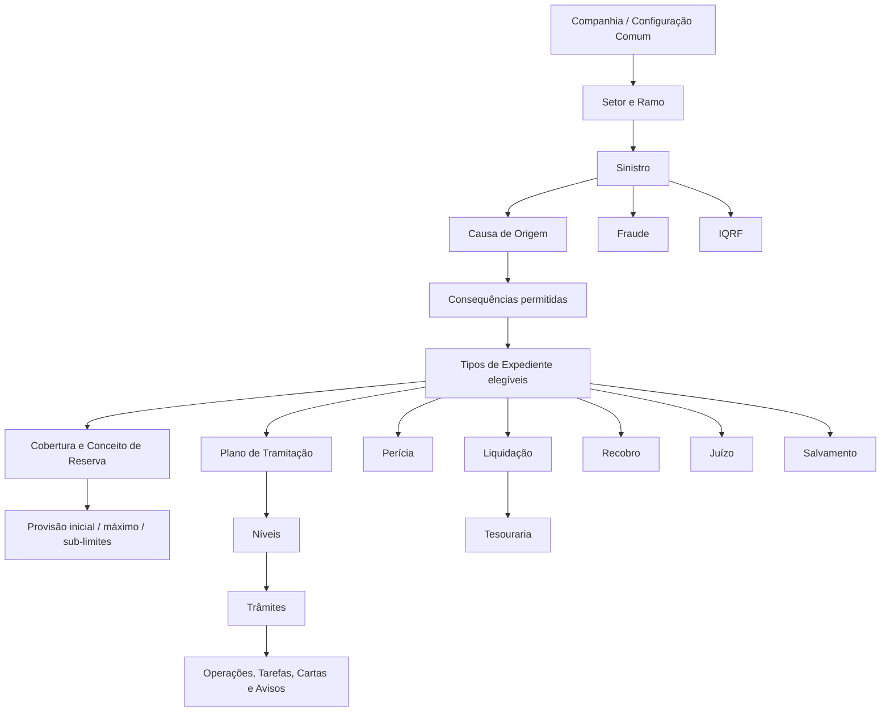
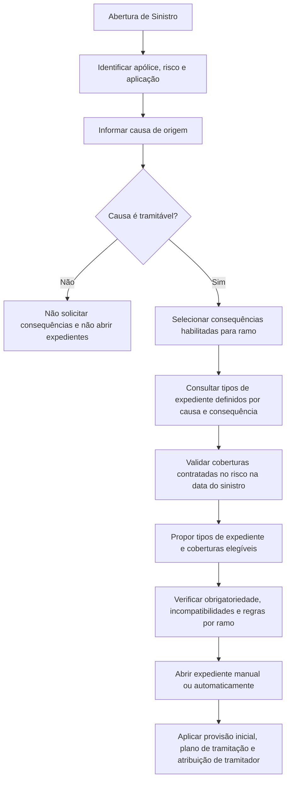
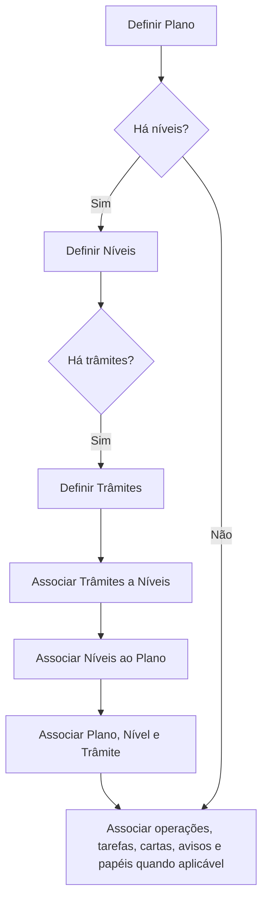
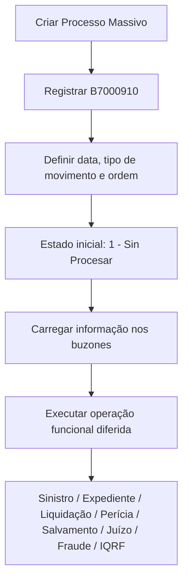

# Definição e Configuração dos Módulos de Sinistros Reef.core

## 1. Metadados do Documento
- **Arquivo de Origem:** Texto bruto extraído fornecido na solicitação; nome do arquivo não identificado.
- **Tipo de Documento:** Especificação Técnica / Manual Operacional / Documentação Funcional.
- **Domínio / Sistema:** Reef.core — módulos corporativos de Sinistros, Expedientes, Liquidações, Plano de Tramitação, Perícias, Salvamentos, Juízos, Fraude, IQRF e Serviços.
- **Público-Alvo:** Analistas funcionais, administradores de parametrização, desenvolvedores, arquitetos, operação de sinistros e equipas de tesouraria.
- **Data/Versão Identificada:** Não identificada. O documento contém páginas marcadas como “EN CONSTRUCCIÓN”.

---

## 2. Resumo Executivo & Contexto de Negócio

O documento descreve a configuração funcional e técnica do ecossistema de Sinistros do Reef.core. O sistema é parametrizado por companhia, setor, ramo, tipo de expediente, cobertura, conceito de reserva, causa, consequência, atividade de terceiro e outros níveis organizacionais. A parametrização determina quais operações são permitidas, quais dados são obrigatórios, quais validações são aplicadas e como cada expediente é conduzido até ao encerramento.

O núcleo do domínio é o sinistro, que pode conter uma causa de origem, uma ou mais consequências compatíveis e múltiplos expedientes. Cada expediente representa um tipo de dano ou recuperação, podendo possuir coberturas, conceitos de reserva, valores iniciais, limites máximos, plano de tramitação, documentos requeridos, perícias, liquidações, juízos e recobros associados.

O Plano de Tramitação organiza a gestão operacional dos expedientes por meio de planos, níveis, trâmites, operações, tarefas, cartas, avisos, anotações livres, confirmações do tramitador e papéis de acesso. O Plano de Tramitação é uma ferramenta de execução e acompanhamento: permite que o tramitador realize operações de sinistros e de módulos externos, controle prazos, gere comunicações e registre evidências operacionais.

As Liquidações representam ordens de pagamento relacionadas aos expedientes. A configuração abrange conceitos de cobrança e pagamento, documentos de pagamento, beneficiários, impostos, retenções, convenções de pagamento, validações, aplicação de prémios pendentes, valores padrão e regras de autorização. O documento também descreve funcionalidades de processamento massivo em modo diferido, usando tabelas de buzón/buffer técnico.

A documentação evidencia uma arquitetura de regras baseada em parâmetros e lógicas de negócio. Diversos atributos aceitam valores fixos — geralmente `1: Sí`, `2: No`, `3: Procedimiento`, `4: Función` — ou delegam a decisão para uma lógica de negócio. Portanto, o comportamento final não pode ser inferido apenas a partir dos catálogos: depende dos valores configurados e das lógicas específicas de cada instalação.

---

## 3. Arquitetura, Componentes & Tecnologias Envolvidas

### Componentes funcionais identificados

| Componente | Responsabilidade descrita |
| :--- | :--- |
| **Reef.core** | Sistema central configurável para gestão de sinistros e módulos associados. |
| **Módulo de Sinistros** | Abertura, modificação, encerramento, reabilitação, causas, consequências, eventos catastróficos e validações do sinistro. |
| **Módulo de Expedientes** | Gestão de tipos de dano, coberturas, conceitos de reserva, recobros, provisões, sub-limites e encerramento de expediente. |
| **Plano de Tramitação** | Organização do trabalho do tramitador por planos, níveis, trâmites, operações, avisos, cartas e papéis. |
| **Módulo de Liquidações** | Geração, alteração, anulação e retificação de ordens de pagamento. |
| **Tesouraria** | Origem de conceitos de cobrança/pagamento, documentos de pagamento, impostos, retenções e escritórios pagadores. |
| **Módulo de Perícias** | Solicitação, resultado, danos, ordens de reparação, peritos, oficinas e centros de perícia. |
| **Módulo de Salvamentos** | Gestão de inventários, leilões, recuperação e venda de bens recuperados. |
| **Módulo de Juízos** | Gestão de processos judiciais, advogados, procuradores, tribunais, sentenças e intervenções. |
| **Módulo de Fraude** | Tipos, motivos, conclusões, classificações, estados e valores de fraude. |
| **Módulo IQRF** | Incidências, Queixas, Reclamações e Felicitações. |
| **Módulo de Serviços** | Serviços ligados a sinistros, motivos de bloqueio e avisos de serviços. |
| **Gestor Documental** | Ferramenta externa mencionada como acessível a partir do Plano de Tramitação. |
| **Mapfre Services** | Sistema externo utilizado para envio de e-mail quando a carta é marcada como externa. |
| **CALL CENTER / Centro Telefónico** | Canal de consulta e possível origem de abertura de sinistros; possui restrições próprias de visualização. |
| **B7000910** | Tabela mestre de processos massivos de sinistros. |
| **B7000900** | Buzón de dados fixos do sinistro para operações técnicas diferidas. |
| **B7000930** | Buzón de consequências do sinistro para operações técnicas diferidas. |
| **ML_PLY_NWT_XX_ATR_LSS** | Buzón de atributos de sinistros. |

### Modelo funcional de alto nível



### Fluxo de abertura de sinistro e proposta de expediente



### Fluxo de definição do Plano de Tramitação



### Fluxo de processamento massivo diferido



---

## 4. Regras de Negócio, Especificações Funcionais & Processos

### 4.1 Características gerais de sinistros

- As causas de abertura de expediente podem ser exigidas para todos os expedientes, independentemente do ramo, quando configuradas.
- As causas de alteração de valoração podem ser exigidas para mudanças de reserva e também para mudanças de valoração provocadas por anulação de liquidação.
- O Plano de Tramitação pode usar datas de controle. Quando habilitado, cada trâmite pode ter um número máximo de dias para conclusão.
- O cálculo de datas do Plano de Tramitação pode considerar feriados e férias do tramitador como dias não úteis.
- O uso de papéis no Plano de Tramitação pode restringir quem pode ativar, executar, finalizar, atrasar ou modificar trâmites, gerar comunicações, incluir níveis e incluir trâmites.
- Um juízo pode ser associado a um ou vários sinistros, conforme a propriedade configurada.
- A faturação múltipla pode permitir distribuição proporcional automática de uma fatura entre vários expedientes.
- É possível liquidar honorários e gastos quando a indemnização estiver retida por controlo técnico, se a regra correspondente o permitir.
- O Registo de Faturas pode validar se o conceito de cobrança e pagamento está definido para a atividade da fatura ou permitir conceitos genéricos.

### 4.2 Abertura e modificação de sinistros

- Para apólices não fixas, típicas de Transportes, o sistema pode permitir ou não sinistrar a apólice marco.
- Para Transportes, a abertura pode permitir sinistrar aplicação/risco não vigente por regra fixa ou lógica de negócio.
- O sistema pode permitir abrir sinistro sem todos os tipos de expediente obrigatórios, normalmente para permitir retenção por controlo técnico em vez de impedir o registo.
- A validação de incompatibilidades pode ocorrer em dois níveis:
  - `Causa + Consequência + Tipo de Expediente + Cobertura`;
  - `Causa + Consequência + Tipo de Expediente + Cobertura + Conceito de Reserva`.
- A hora do sinistro pode ser modificável por ramo. Quando a hora de vigência é obrigatória, a modificação deve validar a vigência da apólice nessa hora.
- Se a data do sinistro for a data corrente, a hora não pode ultrapassar a hora do dia.

### 4.3 Extemporaneidade

- A extemporaneidade mede o intervalo entre a data de ocorrência e a data de notificação/denúncia à companhia.
- A definição pode ser feita por setor e ramo, admitindo valores genéricos.
- Se o número de dias transcorridos superar o máximo configurado, o sinistro é considerado extemporâneo.
- A validação não é obrigatória: pode ser ativada ou desativada por ramo e pode admitir exceções via lógica de negócio.
- O documento cita como exemplos possíveis exceções clientes VIP e ramos em que o sinistro é retido para autorização ou rejeição.

### 4.4 Validações por ramo

- É possível permitir abertura de sinistro com data futura.
- É possível ativar ou desativar validação de extemporaneidade.
- É possível solicitar uma valoração global do sinistro na abertura.
- É possível permitir modificação da data de ocorrência.
- Após mudança de data, o sistema verifica se as condições da apólice foram alteradas relativamente à data anterior.
- É possível permitir sinistrar suplementos temporários.
- É possível permitir sinistrar apólice não vigente fora de Transportes, especialmente para ramos de Vida quando a apólice foi anulada pela morte do segurado.
- É possível permitir sinistrar risco não vigente fora de Transportes, aplicável a apólices com vários riscos.
- A atribuição de supervisor pode usar catálogos de definição de supervisor, relação de escritórios comerciais e tramitadores, especialização e carga pendente.
- Existem lógicas para descrição do estado do recibo e validações próprias no final da abertura ou modificação de sinistro.

### 4.5 Número de sinistro

- O número de sinistro é único por companhia.
- O formato não pode ser alterado depois da abertura de um sinistro.
- O número pode ter, no máximo, 15 posições.
- Os candidatos de composição são: código de companhia, código de setor, código de ramo, código do terceiro nível da estrutura comercial, ano de reserva e consecutivo.
- Apenas o ano de reserva — com 2 ou 4 posições — e o sequencial podem ter comprimento ajustado nos termos descritos.
- O formato é único por companhia, não por ramo.

### 4.6 Tipos de expediente, cobertura e reserva

- Cada tipo de expediente representa uma tipologia de dano.
- Todos os tipos de cobertura sinistráveis devem estar contidos em algum tipo de expediente.
- Um tipo de expediente pode possuir uma ou várias coberturas.
- Cada combinação de tipo de expediente e cobertura pode ter um ou mais conceitos de reserva.
- Os conceitos de reserva são definidos por companhia e podem ser:
  - `I`: Indemnização;
  - `H`: Honorários;
  - `G`: Gastos.
- Conceitos de pagamento são distintos dos conceitos de reserva; os conceitos de pagamento são posteriormente associados aos conceitos de reserva.
- Um expediente pode ter uma reserva inicial fixa ou calculada por lógica de negócio.
- O valor máximo pode ser determinado por lógica; sem lógica de máximo definida, interpreta-se que o máximo é o capital da cobertura.
- O máximo pode aplicar-se apenas à reserva ou também às liquidações.

### 4.7 Recobros

- Um expediente de recobro exige a existência prévia de um expediente não recobro ao qual será associado.
- Um tipo de recobro pode estar associado a vários tipos de expediente não recobro.
- A abertura automática de recobro pode usar a valoração do expediente principal quando o parâmetro correspondente da companhia assim indicar.
- Caso contrário, a abertura automática usa a reserva inicial definida para ramo, causa, consequência, tipo de expediente, cobertura e conceito de reserva.
- Tipos de recobro:
  - `R`: Recuperações económicas;
  - `D`: Recuperação de dedutível/franquia do segurado;
  - `S`: Salvamentos ou recuperações materiais.

### 4.8 Tipos de expediente excluintes

- Tipos de expediente excluintes não podem coexistir no mesmo sinistro nas condições descritas.
- O tipo excluído não pode ser liquidado se já houver expediente do tipo anterior aberto e não terminado sem pagamentos.
- O controlo também pode ser tratado por Controlo Técnico em vez de catálogo de exclusões.

### 4.9 Plano de Tramitação

- Um Plano de Tramitação é uma guia operacional para gerir um expediente desde a abertura até ao encerramento.
- Um plano pode permitir acesso a funcionalidades de sinistros e a módulos externos.
- Planos agrupam níveis; níveis agrupam trâmites; trâmites representam passos de processo.
- Trâmites podem ter operações/estruturas, tarefas, cartas, avisos, anotações e confirmações.
- Níveis e trâmites podem ser iniciais ou opcionais.
- A associação de um nível a um plano não obriga à sua execução; o mesmo princípio aplica-se aos trâmites associados ao nível.
- Um trâmite pode ser reutilizado em vários níveis e planos.
- Cada operação de um trâmite pode ter validação prévia e posterior.
- O Plano pode gravar observações quando programas/estruturas são executados, caso exista lógica configurada.
- Sem definição de observação, a execução deixa as observações vazias.

### 4.10 Confirmação do tramitador

- A confirmação do tramitador permite que o utilizador responda “Sí” ou “No” a uma pergunta e registre observações.
- O programa associado à funcionalidade de confirmação é `AS750000`.
- A configuração vincula setor, ramo, trâmite, painel e pergunta.
- Pode existir lógica de negócio posterior à confirmação, capaz de executar ações conforme a resposta.
- Um exemplo documentado é inserir um trâmite para abrir recobro de salvamento quando a perda total é confirmada.
- Para funcionar, o trâmite deve possuir estrutura registada, associada à tabela de estruturas, com o programa `AS750000`, e a estrutura deve estar associada à agrupação de trâmites.

### 4.11 Cartas, textos, e-mails e avisos

- Para gerar uma comunicação no Plano de Tramitação, o processo documentado é:
  1. Definir nota;
  2. Definir carta;
  3. Associar carta ao trâmite.
- Uma carta pode ter destinatário obtido por lógica de negócio.
- Cartas podem ser visíveis ou ocultas na consulta do Centro Telefónico.
- E-mails externos marcados como `S` são enviados por **Mapfre Services**.
- E-mails não externos, marcados como `N`, podem ser enviados pelo Reef.core através da rotina de cartas.
- É possível configurar subtipos de aviso para envio bem-sucedido e envio falhado.
- Avisos podem ter prazo fixo, prazo calculado por lógica, texto fixo ou texto calculado por lógica.
- O cálculo de datas de aviso pode considerar calendário laboral e férias, quando essa característica geral estiver ativa.

### 4.12 Liquidações

- A liquidação é a geração de uma ordem de pagamento de expediente.
- A operação identifica beneficiário, forma de pagamento, item a pagar e valor a pagar.
- Os conceitos disponíveis resultam da combinação entre:
  - conceitos permitidos por tipo de expediente e conceito de reserva;
  - conceitos permitidos por atividade e tipo de beneficiário.
- Documentos de pagamento, conceitos de pagamento, impostos, retenções e escritórios pagadores pertencem às definições prévias de Tesouraria.
- A aplicação de prémios pendentes pode ser definida por ramo, tipo de expediente, tipo de beneficiário e atividade do terceiro.
- A busca de prémios pendentes pode usar a data de ocorrência, a data de vencimento da apólice ou não ser aplicada.
- A liquidação pode controlar imposto, ajuste de imposto, retenção, reserva zero, valor liquidado maior que valor reservado, ordens de reparação pendentes, autorização por Tesouraria, abertura de recobro e anulação de ordem de pagamento.
- Uma anulação pode ou não restaurar a reserva, conforme a regra configurada.

### 4.13 Eventos catastróficos

- Eventos catastróficos permitem agrupar sinistros originados pelo mesmo fenómeno.
- O evento possui código, nome, tipo, datas e horas de início/fim, data máxima de denúncia, código de identificação e descrição.
- Na abertura e modificação de sinistro, o núcleo controla se a data de ocorrência está no período do evento.
- O núcleo também controla se a notificação ocorreu até à data máxima de denúncia do evento.
- O núcleo não controla automaticamente se o local do sinistro pertence à localização configurada do evento; essa validação pode ser implementada na estrutura de local ou em Controlo Técnico.

### 4.14 Sub-limites

- Sub-limite é o máximo de indemnização aplicável a uma cobertura quando a apólice define limites inferiores ao limite geral da cobertura.
- A configuração exige definição de tipos de expediente/coberturas com sub-limites, sub-limites, agrupações, associação por agrupação e associação por ramo/tipo/cobertura.
- Tipos de limite documentados:
  - importe;
  - percentagem sobre soma segurada da cobertura;
  - percentagem sobre soma segurada da cobertura principal;
  - percentagem por mil sobre soma segurada da cobertura;
  - percentagem por mil sobre soma segurada da cobertura principal.
- O valor máximo pode ser controlado por sinistro, expediente ou vigência por risco.

### 4.15 Processamento massivo diferido

- O processo massivo começa com a criação obrigatória de um processo em `B7000910`.
- O estado inicial do processo deve ser `1 - Sin Procesar`.
- O processo pode ter data, tipo de movimento, ordem, alias, companhia, setor, ramo, sinistro, expediente, liquidação, juízo, inventário, subasta, fraude e IQRF.
- O documento lista movimentos batch para abertura, modificação, encerramento e reabilitação de sinistros e expedientes; liquidações; plano de tramitação; plano de renda; perícias; salvamentos; juízos; fraude e IQRF.
- A informação de criação ou modificação fica em “buzones” e depende da operação funcional permitida em modo diferido.

---

## 5. Tabelas de Parâmetros, Ambientes e Estruturas de Dados

### Parâmetros gerais de sinistros

| Item / Parâmetro | Descrição / Função | Tipo / Valores / Formato | Ambiente / Observações |
| :--- | :--- | :--- | :--- |
| Pedir Causas Apertura de Expedientes | Solicita motivo de abertura de expediente. | Configuração sim/não. | Global para expedientes, independentemente do ramo. |
| Pedir Causas Cambio de Valoración | Solicita causa ao alterar valoração. | Configuração sim/não. | Aplicável a todos os expedientes. |
| Uso de Fecha de Control | Habilita datas de controle no Plano. | Configuração sim/não. | Exige dias de controle por trâmite. |
| Uso de Calendarios | Considera feriados e férias no cálculo de datas. | Configuração sim/não. | Afeta avisos, datas de controle e modificações de avisos. |
| Uso de Roles | Restringe operações do Plano por papel. | Configuração sim/não. | Sem papéis, todos os tramitadores têm acesso a tudo. |
| Juicio puede afectar a varios siniestros | Permite ligar vários sinistros a um juízo. | Configuração sim/não. | Módulo de Juízos. |
| Facturación múltiple proporcional | Permite distribuição proporcional automática. | Configuração sim/não. | Faturas que afetam múltiplos expedientes. |
| Valida concepto de pago en Registro de Facturas | Valida conceito contra atividade da fatura. | Configuração sim/não. | Alternativa é uso de conceitos genéricos. |

### Valores condicionais recorrentes

| Item / Parâmetro | Descrição / Função | Tipo / Valores / Formato | Ambiente / Observações |
| :--- | :--- | :--- | :--- |
| Regra binária | Decisão direta. | `1: Sí`, `2: No`. | Usada em diversas propriedades. |
| Regra dinâmica | Decisão delegada a lógica de negócio. | `3: Procedimiento`, `4: Función`. | Exige lógica associada. |
| Tipo de conceito de reserva | Classifica a natureza económica da reserva. | `I: Indemnización`, `H: Honorarios`, `G: Gastos`. | Companhia; depois associado a ramo/tipo/cobertura. |
| Tipo de recobro | Classifica recuperação. | `R: Económica`, `D: Deducible`, `S: Salvamento`. | Tipo de expediente de recobro. |
| Terminação de pendências | Define o que ocorre com pendências do Plano ao terminar expediente. | `N`, `D`, `A`, `T`. | `N`: nada; `D`: trâmites; `A`: avisos; `T`: tudo. |
| Aviso em modificação de expediente | Define geração de aviso. | `1: Não gera`, `2: Gera`. | Com valor `2`, lógica de aviso é obrigatória. |
| Setor genérico | Aplicação para todos os setores. | `9999`. | Documentado para diversas definições. |
| Ramo genérico | Aplicação para todos os ramos. | `999`. | Documentado para diversas definições. |

### Estrutura do número de sinistro

| Item / Parâmetro | Descrição / Função | Tipo / Valores / Formato | Ambiente / Observações |
| :--- | :--- | :--- | :--- |
| Código de Companhia | Candidato à composição do número. | Parte do identificador. | Número único por companhia. |
| Código de Setor | Candidato à composição do número. | Parte do identificador. | Opcional conforme formato. |
| Código de Ramo | Candidato à composição do número. | Parte do identificador. | Opcional conforme formato. |
| Terceiro nível comercial | Candidato à composição do número. | Parte do identificador. | Estrutura comercial. |
| Ano de Reserva | Candidato à composição do número. | 2 ou 4 posições. | Comprimento configurável. |
| Consecutivo | Sequência final. | Até completar comprimento desejado. | Comprimento total máximo: 15 posições. |

### Configuração de tipos de expediente por ramo

| Item / Parâmetro | Descrição / Função | Tipo / Valores / Formato | Ambiente / Observações |
| :--- | :--- | :--- | :--- |
| Único por Sinistro | Impede múltiplos expedientes do mesmo tipo no sinistro. | Sim/não. | Exemplo citado: roubo total e perda total. |
| Moeda | Moeda de valoração do expediente. | Código de moeda; `99` = moeda da apólice. | Independente da moeda de pagamento. |
| Moeda Única | Impede alteração de moeda pelo tramitador. | Sim/não. | Aplicada à moeda do expediente. |
| Informação do Tipo | Estrutura de dados solicitada na abertura. | Estrutura de informação. | Pode ser genérica quando não se solicita informação. |
| Plano de Tramitação | Plano que conduz o expediente até ao encerramento. | Código de plano ou lógica. | Pode variar conforme fatores externos. |
| Calcula Reserva | Inclui valores no cálculo de reservas de fim de mês. | Sim/não ou lógica. | Pode depender de fatores adicionais. |
| Causas de Apertura | Solicita causas ao abrir expediente. | Sim/não. | Exige catálogo de causas quando ativo. |
| Valoración Ajustada | Permite reserva inicial manual. | Sim/não. | Alternativa: reserva média pré-definida. |
| Juicio | Permite associar expediente a juízo. | Sim/não. | Apenas expedientes marcados são exibidos. |
| Varios Juicios | Permite vários juízos por expediente. | Sim/não. | Módulo de Juízos. |
| Peritación | Permite perícia do expediente. | Sim/não. | Necessária para solicitar perícia. |
| Peritación Obligatoria | Bloqueia liquidações até à perícia. | Sim/não ou lógica. | Só relevante se perícia for permitida. |
| Facturación | Tramita valores pelo módulo de Faturação. | Sim/não. | Citado para tipos de Saúde. |
| Plan de Renta Mensual | Gestão por Plano de Renda Mensual. | Sim/não. | Citado para acidentes pessoais ou laborais. |

### Dados técnicos da tabela `B7000910`

| Item / Parâmetro | Descrição / Função | Tipo / Valores / Formato | Ambiente / Observações |
| :--- | :--- | :--- | :--- |
| `FEC_TRATAMIENTO` | Data de execução do processo massivo. | Obrigatório. | Processo batch de sinistros. |
| `TIP_MVTO_BATCH_STRO` | Tipo do movimento batch. | Obrigatório. | Determina a operação diferida. |
| `NUM_ORDEN` | Número do processo massivo. | Obrigatório. | Diferencia processos da mesma data. |
| `TXT_ALIAS` | Nome/descrição opcional do processo. | Opcional. | Exemplo: aberturas de agosto de outro sistema. |
| `TIP_SITU` | Situação da linha. | Inicial: `1 - Sin Procesar`. | Obrigatório. |
| `COD_CIA` | Companhia. | Obrigatório. | Identificação organizacional. |
| `COD_SECTOR` | Setor. | Obrigatório. | Identificação organizacional. |
| `COD_RAMO` | Ramo. | Obrigatório. | Identificação organizacional. |
| `NUM_SINI_REF` | Referência externa de sinistro. | Obrigatório. | Sinistro de outros sistemas. |
| `NUM_SINI` | Número de sinistro. | Obrigatório. | Sinistro Reef.core. |
| `NUM_EXP` | Número de expediente. | Obrigatório. | Quando aplicável. |
| `NUM_LIQ_REF` / `NUM_LIQ` | Liquidação de referência / liquidação. | Obrigatório. | Quando aplicável. |
| `SUB_TIP_TRAMITE` | Subtipo de trâmite. | Obrigatório. | Plano de Tramitação. |
| `COD_USR_CAPTURA` | Utilizador que simula captura. | Obrigatório. | Auditoria. |
| `COD_USR` | Utilizador que atualizou a linha. | Obrigatório. | Auditoria. |
| `FEC_ACTU` | Data de atualização. | Obrigatório. | Auditoria. |

### Dados técnicos da tabela `B7000900`

| Item / Parâmetro | Descrição / Função | Tipo / Valores / Formato | Ambiente / Observações |
| :--- | :--- | :--- | :--- |
| `NUM_POLIZA` | Número da apólice. | Obrigatório. | Buzón de dados fixos do sinistro. |
| `NUM_RIESGO` | Número do risco. | Obrigatório. | Buzón de dados fixos do sinistro. |
| `NUM_APLI` | Número da aplicação. | Obrigatório. | Buzón de dados fixos do sinistro. |
| `FEC_SINI` | Data de ocorrência. | Obrigatório. | Sinistro. |
| `FEC_DENU_SINI` | Data de notificação/denúncia. | Obrigatório. | Sinistro. |
| `HORA_SINI` | Hora de ocorrência. | Opcional. | Sinistro. |
| `COD_CAUSA_SINI` | Causa do sinistro. | Obrigatório. | Sinistro. |
| `COD_EVENTO` | Evento catastrófico originador. | Opcional. | Sinistro. |
| `NOM_CONTACTO` / `APE_CONTACTO` | Nome e apelidos do contacto. | Opcionais. | Intervenção externa. |
| `TIP_DOCUM_CONTACTO` / `COD_DOCUM_CONTACTO` | Documento do contacto. | Opcionais. | Intervenção externa. |
| `TIP_RELACION` | Relação com o segurado. | Opcional. | Intervenção externa. |
| `EMAIL_CONTACTO` | E-mail do contacto. | Opcional. | Intervenção externa. |
| `HORA_DENU_SINI` | Hora de notificação. | Opcional. | Sinistro. |
| `IMP_VAL_INI_SINI` | Valor inicial estimado. | Opcional. | Valoração global do sinistro. |
| `TXT_CNH_CLR` | Meio de contacto móvel. | Opcional. | Contacto. |
| `TXT_CNH_TLP` | Meio de contacto telefónico. | Opcional. | Contacto. |
| `TXT_CNH_EML` | Meio de contacto e-mail. | Opcional. | Contacto. |

---

## 6. Bateria de Perguntas & Respostas para RAG (FAQ Sintético)

### P1: Como o Reef.core determina quais tipos de expediente podem ser abertos para um sinistro?
**R:** O Reef.core considera a causa de origem e as consequências selecionadas no sinistro. Para cada combinação de ramo, causa e consequência, são definidos os tipos de expediente e coberturas possíveis. O sistema também verifica se as coberturas correspondentes estavam contratadas no risco sinistrado na data do sinistro. Apenas tipos de expediente definidos para a combinação selecionada e cujas coberturas estejam contratadas podem ser propostos para abertura.

### P2: Quando um sinistro é considerado extemporâneo?
**R:** Um sinistro é considerado extemporâneo quando o número de dias entre a data de ocorrência e a data de notificação ou denúncia à companhia ultrapassa o número máximo de dias definido por setor e ramo. A validação de extemporaneidade é opcional e pode ser ativada, desativada ou condicionada por lógica de negócio no nível do ramo.

### P3: É possível abrir um sinistro sem todos os tipos de expediente obrigatórios?
**R:** Sim, se a propriedade de ramo “Aperturar Siniestro sin Tipos de Expedientes Obligatorios” permitir. O documento indica que essa possibilidade é normalmente usada quando se pretende criar um controlo técnico e deixar o sinistro retido, em vez de impedir o respetivo registo.

### P4: Qual é a diferença entre conceito de reserva e conceito de cobrança e pagamento?
**R:** O conceito de reserva representa o desdobramento económico usado para provisionar pagamentos potenciais do expediente. Pode ser de indemnização, honorários ou gastos. O conceito de cobrança e pagamento é o detalhe utilizado na liquidação para pagar ou cobrar do beneficiário e pode ter impostos e retenções associados. Os conceitos de pagamento são posteriormente associados aos conceitos de reserva.

### P5: Um expediente de recobro pode ser aberto sem existir um expediente principal?
**R:** Não. O documento estabelece que, para abrir um expediente de recobro, deve existir previamente um expediente não recobro aberto ao qual o recobro será associado. Se não houver expediente não recobro, o recobro não poderá ser aberto.

### P6: O que acontece quando um tipo de expediente exige perícia obrigatória?
**R:** Quando um tipo de expediente permite perícia e a perícia é configurada como obrigatória, o sistema não permite realizar liquidações até que a perícia seja efetuada. A obrigatoriedade também pode ser determinada por lógica de negócio quando não depende apenas do tipo de expediente.

### P7: Como são calculadas as datas de aviso e de controlo no Plano de Tramitação?
**R:** As datas são calculadas a partir da data de ativação do trâmite ou aviso e do número de dias configurado. Quando a opção de uso de calendários está ativa, o cálculo considera feriados e férias do tramitador como dias não úteis. Uma lógica de negócio também pode calcular o número de dias quando não houver um prazo fixo.

### P8: O que é necessário para usar a funcionalidade de Confirmação do Tramitador?
**R:** É necessário definir uma pergunta e associá-la a um trâmite, conforme setor e ramo. O trâmite precisa ter uma estrutura registrada na tabela de estruturas, associada à agrupação de trâmites, e essa estrutura deve possuir o programa `AS750000`. A resposta do tramitador pode acionar lógica de negócio posterior.

### P9: Uma carta associada a um trâmite pode ser enviada por sistema externo?
**R:** Sim. Quando a propriedade “Email externo” estiver marcada como `S`, a carta é enviada por Mapfre Services. Quando estiver marcada como `N`, o envio pode ocorrer a partir do Reef.core através da rotina de cartas, desde que a opção esteja habilitada.

### P10: Como é determinado o valor máximo de reserva de uma cobertura e conceito de reserva?
**R:** O valor máximo pode ser definido por uma lógica de negócio específica para a combinação de causa, consequência, tipo de expediente, cobertura e conceito de reserva. Se não existir lógica de negócio para o máximo, o documento determina que o máximo deve ser interpretado como o capital da cobertura.

### P11: O Reef.core controla se um sinistro ligado a evento catastrófico ocorreu na localização cadastrada para o evento?
**R:** Não. O documento informa que o núcleo controla as datas do evento e a data máxima de denúncia, mas não valida automaticamente se o local da ocorrência pertence à localização do evento. Essa validação pode ser implementada na estrutura do local do sinistro ou por Controlo Técnico.

### P12: Quais são os requisitos iniciais de um processo massivo de sinistros?
**R:** A criação do processo massivo é obrigatória e deve registrar data de tratamento, tipo de movimento batch, número de ordem, companhia, setor, ramo e demais referências aplicáveis na tabela `B7000910`. Ao criar o processo, a situação deve ser `1 - Sin Procesar`. As informações da operação são carregadas nos buzones técnicos correspondentes.

---

## 7. Glossário de Termos, Siglas & Conceitos-Chave

- **Reef.core:** Sistema central mencionado para configuração e operação dos módulos de sinistros.
- **Sinistro:** Ocorrência comunicada à companhia que pode originar consequências e expedientes.
- **Expediente:** Unidade de tratamento de um tipo de dano, recuperação ou processo derivado de um sinistro.
- **Ramo:** Classificação de produto/negócio de seguros utilizada na parametrização.
- **Setor:** Nível de segmentação utilizado em várias definições de configuração.
- **Cobertura:** Obrigação principal no contrato de seguro; determina proteção aplicável ao risco.
- **Conceito de Reserva:** Categoria económica provisionada num expediente: indemnização, honorários ou gastos.
- **Conceito de Cobro y Pago Vario:** Detalhe económico usado para cobrar ou pagar numa liquidação.
- **Liquidação:** Ordem de pagamento relacionada a um expediente.
- **Recobro:** Expediente de recuperação de valores ou bens ligados a um expediente não recobro.
- **Salvamento:** Recuperação material, correspondente ao tipo de recobro `S`.
- **Peritação:** Avaliação técnica de danos por perito, inspetor ou atividade habilitada.
- **Plano de Tramitação:** Estrutura que guia a tramitação de um expediente desde abertura até encerramento.
- **Nível:** Agrupação de trâmites da mesma natureza dentro de um Plano de Tramitação.
- **Trâmite:** Passo necessário para realizar um processo no Plano de Tramitação.
- **Aviso:** Lembrete ou pendência controlada no Plano de Tramitação.
- **Anotação Livre:** Registo textual feito pelo tramitador no Plano de Tramitação.
- **Lógica de Negócio:** Regra configurável que determina comportamento quando este não é fixo.
- **Controlo Técnico:** Mecanismo para paralisar, reter ou exigir autorização em operações.
- **Extemporaneidade:** Situação em que a comunicação do sinistro excede o prazo máximo desde a ocorrência.
- **IQRF:** Incidência, Queixa, Reclamação e Felicitação.
- **P.R.M.:** Plano de Renda Mensal.
- **Buzón:** Estrutura/tabela técnica onde dados de operações diferidas são armazenados.
- **Batch / Processo Massivo:** Processo diferido que executa operações em massa.
- **AS750000:** Programa associado à ferramenta de Confirmação do Tramitador.
- **Mapfre Services:** Sistema externo mencionado para envio de e-mails externos.
- **Apólice Marco:** Apólice principal associada a aplicações, citada no contexto de Transportes.
- **Sub-limite:** Máximo de indemnização aplicável a um detalhe de cobertura.

---

## 8. Notas Críticas, Riscos & Limitações

- **Nota de Análise:** O documento descreve extensamente catálogos e propriedades, mas não apresenta valores reais configurados para uma companhia, setor ou ramo específico.
- **Nota de Análise:** “Lógica de Negócio” é uma abstração recorrente. O texto não detalha implementações, assinaturas, linguagem, regras concretas ou contratos técnicos dessas lógicas.
- **Nota de Análise:** Diversas páginas possuem referências a imagens, exemplos ou enlaces “Acceder” que não foram materializados no texto bruto fornecido.
- **Nota de Análise:** As páginas 177 a 200 estão marcadas como “EN CONSTRUCCIÓN”; os modelos técnicos apresentados são parciais e não documentam todas as tabelas de buzón mencionadas.
- **Risco de configuração:** Um parâmetro por ramo pode permitir decisão dinâmica mediante procedimento ou função. Sem inspeção da lógica associada, não é possível garantir o comportamento final em produção.
- **Risco operacional:** A ativação de datas de controle, calendários e papéis influencia diretamente prazos, acesso operacional e execução de trâmites.
- **Risco de negócio:** A configuração inadequada de tipos de expediente obrigatórios, incompatibilidades, coberturas, conceitos de reserva ou máximos pode impedir abertura, gerar reservas incorretas ou permitir liquidações indevidas.
- **Risco de integração:** O envio externo de e-mail depende de Mapfre Services quando a carta estiver marcada como externa.
- **Limitação documental:** O texto menciona coexistência de sistemas identificados como “Reef.core y Reef.core”, mas não esclarece a distinção entre esses sistemas.
- **Inconsistência extraída:** Em alguns exemplos de datas de aviso, o cálculo textual e a data apresentada parecem divergentes, como a linha `14-02-2024` para `18-04-2024` ao descrever soma de quatro dias. O conteúdo original não esclarece se se trata de erro de extração ou exemplo incorreto.
- **Limitação de auditoria:** O nome do arquivo de origem, autor formal, data de emissão e versão não foram identificados no conteúdo fornecido.

---

## 9. Conteúdo Bruto Estruturado (Referência Fiel)

```text
--- [PÁGINAS 1–5] ---

DEFINICIÓN Características del Módulo de Siniestros

Objetivo:
Definir el comportamiento del sistema en los diferentes módulos de siniestros.
Se definen características comunes a todos los Ramos y características específicas para cada Ramo.

Propiedades Generales:
- Pedir Causas Apertura de Expedientes.
- Pedir Causas Cambio de Valoración.
- Pedir Causas Cambio de Valoración en Anulación de liquidación.
- Uso de Fecha de Control en el Plan de Tramitación.
- Uso de Calendarios en el Plan de Tramitación.
- Uso de Roles en el Plan de Tramitación.
- Plan de Tramitación Solicitud de envío de Email.
- Un Juicio puede afectar a Varios Siniestros.
- Facturación Múltiple permite distribución Proporcional.
- Facturación Múltiple Genera Liquidación con Expediente Retenido.
- Valida Concepto de Pago en el Registro de Facturas.

Propiedades por Ramo:
- Procesos Automáticos.
- Apertura de Siniestro.
- Modificación del Siniestro.
- Plan de Tramitación.
- Juicios.
- Liquidaciones.
- Varios.

--- [PÁGINAS 6–17] ---

DEFINICIÓN de Extemporaneidad:
Define el tiempo máximo entre fecha de ocurrencia y fecha de notificación o denuncia.
Propiedades:
- Sector.
- Ramo.
- Número Máximo de días.

DEFINICIÓN de VALIDACIONES SINIESTROS:
- Se pueden abrir siniestros a Futuro.
- Valida Extemporaneidad.
- Permite Valorar Siniestro.
- Permite Modificar Fecha del Siniestro.
- Permite Siniestrar Suplementos Temporales.
- Permite Siniestrar Póliza No Vigente NO TRANSPORTE.
- Permite Siniestrar Riesgo No Vigente NO TRANSPORTES.
- Lógica para obtener supervisor.
- Lógica para obtener descripción del Estado del Recibo.
- Lógica para validaciones Propias al Final Apertura Siniestros.
- Lógica para validaciones Propias al Final de Modificación de Siniestros.

DEFINICIÓN de VALORES INICIALES SINIESTROS:
- Lógica valor inicial Fecha Ocurrencia.
- Lógica valor inicial Hora Ocurrencia.
- Lógica valor inicial Fecha Notificación.
- Lógica valor inicial Hora Notificación.
- Lógica valor inicial Número de Póliza.
- Lógica valor inicial Número de Riesgo.
- Lógica valor inicial Aplicación.

DEFINICIÓN de VALORES INICIALES PERSONA DE CONTACTO:
- Tipo de relación.
- Tipo y código de documento.
- Nombre y apellidos.
- País, área y número de teléfono.
- E-mail.

DEFINICIÓN de Formato del Número de Siniestro:
- Único por compañía.
- No modificable tras abrir un siniestro.
- Máximo 15 posiciones.
- Candidatos: compañía, sector, ramo, nivel comercial 3, año reserva, consecutivo.

--- [PÁGINAS 18–38] ---

DEFINICIÓN Tipo de Expediente:
Proceso:
1. Definir Tipo Expediente Compañía.
2. Definir Tipo Expediente Ramo.
3. Definir Conceptos Reserva.
4. Definir Coberturas Tipo Expediente.
5. Definir Recobros por Tipo de Expediente.
6. Definir Tipo de Expedientes Excluyentes.
7. Definir Validaciones Expedientes.

DEFINICIÓN Coberturas y Concepto de Reserva por Tipo de Expediente:
- Ramo.
- Tipo de Expediente.
- Cobertura.
- Concepto de reserva.

DEFINICIÓN Recobros por Tipo de Expediente:
- Ramo.
- Tipo de Expediente no Recobro.
- Tipo de Expediente Recobro.
- Apertura Automática.
- Lógica que determina Apertura Automática.

DEFINICIÓN Tipo de Expedientes Excluyente:
- Ramo.
- Tipo Expediente.
- Tipo Expediente Excluido.

DEFINICIÓN Tipo de Expediente Por Ramo:
- Único por Siniestro.
- Moneda.
- Moneda Única.
- Información para el Tipo de Expediente.
- Plan de Tramitación.
- Calcula Reserva.
- Causas de Apertura.
- Valoración Ajustada.
- Juicio.
- Varios Juicios.
- Peritación.
- Peritación Obligatoria.
- Facturación.
- Plan de Renta Mensual.
- Apertura Automática.
- Avisos.
- Tipo de Termina Trámites.

DEFINICIÓN Tipo de Expediente general:
- Tipo de Expediente.
- Nombre.
- Uso en Siniestros.
- Es Positivo.
- Agrupación.
- Inhabilitado.
- Es un Recobro.
- Tipo de Recobro: R, D, S.

DEFINICIÓN Concepto de Reserva:
- Concepto de reserva.
- Nombre.
- Tipo: I, H, G.
- Inhabilitado.

--- [PÁGINAS 39–84] ---

DEFINICIÓN Generar Carta:
1. Definir Carta.
2. Definir Parámetros Carta, si se requiere información.
3. Dar Permisos Carta.

DEFINICIÓN Confirmación del Tramitador:
- Respuesta Sí/No y observaciones.
- Programa asociado: AS750000.
- Definir pregunta.
- Asociar pregunta a trámite.

DEFINICIÓN y Generación Cartas-Email desde el Plan:
1. Definir Notas.
2. Definir Carta.
3. Asociar Carta a trámite.

DEFINICIÓN Observaciones de Estructuras en el Plan:
- Permite registrar observaciones generadas por operaciones o programas.
- Sin definición, las observaciones quedan vacías.

DEFINICIÓN Plan Tramitación:
1. Definir Planes.
2. Definir Niveles.
3. Definir Trámites.
4. Asociar Trámites a Niveles.
5. Asociar Niveles a Plan.
6. Asociar Plan, Nivel y Trámite.

DEFINICIÓN Trámites:
- Un trámite es cada paso requerido para realizar un proceso.
- Puede ejecutar operación, generar documento o aviso.

DEFINICIÓN Asociar Estructuras - Operaciones a un Trámite:
- Trámite.
- Estructura/Operación.
- Orden.
- Lógica previa.
- Lógica posterior.
- Visibilidad en Centro Telefónico.
- Lógica de nombre.
- Código de tarea.
- Lógica de visualización.
- Consulta de atributos.
- Inhabilitado.

DEFINICIÓN Asociar Niveles a un Plan:
- Plan.
- Nivel.
- Orden.
- Nivel inicial.
- Inhabilitado.

DEFINICIÓN Niveles:
- Nivel.
- Nombre.
- Nombre corto.
- Inhabilitado.

DEFINICIÓN Planes:
- Clave.
- Nombre.
- Nombre corto.
- Inhabilitado.

DEFINICIÓN Roles del Plan:
- Plan.
- Nivel.
- Trámite.
- Tipo de Aviso.
- Rol.
- Inhabilitado.

DEFINICIÓN Asociar Textos a Trámite:
- Trámite.
- Tarea.
- Orden.
- Lógica destinatario.
- Visibilidad Centro Telefónico.
- Lógica nombre.
- Email externo.
- Aviso de envío correcto/fallido.
- Inhabilitado.

DEFINICIÓN Tipos de Anotaciones:
- Plan.
- Tipo de anotación.
- Inclusión manual.
- Texto.
- Lógica de texto.
- Texto modificable.
- Validaciones extras.

DEFINICIÓN Tipos de Avisos:
- Plan.
- Tipo de Aviso.
- Inclusión manual.
- Texto.
- Número de días.
- Lógica de días.
- Número de días modificable.
- Validación de inclusión.
- Lógica de finalización.

--- [PÁGINAS 85–114] ---

DEFINICIÓN Causas-Consecuencias:
1. Definir Causas.
2. Definir Causas por Ramo.
3. Definir Consecuencias.
4. Definir Causas-Consecuencias por Ramo.
5. Definir Tipos Expediente por Causa-Consecuencia.
6. Definir Provisión por Tipo Expediente, Cobertura, Concepto Reserva, Causa y Consecuencia.

DEFINICIÓN Causa Consecuencias por Ramo:
- Ramo.
- Causa.
- Consecuencia.
- Secuencia.
- Inhabilitado.

DEFINICIÓN Consecuencias:
- Código.
- Nombre.
- Pregunta asociada.
- Inhabilitada.

DEFINICIÓN Provisión por Causa, Consecuencia, Tipo Expediente, Cobertura y Concepto Reserva:
- Ramo.
- Causa.
- Consecuencia.
- Tipo de Expediente.
- Cobertura.
- Concepto de Reserva.
- Importe inicial.
- Lógica importe inicial.
- Lógica importe máximo.
- Importe aplica en liquidaciones.
- Inhabilitado.

DEFINICIÓN Causas por Ramo:
- Ramo.
- Tipo de Expediente.
- Tipo de causa.
- Causa.
- Lógica de validación.
- Secuencia.
- Inhabilitada.

DEFINICIÓN Causas por Tipo:
Tipos:
- Origen del siniestro.
- Modificación, rehabilitación y terminación de siniestro.
- Apertura, modificación, cambio de valoración, rehabilitación y terminación de expediente.
- Rectificación de liquidaciones.
- Peritación y resultado de peritación.
- Reapertura de juicio.
- Gastos no amparados.
- Rechazo de siniestro y expediente.
- Liberación y anulación de inventario.

DEFINICIÓN Estructuras de Información:
- Sector.
- Ramo.
- Tipo de Expediente.
- Agrupación de Información.
- Estructura/Operación.
- Secuencia.
- Obligatoria.
- Lógica de obligatoriedad.
- Lógica de visibilidad.

DEFINICIÓN Restricciones y Observaciones del plan por programa:
- Sector.
- Ramo.
- Programa/Operación.
- Lógica de restricción de acceso.
- Lógica de observaciones.

--- [PÁGINAS 115–147] ---

DEFINICIÓN Liquidaciones:
1. Definir conceptos de cobro y pago para siniestros.
2. Definir documentos de pago, cuando necesario.
3. Asociar conceptos de pago a tipos de expediente.
4. Asociar conceptos de pago a actividades.

DEFINICIÓN Aplicación Primas Pendientes:
- Ramo.
- Tipo de Expediente.
- Tipo de Beneficiario.
- Actividad del Tercero.
- Aplicación de primas: Sí, No, Procedimiento, Función.
- Busca por fecha de ocurrencia, vencimiento o no aplica.
- Fecha de validez.
- Inhabilitado.

DEFINICIÓN Conceptos de Pago por Actividad:
- Sector.
- Tipo de Beneficiario.
- Actividad.
- Concepto de Reserva.
- Concepto de Cobro y Pago Vario.
- Inhabilitado.

DEFINICIÓN Conceptos de Pago por Tipo de Expediente:
- Sector.
- Ramo.
- Tipo de Expediente.
- Concepto de Reserva.
- Concepto de Cobro y Pago Vario.
- Lógica de importe inicial.
- Lógica de máximo liquidado.
- Inhabilitado.

DEFINICIÓN Convenios de Pago:
- Ramo.
- Actividad.
- Tipo/código de documento.
- Código interno.
- Tipología.
- Categoría.
- Número de días.
- Fecha de validez.

DEFINICIÓN Validaciones en la Liquidación:
- Validación de operaciones.
- Documento, fecha, moneda, oficina y emisor.
- Cálculo de impuestos.
- Ajuste de impuesto.
- Reserva igual a cero.
- Liquidar sobre valor valorado.
- Órdenes de reparación pendientes.
- Exclusión de pago automático.
- Autorización para Tesorería.
- Pregunta de apertura de recobro.
- Validaciones finales.
- Simulación de retención.
- Rectificación de meses anteriores.
- Restauración de reserva al anular.

DEFINICIÓN Eventos Catastróficos:
- Código y nombre del evento.
- Tipo.
- Inicio/fim.
- Fecha máxima de denúncia.
- Código de identificación.
- Descripción.

DEFINICIÓN Sub-límites:
- Sub-límite.
- Agrupación.
- Ramo, cobertura, tipo de expediente, acordo e subacordo.
- Tipo e importe do limite.
- Valor máximo.
- Aplicação por sinistro, expediente ou vigência por risco.

--- [PÁGINAS 148–176] ---

DEFINICIÓN de SINIESTROS:
Define orden de configuración para:
- Definiciones comunes.
- Producto Ramo.
- Producto Siniestro.
- Producto Expediente.
- Producto Liquidación.
- Peritación.
- Juicios.
- Salvamentos.
- Plan de Renta Mensual.
- IQRF.
- Fraude.
- Plan de Tramitación.
- Servicios.

Módulos identificados:
- Fraude.
- IQRF.
- Juicios.
- Liquidaciones.
- Peritaciones.
- Plan de Tramitación.
- Plan de Renta.
- Salvamentos.
- Servicios.
- Tramitación de Expedientes.
- Tramitación de Siniestros.

--- [PÁGINAS 177–200] ---

EN CONSTRUCCIÓN — Procesos masivos y visión técnica.

Tabla B7000910:
MAESTRA PROCESOS MASIVO DE SINIESTROS.

Movimientos batch documentados:
- 10 Apertura de Siniestro.
- 11 Modificación de Siniestro.
- 12 Terminación de Siniestro.
- 14 Rehabilitación de Siniestro.
- 20 Apertura de Expediente desde Batch de Siniestros.
- 21 Apertura de Expediente.
- 22 Modificación de Expediente.
- 23 Terminación de Expediente.
- 24 Rehabilitación de Expediente.
- 25 Cambio de Valoración de Expediente.
- 30 Liquidación de Expediente.
- 31 Rectificación de Liquidación.
- 32 Anulación de Liquidación.
- 33 Justificante suelto.
- 40 Crear Aviso.
- 41 Crear Anotaciones Libres.
- 42 Crear Nivel en el Plan.
- 43 Crear Trámite en el Plan.
- 44 Reasignar Tramitador Expediente.
- 46 Finalizar Trámite Pendiente.
- 50 Plan de Renta Mensual.
- 51 Anulación de P.R.M.
- 52 Terminación de P.R.M.
- 53 Terminación de P.R.M. sin anular.
- 60 Solicitud y Resultado de la Peritación.
- 61 Crear/Modificar Detalle de daños.
- 62 Crear Órdenes de Reparación.
- 70 Entrada y Salida de inventario en Salvamentos.
- 71 Actualización del Inventario en Salvamentos.
- 72 Crear y Modificar Subastas.
- 73 Selección de Inventarios a Subasta y Asociación.
- 74 Anulación de inventario.
- 75 Anulación Salvamento.
- 76 Liberación Salvamento.
- 77 Venta del Inventario.
- 80 Siniestros judiciales.
- 81 Crear Datos de la Sentencia.
- 110 Crear Fraude Siniestro.
- 111 Modificar Fraude Siniestro.
- 112 Crear Fraude Expediente.
- 114 Modificar Fraude Expediente.
- 115 Crear IQRF Siniestro.
- 116 Modificar IQRF Siniestro.
- 117 Crear IQRF Expediente.
- 118 Modificar IQRF Expediente.

Tablas técnicas mencionadas:
- B7000910 — Maestra Procesos Masivo de Siniestros.
- B7000900 — Buzón de Datos Fijos del Siniestro.
- B7000930 — Buzón de Consecuencias del Siniestro.
- ML_PLY_NWT_XX_ATR_LSS — Buzón de Atributos de Siniestros.
```
