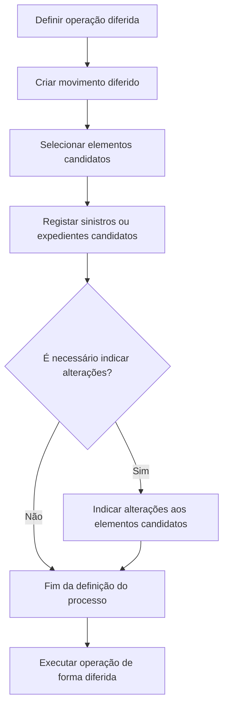
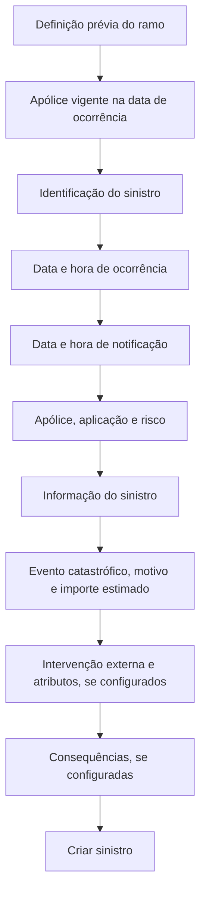
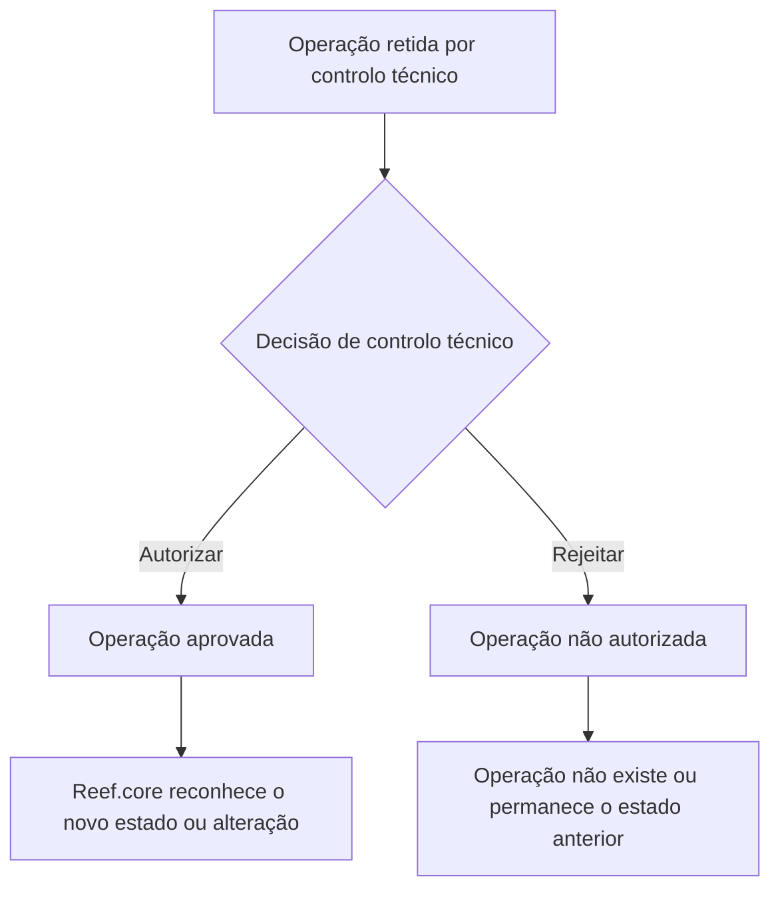

# Documentação Operacional e Modelo de Dados de Sinistros — Reef.core

## 1. Metadados do Documento
- **Arquivo de Origem:** Não identificado no conteúdo extraído
- **Tipo de Documento:** Manual Operacional e Especificação Funcional / Modelo de Dados
- **Domínio / Sistema:** Reef.core — Operação de Sinistros
- **Público-Alvo:** Operação, Analistas Funcionais, Desenvolvedores, Arquitetos e Supervisores de Sinistros
- **Data/Versão Identificada:** Não identificada
- **Proprietário identificado:** `user:agonzalez_mapfre.com`
- **Lifecycle identificado:** Approved Source

---

## 2. Resumo Executivo & Contexto de Negócio

O documento descreve a funcionalidade operacional do domínio de **Sinistros** no sistema **Reef.core**, abrangendo documentação funcional, operações de negócio e referências ao modelo de dados. O conteúdo é organizado por módulos funcionais e por tipos de negócio: Comum, Automóvel, Vida, Transportes, Saúde e Generais.

O ciclo operacional apresentado cobre o tratamento de sinistros desde a criação e identificação inicial, passando pela gestão de expedientes, liquidações, peritações, salvamentos, juízos, fraude, IQRF, serviços, plano de tramitação, controlo técnico, processos massivos e consultas operacionais. Diversas operações podem ser executadas em linha ou de forma diferida por meio de processos massivos.

A criação de sinistro depende da definição prévia do ramo e exige, como premissa, uma apólice vigente na data de ocorrência. A configuração do ramo determina os atributos solicitados, valores iniciais permitidos, obrigatoriedade de informação e exceções de validade para apólice, aplicação e risco.

O documento também detalha o mecanismo de **controlo técnico**, no qual determinadas operações podem ficar retidas para autorização ou rejeição. A autorização torna o resultado reconhecido pelo restante do Reef.core; a rejeição faz com que a operação não exista, ou preserva o estado anterior quando se trata de uma modificação.

Por fim, o material apresenta tabelas técnicas para as operações de criação de sinistro, criação de sinistro por motivo/buzón e seleção de elementos candidatos em processos massivos. Não há detalhes de APIs, contratos HTTP, URLs de ambiente, portas, tecnologias de infraestrutura ou contratos JSON.

---

## 3. Arquitetura, Componentes & Tecnologias Envolvidas

### Componentes e domínios identificados

| Componente / Domínio | Papel descrito no documento |
| :--- | :--- |
| **Reef.core** | Sistema no qual são executadas as operações de sinistros. |
| **Módulo de Sinistros** | Domínio funcional que reúne definição, operação e modelo de dados relacionados a sinistros. |
| **Ramo** | Definição que condiciona os atributos, valores iniciais, obrigatoriedades e validações de operações como criar sinistro e gerar liquidação. |
| **Processos Massivos** | Mecanismo para programar operações diferidas, definir elementos afetados e indicar alterações aplicáveis. |
| **Controlo Técnico** | Mecanismo de autorização ou rejeição de operações retidas para auditoria. |
| **Plano de Tramitação** | Estrutura de gestão de trâmites, níveis, avisos, anotações, cartas e datas de controlo de expedientes. |
| **Menu do Tramitador** | Ferramenta operacional para consulta de trabalho pendente, avisos, trâmites, cartas, expedientes e controlo de prazos. |
| **Menu do Supervisor / Chefe de Sinistros** | Ferramenta de auditoria e organização do trabalho de tramitadores e supervisores, baseada no Plano de Tramitação. |
| **Portal do Fornecedor** | Canal no qual o fornecedor pode executar determinadas operações sobre serviços, tais como atribuição, alteração de estados, bloqueio, desbloqueio, fecho e consultas. |
| **B7000900** | Tabela de buzón de dados fixos do sinistro. |
| **B7000910** | Tabela mestra de processos massivos de sinistros. |
| **Mapfredocument / DOCUMENTACIÓN Reef** | Repositório ou contexto documental identificado no texto extraído. |

### Fluxo funcional de um processo massivo



### Fluxo de criação de sinistro



### Fluxo decisório de controlo técnico



> **Nota de Análise:** O documento descreve fluxos funcionais e entidades de dados, mas não detalha a arquitetura física, microsserviços, protocolos de integração, endpoints, filas, tecnologias de persistência ou mecanismos de autenticação.

---

## 4. Regras de Negócio, Especificações Funcionais & Processos

### 4.1 Processos massivos

Um processo massivo permite diferir uma operação no tempo e determinar os elementos afetados e as alterações aplicáveis. Os elementos podem incluir sinistros, expedientes, liquidações e outros elementos funcionais.

O fluxo obrigatório é:

1. Criar o movimento diferido.
2. Selecionar os elementos candidatos.
3. Registar os elementos selecionados como candidatos.
4. Indicar alterações aos candidatos apenas quando a operação exigir modificações.
5. Executar posteriormente a operação diferida.

Cada instalação deve implementar a sua própria lógica para selecionar sinistros e expedientes candidatos. O documento apresenta exemplos:

- Selecionar sinistros ou expedientes abertos com reserva média e sem alteração de valorização para executar **Modificar valorização do expediente**, aumentando a reserva em 15%.
- Selecionar sinistros sem expedientes, abertos há mais de 15 anos, para executar **Terminar sinistro sem expedientes**.
- Importar sinistros comunicados num centro telefónico para executar **Aperturar sinistro**.
- Criar lógicas personalizadas para selecionar elementos destinados à criação, modificação, criação de juízo, peritação ou IQRF.

### 4.2 Criação de sinistro

A operação **Criar Sinistro** permite criar um novo sinistro no Reef.core.

#### Premissas

- O ramo deve estar previamente definido.
- A informação solicitada depende da definição realizada para o ramo.
- É necessária uma apólice vigente na data do sinistro.

#### Ordem funcional de apresentação

1. Informação de sinistro.
2. Identificação do sinistro.
3. Informação do sinistro.
4. Intervenção externa / pessoa de contacto, quando configurada.
5. Atributos antes das consequências, quando configurados.
6. Consequências, quando configuradas.
7. Atributos depois das consequências, quando configurados.

### 4.3 Regras de identificação do sinistro

| Elemento | Regra funcional |
| :--- | :--- |
| **Data de ocorrência** | Indica a data em que ocorreu o sinistro. Não pode ser posterior ao dia atual, salvo se a definição do ramo estabelecer o contrário. Pode ter valor inicial definido. |
| **Hora de ocorrência** | Indica a hora do sinistro. Quando a definição do ramo exigir hora e minutos na data de efeito da apólice, hora e minutos tornam-se obrigatórios na abertura do sinistro. Pode ter valor inicial definido. |
| **Data de notificação** | Indica a data em que a empresa foi informada sobre o sinistro. Pode possuir valor inicial definido no ramo. Não pode ser posterior ao dia atual. |
| **Extemporaneidade** | Quando o ramo exigir validação de extemporaneidade, a validação é efetuada com os dias máximos definidos; quando validada, a extemporaneidade deve ser definida. |
| **Hora de notificação** | Indica a hora em que a companhia tomou conhecimento do sinistro. Se a data de notificação for o dia atual, a hora não pode ser posterior ao momento de introdução do sinistro. Pode ter valor inicial definido no ramo. |
| **Apólice** | Contrato afetado pelo sinistro. Deve estar vigente na data de ocorrência. Podem existir exceções configuradas para apólices fixas sem aplicações, permitindo apólice não vigente. Também é verificado se a apólice não está retida por controlo técnico. |
| **Aplicação** | Solicitada apenas quando a apólice possui aplicações. Para apólice fixa, assume valor `0`. Pode possuir valor inicial e deve estar vigente na data de ocorrência, exceto nas exceções configuradas para apólices com aplicações. |
| **Risco** | Risco afetado pelo sinistro. Quando existe somente um risco na apólice, é apresentado por defeito. Pode possuir valor inicial. Deve estar vigente na data de ocorrência, salvo exceções configuradas para apólices sem aplicações ou com aplicações. |
| **Suplemento da apólice** | Ao obter a modificação de apólice correspondente à data de ocorrência, considera suplementos temporais, salvo definição contrária. |
| **Suplemento da aplicação** | Ao obter a modificação de aplicação correspondente à data de ocorrência, considera suplementos temporais, salvo definição contrária. |
| **Suplemento do risco** | Ao obter a modificação de risco correspondente à data de ocorrência, considera suplementos temporais, salvo definição contrária. |
| **Nome do risco** | O nome do objeto segurado é configurado por definição. |

### 4.4 Informação do sinistro

| Informação | Regra funcional |
| :--- | :--- |
| **Evento catastrófico** | Indica se o sinistro ocorreu como consequência de evento catastrófico. O evento deve estar definido antes da operação. |
| **Motivo do sinistro** | Origem ou causa que desencadeou o sinistro. As causas devem ser previamente definidas, associadas aos ramos e relacionadas às consequências possíveis de cada causa-origem. |
| **Importe do sinistro** | Estimativa do sinistro. É exibida somente quando definida no ramo. |

### 4.5 Liquidações

A operação **Gerar Liquidação** cria uma liquidação para um expediente. A informação solicitada depende da definição do ramo.

#### Dados de entrada e sequência

1. Sinistro.
2. Expediente.
3. Liquidação de referência.
4. Beneficiário da liquidação.
5. Documento de pagamento da liquidação.
6. Emissor do documento de pagamento.
7. Dados de pagamento.
8. Informação adicional opcional.
9. Importes da liquidação.

#### Regras de operação

| Operação | Regra |
| :--- | :--- |
| **Gerar liquidação** | Cria uma ordem de pagamento para um beneficiário. |
| **Gerar liquidação de expediente terminado** | Cria ordem de pagamento para beneficiário quando o expediente está terminado. |
| **Modificar liquidação** | Permite modificar dados e importes somente se a liquidação não estiver paga. |
| **Anular liquidação** | Cancela a liquidação e reverte movimentos somente se a liquidação não estiver paga. |
| **Consultar liquidação** | Visualiza toda a informação da liquidação. |

### 4.6 Controlo técnico

O controlo técnico aplica operações de autorização e rejeição sobre operações retidas para auditoria.

| Operação retida | Efeito da autorização | Efeito da rejeição |
| :--- | :--- | :--- |
| Abertura de sinistro | O sinistro passa a aprovado e é reconhecido pelo Reef.core. | O sinistro não existe nem existiu para o Reef.core. |
| Modificação de sinistro | A modificação é aprovada e reconhecida pelo Reef.core. | A modificação não é reconhecida pelo Reef.core. |
| Reabilitação de sinistro | O sinistro volta a ser reconhecido como pendente. | O sinistro mantém-se terminado. |
| Abertura de expediente | O expediente passa a aprovado e é reconhecido pelo Reef.core. | O expediente não existe para o Reef.core. |
| Modificação de valorização | A nova valorização do expediente é reconhecida. | Mantém-se a valorização anterior à alteração. |
| Reabilitação de expediente | O expediente volta a ser reconhecido como pendente. | O expediente mantém-se terminado. |
| Liquidação | A nova liquidação e ordem de pagamento são reconhecidas. | A liquidação não existe para o Reef.core. |
| Criação de faturação | A nova fatura é reconhecida. | A fatura não existe. |
| Modificação de faturação | A modificação de fatura é reconhecida. | Mantém-se a situação anterior à modificação. |
| Plano de renda | O plano de renda é reconhecido. | O plano de renda não existe. |

### 4.7 Operações por módulo

| Módulo | Operações identificadas |
| :--- | :--- |
| **Tramitação de Sinistros** | Criar, modificar, terminar, reabilitar e consultar sinistro. |
| **Tramitação de Expedientes** | Criar, modificar dados, valorar, modificar valorização, terminar, reabilitar e consultar expediente. |
| **Liquidações** | Gerar, gerar para expediente terminado, modificar, anular e consultar. |
| **Peritações** | Criar/modificar solicitação; criar/modificar resultado; criar/modificar dano; criar/modificar/anular ordem de reparação; consultar peritação. |
| **Salvamentos** | Criar entrada, criar/modificar/anular salvamento, associar sinistro, associar expediente, criar/modificar subasta, associar inventário, vender, libertar, criar saída e consultar. |
| **Juízos** | Criar/modificar demanda, associar juízo a expediente, criar/modificar sentença, criar/modificar intervenção e consultar juízo. |
| **Fraude** | Criar, modificar e consultar fraude de sinistro ou expediente. |
| **IQRF** | Criar, modificar e consultar IQRF de sinistro ou expediente. |
| **Plano de Tramitação** | Criar plano, incluir trâmite, incluir nível, ativar/finalizar trâmite, criar/finalizar/atrasar avisos, criar anotações, criar carta/e-mail, modificar data de controlo e consultar plano. |
| **Plano de Renda / P.R.M.** | Criar, anular, terminar, terminar sem anular e consultar plano de renda. |
| **Serviços** | Criar ordem, criar/atribuir/modificar/cancelar/reabrir/fechar serviço, modificar estados, gerir bloqueios, criar notificações manuais, consultar avanços e histórico. |
| **Processos Massivos** | Criar movimento diferido, selecionar e registar candidatos e indicar alterações. |
| **Consultas** | Consultas operacionais por menus de tramitador, supervisor e chefe de sinistros. |

### 4.8 Serviços de fornecedores

| Operação | Regra funcional |
| :--- | :--- |
| **Criar ordem** | Gera ordem de trabalho associada a sinistro ou expediente. Uma ordem pode requerer de um a “n” serviços. |
| **Criar serviço** | Gera pedido de execução de trabalho a um profissional; pertence sempre a uma ordem. |
| **Atribuir serviço** | Agenda dia e hora para início do trabalho do fornecedor. Pode ser feito pelo portal do fornecedor. |
| **Modificar serviço** | O tramitador pode modificar dados do serviço. |
| **Modificar estados** | Apenas o fornecedor, através do portal, pode alterar o serviço para Execução, Finalizado e Faturado. |
| **Criar notificações manuais** | O tramitador envia notificações ao fornecedor e pode verificar se foram lidas. |
| **Gerir bloqueios** | Tramitador e portal do fornecedor podem bloquear ou desbloquear o serviço. |
| **Fechar serviço** | Indica que o serviço foi concluído e está pendente de faturação. Pode ser realizado pelo tramitador ou pelo portal. |
| **Cancelar serviço** | Suspende a realização do serviço; não é possível realizar novas operações posteriormente. |
| **Reabrir serviço** | O tramitador reabre serviço fechado, indicando causas. |
| **Consultar avanços** | Exibe movimentos dentro do estado de Execução. Disponível ao tramitador e ao portal do fornecedor. |
| **Consultar histórico de movimentos** | Exibe todos os estados pelos quais o serviço passou. Disponível ao tramitador e ao portal do fornecedor. |

---

## 5. Tabelas de Parâmetros, Ambientes e Estruturas de Dados

### 5.1 Tabela B7000900 — Buzón de dados fixos do sinistro

| Item / Parâmetro | Descrição / Função | Tipo / Valores / Formato | Ambiente / Observações |
| :--- | :--- | :--- | :--- |
| `FEC_TRATAMIENTO` | Data de realização do processo massivo | Não especificado | Obrigatório: Sim |
| `TIP_MVTO_BATCH_STRO` | Tipo do movimento batch | Não especificado | Obrigatório: Sim |
| `COD_CIA` | Companhia | Não especificado | Obrigatório: Sim |
| `NUM_SINI` | Sinistro | Não especificado | Obrigatório: Sim |
| `NUM_SINI_REF` | Referência do sinistro em outros sistemas | Não especificado | Obrigatório: Sim |
| `NUM_POLIZA` | Apólice | Não especificado | Obrigatório: Sim |
| `NUM_RIESGO` | Risco | Não especificado | Obrigatório: Sim |
| `NUM_APLI` | Número de aplicação | Não especificado | Obrigatório: Sim |
| `FEC_SINI` | Data de ocorrência do sinistro | Não especificado | Obrigatório: Sim |
| `FEC_DENU_SINI` | Data de notificação/denúncia do sinistro | Não especificado | Obrigatório: Sim |
| `HORA_SINI` | Hora de ocorrência | Não especificado | Obrigatório: Não |
| `COD_CAUSA_SINI` | Causa do sinistro | Não especificado | Obrigatório: Sim |
| `COD_EVENTO` | Evento catastrófico que originou o sinistro | Não especificado | Obrigatório: Não |
| `NOM_CONTACTO` | Nome da pessoa de contacto | Não especificado | Obrigatório: Não |
| `APE_CONTACTO` | Apelidos da pessoa de contacto | Não especificado | Obrigatório: Não |
| `TEL_PAIS_CONTACTO` | País do telefone do contacto | Não especificado | Obrigatório: Não |
| `TEL_ZONA_CONTACTO` | Zona do telefone do contacto | Não especificado | Obrigatório: Não |
| `TEL_NUMERO_CONTACTO` | Número de telefone do contacto | Não especificado | Obrigatório: Não |
| `MCA_CULPABLE` | Indicador de culpabilidade do sinistro | Não especificado | Obrigatório: Não |
| `COD_USR` | Utilizador que atualizou a linha | Não especificado | Obrigatório: Sim |
| `FEC_ACTU` | Data de atualização da linha | Não especificado | Obrigatório: Sim |
| `TIP_DOCUM_CONTACTO` | Tipo de documento do contacto | Não especificado | Obrigatório: Não |
| `COD_DOCUM_CONTACTO` | Documento do contacto | Não especificado | Obrigatório: Não |
| `TIP_RELACION` | Relação com o segurado | Não especificado | Obrigatório: Não |
| `EMAIL_CONTACTO` | Endereço de e-mail do contacto | Não especificado | Obrigatório: Não |
| `HORA_DENU_SINI` | Hora da denúncia/notificação do sinistro | Não especificado | Obrigatório: Não |
| `NUM_ORDEN` | Número do processo massivo | Não especificado | Obrigatório: Sim |
| `IMP_VAL_INI_SINI` | Importe estimado da valorização do sinistro | Não especificado | Obrigatório: Não |
| `NUM_SINI_REF_MOD` | Sinistro de referência de outros sistemas para modificação | Não especificado | Obrigatório: Não |
| `TXT_CNH_CLR` | Meio de contacto móvel | Não especificado | Obrigatório: Não |
| `TXT_CNH_TLP` | Meio de contacto telefónico | Não especificado | Obrigatório: Não |
| `TXT_CNH_EML` | Meio de contacto por e-mail | Não especificado | Obrigatório: Não |

### 5.2 Tabela B7000910 — Mestra de processos massivos de sinistros

| Item / Parâmetro | Descrição / Função | Tipo / Valores / Formato | Ambiente / Observações |
| :--- | :--- | :--- | :--- |
| `FEC_TRATAMIENTO` | Data de realização do processo massivo | Não especificado | Obrigatório: Sim |
| `TIP_MVTO_BATCH_STRO` | Tipo do movimento batch | Não especificado | Obrigatório: Sim |
| `NUM_ORDEN` | Número do processo massivo | Não especificado | Obrigatório: Sim |
| `TXT_ALIAS` | Nome atribuído ao processo | Não especificado | Obrigatório: Não |
| `TIP_SITU` | Situação da linha | `1-Sin Procesar` | Obrigatório: Sim |
| `COD_CIA` | Companhia | Não especificado | Obrigatório: Sim |
| `COD_SECTOR` | Setor | Não especificado | Obrigatório: Sim |
| `COD_RAMO` | Ramo | Não especificado | Obrigatório: Sim |
| `NUM_SINI_REF` | Referência do sinistro em outros sistemas | Não especificado | Obrigatório: Sim |
| `NUM_SINI` | Sinistro | Não especificado | Obrigatório: Sim |
| `NUM_EXP` | Número do expediente | Não especificado | Obrigatório: Sim |
| `NUM_LIQ_REF` | Número de liquidação de referência | Não especificado | Obrigatório: Sim |
| `NUM_LIQ` | Número de liquidação | Não especificado | Obrigatório: Sim |
| `SUB_TIP_TRAMITE` | Tipo de trâmite | Não especificado | Obrigatório: Sim |
| `NUM_JUICIO_REF` | Número de juízo de referência | Não especificado | Obrigatório: Não |
| `NUM_JUICIO` | Número de juízo | Não especificado | Obrigatório: Não |
| `COD_INVENTARIO_REF` | Inventário de referência | Não especificado | Obrigatório: Não |
| `COD_INVENTARIO` | Número de inventário | Não especificado | Obrigatório: Não |
| `COD_SUBASTA_REF` | Código de referência da subasta | Não especificado | Obrigatório: Não |
| `COD_SUBASTA` | Subasta | Não especificado | Obrigatório: Não |
| `COD_BATCH_REF` | Código de referência para processos batch | Não especificado | Obrigatório: Não |
| `IDN_BATCH` | Identificador batch | Não especificado | Obrigatório: Não |
| `NUM_SQN_VAL` | Sequência | Não especificado | Obrigatório: Não |
| `IDN_FRAUDE` | Identificador de fraude | Não especificado | Obrigatório: Não |
| `IDN_FRAUDE_REF` | Referência do identificador de fraude | Não especificado | Obrigatório: Não |
| `IDN_IQRF` | Identificador IQRF | Não especificado | Obrigatório: Não |
| `IDN_IQRF_REF` | Referência do identificador IQRF | Não especificado | Obrigatório: Não |
| `COD_USR_CAPTURA` | Utilizador que simula a captura | Não especificado | Obrigatório: Sim |
| `COD_USR` | Utilizador que atualizou a linha | Não especificado | Obrigatório: Sim |
| `FEC_ACTU` | Data de atualização da linha | Não especificado | Obrigatório: Sim |

### 5.3 Matriz de módulos por tipo de negócio

| Módulo | Automóvel | Vida | Transportes | Saúde | Generais |
| :--- | :---: | :---: | :---: | :---: | :---: |
| Tramita Sinistro | Sim | Sim | Sim | Sim | Sim |
| Tramita Expediente | Sim | Sim | Sim | Sim | Sim |
| Liquidações | Sim | Sim | Sim | Sim | Sim |
| Peritações | Sim | Não listado | Sim | Não listado | Sim |
| Salvamentos | Sim | Não listado | Sim | Não listado | Sim |
| Juízos | Sim | Sim | Sim | Sim | Sim |
| Plano de Renda | Sim | Sim | Não listado | Não listado | Sim |
| IQRF | Sim | Sim | Sim | Sim | Sim |
| Fraude | Sim | Sim | Sim | Sim | Sim |
| Plano de Tramitação | Sim | Sim | Sim | Listado como imagem/texto | Sim |
| Serviços | Sim | Não listado | Não listado | Sim | Sim |
| Controlo Técnico | Sim | Sim | Sim | Sim | Sim |
| Processos Massivos | Sim | Sim | Sim | Sim | Sim |
| Consultas | Sim | Sim | Sim | Sim | Sim |

> **Nota de Análise:** “Não listado” significa que o módulo não aparece na lista extraída para esse tipo de negócio; o documento não afirma que a funcionalidade seja tecnicamente inexistente.

---

## 6. Bateria de Perguntas & Respostas para RAG (FAQ Sintético)

### P1: O que é um processo massivo no Reef.core?
**R:** Um processo massivo é o mecanismo que define uma operação a executar de forma diferida, os elementos que serão afetados e, quando aplicável, as modificações que esses elementos sofrerão. O processo inclui criar um movimento diferido, selecionar elementos candidatos, registá-los e indicar alterações quando necessárias.

### P2: Quais são as etapas para definir um processo massivo de sinistros?
**R:** As etapas são: criar o movimento diferido, selecionar sinistros ou expedientes candidatos, registar os elementos selecionados como candidatos e indicar mudanças aos candidatos caso a operação exija alterações. Após essa definição, a operação pode ser lançada de forma diferida.

### P3: Quais são as premissas para criar um sinistro?
**R:** A criação de sinistro requer que o ramo esteja definido previamente e que exista uma apólice vigente na data de ocorrência do sinistro. Os atributos solicitados dependem da configuração funcional realizada para o ramo.

### P4: A data de ocorrência de um sinistro pode ser futura?
**R:** Não, a data de ocorrência não pode ser posterior ao dia atual, exceto se a definição do ramo especificar explicitamente o contrário.

### P5: Quando a hora de ocorrência é obrigatória na criação de sinistro?
**R:** A hora e os minutos de ocorrência são obrigatórios quando a definição do ramo determinar que a hora e os minutos da data de efeito da apólice são obrigatórios. O documento também informa que pode existir uma hora de ocorrência inicial configurada.

### P6: Que validações são aplicadas à apólice, aplicação e risco durante a criação de sinistro?
**R:** A apólice deve estar vigente na data de ocorrência e não pode estar retida por controlo técnico. A aplicação é solicitada somente para apólices com aplicações, assume valor `0` para apólice fixa e deve estar vigente, salvo exceções definidas. O risco deve estar vigente na data de ocorrência, salvo exceções configuradas para apólices sem aplicações ou com aplicações.

### P7: O que acontece quando uma abertura de sinistro retida por controlo técnico é rejeitada?
**R:** Quando a abertura de sinistro é rejeitada pelo controlo técnico, o sinistro não é autorizado e, para o restante do Reef.core, não existe nem existiu.

### P8: O que acontece quando uma modificação de valorização de expediente é rejeitada pelo controlo técnico?
**R:** A modificação não é autorizada e o Reef.core mantém a valorização anterior à alteração rejeitada.

### P9: Quando uma liquidação pode ser modificada ou anulada?
**R:** Uma liquidação pode ser modificada, tanto nos dados como nos importes, somente enquanto não estiver paga. Também pode ser anulada e ter os movimentos revertidos somente quando não estiver paga.

### P10: Que operações o fornecedor pode realizar no portal de serviços?
**R:** O fornecedor pode atribuir/agendar serviço, alterar o serviço para os estados de Execução, Finalizado e Faturado, bloquear ou desbloquear serviço, fechar serviço e consultar avanços e histórico de movimentos. O documento atribui exclusivamente ao fornecedor, pelo portal, a alteração para os estados Execução, Finalizado e Faturado.

### P11: Para que serve o Menu do Supervisor e Chefe de Sinistros?
**R:** O menu é uma ferramenta de organização do trabalho de gestão e auditoria, baseada no Plano de Tramitação. O supervisor visualiza tramitadores e o número de expedientes que cumprem condições filtradas; o chefe de sinistros visualiza supervisores e o número de tramitadores do supervisor que cumprem essas condições.

### P12: Quais campos da tabela B7000900 são obrigatórios para o buzón de dados fixos do sinistro?
**R:** São obrigatórios: `FEC_TRATAMIENTO`, `TIP_MVTO_BATCH_STRO`, `COD_CIA`, `NUM_SINI`, `NUM_SINI_REF`, `NUM_POLIZA`, `NUM_RIESGO`, `NUM_APLI`, `FEC_SINI`, `FEC_DENU_SINI`, `COD_CAUSA_SINI`, `COD_USR`, `FEC_ACTU` e `NUM_ORDEN`.

---

## 7. Glossário de Termos, Siglas & Conceitos-Chave

- **Reef.core:** Sistema referido como suporte às operações de sinistros.
- **Sinistro:** Ocorrência segurada tratada pelo sistema.
- **Expediente:** Entidade operacional associada a um sinistro para registar e tratar danos, reservas e operações relacionadas.
- **Ramo:** Configuração de negócio que determina dados, regras, obrigatoriedade e validações aplicáveis às operações.
- **Apólice:** Contrato de seguro afetado por um sinistro.
- **Aplicação:** Atributo da apólice solicitado quando esta possui aplicações; em apólice fixa, assume valor `0`.
- **Risco:** Elemento segurado afetado pelo sinistro.
- **Liquidação:** Operação que cria uma ordem de pagamento para um beneficiário.
- **Peritação:** Processo de avaliação/investigação conduzido por profissional, incluindo solicitação, resultado, danos e ordens de reparação.
- **Salvamento:** Bem salvado associado a um sinistro, que pode ser inventariado, leiloado, vendido ou libertado de uma subasta.
- **IQRF:** Incidência, Queixa, Reclamação ou Felicitação.
- **P.R.M. / Plano de Renda:** Plano de renda associado a um expediente.
- **Controlo Técnico / C.T.:** Processo de auditoria que autoriza ou rejeita operações retidas.
- **Processo Massivo:** Processo que define operações diferidas, elementos candidatos e alterações aplicáveis.
- **Tramitador:** Utilizador que realiza o tratamento operacional de expedientes.
- **Plano de Tramitação:** Estrutura de gestão de trâmites, avisos, anotações, cartas e controlo de atividades de um expediente.
- **B7000900:** Tabela de buzón de dados fixos do sinistro.
- **B7000910:** Tabela mestra de processos massivos de sinistros.
- **`NUM_ORDEN`:** Número do processo massivo.
- **`TIP_SITU`:** Situação da linha; o valor apresentado é `1-Sin Procesar`.

---

## 8. Notas Críticas, Riscos & Limitações

- O conteúdo é predominantemente funcional e operacional; não descreve APIs, métodos HTTP, contratos JSON, autenticação, tecnologias de banco de dados, topologia, servidores, URLs ou ambientes.
- O documento apresenta diversos blocos com a indicação **“EN CONSTRUCCIÓN”**, sinalizando conteúdo incompleto ou ainda não detalhado.
- As seções de beneficiário de liquidação, dados de pagamento, documento de pagamento e emissor do documento de pagamento informam o objetivo, mas não detalham atributos, validações ou estruturas de dados.
- A página com título `{#titulo}` apresenta uma estrutura genérica e campos de texto parcialmente corrompidos, sem detalhamento funcional suficiente.
- Algumas extrações contêm caracteres corrompidos, como `denición`, `modicar` e `nalizar`. A interpretação funcional foi preservada sem introduzir informação externa.
- As regras de cada operação dependem frequentemente da definição do ramo; o documento não fornece todas as configurações possíveis por ramo.
- A lógica de seleção para processos massivos é responsabilidade de cada instalação. O documento não especifica algoritmos, critérios universais ou implementações técnicas.
- “Não listado” em matrizes de módulos não deve ser interpretado como inexistência técnica da capacidade; representa apenas ausência na lista extraída.
- Não há tipos físicos, tamanhos, chaves, índices, cardinalidades ou relacionamentos explícitos para as tabelas B7000900 e B7000910.

---

## 9. Conteúdo Bruto Estruturado (Referência Fiel)

```text
--- [PÁGINAS 1-5] ---

Modelo técnico associado à operação CREAR Siniestro - Motivo- BUZÓN.

Tabela: B7000900 — BUZON DE DATOS FIJOS DEL SINIESTRO.

Campos extraídos:
FEC_TRATAMIENTO — FECHA EN LA QUE SE REALIZA EL PROCESO MASIVO.
TIP_MVTO_BATCH_STRO — TIPO DEL MOVIMIENTO BATCH.
COD_CIA — COMPANIA.
NUM_SINI — SINIESTRO.
NUM_SINI_REF — SINIESTRO REFERENCIA DE OTROS SISTEMAS.
NUM_POLIZA — POLIZA.
NUM_RIESGO — RIESGO.
NUM_APLI — NUMERO DE APLICACION.
FEC_SINI — FECHA DE OCURRENCIA DEL SINIESTRO.
FEC_DENU_SINI — FECHA DE NOTIFICACION, DENUNCIA DEL SINIESTRO.
HORA_SINI — HORA DE OCURRENCIA DEL SINIESTRO.
COD_CAUSA_SINI — CAUSA DEL SINIESTRO.
COD_EVENTO — EVENTO CATRASTROFICO QUE ORIGINO EL SINIESTRO.
NOM_CONTACTO — PERSONA DE CONTACTO.
APE_CONTACTO — APELLIDOS DEL CONTACTO.
TEL_PAIS_CONTACTO — PAIS DEL TELEFEONO PERSONA DE CONTACTO.
TEL_ZONA_CONTACTO — ZONA DEL TELEFEONO PERSONA DE CONTACTO.
TEL_NUMERO_CONTACTO — NUMERO DE TELEFONO PERSONA DE CONTACTO.
MCA_CULPABLE — SI ES O NO CULPABLE DEL SINIESTRO.
COD_USR — USUARIO QUE ACTUALIZO LA FILA.
FEC_ACTU — FECHA DE ACTUALIZACION DE LA FILA.
TIP_DOCUM_CONTACTO — TIPO DE DOCUMENTO DE LA PERSONA DE CONTACTO.
COD_DOCUM_CONTACTO — DOCUMENTO DE LA PERSONA DE CONTACTO.
TIP_RELACION — RELACION CON EL ASEGURADO.
EMAIL_CONTACTO — DIRECCION DE CORREO ELECTRONICO DE LA PERSONA DE CONTACTO.
HORA_DENU_SINI — HORA DE LA DENUNCIA DEL SINIESTRO.
NUM_ORDEN — NUMERO DEL PROCESO MASIVO.
IMP_VAL_INI_SINI — IMPORTE DE ESTIMACIÓN DE LA VALORACION DEL SINIESTRO.
NUM_SINI_REF_MOD — SINIESTRO DE REFERENCIA DE OTROS SISTEMAS PARA MODIFICACION.
TXT_CNH_CLR — MEDIO CONTACTO MOVIL.
TXT_CNH_TLP — MEDIO CONTACTO TELEFONO.
TXT_CNH_EML — MEDIO CONTACTO EMAIL.

--- [PÁGINAS 6-12] ---

CREAR proceso masivo en Siniestros.

Reef.core está formado por una serie de operaciones. Ciertas operaciones se pueden realizar tanto en el momento (en línea), como diferidas en el tiempo.

Cuando una operación se puede diferir, se permite determinar a qué elementos afectará la operación y qué modificaciones sufrirán los elementos. El proceso que determina qué operación diferida se va a realizar, a qué elementos afectará esa operación y qué modificaciones sufrirán los elementos se denomina proceso masivo.

Proceso:
1. CREAR movimiento diferido.
2. SELECCIONAR elementos candidatos.
3. INDICAR cambios a elementos candidatos, si es necesario.

SELECCIONAR elemento candidato en Siniestros:
Inclusión de elementos inicialmente pretendidos para afectar en el proceso masivo. Del universo de elementos, como siniestros, expedientes y liquidaciones, se extraen los que se quieren procesar.

REGISTRAR siniestro:
Tomar siniestros/expedientes seleccionados para un proceso masivo y convertirlos en candidatos para dicho proceso.

SELECCIONAR siniestros:
Determinar qué siniestro/expediente será candidato a participar en el proceso masivo.

Cada instalación tendrá un proceso personalizado para que los elementos candidatos lleguen al proceso masivo.

Ejemplos:
- Seleccionar siniestros/expedientes abiertos con reserva promedio y sin cambios de valoración para cambiar valoración y subir reserva un 15%.
- Seleccionar siniestros sin expedientes y abiertos hace más de 15 años para terminar siniestro sin expedientes.
- Volcar siniestros comunicados en un Centro Telefónico para aperturar siniestro.
- Cada instalación debe crear lógicas propias para seleccionar siniestros/expedientes para crear, modificar, crear juicio, peritación o IQRF.

--- [PÁGINAS 8-9] ---

Tabela: B7000910 — MAESTRA PROCESOS MASIVO DE SINIESTROS.

FEC_TRATAMIENTO — FECHA EN LA QUE SE REALIZA EL PROCESO MASIVO.
TIP_MVTO_BATCH_STRO — TIPO DEL MOVIMIENTO BATCH.
NUM_ORDEN — NUMERO DEL PROCESO MASIVO.
TXT_ALIAS — NOMBRE QUE SE QUIERA DAR AL PROCESO.
TIP_SITU — 1-Sin Procesar — SITUACION EN LA QUE SE ENCUENTRA LA FILA.
COD_CIA — COMPANIA.
COD_SECTOR — SECTOR.
COD_RAMO — RAMO.
NUM_SINI_REF — SINIESTRO REFERENCIA DE OTROS SISTEMAS.
NUM_SINI — SINIESTRO.
NUM_EXP — NUMERO DE EXPEDIENTE.
NUM_LIQ_REF — NUMERO DE LIQUIDACION DE REFERENCIA.
NUM_LIQ — NUMERO DE LIQUIDACION.
SUB_TIP_TRAMITE — TIPO DE TRAMITE.
NUM_JUICIO_REF — NUMERO DEL JUICIO DE REFERENCIA.
NUM_JUICIO — NUMERO DEL JUICIO.
COD_INVENTARIO_REF — INVENTARIO DE REFERENCIA.
COD_INVENTARIO — NUMERO DE INVENTARIO.
COD_SUBASTA_REF — CODIGO DE SUBASTA DE REFERENCIA.
COD_SUBASTA — SUBASTA.
COD_BATCH_REF — CODIGO DE REFERENCIA PARA PROCESOS BATCH.
IDN_BATCH — IDENTIFICADOR BATCH.
NUM_SQN_VAL — SECUENCIA.
IDN_FRAUDE — IDENTIFICADOR DE FRAUDE.
IDN_FRAUDE_REF — REFERENCIA DE IDENTIFICADOR DE FRAUDE.
IDN_IQRF — IDENTIFICADOR IQRF.
IDN_IQRF_REF — REFERENCIA DE IDENTIFICADOR IQRF.
COD_USR_CAPTURA — USUARIO QUE SIMULA LA CAPTURA.
COD_USR — USUARIO QUE ACTUALIZO LA FILA.
FEC_ACTU — FECHA DE ACTUALIZACION DE LA FILA.

--- [PÁGINAS 13-16] ---

Identificación del Siniestro:
Fecha de ocurrencia: no puede ser superior a la del día, excepto que en la definición del ramo se especifique lo contrario.
Hora de ocurrencia: obligatoria cuando la definición del ramo establece obligatoriedad de hora y minutos en la fecha de efecto de la póliza.
Fecha de notificación: no puede ser superior a la del día.
Extemporaneidad: si el ramo define su validación, se utilizan los días máximos fijados.
Hora de notificación: si la fecha es la del día, no puede ser una hora superior al momento de ingreso.
Póliza: debe estar vigente a fecha de ocurrencia; se comprueba que no esté retenida por control técnico.
Aplicación: se pide únicamente si la póliza tiene aplicaciones; si la póliza es fija, toma valor 0.
Riesgo: debe estar vigente a la fecha de ocurrencia, sujeto a excepciones definidas.
Suplementos de póliza, aplicación y riesgo: tienen en cuenta suplementos temporales, salvo definición contraria.
Nombre del riesgo: se configura por definición.

Información del siniestro:
Evento Catastrófico: requiere que el evento se haya definido previamente.
Motivo del siniestro: causa origen que debe definirse, asociarse a ramos y relacionarse con consecuencias posibles.
Importe del Siniestro: estimación del siniestro; se muestra solo si así se definió en el ramo.

CREAR siniestro:
Permite crear un nuevo siniestro en Reef.core.
Premisas: ramo definido y póliza vigente a fecha del siniestro.
Orden: Información de siniestro; Identificación; Información; Intervención Externa; Atributos antes de Consecuencias; Consecuencias; Atributos después de Consecuencias.

--- [PÁGINAS 17-21] ---

GENERAR Liquidación:
Permite crear/generar una liquidación para un expediente.
La información solicitada depende de la definición del ramo.

Elementos:
- Siniestro.
- Expediente.
- Liquidación de Referencia.
- Beneficiario de la Liquidación.
- Documento de Pago de la Liquidación.
- Emisor del Documento de Pago de la liquidación.
- Datos del Pago de la liquidación.
- Información Adicional de la liquidación — Opcional.
- Importes de la liquidación.

--- [PÁGINAS 23-48] ---

Módulos de operación de siniestros:
TRAMITA SINIESTRO; TRAMITA EXPEDIENTE; LIQUIDACIONES; PERITACIONES; SALVAMENTOS; JUICIOS; PLAN DE RENTA; I.Q.R.F.; FRAUDE; PLAN DE TRAMITACIÓN; SERVICIOS; CONTROL TÉCNICO; PROCESOS MASIVOS; CONSULTAS.

CONTROL TÉCNICO:
Incluye autorizar y rechazar apertura/modificación/rehabilitación de siniestros y expedientes, cambio de valoración, liquidación, creación/modificación de facturación y plan de renta.

FRAUDE:
CREAR, MODIFICAR y CONSULTAR fraude de siniestro y expediente.

I.Q.R.F.:
CREAR, MODIFICAR y CONSULTAR Incidencia, Queja, Reclamación o Felicitación de siniestro y expediente.

JUICIOS:
CREAR/MODIFICAR demanda; ASOCIAR juicio expediente; CREAR/MODIFICAR sentencia; CREAR/MODIFICAR intervención; CONSULTAR juicio.

LIQUIDACIONES:
GENERAR liquidación; GENERAR liquidación de expediente terminado; MODIFICAR liquidación; ANULAR liquidación; CONSULTAR liquidación.

PERITACIONES:
CREAR/MODIFICAR solicitud; CREAR/MODIFICAR resultado; CREAR/MODIFICAR daño; CREAR/MODIFICAR/ANULAR orden de reparación; CONSULTAR peritación.

PLAN TRAMITACIÓN:
CREAR plan; INCLUIR trámite/nivel; ACTIVAR/FINALIZAR trámite; CREAR/FINALIZAR/RETRASAR avisos; CREAR anotaciones libres; CREAR carta/email; MODIFICAR fecha de control; CONSULTAR plan.

PLAN DE RENTA:
CREAR, ANULAR, TERMINAR, TERMINAR sin anular y CONSULTAR.

SALVAMENTOS:
CREAR entrada/salvamento/subasta/salida; MODIFICAR salvamento/subasta; ASOCIAR siniestro/expediente/inventario; VENDER; LIBERAR; ANULAR; CONSULTAR por siniestro o inventario.

SERVICIOS:
CREAR orden/servicio/notificaciones; ASIGNAR; MODIFICAR servicio/estados; GESTIONAR bloqueos; CERRAR; CANCELAR; RE-APERTURAR; CONSULTAR avances e histórico.

TRAMITACIÓN EXPEDIENTES:
CREAR Expediente; MODIFICAR Datos; VALORAR; MODIFICAR Valoración; TERMINAR; REHABILITAR; CONSULTAR.

TRAMITACIÓN SINIESTROS:
CREAR Siniestro; MODIFICAR Siniestro; TERMINAR Siniestro; REHABILITAR Siniestro; CONSULTAR Siniestro.

Tipos de negocio:
COMÚN; AUTOMÓVIL; VIDA; TRANSPORTE; SALUD; GENERALES.

La documentación de siniestros se divide en:
- DEFINICIÓN: conceptos que deben definirse y orden para lograr la definición necesaria para operar un módulo funcional.
- OPERACIÓN: documentos relacionados con operaciones funcionales soportadas.
- MODELO DE DATOS: documentación orientada a tablas de la aplicación, filas y columnas según operaciones funcionales.
```
