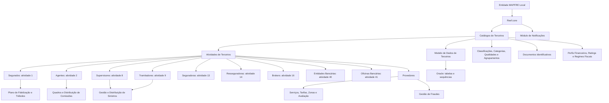
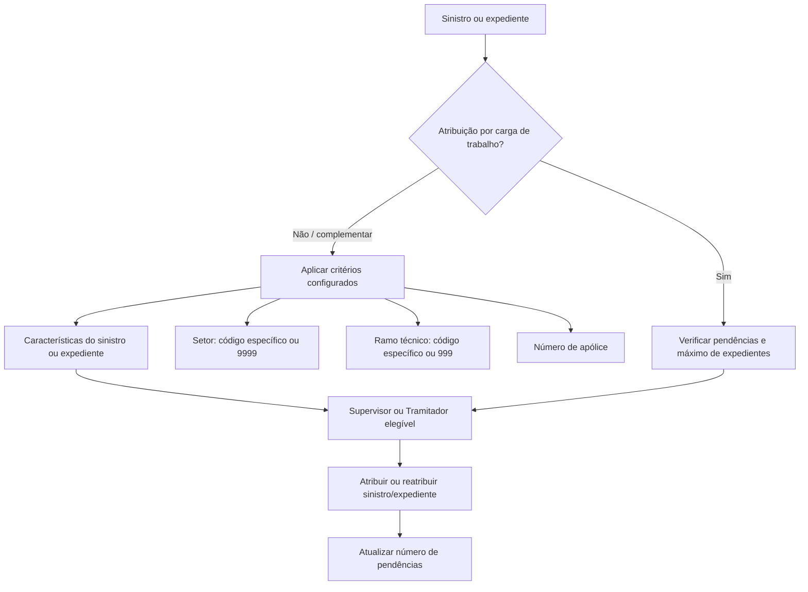

# Catálogos de Terceiros, Agentes, Sinistros, Entidades Bancárias e Provedores no Reef.core

## 1. Metadados do Documento
- **Arquivo de Origem:** Não identificado; texto bruto fornecido com 200 páginas.
- **Tipo de Documento:** Manual Operacional / Especificação Funcional.
- **Domínio / Sistema:** Reef.core — gestão de terceiros, emissão, sinistros, comissões, fidelização, entidades bancárias e provedores.
- **Público-Alvo:** Desenvolvedores, Arquitetos, Operação, Tecnologia e Processos, Negócio, Administração e Finanças.
- **Data/Versão Identificada:** Não identificada.
- **Owner identificado no conteúdo:** `user:agonzalez_mapfre.com`.
- **Lifecycle identificado no conteúdo:** `Approved Source`.

---

## 2. Resumo Executivo & Contexto de Negócio

O documento descreve os catálogos funcionais usados pelo Reef.core para identificar, classificar, configurar, validar e operar Terceiros — pessoas físicas ou jurídicas — dentro de uma entidade seguradora MAPFRE. A atividade atribuída a um Terceiro determina os processos operacionais nos quais ele pode participar, como emissão de apólices, cálculo de comissões, gestão de sinistros, relacionamento com clientes, pagamentos e gestão de provedores.

O núcleo do Reef.core fornece alguns catálogos corporativos e códigos reservados que devem ser obrigatoriamente respeitados. Em particular, os códigos de atividade de `1` a `99`, além do código `999`, são reservados ao núcleo do sistema. Diversos catálogos são entregues inicialmente vazios para que a entidade MAPFRE local os configure segundo exigências operacionais, legais, regulatórias e de exploração analítica.

A configuração é amplamente contextualizada por companhia, idioma, atividade do Terceiro, ramo técnico, setor, intervenção, pessoa física ou jurídica, vigência e estado de inabilitação. A utilização correta de `Fecha de Validez` permite histórico das alterações de definição; a propriedade `Inhabilitación` controla a disponibilidade dos registros para captura, manutenção ou operação.

O documento também descreve configurações específicas por tipo de Terceiro: segurados, agentes, terceiros genéricos, supervisores, tramitadores, seguradoras, resseguradoras, brokers, empregados de agentes, companhias, entidades bancárias, sucursais bancárias e níveis da estrutura comercial. Para provedores, o Reef.core oferece um conjunto extenso de catálogos de serviços, zonas, tarifas, acesso, desempenho, fraude e classificação.

O Plano de Fidelização MAPFRE utiliza o **Trébol** como moeda de fidelização. Os Tréboles podem ser acumulados ou resgatados conforme ações configuradas; não podem ser convertidos em dinheiro, não expiram enquanto o cliente mantiver produtos MAPFRE e podem ser aplicados automaticamente em recibos de renovação, emissão ou suplemento quando houver saldo mínimo aplicável.

---

## 3. Arquitetura, Componentes & Tecnologias Envolvidas

### Componentes e domínios funcionais identificados

| Componente / Domínio | Função descrita |
| :--- | :--- |
| **Reef.core** | Núcleo funcional que gerencia Terceiros, catálogos, validações, sinistros, comissões, provedores e demais processos corporativos descritos. |
| **Catálogo de Atividades de Terceiros** | Classifica Terceiros e determina processos operacionais nos quais podem atuar. |
| **Modelo de Dados de Terceiros** | Estruturas e tabelas Oracle usadas para registrar e validar atributos de Terceiros. |
| **Módulo de Notificações** | Substitui a funcionalidade descontinuada do catálogo de Métodos de Envio. |
| **Gestão de Pólizas e Contratos** | Processo no qual documentos alternativos não devem ser capturados. |
| **Gestão de Sinistros e Prestações** | Processo que utiliza Peritos, Supervisores, Tramitadores, Provedores e critérios de atribuição. |
| **Estrutura de Produtos** | Fonte de Setor e Ramo Técnico para especialização, atribuição e configuração. |
| **Estrutura Comercial** | Fonte dos níveis comercial primeiro, segundo e terceiro; usada em agentes, tramitadores, supervisores e emissão. |
| **Estrutura Geográfica** | Referência territorial para endereços, entidades bancárias, sucursais e zonas de provedores. |
| **Tesouraria** | Relacionada a impostos, retenções, meios de cobrança/pagamento, tokens e pagamentos a provedores. |
| **Plano de Fidelização** | Gerencia Tréboles, ações, tipos de ação, parceiros colaboradores e parâmetros locais. |
| **Módulo de Provedores** | Gerencia serviços, tarifas, zonas, acessos, desempenho, fraude, tipos e categorias de provedores. |
| **Módulo de Juízos** | Considerado nos critérios de atribuição de sinistros e expedientes a Tramitadores. |
| **Oracle** | Referenciado por tabelas do modelo de dados e sequências para geração automática de documentos ou tokens. |



### Fluxo de atribuição de sinistros



---

## 4. Regras de Negócio, Especificações Funcionais & Processos

### 4.1 Atividades de Terceiros

Uma atividade de Terceiro é uma qualidade associada a pessoas físicas ou jurídicas que permite relacioná-las à capacidade de exercer uma função no sistema. A atividade identifica inequivocamente processos, procedimentos e fluxos operacionais nos quais o Terceiro participa ou pode participar.

- Um Terceiro identificado como **Agente / Intermediário** pode participar automaticamente no processo de devengo de comissões.
- Um Terceiro identificado como **Perito** pode participar de tarefas de atribuição e perícia no processo de Gestão de Sinistros e Prestações.
- Um Terceiro identificado como **Empregado** pode beneficiar-se automaticamente de desconto comercial na contratação de apólices no processo de Emissão.
- Os códigos de atividade de `1` a `99`, além do `999`, são reservados e de uso exclusivo do núcleo Reef.core.
- A consulta da atividade por usuários de agências pode ser configurada para reduzir risco de violação local do Regulamento Geral de Proteção de Dados.
- Uma atividade marcada como Provedor habilita definições próprias de provedores, como zonas de atuação, serviços permitidos e horários.
- Uma atividade pode permitir ou bloquear a associação a Terceiros com documentos fictícios.
- Quando a propriedade de código interno do Terceiro está habilitada, é possível configurar geração automática do código.
- A Direção de Tecnologia local é responsável por definir e identificar a estrutura e agrupamento de estruturas atribuídos à atividade.

### 4.2 Atividades econômicas, categorias, classificações e agrupamentos

As atividades econômicas classificam Terceiros, empresas ou autônomos conforme o setor produtivo e suas subdivisões. A entidade local deve configurar o catálogo conforme suas necessidades e regulações locais, podendo usar classificações locais ou classificações do Área Corporativa de Negócio e Clientes.

O nível de risco ou vulnerabilidade da atividade econômica possui os valores documentados: **Sem Risco**, **Baixo**, **Médio**, **Alto** e **Crítico**. A inabilitação impede o uso da atividade em captura ou alteração. A data de validade torna possível manter histórico de alterações.

Agrupamentos de Terceiros são subconjuntos que compartilham ao menos uma característica. O documento não impõe padrão corporativo de codificação para agrupamentos, categorias, classificações ou qualidades; a entidade deve avaliar seu uso transversal e posterior exploração.

### 4.3 Obrigatoriedade de campos de Terceiros

O Reef.core permite configurar validações obrigatórias de atributos conforme companhia, catálogo Oracle, ramo técnico, atividade, intervenção, âmbito de validação, atributo do catálogo e conceito lógico.

- A responsabilidade de configuração é do Departamento de Tecnologia e Processos da entidade MAPFRE local.
- O ramo técnico genérico `999` aplica a validação a todos os ramos; um ramo específico restringe a validação ao ramo informado.
- A atividade genérica `999` aplica a validação a todas as atividades.
- A intervenção genérica `ZZ` aplica a validação a todas as intervenções associadas à atividade.
- O âmbito diferencia aplicação para pessoa física, pessoa jurídica ou ambas.
- É essencial identificar se a instalação utiliza o modelo antigo ou novo de dados de Terceiros antes de definir atributos.
- Lógicas de negócio locais podem determinar obrigatoriedade ou inabilitação dinâmica de atributos.
- O conceito lógico evita ambiguidade em campos com mesmo nome, como `PRS_PCE` em conceitos distintos.

### 4.4 Documentos identificativos

Os tipos de documentos identificativos são configurados por companhia e podem ser usados por pessoas físicas, jurídicas ou ambas. Quando aplicáveis indistintamente, o atributo de uso em pessoa física deve ficar vazio.

- O atributo **Real** define se o tipo de documento é real.
- O atributo **Documento Alternativo** permite identificação alternativa do Terceiro.
- Documentos alternativos **não são permitidos** e **não devem ser permitidos** em Gestão de Pólizas e Contratos nem em Gestão de Sinistros e Prestações.
- Caso o código do documento seja gerado automaticamente, a Direção de Tecnologia local deve definir a sequência Oracle a ser utilizada.

### 4.5 Meios de cobrança, pagamento e tokens

Os meios de cobrança/pagamento são classificados por tipo, código, descrição, validação e mascaramento. Os valores de tipos de meio, validações e mascaramentos habilitados pelo núcleo devem ser respeitados obrigatoriamente.

Os tipos de token substituem o número tradicional de uma conta ou cartão por uma ficha digital usada em transações online e dispositivos móveis. Um token pode ser restrito por dispositivo, comércio ou tipo de transação. O catálogo permite distinguir token real de token gerado e informar a sequência Oracle responsável pela geração.

### 4.6 Plano de Fidelização e Tréboles

O Plano de Fidelização é configurado apenas quando a entidade local o utiliza operacionalmente.

Regras documentadas:

1. O Trébol é a moeda do Plano de Fidelização das entidades MAPFRE.
2. O cliente deve aderir ao plano para obter Tréboles e participar de promoções.
3. Cada Trébol equivale a um valor econômico determinado por país.
4. Tréboles não podem ser trocados por dinheiro.
5. Tréboles não expiram enquanto o cliente mantiver produtos contratados com MAPFRE.
6. Com o mínimo necessário de Tréboles, o resgate ocorre automaticamente no primeiro recibo de renovação, emissão ou suplemento.
7. O sistema mantém registro de processos de obtenção e resgate.
8. O cliente deve poder consultar os Tréboles por web, aplicação, agência ou centro de clientes.

As ações de fidelização devem incluir obrigatoriamente os códigos:
- `1` — Cobro del Recibo.
- `2` — Anulado de Cobro del Recibo.

Para uma ação:
- Quantidade positiva de Tréboles corresponde a Tréboles resgatáveis para desconto na prima.
- Quantidade negativa corresponde a Tréboles monetizáveis, por exemplo em ações oferecidas por parceiros externos.
- Para emissão, suplemento ou renovação que possam sofrer resgate, a quantidade de Tréboles deve ser `0`.
- A lógica de negócio pode calcular dinamicamente a quantidade de Tréboles.
- Uma ação pode permitir ou não acumulação reiterada.
- Vigência e inabilitação devem ser configuradas para histórico e disponibilidade operacional.

### 4.7 Agentes, comissões e subsídios

O Reef.core identifica Agentes com a atividade `2`. Entre suas configurações específicas estão tipos de agentes, quadros de comissões, distribuição de comissões, escritórios habilitados, subsídios, fontes de produção e métodos de envio.

Um quadro de comissões associa agentes a quadros aplicáveis no cálculo de comissão de apólices, considerando atributos de cálculo definidos nos ramos técnicos. A inabilitação pode afetar somente nova produção ou também suplementos e movimentos de carteira.

- **Comissão de nova produção:** percebida exclusivamente no primeiro ano de vigência da apólice.
- **Comissão de carteira:** originada nas apólices vigentes em anos sucessivos, enquanto essas apólices permanecerem vigentes.

Um quadro de distribuição de comissões pode estruturar a divisão de comissões entre até seis figuras de intermediação:
- Agente Principal;
- Segundo Agente;
- Terceiro Agente;
- Quarto Agente;
- Organizador;
- Assessor.

O Executivo de Conta pode ser uma sétima figura associada ao Agente Principal, mas não recebe comissão. Os quatro primeiros agentes repartem a comissão calculada para o Agente Principal; Organizador e Assessor possuem comissões próprias. O uso do quadro de distribuição não é obrigatório, mas reduz erros de captura no processo de emissão.

Subsídios de agentes podem ser configurados como:
- Subvenção mensal;
- Aplicação no cobro e anulado de cobro de recibos.

As formas de aplicação possíveis são:
- Importe;
- Porcentagem;
- Lógica de Negócio.

O conceito de ajuste associado ao subsídio deve possuir agrupamento contábil do tipo `MP`, e os conceitos informados devem estar livres de impostos.

### 4.8 Supervisores e Tramitadores

O Reef.core identifica Supervisores com atividade `8` e Tramitadores com atividade `9`.

Supervisores e Tramitadores podem ser especializados por:
- Setor;
- Ramo Técnico;
- Número de apólice;
- Para Tramitadores, também agente, apólice grupo, contrato, subcontrato, níveis da estrutura comercial, tipo de expediente e características do sinistro.

Códigos genéricos:
- Setor genérico: `9999`.
- Ramo Técnico genérico: `999`.
- Tipo de expediente genérico para atuações secundárias: `ZZZ`.

A atribuição automática pode considerar carga de trabalho ou critérios específicos. Mesmo quando os critérios são atendidos, a atribuição pode ser condicionada pelo número máximo de expedientes e pelo número de sinistros ou expedientes pendentes.

As atuações secundárias de Tramitadores são permitidas somente quando a tipologia original for:
- Recepcionista;
- Centro Telefônico;
- Tramitador Advogado;
- Colaborador.

Cessões temporárias permitem que um Tramitador transfira a gestão de expedientes a outro. A funcionalidade futura para cessão entre Supervisores não está habilitada. Na operação do Tramitador destinatário, as ações são registradas com seu código de usuário, mas o código de Tramitador permanece o do cedente.

### 4.9 Entidades e oficinas bancárias

Entidades bancárias possuem atividade fixa `40`; oficinas bancárias possuem atividade fixa `41`. Esses códigos são definidos pelo núcleo e não podem ser alterados.

Para entidade bancária:
- O tipo de documento é `THP` se a entidade não possuir documentos identificativos próprios.
- Caso a atividade `40` não tenha tipo de documento associado, o valor usado na captura inicial será aquele definido nos parâmetros da instalação.
- A chave SWIFT/BIC tem 8 ou 11 caracteres alfanuméricos.
- SWIFT/BIC aplica-se somente a países fora da zona SEPA, conforme o texto.
- Tipo de domiciliação pode ser por conta bancária, cartão, ou ambos.

Para sucursal bancária:
- Os três últimos caracteres do SWIFT podem identificar a sucursal.
- Se os três últimos caracteres não estiverem presentes, o SWIFT é tratado como pertencente à sede central e corresponde ao configurado na entidade bancária.

### 4.10 Provedores, serviços, tarifas, fraude e controle de acesso

A configuração de Provedor aplica-se somente quando a atividade do Terceiro o identifica explicitamente como fornecedor. O módulo abrange:

- Blocos de informação;
- Papéis de acesso;
- Permissões por papel e atividade;
- Tipologias e categorias;
- Relações entre atividade, tipologia e categoria;
- Serviços;
- Critérios de atribuição de serviços;
- Zonas geográficas;
- Tarifas e conceitos tarifários;
- Dados de atenção;
- Métricas de serviço;
- Fraudes, classificações, estados, tipos, motivos e conclusões;
- Controle de importes por ramo;
- IQRFs.

A lógica de negócio para atribuição de serviços pode avaliar proximidade, capacidade e avaliação do Provedor. A responsabilidade pela nomenclatura, implementação e associação dessa lógica cabe ao Departamento de Tecnologia e Processos local.

Os blocos de **Formação** e o respectivo acesso são explicitamente indicados como não implementados / pendentes de funcionalidade.

---

## 5. Tabelas de Parâmetros, Ambientes e Estruturas de Dados

### 5.1 Atividades de Terceiros documentadas

| Código | Atividade |
| :--- | :--- |
| 1 | Tomadores / Asegurados |
| 2 | Agentes |
| 3 | Peritos |
| 4 | Inspectores |
| 5 | Médicos |
| 6 | Abogados |
| 7 | Procuradores |
| 8 | Supervisores |
| 9 | Tramitadores |
| 10 | Proveedores |
| 11 | Ejecutivos de Cta. |
| 12 | Cobradores |
| 13 | Aseguradoras |
| 14 | Reaseguradoras |
| 15 | Empleados |
| 16 | Brokers |
| 17 | Talleres |
| 18 | Clínicas |
| 19 | Juzgados |
| 20 | Cristaleros |
| 21 | Cerrajeros |
| 22 | Plomeros |
| 23 | Electricistas |
| 24 | Grúas |
| 25 | Investigadores |
| 26 | Recuperadores |
| 27 | Ajustadores |
| 28 | Herreros |
| 29 | Tribunales |
| 30 | Terceros Seg. MOTOR |
| 31 | Terceros Seg. SALUD |
| 32 | Terceros Seg. PATRIMONIALES |
| 33 | Depósitos |
| 34 | Notarías |
| 35 | Centros de Peritación |
| 36 | Comisarías |
| 37 | Empleados de Agentes |
| 38 | Filial |
| 39 | Compañías |
| 40 | Entidades Bancarias |
| 41 | Oficinas Bancarias |
| 42 | Primer Nivel Est. Comercial |
| 43 | Segundo Nivel Est. Comercial |
| 44 | Tercer Nivel Est. Comercial |
| 45 | Representantes Legales |
| 99 | Otros Beneficiarios |
| 999 | Código genérico / reservado em diversos contextos |

### 5.2 Catálogos Oracle para campos obrigatórios de Terceiros

| Atividade | Catálogo do Modelo de Dados |
| :--- | :--- |
| Asegurado | `X1000802` |
| Agente | `A1001332` |
| Tercero Genérico | `A1001300` |
| Supervisor | `A1001338` |
| Tramitador | `A1001339` |
| Aseguradora | `A1000600` |
| Reaseguradora | `G2000157` |
| Broker | `G2000155` |
| Empleado de Agente | `A1001337` |
| Compañía | `A1000900` |
| Entidad Bancaria | `A5020900` |
| Oficina Bancaria | `A5020910` |
| Primer Nivel Estructura Comercial | `A1000700` |
| Segundo Nivel Estructura Comercial | `A1000701` |
| Tercer Nivel Estructura Comercial | `A1000702` |

### 5.3 Valores genéricos e restrições operacionais

| Item / Parâmetro | Descrição / Função | Tipo / Valores / Formato | Ambiente / Observações |
| :--- | :--- | :--- | :--- |
| Ramo Técnico genérico | Aplica validação ou especialização a todos os ramos. | `999` | Usado em campos obrigatórios, Supervisores e Tramitadores. |
| Atividade genérica | Aplica validação a todas as atividades. | `999` | Usado na configuração de campos obrigatórios. |
| Intervenção genérica | Aplica validação a todas as intervenções da atividade. | `ZZ` | Usado na configuração de campos obrigatórios. |
| Setor genérico | Permite configuração aplicável a todos os setores. | `9999` | Usado em Supervisores e Tramitadores. |
| Tipo de expediente genérico | Permite atuação secundária para qualquer tipo de expediente. | `ZZZ` | Usado em atuações de Tramitadores. |
| Atividade de Entidade Bancária | Código fixo de entidade bancária. | `40` | Código do núcleo; não modificável. |
| Atividade de Oficina Bancária | Código fixo de sucursal bancária. | `41` | Código do núcleo; não modificável. |
| Documento padrão de banco | Documento para entidade bancária sem documento próprio. | `THP` | Aplicável no novo modelo de Terceiros. |
| SWIFT / BIC | Identifica banco receptor de transferência internacional. | 8 ou 11 caracteres alfanuméricos | Aplicável fora da zona SEPA segundo o documento. |
| Ação de Fidelização obrigatória | Cobro del Recibo. | Código `1` | Obrigatória quando o Plano de Fidelização é configurado. |
| Ação de Fidelização obrigatória | Anulado de Cobro del Recibo. | Código `2` | Obrigatória quando o Plano de Fidelização é configurado. |
| Tipo de Ação de Fidelização | Resgate genérico. | `1` | Tipo documentado. |
| Tipo de Ação de Fidelização | Incremento genérico. | `2` | Tipo documentado. |
| Agrupamento contábil de subsídio | Tipo contábil exigido no conceito de ajuste. | `MP` | Subsídios a agentes. |

### 5.4 Exemplos de catálogos de negócio

| Catálogo | Código / Valor | Descrição |
| :--- | :--- | :--- |
| Atividade Econômica | `001` | Actividad Comercial |
| Atividade Econômica | `002` | Actividad Administraciones Públicas - AA.P |
| Atividade Econômica | `003` | Actividad Industrial |
| Atividade Econômica | `004` | Actividad Servicios |
| Rating | `001` | Grado Inversión Baa2 |
| Rating | `002` | Grado Inversión Baa3 |
| Rating | `003` | Grado Especulativo Ba1 |
| Cargo Jurídico | CEO | Consejero Delegado |
| Cargo Jurídico | CFO | Chief Financial Officer |
| Cargo Jurídico | CMO | Chief Marketing Officer |
| Cargo Jurídico | CIO | Chief Information Officer |
| Causa de Inabilitação | `01` | Inhabilitación Temporal |
| Causa de Inabilitação | `10` | Inhabilitación Perpetua |
| Causa de Inabilitação | `100` | Por Falta de Pago |
| Causa de Inabilitação | `101` | Por Conducta Fraudulenta |
| Estado da licença | `001` | En Vigor |
| Estado da licença | `CAD` | Caducado |
| Estado da licença | `04A` | Suspendido |
| Meio de cobrança/pagamento | `001` | Cuenta Bancaria — Cuenta Corriente |
| Meio de cobrança/pagamento | `AAA` | Pago Móvil/Celular — Apple Pay |
| Meio de cobrança/pagamento | `AA1` | Tarjeta Bancaria — Crédito |
| Estado de fraude | `ASG` | Asignado |
| Estado de fraude | `CLD` | Concluido |
| Estado de fraude | `INV` | Investigación de Campo |
| Conclusão de fraude | `ACP` | Procedente |
| Conclusão de fraude | `RJT` | Rechazado |
| Tipologia de fraude | `FNC` | Fraude no Confirmado |
| Tipologia de fraude | `FRC` | Fraude Confirmado |
| Motivo de fraude | `APD` | Documentos Apócrifos |
| Motivo de fraude | `DPR` | Daños Preexistentes |
| Motivo de fraude | `FRI` | Fraude Interno |

---

## 6. Bateria de Perguntas & Respostas para RAG (FAQ Sintético)

### P1: Quais códigos de atividade são reservados exclusivamente ao núcleo do Reef.core?
**R:** Os códigos de atividade de `1` a `99`, além do código `999`, são reservados e de uso exclusivo pelo núcleo do Reef.core. A entidade local deve respeitar obrigatoriamente esses códigos ao configurar e operar atividades de Terceiros.

### P2: Como uma atividade de Terceiro influencia os processos operacionais?
**R:** A atividade identifica os processos, procedimentos e fluxos em que o Terceiro pode participar. Um Agente pode ingressar no processo de cálculo de comissões; um Perito pode participar da gestão de sinistros; um Empregado pode receber desconto comercial no processo de emissão de apólices.

### P3: Quando um documento identificativo alternativo pode ser usado?
**R:** O Reef.core permite documentos alternativos para identificação de Terceiros, mantendo-os relacionados ao documento principal. Contudo, a captura de documentos alternativos não é permitida e não deve ser permitida nos processos de Gestão de Pólizas e Contratos e Gestão de Sinistros e Prestações.

### P4: Como configurar um campo obrigatório para todos os ramos técnicos e todas as atividades?
**R:** Na configuração de campos obrigatórios, deve-se utilizar o ramo técnico genérico `999` para abranger todos os ramos existentes e o código de atividade genérico `999` para abranger todas as atividades de Terceiros. Para todas as intervenções da atividade, deve-se usar `ZZ`.

### P5: Quais ações de fidelização são obrigatórias no Plano de Fidelização?
**R:** As ações de código `1` — “Cobro del Recibo” — e `2` — “Anulado de Cobro del Recibo” — devem estar obrigatoriamente definidas para a entidade que opera o Plano de Fidelização.

### P6: Os Tréboles podem ser convertidos em dinheiro?
**R:** Não. Os Tréboles não podem ser canjeados por dinheiro em espécie. Eles são a moeda do Plano de Fidelização e podem ser usados conforme ações e regras configuradas, inclusive para descontos em prêmios de apólices.

### P7: Qual é a diferença entre comissão de nova produção e comissão de carteira?
**R:** A comissão de nova produção é percebida exclusivamente durante o primeiro ano de vigência da apólice. A comissão de carteira decorre de apólices vigentes em anos sucessivos e permanece enquanto as apólices contratadas por intermédio do agente estiverem vigentes.

### P8: Quantos intermediários podem existir em uma apólice para distribuição de comissões?
**R:** Podem coexistir até seis figuras independentes de intermediação: Agente Principal, Segundo Agente, Terceiro Agente, Quarto Agente, Organizador e Assessor. Pode ainda existir um Executivo de Conta como sétima figura, mas ele não recebe comissão.

### P9: Quais fatores podem impedir a atribuição de um sinistro a um Tramitador que atende aos critérios configurados?
**R:** Mesmo que o Tramitador atenda aos critérios de especialização e atribuição, a distribuição pode ser condicionada pelo número máximo de expedientes atribuíveis e pelo número de sinistros ou expedientes pendentes que o Tramitador possui no momento.

### P10: Como funciona uma cessão temporária de expedientes entre Tramitadores?
**R:** Um Tramitador cedente transfere a gestão de seus expedientes a um Tramitador destinatário a partir da data de validade configurada. As operações feitas pelo destinatário são registradas com seu código de usuário, mas o código de Tramitador mantido nos casos é o do Tramitador cedente.

### P11: Qual código identifica entidades bancárias e qual identifica oficinas bancárias?
**R:** Entidades Bancárias são identificadas pela atividade `40`, e Oficinas Bancárias ou Sucursais Bancárias pela atividade `41`. Ambos são códigos constantes do núcleo e não podem ser modificados.

### P12: Quando o tipo de documento `THP` é usado para uma entidade bancária?
**R:** No novo modelo de informação de Terceiros, uma entidade bancária deve ser identificada por tipo e chave de documento. O tipo de documento `THP` é usado quando a entidade não possui documentos identificativos próprios associados.

### P13: Quem é responsável por implementar a lógica de atribuição de serviços a provedores?
**R:** A responsabilidade pela nomenclatura, implementação e associação da lógica de negócio usada na atribuição de serviços a provedores cabe ao Departamento de Tecnologia e Processos da entidade MAPFRE local.

### P14: Quais blocos de informação de provedores estão explicitamente pendentes de funcionalidade?
**R:** O bloco de Formação e o tipo de acesso associado à Formação são indicados como não implementados ou pendentes de funcionalidade no documento.

---

## 7. Glossário de Termos, Siglas & Conceitos-Chave

- **Reef.core:** Núcleo do sistema citado para gerenciamento de Terceiros, catálogos e processos operacionais.
- **Terceiro:** Pessoa física ou jurídica registrada no sistema.
- **Atividade do Terceiro:** Código que classifica o Terceiro e determina sua participação em processos.
- **Ramo Técnico:** Classificação técnica de produtos de seguros usada em validações, especializações e atribuições.
- **Setor:** Chave da estrutura de produtos usada para especialização operacional.
- **Intervenção:** Forma como uma pessoa física ou jurídica participa em uma apólice ou aplicação, por exemplo Tomador, Segurado, Condutor ou Beneficiário.
- **Inhabilitación:** Estado que torna um catálogo, relação, atributo ou Terceiro indisponível para uso operacional.
- **Fecha de Validez:** Data a partir da qual uma definição passa a estar disponível e permite histórico de alterações.
- **Trébol:** Moeda do Plano de Fidelização das entidades MAPFRE.
- **PEP / P.E.P.:** Politically Exposed Person; pessoa politicamente exposta.
- **KYC:** Know Your Customer; prática mencionada para verificação de identidade de clientes.
- **AML:** Anti Money Laundering; referência a exigências e regulações de prevenção à lavagem de dinheiro.
- **RGPD:** Regulamento Geral de Proteção de Dados.
- **SWIFT:** Society for Worldwide Interbank Financial Telecommunication.
- **BIC:** Bank Identifier Code; outra denominação do código SWIFT.
- **SEPA:** Zona Única de Pagamentos em Euros.
- **IQRF:** Incidências, Queixas, Reclamações e Felicitações.
- **MP:** Tipo de agrupamento contábil exigido para conceitos de ajuste de subsídios de agentes.
- **THP:** Tipo de documento identificativo usado para entidades bancárias sem documento próprio associado.
- **DPM:** Daños Materiales Propios.
- **RC:** Responsabilidad Civil.
- **DAP:** Lesionados.
- **Oracle:** Tecnologia referenciada para tabelas do modelo de dados e sequências de geração automática.

---

## 8. Notas Críticas, Riscos & Limitações

- Os códigos de atividade do núcleo devem ser respeitados obrigatoriamente; alterações ou reutilização local desses códigos não são permitidas.
- Diversos catálogos são entregues vazios e requerem definição local; ausência de governança pode gerar inconsistência transversal entre processos.
- A configuração de campos obrigatórios depende de identificar corretamente o modelo de dados de Terceiros — antigo ou novo — em uso na instalação.
- A captura de documentos alternativos deve permanecer bloqueada nos processos de Gestão de Pólizas e Contratos e Gestão de Sinistros e Prestações.
- A funcionalidade de Métodos de Envio está explicitamente descontinuada e obsoleta; não deve ser reutilizada. O módulo de Notificações é seu substituto.
- A funcionalidade de cessão de sinistros entre Supervisores é mencionada como futura e não habilitada.
- Os blocos de Formação de Provedores e o acesso correspondente estão pendentes de funcionalidade.
- O documento contém títulos, frases e caracteres parcialmente corrompidos na extração, como `denición`, `conguración` e `calicación`. O significado foi preservado apenas quando o contexto original era inequívoco.
- Algumas páginas de níveis da Estrutura Comercial listam seções de contexto, objetivo e propriedades, mas não fornecem detalhamento adicional além de companhia, inabilitação, causa de inabilitação e data de validade.
- O documento apresenta uma pendência explícita na página 80: “Falta: Colocar el enlace al documento de definición de los impuestos y retenciones de la Tesorería A1001100”.
- **Nota de Análise:** O documento descreve lógicas de negócio locais para obrigatoriedade, inabilitação, cálculo de Tréboles, subsídios, atribuição de serviços e cálculo de importes, mas não detalha contratos técnicos, métodos HTTP, APIs, implementação, classes, formatos JSON ou rotas de integração.

---

## 9. Conteúdo Bruto Estruturado (Referência Fiel)

```text
--- [PÁGINAS 1–5] ---
DEFINICIÓN de las Actividades de los Terceros.
Define atividade como qualidade associada a Terceiros, pessoas físicas ou jurídicas, que os relaciona à capacidade de executar funções no sistema.
Códigos 1 a 99, além de 999, são reservados ao núcleo.
Lista de atividades inclui Tomadores/Asegurados, Agentes, Peritos, Supervisores, Tramitadores, Proveedores, Aseguradoras, Reaseguradoras, Empleados, Brokers, Talleres, Clínicas, Entidades Bancarias, Oficinas Bancarias e níveis da estrutura comercial.
Documenta propriedades: documentos fictícios, identificação como Provedor, código de Terceiro, geração automática, código de estrutura, agrupação de estruturas, geração de documentação e consulta por usuários de agência.

--- [PÁGINAS 6–11] ---
DEFINICIÓN de las Actividades Económicas.
Classifica Terceiros, empresas ou autônomos segundo setor produtivo.
Níveis de risco: Sin Riesgo, Bajo, Medio, Alto, Crítico.
DEFINICIÓN de las Agrupaciones de Terceros.
DEFINICIÓN de los Códigos de Calificación (Rating).
O Rating é a classificação de solvência de empresa ou país, concedida por agência especializada como Moody's, Fitch ou Standard & Poor's.

--- [PÁGINAS 12–14] ---
DEFINICIÓN de los Campos Obligatorios en el Registro de la Información de los Terceros, por Actividad del Tercero.
Inclui Companhia, catálogo Oracle, ramo técnico, atividade, intervenção, âmbito de validação, atributo, inabilitação, lógica de obrigatoriedade, lógica de inabilitação e conceito lógico.
Códigos genéricos: Ramo 999, Atividade 999 e Intervenção ZZ.

--- [PÁGINAS 15–23] ---
DEFINICIÓN de Cargos en Personas Jurídicas.
DEFINICIÓN del Catálogo de Catálogos Multipropósito de Terceros.
Códigos corporativos de catálogo que devem ser respeitados: Tipo de Sociedade, Grupo Empresarial, Titulação, Zonas Horárias, Segmentação Clientes, Dispositivo e Canal.
DEFINICIÓN de Categorías.
DEFINICIÓN de las Causas de Inhabilitación por Actividad del Tercero.
DEFINICIÓN de las Causas de Inhabilitación de Terceros.

--- [PÁGINAS 24–31] ---
DEFINICIÓN de las Clasificaciones de Terceros.
DEFINICIÓN de los Códigos de Calidad.
DEFINICIÓN de los Consentimientos de los Asegurados.
É obrigatório respeitar os valores de tipos de consentimento habilitados no Reef.core.
DEFINICIÓN de Departamentos de Empresas.

--- [PÁGINAS 32–37] ---
DEFINICIÓN de Tipos de Documentos Identificativos de Terceros.
Documentos alternativos não são permitidos em Gestão de Pólizas e Contratos nem Gestão de Sinistros e Prestações.
Para geração automática de documento, a Direção de Tecnologia local deve identificar sequência Oracle.
DEFINICIÓN de las ENTIDADES COMERCIALIZADORAS de los Medios de Cobro y Pago.
DEFINICIÓN de los Estados del Permiso de Conducir.

--- [PÁGINAS 38–43] ---
DEFINICIÓN de Impuestos y Retenciones por Actividad.
Responsabilidade por nomenclatura e definição de retenções e impostos: Direção de Administração e Finanças local.
DEFINICIÓN de las Intervenciones Permitidas por Código de Actividad de los Terceros.
Devem ser respeitados os códigos de atividade e tipos de Terceiros configurados corporativamente.
DEFINICIÓN de las Clasificaciones de los Medios de Cobro/Pago.
Tipos de meio, validações e mascaramentos definidos pelo núcleo devem ser respeitados.

--- [PÁGINAS 44–60] ---
DEFINICIÓN de Niveles de Estudios de Terceros.
DEFINICIÓN de Parentescos y Relaciones entre Terceros.
DEFINICIÓN de Perfiles Financieros de Terceros.
DEFINICIÓN de Cargos de Personas Políticamente Expuestas.
DEFINICIÓN de Profesiones/Ocupaciones.
DEFINICIÓN de Regímenes Fiscales.
DEFINICIÓN de los Tipos de Personas Jurídicas.
DEFINICIÓN de las Titulaciones de los Terceros.
DEFINICIÓN de los Tipos de Token en los Medios de Cobro o Pago.

--- [PÁGINAS 61–69] ---
DEFINICIÓN de los ASEGURADOS.
A atividade de Asegurado é 1.
DEFINICIÓN del PLAN de FIDELIZACIÓN de la Entidad MAPFRE.
O Trébol é a moeda do plano.
DEFINICIÓN de las ACCIONES que permiten SUMAR/RESTAR TRÉBOLES.
Códigos obrigatórios: 1 Cobro del Recibo; 2 Anulado de Cobro del Recibo.
DEFINICIÓN de las SOCIOS COLABORADORES del PLAN de FIDELIZACIÓN.
DEFINICIÓN de los TIPOS de ACCIONES que permiten Sumar/Restar TRÉBOLES.

--- [PÁGINAS 70–88] ---
DEFINICIÓN de los AGENTES.
A atividade de Agente é 2.
Inclui quadros de comissões, distribuição, escritórios habilitados, subsídios, fontes de produção e métodos de envio.
DEFINICIÓN de los Cuadros de Comisiones de un Agente.
DEFINICIÓN de los Cuadros de Comisiones de la Compañía.
Cuadro de distribución de comisiones.
DEFINICIÓN de la Relación de Agentes y Fuentes de Producción.
DEFINICIÓN de los Métodos de Envío.
Funcionalidade descontinuada e substituída pelo módulo de Notificações.
DEFINICIÓN de las Oficinas Habilitadas por Agente.
DEFINICIÓN de las SUBVENCIONES Concedidas a los Agentes.
DEFINICIÓN de las Tipologías de Agentes.

--- [PÁGINAS 89–106] ---
DEFINICIÓN de los TERCEROS GENÉRICOS.
DEFINIR los GRUPOS Familiares o Jerarquizados de los Terceros.
DEFINICIÓN de las Posibles RELACIONES y CONEXIONES de los Terceros.
CONFIGURAR las RELACIONES Existentes entre Terceros.
DEFINICIÓN de los SUPERVISORES.
DEFINIR los CRITERIOS de ASIGNACIÓN del SUPERVISOR.
DEFINIR la Información del SUPERVISOR, RESPONSABLE de SUPERVISORES.
DEFINIR Información del SUPERVISOR de SINIESTROS.

--- [PÁGINAS 107–119] ---
DEFINICIÓN de los TRAMITADORES.
DEFINIR Actuaciones del Tramitador.
Permite atuação secundária apenas a Recepcionista, Centro Telefónico, Tramitador Abogado ou Colaborador.
DEFINIR CESIONES TEMPORALES de Expedientes del TRAMITADOR.
DEFINIR CRITERIOS de ASIGNACIÓN del TRAMITADOR.
DEFINIR Información del TRAMITADOR de SINIESTROS.

--- [PÁGINAS 120–147] ---
DEFINICIÓN de las Compañías ASEGURADORAS.
Atividade 13.
DEFINICIÓN de las Compañías REASEGURADORAS.
Atividade 14; inclui ratings.
DEFINICIÓN de los BROKERS.
Atividade 16.
DEFINICIÓN de los EMPLEADOS de AGENTES.
Atividade 37.
DEFINICIÓN de las COMPAÑÍAS.
Atividade 39.
DEFINICIÓN de las ENTIDADES BANCARIAS.
Atividade 40.
DEFINICIÓN de las OFICINAS BANCARIAS.
Atividade 41.
DEFINICIÓN del PRIMER, SEGUNDO y TERCER NIVEL de la ESTRUCTURA COMERCIAL.
Atividades 42, 43 e 44.

--- [PÁGINAS 148–161] ---
DEFINICIONES de PROVEEDORES.
Inclui blocos de informação, papéis, permissões, tipologias, categorias, zonas, serviços, tarifas, métricas, fraude e IQRFs.
DEFINICIÓN de los CRITERIOS de ASIGNACIÓN de los SERVICIOS a PROVEEDORES.
CONFIGURAR ACCESOS a BLOQUES de INFORMACIÓN por ACTIVIDAD y ROL del PROVEEDOR.
CONFIGURAR BLOQUES de INFORMACIÓN por ACTIVIDAD del PROVEEDOR.
DEFINICIÓN de las CATEGORÍAS de los PROVEEDORES.
DEFINICIÓN de las CAUSAS por ESTADO del PROVEEDOR.

--- [PÁGINAS 162–181] ---
DEFINICIÓN de CLASIFICACIONES de FRAUDES.
CONFIGURACIÓN de los CONCEPTOS de TARIFA de los PROVEEDORES por ZONA GEOGRÁFICA y TARIFA.
DEFINICIÓN de los CONCEPTOS de TARIFA de los PROVEEDORES.
DEFINICIÓN de CONTROL de IMPORTES del FRAUDE por RAMO.
DEFINICIÓN de los ESTADOS de GESTIÓN de los FRAUDES.
DEFINICIÓN de FRAUDE.
DEFINICIÓN de las MÉTRICAS de SERVICIO de los PROVEEDORES.
DEFINICIÓN de los MOTIVOS de los FRAUDES por TIPOS de FRAUDES.
DEFINICIÓN de los MOTIVOS de los FRAUDES.
CONFIGURAR ROLES de ACCESO de PROVEEDORES.

--- [PÁGINAS 182–200] ---
DEFINICIÓN de los SERVICIOS por Actividad, Tipología y Categoría del PROVEEDOR.
DEFINICIÓN de los SERVICIOS de PROVEEDORES.
CONFIGURACIÓN de las TARIFAS por Actividad, Tipología y Categoría del PROVEEDOR.
DEFINICIÓN de TARIFAS de PROVEEDORES.
DEFINICIÓN de TIPOLOGÍAS de CONCLUSIÓN de FRAUDES.
DEFINICIÓN de las TIPOLOGÍAS de los FRAUDES.
CONFIGURACIÓN de las TIPOLOGÍAS de los PROVEEDORES por ACTIVIDAD.
DEFINICIÓN de las TIPOLOGÍAS de los PROVEEDORES.
CONFIGURACIÓN de las TIPOLOGÍAS y CATEGORÍAS de los PROVEEDORES por ACTIVIDAD.
RELACIÓN de ZONAS GEOGRÁFICAS y ESTRUCTURA GEOGRÁFICA en PROVEEDORES.
```
