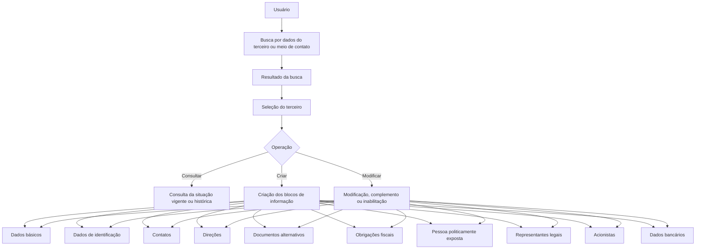
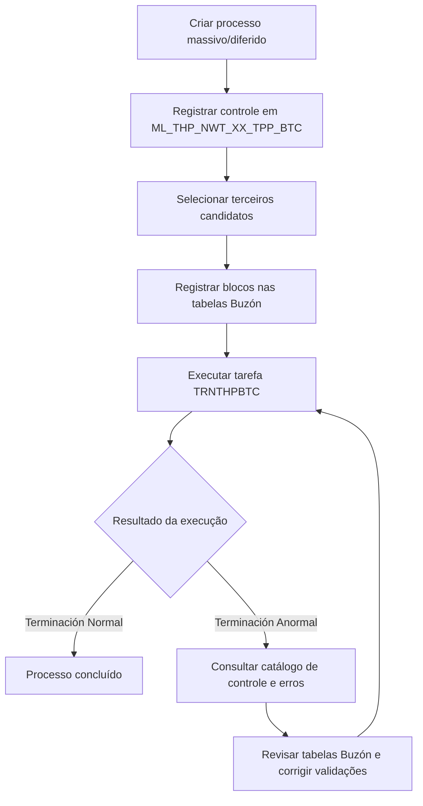
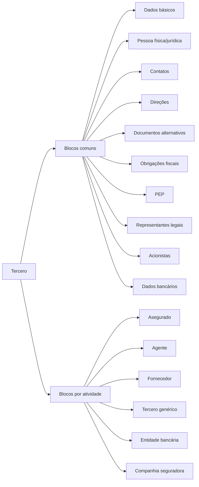

# Reef.core — Módulo de Terceros: Configuração, Operação, Processos Massivos e Dados de Asegurados

## 1. Metadados do Documento
- **Arquivo de Origem:** Não identificado no conteúdo extraído.
- **Tipo de Documento:** Manual Operacional e Especificação Técnica.
- **Domínio / Sistema:** Reef.core / Módulo de Terceros / MAPFRE.
- **Público-Alvo:** Desenvolvedores, Arquitetos, Operação, Analistas Funcionais e Negócio.
- **Data/Versão Identificada:** Não identificada.

---

## 2. Resumo Executivo & Contexto de Negócio

O documento descreve o módulo de **Terceros** do sistema **Reef.core**, utilizado para manter informações de pessoas físicas e jurídicas relacionadas à operação de uma entidade seguradora. O conceito de *Tercero* abrange diversos papéis de negócio, incluindo assegurados, agentes, fornecedores, bancos, seguradoras, resseguradoras, brokers, empregados de agências, níveis da estrutura comercial e terceiros genéricos.

O módulo organiza dados comuns e específicos por código de atividade. Os dados comuns abrangem identificação, contatos, endereços, documentos alternativos, dados bancários, obrigações fiscais, representantes legais, acionistas, pessoas politicamente expostas e classificações. Os dados específicos dependem da atividade do terceiro, como informações de assegurados, consentimentos, perfil analítico, permissões de condução e dados de agentes.

O documento também especifica o processo de tratamento massivo e diferido de terceiros. Esse processo utiliza uma tabela de controle, tabelas-buzón para os blocos de dados e uma tarefa de execução denominada `TRNTHPBTC`. O tratamento suporta operações de alta/criação e modificação, inclusive inabilitação ou reabilitação de terceiros por meio de movimentos de modificação.

A gestão de qualidade, validade temporal, inabilitação e rastreabilidade é transversal. Diversos blocos possuem atributos de data de validade, usuário de atualização, data de modificação, marca de validação e inabilitação. O sistema permite preservar histórico de mudanças e consultar tanto a situação vigente quanto situações históricas, quando a informação estiver historificada.

O conteúdo enfatiza requisitos operacionais de prevenção à lavagem de dinheiro, proteção de dados, identificação de pessoas politicamente expostas, tratamento de terceiros não desejados e controle de informações de pagamento. A entidade seguradora local é responsável pela configuração de catálogos, regras locais, qualidade e coerência dos dados.

---

## 3. Arquitetura, Componentes & Tecnologias Envolvidas

### Componentes e módulos identificados

| Componente / Módulo | Função identificada |
| :--- | :--- |
| `Reef.core` | Núcleo do sistema onde são configurados, criados, modificados, consultados e processados os terceiros. |
| Módulo de Terceros | Módulo funcional para gestão de pessoas físicas e jurídicas, atividades, dados cadastrais e operações associadas. |
| Lanzador de Tareas | Mecanismo para executar tarefas do núcleo, incluindo geração documental e processamento massivo diferido. |
| Tarefa `TRNJVC001` | Tarefa utilizada para gerar e enviar documentos de saída do terceiro conforme a configuração do módulo de notificações e da atividade. |
| Tarefa `TRNTHPBTC` | Tarefa utilizada para executar processos massivos/diferidos do módulo de terceiros. |
| Módulo de Notificaciones | Módulo que deve possuir configuração expressa para a geração e o envio de documentos de saída de terceiros. |
| Catálogos maestros | Catálogos de atividades, documentos, categorias, classificações, países, idiomas, profissões, moedas, consentimentos, cargos, departamentos e outros valores configuráveis. |
| Tabelas Buzón | Estruturas técnicas que recebem dados de criação ou modificação antes da execução do processo massivo. |
| Tabela de controle de processos massivos | Registro mestre de movimentos diferidos e dos terceiros candidatos ao processamento. |
| Catálogo de erros do processo diferido | Estrutura que registra erros técnicos e funcionais do processamento massivo. |

### Fluxo funcional de manutenção de terceiros



### Fluxo do processo massivo/diferido



### Relação entre blocos comuns e específicos



---

## 4. Regras de Negócio, Especificações Funcionais & Processos

### 4.1 Conceito de terceiro

- Pessoas físicas e pessoas jurídicas são tratadas como sinônimos funcionais do conceito de **Tercero** no módulo.
- Os atributos obrigatórios, habilitados e visualizados podem variar por:
  - código de atividade;
  - tipo de terceiro: pessoa física ou pessoa jurídica;
  - configurações locais implementadas pela entidade seguradora;
  - parâmetros de companhia.
- Nem toda atividade permite manter todos os blocos de informação disponíveis no módulo.

### 4.2 Atividades de terceiros identificadas

O documento enumera, entre outras, as seguintes atividades: assegurado, agente, terceiro genérico, supervisor de sinistros, tramitador de sinistros, companhia seguradora, companhia resseguradora, broker de seguros, empregado de agência/agente, companhia, entidade bancária, oficina bancária, primeiro nível da estrutura comercial, segundo nível da estrutura comercial, terceiro nível da estrutura comercial e fornecedor.

### 4.3 Identificação e documentos

- O terceiro é identificado por tipo de documento, chave do documento e código de atividade.
- O código interno do terceiro pode ser atribuído automaticamente pelo sistema ou manualmente, segundo a configuração da atividade.
- É possível relacionar múltiplos documentos a um documento principal.
- O identificador único do terceiro é atribuído automaticamente por lógica de negócio local quando configurado nos parâmetros da companhia.
- O identificador único **não substitui** o código interno do terceiro no Reef.core.
- Documentos principais e alternativos podem possuir data de emissão, data de vencimento, país emissor, marca de comprovação, data de comprovação, observações e data de validade.

### 4.4 Validade, histórico e inabilitação

- A data de validade informa a partir de quando um registro está ou estará operacional.
- O uso da data de validade permite manter histórico de alterações em blocos como contatos, endereços, documentos, acionistas, dados bancários, consentimentos e associações.
- A inabilitação desativa o registro para utilização operacional, sem que isso necessariamente implique sua exclusão física.
- É possível registrar certos dados já inabilitados no momento da criação, como acionistas, obrigações fiscais e documentos alternativos.
- Inabilitação e causa de inabilitação precisam ser coerentes. O documento exemplifica que, se um terceiro está inabilitado, a causa de inabilitação deve ser informada.

### 4.5 Contatos

- Um contato possui uso, tipo, valor, sequência, dados da pessoa de contato, país, cargo, departamento, observações e indicadores de controle.
- A sequência é atribuída automaticamente pelo sistema.
- O valor do contato deve respeitar o tipo:
  - correio eletrônico: formato de e-mail;
  - telefone: formato compatível com planos nacionais de numeração.
- Pode existir apenas:
  - um meio de contato padrão por uso de meio de contato;
  - um meio de contato prioritário para o total de meios de contato do terceiro.
- Um contato pode ser marcado como terceiro de referência quando:
  - o controle de limite de prêmios para prevenção à lavagem de dinheiro estiver ativo na configuração da companhia;
  - o terceiro for pessoa jurídica;
  - estiver indicado que o terceiro deve receber notificações.

### 4.6 Direções

- A estrutura geográfica possui cinco níveis: país, estado, província, cidade/localidade e distrito.
- A direção pode possuir uso, sequência, código postal, tipo de domicílio, texto de endereço, número, complemento, latitude, longitude, direção padrão, marca de comprovação, domicílio fiscal, inabilitação, validade e observações.
- Somente uma direção pode ser marcada como direção padrão.
- Somente uma direção pode ser marcada como domicílio fiscal.
- A captura de **Complemento Dirección** é mutuamente exclusiva com a captura de **Complemento País**.
- O complemento de país permite capturar dados de endereço sem validação quando a informação territorial não existir nos catálogos do sistema.
- Latitude e longitude devem ser informadas em graus, minutos e segundos, acompanhadas da orientação cardinal correspondente.

### 4.7 Dados bancários e meios de cobrança/pagamento

- Os meios de cobrança/pagamento podem representar contas, cartões e outros instrumentos.
- O registro contém tipo, classe, entidade comercializadora, entidade bancária, país, titular, valor mascarado, valor real, valor criptografado, token, moeda, tipo de movimento, uso do movimento, vencimento e indicadores de qualidade.
- Após a validação de um meio de cobrança/pagamento, o sistema permite apenas sua inabilitação; a modificação dos dados deixa de ser permitida.
- Pode existir apenas um meio de cobrança/pagamento padrão para o terceiro.
- Pode existir apenas um meio prioritário por tipo de meio de cobrança/pagamento.

### 4.8 Acionistas

- O bloco de acionistas é aplicável quando o terceiro é pessoa jurídica.
- O acionista pode ser pessoa física ou jurídica.
- A soma dos percentuais acionários de acionistas não inabilitados não pode superar **100%**.
- O bloco é relevante para processos internos relacionados à prevenção de lavagem de ativos monetários.
- Os atributos incluem documento, nacionalidade, nome, sobrenomes ou razão social, datas de alta e baixa, percentual acionário, cargo, validade, marca PEP e inabilitação.

### 4.9 Pessoa politicamente exposta e representantes legais

- A marca de PEP habilita a captura e consulta do painel de informações correspondente.
- O registro de PEP pode identificar o próprio terceiro ou familiar/colaborador relacionado.
- Representantes legais devem estar previamente registrados no sistema e identificados com o código de atividade **45**, conforme o documento.
- Representantes legais podem ser marcados como PEP, pessoa investigada ou pessoa que realizou atividades ilícitas.
- A descrição de atividades ilícitas é aplicável somente quando a respectiva marca estiver ativa.

### 4.10 Terceiro não desejado

- O terceiro pode ser marcado como não desejado por qualidade, setor, ramo, terceiro nível da estrutura comercial, agente, estado, causa e comentários.
- O código genérico `9999` para setor permite marcar o terceiro como não desejado para todos os setores.
- O código genérico `999` para ramo permite marcar o terceiro como não desejado para todos os ramos.
- O código genérico `9999` para terceiro nível da estrutura comercial permite marcar o terceiro como não desejado para todas as oficinas.
- Valores específicos permitem restringir a classificação de terceiro não desejado ao setor, ramo ou oficina selecionado.

### 4.11 Consentimentos

- Consentimento é definido como manifestação de vontade livre, inequívoca, específica e informada para o tratamento de dados pessoais.
- Cada consentimento possui âmbito/tipo, código, tipo de formato, data de início, data de fim, data de validade e inabilitação.
- Exemplos de âmbito: publicidade, cessão de dados e perfilamento.
- Exemplos de formato: não concedido, tácito, expresso e retirado.
- A entidade seguradora deve definir localmente classificações necessárias à sua operação e conformidade com a normativa local de proteção de dados.

### 4.12 Dados específicos do assegurado

- A informação específica do assegurado inclui classificação, qualidade, agrupamento comercial, retenção, forma de cobrança/pagamento, dia sugerido para pagamento, inabilitação, causa, observações, avisos operacionais, prêmio acima de limite, moeda, número de empregados, faturamento, grupo empresarial, rating, oficina comercial, data de registro, zona horária, fidelização, Robinson e VIP.
- A data de registro representa a data real de entrega da documentação solicitada pela seguradora; não deve ser confundida com a data de captura do assegurado no sistema.
- Quando o controle de prevenção à lavagem de dinheiro estiver ativo e o terceiro for pessoa jurídica, o aviso de operações pode exigir um contato previamente identificado como terceiro de referência.
- A marca Robinson determina se o assegurado deve ou não ser incluído em processos de contato ou comunicação, conforme os consentimentos concedidos.

### 4.13 Perfil analítico

- A carga e o cálculo do perfil analítico são responsabilidade local da entidade seguradora.
- Canal preferido, dispositivo preferido, dispositivo web e segmentação de cliente devem utilizar códigos existentes nos catálogos mestres.
- CLTV representa previsão do valor monetário que a empresa espera receber do cliente durante sua relação.
- Na ausência de CLTV, o documento orienta utilizar margem de contribuição e, se ela também não estiver disponível, o ratio combinado.
- O perfil inclui indicadores de abandono, up selling, cross selling, saturação, relação, integralidade, beneficiários, crédito, comportamento digital, seguidores, inscritos, uso de aplicativos e segmentação.

### 4.14 Processo de geração de documentação

- A geração e envio de documentos de saída depende:
  - da configuração expressa no módulo de notificações;
  - de a atividade do terceiro possuir essa funcionalidade habilitada.
- A tarefa de núcleo utilizada é `TRNJVC001`.
- A execução utiliza atributos como código de companhia, filtro/operação, atividade do terceiro, tipo de documento identificador e chave do documento identificador.
- O usuário pode modificar os dados apresentados como critérios de execução antes de confirmar a tarefa.

### 4.15 Processo massivo/diferido

1. Criar o movimento diferido na tabela de controle.
2. Registrar a companhia, identificador do processo, data de tratamento, ordem e hilo.
3. Selecionar os terceiros candidatos e definir alta ou modificação.
4. Registrar os dados de criação ou alteração nas tabelas Buzón pertinentes.
5. Garantir a coerência entre tabelas Buzón e atributos.
6. Executar a tarefa `TRNTHPBTC`.
7. Consultar o histórico de execução:
   - `Terminación Normal`: execução concluída sem erros;
   - `Terminación Anormal`: revisar situação do processo e o catálogo de erros.
8. Corrigir os dados das tabelas Buzón que provocaram falhas de validação.
9. Reexecutar o processo até obter o resultado final.
10. A revisão do processo requer participação da área de Tecnologia da MAPFRE local.

### 4.16 Estados de seleção de candidatos em processos massivos

| Código | Situação do Processo |
| :--- | :--- |
| `1` | Sin Filtrar |
| `2` | Detalle Filtrado |
| `3` | Excepcionando |
| `4` | Ya Excepcionado |
| `5` | Ya Tratado |

---

## 5. Tabelas de Parâmetros, Ambientes e Estruturas de Dados

### 5.1 Tarefas do núcleo

| Item / Parâmetro | Descrição / Função | Tipo / Valores / Formato | Ambiente / Observações |
| :--- | :--- | :--- | :--- |
| `TRNJVC001` | Geração de documentação de saída do terceiro. | Tarefa do núcleo. | Requer configuração no módulo de notificações e atividade habilitada. |
| `TRNTHPBTC` | Execução do processo massivo/diferido de terceiros. | Tarefa do núcleo. | Executada após preenchimento das tabelas Buzón. |
| Terminación Normal | Resultado de execução sem erros. | Situação no histórico de execução. | Indica conclusão correta. |
| Terminación Anormal | Resultado de execução com erro. | Situação no histórico de execução. | Requer análise de processo, erros e dados Buzón. |

### 5.2 Tabelas técnicas identificadas

| Item / Parâmetro | Descrição / Função | Tipo / Valores / Formato | Ambiente / Observações |
| :--- | :--- | :--- | :--- |
| `ML_THP_NWT_XX_TPP_BTC` | Tabela de controle de processos massivos de terceiros. | Controle de movimento diferido e candidatos. | Utilizada para criação e seleção de candidatos. |
| `ML_THP_NWT_XX_TPP_BTC_ERR` | Tabela Buzón de erros de processos batch de terceiros. | Registro de erros. | Inclui rota, observação, sequência e identificador de erro. |
| `ML_THP_NWT_XX_SHL` | Tabela Buzón de acionistas. | Dados de acionistas. | Inclui PEP, participação, datas e inabilitação. |
| `T_THP_TRN_M_ACV` | Tabela Buzón de atividades de um terceiro. | Dados de atividades. | Suporta relações e ação de origem. |
| `T_THP_TRN_M_AGN` | Tabela Buzón de agente. | Informações específicas de agente. | Inclui contrato, credencial, retenção e situação. |
| `ML_THP_NWT_XX_UNI` | Tabela Buzón de atribuição de assegurado não desejado. | Classificação de terceiro não desejado. | Inclui setor, ramo, níveis comerciais, agente, causa e estado. |
| `T_THP_TRN_M_INY` | Tabela Buzón de terceiro assegurado. | Dados específicos de assegurado. | Inclui fidelização, Robinson, VIP e dados financeiros. |
| `ML_THP_NWT_XX_TMN` | Tabela Buzón de consentimento de cliente. | Consentimentos. | Inclui código, tipo, forma, datas e inabilitação. |
| `ML_THP_NWT_XX_CNT` | Tabela Buzón de contatos de terceiros. | Contatos. | Inclui sequência, tipo, uso, validação e referência. |
| `ML_THP_NWT_XX_ADR` | Tabela Buzón de direções de terceiros. | Direções. | Inclui geografia, coordenadas, padrão, fiscal e validação. |
| `ML_THP_NWT_XX_ARM` | Tabela Buzón de documentos alternativos. | Documentação complementar. | Inclui emissão, vencimento, país emissor e comprovação. |
| `T_THP_TRN_M_LCN` | Tabela Buzón de licenças de um terceiro. | Licença/permissão de condução. | Inclui situação, expedição e zona geográfica. |
| `ML_THP_NWT_XX_PCM` | Tabela Buzón de meios de pagamento e cobrança. | Dados bancários. | Inclui valor criptografado, token, movimento, moeda e validade. |
| `ML_THP_NWT_XX_TXL_CNY` | Tabela Buzón de países com obrigações fiscais. | Obrigações tributárias em outros países. | Inclui país, identificador tributário, alta e inabilitação. |
| `ML_TPD_NWT_XX_ALP` | Tabela Buzón de perfil analítico. | Atributos analíticos do assegurado. | Inclui CLTV, probabilidades, comportamento digital e segmentação. |
| `T_THP_TRN_M_PRS` | Tabela Buzón de pessoa. | Dados pessoais/físicos/jurídicos. | Inclui identificação, filiação, dados econômicos e verificação documental. |
| `ML_THP_NWT_XX_PRS_PCE` | Tabela Buzón de pessoas politicamente expostas. | Dados PEP. | Inclui relação, datas e inabilitação. |
| `ML_THP_NWT_XX_LGR` | Tabela Buzón de representantes legais. | Representantes legais. | Inclui PEP, pessoa investigada e atividades ilícitas. |
| `ML_TRN_NWT_XX_GTP` | Tabela Buzón de terceiro genérico. | Dados de terceiro genérico. | Inclui tipologia, categoria de fornecedor e contrato. |

### 5.3 Campos de controle recorrentes nas tabelas Buzón

| Item / Parâmetro | Descrição / Função | Tipo / Valores / Formato | Ambiente / Observações |
| :--- | :--- | :--- | :--- |
| `CMP_VAL` | Companhia. | Obrigatório em diversas tabelas. | Identifica a entidade seguradora. |
| `BTC_IDN_VAL` / `IDN_VAL` | Identificador. | Obrigatório. | Identificador do processo ou registro. |
| `SQN_VAL` / `IDN_SQN` | Sequência. | Obrigatório em diversas tabelas. | Sequência dentro do identificador. |
| `PRC_THD_VAL` | Hilo do processo. | Obrigatório ou opcional, conforme tabela. | Permite processamento simultâneo em cenários massivos. |
| `PRC_STS_VAL` | Situação do processo. | Inicialmente `1` em tabelas de controle. | Controle de processamento. |
| `THP_DCM_TYP_VAL` | Tipo de documento do terceiro. | Obrigatório em diversos Buzón. | Identificação do terceiro. |
| `THP_DCM_VAL` | Documento do terceiro. | Obrigatório em diversos Buzón. | Chave de identificação. |
| `THP_ACV_VAL` | Atividade do terceiro. | Obrigatório em diversas tabelas. | Determina contexto funcional. |
| `DSB_ROW` | Fila desabilitada. | Indicador. | Inabilita o registro Buzón. |
| `USR_VAL` | Usuário que atualizou a fila. | Obrigatório em diversas tabelas. | Rastreabilidade. |
| `MDF_DAT` / `MDF_VAL` | Data de modificação. | Obrigatório em diversas tabelas. | Rastreabilidade temporal. |
| `ACN_ORG_VAL` | Ação de origem. | Valores descritos incluem `(I)NSERTAR` e `(M)ODIFICAR`. | Indicador de primeira ação no registro. |
| `ERR_IDN_VAL` | Identificador/código interno do erro. | Opcional em diversas tabelas. | Usado para rastrear falhas de processamento. |

### 5.4 Valores e exemplos explícitos

| Item / Parâmetro | Descrição / Função | Tipo / Valores / Formato | Ambiente / Observações |
| :--- | :--- | :--- | :--- |
| Tipo de movimento massivo | Operação sobre o terceiro. | Alta; Modificación. | Inabilitação e reabilitação devem ser implementadas como modificação. |
| Situação inicial do processo | Estado anterior à execução. | `1 - Sin Filtrar` ou `1 - Sin Procesar`, conforme contexto documentado. | O documento utiliza ambas as descrições em estruturas diferentes. |
| Setor genérico de terceiro não desejado | Aplicação global a setores. | `9999`. | Marca o terceiro como não desejado para todos os setores. |
| Ramo genérico de terceiro não desejado | Aplicação global a ramos. | `999`. | Marca o terceiro como não desejado para todos os ramos. |
| Escritório genérico de terceiro não desejado | Aplicação global às oficinas. | `9999`. | Marca o terceiro como não desejado para todas as oficinas. |
| Tipo de consentimento | Âmbito de aplicação do consentimento. | `001 Publicidad`; `002 Cesión de Datos`; `003 Perfilado`. | Exemplos de códigos locais. |
| Formato de consentimento | Forma/status do consentimento. | `001 No Otorgado`; `002 Tácito`; `003 Expreso`; `004 Retirado`. | Exemplos de códigos locais. |
| Tipo de documento | Exemplos apresentados. | NIF, DNI, RFC, RUT, TIN. | Os exemplos variam por país. |
| Dados bancários validados | Restrição pós-validação. | Apenas inabilitação permitida. | Alteração não é permitida após validação. |

---

## 6. Bateria de Perguntas & Respostas para RAG (FAQ Sintético)

### P1: Como é executado um processo massivo de terceiros no Reef.core?
**R:** O processo massivo é executado após o registro do movimento diferido na tabela de controle, a seleção dos terceiros candidatos e o preenchimento das tabelas Buzón com dados de alta ou modificação. A execução ocorre pela tarefa `TRNTHPBTC` no Lanzador de Tareas. Após a execução, deve-se verificar o histórico: `Terminación Normal` indica sucesso; `Terminación Anormal` exige consulta ao catálogo de controle e à tabela de erros, correção dos dados Buzón e nova execução.

### P2: Quais operações estão disponíveis para terceiros em um processo massivo?
**R:** O processo massivo contempla as operações de **Alta/Creación** e **Modificación**. Alterações específicas para inabilitar ou reabilitar um terceiro devem ser implementadas com o tipo de movimento **Modificación**.

### P3: Qual tabela controla os processos massivos de terceiros?
**R:** A tabela `ML_THP_NWT_XX_TPP_BTC` é a tabela de controle de processos massivos de terceiros. Ela registra companhia, identificador do processo, data de tratamento, número de ordem, hilo, tipo de movimento batch, documento, atividade e situação do processo.

### P4: Quais são os estados possíveis para um terceiro candidato em um processo massivo?
**R:** Os estados documentados são: `1. Sin Filtrar`, `2. Detalle Filtrado`, `3. Excepcionando`, `4. Ya Excepcionado` e `5. Ya Tratado`. Antes da execução, a situação inicial é indicada como valor `1`.

### P5: O que ocorre após a validação de um meio de cobrança ou pagamento?
**R:** Após a comprovação e validação de um meio de cobrança/pagamento, o sistema permite apenas sua inabilitação. A modificação dos dados do meio de cobrança/pagamento validado não é permitida.

### P6: Como funciona a regra de meio de contato padrão e prioritário?
**R:** Para cada uso de meio de contato, somente um registro pode ser marcado como meio de contato padrão. Para o conjunto total de meios de contato associados ao terceiro, somente um registro pode ser marcado como prioritário.

### P7: Qual é a regra para o percentual de participação de acionistas?
**R:** A soma dos percentuais acionários dos acionistas que não estejam inabilitados não pode superar 100%.

### P8: Em que condições um contato pode ser marcado como terceiro de referência?
**R:** O contato pode ser marcado como terceiro de referência quando o controle de limite de prêmios para prevenção à lavagem de dinheiro estiver ativo na configuração da companhia, o terceiro for pessoa jurídica e estiver indicado que o terceiro deve receber notificações.

### P9: Qual a diferença entre o identificador único do terceiro e o código do terceiro?
**R:** O identificador único é atribuído automaticamente por lógica de negócio local quando a companhia configura a necessidade de identificação unívoca entre aplicações. Ele apoia rastreabilidade, integração e cruzamento de dados. O identificador único não substitui o código interno do terceiro, que pertence ao uso interno do Reef.core.

### P10: Como o sistema trata um terceiro não desejado para todos os setores, ramos ou oficinas?
**R:** Para todos os setores, utiliza-se o código genérico `9999`; para todos os ramos, o código `999`; e para todas as oficinas do terceiro nível da estrutura comercial, utiliza-se o código `9999`. Códigos específicos restringem a classificação ao respectivo setor, ramo ou escritório.

### P11: Quais dados são tratados no bloco de Pessoa Politicamente Exposta?
**R:** O bloco registra se o terceiro ou uma pessoa relacionada é PEP, data de alta, data de baixa, identificação de familiar ou colaborador, cargo ou relação, documento da pessoa relacionada e inabilitação. A marca PEP habilita o painel específico de informação.

### P12: Quais são os pré-requisitos para gerar documentos de saída de um terceiro?
**R:** A geração requer configuração expressa no módulo de notificações e habilitação da funcionalidade no código de atividade do terceiro. A tarefa utilizada é `TRNJVC001`, executada com atributos como companhia, operação, atividade, tipo de documento e chave do documento.

---

## 7. Glossário de Termos, Siglas & Conceitos-Chave

- **Asegurado:** Terceiro que atua como segurado ou cliente da entidade seguradora.
- **Buzón:** Tabela técnica intermediária usada para registrar dados que serão processados em operações diferidas ou massivas.
- **CLTV:** *Customer Lifetime Value*; previsão do valor monetário esperado de um cliente durante toda a relação com a empresa.
- **Código de Actividad:** Código que identifica o papel funcional do terceiro, como assegurado, agente ou fornecedor.
- **Contacto Prioritario:** Meio de contato preferencial para processos operacionais da entidade.
- **Contacto por Defecto:** Meio de contato padrão para um determinado uso de contato.
- **Data de Validade:** Data a partir da qual um registro está ou estará operacional no sistema.
- **DSB_ROW:** Indicador de fila/registro desabilitado.
- **Inhabilitación:** Estado que torna um registro inativo para utilização em processos operacionais.
- **Lanzador de Tareas:** Componente usado para executar tarefas de núcleo do Reef.core.
- **Movimento Diferido:** Registro de criação ou modificação que será processado posteriormente.
- **PEP / Persona Políticamente Expuesta:** Terceiro ou pessoa relacionada identificada como pessoa politicamente exposta.
- **Reef.core:** Sistema/núcleo funcional citado no documento.
- **RAG:** Retrieval-Augmented Generation; abordagem de recuperação de informações para geração de respostas.
- **Tercero:** Pessoa física ou jurídica administrada pelo módulo, com uma ou mais atividades.
- **Tercero de Referencia:** Contato destinado a receber notificações em condições específicas de prevenção à lavagem de dinheiro.
- **Tercero No Deseado:** Terceiro classificado como não desejado conforme qualidade, setor, ramo, escritório, agente, estado e causa.
- **TRNTHPBTC:** Tarefa utilizada para executar o processo massivo/diferido de terceiros.
- **TRNJVC001:** Tarefa utilizada para gerar documentação de saída do terceiro.
- **VLD_DAT:** Campo técnico de data de validade.
- **VIP:** Marca que identifica o assegurado como cliente importante.

---

## 8. Notas Críticas, Riscos & Limitações

- **Configuração local obrigatória:** Catálogos, códigos, classificações, obrigatoriedades e habilitações podem variar por entidade seguradora, código de atividade, tipo de pessoa e adaptações locais.
- **Qualidade dos dados:** A entidade seguradora é responsável pela qualidade e coerência dos dados do perfil analítico e pelas classificações configuradas localmente.
- **Coerência entre Buzón:** O documento exige coerência total entre tabelas Buzón e atributos. Exemplos: um terceiro inabilitado deve possuir causa de inabilitação; assegurados com obrigações fiscais devem possuir dados no bloco correspondente.
- **Dados bancários sensíveis:** O documento referencia valor real, valor mascarado e valor criptografado de meios de cobrança/pagamento. A operação deve observar controles de acesso, criptografia e tratamento de dados sensíveis, embora mecanismos técnicos específicos não sejam detalhados.
- **Processamento massivo:** Uma execução anormal demanda análise de erros, correção dos Buzón e reexecuções sucessivas. A revisão depende da participação da área de Tecnologia local da MAPFRE.
- **Histórico:** A disponibilidade de consulta histórica depende de a informação estar historificada.
- **Restrições de modificação:** Dados bancários validados não podem ser modificados; somente podem ser inabilitados.
- **Representantes legais:** O documento afirma que o representante legal deve estar previamente registrado e identificado com código de atividade `45`, mas não detalha o significado funcional desse código.
- **Notas de análise:** O texto descreve componentes funcionais e tabelas de dados, mas não detalha contratos de APIs, métodos HTTP, URLs, autenticação, portas, versões de banco de dados ou mecanismos físicos de integração.
- **Notas de análise:** O conteúdo inclui exemplos de códigos e valores locais; esses exemplos não devem ser tratados como catálogo corporativo universal sem validação na instalação Reef.core correspondente.

---

## 9. Conteúdo Bruto Estruturado (Referência Fiel)

```text
--- [PÁGINAS 1 A 5] ---

Configuração de zonas geográficas de fornecedores:
- Associação entre zonas geográficas e estrutura geográfica.
- Inabilitação desativa associações e registros.
- Data de validade define a operacionalidade e permite histórico.
- Definição de zonas por atividade, tipologia e categoria de fornecedor.
- Atributos: companhia, código de atividade, tipologia, categoria e código de zona.
- Definição de zonas geográficas configuradas para fornecedores.
- Atributos: companhia, tipo de zona, código de zona, idioma e descrição.
- Não existe preferência global de codificação; MAPFRE deve avaliar utilização transversal.
- Exemplo de separação recomendada: zonas de tarifas e zonas de atribuição.

--- [PÁGINAS 6 A 10] ---

Definições de terceiros por código de atividade:
- Configurações prévias: parâmetros de instalação e parâmetros do módulo de terceiros.
- Definições comuns e catálogos de terceiros.
- Atividades identificadas: assegurado, agente, terceiro genérico, supervisor, tramitador,
  companhia seguradora, companhia resseguradora, broker, empregado de agência/agente,
  companhia, entidade bancária, oficina bancária e níveis da estrutura comercial.
- Catálogos comuns: atividades, obrigatoriedade de campos, documentos identificadores,
  agrupamentos, categorias, classificações, qualidade, cobrança/pagamento, tokens,
  regimes fiscais, ratings, perfis financeiros, impostos, relações, departamentos,
  cargos PEP, consentimentos, causas e motivos de inabilitação.
- Catálogos específicos para pessoas físicas: licença, profissões, titulações e estudos.
- Catálogos específicos para pessoas jurídicas: cargos, atividades econômicas e tipos de pessoas jurídicas.

--- [PÁGINAS 11 A 12] ---

Geração de documentação do terceiro:
- Tarefa: TRNJVC001.
- Pré-requisitos: configuração no módulo de notificações e atividade habilitada.
- Critérios: companhia, operação, atividade, tipo de documento identificador e chave do documento.
- Exemplos de documento: NIF, DNI, RFC, RUT e TIN.

--- [PÁGINAS 13 A 58] ---

Visão técnica do processamento massivo:
- Tabela de controle: ML_THP_NWT_XX_TPP_BTC.
- Tabela de erros: ML_THP_NWT_XX_TPP_BTC_ERR.
- Tabelas Buzón: acionistas, atividades, agentes, assegurado não desejado, assegurado,
  consentimentos, contatos, direções, documentos alternativos, licenças,
  meios de pagamento/cobrança, obrigações fiscais, perfil analítico, pessoa,
  PEP, representantes legais e terceiro genérico.
- Campos recorrentes: companhia, identificador, sequência, hilo, situação,
  documento, atividade, usuário, data de modificação, ação de origem e identificador de erro.
- A situação inicial de registros de processo é documentada com valor 1.

--- [PÁGINAS 59 A 66] ---

Criação e seleção de processos massivos:
- O movimento diferido pode executar alta/criação ou modificação.
- A tabela de controle contém identificação do processo e dados básicos do terceiro.
- Hilos possibilitam processamento simultâneo para reduzir a janela de execução.
- A coerência entre Buzón e atributos é obrigatória.
- A tarefa TRNTHPBTC executa os processos diferidos.
- Resultado normal: Terminación Normal.
- Resultado anormal: Terminación Anormal; requer correção e nova execução.
- Estados: Sin Filtrar, Detalle Filtrado, Excepcionando, Ya Excepcionado e Ya Tratado.

--- [PÁGINAS 67 A 98] ---

Consultas de terceiros:
- Consulta de acionistas, contatos, dados bancários, dados básicos, pessoa física/jurídica,
  direções, documentos alternativos, obrigações fiscais, PEP e representantes legais.
- Busca por dados do terceiro ou por meio de contato.
- Busca por parte ou total do valor, sem distinção entre maiúsculas e minúsculas.
- Consulta de situação vigente e consulta histórica quando disponível.
- Não há limitação de consulta vinculada ao perfil do usuário segundo o texto.

--- [PÁGINAS 99 A 129] ---

Criação de informações de terceiros:
- Criação de acionistas, contatos, dados bancários, dados básicos, pessoa física/jurídica,
  direções, documentos alternativos, terceiro não desejado, obrigações fiscais, PEP
  e representantes legais.
- Regra: percentuais de acionistas não inabilitados não podem ultrapassar 100%.
- Regra: apenas um contato padrão por uso e um contato prioritário para o terceiro.
- Regra: direção padrão e domicílio fiscal são únicos.
- Regra: complemento de direção e complemento de país são mutuamente exclusivos.
- Regra: após validação bancária, o meio somente pode ser inabilitado.

--- [PÁGINAS 130 A 164] ---

Modificação de terceiros:
- Modificação, complemento, criação adicional e inabilitação de blocos de informação.
- Regras de pessoa física/jurídica, documentos, contatos, direções, dados bancários,
  obrigações fiscais, PEP, representantes legais, acionistas e terceiro não desejado.
- O comportamento depende de atividade, tipologia e adaptações locais.

--- [PÁGINAS 165 A 195] ---

Asegurados:
- Consulta e modificação de perfil analítico.
- Criação e modificação de consentimentos.
- Criação e modificação de dados específicos do assegurado.
- Criação e modificação de licença de condução.
- Criação e modificação de assegurado não desejado.
- Criação de assegurado a partir de outro terceiro, sem trasladar dados bancários.
- Perfil analítico inclui CLTV, abandono, up selling, cross selling, saturação,
  relacionamento, integralidade, comportamento web, dispositivos, seguidores,
  inscritos, aplicativos e segmentação.

--- [PÁGINAS 196 A 200] ---

Agentes e comissões:
- Consulta de empregados de agência ou agente.
- Consulta de agentes em situação vigente e histórico por data de validade.
- Criação de quadros de comissões para agentes.
- Atributos: chave do agente, tratamento de emissão, quadro de comissões,
  processo inabilitado, inabilitação e data de validade.
- Nova produção: comissão recebida exclusivamente durante o primeiro ano de vigência da apólice.
- Carteira: comissão vinculada a apólices vigentes em anos sucessivos.
```
