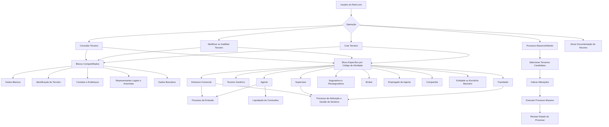
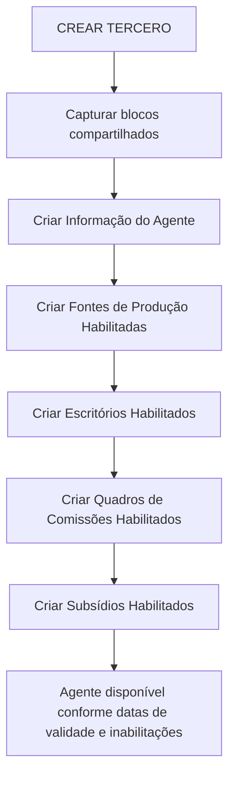
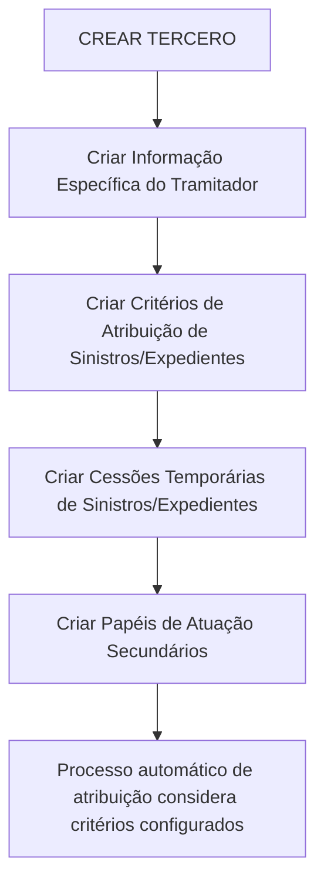

# Reef.core — Módulo de Terceiros: Operações, Cadastro, Estruturas Comerciais e Gestão de Sinistros

## 1. Metadados do Documento
- **Arquivo de Origem:** Não identificado no conteúdo extraído.
- **Tipo de Documento:** Manual Operacional / Documentação Funcional.
- **Domínio / Sistema:** Reef.core — Módulo de Terceros / Terceiros.
- **Público-Alvo:** Desenvolvedores, arquitetos, operação, analistas funcionais, áreas de negócio e suporte de seguradora.
- **Data/Versão Identificada:** Não identificada.
- **Owner identificado:** `user:agonzalez_mapfre.com`.
- **Lifecycle identificado:** Approved.

---

## 2. Resumo Executivo & Contexto de Negócio

O documento descreve as operações funcionais do módulo de **Terceiros** do sistema **Reef.core**. No contexto do documento, “Tercero” é o termo genérico usado para Pessoas Físicas e Pessoas Jurídicas cadastradas e utilizadas nos processos de uma entidade seguradora. O módulo permite criar, modificar, inabilitar, consultar e, em determinados casos, processar alterações em massa para diferentes perfis de terceiros.

Os principais perfis cobertos incluem segurados/clientes, agentes, terceiros genéricos, supervisores de sinistros, tramitadores de sinistros, seguradoras, resseguradoras, brokers, empregados de agentes, companhias do grupo MAPFRE, entidades bancárias, agências bancárias e níveis da estrutura comercial. Cada perfil possui blocos compartilhados de dados de terceiros e blocos específicos vinculados ao respectivo código de atividade.

O documento enfatiza que a obrigatoriedade, habilitação e sequência de captura dos campos podem variar conforme o código de atividade do terceiro, o tipo de pessoa — física ou jurídica —, customizações locais e o critério de navegação adotado pelo usuário. Portanto, as telas, os campos obrigatórios e o comportamento operacional podem não ser uniformes entre instalações da solução Reef.core.

A gestão de agentes suporta elementos comerciais e financeiros como fontes de produção, escritórios comerciais habilitados, quadros de comissão, subsídios, contrato, forma de cobrança/pagamento, retenções, classificações, credenciais profissionais e inabilitação. A gestão de sinistros abrange supervisores e tramitadores, incluindo critérios automáticos de distribuição de sinistros, cessões temporárias de expedientes e papéis secundários de atuação.

A documentação também descreve a estrutura comercial em três níveis, a gestão de entidades bancárias e respectivos escritórios, bem como operações online, operações em diferido e geração de documentação de terceiros. Não são apresentados contratos de API, métodos HTTP, URLs de ambientes, tecnologias de persistência, topologias de infraestrutura ou detalhes de implementação técnica.

---

## 3. Arquitetura, Componentes & Tecnologias Envolvidas

### Componentes funcionais identificados

| Componente / Domínio | Responsabilidade descrita |
| :--- | :--- |
| **Reef.core** | Sistema que mantém o módulo de Terceiros, catálogos mestres, processos operacionais, emissão, gestão de sinistros, comissões e atribuição automática de sinistros. |
| **Módulo de Terceiros** | Cadastro, alteração, inabilitação, consulta, processamento massivo e geração de documentação para pessoas físicas e jurídicas. |
| **Blocos compartilhados de Terceiro** | Dados Básicos, Identificação do Terceiro, Pessoa Politicamente Exposta, Contatos, Endereços, Documentos Alternativos, Representantes Legais, Acionistas e Dados Bancários. |
| **Blocos específicos por atividade** | Informações específicas do agente, tramitador, supervisor, broker, seguradora, resseguradora, entidade bancária, companhia, estrutura comercial e outros perfis. |
| **Estrutura Comercial** | Hierarquia formada por Primeiro Nível, Segundo Nível e Terceiro Nível, utilizada em emissão, alocação e especialização de sinistros. |
| **Estrutura de Produtos** | Fonte de setores, ramos técnicos, tratamentos de emissão e tipos de expediente usados em critérios de comissão e gestão de sinistros. |
| **Processo de Emissão** | Utiliza agentes, fontes de produção, escritórios comerciais, tratamentos de emissão, quadros de comissão e níveis comerciais habilitados. |
| **Liquidação de Comissões** | Considera quadros de comissão, exclusão de comissões, subsídios, conceitos de ajuste e inabilitações. |
| **Processo Automático de Atribuição de Sinistros** | Considera critérios de especialização configurados para tramitadores. |
| **Módulo de Juízos** | Referenciado para a atribuição de sinistros ou expedientes que estejam em processo judicial. |
| **RE21** | Sistema de resseguro citado como referência para o código de companhia de resseguro externa. |
| **Sistema Contábil Corporativo** | Referenciado como origem do identificador societário da companhia. |

### Fluxo funcional de manutenção de terceiros



### Fluxo de criação de um agente



### Fluxo de configuração de tramitador



> **Nota de Análise:** o documento descreve relações funcionais entre módulos e processos, mas não detalha interfaces de integração, protocolos, APIs, bancos de dados, tecnologias de mensageria, servidores, ambientes, URLs ou mecanismos de autenticação.

---

## 4. Regras de Negócio, Especificações Funcionais & Processos

### 4.1 Regras comuns para todos os terceiros

1. O sistema trata **Pessoas Físicas** e **Pessoas Jurídicas** como sinônimos funcionais do termo **Terceiros**.
2. A obrigatoriedade e a habilitação dos campos podem variar conforme:
   - código de atividade do terceiro;
   - tipo de terceiro: Pessoa Física ou Pessoa Jurídica;
   - modificações implementadas localmente;
   - critério do usuário para a sequência de captura dos blocos.
3. O uso correto do campo **Fecha de Validez** permite manter histórico de alterações de configuração e informação.
4. A marca de **Inhabilitación** indica que o terceiro não deve ser usado, considerado ou contemplado em parte ou na totalidade dos processos operacionais aplicáveis.
5. Quando um terceiro estiver inabilitado, a respectiva **Causa de Inhabilitación** deve referenciar um código previamente definido no catálogo mestre do sistema.
6. As operações funcionais são normalmente organizadas em:
   - criação;
   - modificação;
   - inabilitação;
   - consulta;
   - em alguns casos, exclusão ou reabilitação.
7. O documento não especifica validações obrigatórias de formato, tamanho, unicidade, chaves primárias ou mensagens de erro para os campos.

### 4.2 Agentes

#### Fontes de produção habilitadas

- Todo agente configurado possui uma fonte de produção da estrutura de canais normalmente mais utilizada.
- A fonte de produção principal é apresentada por padrão no processo de emissão de apólices.
- Fontes complementares podem ser cadastradas para permitir a comercialização de apólices através de outros canais.
- Uma fonte de produção inabilitada deixa de ser utilizável no processo de emissão para movimentos de nova produção.
- Apólices que já possuíam a fonte de produção previamente atribuída são preservadas.

#### Informações específicas do agente

- A ativação de **¿Productor Directo?** qualifica o terceiro como produtor direto.
- A situação do agente pode ser configurada como:
  - `1`: Agente Ativo;
  - `2`: Agente Inativo;
  - `3`: Agente Retirado.
- O código de **Ejecutivo de Cuenta** deve corresponder a um terceiro configurado com código de atividade `11`.
- Os códigos de **Asesor Comercial** e **Organizador Comercial** devem corresponder a terceiros configurados com código de atividade `2`.
- A exclusão de comissões retira o agente do processo de pagamento da liquidação de comissões por questões comerciais.
- A forma de gestão precisa manter coerência com as operações que a seguradora habilitou para o agente.
- Caso a entidade utilize o conceito de **Primas Avisadas**, o campo correspondente define se o agente está habilitado a realizar essa operação.
- O agente pode ser registrado ou modificado como **Tercero No Deseado** conforme código de atividade e atributos de identificação.

#### Escritórios comerciais habilitados para o agente

- O agente possui um escritório comercial associado na estrutura comercial.
- A associação normalmente é única, mas escritórios complementares podem ser habilitados por razões comerciais.
- A inabilitação de um escritório complementar impede seu uso em emissão para nova produção, sem alterar apólices previamente associadas.

#### Quadros de comissão

- Um quadro de comissão relaciona:
  - chave do agente;
  - código de tratamento de emissão;
  - quadro de comissões;
  - processo inabilitado;
  - inabilitação;
  - data de validade.
- O processo inabilitado pode atingir:
  - somente apólices de nova produção; ou
  - movimentos de nova produção e suplementos/movimentos de carteira.
- **Comissões de nova produção** são percebidas exclusivamente no primeiro ano de vigência da apólice e, em geral, possuem maior valor.
- **Comissões de carteira** são originadas em apólices vigentes nos anos subsequentes e permanecem enquanto as apólices estiverem vigentes.

#### Subsídios habilitados para o agente

- A classificação de subsídio possui dois valores documentados:
  - `1`: Subsídio Mensal;
  - `2`: Aplicação no Cobro e Anulado de Cobro de Recibos.
- A forma de aplicação possui três valores documentados:
  - `1`: Importe, conforme a moeda da definição;
  - `2`: Porcentagem;
  - `3`: Lógica de Negócio.
- O conceito de ajuste associado ao subsídio deve possuir agrupamento contábil do tipo `MP`.
- O valor mínimo de cobrança aplica-se quando a classificação for subsídio mensal.
- A lógica de negócio pode calcular dinamicamente o valor ou percentual do subsídio.
- O percentual incide sobre o total das comissões do agente.
- Um subsídio inabilitado não pode ser usado no processo de liquidação de comissões.

### 4.3 Terceiros genéricos

- São terceiros cujas atividades podem incluir peritos, inspetores, médicos, advogados, procuradores, fornecedores, cobradores, oficinas, clínicas, tribunais e outros perfis listados pelo catálogo de atividades.
- Os campos específicos abrangem:
  - escritório comercial associado;
  - agrupamento comercial do segurado;
  - compensação;
  - qualidade;
  - tipo de retenção;
  - validade;
  - inabilitação e causa;
  - classificação;
  - número de inscrição profissional;
  - identificação fiscal;
  - IVA;
  - observações.
- Na modificação, a data de validade deve ser igual ou posterior à data registrada anteriormente.
- O terceiro genérico também pode ser classificado como terceiro não desejado.

### 4.4 Supervisores de sinistros

- O supervisor é identificado por um código herdado dos Dados Básicos do Terceiro.
- O código do usuário identifica o supervisor no sistema.
- O supervisor é associado ao Terceiro Nível da Estrutura Comercial.
- O número de sinistros atribuídos é atualizado sempre que um sinistro é aberto, encerrado, atribuído ou reatribuído.
- Na captura inicial do supervisor, o número de sinistros atribuídos não apresenta informação.
- O campo **Supervisor Responsable** indica se o supervisor possui responsabilidade por outro supervisor ou grupo de supervisores.
- A inabilitação do supervisor deve estar coerente com o estado do supervisor.

### 4.5 Tramitadores de sinistros

#### Informações específicas

- O tramitador possui código de usuário para acesso ao sistema.
- A tipologia do tramitador deve ser um dos tipos configurados para Reef.core.
- O tramitador é associado a:
  - Terceiro Nível da Estrutura Comercial;
  - supervisor;
  - estado do tramitador.
- O número de expedientes atribuídos é atualizado em abertura, encerramento, atribuição ou reatribuição de expediente.
- O número máximo de expedientes define o limite de expedientes ativos e pendentes que o tramitador pode administrar simultaneamente.
- A marca **Pregunta Consecuencias?** altera o comportamento do Reef.core para apresentar perguntas associadas às consequências, em vez de descrições das consequências, nos sinistros atribuídos.
- A marca **Modifica Fecha de Control** habilita o tramitador a modificar a data de controle na gestão de sinistros e expedientes, desde que a companhia utilize data de controle nos planos de tramitação.
- A inabilitação e a causa de inabilitação devem estar coerentes com o estado do tramitador.

#### Papéis secundários de atuação

- Podem ser criados ou modificados somente se a tipologia ou papel principal do tramitador for:
  - Recepcionista;
  - Centro Telefônico;
  - Tramitador Abogado;
  - Colaborador.
- O papel pode ser condicionado por:
  - setor;
  - ramo técnico;
  - tipo de expediente;
  - tipologia do tramitador.
- Valores genéricos:
  - setor `9999`: todos os setores;
  - ramo técnico `999`: todos os ramos técnicos;
  - tipo de expediente `ZZZ`: todos os tipos de expediente.

#### Cessões temporárias de expedientes

- Permitem reatribuir expedientes de um tramitador cedente para um tramitador destinatário.
- O objetivo é garantir continuidade de gestão em casos como doença, férias ou ausência temporária.
- A cessão torna-se operacional a partir da data de validade.
- A inabilitação da cessão faz com que os expedientes retornem ao processo automático de atribuição de casos.

#### Critérios de atribuição automática de sinistros e expedientes

O processo automático de atribuição pode considerar os seguintes critérios:

- setor;
- ramo técnico;
- número de apólice;
- chave do agente;
- apólice grupo;
- contrato;
- subcontrato;
- tipo de expediente;
- chave do primeiro nível comercial;
- chave do segundo nível comercial;
- chave do terceiro nível comercial;
- sinistro ou expediente em juízo;
- sinistro com perda total;
- sinistro ocorrido no exterior;
- sinistro de cliente VIP;
- sinistro ou expediente cujo contrário esteja segurado na MAPFRE.

### 4.6 Seguradoras, resseguradoras e brokers

#### Companhia seguradora

- Reef.core identifica a companhia MAPFRE pelo código `999999` para o funcionamento de processos de cosseguro e resseguro.
- A tipologia da companhia seguradora possui os valores:
  - `AL`: Afiliada Local;
  - `NL`: Não Afiliada Local;
  - `AE`: Afiliada Estrangeira;
  - `NE`: Não Afiliada Estrangeira.
- A chave de afiliação controla a aplicação de retenções:
  - `RE`: Retenção;
  - `NR`: Não Retenção;
  - `OT`: Outros.

#### Companhia resseguradora

- Possui tipologia local ou estrangeira e indicador de afiliação.
- Pode conter código de rating, broker principal, país de origem, datas de efeito e vencimento, impostos, plano de pagamento, capital subscrito e chave da superintendência.
- A relação comercial com a MAPFRE é delimitada por data de efeito e data de vencimento.

#### Broker

- Um broker de seguros é descrito como intermediário entre cliente final e companhia seguradora, responsável por assessorar e recomendar seguradora, tipo de seguro e cláusulas de apólice.
- Pode ser classificado como local ou estrangeiro, afiliado ou não afiliado.
- Pode possuir dados de imposto sobre a renda, imposto sobre interesses de depósitos de resseguro e plano de pagamento.

### 4.7 Companhias, bancos e escritórios bancários

#### Companhia

- Companhias do grupo MAPFRE local são cadastradas como Pessoas Jurídicas.
- O código da companhia não pode ser modificado.
- A chave de identificação societária deve ser o identificador da sociedade no Sistema Contábil Corporativo.
- Exemplos documentados:
  - `0002`: Mapfre España;
  - `0233`: Mapfre Paraguay Seguros;
  - `0378`: Mapfre Dominicana, S.A.
- O campo de moeda local de origem indica que a moeda do país será a moeda de origem para operações internas de câmbio cruzado.
- Os campos de sábados e domingos laboráveis definem se esses dias são ou não considerados dias festivos.
- O programa de fidelização utiliza moeda ISO e limites mínimo e máximo de Tréboles para canje.

#### Entidade bancária

- Entidades bancárias são criadas como Pessoas Jurídicas.
- O código SWIFT/BIC é uma série alfanumérica de 8 ou 11 caracteres para identificação do banco receptor em transferências internacionais.
- O documento afirma que SWIFT/BIC é aplicado apenas em países fora da Zona SEPA.
- O código SWIFT/BIC é também denominado BIC — Bank Identifier Code.
- A entidade compradora permite rastrear códigos de entidades após fusões e concentrações bancárias.
- O número de dias adicionais compõe a data-valor das operações financeiras.

#### Escritório bancário

- É associado a uma entidade bancária.
- O código SWIFT do escritório identifica banco e agência receptora de transferência internacional.
- Os três últimos caracteres do SWIFT podem ser opcionais e representam a agência.
- Quando os três últimos caracteres não são informados, considera-se o escritório central e aplica-se o SWIFT configurado para a entidade bancária.
- A manutenção correta do identificador interno do escritório facilita a conciliação entre banco e seguradora.

### 4.8 Estrutura comercial

- A estrutura comercial possui três níveis:
  - Primeiro Nível;
  - Segundo Nível;
  - Terceiro Nível.
- Primeiro, Segundo e Terceiro Níveis são sempre criados como Pessoas Jurídicas.
- A criação requer que o Novo Modelo de Dados de Terceiros esteja habilitado para a companhia.
- O Segundo Nível depende de um Primeiro Nível.
- O Terceiro Nível depende de um Primeiro Nível e de um Segundo Nível.
- A marca **Emisión?** define se o código de cada nível pode ser usado direta ou indiretamente em processos de emissão.
- A inabilitação impede o uso do nível comercial em processos operacionais relevantes.

### 4.9 Operações em diferido

O documento lista as seguintes operações em diferido:

1. Criar Processo Massivo/Diferido.
2. Selecionar Terceiros Candidatos.
3. Indicar Mudanças nos Terceiros Candidatos.
4. Executar Processo Massivo.
5. Revisar Estado do Processo Massivo.
6. Gerar Documentação de Terceiro.

---

## 5. Tabelas de Parâmetros, Ambientes e Estruturas de Dados

> **Nota de Análise:** o conteúdo não especifica ambientes, servidores, URLs, portas, rotas de log, variáveis de configuração ou credenciais.

### 5.1 Códigos de atividade principais

| Item / Parâmetro | Descrição / Função | Tipo / Valores / Formato | Ambiente / Observações |
| :--- | :--- | :--- | :--- |
| Asegurado/Cliente | Identificação de segurados e clientes. | Código de atividade `1`. | Suporta criar, criar a partir de outro terceiro, modificar e consultar. |
| Agente | Intermediário utilizado na comercialização de apólices. | Código de atividade `2`. | Pode ser cadastrado como terceiro não desejado. |
| Perito | Terceiro genérico. | Código de atividade `3`. | Parte da categoria de terceiros genéricos. |
| Inspector | Terceiro genérico. | Código de atividade `4`. | — |
| Médico | Terceiro genérico. | Código de atividade `5`. | — |
| Abogado | Terceiro genérico. | Código de atividade `6`. | — |
| Procurador | Terceiro genérico. | Código de atividade `7`. | — |
| Supervisor de Siniestros | Supervisor de sinistros. | Código de atividade `8`. | Criar, modificar e consultar. |
| Tramitador de Siniestros | Gestor de sinistros e expedientes. | Código de atividade `9`. | Criar, modificar e consultar. |
| Proveedor | Fornecedor. | Código de atividade `10`. | Também aparece na lista de terceiros genéricos. |
| Ejecutivo de Cuenta | Executivo de conta. | Código de atividade `11`. | Código válido para o campo Executivo de Conta do agente. |
| Cobrador | Terceiro genérico. | Código de atividade `12`. | — |
| Compañía Aseguradora | Seguradora. | Código de atividade `13`. | Criar, modificar e consultar. |
| Compañía Reaseguradora | Resseguradora. | Código de atividade `14`. | Criar, modificar e consultar. |
| Empleado | Terceiro genérico. | Código de atividade `15`. | — |
| Broker de Seguros | Broker de seguros. | Código de atividade `16`. | Criar, modificar e consultar. |
| Taller | Terceiro genérico. | Código de atividade `17`. | — |
| Clínica | Terceiro genérico. | Código de atividade `18`. | — |
| Juzgado | Terceiro genérico. | Código de atividade `19`. | — |
| Cristalero | Terceiro genérico. | Código de atividade `20`. | — |
| Cerrajero | Terceiro genérico. | Código de atividade `21`. | — |
| Plomero | Terceiro genérico. | Código de atividade `22`. | — |
| Electricista | Terceiro genérico. | Código de atividade `23`. | — |
| Grúa | Terceiro genérico. | Código de atividade `24`. | — |
| Investigador | Terceiro genérico. | Código de atividade `25`. | — |
| Recuperador | Terceiro genérico. | Código de atividade `26`. | — |
| Ajustador | Terceiro genérico. | Código de atividade `27`. | — |
| Herrero | Terceiro genérico. | Código de atividade `28`. | — |
| Tribunal | Terceiro genérico. | Código de atividade `29`. | — |
| Tercero Seg. MOTOR | Terceiro genérico. | Código de atividade `30`. | — |
| Tercero Seg. SALUD | Terceiro genérico. | Código de atividade `31`. | — |
| Tercero Seg. PATRIMONIALES | Terceiro genérico. | Código de atividade `32`. | — |
| Depósito | Terceiro genérico. | Código de atividade `33`. | — |
| Notaría | Terceiro genérico. | Código de atividade `34`. | — |
| Centro de Peritación | Terceiro genérico. | Código de atividade `35`. | — |
| Comisaría | Terceiro genérico. | Código de atividade `36`. | — |
| Empleado de Agencia/Agente | Empregado associado a agente ou agência. | Código de atividade `37`. | Criar, modificar e consultar. |
| Filial | Terceiro genérico. | Código de atividade `38`. | — |
| Compañía | Companhia local do Grupo MAPFRE. | Código de atividade `39`. | Criar, modificar e consultar. |
| Entidad Bancaria | Entidade bancária. | Código de atividade `40`. | Criar, modificar e consultar. |
| Oficina Bancaria | Agência ou sucursal bancária. | Código de atividade `41`. | Criar, modificar e consultar. |
| Primer Nivel Estructura Comercial | Nível estrutural da estrutura comercial. | Código de atividade `42`. | Criar, modificar e consultar. |
| Segundo Nivel Estructura Comercial | Nível subcentral da estrutura comercial. | Código de atividade `43`. | Criar, modificar e consultar. |
| Tercer Nivel Estructura Comercial | Escritórios da estrutura comercial. | Código de atividade `44`. | Criar, modificar e consultar. |
| Representantes Legales | Terceiro genérico. | Código de atividade `45`. | A lista do documento indica continuidade com outros valores não exibidos. |

### 5.2 Valores controlados para agentes, seguradoras, resseguradoras e brokers

| Item / Parâmetro | Descrição / Função | Tipo / Valores / Formato | Ambiente / Observações |
| :--- | :--- | :--- | :--- |
| Situação do Agente | Estado operacional do agente. | `1` Ativo; `2` Inativo; `3` Retirado. | Valores descritos quando o idioma da definição é espanhol. |
| Forma de Gestão | Regra comercial aplicada ao agente. | `AA1` Não pode cobrar prêmios; `BB1` Pode cobrar prêmios; `CC1` Somente contas corporativas. | Deve existir coerência com operações habilitadas. |
| Tipo de Classificação do Agente | Agrupamento qualitativo complementar do agente. | `1` Agente Bueno; `2` Agente Regular; `3` Agente Malo. | Valores descritos quando o idioma da definição é espanhol. |
| Classificação de Subsídio | Define o contexto de concessão. | `1` Subsídio mensal; `2` Aplicação no cobro e anulado de cobro de recibos. | Reef.core. |
| Forma de Aplicação do Subsídio | Define como o benefício é calculado. | `1` Importe; `2` Porcentagem; `3` Lógica de Negócio. | Importe usa moeda da definição. |
| Agrupamento contábil do conceito de ajuste | Regra para subsídio. | `MP`. | Obrigatório para o conceito de ajuste de comissões associado ao subsídio. |
| Tipologia de Seguradora / Resseguradora / Broker | Classificação geográfica e de afiliação. | `AL`, `NL`, `AE`, `NE`. | Afiliada ou não afiliada; local ou estrangeira. |
| Clave de Afiliación de Seguradora | Define a aplicação de retenção. | `RE` Retenção; `NR` Não Retenção; `OT` Outros. | Aplicável à companhia seguradora. |
| Código MAPFRE em Reef.core | Identificação interna de MAPFRE. | `999999`. | Usado em processos de cosseguro e resseguro. |

### 5.3 Valores genéricos para critérios de tramitador

| Item / Parâmetro | Descrição / Função | Tipo / Valores / Formato | Ambiente / Observações |
| :--- | :--- | :--- | :--- |
| Setor | Segmenta atuação ou atribuição por setor de produto. | `9999` = todos os setores. | Código específico limita a atuação ao setor escolhido. |
| Ramo Técnico | Segmenta atuação ou atribuição por ramo técnico. | `999` = todos os ramos técnicos. | Código específico limita a atuação ao ramo escolhido. |
| Tipo de Expediente | Segmenta atuação ou atribuição por tipo de expediente. | `ZZZ` = todos os tipos de expediente. | Exemplos: DPM, RC, DAP. |
| DPM | Tipo de expediente. | Daños Materiales Propios. | Exemplo citado. |
| RC | Tipo de expediente. | Responsabilidad Civil. | Exemplo citado. |
| DAP | Tipo de expediente. | Lesionados. | Exemplo citado. |

### 5.4 Campos específicos de agente

| Item / Parâmetro | Descrição / Função | Tipo / Valores / Formato | Ambiente / Observações |
| :--- | :--- | :--- | :--- |
| Fecha de Validez | Data a partir da qual o agente ou configuração está plenamente operacional. | Data. | Mantém histórico de mudanças. |
| ¿Productor Directo? | Qualifica o agente como produtor direto. | Marca lógica. | — |
| Situación | Situação operacional do agente. | Código. | Ativo, inativo ou retirado. |
| Clasificación | Classificação do agente. | Catálogo mestre. | — |
| Inhabilitación | Impede o uso do agente nos processos aplicáveis. | Marca lógica. | Pode afetar parcialmente ou integralmente processos. |
| Causa de Inhabilitación | Motivo da inabilitação. | Código de catálogo mestre. | Aplicável se o agente estiver inabilitado. |
| Proceso Inhabilitado | Define o escopo da inabilitação comercial. | Nova produção ou nova produção e carteira. | Inclui suplementos conforme configuração. |
| Tipo de Agente | Tipologia do intermediário. | Catálogo mestre de tipos de intermediários. | — |
| Oficina Comercial por Defecto | Escritório comercial principal do agente. | Catálogo mestre de escritórios comerciais. | Estrutura comercial da companhia. |
| Ejecutivo de Cuenta | Executivo associado ao agente. | Código de terceiro com atividade `11`. | Regra explícita. |
| Asesor Comercial | Assessor comercial associado ao agente. | Código de terceiro com atividade `2`. | Regra explícita. |
| Organizador Comercial | Organizador comercial associado ao agente. | Código de terceiro com atividade `2`. | Regra explícita. |
| Fuente de Producción por Defecto | Fonte de produção padrão. | Catálogo mestre local. | Usada na emissão. |
| Tipo de Retención | Tipo de retenção. | Código local. | Configurado pela seguradora. |
| Exclusión de Comisiones | Exclui o agente do pagamento de liquidação de comissões. | Marca lógica. | Motivo comercial. |
| Forma de Cobro/Pago | Forma de compensação do agente. | Catálogo mestre de compensações. | — |
| Calidad del Agente | Qualidade do agente. | Catálogo mestre de códigos de qualidade. | — |
| Tipo de Envío | Método de envio de documentação ao agente. | Catálogo mestre corporativo de códigos de envio. | Exemplo: cópias de CC.PP. de apólices. |
| Agrupamiento Comercial del Agente | Agrupamento comercial associado. | Catálogo mestre de agrupamentos. | O documento usa também a expressão “del Asegurado”. |
| Primas Avisadas? | Habilitação para operar prêmios avisados. | Marca lógica. | Aplicável apenas se o conceito estiver operacional na seguradora. |
| Contrato | Chave do contrato privado entre seguradora e agente. | Código ou chave. | — |
| Fecha de Efecto / Alta del Contrato | Início de vigência do contrato. | Data. | Habilita atuação comercial do agente. |
| Fecha de Vencimiento del Contrato | Encerramento do contrato. | Data. | — |
| Número de Colegiación | Código de credencial ou inscrição profissional. | Código. | Habilita atuação como mediador de seguros. |
| Fecha de Efecto / Expedición de la Credencial | Data de efeito da credencial. | Data. | A nomenclatura varia entre páginas. |
| Fecha de Vencimiento de la Credencial | Data de encerramento da credencial. | Data. | — |
| Observaciones | Informação adicional do agente. | Texto livre. | Conforme diretrizes comerciais ou de clientes. |

### 5.5 Campos específicos de tramitador e supervisor

| Item / Parâmetro | Descrição / Função | Tipo / Valores / Formato | Ambiente / Observações |
| :--- | :--- | :--- | :--- |
| Código de Usuario | Identificação do supervisor ou tramitador no sistema. | Código. | — |
| Tercer Nivel | Escritório de terceiro nível da estrutura comercial. | Código. | Usado para supervisor e tramitador. |
| Estado | Estado operacional do supervisor ou tramitador. | Valor configurado em Reef.core. | Deve ser coerente com inabilitação. |
| Número de Siniestros Asignados | Quantidade de sinistros do supervisor. | Número. | Atualizada em abertura, término, atribuição ou reatribuição. |
| Supervisor Responsable | Define responsabilidade sobre outros supervisores. | Marca lógica. | Supervisor. |
| Código del Supervisor | Supervisor associado ao tramitador. | Código. | Tramitador. |
| Tipología del Tramitador | Papel ou tipologia configurada do tramitador. | Catálogo Reef.core. | Determina elegibilidade para papéis secundários. |
| Número de Expedientes Asignados | Quantidade de expedientes pendentes do tramitador. | Número. | Atualizado por eventos de expediente. |
| Número Máximo de Expedientes Asignados | Limite simultâneo de expedientes ativos e pendentes. | Número. | Tramitador. |
| Pregunta Consecuencias? | Exibe perguntas de consequências em vez de descrições. | Marca lógica. | Apoio à tomada de decisão na gestão de sinistros. |
| Modifica Fecha de Control | Autoriza alteração da data de controle. | Marca lógica. | Depende de configuração da companhia nos planos de tramitação. |

### 5.6 Campos bancários e de companhia

| Item / Parâmetro | Descrição / Função | Tipo / Valores / Formato | Ambiente / Observações |
| :--- | :--- | :--- | :--- |
| Moneda | Moeda da companhia. | Código ISO. | Moeda do país. |
| Clave de Identificación Societaria | Identificador contábil da sociedade. | Código. | Sistema Contábil Corporativo. |
| Compañía Reaseguro Externa | Código da entidade no sistema RE21. | Código. | Companhia. |
| Moneda Local Origen | Define moeda local como moeda origem para câmbio cruzado. | Marca lógica. | Companhia. |
| ¿Sábados Laborables? | Define tratamento de sábado como dia não festivo ou festivo. | Marca lógica. | Companhia. |
| ¿Domingos Laborables? | Define tratamento de domingo como dia não festivo ou festivo. | Marca lógica. | Companhia. |
| Moneda Programa de Fidelización | Moeda ISO usada para Tréboles. | Código ISO. | Companhia. |
| Número Mínimo de Tréboles | Limite mínimo para canje. | Número. | Companhia. |
| Número Máximo de Tréboles | Limite máximo para pagamento de recibos com canje. | Número. | Pode permanecer aberto se não informado. |
| Código SWIFT / BIC | Identificador bancário internacional. | Alfanumérico de 8 ou 11 caracteres. | Banco receptor em transferências internacionais. |
| Número de Días Adicionales | Dias adicionais para data-valor. | Número. | Entidade bancária. |
| Entidad Compradora | Banco adquirente em processo de concentração. | Código. | Permite rastrear fusões bancárias. |
| Código SWIFT de la Oficina Bancaria | Identificação internacional de banco e agência. | SWIFT. | Três últimos dígitos são opcionais e identificam agência. |

---

## 6. Bateria de Perguntas & Respostas para RAG (FAQ Sintético)

### P1: Como Reef.core identifica agentes e quais operações estão disponíveis para esse tipo de terceiro?
**R:** Reef.core identifica agentes pelo código de atividade `2`. Para agentes, o documento lista as operações de criar agente, criar agente como terceiro não desejado, modificar agente, modificar agente como terceiro não desejado e consultar agente. O cadastro pode incluir blocos compartilhados de terceiros, informações específicas do agente, fontes de produção habilitadas, escritórios habilitados, quadros de comissões e subsídios habilitados.

### P2: O que acontece quando uma fonte de produção de um agente é inabilitada?
**R:** Quando a fonte de produção associada ao agente é inabilitada, seu uso fica bloqueado no processo de emissão para movimentos de nova produção. O documento informa que apólices que já possuíam essa fonte de produção atribuída anteriormente são preservadas, ou seja, a inabilitação não elimina retroativamente a associação histórica.

### P3: Qual é a diferença entre comissão de nova produção e comissão de carteira?
**R:** As comissões de nova produção são percebidas exclusivamente durante o primeiro ano de vigência da apólice e, em geral, possuem valor mais elevado para estimular a captação de novas operações. As comissões de carteira decorrem de apólices vigentes em anos sucessivos e existem enquanto as apólices contratadas por meio da gestão comercial do agente permanecerem vigentes.

### P4: Quais formas de aplicação de subsídio podem ser configuradas para um agente?
**R:** O documento define três formas de aplicação: `1` Importe, conforme a moeda configurada; `2` Porcentagem; e `3` Lógica de Negócio. Se a forma for importe, deve ser informado o valor do subsídio. Se for porcentagem, o percentual é aplicado sobre o total das comissões do agente. Se for lógica de negócio, a entidade seguradora pode avaliar dinamicamente os critérios necessários para calcular o importe ou o percentual aplicável.

### P5: Qual regra deve ser respeitada pelo conceito de ajuste associado a um subsídio?
**R:** O código do conceito de ajuste identifica a subvenção concedida na conta corrente do agente. O documento estabelece que o agrupamento contábil desse conceito de ajuste deve ser do tipo `MP`.

### P6: Como um tramitador pode ser especializado para receber somente determinados sinistros?
**R:** O tramitador pode receber critérios de atribuição baseados em setor, ramo técnico, número de apólice, agente, apólice grupo, contrato, subcontrato, tipo de expediente e níveis da estrutura comercial. Também podem ser ativados critérios para considerar sinistros em juízo, com perda total, ocorridos no exterior, de clientes VIP ou com contrário segurado na MAPFRE. Esses critérios são considerados pelo processo automático de atribuição de sinistros do Reef.core.

### P7: Quais são os valores genéricos para atribuir todos os setores, ramos técnicos ou tipos de expediente a um tramitador?
**R:** Para todos os setores, deve ser utilizado o código `9999`. Para todos os ramos técnicos, deve ser usado o código `999`. Para todos os tipos de expediente, deve ser usado o código `ZZZ`. Códigos específicos restringem a atuação ou atribuição ao valor configurado.

### P8: Em que condições podem ser criados papéis secundários para um tramitador?
**R:** Papéis secundários de atuação podem ser criados ou modificados apenas quando a tipologia ou papel principal do tramitador for Recepcionista, Centro Telefônico, Tramitador Abogado ou Colaborador. O papel secundário pode ser condicionado por setor, ramo técnico e tipo de expediente.

### P9: Como funciona a cessão temporária de expedientes de um tramitador?
**R:** A cessão temporária transfere os expedientes de um tramitador cedente para um tramitador destinatário, permitindo continuidade de gestão em situações como doença, férias ou ausência temporária. A cessão entra em vigor na data de validade configurada. Quando a cessão é inabilitada, os sinistros ou expedientes deixam de ser considerados nessa cessão e voltam ao processo automático de atribuição de casos.

### P10: Qual código Reef.core utiliza para identificar a companhia MAPFRE em cosseguro e resseguro?
**R:** Reef.core identifica a companhia MAPFRE pelo código `999999` para assegurar o funcionamento dos processos de cosseguro e resseguro.

### P11: Como é estruturada a hierarquia comercial descrita no documento?
**R:** A estrutura comercial é formada por Primeiro Nível, Segundo Nível e Terceiro Nível. O Segundo Nível depende do Primeiro Nível. O Terceiro Nível depende do Primeiro e do Segundo Nível. Os três níveis são criados como Pessoas Jurídicas, podem ser habilitados ou inabilitados e possuem uma marca de emissão que define se podem ser usados direta ou indiretamente no processo de emissão.

### P12: Para que serve o código SWIFT/BIC de uma entidade bancária?
**R:** O código SWIFT, também chamado BIC, identifica o banco receptor em transferências internacionais. O documento o define como uma sequência alfanumérica de 8 ou 11 caracteres. Para escritórios bancários, os três últimos caracteres são opcionais; quando presentes, identificam a agência. Quando ausentes, entende-se que a referência é ao escritório central do banco.

### P13: Quais são as operações em diferido disponíveis para terceiros?
**R:** As operações em diferido são criar processo massivo/diferido, selecionar terceiros candidatos, indicar mudanças nos terceiros candidatos, executar processo massivo, revisar o estado do processo massivo e gerar documentação de terceiro.

---

## 7. Glossário de Termos, Siglas & Conceitos-Chave

- **Agente:** Intermediário associado à comercialização de apólices.
- **Asegurado / Cliente:** Pessoa ou entidade segurada; identificada pelo código de atividade `1`.
- **BIC:** *Bank Identifier Code*; denominação alternativa para código SWIFT.
- **Broker:** Intermediário entre cliente final e seguradora, que assessora sobre companhias, seguros e cláusulas.
- **CC.PP.:** Sigla citada como exemplo de documentação de apólices; o documento não detalha sua expansão.
- **Cartera:** Carteira de apólices vigentes em anos sucessivos, que gera comissões de carteira.
- **Cesión Temporal:** Transferência temporária de expedientes de um tramitador para outro.
- **Código de Actividad:** Código que classifica o tipo de terceiro no Reef.core.
- **Comisión de Cartera:** Comissão referente a apólices vigentes em períodos posteriores ao primeiro ano.
- **Comisión de Nueva Producción:** Comissão referente exclusivamente ao primeiro ano de vigência da apólice.
- **DPM:** *Daños Materiales Propios*; tipo de expediente.
- **Fecha de Control:** Data de controle utilizada na gestão de sinistros e expedientes quando configurada nos planos de tramitação.
- **Fecha de Validez:** Data a partir da qual um registro ou configuração está operacional; utilizada para histórico.
- **Inhabilitación:** Marca que impede o uso de um terceiro, associação ou configuração nos processos aplicáveis.
- **IVA:** Imposto sobre Valor Agregado.
- **MAPFRE:** Entidade mencionada como seguradora e grupo corporativo no documento.
- **MP:** Tipo obrigatório de agrupamento contábil para conceito de ajuste ligado a subsídios.
- **Nueva Producción:** Movimentos relacionados a novas apólices e ao primeiro ano de vigência.
- **Primas Avisadas:** Conceito operacional que, se habilitado na seguradora, pode ser autorizado para o agente.
- **RC:** *Responsabilidad Civil*; tipo de expediente.
- **RE21:** Sistema de resseguro citado como referência para código de companhia de resseguro externa.
- **Reef.core:** Sistema corporativo no qual são configurados terceiros, operações, catálogos, emissão, comissões e sinistros.
- **SEPA:** Zona Única de Pagamentos em Euros, citada no contexto de aplicabilidade de SWIFT/BIC.
- **Sinistro / Expediente:** Caso de sinistro sujeito à gestão, atribuição e reatribuição.
- **SWIFT:** *Society for Worldwide Interbank Financial Telecommunication*.
- **Tercero:** Termo usado pelo documento para Pessoas Físicas ou Pessoas Jurídicas.
- **Tercero No Deseado:** Registro que identifica um terceiro indesejado conforme código de atividade e atributos de identificação.
- **Tramitador:** Responsável pela gestão de sinistros ou expedientes.
- **Tréboles:** Unidade do programa de fidelização mencionada para obtenção e canje.
- **VIP:** Cliente identificado como de tratamento especial no processo de atribuição de sinistros.

---

## 8. Notas Críticas, Riscos & Limitações

- A obrigatoriedade, habilitação e ordem de captura dos campos não são universais: dependem do código de atividade, do tipo de pessoa, das alterações locais e da navegação do usuário.
- O documento não apresenta dicionário físico de dados, nomes de tabelas, chaves de banco de dados, regras de integridade referencial, layouts de integração ou contratos de API.
- Não há especificação de ambientes, URLs, servidores, portas, logs, trilhas de auditoria, políticas de autenticação ou mecanismos de autorização.
- O documento menciona catálogos mestres para diversos campos, mas não apresenta a lista completa de códigos desses catálogos.
- A inabilitação pode ter efeitos funcionais diferentes conforme o componente: em fontes e escritórios de agentes, a nova produção é bloqueada e associações históricas podem ser preservadas; em outros terceiros, o registro não deve ser considerado em processos operacionais.
- Para agentes, a inabilitação, causa de inabilitação e processo inabilitado devem ser tratados de maneira coerente na configuração funcional.
- Para supervisores e tramitadores, inabilitação e causa de inabilitação devem estar em consonância com o estado configurado.
- Para terceiros genéricos modificados, a data de validade deve ser igual ou posterior à data previamente registrada.
- O documento contém algumas inconsistências editoriais, como referências a “Broker” na descrição de inabilitação de Entidade Bancária e um título de modificação de resseguradora denominado “Compañía Aseguradora”.
- As seções de fornecedor são apenas enunciativas: descrevem que devem contemplar suspensão, reativação, inabilitação e reabilitação, mas não detalham atributos, regras ou fluxo operacional.
- **Nota de Análise:** o conteúdo lista operações e campos de terceiros, mas não detalha métodos HTTP, contratos JSON, eventos, integrações, tecnologias de implementação ou persistência.

---

## 9. Conteúdo Bruto Estruturado (Referência Fiel)

```text
--- [PÁGINAS 1–24: AGENTES] ---

CREAR Fuentes de Producción para el Agente
Contexto
Todos y cada uno de los Agentes configurados en el Sistema tienen asignada la Fuente de Producción de la Estructura de Canales de la Compañía habitualmente más utilizada por el Agente.
Esta Fuente de Producción se mostrará por defecto en el Proceso de Emisión de Pólizas.

Objetivo
Registrar la relación de Fuentes de Producción Complementarias a la Fuente de Producción Principal a través de las cuales el Agente puede comercializar sus pólizas.

Atributos citados:
- Fuente de Producción.
- Fecha de Validez.
- Inhabilitación.

CREAR Información específica del Agente
Atributos citados:
- Fecha de Validez.
- ¿Productor Directo?
- Situación.
- Clasificación.
- Inhabilitación.
- Causa de Inhabilitación.
- Proceso Inhabilitado.
- Tipo de Agente.
- Oficina Comercial por Defecto.
- Ejecutivo de Cuenta.
- Asesor Comercial.
- Organizador Comercial.
- Fuente de Producción por Defecto.
- Tipo de Retención.
- Exclusión de Comisiones.
- Forma de Cobro/Pago.
- Calidad del Agente.
- Tipo de Envío.
- Agrupamiento Comercial del Agente.
- Primas Avisadas?
- Contrato.
- Fecha de Efecto del Contrato / Fecha de Alta del Contrato.
- Fecha de Vencimiento del Contrato.
- Número de Colegiación.
- Fecha de Efecto / Expedición de la Credencial.
- Fecha de Vencimiento de la Credencial.
- Observaciones.
- Forma de Gestión.
- Tipo de Clasificación.

Valores de Situación:
1 Agente Activo
2 Agente Inactivo
3 Agente Retirado

Formas de Gestión:
AA1 No puede Cobrar Primas
BB1 Puede Cobrar Primas
CC1 Solo a Cuentas Corporativas

Clasificaciones:
1 Agente Bueno
2 Agente Regular
3 Agente Malo

OPERACIÓN CREAR Agente
Proceso:
CREAR TERCERO
- Crear Información del Agente.
- Crear Fuentes de Producción.
- Crear Oficinas Habilitadas.
- Crear Cuadros de Comisiones.
- Crear Subvenciones Habilitadas.

Bloques compartidos:
- Datos Básicos.
- Datos Identificación del Tercero.
- Persona Políticamente Expuesta.
- Contactos.
- Direcciones.
- Documentos Alternativos.
- Representantes Legales.
- Accionistas.
- Datos Bancarios.

Bloques específicos:
- Información del Agente.
- Fuentes de Producción Habilitadas.
- Oficinas Habilitadas.
- Cuadros de Comisiones Habilitados.
- Subvenciones Habilitadas.

--- [PÁGINAS 25–35: TERCEROS GENÉRICOS] ---

OPERACIÓN CONSULTAR Tercero Genérico
Consulta de los Terceros Genéricos sean estos Personas Físicas o Personas Jurídicas.

Datos Tercero Genérico:
- Oficina Comercial Asociada.
- Agrupamiento Comercial del Asegurado.
- Compensación.
- Calidad del Tercero Genérico.
- Tipo de Retención.
- Fecha de Validez.
- Inhabilitación.
- Causa de Inhabilitación.
- Clasificación.
- Número de Colegiación.
- Identificación Fiscal.
- IVA.
- Observaciones.

OPERACIÓN CREAR Tercero Genérico
Proceso:
CREAR TERCERO
- Crear Información del Tercero Genérico.

OPERACIÓN MODIFICAR Tercero Genérico
Proceso:
MODIFICAR TERCERO
- Modificar Información del Tercero Genérico.

--- [PÁGINAS 36–44: SUPERVISORES] ---

OPERACIÓN CONSULTAR Supervisor
Consulta de los Supervisores de Siniestros y de su histórico, sean estos Personas Físicas o Personas Jurídicas.

Datos Supervisor:
- Código del Supervisor.
- Código de Usuario del Supervisor.
- Actividad.
- Tercer Nivel.
- Estado del Supervisor.
- Fecha de Validez.
- Número de Siniestros Asignados.
- Supervisor Responsable.
- Inhabilitación.
- Causa de Inhabilitación.

OPERACIÓN CREAR Supervisor
Proceso:
CREAR TERCERO
- Crear Información del Supervisor de Siniestros.

OPERACIÓN MODIFICAR Supervisor
Proceso:
MODIFICAR TERCERO
- Modificar Información del Supervisor de Siniestros.

--- [PÁGINAS 45–67: TRAMITADORES] ---

OPERACIÓN CONSULTAR Tramitador
Consulta de los Tramitadores y de su Histórico de cambios.

CREAR Actuaciones del Tramitador
Aplicable cuando la tipología del Tramitador sea:
- Recepcionista.
- Centro Telefónico.
- Tramitador Abogado.
- Colaborador.

Campos:
- Código del Tramitador.
- Sector.
- Ramo Técnico.
- Tipo de Expediente.
- Tipología del Tramitador.

Valores genéricos:
- Sector 9999.
- Ramo Técnico 999.
- Tipo de Expediente ZZZ.

CREAR Cesiones Temporales de Expedientes del Tramitador
Campos:
- Actividad.
- Tramitador Cedente.
- Tramitador Destinatario.
- Fecha de Validez.
- Inhabilitación.

CREAR Criterios de Asignación de Siniestros del Tramitador
Campos:
- Código del Tramitador.
- Sector.
- Ramo Técnico.
- Número de Póliza.
- Clave de Agente.
- Póliza Grupo.
- Contrato.
- Subcontrato.
- Tipo de Expediente.
- Clave del Primer Nivel.
- Clave del Segundo Nivel.
- Clave del Tercer Nivel.
- Se contemplan los Siniestros/Expedientes en Juicios.
- Se contemplan los Siniestros con Pérdida Total.
- Se contemplan los Siniestros acaecidos en el Extranjero.
- Se contemplan los Siniestros de Clientes VIP.
- Se contemplan los Siniestros/Expedientes con Contrario en MAPFRE.

CREAR Información específica del Tramitador
Campos:
- Código del Tramitador.
- Código de Usuario del Tramitador.
- Actividad.
- Tipología del Tramitador.
- Tercer Nivel.
- Código del Supervisor.
- Estado del Tramitador.
- Inhabilitación.
- Causa de Inhabilitación.
- Pregunta Consecuencias?
- Número de Expedientes Asignados.
- Número Máximo de Expedientes Asignados.
- Modifica Fecha de Control.

OPERACIÓN CREAR Tramitador
Proceso:
CREAR TERCERO
- Crear Información del Tramitador.
- Crear Criterios de Asignación de Siniestros/Expedientes.
- Crear Cesiones Temporales de Siniestros/Expedientes.
- Crear Roles de Actuación Secundarios.

OPERACIÓN MODIFICAR Tramitador
Proceso:
MODIFICAR TERCERO
- Modificar Información del Tramitador.
- Modificar Criterios de Asignación de Siniestros/Expedientes.
- Modificar Cesiones Temporales de Siniestros/Expedientes.
- Modificar Roles de Actuación Secundarios.

--- [PÁGINAS 68–85: ASEGURADORAS Y REASEGURADORAS] ---

OPERACIÓN CONSULTAR Aseguradora
Consulta de las Compañías Aseguradoras con las que MAPFRE tiene relación comercial.

Reef.core identifica a la compañía MAPFRE con el código 999999 para los procesos de Coaseguro/Reaseguro.

Tipología de Compañía Aseguradora:
(AL) Afiliada (Local)
(NL) No Afiliada (Local)
(AE) Afiliada (Extranjera)
(NE) No Afiliada (Extranjera)

Clave de Afiliación:
(RE) Retención
(NR) No Retención
(OT) Otros

Campos de Compañía Aseguradora:
- Tipología de Compañía Aseguradora.
- Razón Social.
- Clave de Afiliación.
- Clave de Identificación Patronal.
- Inhabilitación.
- Causa de Inhabilitación.

Campos de Compañía Reaseguradora:
- Tipología de Compañía Reaseguradora.
- Nombre Abreviado de la Compañía Reaseguradora.
- Código de Rating.
- Código de Broker de Seguros.
- País de Origen.
- Fecha de Efecto.
- Fecha de Vencimiento.
- Impuesto sobre Intereses de los Depósitos de Reaseguro.
- Código de Impuesto sobre la Renta.
- Plan de Pago.
- Capital suscrito.
- Clave en la Superintendencia.
- Inhabilitación.
- Causa de Inhabilitación.

--- [PÁGINAS 86–103: BROKERS Y EMPLEADOS DE AGENTE] ---

OPERACIÓN CONSULTAR Broker
Consulta de los Brokers con las que opera la Entidad.

Datos Broker de Seguros y Reaseguros:
- Nombre Corto del Broker.
- Inhabilitación.
- Causa de Inhabilitación.
- País de Origen.
- Tipología del Broker.
- Código de Impuesto sobre la Renta.
- Impuesto sobre Intereses de los Depósitos de Reaseguro.
- Plan de Pago.

OPERACIÓN CREAR Broker
Un Broker de Seguros es un intermediario entre el cliente final y la compañía aseguradora, asesorándole y recomendando la compañía, tipo de seguros y cláusulas de la póliza que más le conviene contratar.

Datos Empleado de Agencia/Agente:
- Agente.
- Agrupamiento Comercial del Empleado.
- Clasificación del Empleado.
- Número de Colegiación.
- Inhabilitación.
- Causa de Inhabilitación.
- Porcentaje de Participación.
- Fecha de Validez.

--- [PÁGINAS 104–124: COMPAÑÍAS, ENTIDADES BANCARIAS Y OFICINAS BANCARIAS] ---

Datos Compañía:
- Código de la Compañía.
- Abreviatura de la Compañía.
- Razón Social.
- Moneda.
- Clave de Identificación Patronal.
- Clave de Identificación Societaria.
- Compañía Reaseguro Externa.
- Moneda Local Origen.
- ¿Sábados Laborables?
- ¿Domingos Laborables?
- Moneda Programa de Fidelización (Tréboles).
- Número Mínimo de Tréboles.
- Número Máximo de Tréboles.

Datos Entidad Bancaria:
- Código de la Entidad Bancaria.
- Tipología de la Entidad Bancaria.
- Tipo de Domiciliación Permitida.
- Tipo de Institución Bancaria.
- Referencia Bancaria.
- Inhabilitación.
- Código SWIFT.
- Número de Días Adicionales.
- Entidad Compradora.
- Fecha de Constitución.
- Nacionalidad.
- Tipo de Empresa Jurídica.

Código SWIFT/BIC:
El código SWIFT/BIC es una serie alfanumérica de 8 u 11 dígitos que se utiliza para identificar al banco receptor de una transferencia internacional.

Datos Oficina Bancaria:
- Código de la Entidad Bancaria.
- Código de la Oficina Bancaria.
- ID de la Oficina Bancaria.
- Código SWIFT de la Oficina Bancaria.
- Inhabilitación.

Los tres últimos dígitos del código SWIFT de la oficina bancaria son opcionales; si aparecen, hacen referencia a la sucursal. Si no aparecen, se entiende que pertenece a la oficina central del banco.

--- [PÁGINAS 125–144: ESTRUCTURA COMERCIAL] ---

Primer Nivel de la Estructura Comercial:
- Observaciones.
- Emisión?
- Inhabilitación.

Segundo Nivel de la Estructura Comercial:
- Primer Nivel.
- Observaciones.
- Emisión?
- Inhabilitación.

Tercer Nivel de la Estructura Comercial:
- Primer Nivel.
- Segundo Nivel.
- Observaciones.
- Emisión?
- Inhabilitación.

Los Primeros, Segundos y Terceros Niveles de la Estructura Comercial siempre se crearán como Personas Jurídicas.
El Nuevo Modelo de Datos de Terceros debe estar habilitado para ser utilizado por la Compañía.

--- [PÁGINAS 145–148: PROVEEDORES] ---

OPERACIÓN CONSULTAR Proveedor
Consulta de los Proveedores y Consulta del Histórico de los Proveedores sean estos Personas Físicas o Personas Jurídicas.

OPERACIÓN CREAR Proveedor
Elementos que intervienen en la Creación de los Proveedores como Personas Físicas o Personas Jurídicas.

OPERACIÓN MODIFICAR Información específica del Proveedor
Debe contemplar tanto la Suspensión como la Reactivación, Inhabilitación y Rehabilitación del Proveedor.

--- [PÁGINAS 149–154: OPERACIONES POR CÓDIGO DE ACTIVIDAD] ---

OPERACIONES con TERCEROS Por Código de Actividad
Relación de Operaciones que se pueden ejecutar en Reef.core con las Personas Físicas y/o Jurídicas de acuerdo con su Código de Actividad.

OPERACIONES EN LÍNEA:
- CREAR.
- MODIFICAR.
- CONSULTAR.
- Operaciones específicas de terceros no deseados, cuando aplique.

OPERACIONES EN DIFERIDO:
- CREAR Proceso Masivo/Diferido.
- SELECCIONAR Terceros Candidatos.
- INDICAR CAMBIOS en Terceros Candidatos.
- EJECUTAR Proceso Masivo.
- REVISAR Estado Proceso Masivo.
- GENERAR DOCUMENTACIÓN Tercero.

DOCUMENTACIÓN - TERCEROS
La información relacionada con la funcionalidad del módulo de Terceros en Reef.core se divide en:
- Definición.
- Operación.
- Modelo de datos.

DEFINICIÓN:
Documentos que detallan conceptos que se han de configurar y el orden que se ha de seguir para operar funcional y completamente el módulo.

OPERACIÓN:
Documentos relacionados con las operaciones funcionales soportadas.

MODELO DE DATOS:
Documentación orientada al conocimiento de la estructura y atributos de las tablas o catálogos de Reef.core relacionadas con el módulo de Terceros. Adicionalmente, describe movimientos de información en las tablas y efecto en sus atributos según la ejecución de operaciones funcionales.
```
