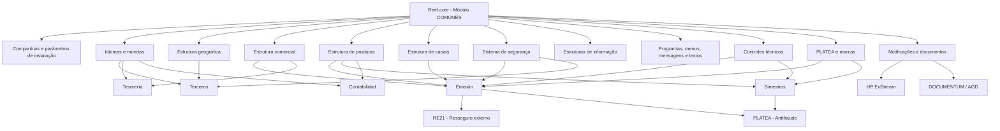
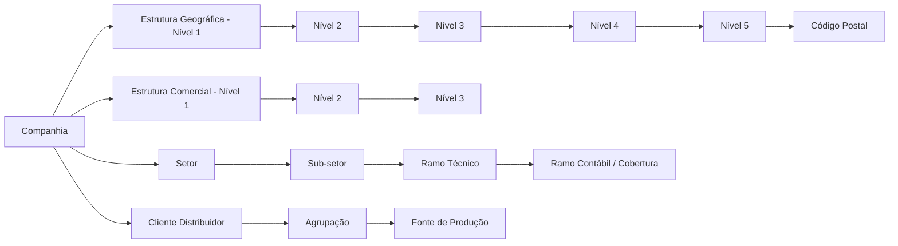

# Base de Conhecimento RAG — Módulo COMUNES do Reef.core: Configurações Transversais, Estruturas, Segurança e Controles

## 1. Metadados do Documento
- **Arquivo de Origem:** `Não informado — texto bruto fornecido na solicitação`
- **Tipo de Documento:** `Manual Operacional / Especificação Funcional`
- **Domínio / Sistema:** `Reef.core / MAPFRE / Módulo COMUNES`
- **Público-Alvo:** `Desenvolvedores, Arquitetos, Operação, Administração Funcional, Tecnologia Local e Negócio`
- **Data/Versão Identificada:** `Referência a dezembro de 2023 para HP ExStream e DOCUMENTUM; demais versão não identificada`

---

## 2. Resumo Executivo & Contexto de Negócio

O módulo **COMUNES** do Reef.core centraliza a configuração dos elementos transversais utilizados pelos módulos de Terceros, Emissão, Siniestros, Tesorería e Contabilidad. O documento descreve catálogos, estruturas organizacionais, regras de parametrização, dependências funcionais e responsabilidades locais necessárias para habilitar operações corporativas de seguros.

A configuração é organizada em torno de entidades seguradoras, idiomas, moedas, estruturas geográfica, comercial, de produtos e de canais. Esses cadastros estabelecem a base de referência para a identificação de pessoas, produtos, riscos, apólices, sinistros, recibos, comissões, contas contábeis e processos operacionais.

O Reef.core suporta estruturas hierárquicas configuráveis: cinco níveis geográficos, três níveis comerciais, três níveis de canais e uma estrutura técnica de produtos formada por setores, subsetores, ramos técnicos, coberturas e ramos contábeis. Parte dos catálogos possui conteúdo corporativo pré-configurado e não pode ser alterada, especialmente registros associados à instalação de núcleo `TRN`.

O documento também descreve o sistema de segurança, incluindo usuários, papéis, permissões, restrições de informação parcial, parâmetros de consulta e credenciais do servidor de aplicações. A autorização não decorre somente da autenticação: os acessos operacionais são definidos por papéis, catálogos de permissões e restrições estruturais.

Por fim, o material detalha mecanismos avançados de governança e automação: estruturas de informação com dados variáveis, tarefas, programas, menus, anotações, notificações, controles técnicos, integração antifraude com PLATEA e o processo de marcas. Diversas extensões locais requerem desenvolvimento, implementação e manutenção de componentes de software pela Direção de Tecnologia Local.

---

## 3. Arquitetura, Componentes & Tecnologias Envolvidas

### Componentes funcionais identificados

| Componente | Papel no Reef.core |
| :--- | :--- |
| Módulo COMUNES | Configura conceitos transversais usados pelos demais módulos. |
| Terceros | Gerencia pessoas físicas, jurídicas, atividades, documentos, contatos e dados associados. |
| Emisión / Suscripción | Gerencia cotações, apólices, suplementos, riscos, coberturas, prêmios, recibos e controles. |
| Siniestros | Gerencia sinistros, expedientes, liquidações, trâmites e prestações. |
| Tesorería / Gestión de Cobros | Gerencia recebimentos, cobranças, compensações, recibos e movimentos de caixa. |
| Contabilidad | Contabiliza prêmios, operações financeiras, ramos contábeis e datas de processo. |
| Reaseguro | Gerencia operações de resseguro; pode delegar cessões para RE21. |
| RE21 | Solução corporativa externa usada para resolver cessões de resseguro. |
| PLATEA | Plataforma corporativa antifraude integrada aos processos de Emisión e Siniestros. |
| FUJI | Orquestrador do frontal Reef.core, capaz de tratar aplicações como MicroFrontEnds. |
| TronWeb | Versão legacy do Reef.core. |
| NewTron | Versão atual do Reef.core com operações funcionais mapeadas. |
| Oracle | Base de dados mencionada para tabelas, procedimentos, estruturas e filtros. |
| HP ExStream | Ferramenta corporativa de geração e envio de documentos, citada para dezembro de 2023. |
| DOCUMENTUM / AGD | Gestor documental corporativo para armazenamento e gestão de documentos. |
| LDAP | Mecanismo de autenticação que pode ser ativado para usuários. |
| Java / cliente Java | Cliente configurável por usuário por meio de parâmetros Java. |
| BPM | Pode ser habilitado nos processos de Gestão de Pólizas e Gestão de Siniestros. |



### Relações principais entre estruturas



---

## 4. Regras de Negócio, Especificações Funcionais & Processos

### 4.1 Moedas e tipos de câmbio

- O sistema é multidivisa e permite definir moedas para cálculos de prêmios, liquidações de sinistros, comissões e outras operações.
- A definição de moedas deve respeitar a norma **ISO 4217**, com códigos de três letras.
- Uma moeda pode ser uma moeda real ou uma unidade de conta reajustável, como:
  - `UF` — Unidade de Fomento no Chile.
  - `UDI` — Unidade de Inversão no México.
  - `Tréboles` — moeda fictícia usada no plano de fidelização.
- O atributo de número de decimais modula a precisão dos cálculos internos.
- Para tipos de câmbio, o sistema permite a captura de **um único tipo de câmbio para uma data determinada**.

### 4.2 Estrutura geográfica

- A estrutura geográfica é piramidal e possui cinco níveis.
- O primeiro nível representa países e deve usar códigos **ISO 3166-1 alfa-3**.
- Denominações locais dos níveis são configuráveis por companhia e idioma.
- Códigos postais são associados aos cinco níveis geográficos e devem, como prática recomendada, seguir a codificação do serviço postal local.
- Dias não úteis e feriados podem ser configurados por níveis geográficos e possuem data de validade para histórico.
- O quinto nível pode ter data de validade para preservar o histórico das alterações territoriais.

### 4.3 Estrutura comercial

- A estrutura comercial é piramidal e possui três níveis.
- Os níveis comerciais representam uma abstração da estrutura geográfica adaptada às necessidades da seguradora.
- Os três níveis possuem códigos de atividade de terceiros fixos:
  - Primeiro nível: atividade `42`.
  - Segundo nível: atividade `43`.
  - Terceiro nível: atividade `44`.
- Essas atividades são do núcleo e não podem ser modificadas.
- Os registros podem ser inabilitados para impedir uso em cadastros e alterações.
- Em cada nível pode existir um único registro genérico com a propriedade de emissão inativa, respeitando as condições hierárquicas descritas.
- O terceiro nível pode representar escritório ou sucursal e possui propriedades específicas:
  - Data oficial de abertura.
  - Marca própria para identificar escritório pertencente ou não à companhia.
  - Tipo de distribuição obsoleto e não reutilizável.

### 4.4 Estrutura de produtos

- A estrutura de produtos classifica tecnicamente os seguros em:
  1. Companhia.
  2. Setor.
  3. Sub-setor.
  4. Ramo técnico.
- Cada ramo técnico deve estar associado obrigatoriamente a um setor e a um subsetor.
- O sistema permite definir até `999` ramos por companhia.
- Tratamentos disponíveis e não expansíveis:
  - `A` — Automóviles.
  - `D` — Diversos.
  - `T` — Transportes.
  - `V` — Vida & Accidentes.
- Os tratamentos de emissão, sinistros e contabilidade podem ser diferentes para um mesmo ramo.

### 4.5 Ramo contábil

- O ramo contábil relaciona coberturas à conta onde ocorrerá a contabilização.
- O código possui nove posições, normalmente compostas por:
  - Posição `1`: setor.
  - Posições `2-3`: subsetor.
  - Posições `4-6`: agrupamento.
  - Posições `7-9`: sequência.
- O agrupamento pode ser definido localmente; a prática mais usual é identificar univocamente o ramo técnico.
- O ramo contábil pode ser obtido dinamicamente por dado variável.
- Para ramos com tratamento de emissão de Automóveis, o dado variável obrigatório para essa busca dinâmica é `COD_TIP_VEHI`.

### 4.6 Regras relevantes do ramo técnico

| Propriedade | Regra funcional |
| :--- | :--- |
| Multi risco | Permite contratar mais de um objeto segurado ou segurado na apólice. |
| Multi períodos | Para apólices superiores a um ano, registra informação econômica separada por período. |
| Registrar hora/minutos | Torna obrigatória a captura de hora e minuto na data de efeito. |
| Respeitar dia de vencimento | Obriga o respeito ao dia de vencimento da apólice. |
| Cláusulas | Permite cláusulas automáticas ou manuais em apólice, riscos ou coberturas. |
| Anexos | Permite anexos na apólice e/ou por objeto segurado. |
| Arrastar anexos do orçamento | Carrega anexos do orçamento ao emitir a apólice. |
| Emissão de orçamento obrigatória | Impede emitir apólice sem orçamento prévio. |
| Reutilizar orçamento | Permite usar o mesmo código de orçamento em diferentes apólices do ramo. |
| Autorização de orçamento obrigatória | Exige orçamento autorizado quando houver controles técnicos de auditoria. |
| Apólice disponível a qualquer usuário | Permite que qualquer usuário habilitado retome apólice suspensa ou retida. |
| Alterar numeração da apólice | Altera automaticamente a numeração em suplementos de renovação. |
| Formação de modalidade | Pode ser sem modalidade, implícita ou explícita. |
| Formação de imagem | Pode usar data do sistema, data de efeito do suplemento ou data de efeito da apólice. |
| Prorrata | Calcula proporcionalmente ao período de vigência; desativada, utiliza escala. |
| Ano de 360/365 dias | Permite cálculo anual de 360 ou 365 dias; ano bissexto não altera esse parâmetro. |
| Prêmios manuais | Valores: cálculo automático; automático ou manual; manual. |
| Alterar tipo de câmbio | Permite modificar e validar tipo de câmbio contábil em emissão em moeda diferente da local. |
| Pricing dinâmico | Após o cálculo de prêmios, pode chamar componente local para ajuste. |
| Emissão sem recibos | Exige componente local que valide expressamente a situação. |
| Permitir cobrança de recibos | Exige componente local e usuário com papel de caixa. |

### 4.7 Co-seguro e resseguro

| Propriedade | Valores / comportamento |
| :--- | :--- |
| Tipo de co-seguro permitido | `0` Exento; `1` Só cedido; `2` Só aceito; `3` Cedido/aceito. |
| Quadro de co-seguro obrigatório | Exige que condições de distribuição sejam estabelecidas em quadro de co-seguro. |
| Comissão externa de co-seguro | Indica cálculo não padrão de comissões de co-seguro. |
| Tipo de resseguro permitido | `0` Só seguro direto; `1` Resseguro aceito por contrato; `2` Resseguro aceito facultativo; `3` Resseguro cedido/aceito. |
| Colocação externa de resseguro | Chama RE21 para cessões de resseguro. |
| Controle técnico em RE21 | Pode gerar controles técnicos em Emisión ou Siniestros se RE21 não executar ou encerrar anormalmente. |
| Colocação on-line ou diferida | Define se a chamada para RE21 ocorre on-line ou em modo diferido. |

### 4.8 Estrutura de canais

- A estrutura de canais possui três níveis:
  1. Clientes distribuidores.
  2. Agrupações.
  3. Fontes de produção.
- Os dois primeiros níveis possuem codificação corporativa e não podem ser alterados.
- O terceiro nível é definido localmente, porém deve permanecer alinhado às classificações corporativas.

| Nível 1 | Código | Descrição |
| :--- | :--- | :--- |
| Cliente distribuidor | `01` | Directo |
| Cliente distribuidor | `02` | Red Propia - Agencial |
| Cliente distribuidor | `03` | Red Externa - Corredores |
| Cliente distribuidor | `04` | Bancario |
| Cliente distribuidor | `05` | Acuerdos |

| Código nível 2 | Agrupação |
| :--- | :--- |
| `10` | Oficinas Directas |
| `11` | Directo Grandes Cuentas |
| `12` | Directo Digital |
| `13` | Directo Telefónico |
| `24` | Delegados |
| `25` | Agentes Exclusivos |
| `36` | Agentes Vinculados |
| `37` | Agentes No Vinculados |
| `38` | Corredores Locales |
| `39` | Corredores Globales |
| `410` | Bancario |
| `511` | Acuerdos |

### 4.9 Sistema de segurança

- A autenticação de usuário não implica autorização.
- Papéis determinam as funções que o usuário pode executar.
- Um usuário pode possuir um ou mais papéis.
- Recomenda-se codificar usuários da mesma forma que no diretório ativo da entidade.
- Acesso à informação deve privilegiar restrição em vez de concessão irrestrita.
- Usuários sem acesso completo aos dados de terceiros não podem modificá-los.
- O valor genérico `999` pode ser usado para permissões de criação e modificação de atividades de terceiros.
- Para restrições de terceiros:
  - `Z` restringe pessoas físicas e jurídicas.
  - `ZZZZ...ZZZZ` restringe todas as propriedades de um conceito lógico.

### 4.10 Instalações, núcleo e personalização local

- Registros associados à instalação `TRN` pertencem ao núcleo e, em diversos catálogos, não podem ser alterados.
- Em catálogos personalizáveis, podem coexistir apenas registros:
  - Da instalação `TRN`.
  - Da instalação local.
- A instalação identifica a versão ou origem da informação de configuração.
- Exemplos mencionados:
  - `TRN`: núcleo.
  - `MMT`: MAPFRE MiddleSea.
  - `EUR`: instalação associada a MAPFRE Chile / EuroAmérica Seguros originalmente.

### 4.11 Controles técnicos

- Controles técnicos são regras locais e dinâmicas adicionais às validações nativas e obrigatórias do núcleo.
- As validações nativas do Reef.core são estáticas e não podem ser evitadas.
- Controles técnicos podem ser configurados para Emisión e Siniestros.
- Controles de auditoria exigem que o usuário autorizador tenha nível igual ou superior ao nível exigido pelo controle.
- Os níveis de autorização tradicionalmente vão de `NIVEL0` até `NIVEL09`.
- Cada usuário pode ter somente um papel de controles técnicos.
- O código de controle técnico `2209` é usado pelo Reef.core para validar palavras, termos ou frases obrigatórias de cláusulas ou anexos nos ramos de Caución e Crédito.

### 4.12 Integração PLATEA

- PLATEA é a plataforma tecnológica de luta contra fraude do Grupo MAPFRE.
- A integração com Reef.core permite executar ações conforme o nível de risco de indicadores antifraude.
- Ações possíveis:
  - Gerar controles técnicos em Emisión e Siniestros.
  - Inserir níveis ou trâmites em planos de tramitação de Siniestros.
  - Marcar expediente como possível fraude.
  - Inserir aviso no plano de tramitação.
- Se PLATEA não responder por falha de conexão, timeout, excesso de tentativas ou ausência de informação processada, o Reef.core gera automaticamente um controle técnico de auditoria.
- Somente indicadores capazes de gerar alguma ação no Reef.core devem ser definidos no catálogo local.
- A codificação de indicadores deve ser idêntica à codificação definida em PLATEA.

---

## 5. Tabelas de Parâmetros, Ambientes e Estruturas de Dados

### Moedas, idiomas e geografia

| Item / Parâmetro | Descrição / Função | Tipo / Valores / Formato | Ambiente / Observações |
| :--- | :--- | :--- | :--- |
| Código da moeda | Identifica divisa no sistema | ISO 4217, três letras | Obrigatório respeitar ISO 4217 |
| Código ISO de moeda | Código internacional da moeda | ISO 4217 | Aplicável a moeda/divisa |
| Marca moeda real / unidade de conta | Distingue moeda real de unidade reajustável | Moeda real, UF, UDI, Tréboles | Tréboles são moeda fictícia do plano de fidelização |
| Número de decimais | Define precisão de cálculos internos | Numérico | Modula cálculos do sistema |
| Data de câmbio | Data de referência da cotação | Data | Uma cotação por moeda e data |
| Valor de câmbio | Valor do tipo de câmbio | Numérico | Associado a companhia, moeda e data |
| Código de país | Identifica país no nível 1 geográfico | ISO 3166-1 alfa-3 | Países, territórios e zonas geográficas |
| Código de idioma | Identifica idioma do sistema | ISO 639-1, ISO 639-2 ou ISO 639-3 | Preferência por ISO de duas letras; aceita três letras |
| Código postal | Identifica CEP associado à estrutura geográfica | Código local | Recomenda-se fonte do serviço postal local |
| Data de validade | Define início operacional de um registro | Data | Usada para histórico de configurações |

### Estruturas organizacionais

| Item / Parâmetro | Descrição / Função | Tipo / Valores / Formato | Ambiente / Observações |
| :--- | :--- | :--- | :--- |
| Estrutura geográfica | Organização territorial | Cinco níveis | País, níveis administrativos locais e código postal associado |
| Estrutura comercial | Organização interna comercial | Três níveis | Atividades fixas 42, 43 e 44 |
| Estrutura de produtos | Classificação técnica de seguros | Setor, subsetor, ramo | Ramos associados obrigatoriamente a setor e subsetor |
| Estrutura de canais | Classificação de distribuição | Cliente, agrupação, fonte | Níveis 1 e 2 corporativos; nível 3 local |
| Setor | Agrupamento de ramos similares | Código e descrição | Pode habilitar emissão |
| Sub-setor | Subconjunto de ramos de um setor | Código e descrição | Apenas um registro pode ter marca de emissão inativa |
| Ramo técnico | Unidade de produto/risco | Até 999 por companhia | Pode ter tratamentos distintos |
| Ramo contábil | Relação entre cobertura e contabilização | Nove posições | Setor + subsetor + agrupamento + sequência |

### Tratamentos predefinidos

| Código | Tratamento | Abreviatura | Uso funcional |
| :--- | :--- | :--- | :--- |
| `A` | Automóviles | Autos. | Permite, entre outros recursos, acessórios de veículos. |
| `D` | Diversos | Div. | Comportamento padrão do Reef.core. |
| `T` | Transportes | Trans. | Suporta apólices flutuantes, aplicações e declarações. |
| `V` | Vida & Accidentes | Vida & Acc. | Suporta características específicas de seguros de pessoas. |

### Formas de compensação predefinidas

| Código | Descrição | Ambiente / Observações |
| :--- | :--- | :--- |
| `1` | Cheque bancario | Conteúdo inicial predefinido |
| `2` | Efectivo | Conteúdo inicial predefinido |
| `3` | Por transferencia | Conteúdo inicial predefinido |
| `4` | Cuentas gestión | Conteúdo inicial predefinido |
| `5` | Tarjeta | Conteúdo inicial predefinido |
| `6` | Banco efectivo transferencia | Conteúdo inicial predefinido |
| `7` | Fichero bancario | Conteúdo inicial predefinido |

### Papéis do servidor de aplicações

| Papel | Descrição |
| :--- | :--- |
| `SUA/ADM` | Super Usuário / Administrador |
| `PRG` | Usuário / Operador |
| `AJP/EJP` | Administrador / Super Usuário JSPOOL |
| `UJP` | Usuário JSPOOL |
| `OJP` | Operador JSPOOL |
| `WTWPRG` | Operador Web Reef.core |
| `WTWADM` | Administrador Web Reef.core |

### Módulos Reef.core

| Código | Descrição |
| :--- | :--- |
| `TRN` | Reef.core |
| `SS` | Sistema de Seguridad |
| `DC` | Datos Comunes |
| `EM` | Emisión |
| `TS` | Siniestros |
| `GC` | Gestión de Cobros / Tesorería |
| `RE` | Reaseguro |
| `CA` | Coaseguro |
| `CO` | Contabilidad |

### Canais de distribuição de documentos e notificações

| Canal | Descrição / Função | Observações |
| :--- | :--- | :--- |
| Distribuição local | Retorno síncrono via serviço web | Transacional apresenta ou imprime |
| Correio eletrônico | Documento como anexo de e-mail | Requer e-mail dos destinatários |
| Fax | Envio ao telefone informado | Canal de fax |
| SMS | Envio de mensagem ao celular | Mensageria |
| File System | Depósito em NAS | Sistema de arquivos |
| URL privada | Documento acessível via link | Pode requerer chave de acesso |
| Gestor documental | Arquivamento em DOCUMENTUM / AGD | Gestor documental corporativo |
| Provedor externo | Depósito para DED | Distribuição externalizada |
| Assinatura eletrônica | Envio ao gestor externo de assinatura | Pode envolver assinatura biométrica |
| DOCUMENTUM WebPlus | Link para documento no gestor documental | Acesso via Internet e mecanismo de chave |

---

## 6. Bateria de Perguntas & Respostas para RAG (FAQ Sintético)

### P1: Qual norma deve ser respeitada ao cadastrar moedas no Reef.core?
**R:** A definição de moedas deve respeitar a norma ISO 4217. O código da moeda ou divisa deve utilizar o padrão internacional de três letras definido por essa norma.

### P2: O Reef.core permite cadastrar mais de um tipo de câmbio para a mesma moeda na mesma data?
**R:** Não. O sistema somente permite a captura de um único tipo de câmbio para uma data determinada, associado à companhia e à moeda ou divisa correspondente.

### P3: Como é estruturada a organização comercial no Reef.core?
**R:** A estrutura comercial é piramidal e possui três níveis. Cada nível é mantido em repositório próprio inicialmente vazio. Os níveis possuem atividades de terceiros fixas: `42` para o primeiro nível, `43` para o segundo e `44` para o terceiro.

### P4: Qual a diferença entre estrutura comercial e estrutura de canais de distribuição?
**R:** A estrutura de canais atende à necessidade corporativa de obter margem de contribuição por cliente distribuidor. A estrutura comercial atende às funções organizacionais que combinam recursos, capital, trabalho, tecnologia e atividades voltadas à criação de valor da entidade.

### P5: Quais são os tratamentos de ramo disponíveis no Reef.core?
**R:** Os tratamentos disponíveis são `A` para Automóviles, `D` para Diversos, `T` para Transportes e `V` para Vida & Accidentes. Não é possível ampliar a relação desses valores no sistema.

### P6: Como é composto o código de ramo contábil?
**R:** O ramo contábil possui nove posições: posição 1 para setor; posições 2 e 3 para subsetor; posições 4 a 6 para agrupamento; e posições 7 a 9 para sequência.

### P7: Qual dado variável deve ser usado para obter dinamicamente o ramo contábil em ramos de Automóveis?
**R:** Quando o ramo técnico possui tratamento de emissão de Automóveis e o ramo contábil é obtido dinamicamente por dado variável, o atributo obrigatório é `COD_TIP_VEHI`.

### P8: O que ocorre se PLATEA não responder durante uma avaliação antifraude?
**R:** Se não houver resposta por falha de conexão, timeout, excesso de tentativas ou inexistência de informação processada em PLATEA, o Reef.core gera automaticamente um Controle Técnico de Auditoria.

### P9: O que é um controle técnico no Reef.core?
**R:** Um controle técnico é uma regra de negócio local, dinâmica e configurável, executada sobre operações específicas de Emisión ou Siniestros. Ele complementa as validações nativas do núcleo, que são estáticas e não podem ser desativadas.

### P10: Um usuário autenticado no Reef.core possui automaticamente autorização para operar?
**R:** Não. A autenticação permite acesso à conta, mas a autorização é concedida por meio de papéis, permissões, acessos a operações e restrições de informação configuradas no sistema.

### P11: Quais registros não podem ser modificados em catálogos do núcleo?
**R:** Em diversos catálogos, os registros associados à instalação `TRN` pertencem ao núcleo do Reef.core e não podem ser alterados. Em catálogos personalizáveis, coexistem registros da instalação `TRN` e da instalação local.

### P12: Quais são os três níveis da estrutura de canais?
**R:** Os três níveis são Clientes Distribuidores, Agrupações e Fontes de Produção. Clientes Distribuidores e Agrupações são definidos corporativamente; Fontes de Produção são configuradas localmente.

### P13: Como o sistema trata usuários com restrição de informação parcial sobre terceiros?
**R:** Se um usuário não puder acessar completamente todos os dados de um terceiro, também não poderá modificá-los. O documento considera incoerente permitir alteração de informações que o usuário não pode consultar.

### P14: Qual é o código do controle técnico usado para termos obrigatórios em ramos de Caución e Crédito?
**R:** O Reef.core utiliza o Controle Técnico `2209` para validar palavras, termos ou frases obrigatórias em textos anexos e cláusulas dos ramos técnicos de Caución e Crédito.

### P15: Qual é a recomendação para a configuração de códigos postais e níveis geográficos?
**R:** A prática recomendada é utilizar e manter no Reef.core as codificações oficiais do serviço postal local, carregando-as conforme publicadas.

---

## 7. Glossário de Termos, Siglas & Conceitos-Chave

- **ACO:** Área Corporativa de Operaciones.
- **ACNC:** Área Corporativa de Negocio y Clientes.
- **AGD:** Gestor documental corporativo, citado em conjunto com DOCUMENTUM.
- **BPM:** Business Process Management.
- **CC.PP.:** Condições particulares da apólice.
- **DED:** Distribución Externalizada de Documentación.
- **FATCA:** Foreign Account Tax Compliance Act, legislação dos Estados Unidos para identificação de contas e ativos de cidadãos ou residentes norte-americanos em instituições financeiras estrangeiras.
- **FUJI:** Orquestrador do frontal Reef.core.
- **IBNR:** Cálculo de reservas referido em exemplos de tarefas de fechamento contábil.
- **ISO 3166-1 alfa-3:** Norma para códigos de três letras de países, territórios e áreas geográficas.
- **ISO 4217:** Norma para códigos de três letras de moedas e divisas.
- **LDAP:** Mecanismo de autenticação de usuários mencionado no servidor de aplicações.
- **MicroFrontEnd:** Aplicação tratada por FUJI como componente frontal real, em vez de emulação por iframe.
- **NUUMA:** Nome usado pelas entidades MAPFRE para a chave de usuário.
- **PLATEA:** Plataforma Tecnológica de Luta contra o Fraude do Grupo MAPFRE.
- **RE21:** Solução corporativa externa usada para colocação e cessão de resseguro.
- **Reef.core:** Sistema transacional corporativo abordado no documento.
- **R.G.P.D.:** Reglamento General de Protección de Datos.
- **TRN:** Código de instalação do núcleo do Reef.core.
- **TronWeb:** Versão legacy do Reef.core.
- **NewTron:** Versão atual do Reef.core.
- **UF:** Unidad de Fomento, unidade de conta reajustável do Chile.
- **UDI:** Unidad de Inversión, unidade de conta reajustável do México.
- **WebPlus:** Modalidade de acesso por vínculo a documentos no gestor documental.
- **JSPOOL:** Papéis de acesso do servidor de aplicações mencionados no catálogo de usuários.

---

## 8. Notas Críticas, Riscos & Limitações

- **Nota de Análise:** O texto descreve extensamente funcionalidades e catálogos do Reef.core, mas não fornece modelo físico completo de tabelas, contratos de API, versões de software, portas ou credenciais.
- Diversas funcionalidades dependem de componentes desenvolvidos pela Direção de Tecnologia Local, incluindo:
  - Integração de inspeções.
  - Pricing dinâmico.
  - Validação de emissão sem recibos.
  - Distribuição customizada de planos de pagamento.
  - Seleção externa de riscos.
  - Lógicas de validação e extração de documentos.
  - Lógicas de controles técnicos.
- Registros da instalação `TRN` devem ser preservados quando o catálogo indica que pertencem ao núcleo.
- Propriedades explicitamente classificadas como obsoletas ou descontinuadas não devem ser reutilizadas localmente.
- A alteração de tipo de câmbio possui impacto contábil e o documento recomenda auditoria, aprovação e controle técnico associado à Direção de Administração e Finanças.
- A configuração de acesso deve favorecer o princípio de restrição de informação, e não a concessão ampla.
- A integração com PLATEA cria controles técnicos de auditoria quando a plataforma não retorna resposta.
- A integração com RE21 pode gerar controles técnicos em Emisión ou Siniestros quando a colocação de resseguro falhar.
- A configuração de documentos e notificações estava parcialmente marcada como `EN CONSTRUCCIÓN`.
- O documento cita HP ExStream e DOCUMENTUM como ferramentas corporativas vigentes em dezembro de 2023; não há confirmação no texto sobre a vigência posterior dessa referência.

---

## 9. Conteúdo Bruto Estruturado (Referência Fiel)

```text
DOCUMENTAÇÃO: Reef.core — Módulo COMUNES.

Finalidade:
Configurar conceitos transversais utilizados nos módulos de Terceros, Emisión, Siniestros,
Tesorería e Contabilidad.

Conceitos principais:
- Companhias/Entidades.
- Idiomas.
- Moedas e tipos de câmbio.
- Estrutura geográfica de cinco níveis.
- Estrutura comercial de três níveis.
- Estrutura de produtos: setores, subsetores, ramos e ramos contábeis.
- Estrutura de canais: clientes distribuidores, agrupações e fontes de produção.
- Catálogos gerais.
- Sistema de segurança.
- Estruturas de informação.
- Tarefas.
- Programas, menus, mensagens, etiquetas, textos e listas de valores.
- Anotações.
- Notificações e documentos.
- Controles técnicos.
- PLATEA.
- Marcas.

Moedas:
- Devem respeitar a ISO 4217.
- Podem ser moeda real ou unidade de conta.
- Exemplos de unidade de conta: UF, UDI e Tréboles.
- O sistema permite somente um tipo de câmbio por moeda e data.

Estrutura geográfica:
- Cinco níveis.
- Países usam ISO 3166-1 alfa-3.
- Códigos postais associados aos níveis geográficos.
- Recomenda-se usar codificação do serviço postal local.
- Calendário oficial suporta dias não úteis e feriados com data de validade.

Estrutura comercial:
- Três níveis.
- Atividade 42: primeiro nível.
- Atividade 43: segundo nível.
- Atividade 44: terceiro nível.
- Estrutura comercial não se confunde com estrutura de canais.

Estrutura de produtos:
- Setor.
- Subsetor.
- Ramo técnico.
- Coberturas e ramos contábeis relacionados.
- Até 999 ramos por companhia.
- Tratamentos predefinidos:
  A = Automóviles.
  D = Diversos.
  T = Transportes.
  V = Vida & Accidentes.

Ramos contábeis:
- Código com nove posições.
- 1: setor.
- 2-3: subsetor.
- 4-6: agrupamento.
- 7-9: sequência.
- Para tratamento de Automóveis, uso obrigatório de COD_TIP_VEHI quando o ramo contábil
  for obtido dinamicamente por dado variável.

Segurança:
- Autenticação não implica autorização.
- Usuários recebem permissões por papéis.
- Usuários podem possuir um ou vários papéis.
- Acesso à informação pode ser restringido por estrutura comercial, agente, setor,
  subsetor e ramo.
- Se não puder consultar todos os dados de um terceiro, o usuário também não poderá modificá-los.

Instalações:
- TRN identifica a instalação de núcleo.
- Configurações TRN devem ser preservadas nos catálogos em que o documento proíbe alteração.
- Em catálogos personalizáveis, podem coexistir instalação TRN e instalação local.

Controles técnicos:
- São regras locais, dinâmicas e adicionais às validações nativas.
- Podem ser aplicados em Emisión e Siniestros.
- Níveis de autorização tradicionais: NIVEL0 a NIVEL09.
- Cada usuário pode ter somente um papel de controle técnico.
- Controle técnico 2209 valida termos obrigatórios de anexos e cláusulas nos ramos
  de Caución e Crédito.

PLATEA:
- Plataforma antifraude corporativa.
- Integração com Emisión e Siniestros.
- Pode gerar controles técnicos, inserir trâmites, marcar expediente como possível fraude
  e criar avisos.
- Sem resposta de PLATEA, o Reef.core gera Controle Técnico de Auditoria.
- Indicadores devem usar a mesma codificação de PLATEA.

Documentos e notificações:
- Ferramentas corporativas citadas em dezembro de 2023:
  HP ExStream para geração e envio.
  DOCUMENTUM para armazenamento e gestão documental.
- Canais incluem distribuição local, e-mail, fax, SMS, file system, URL privada,
  gestor documental, provedor externo e assinatura eletrônica.

Fonte:
Texto bruto integral fornecido pelo solicitante, contendo as seções de definição,
operação, parâmetros, estruturas, segurança, controles técnicos, PLATEA, marcas,
anotações, documentos e componentes comuns do Reef.core.
```
