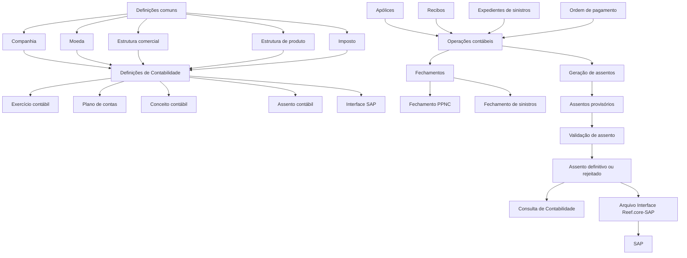

# Reef.core — Módulo de Contabilidade: Definição, Operação, Exercícios Contábeis e Integração SAP

## 1. Metadados do Documento
- **Arquivo de Origem:** `Não identificado — conteúdo bruto fornecido na solicitação`
- **Tipo de Documento:** Manual Operacional, Especificação Funcional e Material de Certificação
- **Domínio / Sistema:** Reef.core — Módulo de Contabilidade
- **Público-Alvo:** Analistas funcionais, desenvolvedores, arquitetos, operação e equipes de certificação funcional
- **Data/Versão Identificada:** Não identificada

---

## 2. Resumo Executivo & Contexto de Negócio

O conteúdo descreve o módulo de Contabilidade do sistema Reef.core, responsável por registrar e anotar operações contábeis por períodos denominados exercícios contábeis. O módulo organiza informações contábeis por companhia, exercício, plano de contas, conceito contábil, tipos de assento e interface com SAP.

A contabilidade consolidada da companhia é realizada em SAP. O Reef.core gera os movimentos contábeis básicos necessários para fornecer ao SAP as informações contábeis oriundas de operações de seguros, incluindo apólices, recibos, comissões, sinistros, pagamentos e operações de resseguro.

O documento estabelece que a operação contábil depende de definições prévias em dois níveis: definições comuns — companhia, moeda, estrutura comercial, estrutura de produto e imposto — e definições específicas de contabilidade — exercício contábil, plano de contas, conceito contábil, assento contábil e interface SAP.

O módulo suporta processos de fechamento, geração de assentos, consulta contábil e geração de arquivos para a interface Reef.core-SAP. Os assentos podem permanecer provisórios, ser validados quanto ao equilíbrio entre Débito e Crédito e posteriormente ser convertidos em definitivos ou rejeitados.

O material também apresenta uma estrutura de certificação funcional em níveis, associando operações específicas de contabilidade aos níveis de conhecimento requeridos para certificação no Reef.core.

---

## 3. Arquitetura, Componentes & Tecnologias Envolvidas

### Componentes e conceitos identificados

| Componente / Conceito | Função no contexto descrito |
| :--- | :--- |
| **Reef.core** | Sistema no qual são gerados os movimentos contábeis básicos e executadas as operações do módulo de Contabilidade. |
| **Módulo de Contabilidade** | Registra operações contábeis por exercício, gera assentos, permite consultas e integra informações com SAP. |
| **SAP** | Sistema responsável pela contabilidade consolidada da companhia. Recebe informações contábeis por meio da interface Reef.core-SAP. |
| **Companhia** | Entidade para a qual são criadas apólices e demais elementos; também delimita o exercício contábil e o plano de contas. |
| **Exercício contábil** | Período de tempo em que as operações contábeis são realizadas. Possui data de abertura, data de fechamento e estados operacionais. |
| **Plano de contas** | Relação de contas necessárias para registrar os movimentos contábeis de uma companhia por exercício. |
| **Conta contábil** | Elemento do plano de contas. Pode ser de agrupamento, nível `A`, ou detalhe, nível `D`. |
| **Ramo contábil** | Chave associada à cobertura e à conta em que sua contabilização será realizada. |
| **Conceito contábil** | Identificador que agrupa lançamentos contábeis para consulta posterior. |
| **Assento contábil** | Lançamento de partida dobrada que registra valores no Débito e no Crédito. |
| **Interface Reef.core-SAP** | Operação que recupera informações de assentos e cria um arquivo com informações contábeis para SAP. |
| **PPNC** | Processo de provisão de prima não consumida, utilizado para cálculo de reservas de riscos em curso antes da geração do assento. |
| **RE21** | Referência citada como o mecanismo pelo qual os assentos de resseguro são realizados atualmente. O documento não detalha o significado ou funcionamento de RE21. |

### Fluxo funcional e de integração



### Nota de Análise

O documento descreve a arquitetura funcional e os componentes do módulo de Contabilidade, mas não detalha tecnologias de implementação, protocolos de integração, APIs, estruturas de arquivo, métodos HTTP, contratos JSON, tabelas físicas ou mecanismos técnicos de transmissão para SAP.

---

## 4. Regras de Negócio, Especificações Funcionais & Processos

### 4.1 Definição de exercício contábil

O exercício contábil define o período durante o qual operações contábeis são realizadas. O período não precisa coincidir com o ano natural.

Cada exercício contábil possui os seguintes atributos:

1. **Companhia**
   - Contém o código da companhia para a qual o exercício contábil é definido.

2. **Exercício**
   - É a chave que identifica o exercício contábil.
   - Quando coincide com o ano natural, normalmente são usados os dígitos do ano como chave.
   - A codificação pode ser diferente, conforme a necessidade da companhia.
   - Exemplos:
     - `2023`: exercício único que coincide com o ano.
     - `20231`: primeiro exercício de 2023.
     - `20232`: segundo exercício de 2023.
     - `2223`: exercício entre dois anos naturais.

3. **Data de abertura**
   - Indica a data em que se inicia o exercício contábil.

4. **Data de fechamento**
   - Indica a data em que termina o exercício contábil.

5. **Fechamento**
   - Indica se o exercício está fechado.
   - Em um exercício fechado, não podem ser realizadas novas operações.
   - O processo de fechamento pode ser executado várias vezes.
   - O exercício fica definitivamente fechado quando o atributo de fechamento assim o indicar.

6. **Abertura definitiva**
   - Indica se o exercício está definitivamente aberto.
   - O assento de abertura pode ser executado várias vezes até que o atributo indique abertura definitiva.

7. **Inabilitado**
   - Indica se o exercício está habilitado para uso.
   - Um exercício inabilitado não pode ser utilizado nem mesmo para consulta.
   - Um exercício inabilitado é tratado como se não existisse.

### 4.2 Exemplos de períodos de exercício

| Cenário | Chave do exercício | Data de abertura | Data de fechamento |
| :--- | :--- | :--- | :--- |
| Exercício anual | `2023` | `01/01/2023` | `31/12/2023` |
| Exercício entre anos naturais | `2223` | `01/07/2022` | `30/06/2023` |
| Primeiro exercício no mesmo ano | `20231` | `01/01/2023` | `30/06/2023` |
| Segundo exercício no mesmo ano | `20232` | `01/07/2023` | `31/12/2023` |
| Exemplo apresentado como `2023-2024` | Não especificada | `01/07/2023` | `30/06/2024` |
| Primeiro exercício apresentado como `2023-1` | Não especificada | `01/01/2023` | `30/06/2023` |
| Segundo exercício apresentado como `2023-2` | Não especificada | `01/07/2023` | `31/12/2023` |

### 4.3 Dependências de definição do módulo

Antes de operar o módulo de Contabilidade, devem ser realizadas definições em dois níveis.

#### Definições comuns

| Definição | Descrição |
| :--- | :--- |
| Companhia | Define a entidade ou entidades para as quais serão criadas apólices e demais elementos. |
| Moeda | Define as divisas com as quais o Reef.core realizará operações da companhia. |
| Estrutura comercial | Define como será estabelecida a organização territorial da companhia. |
| Estrutura de produto | Define como estarão organizados os ramos comercializados. |
| Imposto | Define os tipos de obrigações tributárias, suas características e formas de cálculo. |

#### Definições específicas de Contabilidade

| Definição | Descrição |
| :--- | :--- |
| Exercício contábil | Define o período de realização das operações contábeis. Após cada fechamento, deve ser definido um novo exercício. |
| Plano de contas | Define as contas usadas pela companhia dentro do exercício e os parâmetros de cada conta. |
| Conceito contábil | Define o identificador que agrupa os lançamentos contábeis para consulta posterior. |
| Assento contábil | Define os tipos e características dos assentos contábeis com os quais a companhia trabalhará. |
| Interface SAP | Define as informações levadas ao SAP e a relação de dados entre Reef.core e SAP. |

### 4.4 Ramo contábil

O ramo contábil é uma chave associada a uma cobertura que a relaciona à conta sobre a qual sua contabilização será realizada. A associação entre ramo contábil e cobertura é realizada durante a definição da cobertura no ramo.

O documento também permite determinar o ramo contábil de uma cobertura pelo valor de algum atributo, como o tipo de veículo segurado em ramos de automóveis.

| Cobertura | Ramo contábil |
| :--- | :--- |
| Responsabilidade civil | `100000007` |
| Danos próprios | `100000003` |
| Roubo de veículo | `003030001` |

| Cobertura | Atributo: Tipo de veículo | Ramo contábil |
| :--- | :--- | :--- |
| Danos Próprios | Automóvel | `101401001` |
| Danos Próprios | Motocicleta | `101401002` |
| Danos Próprios | Caminhão | `101401003` |
| Responsabilidade civil | Automóvel | `101401001` |
| Responsabilidade civil | Motocicleta | `101401002` |

### 4.5 Plano de contas

O plano de contas é a relação de contas necessárias para registrar os movimentos contábeis de uma companhia. Cada companhia define seu plano de contas por exercício contábil.

O plano de contas pode possuir dois tipos de nível:

- **Nível A:** nível de agrupamento utilizado para organizar e classificar contas.
- **Nível D:** nível de detalhe utilizado para definição de parâmetros e imputação da informação contábil.

O documento indica que cada companhia pode possuir uma estrutura de plano de contas com até cinco níveis, embora atualmente apenas o último nível seja obrigatório.

| Nível | Conta | Descrição da conta |
| :---: | :--- | :--- |
| A | `102` | Investimentos financeiros |
| A | `102101` | Investimentos a custo amortizado |
| A | `10210101` | Valores representativos de dívida |
| A | `102101011` | Emitidos por instituições estatais |
| D | `1021010111` | Investimentos Banco Central |
| D | `1021010199` | Investimentos outras entidades estatais |
| A | `102101012` | Emitidos por outras instituições |
| D | `1021010121` | Investimentos Citibank |
| D | `1021010122` | Investimentos BBVA |
| D | `1021010123` | Investimentos FMI |

### 4.6 Parâmetros das contas contábeis

| Parâmetro | Regra / finalidade |
| :--- | :--- |
| Moeda | Embora as contas sejam multimoeda, o parâmetro pode limitar uma conta a uma única moeda. É citado como exemplo o uso em contas de investimento em moeda específica. |
| Nível 3 da estrutura comercial | Pode limitar a conta a uma estrutura comercial específica, como contas que só podem ser movimentadas pela matriz. |
| Terceiro | Indica que a conta deve estar associada a um terceiro. É utilizado em contas de gastos, como comissões de agentes. |
| Ramo contábil | Indica que os movimentos da conta são controlados por ramo contábil. É usado em contas de receitas e gastos para análise por cobertura. |
| Canal de vendas | Indica que a informação da conta deve incluir canal de venda ou fonte de produção, permitindo identificar vendas pela internet, canal direto ou outros canais. |

**Regra obrigatória:** todas as contas de receitas e gastos devem informar a fonte de produção e o ramo contábil.

### 4.7 Assentos contábeis e partida dobrada

Um assento contábil é uma anotação realizada no livro contábil para registrar uma receita ou um gasto. Cada assento contábil realiza um lançamento por partida dobrada, registrando movimentos no Débito e no Crédito.

| Situação | Registro |
| :--- | :--- |
| Gasto | Refletido no Débito |
| Receita | Registrada no Crédito |

No exemplo de emissão de apólice, a prima é considerada receita. Enquanto os recibos correspondentes não são cobrados, a prima gera um valor pendente.

| Débito | Crédito |
| :--- | :--- |
| Pendente de pagamento | Prima emitida |

Nos fechamentos mensais, a informação é extraída para gerar os assentos contábeis que realizam anotações nas contas definidas.

### 4.8 Classes de assentos contábeis

| Classe de assento | Origem ou conteúdo |
| :--- | :--- |
| Assentos de emissão e anulações | Gerados a partir de movimentos de apólices: emissão, suplementos de aumento ou redução de prima e anulações de apólices. |
| Assentos de cobrança | Contêm informações sobre primas cobradas e anulações de cobrança. |
| Assentos de comissão | Contêm comissões liquidadas a agentes e reservas de fundos para pagamento de comissões futuras, denominadas provisão de comissões. |
| Assentos de sinistros | Contêm informações sobre sinistros ocorridos antes da data de fechamento, reservas de sinistros e pagamentos de indenizações, honorários e gastos. |
| Assentos de resseguro | Contêm informações de resseguro relativas a operações de prima, pagamentos de sinistros, reserva de prima não consumida e reserva de sinistros. Atualmente, são realizados por RE21. |
| Assentos de provisão de primas não consumidas | Gerados a partir de apólices vigentes, utilizando informações sobre primas não consumidas entre a data de fechamento e o fim da vigência da apólice. |

### 4.9 Características do módulo

| Característica | Descrição |
| :--- | :--- |
| Informação por exercício | Toda a informação contábil está associada ao exercício que estiver aberto. |
| Plano de contas piramidal | Cada companhia define a estrutura do plano de contas, podendo ter até cinco níveis. |
| Contas multimoeda | As contas permitem movimentos em qualquer moeda definida no sistema. |
| Conversão de moeda estrangeira | Todos os lançamentos em moeda estrangeira possuem o respectivo valor na moeda do país. |
| Integração SAP | Todos os movimentos contábeis do sistema são transferidos para SAP por meio de uma interface já desenvolvida. |

### 4.10 Entradas e saídas operacionais

| Tipo | Elementos identificados |
| :--- | :--- |
| Entradas | Apólices, recibos, expedientes de sinistros e ordem de pagamento. |
| Saídas | Assentos contábeis e arquivo de interface Reef.core-SAP. |

### 4.11 Operações suportadas

#### Fechamentos

| Operação | Descrição |
| :--- | :--- |
| Gerar fechamento do processo de provisão de prima não consumida — PPNC | Calcula as reservas de riscos em curso antes da execução do assento. |
| Gerar fechamento do processo de sinistros | Calcula as reservas de sinistros antes da execução do assento. |

#### Assentos

| Operação | Descrição |
| :--- | :--- |
| Gerar assento de emissão | Realiza a anotação contábil mensal de movimentos de apólice relacionados a novas emissões e suplementos. |
| Gerar assento de cobranças | Realiza a anotação contábil pelo valor de primas cobradas e anulações de cobrança no mês. |
| Gerar assento de primas não consumidas | Realiza a anotação contábil da reserva de riscos em curso. |
| Gerar assento de provisão de comissão | Gera a anotação contábil correspondente a comissões pendentes de liquidação. |
| Gerar assento de comissões devengadas | Corresponde à anotação contábil das comissões pagas a agentes ou intermediários. |
| Gerar assento de reservas de sinistros | Realiza a anotação contábil das provisões de sinistros pelo valor bruto das reservas no fechamento mensal. |
| Gerar assento de pagamentos de sinistros | Realiza a anotação contábil dos pagamentos de indenizações, honorários e gastos de sinistros realizados no mês. |
| Validar assento contábil | Valida se os assentos estão equilibrados e se todos os dados estão corretos para criação como provisórios. |
| Modificar assento para definitivo | Permite transformar assentos provisórios em definitivos ou rejeitá-los. |

#### Consultas

| Operação | Descrição |
| :--- | :--- |
| Consultar Contabilidade | Exibe informações dos lançamentos contábeis por diferentes critérios. |

#### Interface SAP

| Operação | Descrição |
| :--- | :--- |
| Gerar arquivo interface Reef.core-SAP | Recupera informações dos assentos e cria arquivo com informações contábeis para SAP. |

---

## 5. Tabelas de Parâmetros, Ambientes e Estruturas de Dados

### Estados e atributos do exercício contábil

| Item / Parâmetro | Descrição / Função | Tipo / Valores / Formato | Ambiente / Observações |
| :--- | :--- | :--- | :--- |
| Companhia | Identifica a companhia para a qual o exercício é definido. | Código de companhia | Definição de exercício contábil |
| Exercício | Identifica o período contábil. | Chave livre; exemplos: `2023`, `20231`, `20232`, `2223` | Pode ou não coincidir com o ano natural |
| Data de abertura | Define o início do período contábil. | Data; exemplos: `01/01/2023`, `01/07/2023` | Exercício contábil |
| Data de fechamento | Define o término do período contábil. | Data; exemplos: `31/12/2023`, `30/06/2024` | Exercício contábil |
| Fechamento | Indica que não podem ser realizadas mais operações no exercício. | Estado de fechamento | Pode ser executado várias vezes; o estado determina o fechamento definitivo |
| Abertura definitiva | Indica que o exercício está definitivamente aberto. | Estado de abertura | O assento de abertura pode ser executado várias vezes antes da abertura definitiva |
| Inabilitado | Indica se o exercício pode ser usado. | Estado habilitado/inabilitado | Exercício inabilitado não pode ser usado nem consultado |

### Certificação funcional de Contabilidade

| Nível de certificação | Conteúdo ou operações associadas |
| :--- | :--- |
| Nível 0 | Temário necessário para o primeiro nível de certificação funcional do Reef.core. |
| Nível 1 | Temário e exercícios para o segundo nível de certificação funcional do Reef.core. |
| Nível 2 | Temário e exercícios para o terceiro nível de certificação funcional do Reef.core. |
| Nível 3 | Temário e exercícios para o quarto nível de certificação funcional do Reef.core. |
| Nível 4 | Temário e exercícios para o quinto nível de certificação funcional do Reef.core. |

### Operações apresentadas por nível de certificação

| Nível | Operações |
| :--- | :--- |
| Certificação Contabilidade nível 1 | Gerar assento de emissão; gerar assento de cobranças; gerar assento de provisão de comissão; gerar assento de comissões devengadas. |
| Certificação Contabilidade nível 2 | Gerar fechamento PPNC; gerar assento de primas não consumidas; gerar fechamento de sinistros; gerar assento de reservas de sinistros; gerar assento de pagamentos de sinistros. |
| Certificação Contabilidade nível 3 | Validar assento contábil; modificar assento para definitivo; consultar Contabilidade; gerar arquivo interface Reef.core-SAP. |

### Nota de Análise

O conteúdo não informa URLs, servidores, portas, credenciais, nomes de bancos de dados, variáveis de ambiente, formatos de arquivo da interface SAP, frequência de execução técnica, mecanismos de autenticação ou estruturas físicas de tabelas.

---

## 6. Bateria de Perguntas & Respostas para RAG (FAQ Sintético)

### P1: O que é um exercício contábil no módulo de Contabilidade do Reef.core?
**R:** Um exercício contábil é o período de tempo no qual as operações contábeis são realizadas no Reef.core. O período possui data de abertura e data de fechamento, pode coincidir ou não com o ano natural e está associado a uma companhia específica.

### P2: Um exercício contábil do Reef.core precisa coincidir com o ano natural?
**R:** Não. O documento estabelece que o período de exercício não precisa coincidir obrigatoriamente com o ano natural. São apresentados exemplos de exercícios anuais, exercícios que abrangem dois anos naturais e mais de um exercício dentro do mesmo ano.

### P3: O que acontece quando um exercício contábil está fechado?
**R:** Quando o atributo de fechamento indica que o exercício está fechado, não podem ser realizadas novas operações nesse exercício. O processo de fechamento pode ser executado várias vezes, mas o exercício é considerado definitivamente fechado quando o atributo de fechamento assim o indica.

### P4: É possível consultar um exercício contábil inabilitado?
**R:** Não. Um exercício inabilitado não pode ser utilizado, nem mesmo em consultas. O documento determina que um exercício inabilitado é tratado como se não existisse.

### P5: Quais definições devem existir antes de operar o módulo de Contabilidade?
**R:** Antes da operação, devem ser definidas companhia, moeda, estrutura comercial, estrutura de produto e imposto no nível comum. No nível específico de Contabilidade, devem ser definidos exercício contábil, plano de contas, conceito contábil, assento contábil e interface SAP.

### P6: Qual é a diferença entre contas de nível A e nível D no plano de contas?
**R:** As contas de nível A são níveis de agrupamento usados para organizar e classificar contas da companhia. As contas de nível D são níveis de detalhe nos quais são definidos parâmetros das contas e realizada a imputação da informação contábil.

### P7: Quais informações devem obrigatoriamente ser informadas nas contas de receitas e gastos?
**R:** Todas as contas de receitas e gastos devem informar a fonte de produção e o ramo contábil. O canal de vendas representa a fonte de produção, enquanto o ramo contábil permite analisar movimentos por tipo de cobertura.

### P8: Como funciona a partida dobrada nos assentos contábeis?
**R:** Cada assento contábil realiza um lançamento por partida dobrada, registrando movimentos no Débito e no Crédito. Gastos são refletidos no Débito e receitas são registradas no Crédito. No exemplo de emissão de apólice, o valor pendente de pagamento é registrado no Débito e a prima emitida no Crédito.

### P9: Quais tipos de movimentos podem gerar assentos de emissão e anulações?
**R:** Os assentos de emissão e anulações são gerados a partir de movimentos de apólices, incluindo emissões, suplementos de aumento de prima, suplementos de redução de prima e anulações de apólices.

### P10: Qual é a função do fechamento de provisão de prima não consumida, PPNC?
**R:** O fechamento do processo de provisão de prima não consumida calcula reservas de riscos em curso antes da execução do assento contábil correspondente à provisão de primas não consumidas.

### P11: O que a validação de assento contábil verifica?
**R:** A validação verifica se os assentos contábeis estão equilibrados, isto é, quadrados, e se todos os dados estão corretos para que possam ser criados como assentos provisórios.

### P12: Como um assento provisório se torna definitivo?
**R:** Após a validação, a operação “Modificar assento a definitivo” permite converter assentos provisórios em definitivos ou rejeitá-los.

### P13: Como ocorre a integração entre Reef.core e SAP?
**R:** Todos os movimentos contábeis do sistema são transferidos para SAP. A operação “Gerar arquivo interface Reef.core-SAP” recupera informações dos assentos e cria um arquivo com informações contábeis para SAP. O documento não especifica o formato do arquivo ou o mecanismo técnico de transferência.

---

## 7. Glossário de Termos, Siglas & Conceitos-Chave

- **Assento contábil:** Anotação no livro contábil utilizada para registrar receitas ou gastos por partida dobrada.
- **Canal de vendas:** Informação que identifica o canal de venda ou fonte de produção, como internet ou canal direto.
- **Companhia:** Entidade para a qual são criadas apólices, exercícios contábeis e planos de contas.
- **Conceito contábil:** Identificador que agrupa lançamentos contábeis para consulta posterior.
- **Conta de nível A:** Conta de agrupamento usada para organizar e classificar contas.
- **Conta de nível D:** Conta de detalhe usada para parametrização e imputação contábil.
- **Débito / Debe:** Lado do lançamento contábil no qual o documento indica o registro de gastos.
- **Exercício contábil:** Período durante o qual são realizadas operações contábeis.
- **Haber / Crédito:** Lado do lançamento contábil no qual o documento indica o registro de receitas.
- **Interface Reef.core-SAP:** Interface que gera arquivo com informações de assentos para integração com SAP.
- **PPNC:** Provisão de prima não consumida; processo que calcula reservas de riscos em curso antes da geração do assento.
- **Prima:** Receita gerada, por exemplo, pela emissão de uma apólice.
- **Ramo contábil:** Chave associada a uma cobertura e à conta utilizada para sua contabilização.
- **RE21:** Referência citada como o mecanismo atual para realização dos assentos de resseguro; não há detalhamento adicional.
- **Reserva de sinistros:** Valor relacionado a sinistros ocorridos antes da data de fechamento, utilizado nos assentos de sinistros.
- **SAP:** Sistema no qual é realizada a contabilidade consolidada da companhia.
- **Terceiro:** Entidade à qual uma conta pode ser associada, como no caso de contas de gastos de comissões de agentes.

---

## 8. Notas Críticas, Riscos & Limitações

- A contabilidade consolidada é realizada em SAP; portanto, o processo depende da geração e transferência dos movimentos contábeis do Reef.core para SAP.
- O documento afirma que existe uma interface SAP já desenvolvida, mas não documenta formato do arquivo, layout de dados, periodicidade, validações de transmissão, tratamento de erros ou reconciliação.
- Assentos provisórios dependem da validação de equilíbrio contábil e de correção de dados antes da conversão em definitivos.
- Exercícios fechados bloqueiam novas operações; exercícios inabilitados bloqueiam inclusive consultas. A gestão inadequada desses estados pode impedir operações ou acesso a informações.
- Todas as contas de receitas e gastos devem conter fonte de produção e ramo contábil. A ausência dessas informações contraria a regra funcional documentada.
- O documento cita que os assentos de resseguro são realizados atualmente por RE21, mas não explica o componente, processo, integração ou responsabilidades associadas a RE21.
- Não são descritos métodos HTTP, contratos de APIs, estruturas JSON, tecnologia de banco de dados, tabelas físicas, ambientes, URLs, versões, portas ou mecanismos de segurança.
- O conteúdo contém materiais marcados como “EN CONSTRUCCIÓN”, indicando documentação potencialmente incompleta.
- **Nota de Análise:** o documento apresenta descrições funcionais, exemplos e operações de negócio, mas não contém detalhamento técnico suficiente para implementação de interfaces, integração SAP ou modelo físico de dados.

---

## 9. Conteúdo Bruto Estruturado (Referência Fiel)

```text
EN CONSTRUCCIÓN

DEFINICIÓN de ejercicio contable

Objetivo
Definir el periodo de tiempo en el que se realizarán las operaciones contables y las condiciones que determinarán la forma de trabajar sobre este período.

Proceso a seguir
DEFINIR ejercicio contable
DEFINIR parámetros del ejercicio

DEFINICIÓN de Ejercicio contable

Objetivo
El objetivo es definir el periodo de tiempo en el que se realizarán las operaciones contables.

Propiedades

Compañía
Este atributo contiene el código de la compañía para la que se está definiendo el ejercicio contable.

Ejercicio
Este atributo será la clave con la que se identifica el ejercicio contable.
Normalmente, si el ejercicio coincide con el año natural, se suelen utilizar como clave los dígitos del año, pero puede utilizarse cualquier otra codificación.

Ejemplo
Si hay un único ejercicio y coincide con el año:
Ejercicio: 2023

Si hay más de un ejercicio en el mismo año:
Ejercicio: 20231 (para el primer ejercicio)
Ejercicio: 20232 (para el segundo ejercicio)

Fecha de apertura
Este atributo indica la fecha en la que inicia el ejercicio contable.

Ejemplo
Si el ejercicio se inicia el primer día del año:
Fecha de apertura: 01/01/2023

Fecha de cierre
Este atributo indica la fecha en la que finaliza el ejercicio contable.

Ejemplo
Si el ejercicio coincide con el año natural:
Ejercicio: 2023
Fecha de apertura: 01/01/2023
Fecha de cierre: 31/12/2023

Si el ejercicio está entre dos años naturales:
Ejercicio: 2223
Fecha de apertura: 01/07/2022
Fecha de cierre: 30/06/2023

Si hay más de un ejercicio en el mismo año natural:
a. Primer ejercicio
Ejercicio: 20231
Fecha de apertura: 01/01/2023
Fecha de cierre: 30/06/2023

b. Segundo ejercicio
Ejercicio: 20232
Fecha de apertura: 01/07/2023
Fecha de cierre: 31/12/2023

Cierre
Este atributo indica si el ejercicio contable está cerrado, es decir, no pueden realizarse más operaciones en este ejercicio.
El proceso de cierre puede ejecutarse varias veces, considerando que el ejercicio está cerrado definitivamente cuando este atributo así lo indica.

Apertura definitiva
Este atributo indica si el ejercicio está abierto definitivamente.
El asiento de apertura se puede ejecutar varias veces hasta que en este atributo se indique que la apertura es definitiva.

Inhabilitado
Este atributo indica si el ejercicio está habilitado o no, para poder trabajar.
Un ejercicio inhabilitado no se puede utilizar, ni siquiera en consulta, es como si no existiera.

Vínculos
DEFINICION de compañía

EN CONSTRUCCIÓN

DEFINICIÓN DE CONTABILIDAD

Elementos que intervienen en la definición y orden en el que se debe realizar.

COMÚN
En este nivel se encuentran definiciones que no pertenecen exclusivamente al módulo de contabilidad, pero son necesarias para poder realizar la definición de dicho módulo.

COMPAÑÍA
Definición de la entidad o entidades con las que se van a crear las pólizas y por consiguiente el resto de elementos.

MONEDA
Definición de las divisas con las que Reef.core va a realizar las distintas operaciones de la compañía.

ESTRUCTURA COMERCIAL
Definición de como se va a establecer la organización territorial de la compañía.

ESTRUCTURA PRODUCTO
Definición de como estarán organizados los ramos que se comercializan.

IMPUESTO
Definir los tipos de obligaciones tributarias que se deben tener en cuenta, así como sus características y formas de cálculo.

CONTABILIDAD

EJERCICIO CONTABLE
Se define el periodo de tiempo en el que se realizarán las operaciones contables.
Después de cada cierre de ejercicio se debe definir el nuevo ejercicio.

PLAN DE CUENTAS
Definición de las cuentas utilizadas por la compañía dentro del ejercicio contable y los parámetros correspondientes a cada cuenta.

CONCEPTO CONTABLE
Se define el identificador que agrupa los apuntes contables para su posterior consulta.

ASIENTO CONTABLE
Definición de los tipos y características de los asientos contables con los que trabajará la compañía.

INTERFAZ SAP
Definición de la información que se llevará a SAP así como la relación de los datos de ambos sistemas.

DOCUMENTACIÓN - CONTABILIDAD

En este apartado se aborda todo aquello relacionado con la funcionalidad del sistema. La información se encuentra dividida en los apartados siguientes:
Definición
Operación
Modelo de datos

DEFINICIÓN
Documentos que detallan aquellos conceptos que se han de definir y el orden que se ha de seguir para conseguir la definición necesaria con lo que poder operar un módulo funcional.

OPERACIÓN
Documentos relacionados con las operaciones funcionales que el módulo soporta.

MODELO DE DATOS
Documentación orientada hacia las tablas de la aplicación. Adicionalmente, se describe con detalle el movimiento de distintos elementos como tablas, filas y columnas atendiendo a las operaciones funcionales.

INTRODUCCIÓN - Módulo Contabilidad

Objetivo
Este módulo permite registrar y anotar operaciones contables por períodos.
Actualmente la contabilidad consolidada de la compañía se realiza en SAP, por tanto, en Reef.core se generan los movimientos contables básicos para poder obtener la información que necesita SAP.

Conceptos principales
Ejercicio
Ramo contable
Plan de cuentas
Asientos

Ejercicio
El período de tiempo en el que se realizan las operaciones contables, se denomina ejercicio.
El período que comprende cada ejercicio se identifica con una fecha de apertura, que indica la fecha en la que inicia el ejercicio contable, y una fecha de cierre que indica la fecha en la que finaliza el ejercicio contable.
Este período no tiene que coincidir obligatoriamente con el año natural.

Ejemplos:
- El ejercicio coincide con el año natural:
  2023
  Fecha apertura: 01/01/2023
  Fecha cierre: 31/12/2023

- El ejercicio está entre dos años naturales:
  2023-2024
  Fecha apertura: 01/07/2023
  Fecha cierre: 30/06/2024

- Si hay más de un ejercicio en el mismo año natural:
  Primer ejercicio: 2023-1
  Fecha apertura: 01/01/2023
  Fecha cierre: 30/06/2023

  Segundo ejercicio: 2023-2
  Fecha apertura: 01/07/2023
  Fecha cierre: 31/12/2023

Ramo contable
Se trata de una clave, asociada a la cobertura, que la relaciona con la cuenta sobre la que se va a realizar su contabilización.
La asociación del ramo contable con la cobertura se realiza en el momento de la definición de la cobertura en el ramo.

Ejemplo ramo contable por cobertura:
Responsabilidad civil — 100000007
Daños propios — 100000003
Robo del vehículo — 003030001

Ejemplo ramo contable por atributo:
Daños Propios — Automóvil — 101401001
Daños Propios — Motocicleta — 101401002
Daños Propios — Camión — 101401003
Responsabilidad civil — Automóvil — 101401001
Responsabilidad civil — Motocicleta — 101401002

Plan de cuentas
Es la relación de las cuentas que son necesarias para registrar los movimientos contables de una compañía.
Cada compañía define su plan de cuentas por ejercicio contable, pudiendo definir 2 tipos de niveles:
A: Niveles de agrupación
D: Nivel de detalle

El nivel A se utiliza para organizar y clasificar las cuentas de la compañía.
La definición de los parámetros de las cuentas, así como la imputación de la información contable se realizan sobre las cuentas de nivel D.

Ejemplo definición de cuentas por nivel:
A — 102 — Inversiones financieras
A — 102101 — Inversiones a costo amortizado
A — 10210101 — Valores representativos de deuda
A — 102101011 — Emitidos por instituciones estatales
D — 1021010111 — Inversiones Banco Central
D — 1021010199 — Inversiones otras entidades estatales
A — 102101012 — Emitidos por otras instituciones
D — 1021010121 — Inversiones Citibank
D — 1021010122 — Inversiones BBVA
D — 1021010123 — Inversiones FMI

Principales parámetros de las cuentas:
Moneda
Aunque las cuentas son multimoneda, por medio de este parámetro se puede limitar la cuenta a una sola moneda.

Nivel 3 de la estructura comercial
Se puede limitar la cuenta a una estructura comercial específica.

Tercero
Mediante este parámetro se indica que la cuenta tiene que estar asociada a un tercero.

Ramo contable
Indica que los movimientos de la cuenta van por ramo contable.

Canal de ventas
Indica que la información de la cuenta debe incluir el canal de venta o fuente de producción.

Todas las cuentas de ingresos y gastos deben llevar informados la fuente de producción y el ramo contable.

Asientos
Es la anotación que se realiza en el libro de contabilidad para registrar un ingreso o un gasto.
Cada asiento contable realiza un apunte por partida doble, registrando los movimientos en el Debe y el Haber.

Cuando se trata de un gasto se refleja en el Debe.
Cuando es un ingreso se registra en el Haber.

Ejemplo:
DEBE: Pendiente de pago
HABER: Prima emitida

En los cierres mensuales, se extrae la información para los asientos contables, que realizan las anotaciones en las cuentas definidas para cada uno de ellos.

Clases de asiento:
- Asientos de emisión y anulaciones.
- Asientos de cobro.
- Asientos de comisión.
- Asientos de siniestros.
- Asientos de reaseguro.
- Asientos de provisión de primas no consumidas.

Características:
- Información por ejercicio.
- Plan de cuentas piramidal.
- Cuentas multimoneda.
- Integración con SAP.

Información por ejercicio
Toda la información contable va asociada al ejercicio que esté abierto.

Plan de cuentas piramidal
Cada compañía se define la estructura de su plan de cuentas, pudiendo tener hasta 5 niveles, aunque actualmente solo es obligatorio el último nivel.

Cuentas multimoneda
Las cuentas permiten movimientos en cualquier moneda, siempre que esté definida en el sistema.
Todos los apuntes en moneda extranjera llevan su correspondiente importe en moneda del país.

Integración con SAP
Todos los movimientos contables del sistema se traspasan a SAP.
Existe una interfaz, ya desarrollada, para estos traspasos.

Entradas/Salidas
Pólizas
Recibos
Expedientes de siniestros
Orden Pago
Asientos contables

Operaciones soportadas

CIERRES
- Generar cierre proceso provisión prima no consumida (PPNC): realiza el cálculo de las reservas de riesgos en curso previo a la ejecución del asiento.
- Generar cierre proceso siniestros: realiza el cálculo de las reservas de siniestros previo a la ejecución del asiento.

ASIENTOS
- Generar asiento de emisión.
- Generar asiento de cobros.
- Generar asiento de primas no consumidas.
- Generar asiento de provisión de comisión.
- Generar asiento de comisiones devengadas.
- Generar asiento de reservas de siniestros.
- Generar asiento de pagos de siniestros.
- Validar asiento contable.
- Modificar asiento a definitivo.

CONSULTAS
- Consultar Contabilidad: muestra la información de los apuntes contables por distintos criterios.

INTERFAZ SAP
- Generar Archivo interfaz Reef.core-SAP: recupera información de los asientos y crea archivo con información contable para SAP.

CERTIFICACIÓN - CONTABILIDAD

CERTIFICACIÓN DE NIVEL 0
Temario necesario para obtener el primer nivel de certificación funcional de Reef.core.

CERTIFICACIÓN DE NIVEL 1
Temario y ejercicios necesarios para obtener el segundo nivel de certificación funcional de Reef.core.

CERTIFICACIÓN DE NIVEL 2
Temario y ejercicios necesarios para obtener el tercer nivel de certificación funcional de Reef.core.

CERTIFICACIÓN DE NIVEL 3
Temario y ejercicios necesarios para obtener el cuarto nivel de certificación funcional de Reef.core.

CERTIFICACIÓN DE NIVEL 4
Temario y ejercicios necesarios para obtener el quinto nivel de certificación funcional de Reef.core.

CERTIFICACIÓN Contabilidad nivel 1
- Generar Asiento de emisión.
- Generar Asiento de cobros.
- Generar Asiento de provisión de comisión.
- Generar Asiento de comisiones devengadas.

CERTIFICACIÓN Contabilidad nivel 2
- Generar Cierre proceso provisión prima no consumida (PPNC).
- Generar Asiento de primas no consumidas.
- Generar Cierre proceso siniestros.
- Generar Asiento de reservas de siniestros.
- Generar Asiento de pagos de siniestros.

CERTIFICACIÓN Contabilidad nivel 3
- Validar Asiento contable.
- Modificar Asiento a definitivo.
- Consultar Contabilidad.
- Generar Archivo interfaz Reef.core-SAP.
```
