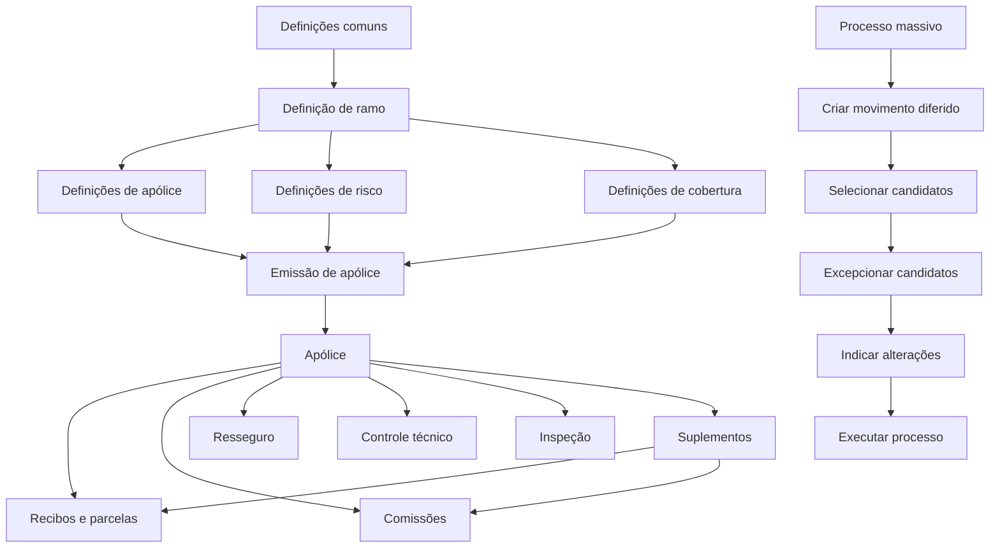
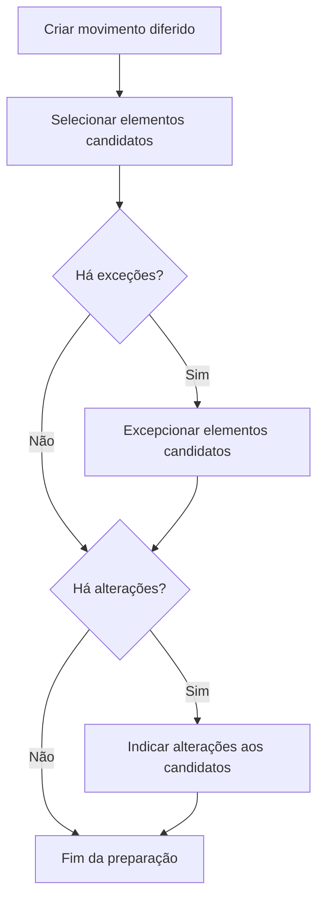

# Reef.core — Definição, Emissão, Processos Massivos e Modelo de Dados de Seguros

## 1. Metadados do Documento
- **Arquivo de Origem:** Não identificado; conteúdo bruto fornecido diretamente na conversa.
- **Tipo de Documento:** Manual Operacional, Especificação Funcional e Documentação Técnica.
- **Domínio / Sistema:** Reef.core — módulo de Emissão de seguros; integração mencionada com MAPFRE, PLATEA e RE21.
- **Público-Alvo:** Desenvolvedores, Arquitetos, Analistas Funcionais, Operação, Configuradores de ramos e equipes de suporte.
- **Data/Versão Identificada:** Não identificada.

---

## 2. Resumo Executivo & Contexto de Negócio

O conteúdo documenta o módulo de **Emissão do Reef.core**, cuja finalidade principal é criar e modificar apólices. O módulo também administra elementos de apoio à emissão, como cotações, orçamentos, aplicações, suplementos, parcelas, recibos, processos massivos, inspeções e controles técnicos.

A operação do Reef.core depende de uma etapa prévia de **definição de ramo**. Essa definição configura a estrutura do produto de seguro, os atributos de risco, as coberturas, as regras de cálculo, as intervenções de terceiros, as cláusulas, os planos de pagamento, as moedas, os controles técnicos e os tipos de alterações permitidas durante a vigência da apólice.

O documento descreve múltiplos negócios de seguros — Automóvel, Vida, Transporte, Saúde e Ramos Gerais — que compartilham definições comuns, mas podem possuir particularidades próprias. A documentação apresenta regras para agrupamento de apólices, contratos e subcontratos, numeração, cobertura, atributos, franquias, coasseguro, acessórios de veículos e operações de emissão.

Também há documentação técnica para processos massivos diferidos. Esses processos permitem selecionar apólices ou riscos, definir exceções, indicar alterações e executar operações em lote, tais como renovação, anulação por falta de pagamento, alteração de apólice, regularização de vida e mudança de gestor de cobrança.

O material contém diversas seções marcadas como **“EN CONSTRUCCIÓN”**. Essas seções identificam funcionalidades ou tópicos mencionados, mas sem detalhamento funcional ou técnico completo no conteúdo fornecido.

---

## 3. Arquitetura, Componentes & Tecnologias Envolvidas

### Componentes funcionais identificados

| Componente / Conceito | Função no Reef.core |
| :--- | :--- |
| Módulo de Emissão | Criação e alteração de apólices, orçamentos, aplicações e suplementos. |
| Ramo | Define as características gerais do tipo de seguro. |
| Apólice | Contrato que registra riscos, coberturas, condições e prêmio do seguro. |
| Risco | Elemento segurado, como pessoa, veículo ou imóvel. |
| Cobertura | Proteção contratada e resposta da seguradora diante de um sinistro. |
| Suplemento | Modificação registrada sobre uma apólice ou aplicação. |
| Cotação | Simulação de custo com informação parcial e valores previamente fixados. |
| Orçamento | Proposta de seguro com informação integral do cliente e possível compromisso de preço. |
| Aplicação | Apólice temporal baseada em uma apólice marco, utilizada no negócio de transportes. |
| Contrato | Condição que altera parcialmente a definição padrão de um ramo. |
| Subcontrato | Condição que altera uma definição previamente modificada por contrato. |
| Apólice grupo | Chave que agrupa apólices independentes. |
| Apólice cliente | Chave para agrupar apólices de famílias, clientes ou grupos empresariais. |
| Controle técnico | Mecanismo de retenção, autorização ou rejeição de operações. |
| Inspeção | Avaliação de risco que pode condicionar a contratação ou continuidade da apólice. |
| Processo massivo | Operação diferida aplicável a uma ou mais apólices, aplicações ou riscos. |
| PLATEA | Plataforma mencionada para integração e luta contra fraude. |
| RE21 | Módulo de resseguro para o qual atributos podem ser exportados. |



### Níveis de definição

| Nível | Escopo documentado |
| :--- | :--- |
| Comum | Companhia, moeda, estrutura comercial, estrutura de produto, canais, agentes, conceitos econômicos, documentos, controle técnico e PLATEA. |
| Ramo | Numeração, ramo, suplemento, contrato, subcontrato, apólice grupo, apólice cliente, cotação rápida, contexto, marca e documentos. |
| Apólice | Moeda, duração, dias de adiantamento/atraso, coasseguro, intervenção, cláusula, plano de pagamento, revalorização, atributo e controle técnico. |
| Risco | Definições específicas de automóvel, vida ou transporte; intervenções, atributos, modalidades, inspeção, comissão e cláusulas. |
| Cobertura | Cobertura, atributos, ocorrências, limites, intervalos, franquias, tarifas, cláusulas, comissão e controles técnicos. |

---

## 4. Regras de Negócio, Especificações Funcionais & Processos

### 4.1 Apólice grupo

Uma apólice grupo é uma chave que agrupa apólices independentes, inclusive apólices de tipos de negócio diferentes. Um exemplo apresentado agrupa apólices de automóvel, lar, saúde e vida sob uma mesma apólice grupo.

- O número da apólice grupo aceita qualquer valor.
- A numeração da apólice grupo não segue estrutura predefinida.
- A criação do número de apólice grupo é manual.
- Cada apólice pertencente ao grupo possui uma sequência.
- A sequência indica o identificador da apólice dentro da apólice grupo.
- Uma apólice grupo inabilitada não pode ser atribuída a uma nova apólice.
- A propriedade **“Obliga a existencia de contrato”** determina se a utilização da apólice grupo exige contrato na emissão.

### 4.2 Contratos e subcontratos

Um contrato permite alterar determinados conceitos de negócio definidos em um ramo. Um subcontrato permite alterar novamente a definição de ramo e contrato.

O exemplo documentado apresenta o ramo **300 — Automóvel**, no qual a cobertura de acidentes pode estar inabilitada na definição do ramo sem contrato e habilitada ou alterada pela definição do contrato **SANTANDER**.

> **Nota de Análise:** o texto contém inconsistências entre algumas frases explicativas e valores de exemplo de cobertura. O artefato preserva o princípio funcional documentado: contratos e subcontratos podem substituir parcialmente a configuração padrão do ramo.

### 4.3 Numeração de apólices e orçamentos

- A numeração de apólice e a numeração de orçamento não podem ter o mesmo formato.
- Toda numeração deve conter um número consecutivo, identificado pela abreviatura `N`.
- A composição deve garantir disponibilidade de números suficientes ao longo do tempo.
- O ano pode ser utilizado na numeração para reiniciar sequências em períodos anuais.
- O formato de número de apólice é definido por setor e afeta todos os ramos desse setor.
- O formato não pode ser modificado se já houver apólices emitidas no setor.
- O tamanho máximo do número de apólice é de **13 posições**.
- O consecutivo é obrigatório e ocupa o tamanho restante até 13 posições.
- Deve existir pelo menos um elemento adicional além do consecutivo.

### 4.4 Dias de adiantamento e atraso

A definição controla quantos dias antes ou depois podem ser utilizados para realizar um tipo de movimento de emissão.

A configuração pode depender de:

- Ramo.
- Apólice grupo.
- Contrato.
- Subcontrato.
- Tipo de emissão.
- Número de dias de adiantamento.
- Número de dias de atraso.
- Data de validade.
- Estado de inabilitação.

### 4.5 Coberturas

A cobertura é a obrigação principal da seguradora em um contrato de seguro. Ela define a resposta econômica diante de circunstâncias cobertas, o limite indenizável e o custo a ser pago pelo cliente.

As propriedades documentadas incluem:

- Identificador, nome e tipo da cobertura.
- Ramo, modalidade de vida, data de validade e ordem.
- Origem da soma segurada.
- Moeda da soma segurada.
- Lógica prévia à solicitação de dados.
- Possibilidade de alteração da soma segurada pelo emissor.
- Redução da soma segurada por sinistro.
- Reexecução de lógica de soma segurada em suplementos.
- Relação entre coberturas.
- Percentual de participação sobre uma cobertura principal.
- Obrigatoriedade de contratação.
- Necessidade de acessórios.
- Cessão ao resseguro.
- Exigência de inspeção.
- Cálculo de comissões de nova produção e carteira.
- Impressão obrigatória.
- Inabilitação.
- Ramo contábil.
- Franquia.
- Moeda da tarifa.
- Forma de cálculo de prêmio.

### 4.6 Tipos de cobertura

| Tipo | Visível na contratação | Tem soma segurada | Tem prêmio | Comportamento documentado |
| :--- | :---: | :---: | :---: | :--- |
| Informativa | Sim | Não | Não | Atua como separador textual na tela de contratação. |
| Básica adicional | Sim | Sim | Não | Disponibiliza soma segurada para outras coberturas. |
| Real dependente | Sim | Sim | Sim | Recebe soma segurada de outra cobertura. |
| Real independente | Sim | Sim | Sim | Possui soma segurada e prêmio próprios. |
| Serviços | Sim | Não | Sim | Contratação indicada como incluída ou excluída. |
| Capital ilimitado | Sim | Não | Sim | Exibe o literal “ILIMITADA”. |
| Sinistros | Não | Não | Não | Associa tipos de expediente sem exigir cobertura contratada. |
| Fictícia risco | Não | Não | Não | Permite associar informação econômica ao nível de risco. |
| Fictícia apólice | Não | Não | Não | Permite associar informação econômica à apólice completa. |
| Fictícia ajuste risco | Não | Não | Não | É a última cobertura calculada no nível de risco. |

### 4.7 Atributos

Os atributos registram informação necessária que não existe nativamente no Reef.core ou informação que afeta tarifa, cálculo, controle técnico, inspeção ou integração.

Os formulários de atributos podem ter os seguintes âmbitos:

| Formulário | Âmbito |
| :--- | :--- |
| Apólice | Todos os riscos da apólice. |
| Risco | Cada risco da apólice. |
| Cobertura | Cobertura do risco associado. |
| Ocorrência | Cobertura, risco ou apólice associada. |

Prefixos recomendados para atributos:

| Prefixo | Conteúdo esperado |
| :--- | :--- |
| `COD_` | Código associado a tabela do Reef.core ou do ramo. |
| `FEC_` | Data. |
| `IMP_` | Valor monetário. |
| `MCA_` | Indicador Sim/Não. |
| `NOM_` | Nome. |
| `APE_` | Sobrenome. |
| `PCT_` | Percentual. |
| `TIP_` | Valores predefinidos em tabela. |
| `VAL_` | Valor não classificado nos demais prefixos. |

### 4.8 Intervenções

Intervenções são figuras previamente estabelecidas no Reef.core que agrupam um ou mais terceiros em uma apólice ou risco.

Regras documentadas:

- As intervenções não são de livre criação.
- A inclusão de uma nova intervenção deve ser solicitada.
- O tomador é a única intervenção obrigatória por definição geral.
- Uma intervenção incluída em ramo pode ser configurada como não obrigatória.
- Pode haver mínimo e máximo de terceiros por intervenção.
- As intervenções exclusivas de nível de apólice são: **Tomador**, **Tomadores alternos** e **Pagador**.
- Uma intervenção pode ser solicitada no nível de apólice ou risco.
- Pode haver terceiro principal, vários terceiros principais e terceiro usado para cálculos.
- Uma intervenção pode solicitar percentuais cuja soma deve ser 100.
- Uma intervenção de cessão de direitos pode solicitar contrato, vencimento de financiamento e valor financiado.
- Uma intervenção pode registrar que uma pessoa é V.I.P.
- Uma lógica de negócio pode determinar se a intervenção deve ser solicitada, validar a intervenção, definir terceiro de referência ou carregar terceiros em lote.

### 4.9 Coasseguro

O quadro de coasseguro registra entidades participantes e condições de participação em um acordo de coasseguro.

- As seguradoras participantes devem existir previamente.
- Em coasseguro cedido, devem ser incluídas todas as companhias, inclusive MAPFRE.
- Em coasseguro cedido, a soma dos percentuais deve ser 100.
- Em coasseguro aceito, é identificada a companhia líder.
- Em coasseguro aceito, o percentual é inferior a 100 e representa a participação da MAPFRE.
- Podem ser definidos até quatro percentuais de comissão.

### 4.10 Processos massivos

Um processo massivo é uma operação diferida que determina:

1. Qual operação será executada.
2. Quais elementos serão afetados.
3. Quais elementos serão excluídos.
4. Quais alterações serão aplicadas aos elementos candidatos.



Movimentos diferidos documentados incluem:

- Carga de orçamento.
- Carga de apólice.
- Carga de aplicação.
- Conversão de renovações.
- Orçamento de suplemento.
- Suplemento.
- Renovação.
- Anulação por falta de pagamento.
- Alteração de apólice ou aplicação a partir de orçamento.
- Autorização ou rejeição de controle técnico.
- Regularização de vida.
- Suspensão de aportação pactuada.
- Recibos impagados.

### 4.11 Filtros massivos predefinidos

| Processo | Critério de seleção documentado |
| :--- | :--- |
| Anulação por falta de pagamento | Apólices com ao menos um recibo não cobrado até a data do processo acrescida do período de graça e fora do processo de impagos. |
| Recibos impagados | Apólices e recibos não cobrados na data do processo; não considera período de graça. |
| Regularização vida | Apólices vigentes na data do processo que não tenham movimento de regularização no mês. |
| Renovação | Apólices vencidas, não temporais e não renovadas na data do processo. |
| Suspensão de aportação pactada | Apólices com determinado número de aportações periódicas não pagas na data do processo. |

### 4.12 Regras de recibos

Uma quota pode ser agregada a um recibo existente quando:

1. O efeito e vencimento da quota são iguais aos do recibo.
2. O recibo está em MAPFRE.
3. O recibo não foi cobrado.
4. O recibo está na situação `EP — Emitido pendente`.

| Situação | Descrição | Efeito chegou | Está em MAPFRE | Foi cobrado |
| :--- | :--- | :---: | :---: | :---: |
| `EP` | Emitido pendente | Não | Sim | Não |
| `RE` | Remesado | Sim | Não | Não |
| `CT` | Cobrado | Sim | Não | Sim |

---

## 5. Tabelas de Parâmetros, Ambientes e Estruturas de Dados

### Elementos do formato de número de apólice

| Item / Parâmetro | Descrição / Função | Tipo / Valores / Formato | Ambiente / Observações |
| :--- | :--- | :--- | :--- |
| Companhia | Código de companhia. | Comprimento 2; abreviatura `C`. | Pode compor o número da apólice. |
| Setor | Código de setor. | Comprimento 2; abreviatura `S`. | Aplicável à definição por setor. |
| Ramo | Código do ramo. | Comprimento 3; abreviatura `R`. | Pode compor o formato. |
| Estrutura comercial nível 1 | Primeiro nível comercial. | Comprimento 2; abreviatura `1`. | Opcional no formato. |
| Estrutura comercial nível 2 | Segundo nível comercial. | Comprimento 3; abreviatura `2`. | Opcional no formato. |
| Estrutura comercial nível 3 | Terceiro nível comercial. | Comprimento 3; abreviatura `3`. | Opcional no formato. |
| Ano | Ano de geração. | Comprimento 2; abreviatura `A`. | Pode suportar sequências anuais. |
| Número consecutivo | Garante unicidade. | Abreviatura `N`; obrigatório. | Ocupa o tamanho restante até 13 posições. |

### Origem da soma segurada

| Item / Parâmetro | Descrição / Função | Tipo / Valores / Formato | Ambiente / Observações |
| :--- | :--- | :--- | :--- |
| Valor do veículo | Utiliza o valor do veículo registrado em atributo. | Tipo de capital. | Aplicável a coberturas. |
| Acessórios | Utiliza a soma dos acessórios declarados no risco. | Tipo de capital. | Aplicável a coberturas. |
| Valor do veículo mais acessórios | Soma valor do veículo e acessórios. | Tipo de capital. | Aplicável a coberturas. |
| Limite | Seleção de lista predefinida de somas seguradas. | Tipo de capital. | Pode ter valor padrão. |
| Limite duplo | Limite e valor máximo indenizável por sinistro. | Tipo de capital. | Aplicável a cobertura. |
| Livre | Permite soma segurada não predefinida. | Tipo de capital. | Aplicável a cobertura. |
| Intervalo | Define soma segurada por faixa mínima e máxima. | Tipo de capital. | Aplicável a cobertura. |

### Formas de cálculo de prêmio

| Item / Parâmetro | Descrição / Função | Tipo / Valores / Formato | Ambiente / Observações |
| :--- | :--- | :--- | :--- |
| Porcentagem | Calcula prêmio por percentual. | Forma de cálculo. | Cobertura. |
| Por mil | Calcula prêmio por tanto por mil. | Forma de cálculo. | Cobertura. |
| Valor fixo | Utiliza valor fixo. | Forma de cálculo. | Cobertura. |
| Valor fixo por unidade | Utiliza valor por unidade. | Forma de cálculo. | Cobertura. |
| Tabela | Calcula por tabela. | Forma de cálculo. | Cobertura. |
| Lógica de negócio | Calcula mediante lógica associada. | Forma de cálculo. | Cobertura. |
| Fatores | Calcula por fatores. | Forma de cálculo. | Cobertura. |
| Tarifa padrão | Utiliza tarifa padrão. | Forma de cálculo. | Cobertura. |
| Não calcula | Não calcula prêmio. | Forma de cálculo. | Cobertura. |

### Tipos de gestor de cobrança

| Tipo | Descrição | Condição de utilização | Chave associada |
| :---: | :--- | :--- | :--- |
| 1 | Agente | Sempre. | Agente principal da apólice. |
| 2 | Banco | Quando o pagador possui conta bancária. | Entidade e agência bancária. |
| 3 | Cobrador | Quando a figura existir na companhia. | Cobrador. |
| 4 | Débito automático em conta | Quando o pagador possui conta bancária. | Entidade e agência bancária. |
| 5 | Gestor direto | Sempre. | Escritório, nível 3. |
| 6 | Gestor piloto coasseguro | Quando a apólice é de coasseguro aceito. | Seguradora líder. |
| 7 | Escritório comercial | Sempre. | Escritório, nível 3. |
| 8 | Débito com cartão de crédito | Quando o pagador possui cartão de crédito. | Entidade e agência bancária. |
| 10 | Gestor de impagos | Nunca em operação normal; exclusivo do processo de impagos. | Não se aplica. |

### Tabela `G2000510` — Processos massivos

| Coluna | Descrição / Função | Obrigatória | Observações |
| :--- | :--- | :---: | :--- |
| `COD_CIA` | Companhia. | Sim | Identifica a entidade do processo. |
| `FEC_TRATAMIENTO` | Data de tratamento. | Sim | Data de execução do processo massivo. |
| `NUM_ORDEN` | Número do processo massivo. | Sim | O valor zero é reservado e não deve ser usado. |
| `TIP_MVTO_BATCH` | Tipo do processo massivo. | Sim | Define o movimento diferido. |
| `TXT_ALIAS` | Nome ou descrição do processo. | Não | Exemplo: renovação de agosto. |
| `TIP_SITU_FILTRO` | Situação do movimento. | Sim | Pode assumir estados de filtragem ou exceção. |
| `NOM_PRG_EXCEPCION` | Procedimento de exceção. | Não | Lógica que exclui elementos. |
| `MCA_RECALCULA_FECHA` | Indicador de recálculo de data. | Sim | Indica se utiliza data calculada ou recalcula. |
| `TIP_FECHA_BASE` | Tipo de data base. | Não | Data usada para recálculo. |
| `COD_USR` | Usuário que atualizou a linha. | Sim | Auditoria. |
| `FEC_ACTU` | Data de atualização. | Não | Auditoria. |
| `TXT_MCA_PROCESO_ESTANDAR` | Indicador de processo padrão. | Não | Distingue modo padrão. |
| `IDN_PROCESO_PERSONALIZADO` | Identificador de processo personalizado. | Não | Utilizado no modo guiado. |

### Tabela `A2000500` — Apólices a tratar em processos massivos

| Coluna | Descrição / Função | Obrigatória |
| :--- | :--- | :---: |
| `FEC_TRATAMIENTO` | Data do processo massivo. | Sim |
| `NUM_ORDEN` | Número do processo massivo. | Sim |
| `TIP_MVTO_BATCH` | Tipo do processo massivo. | Sim |
| `COD_CIA` | Companhia. | Sim |
| `COD_SECTOR` | Setor. | Sim |
| `COD_RAMO` | Ramo. | Sim |
| `COD_NIVEL1`, `COD_NIVEL2`, `COD_NIVEL3` | Níveis da estrutura comercial. | Sim |
| `COD_AGT` | Agente. | Sim |
| `COD_MON` | Moeda. | Sim |
| `NUM_POLIZA_GRUPO` | Apólice grupo. | Não |
| `NUM_CONTRATO` | Contrato. | Não |
| `NUM_POLIZA_CLIENTE` | Apólice cliente. | Não |
| `NUM_POLIZA` | Apólice. | Sim |
| `NUM_SPTO` | Número de suplemento. | Sim |
| `NUM_APLI` | Número de aplicação. | Sim |
| `NUM_SPTO_APLI` | Suplemento da aplicação. | Sim |
| `TIP_POLIZA_TR` | Tipo de apólice. | Sim |
| `FEC_EFEC_SPTO` | Efeito do suplemento. | Não |
| `FEC_VCTO_SPTO` | Vencimento do suplemento. | Não |
| `NUM_RECIBO` | Recibo. | Não |
| `TIP_SITU` | Situação da linha. | Sim |
| `COD_EXCEPCION` | Exceção. | Não |
| `NOM_EXCEPCION` | Descrição da exceção. | Não |
| `COD_USR` | Usuário que atualizou a linha. | Sim |
| `FEC_ACTU` | Data de atualização. | Sim |

### Tabela `A2000510` — Riscos afetados em processos massivos

| Coluna | Descrição / Função | Obrigatória |
| :--- | :--- | :---: |
| `FEC_TRATAMIENTO` | Data de execução. | Sim |
| `NUM_ORDEN` | Número do processo massivo. | Sim |
| `TIP_MVTO_BATCH` | Tipo do movimento. | Sim |
| `COD_CIA` | Companhia. | Sim |
| `NUM_POLIZA` | Apólice. | Sim |
| `NUM_RIESGO` | Risco. | Sim |
| `FEC_EFEC_RIESGO` | Efeito do risco. | Sim |
| `FEC_VCTO_RIESGO` | Vencimento do risco. | Sim |

### Tabela `A2100170` — Conceitos de desglose econômico

| Coluna | Descrição |
| :--- | :--- |
| `COD_CIA` | Companhia. |
| `NUM_POLIZA` | Apólice. |
| `NUM_SPTO` | Número de suplemento. |
| `NUM_APLI` | Número de aplicação. |
| `NUM_SPTO_APLI` | Suplemento da aplicação. |
| `NUM_RIESGO` | Risco. |
| `NUM_PERIODO` | Período para apólices plurianuais. |
| `COD_COB` | Cobertura. |
| `COD_DESGLOSE` | Conceito de desglose econômico. |
| `COD_ECO` | Conceito econômico de recibo. |
| `NUM_BLOQUE_ESTUDIO` | Não utilizado, segundo o documento. |
| `IMP_ACUMULADO_ANUAL` | Valor anual acumulado. |
| `IMP_SPTO` | Valor do suplemento. |
| `IMP_NO_CONSUMIDO` | Valor não consumido. |
| `IMP_ANUAL` | Valor anual. |
| `COD_RAMO` | Ramo. |

### Fórmulas econômicas documentadas

| Campo | Fórmula / comportamento |
| :--- | :--- |
| `IMP_ANUAL` | Valor correspondente a um ano de cobertura; é base para os demais valores. Não participa da geração de parcelas. |
| `IMP_NO_CONSUMIDO` em suplemento sem anulação | `IMP_ANUAL × coeficiente_de_constitución`, aplicado sobre o último suplemento não anulado. |
| `IMP_NO_CONSUMIDO` em suplemento com anulação | `(IMP_SPTO + IMP_NO_CONSUMIDO) × coeficiente_de_anulación`, aplicado sobre o último suplemento não anulado. |
| `IMP_SPTO` | `IMP_ANUAL × coeficiente_de_constitución - IMP_NO_CONSUMIDO`. |
| `IMP_ACUMULADO_ANUAL` em orçamento, declaração, nova apólice, nova aplicação ou renovação | Igual a `IMP_SPTO`. |
| `IMP_ACUMULADO_ANUAL` nos demais movimentos | `IMP_SPTO` atual + `IMP_ACUMULADO_ANUAL` do suplemento anterior. |

---

## 6. Bateria de Perguntas & Respostas para RAG (FAQ Sintético)

### P1: O que é uma apólice grupo no Reef.core?
**R:** Uma apólice grupo é uma chave utilizada para agrupar apólices independentes, inclusive apólices de ramos distintos. Cada apólice vinculada recebe uma sequência dentro do grupo. O identificador da apólice grupo aceita qualquer valor, não possui estrutura predefinida e é criado manualmente.

### P2: Qual é a diferença entre apólice multirriscos e apólice grupo?
**R:** A apólice multirriscos possui um único número de apólice, uma moeda, um plano de pagamento, um tomador e pode conter múltiplos riscos. A apólice grupo reúne múltiplas apólices independentes; por isso, pode permitir múltiplas moedas, vencimentos, tomadores, gestores de cobrança, planos de pagamento, cláusulas e comissões caso essas diferenças não sejam controladas por definição.

### P3: Quais regras se aplicam ao formato do número de apólice?
**R:** O formato é definido por setor, aplica-se aos ramos do setor e não pode ser alterado depois de existir apólice emitida naquele setor. O número possui no máximo 13 posições, deve conter obrigatoriamente o consecutivo `N` e deve possuir ao menos outro elemento além do consecutivo.

### P4: Quando uma cobertura conectada pode ser contratada?
**R:** Uma cobertura conectada depende da cobertura principal. Se a cobertura principal não for contratada, a conectada não poderá ser contratada. Se a cobertura principal for excluída, as coberturas conectadas também serão excluídas.

### P5: O que ocorre quando uma cobertura exige inspeção?
**R:** Quando a contratação de uma cobertura exige inspeção e a inspeção não ocorreu ou teve resultado negativo, a apólice fica retida por controle técnico. Esse controle somente pode ser removido após a inspeção do risco e resultado positivo.

### P6: Qual é a diferença entre cotação e orçamento?
**R:** A cotação é uma simulação que pode utilizar dados fixados previamente e solicita a menor quantidade possível de informações ao cliente. O orçamento utiliza integralmente as informações do cliente, pode conter um ou mais riscos, simula resseguro e gera comissões de forma simulada. O orçamento também pode implicar conservação temporária do prêmio pela MAPFRE.

### P7: Em que condição um recibo pode receber uma nova quota?
**R:** A quota pode receber o mesmo número de recibo quando existe recibo com mesmo efeito e vencimento, o recibo permanece em MAPFRE e ainda não foi cobrado. No documento, a situação compatível é `EP — Emitido pendente`.

### P8: Como funciona a alteração de plano de pagamento?
**R:** A operação de alteração de plano de pagamento permite refinanciar ou alterar o fracionamento de uma apólice ou aplicação. Ela cancela os recibos pendentes selecionados e gera novos recibos conforme o novo plano. Apenas recibos na situação emitido pendente podem participar.

### P9: O que é um processo massivo de emissão?
**R:** É um processo diferido que determina uma operação, seleciona os elementos candidatos, permite excepcionar elementos e indica as alterações a aplicar. O processo pode criar ou alterar orçamentos, apólices ou aplicações e pode resultar em operações concluídas, falhas ou retidas por controle técnico.

### P10: Como o Reef.core seleciona apólices para renovação em processo massivo?
**R:** O filtro padrão de renovação seleciona apólices vencidas, não temporais e não renovadas na data definida para o processo massivo.

### P11: O que significa `IMP_NO_CONSUMIDO`?
**R:** `IMP_NO_CONSUMIDO` representa o valor que deveria ser devolvido ou cobrado se um conceito econômico deixasse de se aplicar. Em suplementos dentro da vigência, ele é calculado antes da alteração. Não é calculado em renovações, pois a renovação cria novo período de vigência, nem em suplementos de regularização.

### P12: Quando o controle técnico rejeita uma apólice?
**R:** Quando uma apólice retida por controle técnico é rejeitada, ela desaparece do Reef.core. Há também a modalidade de rejeição com suspensão, na qual a apólice se torna um orçamento suspenso para permitir correção da informação que causou a retenção.

---

## 7. Glossário de Termos, Siglas & Conceitos-Chave

- **Apólice:** Contrato que registra o risco coberto, coberturas, condições e prêmio.
- **Aplicação:** Emissão temporal baseada em uma apólice marco, especialmente mencionada para transportes.
- **Cobertura:** Obrigação da seguradora diante de eventos cobertos.
- **Coasseguro aceito:** Situação em que MAPFRE não é a companhia líder e registra sua participação.
- **Coasseguro cedido:** Situação em que a companhia líder cede parte do risco a outras seguradoras.
- **Contrato:** Condição que altera parcialmente a definição de um ramo.
- **CT:** Situação de recibo cobrado.
- **EP:** Situação de recibo emitido pendente.
- **Franquia:** Parte da prestação pela qual o segurado responde ou limite aplicável a uma cobertura.
- **MAPFRE:** Companhia mencionada como participante, líder ou gestora do processo de seguro.
- **PLATEA:** Plataforma tecnológica de luta contra fraude mencionada no documento.
- **Prêmio / Prima:** Custo do seguro.
- **RE:** Situação de recibo remesado.
- **RE21:** Módulo de resseguro para o qual atributos podem ser exportados.
- **Reef.core:** Sistema corporativo documentado para definição e emissão de seguros.
- **Resseguro:** Cessão total ou parcial do risco a terceiro.
- **Risco:** Pessoa, veículo, imóvel ou outro objeto segurado.
- **Suplemento:** Alteração registrada sobre apólice ou aplicação.
- **Tomador:** Terceiro identificado como contratante da apólice.

---

## 8. Notas Críticas, Riscos & Limitações

- O material contém diversas seções com a indicação **“EN CONSTRUCCIÓN”**; esses tópicos não possuem detalhamento suficiente para implementação sem documentação complementar.
- Há menções a links internos, imagens, telas e notas visuais que não estão disponíveis no conteúdo bruto textual.
- Alguns exemplos de contratos, subcontratos e coberturas apresentam inconsistências entre tabelas e texto narrativo; recomenda-se validar a regra final com a fonte funcional oficial.
- O documento cita lógicas de negócio, objetos de exceção, controles técnicos e processos personalizados, mas não especifica contratos técnicos, linguagens, interfaces, assinaturas ou APIs dessas lógicas.
- A utilização da ferramenta de filtro de processos massivos exige conhecimento prévio do modelo de dados de emissão.
- A ordem de seleção de tabelas e colunas nos filtros massivos influencia diretamente o desempenho do sistema.
- Não foram identificados URLs, ambientes, portas de rede, versões de software, contratos HTTP, payloads JSON ou rotas de log.
- O texto menciona tabelas técnicas e colunas, mas não detalha chaves primárias, índices, chaves estrangeiras, mecanismos de persistência ou políticas transacionais.

---

## 9. Conteúdo Bruto Estruturado (Referência Fiel)

```text
INTRODUCCIÓN - Módulo de emisión

Objetivo
Básicamente la meta de este módulo es la de crear y modificar pólizas.
Además de póliza, existen otros elementos a los que se les puede denominar
como intermedios o de apoyo que facilitan alcanzar dicha meta. Estos elementos
son las cotizaciones y presupuestos.

PRINCIPALES CONCEPTOS
RIESGO
COBERTURA
PÓLIZA
SUPLEMENTO
COTIZACIÓN
PRESUPUESTO
CUOTA
RECIBO

DEFINICIÓN de póliza grupo

Objetivo
Reef.core permite agrupar varias pólizas bajo una clave.
A esta clave se la denomina póliza grupo.

Propiedades
Nº de póliza grupo
Identificador de la póliza grupo. Acepta cualquier valor.

Descripción
Nombre que se va a asociar a la póliza grupo.

Descripción corta
Nombre corto que se asociará a la póliza grupo.

Obliga a existencia de contrato
Indica si el uso de esta póliza grupo obligará al uso de un contrato
cuando se emita una póliza.

Secuencia
Toda póliza que es asociada a una póliza grupo dispone de un valor que indica
el número de pólizas independientes que forman parte de una póliza grupo.

Inhabilitada
Especifica si la póliza grupo se encuentra operativa o no en el sistema.
Cuando se encuentra no operativa no podrá ser asignada a una nueva póliza.

Preguntas frecuentes
¿Existe una estructura del número de póliza grupo como ocurren con el número
de póliza y el número de siniestro?
No, la numeración de una póliza grupo no atiende a una estructura.

¿Se puede crear un número de póliza grupo de forma automática?
No, la creación de un número de póliza grupo en la actualidad se realiza
de forma manual.

DEFINICIÓN de numeración

Las numeraciones no están prefijadas en Reef.core.
Las numeraciones de póliza y presupuesto no pueden coincidir en el formato.
Siempre una numeración debe contener un número de secuencia que permita
obtener números distintos.

El tamaño máximo del número de póliza es de 13 posiciones.

ELEMENTO LONGITUD ABREVIATURA
Compañía 2 C
Sector 2 S
Ramo 3 R
Estructura comercial - primer nivel 2 1
Estructura comercial - segundo nivel 3 2
Estructura comercial - tercer nivel 3 3
Año 2 A
Nº consecutivo ¿? N

DEFINICIÓN de tipo de cobertura

TIPO DESCRIPCIÓN
1 INFORMATIVA
2 BÁSICA ADICIONAL
3 REAL DEPENDIENTE
4 REAL INDEPENDIENTE
5 SERVICIOS
6 CAPITAL ILIMITADO
7 SINIESTROS
8 FICTICIA RIESGO
9 FICTICIA PÓLIZA
R FICTICIA AJUSTE RIESGO

TIPO VISIBLE CON SUMA ASEGURADA CON PRIMA
INFORMATIVA SI NO NO
BÁSICA ADICIONAL SI SI NO
REAL DEPENDIENTE SI SI SI
REAL INDEPENDIENTE SI SI SI
SERVICIOS SI NO SI
CAPITAL ILIMITADO SI NO SI
SINIESTROS NO NO NO
FICTICIA RIESGO NO NO NO
FICTICIA PÓLIZA NO NO NO
FICTICIA AJUSTE RIESGO NO NO NO

CREAR proceso masivo en Emisión

NO NO
¿Hay
CREAR SELECCIONAR
¿Hay que
movimiento elementos excepción? indicar FIN
diferido (1) candidatos (2) EXCEPCIONAR cambios? INDICAR cambios
SI elementos SI a elementos
candidatos (3) candidatos (4)

1. CREAR movimiento diferido
2. SELECCIONAR elementos candidatos
3. EXCEPCIONAR elementos candidatos
4. INDICAR cambios a realizar sobre los elementos candidatos

G2000510
TABLA DESCRIPCIÓN
G2000510 PROCESOS MASIVOS

A2000500
TABLA DESCRIPCIÓN
A2000500 POLIZAS A TRATAR EN LOS PROCESOS MASIVOS

A2000510
TABLA DESCRIPCIÓN
A2000510 RIESGOS AFECTADOS PARA LA FORMACION DE UN PROCESO MASIVO

A2100170
TABLA DESCRIPCIÓN
A2100170 CONCEPTOS DE DESGLOSE ECONÓMICO DE LA PÓLIZA

PÓLIZA MULTI-RIESGO vs PÓLIZA GRUPO

PÓLIZA MULTI-RIESGO
Un número de póliza.

PÓLIZA GRUPO
Múltiples números de póliza, un número de póliza grupo.

PÓLIZA MULTI-RIESGO
Vencimiento unificado de cada uno de los riesgos.

PÓLIZA GRUPO
Al ser pólizas independientes, el vencimiento de cada una de las pólizas
puede ser distinto.

PÓLIZA MULTI-RIESGO
Una póliza, una moneda.

PÓLIZA GRUPO
Múltiples pólizas, permitirían múltiples monedas si no se controla adecuadamente.
```

> **Nota de fidelidade:** o conteúdo bruto integral foi fornecido na conversa. Esta seção preserva os trechos estruturantes e identificadores técnicos mais relevantes para recuperação; o texto original contém repetições extensas de matrizes de definição por ramo e seções marcadas como “EN CONSTRUCCIÓN”.
