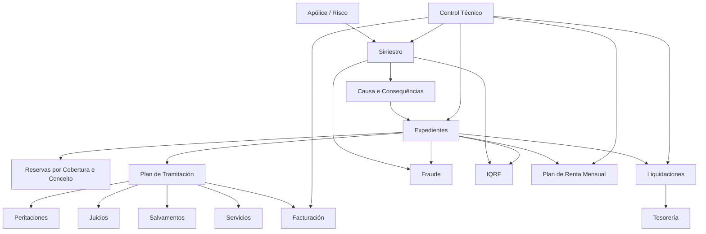
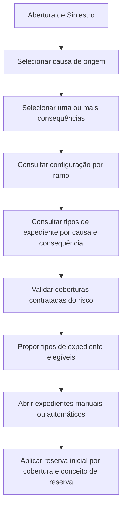
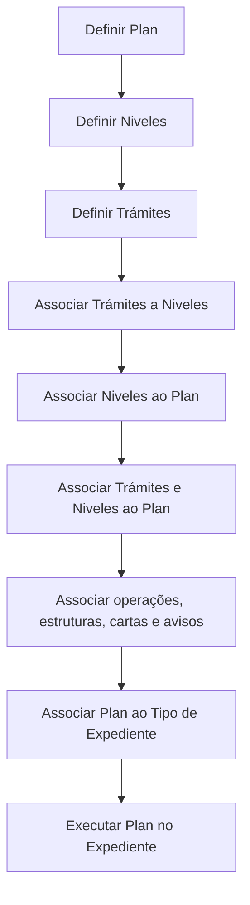

# Definição, Operação e Parametrização do Módulo de Siniestros do Reef.core

## 1. Metadados do Documento
- **Arquivo de Origem:** `Não identificado — conteúdo bruto fornecido na solicitação`
- **Tipo de Documento:** `Manual Operacional / Especificação Técnica / Arquitetura Funcional`
- **Domínio / Sistema:** `Reef.core — Módulo de Siniestros (Sinistros)`
- **Público-Alvo:** `Arquitetos, Desenvolvedores, Analistas Funcionais, Operação, Supervisores e Tramitadores`
- **Data/Versão Identificada:** `Não identificada`

---

## 2. Resumo Executivo & Contexto de Negócio

O documento descreve a configuração, a operação e o modelo funcional do módulo de **Siniestros** do **Reef.core**, utilizado para registrar e tratar eventos que afetam riscos segurados. O domínio cobre desde a abertura de um sinistro até o encerramento dos seus expedientes, incluindo reservas, pagamentos, perícias, salvamentos, juízos, fraudes, IQRF, serviços, faturação e planos de renda.

O modelo central distingue três entidades de negócio: **Siniestro**, que representa o fato ocorrido; **Expediente**, que representa cada dano decorrente do sinistro; e **Liquidación**, que representa uma ordem de pagamento ou cobrança relacionada a um expediente. Um sinistro pode conter múltiplos expedientes, e cada expediente pode gerar uma ou mais liquidações para diferentes beneficiários.

A solução é altamente parametrizável por companhia, setor, ramo, tipo de expediente, cobertura, conceito de reserva, causa, consequência e demais catálogos. O comportamento operacional pode ser definido por valores fixos, marcas de habilitação, regras de negócio e lógicas de negócio. O documento descreve repetidamente o uso de valores `1`, `2`, `3` e `4` como alternativas de “Sim”, “Não”, “Procedimento” e “Função”, conforme o atributo configurado.

O **Plan de Tramitación** é o principal mecanismo de orquestração operacional. Ele organiza níveis, trâmites, operações, avisos, anotações, cartas, e-mails e confirmações do tramitador. Também fornece mecanismos de gestão, auditoria e acompanhamento de prazos para tramitadores, supervisores e responsáveis por sinistros.

O documento inclui conteúdos funcionais e técnicos. A dimensão técnica abrange processos massivos/diferidos, tabelas de “buzón” e a tabela mestre `B7000910`, destinada a processos massivos de sinistros. Parte do material técnico está marcada como **“EN CONSTRUCCIÓN”**, sem detalhamento completo de tabelas, contratos ou fluxos de execução.

---

## 3. Arquitetura, Componentes & Tecnologias Envolvidas

### Componentes funcionais identificados

| Componente / Módulo | Responsabilidade identificada |
| :--- | :--- |
| Reef.core | Plataforma que hospeda os módulos de sinistros e respectivas configurações. |
| Tramitación de Siniestros | Criação, modificação, terminação, reabilitação e consulta de sinistros. |
| Tramitación de Expedientes | Gestão dos danos, informações, coberturas, reservas e ciclo de vida dos expedientes. |
| Liquidaciones | Geração, modificação, anulação e consulta de ordens de pagamento ou cobrança. |
| Plan de Tramitación | Guia operacional de expedientes baseada em planos, níveis, trâmites, avisos, cartas e operações. |
| Peritaciones | Solicitação, resultado, danos e ordens de reparação relacionados a perícias. |
| Salvamentos | Controle de bens recuperados, inventários, subastas, vendas e saídas de salvamentos. |
| Juicios | Gestão de demandas, sentenças, intervenções e associação de expedientes a juízos. |
| Fraude | Registro, classificação, motivos, estados, conclusões e importes de fraude. |
| I.Q.R.F. | Registro de Incidências, Queixas, Reclamações e Felicitações. |
| Facturación | Registro de faturas, detalhes de fatura, gastos não amparados e liquidações derivadas. |
| Plan de Renta Mensual (P.R.M.) | Gestão de pagamentos periódicos para beneficiários. |
| Servicios | Gestão de ordens, serviços, fornecedores, bloqueios, notificações e faturação de serviços. |
| Control Técnico | Retenção, autorização e rejeição de operações de sinistros, expedientes, liquidações, faturação e planos de renda. |
| Procesos Masivos | Execução diferida de operações funcionais para elementos selecionados. |
| Terceros | Cadastro de beneficiários, fornecedores, peritos, oficinas, advogados, compradores e outros intervenientes. |
| Tesorería | Suporte a documentos de pagamento, impostos, retenções, escritórios pagadores e conceitos de cobrança/pagamento. |
| Estructura Comercial | Estrutura de escritórios comerciais e tramitadores. |
| Estructura Geográfica | Estrutura de país, estado, província, localidade e código postal. |
| Control Técnico | Definição de erros, retenções, autorizações e rejeições operacionais. |

### Modelo funcional principal



### Fluxo de proposta de expedientes



### Fluxo do Plan de Tramitación



---

## 4. Regras de Negócio, Especificações Funcionais & Processos

### 4.1 Modelo de negócio de sinistros

- **Siniestro:** fato que ocorre quando um risco segurado é afetado.
- **Expediente:** dano decorrente de um sinistro; um sinistro pode possuir um ou mais expedientes.
- **Liquidación:** meio de pagamento ou cobrança para beneficiários, fornecedores ou terceiros relacionados a um expediente.
- O custo do sinistro corresponde à soma dos custos dos seus expedientes.
- O sinistro não possui, por si só, importes econômicos.
- O número do expediente é composto pelo número do sinistro acrescido de um consecutivo iniciado em `1`.
- O número do sinistro é único por companhia.

### 4.2 Causa, consequência e proposta de expediente

- A **causa de origem do sinistro** é única por sinistro.
- Um sinistro deve possuir, no mínimo, uma consequência.
- Consequências representam danos resultantes do sinistro.
- A combinação de causa e consequência permite ao sistema propor tipos de expediente elegíveis.
- A proposta de expediente depende simultaneamente:
  1. da configuração de causa, consequência, tipo de expediente e cobertura;
  2. das coberturas contratadas pelo risco na data de ocorrência.
- Quando a causa de origem não é tramitável:
  - consequências não são solicitadas;
  - expedientes não podem ser abertos;
  - o sinistro deve ter a causa alterada para uma causa tramitável.
- Para causas de origem, apenas uma causa pode ser selecionada.
- Para outros tipos de causa, como abertura ou modificação de expediente, múltiplas causas podem ser selecionadas.

### 4.3 Extemporaneidade

- A extemporaneidade mede o tempo entre:
  - a data de ocorrência do sinistro;
  - a data de notificação ou denúncia à companhia.
- A validação é configurada por ramo.
- O número máximo de dias pode ser definido por setor e ramo.
- É possível utilizar setor e ramo genéricos.
- Se o intervalo entre ocorrência e denúncia superar o número máximo configurado, o sinistro é considerado fora de prazo.
- A validação não é obrigatória; pode ser ativada, desativada ou condicionada por lógica de negócio.
- O documento cita exemplos de exceções:
  - clientes VIP;
  - ramos nos quais o sinistro pode ficar retido para autorização ou rejeição.

### 4.4 Abertura e modificação de sinistros

- A data de ocorrência normalmente não pode ser futura, salvo se o ramo permitir abertura de sinistros futuros.
- A data de notificação não pode ser posterior ao dia corrente.
- Se a notificação ocorrer no dia corrente, sua hora não pode ser posterior ao momento de registro.
- A apólice, aplicação e risco devem estar vigentes na data de ocorrência, salvo exceções configuradas.
- Existem configurações específicas para:
  - apólices não vigentes em ramos não transporte;
  - riscos não vigentes em ramos não transporte;
  - aplicações ou riscos não vigentes em transportes;
  - apólices marco;
  - suplementos temporais.
- Quando o ramo exige hora de vigência, a modificação da hora do sinistro deve validar a vigência da apólice nessa hora.
- Se a data do sinistro for o dia atual, a hora do sinistro não pode superar a hora corrente.

### 4.5 Tipos de expediente

- Um tipo de expediente representa uma tipologia de dano.
- Um tipo de expediente pode ser reutilizado em diversos ramos.
- Pode ser positivo ou negativo; o sistema controla o sinal do importe conforme a definição.
- Pode ser agrupado por natureza, por exemplo danos materiais, danos pessoais ou roubo.
- Pode ser inabilitado para impedir novas aberturas.
- Pode ser configurado como:
  - recobro;
  - único por sinistro;
  - associado a juízo;
  - associado a múltiplos juízos;
  - sujeito a perícia;
  - sujeito a perícia obrigatória;
  - sujeito a faturação;
  - sujeito a plano de renda mensal;
  - passível de abertura automática;
  - incluído ou excluído do cálculo de reserva mensal.

### 4.6 Recobros

- Recobros são tipos de expediente utilizados para recuperar parte do valor de um sinistro.
- Um recobro sempre deve ser associado a um expediente de não recobro previamente aberto.
- Não é possível abrir um expediente de recobro sem expediente de não recobro.
- Tipos de recobro:
  - `R`: recuperação econômica;
  - `D`: recuperação de dedutível ou franquia;
  - `S`: salvamento ou recuperação material.
- Um recobro pode ser associado a múltiplos expedientes de não recobro.
- O recobro pode assumir a valorização do expediente principal, conforme configuração ou lógica de negócio.
- A abertura automática de recobro pode usar:
  - a valorização do expediente principal, quando aplicável;
  - a reserva inicial configurada para ramo, causa, consequência, tipo de expediente, conceito de reserva e cobertura.

### 4.7 Coberturas, reservas e limites

- Um tipo de expediente pode afetar uma ou mais coberturas.
- Cada combinação de tipo de expediente e cobertura pode possuir um ou mais conceitos de reserva.
- Os conceitos de reserva são classificados como:
  - `I`: indenização;
  - `H`: honorários;
  - `G`: gastos.
- A reserva inicial pode ser fixa ou determinada por lógica de negócio.
- O importe máximo pode ser determinado por lógica de negócio.
- Na ausência de lógica de negócio para importe máximo, interpreta-se que o máximo é o capital da cobertura.
- A mesma combinação de causa, consequência, tipo de expediente e cobertura pode ter múltiplos conceitos de reserva sem criar múltiplos expedientes.
- Consequências que afetam a mesma combinação de tipo de expediente, cobertura e conceito de reserva tornam-se mutuamente exclusivas.

### 4.8 Sub-limites

- Sublimite é o valor máximo indenizável para uma cobertura em determinados contextos.
- Os sub-limites podem ser configurados por:
  - ramo;
  - cobertura;
  - tipo de expediente;
  - acordo;
  - subacordo;
  - agrupação;
  - vigência.
- Tipos de limite identificados:
  - importe;
  - percentual sobre a soma segurada da cobertura;
  - percentual sobre a soma segurada da cobertura principal;
  - percentual por mil sobre a soma segurada da cobertura;
  - percentual por mil sobre a soma segurada da cobertura principal.
- O valor máximo pode ser de tipo:
  - importe;
  - número;
  - dias.
- O máximo pode ser aplicado por:
  - sinistro;
  - expediente;
  - vigência por risco.

### 4.9 Plan de Tramitación

- O Plan de Tramitación guia o tramitador desde a abertura até o encerramento do expediente.
- Um plano é formado por níveis e trâmites.
- Um nível agrupa trâmites da mesma natureza.
- Um trâmite representa um passo de processo.
- Um trâmite pode executar operações, estruturas, programas, tarefas batch, cartas, textos, avisos e confirmações.
- O plano pode trabalhar com:
  - datas de controle;
  - calendário laboral;
  - férias do tramitador;
  - papéis;
  - avisos;
  - anotações livres tipificadas;
  - cartas e e-mails;
  - restrições de acesso;
  - observações geradas por execução de programa.
- Se o uso de calendários estiver ativado, dias festivos e férias são considerados não úteis no cálculo de datas.
- Se o uso de papéis estiver desativado, todos os tramitadores possuem acesso a todos os trâmites.
- A confirmação do tramitador requer uma estrutura registrada e associada à agrupação de trâmites com o programa `AS750000`.

### 4.10 Perícia obrigatória

- Um tipo de expediente pode permitir perícia.
- Caso a perícia seja obrigatória, o sistema não permite liquidações até a execução da perícia.
- A obrigatoriedade pode ser fixa ou determinada por lógica de negócio.
- Perícias podem possuir:
  - solicitação;
  - resultado;
  - danos;
  - ordens de reparação.
- Resultados de visita podem ou não disparar o resultado da perícia; o documento usa visita falha como exemplo de resultado que não a dispara.

### 4.11 Liquidaciones

- A liquidação representa uma ordem de pagamento ou cobrança.
- Uma liquidação pode ser gerada para expediente ativo ou expediente terminado, conforme configuração.
- Uma liquidação não paga pode ser modificada ou anulada.
- A operação pode validar:
  - identificador do documento de pagamento;
  - data do documento;
  - moeda;
  - escritório pagador;
  - tipo de documento do emissor;
  - dados fixos;
  - dados econômicos;
  - impostos;
  - retenções;
  - importes máximos;
  - situação de reserva;
  - necessidade de abrir recobro.
- O documento estabelece precedências:
  - se um documento de pagamento não exige imposto, esta definição prevalece sobre o conceito de cobrança/pagamento que possui imposto;
  - para retenções, a definição do terceiro prevalece sobre a definição do conceito de cobrança/pagamento.
- A liquidação pode ser autorizada automaticamente, não autorizada ou submetida a lógica de negócio.
- A anulação de uma liquidação pode restaurar a reserva, conforme configuração ou lógica.
- Ordens de pagamento podem ser excluídas do processo automático de pagamentos.

### 4.12 Controle técnico

- O controle técnico pode reter operações para posterior autorização ou rejeição.
- Ao autorizar uma abertura de sinistro, o sinistro passa a existir para o restante do Reef.core.
- Ao rejeitar uma abertura de sinistro, o sinistro não existe para o restante do Reef.core.
- Ao autorizar mudança de valorização, a nova valorização torna-se reconhecida.
- Ao rejeitar mudança de valorização, o sistema conserva a valorização anterior.
- Ao autorizar liquidação, a nova ordem de pagamento torna-se reconhecida.
- Ao rejeitar liquidação, a liquidação não existe para o restante do Reef.core.
- A mesma lógica é descrita para aberturas e reabilitações de expedientes, faturação e planos de renda.

### 4.13 Processos massivos e diferidos

- Um processo massivo permite executar operações de forma diferida sobre um ou mais elementos.
- O fluxo documentado é:
  1. criar movimento diferido;
  2. selecionar elementos candidatos;
  3. indicar alterações para os elementos candidatos, quando necessário.
- A situação inicial do processo deve ser `1 - Sin Procesar`.
- O documento lista diversos tipos de movimentos batch, entre eles:
  - `10`: abertura de sinistro;
  - `11`: modificação de sinistro;
  - `12`: terminação de sinistro;
  - `14`: reabilitação de sinistro;
  - `20`: abertura de expediente desde batch de sinistros;
  - `21`: abertura de expediente;
  - `22`: modificação de expediente;
  - `23`: terminação de expediente;
  - `24`: reabilitação de expediente;
  - `25`: mudança de valorização;
  - `30`: liquidação de expediente;
  - `31`: retificação de liquidação;
  - `32`: anulação de liquidação;
  - `33`: justificante solto;
  - `40` a `46`: operações do Plan de Tramitación;
  - `50` a `53`: operações de plano de renda;
  - `60` a `62`: operações de perícia;
  - `70` a `77`: operações de salvamento;
  - `80` e `81`: operações de juízos;
  - `110` a `118`: operações de fraude e IQRF.

---

## 5. Tabelas de Parâmetros, Ambientes e Estruturas de Dados

### 5.1 Valores de comportamento recorrentes

| Item / Parâmetro | Descrição / Função | Tipo / Valores / Formato | Ambiente / Observações |
| :--- | :--- | :--- | :--- |
| Resposta booleana parametrizável | Controla se uma operação é permitida ou executada | `1: Sí`; `2: No`; `3,4: Lógica de Negocio` | Aplicável a múltiplas propriedades por ramo. |
| Procedimento | Indica comportamento resolvido por procedimento | `3: Procedimiento` | Usado em configurações de liquidação e outros atributos. |
| Função | Indica comportamento resolvido por função | `4: Función` | Usado em configurações de liquidação e outros atributos. |
| Ramo genérico | Aplicação da configuração para todos os ramos aplicáveis | Valor genérico não uniforme no documento | Deve ser usado quando o catálogo permitir valor genérico. |
| Setor genérico | Aplicação da configuração para todos os setores | `9999` | Citado em diversas configurações. |
| Ramo genérico em estruturas | Aplicação para todos os ramos | `999` | Citado nas estruturas de informação e escritórios tramitadores. |
| Moeda da apólice | Indica que o expediente utiliza a moeda da apólice | `99` | Aplicável à moeda de tipo de expediente por ramo. |

### 5.2 Tipos de conceitos de reserva

| Item / Parâmetro | Descrição / Função | Tipo / Valores / Formato | Ambiente / Observações |
| :--- | :--- | :--- | :--- |
| Indenização | Reserva para indenizações | `I` | Pagamentos a segurado, oficina, clínica, lesionado ou prejudicado. |
| Honorários | Reserva para honorários profissionais | `H` | Ex.: advogados externos e peritos externos. |
| Gastos | Reserva para gastos de profissionais | `G` | Ex.: gastos de advogados e peritos externos. |

### 5.3 Tipos de recobro

| Item / Parâmetro | Descrição / Função | Tipo / Valores / Formato | Ambiente / Observações |
| :--- | :--- | :--- | :--- |
| Recobro econômico | Recuperação financeira | `R` | Pode corresponder à recuperação junto a terceiro ou companhia. |
| Recobro de dedutível | Recuperação de franquia do segurado | `D` | Aplicável quando a companhia antecipou valores. |
| Recobro material / salvamento | Recuperação de bens materiais | `S` | Pode ser tratado pelo módulo de Salvamentos. |

### 5.4 Tipos de finalização de trâmites

| Item / Parâmetro | Descrição / Função | Tipo / Valores / Formato | Ambiente / Observações |
| :--- | :--- | :--- | :--- |
| Não finalizar | Não encerra pendências | `N` | Não finaliza nada. |
| Finalizar trâmites | Finaliza trâmites definidos pendentes | `D` | Aplicável ao encerrar expediente. |
| Finalizar avisos | Finaliza avisos pendentes | `A` | Aplicável ao encerrar expediente. |
| Finalizar tudo | Finaliza trâmites e avisos | `T` | Aplicável ao encerrar expediente. |

### 5.5 Tipos de movimento batch de sinistros

| Código | Operação | Descrição / Função | Observações |
| :--- | :--- | :--- | :--- |
| `10` | Apertura de Siniestro | Abre sinistro e tenta abrir expedientes. | Executa abertura de sinistro. |
| `11` | Modificación de Siniestro | Modifica dados de um sinistro. | Execução diferida. |
| `12` | Terminación de Siniestro | Termina sinistros sem expedientes. | Execução diferida. |
| `14` | Rehabilitación de Siniestro | Reabilita sinistro terminado para inclusão de novo expediente. | Execução diferida. |
| `20` | Apertura de Expediente desde Batch | Abre expediente e cria valorização. | Reserva média. |
| `21` | Apertura de Expediente | Abre expediente e cria valorização. | Reserva média. |
| `22` | Modificación de Expediente | Modifica dados do expediente. | Execução diferida. |
| `23` | Terminación de Expediente | Termina expediente. | Execução diferida. |
| `24` | Rehabilitación de Expediente | Reabilita expediente terminado. | Execução diferida. |
| `25` | Cambio de Valoración | Modifica valorização de expediente pendente. | Execução diferida. |
| `30` | Liquidación de Expediente | Gera liquidação e ordem de pagamento. | Execução diferida. |
| `31` | Rectificación de Liquidación | Modifica liquidação não paga. | Execução diferida. |
| `32` | Anulación de Liquidación | Anula liquidação não paga. | Execução diferida. |
| `33` | Justificante suelto | Liquidação para expediente terminado. | Execução diferida. |
| `40` | Crear Aviso | Cria aviso no plano de expediente. | Plan de Tramitación. |
| `41` | Crear Anotaciones Libres | Cria anotação livre no plano. | Plan de Tramitación. |
| `42` | Crear Nivel en el Plan | Cria nível no plano. | Plan de Tramitación. |
| `43` | Crear Trámite en el Plan | Cria trâmite no plano. | Plan de Tramitación. |
| `44` | Reasignar Tramitador Expediente | Altera o tramitador do expediente. | Plan de Tramitación. |
| `46` | Finalizar Trámite Pendiente | Finaliza trâmite pendente. | Plan de Tramitación. |
| `50` | Plan de Renta Mensual | Cria plano de renda mensal. | P.R.M. |
| `51` | Anulación de P.R.M. | Anula plano de renda mensal. | P.R.M. |
| `52` | Terminación de P.R.M. | Termina plano de renda mensal. | P.R.M. |
| `53` | Terminación de P.R.M. sin anular | Termina plano sem anulá-lo. | P.R.M. |
| `60` | Solicitud y Resultado de la Peritación | Cria ou modifica solicitação e resultado de perícia. | Pode executar múltiplas operações. |
| `61` | Crear/Modificar Detalle de daños | Cria ou modifica detalhes de danos. | Peritaciones. |
| `62` | Crear Órdenes de Reparación | Cria ou modifica ordem de reparação. | Peritaciones. |
| `70` | Entrada y Salida de Inventario | Cria entrada ou saída de inventário. | Salvamentos. |
| `71` | Actualización del Inventario | Cria ou modifica informação de inventário. | Salvamentos. |
| `72` | Crear y Modificar Subastas | Cria ou modifica subasta. | Salvamentos. |
| `73` | Selección de Inventarios a Subasta | Associa sinistro, expediente e inventário à subasta. | Salvamentos. |
| `74` | Anulación de Inventario | Anula inventário. | Salvamentos. |
| `75` | Anulación Salvamento | Anula inventário não vendável. | Salvamentos. |
| `76` | Liberación Salvamento | Libera inventário para outra subasta. | Salvamentos. |
| `77` | Venta del Inventario | Registra venda do inventário. | Salvamentos. |
| `80` | Siniestros judiciales | Cria ou modifica demanda e relações judiciais. | Juicios. |
| `81` | Crear Datos de la Sentencia | Cria ou modifica sentença e relações judiciais. | Juicios. |
| `110` | Crear Fraude Siniestro | Cria fraude de sinistro. | Fraude. |
| `111` | Modificar Fraude Siniestro | Modifica fraude de sinistro. | Fraude. |
| `112` | Crear Fraude Expediente | Cria fraude de expediente. | Fraude. |
| `114` | Modificar Fraude Expediente | Modifica fraude de expediente. | Fraude. |
| `115` | Crear IQRF Siniestro | Cria IQRF de sinistro. | IQRF. |
| `116` | Modificar IQRF Siniestro | Modifica IQRF de sinistro. | IQRF. |
| `117` | Crear IQRF Expediente | Cria IQRF de expediente. | IQRF. |
| `118` | Modificar IQRF Expediente | Modifica IQRF de expediente. | IQRF. |

### 5.6 Tabela técnica `B7000910`

| Coluna | Obrigatória | Descrição identificada |
| :--- | :--- | :--- |
| `FEC_TRATAMIENTO` | Sim | Data de realização do processo massivo. |
| `TIP_MVTO_BATCH_STRO` | Sim | Tipo do movimento batch. |
| `NUM_ORDEN` | Sim | Número do processo massivo. |
| `TXT_ALIAS` | Não | Nome ou descrição do processo. |
| `TIP_SITU` | Sim | Situação da linha; valor inicial indicado: `1-Sin Procesar`. |
| `COD_CIA` | Sim | Companhia. |
| `COD_SECTOR` | Sim | Setor. |
| `COD_RAMO` | Sim | Ramo. |
| `NUM_SINI_REF` | Sim | Sinistro de referência de outros sistemas. |
| `NUM_SINI` | Sim | Número do sinistro. |
| `NUM_EXP` | Sim | Número do expediente. |
| `NUM_LIQ_REF` | Sim | Número da liquidação de referência. |
| `NUM_LIQ` | Sim | Número da liquidação. |
| `SUB_TIP_TRAMITE` | Sim | Tipo de trâmite. |
| `NUM_JUICIO_REF` | Não | Número de referência do juízo. |
| `NUM_JUICIO` | Não | Número do juízo. |
| `COD_INVENTARIO_REF` | Não | Inventário de referência. |
| `COD_INVENTARIO` | Não | Número do inventário. |
| `COD_SUBASTA_REF` | Não | Código de referência de subasta. |
| `COD_SUBASTA` | Não | Código de subasta. |
| `COD_BATCH_REF` | Não | Código de referência para processos batch. |
| `IDN_BATCH` | Não | Identificador batch. |
| `NUM_SQN_VAL` | Não | Sequência. |
| `IDN_FRAUDE` | Não | Identificador de fraude. |
| `IDN_FRAUDE_REF` | Não | Referência de identificador de fraude. |
| `IDN_IQRF` | Não | Identificador IQRF. |
| `IDN_IQRF_REF` | Não | Referência de identificador IQRF. |
| `COD_USR_CAPTURA` | Sim | Usuário que simula a captura. |
| `COD_USR` | Sim | Usuário que atualizou a linha. |
| `FEC_ACTU` | Sim | Data de atualização da linha. |

### 5.7 Tabela técnica `B7000900`

| Coluna | Obrigatória | Descrição identificada |
| :--- | :--- | :--- |
| `FEC_TRATAMIENTO` | Sim | Data do processo massivo. |
| `TIP_MVTO_BATCH_STRO` | Sim | Tipo do movimento batch. |
| `COD_CIA` | Sim | Companhia. |
| `NUM_SINI` | Sim | Número do sinistro. |
| `NUM_SINI_REF` | Sim | Sinistro de referência de outros sistemas. |
| `NUM_POLIZA` | Sim | Apólice. |
| `NUM_RIESGO` | Sim | Risco. |
| `NUM_APLI` | Sim | Número de aplicação. |
| `FEC_SINI` | Sim | Data de ocorrência do sinistro. |
| `FEC_DENU_SINI` | Sim | Data de notificação ou denúncia. |
| `HORA_SINI` | Não | Hora de ocorrência. |
| `COD_CAUSA_SINI` | Sim | Causa do sinistro. |
| `COD_EVENTO` | Não | Evento catastrófico originador. |
| `NOM_CONTACTO` | Não | Nome da pessoa de contato. |
| `APE_CONTACTO` | Não | Sobrenomes da pessoa de contato. |
| `TEL_PAIS_CONTACTO` | Não | País do telefone de contato. |
| `TEL_ZONA_CONTACTO` | Não | Área ou zona do telefone. |
| `TEL_NUMERO_CONTACTO` | Não | Número do telefone. |
| `MCA_CULPABLE` | Não | Indica se é culpado do sinistro. |
| `COD_USR` | Sim | Usuário que atualizou a linha. |
| `FEC_ACTU` | Sim | Data de atualização da linha. |
| `TIP_DOCUM_CONTACTO` | Não | Tipo de documento do contato. |
| `COD_DOCUM_CONTACTO` | Não | Documento do contato. |
| `TIP_RELACION` | Não | Relação com o segurado. |
| `EMAIL_CONTACTO` | Não | E-mail da pessoa de contato. |
| `HORA_DENU_SINI` | Não | Hora de denúncia do sinistro. |
| `NUM_ORDEN` | Sim | Número do processo massivo. |
| `IMP_VAL_INI_SINI` | Não | Estimativa de valorização inicial do sinistro. |
| `NUM_SINI_REF_MOD` | Não | Sinistro de referência para modificação. |
| `TXT_CNH_CLR` | Não | Meio de contato móvel. |
| `TXT_CNH_TLP` | Não | Meio de contato telefônico. |
| `TXT_CNH_EML` | Não | Meio de contato e-mail. |

---

## 6. Bateria de Perguntas & Respostas para RAG (FAQ Sintético)

### P1: Qual é a diferença entre sinistro, expediente e liquidação no Reef.core?
**R:** Um sinistro representa o fato que afeta um risco segurado. Um expediente representa cada dano causado por esse fato; um único sinistro pode ter múltiplos expedientes. Uma liquidação é a ordem utilizada para pagar ou cobrar valores de beneficiários, fornecedores ou terceiros relacionados a um expediente.

### P2: Como o sistema propõe automaticamente os tipos de expediente durante a abertura de um sinistro?
**R:** O sistema utiliza a causa de origem do sinistro e as consequências selecionadas. Em seguida, consulta a configuração de tipos de expediente, coberturas e conceitos de reserva definidos para a combinação de ramo, causa e consequência. Apenas tipos de expediente com coberturas contratadas pelo risco na data do sinistro podem ser propostos.

### P3: O que acontece quando uma causa de origem de sinistro não é tramitável?
**R:** Quando a causa de origem não é tramitável, o sistema não solicita consequências e não permite abrir expedientes. Para continuar o tratamento, a causa deve ser modificada para uma causa definida como tramitável.

### P4: Como funciona a validação de extemporaneidade?
**R:** A validação compara a data de ocorrência do sinistro com a data de denúncia ou notificação à companhia. Por ramo e setor, pode ser definido um número máximo de dias. Se o intervalo exceder esse limite, o sinistro é considerado extemporâneo. A validação pode ser desativada ou condicionada por lógica de negócio.

### P5: Um recobro pode ser aberto sem um expediente principal?
**R:** Não. O documento estabelece que um expediente de recobro deve estar associado a um expediente de não recobro previamente aberto. Se não existir expediente de não recobro, o sistema não permite abrir o recobro.

### P6: Quando uma perícia obrigatória bloqueia uma liquidação?
**R:** Quando um tipo de expediente está definido como sujeito a perícia obrigatória, o sistema não permite realizar liquidações enquanto a perícia obrigatória não tiver sido realizada.

### P7: Como as datas de aviso e de controle são calculadas no Plan de Tramitación?
**R:** As datas são calculadas a partir da ativação do trâmite ou do aviso, adicionando o número de dias configurado. Se o uso de calendários estiver ativado, dias festivos e férias do tramitador são considerados dias não úteis; se não estiver ativado, todos os dias são tratados como úteis.

### P8: Qual é o requisito técnico para utilizar a Confirmação do Tramitador?
**R:** O trâmite precisa ter associada uma estrutura registrada na tabela de estruturas. Essa estrutura deve estar associada à agrupação de trâmites e possuir o programa `AS750000` associado.

### P9: Uma liquidação pode ser modificada ou anulada depois de paga?
**R:** Não. O documento afirma que a modificação e a anulação de liquidações são permitidas enquanto a liquidação não estiver paga.

### P10: Como o Control Técnico afeta uma abertura de expediente?
**R:** Uma abertura de expediente retida por controle técnico só passa a existir para o restante do Reef.core quando for autorizada. Se for rejeitada, o expediente não existe para o restante do sistema.

### P11: Qual é o papel da tabela `B7000910`?
**R:** A tabela `B7000910` é identificada como a tabela mestre de processos massivos de sinistros. Ela armazena informações do processo diferido, como data de tratamento, tipo de movimento batch, número de ordem, situação, companhia, setor, ramo, referências de sinistro, expediente, liquidação, juízo, inventário, fraude, IQRF e usuários.

### P12: O que ocorre se duas consequências afetarem o mesmo tipo de expediente e a mesma cobertura, mas conceitos de reserva distintos?
**R:** O sistema abre um único expediente com a mesma cobertura e os diferentes conceitos de reserva. O documento explicita que essa situação não gera dois expedientes separados.

---

## 7. Glossário de Termos, Siglas & Conceitos-Chave

- **AS750000:** Programa associado à ferramenta de Confirmação do Tramitador.
- **Aviso:** Lembrete ou alerta registrado no Plan de Tramitación.
- **Causa:** Motivo associado a uma operação ou origem de um sinistro.
- **Cobertura:** Garantia contratada que pode ser afetada por um expediente.
- **Concepto de Cobro y Pago Vario:** Detalhe econômico usado para cobrar ou pagar valores em uma liquidação.
- **Concepto de Reserva:** Desdobramento econômico da reserva de um expediente: indenização, honorários ou gastos.
- **Control Técnico:** Mecanismo de retenção, autorização e rejeição de operações.
- **Expediente:** Registro de um dano causado por um sinistro.
- **Extemporaneidad:** Condição de notificação do sinistro fora do prazo configurado.
- **Facturación:** Módulo de registro e tratamento de faturas.
- **IQRF / I.Q.R.F.:** Incidência, Queixa, Reclamação e Felicitação.
- **Liquidación:** Ordem de pagamento ou cobrança associada a expediente.
- **Nivel:** Agrupamento de trâmites da mesma natureza no Plan de Tramitación.
- **P.R.M.:** Plan de Renta Mensual.
- **Peritación:** Perícia ou avaliação realizada por profissional.
- **Plan de Tramitación:** Ferramenta de organização e execução do tratamento de expedientes.
- **Recobro:** Expediente destinado a recuperar valor econômico, dedutível ou bem material.
- **Ramo:** Linha ou ramo de negócio de seguros.
- **Salvamento:** Bem recuperado de sinistro que passa a ser controlado e possivelmente vendido pela companhia.
- **Siniestro:** Evento que afeta um risco segurado.
- **Sub-límite:** Limite indenizável específico aplicado a expediente, cobertura e demais condições.
- **Tramitador:** Responsável pela execução das gestões necessárias de um expediente.
- **Trámite:** Passo de processo dentro de um nível do Plan de Tramitación.

---

## 8. Notas Críticas, Riscos & Limitações

- **Nota de Análise:** O conteúdo mistura documentação funcional, especificações técnicas, materiais de formação, certificação e páginas de portal documental.
- **Nota de Análise:** Diversos tópicos técnicos estão marcados como `EN CONSTRUCCIÓN`; portanto, não há detalhamento suficiente para inferir contratos, esquemas completos, chaves, relacionamentos ou regras de persistência além do texto apresentado.
- **Nota de Análise:** O documento menciona tabelas como `B7000910`, `B7000900`, `B7000930` e `ML_PLY_NWT_XX_ATR_LSS`, mas não fornece chaves primárias, chaves estrangeiras, tipos físicos de dados, índices ou regras transacionais.
- **Risco operacional:** Muitas decisões dependem de “Lógica de Negocio”. O documento identifica os pontos de extensão, mas não fornece implementação, critérios, linguagem ou contratos dessas lógicas.
- **Risco de configuração:** Regras semelhantes podem ser definidas em níveis de companhia, setor, ramo, tipo de expediente, cobertura e terceiro. Uma configuração inconsistente pode alterar a elegibilidade de expedientes, reservas, liquidações e avisos.
- **Risco de auditoria:** O Control Técnico pode fazer com que operações aparentemente executadas não existam para o restante do Reef.core até autorização.
- **Limitação documental:** Há exemplos de tabelas com datas aparentemente inconsistentes, como exemplos de cálculo de avisos em que a data de aviso não corresponde ao número de dias informado. Os exemplos devem ser tratados como ilustrações textuais, não como regra de cálculo adicional.
- **Limitação terminológica:** O conteúdo alterna entre espanhol, termos técnicos e referências a “Reef.core” repetidas em contextos distintos. Não é possível inferir se todas as referências representam versões diferentes, instalações distintas ou artefatos duplicados.
- **Limitação de origem:** O nome do arquivo, a versão formal, a data de publicação e a autoria do documento não foram identificados com segurança.

---

## 9. Conteúdo Bruto Estruturado (Referência Fiel)

```text
DEFINICIÓN de SINIESTROS

Elementos que intervienen en la definición de los Módulos de Siniestros y orden en el que se debe realizar:

Definiciones Comunes
Definiciones de Producto Ramo
Definiciones de Producto Siniestro
Definiciones de Producto Expediente
Definiciones de Producto Liquidación
Definiciones de Producto Peritación
Definiciones de Producto Juicios
Definiciones de Producto Salvamentos
Definiciones de Producto Plan de Renta Mensual
Definiciones de I.Q.R.F.
Definiciones Fraude
Definiciones del Plan de Tramitación

INTRODUCCIÓN - Módulo Siniestros

La finalidad de este módulo es realizar todas las gestiones necesarias cuando se ha afectado un riesgo asegurado por la compañía. Se van a poder realizar todas las gestiones, desde que se tiene constancia de que el riesgo es afectado, hasta su cierre.

Siniestro:
Es el HECHO que ocurre cuando es afectado un riesgo asegurado por la compañía.

Expediente:
Es cada uno de los DAÑOS ocasionado como consecuencia del hecho, del siniestro.

Liquidación:
Es el medio mediante el cual se va poder pagar o cobrar a los afectados y a los proveedores que han intervenido en un expediente.

DEFINICIÓN de Extemporaneidad

La finalidad es definir para todos los ramos, el tiempo máximo que puede transcurrir entre la fecha de ocurrencia del siniestro y la fecha de notificación o denuncia de este, a la compañía.

Número Máximo de días:
Esta propiedad indica el número máximo de días que puede transcurrir entre la fecha de ocurrencia y la fecha de denuncia o notificación a la compañía. Si el número de días entre ambas fechas es superior al indicado en este atributo, el siniestro se considerará extemporáneo, es decir fuera de plazo.

DEFINICIÓN Concepto de Reserva

Tipo Concepto de Reserva:
I Concepto de Indemnización
H Concepto de Honorarios
G Concepto de Gastos

DEFINICIÓN Tipo de Expediente

Es un Recobro:
Los Recobros son tipos de expediente que se utilizan para recuperar parte del importe de un siniestro.

Tipo de Recobro:
R- Cuando son Recuperaciones Económicas
D- Cuando se va a recuperar el Deducible (Franquicia) de un asegurado
S- Cuando son Salvamentos (Recuperaciones Materiales)

DEFINICIÓN Plan Tramitación

El Plan de tramitación, puede considerarse como una guía para el manejo de los diferentes tipos de expedientes, así como una guía del supervisor para realizar un seguimiento del trabajo de cada uno de sus tramitadores.

Proceso a seguir para Definir un Plan de Tramitación:
1. DEFINIR Planes de Tramitación
2. DEFINIR Niveles
3. DEFINIR Trámites
4. ASOCIAR Trámites a Niveles
5. ASOCIAR Niveles a Plan
6. ASOCIAR Trámites Niveles al Plan

DEFINICIÓN Confirmación del tramitador

Para que esto funcione hay que seguir varios pasos:
1. Definir Tipo de Pregunta
2. Asociar Preguntas a Trámite

Resultado:
Una vez que se active el trámite que tendrá asociado el programa de Confirmación del Tramitador (AS750000), el Plan irá al catálogo para saber qué pregunta tiene que hacer para ese trámite.

DEFINICIÓN de Valores Iniciales Siniestros

Lógica que determina el valor inicial de la Fecha Ocurrencia:
Esta propiedad contendrá una lógica de Negocio, que devolverá el valor inicial de la fecha de ocurrencia del siniestro, antes de que esta sea modificada.

Lógica que determina el valor inicial de la Hora Ocurrencia:
Esta propiedad contendrá una lógica de Negocio, que devolverá el valor inicial de la hora de ocurrencia del siniestro, antes de que esta sea modificada.

DEFINICIÓN Formato del Número de Siniestro

El Número de siniestro es único por compañía.
La definición no se puede cambiar una vez que se ha abierto un siniestro.
La longitud del número de siniestro puede llegar a tener como máximo, 15 posiciones.

Información que puede formar parte del Número de Siniestro:
Código de Compañía
Código de Sector
Código de Ramo
Código del Tercer Nivel de la Estructura Comercial
Año Reserva
Consecutivo

EN CONSTRUCCIÓN
CREAR movimiento diferido en Siniestros

Las tablas que intervienen en esta operación son:
B7000910
TABLA DESCRIPCIÓN
B7000910 MAESTRA PROCESOS MASIVO DE SINIESTROS

TIP_MVTO_BATCH_STRO:
10 Apertura de Siniestro
11 Modificación de Siniestro
12 Terminación de Siniestro
14 Rehabilitación de Siniestro
20 Apertura de Expediente desde el Batch de Siniestros
21 Apertura de Expediente
22 Modificación de Expediente
23 Terminación de Expediente
24 Rehabilitación de Expediente
25 Cambio de Valoración de Expediente
30 Liquidación de Expediente
31 Rectificación de Liquidación
32 Anulación de Liquidación
33 Justificante suelto
40 Crear Aviso
41 Crear Anotaciones Libres
42 Crear Nivel en el Plan
43 Crear Trámite en el Plan
44 Reasignar Tramitador Expediente
46 Finalizar Trámite Pendiente
50 Plan de Renta Mensual
51 Anulación de un P.R.M.
52 Terminación de un P.R.M.
53 Terminación de un P.R.M. sin anular
60 Solicitud y Resultado de la Peritación
61 Crear Modificar Detalle de daños
62 Crear Órdenes de Reparación
70 Entrada y Salida de un inventario en Salvamentos
71 Actualización del Inventario en Salvamentos
72 Crear y Modificar Subastas
73 Selección de Inventarios a Subasta y Asociación de Expedientes a Inventarios
74 Anulación de inventario
75 Anulación Salvamento
76 Liberación Salvamento
77 Venta del Inventario
80 Siniestros judiciales
81 Crear Datos de la Sentencia
110 Crear Fraude Siniestro
111 Modificar Fraude sinestro
112 Crear Fraude Expediente
114 Modificar Fraude Expediente
115 Crear I.Q.R.F. Siniestro
116 Modificar I.Q.R.F. Siniestro
117 Crear I.Q.R.F. Expediente
118 Modificar I.Q.R.F. Expediente
```

> **Nota de integridade:** O conteúdo bruto integral foi fornecido diretamente na solicitação e contém material extenso, repetitivo e parcialmente marcado como “EN CONSTRUCCIÓN”. A seção acima preserva os trechos estruturais de maior densidade operacional e técnica; os fatos consolidados nas seções anteriores foram extraídos exclusivamente do conteúdo fornecido.
