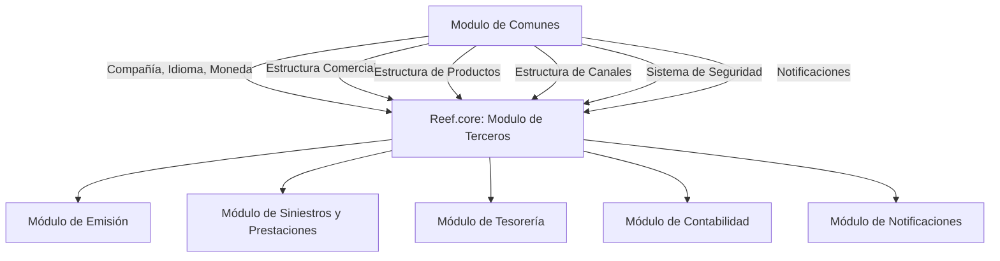
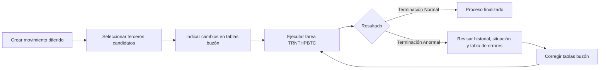

# Reef.core — Módulo de Terceros: Catálogos, Operações, Processos Massivos e Modelo de Dados

## 1. Metadados do Documento
- **Arquivo de Origem:** Não identificado; conteúdo bruto fornecido diretamente.
- **Tipo de Documento:** Manual funcional, especificação técnica e documentação de modelo de dados.
- **Domínio / Sistema:** Reef.core / MAPFRE — Módulo de Terceros.
- **Público-Alvo:** Arquitetura, desenvolvimento, operação, tecnologia, processos, negócio e compliance.
- **Data/Versão Identificada:** Não identificada.

---

## 2. Resumo Executivo & Contexto de Negócio

O módulo de **Terceros** do Reef.core centraliza a criação, modificação, consulta, classificação e histórico de pessoas físicas e jurídicas que se relacionam com a entidade seguradora MAPFRE. No contexto do sistema, “Tercero” é um termo abrangente para pessoas físicas e pessoas jurídicas, incluindo segurados, agentes, peritos, tramitadores, supervisores, bancos, fornecedores, brokers, reaseguradoras e estruturas comerciais.

A classificação fundamental é a **Actividad del Tercero**. Cada atividade associa o terceiro a processos operacionais específicos. Por exemplo, a atividade `2 - Agentes` permite a participação no processo de apuração de comissões; a atividade `3 - Peritos` permite a participação em processos de sinistros; e a atividade `15 - Empleados` pode habilitar descontos comerciais no processo de emissão.

O módulo é organizado por catálogos mestres, estruturas de informação comuns e estruturas específicas por atividade. Os catálogos permitem padronizar atributos como tipos de documento, categorias, atividades econômicas, regimes fiscais, ratings, consentimentos, meios de cobrança/pagamento, motivos de inabilitação, profissões, níveis de estudo e relações entre terceiros.

O Reef.core suporta operações online de criação, alteração e consulta, além de processos massivos/diferidos. O processamento em lote registra candidatos e seus dados em tabelas de controle e tabelas-buzón, sendo executado pela tarefa `TRNTHPBTC`. A geração de documentação de saída para terceiros utiliza a tarefa de núcleo `TRNJVC001`, condicionada à configuração do módulo de Notificações e à habilitação dessa capacidade na atividade do terceiro.

O documento reforça responsabilidades locais: a entidade MAPFRE local, especialmente as áreas de Tecnologia, Processos, Administração e Finanças, deve configurar catálogos locais, lógicas de negócio, valores de listas, sequências Oracle e critérios operacionais, respeitando códigos, tipos e parametrizações corporativas do núcleo Reef.core quando explicitamente exigido.

---

## 3. Arquitetura, Componentes & Tecnologias Envolvidas

### Componentes funcionais identificados

| Componente | Papel no módulo de Terceros |
| :--- | :--- |
| **Reef.core** | Sistema central que suporta a gestão de terceiros, catálogos, operações, histórico e processos diferidos. |
| **Módulo de Terceros** | Criação, alteração, consulta, classificação e gestão de pessoas físicas e jurídicas. |
| **Módulo de Comunes** | Fornece dependências transversais: companhia, idioma, moeda, segurança, estruturas comercial, de produtos e de canais. |
| **Módulo de Emisión** | Usa terceiros como tomadores, segurados, condutores, beneficiários e agentes em apólices. |
| **Módulo de Siniestros y Prestaciones** | Usa terceiros como supervisores, tramitadores, peritos, fornecedores, beneficiários e participantes de sinistros. |
| **Módulo de Tesorería** | Usa terceiros em cobrança, pagamento, retenções, impostos e meios de cobrança/pagamento. |
| **Módulo de Contabilidad** | Usa terceiros em liquidações de agentes, comissões e consolidação de operações de resseguro. |
| **Módulo de Notificaciones** | Configura e gera documentos de saída associados aos terceiros. |
| **Lanzador de Tareas** | Executa tarefas de núcleo como `TRNJVC001` e `TRNTHPBTC`. |
| **Oracle / Tabelas de modelo de dados** | Suporta catálogos, tabelas-buzón, processos batch, validações e dados de terceiros. |
| **Lógica de Negócio Local** | Componentes desenvolvidos pela Direção de Tecnologia local para validações, obrigatoriedade, inabilitação e cálculos dinâmicos. |

### Dependências configuracionais



### Arquitetura de informação do terceiro

```mermaid
graph TD
    T[Tercero: Persona Física o Jurídica]
    T --> B[Datos Básicos]
    T --> I[Datos Identificativos]
    T --> C[Catálogos Comunes]
    T --> E[Estruturas específicas por Actividad]

    B --> DOC[Tipo e chave de documento]
    B --> ACT[Código de Actividad]
    B --> COD[Código interno do Tercero]

    I --> PEP[Persona Políticamente Expuesta]
    I --> FIS[Obrigaciones Fiscales]
    I --> CNT[Contactos]
    I --> ADR[Direcciones]
    I --> ALT[Documentos Alternativos]
    I --> LGR[Representantes Legales]
    I --> SHL[Accionistas]
    I --> PCM[Medios de Cobro/Pago]

    E --> ASE[Actividad 1: Asegurados]
    E --> AGT[Actividad 2: Agentes]
    E --> GEN[Terceros Genéricos]
    E --> SUP[Actividad 8: Supervisores]
    E --> TRA[Actividad 9: Tramitadores]
    E --> PRV[Proveedores]
```



### Fluxo do processo massivo/diferido



---

## 4. Regras de Negócio, Especificações Funcionais & Processos

### 4.1 Atividades de terceiros

- Os códigos de atividade de `1` a `99`, além do código `999`, são reservados ao núcleo do sistema e devem ser respeitados obrigatoriamente.
- Uma atividade determina a participação do terceiro em processos, procedimentos e fluxos operacionais.
- A atividade pode controlar:
  - permissão de documentos fictícios;
  - identificação como fornecedor;
  - existência e geração de código interno do terceiro;
  - geração automática de código;
  - código e agrupamento de estrutura;
  - geração de documentação via módulo de Notificações;
  - consulta para usuários de agências.
- A Direção de Tecnologia local é responsável por definir o nome da estrutura e o agrupamento de estruturas associados à atividade.
- O atributo de consulta para usuários de agências controla o acesso a dados e é mencionado como mecanismo de mitigação de risco relacionado ao Regulamento Geral de Proteção de Dados.

### 4.2 Regras de identificação e documentos

- Um terceiro é identificado por tipo de documento, chave do documento e código de atividade.
- O documento principal pode relacionar diversos documentos identificativos a uma identidade base.
- Documentos alternativos permitem identificar o mesmo terceiro por outra chave, mas:
  - não podem ser capturados nos processos de Gestão de Pólizas y Contratos;
  - não podem ser capturados nos processos de Gestión de Siniestros y Prestaciones.
- Quando o código de documento for configurado para geração automática, a Direção de Tecnologia local deve definir a sequência Oracle correspondente.
- Um documento pode ser marcado como real ou fictício, e cada atividade pode permitir ou bloquear documentos fictícios.

### 4.3 Campos obrigatórios por atividade

A configuração de campos obrigatórios particulariza o comportamento do Reef.core durante a criação de terceiros.

- A responsabilidade pela configuração é do Departamento de Tecnologia y Procesos da entidade MAPFRE local.
- A obrigatoriedade depende de:
  - companhia;
  - catálogo/tabela Oracle do modelo de dados;
  - ramo técnico;
  - atividade do terceiro;
  - intervenção;
  - âmbito de validação para pessoa física, jurídica ou ambas;
  - atributo do catálogo;
  - conceito lógico;
  - marca de inabilitação;
  - lógica de negócio de obrigatoriedade;
  - lógica de negócio de inabilitação.
- Para todos os ramos técnicos, usa-se o valor genérico `999`.
- Para todas as atividades, usa-se o valor genérico `999`.
- Para todas as intervenções, usa-se o valor genérico `ZZ`.
- O documento alerta que é fundamental saber se a instalação usa o modelo de dados antigo ou novo para referenciar os atributos corretamente.

### 4.4 Histórico, validade e inabilitação

- Diversos catálogos utilizam **Fecha de Validez** para definir a partir de quando um registro está operativo e para manter histórico de alterações.
- A marca **Inhabilitación** retira o registro da disponibilidade em operações de captura e/ou modificação.
- Em múltiplas estruturas, se houver inabilitação, deve existir coerência com uma causa de inabilitação.
- A inabilitação de meios de pagamento, contatos, direções, documentos alternativos, representantes, acionistas e terceiros altera sua consideração pelos processos operacionais.
- Em meios de cobrança/pagamento já validados, o sistema permite apenas inabilitação, e não alteração dos dados.

### 4.5 Regras para segurados

- O segurado é identificado pela atividade `1`.
- Pode possuir dados específicos de classificação, qualidade, agrupamento comercial, retenção, forma de cobrança/pagamento, rating, grupo empresarial, fidelização, VIP, Robinson, obrigações fiscais e perfil analítico.
- O terceiro não desejado pode ser definido por qualidade, setor, ramo, terceiro nível comercial, agente, estado, causa e comentários.
- Valores genéricos:
  - setor `9999`: todos os setores;
  - ramo técnico `999`: todos os ramos;
  - terceiro nível `9999`: todas as oficinas.
- Para segurado pessoa jurídica, “Aviso de Operaciones” depende de controle de prevenção de lavagem de dinheiro e exige contato marcado como terceiro de referência.
- A soma dos percentuais de acionistas não inabilitados não pode ultrapassar `100%`.

### 4.6 Plano de fidelização

- O plano usa o **Trébol** como moeda de fidelização.
- Cada Trébol equivale a uma quantia monetária definida por país.
- Tréboles não podem ser trocados por dinheiro.
- Não expiram enquanto o cliente mantiver produtos contratados com MAPFRE.
- Com quantidade mínima suficiente, o resgate ocorre automaticamente no primeiro recibo de renovação, emissão ou suplemento.
- O sistema mantém registro de obtenção e resgate.
- Ações `1 - Cobro del Recibo` e `2 - Anulado de Cobro del Recibo` devem estar obrigatoriamente definidas.
- O número de Tréboles:
  - positivo: quantidade passível de resgate para desconto de prêmio;
  - negativo: quantidade monetizável em ações como compra de entradas ou ações de parceiro externo;
  - zero: deve ser informado para ações com impacto em recibos e que permitem resgate, como emissão, suplemento ou renovação.

### 4.7 Agentes e comissões

- O agente é identificado pela atividade `2`.
- Pode ter fontes de produção, oficinas habilitadas, quadros de comissões, quadros de distribuição de comissões e subvenções.
- Comissões de nova produção são percebidas exclusivamente no primeiro ano de vigência da apólice.
- Comissões de carteira são geradas pelas apólices vigentes em anos seguintes.
- Um quadro de distribuição pode conter até seis figuras independentes:
  - Agente Principal;
  - Segundo Agente;
  - Terceiro Agente;
  - Quarto Agente;
  - Organizador;
  - Assessor.
- O Executivo de Conta pode existir como sétima figura, mas não recebe comissões.
- O quadro de distribuição é opcional e funciona como facilitador da emissão, reduzindo erro de captura.
- Para o agente, uma oficina ou fonte de produção inabilitada deixa de estar disponível para nova produção, preservando apólices que já a tinham associada.

### 4.8 Supervisores e tramitadores

- Supervisor: atividade `8`.
- Tramitador: atividade `9`.
- A distribuição pode considerar carga de trabalho, setor, ramo técnico, apólice e critérios de especialização.
- Valores genéricos:
  - setor `9999`;
  - ramo técnico `999`;
  - tipo de expediente `ZZZ`.
- Os critérios de supervisores também afetam o processo de reatribuição de supervisores.
- É possível configurar uma cadeia hierárquica de supervisor responsável em vários níveis.
- O tramitador pode receber atuação secundária somente se sua tipologia for:
  - Recepcionista;
  - Centro Telefónico;
  - Tramitador Abogado;
  - Colaborador.
- A atribuição a tramitadores também pode considerar:
  - apólice;
  - agente;
  - apólice grupo;
  - contrato;
  - subcontrato;
  - níveis comerciais;
  - expediente judicial;
  - perda total;
  - sinistro ocorrido no exterior;
  - cliente VIP;
  - contrário MAPFRE.
- Mesmo atendendo aos critérios, o tramitador pode não receber um expediente se alcançar o máximo de expedientes ou a carga pendente configurada.
- Em cessões temporárias, as ações executadas ficam registradas com o usuário do tramitador destinatário, porém o código de tramitador preservado é o do cedente.

### 4.9 Fornecedores

- Um terceiro somente opera como fornecedor se sua atividade estiver explicitamente marcada como fornecedor.
- A configuração de fornecedor abrange:
  - blocos de informação;
  - papéis e acessos;
  - tipologias e categorias;
  - serviços;
  - zonas geográficas;
  - tarifas;
  - atendimento;
  - métricas de desempenho;
  - fraude;
  - IQRFs.
- O bloco de formação está indicado como não implementado.
- O acesso a blocos de informação depende de combinação de atividade e papel.
- A atribuição de serviços pode ser dirigida por lógica de negócio local, por critérios como proximidade, capacidade e avaliação.
- A responsabilidade pela nomenclatura, implementação e associação da lógica de negócio é da área local de Tecnologia e Processos.

### 4.10 Processos massivos

- O processo massivo permite criação e modificação diferida de terceiros.
- Sequência obrigatória:
  1. criar movimento diferido;
  2. selecionar candidatos;
  3. registrar mudanças em tabelas-buzón;
  4. executar tarefa;
  5. revisar resultado;
  6. corrigir erros e reexecutar, quando necessário.
- Tipos de movimento: **Alta** e **Modificación**.
- Inabilitação ou reabilitação deve ser implementada como movimento de modificação.
- Situações do processo:
  1. Sin Filtrar;
  2. Detalle Filtrado;
  3. Excepcionando;
  4. Ya Excepcionado;
  5. Ya Tratado.
- A execução correta retorna **“Terminación Normal”**.
- Em falha, retorna **“Terminación Anormal”**, exigindo análise do histórico, da situação do processo e da tabela de erros.
- A revisão requer participação da área de Tecnologia local.

---

## 5. Tabelas de Parâmetros, Ambientes e Estruturas de Dados

### 5.1 Atividades do núcleo Reef.core

| Código | Atividade | Observações |
| :--- | :--- | :--- |
| 1 | Tomadores/Asegurados | Atividade de segurados/clientes. |
| 2 | Agentes | Participa no processo de comissões. |
| 3 | Peritos | Tercero genérico. |
| 8 | Supervisores | Supervisores de sinistros. |
| 9 | Tramitadores | Gestores de sinistros/expedientes. |
| 10 | Proveedores | Pode ter configuração específica de fornecedor. |
| 13 | Aseguradoras | Companhias seguradoras. |
| 14 | Reaseguradoras | Companhias resseguradoras. |
| 15 | Empleados | Empregados. |
| 16 | Brokers | Broker de seguros. |
| 17 | Talleres | Normalmente fornecedor. |
| 18 | Clínicas | Normalmente fornecedor. |
| 37 | Empleados de Agentes | Empregados de agência/agente. |
| 39 | Compañías | Companhias do sistema. |
| 40 | Entidades Bancarias | Valor de atividade constante e não modificável. |
| 41 | Oficinas Bancarias | Valor de atividade constante e não modificável. |
| 42 | Primer Nivel Est. Comercial | Primeiro nível da estrutura comercial. |
| 43 | Segundo Nivel Est. Comercial | Segundo nível da estrutura comercial. |
| 44 | Tercer Nivel Est. Comercial | Terceiro nível da estrutura comercial. |
| 45 | Representantes Legales | Usado para representantes legais. |
| 99 | Otros Beneficiarios | Código reservado do núcleo. |
| 999 | Genérico | Usado em determinadas validações para todos os valores aplicáveis. |

### 5.2 Valores genéricos relevantes

| Item / Parâmetro | Descrição / Função | Tipo / Valores / Formato | Ambiente / Observações |
| :--- | :--- | :--- | :--- |
| Ramo técnico genérico | Aplica validação ou critério a todos os ramos. | `999` | Campos obrigatórios, supervisores e tramitadores. |
| Atividade genérica | Aplica validação a todas as atividades. | `999` | Campos obrigatórios. |
| Intervenção genérica | Aplica validação a todas as intervenções. | `ZZ` | Campos obrigatórios. |
| Setor genérico | Aplica especialização ou regra a todos os setores. | `9999` | Supervisores, tramitadores e terceiros não desejados. |
| Tipo de expediente genérico | Aplica regra a todos os tipos de expediente. | `ZZZ` | Tramitadores. |
| Estado inicial batch | Situação inicial de processamento. | `1` | “Sin Procesar” ou “Sin Filtrar”, conforme a seção. |
| Tipo de movimento batch | Movimento de processo diferido. | `1` | O documento indica “Toma el Valor 1”. |

### 5.3 Catálogos comuns

| Catálogo | Função | Aplicabilidade | Regras relevantes |
| :--- | :--- | :--- | :--- |
| Actividades de Terceros | Classifica terceiros e determina processos. | Pessoas físicas e jurídicas | Códigos 1–99 e 999 reservados ao núcleo. |
| Actividades Económicas | Classifica empresa/autônomo por setor produtivo. | Principalmente pessoas jurídicas | Configuração local e risco/vulnerabilidade. |
| Agrupaciones | Subconjuntos de terceiros com característica comum. | Pessoas físicas e jurídicas | Sem padrão corporativo obrigatório. |
| Clasificaciones | Classificações locais de atividades. | Pessoas físicas e jurídicas | Configuração por companhia. |
| Códigos de Calidad | Caracteriza e avalia terceiros. | Pessoas físicas e jurídicas | Por companhia e atividade. |
| Categorías | Classifica terceiros por classe ou condição. | Pessoas físicas e jurídicas | Em branco para uso indistinto PF/PJ. |
| Rating | Solvência de empresa ou país. | Principalmente pessoas jurídicas | Pode ser usado para autônomos. |
| Consentimientos | Registra vontade sobre tratamento de dados. | Pessoas físicas e jurídicas | Tipos de consentimento do núcleo devem ser respeitados. |
| Regímenes Fiscales | Classifica situação tributária. | Pessoas físicas e jurídicas | Pode indicar PF, PJ ou ambos. |
| Medios de Cobro/Pago | Define meios de pagamento e cobrança. | Pessoas físicas e jurídicas | Tipos, validações e máscaras corporativas devem ser respeitados. |
| Tipos de Token | Classifica token de meio de cobrança/pagamento. | Pessoas físicas e jurídicas | Pode usar sequência Oracle para token gerado. |
| Documentos Identificativos | Define tipos documentais. | Pessoas físicas e jurídicas | Documento alternativo tem restrições operacionais. |
| Causas de Inhabilitación | Motivos de baixa/inabilitação. | Pessoas físicas e jurídicas | Pode ser associado por atividade. |
| Parentescos y Relaciones | Define relações PF e PJ. | Pessoas físicas e jurídicas | Sem padrão corporativo obrigatório. |
| Perfiles Financieros | Perfil socioeconômico e financeiro. | Pessoas físicas e jurídicas | Apoia AML, operações incomuns e Unit-Linked. |
| Catálogo Multipropósito | Dados heterogêneos predefinidos. | Pessoas físicas e jurídicas | Códigos de catálogos 1 a 7 devem ser respeitados. |

### 5.4 Tipos de documento e meios de pagamento

| Tipo / Código | Descrição | Observação |
| :--- | :--- | :--- |
| NIF - España | Número de Identificación Fiscal | Exemplo de documento identificativo. |
| DNI - España | Documento Nacional de Identidad | Exemplo de documento identificativo. |
| RFC - México | Registro Federal de Causantes | Exemplo de documento identificativo. |
| RUT - Chile | Rol Único Tributario | Exemplo de documento identificativo. |
| RUT - Colombia | Registro Único Tributario | Exemplo de documento identificativo. |
| TIN - Malta | Tax Identification Number | Exemplo de documento identificativo. |
| THP | Tipo identificativo padrão em certas entidades bancárias | Usado quando não houver documento próprio associado. |
| 001 | Cuenta Corriente | Meio de cobrança/pagamento. |
| 002 | Cuenta de Valores | Meio de cobrança/pagamento. |
| AAA | Apple Pay | Tipo “Pago Móvil/Celular”. |
| AAB | Samsung Pay | Tipo “Pago Móvil/Celular”. |
| AAC | Google Pay | Tipo “Pago Móvil/Celular”. |
| AA1 | Crédito | Tipo “Tarjeta Bancaria”. |
| AA2 | Débito | Tipo “Tarjeta Bancaria”. |

### 5.5 Tabelas-buzón e controle de processos massivos

| Tabela | Descrição | Finalidade |
| :--- | :--- | :--- |
| `ML_THP_NWT_XX_TPP_BTC` | Tabla Control Procesos Masivos Terceros | Controle de processos batch, candidatos, companhia, data, ordem, thread, atividade e situação. |
| `ML_THP_NWT_XX_TPP_BTC_ERR` | Tabla Buzón Errores Procesos Batch Terceros | Registro de erros, sequência, identificador, observação e rota do erro. |
| `ML_THP_NWT_XX_SHL` | Tabla Buzón Accionistas | Dados de acionistas. |
| `T_THP_TRN_M_ACV` | Tabla Buzón Actividades de un Tercero | Atividades, relações e ação de origem. |
| `T_THP_TRN_M_AGN` | Tabla Buzón Agente | Informação específica de agente. |
| `ML_THP_NWT_XX_UNI` | Tabla Buzón Asignación Asegurado No Deseado | Registro de terceiro/segurado não desejado. |
| `T_THP_TRN_M_INY` | Tabla Buzón Tercero Asegurado | Informação específica de segurado. |
| `ML_THP_NWT_XX_TMN` | Tabla Buzón Consentimiento de Cliente | Consentimentos do terceiro. |
| `ML_THP_NWT_XX_CNT` | Tabla Buzón Contactos de Terceros | Contatos e dados de comunicação. |
| `ML_THP_NWT_XX_ADR` | Tabla Buzón Direcciones de Terceros | Endereços. |
| `ML_THP_NWT_XX_ARM` | Tabla Buzón Documentos Alternativos | Documentos alternativos. |
| `T_THP_TRN_M_LCN` | Tabla Buzón Licencias de un Tercero | Licenças de condução. |
| `ML_THP_NWT_XX_PCM` | Buzón Medios de Pago y Cobro | Meios de cobrança e pagamento. |
| `ML_THP_NWT_XX_TXL_CNY` | Tabla Buzón Países con Obligaciones Fiscales | Países e identificadores fiscais adicionais. |
| `ML_TPD_NWT_XX_ALP` | Tabla Buzón Definición Perfil Analítico | Perfil analítico do segurado. |
| `T_THP_TRN_M_PRS` | Tabla Buzón Persona | Dados de pessoa física ou jurídica. |
| `ML_THP_NWT_XX_PRS_PCE` | Tabla Buzón de Personas Expuestas Políticamente | Dados PEP. |
| `ML_THP_NWT_XX_LGR` | Tabla Buzón Representantes Legales | Representantes legais. |
| `ML_TRN_NWT_XX_GTP` | Tabla Buzón Tercero Genérico | Dados específicos de terceiro genérico. |

### 5.6 Tarefas de núcleo

| Tarefa | Função | Critérios identificados |
| :--- | :--- | :--- |
| `TRNJVC001` | Geração de documento de saída do terceiro. | Companhia, operação, atividade, tipo de documento e chave de documento. |
| `TRNTHPBTC` | Execução de processo massivo/diferido de terceiros. | Companhia, data de tratamento, identificador, ordem, reprocessamento em erro, idioma e usuário. |

---

## 6. Bateria de Perguntas & Respostas para RAG (FAQ Sintético)

### P1: O que determina o código de atividade de um terceiro no Reef.core?
**R:** O código de atividade classifica o terceiro e determina em quais processos, procedimentos e fluxos operacionais ele pode atuar. Por exemplo, a atividade `2 - Agentes` permite participação no processo de comissões, a atividade `3 - Peritos` permite participação em tarefas de sinistros e a atividade `1 - Asegurados` identifica clientes/segurados.

### P2: Quais códigos de atividade devem ser obrigatoriamente respeitados?
**R:** Os códigos de atividade de `1` a `99`, além do código `999`, são reservados e de uso exclusivo do núcleo Reef.core. A entidade local deve respeitar esses códigos corporativos.

### P3: Como funciona a geração automática do código interno de um terceiro?
**R:** A geração automática é possível quando a atividade estiver configurada para exigir código interno do terceiro e para gerá-lo automaticamente. O documento não define a implementação técnica detalhada desse código; apenas informa que a atividade controla essa possibilidade.

### P4: Quando é possível usar documentos alternativos?
**R:** Documentos alternativos permitem identificar um terceiro por uma chave diferente do documento principal. Porém, sua captura não é permitida nos processos de Gestión de Pólizas y Contratos nem nos processos de Gestión de Siniestros y Prestaciones.

### P5: Quais são os valores genéricos para regras de campos obrigatórios?
**R:** O valor `999` pode representar todos os ramos técnicos ou todas as atividades, conforme o atributo configurado. O valor `ZZ` representa todas as intervenções. Esses valores permitem criar validações transversais em vez de regras específicas.

### P6: Como é executado um processo massivo de terceiros?
**R:** Deve-se criar o movimento diferido, selecionar os terceiros candidatos, informar os dados ou mudanças nas tabelas-buzón, executar a tarefa `TRNTHPBTC` e revisar o resultado no histórico de execução. Em caso de erro, é necessário revisar a situação do processo e a tabela de erros, corrigir as tabelas-buzón e executar novamente.

### P7: O que significa “Terminación Anormal” no processo massivo?
**R:** “Terminación Anormal” indica que a execução do processo diferido terminou com erro. A orientação é revisar o histórico de execução, o atributo de situação do processo, os registros na tabela de controle de erros e os valores enviados nas tabelas-buzón. Depois das correções, o processo deve ser reexecutado.

### P8: Quais são as principais restrições para tramitadores?
**R:** A distribuição de sinistros e expedientes para tramitadores pode ser condicionada por critérios de especialização, como setor, ramo técnico, apólice, agente, contrato, tipo de expediente e características do sinistro. Mesmo quando os critérios forem atendidos, o limite máximo de expedientes e a quantidade pendente podem impedir a atribuição.

### P9: Como funcionam as cessões temporárias entre tramitadores?
**R:** A cessão temporária transfere a gestão de expedientes de um tramitador cedente para um destinatário, por motivos como carga de trabalho, doença, férias ou baixa temporária. As operações realizadas ficam registradas com o código de usuário do destinatário, mas o código de tramitador preservado é o do tramitador cedente.

### P10: Qual é a diferença entre comissão de nova produção e comissão de carteira?
**R:** A comissão de nova produção é percebida exclusivamente no primeiro ano de vigência da apólice. A comissão de carteira é relacionada às apólices vigentes em anos posteriores e existe enquanto a apólice gerada pela gestão comercial do agente continuar em vigor.

### P11: Quais ações do plano de fidelização devem existir obrigatoriamente?
**R:** As ações com código `1 - Cobro del Recibo` e `2 - Anulado de Cobro del Recibo` devem estar obrigatoriamente definidas pela entidade que utiliza o plano de fidelização.

### P12: Como o sistema trata meios de cobrança/pagamento validados?
**R:** Depois que um meio de cobrança/pagamento for validado, o sistema somente permite sua inabilitação; a modificação dos dados deixa de ser permitida.

### P13: Quando o SWIFT/BIC é aplicável para entidades e oficinas bancárias?
**R:** O documento informa que o código SWIFT/BIC é usado em países fora da Zona SEPA. O código possui 8 ou 11 caracteres alfanuméricos; os três últimos são opcionais e, quando presentes, identificam a sucursal. Sem esses três últimos caracteres, considera-se o código da sede central.

### P14: Como uma atividade é identificada como fornecedor?
**R:** O atributo “¿La Actividad corresponde a un Proveedor?” determina se a atividade identifica terceiros como fornecedores. Quando habilitado, permite definições próprias de fornecedores, como zonas de atuação, serviços permitidos, horários, tarifas, acessos, avaliações, fraude e métricas.

### P15: O que deve ser configurado antes de operar o módulo de Terceros?
**R:** O documento aponta como dependências do módulo de Comunes: companhia, idioma, moeda, estrutura comercial, estrutura de produtos, estrutura de canais de distribuição, sistema de segurança e notificações.

---

## 7. Glossário de Termos, Siglas & Conceitos-Chave

- **Actividad del Tercero:** Classificação funcional do terceiro que define sua participação em processos do Reef.core.
- **Asegurado:** Segurado ou cliente; atividade `1`.
- **Agente:** Intermediário de seguros; atividade `2`.
- **BIC:** *Bank Identifier Code*; denominação alternativa para código SWIFT.
- **Broker:** Intermediário em operações financeiras ou comerciais que recebe comissão por sua intervenção; atividade `16`.
- **CLTV:** *Customer Lifetime Value*; previsão do valor financeiro que um cliente pode gerar durante sua relação com a empresa.
- **DPM:** Daños Materiales Propios; tipo de expediente citado para sinistros.
- **I.Q.R.F.:** Incidencias, Quejas, Reclamaciones y Felicitaciones.
- **MAPFRE:** Entidade corporativa citada como seguradora e responsável por configurações locais.
- **PEP / P.E.P.:** *Politically Exposed Person*; pessoa politicamente exposta.
- **Reef.core:** Sistema no qual o módulo de Terceros é configurado e operado.
- **SEPA:** Zona Única de Pagamentos em Euros.
- **SWIFT:** *Society for Worldwide Interbank Financial Telecommunication*.
- **Tercero:** Pessoa física ou jurídica registrada no módulo.
- **Tramitador:** Responsável pela gestão de expedientes de sinistros; atividade `9`.
- **Trébol:** Moeda utilizada no plano de fidelização MAPFRE.
- **Unidad Familiar:** Grupo de terceiros relacionados por vínculo familiar.
- **Zona Geográfica de Proveedores:** Divisão territorial usada especificamente para fornecedores.

---

## 8. Notas Críticas, Riscos & Limitações

- **Nota de Análise:** O conteúdo apresenta documentação funcional extensa, mas não fornece contratos de API, métodos HTTP, URLs, portas, topologias de infraestrutura ou versões de componentes.
- Os códigos de atividades, tipos de consentimento, tipos de meios de pagamento, validações e máscaras corporativas devem ser respeitados quando o documento o determina explicitamente.
- A entidade local é responsável por múltiplas configurações e lógicas de negócio, incluindo listas de valores, sequências Oracle, regras de obrigatoriedade, regras de inabilitação e critérios de atribuição.
- A escolha entre modelo de dados antigo e novo deve ser conhecida antes da configuração de campos obrigatórios, pois afeta o nome correto dos atributos.
- A revisão de processos massivos requer participação da área de Tecnologia da MAPFRE local.
- O catálogo de métodos de envio está explicitamente descrito como descontinuado e obsoleto; sua funcionalidade foi substituída pelo módulo de Notificações.
- O bloco de informação de formação para fornecedores está marcado como pendente de funcionalidade ou não implementado.
- Algumas seções exibem inconsistências editoriais no documento, como referências repetidas, links pendentes, menções “Checking links...” e descrições aparentemente reutilizadas entre estruturas.
- A descrição de campos não substitui a configuração efetiva da instalação: obrigatoriedade, habilitação e ordem de captura podem variar conforme atividade, tipo de terceiro e customizações locais.
- O documento menciona dados sensíveis e regulatórios, como PEP, obrigações fiscais, prevenção de lavagem de dinheiro, atividades ilícitas, dados bancários e consentimentos; sua operação deve observar as regras locais, os controles corporativos e os processos de segurança aplicáveis.

---

## 9. Conteúdo Bruto Estruturado (Referência Fiel)

```text
DOMÍNIO PRINCIPAL
- Reef.core — Módulo de Terceros.
- Terceros inclui Personas Físicas e Personas Jurídicas.
- O módulo é dividido em Definición, Operación e Modelo de Datos.

ATIVIDADES DE TERCEIROS
- 1 Tomadores/Asegurados
- 2 Agentes
- 3 Peritos
- 4 Inspectores
- 5 Médicos
- 6 Abogados
- 7 Procuradores
- 8 Supervisores
- 9 Tramitadores
- 10 Proveedores
- 11 Ejecutivos de Cta.
- 12 Cobradores
- 13 Aseguradoras
- 14 Reaseguradoras
- 15 Empleados
- 16 Brokers
- 17 Talleres
- 18 Clínicas
- 19 Juzgados
- 20 Cristaleros
- 21 Cerrajeros
- 22 Plomeros
- 23 Electricistas
- 24 Grúas
- 25 Investigadores
- 26 Recuperadores
- 27 Ajustadores
- 28 Herreros
- 29 Tribunales
- 30 Terceros Seg. MOTOR
- 31 Terceros Seg. SALUD
- 32 Terceros Seg. PATRIMONIALES
- 33 Depósitos
- 34 Notarías
- 35 Centros de Peritación
- 36 Comisarías
- 37 Empleados de Agentes
- 38 Filial
- 39 Compañías
- 40 Entidades Bancarias
- 41 Oficinas Bancarias
- 42 Primer Nivel Est. Comercial
- 43 Segundo Nivel Est. Comercial
- 44 Tercer Nivel Est. Comercial
- 45 Representantes Legales
- 99 Otros Beneficiarios

REGRAS DE NÚCLEO
- Los códigos de actividad del 1 al 99, además del código 999, están reservados y son de uso exclusivo por el núcleo del sistema.
- Los tipos de consentimiento habilitados y conformados en Reef.core deben respetarse.
- Los valores de Tipos del Medio de Cobro/Pago, Tipos de Validaciones y Tipos de Enmascaramientos definidos por el núcleo deben respetarse.
- Las Actividades y Tipos de Terceros configurados corporativamente deben respetarse.
- La configuración de matrices de motivos, tipologías y conclusión de fraude debe respetar Reef.core.

PROCESSOS MASSIVOS
1. Crear movimiento diferido.
2. Seleccionar elementos candidatos.
3. Indicar cambios a elementos candidatos.
4. Ejecutar TRNTHPBTC.
5. Revisar resultado en historial.
6. Si existe Terminación Anormal, revisar errores, corregir buzones y reejecutar.

TAREAS
- TRNJVC001: generación de documentación del tercero.
- TRNTHPBTC: ejecución del proceso masivo/diferido de terceros.

TABELAS PRINCIPAIS
- ML_THP_NWT_XX_TPP_BTC: tabla control procesos masivos terceros.
- ML_THP_NWT_XX_TPP_BTC_ERR: tabla buzón errores procesos batch terceros.
- ML_THP_NWT_XX_SHL: tabla buzón accionistas.
- T_THP_TRN_M_ACV: tabla buzón actividades de un tercero.
- T_THP_TRN_M_AGN: tabla buzón agente.
- ML_THP_NWT_XX_UNI: tabla buzón asignación asegurado no deseado.
- T_THP_TRN_M_INY: tabla buzón tercero asegurado.
- ML_THP_NWT_XX_TMN: tabla buzón consentimiento de cliente.
- ML_THP_NWT_XX_CNT: tabla buzón contactos de terceros.
- ML_THP_NWT_XX_ADR: tabla buzón direcciones de terceros.
- ML_THP_NWT_XX_ARM: tabla buzón documentos alternativos.
- T_THP_TRN_M_LCN: tabla buzón licencias de un tercero.
- ML_THP_NWT_XX_PCM: buzón medios de pago y cobro.
- ML_THP_NWT_XX_TXL_CNY: tabla buzón países con obligaciones fiscales.
- ML_TPD_NWT_XX_ALP: tabla buzón definición perfil analítico.
- T_THP_TRN_M_PRS: tabla buzón persona.
- ML_THP_NWT_XX_PRS_PCE: tabla buzón de personas expuestas políticamente.
- ML_THP_NWT_XX_LGR: tabla buzón representantes legales.
- ML_TRN_NWT_XX_GTP: tabla buzón tercero genérico.

DEPENDÊNCIAS
- Compañía.
- Idioma.
- Moneda.
- Estructura Comercial.
- Estructura de Productos.
- Estructura de Canales de Distribución.
- Sistema de Seguridad.
- Notificaciones.

LIMITAÇÕES EXPLÍCITAS
- Métodos de envío: funcionalidad descontinuada y obsoleta; sustituida por el módulo de Notificaciones.
- Bloque de Formación para proveedores: pendiente de funcionalidad / no implementado.
- La revisión de los procesos masivos requiere participación del área de Tecnología local.
```
