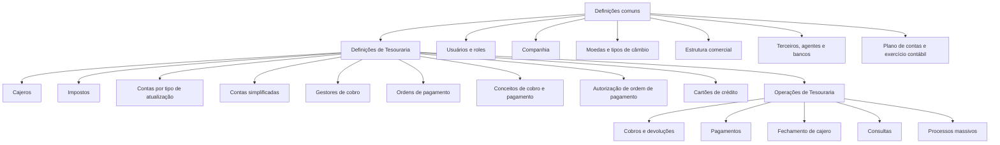
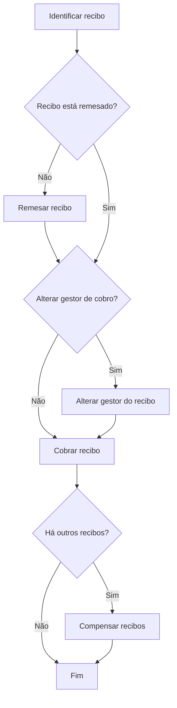
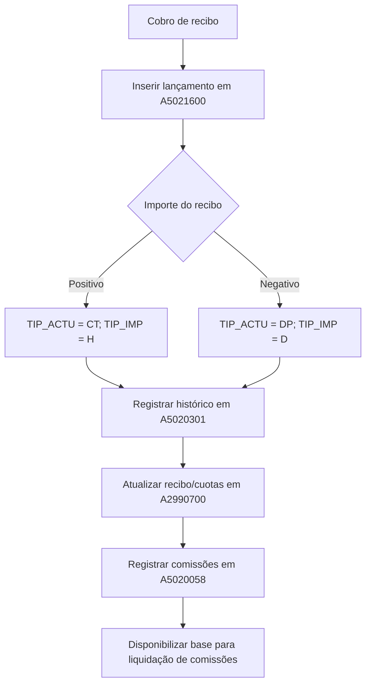
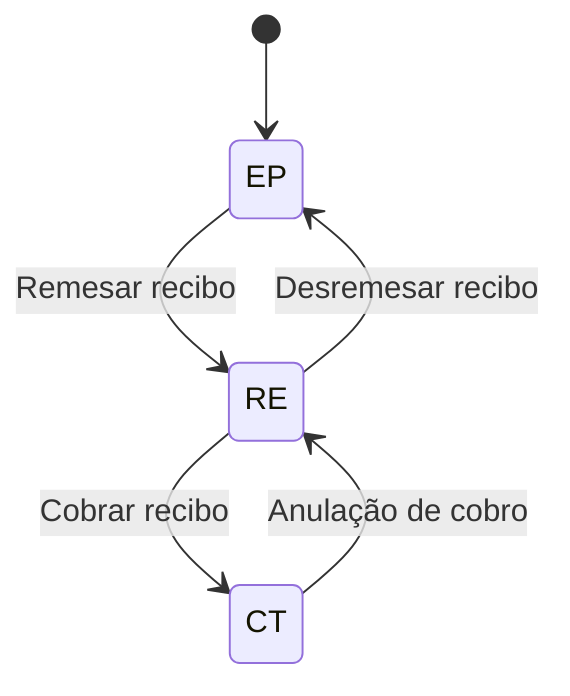

# Documentação Estruturada — Módulo de Tesouraria do Reef.core

## 1. Metadados do Documento
- **Arquivo de Origem:** Conteúdo bruto fornecido na solicitação; nome de arquivo não identificado.
- **Tipo de Documento:** Manual funcional, documentação operacional e especificação técnica de modelo de dados.
- **Domínio / Sistema:** Reef.core / MAPFRE — módulo de Tesouraria.
- **Público-Alvo:** Analistas funcionais, desenvolvedores, arquitetos, operadores, equipes contábeis e gestores de tesouraria.
- **Data/Versão Identificada:** Não identificada.

---

## 2. Resumo Executivo & Contexto de Negócio

O módulo de **Tesouraria do Reef.core** controla os fluxos monetários da companhia, abrangendo gestão de cobros, pagamentos, movimentações bancárias, registro diário e integração contábil. O módulo permite registrar transações sem exigir conhecimento contábil detalhado do operador, porém preserva a lógica de partidas dobradas: cada operação deve possuir movimentos correspondentes no **Debe** e no **Haber**.

A operação diária é sustentada pelo **registro diario de operaciones**, que registra cronologicamente cobros e pagamentos como movimentos contábeis. O conjunto dos movimentos realizados em um dia representa a “caja”; o fechamento do caixa gera o **asiento de tesorería**, que totaliza os movimentos por conta contábil.

A documentação descreve as definições necessárias para operar Tesouraria: cajeros, impostos, contas simplificadas, gestores de cobro, tipos de documentos, ordens de pagamento, conceitos de cobro/pago, autorização, cartões de crédito e parâmetros. Também especifica operações de recebimento, pagamentos, remessas, comissões, antecipos, fechamento de caixa, consultas e processos massivos.

O processo de **cobro de recibos** é um fluxo central. Ele registra o recebimento de um prêmio, atualiza a situação do recibo para cobrado, grava o histórico do recibo, pode registrar descontos de comissão, impostos e recargos e gera informações para a liquidação de comissões dos agentes. A visão técnica associa esse processo às tabelas `A5021600`, `A5020301`, `A2990700` e `A5020058`.

---

## 3. Arquitetura, Componentes & Tecnologias Envolvidas

### Componentes funcionais identificados

| Componente | Função no módulo de Tesouraria |
| :--- | :--- |
| Reef.core | Aplicação corporativa na qual o módulo de Tesouraria está inserido. |
| Registro diário de operações | Registra cronologicamente as operações de cobro e pagamento em forma de lançamentos contábeis. |
| Asiento de tesorería | Consolida movimentos do registro diário por conta contábil. |
| Cajero | Usuário habilitado a operar o registro diário e executar operações de Tesouraria. |
| Recibo | Documento de prêmio associado a uma apólice; pode estar emitido, remetido ou cobrado. |
| Gestor de cobro | Pessoa ou entidade responsável pelo cobro de recibos. |
| Orden de pago | Meio para pagar pessoas físicas ou jurídicas relacionadas à companhia. |
| Cuenta simplificada | Chave que identifica a conta contábil usada como compensação de cobros ou pagamentos. |
| Concepto de cobro y pago | Desdobramento econômico da ordem de pagamento; define natureza do gasto e conta contábil. |
| Impuesto / retención | Obrigações tributárias e retenções aplicáveis a documentos e conceitos. |
| Comissão de agente | Valor devido a agentes e demais intervenientes da apólice após o cobro do recibo. |
| Processos batch | Processos massivos para cobros e pagamentos. |

### Dependências de definição



### Fluxo funcional: cobro de recibo



### Fluxo técnico: registrar recibo cobrado



---

## 4. Regras de Negócio, Especificações Funcionais & Processos

### 4.1 Regras contábeis gerais

1. O módulo utiliza o plano geral contábil como referência normativa.
2. Toda operação do registro diário precisa possuir uma contrapartida entre **Debe** e **Haber**.
3. Gastos são registrados no **Debe**; ingressos são registrados no **Haber**.
4. O quadramento do registro diário é realizado na moeda do país.
5. Mesmo operações em moeda estrangeira mantêm o valor correspondente em moeda local para permitir o quadramento.
6. A data do asiento muda mediante fechamento de caixa e geração do asiento de tesorería.
7. “Caja” representa todos os movimentos e lançamentos realizados no registro diário em um dia.
8. O asiento de tesorería agrupa e totaliza operações por conta contábil.

### 4.2 Cajeros

- Um usuário precisa estar definido no sistema e possuir papel de cajero para trabalhar em Tesouraria.
- Existem cajeros principais (`P`) e secundários (`S`).
- Deve haver um cajero principal por cada nível 3 da estrutura comercial; podem existir tantos cajeros secundários quanto necessários.
- Apenas o cajero principal pode encerrar o registro diário.
- Um cajero secundário com tipo de reemplazo `R`, se entrar no parte contable antes do cajero principal da oficina, assume o papel principal naquele dia.
- O último cajero principal da companhia é responsável por fechar o registro diário e gerar o asiento de tesorería do dia.
- Para fechar o registro diário, todos os cajeros da companhia devem estar fechados e quadrados.
- Após o fechamento, apenas o cajero último principal pode abrir o próximo parte, com nova data de asiento.

### 4.3 Estados do recibo

| Código | Estado | Descrição |
| :--- | :--- | :--- |
| `EP` | Emitido pendente | Recibo emitido, ainda não remetido para cobro. |
| `RE` | Remesado | Recibo disponibilizado para cobro. |
| `CT` | Cobrado | Recibo cobrado. |



### 4.4 Cobro de recibo

O cobro de recibo registra o dinheiro entregue pelo cliente para quitar o prêmio devido em uma apólice, em determinado período. O processo pode descontar comissões, impostos e recargos quando aplicável.

Regras identificadas:

- O importe do recibo não pode ser alterado pela Tesouraria.
- Um recibo é gerado na emissão para movimentos definitivos que afetam prêmio.
- O recibo pode ser cobrado na moeda original.
- A compensação pode ser feita na mesma moeda, na moeda local ou em outra moeda.
- Se o recibo for positivo, o movimento é identificado como `CT` — cobro do recibo.
- Se o recibo for negativo, o movimento é identificado como `DP` — devolução de prêmio.
- Para recibo positivo, o lançamento de cobro é imputado no **Haber**.
- Para devolução de prêmio, o lançamento é imputado no **Debe**.
- Os importes são registrados na moeda do recibo.
- O processo atualiza todas as cuotas que compõem o recibo para situação `CT`.
- O processo registra as comissões devidas ao agente e a outros intervenientes da apólice.

### 4.5 Desconto de comissão no cobro de recibo

- Cada instalação pode decidir se permite que o agente desconte sua comissão no momento do cobro.
- Apenas o agente principal da apólice pode descontar comissão.
- O agente principal deve ser o gestor de cobro do recibo.
- A comissão descontada é líquida de retenções e impostos.
- O lançamento é identificado como comissão antecipada (`PC`).
- Em cobro positivo, o lançamento de desconto de comissão é feito no **Debe**.
- Em devolução de prêmio, o lançamento de desconto de comissão é feito no **Haber**.
- O desconto é registrado como anticipo de comissão:
  - tipo de devolución: vencimiento (`2`);
  - tipo de anticipo: montos (`3`).
- O recibo é atualizado para refletir que a comissão foi descontada.

### 4.6 Gestor de cobro

A classificação do gestor determina seu comportamento na aplicação.

| Classe | Tipo de gestor |
| :--- | :--- |
| `1` | Agente |
| `2` | Banco |
| `3` | Cobrador |
| `4` | Débito automático em conta |
| `5` | Gestor direto |
| `6` | Gestor piloto de coaseguro |
| `7` | Oficina comercial |
| `8` | Débito com cartão de crédito |
| `10` | Gestor de impagos |

Um valor de classe fora dessa lista indica que o gestor não é padrão. Para tipos não padrão, o documento prevê uma lógica de negócio de validação.

### 4.7 Ordens de pagamento

Tipos identificados:

| Código | Tipo de ordem de pagamento |
| :--- | :--- |
| `T` | Tesouraria |
| `S` | Siniestros |
| `R` | Remessas de reaseguro |
| `C` | Remessas de coaseguro |
| `A` | Comissões de agente |
| `D` | Devoluções de prêmio |

Regras:

- Ordens de pagamento são usadas para pagar pessoas físicas ou jurídicas relacionadas à companhia.
- Ordens de siniestros são geradas no módulo de siniestros, embora o pagamento seja realizado por Tesouraria.
- Liquidações negativas de siniestros podem representar cobro ou recuperação de sinistros, como franquias ou recuperação de outra seguradora.
- O usuário gerador determina a oficina geradora da ordem de pagamento; essa oficina corresponde ao nível 3 da estrutura comercial associado ao usuário.
- A oficina pagadora é a oficina à qual o gasto será imputado; também deve pertencer ao nível 3 da estrutura comercial.

### 4.8 Conceitos de cobro e pago

O conceito de cobro e pago determina o tipo de gasto da ordem de pagamento, impostos aplicáveis e conta contábil de imputação.

Classificações documentadas:

| Código | Classificação |
| :--- | :--- |
| `SI` | Siniestros |
| `RE` | Reaseguro |
| `CC` | Coaseguro cedido |
| `CA` | Coaseguro aceito |
| `CP` | Cobros e pagamentos diversos |
| `AC` | Agentes e comissões |
| `VI` | Conceitos de vida |

Para uma ordem com múltiplos conceitos, a data estimada de pagamento usa o **menor número de dias de pagamento** entre os conceitos componentes.

### 4.9 Antecipos de comissão de agente

Premissas e regras:

- Um agente pode solicitar pagamento antecipado de comissões.
- O pagamento é feito por ordem de pagamento.
- Se o cajero puder realizar pagamento direto, a ordem pode ser paga na mesma operação.
- Se houver antecipos pendentes, a possibilidade de criar novo anticipo depende de autorização da companhia.
- O tipo de documento precisa ser aplicável a pagamentos (`P`) ou a cobros e pagamentos (`A`).
- O tipo de anticipo `1` corresponde à operação de anticipo de comissão.
- O conceito de anticipo deve:
  - pertencer à agrupação contábil `PC` — anticipo de comissões;
  - possuir classificação `AC` — agentes e comissões;
  - possuir tipo de movimento de pagamento `P`.

Tipos de devolução:

| Código | Tipo | Regra |
| :--- | :--- | :--- |
| `1` | Devolução por número de cuotas | Divide o valor total pelo número de parcelas; a primeira data é a data de início e cada parcela seguinte soma um mês. |
| `2` | Devolução a vencimento | Gera uma única parcela, com valor total e vencimento acordado. |
| `3` | Devolução por porcentagem | Desconta percentual em cada liquidação de comissão até a data de vencimento; o restante é cancelado no vencimento. |

### 4.10 Operações suportadas

| Grupo | Operações documentadas |
| :--- | :--- |
| Cobros e devoluções | Gerir cobro/devolução de recibo, gerar cobro/pago variado, compensações de caixa, banco, cheque, cartão e conta de gestão; criar/anular recibo grupo; criar anticipo de cobro; cobrar/anular cobro de siniestro. |
| Pagamentos | Pagar, autorizar, anular ordens de pagamento; criar anticipo de comissão; anular cheque ou transferência; alterar oficina da ordem; tratar cheques danificados; imprimir cheque. |
| Reaseguro / coaseguro | Gerar cobro/pago de remessa. |
| Fechamento de cajeros | Fechar cajero, fechar cajero com erro em outra data, gerar asiento de tesorería. |
| Operações não contábeis | Ajustar comissão em liquidação, criar liquidação e informe de comissões, remesar/desremesar recibo, alterar gestor, registrar factura. |
| Consultas | Consultar recibo, ordem de pagamento, registro diário, histórico, recibo por agente/gestor, cheques/cartões em caixa, saldo bancário e saldo de cajero. |
| Processos massivos | Preparar tabelas e cargas batch, cobrar prêmio batch, incluir/pagar ordem batch, consultar cobros e pagamentos batch. |

---

## 5. Tabelas de Parâmetros, Ambientes e Estruturas de Dados

### 5.1 Atributos de definição de cajero

| Item / Parâmetro | Descrição / Função | Tipo / Valores / Formato | Ambiente / Observações |
| :--- | :--- | :--- | :--- |
| Compañía | Identifica a companhia para a qual o cajero trabalha. | Chave de companhia | Geral |
| Cajero | Identifica o usuário como cajero. | Chave de usuário | Geral |
| Nombre del cajero | Nome do cajero. | Texto | Pode manter o nome do usuário ou usar nome específico. |
| Tipo de cajero | Define como o cajero atua. | `P` principal; `S` secundário | Um principal por nível 3. |
| Tipo de reemplazo | Define capacidade de substituir o principal. | `P`, `R` ou sem valor | `P` somente para cajero principal. |
| Último | Identifica o último principal da companhia. | Indicador | Fecha registro diário e gera asiento diário. |
| Principal de nivel 2 | Permite consultar movimentos de cajeros dos níveis 3 subordinados. | Indicador | Estrutura comercial. |
| Fecha de valor | Permite alterar data de cobros para tipo de câmbio. | Indicador | Cobros em moeda estrangeira. |
| Cajero central | Identifica cajero da oficina central contábil. | Indicador | Pode pagar qualquer tipo de ordem. |
| Pago directo | Permite pagar diretamente ao gerar ordem de pagamento. | Indicador | Ordem de pagamento. |
| Nivel 3 | Nível 3 associado ao cajero. | Código | Estrutura comercial. |
| Traspasos de caja a banco | Permite transferências de Tesouraria de caixa para banco. | Indicador | Tesouraria. |
| Externo | Identifica cajero para processos automáticos de cobro. | Indicador | Processos automáticos. |
| Entorno 1 | Permite operar cobros. | Indicador | Registro diário. |
| Entorno 2 | Permite gerar ordens de pagamento. | Indicador | Registro diário. |
| Entorno 3 | Permite pagar ordens de pagamento. | Indicador | Registro diário. |
| Entorno 4 | Permite anular ordens de pagamento. | Indicador | Registro diário. |
| Activo | Indica se trabalha no registro diário. | Indicador | Estado operacional. |
| Cuadrado | Indica se débitos e créditos estão quadrados. | Indicador | Atualizado em cada fechamento. |
| Entorno | Último entorno em que o cajero trabalhou. | Código de entorno | Atualizado pelos processos do registro diário. |
| Último número de recibo | Última transação de cobro. | Número | Entorno de cobros. |
| Última orden de pago | Última transação de pagamento de ordens. | Número | Entorno de pagamento. |
| Último número de giro | Última transação de geração de ordem de pagamento. | Número | Entorno de geração. |
| Último número de anulación | Última transação de anulação de ordem. | Número | Entorno de anulação. |
| Inhabilitado | Controla habilitação do cajero. | Indicador | Cajero inabilitado não acessa registro diário. |
| Fecha de alta | Data de identificação do usuário como cajero. | Data | Auditoria. |
| Fecha de baja | Data de inabilitação. | Data | Auditoria. |
| Observaciones | Motivo ou comentário da inabilitação. | Texto | Auditoria. |

### 5.2 Principais campos técnicos — `A5021600` Registro Diario de Operaciones

| Campo | Regra / Valor | Obrigatório | Descrição |
| :--- | :--- | :--- | :--- |
| `COD_CIA` | Companhia | Sim | Companhia. |
| `FEC_ASTO` | Atualiza se mudar da situação anterior. | Sim | Data do asiento. |
| `NUM_ASTO` | Atualiza se mudar da situação anterior. | Sim | Número do asiento. |
| `NUM_OPER_ASTO` | Valor sequencial. | Sim | Número de operação do asiento. |
| `TIP_ACTU` | `CT` se recibo positivo; `DP` se recibo negativo. | Sim | Tipo de atualização. |
| `COD_CTA` | Atualiza se mudar da situação anterior. | Sim | Conta contábil. |
| `FEC_VALOR` | Data indicada pelo usuário se alteração for permitida; caso contrário, data do asiento de Tesouraria. | Sim | Data de valor. |
| `NUM_CRUCE` | Número de cruzamento de cobro antecipado, se existir. | Não | Identificador do anticipo. |
| `NOM_MOVIM` | Descrição da agrupação contábil correspondente ao tipo de atualização. | Sim | Descrição do movimento. |
| `TIP_GESTOR` / `COD_GESTOR` | Novo gestor se alteração for permitida no cobro. | Não | Gestor de cobro. |
| `IMP_MON_PAIS` | Valor do recibo convertido quando moeda for diferente da moeda do país. | Sim | Valor em moeda do país. |
| `IMP_MON_EXT` | Valor na moeda original. | Não | Valor em moeda estrangeira. |
| `COD_MON` | Moeda do recibo. | Sim | Moeda. |
| `VAL_CAMBIO` | Tipo de câmbio na data do asiento de cobro. | Não | Câmbio das reservas. |
| `TIP_IMP` | `H` para recibo positivo; `D` para devolução de prêmio. | Sim | Tipo de importe contábil. |
| `TIP_ENTORNO` | Valor `1`. | Não | Entorno de recibos. |
| `NUM_BLOQUE_TES` | Número de bloco de Tesouraria do asiento. | Sim | Transação de Tesouraria. |
| `COD_CAJERO` | Atualiza se mudar da situação anterior. | Sim | Cajero. |
| `FEC_ACTU` | Atualiza se mudar da situação anterior. | Sim | Data de atualização da fila. |
| `TIP_COBRO` | Valor `3`. | Não | Cobro por Tesouraria. |

### 5.3 Principais campos técnicos — `A5020301` Movimientos o Histórico de Cuotas

| Campo | Regra / Valor | Obrigatório | Descrição |
| :--- | :--- | :--- | :--- |
| `COD_CIA`, `NUM_POLIZA`, `NUM_SPTO`, `NUM_APLI`, `NUM_SPTO_APLI`, `NUM_CUOTA`, `NUM_RECIBO` | Identificadores do recibo e da cuota. | Sim | Chave funcional do movimento. |
| `NUM_MVTO` | Incrementa em 1 o maior número de movimento do recibo. | Sim | Número de movimento. |
| `TIP_GESTOR`, `COD_GESTOR` | Gestor de cobro. | Sim | Dados do gestor. |
| `TIP_SITUACION` | `CT` — cobro total. | Sim | Situação. |
| `FEC_SITUACION` | Data do asiento de Tesouraria. | Não | Data de origem da situação. |
| `COD_MON` | Moeda. | Sim | Moeda. |
| `VAL_CAMBIO` | Câmbio da data do asiento de cobro. | Não | Câmbio das reservas. |
| `IMP_RECIBO` | Total do recibo. | Sim | Valor total. |
| `IMP_COMIS` | Comissão. | Sim | Valor de comissão. |
| `NUM_BLOQUE_TES` | Número de bloco de Tesouraria do asiento. | Não | Transação de Tesouraria. |
| `TIP_COBRO` | `3` — por parte de Tesouraria. | Não | Tipo de cobro. |
| `FEC_AUX1` | Data do usuário se alteração permitida; senão, data do asiento. | Não | Data real de cobro. |
| `MCA_DCTO_COMIS` | Preenchido quando há desconto de comissão. | Não | Desconto de comissão no cobro. |
| `MCA_DTO_IMPTO` | Preenchido quando há desconto de impostos. | Não | Desconto de imposto. |
| `MCA_DTO_RECARGO` | Preenchido quando há desconto de recargos. | Não | Desconto de recargo. |

### 5.4 Principais campos técnicos — `A2990700` Recibos/Cuotas de una Póliza

| Campo | Regra / Valor | Obrigatório | Descrição |
| :--- | :--- | :--- | :--- |
| `COD_CIA`, `NUM_POLIZA`, `NUM_SPTO`, `NUM_APLI`, `NUM_SPTO_APLI`, `NUM_CUOTA`, `NUM_RECIBO` | Identificadores da cuota e do recibo. | Sim | Identificação funcional. |
| `TIP_SITUACION` | `CT` — cobro total. | Sim | Situação do recibo. |
| `FEC_VALOR` | Atualiza se data de valor for alterada no cobro. | Não | Data de valor. |
| `COD_MON` | Moeda. | Sim | Moeda. |
| `IMP_RECIBO`, `IMP_NETA`, `IMP_RECARGO`, `IMP_IMPTOS` | Valores econômicos do recibo. | Sim | Valores do recibo. |
| `IMP_COMIS` | Comissão do recibo. | Não | Valor de comissão. |
| `MCA_DCTO_COMIS` | Marca desconto de comissão no cobro. | Não | Controle de desconto. |
| `MCA_DTO_IMPTO` | Marca desconto de imposto. | Não | Controle de imposto. |
| `MCA_DTO_RECARGO` | Marca desconto de recargo. | Não | Controle de recargo. |

### 5.5 Principais campos técnicos — `A5020058` Comisiones de Recibos y Ajustes

| Campo | Regra / Valor | Obrigatório | Descrição |
| :--- | :--- | :--- | :--- |
| `COD_CIA` | Companhia. | Sim | Companhia. |
| `NUM_RECIBO`, `NUM_POLIZA`, `NUM_SPTO`, `NUM_APLI`, `NUM_SPTO_APLI`, `NUM_CUOTA` | Identificadores associados. | Variável conforme campo | Chave de contexto do recibo. |
| `TIP_SITUACION` | `CT` se recibo positivo; `DP` se negativo. | Não | Situação. |
| `COD_AGT` | Chave do agente pai. | Não | Agente. |
| `COD_MVTO` | `DC` — devengo de comissões. | Não | Movimento de comissão. |
| `COD_CTA` | Conta contábil do agente. | Não | Conta contábil. |
| `COD_MON` | Moeda. | Sim | Moeda. |
| `VAL_CAMBIO` | Câmbio da data de asiento do cobro. | Não | Câmbio das reservas. |
| `IMP_RECIBO` | Zero para comissão por outros conceitos; total do recibo para demais casos. | Não | Total do recibo. |
| `IMP_MVTO` | Valor da comissão. | Não | Valor do movimento. |
| `FEC_MVTO` | Data do asiento de Tesouraria. | Não | Data do movimento. |
| `ANIO_MES` | Mês e ano da data do asiento. | Não | Ano/mês. |
| `NUM_MVTO_301` | Número do histórico de movimentos de recibos. | Não | Referência de movimento. |
| `NUM_BLOQUE_TES` | Número do bloco de Tesouraria do asiento. | Não | Transação de Tesouraria. |

---

## 6. Bateria de Perguntas & Respostas para RAG (FAQ Sintético)

### P1: O que é o registro diário de operações no módulo de Tesouraria?
**R:** O registro diário de operações é o componente que registra cronologicamente todas as operações diárias de cobros e pagamentos da companhia em forma de lançamentos contábeis. Cada operação precisa possuir movimentos de contrapartida no Debe e no Haber; o conjunto desses lançamentos forma o asiento contábil de Tesouraria.

### P2: Quem pode fechar o registro diário de Tesouraria?
**R:** Apenas o cajero principal pode fechar o registro diário. Em cada nível 3 da estrutura comercial deve existir um cajero principal. O cajero identificado como último principal da companhia é responsável pelo fechamento final do registro diário e pela geração do asiento de Tesouraria do dia, após todos os cajeros estarem fechados e quadrados.

### P3: Quais estados um recibo pode ter no processo de Tesouraria?
**R:** O documento identifica três estados: `EP` para Emitido pendente, `RE` para Remesado e `CT` para Cobrado. Um recibo passa de `EP` para `RE` pela operação de remessa e de `RE` para `CT` pelo cobro. A desremessa retorna o recibo de `RE` para `EP`, e a anulação do cobro retorna o recibo de `CT` para `RE`.

### P4: Como o sistema diferencia cobro de recibo e devolução de prêmio?
**R:** No registro diário, um recibo positivo gera `TIP_ACTU = CT`, correspondente a cobro do recibo, e é imputado no Haber. Um recibo negativo gera `TIP_ACTU = DP`, correspondente a devolução de prêmio, e é imputado no Debe. A mesma lógica também aparece no campo `TIP_IMP`.

### P5: Em quais condições um agente pode descontar comissão no cobro de um recibo?
**R:** O desconto depende de a instalação permitir essa operação. Apenas o agente principal da apólice pode descontar a comissão, e somente quando esse agente também for o gestor de cobro do recibo. A comissão descontada é líquida de retenções e impostos.

### P6: Como é registrada a comissão descontada no momento do cobro?
**R:** A comissão descontada é lançada como comissão antecipada (`PC`) no registro diário. Para cobro positivo, o lançamento é feito no Debe; para devolução de prêmio, no Haber. O desconto também é registrado como anticipo de comissão, com tipo de devolución `2` — vencimento — e tipo de anticipo `3` — montos.

### P7: Como é determinada a data estimada de pagamento de uma ordem com vários conceitos de cobro e pagamento?
**R:** Quando uma ordem de pagamento possui mais de um conceito de cobro e pagamento, a data estimada de pagamento é determinada pelo menor número de dias de pagamento entre todos os conceitos que compõem a ordem.

### P8: Qual é a relação entre moeda estrangeira e quadramento do registro diário?
**R:** Tesouraria pode operar em várias moedas, desde que as moedas e seus tipos de câmbio estejam registrados no sistema. Embora um recibo possa ser cobrado em moeda estrangeira, todo movimento também armazena o valor correspondente em moeda local, pois o quadramento do registro diário é realizado na moeda do país.

### P9: O que representa a tabela `A5021600`?
**R:** A tabela `A5021600` representa o Registro Diario de Operaciones. No processo técnico de registrar recibo cobrado, ela recebe o lançamento do cobro ou da devolução de prêmio, incluindo companhia, data e número do asiento, conta contábil, moeda, valor, tipo de atualização, cajero e bloco de Tesouraria.

### P10: Quais tabelas participam do processo técnico de registrar recibo cobrado?
**R:** O documento identifica quatro tabelas: `A5021600` para o registro diário de operações, `A5020301` para movimentos ou histórico de cuotas, `A2990700` para recibos/cuotas de uma apólice e `A5020058` para comissões de recibos e ajustes.

### P11: Quais são os tipos de devolução de um anticipo de comissão de agente?
**R:** Existem três tipos: devolução por número de cuotas (`1`), devolução a vencimento (`2`) e devolução por porcentagem (`3`). O primeiro divide o total em parcelas; o segundo gera uma única parcela; o terceiro desconta um percentual nas liquidações de comissão até o vencimento, quando o restante deve ser cancelado.

### P12: Como o sistema identifica a oficina que gera uma ordem de pagamento?
**R:** A oficina geradora é obtida da oficina atribuída ao usuário que cria a ordem de pagamento. Essa oficina deve corresponder ao nível 3 da estrutura comercial associado ao usuário da aplicação.

---

## 7. Glossário de Termos, Siglas & Conceitos-Chave

- **AC:** Classificação de conceitos de cobro e pagamento para agentes e comissões.
- **Asiento:** Lançamento ou agrupamento contábil.
- **Asiento de tesorería:** Consolidação, por conta contábil, dos movimentos do registro diário.
- **Cajero:** Usuário habilitado a trabalhar no registro diário de Tesouraria.
- **CC:** Classificação de conceito para coaseguro cedido.
- **CA:** Classificação de conceito para coaseguro aceito.
- **Cobro:** Registro de recebimento de valores.
- **CT:** Cobro total; usado como situação de recibo e tipo de atualização para recibo positivo.
- **Cuenta simplificada:** Chave que identifica a conta contábil usada em compensações de cobro e pagamento.
- **Debe:** Lado contábil usado para registrar gastos e certas contrapartidas.
- **DP:** Devolução de prêmio.
- **EP:** Estado “Emitido pendente” de um recibo.
- **Gestor de cobro:** Pessoa ou entidade responsável por cobrar recibos.
- **Haber:** Lado contábil usado para registrar ingressos e certas contrapartidas.
- **PC:** Agrupação contábil de anticipo de comissões e identificação de comissão antecipada.
- **RE:** Estado “Remesado” de um recibo.
- **Recibo:** Documento relacionado ao prêmio de uma apólice.
- **Remesa:** Processo que coloca recibos em situação de cobrança ou trata movimentos de reaseguro/coaseguro.
- **SI:** Classificação de conceito para siniestros.
- **Tesouraria:** Módulo responsável por cobros, pagamentos, movimentações bancárias e lançamentos contábeis associados.
- **TIP_ACTU:** Campo de tipo de atualização no registro diário.
- **TIP_IMP:** Campo que identifica Debe (`D`) ou Haber (`H`) para o importe contábil.
- **VI:** Classificação de conceito para conceitos de vida.

---

## 8. Notas Críticas, Riscos & Limitações

- **Nota de Análise:** Grande parte das definições aparece com a indicação **“EN CONSTRUCCIÓN”**. O conteúdo confirma objetivo e, em alguns casos, fluxo de alto nível, mas não detalha todos os atributos, telas, contratos técnicos ou validações.
- **Nota de Análise:** O documento lista operações de Tesouraria, mas não informa APIs, métodos HTTP, endpoints, eventos, filas, versões de software, portas, servidores ou URLs de ambiente.
- **Nota de Análise:** As tabelas técnicas apresentam regras de preenchimento de campos, mas não apresentam tipos físicos de banco de dados, índices, chaves primárias completas, relações estrangeiras ou DDL.
- O fechamento diário depende de todos os cajeros da companhia estarem fechados e quadrados; isso representa dependência operacional entre usuários e risco de bloqueio do fechamento.
- O uso de moedas estrangeiras exige moedas e tipos de câmbio previamente registrados.
- Os campos `TXT_AUX1`, `TXT_AUX2` e `TXT_AUX3` aparecem como campos específicos de instalação e o documento declara que não devem ser usados em instalações novas.
- A criação de novo anticipo de comissão com antecipos pendentes depende de configuração permissiva da companhia.
- A alteração de gestor e de data de valor depende de permissões/configurações não detalhadas no conteúdo fornecido.

---

## 9. Conteúdo Bruto Estruturado (Referência Fiel)

```text
Escopo literal consolidado do conteúdo fornecido:

DOCUMENTACIÓN REEF — MÓDULO DE TESORERÍA

INTRODUCCIÓN - Módulo Tesorería
- Controla fluxos monetários da companhia: gestão de pagamentos, gestão de cobros e gestões bancárias.
- Permite realizar apontamentos contábeis de cobros e pagamentos.
- Conceitos principais: registro diário de operações, gestor de cobro, agentes e comissões, recibos, conta simplificada, conceito de cobro/pago e ordem de pagamento.

DEFINICIÓN de cajero
Objetivo:
Definir usuários que podem trabalhar com o módulo de Tesouraria.
Tipos:
- P: Cajero principal.
- S: Cajero secundario.
Regras:
- Existe um cajero principal por nível 3 da estrutura comercial.
- O cajero principal é o único autorizado a fechar o registro diário.
- O último cajero principal fecha o registro diário e gera o asiento de tesorería.
- Todos os cajeros da companhia devem estar fechados e quadrados para permitir fechamento diário.

DEFINICIÓN de impuestos
Objetivo:
Definir tipos de obrigações tributárias, características e formas de cálculo.
Fluxo:
1. Definir imposto.
2. Definir características do imposto.
3. Definir conta contábil por imposto.
4. Definir agrupação de impostos.

DEFINICIÓN de Gestor de cobro
Classes padrão:
1 AGENTE
2 BANCO
3 COBRADOR
4 DÉBITO AUTOMÁTICO EN CUENTA
5 GESTOR DIRECTO
6 GESTOR PILOTO COASEGURO
7 OFICINA COMERCIAL
8 DÉBITO CON TARJETA DE CRÉDITO
10 GESTOR DE IMPAGOS

DEFINICIÓN de orden de pago
Fluxo:
1. Definir reserva de numeração de ordem de pagamento.
2. Definir ordem de pagamento por usuário.
3. Definir tipo de documentos.
4. Definir agências pagadoras por geradoras.

DEFINICIÓN de la relación entre oficinas generadoras y pagadoras
- A oficina geradora e a oficina pagadora devem estar definidas no nível 3 da estrutura comercial.
- A oficina geradora é obtida da oficina do usuário que gera a ordem de pagamento.

DEFINIR Tipo de documento de cobro pago
Propriedades:
- Tipo de documento.
- Nome do documento.
- Documento de cobro ou pago.
- Inclui IVA.
- Inclui retenção.
- Livro de compras.
- Retifica documento.
- Documento real.
- Registra documento.
- Processos de validação.
- Permite borrado físico.
- Agrupa documentos.
- Propriedades específicas de siniestros.

DEFINICIÓN de Conceptos de cobro y pago
- O conceito de cobro/pago identifica natureza do gasto, impostos e conta contábil.
- Pode ser usado para ordens de pagamento e movimentos de conta corrente de agente.
- A data estimada de pagamento de uma ordem com múltiplos conceitos usa o menor número de dias de pagamento.

COBRAR recibo prima
Fluxo:
1. Registrar recibo cobrado.
2. Descontar comissão do recibo, se aplicável.
3. Descontar impostos do recibo, se aplicável.
4. Descontar recargo do recibo, se aplicável.
5. Executar outras operações.

REGISTRAR recibo cobrado — visão técnica
Tabelas:
- A5021600: REGISTRO DIARIO DE OPERACIONES.
- A5020301: MOVIMIENTOS O HISTORICO DE CUOTAS.
- A2990700: RECIBOS/CUOTAS DE UNA POLIZA.
- A5020058: COMISIONES DE RECIBOS Y AJUSTES.

REGISTRAR recibo cobrado — visão funcional
Passos automáticos:
- Inserir registro diário.
- Registrar movimento histórico.
- Atualizar situação do recibo para CT.
- Registrar comissões de agente e demais intervenções da apólice.

CREAR anticipo comisión agente
- Registra anticipo solicitado pelo agente e a forma de devolução.
- Tipos de devolução: número de cuotas, vencimento e porcentagem.
- Pagamentos são feitos por ordem de pagamento.
- Cajero com pagamento direto pode pagar a ordem na mesma operação.

DESCONTAR comisión en el cobro de recibo
- A instalação pode permitir desconto de comissão no cobro.
- Somente o agente principal, quando gestor de cobro, pode descontar.
- O lançamento é comissão antecipada PC.
- A comissão é registrada líquida de retenções e impostos.

OPERACIONES DE TESORERÍA
Cobros e devoluções:
- GESTIONAR recibo cobro devolución.
- GENERAR cobro pago vario.
- ENTREGAR/RECIBIR caja e banco por efetivo, cheque, cartão e conta de gestão.
- CREAR/ANULAR recibo grupo.
- CREAR anticipo cobro.
- COBRAR/ANULAR cobro siniestro.

Pagamentos:
- PAGAR orden pago.
- AUTORIZAR orden pago.
- CREAR anticipo comisión.
- ANULAR orden pago.
- ANULAR orden pago cheque transferencia.
- ANULAR orden pago otra forma pago.
- CAMBIAR oficina orden pago.
- MODIFICAR cheque dañado.
- IMPRIMIR cheque.

Fechamento:
- CERRAR cajero.
- CERRAR cajero error otra fecha.
- GENERAR asiento tesorería.

Consultas:
- CONSULTAR recibo.
- CONSULTAR orden pago.
- CONSULTAR registro diario.
- CONSULTAR histórico registro diario.
- CONSULTAR saldo banco.
- CONSULTAR saldo cajero.

Processos massivos:
- GENERAR tabla buzón cobros batch.
- GENERAR carga cobros batch.
- COBRAR prima batch.
- GENERAR tabla buzón pagos batch.
- GENERAR carga pagos batch.
- INCLUIR orden pago batch.
- PAGAR orden pago batch.
- CONSULTAR cobros batch.
- CONSULTAR pagos batch.
```
