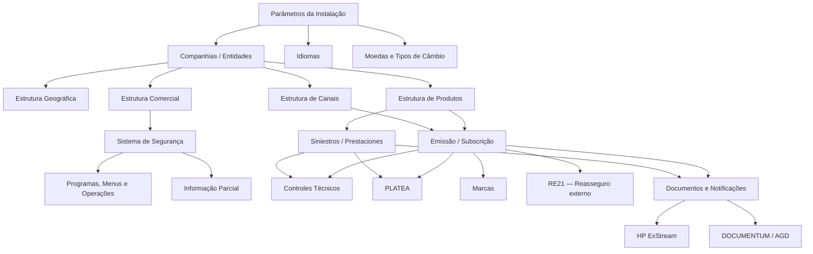
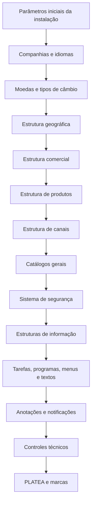

# Reef.core — Documentação de Elementos Comuns, Catálogos Transversais e Configuração Corporativa

## 1. Metadados do Documento
- **Arquivo de Origem:** Não informado; conteúdo bruto fornecido na conversa (287 páginas)
- **Tipo de Documento:** Manual Operacional / Especificação Funcional
- **Domínio / Sistema:** Reef.core / MAPFRE
- **Público-Alvo:** Desenvolvedores, Arquitetos, Operação, Tecnologia Local, Administração e Finanças, Negócio
- **Data/Versão Identificada:** Referência a dezembro de 2023 no módulo de notificações; demais versão não identificada.

---

## 2. Resumo Executivo & Contexto de Negócio

O documento descreve a parametrização funcional dos **elementos comuns e transversais do Reef.core**, sistema corporativo de gestão seguradora utilizado por entidades MAPFRE. O conteúdo organiza catálogos, estruturas, regras operacionais e dependências necessários para habilitar funcionalidades de emissão, sinistros, tesouraria, reasseguro, segurança, documentos, controles técnicos, prevenção a fraude e gestão de dados mestres.

A configuração começa por fundamentos corporativos e locais: parâmetros de instalação, companhias, idiomas, moedas, estruturas geográfica, comercial, de produtos e de canais. Essas estruturas tornam possível classificar entidades, territórios, unidades comerciais, produtos, ramos técnicos, intermediários e origens de produção de apólices.

O Reef.core utiliza uma arquitetura fortemente parametrizada por catálogos. Grande parte desses catálogos possui histórico por **Data de Validade**, bloqueio lógico por **Inabilitação** e distinção entre configuração padrão do núcleo, identificada por instalação **TRN**, e configuração local. Registros do núcleo TRN não devem ser alterados quando o documento assim o determina.

O documento também detalha governança de segurança, incluindo usuários, papéis, restrições de consulta, informação parcial, permissões de execução e acesso ao servidor de aplicações. A autenticação não equivale à autorização: a concessão de funcionalidades depende da configuração de roles, programas, operações, ramos e restrições de informação.

Por fim, o manual descreve mecanismos de controle operacional avançado: controles técnicos, integração antifraude com PLATEA, marcas proativas e reativas, integração de documentos e notificações com HP ExStream e DOCUMENTUM, além de estruturas de informação extensíveis em Oracle. Diversas funcionalidades exigem desenvolvimento e responsabilização do time local de Tecnologia.

---

## 3. Arquitetura, Componentes & Tecnologias Envolvidas

### Componentes e domínios identificados

| Componente / Domínio | Função no documento |
| :--- | :--- |
| **Reef.core** | Sistema transacional central para operações de seguros. |
| **TRN** | Código da instalação do núcleo do Reef.core; configurações TRN possuem proteção contra alteração em diversos catálogos. |
| **NewTron** | Versão atual do Reef.core, relacionada a operações funcionais. |
| **TronWeb** | Versão legada do Reef.core, relacionada a programas e permissões legadas. |
| **FUJI** | Orquestrador do frontal do Reef.core; identifica aplicações como MicroFrontEnd ou emulação via iframe. |
| **Oracle** | Banco de dados citado para tabelas, tabelas nested, procedimentos, filtros SQL e estruturas de informação. |
| **PL/SQL** | Tipo de programa e tecnologia usada para tarefas e lógicas de negócio. |
| **Java** | Tecnologia de programas, cliente Java e parâmetros Java por usuário. |
| **LDAP** | Mecanismo de autenticação citado para usuários da aplicação. |
| **RE21** | Solução corporativa externa para colocação e cessão de reasseguro. |
| **PLATEA** | Plataforma tecnológica corporativa de luta contra fraude. |
| **HP ExStream** | Ferramenta corporativa de geração e envio de documentos, identificada como vigente em dezembro de 2023. |
| **DOCUMENTUM / AGD** | Ferramenta corporativa de armazenamento e gestão documental, identificada como vigente em dezembro de 2023. |
| **BPM** | Business Process Management, habilitável para processos de emissão e sinistros. |
| **DISMA** | Direção de Segurança Corporativa, cujas recomendações devem ser consideradas na configuração de usuários no servidor de aplicações. |
| **ACO** | Área Corporativa de Operações; relacionada a controles de marcas. |
| **ACNC** | Área Corporativa de Negócio e Clientes; define classificações corporativas de canais. |



### Fluxo de configuração transversal



---

## 4. Regras de Negócio, Especificações Funcionais & Processos

### 4.1 Moedas e tipos de câmbio

- As moedas devem respeitar a norma **ISO 4217**, com códigos de três letras.
- Uma moeda pode ser classificada como:
  - Moeda real.
  - Unidade de conta reajustada periodicamente, como UF no Chile ou UDI no México.
  - Moeda fictícia, como Tréboles do plano de fidelização.
- O número de decimais regula os cálculos internos do sistema.
- Para cada companhia, moeda e data, o sistema permite capturar **um único tipo de câmbio**.
- O tipo de câmbio representa o valor médio de compra e venda da divisa em uma data específica.

### 4.2 Estrutura comercial

- A estrutura comercial é piramidal e contém três níveis.
- Os repositórios são inicialmente entregues vazios.
- Exemplo de nomenclatura local para MAPFRE Espanha:
  1. Territorial.
  2. Sub Central.
  3. Oficina / Sucursal.
- Códigos de atividade de terceiros por nível:
  - Primeiro nível: constante `42`, não modificável.
  - Segundo nível: constante `43`, não modificável.
  - Terceiro nível: constante `44`, não modificável.
- Quando a atividade de terceiro não possuir documento identificador associado, o tipo de documento identificador é obtido da configuração de parâmetros da instalação.
- A estrutura comercial e a estrutura de canais possuem finalidades distintas:
  - **Canais:** margem de contribuição por cliente distribuidor.
  - **Organização comercial:** combinação de fatores produtivos para maximizar a criação de valor.

### 4.3 Estrutura geográfica

- A estrutura geográfica possui cinco níveis.
- O primeiro nível representa países e utiliza códigos da norma **ISO 3166-1 alpha-3**.
- Denominações locais podem variar por instalação e idioma.
- Exemplos:
  - TRN — Espanha: País, Comunidade/Cidade Autônoma, Província, Município/Localidade, Distrito.
  - EUR — MAPFRE Chile: País, Região, Província, Comunas, Localidades.
  - MMX — MAPFRE México: País, Entidades Federativas, Municípios/Demarcação Territorial, Localidades/Delegações, Colônias.
- Códigos postais são associados aos cinco níveis geográficos.
- A prática recomendada é utilizar e manter os códigos provenientes do serviço postal local, carregados **AS-IS**.
- Feriados e dias não úteis possuem data de validade para preservar o histórico de mudanças.

### 4.4 Estrutura de produtos

- A estrutura de produtos é piramidal com quatro níveis:
  1. Companhias.
  2. Setores.
  3. Subsetores.
  4. Ramos técnicos.
- Cada ramo deve estar obrigatoriamente associado a um setor e a um subsetor.
- Um ramo técnico pode possuir até 999 códigos distintos por companhia.
- Tratamentos disponíveis e não expansíveis:
  - `A`: Automóveis.
  - `D`: Diversos.
  - `T`: Transportes.
  - `V`: Vida & Acidentes.
- Os tratamentos de emissão, sinistros e contabilidade podem ser diferentes no mesmo ramo.

### 4.5 Regras relevantes de ramos técnicos

- **Multirrisco:** permite mais de um objeto segurado na apólice.
- **Multiperíodos:** para apólices superiores a um ano, permite registrar informações econômicas por período.
- **Registro de hora/minutos:** pode tornar obrigatória a captura de hora e minuto na data de efeito.
- **Emissão de orçamento obrigatória:** sem orçamento, a apólice não pode ser emitida.
- **Autorização de orçamento obrigatória:** orçamento somente pode ser usado se estiver autorizado; não implica obrigatoriamente a emissão de orçamento.
- **Formação de modalidade:** valores possíveis:
  - Sem modalidade.
  - Explícita.
  - Implícita.
- **Formação de imagem:** determina a data usada para aplicar a configuração histórica do ramo em suplementos:
  1. Data do sistema.
  2. Data de efeito do suplemento.
  3. Data de efeito da apólice.
- **Prorrata:** calcula proporcionalmente ao período de vigência; se desativada, utiliza escala.
- **Ano de cálculo:** permite ano de 360 ou 365 dias. Em ano de 360 dias, cada mês tem 30 dias; anos bissextos não alteram esse resultado.
- **Prêmios manuais:** cálculo automático, automático ou manual, ou manual.
- **Número máximo de agentes:** deve estar entre `1` e `4`, pois toda apólice exige agente principal.
- **Modificar percentuais de comissão:** somente permitido se multiperíodos estiver desativado.
- Diversas propriedades são explicitamente obsoletas e não devem ser reutilizadas localmente, incluindo:
  - Número máximo de riscos para emissão online.
  - Número máximo de riscos para impressão online.
  - Cálculo de fracionamento de pagamento.
  - Distribuição proporcional de comissões.
  - Regeneração de suplementos retroativos.
  - Data contábil padrão.

### 4.6 Coasseguro e resseguro

| Regra | Valores / comportamento |
| :--- | :--- |
| Tipo de coasseguro permitido | `0` Isento; `1` Somente cedido; `2` Somente aceito; `3` Cedido/aceito. |
| Tipo de resseguro permitido | `0` Somente seguro direto; `1` Resseguro aceito por contrato; `2` Resseguro aceito facultativo; `3` Resseguro cedido/aceito. |
| Colocação externa de resseguro | Quando ativada, Reef.core chama RE21 para resolver cessões. |
| Falha em RE21 | Pode gerar controles técnicos na emissão e/ou em sinistros, conforme parametrização. |
| Momento da colocação RE21 | Pode ocorrer online ou de modo diferido. |

### 4.7 Estrutura de canais

- A estrutura de canais possui três níveis:
  1. Clientes distribuidores.
  2. Agrupações.
  3. Fontes de produção.
- Os dois primeiros níveis são corporativos; a entidade local configura as fontes de produção.
- Clientes distribuidores corporativos:
  - `01`: Direto.
  - `02`: Rede Própria — Agencial.
  - `03`: Rede Externa — Corretores.
  - `04`: Bancário.
  - `05`: Acordos.
- A fonte de produção identifica, para determinada apólice, o cliente distribuidor, canal de comercialização e atributos do agente.
- A fonte de produção fica vinculada ao agente durante a vigência e pode ser alterada na renovação.

### 4.8 Segurança e informação parcial

- A conta permite autenticação; a autorização é concedida por roles.
- Usuários podem receber um ou mais roles.
- A configuração contempla:
  - Usuários do sistema.
  - Usuários por entidade.
  - Roles por entidade.
  - Roles por usuário.
  - Acessos às operações de criação e modificação de terceiros.
  - Acessos de consulta à informação.
  - Acessos a operações por ramo técnico.
  - Roles de informação parcial.
  - Restrições de terceiros por role.
- Recomenda-se priorizar restrições de acesso em vez de permissões sem restrições.
- Se o usuário não puder consultar completamente os dados de um terceiro, não poderá modificá-los.

### 4.9 Estruturas de informação

- Estruturas de informação permitem criar tabelas específicas na base de dados para necessidades heterogêneas de emissão, sinistros ou terceiros.
- Cada dado variável pode ser configurado quanto a:
  - Ordem.
  - Visibilidade.
  - Obrigatoriedade.
  - Alterabilidade.
  - Valor padrão.
  - Validação de nulo.
  - Lógica inicial.
  - Lógica de validação.
  - Programa de ajuda.
  - Tabela Oracle associada.
  - Sensibilidade a maiúsculas e minúsculas.
  - Painel de visualização.
  - Validação online.
- Dados variáveis não modificáveis não executam a lógica de negócio do dado variável; para descrição ou validação, deve-se usar a lógica inicial.

### 4.10 Tarefas, programas e menus

- Uma tarefa pode ser processo, parte de processo, carta ou relatório.
- Tarefas podem:
  - Necessitar ou não de parâmetros.
  - Executar diretamente ou de forma diferida.
  - Exibir ou não resultados.
- Tarefas iniciadas por `TRN` são tarefas do núcleo Reef.core.
- O menu principal da estrutura de menus funcional é `MAIN`.
- O menu principal de programas é `AM0000000`.
- A configuração de menus é recursiva por meio de submenus.
- Registros de menus, mensagens, etiquetas, textos, listas de valores e menus de instalação TRN devem ser preservados quando assim indicado no catálogo.

### 4.11 Notificações e documentos

- Em dezembro de 2023, as ferramentas corporativas declaradas são:
  - **HP ExStream:** geração e envio de documentos.
  - **DOCUMENTUM:** armazenamento e gestão documental.
- Canais de distribuição documentados:
  - Local/síncrono.
  - E-mail.
  - Fax.
  - SMS.
  - File System/NAS.
  - URL privada.
  - Gestor documental.
  - Provedor externo.
  - Assinatura eletrônica.
  - Gestor documental por vínculo.
- A lógica de extração gera XML com dados do operacional.
- A lógica de validação decide se o documento/notificação será habilitado e enviado.
- A configuração e implementação das lógicas de extração e validação são responsabilidade da Tecnologia e Processos local.

### 4.12 Controles técnicos

- Validações nativas do sistema são estáticas e não podem ser evitadas.
- Controles técnicos são regras adicionais, dinâmicas e locais, aplicáveis sobretudo a emissão e sinistros.
- Controles técnicos são executados por procedimentos Oracle/lógicas de negócio.
- Controles de auditoria exigem que o autorizador possua nível igual ou superior ao exigido.
- Faixa tradicional de autorização: `NIVEL0` a `NIVEL09`.
- Um usuário pode ter apenas um role de controles técnicos.
- O controle técnico `2209` é usado para validação de palavras, termos e frases reservadas em anexos e cláusulas de ramos de Caución e Crédito.

### 4.13 PLATEA e marcas

- PLATEA é a plataforma corporativa de luta contra fraude.
- Reef.core pode utilizar PLATEA em emissão e sinistros.
- Se não houver resposta de PLATEA por falha de conexão, timeout, exceder tentativas ou inexistência de informação processada, o sistema cria automaticamente um **Controle Técnico de Auditoria**.
- Ações antifraude podem:
  - Inserir nível ou trâmite em plano de tramitação, exclusivamente para sinistros.
  - Criar controles técnicos em emissão ou sinistros.
  - Não executar nenhuma ação para determinado nível de risco.
- Marcas aplicam controles sobre terceiros, objetos segurados ou apólices.
- O processo proativo atua durante emissão; o reativo atua sobre informações já consolidadas.
- A funcionalidade de marcas está implementada apenas no processo de emissão no estado descrito pelo documento.

---

## 5. Tabelas de Parâmetros, Ambientes e Estruturas de Dados

| Item / Parâmetro | Descrição / Função | Tipo / Valores / Formato | Ambiente / Observações |
| :--- | :--- | :--- | :--- |
| Código ISO da moeda | Identifica moeda/divisa | ISO 4217, três letras | Deve respeitar ISO 4217 |
| Tipo de câmbio | Valor da divisa em data específica | Único tipo por moeda, companhia e data | Média de compra e venda |
| País geográfico | Primeiro nível geográfico | ISO 3166-1 alpha-3 | Países, territórios e zonas especiais |
| Idioma | Idioma de interface e catálogos | ISO 639-1, ISO 639-2 ou ISO 639-3 | Preferência é códigos de duas letras |
| Atividade comercial nível 1 | Atividade de terceiro do primeiro nível comercial | Constante `42` | Não modificável |
| Atividade comercial nível 2 | Atividade de terceiro do segundo nível comercial | Constante `43` | Não modificável |
| Atividade comercial nível 3 | Atividade de terceiro do terceiro nível comercial | Constante `44` | Não modificável |
| Ramo técnico genérico | Código genérico para especializações | `999` | Usado em diversos catálogos |
| Setor/subsetor genérico | Código genérico para especializações | `9999` | Controles técnicos e PLATEA |
| Primeiro nível comercial genérico | Código genérico | `99` | Especialização de autorização e procedimentos |
| Segundo nível comercial genérico | Código genérico | `999` | Especialização de autorização e procedimentos |
| Terceiro nível comercial genérico | Código genérico | `9999` | Especialização de autorização e procedimentos |
| Estrutura de informação genérica | Estrutura aplicável a qualquer estrutura | `ZZZZZZZZZZ` | Procedimentos de controles técnicos |
| Instalação do núcleo | Configuração padrão do produto | `TRN` | Não deve ser alterada em catálogos protegidos |
| Instalação local | Configuração específica de país/entidade | Código local | Coexiste com TRN em catálogos personalizáveis |
| Menu principal funcional | Raiz da estrutura funcional de menus | `MAIN` | Estrutura recursiva |
| Menu principal de programas | Raiz de menus de programas | `AM0000000` | Código de programa-menu |
| Programa de ajuda padrão | Ajuda para pequeno conjunto de valores | `AL000020` | Estruturas de informação |
| Controle de palavras reservadas | Controle de anexos/cláusulas | `2209` | Caución e Crédito |
| Atividade da companhia | Identifica entidade no sistema | Constante `39` | Catálogo de companhias |
| Identificador genérico de terceiros | Código genérico do novo modelo de terceiros | `999999` | Acesso a banco de dados |
| Tipo de resultado PLATEA | Forma de retorno da consulta | Detalhe ou acumulado | Acumulado soma linhas retornadas |
| Ferramenta geradora de documentos | Gera e distribui documento/notificação | `1` Reef.core; `2` HP ExStream | Catálogo de atributos do documento |
| Role padrão do servidor | Roles iniciais de usuários | `PRG` e `OJP` | Demais roles separados por espaço |
| Validade de senha | Dias até expiração de senha | `0` = sem validação de expiração | Servidor de aplicações |
| Tipo de pessoa restringida | Define escopo de restrição | Física, jurídica ou `Z` para ambas | Informação parcial |
| Todas as propriedades | Restrição de todas as propriedades de conceito lógico | `ZZZZ...ZZZZ` | Informação parcial |
| Lista de valores | Código obrigatório de lista | Deve iniciar por `TIP_` | Listas de valores Reef.core |
| Tratamento | Variante funcional de ramo | `A`, `D`, `T`, `V` | Relação fechada, não expansível |
| Tipo de coasseguro | Modalidade permitida | `0`, `1`, `2`, `3` | Ramo técnico |
| Tipo de resseguro | Modalidade permitida | `0`, `1`, `2`, `3` | Ramo técnico |
| Tipo de informação em consulta | Agrupamento da informação econômica | `P`, `R`, `S`, `T` | Póliza, ramo, setor, resumo |
| Tipologia de atributo de lista | Tipo de dado em lista referenciada | `C`, `F`, `N` | Caracteres, datas, numéricos |
| Operadores relacionais | Filtro em listas referenciadas | `=`, `!=`, `<`, `<=`, `>`, `>=`, `L`, `B` | Igual, diferente, comparação, como, entre |

---

## 6. Bateria de Perguntas & Respostas para RAG (FAQ Sintético)

### P1: Como o Reef.core diferencia autenticação e autorização de usuários?
**R:** A autenticação permite que o usuário inicie sessão usando credenciais. A autorização não decorre automaticamente da autenticação: ela é concedida pela configuração de roles, permissões de programas, operações, ramos técnicos, acessos de consulta e restrições de informação parcial.

### P2: Qual padrão deve ser usado para configurar moedas no Reef.core?
**R:** A configuração de moedas deve respeitar a norma ISO 4217, utilizando códigos de três letras. A moeda pode ser real, unidade de conta reajustável — como UF ou UDI — ou moeda fictícia, como Tréboles. O número de decimais controla cálculos internos.

### P3: O sistema permite cadastrar vários tipos de câmbio para a mesma moeda na mesma data?
**R:** Não. Para uma companhia, moeda e data determinada, o Reef.core permite registrar somente um único tipo de câmbio.

### P4: Quais códigos de atividade de terceiro são obrigatórios na estrutura comercial?
**R:** O primeiro nível utiliza a atividade `42`, o segundo nível utiliza `43` e o terceiro nível utiliza `44`. Esses valores pertencem ao núcleo e não podem ser alterados.

### P5: Qual padrão deve ser usado para o primeiro nível da estrutura geográfica?
**R:** O primeiro nível geográfico representa países e deve usar códigos ISO 3166-1 alpha-3. O documento recomenda carregar e manter códigos territoriais conforme as codificações do serviço postal local, quando aplicável.

### P6: Quais são os tratamentos disponíveis para ramos técnicos?
**R:** O catálogo de tratamentos possui valores pré-definidos e não pode ser ampliado: `A` para Automóveis, `D` para Diversos, `T` para Transportes e `V` para Vida & Acidentes. Um mesmo ramo pode ter tratamentos diferentes para emissão, sinistros e contabilidade.

### P7: Em que situações a integração com RE21 é usada?
**R:** Quando a propriedade de colocação de resseguro em sistema externo está ativa no ramo, Reef.core chama a solução corporativa RE21 para resolver cessões de resseguro. A chamada pode ser online ou diferida. Falhas na operação podem gerar controles técnicos em emissão e/ou sinistros, conforme a parametrização.

### P8: Qual é a diferença entre estrutura comercial e estrutura de canais?
**R:** A estrutura de canais atende à classificação corporativa de distribuidores e à obtenção do Margem de Contribuição por Cliente Distribuidor. A organização comercial representa funções internas associadas à combinação de capital, trabalho, recursos e tecnologia para geração de valor.

### P9: O que acontece se PLATEA não responder à solicitação antifraude?
**R:** Se não houver resposta por falta de conexão, timeout, excesso de tentativas ou inexistência de dados processados no PLATEA, Reef.core gera automaticamente um Controle Técnico de Auditoria.

### P10: Os usuários podem modificar registros de terceiros que não podem consultar integralmente?
**R:** Não. O documento estabelece que, se um usuário não puder acessar completamente os dados de um terceiro, também não poderá modificá-los, pois seria incoerente modificar informação que não pode ser visualizada.

### P11: Quais canais de distribuição são suportados para documentos e notificações?
**R:** O documento cita distribuição local síncrona, e-mail, fax, SMS, File System/NAS, URL privada, gestor documental, provedor externo, assinatura eletrônica e gestor documental por vínculo. A configuração depende dos atributos e da lógica de extração/validação do documento.

### P12: O que são controles técnicos no Reef.core?
**R:** Controles técnicos são regras de negócio dinâmicas, configuradas localmente sobre operações específicas, para complementar as validações nativas e imutáveis do sistema. São usados predominantemente em emissão e sinistros e podem exigir autorização por nível.

### P13: Quais registros do núcleo não devem ser alterados?
**R:** Em diversos catálogos, registros associados à instalação `TRN` são parte do núcleo e não podem ser modificados. O documento menciona essa restrição, entre outros, para listas de valores, mensagens, textos, etiquetas, filtros, menus, programas, instalações e catálogos operacionais protegidos.

### P14: Como uma fonte de produção é utilizada nas apólices?
**R:** A fonte de produção identifica de forma única o cliente distribuidor, canal comercial e atributos do agente que comercializou uma apólice. Ela é vinculada ao agente no processo de emissão, deve ser mantida durante a vigência e pode ser modificada na renovação.

### P15: Qual é a responsabilidade da Tecnologia Local nas estruturas de informação?
**R:** A adequada configuração de estruturas de informação é responsabilidade do Departamento de Tecnologia Local. Esse departamento também responde por diversas lógicas locais, componentes de validação, componentes de captura, procedimentos Oracle e integrações indicadas no documento.

---

## 7. Glossário de Termos, Siglas & Conceitos-Chave

- **ACO:** Área Corporativa de Operações.
- **ACNC:** Área Corporativa de Negócio e Clientes.
- **AGD:** Gestor documental corporativo citado em associação a DOCUMENTUM.
- **BPM:** Business Process Management.
- **DISMA:** Direção de Segurança Corporativa.
- **FATCA:** Foreign Account Tax Compliance Act, lei dos Estados Unidos relacionada a cumprimento tributário de contas estrangeiras.
- **FUJI:** Orquestrador do frontal de Reef.core.
- **HP ExStream:** Ferramenta corporativa de geração e envio de documentos.
- **LDAP:** Mecanismo de autenticação de usuários citado para a aplicação.
- **MicroFrontEnd:** Aplicação tratada pelo FUJI como frontal independente, sem emulação por iframe.
- **NUUMA:** Nome dado à chave de usuário nas entidades MAPFRE.
- **PLATEA:** Plataforma Tecnológica de Luta contra o Fraude do Grupo MAPFRE.
- **RE21:** Solução corporativa externa para colocação de resseguro.
- **Reef.core:** Sistema corporativo transacional de gestão de seguros descrito no documento.
- **TRN:** Código da instalação do núcleo Reef.core e prefixo de tarefas do núcleo.
- **TronWeb:** Versão legada de Reef.core.
- **NewTron:** Versão atual de Reef.core citada na relação entre programas e operações.
- **Controle Técnico:** Regra local e dinâmica que complementa validações nativas do sistema.
- **Marca:** Sinalização configurável para controle proativo ou reativo de condições ligadas a terceiros, riscos ou apólices.
- **Fonte de Produção:** Terceiro nível da estrutura de canais, que detalha origem comercial e atributos do agente.
- **Ramo Técnico:** Unidade de classificação de produto que determina comportamentos de emissão, sinistros e contabilidade.
- **Estrutura de Informação:** Definição configurável de tabelas e campos específicos para necessidades de negócio no banco de dados.
- **Informação Parcial:** Mecanismo de restrição de visualização de conceitos lógicos e propriedades.

---

## 8. Notas Críticas, Riscos & Limitações

- **Nota de Análise:** O conteúdo bruto identifica 287 páginas, mas não informa o nome do arquivo de origem, versão consolidada, data geral de publicação ou autor do documento.
- **Nota de Análise:** Diversas páginas estão explicitamente marcadas como `EN CONSTRUCCIÓN`, `Pendiente Revisión` ou `Pendiente`; esses pontos não devem ser tratados como especificações completas.
- Registros da instalação `TRN` devem ser preservados nos catálogos onde o documento determina que pertencem ao núcleo.
- O documento indica várias propriedades obsoletas, descontinuadas ou que não devem ser reutilizadas para escopo local. Essas propriedades não devem ser usadas como base para novas implementações.
- Integrações, lógicas de negócio, procedimentos Oracle, componentes de captura e validações locais exigem implementação pela Tecnologia Local.
- A integração com PLATEA cria um Controle Técnico de Auditoria quando não há resposta da plataforma, o que representa risco operacional caso a indisponibilidade não seja tratada adequadamente pelos fluxos de autorização.
- A alteração de tipos de câmbio tem implicações contábeis e deve ser auditada, aprovada por Administração e Finanças e, segundo a recomendação do documento, controlada tecnicamente.
- Segurança de usuários inclui referências a senhas, usuários de banco, cadeias de conexão e configurações de servidor. Esses dados devem ser tratados como confidenciais em implementações e bases de conhecimento.
- A documentação contém inconsistências aparentes em alguns textos, como referências de FAQ do terceiro nível comercial à atividade `43`, embora a especificação do terceiro nível determine atividade `44`. A divergência deve ser validada com o proprietário funcional antes de qualquer parametrização.
- **Nota de Análise:** O documento lista URLs, caminhos e exemplos de credenciais/configuração, mas não detalha políticas de gestão de segredos, criptografia, rotação, auditoria de acesso ou controles de exposição.
- **Nota de Análise:** O documento descreve componentes e catálogos, mas não fornece contratos HTTP, esquemas JSON, portas, topologias de rede ou métodos de APIs para RE21, PLATEA, HP ExStream ou DOCUMENTUM.

---

## 9. Conteúdo Bruto Estruturado (Referência Fiel)

```text
A referência literal é o conteúdo bruto de 287 páginas fornecido integralmente na mensagem de origem desta conversa.

Escopo fiel indexado por blocos de páginas:

PÁGINAS 1–4
- Definição de moedas e tipos de câmbio.
- Norma ISO 4217.
- Moeda real, unidade de conta e Tréboles.
- Uma única taxa de câmbio por data.

PÁGINAS 5–20
- Estrutura comercial de três níveis.
- Denominações locais.
- Primeiro, segundo e terceiro níveis.
- Atividades de terceiros 42, 43 e 44.
- Dados identificativos, contato, inabilitação e emissão.
- Tipo de Distribuição do terceiro nível explicitamente obsoleto.

PÁGINAS 21–41
- Estrutura geográfica de cinco níveis.
- Códigos postais.
- Denominações locais por idioma.
- Calendário oficial, feriados e dias não úteis.
- Países FATCA.
- ISO 3166-1 alpha-3.

PÁGINAS 42–72
- Estrutura de produtos.
- Ramos contábeis padrão e por dado variável.
- Setores, subsetores, ramos e tratamentos.
- Regras de emissão, sinistros, reasseguro, recibos, comissões, PLATEA e ACO.
- Catálogo fechado de tratamentos A, D, T e V.

PÁGINAS 73–81
- Estrutura de canais.
- Clientes distribuidores.
- Agrupações.
- Fontes de produção.
- Regras de classificação corporativa e responsabilidade local.

PÁGINAS 82–91
- Catálogos gerais e transversais.
- Códigos de sistema.
- Conceitos econômicos e liquidação de comissões.
- Datas de processo.
- Formas de compensação.

PÁGINAS 92–123
- Sistema de segurança.
- Usuários, roles, acessos, informação parcial.
- Usuários por entidade.
- Usuários no servidor de aplicações.
- Parâmetros Java por usuário.
- Configurações de senha, banco de dados e conexão.

PÁGINAS 124–142
- Estruturas de informação.
- Agrupações.
- Associação entre agrupações e estruturas.
- Dados variáveis.
- Tarefas e parâmetros de tarefas.

PÁGINAS 143–186
- Programas, menus, mensagens, etiquetas, textos e ajudas.
- Instalações.
- Listas de valores e listas referenciadas.
- Filtros SQL.
- Módulos.
- Programas TronWeb e operações NewTron.

PÁGINAS 187–216
- Anotações.
- Textos, assuntos e destinatários.
- Módulo de notificações.
- Documentos de entrada e saída.
- Integrações com HP ExStream e DOCUMENTUM.
- Atribuição de documentos a operações de contabilidade, emissão, sinistros, terceiros e tesouraria.

PÁGINAS 217–238
- Controles técnicos.
- Níveis de salto.
- Níveis de autorização.
- Procedimentos Oracle.
- Roles e usuários autorizadores.
- Palavras, termos e frases reservadas.
- Controle técnico 2209.

PÁGINAS 239–250
- Seleção digital do risco com PLATEA.
- Indicadores antifraude.
- Ações antifraude.
- Escopo por geografia, estrutura comercial, produtos e canais.
- Dados para serviço PLATEA no processo de emissão.

PÁGINAS 251–270
- Marcas.
- Tipos, severidades, fatos e detalhes de fatos.
- Marcas obrigatórias por ramo.
- Ações antecipadas e controles técnicos resultantes.

PÁGINAS 271–287
- Ordem de definição dos elementos comuns.
- Definição de companhias.
- Idiomas suportados.
- Parâmetros iniciais da instalação.
- Relação de operações disponíveis.
- Estrutura final da documentação: Definição, Operação e Modelo de Dados.
```
