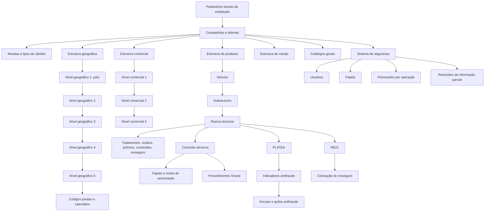
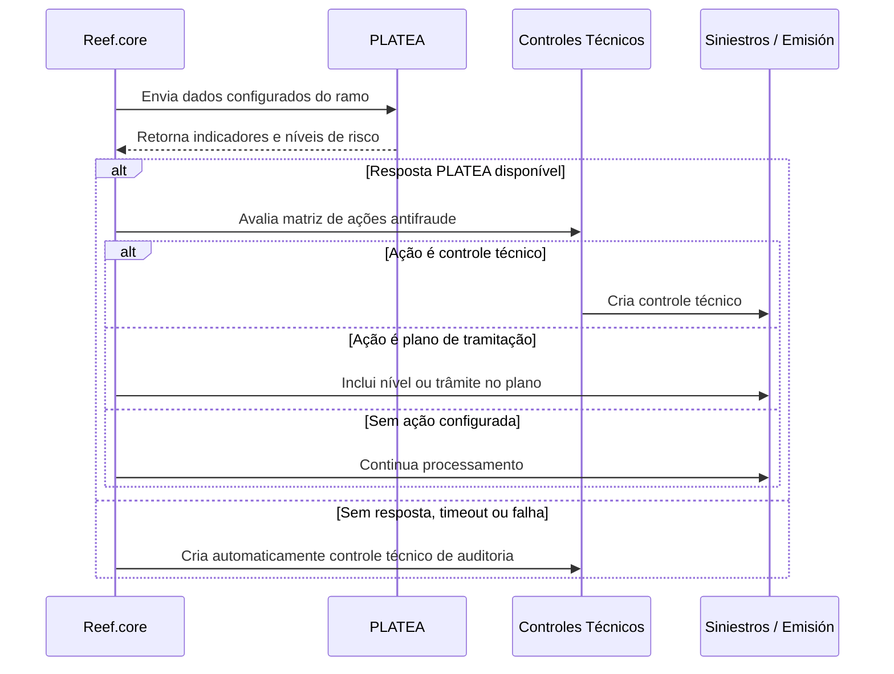

# Reef.core — Definição e Configuração de Elementos Comuns, Catálogos, Estruturas, Segurança, Controles Técnicos e Integrações

## 1. Metadados do Documento
- **Arquivo de Origem:** `Não identificado — conteúdo bruto extraído de DOCUMENTACIÓN Reef / MapfreDocument`
- **Tipo de Documento:** Manual Operacional e Especificação Funcional
- **Domínio / Sistema:** Reef.core / MAPFRE
- **Público-Alvo:** Desenvolvedores, Arquitetos, Operação, Administração e Finanças, Segurança, Negócio e Tecnologia Local
- **Data/Versão Identificada:** Não identificada. Há referência explícita a dezembro de 2023 no módulo de notificações.

---

## 2. Resumo Executivo & Contexto de Negócio

O documento descreve a configuração funcional e operacional de elementos transversais do sistema segurador **Reef.core**, utilizado por entidades MAPFRE. O conteúdo cobre estruturas organizacionais, geográficas, comerciais, produtos, canais de distribuição, moedas, usuários, segurança, catálogos gerais, tarefas, programas, documentos, notificações, controles técnicos, marcas e integração antifraude com PLATEA.

A arquitetura funcional é altamente parametrizável por companhia. As entidades locais podem configurar catálogos próprios, estruturas comerciais, estruturas geográficas, ramos, usuários, fontes de produção, conceitos econômicos e regras operacionais. Entretanto, diversos catálogos pertencem ao núcleo corporativo e não podem ser alterados, especialmente aqueles identificados pela instalação `TRN`.

A estrutura de produtos organiza a operação seguradora por setor, subsector e ramo técnico. O ramo técnico concentra uma grande quantidade de parâmetros que determinam o comportamento de emissão, sinistros, reaseguro, coasseguro, cálculo de prêmios, recibos, comissões, impressão, inspeções, integração com serviços externos e controles técnicos.

A documentação também estabelece mecanismos de governança e segurança. Usuários recebem permissões por companhia, ramo, operação, estrutura comercial, produto, papéis funcionais e papéis de informação parcial. A configuração privilegia o princípio de menor privilégio, recomendando restringir o acesso à informação em vez de conceder acesso irrestrito.

Por fim, Reef.core integra mecanismos corporativos de prevenção e tratamento de fraude. A integração com **PLATEA** permite avaliar indicadores antifraude em emissão e sinistros, convertendo resultados em controles técnicos ou em ações no plano de tramitação. O módulo de Marcas complementa essa capacidade mediante regras proativas e reativas aplicáveis a terceiros, riscos, pólizas e eventos previamente identificados.

---

## 3. Arquitetura, Componentes & Tecnologias Envolvidas

### Componentes funcionais identificados

| Componente | Função no contexto Reef.core |
| :--- | :--- |
| Reef.core | Sistema transacional central para seguros, emissão, sinistros, tesouraria, reaseguro, segurança e catálogos. |
| TRN | Código de instalação do núcleo Reef.core; configurações TRN devem ser preservadas. |
| NewTron | Versão atual do Reef.core, relacionada a operações funcionais. |
| TronWeb | Versão legada do Reef.core, relacionada a programas legados e permissões. |
| FUJI | Orquestrador do frontal Reef.core; trata aplicações como MicroFrontEnd real ou por emulação com iframes. |
| Oracle | Base de dados mencionada para estruturas, tabelas, procedimentos, listas de valores e lógica de negócio. |
| Java | Tecnologia de cliente e de parâmetros por usuário; programas e lógicas podem ser configurados no sistema. |
| PL/SQL | Tipo de programa aplicável a tarefas e procedimentos de negócio. |
| RE21 | Solução corporativa externa para resolver cessões de resseguro. |
| PLATEA | Plataforma tecnológica corporativa de luta contra fraude. |
| HP ExStream | Ferramenta corporativa indicada para geração e envio de documentos e notificações. |
| DOCUMENTUM | Ferramenta corporativa indicada para armazenamento e gestão documental. |
| LDAP | Mecanismo de autenticação possível para usuários da aplicação. |
| BPM | Possível execução dos processos de emissão e sinistros via Business Process Management. |
| SAPTRON | Usuário mencionado para conexão à base de dados. |
| JSPOOL | Perfis de acesso de usuários do servidor de aplicações. |

### Arquitetura funcional de configuração



### Fluxo de integração com PLATEA



---

## 4. Regras de Negócio, Especificações Funcionais & Processos

### 4.1 Moedas e tipos de câmbio

- Reef.core suporta operação multimoeda para cálculo de prêmios, liquidação de sinistros, prestações e comissões.
- Cada moeda deve respeitar a norma **ISO 4217**.
- A moeda pode representar:
  - moeda real;
  - unidade de conta reajustada periodicamente;
  - moeda fictícia, como os Tréboles do plano de fidelização.
- O número de decimais determina a precisão utilizada nos cálculos internos.
- Para cada companhia, moeda e data, o sistema permite capturar apenas **um único tipo de câmbio**.
- O tipo de câmbio representa o valor médio de compra e venda da divisa em uma data específica.

### 4.2 Estrutura comercial

A estrutura comercial possui três níveis piramidais configuráveis:

1. Primeiro nível.
2. Segundo nível.
3. Terceiro nível.

A estrutura comercial pode ser organizada por funções, produtos, geografia, clientes ou modelo misto. No contexto MAPFRE, predominam estruturas geográficas ou mistas.

Regras relevantes:

- Primeiro nível utiliza obrigatoriamente a atividade de terceiro `42`.
- Segundo nível utiliza obrigatoriamente a atividade de terceiro `43`.
- Terceiro nível utiliza obrigatoriamente a atividade de terceiro `44`.
- Esses códigos de atividade pertencem ao núcleo e não podem ser modificados.
- Quando não houver documento identificador associado à atividade, o sistema pode atribuir o tipo de documento configurado nos parâmetros da instalação.
- O valor `THP` pode ser empregado como tipo de documento identificador quando não existirem documentos próprios associados.
- Cada nível pode ser inabilitado para impedir captura ou modificação.
- A marca de emissão diferencia código real de nível genérico.
- Para o primeiro nível, só pode existir um registro com marca de emissão desativada.
- Para o segundo nível, só pode existir um registro genérico por dupla Primeiro/Segundo Nível.
- Para o terceiro nível, só pode existir um registro genérico por combinação Primeiro/Segundo/Terceiro Nível.
- A propriedade **Tipo de Distribuição** no terceiro nível está descontinuada e não pode ser reutilizada.
- O terceiro nível pode indicar data oficial de abertura e se a filial/escritório pertence à companhia ou é associado/externo.

### 4.3 Estrutura geográfica

A estrutura geográfica possui cinco níveis piramidais:

1. País.
2. Segundo nível territorial.
3. Terceiro nível territorial.
4. Quarto nível territorial.
5. Quinto nível territorial.

Regras relevantes:

- O primeiro nível representa países e deve usar códigos **ISO 3166-1 alfa-3**.
- As descrições podem existir em idioma configurado e em idioma vernáculo.
- O código postal é associado aos cinco níveis da estrutura geográfica.
- A recomendação é carregar e manter codificações do serviço postal local, preservando-as **AS-IS**.
- O calendário oficial registra dias não úteis e feriados por nível geográfico.
- A data de validade permite manter histórico de alterações de níveis, feriados e catálogos.
- Cada nível pode ser marcado como real ou genérico, com restrições de unicidade conforme os níveis hierárquicos superiores.
- As denominações locais podem variar por instalação e idioma, como País, Estado, Província, Município, Distrito, Região, Comunas, Localidades ou Colonias.

### 4.4 Estrutura de produtos

A estrutura de produtos possui quatro níveis principais:

1. Companhia.
2. Setor.
3. Subsetor.
4. Ramo técnico.

Regras relevantes:

- Um setor agrupa ramos com características técnicas semelhantes.
- Um subsetor depende de um setor.
- Todo ramo técnico deve estar obrigatoriamente associado a um setor e a um subsetor.
- O sistema permite configurar até **999 ramos** por companhia.
- O ramo `999` é fictício, destinado ao uso interno da aplicação e não representa ramo real.
- Os tratamentos possíveis são pré-configurados e não podem ser ampliados:
  - `A`: Automóveis;
  - `D`: Diversos;
  - `T`: Transportes;
  - `V`: Vida & Acidentes.
- Um ramo pode usar tratamentos distintos para emissão, sinistros e contabilidade.

### 4.5 Regras operacionais do ramo técnico

| Área | Regra funcional |
| :--- | :--- |
| Multirriscos | Permite contratar mais de um objeto segurado ou assegurado na mesma apólice. |
| Multiperíodos | Para apólices superiores a um ano, registra informação econômica separadamente por período quando ativado. |
| Registro de hora/minutos | Torna obrigatória a captura de hora e minuto na data de efeito da apólice ou suplemento. |
| Respeitar dia de vencimento | Obriga manter o dia correspondente na data de vencimento. |
| Cláusulas | Permite cláusulas automáticas ou manuais em apólices, riscos ou coberturas. |
| Anexos | Permite anexos em nível de apólice e/ou objeto segurado. |
| Arrastar anexos de orçamento | Transporta anexos do orçamento para a apólice emitida a partir dele. |
| Anexos multilíngues | Permite capturar anexos em qualquer idioma, independentemente do idioma do emissor. |
| Orçamento obrigatório | Exige a existência de orçamento antes da emissão da apólice. |
| Reutilizar orçamento | Permite que diversas apólices utilizem o mesmo código de orçamento/cotação. |
| Autorização de orçamento | Exige que orçamento submetido a controles técnicos esteja totalmente autorizado antes de emitir. |
| Apólice disponível a qualquer usuário | Permite que qualquer usuário habilitado retome emissão suspensa ou rejeitada. |
| Controles em anulação de suplementos | Define se controles técnicos podem ser executados em suplementos de anulação. |
| Mudança de numeração | Pode obrigar a renumeração automática em renovação ou aplicações de transportes. |
| Motivos de suplemento | Por padrão há um motivo; a parametrização pode permitir múltiplos motivos. |
| Formação de modalidade | Valores suportados: sem modalidade, implícita ou explícita. |
| Formação de imagem | Pode usar data do sistema, data de efeito do suplemento ou data de efeito da apólice. |
| Inspeção | Pode buscar e associar inspeção; requer componentes locais para critérios de busca e associação. |
| Captura especializada | Estruturas de captura podem ser substituídas por subprogramas locais. |
| Pricing dinâmico | Após cálculo de prêmios, pode chamar serviço local para ajustar valores. |

### 4.6 Prêmios, recibos e comissões

- O cálculo de prêmio temporário pode usar prorrata temporis ou escala.
- O usuário pode receber permissão para alterar entre prorrata e escala.
- O ano de cálculo pode ser de 360 ou 365 dias.
- Para ano de 360 dias, todos os meses são tratados com 30 dias.
- A configuração de 360 ou 365 dias não é alterada por ano bissexto.
- A propriedade “considerar 29 de fevereiro” influencia a fórmula interna de cálculo de coeficientes.
- Os modos de prêmio manual são:
  1. cálculo automático;
  2. cálculo automático ou manual;
  3. cálculo manual.
- A taxa é obtida pela relação informada no documento: **Capital / Prêmio Anual da Cobertura**.
- A alteração de tipo de câmbio contábil deve ser auditada e aprovada pela Administração e Finanças.
- A emissão sem recibos exige execução obrigatória de componente local de validação.
- A cobrança de recibos exige validação local e papel de caixa para o usuário.
- O número máximo de agentes por apólice deve estar entre `1` e `4`.
- A modificação percentual de comissões só é permitida quando multiperíodos estiver desativado.
- Comissões de carteira são calculadas como “Nova Produção” até existir suplemento de renovação; com a propriedade ativa, após renovação podem ser calculadas como “Carteira”.

### 4.7 Coasseguro e resseguro

| Parâmetro | Valores / comportamento |
| :--- | :--- |
| Tipo de coasseguro permitido | `0` Exento; `1` Somente cedido; `2` Somente aceito; `3` Cedido/Aceito. |
| Quadro de coasseguro obrigatório | Obriga definir distribuição de coasseguro por quadro. |
| Comissão de coasseguro externa | Indica cálculo não padrão, sem necessidade de informar percentuais na emissão. |
| Tipo de resseguro permitido | `0` Seguro direto; `1` Resseguro aceito por contrato; `2` Resseguro aceito facultativo; `3` Resseguro cedido/aceito. |
| Colocação externa de resseguro | Quando ativa, Reef.core chama RE21 para cessões. |
| Falha em RE21 na emissão | Pode gerar controle técnico na emissão. |
| Falha em RE21 em sinistros | Pode gerar controle técnico no módulo de sinistros. |
| Execução RE21 | Pode ocorrer on-line ou de forma diferida. |

### 4.8 Canais de distribuição

A estrutura de canais possui três níveis:

1. Clientes distribuidores.
2. Agrupações.
3. Fontes de produção.

Tipos corporativos de clientes distribuidores:

- Direto.
- Rede Própria / Rede Agencial.
- Rede Externa / Corretores.
- Bancário.
- Acordos.

Regras relevantes:

- Os níveis 1 e 2 possuem classificação corporativa predefinida e não podem ser alterados localmente.
- As entidades MAPFRE locais podem definir a granularidade do terceiro nível, isto é, das fontes de produção.
- Cada fonte de produção pertence univocamente a um cliente distribuidor e a uma agrupação.
- A fonte de produção identifica para uma apólice o cliente distribuidor, canal de comercialização e atributos do agente.
- A fonte deve ser mantida durante a vigência da apólice, podendo ser alterada na renovação.

### 4.9 Segurança, usuários e restrição de informação

A autenticação não implica autorização. A autorização é concedida por papéis, operações, acessos e restrições.

Regras relevantes:

- Usuários são identificados por `NUUMA`.
- Recomenda-se codificar usuários da mesma forma que no diretório ativo corporativo.
- Um usuário pode possuir um ou mais papéis.
- A permissão pode ser especializada por companhia, ramo técnico, usuário e operação Reef.core.
- A consulta de informação pode ser limitada por estrutura comercial, agente, empregado de agente, setor, subsetor e ramo técnico.
- Para acesso total, devem ser utilizados códigos genéricos apropriados.
- A recomendação explícita é privilegiar acesso restrito em detrimento de acesso sem restrições.
- Um usuário que não tenha acesso completo aos dados de terceiros também não poderá modificá-los.
- Usuários do servidor de aplicações são inicialmente criados com papéis `PRG` e `OJP`.
- Quando LDAP estiver ativo como autenticação, a propriedade de usuário de rede deve ser ativada e a possibilidade de modificar usuário deve permanecer inativa.

### 4.10 Instalações, programas e listas de valores

- Instalações distinguem configuração padrão do núcleo e configuração local.
- Em catálogos personalizáveis, apenas podem coexistir registros da instalação `TRN` e da instalação local.
- Configurações `TRN` de programas, mensagens, listas de valores, filtros, menus, textos e ajudas devem ser preservadas.
- Listas de valores são utilizadas para domínios pequenos; listas de valores de campos referenciados são utilizadas quando os dados estão em tabelas separadas e precisam de filtros dinâmicos.
- Operadores relacionais disponíveis em listas referenciadas:
  - `=`, `!=`, `<`, `<=`, `>`, `>=`, `L` como, `B` entre.

### 4.11 Controles técnicos

Controles técnicos são validações dinâmicas configuradas localmente sobre operações específicas. Diferem das validações nativas e obrigatórias do núcleo, que não podem ser ignoradas.

Regras relevantes:

- Controles técnicos podem ser configurados para emissão, suplementos e renovações.
- Controles de auditoria exigem usuário com nível de autorização igual ou superior ao nível do controle.
- Níveis de autorização tradicionalmente usam a faixa `NIVEL0` a `NIVEL09`.
- Níveis de salto já vêm pré-configurados e não devem ser modificados.
- Procedimentos de controle técnico são implementados por procedimentos Oracle ou lógica de negócio.
- A especialização pode considerar sistema, setor, subsetor, ramo, níveis comerciais, nível de salto, menu e estrutura de informação.
- Cada usuário pode possuir apenas um papel de controles técnicos.
- A configuração pode exigir observações obrigatórias para autorizar ou rejeitar controles.
- A estrutura de detalhe de controles técnicos está descontinuada.

### 4.12 PLATEA e Marcas

- PLATEA é a plataforma corporativa de luta contra fraude.
- A integração com Reef.core permite prevenção e detecção em emissão e sinistros.
- Indicadores PLATEA devem usar exatamente a mesma chave definida na plataforma PLATEA.
- Apenas indicadores que geram ação em Reef.core precisam ser configurados.
- Ausência de resposta de PLATEA, timeout, indisponibilidade ou falta de informação processada gera automaticamente um controle técnico de auditoria.
- Ações antifraude podem:
  - criar controles técnicos;
  - inserir nível em plano de tramitação;
  - inserir trâmite específico;
  - não executar ação.
- Marcas permitem controles proativos e reativos sobre terceiros, riscos e apólices.
- Ações antecipadas podem gerar controles técnicos ou executar lógica de negócio.
- Fatos de marcas podem usar dados fixos, dados variáveis ou intervenções de terceiros.
- A seleção de apólices para tratamento de marcas pode ser alterada apenas quando não houver registro vigente de marca obrigatória por ramo.

---

## 5. Tabelas de Parâmetros, Ambientes e Estruturas de Dados

### 5.1 Moedas e tipos de câmbio

| Item / Parâmetro | Descrição / Função | Tipo / Valores / Formato | Ambiente / Observações |
| :--- | :--- | :--- | :--- |
| Código da moeda/divisa | Identifica a moeda no sistema | Código de moeda | Deve respeitar ISO 4217 |
| Código ISO da moeda | Código internacional da moeda | ISO 4217, três letras | Obrigatório conforme recomendação |
| Descrição da moeda | Nome da moeda/divisa | Texto | — |
| Marca moeda real/unidade de conta | Diferencia moeda real, unidade de conta ou moeda fictícia | Marca lógica | Exemplos: UF, UDI, Tréboles |
| Número de decimais | Define precisão interna de cálculos | Número | — |
| Companhia | Companhia do tipo de câmbio | Código de companhia | — |
| Data de câmbio | Data do câmbio médio de compra e venda | Data | Somente um tipo de câmbio por moeda e data |
| Valor do tipo de câmbio | Valor aplicável à moeda na data | Valor monetário | — |

### 5.2 Níveis comerciais

| Item / Parâmetro | Descrição / Função | Tipo / Valores / Formato | Ambiente / Observações |
| :--- | :--- | :--- | :--- |
| Companhia | Companhia da estrutura comercial | Código | Todos os níveis |
| Atividade de terceiro Nível 1 | Identifica primeiro nível como terceiro | Constante `42` | Não modificável |
| Atividade de terceiro Nível 2 | Identifica segundo nível como terceiro | Constante `43` | Não modificável |
| Atividade de terceiro Nível 3 | Identifica terceiro nível como terceiro | Constante `44` | Não modificável |
| Tipo documento identificador | Tipo de documento do nível | Ex.: `THP` | Pode derivar da parametrização da instalação |
| Chave documento identificador | Identificador do documento | Código | — |
| Chaves de nível | Identificam relação hierárquica | Código | Nível 2 depende do 1; nível 3 depende do 1 e 2 |
| Denominação / abreviatura | Nome e nome curto local | Texto | Configurável por entidade |
| Estrutura geográfica | Localização do nível comercial | Níveis geográficos 2, 3 e 4 | Inclui complemento do quarto nível |
| Tipo e dados de endereço | Endereço do nível comercial | Texto e códigos | Valores devem ser identificados localmente |
| Responsável | Nome do responsável máximo | Texto | — |
| Telefone, fax e e-mail | Dados de contato corporativo | Texto | — |
| Inabilitação | Impede utilização do nível | Marca lógica | — |
| Emissão | Diferencia nível real de genérico | Marca lógica | Uso interno do núcleo |

### 5.3 Estrutura geográfica

| Item / Parâmetro | Descrição / Função | Tipo / Valores / Formato | Ambiente / Observações |
| :--- | :--- | :--- | :--- |
| Primeiro nível | País | ISO 3166-1 alfa-3 | Ex.: PAN, USA, ESP, MEX |
| Segundo nível | Divisão territorial subordinada ao país | Código | Ex.: região, estado, comunidade |
| Terceiro nível | Divisão subordinada ao segundo nível | Código | Ex.: província |
| Quarto nível | Divisão subordinada ao terceiro nível | Código | Ex.: município/localidade |
| Quinto nível | Divisão subordinada ao quarto nível | Código | Ex.: distrito, comuna, colonia |
| Descrição | Nome no idioma configurado | Texto | Deve manter coerência com idioma do primeiro nível |
| Descrição vernácula | Nome no idioma local | Texto | — |
| Abreviatura | Nome abreviado | Texto | — |
| Nível real | Diferencia código real e genérico | Marca lógica | Uso interno |
| Inabilitação | Impede uso no catálogo | Marca lógica | — |
| Data de validade | Início da vigência | Data | Mantém histórico |
| Código postal | Código associado aos cinco níveis | Código | Recomenda-se fonte postal local |
| Calendário oficial | Dia não útil ou feriado | Data | Configurável por níveis 1 a 4 |

### 5.4 Estrutura de produtos e ramo contábil

| Item / Parâmetro | Descrição / Função | Tipo / Valores / Formato | Ambiente / Observações |
| :--- | :--- | :--- | :--- |
| Setor | Agrupa ramos com características semelhantes | Código | Pode ser usado em estatísticas |
| Subsetor | Subconjunto de ramos do setor | Código | Depende do setor |
| Ramo técnico | Unidade técnica de seguro | Até 999 códigos por companhia | Deve pertencer a setor e subsetor |
| Tratamento | Especializa emissão, sinistros e contabilidade | `A`, `D`, `T`, `V` | Catálogo fechado |
| Ramo contábil | Chave para contabilização de cobertura | 9 posições | Setor + subsetor + agrupamento + sequência |
| Posição 1 | Setor | 1 posição | Ramo contábil |
| Posições 2–3 | Subsetor | 2 posições | Ramo contábil |
| Posições 4–6 | Agrupamento | 3 posições | Frequentemente identifica ramo técnico |
| Posições 7–9 | Sequência | 3 posições | Ramo contábil |
| Dado variável | Define ramo contábil dinâmico | Código e valor | Aplicável a ramo contábil por dado variável |
| Data de validade | Início da vigência | Data | Mantém histórico |
| Inabilitação | Desativa registro | Marca lógica | — |

### 5.5 Tratamentos de ramo

| Tratamento | Nome | Abreviatura | Uso descrito |
| :--- | :--- | :--- | :--- |
| A | Automóveis | Autos. | Permite acessórios no processo de emissão. |
| D | Diversos | Div. | Comportamento padrão Reef.core. |
| T | Transportes | Trans. | Permite apólices fixas, flutuantes e aplicações. |
| V | Vida & Acidentes | Vida & Acc. | Permite características de seguro de pessoas, questionários, resgates e funcionalidades específicas. |

### 5.6 Segurança e acessos

| Item / Parâmetro | Descrição / Função | Tipo / Valores / Formato | Ambiente / Observações |
| :--- | :--- | :--- | :--- |
| Usuário | Identificador do usuário | NUUMA | Recomenda-se alinhamento com diretório ativo |
| Papel por entidade | Papel funcional do usuário | Código de papel | Um usuário pode possuir diversos papéis funcionais |
| Acesso de criação/modificação de terceiros | Permite operar atividades de terceiros | Código de atividade | Valor genérico `999` permitido |
| Acesso de consulta | Restringe consulta por estruturas | Comercial, agente, produto | Recomenda-se princípio de menor privilégio |
| Operação Reef.core | Permissão de execução | Código de operação | Pode ser especializada por ramo |
| Papel de informação parcial | Restringe visualização | Código de papel | Pode restringir conceito e propriedade |
| Pessoa física/jurídica | Escopo da restrição | Física, jurídica ou `Z` | `Z` restringe ambos |
| Propriedade genérica | Restringe todas as propriedades do conceito | `ZZZZ...ZZZZ` | Aplicável a restrições por papel |
| Papel servidor aplicações | Papel técnico | SUA/ADM, PRG, AJP/EJP, UJP, OJP, WTWPRG, WTWADM | Padrão inicial: PRG e OJP |
| LDAP | Autenticação corporativa | Marca lógica | Exige usuário de rede ativo e modificação de usuário inativa |

### 5.7 Canais de distribuição

| Nível | Código / Exemplo | Descrição | Observações |
| :--- | :--- | :--- | :--- |
| 1 | — | Direto | Configuração corporativa fixa |
| 1 | — | Rede Própria | Configuração corporativa fixa |
| 1 | — | Rede Externa | Configuração corporativa fixa |
| 1 | — | Bancário | Configuração corporativa fixa |
| 1 | — | Acordos | Configuração corporativa fixa |
| 2 | 10 | Escritórios Diretos | Abreviatura `OFD.` |
| 2 | 11 | Direto Grandes Contas | Abreviatura `DGC.` |
| 2 | 12 | Direto Digital | Abreviatura `DD.` |
| 2 | 13 | Direto Telefônico | Abreviatura `DT.` |
| 2 | 24 | Delegados | Abreviatura `DEL.` |
| 2 | 25 | Agentes Exclusivos | Abreviatura `AG.EX.` |
| 2 | 36 | Agentes Vinculados | Abreviatura `AG.V.` |
| 2 | 37 | Agentes Não Vinculados | Abreviatura `AGNV.` |
| 2 | 38 | Corretores Locais | Abreviatura `CORL.` |
| 2 | 39 | Corretores Globais | Abreviatura `CORG.` |
| 2 | 410 | Bancário | Abreviatura `BANC.` |
| 2 | 511 | Acordos | Abreviatura `ACU.` |
| 3 | 1001–1006 | Exemplos de fonte telefônica direta | Configuração local e ilustrativa |
| 3 | 2401–2502 | Exemplos de delegado/agente exclusivo | Configuração local e ilustrativa |

### 5.8 Tipos de compensação

| Compensação | Descrição |
| :--- | :--- |
| 1 | Cheque bancário |
| 2 | Efetivo |
| 3 | Por transferência |
| 4 | Contas gestão |
| 5 | Cartão |
| 6 | Banco efetivo transferência |
| 7 | Ficheiro bancário |

### 5.9 Módulos Reef.core

| Código do módulo | Descrição |
| :--- | :--- |
| TRN | Reef.core |
| SS | Sistema de Segurança |
| DC | Dados Comuns |
| EM | Emissão |
| TS | Sinistros |
| GC | Gestão de Cobros / Tesouraria |
| RE | Resseguro |
| CA | Coasseguro |
| CO | Contabilidade |

---

## 6. Bateria de Perguntas & Respostas para RAG (FAQ Sintético)

### P1: Como Reef.core controla moedas e tipos de câmbio?
**R:** Reef.core é multimoeda e permite configurar moedas para cálculos de prêmios, sinistros, liquidações e comissões. A definição da moeda deve respeitar a ISO 4217 e informa código, código ISO, descrição, marca de moeda real ou unidade de conta e número de decimais. Para cada companhia, moeda e data, o sistema permite somente um tipo de câmbio.

### P2: Quais são os códigos de atividade de terceiros dos níveis da estrutura comercial?
**R:** O primeiro nível utiliza a atividade `42`, o segundo nível utiliza `43` e o terceiro nível utiliza `44`. Os códigos são constantes do núcleo Reef.core e não podem ser modificados. Eles identificam os níveis comerciais no novo modelo de informação de terceiros.

### P3: Como a estrutura geográfica é modelada em Reef.core?
**R:** A estrutura geográfica é piramidal e possui cinco níveis. O primeiro nível representa países e deve usar ISO 3166-1 alfa-3. Os demais níveis representam divisões territoriais locais, como regiões, províncias, municípios, localidades, distritos, comunas ou colonias. Há suporte a descrição no idioma configurado, descrição vernácula, abreviatura, inabilitação, códigos reais/genéricos e vigência.

### P4: O que acontece quando a propriedade Multiperíodos está ativa em um ramo?
**R:** Quando uma apólice tem duração superior a um ano e o ramo possui Multiperíodos ativo, Reef.core registra a informação econômica separadamente para cada período da apólice. Quando a propriedade está desativada, o sistema registra a informação econômica em um único período, mesmo que a apólice tenha duração plurianual.

### P5: Quais tratamentos de ramo técnico existem no Reef.core?
**R:** O catálogo corporativo possui quatro tratamentos: `A` para Automóveis, `D` para Diversos, `T` para Transportes e `V` para Vida & Acidentes. Os tratamentos podem ser atribuídos independentemente aos processos de emissão, sinistros e contabilidade. Não é possível ampliar essa lista de valores localmente.

### P6: Como funciona a colocação de resseguro em RE21?
**R:** Quando a propriedade de colocação de resseguro em sistema externo está ativada, Reef.core chama a solução corporativa RE21 para resolver cessões de resseguro com base nas coberturas da apólice ou suplemento e na configuração existente em RE21. Se a execução falhar, poderá ser criado um controle técnico na emissão ou nos sinistros, conforme a parametrização do ramo.

### P7: Quais restrições podem ser aplicadas às consultas de um usuário?
**R:** O acesso de consulta pode ser restringido por níveis da estrutura comercial, agente, empregado do agente, setor, subsetor e ramo técnico. Para acesso total, podem ser usados códigos genéricos. A documentação recomenda priorizar a restrição de acesso, em vez de conceder acesso sem limitações.

### P8: Qual é a relação entre autenticação e autorização em Reef.core?
**R:** A autenticação permite ao usuário iniciar sessão no sistema, mas não concede automaticamente permissão para utilizar recursos. A autorização é concedida mediante papéis, permissões de operações, acessos por ramo, restrições de consulta e papéis de informação parcial.

### P9: O que acontece quando PLATEA não responde durante uma operação?
**R:** Se PLATEA não responder devido à indisponibilidade de conexão, excesso de tentativas, timeout ou ausência de informação processada sobre o elemento avaliado, Reef.core gera automaticamente um Controle Técnico de Auditoria.

### P10: Como são configuradas as ações antifraude da integração PLATEA?
**R:** A matriz de ações antifraude é definida por companhia, módulo Reef.core, operação, indicador PLATEA, ação e nível de risco. As ações podem criar controles técnicos, inserir níveis no plano de tramitação de sinistros, inserir trâmites específicos ou não executar ação. Em sinistros, também pode marcar o expediente como possível fraude ou exibir aviso.

### P11: Quais configurações TRN podem ser modificadas localmente?
**R:** O documento determina que configurações pertencentes à instalação `TRN`, que representa o núcleo Reef.core, devem ser respeitadas e não devem ser alteradas. Isso abrange diversos catálogos, incluindo instalações, programas, mensagens, textos, etiquetas, menus, listas de valores e filtros. Em catálogos personalizáveis, coexistem apenas registros `TRN` e registros da instalação local.

### P12: Como são tratados documentos e notificações em Reef.core?
**R:** Reef.core pode gerar documentos e notificações contratuais, comerciais, informativas, operacionais e de voz do cliente. Os canais incluem distribuição local, e-mail, fax, SMS, file system, URL privada, gestor documental, fornecedor externo e assinatura eletrônica. A documentação informa que, em dezembro de 2023, HP ExStream e DOCUMENTUM eram as ferramentas corporativas de geração/envio e gestão documental, respectivamente.

---

## 7. Glossário de Termos, Siglas & Conceitos-Chave

- **ACO:** Área Corporativa de Operações.
- **ACNC:** Área Corporativa de Negócio e Clientes.
- **AGD:** Gestor documental corporativo, citado no contexto de DOCUMENTUM.
- **BPM:** Business Process Management; possível mecanismo de execução para processos de emissão e sinistros.
- **CC.PP:** Condições particulares de apólices.
- **DNI:** Documento Nacional de Identidade.
- **FATCA:** Foreign Account Tax Compliance Act; legislação dos Estados Unidos voltada ao controle de evasão fiscal.
- **FUJI:** Orquestrador do frontal Reef.core.
- **IBNR:** Cálculo de reservas de sinistros mencionadas como possível tarefa.
- **ISO 3166-1 alfa-3:** Norma de códigos de três letras para países, territórios dependentes e áreas geográficas especiais.
- **ISO 4217:** Norma de códigos de três letras para moedas.
- **ISO 639-1 / ISO 639-2 / ISO 639-3:** Normas de codificação de idiomas.
- **LDAP:** Protocolo usado como possível método de autenticação de usuários.
- **MicroFrontEnd:** Aplicação tratada por FUJI como componente frontal independente, em vez de emulação por iframe.
- **NUUMA:** Código de identificação do usuário nas entidades MAPFRE.
- **PLATEA:** Plataforma Tecnológica de Luta contra o Fraude do Grupo MAPFRE.
- **RE21:** Solução corporativa externa para cessões e colocação de resseguro.
- **RGPD:** Regulamento Geral de Proteção de Dados.
- **THP:** Tipo de documento identificador utilizado quando níveis comerciais não possuem documentos próprios associados, conforme condições do documento.
- **TRN:** Código de instalação do núcleo Reef.core.
- **TronWeb:** Versão legada do Reef.core.
- **NewTron:** Versão atual do Reef.core.
- **UF:** Unidade de Fomento do Chile, citada como unidade de conta.
- **UDI:** Unidade de Inversão do México, citada como unidade de conta.
- **URL privada:** Canal em que documento é acessado por link enviado ao cliente.
- **WebPlus:** Modalidade Documentum para acesso documental por vínculo.

---

## 8. Notas Críticas, Riscos & Limitações

- **Configurações do núcleo:** Catálogos, registros e valores associados à instalação `TRN` devem ser preservados. Alterações locais em configurações do núcleo podem comprometer o funcionamento da aplicação.
- **Conteúdo descontinuado:** Diversas propriedades são explicitamente obsoletas ou descontinuadas, incluindo tipo de distribuição do terceiro nível comercial, número máximo de riscos on-line, cálculo de fracionamento de pagamento, distribuição proporcional de comissões, estrutura de detalhe de controles técnicos, programas externos legados e outras propriedades indicadas no documento.
- **Componentes locais obrigatórios:** Diversas funcionalidades exigem desenvolvimento local, incluindo seleção de riscos, inspeções, captura especializada, pricing dinâmico, distribuição de prêmios, validações de emissão sem recibos, cobrança de recibos, lógica de autorização de controles técnicos, lógica de rejeição, geração de documentos e integração com sistemas externos.
- **Governança financeira:** Modificações de tipo de câmbio devem ser auditadas e aprovadas pela Direção de Administração e Finanças.
- **Segurança:** O acesso à informação deve ser restringido por padrão. A documentação recomenda primar restrição em vez de acesso irrestrito.
- **PLATEA:** Falhas de conectividade, timeout ou falta de dados processados por PLATEA causam criação automática de controle técnico de auditoria.
- **Regras corporativas fixas:** Tratamentos de ramo, códigos corporativos de canais, níveis de salto e determinados catálogos não podem ser ampliados ou modificados localmente.
- **Documentação incompleta:** Diversas seções estão explicitamente marcadas como `EN CONSTRUCCIÓN`, `Pendiente` ou `Pendiente Revisión`; esses itens não possuem detalhamento adicional no conteúdo fornecido.
- **Artefatos de extração:** O texto original contém palavras fragmentadas, cabeçalhos duplicados, tabelas repetidas e alguns campos técnicos parcialmente extraídos, como `opr_idn_val`, `ntf_ade_typ_val`, `obs_val` e `opr_t`. Não foram inferidos significados além dos descritos explicitamente.

---

## 9. Conteúdo Bruto Estruturado (Referência Fiel)

```text
TÍTULOS ESTRUTURAIS IDENTIFICADOS NO CONTEÚDO ORIGINAL

1. DEFINICIÓN de las MONEDAS
   - Definición de Monedas
   - Tipos de Cambio
   - ISO 4217
   - Marca Divisa Real o Unidad de Cuenta
   - Número de Decimales

2. DEFINICIÓN de la ESTRUCTURA COMERCIAL
   - Denominaciones de los Niveles de la Estructura Comercial
   - Nivel 1 / Estructura Comercial
   - Nivel 2 / Estructura Comercial
   - Nivel 3 / Estructura Comercial
   - Actividades de Terceros: 42, 43 y 44
   - Estructura Comercial versus Canales de Distribución

3. DEFINICIÓN de la ESTRUCTURA GEOGRÁFICA
   - Nivel 1 / Países
   - Nivel 2 / Estados
   - Nivel 3 / Provincias
   - Nivel 4 / Localidades
   - Nivel 5 / Distritos, Delegaciones, Comunas
   - Códigos Postales
   - Días Inhábiles y Festivos
   - Países adscritos a FATCA
   - ISO 3166-1 alfa-3

4. DEFINICIÓN de la ESTRUCTURA de PRODUCTOS
   - Sectores
   - Sub-Sectores
   - Ramos Técnicos
   - Tratamientos
   - Ramos Contables Estándar
   - Ramos Contables por Dato Variable
   - Tratamientos: A, D, T, V
   - Parámetros de emisión, siniestros, recibos, comissões, coaseguro e resseguro

5. DEFINICIÓN de la ESTRUCTURA de CANALES
   - Nivel 1: Clientes Distribuidores
   - Nivel 2: Agrupaciones
   - Nivel 3: Fuentes de Producción
   - Tipos: Directo, Red Propia, Red Externa, Bancario, Acuerdos

6. DEFINICIÓN de Otros CATÁLOGOS GENERALES/TRANSVERSALES
   - Códigos del Sistema
   - Fechas de Proceso
   - Formas de Compensación
   - Conceptos Económicos
   - Conceptos Económicos / Liquidación de Comisiones

7. DEFINICIÓN del SISTEMA de SEGURIDAD
   - Usuarios
   - Roles por Entidad
   - Roles por Usuario
   - Accesos a Operaciones
   - Accesos a Consultas
   - Información Parcial
   - Usuarios en Servidor de Aplicaciones
   - Parámetros Java por Usuario
   - Restricciones de Terceros por Rol

8. DEFINICIÓN de ESTRUCTURAS de INFORMACIÓN
   - Agrupaciones
   - Estructuras
   - Asociación de estructuras a agrupaciones
   - Datos variables
   - Tablas Oracle
   - Estruturas anexas
   - Procedimientos dinámicos

9. DEFINICIÓN de TAREAS
   - Definición de una tarea
   - Parámetros de una tarea
   - Tareas TRN de núcleo
   - Processos, cartas e listados

10. DEFINICIÓN de PROGRAMAS, MENÚS, MENSAJES, ETIQUETAS, TEXTOS, AYUDAS
    - Instalaciones
    - Módulos
    - Paneles
    - Operaciones
    - Programas
    - Menús
    - Mensajes
    - Etiquetas y ayudas
    - Listas de valores
    - Listas de valores de campos referenciados
    - Menús desplegables
    - Operaciones favoritas
    - TronWeb / NewTron

11. DEFINICIÓN de las ANOTACIONES del Sistema
    - Anotaciones
    - Textos de anotaciones
    - Títulos
    - Destinatarios
    - Documentos y notificaciones
    - HP ExStream
    - DOCUMENTUM

12. DEFINICIÓN de los CONTROLES TÉCNICOS
    - Controles Técnicos
    - Niveles de Salto
    - Procedimientos
    - Niveles de Autorización
    - Roles
    - Usuarios por Rol
    - Especialización de niveles por rol
    - Palabras, términos y frases reservadas

13. DEFINICIÓN SELECCIÓN DIGITAL del RIESGO (PLATEA)
    - Indicadores Antifraude
    - Ámbito de Indicadores Antifraude
    - Acciones Antifraude
    - Servicio PLATEA en Proceso de Emisión

14. DEFINICIÓN MARCAS
    - Tipos de Marcas
    - Severidades
    - Marcas
    - Marcas por Ramo Técnico
    - Hechos
    - Detalle de Hechos
    - Acciones Anticipadas

15. DEFINICIÓN DE ELEMENTOS COMUNES
    - Parámetros de Instalación
    - Compañías
    - Idiomas
    - Monedas
    - Estructuras geográfica, comercial, produtos e canales
    - Catálogos generales
    - Seguridad
    - Estructuras de información
    - Tareas
    - Programas
    - Anotaciones
    - Notificaciones
    - Controles técnicos
    - PLATEA
    - Marcas

NOTA DE FIDELIDADE:
O conteúdo fornecido é uma extração extensa de páginas DOCUMENTACIÓN Reef,
com repetições de navegação, tabelas duplicadas, caracteres fragmentados e
seções explicitamente identificadas como “EN CONSTRUCCIÓN”, “Pendiente” e
“Pendiente Revisión”. Nenhum dado técnico ausente foi inferido neste relatório.
```
