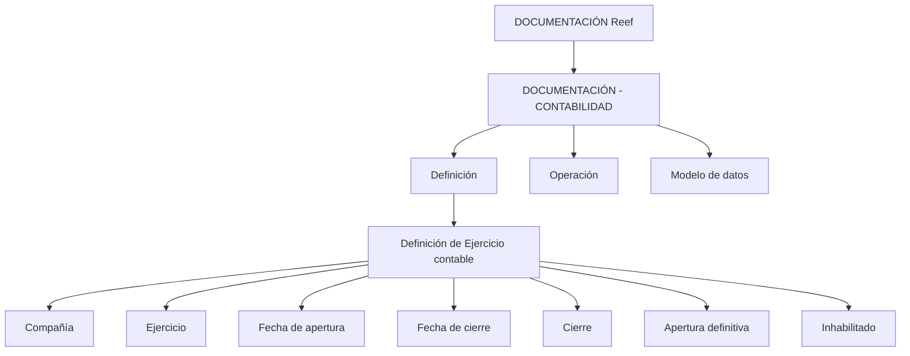

# Documentação Reef — Definição de Exercício Contábil e Escopo de Contabilidade

## 1. Metadados do Documento
- **Arquivo de Origem:** `Não identificado — conteúdo bruto fornecido na solicitação`
- **Tipo de Documento:** Manual Operacional / Documentação Funcional
- **Domínio / Sistema:** Reef — Contabilidade
- **Público-Alvo:** Operação, Analistas Funcionais, Desenvolvedores e Arquitetos
- **Data/Versão Identificada:** Não identificada

---

## 2. Resumo Executivo & Contexto de Negócio

O documento descreve a funcionalidade de **Definição de Exercício Contábil** no domínio de Contabilidade da documentação Reef. O objetivo principal é definir o período temporal em que as operações contábeis serão realizadas e estabelecer as condições que regulam a utilização desse período.

A definição de um exercício contábil está associada a uma companhia e possui uma chave identificadora denominada **Ejercicio**. Embora a prática usual seja utilizar os dígitos do ano natural como identificador, o documento permite qualquer codificação e apresenta cenários com um exercício anual, exercícios entre anos naturais e múltiplos exercícios dentro do mesmo ano natural.

O exercício contábil é delimitado pelas propriedades **Fecha de apertura** e **Fecha de cierre**, que determinam respectivamente as datas inicial e final do período. Além da delimitação temporal, o exercício possui estados funcionais relacionados a fechamento, abertura definitiva e habilitação para uso.

No escopo mais amplo da documentação de Contabilidade, as informações funcionais são organizadas nas categorias **Definición**, **Operación** e **Modelo de datos**. A categoria Definición apresenta os conceitos e a sequência necessária para configurar um módulo funcional; Operación trata das operações suportadas; e Modelo de datos é orientado às tabelas da aplicação, incluindo o movimento de tabelas, linhas e colunas de acordo com as operações funcionais.

O conteúdo de “Preguntas frecuentes” é marcado como **EN CONSTRUCCIÓN**, sem perguntas ou respostas adicionais. Também não há detalhamento técnico sobre APIs, contratos, tabelas específicas, URLs, ambientes, logs, métodos HTTP, tecnologias de implementação ou responsáveis técnicos.

---

## 3. Arquitetura, Componentes & Tecnologias Envolvidas

O conteúdo não descreve uma arquitetura de software, integração entre sistemas, microsserviços, bancos de dados, APIs ou tecnologias de implementação. Os elementos identificados são funcionais e documentais:

- **Reef:** sistema ou domínio referido na documentação.
- **Contabilidad:** área funcional abrangida pelo documento.
- **Ejercicio contable:** entidade funcional que representa o período no qual são realizadas operações contábeis.
- **Compañía:** entidade associada ao exercício contábil por meio de seu código.
- **Mapfredocument:** identificador exibido no cabeçalho do conteúdo.
- **DOCUMENTACIÓN Reef:** área documental exibida no cabeçalho.
- **Lifecycle:** campo exibido no cabeçalho; o valor identificado é `Approved`.
- **Owner:** campo exibido no cabeçalho; o valor identificado é `user:agonzalez_mapfre.com`.

O diagrama a seguir representa exclusivamente a organização funcional e documental explicitamente apresentada:



**Nota de Análise:** o diagrama representa relações conceituais de documentação e propriedades funcionais. O texto não fornece arquitetura de execução, persistência, interfaces, protocolos de integração ou contratos de dados.

---

## 4. Regras de Negócio, Especificações Funcionais & Processos

### 4.1 Objetivo da definição de exercício contábil

A definição de exercício contábil estabelece:

1. O período de tempo em que as operações contábeis serão realizadas.
2. As condições que determinam a forma de trabalho sobre esse período.

A formulação mais específica do objetivo também declara que o exercício contábil define o período temporal no qual serão realizadas as operações contábeis.

### 4.2 Processo indicado

O processo apresentado possui duas etapas:

1. **Definir exercício contábil.**
2. **Definir parâmetros do exercício.**

O documento não detalha a sequência operacional, telas, validações sistêmicas, responsáveis, aprovações ou persistência de dados dessas duas etapas.

### 4.3 Propriedade: Compañía

A propriedade **Compañía** contém o código da companhia para a qual o exercício contábil está sendo definido.

Regra funcional extraída:

- Todo exercício contábil definido no contexto descrito está associado ao código de uma companhia.

O documento não informa o formato, o tamanho, o catálogo de códigos aceitos ou regras de validação para o código de companhia.

### 4.4 Propriedade: Ejercicio

A propriedade **Ejercicio** é a chave pela qual o exercício contábil é identificado.

Regras e convenções informadas:

- Quando o exercício coincide com o ano natural, é comum utilizar como chave os dígitos do ano.
- A codificação da propriedade Ejercicio não é limitada aos dígitos do ano; qualquer outra codificação pode ser utilizada.
- Quando existe um único exercício e ele coincide com o ano, o exemplo informado é `2023`.
- Quando existe mais de um exercício no mesmo ano, os exemplos informados são:
  - `20231` para o primeiro exercício.
  - `20232` para o segundo exercício.

### 4.5 Propriedade: Fecha de apertura

A propriedade **Fecha de apertura** indica a data em que o exercício contábil é iniciado.

Exemplo informado:

- Para um exercício iniciado no primeiro dia do ano: `01/01/2023`.

O documento não determina um formato técnico obrigatório de data; os exemplos utilizam o padrão `dd/mm/aaaa`.

### 4.6 Propriedade: Fecha de cierre

A propriedade **Fecha de cierre** indica a data em que o exercício contábil termina.

Cenários e exemplos apresentados:

1. **Exercício coincidente com o ano natural**
   - Ejercicio: `2023`
   - Fecha de apertura: `01/01/2023`
   - Fecha de cierre: `31/12/2023`

2. **Exercício entre dois anos naturais**
   - Ejercicio: `2223`
   - Fecha de apertura: `01/07/2022`
   - Fecha de cierre: `30/06/2023`

3. **Mais de um exercício no mesmo ano natural**
   - Primeiro exercício:
     - Ejercicio: `20231`
     - Fecha de apertura: `01/01/2023`
     - Fecha de cierre: `30/06/2023`
   - Segundo exercício:
     - Ejercicio: `20232`
     - Fecha de apertura: `01/07/2023`
     - Fecha de cierre: `31/12/2023`

### 4.7 Propriedade: Cierre

A propriedade **Cierre** indica se o exercício contábil está fechado.

Regras funcionais explicitadas:

- Se o exercício contábil estiver fechado, não poderão ser realizadas mais operações nesse exercício.
- O processo de fechamento pode ser executado várias vezes.
- O exercício é considerado definitivamente fechado quando a propriedade Cierre indicar esse estado.

O documento não detalha quais operações são bloqueadas, como o processo é iniciado, quais validações são executadas, nem quais consequências existem em caso de tentativa de operação após o fechamento.

### 4.8 Propriedade: Apertura definitiva

A propriedade **Apertura definitiva** indica se o exercício está aberto definitivamente.

Regras funcionais explicitadas:

- O lançamento de abertura pode ser executado várias vezes.
- O lançamento de abertura torna-se definitivo quando a propriedade Apertura definitiva indicar esse estado.

O documento não define a estrutura do lançamento de abertura, critérios de reexecução, regras de substituição, contabilizações geradas ou permissões necessárias.

### 4.9 Propriedade: Inhabilitado

A propriedade **Inhabilitado** indica se o exercício está habilitado para utilização.

Regra funcional crítica:

- Um exercício inabilitado não pode ser utilizado.
- Um exercício inabilitado não pode ser utilizado sequer para consulta.
- Um exercício inabilitado é tratado como se não existisse.

### 4.10 Vínculos funcionais

O documento apresenta um vínculo para:

- **DEFINICION de compañía**

O conteúdo desse vínculo não foi fornecido. Portanto, não há base documental para detalhar a definição de companhia, seu modelo de dados, suas regras de cadastro ou a relação técnica entre companhia e exercício contábil.

---

## 5. Tabelas de Parâmetros, Ambientes e Estruturas de Dados

| Item / Parâmetro | Descrição / Função | Tipo / Valores / Formato | Ambiente / Observações |
| :--- | :--- | :--- | :--- |
| Compañía | Contém o código da companhia para a qual o exercício contábil está sendo definido. | Código de companhia; formato não informado. | Associado à definição do exercício contábil. |
| Ejercicio | Chave de identificação do exercício contábil. | Codificação livre; exemplos: `2023`, `20231`, `20232`, `2223`. | Quando coincide com o ano natural, normalmente utiliza os dígitos do ano. |
| Fecha de apertura | Indica a data de início do exercício contábil. | Exemplos no formato `dd/mm/aaaa`, como `01/01/2023` e `01/07/2022`. | O formato obrigatório não é especificado. |
| Fecha de cierre | Indica a data de término do exercício contábil. | Exemplos no formato `dd/mm/aaaa`, como `31/12/2023` e `30/06/2023`. | O formato obrigatório não é especificado. |
| Cierre | Indica se o exercício contábil está fechado. | Estado lógico; valores literais não informados. | Quando fechado, não são permitidas mais operações. O fechamento pode ser executado várias vezes. |
| Apertura definitiva | Indica se o exercício está aberto definitivamente. | Estado lógico; valores literais não informados. | O lançamento de abertura pode ser executado várias vezes até tornar-se definitivo. |
| Inhabilitado | Indica se o exercício está habilitado para utilização. | Estado lógico; valores literais não informados. | Quando inabilitado, não pode ser utilizado nem consultado; é como se não existisse. |
| Processo: Definir exercício contábil | Primeira etapa do processo apresentado. | Etapa funcional. | Sem detalhamento operacional adicional. |
| Processo: Definir parâmetros do exercício | Segunda etapa do processo apresentado. | Etapa funcional. | Sem detalhamento operacional adicional. |
| Categoria documental: Definición | Documentos que detalham conceitos a definir e a ordem necessária para obter a definição para operar um módulo funcional. | Categoria documental. | Parte da DOCUMENTACIÓN - CONTABILIDAD. |
| Categoria documental: Operación | Documentos relacionados às operações funcionais suportadas pelo módulo. | Categoria documental. | Parte da DOCUMENTACIÓN - CONTABILIDAD. |
| Categoria documental: Modelo de datos | Documentação orientada às tabelas da aplicação e ao movimento de tabelas, linhas e colunas conforme operações funcionais. | Categoria documental. | Parte da DOCUMENTACIÓN - CONTABILIDAD. |
| Owner | Proprietário exibido no cabeçalho documental. | `user:agonzalez_mapfre.com` | Valor literal extraído do conteúdo. |
| Lifecycle | Estado de ciclo de vida exibido no cabeçalho documental. | `Approved` | Valor literal extraído do conteúdo. |
| Preguntas frecuentes | Área de perguntas frequentes. | Sem conteúdo funcional. | Marcada como `EN CONSTRUCCIÓN`. |

---

## 6. Bateria de Perguntas & Respostas para RAG (FAQ Sintético)

### P1: Qual é o objetivo da definição de exercício contábil na documentação Reef?
**R:** A definição de exercício contábil tem como objetivo determinar o período de tempo em que serão realizadas as operações contábeis e as condições que determinarão a forma de trabalhar sobre esse período. O documento também declara que o exercício define o período temporal no qual as operações contábeis serão realizadas.

### P2: Quais são as etapas do processo para configurar um exercício contábil?
**R:** O processo apresentado possui duas etapas: primeiro, definir o exercício contábil; segundo, definir os parâmetros do exercício. O documento não fornece instruções detalhadas de execução, telas, campos obrigatórios ou responsáveis para essas etapas.

### P3: Para que serve o atributo Compañía na definição de exercício contábil?
**R:** O atributo Compañía contém o código da companhia para a qual o exercício contábil está sendo definido. O conteúdo não informa formato, tamanho, lista de valores aceitos ou validações para esse código.

### P4: O atributo Ejercicio precisa obrigatoriamente ser igual ao ano natural?
**R:** Não. O documento informa que, normalmente, quando o exercício coincide com o ano natural, utilizam-se os dígitos do ano como chave, como `2023`. Entretanto, também afirma que qualquer outra codificação pode ser utilizada.

### P5: Como identificar dois exercícios contábeis no mesmo ano natural?
**R:** O documento exemplifica a utilização de `20231` para o primeiro exercício e `20232` para o segundo exercício. No cenário apresentado para 2023, o primeiro exercício vai de `01/01/2023` a `30/06/2023`, e o segundo vai de `01/07/2023` a `31/12/2023`.

### P6: Como deve ser definido um exercício contábil que atravessa dois anos naturais?
**R:** O documento apresenta o exemplo de um exercício identificado por `2223`, iniciado em `01/07/2022` e encerrado em `30/06/2023`. Esse exemplo demonstra que as datas de abertura e fechamento podem estar em anos naturais diferentes.

### P7: O que acontece quando o atributo Cierre indica que o exercício está fechado?
**R:** Quando o exercício contábil está fechado, não podem ser realizadas mais operações nesse exercício. O processo de fechamento pode ser executado várias vezes, mas o exercício é considerado definitivamente fechado quando o atributo Cierre assim o indicar.

### P8: O lançamento de abertura pode ser realizado mais de uma vez?
**R:** Sim. O documento informa que o asiento de apertura, ou lançamento de abertura, pode ser executado várias vezes. A abertura passa a ser definitiva quando o atributo Apertura definitiva indicar esse estado.

### P9: Um exercício marcado como Inhabilitado pode ser consultado?
**R:** Não. Um exercício inabilitado não pode ser utilizado nem mesmo para consulta. O documento estabelece que um exercício inabilitado é tratado como se não existisse.

### P10: Quais assuntos são cobertos pela DOCUMENTACIÓN - CONTABILIDAD?
**R:** A documentação de Contabilidade é dividida em Definición, Operación e Modelo de datos. Definición trata dos conceitos e da ordem necessária para configurar um módulo funcional; Operación abrange operações funcionais suportadas pelo módulo; e Modelo de datos descreve tabelas da aplicação e o movimento de tabelas, linhas e colunas conforme operações funcionais.

### P11: O documento especifica APIs, métodos HTTP ou contratos JSON para o exercício contábil?
**R:** Não. O conteúdo fornecido descreve propriedades funcionais do exercício contábil e a organização da documentação de Contabilidade, mas não apresenta APIs, métodos HTTP, contratos JSON, URLs, tecnologias, tabelas específicas ou detalhes de integração.

### P12: Existe conteúdo de perguntas frequentes disponível para a definição de exercício contábil?
**R:** Não. A seção “Preguntas frecuentes” aparece no conteúdo, mas está marcada como `EN CONSTRUCCIÓN`; não há perguntas nem respostas documentadas.

---

## 7. Glossário de Termos, Siglas & Conceitos-Chave

- **Apertura definitiva:** atributo que indica se o exercício está aberto definitivamente.
- **Asiento de apertura:** lançamento de abertura que, segundo o documento, pode ser executado várias vezes até que a abertura seja indicada como definitiva.
- **Cierre:** atributo que indica se o exercício contábil está fechado.
- **Compañía:** atributo que contém o código da companhia para a qual um exercício contábil está sendo definido.
- **Contabilidad:** domínio funcional relacionado à funcionalidade contábil do sistema.
- **DOCUMENTACIÓN Reef:** identificação da área documental exibida no conteúdo.
- **Ejercicio:** chave utilizada para identificar o exercício contábil.
- **Ejercicio contable:** período de tempo no qual são realizadas operações contábeis, sujeito a condições de abertura, fechamento e habilitação.
- **EN CONSTRUCCIÓN:** indicação de que uma seção documental, neste caso Preguntas frecuentes, ainda não possui conteúdo concluído.
- **Fecha de apertura:** data em que o exercício contábil é iniciado.
- **Fecha de cierre:** data em que o exercício contábil é finalizado.
- **Inhabilitado:** atributo que indica que o exercício não está habilitado para trabalhar; nesse estado, não pode ser usado nem consultado.
- **Lifecycle:** campo de ciclo de vida exibido no cabeçalho documental, com valor `Approved`.
- **Mapfredocument:** identificador exibido no cabeçalho do conteúdo fornecido.
- **Modelo de datos:** categoria documental orientada às tabelas da aplicação e aos movimentos de tabelas, linhas e colunas conforme operações funcionais.
- **Operación:** categoria documental relacionada às operações funcionais suportadas por um módulo.
- **Owner:** campo de proprietário exibido no cabeçalho documental, com valor `user:agonzalez_mapfre.com`.
- **Reef:** sistema ou domínio referido pela documentação fornecida.

---

## 8. Notas Críticas, Riscos & Limitações

- O documento não apresenta métodos HTTP, APIs, contratos JSON, mensagens, eventos, integrações, bancos de dados, tabelas físicas, rotas de log, servidores, URLs, ambientes, versões de software ou tecnologias de implementação.
- O conteúdo não especifica os valores técnicos possíveis para os atributos Cierre, Apertura definitiva e Inhabilitado; apenas descreve seus efeitos funcionais.
- O documento não apresenta validações entre Fecha de apertura e Fecha de cierre, nem regras explícitas de sobreposição, continuidade ou lacunas entre exercícios contábeis.
- O documento não descreve permissões, perfis de acesso, trilha de auditoria, responsáveis, aprovações ou segregação de funções para definir, abrir, fechar ou inabilitar exercícios.
- O processo “Definir exercício contábil” e “Definir parâmetros do exercício” é apresentado somente como uma sequência de alto nível, sem instruções detalhadas.
- A seção “Preguntas frecuentes” está marcada como `EN CONSTRUCCIÓN`, portanto não acrescenta conteúdo operacional.
- O vínculo “DEFINICION de compañía” é mencionado, mas seu conteúdo não foi disponibilizado.
- **Nota de Análise:** o documento descreve o exercício contábil em nível funcional. Não há evidência suficiente para inferir esquema de banco de dados, interface de usuário, automatizações, integrações ou comportamento transacional.

---

## 9. Conteúdo Bruto Estruturado (Referência Fiel)

```text
| Buscar |
| --- |


Inicio	Soluciones	Arquitecturas	APIs	Componentes	Cloud	Documentación	Zeus	Reef	Ayuda

Mapfredocument	Lifecycle

DOCUMENTACIÓN Reef	DOCUMENTACIÓN Reef	user:agonzalez_mapfre.com	Approved	Source

EN CONSTRUCCIÓN


# DEFINICIÓN de ejercicio contable

Objetivo

De nir el periodo de tiempo en el que se realizarán las operaciones contables y las condiciones que determinarán la forma de trabajar sobre este período.

Proceso a seguir

1. DEFINIR ejercicio contable

1. DEFINIR parámetros del ejercicio

Mapfredocument	Owner	Lifecycle

DOCUMENTACIÓN Reef	DOCUMENTACIÓN Reef	user:agonzalez_mapfre.com	Approved	Source


# DEFINICIÓN de Ejercicio contable

Objetivo

El objetivo es de nir el periodo de tiempo en el que se realizarán las operaciones contables.


## Propiedades

Compañía

Este atributo contiene el código de la compañía para la que se está de niendo el ejercicio contable.


### Ejercicio

Este atributo será la clave con la que se identi ca el ejercicio contable.

Normalmente, si el ejercicio coincide con el año natural, se suelen utilizar como clave los dígitos del año, pero puede utilizarse cualquier otra codi cación.

Ejemplo

Si hay un único ejercicio y coincide con el año

Ejercicio: 2023

Si hay más de un ejercicio en el mismo año

Ejercicio: 20231 (para el primer ejercicio)

Ejercicio: 20232 (para el segundo ejercicio)


### Fecha de apertura

Este atributo indica la fecha en la que inicia el ejercicio contable.

Ejemplo

Si el ejercicio se inicia el primer día del año

Fecha de apertura: 01/01/2023


### Fecha de cierre

Este atributo indica la fecha en la que naliza el ejercicio contable.

Ejemplo

Si el ejercicio coincide con el año natural Ejercicio: 2023

Fecha de apertura: 01/01/2023

Fecha de cierre: 31/12/2023

Si el ejercicio está entre dos años naturales

Ejercicio: 2223

Fecha de apertura: 01/07/2022

Fecha de cierre: 30/06/2023

Si hay más de un ejercicio en el mismo año natural

Primer ejercicio

Ejercicio: 20231

Fecha de apertura: 01/01/2023

Fecha de cierre: 30/06/2023

Segundo ejercicio

Ejercicio: 20232

Fecha de apertura: 01/07/2023

Fecha de cierre: 31/12/2023


### Cierre

Este atributo indica si el ejercicio contable está cerrado, es decir, no pueden realizarse más operaciones en este ejercicio.

El proceso de cierre puede ejecutarse varias veces, considerando que el ejercicio está cerrado de nitivamente cuando este atributo así lo indica.


### Apertura de nitiva

Este atributo indica si el ejercicio está abierto de nitivamente.

El asiento de apertura se puede ejecutar varias veces hasta que en este atributo se indique que la apertura es de nitiva.


### Inhabilitado

Este atributo indica si el ejercicio está habilitado o no, para poder trabajar.

Un ejercicio inhabilitado no se puede utilizar, ni siquiera en consulta, es como si no existiera.

Vínculos

DEFINICION de compañía


## Preguntas frecuentes

Mapfredocument	Owner	Lifecycle

DOCUMENTACIÓN Reef	DOCUMENTACIÓN Reef	user:agonzalez_mapfre.com	Approved	Source

EN CONSTRUCCIÓN


# DEFINICIÓN DE CONTABILIDAD

Mapfredocument	Owner	Lifecycle

DOCUMENTACIÓN Reef	DOCUMENTACIÓN Reef	user:agonzalez_mapfre.com	Approved	Source


# DOCUMENTACIÓN - CONTABILIDAD

En este apartado se aborda todo aquello relacionado con la funcionalidad del sistema. La información se encuentra dividida en los

apartados siguientes:

De nición

Operación Modelo de datos

DEFINICIÓN

Documentos que detallan aquellos conceptos que se han de de nir y el orden que se ha de seguir para conseguir la de nición necesaria con lo que poder operar un módulo funcional.

OPERACIÓN

Documentos relacionados con las operaciones funcionales que el módulo soporta.


## MODELO DE DATOS

Documentación orientada hacia las tablas de la aplicación. Adicionalmente, se describe con detalle el movimiento de distintos elementos como tablas, las y columnas atendiendo a las operaciones funcionales.
```
