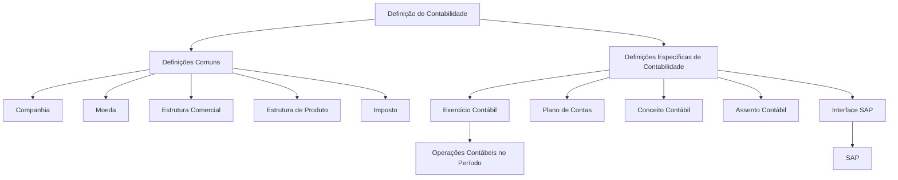
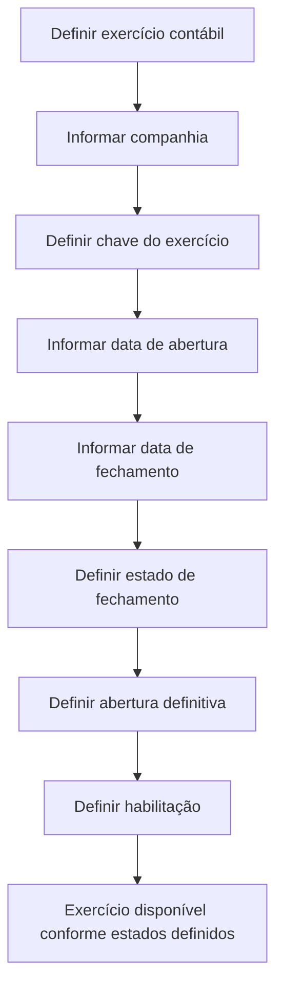

# Definição de Exercício Contábil e Estrutura de Contabilidade no Reef.core

## 1. Metadados do Documento
- **Arquivo de Origem:** Não identificado no conteúdo fornecido
- **Tipo de Documento:** Documentação funcional / procedimento de definição contábil
- **Domínio / Sistema:** Reef.core — Contabilidade; documentação Reef / Mapfredocument
- **Público-Alvo:** Analistas funcionais, equipes de contabilidade, operação e desenvolvedores
- **Data/Versão Identificada:** Não identificada
- **Owner identificado:** `user:agonzalez_mapfre.com`
- **Lifecycle identificado:** Approved Source

---

## 2. Resumo Executivo & Contexto de Negócio

O documento descreve a definição do **exercício contábil** no módulo de Contabilidade do sistema Reef.core. Um exercício contábil determina o período em que operações contábeis podem ser realizadas e define condições operacionais relacionadas à abertura, ao fechamento e à habilitação desse período.

A identificação do exercício contábil é associada a uma companhia e utiliza uma chave denominada **Exercício**. Embora o documento apresente o uso dos dígitos do ano como prática comum quando o período coincide com o ano natural, a codificação do exercício não é restrita a esse padrão. O mesmo ano natural pode conter mais de um exercício contábil.

A gestão do ciclo de vida de um exercício contábil inclui datas de abertura e fechamento, estado de fechamento definitivo, abertura definitiva e condição de habilitação. Um exercício fechado não permite novas operações; um exercício inabilitado não pode ser utilizado nem mesmo para consultas, sendo tratado como inexistente para fins de uso do sistema.

O documento também situa o exercício contábil dentro da sequência de definições necessárias para operar o módulo de Contabilidade. Antes ou em paralelo às definições específicas do módulo, devem ser considerados elementos comuns como companhia, moeda, estrutura comercial, estrutura de produto e imposto. No nível contábil, são citados exercício contábil, plano de contas, conceito contábil, assento contábil e interface SAP.

A documentação de Contabilidade é estruturada em três categorias: **Definição**, **Operação** e **Modelo de Dados**. O conteúdo apresentado concentra-se na definição funcional do exercício contábil e na posição desse elemento dentro da configuração do módulo.

---

## 3. Arquitetura, Componentes & Tecnologias Envolvidas

### Sistemas, módulos e componentes citados

| Componente / Sistema | Papel identificado no documento |
| :--- | :--- |
| **Reef.core** | Sistema que realiza operações das companhias com as divisas definidas e contém o módulo de Contabilidade. |
| **Módulo de Contabilidade** | Módulo funcional no qual são definidos exercício contábil, plano de contas, conceito contábil, assento contábil e interface SAP. |
| **Companhia** | Entidade ou entidades para as quais são criadas pólizas e os demais elementos contábeis. Também é atributo do exercício contábil. |
| **Exercício contábil** | Período no qual operações contábeis são realizadas. |
| **Plano de contas** | Definição das contas utilizadas pela companhia no exercício contábil e dos parâmetros correspondentes a cada conta. |
| **Conceito contábil** | Identificador que agrupa apontamentos contábeis para consulta posterior. |
| **Assento contábil** | Definição dos tipos e características dos assentos contábeis com os quais a companhia trabalha. |
| **Interface SAP** | Definição das informações levadas ao SAP e da relação de dados entre os dois sistemas. |
| **SAP** | Sistema externo citado como destino de informações definidas na interface SAP. |
| **Moeda** | Definição das divisas com as quais Reef.core realizará operações da companhia. |
| **Estrutura comercial** | Definição da organização territorial da companhia. |
| **Estrutura de produto** | Definição da organização dos ramos comercializados. |
| **Imposto** | Definição das obrigações tributárias, características e formas de cálculo. |

### Organização funcional da definição de Contabilidade



### Fluxo de definição do exercício contábil



> **Nota de Análise:** O documento não detalha telas, APIs, métodos HTTP, contratos JSON, persistência física, mecanismos de integração nem tecnologias de implementação do Reef.core ou da interface SAP.

---

## 4. Regras de Negócio, Especificações Funcionais & Processos

### 4.1 Objetivo do exercício contábil

O exercício contábil define o período de tempo durante o qual operações contábeis são realizadas. A definição também estabelece condições que determinam como o trabalho deve ocorrer sobre esse período.

### 4.2 Processo apresentado

O processo resumido no documento possui duas etapas:

1. **Definir exercício contábil**
2. **Definir parâmetros do exercício**

### 4.3 Propriedades do exercício contábil

#### Companhia

- O atributo **Companhia** contém o código da companhia para a qual o exercício contábil está sendo definido.
- A definição de companhia pertence ao nível comum de configuração e representa a entidade ou entidades com as quais serão criadas as pólizas e os demais elementos.

#### Exercício

- O atributo **Exercício** é a chave que identifica o exercício contábil.
- Quando o exercício coincide com o ano natural, é usual utilizar os dígitos do ano como chave.
- O documento permite qualquer outra codificação para a chave do exercício.
- Quando há mais de um exercício dentro do mesmo ano natural, os exemplos utilizam sufixos numéricos para diferenciá-los.

#### Data de abertura

- O atributo **Data de abertura** indica a data em que o exercício contábil é iniciado.
- Para um exercício iniciado no primeiro dia do ano, o exemplo apresentado é `01/01/2023`.

#### Data de fechamento

- O atributo **Data de fechamento** indica a data em que o exercício contábil termina.
- O documento apresenta cenários para exercícios coincidentes com o ano natural, períodos que abrangem dois anos naturais e múltiplos exercícios no mesmo ano natural.

#### Fechamento

- O atributo **Fechamento** indica se o exercício contábil está fechado.
- Quando o exercício está fechado, não podem ser realizadas mais operações nesse exercício.
- O processo de fechamento pode ser executado várias vezes.
- O exercício é considerado definitivamente fechado quando o atributo de fechamento assim o indicar.

#### Abertura definitiva

- O atributo **Abertura definitiva** indica se o exercício está aberto de forma definitiva.
- O assento de abertura pode ser executado várias vezes.
- A abertura passa a ser definitiva quando o atributo correspondente for indicado como definitivo.

#### Inabilitado

- O atributo **Inabilitado** indica se o exercício contábil está habilitado para uso.
- Um exercício inabilitado não pode ser utilizado.
- Um exercício inabilitado não pode ser consultado.
- O documento determina que um exercício inabilitado deve ser tratado como se não existisse.

### 4.4 Cenários exemplificados para períodos contábeis

#### Exercício coincidente com o ano natural

- **Exercício:** `2023`
- **Data de abertura:** `01/01/2023`
- **Data de fechamento:** `31/12/2023`

#### Exercício entre dois anos naturais

- **Exercício:** `2223`
- **Data de abertura:** `01/07/2022`
- **Data de fechamento:** `30/06/2023`

#### Dois exercícios no mesmo ano natural

**Primeiro exercício**

- **Exercício:** `20231`
- **Data de abertura:** `01/01/2023`
- **Data de fechamento:** `30/06/2023`

**Segundo exercício**

- **Exercício:** `20232`
- **Data de abertura:** `01/07/2023`
- **Data de fechamento:** `31/12/2023`

### 4.5 Elementos da definição contábil

#### Definições comuns

- **Companhia:** definição das entidades para criação de pólizas e dos demais elementos.
- **Moeda:** definição das divisas utilizadas pelo Reef.core nas operações da companhia.
- **Estrutura comercial:** definição da organização territorial da companhia.
- **Estrutura de produto:** definição da organização dos ramos comercializados.
- **Imposto:** definição dos tipos de obrigações tributárias, suas características e formas de cálculo.

#### Definições específicas de Contabilidade

- **Exercício contábil:** período em que operações contábeis são realizadas.
- **Plano de contas:** contas utilizadas pela companhia no exercício contábil e parâmetros correspondentes a cada conta.
- **Conceito contábil:** identificador que agrupa apontamentos contábeis para consulta posterior.
- **Assento contábil:** tipos e características dos assentos com os quais a companhia trabalha.
- **Interface SAP:** informações enviadas ao SAP e relação entre os dados de ambos os sistemas.

### 4.6 Continuidade após o fechamento

Após cada fechamento de exercício, deve ser definido o novo exercício contábil.

### 4.7 Categorias de documentação de Contabilidade

| Categoria | Finalidade descrita |
| :--- | :--- |
| **Definição** | Documentos que detalham os conceitos que devem ser definidos e a ordem a seguir para obter a definição necessária para operar um módulo funcional. |
| **Operação** | Documentos relacionados às operações funcionais suportadas pelo módulo. |
| **Modelo de Dados** | Documentação orientada às tabelas da aplicação, incluindo descrição detalhada da movimentação de tabelas, linhas e colunas conforme as operações funcionais. |

---

## 5. Tabelas de Parâmetros, Ambientes e Estruturas de Dados

### 5.1 Parâmetros do exercício contábil

| Item / Parâmetro | Descrição / Função | Tipo / Valores / Formato | Ambiente / Observações |
| :--- | :--- | :--- | :--- |
| Companhia | Código da companhia para a qual o exercício contábil é definido. | Código de companhia; formato não detalhado. | Relacionado à definição de companhia. |
| Exercício | Chave que identifica o exercício contábil. | Codificação livre; exemplos: `2023`, `2223`, `20231`, `20232`. | Os dígitos do ano são usuais quando o período coincide com o ano natural. |
| Data de abertura | Indica a data de início do exercício contábil. | Data; exemplos: `01/01/2023`, `01/07/2022`, `01/07/2023`. | Define o início do período operacional contábil. |
| Data de fechamento | Indica a data de término do exercício contábil. | Data; exemplos: `31/12/2023`, `30/06/2023`. | Define o fim do período operacional contábil. |
| Fechamento | Indica se o exercício está fechado. | Estado lógico; valores exatos não detalhados. | Exercício fechado não permite novas operações. O processo pode ser executado várias vezes até o fechamento definitivo. |
| Abertura definitiva | Indica se o exercício está aberto definitivamente. | Estado lógico; valores exatos não detalhados. | O assento de abertura pode ser executado várias vezes até a abertura definitiva. |
| Inabilitado | Indica se o exercício está habilitado para uso. | Estado lógico; valores exatos não detalhados. | Exercício inabilitado não pode ser usado nem consultado. |

### 5.2 Exemplos de codificação e períodos de exercício

| Cenário | Código do Exercício | Data de abertura | Data de fechamento | Observações |
| :--- | :--- | :--- | :--- | :--- |
| Exercício único coincidente com ano natural | `2023` | `01/01/2023` | `31/12/2023` | Exemplo de exercício correspondente ao ano natural. |
| Exercício entre dois anos naturais | `2223` | `01/07/2022` | `30/06/2023` | O período inicia em 2022 e termina em 2023. |
| Primeiro exercício no mesmo ano natural | `20231` | `01/01/2023` | `30/06/2023` | Primeiro de dois exercícios em 2023. |
| Segundo exercício no mesmo ano natural | `20232` | `01/07/2023` | `31/12/2023` | Segundo de dois exercícios em 2023. |

### 5.3 Elementos de configuração citados

| Item / Parâmetro | Descrição / Função | Tipo / Valores / Formato | Ambiente / Observações |
| :--- | :--- | :--- | :--- |
| Companhia | Entidade ou entidades com as quais se criarão pólizas e os demais elementos. | Definição comum. | Necessária para a definição de Contabilidade. |
| Moeda | Divisas com as quais Reef.core realiza operações da companhia. | Definição comum. | Códigos de moeda não detalhados. |
| Estrutura comercial | Organização territorial da companhia. | Definição comum. | Regras de organização não detalhadas. |
| Estrutura de produto | Organização dos ramos comercializados. | Definição comum. | Ramos não detalhados. |
| Imposto | Obrigações tributárias, características e formas de cálculo. | Definição comum. | Tipos de imposto e fórmulas não detalhados. |
| Plano de contas | Contas usadas pela companhia no exercício e parâmetros correspondentes a cada conta. | Definição de Contabilidade. | Estrutura das contas não detalhada. |
| Conceito contábil | Identificador que agrupa apontamentos contábeis para consulta. | Definição de Contabilidade. | Formato do identificador não detalhado. |
| Assento contábil | Tipos e características dos assentos utilizados pela companhia. | Definição de Contabilidade. | Tipos e características específicos não detalhados. |
| Interface SAP | Informações levadas ao SAP e relação de dados entre sistemas. | Definição de Contabilidade. | Mapeamentos, formatos e protocolos não detalhados. |

---

## 6. Bateria de Perguntas & Respostas para RAG (FAQ Sintético)

### P1: Qual é o objetivo da definição de exercício contábil no Reef.core?
**R:** A definição de exercício contábil estabelece o período de tempo durante o qual as operações contábeis serão realizadas. Também define condições que determinam como se trabalha sobre esse período, incluindo abertura, fechamento e habilitação do exercício.

### P2: Qual atributo identifica a companhia associada a um exercício contábil?
**R:** O atributo **Companhia** contém o código da companhia para a qual o exercício contábil está sendo definido.

### P3: O código do exercício precisa ser obrigatoriamente o ano natural?
**R:** Não. Quando o exercício coincide com o ano natural, é usual utilizar os dígitos do ano como chave, como `2023`. Contudo, o documento informa que qualquer outra codificação pode ser utilizada.

### P4: Como identificar dois exercícios contábeis no mesmo ano natural?
**R:** O documento apresenta como exemplo os códigos `20231` para o primeiro exercício, entre `01/01/2023` e `30/06/2023`, e `20232` para o segundo exercício, entre `01/07/2023` e `31/12/2023`.

### P5: O que acontece quando um exercício contábil está fechado?
**R:** Quando o atributo de fechamento indica que o exercício está fechado, não podem ser realizadas mais operações nesse exercício. O processo de fechamento pode ser executado várias vezes, e o exercício é considerado definitivamente fechado quando o atributo indicar essa condição.

### P6: É possível executar mais de uma vez o assento de abertura do exercício?
**R:** Sim. O documento informa que o assento de abertura pode ser executado várias vezes até que o atributo de **Abertura definitiva** indique que a abertura do exercício é definitiva.

### P7: Um exercício inabilitado pode ser consultado?
**R:** Não. Um exercício inabilitado não pode ser utilizado, nem mesmo em consulta. O documento determina que ele deve ser tratado como se não existisse.

### P8: O que deve ser feito após o fechamento de um exercício contábil?
**R:** Após cada fechamento de exercício, deve ser definido o novo exercício contábil.

### P9: Quais definições comuns são necessárias no contexto da definição de Contabilidade?
**R:** O documento cita Companhia, Moeda, Estrutura Comercial, Estrutura de Produto e Imposto como definições comuns necessárias para realizar a definição do módulo de Contabilidade.

### P10: O que é definido no plano de contas?
**R:** O plano de contas define as contas utilizadas pela companhia dentro do exercício contábil e os parâmetros correspondentes a cada conta.

### P11: Qual é a finalidade do conceito contábil?
**R:** O conceito contábil define o identificador que agrupa apontamentos contábeis para consulta posterior.

### P12: O que a interface SAP define no módulo de Contabilidade?
**R:** A interface SAP define as informações que serão levadas ao SAP e a relação entre os dados do SAP e do outro sistema mencionado no documento.

### P13: Como a documentação de Contabilidade está organizada?
**R:** A documentação é dividida em **Definição**, **Operação** e **Modelo de Dados**. Definição aborda conceitos e ordem necessária para operar o módulo; Operação trata das operações funcionais suportadas; e Modelo de Dados é orientado às tabelas da aplicação e à movimentação de tabelas, linhas e colunas.

---

## 7. Glossário de Termos, Siglas & Conceitos-Chave

- **Reef.core:** Sistema citado como responsável por realizar operações da companhia com as divisas definidas.
- **Exercício contábil:** Período de tempo no qual operações contábeis são realizadas.
- **Companhia:** Entidade para a qual são criadas pólizas e demais elementos; também é identificada no exercício por meio de um código.
- **Ano natural:** Período anual utilizado nos exemplos como referência para exercícios iniciados em 1º de janeiro e encerrados em 31 de dezembro.
- **Fechamento:** Estado que indica que não podem ser realizadas novas operações no exercício contábil.
- **Abertura definitiva:** Estado que indica que a abertura do exercício passou a ser definitiva.
- **Inabilitado:** Estado de um exercício que impede sua utilização e consulta.
- **Plano de contas:** Conjunto de contas utilizadas pela companhia no exercício contábil, com parâmetros correspondentes por conta.
- **Conceito contábil:** Identificador usado para agrupar apontamentos contábeis para consulta posterior.
- **Assento contábil:** Tipo ou registro contábil cujas características são definidas para uso da companhia.
- **Pólizas:** Elementos cuja criação é associada às entidades definidas como companhia no documento.
- **Estrutura comercial:** Organização territorial da companhia.
- **Estrutura de produto:** Organização dos ramos comercializados.
- **Imposto:** Obrigações tributárias, características e formas de cálculo.
- **SAP:** Sistema para o qual são definidas informações e relações de dados por meio da interface SAP.
- **Interface SAP:** Definição da informação enviada ao SAP e da relação de dados entre sistemas.
- **Modelo de Dados:** Categoria documental orientada às tabelas da aplicação e ao movimento de tabelas, linhas e colunas.

---

## 8. Notas Críticas, Riscos & Limitações

- O conteúdo apresenta a definição funcional do exercício contábil, mas não especifica interfaces técnicas, APIs, métodos HTTP, contratos de dados, modelos JSON, tabelas físicas ou estruturas de banco de dados.
- O documento não informa valores concretos aceitos pelos atributos de fechamento, abertura definitiva e inabilitado; apenas descreve seus efeitos funcionais.
- O formato do código de companhia não é detalhado.
- A codificação do exercício é flexível, mas o documento não define regras de unicidade, validação, tamanho máximo ou padrão obrigatório.
- Não são especificados mecanismos de prevenção contra sobreposição de datas entre exercícios contábeis.
- A interface SAP é citada, mas não há detalhamento sobre protocolos, campos, frequência de integração, tratamento de falhas ou mapeamentos de dados.
- O documento afirma que, após cada fechamento, deve ser definido um novo exercício, mas não descreve a sequência operacional completa, responsáveis, aprovações ou controles necessários para essa atividade.
- **Nota de Análise:** O documento está marcado parcialmente como “EN CONSTRUCCIÓN”, o que pode indicar conteúdo ainda em elaboração.
- **Nota de Análise:** O documento cita o módulo Reef.core, mas não detalha sua arquitetura técnica, versões, ambientes, URLs, servidores ou dependências de implantação.

---

## 9. Conteúdo Bruto Estruturado (Referência Fiel)

```text
--- [PÁGINA 1 DE 6] ---

EN CONSTRUCCIÓN
DEFINICIÓN de ejercicio contable
Objetivo
Denir el periodo de tiempo en el que se realizarán las operaciones contables y las condiciones que determinarán la forma de trabajar sobre
este período.
Proceso a seguir
DEFINIR ejercicio
contable
(1)
DEFINIR parámetros
del ejercicio
(2)
1. DEFINIR ejercicio contable
1. DEFINIR parámetros del ejercicio
Documentation / DOCUMENTACIÓN Reef
DOCUMENTACIÓN Reef
Mapfredocument
DOCUMENTACIÓN Reef
Owner
user:agonzalez_mapfre.com
Lifecycle
Approved Source
 /
VL
Buscar Inicio Soluciones Arquitecturas APIs Componentes Cloud Documentación Zeus Reef Ayuda
ES


--- [PÁGINA 2 DE 6] ---

DEFINICIÓN de Ejercicio contable
Objetivo
El objetivo es denir el periodo de tiempo en el que se realizarán las operaciones contables.
Propiedades
Compañía
Este atributo contiene el código de la compañía para la que se está deniendo el ejercicio contable.
Ejercicio
Este atributo será la clave con la que se identica el ejercicio contable.
Normalmente, si el ejercicio coincide con el año natural, se suelen utilizar como clave los dígitos del año, pero puede utilizarse cualquier otra
codicación.
Ejemplo
Si hay un único ejercicio y coincide con el año
Ejercicio: 2023
Si hay más de un ejercicio en el mismo año
Ejercicio: 20231 (para el primer ejercicio)
Ejercicio: 20232 (para el segundo ejercicio)
Fecha de apertura
Este atributo indica la fecha en la que inicia el ejercicio contable.
Ejemplo
Si el ejercicio se inicia el primer día del año
Fecha de apertura: 01/01/2023
Fecha de cierre
Este atributo indica la fecha en la que naliza el ejercicio contable.
Ejemplo
Si el ejercicio coincide con el año natural
Ejercicio: 2023
Documentation / DOCUMENTACIÓN Reef
DOCUMENTACIÓN Reef
Mapfredocument
DOCUMENTACIÓN Reef
Owner
user:agonzalez_mapfre.com
Lifecycle
Approved Source
/
VL
Buscar Inicio Soluciones Arquitecturas APIs Componentes Cloud Documentación Zeus Reef Ayuda
ES


--- [PÁGINA 3 DE 6] ---

Fecha de apertura: 01/01/2023
Fecha de cierre: 31/12/2023
Si el ejercicio está entre dos años naturales
Ejercicio: 2223
Fecha de apertura: 01/07/2022
Fecha de cierre: 30/06/2023
Si hay más de un ejercicio en el mismo año natural
a. Primer ejercicio
Ejercicio: 20231
Fecha de apertura: 01/01/2023
Fecha de cierre: 30/06/2023
b. Segundo ejercicio
Ejercicio: 20232
Fecha de apertura: 01/07/2023
Fecha de cierre: 31/12/2023
Cierre
Este atributo indica si el ejercicio contable está cerrado, es decir, no pueden realizarse más operaciones en este ejercicio.
El proceso de cierre puede ejecutarse varias veces, considerando que el ejercicio está cerrado denitivamente cuando este atributo así lo
indica.
Apertura denitiva
Este atributo indica si el ejercicio está abierto denitivamente.
El asiento de apertura se puede ejecutar varias veces hasta que en este atributo se indique que la apertura es denitiva.
Inhabilitado
Este atributo indica si el ejercicio está habilitado o no, para poder trabajar.
Un ejercicio inhabilitado no se puede utilizar, ni siquiera en consulta, es como si no existiera.
Vínculos
DEFINICION de compañía
Preguntas frecuentes


--- [PÁGINA 4 DE 6] ---

EN CONSTRUCCIÓN
DEFINICIÓN DE CONTABILIDAD
Elementos que intervienen en la denición y orden en el que se debe realizar.
COMÚN
En este nivel se encuentran deniciones que no pertenecen exclusivamente al módulo de contabilidad, pero
son necesarias para poder realizar la denición de dicho módulo
COMPAÑÍA
Denición de la entidad o entidades con
las que se van a crear las pólizas y por
consiguiente el resto de elementos
MONEDA
Denición de las divisas con las que
Reef.core va a realizar las distintas
operaciones de la compañía
ESTRUCTURA COMERCIAL
Denición de como se va a establecer la
organización territorial de la compañía
ESTRUCTURA PRODUCTO
Denición de como estarán organizados
los ramos que se comercializan
IMPUESTO
Denir los tipos de obligaciones tributarias
que se deben tener en cuenta, así como
sus características y formas de cálculo
CONTABILIDAD
Deniciones especícas del módulo de Contabilidad
EJERCICIO CONTABLE
Se dene el periodo de tiempo en el que
se realizarán las operaciones contables.
PLAN DE CUENTAS
Denición de las cuentas utilizadas por la
compañía dentro del ejercicio contable y
CONCEPTO CONTABLE
Se dene el identicador que agrupa los
apuntes contables para su posterior
consulta
Documentation / DOCUMENTACIÓN Reef
DOCUMENTACIÓN Reef
Mapfredocument
DOCUMENTACIÓN Reef
Owner
user:agonzalez_mapfre.com
Lifecycle
Approved Source
/
VL
Buscar Inicio Soluciones Arquitecturas APIs Componentes Cloud Documentación Zeus Reef Ayuda
ES


--- [PÁGINA 5 DE 6] ---

Después de cada cierre de ejercicio se
debe denir el nuevo ejercicio
los parámetros correspondientes a cada
cuenta
ASIENTO CONTABLE
Denición de los tipos y características de
los asientos contables con los que
trabajará la compañía
INTERFAZ SAP
Denición de la información que se llevará
a SAP así como la relación de los datos de
ambos sistemas


--- [PÁGINA 6 DE 6] ---

DOCUMENTACIÓN - CONTABILIDAD
En este apartado se aborda todo aquello relacionado con la funcionalidad del sistema. La información se encuentra dividida en los
apartados siguientes:
Denición
Operación
Modelo de datos
DEFINICIÓN
Documentos que detallan aquellos conceptos que se han de denir y el orden que se ha de seguir para conseguir la denición necesaria con
lo que poder operar un módulo funcional.
OPERACIÓN
Documentos relacionados con las operaciones funcionales que el módulo soporta.
MODELO DE DATOS
Documentación orientada hacia las tablas de la aplicación. Adicionalmente, se describe con detalle el movimiento de distintos elementos
como tablas, las y columnas atendiendo a las operaciones funcionales.
Documentation / DOCUMENTACIÓN Reef
DOCUMENTACIÓN Reef
Mapfredocument
DOCUMENTACIÓN Reef
Owner
user:agonzalez_mapfre.com
Lifecycle
Approved Source
/
VL
Buscar Inicio Soluciones Arquitecturas APIs Componentes Cloud Documentación Zeus Reef Ayuda
ES
```
