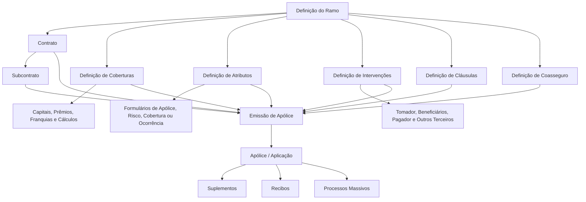
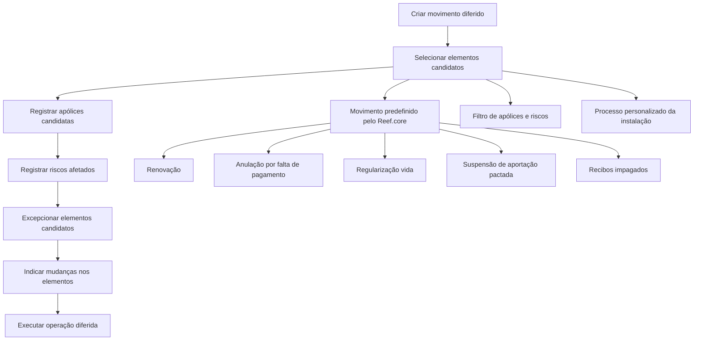

# Documentação Estruturada do Reef.core: Definições de Emissão, Produtos, Coberturas e Processos Massivos

## 1. Metadados do Documento
- **Arquivo de Origem:** `Não informado — conteúdo bruto fornecido na conversa`
- **Tipo de Documento:** `Manual Operacional e Especificação Funcional/Técnica`
- **Domínio / Sistema:** `Reef.core — Emissão de Seguros MAPFRE`
- **Público-Alvo:** `Arquitetos, desenvolvedores, analistas funcionais, operação e equipes de produtos de seguros`
- **Data/Versão Identificada:** `Não identificada`

---

## 2. Resumo Executivo & Contexto de Negócio

O conteúdo descreve conceitos funcionais, regras de parametrização e operações do módulo de Emissão do **Reef.core**, utilizado no contexto de seguros MAPFRE. A documentação cobre a definição de estruturas de produto — como ramos, contratos, subcontratos, coberturas, atributos, cláusulas, intervenções, coasseguro e acessórios — e as operações necessárias para emitir, alterar e processar apólices.

O Reef.core permite configurar produtos de seguros com elevado grau de flexibilidade. A parametrização determina quais informações serão coletadas na emissão, quais coberturas podem ser contratadas, como capitais segurados são definidos, quais cláusulas se aplicam, como agentes e terceiros participam e quais regras de cálculo, validação, reavaliação, inspeção e resseguro são aplicadas.

O documento também detalha a execução de operações em modo diferido, chamadas de **processos massivos**. Esses processos permitem selecionar apólices, riscos ou outros elementos para tratamento posterior, incluindo renovação, anulação por falta de pagamento, regularização de vida, suspensão de aportação, emissão, alteração, controle técnico e mudança de gestor de cobrança.

Há ainda conteúdo técnico associado a tabelas do modelo de dados, especialmente `G2000510`, `A2000500`, `A2000510`, `A2000030`, `A2000032`, `A2000033`, `A2000161`, `A2990700`, `A2990701`, `A2990702`, `A5020301` e `A2100170`. Essas tabelas armazenam processos massivos, apólices candidatas, riscos afetados, mudanças de plano de pagamento, recibos, comissões e conceitos econômicos.

---

## 3. Arquitetura, Componentes & Tecnologias Envolvidas

### Componentes funcionais identificados

| Componente / Conceito | Função no Reef.core |
| :--- | :--- |
| Reef.core | Núcleo de configuração e emissão de seguros. |
| Ramo | Define o tipo de seguro e suas regras de emissão. |
| Contrato | Permite alterar determinados conceitos de negócio definidos no ramo. |
| Subcontrato | Permite alterar conceitos de negócio para a combinação de ramo e contrato. |
| Póliza grupo | Chave que agrupa apólices independentes, possivelmente de ramos distintos. |
| Póliza cliente | Chave destinada a agrupar apólices de famílias, clientes ou grupos empresariais. |
| Cobertura | Define a obrigação do segurador e parâmetros de capital, prêmio, franquia e comportamento. |
| Tipo de cobertura | Define comportamento de visibilidade, capital segurado e prêmio da cobertura. |
| Atributo | Campo configurável para registrar informações de apólice, risco, cobertura ou ocorrência. |
| Cláusula | Termo e condição aplicável a uma apólice ou risco. |
| Intervenção | Agrupamento de terceiros associados à apólice ou ao risco. |
| Coasseguro | Participação de múltiplas seguradoras no risco, prêmio e sinistros. |
| Processo massivo | Execução diferida de operações sobre apólices, aplicações ou riscos selecionados. |
| Buzón | Estrutura de informações utilizadas para criação ou alteração em modo diferido. |
| RE21 | Módulo de resseguro citado como destino opcional de atributos. |
| Oracle | Tecnologia citada para tabelas de ajuda de atributos. |

### Modelo conceitual de emissão



### Fluxo de processo massivo em emissão



---

## 4. Regras de Negócio, Especificações Funcionais & Processos

### 4.1 Póliza grupo

Uma póliza grupo é uma chave que permite agrupar diversas apólices, inclusive apólices de ramos distintos. A chave da póliza grupo não possui estrutura fixa e sua criação é manual.

Regras identificadas:

1. O número da póliza grupo aceita qualquer valor.
2. Uma póliza grupo pode agrupar apólices de tipos de negócio distintos ou do mesmo tipo.
3. Cada apólice associada possui uma sequência própria dentro da póliza grupo.
4. A sequência representa o identificador da apólice dentro do agrupamento.
5. Uma póliza grupo inabilitada não pode ser atribuída a novas apólices.
6. A inabilitação não implica, pelo texto fornecido, remoção automática de apólices já associadas.
7. Não existe numeração automática de póliza grupo.
8. Não existe estrutura predefinida para o número de póliza grupo.

### 4.2 Contratos e subcontratos

O contrato permite alterar conceitos de negócio previamente definidos no ramo. O subcontrato permite alterar conceitos associados simultaneamente ao ramo e ao contrato.

Exemplo funcional apresentado:

- No ramo `300 - Automóvil`, a cobertura `300 Accidentes` pode estar inabilitada no ramo sem contrato.
- No contrato `SANTANDER`, a cobertura `300 Accidentes` pode estar habilitada, mesmo que não seja oferecida na definição base do ramo.
- Um subcontrato pode alterar novamente a condição das coberturas aplicáveis ao contrato.
- O documento apresenta o subcontrato `ASEGURADO CON SEGURO DE VIDA` como exemplo de configuração vinculada ao contrato `SANTANDER`.

> **Nota de Análise:** O conteúdo apresenta exemplos textuais com aparentes inconsistências entre os valores das tabelas e as conclusões narrativas sobre as coberturas de acidentes, morte e vida. O relatório preserva a intenção funcional: contrato e subcontrato podem sobrescrever parte da definição do ramo.

### 4.3 Numeração de apólices e orçamentos

Regras gerais:

1. Numerações de apólice e orçamento não podem ter o mesmo formato.
2. Toda numeração deve conter um número sequencial.
3. A composição precisa garantir números suficientes ao longo do tempo.
4. A inclusão do ano pode permitir sequências independentes por ano.
5. O formato de numeração da apólice é definido por setor e se aplica aos ramos do setor.
6. O formato não pode ser alterado depois que exista alguma apólice emitida para o setor.
7. O tamanho máximo do número de apólice é de 13 posições.
8. O elemento consecutivo `N` é obrigatório.
9. O tamanho de `N` é a diferença entre o tamanho máximo de 13 posições e os demais elementos utilizados.
10. Deve existir pelo menos um elemento adicional além do consecutivo.

Exemplos documentados:

- `RRRAANNNNNNNN`: ramo + ano + consecutivo.
- `RRRAA222NNNNN`: ramo + ano + segundo nível comercial + consecutivo.

### 4.4 Dias de adiantamento e atraso

A definição controla quantos dias antes ou depois é permitido realizar um tipo de movimento de emissão.

Critérios de aplicação:

- Ramo.
- Póliza grupo, quando informada.
- Contrato, quando informado.
- Subcontrato, quando informado.
- Tipo de emissão.
- Número de dias de adiantamento.
- Número de dias de atraso.
- Estado de inabilitação.
- Data de validade.

### 4.5 Coberturas

A cobertura define a obrigação do segurador de assumir, até o limite da soma segurada, consequências econômicas decorrentes de um sinistro. A cobertura também define custo para o cliente, regras de contratação, capital, prêmio, franquia, reavaliação, validações e comportamento em suplementos.

Regras relevantes:

1. Cobertura obrigatória é contratada por padrão e não pode ser excluída.
2. Cobertura não obrigatória normalmente não é contratada por padrão.
3. Cobertura relacionada depende de uma cobertura principal.
4. Se a cobertura principal não for contratada, a cobertura relacionada não pode ser contratada.
5. Se a cobertura principal for excluída, as coberturas relacionadas também serão excluídas.
6. A cobertura relacionada pode utilizar um percentual da soma segurada da cobertura principal.
7. Uma soma segurada igual a zero implica que a cobertura não será contratada quando a cobertura exigir soma segurada.
8. Uma cobertura pode reduzir sua soma segurada após um sinistro.
9. A redução por sinistro gera ordem para suplemento de redução de soma segurada.
10. A restauração da soma segurada requer suplemento de restituição.
11. Cobertura que exige inspeção mantém a apólice retida por controle técnico enquanto a inspeção não existir ou tiver resultado negativo.
12. Cobertura inabilitada não pode ser incluída em novas apólices, mas continua aplicável às apólices existentes até que um suplemento a altere.
13. Impressão obrigatória expressa intenção de exibir cobertura excluída em condições particulares; a apresentação final depende da lógica responsável pela exibição.

### 4.6 Tipos de cobertura

| Código | Tipo | Visível | Possui Soma Assegurada | Possui Prêmio |
| :--- | :--- | :---: | :---: | :---: |
| 1 | Informativa | Sim | Não | Não |
| 2 | Básica adicional | Sim | Sim | Não |
| 3 | Real dependente | Sim | Sim | Sim |
| 4 | Real independente | Sim | Sim | Sim |
| 5 | Serviços | Sim | Não | Sim |
| 6 | Capital ilimitado | Sim | Não | Sim |
| 7 | Sinistros | Não | Não | Não |
| 8 | Fictícia risco | Não | Não | Não |
| 9 | Fictícia póliza | Não | Não | Não |
| R | Fictícia ajuste risco | Não | Não | Não |

### 4.7 Atributos

Atributos são necessários quando o Reef.core não possui determinada informação a registrar na apólice ou quando uma informação existente influencia a tarifa.

Âmbitos de formulário:

| Formulário | Âmbito |
| :--- | :--- |
| Póliza | Todos os riscos da apólice. |
| Risco | Cada risco da apólice. |
| Cobertura | Cobertura do risco associado. |
| Ocorrência | Cobertura, risco ou apólice associada. |

Regras funcionais:

- O tipo de campo pode ser `Carácter`, `Número` ou `Fecha`.
- Atributos podem possuir valor padrão e lógica de negócio anterior à solicitação.
- A lógica prévia pode definir o valor do atributo e se ele é alterável.
- Atributos obrigatórios impedem continuidade do processo enquanto não tiverem valor.
- Atributos podem afetar cálculo.
- Atributos podem ser únicos no mesmo período de vigência.
- Atributos podem ser solicitados em orçamento.
- Atributos podem ser exibidos no tratamento de sinistros.
- Atributos podem ser exportados para RE21.
- Atributos inabilitados não podem ser usados em novas apólices, mantendo comportamento nas apólices existentes até alteração por suplemento.
- A validação pode ser executada mesmo quando o atributo estiver vazio.
- Um atributo de soma segurada pode ser reavaliado por tipo, percentual, índice ou lógica de negócio.
- Na inspeção, recomenda-se que atributos com baixa cardinalidade ocupem as primeiras posições do formulário.

### 4.8 Intervenções e terceiros

Intervenções definem quais figuras de terceiros podem ser solicitadas na emissão e em suplementos. Salvo o tomador, as intervenções não são obrigatórias por padrão.

Intervenções exclusivas de nível de apólice:

- Tomador.
- Tomadores alternos.
- Pagador.

Regras relevantes:

1. Uma intervenção pode ser solicitada no nível de apólice ou risco.
2. É possível definir quantidade mínima e máxima de terceiros.
3. Uma intervenção pode requerer terceiro principal.
4. Mais de um terceiro pode ser considerado principal quando configurado.
5. Pode haver um terceiro escolhido manualmente para cálculos.
6. Percentuais podem ser solicitados e podem ser obrigados a somar 100.
7. A opção de cessão de direitos exige dados de financiamento: número de contrato, data de vencimento e importe financiado.
8. O terceiro pode ser marcado como pessoa V.I.P.; o texto afirma que o comportamento é apenas informativo.
9. Uma intervenção pode utilizar terceiro de referência de outra intervenção.
10. A intervenção pode impedir que o terceiro seja igual ao tomador.
11. Uma lógica pode decidir se os terceiros de determinada intervenção devem ser solicitados.
12. Se configurado, terceiros de intervenção não solicitada podem ser inabilitados.
13. A validação pode ser global para todos os terceiros da intervenção.
14. Intervenções de apólice podem ser solicitadas antes dos atributos da apólice ou ao finalizar.
15. Intervenções de risco podem ser solicitadas antes ou depois dos atributos do risco.
16. Uma lógica de carga massiva pode carregar terceiros de forma diferida, em batch.

### 4.9 Coasseguro

O coasseguro registra entidades participantes e condições de participação em uma cobertura de risco.

Regras:

- Em coasseguro cedido, a soma dos percentuais de participação de todas as seguradoras do quadro deve ser 100.
- Em coasseguro aceito, o percentual deve ser inferior a 100 e representa a participação MAPFRE.
- São permitidos até quatro percentuais distintos de comissão.
- Os percentuais de participação afetam prêmio e sinistros.
- Um quadro de coasseguro informado na emissão é apenas consultável; sua distribuição não pode ser modificada nesse ponto.

### 4.10 Processos massivos

Um processo massivo define:

1. Qual operação será executada de forma diferida.
2. Quais elementos serão afetados.
3. Quais mudanças serão aplicadas aos elementos.
4. Quais elementos devem ser excluídos.

Fluxo funcional:

1. Criar movimento diferido.
2. Selecionar elementos candidatos.
3. Registrar apólices.
4. Registrar riscos afetados.
5. Excepcionar elementos candidatos.
6. Indicar mudanças nos candidatos.
7. Executar o processo.

O valor `0` é reservado e não pode ser utilizado como ordem de processo massivo em uma mesma data.

### 4.11 Regras de seleção automática de apólices

| Processo | Critério de seleção documentado |
| :--- | :--- |
| Anulação por falta de pagamento | Apólices com ao menos um recibo não cobrado na data do processo mais período de carência e que não estejam no processo de impagados. Considera o recibo não cobrado mais antigo. |
| Recibos impagados | Apólices e recibos não cobrados na data do processo. Não considera período de carência. |
| Regularização de vida | Apólices vigentes na data do processo que não tenham movimento de regularização no mês. |
| Renovação | Apólices vencidas, não temporárias e não renovadas na data definida. |
| Suspensão de aportação pactada | Apólices com número determinado de aportações periódicas não pagas na data do processo. |

### 4.12 Alteração de plano de pagamento

A operação permite refinanciamento e/ou mudança de plano de pagamento de apólice ou aplicação.

Regras:

1. Não permite alterar outros dados da apólice, exceto gestor de cobrança.
2. Cancela recibos selecionados do plano anterior.
3. Gera novos recibos de acordo com o novo plano de pagamento.
4. Os novos recibos são gerados no último suplemento vigente que tenha gerado informação econômica.
5. Apenas recibos em situação `emitido pendiente` podem participar.
6. É permitido alterar apenas parte dos recibos pendentes.
7. O novo plano pode ser igual ao plano atual para possibilitar refinanciamento.
8. Um valor ou percentual no campo de primeira parcela somente produz efeito se o plano aceitar essa possibilidade.
9. Se o gestor de cobrança mudar, apenas os novos recibos recebem o novo gestor.
10. Recibos cancelados mantêm o gestor anterior.
11. Recibos existentes que não participam na operação mantêm o gestor anterior.

---

## 5. Tabelas de Parâmetros, Ambientes e Estruturas de Dados

### 5.1 Elementos do formato de numeração de apólice

| Item / Parâmetro | Descrição / Função | Tipo / Valores / Formato | Ambiente / Observações |
| :--- | :--- | :--- | :--- |
| Companhia | Identificador da companhia. | Comprimento 2; abreviação `C`. | Pode compor número de apólice. |
| Setor | Identificador do setor. | Comprimento 2; abreviação `S`. | Formato definido por setor. |
| Ramo | Identificador do ramo. | Comprimento 3; abreviação `R`. | Exemplo: `RRR`. |
| Estrutura comercial nível 1 | Primeiro nível comercial. | Comprimento 2; abreviação `1`. | Opcional na composição. |
| Estrutura comercial nível 2 | Segundo nível comercial. | Comprimento 3; abreviação `2`. | Exemplo: `222`. |
| Estrutura comercial nível 3 | Terceiro nível comercial. | Comprimento 3; abreviação `3`. | Opcional na composição. |
| Ano | Ano de geração. | Comprimento 2; abreviação `A`. | Pode evitar repetição anual de sequência. |
| Número consecutivo | Sequência que diferencia números. | Comprimento variável; abreviação `N`. | Obrigatório; completa máximo de 13 posições. |

### 5.2 Tipos de capital para cobertura

| Item / Parâmetro | Descrição / Função | Tipo / Valores / Formato | Ambiente / Observações |
| :--- | :--- | :--- | :--- |
| Valor do veículo | Usa valor do veículo normalmente registrado em atributo. | Tipo de capital. | Aplicável a contexto de veículo. |
| Acessórios | Usa soma dos acessórios declarados no risco. | Tipo de capital. | Requer acessórios declarados. |
| Valor do veículo mais acessórios | Soma valor do veículo e acessórios declarados. | Tipo de capital. | Aplicável a contexto de veículo. |
| Limite | Usa lista de somas seguradas permitidas. | Tipo de capital. | Depende da definição de limites. |
| Limite duplo | Lista de capitais permitidos com máximo indenizável por sinistro. | Tipo de capital. | Inclui limite por sinistro. |
| Livre | Permite valor livre de soma segurada. | Tipo de capital. | Sem lista fixa indicada. |
| Intervalo | Limita soma segurada por faixas. | Tipo de capital. | Depende da definição de intervalos. |

### 5.3 Estrutura técnica de processos massivos

| Tabela | Descrição | Uso documentado |
| :--- | :--- | :--- |
| `G2000510` | Processos masivos. | Criação, exceção, indicação de mudanças e registro de processos massivos. |
| `A2000500` | Pólizas a tratar em processos massivos. | Registro de apólices candidatas. |
| `A2000510` | Riscos afetados para formação de processo massivo. | Registro de riscos participantes. |
| `A2000030` | Dados fixos da apólice. | Plano de pagamento e suplemento nominativo. |
| `A2000033` | Motivos de suplemento da apólice. | Motivos de alteração de plano de pagamento. |
| `A2000032` | Mudanças de plano de pagamento da apólice. | Histórico e vigência de mudanças de plano. |
| `A2000161` | Conceitos econômicos de recibo da apólice. | Marcação de cancelamento ou novo plano. |
| `A2990700` | Recibos/cotas da apólice. | Recibos afetados pelo plano de pagamento. |
| `A2990701` | Comissões por cota da apólice. | Marcação de alterações de recibos. |
| `A2990702` | Comissões externas por cota da apólice. | Marcação de alterações de recibos. |
| `A5020301` | Movimentos ou histórico de cotas. | Histórico de mudança de plano. |
| `A2100170` | Conceitos de desagregação econômica da apólice. | Informação econômica de apólice/risco. |

### 5.4 Colunas relevantes de `G2000510`

| Item / Parâmetro | Descrição / Função | Tipo / Valores / Formato | Ambiente / Observações |
| :--- | :--- | :--- | :--- |
| `COD_CIA` | Companhia. | Coluna de processo massivo. | Alterada na criação; não alterada na exceção. |
| `FEC_TRATAMIENTO` | Data de tratamento. | Coluna de processo massivo. | Alterada na criação; não alterada na exceção. |
| `NUM_ORDEN` | Número/ordem do processo massivo. | Coluna de processo massivo. | Valor zero é reservado. |
| `TIP_MVTO_BATCH` | Tipo de movimento batch. | Coluna de processo massivo. | Determina operação diferida. |
| `TXT_ALIAS` | Alias descritivo do processo. | Texto. | Exemplo citado: renovação de agosto. |
| `TIP_SITU_FILTRO` | Situação de filtro. | Coluna de processo massivo. | Alterada nas operações técnicas descritas. |
| `NOM_PRG_EXCEPCION` | Procedimento/lógica de exceção. | Nome de programa. | Determina elementos excluídos. |
| `MCA_RECALCULA_FECHA` | Indica recálculo de data. | Marca. | Obrigatória. |
| `TIP_FECHA_BASE` | Base para recálculo de data. | Tipo de data. | Não obrigatória. |
| `COD_USR` | Usuário que atualizou a linha. | Código de usuário. | Obrigatória. |
| `FEC_ACTU` | Data de atualização. | Data. | Não obrigatória segundo a tabela. |
| `TXT_MCA_PROCESO_ESTANDAR` | Indica aplicação de processo padrão. | Marca/texto. | Não obrigatória. |
| `IDN_PROCESO_PERSONALIZADO` | Identificador de processo personalizado. | Identificador. | Não obrigatório. |

### 5.5 Gestores de cobrança

| Tipo | Descrição | Condição de uso | Chave associada |
| :--- | :--- | :--- | :--- |
| 1 | Agente | Sempre. | Chave do agente principal da apólice. |
| 2 | Banco | Quando o pagador possuir conta bancária. | Entidade e agência bancária. |
| 3 | Cobrador | Quando essa figura estiver definida na companhia. | Chave do cobrador. |
| 4 | Débito automático em conta | Quando o pagador possuir conta bancária. | Entidade e agência bancária. |
| 5 | Gestor direto | Sempre. | Escritório de nível 3. |
| 6 | Gestor piloto coasseguro | Quando a apólice for de coasseguro aceito. | Seguradora líder. |
| 7 | Escritório comercial | Sempre. | Escritório de nível 3. |
| 8 | Débito com cartão de crédito | Quando o pagador possuir cartão de crédito. | Entidade e agência bancária. |
| 10 | Gestor de impagados | Nunca em operação normal; exclusivo de processo de impagados. | Não se aplica. |

### 5.6 Colunas econômicas

| Coluna | Descrição | Regra / Comportamento |
| :--- | :--- | :--- |
| `IMP_ANUAL` | Valor anual do conceito econômico. | Base para os demais cálculos; não participa na geração de cotas. |
| `IMP_NO_CONSUMIDO` | Valor a devolver ou cobrar se o conceito deixar de aplicar. | Calculado em suplemento dentro da vigência, com exceção de regularização. |
| `IMP_SPTO` | Valor a receber ou devolver pela MAPFRE. | Usado posteriormente para criação de cotas. |
| `IMP_ACUMULADO_ANUAL` | Total a obter se todos os recibos do período forem cobrados. | Soma de `IMP_SPTO` do período de vigência. |

---

## 6. Bateria de Perguntas & Respostas para RAG (FAQ Sintético)

### P1: O que é uma póliza grupo no Reef.core?
**R:** Uma póliza grupo é uma chave que permite agrupar diversas apólices independentes, inclusive apólices de ramos ou tipos de negócio diferentes. Cada apólice associada possui uma sequência dentro do grupo. O número da póliza grupo não segue estrutura predefinida e é criado manualmente.

### P2: Uma póliza grupo pode ser atribuída a uma nova apólice quando está inabilitada?
**R:** Não. Quando uma póliza grupo está inabilitada, ela não pode ser atribuída a novas apólices. O conteúdo não especifica remoção automática das associações existentes.

### P3: Qual é o tamanho máximo do número de apólice no Reef.core?
**R:** O tamanho máximo do número de apólice é de 13 posições. O elemento consecutivo é obrigatório e deve ocupar todas as posições restantes após a inclusão dos demais elementos escolhidos para o formato.

### P4: Qual é a diferença entre contrato e subcontrato?
**R:** Um contrato permite alterar determinados conceitos de negócio definidos em um ramo. Um subcontrato permite novas alterações para uma combinação específica de ramo e contrato. Ambos podem modificar parte da configuração, como a disponibilidade de coberturas.

### P5: O que ocorre quando uma cobertura relacionada tem sua cobertura principal excluída?
**R:** A cobertura relacionada também será excluída. Uma cobertura relacionada depende da cobertura principal: se a principal não for contratada, a relacionada não pode ser contratada.

### P6: Qual tipo de cobertura possui soma segurada, mas não possui prêmio?
**R:** A cobertura do tipo **Básica adicional** possui soma segurada, mas não possui prêmio. Ela é destinada a disponibilizar sua soma segurada para outras coberturas.

### P7: O que caracteriza uma cobertura de tipo Serviços?
**R:** Uma cobertura do tipo Serviços não possui soma segurada, mas possui prêmio. Na contratação, sua condição pode ser apresentada como `INCLUIDA` ou `EXCLUIDA`.

### P8: Quando uma cobertura pode manter uma apólice retida por controle técnico?
**R:** Quando a cobertura exige inspeção e o risco ainda não foi inspecionado ou teve resultado negativo. O controle técnico somente poderá ser levantado após uma inspeção positiva.

### P9: Quais são os níveis possíveis para solicitar intervenções de terceiros?
**R:** As intervenções podem ser solicitadas no nível de **Póliza** ou no nível de **Risco**. Intervenções de apólice afetam toda a apólice; intervenções de risco afetam somente o risco associado.

### P10: Quais são as etapas de criação de um processo massivo em emissão?
**R:** As etapas são: criar movimento diferido, selecionar elementos candidatos, registrar apólices, registrar riscos afetados, excepcionar elementos candidatos e indicar mudanças a realizar nos elementos candidatos.

### P11: Qual critério o Reef.core utiliza para selecionar apólices para anulação por falta de pagamento?
**R:** O Reef.core seleciona apólices que possuem ao menos um recibo não cobrado na data do processo mais o período de carência, desde que não estejam no processo de impagados. Quando houver vários recibos não cobrados, é considerado o de maior antiguidade.

### P12: Quais recibos podem participar de uma alteração de plano de pagamento?
**R:** Apenas recibos que estejam na situação `emitido pendiente`. Recibos em outra situação não podem participar da alteração de plano de pagamento.

### P13: O que acontece com os recibos ao alterar o plano de pagamento?
**R:** Os recibos selecionados do plano anterior são cancelados e novos recibos são gerados conforme a definição do novo plano de pagamento. Recibos não selecionados permanecem no plano anterior.

### P14: Como é calculado o IMP_ACUMULADO_ANUAL?
**R:** Para orçamento, declaração, nova apólice, nova aplicação e renovação, `IMP_ACUMULADO_ANUAL` recebe o valor de `IMP_SPTO`. Nos demais movimentos, corresponde a `IMP_SPTO` do suplemento atual somado a `IMP_ACUMULADO_ANUAL` do suplemento anterior.

---

## 7. Glossário de Termos, Siglas & Conceitos-Chave

- **Atributo:** Campo configurável utilizado para registrar informação de apólice, risco, cobertura ou ocorrência.
- **Cobertura:** Obrigação do segurador de responder economicamente a sinistros, conforme capital segurado e regras configuradas.
- **Coasseguro aceito:** Situação em que MAPFRE participa em uma apólice cuja companhia líder é outra seguradora.
- **Coasseguro cedido:** Situação em que parte do risco assumido é cedida a outras seguradoras.
- **Contrato:** Configuração que altera determinados conceitos de negócio de um ramo.
- **Franquia:** Valor ou regra aplicável à participação do segurado no custo de um sinistro.
- **IMP_ACUMULADO_ANUAL:** Valor acumulado dos suplementos de um período de vigência.
- **IMP_ANUAL:** Valor anual de um conceito econômico.
- **IMP_NO_CONSUMIDO:** Valor não consumido utilizado em cenários de suplemento.
- **IMP_SPTO:** Valor de suplemento a receber ou devolver.
- **Intervenção:** Figura ou agrupamento de terceiros associado à apólice ou risco.
- **Póliza cliente:** Chave para agrupar apólices de famílias ou grupos empresariais.
- **Póliza grupo:** Chave para agrupar apólices independentes.
- **RE21:** Módulo de resseguro citado como destino de exportação de atributos.
- **Ramo:** Tipo de seguro que define características e comportamento da emissão.
- **Reef.core:** Sistema descrito para definição e emissão de seguros.
- **Subcontrato:** Configuração que altera conceitos de negócio definidos para uma combinação de ramo e contrato.
- **Suplemento:** Modificação aplicada a uma apólice ou aplicação.
- **Tomador:** Terceiro identificado como tomador da apólice.

---

## 8. Notas Críticas, Riscos & Limitações

- **Nota de Análise:** O conteúdo bruto reúne documentação funcional, técnica e páginas de navegação extraídas. Há repetições de cabeçalhos, menus, metadados de portal e tabelas parcialmente duplicadas.
- **Nota de Análise:** Diversos tópicos contêm o marcador `EN CONSTRUCCIÓN`; esses tópicos não possuem detalhamento adicional no material fornecido.
- **Nota de Análise:** O documento cita lógicas de negócio para cálculo, validação, exceção, carga massiva e texto variável, mas não especifica contratos técnicos, APIs, linguagens, assinaturas, entradas ou saídas dessas lógicas.
- **Nota de Análise:** O conteúdo cita tabelas Oracle de ajuda e diversas tabelas de dados, mas não apresenta chaves primárias, índices, relacionamentos físicos completos ou scripts SQL.
- **Risco operacional:** A ordem de seleção de tabelas e colunas no filtro de processos massivos influencia diretamente o desempenho do sistema.
- **Risco operacional:** O valor `0` para ordem de processo massivo é reservado e não deve ser utilizado.
- **Risco de consistência:** Apólices de um grupo podem possuir vencimentos, moedas, tipos de câmbio, planos de pagamento, tomadores, gestores, cláusulas, comissões e tipos de resseguro distintos se não houver controles adicionais.
- **Risco de produto:** O formato de numeração de apólice não pode ser alterado após existir apólice emitida para o setor.
- **Risco de emissão:** Coberturas que exigem inspeção podem reter a apólice por controle técnico até obtenção de inspeção positiva.
- **Limitação documental:** As fórmulas completas para `IMP_NO_CONSUMIDO` e `IMP_SPTO` são mencionadas, mas não aparecem explicitamente no conteúdo bruto fornecido.
- **Limitação documental:** Alguns exemplos de contratos e subcontratos contêm divergências aparentes entre textos explicativos e valores tabulares; não é possível resolver tais divergências sem fonte complementar.

---

## 9. Conteúdo Bruto Estruturado (Referência Fiel)

```text
Principais blocos extraídos do documento original:

1. Definição de póliza grupo
- Objetivo: agrupar várias apólices sob uma chave denominada póliza grupo.
- Propriedades: número de póliza grupo, descrição, descrição curta,
  obrigação de contrato, sequência e inabilitação.
- A numeração não possui estrutura e a criação é manual.

2. Definição de contrato e subcontrato
- Contratos alteram conceitos de negócio de um ramo.
- Subcontratos alteram conceitos de um ramo e contrato.
- Exemplos apresentados com ramo 300 - Automóvil, contrato SANTANDER
  e subcontrato ASEGURADO CON SEGURO DE VIDA.

3. Definição de numeração
- Numeração de apólice e orçamento deve ser diferente.
- Toda numeração precisa de sequência.
- A numeração de apólice possui tamanho máximo de 13 posições.
- Elementos possíveis: companhia, setor, ramo, níveis comerciais,
  ano e consecutivo.

4. Definição de dias de adiantamento e atraso
- Controle de quantos dias antes ou depois um movimento de emissão
  pode ser realizado.
- Critérios: ramo, póliza grupo, contrato, subcontrato, tipo de emissão,
  dias de adiantamento, dias de atraso, inabilitação e validade.

5. Definição de cobertura
- Define obrigação econômica do segurador frente a sinistros.
- Agrupa propriedades de definição, ramo, capital segurado,
  cobertura relacionada, gerais, franquia, cálculo, reavaliação,
  suplementos e validação.
- Tipos de capital: valor do veículo, acessórios, valor do veículo
  mais acessórios, limite, limite duplo, livre e intervalo.

6. Definição de tipo de cobertura
- Tipos: Informativa, Básica adicional, Real dependente,
  Real independente, Serviços, Capital ilimitado, Sinistros,
  Fictícia risco, Fictícia póliza e Fictícia ajuste risco.
- A tabela de resumo indica visibilidade, soma assegurada e prêmio.

7. Definição de atributo
- Atributos registram informação necessária à apólice ou à tarifa.
- Formulários: póliza, risco, cobertura e ocorrência.
- Tipos de campo: caráter, número e data.
- Inclui propriedades de ajuda Oracle, padrão, cálculo, validação,
  inspeção, soma segurada, exportação para RE21 e visualização.

8. Definição de intervenção
- Define figuras solicitadas em emissão e suplementos.
- Níveis: póliza e risco.
- Intervenções exclusivas de nível póliza: tomador, tomadores alternos
  e pagador.
- Inclui terceiro principal, terceiro de cálculo, percentuais,
  cessão de direitos, referência, validação e carga massiva.

9. Definição de coasseguro
- Registra seguradoras participantes, percentuais e comissões.
- Em coasseguro cedido, percentuais das companhias devem somar 100.
- Em coasseguro aceito, percentual inferior a 100 representa MAPFRE.

10. Definição de cláusula
- Define termos e condições de apólice.
- Propriedades: chave, descrição, data de edição, impressão,
  inabilitação, ramo, comportamento, idioma e texto.

11. Definições de veículos e acessórios
- Tipo de veículo, agrupamento de acessórios, acessórios por tipo
  de veículo, tipos de acessórios e acessórios.
- Acessórios podem possuir valores padrão, mínimos e máximos.

12. Processos massivos em emissão
- Fluxo: criar movimento diferido, selecionar candidatos,
  registrar apólices, registrar riscos, excepcionar candidatos
  e indicar mudanças.
- Movimentos incluem orçamento, apólice, aplicação, renovação,
  suplemento, anulação por falta de pagamento, regularização vida,
  suspensão de aportação e recibos impagados.

13. Tabelas técnicas de processos massivos
- G2000510: processos massivos.
- A2000500: apólices a tratar.
- A2000510: riscos afetados.
- Outras tabelas relacionadas a alteração de plano de pagamento:
  A2000030, A2000032, A2000033, A2000161, A2990700, A2990701,
  A2990702 e A5020301.

14. Emissão de apólice
- Blocos: seleção de ramo, informação inicial da apólice,
  informação de risco e informação final da apólice.
- Inclui contrato, subcontrato, número de apólice, moeda, renovação,
  reavaliação, resseguro, coasseguro, tomador, agentes, intervenções,
  atributos, acessórios, coberturas, cláusulas e plano de pagamento.

15. Alteração de plano de pagamento
- Permite refinanciamento ou mudança de plano de pagamento.
- Apenas recibos em situação emitido pendente participam.
- Pode alterar gestor de cobrança.
- Cancela recibos selecionados e gera novos recibos conforme o novo plano.

16. Informação econômica
- Colunas: IMP_ANUAL, IMP_NO_CONSUMIDO, IMP_SPTO e IMP_ACUMULADO_ANUAL.
- IMP_ANUAL representa importe anual.
- IMP_NO_CONSUMIDO representa valor que seria devolvido ou cobrado
  se o conceito deixasse de aplicar.
- IMP_SPTO é usado para geração de cotas.
- IMP_ACUMULADO_ANUAL agrega IMP_SPTO no período de vigência.

17. Comparação entre póliza multirrisco e póliza grupo
- Multirrisco possui uma apólice com múltiplos riscos.
- Póliza grupo possui múltiplas apólices independentes agrupadas.
- Diferenças afetam vencimento, moeda, câmbio, plano de pagamento,
  recibos, resseguro, coasseguro, tomador, intervenções, atributos,
  gestor de cobrança, cláusulas, comissões e suplementos.
```
