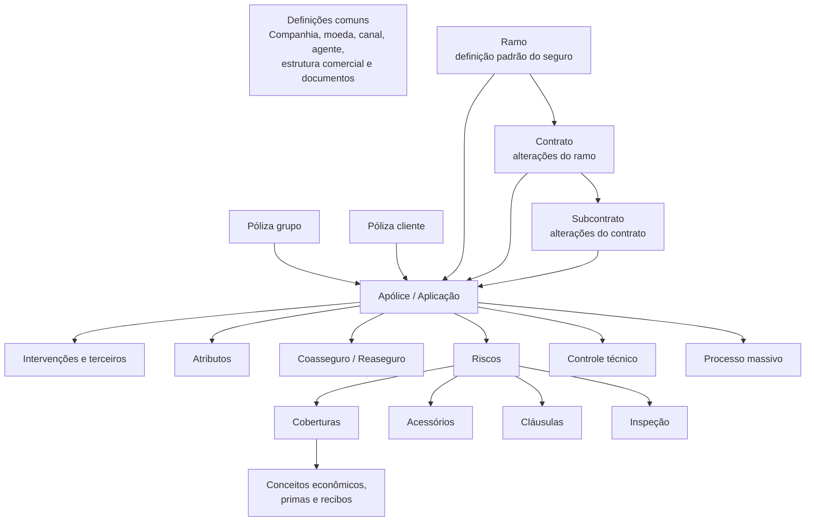
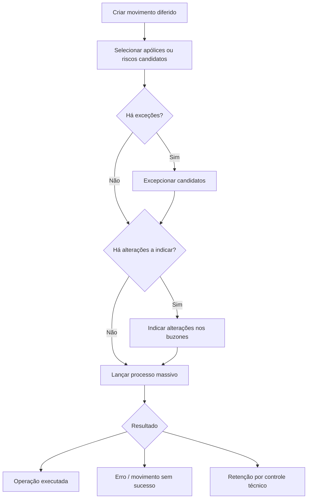

# Documentação Técnica e Operacional de Emissão — Reef.core

## 1. Metadados do Documento
- **Arquivo de Origem:** Texto bruto extraído fornecido na conversa; nome do arquivo não identificado.
- **Tipo de Documento:** Especificação técnica, manual operacional e documentação funcional.
- **Domínio / Sistema:** Reef.core — Emissão de seguros MAPFRE.
- **Público-Alvo:** Arquitetos, desenvolvedores, analistas funcionais, operação, parametrizadores e equipes de negócio.
- **Data/Versão Identificada:** Não identificada. O repositório documental indica `Lifecycle: Approved` e proprietário `user:agonzalez_mapfre.com`.

---

## 2. Resumo Executivo & Contexto de Negócio

O documento descreve o domínio de **Emissão do Reef.core**, plataforma que parametriza e executa o ciclo de vida de produtos de seguros. O conteúdo cobre definições de ramo, contrato, subcontrato, apólice grupo, coberturas, atributos, intervenções, coasseguro, cláusulas, acessórios, planos de pagamento, processos massivos e operações de emissão, alteração, renovação, cancelamento e reabilitação.

A parametrização é organizada em camadas. O **ramo** fornece a definição padrão do produto; **contratos** e **subcontratos** alteram seletivamente conceitos de negócio para clientes, colaboradores ou grupos empresariais. Uma apólice pode reunir riscos, intervenções de terceiros, coberturas, cláusulas, atributos, coasseguro, reasseguro, comissões e informação econômica.

O sistema suporta linhas de negócio de **Automóvel, Vida, Transportes, Saúde e Gerais**. As definições comuns incluem companhia, moeda, estrutura comercial, canal, agentes, conceitos econômicos, documentos, controle técnico e integração com PLATEA. Cada ramo complementa essa base com suas próprias estruturas de risco, cobertura e tarifação.

A emissão pode ocorrer de forma online ou diferida. A execução diferida é tratada como um **processo massivo**, composto pela criação do movimento, seleção de candidatos, tratamento de exceções e indicação de alterações. O documento também apresenta tabelas técnicas que registram processos massivos, apólices candidatas, riscos afetados e conceitos econômicos.

O material possui trechos explicitamente marcados como **“EN CONSTRUCCIÓN”**, páginas visuais sem detalhamento e algumas inconsistências entre tabelas e narrativas. Esses pontos devem ser tratados como limitações documentais, não como regras inferidas.

---

## 3. Arquitetura, Componentes & Tecnologias Envolvidas

### Componentes funcionais identificados

| Componente | Responsabilidade documentada |
| :--- | :--- |
| **Reef.core** | Núcleo de parametrização, emissão, alteração, processos massivos, controles técnicos e gestão de apólices. |
| **Emisión** | Módulo responsável por orçamento, emissão, suplementos, renovação, cancelamento, reabilitação e consultas. |
| **Ramo** | Configuração base do produto/segmento de seguro. |
| **Contrato / Subcontrato** | Camadas de exceção que modificam conceitos do ramo para condições específicas. |
| **Póliza grupo** | Agrupador de apólices independentes sob uma chave comum. |
| **Póliza cliente** | Chave para agrupar apólices de famílias, grupos empresariais ou colaboradores. |
| **Cobertura** | Elemento que define proteção, soma segurada, prima, franquia, regras de contratação e comportamento em sinistro. |
| **Atributo / Ocorrência** | Campos configuráveis em níveis de apólice, risco, cobertura ou ocorrência. |
| **Intervenciones** | Figuras de terceiros associadas à apólice ou ao risco, como tomador, pagador, segurado e beneficiários. |
| **Coaseguro** | Registro de participação entre seguradoras e percentuais de participação/comissão. |
| **Reaseguro / RE21** | Integração mencionada para exportação de atributos ao módulo de resseguro RE21. |
| **PLATEA** | Ativo integrado ao Reef.core; há menção a `Transaction id PLATEA`. |
| **Control técnico** | Retenção, autorização e rejeição de operações que exigem validação. |
| **Inspección** | Solicitação, atualização, aprovação ou rejeição de avaliação de risco. |
| **Procesos masivos** | Execução diferida e em lote de movimentos sobre apólices, aplicações, orçamentos ou riscos. |
| **Oracle** | Banco de dados mencionado nas propriedades de ajuda de atributos. |

### Modelo lógico de parametrização e emissão



### Fluxo de processo massivo



---

## 4. Regras de Negócio, Especificações Funcionais & Processos

### 4.1 Póliza grupo

- Uma **póliza grupo** agrupa apólices independentes, inclusive de diferentes linhas de negócio.
- O número da apólice grupo aceita qualquer valor e não possui estrutura predefinida.
- A criação do número de apólice grupo é manual.
- Cada apólice associada recebe uma **sequência**, análoga ao número de risco dentro de uma apólice.
- Uma apólice grupo inabilitada não pode ser atribuída a novas apólices.
- A propriedade **“Obliga a existencia de contrato”** determina se a utilização da apólice grupo exige contrato ao emitir uma apólice.

### 4.2 Contratos e subcontratos

- Um **contrato** altera conceitos de negócio definidos no ramo, sem necessariamente alterar todos os conceitos.
- Um **subcontrato** altera conceitos definidos pelo ramo e pelo contrato já selecionado.
- Os exemplos citam modificações em coberturas dos ramos, incluindo Responsabilidade Civil, Danos Próprios, Acidentes e Morte.
- Contrato e subcontrato são identificados por chave, nome e, no caso de subcontrato, nome curto.

> **Nota de Análise:** as narrativas das páginas 3–6 apresentam conflitos com os valores exibidos nas tabelas de “INHABILITADA”. O documento afirma resultados de contratação que não são diretamente coerentes com alguns valores `SI/NO` mostrados. A regra operacional definitiva deve ser validada na parametrização do Reef.core ou na documentação original corrigida.

### 4.3 Numeração de apólices e orçamentos

- As numerações de apólice e orçamento não são prefixadas pelo Reef.core; devem ser configuradas.
- Formatos de números de apólice e de orçamento não podem coincidir.
- Toda numeração deve conter uma sequência para assegurar unicidade.
- O número de apólice tem no máximo **13 posições**.
- O elemento consecutivo `N` é obrigatório.
- A quantidade de posições de `N` é o restante até 13 após os demais elementos.
- É obrigatório haver pelo menos um elemento adicional ao consecutivo.
- O formato é definido por setor e se aplica aos ramos desse setor.
- O formato não pode ser alterado após existir apólice emitida no setor.

### 4.4 Dias de adiantamento e atraso

A definição controla quantos dias antes ou depois podem ser usados para efetivar um tipo de movimento de emissão. A regra pode ser segmentada por ramo, apólice grupo, contrato, subcontrato e tipo de emissão.

### 4.5 Coberturas

- Cobertura é a obrigação do segurador de suportar consequências econômicas decorrentes de sinistro, dentro da soma segurada.
- A cobertura pode definir soma segurada, valor de indenização, comportamento após sinistro, franquia, cálculo de prima, revalorização, validações e comportamento em suplementos.
- Uma cobertura ligada a uma cobertura principal não pode ser contratada se a principal não estiver contratada. Se a principal for excluída, as conectadas também serão excluídas.
- Coberturas obrigatórias são contratadas por padrão e não podem ser excluídas.
- Coberturas inabilitadas não podem integrar novas apólices; coberturas já existentes continuam aplicáveis até que um suplemento as altere.
- Quando uma cobertura exige inspeção e esta não ocorreu ou foi negativa, a apólice fica retida por controle técnico.
- Se a soma segurada for reduzida por sinistro, o sistema gera uma ordem para suplemento de redução; a recomposição depende de suplemento de restituição.

### 4.6 Tipos de cobertura

| Código | Tipo | Visível | Soma segurada | Prima | Comportamento |
| :--- | :--- | :---: | :---: | :---: | :--- |
| `1` | Informativa | Sim | Não | Não | Texto separador na tela de contratação. |
| `2` | Básica adicional | Sim | Sim | Não | Fornece soma segurada para outras coberturas. |
| `3` | Real dependente | Sim | Sim | Sim | Soma segurada depende de outra cobertura. |
| `4` | Real independente | Sim | Sim | Sim | Soma segurada própria. |
| `5` | Serviços | Sim | Não | Sim | Exibe `INCLUIDA` ou `EXCLUIDA`. |
| `6` | Capital ilimitado | Sim | Não | Sim | Exibe `ILIMITADA`. |
| `7` | Siniestros | Não | Não | Não | Associa expedientes que não dependem de cobertura contratada. |
| `8` | Ficticia riesgo | Não | Não | Não | Associa informação econômica ao risco. |
| `9` | Ficticia póliza | Não | Não | Não | Associa informação econômica à apólice. |
| `R` | Ficticia ajuste riesgo | Não | Não | Não | Última cobertura calculada no nível de risco. |

### 4.7 Intervenções e terceiros

- Intervenções são figuras previamente estabelecidas no Reef.core; não podem ser criadas livremente.
- O tomador é a única intervenção obrigatória no ramo.
- Cada intervenção pode ter mínimo e máximo de terceiros.
- Tomador, tomadores alternos e pagador são exclusivos de nível de apólice.
- Intervenções podem ser solicitadas em nível de apólice ou risco.
- Uma intervenção pode exigir terceiro principal, múltiplos terceiros principais ou terceiro utilizado para cálculos.
- Caso haja percentual, a configuração pode exigir soma total de 100%.
- A cessão de direitos solicita número de contrato, data de vencimento do financiamento e valor financiado.
- A solicitação pode ocorrer antes dos atributos de apólice, ao finalizar, antes dos atributos de risco ou depois dos atributos de risco, conforme o nível da intervenção.

### 4.8 Atributos

- Atributos suprem informações que o Reef.core não possui ou que afetam a tarifa.
- Podem pertencer a formulários de apólice, risco, cobertura ou ocorrência.
- Tipos permitidos: caráter, número e data.
- O formato de data padrão é `ddmmyyyy`; pode ser alterado para `mmddyyyy`.
- Atributos que afetam o cálculo são sempre solicitados em orçamento.
- Um atributo obrigatório impede a continuidade do processo enquanto não possuir valor.
- Atributos únicos não podem repetir valor em outra apólice no mesmo período de vigência, salvo a regra particular para valor padrão.
- Atributos podem ser exportados para RE21.
- A validação pode ocorrer mesmo quando o atributo está vazio.
- A pesquisa de inspeções usa operador de igualdade e deve priorizar atributos com baixa cardinalidade nas primeiras posições do formulário.

### 4.9 Coasseguro

- Em coasseguro cedido, todas as companhias participantes, inclusive MAPFRE, devem ser incluídas.
- Em coasseguro cedido, a soma dos percentuais de participação deve ser 100%.
- Em coasseguro aceito, somente a companhia líder é identificada no quadro; o percentual representa a participação da MAPFRE e deve ser inferior a 100%.
- É possível definir até quatro percentuais de comissão por participante.
- As comissões são calculadas com base nos conceitos econômicos configurados para comissão de coasseguro e no processo mensal de carga de coasseguro, salvo processo externo indicado no ramo.

### 4.10 Processos massivos

1. Criar movimento diferido.
2. Selecionar apólices ou riscos candidatos.
3. Excepcionar candidatos, quando aplicável.
4. Indicar alterações em candidatos, quando aplicável.
5. Lançar o processo massivo.

Formas de selecionar candidatos:

- Movimentos predefinidos do Reef.core.
- Ferramenta `FILTRAR póliza proceso masivo`.
- Lógica personalizada da instalação.

Filtros nativos identificados:

- Renovação.
- Anulação por falta de pagamento.
- Regularização de Vida.
- Suspensão de aportação pactada.
- Recibos impagados.

### 4.11 Regras de filtros nativos

| Processo | Critério de seleção documentado |
| :--- | :--- |
| Anulação por falta de pagamento | Apólices com ao menos um recibo não cobrado até a data do processo acrescida do período de graça, fora do processo de impagos. Considera o primeiro recibo não cobrado mais antigo. |
| Recibos impagados | Apólices e todos os recibos não cobrados na data do processo; não considera período de graça. |
| Regularização Vida | Apólices vigentes na data do processo sem movimento de regularização no mês. |
| Renovação | Apólices vencidas, não temporais e não renovadas na data do processo. |
| Suspensão de aportação pactada | Apólices com determinada quantidade de aportações periódicas não pagas na data do processo. |

### 4.12 Alteração de plano de pagamento

- A operação permite refinanciamento e/ou alteração do plano de pagamento da apólice ou aplicação.
- Não altera outras informações da apólice, exceto o gestor de cobrança.
- Somente recibos em situação **emitido pendiente** podem participar.
- Os recibos selecionados são anulados e novos recibos são gerados de acordo com o novo plano.
- A operação pode usar o mesmo plano de pagamento para refinanciar parcialmente ou totalmente recibos pendentes.
- A primeira parcela pode ser valor absoluto ou percentual, desde que o plano suporte esse comportamento.
- O valor zero de `NUM_ORDEN` é reservado e não pode ser utilizado em processos massivos.

### 4.13 Conceitos econômicos de desagregação

- `IMP_ANUAL`: valor anual de cobertura; não participa diretamente da geração de parcelas.
- `IMP_NO_CONSUMIDO`: valor a devolver ou cobrar caso o conceito deixe de ser aplicado.
- `IMP_SPTO`: valor a cobrar ou devolver pela MAPFRE; usado para criar parcelas.
- `IMP_ACUMULADO_ANUAL`: soma de `IMP_SPTO` no período de vigência.

Fórmulas registradas:

```text
imp_no_consumido := IMP_ANUAL * coeficiente_de_constitución
```

```text
imp_no_consumido := (IMP_SPTO + IMP_NO_CONSUMIDO) * coeficiente_de_anulación
```

```text
imp_spto := IMP_ANUAL * coeficiente_de_constitución - IMP_NO_CONSUMIDO
```

---

## 5. Tabelas de Parâmetros, Ambientes e Estruturas de Dados

### 5.1 Elementos do formato de número de apólice

| Item / Parâmetro | Descrição / Função | Tipo / Valores / Formato | Ambiente / Observações |
| :--- | :--- | :--- | :--- |
| Companhia | Parte do número de apólice | Comprimento `2`; abreviação `C` | Definido por setor. |
| Setor | Parte do número de apólice | Comprimento `2`; abreviação `S` | Definido por setor. |
| Ramo | Parte do número de apólice | Comprimento `3`; abreviação `R` | Definido por setor. |
| Estrutura comercial nível 1 | Parte do número | Comprimento `2`; abreviação `1` | Opcional na composição. |
| Estrutura comercial nível 2 | Parte do número | Comprimento `3`; abreviação `2` | Opcional na composição. |
| Estrutura comercial nível 3 | Parte do número | Comprimento `3`; abreviação `3` | Opcional na composição. |
| Ano | Parte do número | Comprimento `2`; abreviação `A` | Pode segmentar sequências por ano. |
| Consecutivo | Sequência única obrigatória | Abreviação `N`; tamanho residual até 13 | Obrigatório. |

### 5.2 Origem da soma segurada da cobertura

| Item / Parâmetro | Descrição / Função | Tipo / Valores / Formato | Ambiente / Observações |
| :--- | :--- | :--- | :--- |
| Valor do veículo | Usa o valor do veículo, normalmente registrado em atributo | Origem de capital | Aplicável a ramos de automóvel. |
| Acessórios | Soma acessórios declarados no risco | Origem de capital | Depende de acessórios registrados. |
| Valor veículo mais acessórios | Soma valor do veículo e acessórios | Origem de capital | Aplicável a automóvel. |
| Limite | Lista predefinida de somas seguradas permitidas | Lista | Pode incluir máximo por sinistro. |
| Limite duplo | Lista de somas seguradas e máximo por sinistro | Lista | Dupla restrição. |
| Livre | Aceita soma segurada livre | Valor livre | Sem lista predefinida. |
| Intervalo | Aceita valor dentro de faixa | Mínimo e máximo | Definido por cobertura. |

### 5.3 Tabela técnica `G2000510 — PROCESOS MASIVOS`

| Item / Parâmetro | Descrição / Função | Tipo / Valores / Formato | Ambiente / Observações |
| :--- | :--- | :--- | :--- |
| `COD_CIA` | Companhia | Obrigatório | Identifica a entidade. |
| `FEC_TRATAMIENTO` | Data do processo massivo | Obrigatório | Data de execução. |
| `NUM_ORDEN` | Número do processo massivo | Obrigatório | Diferencia processos na mesma data; `0` é reservado. |
| `TIP_MVTO_BATCH` | Tipo de movimento massivo | Obrigatório | Define a operação diferida. |
| `TXT_ALIAS` | Nome livre do processo | Opcional | Exemplo: renovação de agosto. |
| `TIP_SITU_FILTRO` | Situação do movimento | Obrigatório | `1` sem filtrar; `2` filtrando; `3` já filtrado; `4` excepcionando; `5` já excepcionado. |
| `NOM_PRG_EXCEPCION` | Procedimento de exceção | Opcional | Lógica que exclui elementos. |
| `MCA_RECALCULA_FECHA` | Marca de recálculo de data | Obrigatório | Indica se usa data calculada ou se recalcula. |
| `TIP_FECHA_BASE` | Base de data para recálculo | Opcional | Aplicável quando há recálculo. |
| `COD_USR` | Usuário que atualizou a linha | Obrigatório | Auditoria. |
| `FEC_ACTU` | Data de atualização | Opcional | Auditoria. |
| `TXT_MCA_PROCESO_ESTANDAR` | Aplicação de processo padrão | Opcional | Processo padrão ou guiado. |
| `IDN_PROCESO_PERSONALIZADO` | Identificador de processo massivo | Opcional | Vincula processo personalizado. |

### 5.4 Tabela técnica `A2000500 — PÓLIZAS A TRATAR EN LOS PROCESOS MASIVOS`

| Grupo | Campos identificados |
| :--- | :--- |
| Identificação do processo | `FEC_TRATAMIENTO`, `NUM_ORDEN`, `TIP_MVTO_BATCH`, `COD_CIA` |
| Estrutura comercial | `COD_SECTOR`, `COD_RAMO`, `COD_NIVEL1`, `COD_NIVEL2`, `COD_NIVEL3`, `COD_AGT` |
| Identificação de apólice | `NUM_POLIZA_GRUPO`, `NUM_CONTRATO`, `NUM_POLIZA_CLIENTE`, `NUM_POLIZA`, `NUM_POLIZA_TRONADOR`, `NUM_POLIZA_DEFINITIVO` |
| Identificação de movimento | `NUM_SPTO`, `NUM_APLI`, `NUM_SPTO_APLI`, `TIP_POLIZA_TR`, `FEC_EFEC_SPTO`, `FEC_VCTO_SPTO` |
| Informação econômica | `COD_MON`, `NUM_RECIBO`, `MCA_PRIMA_MANUAL`, `MCA_PRORRATA`, `MCA_DEVUELVE_TODO` |
| Renovação | `MCA_RENUEVA`, `MCA_RENUEVA_TMP`, `MCA_PERIODICIDAD`, `CANT_RENOVACIONES`, `MCA_PRE_RENOVACION` |
| Suplemento | `COD_SPTO`, `SUB_COD_SPTO`, `COD_TIP_SPTO`, `TXT_MOTIVO_SPTO`, `TIP_SPTO_ACCION` |
| Controle e exceção | `TIP_AUTORIZA_CT`, `TIP_SITU`, `COD_EXCEPCION`, `NOM_EXCEPCION`, `MCA_ANULACION_POR_DEUDA`, `MAX_SPTO_VIGENTE` |
| Auditoria | `COD_USR`, `COD_USR_CAPTURA`, `FEC_ACTU`, `IDN_VAL` |
| Outros | `NUM_RIESGOS`, `NUM_SUBCONTRATO`, `HORA_DESDE`, `COD_NEGOCIO`, `NUM_SPTO_ANULADO` |

### 5.5 Tabela técnica `A2000510 — RIESGOS AFECTADOS`

| Item / Parâmetro | Descrição / Função | Tipo / Valores / Formato | Ambiente / Observações |
| :--- | :--- | :--- | :--- |
| `FEC_TRATAMIENTO` | Data do processo | Obrigatório | Processo massivo. |
| `NUM_ORDEN` | Ordem do processo | Obrigatório | Processo massivo. |
| `TIP_MVTO_BATCH` | Tipo de movimento | Obrigatório | Processo massivo. |
| `COD_CIA` | Companhia | Obrigatório | Companhia da apólice. |
| `NUM_POLIZA` | Apólice | Obrigatório | Apólice candidata. |
| `NUM_RIESGO` | Risco | Obrigatório | Risco afetado. |
| `FEC_EFEC_RIESGO` | Início de vigência do risco | Obrigatório | Risco afetado. |
| `FEC_VCTO_RIESGO` | Vencimento do risco | Obrigatório | Risco afetado. |

### 5.6 Tipos de gestor de cobrança

| Tipo | Descrição | Condição de uso | Chave associada |
| :---: | :--- | :--- | :--- |
| `1` | Agente | Sempre | Agente principal da apólice. |
| `2` | Banco | Pagador possui conta bancária | Entidade e agência bancária. |
| `3` | Cobrador | Figura definida na companhia | Chave do cobrador. |
| `4` | Débito automático em conta | Pagador possui conta bancária | Entidade e agência bancária. |
| `5` | Gestor direto | Sempre | Escritório, nível 3. |
| `6` | Gestor piloto coasseguro | Apenas coasseguro aceito | Seguradora líder. |
| `7` | Escritório comercial | Sempre | Escritório, nível 3. |
| `8` | Débito em cartão de crédito | Pagador possui cartão de crédito | Entidade e agência bancária. |
| `10` | Gestor de impagos | Nunca selecionável manualmente | Exclusivo do processo de impagos. |

---

## 6. Bateria de Perguntas & Respostas para RAG (FAQ Sintético)

### P1: Qual é a diferença entre apólice multirriscos e apólice grupo no Reef.core?
**R:** A apólice multirriscos possui um único número de apólice e pode conter múltiplos riscos, compartilhando vencimento, moeda, tipo de câmbio, plano de pagamento, tomador, gestor de cobrança e cláusulas no nível da apólice. A apólice grupo agrupa múltiplas apólices independentes sob uma chave de apólice grupo; cada apólice pode possuir suas próprias configurações, o que exige controles adicionais para evitar divergências de moeda, planos, tomadores, comissões e demais informações.

### P2: Como deve ser formado o número de apólice?
**R:** O formato é definido por setor, possui no máximo 13 posições, deve incluir obrigatoriamente o elemento consecutivo `N` e precisa ter pelo menos outro elemento adicional. Os elementos possíveis são companhia, setor, ramo, níveis da estrutura comercial, ano e consecutivo. O formato não pode ser alterado depois que existir uma apólice emitida no setor.

### P3: Quando uma cobertura conectada pode ser contratada?
**R:** Uma cobertura conectada depende de uma cobertura principal. Se a principal não for contratada, a conectada não poderá ser contratada. Se a cobertura principal for excluída, as coberturas conectadas também serão excluídas.

### P4: O que ocorre quando uma cobertura exige inspeção?
**R:** Se uma cobertura exigir inspeção e ela ainda não tiver ocorrido, ou tiver resultado negativo, a apólice ficará retida por controle técnico. O controle só poderá ser liberado após a realização da inspeção com resultado positivo.

### P5: Como funciona a seleção de apólices para um processo massivo?
**R:** A seleção pode ser realizada por filtros predefinidos do Reef.core, pela ferramenta `FILTRAR póliza proceso masivo` ou por lógica personalizada da instalação. A ferramenta de filtro permite configurar tabela, relação lógica (`AND` ou `OR`), coluna, operador de comparação e condição.

### P6: Quais operações podem ser executadas em modo diferido?
**R:** O documento cita, entre outras, carga de orçamento, carga de apólice, carga de aplicação, conversão de renovações, orçamento de suplemento, suplemento, renovação, anulação por falta de pagamento, alteração desde orçamento, autorização ou rejeição de controle técnico, regularização Vida, suspensão de aportação pactada e tratamento de recibos impagados.

### P7: Quais recibos podem participar da alteração de plano de pagamento?
**R:** Apenas recibos na situação **emitido pendiente** podem participar. Os recibos selecionados são anulados e novos recibos são gerados conforme a definição do novo plano de pagamento. Recibos não selecionados mantêm a situação anterior.

### P8: Como é calculado o `IMP_SPTO`?
**R:** Para o cenário documentado, `IMP_SPTO` é calculado pela fórmula `IMP_ANUAL * coeficiente_de_constitución - IMP_NO_CONSUMIDO`. O valor representa o montante, com sinal, que a MAPFRE deve cobrar ou devolver, e é usado posteriormente na geração de parcelas.

### P9: Qual é a diferença entre coasseguro cedido e coasseguro aceito?
**R:** No coasseguro cedido, todas as seguradoras participantes, incluindo a MAPFRE líder, devem ser registradas e os percentuais devem somar 100%. No coasseguro aceito, registra-se a seguradora líder e o percentual representa a participação da MAPFRE, que deve ser inferior a 100%.

### P10: Um atributo que afeta o cálculo pode deixar de ser solicitado em orçamento?
**R:** Não. O documento determina que todo atributo marcado como impactante no cálculo será solicitado em orçamento, portanto a propriedade específica de solicitação em orçamento não pode alterar esse comportamento.

### P11: O que ocorre quando uma apólice ou suplemento retido por controle técnico é rejeitado?
**R:** A rejeição pode eliminar a operação do Reef.core ou convertê-la em orçamento, orçamento suspenso, declaração ou declaração suspensa, conforme o tipo de operação e a alternativa de rejeição escolhida. A modalidade “suspendendo” permite corrigir a informação que originou o controle técnico.

### P12: Quando uma apólice é candidata à anulação por falta de pagamento?
**R:** Uma apólice é candidata quando possui pelo menos um recibo não cobrado na data definida para o processo, acrescida do período de graça, e não se encontra no processo de impagos. Caso existam vários recibos não cobrados, é considerado o primeiro com maior antiguidade.

---

## 7. Glossário de Termos, Siglas & Conceitos-Chave

- **Apólice / Póliza:** Contrato de seguro que cobre um ou mais riscos.
- **Aplicação:** Emissão temporal, inferior a um ano, baseada em uma apólice marco, no contexto de Transportes.
- **Atributo:** Campo configurável usado para registrar dados, validar regras ou afetar cálculo.
- **Cobertura:** Proteção securitária com comportamento, capital, prima e regras próprias.
- **Contrato:** Exceção que altera definições do ramo para uma condição específica.
- **Subcontrato:** Exceção adicional aplicada sobre contrato e ramo.
- **Emisión:** Módulo de emissão de seguros do Reef.core.
- **Franquicia:** Parcela da responsabilidade atribuída ao segurado.
- **IMP_ANUAL:** Valor anual de um conceito de desagregação econômica.
- **IMP_NO_CONSUMIDO:** Valor não consumido que pode ser devolvido ou cobrado em suplemento.
- **IMP_SPTO:** Valor do suplemento que gera parcelas.
- **MAPFRE:** Companhia mencionada como participante e referência nos processos de seguro e coasseguro.
- **PLATEA:** Ativo integrado mencionado na documentação.
- **Póliza grupo:** Chave que agrupa apólices independentes.
- **Póliza cliente:** Chave para agrupamento de apólices de família, grupo empresarial ou colaborador.
- **Proceso masivo:** Processo diferido que seleciona e trata múltiplos elementos.
- **RE21:** Módulo de resseguro para o qual atributos podem ser exportados.
- **Ramo:** Linha ou tipo de seguro, como Automóvel, Vida, Transportes, Saúde ou Gerais.
- **Riesgo:** Objeto segurado; uma apólice pode conter um ou vários riscos.
- **Suplemento / Endosso:** Operação que modifica uma apólice ou aplicação.
- **Tomador:** Terceiro que contrata a apólice; única intervenção obrigatória no ramo.

---

## 8. Notas Críticas, Riscos & Limitações

- Diversas seções estão marcadas como **“EN CONSTRUCCIÓN”** e não apresentam detalhamento suficiente para implementação técnica direta.
- As páginas referentes às operações de Vida, Transportes, Saúde e Gerais frequentemente listam apenas o nome da operação, sem a explicação operacional disponível para Automóvel.
- A documentação menciona links internos não resolvidos, incluindo referências como `[Nolink]`, `[marca]`, `[ramo]` e `Acceder`.
- Algumas páginas consistem apenas em elementos visuais ou imagens e não fornecem conteúdo textual adicional.
- Há inconsistências entre textos narrativos e tabelas nos exemplos de contrato e subcontrato; essas inconsistências exigem validação funcional antes de parametrização.
- A documentação menciona Oracle como origem de tabelas de ajuda, mas não detalha versões, esquemas, credenciais, rotas de acesso, APIs, URLs, portas ou contratos de integração.
- A ferramenta de filtragem de processos massivos depende do conhecimento do modelo de dados de Emissão; a ordem das tabelas e colunas selecionadas influencia o desempenho.
- Para apólices grupo, cálculos que pertencem ao nível de apólice podem se tornar complexos, pois o valor deve ser atribuído a uma das apólices independentes, que pode posteriormente sair do grupo.
- Não há detalhamento suficiente sobre métodos HTTP, contratos JSON, topologia de microsserviços ou protocolos de integração.

---

## 9. Conteúdo Bruto Estruturado (Referência Fiel)

> **Referência de auditoria:** o conteúdo bruto integral possui 234 páginas e foi fornecido literalmente na mensagem de origem desta conversa, preservando marcadores como `--- [PÁGINA N DE 234] ---`. Para evitar duplicação incompleta ou alteração da extração original, a referência canônica é o texto bruto recebido.
>
> A estrutura extraída abrange, em ordem, os seguintes blocos documentais:
>
> 1. Definição de póliza grupo.
> 2. Definição de contrato e subcontrato.
> 3. Definição de numeração e formato de número de apólice.
> 4. Dias de adiantamento e atraso.
> 5. Cobertura e tipos de cobertura.
> 6. Suplementos, importes mínimos e póliza cliente.
> 7. Intervenções, atividades de terceiro e intervenções por ramo.
> 8. Coasseguro.
> 9. Atributos, limites, intervalos e cláusulas.
> 10. Tipos de veículo, acessórios e definição de automóveis.
> 11. Definições de ramos de Automóvel, Vida, Transportes, Saúde e Gerais.
> 12. Processos massivos e suas tabelas técnicas: `G2000510`, `A2000500` e `A2000510`.
> 13. Emissão de apólice, alteração de plano de pagamento, coasseguro, tomador, agentes, intervenções, atributos, acessórios e cláusulas.
> 14. Operações de consulta, controle técnico, inspeção, nova produção, orçamento, suplemento, substituição e processos massivos.
> 15. Conceitos de desagregação econômica: tabela `A2100170`.
> 16. Comparativo entre apólice multirriscos e apólice grupo.
