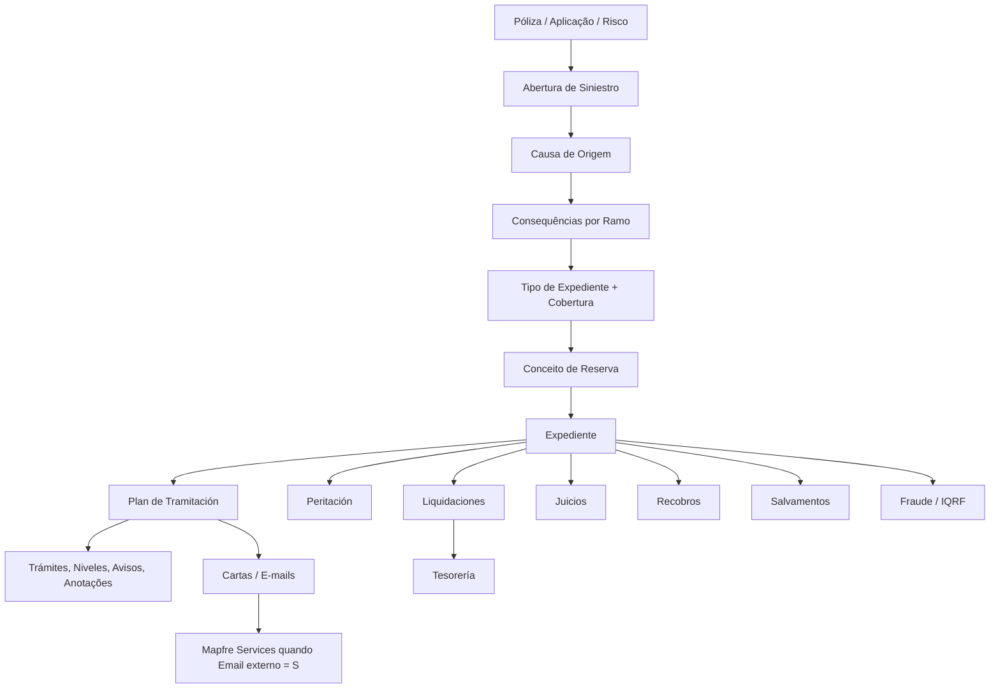
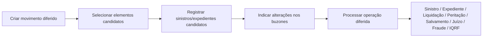
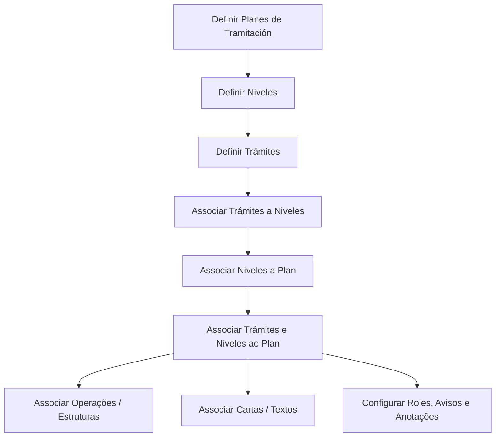

# Base de Conhecimento Corporativa — Reef.core: Definição, Operação e Processos Massivos de Siniestros

## 1. Metadados do Documento
- **Arquivo de Origem:** `Texto bruto fornecido na conversa`
- **Tipo de Documento:** Arquitetura funcional, especificação técnica e manual operacional
- **Domínio / Sistema:** Reef.core — módulo de Siniestros, Expedientes, Liquidaciones e Plan de Tramitación
- **Público-Alvo:** Arquitetos, desenvolvedores, analistas funcionais, operadores, tramitadores e supervisores
- **Data/Versão Identificada:** Não identificada; o conteúdo aparece como `Approved` e contém seções `EN CONSTRUCCIÓN`

---

## 2. Resumo Executivo & Contexto de Negócio

O conteúdo descreve a configuração funcional e parte do modelo técnico do módulo de **Siniestros** do Reef.core. O módulo trata o ciclo de vida de sinistros: abertura, validação, definição de causas e consequências, criação de expedientes, reservas, liquidações, peritagens, recobros, juízos, salvamentos, fraude, IQRF e planos de renda mensal.

A operação é altamente parametrizável por companhia, setor, ramo, tipo de expediente, cobertura, conceito de reserva, atividade de terceiro e plano de tramitação. Diversos comportamentos podem ser definidos por valores diretos, parâmetros genéricos ou lógicas de negócio, permitindo adaptações a regulamentações, produtos e regras específicas de cada instalação.

O **Plan de Tramitación** é o eixo operacional para conduzir expedientes desde a abertura até o encerramento. Ele organiza níveis, trámites, operações, avisos, anotações, documentos, confirmações do tramitador, permissões e datas de controle. O plano também suporta integrações com módulos internos e ferramentas externas, como gestor documental e envio de comunicações.

O documento também apresenta processos massivos diferidos. Esses processos permitem selecionar sinistros, expedientes, liquidações e outros elementos candidatos, informar alterações em “buzones” técnicos e executar operações em lote, tais como abertura, modificação, liquidação, peritagem, salvamento, juízo, fraude e IQRF.

> **Nota de Análise:** O texto menciona Reef.core repetidamente e, em alguns trechos extraídos, aparecem referências duplicadas ou aparentemente corrompidas como “Reef.core y Reef.core”. O material não detalha versões, APIs HTTP, contratos JSON, URLs, portas ou arquitetura de infraestrutura.

---

## 3. Arquitetura, Componentes & Tecnologias Envolvidas

### Componentes funcionais identificados

| Componente | Função sustentada pelo documento |
| :--- | :--- |
| Reef.core | Sistema que suporta configuração e operação de sinistros. |
| Módulo de Siniestros | Gerencia abertura, modificação, reabilitação e encerramento de sinistros. |
| Expedientes | Representam tipos de dano associados a um sinistro, com cobertura, reserva, pagamentos e tramitação. |
| Plan de Tramitación | Organiza a gestão do expediente por níveis, trámites, operações, avisos e anotações. |
| Liquidaciones | Geração, retificação e anulação de ordens de pagamento. |
| Peritación | Solicitação, resultado, danos e ordens de reparação. |
| Juicios | Gestão de processos judiciais relacionados a um ou mais sinistros/expedientes. |
| Recobros | Recuperação econômica, franquia/dedutível ou salvamento material. |
| Salvamentos | Gestão de inventários, leilões, vendas, liberações e anulações. |
| Facturación | Tratamento de documentos/faturas e conceitos econômicos. |
| Control Técnico | Pode reter sinistros, expedientes ou conceitos, influenciando liquidações. |
| IQRF | Módulo citado para incidências, queixas, reclamações e felicitações. |
| Fraude | Módulo citado para criação e modificação de fraude em sinistro ou expediente. |
| Tesorería | Origem de definições de documentos de pagamento e conceitos de cobrança/pagamento. |
| Mapfre Services | Sistema externo citado para envio de e-mail quando `Email externo = S`. |
| Gestor Documental | Ferramenta externa citada como acessível a partir do Plan de Tramitación. |
| CALL CENTER / Centro Telefónico | Contexto de consulta e possível abertura/atribuição de sinistros. |



### Fluxo de processo massivo diferido



---

## 4. Regras de Negócio, Especificações Funcionais & Processos

### 4.1 Configuração geral de sinistros

- A abertura de expediente pode exigir causas de abertura; quando a propriedade estiver ativa, as causas correspondentes devem estar previamente definidas.
- A mudança de avaliação de um expediente pode exigir causas de mudança de avaliação.
- A anulação de uma liquidação que provoque mudança de avaliação também pode exigir causa específica.
- O Plan de Tramitación pode utilizar datas de controle. A data de controle é calculada a partir da ativação do trámite e do número de dias configurado.
- O cálculo de datas pode considerar feriados e férias do tramitador. Quando calendários não são usados, todos os dias são considerados úteis.
- Papéis podem restringir quais tramitadores executam determinados trámites, programas, comunicações, finalizações, adiamentos ou modificações de data de controle.
- Um juízo pode ou não estar associado a vários sinistros, conforme configuração.
- Faturamento múltiplo pode distribuir proporcionalmente uma fatura entre vários expedientes.
- É possível permitir a liquidação de honorários e gastos quando a indenização está retida por controle técnico.
- O registro de faturas pode validar se o conceito de cobrança/pagamento pertence à atividade da fatura.

### 4.2 Abertura de sinistro

1. Informar data e, quando aplicável, hora de ocorrência.
2. Informar data e, quando aplicável, hora de notificação.
3. Validar que datas futuras só sejam aceitas quando a propriedade por ramo permitir.
4. Identificar póliza, aplicação e risco afetados.
5. Validar vigência de póliza, aplicação e risco na data do sinistro, salvo exceções configuradas.
6. Tratar suplementos temporais segundo a configuração aplicável.
7. Informar causa de origem do sinistro.
8. Informar evento catastrófico, quando pertinente.
9. Informar contato, se aplicável.
10. Solicitar estruturas adicionais antes das consequências.
11. Solicitar consequências permitidas para a causa e ramo.
12. Solicitar estruturas adicionais posteriores às consequências.
13. Propor ou abrir expedientes segundo causa, consequência, tipo, cobertura, reserva e regras de abertura automática.

### 4.3 Extemporaneidade

Um sinistro pode ser considerado extemporâneo quando a diferença entre a data de ocorrência e a data de denúncia/notificação ultrapassa o número máximo de dias definido para setor e ramo. A configuração pode usar setor e ramo genéricos.

A validação de extemporaneidade não é obrigatória. A propriedade `Valida Extemporaneidad` pode ser configurada como:
- `1: Sí`
- `2: No`
- `3,4: Lógica de Negocio`

Exceções mencionadas:
- Cliente VIP pode não sofrer controle de extemporaneidade.
- Determinado ramo pode não validar extemporaneidade, mas reter o sinistro para autorização ou rejeição.

### 4.4 Causas, consequências e expedientes

- Apenas causas do tipo **Origem do Siniestro** são associadas a consequências.
- Uma causa não tramitável impede a solicitação de consequências e a abertura de expedientes até que seja substituída por causa tramitável.
- Para uma causa de origem, apenas uma causa pode ser selecionada; para outros tipos de causa, várias podem ser selecionadas.
- Consequências são associadas por ramo e apresentam ordem de exibição.
- Cada combinação de causa, consequência, tipo de expediente, cobertura e conceito de reserva pode definir importe inicial, lógica de importe inicial e lógica de importe máximo.
- Duas consequências podem afetar o mesmo tipo de expediente, cobertura e conceito de reserva, mas serão excludentes.
- Quando duas consequências afetam o mesmo expediente e cobertura, mas conceitos de reserva diferentes, o sistema abre um único expediente contendo ambos os conceitos.

### 4.5 Tipos de expediente e recobros

- Um tipo de expediente identifica uma tipologia de dano.
- O tipo de expediente pode ser positivo ou negativo, e o sistema controla a coerência do sinal do importe final.
- O tipo pode ser desabilitado para impedir novas aberturas.
- Um recobro só pode ser aberto se existir previamente um expediente de não-recobro ao qual possa ser associado.
- Tipos de recobro:
  - `R`: recuperação econômica.
  - `D`: recuperação de dedutível/franquia.
  - `S`: salvamento ou recuperação material.
- Recobros podem ser abertos automaticamente quando a configuração do ramo e do tipo de expediente permitir.
- Um recobro pode ser associado a vários expedientes de não-recobro.

### 4.6 Reservas e conceitos econômicos

- Conceitos de reserva classificam valores provisionados em indenização, honorários ou gastos.
- Conceitos de pagamento são definidos posteriormente e associados aos conceitos de reserva.
- A reserva inicial pode ser fixa ou calculada por lógica de negócio.
- Caso não exista lógica de importe máximo, o documento indica que o máximo é interpretado como o capital da cobertura.
- A lógica de importe máximo pode ser aplicada também às liquidações.
- A avaliação ajustada determina se o tramitador pode informar manualmente uma reserva inicial ou se deve usar a reserva média previamente definida.

### 4.7 Plan de Tramitación

O Plan de Tramitación é uma guia operacional para o tramitador e para o supervisor. Um plano contém níveis; níveis agrupam trámites da mesma natureza; trámites representam passos de processo.

Fluxo de configuração:



Regras relevantes:
- Níveis ou trámites associados a um plano não são necessariamente obrigatórios.
- Níveis e trámites podem ser marcados como iniciais ou opcionais.
- Um nível com apenas um trámite deve ter esse trámite como inicial.
- Um trámite pode existir em vários níveis e em vários planos.
- Um mesmo código de plano pode ser associado a tipos de expediente de ramos diferentes se a tramitação for equivalente.
- Datas de controle só podem ser configuradas se a propriedade corporativa correspondente estiver ativa.
- Avisos podem ser disparados por número de dias após ativação de um trámite.
- A conclusão automática de um trámite pode ser definida diretamente ou por lógica de negócio.
- Trámites podem ser habilitados para execução mesmo após a conclusão do expediente, conforme configuração.

### 4.8 Confirmação do tramitador

A ferramenta de confirmação permite que o tramitador responda `Sí` ou `No`, registrando observações. O requisito explícito é que o trámite tenha uma estrutura registrada, vinculada à agrupação de trámites, com o programa `AS750000`.

A associação de pergunta a trámite considera:
- Setor, inclusive genérico.
- Ramo, inclusive genérico.
- Trámite.
- Pergunta apresentada.
- Lógica executada após confirmação.

A lógica posterior pode, por exemplo:
- Inserir trámite para abertura de recobro de salvamento após confirmação de perda total.
- Inserir trámite para envio de carta solicitando documentos faltantes quando a resposta for negativa.

### 4.9 Liquidações

Uma liquidação define:
- Quem receberá o pagamento.
- Como será pago.
- O que será pago.
- Quanto será pago.

O processo contempla dados do beneficiário, documento de pagamento, emissor, dados de pagamento, estruturas adicionais opcionais e importes.

Principais controles:
- Cálculo de impostos pode ser ativado por `1: Sí`, `2: No`, `3: Procedimiento` ou `4: Función`.
- A liquidação com reserva zero pode ser permitida ou negada por configuração/lógica.
- Liquidação acima do valor avaliado pode ser permitida; caso seja permitida, o documento afirma que a liquidação executa ajuste automático de avaliação.
- Pode haver bloqueio de outras liquidações enquanto existirem ordens de reparação pendentes.
- Ordens podem ser excluídas do pagamento automático.
- A autorização para tesouraria pode ser direta ou definida por lógica.
- A necessidade de abrir recobro pode ser perguntada durante a liquidação.
- A retificação de liquidações de meses anteriores pode ser configurável.
- A anulação de ordem de pagamento pode restaurar ou não a reserva.

### 4.10 Eventos catastróficos

- Eventos catastróficos agrupam sinistros relacionados a determinado evento.
- O sistema valida, na abertura e modificação, se a data de ocorrência está dentro do período do evento.
- O sistema valida se a notificação ocorre até a data-limite de denúncia do evento.
- O documento afirma que o CORE não valida se o local do sinistro corresponde à localização do evento; essa validação poderia ser implementada em estrutura do local ou em controle técnico.

### 4.11 Processos massivos diferidos

Um processo massivo possui três fases:
1. Criar movimento diferido.
2. Selecionar elementos candidatos.
3. Indicar alterações aos elementos candidatos.

Operações mencionadas incluem abertura, modificação, encerramento e reabilitação de sinistros e expedientes; avaliação; liquidação; avisos; anotações; níveis; trámites; reatribuição de tramitador; planos de renda; peritagens; salvamentos; juízos; fraude e IQRF.

> **Nota de Análise:** Alguns códigos numéricos de tipo de movimento são exibidos, mas outros movimentos são listados sem código no texto extraído. Não é seguro inferir os códigos ausentes.

---

## 5. Tabelas de Parâmetros, Ambientes e Estruturas de Dados

### 5.1 Valores condicionais recorrentes

| Item / Parâmetro | Descrição / Função | Tipo / Valores / Formato | Ambiente / Observações |
| :--- | :--- | :--- | :--- |
| Decisão configurável | Indica comportamento direto ou dinâmico. | `1: Sí`, `2: No`, `3: Procedimiento`, `4: Función` ou `3,4: Lógica de Negocio`, conforme propriedade. | Usado em validações de sinistros e liquidações. |
| Setor genérico | Aplica definição a todos os setores. | `9999` | Usado em diversas configurações. |
| Ramo genérico | Aplica definição a todos os ramos. | `999` ou valor genérico descrito no catálogo específico. | O texto usa `999` em estruturas de informação e escritórios tramitadores. |
| Moeda da póliza | Faz o expediente usar a moeda da póliza. | `99` | Aplicável a tipo de expediente por ramo. |
| Tipo de recobro | Classifica um expediente de recobro. | `R`, `D`, `S` | R: econômico; D: dedutível; S: salvamento. |
| Finalização de pendientes | Define o que ocorre com itens do plano ao terminar expediente. | `N`, `D`, `A`, `T` | N: não finaliza nada; D: finaliza trámites definidos pendentes; A: finaliza avisos pendentes; T: finaliza tudo. |

### 5.2 Dados técnicos de processo massivo

| Item / Parâmetro | Descrição / Função | Tipo / Valores / Formato | Ambiente / Observações |
| :--- | :--- | :--- | :--- |
| `B7000910` | Tabela mestra de processos massivos de sinistros. | Tabela técnica | O texto a identifica como “MAESTRA PROCESOS MASIVO DE SINIESTROS”. |
| `FEC_TRATAMIENTO` | Data em que o processo massivo é executado. | Obrigatório | Processo massivo. |
| `TIP_MVTO_BATCH_STRO` | Tipo do movimento batch. | Obrigatório | Processo massivo. |
| `NUM_ORDEN` | Número do processo massivo. | Obrigatório | Diferencia processos criados na mesma data. |
| `TXT_ALIAS` | Nome ou descrição do processo. | Opcional | Exemplo: aberturas do centro telefônico de agosto. |
| `TIP_SITU` | Situação da linha/processo. | `1 - Sin Procesar` | Valor indicado para criação do processo. |
| `COD_CIA` | Companhia. | Obrigatório | Processo massivo. |
| `COD_SECTOR` | Setor. | Obrigatório | Processo massivo. |
| `COD_RAMO` | Ramo. | Obrigatório | Processo massivo. |
| `NUM_SINI_REF` | Sinistro de referência de outros sistemas. | Obrigatório | Elementos candidatos. |
| `NUM_SINI` | Número de sinistro. | Obrigatório | Elementos candidatos. |
| `NUM_EXP` | Número de expediente. | Obrigatório | Elementos candidatos. |
| `NUM_LIQ_REF` / `NUM_LIQ` | Liquidação de referência / número de liquidação. | Obrigatório | Elementos candidatos. |
| `SUB_TIP_TRAMITE` | Tipo de trámite. | Obrigatório | Elementos candidatos. |
| `COD_USR_CAPTURA` | Usuário que simula a captura. | Obrigatório | Elementos candidatos. |
| `COD_USR` | Usuário que atualizou a linha. | Obrigatório | Elementos candidatos. |
| `FEC_ACTU` | Data de atualização da linha. | Obrigatório | Elementos candidatos. |

### 5.3 Buzón técnico de dados fixos de sinistro

| Item / Parâmetro | Descrição / Função | Tipo / Valores / Formato | Ambiente / Observações |
| :--- | :--- | :--- | :--- |
| `B7000900` | Buzón de dados fixos do sinistro. | Tabela técnica | Citada na visão técnica de criação de sinistro. |
| `FEC_SINI` | Data de ocorrência do sinistro. | Obrigatório | Criação de sinistro. |
| `FEC_DENU_SINI` | Data de notificação/denúncia. | Obrigatório | Criação de sinistro. |
| `HORA_SINI` | Hora de ocorrência. | Opcional | Pode ser obrigatória conforme ramo. |
| `COD_CAUSA_SINI` | Causa do sinistro. | Obrigatório | Causa de origem. |
| `COD_EVENTO` | Evento catastrófico originador. | Opcional | Requer evento previamente definido. |
| `NOM_CONTACTO` / `APE_CONTACTO` | Nome e sobrenome do contato. | Opcional | Pessoa de contato. |
| `TEL_PAIS_CONTACTO` | País do telefone de contato. | Opcional | Pessoa de contato. |
| `TEL_ZONA_CONTACTO` | Área/zona do telefone. | Opcional | Pessoa de contato. |
| `TEL_NUMERO_CONTACTO` | Número de telefone. | Opcional | Pessoa de contato. |
| `EMAIL_CONTACTO` | E-mail da pessoa de contato. | Opcional | Pessoa de contato. |
| `TIP_DOCUM_CONTACTO` | Tipo de documento do contato. | Opcional | Pessoa de contato. |
| `COD_DOCUM_CONTACTO` | Código/documento do contato. | Opcional | Pessoa de contato. |
| `TIP_RELACION` | Relação com o segurado. | Opcional | Pessoa de contato. |
| `MCA_CULPABLE` | Indicador de culpabilidade. | Opcional | Sinistro. |
| `HORA_DENU_SINI` | Hora da denúncia/notificação. | Opcional | Sinistro. |
| `IMP_VAL_INI_SINI` | Estimativa de avaliação do sinistro. | Opcional | Sinistro. |
| `NUM_SINI_REF_MOD` | Sinistro de referência externo para modificação. | Opcional | Sinistro. |
| `TXT_CNH_CLR` | Meio de contato móvel. | Opcional | Sinistro. |
| `TXT_CNH_TLP` | Meio de contato telefone. | Opcional | Sinistro. |
| `TXT_CNH_EML` | Meio de contato e-mail. | Opcional | Sinistro. |

### 5.4 Operações massivas explicitamente enumeradas

| Código / Operação | Descrição / Função | Tipo / Valores / Formato | Ambiente / Observações |
| :--- | :--- | :--- | :--- |
| Abertura de Siniestro | Abre sinistro e tenta abrir expedientes. | Operação diferida | Executa abertura de sinistro. |
| Modificación de Siniestro | Modifica dados de sinistro. | Operação diferida | Executa modificação de sinistro. |
| Terminación de Siniestro | Encerra sinistros sem expedientes. | Operação diferida | Executa encerramento de sinistro. |
| `14` Rehabilitación de Siniestro | Reabilita sinistro encerrado para incluir novo expediente. | Operação diferida | Executa reabilitação de sinistro. |
| `20` Apertura de Expediente desde Batch | Abre expediente com avaliação média. | Operação diferida | Executa abertura e criação de avaliação. |
| `21` Apertura de Expediente | Abre expediente com avaliação média. | Operação diferida | Executa abertura e criação de avaliação. |
| `30` Liquidación de Expediente | Gera liquidação/ordem de pagamento. | Operação diferida | Executa liquidação. |
| `31` Rectificación de Liquidación | Modifica liquidação não paga. | Operação diferida | Executa modificação de liquidação. |
| `32` Anulación de Liquidación | Anula liquidação não paga. | Operação diferida | Executa anulação de liquidação. |
| `33` Justificante suelto | Gera liquidação para expediente encerrado. | Operação diferida | Executa geração de liquidação. |
| `46` Finalizar Trámite Pendiente | Finaliza trámite pendente do plano. | Operação diferida | Plan de Tramitación. |
| `50` Plan de Renta Mensual | Cria plano de renda mensal em expediente. | Operação diferida | P.R.M. |
| `60` Solicitud y Resultado de la Peritación | Cria ou altera solicitação/resultado de peritagem. | Operação diferida | Peritación. |
| `61` Crear/Modificar Detalle de daños | Cria ou modifica detalhe de danos. | Operação diferida | Peritación. |
| `62` Crear Órdenes de Reparación | Cria ou modifica ordem de reparação. | Operação diferida | Peritación. |
| `70` Entrada y Salida de Inventario | Cria entrada ou saída de inventário. | Operação diferida | Salvamentos. |
| `71` Actualización del Inventario | Cria ou modifica salvamento/inventário. | Operação diferida | Salvamentos. |
| `72` Crear y Modificar Subastas | Cria ou modifica leilão. | Operação diferida | Salvamentos. |
| `73` Selección/Asociación de Inventarios | Associa sinistro/expediente a inventário e inventário a leilão. | Operação diferida | Salvamentos. |
| `74` Anulación de inventario | Anula inventário. | Operação diferida | Salvamentos. |
| `76` Liberación Salvamento | Libera inventário para associação a outro leilão. | Operação diferida | Salvamentos. |
| `77` Venta del Inventario | Registra inventário como vendido. | Operação diferida | Salvamentos. |
| `80` Siniestros judiciales | Cria ou modifica dados de demanda de juízo. | Operação diferida | Juicios. |
| `81` Crear Datos de la Sentencia | Cria ou modifica dados de sentença. | Operação diferida | Juicios. |

---

## 6. Bateria de Perguntas & Respostas para RAG (FAQ Sintético)

### P1: Como o Reef.core decide se um sinistro é extemporâneo?
**R:** O Reef.core compara a data de ocorrência do sinistro com a data de denúncia ou notificação à companhia. Se a diferença ultrapassar o número máximo de dias configurado por setor e ramo, o sinistro é considerado extemporâneo. A validação depende da propriedade por ramo `Valida Extemporaneidad`, que pode ser `Sí`, `No` ou uma lógica de negócio.

### P2: É possível abrir um sinistro sem abrir os tipos de expediente obrigatórios?
**R:** Sim, se a propriedade do ramo `Aperturar Siniestro sin Tipos de Expedientes Obligatorios` permitir. O documento indica que isso pode ser usado para criar um controle técnico e manter o sinistro retido, em vez de impedir o seu registro. A decisão também pode ser controlada por lógica de negócio.

### P3: Quando um recobro pode ser aberto?
**R:** Um expediente de recobro só pode ser aberto quando existir previamente um expediente de não-recobro ao qual ele possa ser associado. Recobros podem ser de recuperação econômica (`R`), recuperação de dedutível/franquia (`D`) ou salvamento material (`S`).

### P4: Como funciona a moeda de um tipo de expediente?
**R:** A moeda é definida por tipo de expediente e ramo. Se for informado o valor `99`, o sistema utiliza a moeda da póliza. A propriedade `Moneda Única` define se o tramitador pode alterar a moeda na abertura do expediente. A moeda do expediente é independente da moeda usada posteriormente em pagamentos.

### P5: O que acontece se duas consequências afetarem a mesma cobertura e o mesmo tipo de expediente?
**R:** Se duas consequências afetarem o mesmo tipo de expediente, cobertura e conceito de reserva, elas serão excludentes e não poderão ser selecionadas simultaneamente. Se afetarem o mesmo tipo e cobertura, porém conceitos de reserva distintos, o sistema abre um único expediente com os diferentes conceitos de reserva.

### P6: Qual é o requisito técnico para usar a Confirmação do Tramitador?
**R:** O trámite deve possuir uma estrutura registrada na tabela de estruturas, associada à agrupação de trámites, e essa estrutura deve ter o programa `AS750000` associado. A pergunta é configurada por setor, ramo e trámite, podendo acionar uma lógica de negócio após a resposta do tramitador.

### P7: Como são calculadas as datas de aviso e de controle no Plan de Tramitación?
**R:** A data é calculada a partir da data de ativação, somando-se o número de dias definido para o aviso ou para a data de controle. Se estiver ativa a configuração de uso de calendários, o cálculo considera feriados e férias do tramitador como dias não úteis.

### P8: Uma liquidação pode ultrapassar a reserva avaliada?
**R:** Pode, se a propriedade correspondente permitir ou se uma lógica de negócio retornar essa permissão. O documento informa que, quando permitido, a liquidação realiza ajuste automático da avaliação se o importe da liquidação for superior ao importe avaliado. Algumas companhias podem exigir uma mudança de avaliação prévia.

### P9: O que ocorre ao anular uma ordem de pagamento?
**R:** A restauração da reserva depende da configuração `¿Se restaura la reserva si se anula la orden de pago?`. Ela pode ser `Sí`, `No`, procedimento ou função. Quando configurada como lógica, a lógica de negócio determina se a reserva aumenta pelo valor da liquidação anulada.

### P10: O CORE valida se o evento catastrófico ocorreu no local do sinistro?
**R:** Não. O documento afirma explicitamente que o CORE não controla se o evento ocorreu no local de ocorrência do sinistro. Essa validação pode ser implementada na estrutura do local do sinistro, quando há evento associado, ou em um controle técnico.

### P11: Como são atribuídos tramitadores a expedientes?
**R:** A atribuição pode ser definida por lógica de negócio. A lógica de núcleo se apoia em catálogos de definição de tramitador, relação entre escritórios comerciais e tramitadores, especialização dos tramitadores, carga pendente e número máximo de expedientes diários. A especialização pode considerar estruturas comerciais, produtos, setores, ramos, agentes, tipos de expediente, juízos, perda total, exterior, clientes VIP e casos Mapfre-Mapfre.

### P12: Quais são as etapas de um processo massivo de sinistros?
**R:** O processo massivo começa com a criação do movimento diferido. Depois são selecionados e registrados os elementos candidatos, como sinistros ou expedientes. Por fim, são informadas nos buzones as alterações ou dados necessários para criação/modificação. A execução posterior aplica a operação configurada aos elementos candidatos.

---

## 7. Glossário de Termos, Siglas & Conceitos-Chave

- **AS750000:** Programa que deve estar associado a uma estrutura para habilitar a ferramenta de Confirmação do Tramitador.
- **B7000900:** Buzón de dados fixos do sinistro.
- **B7000910:** Tabela mestra de processos massivos de sinistros.
- **CALL CENTER / Centro Telefónico:** Contexto operacional citado para abertura, consulta e atribuição de sinistros.
- **Cobertura:** Cobertura da apólice afetada por um tipo de expediente.
- **Concepto de Cobro y Pago Vario:** Detalhe econômico utilizado para cobrar ou pagar em liquidações; pode possuir impostos e retenções associados.
- **Concepto de Reserva:** Classificação da provisão econômica: indenização, honorários ou gastos.
- **Consecuencia:** Dano decorrente de uma causa de sinistro.
- **Control Técnico:** Mecanismo que pode reter sinistros, expedientes ou conceitos econômicos.
- **Expediente:** Registro de tipo de dano dentro de um sinistro, associado a cobertura, reservas e tramitação.
- **Extemporaneidad:** Situação em que a notificação ocorre após o prazo máximo definido entre ocorrência e denúncia.
- **IQRF:** Sigla usada para incidências, queixas, reclamações e felicitações.
- **Liquidación:** Ordem de pagamento associada a um expediente.
- **Lógica de Negocio:** Regra programável para decidir valores, validações, permissões, cálculos ou comportamentos.
- **Peritación:** Processo de perícia, incluindo solicitação, resultado, danos e ordens de reparação.
- **Plan de Renta Mensual / P.R.M.:** Plano de renda mensal aplicado a determinados expedientes.
- **Plan de Tramitación:** Estrutura que organiza a gestão de expedientes por níveis, trámites, operações e alertas.
- **Ramo:** Linha de negócio/ramo de seguro.
- **Recobro:** Recuperação de valores econômicos, franquia ou salvamento.
- **Salvamento:** Recuperação material e gestão de inventário, venda ou leilão de bens.
- **Sector:** Segmento usado para parametrização por produto/negócio.
- **Tramitador:** Usuário responsável pela gestão de expedientes.
- **Trámite:** Passo operacional em um processo do Plan de Tramitación.

---

## 8. Notas Críticas, Riscos & Limitações

- O texto contém várias seções marcadas como `EN CONSTRUCCIÓN`; essas seções não fornecem detalhe funcional ou técnico suficiente para especificação completa.
- O material cita imagens e diagramas de manutenção que não estão disponíveis no texto bruto extraído.
- Existem trechos repetidos, tabelas parcialmente corrompidas e palavras com caracteres ausentes na extração, como `de nir`, `nalidad` e `con guración`.
- O documento não fornece URLs, versões de produto, topologia de servidores, protocolos de integração, APIs, contratos JSON, portas ou credenciais.
- Diversos comportamentos dependem de `Lógica de Negocio`, mas o conteúdo não apresenta implementações, regras de decisão nem assinaturas técnicas dessas lógicas.
- O documento indica que a validação geográfica de eventos catastróficos não é realizada pelo CORE.
- A execução de processos massivos requer processos personalizados por instalação para seleção dos elementos candidatos.
- Alguns códigos de movimentos batch são exibidos sem padronização completa; não devem ser inferidos fora dos casos explicitamente apresentados.

---

## 9. Conteúdo Bruto Estruturado (Referência Fiel)

> **Nota de integridade:** O conteúdo bruto completo foi fornecido diretamente nesta conversa e é a fonte literal de auditoria. Abaixo estão os trechos técnicos mais estruturados do material; não foram criados valores, campos ou regras fora do texto recebido.

```text
# DEFINICIÓN de Extemporaneidad

La finalidad es definir para todos los ramos, el tiempo máximo que puede transcurrir
entre la fecha de ocurrencia del siniestro y la fecha de notificación o denuncia de
este, a la compañía.

Número Máximo de días:
Esta propiedad indica el número máximo de días que puede transcurrir entre la fecha
de ocurrencia y la fecha de denuncia o notificación a la compañía. Si el número de
días entre ambas fechas es superior al indicado en este atributo, el siniestro se
considerará extemporáneo, es decir fuera de plazo.

# DEFINICIÓN Tipo de Expediente

Los Recobros pueden ser de tres tipos:
R- Cuando son Recuperaciones Económicas
D- Cuando se va a recuperar el Deducible (Franquicia) de un asegurado
S- Cuando son Salvamentos (Recuperaciones Materiales)

# DEFINICIÓN Concepción de Reserva

| CONCEPTO RESERVA | CONCEPTO COBRO Y PAGO |
| 1 Indemnización | S01 Indemnización Asegurado |
| 1 Indemnización | S02 Indemnización Clínicas |
| 1 Indemnización | S03 Indemnización Talleres |
| 2 Honorarios | S04 Honorarios Abogados Externos |
| 2 Honorarios | S05 Honorarios Peritos Externos |
| 3 Gastos | S06 Gastos Abogados Externos |
| 3 Gastos | S07 Gastos Peritos Externos |

# DEFINICIÓN de Confirmación del Tramitador

Para que esto funcione hay que seguir varios pasos:
Definir Tipo de Pregunta
Asociar Preguntas a Trámite

Una vez que se active el trámite que tendrá asociado el programa de Confirmación
del Tramitador (AS750000), el Plan irá al catálogo para saber qué pregunta tiene
que hacer.

# CREAR proceso masivo en Siniestros

Proceso a seguir:
CREAR movimiento diferido
SELECCIONAR elementos candidatos
INDICAR cambios a elementos candidatos

# CREAR Siniestro - Evento - buzón (visión técnica)

TABLA: B7000900
DESCRIPCIÓN: BUZON DE DATOS FIJOS DEL SINIESTRO

| COLUMNA | OBLIGATORIA | COMENTARIO |
| FEC_SINI | SI | FECHA DE OCURRENCIA DEL SINIESTRO |
| FEC_DENU_SINI | SI | FECHA DE NOTIFICACION, DENUNCIA DEL SINIESTRO |
| HORA_SINI | NO | HORA DE OCURRENCIA DEL SINIESTRO |
| COD_CAUSA_SINI | SI | CAUSA DEL SINIESTRO |
| COD_EVENTO | NO | EVENTO CATASTRÓFICO QUE ORIGINÓ EL SINIESTRO |
| COD_USR | SI | USUARIO QUE ACTUALIZÓ LA FILA |
| FEC_ACTU | SI | FECHA DE ACTUALIZACIÓN DE LA FILA |
| NUM_ORDEN | SI | NÚMERO DEL PROCESO MASIVO |

# DOCUMENTACIÓN - SINIESTROS

La información se encuentra dividida en:
Definición
Operación
Modelo de datos

DEFINICIÓN:
Documentos que detallan aquellos conceptos que se han de definir y el orden que se
ha de seguir para conseguir la definición necesaria con lo que poder operar un módulo funcional.

OPERACIÓN:
Documentos relacionados con las operaciones funcionales que el módulo soporta.

MODELO DE DATOS:
Documentación orientada hacia las tablas de la aplicación. Adicionalmente, se describe
con detalle el movimiento de distintos elementos como tablas y columnas atendiendo
a las operaciones funcionales.
```
