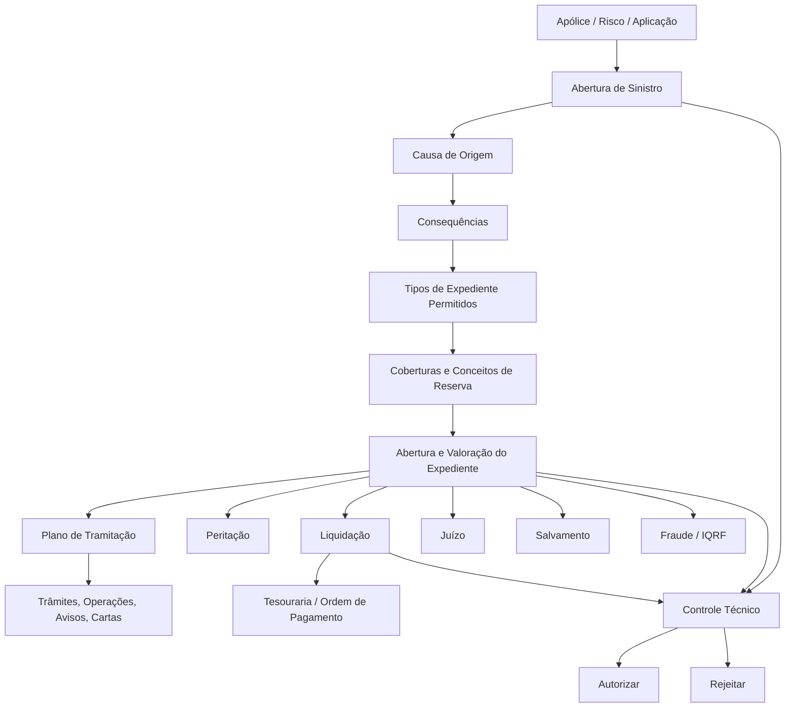
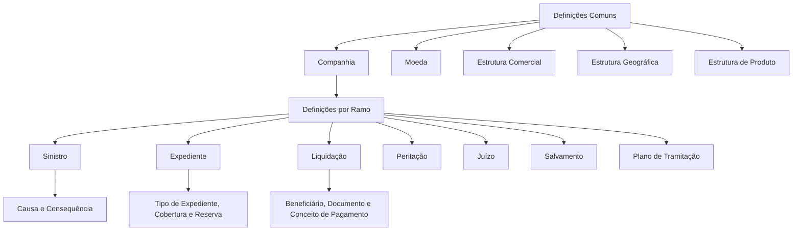
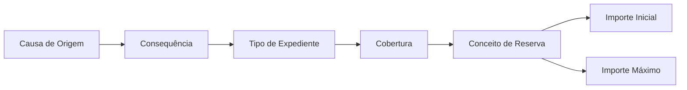
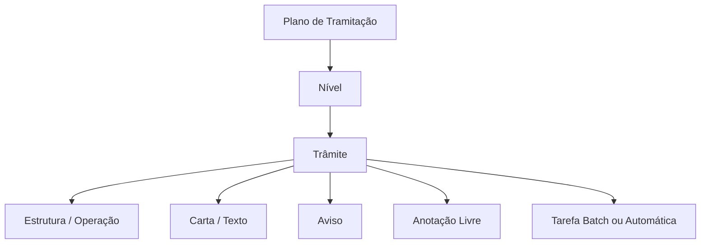
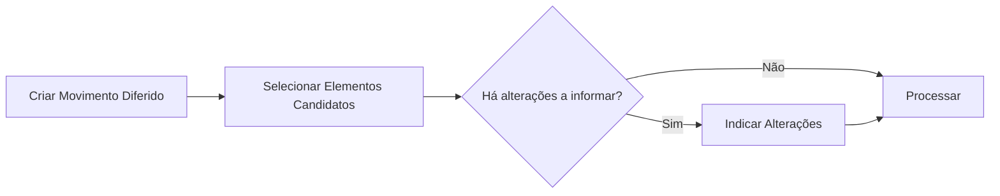

# Reef.core — Definição, Operação e Configuração do Módulo Corporativo de Sinistros

## 1. Metadados do Documento
- **Arquivo de Origem:** Não identificado no texto extraído
- **Tipo de Documento:** Manual Operacional, Especificação Funcional e Arquitetura de Configuração
- **Domínio / Sistema:** Reef.core / documentação Reef / módulo de Siniestros (Sinistros)
- **Público-Alvo:** Analistas funcionais, arquitetos, desenvolvedores, configuradores, tramitadores, supervisores e operação
- **Data/Versão Identificada:** Não identificada; ciclo de vida indicado como `Approved`

---

## 2. Resumo Executivo & Contexto de Negócio

O documento descreve a configuração funcional do módulo corporativo de **Sinistros** do sistema **Reef.core**. O módulo suporta o ciclo completo de sinistros de seguros: abertura, alteração, valoração ou reserva, liquidação, encerramento, reabilitação, perícia, juízos, salvamentos, fraude, IQRF, plano de renda, serviços e processos massivos.

A arquitetura funcional é altamente parametrizável por companhia, setor, ramo, tipo de expediente, causa, consequência, cobertura, conceito de reserva, terceiro, atividade e plano de tramitação. Regras que não podem ser expressas por parâmetros estáticos podem ser implementadas como **Lógicas de Negócio**, incluindo validações, valores iniciais, visibilidade, obrigatoriedade, cálculo de valores, atribuição de responsáveis e autorização de operações.

O processo operacional central começa com a abertura de um sinistro associado a uma apólice, risco ou aplicação. A partir da causa de origem e das consequências selecionadas, o sistema determina os tipos de expediente possíveis, coberturas, conceitos de reserva, valores iniciais e máximos. Os expedientes podem ser conduzidos por planos de tramitação compostos por níveis, trâmites, operações, cartas, avisos e anotações.

O documento também define controles críticos: extemporaneidade, vigência de apólice, vigência de risco ou aplicação, suplementos temporários, conceitos obrigatórios, limites de reserva e liquidação, retenções por controle técnico, regras para documentos, impostos, pagamentos, recobros e acesso baseado em papéis.

> **Nota de Análise:** O material apresenta um modelo funcional e configuracional extenso, mas não especifica APIs HTTP, contratos JSON, versões de software, endereços de ambientes, portas de rede ou topologia física de infraestrutura.

---

## 3. Arquitetura, Componentes & Tecnologias Envolvidas

### Componentes funcionais identificados

| Componente | Responsabilidade |
| :--- | :--- |
| Reef.core | Plataforma central de gestão de sinistros e módulos associados |
| Módulo de Sinistros | Abertura, modificação, consulta, encerramento e reabilitação de sinistros |
| Módulo de Expedientes | Gestão dos danos ou tipos de expediente derivados de um sinistro |
| Plano de Tramitação | Organização das atividades, níveis, trâmites, avisos, cartas e operações de um expediente |
| Liquidações | Geração, alteração, anulação e consulta de ordens de pagamento |
| Peritações | Solicitação, resultado, danos, ordem de reparação e consulta de perícias |
| Juízos | Gestão de demandas, sentenças, intervenções e associação de expedientes |
| Salvamentos | Gestão de inventários, leilões, venda, liberação e anulação de salvados |
| Fraude | Registro, alteração e consulta de fraude em sinistros ou expedientes |
| IQRF | Gestão de Incidência, Queixa, Reclamação ou Felicitação |
| Plano de Renda Mensal | Criação, anulação, término e consulta de planos de renda |
| Serviços | Ordens, serviços, agendamentos, bloqueios, notificações e estados de fornecedores |
| Controle Técnico | Retenção, autorização ou rejeição de operações |
| Processos Massivos | Execução diferida de operações em sinistros, expedientes e demais entidades |
| Tesouraria | Definição de documentos de pagamento, conceitos de cobrança/pagamento, impostos e ordens de pagamento |
| Estrutura Comercial | Relação entre escritórios comerciais, escritórios tramitadores, supervisores e tramitadores |
| Estrutura Geográfica | Localização de eventos catastróficos e demais parametrizações geográficas |



### Camadas de configuração identificadas



---

## 4. Regras de Negócio, Especificações Funcionais & Processos

### 4.1 Características gerais de sinistros

- É possível exigir causas na abertura de expedientes, na alteração de valoração e na anulação de liquidações que alterem a valoração.
- O Plano de Tramitação pode operar com **datas de controle**. A data de controle representa o prazo em que um trâmite deve ser concluído.
- O cálculo de datas do Plano de Tramitação pode considerar feriados e férias do tramitador.
- A utilização de papéis no Plano de Tramitação pode restringir trâmites, programas, comunicações, finalizações, atrasos, modificações de data de controle, inclusão de trâmites e inclusão de níveis.
- Um juízo pode ser associado a um ou vários sinistros, dependendo da configuração.
- Faturamento múltiplo pode permitir distribuição proporcional automática de valores entre expedientes.
- É possível liquidar Honorários e Gastos quando o conceito de Indenização está retido por Controle Técnico, caso a regra correspondente permita.
- O registro de faturas pode validar se o conceito de cobrança e pagamento está configurado para a atividade da fatura.

### 4.2 Extemporaneidade

A extemporaneidade corresponde ao tempo transcorrido entre a data de ocorrência do sinistro e a data de notificação ou denúncia à companhia.

- A validação é configurada por setor e ramo.
- O número máximo de dias determina quando um sinistro passa a ser considerado fora de prazo.
- A validação pode ser desligada por ramo ou depender de Lógica de Negócio.
- O documento cita exceções para clientes VIP e casos em que o sinistro pode permanecer retido para autorização ou rejeição.

### 4.3 Abertura de sinistro

Na abertura de sinistro, o sistema pode solicitar:

1. Identificação do sinistro.
2. Data e hora de ocorrência.
3. Data e hora de notificação.
4. Apólice, aplicação e risco.
5. Evento catastrófico.
6. Motivo ou causa do sinistro.
7. Estimativa global do sinistro, quando configurada.
8. Pessoa de contato ou intervenção externa.
9. Atributos anteriores às consequências.
10. Consequências.
11. Atributos posteriores às consequências.

Regras relevantes:

- A data de ocorrência não pode ser futura, exceto se a configuração do ramo permitir.
- A data de notificação não pode ser superior à data atual.
- Se a data de notificação for a data atual, a hora não pode ser futura.
- A apólice, aplicação ou risco deve estar vigente na data de ocorrência, salvo exceções configuradas.
- Suplementos temporários podem ser considerados ou ignorados de acordo com as definições do ramo.
- Causas de origem não tramitáveis impedem a solicitação de consequências e a abertura de expedientes.
- Apenas uma causa de origem do sinistro pode ser selecionada; outros tipos de causa podem admitir múltiplas seleções.

### 4.4 Tipos de expediente

Um tipo de expediente representa uma tipologia de dano derivada de um sinistro.

- Um tipo de expediente pode ser usado em um ou vários ramos.
- Pode ser positivo ou negativo, controlando o sinal do valor final.
- Pode estar habilitado ou inabilitado para novas aberturas.
- Pode ser classificado como recobro.
- Recobros podem ser:
  - `R`: Recuperação econômica.
  - `D`: Recuperação de dedutível ou franquia.
  - `S`: Salvamento ou recuperação material.
- Um expediente de recobro sempre deve estar associado a um expediente não-recobro previamente aberto.
- O tipo de expediente pode ser único por sinistro.
- A moeda pode ser fixa ou configurada como `99`, indicando que deve ser usada a moeda da apólice.
- A moeda do expediente é independente da moeda dos pagamentos posteriores.

### 4.5 Relação entre causa, consequência, expediente, cobertura e reserva

A abertura de expedientes é determinada pela combinação:



- O sistema apresenta somente tipos de expediente configurados para a causa e consequência selecionadas.
- As coberturas devem estar contratadas no risco sinistrado na data do sinistro.
- Um tipo de expediente pode possuir uma ou várias coberturas.
- Um conceito de reserva deve estar previamente associado ao tipo de expediente e à cobertura.
- Consequências que afetem o mesmo tipo de expediente, cobertura e conceito de reserva são mutuamente excludentes.
- Se duas consequências afetarem o mesmo tipo de expediente e cobertura, mas conceitos de reserva diferentes, o sistema abre um único expediente com ambos os conceitos de reserva.

### 4.6 Reserva e valoração

Os conceitos de reserva estruturam economicamente os valores provisionados em expedientes.

- `I`: Indenização.
- `H`: Honorários.
- `G`: Gastos.

A configuração pode definir:

- Valor inicial de reserva.
- Lógica para cálculo do valor inicial.
- Lógica para cálculo do valor máximo.
- Aplicação do valor máximo também nas liquidações.
- Ajuste manual da reserva inicial pelo tramitador.
- Inclusão ou exclusão do expediente no cálculo de reservas de fim de mês.
- Regras de reserva em recobros e regras de valoração a partir do expediente principal.

### 4.7 Plano de Tramitação

O Plano de Tramitação é uma estrutura de gestão do expediente desde a abertura até o encerramento.



Processo de definição:

1. Definir planos de tramitação.
2. Definir níveis.
3. Definir trâmites.
4. Associar trâmites aos níveis.
5. Associar níveis ao plano.
6. Associar combinações de plano, nível e trâmite.

O plano pode incluir:

- Operações de sinistros.
- Funcionalidades de outros módulos.
- Cartas, textos e e-mails.
- Avisos.
- Anotações livres.
- Confirmações do tramitador.
- Papéis.
- Datas de controle.
- Restrições de acesso.
- Observações registradas após a execução de operações.

### 4.8 Confirmação do tramitador

A funcionalidade de confirmação do tramitador permite que um trâmite faça uma pergunta e registre:

- Confirmação positiva ou negativa.
- Comentários do tramitador.
- Lógica posterior dependente da resposta.

Requisito técnico-funcional:

- O trâmite deve possuir uma estrutura cadastrada.
- A estrutura deve ter o programa `AS750000` associado.
- A estrutura deve estar associada à agrupação de trâmites.

Exemplos citados:

- Confirmação de que apólice e recibos estão corretos.
- Confirmação de perda total.
- Confirmação de documentação recebida.
- Inserção de trâmite para recobro de salvamento após confirmação de perda total.
- Inserção de carta de solicitação de documentos quando a confirmação for negativa.

### 4.9 Liquidações

Uma liquidação representa uma ordem de pagamento vinculada a um expediente.

A geração de uma liquidação considera:

1. Sinistro.
2. Expediente.
3. Liquidação de referência, quando aplicável.
4. Beneficiário.
5. Documento de pagamento.
6. Emissor do documento.
7. Dados de pagamento.
8. Informação adicional opcional.
9. Valores econômicos.

Regras relevantes:

- Liquidação pode ser criada para expediente terminado.
- Liquidação pode ser modificada ou anulada apenas se não estiver paga.
- Pode haver validações para documento, data, moeda, escritório pagador e emissor.
- Impostos podem ser calculados, não calculados ou determinados por procedimento/função.
- Pode ou não ser permitido liquidar valor quando a valoração é zero.
- Pode ou não ser permitido liquidar valor superior à valoração existente.
- Pode ou não ser permitido deixar a reserva em zero em liquidações parciais.
- Pode ser configurado se a ordem de pagamento participa do pagamento automático.
- A ordem pode sair autorizada para Tesouraria ou exigir autorização.
- Pode haver regra para restaurar a reserva quando uma ordem é anulada.
- Pode haver regras para retificação de liquidações de meses anteriores.

### 4.10 Controle Técnico

O Controle Técnico pode reter operações para autorização ou rejeição.

| Operação retida | Efeito da autorização | Efeito da rejeição |
| :--- | :--- | :--- |
| Abertura de sinistro | O sinistro passa a existir para o Reef.core | O sinistro não existe para o Reef.core |
| Modificação de sinistro | A modificação é reconhecida | A alteração não é reconhecida |
| Reabilitação de sinistro | O sinistro volta ao estado pendente | O sinistro permanece terminado |
| Abertura de expediente | O expediente é reconhecido | O expediente não existe |
| Alteração de valoração | A nova valoração é reconhecida | A valoração anterior é mantida |
| Reabilitação de expediente | O expediente volta ao estado pendente | O expediente permanece terminado |
| Liquidação | A ordem de pagamento é reconhecida | A liquidação não existe |
| Criação/modificação de faturação | A fatura ou alteração é reconhecida | A criação ou alteração não existe |
| Plano de renda | O plano é reconhecido | O plano não existe |

### 4.11 Processos massivos e diferidos

Um processo massivo permite executar operações de modo diferido sobre um ou vários elementos.



Operações massivas identificadas incluem:

- Abertura, modificação, encerramento e reabilitação de sinistros.
- Abertura, modificação, valoração, encerramento e reabilitação de expedientes.
- Geração, retificação e anulação de liquidações.
- Criação de avisos, anotações, níveis e trâmites.
- Reatribuição de tramitador.
- Criação, anulação e término de planos de renda.
- Solicitação e resultado de perícia.
- Gestão de danos e ordens de reparação.
- Operações de salvamento e leilão.
- Criação e alteração de juízos.
- Criação e alteração de fraude e IQRF.

---

## 5. Tabelas de Parâmetros, Ambientes e Estruturas de Dados

### 5.1 Valores codificados recorrentes

| Item / Parâmetro | Descrição / Função | Tipo / Valores / Formato | Ambiente / Observações |
| :--- | :--- | :--- | :--- |
| Decisão parametrizada | Define resposta estática ou baseada em lógica | `1` Sim, `2` Não, `3` Procedimento, `4` Função | Aplicável a diversas validações |
| Tipo de conceito de reserva | Classifica o valor reservado | `I` Indenização, `H` Honorários, `G` Gastos | Configuração corporativa |
| Tipo de recobro | Classifica recuperações | `R` Econômico, `D` Dedutível, `S` Salvamento | Expedientes de recobro |
| Moeda do expediente | Define moeda da reserva | Código de moeda; `99` = moeda da apólice | Tipo de expediente por ramo |
| Aviso em modificação | Determina geração de aviso | `1` Não gera; `2` Gera | Tipo de expediente por ramo |
| Finalização de pendências | Determina o que ocorre ao encerrar expediente | `N`, `D`, `A`, `T` | Plano de tramitação |
| Situação inicial de processo massivo | Define estado inicial do processo | `1` Sem processar | Tabela `B7000910` |
| Setor genérico | Aplica definição a todos os setores | `9999` | Onde suportado |
| Ramo genérico | Aplica definição a todos os ramos | `999` | Onde suportado |

### 5.2 Valores para término de trâmites pendentes

| Valor | Significado |
| :--- | :--- |
| `N` | Não finaliza nada |
| `D` | Finaliza trâmites definidos pendentes |
| `A` | Finaliza avisos pendentes |
| `T` | Finaliza tudo |

### 5.3 Componentes do número de sinistro

| Item / Parâmetro | Descrição / Função | Tipo / Valores / Formato | Ambiente / Observações |
| :--- | :--- | :--- | :--- |
| Código de Companhia | Pode compor a numeração | Código | Companhia |
| Código de Setor | Pode compor a numeração | Código | Companhia |
| Código de Ramo | Pode compor a numeração | Código | Companhia |
| Terceiro nível comercial | Pode compor a numeração | Código | Estrutura comercial |
| Ano de reserva | Pode compor a numeração | 2 ou 4 posições | Configurável |
| Consecutivo | Sequência do sinistro | Até completar o tamanho definido | Configurável |
| Comprimento total | Tamanho máximo do número | Máximo de 15 posições | Único por companhia |

### 5.4 Parâmetros de extemporaneidade

| Item / Parâmetro | Descrição / Função | Tipo / Valores / Formato | Ambiente / Observações |
| :--- | :--- | :--- | :--- |
| Setor | Setor para a definição | Código ou genérico | Pode aplicar a todos os setores |
| Ramo | Ramo para a definição | Código ou genérico | Pode aplicar a todos os ramos do setor |
| Número máximo de dias | Limite entre ocorrência e notificação | Número de dias | Acima do limite, o sinistro é extemporâneo |

### 5.5 Dados do processo massivo — tabela `B7000910`

| Coluna | Descrição | Obrigatória |
| :--- | :--- | :--- |
| `FEC_TRATAMIENTO` | Data de realização do processo massivo | Sim |
| `TIP_MVTO_BATCH_STRO` | Tipo do movimento batch | Sim |
| `NUM_ORDEN` | Número do processo massivo | Sim |
| `TXT_ALIAS` | Nome ou alias do processo | Não |
| `TIP_SITU` | Situação da linha; valor inicial `1 - Sin Procesar` | Sim |
| `COD_CIA` | Companhia | Sim |
| `COD_SECTOR` | Setor | Sim |
| `COD_RAMO` | Ramo | Sim |
| `NUM_SINI_REF` | Sinistro de referência de outros sistemas | Sim |
| `NUM_SINI` | Número do sinistro | Sim |
| `NUM_EXP` | Número do expediente | Sim |
| `NUM_LIQ_REF` | Número de liquidação de referência | Sim |
| `NUM_LIQ` | Número de liquidação | Sim |
| `SUB_TIP_TRAMITE` | Tipo de trâmite | Sim |
| `NUM_JUICIO_REF` | Número de referência do juízo | Não |
| `NUM_JUICIO` | Número do juízo | Não |
| `COD_INVENTARIO_REF` | Inventário de referência | Não |
| `COD_INVENTARIO` | Número do inventário | Não |
| `COD_SUBASTA_REF` | Código de referência de leilão | Não |
| `COD_SUBASTA` | Leilão | Não |
| `COD_BATCH_REF` | Código de referência batch | Não |
| `IDN_BATCH` | Identificador batch | Não |
| `NUM_SQN_VAL` | Sequência | Não |
| `IDN_FRAUDE` | Identificador de fraude | Não |
| `IDN_FRAUDE_REF` | Referência do identificador de fraude | Não |
| `IDN_IQRF` | Identificador IQRF | Não |
| `IDN_IQRF_REF` | Referência do identificador IQRF | Não |
| `COD_USR_CAPTURA` | Usuário que simula a captura | Sim |
| `COD_USR` | Usuário que atualizou a linha | Sim |
| `FEC_ACTU` | Data de atualização da linha | Sim |

### 5.6 Dados fixos do sinistro — tabela `B7000900`

| Coluna | Descrição | Obrigatória |
| :--- | :--- | :--- |
| `COD_CIA` | Companhia | Sim |
| `NUM_SINI` | Número do sinistro | Sim |
| `NUM_SINI_REF` | Referência externa do sinistro | Sim |
| `NUM_POLIZA` | Número da apólice | Sim |
| `NUM_RIESGO` | Número do risco | Sim |
| `NUM_APLI` | Número da aplicação | Sim |
| `FEC_SINI` | Data de ocorrência do sinistro | Sim |
| `FEC_DENU_SINI` | Data de notificação ou denúncia | Sim |
| `HORA_SINI` | Hora de ocorrência | Não |
| `HORA_DENU_SINI` | Hora de notificação | Não |
| `COD_CAUSA_SINI` | Causa do sinistro | Sim |
| `COD_EVENTO` | Evento catastrófico associado | Não |
| `IMP_VAL_INI_SINI` | Estimativa inicial de valoração do sinistro | Não |
| `NOM_CONTACTO` | Nome da pessoa de contato | Não |
| `APE_CONTACTO` | Sobrenomes da pessoa de contato | Não |
| `TIP_DOCUM_CONTACTO` | Tipo de documento do contato | Não |
| `COD_DOCUM_CONTACTO` | Documento do contato | Não |
| `TIP_RELACION` | Relação com o segurado | Não |
| `TEL_PAIS_CONTACTO` | País do telefone | Não |
| `TEL_ZONA_CONTACTO` | Área do telefone | Não |
| `TEL_NUMERO_CONTACTO` | Número do telefone | Não |
| `EMAIL_CONTACTO` | E-mail do contato | Não |
| `MCA_CULPABLE` | Indicador de culpabilidade | Não |
| `TXT_CNH_CLR` | Meio de contato móvel | Não |
| `TXT_CNH_TLP` | Meio de contato telefônico | Não |
| `TXT_CNH_EML` | Meio de contato por e-mail | Não |
| `COD_USR` | Usuário que atualizou a linha | Sim |
| `FEC_ACTU` | Data de atualização | Sim |

---

## 6. Bateria de Perguntas & Respostas para RAG (FAQ Sintético)

### P1: Como o Reef.core determina quais tipos de expediente podem ser abertos para um sinistro?
**R:** O Reef.core utiliza a causa de origem e as consequências selecionadas no sinistro. Para cada combinação de ramo, causa e consequência, são configurados os tipos de expediente e as coberturas possíveis. O sistema apresenta apenas os tipos de expediente cuja cobertura esteja contratada no risco sinistrado na data de ocorrência.

### P2: O que acontece quando um sinistro é considerado extemporâneo?
**R:** Um sinistro é considerado extemporâneo quando a diferença entre a data de ocorrência e a data de notificação ultrapassa o número máximo de dias configurado para o setor e ramo. A validação pode ser ativada, desativada ou condicionada por Lógica de Negócio, permitindo exceções como clientes VIP ou retenção para Controle Técnico.

### P3: Qual é a diferença entre sinistro, expediente e liquidação?
**R:** O sinistro representa o evento comunicado à companhia. O expediente representa um dano, tipologia de dano ou componente tratável derivado do sinistro. A liquidação representa a ordem de pagamento ou movimento econômico gerado para um beneficiário relacionado a um expediente.

### P4: Quais são os tipos de conceito de reserva existentes?
**R:** O documento define três tipos: `I` para Indenização, `H` para Honorários e `G` para Gastos. Os conceitos de reserva são associados a tipos de expediente e coberturas para definir o detalhamento econômico que pode ser valorado ou liquidado.

### P5: Um expediente de recobro pode ser aberto sem outro expediente associado?
**R:** Não. O documento estabelece que um expediente de recobro deve estar associado a um expediente não-recobro previamente aberto. Se não existir expediente não-recobro, o sistema não permite abrir o recobro.

### P6: Como funciona a confirmação do tramitador?
**R:** A confirmação do tramitador é acionada por um trâmite configurado com uma estrutura que utiliza o programa `AS750000`. O sistema apresenta uma pergunta ao tramitador, registra a confirmação positiva ou negativa e os comentários. Uma Lógica de Negócio posterior pode executar ações conforme a resposta, como inserir um trâmite de recobro de salvamento ou gerar uma carta de solicitação de documentos.

### P7: É possível liquidar um expediente com valoração igual a zero?
**R:** Sim, se a configuração do ramo permitir. A regra “¿Se permite liquidar cuando la valoración de la cobertura y el concepto de reserva es 0?” admite valores estáticos ou uma Lógica de Negócio definida como procedimento ou função.

### P8: O que ocorre quando uma liquidação retida por Controle Técnico é rejeitada?
**R:** A liquidação rejeitada não existe para o restante do Reef.core. O sistema não reconhece a nova ordem de pagamento do expediente.

### P9: Como os papéis restringem o Plano de Tramitação?
**R:** Quando a utilização de papéis está ativada, determinados papéis podem ser autorizados ou restringidos em operações como ativar trâmites, executar programas, gerar comunicações, finalizar ou atrasar trâmites, modificar datas de controle, incluir trâmites e incluir níveis.

### P10: Como é calculada a data de aviso de um trâmite?
**R:** A data de aviso é calculada adicionando-se o número de dias configurado à data de ativação do trâmite. Se a configuração corporativa usar calendários, feriados e férias do tramitador são considerados como dias não úteis.

### P11: O que significa configurar a moeda `99` para um tipo de expediente?
**R:** O valor `99` indica que, ao abrir o expediente, o sistema deve utilizar a moeda da apólice. A moeda do expediente é independente da moeda utilizada posteriormente nos pagamentos.

### P12: Quais operações podem ser processadas de modo massivo ou diferido?
**R:** O documento lista operações de sinistros, expedientes, liquidações, plano de tramitação, plano de renda, perícias, salvamentos, juízos, fraude e IQRF. O processo massivo exige a criação do movimento diferido, a seleção dos elementos candidatos e, quando necessário, a indicação de alterações.

---

## 7. Glossário de Termos, Siglas & Conceitos-Chave

- **AS750000:** Programa associado à funcionalidade de Confirmação do Tramitador.
- **Aviso:** Lembrete associado a sinistro, expediente ou trâmite, com data calculada ou definida.
- **Cobertura:** Obrigação principal de um contrato de seguro; condiciona os danos e valores cobertos.
- **Conceito de Cobro y Pago Vario:** Detalhamento econômico usado para cobrança ou pagamento em liquidações.
- **Conceito de Reserva:** Detalhamento da provisão econômica de um expediente.
- **Controle Técnico:** Mecanismo de retenção, autorização ou rejeição de operações.
- **Expediente:** Unidade de tratamento de um dano ou tipologia de dano derivada de um sinistro.
- **Extemporaneidade:** Situação em que o prazo entre ocorrência e notificação excede o limite definido.
- **IQRF:** Incidência, Queixa, Reclamação ou Felicitação.
- **Lógica de Negócio:** Regra configurável para validar, calcular, preencher, restringir ou decidir comportamentos.
- **Peritação:** Avaliação técnica de danos, realizada por profissional ou entidade habilitada.
- **Plano de Renda Mensal / PRM:** Plano de pagamentos periódicos associado a um expediente.
- **Plano de Tramitação:** Estrutura de gestão de atividades de um expediente.
- **Recobro:** Recuperação de valores ou bens relacionados a um sinistro.
- **Ramo:** Segmento ou linha de negócio de seguros.
- **Salvamento:** Recuperação material, inventário, venda ou leilão de bens vinculados ao sinistro.
- **Setor:** Nível de categorização utilizado nas definições funcionais.
- **Sinistro:** Evento segurado comunicado à companhia.
- **Tramitador:** Usuário responsável pela condução operacional de sinistros e expedientes.
- **Trâmite:** Passo de negócio necessário para executar um processo no Plano de Tramitação.

---

## 8. Notas Críticas, Riscos & Limitações

- A configuração é fortemente dependente de catálogos inter-relacionados; a ausência de uma definição prévia pode impedir a abertura, valoração, liquidação ou tramitação de sinistros.
- O formato do número de sinistro é único por companhia e não pode ser modificado após a abertura de um sinistro.
- O documento indica que diversos comportamentos dependem de Lógica de Negócio, porém não apresenta a implementação técnica dessas lógicas.
- Algumas seções estão identificadas como **“EN CONSTRUCCIÓN”**, principalmente conteúdos técnicos sobre processos massivos, buzones e modelos de dados.
- O texto menciona convivência entre “Reef.core e Reef.core” em algumas passagens; não há detalhamento suficiente para concluir se se trata de sistemas distintos, versões diferentes ou erro de extração.
- Há inconsistências aparentes em exemplos de datas de aviso, como a associação entre `14-02-2024`, quatro dias e `18-04-2024`; o conteúdo original deve ser validado antes de ser usado como regra operacional.
- O documento contém artefatos de extração, caracteres corrompidos e referências a imagens não incluídas no texto bruto.
- Não foram identificados contratos de integração, APIs, URLs, credenciais, servidores, tecnologias de persistência ou requisitos não funcionais de infraestrutura.

---

## 9. Conteúdo Bruto Estruturado (Referência Fiel)

```text
O conteúdo bruto fornecido contém 248 páginas de documentação Reef sobre
Definição, Operação e Modelo de Dados do módulo de Sinistros.

Principais blocos literais identificados:
- DEFINICIÓN Características del Módulo de Siniestros
- DEFINICIÓN de Extemporaneidad
- DEFINICIÓN de VALIDACIONES SINIESTROS
- DEFINICIÓN de VALORES INICIALES SINIESTROS
- DEFINICIÓN de VALORES INICIALES PERSONA DE CONTACTO DEL SINIESTRO
- DEFINICIÓN de Formato del Número de Siniestro
- DEFINICIÓN Tipo de expediente
- DEFINICIÓN Concepto de Reserva
- DEFINICIÓN Plan Tramitación
- DEFINICIÓN Trámites
- DEFINICIÓN Causas-Consecuencias
- DEFINICIÓN Liquidaciones
- DEFINICIÓN Eventos Catastróficos
- DEFINICIÓN Sub-límites
- DEFINICIÓN de SINIESTROS
- DEFINICIÓN de procesos masivos
- DOCUMENTACIÓN OPERACIONES de SINIESTROS
- DOCUMENTACIÓN OPERACIONES de SINIESTROS CONTROL TÉCNICO
- DOCUMENTACIÓN OPERACIONES de SINIESTROS - FRAUDE
- DOCUMENTACIÓN OPERACIONES de SINIESTROS - I.Q.R.F.
- DOCUMENTACIÓN OPERACIONES de SINIESTROS - JUICIOS
- DOCUMENTACIÓN OPERACIONES de SINIESTROS - LIQUIDACIONES
- DOCUMENTACIÓN OPERACIONES de SINIESTROS - PERITACIONES
- DOCUMENTACIÓN OPERACIONES de SINIESTROS - PLAN TRAMITACIÓN
- DOCUMENTACIÓN OPERACIONES de SINIESTROS - P.R.M.
- DOCUMENTACIÓN OPERACIONES de SINIESTROS - SALVAMENTOS
- DOCUMENTACIÓN OPERACIONES de SINIESTROS - SERVICIOS
- DOCUMENTACIÓN OPERACIONES de SINIESTROS - TRAMITACIÓN EXPEDIENTES
- DOCUMENTACIÓN OPERACIONES de SINIESTROS - TRAMITACIÓN SINIESTROS

Nota de fidelidade:
A transcrição integral de 248 páginas foi recebida na entrada desta conversa.
Este artefato preserva os fatos, regras, parâmetros, códigos, tabelas e
restrições semanticamente relevantes para recuperação RAG. As referências
literais completas por página permanecem no conteúdo bruto de origem fornecido.
```
