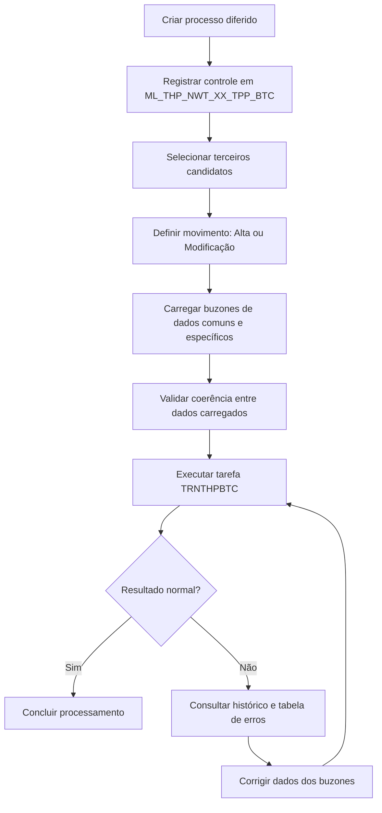
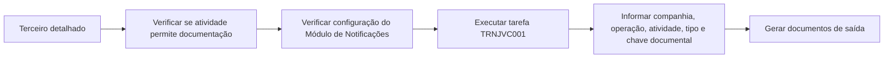

# Reef.core — Módulo de Terceros: Catálogos, Operações, Configuração e Modelo de Dados

## 1. Metadados do Documento
- **Arquivo de Origem:** `Não identificado — texto bruto extraído fornecido na conversa`
- **Tipo de Documento:** Manual Operacional e Especificação Funcional/Técnica
- **Domínio / Sistema:** Reef.core — Módulo de Terceros / MAPFRE
- **Público-Alvo:** Desenvolvedores, Arquitetos, Operação, Tecnologia e Processos, Negócio, Tesouraria, Sinistros e Compliance
- **Data/Versão Identificada:** Não identificada
- **Extensão da extração recebida:** 554 páginas

---

## 2. Resumo Executivo & Contexto de Negócio

O documento descreve a configuração funcional, as operações on-line, os processos massivos/diferidos e parte do modelo de dados do módulo de **Terceros** do Reef.core. No contexto do documento, “Tercero” representa tanto pessoas físicas quanto pessoas jurídicas que se relacionam com a entidade seguradora, incluindo segurados, agentes, fornecedores, supervisores de sinistros, tramitadores, bancos, resseguradoras, brokers e estruturas comerciais.

O módulo usa o **Código de Atividade do Terceiro** como elemento central de classificação e roteamento funcional. A atividade atribuída identifica os processos e fluxos nos quais o terceiro pode participar. Por exemplo, um agente pode integrar o processo de apuração de comissões; um perito pode participar da gestão de sinistros; um empregado pode beneficiar-se de regras comerciais no processo de emissão; e um fornecedor pode ser submetido a regras de serviços, tarifas, zonas geográficas, desempenho e fraude.

A documentação organiza o domínio em três perspectivas complementares: **Definição**, para parametrização de catálogos; **Operação**, para criação, alteração, consulta e inabilitação de terceiros; e **Modelo de Dados**, para estruturas de tabelas e atributos utilizados principalmente nos processos diferidos. A configuração local é relevante em diversos catálogos, mas certos valores corporativos do núcleo Reef.core devem ser obrigatoriamente respeitados.

O módulo também cobre preocupações regulatórias e operacionais: consentimentos, Pessoas Politicamente Expostas, representantes legais, obrigações fiscais em outros países, prevenção de lavagem de dinheiro, documentos identificadores, documentos alternativos, dados bancários, validação de informações e inabilitação de registros.

Além do cadastro individual, Reef.core oferece processamento massivo de terceiros por meio de tabelas de controle e “buzones” de informação. O processo diferido admite criação e modificação, exige coerência entre os blocos carregados e deve ser acompanhado pela verificação de resultados, correção de inconsistências e reprocessamento sucessivo quando necessário.

---

## 3. Arquitetura, Componentes & Tecnologias Envolvidas

### Componentes funcionais identificados

| Componente | Papel no documento |
| :--- | :--- |
| **Reef.core** | Núcleo do sistema que disponibiliza catálogos, operações e regras para o módulo de Terceiros. |
| **Módulo de Terceros** | Gerencia identificação, classificação, consulta, criação, modificação, inabilitação e histórico de pessoas físicas e jurídicas. |
| **Módulo de Notificações** | Substitui a funcionalidade obsoleta de métodos de envio e é usado na geração de documentos de saída. |
| **Lanzador de Tareas** | Executor das tarefas de geração documental e de processos massivos/diferidos. |
| **TRNJVC001** | Tarefa do núcleo utilizada para gerar documentação do terceiro. |
| **TRNTHPBTC** | Tarefa utilizada para executar os processos massivos/diferidos do módulo de Terceiros. |
| **Estrutura de Produtos** | Fornece setores, ramos técnicos, tratamentos de emissão e critérios de especialização. |
| **Estrutura Comercial** | Fornece níveis comerciais, escritórios e referências de distribuição. |
| **Estrutura de Canais** | Fornece fontes de produção utilizadas pelos agentes. |
| **Módulo de Sinistros e Prestações** | Utiliza supervisores, tramitadores, critérios de atribuição, cessões temporárias e papéis de atuação. |
| **Tesouraria** | Relaciona meios de cobrança/pagamento, impostos, retenções, tokens e dados bancários. |
| **Oracle / tabelas Oracle** | Plataforma de persistência explicitamente citada para catálogos, sequências e tabelas de processamento. |
| **Tecnologia e Processos local** | Responsável por diversas configurações locais, lógicas de negócio, sequências Oracle e manutenção de certos catálogos. |

### Visão arquitetural funcional

```mermaid
graph TD
    A[Entidade MAPFRE local] --> B[Reef.core - Módulo de Terceros]

    B --> C[Catálogos comuns]
    B --> D[Atividades específicas]
    B --> E[Operações on-line]
    B --> F[Processos massivos/diferidos]
    B --> G[Documentação de saída]

    C --> C1[Atividades e classificações]
    C --> C2[Documentos identificadores]
    C --> C3[Consentimentos e PEP]
    C --> C4[Dados bancários e meios de pagamento]
    C --> C5[Obrigações fiscais]

    D --> D1[Asegurados]
    D --> D2[Agentes]
    D --> D3[Terceros genéricos]
    D --> D4[Supervisores e Tramitadores]
    D --> D5[Fornecedores]
    D --> D6[Bancos, seguradoras, resseguradoras e brokers]

    E --> E1[Criar]
    E --> E2[Modificar]
    E --> E3[Consultar]
    E --> E4[Inabilitar]

    F --> F1[Tabela de controle do processo]
    F --> F2[Buzones por bloco de informação]
    F --> F3[Tarefa TRNTHPBTC]
    F --> F4[Revisão de erros e reprocessamento]

    G --> G1[Módulo de Notificações]
    G --> G2[Tarefa TRNJVC001]

    B --> H[Estrutura de Produtos]
    B --> I[Estrutura Comercial]
    B --> J[Estrutura de Canais]
    B --> K[Módulo de Sinistros]
```



### Fluxo do processo massivo/diferido



### Fluxo de geração de documentação do terceiro



---

## 4. Regras de Negócio, Especificações Funcionais & Processos

### 4.1. Regras gerais de identificação e atividade

1. A atividade do terceiro identifica os processos, procedimentos e fluxos operativos em que o terceiro pode intervir.
2. Os códigos de atividade de **1 a 99**, além do código **999**, são reservados e de uso exclusivo do núcleo do sistema.
3. Os códigos corporativos de atividade devem ser obrigatoriamente respeitados.
4. Uma atividade pode permitir ou não:
   - associação a documentos fictícios;
   - identificação como fornecedor;
   - geração de código interno de terceiro;
   - geração automática de código interno;
   - integração com documentação de saída;
   - consulta por usuários de agências.
5. Quando o atributo de consulta para empregados de agências é configurado, o acesso à informação pode ser restringido para reduzir risco de infração ao Regulamento Geral de Proteção de Dados.
6. A definição do nome da estrutura e da agrupação de estruturas atribuídas a uma atividade é responsabilidade da Direção de Tecnologia local.
7. O código interno do terceiro não é substituído pelo identificador único do terceiro. O identificador único pode ser gerado por lógica local para rastreabilidade, integração e cruzamento de dados entre sistemas.

### 4.2. Regras de obrigatoriedade de campos

1. O catálogo de campos obrigatórios permite configurar validações por:
   - companhia;
   - tabela Oracle do modelo de dados;
   - ramo técnico;
   - atividade do terceiro;
   - intervenção;
   - âmbito da validação;
   - atributo do catálogo;
   - conceito lógico.
2. O ramo técnico genérico `999` aplica a validação a todos os ramos técnicos.
3. A atividade genérica `999` aplica a validação a todas as atividades.
4. A intervenção genérica `ZZ` aplica a validação a todas as intervenções associadas à atividade.
5. A configuração deve considerar se a instalação utiliza o modelo antigo ou o novo modelo de dados de Terceiros.
6. A lógica de negócio local pode determinar dinamicamente a obrigatoriedade ou a inabilitação de um atributo.
7. Campos de mesmo nome podem pertencer a conceitos lógicos distintos; o conceito lógico evita ambiguidades, como no caso de `PRS_PCE`.

### 4.3. Regras de identificação documental

1. Um terceiro é identificado por tipo de documento e chave documental.
2. Documentos alternativos podem identificar o mesmo terceiro de forma complementar.
3. A captura de documentos alternativos não é permitida nos processos de Gestão de Pólizas e Contratos nem em Gestão de Sinistros e Prestações.
4. Caso a geração automática do código documental seja configurada, a Tecnologia local deve definir a sequência Oracle correspondente.
5. Se um tipo documental servir indistintamente para pessoas físicas e jurídicas, o atributo de uso em pessoa física/jurídica deve permanecer vazio.
6. Para entidades bancárias e escritórios bancários sem documento identificador próprio, o tipo documental é `THP`, conforme descrito no documento.
7. O tipo de documento identificador inicial de uma entidade bancária sem documento configurado pode ser definido por parâmetros da instalação.

### 4.4. Regras sobre dados bancários e meios de cobrança/pagamento

1. O tipo de meio de cobrança/pagamento, o tipo de validação e o tipo de mascaramento definidos pelo núcleo devem ser obrigatoriamente respeitados.
2. Um meio de cobrança/pagamento validado só pode ser inabilitado; seus dados não podem ser modificados posteriormente.
3. Apenas um meio de cobrança/pagamento pode ser marcado como padrão entre todos os meios do terceiro.
4. Apenas um meio prioritário pode existir por tipo de meio de cobrança/pagamento.
5. O valor real pode representar número de cartão, conta bancária ou outro identificador, enquanto o valor mascarado e o valor criptografado suportam visualização e persistência protegidas.
6. Tipos de token podem representar token manual, automático ou token de prestadores específicos, conforme exemplos do documento.
7. A sequência Oracle pode ser utilizada para geração de token, quando configurada.

### 4.5. Regras de consentimento, PEP e prevenção a ilícitos

1. O consentimento representa manifestação livre, inequívoca, específica e informada para tratamento de dados pessoais.
2. Os valores dos tipos de consentimento habilitados no Reef.core devem ser respeitados.
3. O consentimento pode possuir período de início, fim, validade, formato e estado de inabilitação.
4. Uma Pessoa Politicamente Exposta pode ser o próprio terceiro ou um familiar/colaborador relacionado.
5. PEPs, representantes legais, acionistas e obrigações fiscais são elementos relevantes para processos de prevenção de lavagem de dinheiro e controles corporativos.
6. Um representante legal pode ser marcado como:
   - Pessoa Politicamente Exposta;
   - pessoa investigada;
   - pessoa que realizou atividades ilícitas.
7. Para representantes legais, a descrição de atividades ilícitas só se aplica quando a marca correspondente estiver ativa.

### 4.6. Regras de segurados e terceiros não desejados

1. Reef.core identifica segurados/clientes com atividade `1`.
2. A classificação de “terceiro não desejado” pode restringir-se por setor, ramo técnico, terceiro nível da estrutura comercial e agente.
3. O setor genérico `9999` aplica a marcação de terceiro não desejado a todos os setores.
4. O ramo genérico `999` aplica a marcação a todos os ramos.
5. O terceiro nível genérico `9999` aplica a marcação a todos os escritórios.
6. A condição de cliente VIP pode afetar a atribuição de sinistros a tramitadores.
7. A marca Robinson determina se o segurado deve ser incluído ou excluído de processos de contato e comunicação, de acordo com os consentimentos concedidos.
8. A funcionalidade de fidelização utiliza a moeda “Trébol”; tréboles não são trocados por dinheiro, não expiram enquanto o cliente mantiver produtos MAPFRE e podem ser resgatados automaticamente no primeiro recibo de renovação, emissão ou suplemento quando houver quantidade mínima configurada.

### 4.7. Regras do plano de fidelização

1. Os códigos de ação `1 - Cobro del Recibo` e `2 - Anulado de Cobro del Recibo` devem estar obrigatoriamente definidos.
2. Uma ação pode incrementar ou redimir saldo de tréboles.
3. Número positivo de tréboles corresponde à quantidade resgatável para aplicar desconto sobre a prima.
4. Número negativo corresponde à quantidade monetizável, por exemplo, para compra de bens ou serviços oferecidos por parceiro externo.
5. Para ações que afetam recibos e que admitem resgate — emissão, suplemento ou renovação — deve ser informado valor zero de tréboles.
6. O número mínimo e o número máximo de tréboles são definidos na companhia; o máximo pode permanecer aberto se não for informado.
7. O plano pode ter tipos de ação associados a parceiros colaboradores específicos.

### 4.8. Regras de agentes, comissões e distribuição

1. Reef.core identifica agentes com atividade `2`.
2. Um agente pode ter fonte de produção padrão e fontes complementares habilitadas.
3. Um agente pode emitir em escritórios comerciais complementares quando configurado.
4. Um quadro de comissão é diferente de um quadro de distribuição de comissões.
5. Comissões de nova produção aplicam-se exclusivamente ao primeiro ano de vigência da apólice.
6. Comissões de carteira aplicam-se a apólices vigentes em anos sucessivos enquanto existir a vigência das apólices originadas pela gestão comercial do agente.
7. Uma apólice possui obrigatoriamente agente principal e pode possuir até cinco figuras adicionais, totalizando até seis figuras de intermediação:
   - agente principal;
   - segundo agente;
   - terceiro agente;
   - quarto agente;
   - organizador;
   - assessor.
8. O executivo de conta pode constituir uma sétima figura comercial, mas não recebe comissões.
9. Os quatro primeiros agentes compartilham as comissões calculadas para o agente principal; organizador e assessor possuem comissões próprias.
10. O quadro de distribuição é opcional e visa reduzir erros na captura durante a emissão.
11. Se o quadro de distribuição não contiver quadro de comissões, Reef.core exige sua captura na emissão.
12. O conceito de ajuste utilizado em subvenções deve possuir agrupamento contábil do tipo `MP`.
13. Os códigos de ajuste associados a subvenções devem estar livres de impostos.

### 4.9. Regras de supervisores e tramitadores

1. Supervisores possuem atividade `8`; tramitadores possuem atividade `9`.
2. Supervisores e tramitadores podem ser especializados por setor, ramo técnico, apólice e outros critérios.
3. Para supervisores:
   - setor genérico: `9999`;
   - ramo técnico genérico: `999`.
4. Para tramitadores:
   - setor genérico: `9999`;
   - ramo técnico genérico: `999`;
   - tipo de expediente genérico: `ZZZ`.
5. A atribuição de sinistros pode depender da carga de trabalho e de critérios explícitos.
6. Mesmo atendendo aos critérios, um tramitador pode não receber atribuição se alcançar o limite máximo de expedientes ou possuir quantidade impeditiva de pendências.
7. Uma cessão temporária permite que um tramitador destinatário gerencie casos de um tramitador cedente.
8. Durante cessão temporária, as operações ficam registradas com o código de usuário do tramitador destinatário, mas o código de tramitador permanece o do cedente.
9. Atuação secundária é permitida apenas para tipologias:
   - Recepcionista;
   - Centro Telefônico;
   - Tramitador Abogado;
   - Colaborador.
10. A funcionalidade de cessão entre supervisores é mencionada como não habilitada no momento documentado.
11. Um supervisor responsável pode gerenciar um ou mais supervisores, formando estrutura multinível.

### 4.10. Regras de fornecedores

1. Um terceiro somente pode ser tratado como fornecedor quando a atividade estiver explicitamente configurada para esse fim.
2. O domínio de fornecedores inclui catálogos para:
   - blocos de informação;
   - papéis de acesso;
   - permissões de acesso;
   - tipologias;
   - categorias;
   - serviços;
   - zonas geográficas;
   - tarifas;
   - métricas;
   - fraudes;
   - atendimento;
   - IQRFs;
   - formação.
3. O bloco de formação é explicitamente indicado como não implementado.
4. A atribuição de serviços a fornecedores pode usar lógica de negócio para avaliar proximidade, capacidade, avaliação e demais critérios definidos pela companhia.
5. A responsabilidade pela nomenclatura, implementação e associação da lógica de negócio pertence ao departamento local de Tecnologia e Processos.
6. Em tipologias e categorias de fornecedores, só pode existir um registro genérico — não real — por subconjunto de companhia e idioma.
7. A matriz de motivos por tipologia e conclusão de fraude deve respeitar a configuração estabelecida no Reef.core.

### 4.11. Regras do processo massivo/diferido

1. Existem duas operações diferidas: alta/criação e modificação.
2. Inabilitação e reabilitação devem ser implementadas como movimento de modificação.
3. A situação inicial do processo é `1`, descrita como “Sin Filtrar” na seleção de candidatos e “Sin Procesar” em certas tabelas de controle.
4. Estados listados para a situação do processo:
   - `1. Sin Filtrar`;
   - `2. Detalle Filtrado`;
   - `3. Excepcionando`;
   - `4. Ya Excepcionado`;
   - `5. Ya Tratado`.
5. Os dados carregados em buzones devem ser coerentes. Exemplo documentado: se o terceiro estiver inabilitado, a causa de inabilitação deve ser informada.
6. Após execução anormal, devem ser revisados o histórico da tarefa, o catálogo de processos diferidos, as tabelas de erros e os valores carregados nos buzones.
7. O processo deve ser reexecutado até obtenção de término normal.
8. A revisão do processo requer participação da área de Tecnologia da empresa MAPFRE local.

---

## 5. Tabelas de Parâmetros, Ambientes e Estruturas de Dados

### 5.1. Códigos de atividades de terceiros citados

| Código | Atividade / Descrição | Observações |
| :--- | :--- | :--- |
| 1 | Tomadores / Asegurados | Segurados/clientes. |
| 2 | Agentes | Intermediários. |
| 3 | Peritos | Também listado como terceiro genérico. |
| 4 | Inspectores | Terceiro genérico. |
| 5 | Médicos | Terceiro genérico. |
| 6 | Abogados | Terceiro genérico. |
| 7 | Procuradores | Terceiro genérico. |
| 8 | Supervisores | Supervisores de sinistros. |
| 9 | Tramitadores | Gestores de sinistros/expedientes. |
| 10 | Proveedores | Pode ser fornecedor conforme parametrização da atividade. |
| 11 | Ejecutivos de Cta. | Executivo de conta. |
| 12 | Cobradores | Terceiro genérico. |
| 13 | Aseguradoras | Companhias seguradoras. |
| 14 | Reaseguradoras | Companhias resseguradoras. |
| 15 | Empleados | Empregados. |
| 16 | Brokers | Brokers de seguros. |
| 17 | Talleres | Pode ser fornecedor. |
| 18 | Clínicas | Pode ser fornecedor. |
| 19 | Juzgados | Terceiro genérico. |
| 20 | Cristaleros | Pode ser fornecedor. |
| 21 | Cerrajeros | Pode ser fornecedor. |
| 22 | Plomeros | Terceiro genérico. |
| 23 | Electricistas | Terceiro genérico. |
| 24 | Grúas | Terceiro genérico. |
| 25 | Investigadores | Terceiro genérico. |
| 26 | Recuperadores | Terceiro genérico. |
| 27 | Ajustadores | Terceiro genérico. |
| 28 | Herreros | Terceiro genérico. |
| 29 | Tribunales | Terceiro genérico. |
| 30 | Terceros Seg. MOTOR | Terceiro genérico. |
| 31 | Terceros Seg. SALUD | Terceiro genérico. |
| 32 | Terceros Seg. PATRIMONIALES | Terceiro genérico. |
| 33 | Depósitos | Terceiro genérico. |
| 34 | Notarías | Terceiro genérico. |
| 35 | Centros de Peritación | Terceiro genérico. |
| 36 | Comisarías | Terceiro genérico. |
| 37 | Empleados de Agentes | Empregados de agência/agente. |
| 38 | Filial | Terceiro genérico. |
| 39 | Compañías | Companhias do grupo local. |
| 40 | Entidades Bancarias | Valor constante no novo modelo de terceiros. |
| 41 | Oficinas Bancarias | Valor constante no novo modelo de terceiros. |
| 42 | Primer Nivel Est. Comercial | Primeiro nível da estrutura comercial. |
| 43 | Segundo Nivel Est. Comercial | Segundo nível da estrutura comercial. |
| 44 | Tercer Nivel Est. Comercial | Terceiro nível da estrutura comercial. |
| 45 | Representantes Legales | Representantes legais. |
| 99 | Otros Beneficiarios | Atividade reservada do núcleo. |
| 999 | Genérico | Utilizado em certos contextos como valor genérico. |

### 5.2. Valores genéricos relevantes

| Item / Parâmetro | Descrição / Função | Tipo / Valores / Formato | Ambiente / Observações |
| :--- | :--- | :--- | :--- |
| Ramo Técnico genérico | Aplicar regra ou critério a todos os ramos técnicos | `999` | Campos obrigatórios, supervisores, tramitadores e terceiros não desejados. |
| Setor genérico | Aplicar regra ou critério a todos os setores | `9999` | Supervisores, tramitadores e terceiros não desejados. |
| Intervenção genérica | Aplicar validação a todas as intervenções da atividade | `ZZ` | Campos obrigatórios. |
| Tipo de expediente genérico | Aplicar atuação ou atribuição a todos os tipos de expediente | `ZZZ` | Tramitadores. |
| Situação inicial do processo | Estado inicial de candidato em processo diferido | `1` | Descrito como “Sin Filtrar” ou “Sin Procesar”, conforme contexto. |
| Tipo de movimento batch | Tipo de movimento de processo massivo | Valor `1` citado | Tabela de controle de processos. |
| Atividade entidade bancária | Identifica entidade bancária no novo modelo | `40` | Constante, não modificável. |
| Atividade escritório bancário | Identifica escritório bancário no novo modelo | `41` | Constante, não modificável. |
| Atividade segurado | Identifica segurados/clientes | `1` | Reef.core. |
| Atividade agente | Identifica agentes/intermediários | `2` | Reef.core. |
| Atividade supervisor | Identifica supervisores | `8` | Reef.core. |
| Atividade tramitador | Identifica tramitadores | `9` | Reef.core. |

### 5.3. Exemplos de atividades econômicas e níveis de risco

| Item / Parâmetro | Descrição / Função | Tipo / Valores / Formato | Ambiente / Observações |
| :--- | :--- | :--- | :--- |
| Atividade econômica `001` | Atividade Comercial | Código exemplificativo | Catálogo inicialmente vazio. |
| Atividade econômica `002` | Atividade Administrações Públicas — AA.P | Código exemplificativo | Catálogo inicialmente vazio. |
| Atividade econômica `003` | Atividade Industrial | Código exemplificativo | Catálogo inicialmente vazio. |
| Atividade econômica `004` | Atividade Serviços | Código exemplificativo | Catálogo inicialmente vazio. |
| Nível de risco/vulnerabilidade | Fator de risco da atividade econômica | Sem Risco; Baixo; Médio; Alto; Crítico | Valores apresentados para idioma espanhol. |
| Data de validade | Início de vigência operacional | Data | Permite histórico de mudanças. |
| Inabilitação | Bloqueia uso em captura/modificação | Indicador | Aplicável ao catálogo. |

### 5.4. Tabelas Oracle e buzones explicitamente identificados

| Tabela | Descrição documentada | Uso |
| :--- | :--- | :--- |
| `ML_THP_NWT_XX_TPP_BTC` | Tabela de controle de processos massivos de terceiros | Criação e seleção de candidatos do processo diferido. |
| `ML_THP_NWT_XX_TPP_BTC_ERR` | Tabela buzón de erros de processos batch de terceiros | Revisão de falhas no processamento massivo. |
| `ML_THP_NWT_XX_SHL` | Tabela buzón de acionistas | Movimento diferido de acionistas. |
| `T_THP_TRN_M_ACV` | Tabela buzón de atividades de um terceiro | Movimento diferido de atividades. |
| `T_THP_TRN_M_AGN` | Tabela buzón de agente | Movimento diferido de dados de agentes. |
| `ML_THP_NWT_XX_UNI` | Tabela buzón de atribuição de segurado não desejado | Movimento diferido de segurado não desejado. |
| `T_THP_TRN_M_INY` | Tabela buzón terceiro segurado | Movimento diferido de dados de segurado. |
| `ML_THP_NWT_XX_TMN` | Tabela buzón de consentimento de cliente | Movimento diferido de consentimentos. |
| `ML_THP_NWT_XX_CNT` | Tabela buzón de contatos de terceiros | Movimento diferido de contatos. |
| `ML_THP_NWT_XX_ADR` | Tabela buzón de endereços de terceiros | Movimento diferido de endereços. |
| `ML_THP_NWT_XX_ARM` | Tabela buzón de documentos alternativos | Movimento diferido de documentos alternativos. |
| `T_THP_TRN_M_LCN` | Tabela buzón de licenças de um terceiro | Movimento diferido de carteira/permissão de condução. |
| `ML_THP_NWT_XX_PCM` | Buzón de meios de pagamento e cobrança | Movimento diferido de dados bancários. |
| `ML_THP_NWT_XX_TXL_CNY` | Tabela buzón de países com obrigações fiscais | Movimento diferido de obrigações fiscais. |
| `ML_TPD_NWT_XX_ALP` | Tabela buzón de definição de perfil analítico | Movimento diferido de perfil analítico. |
| `T_THP_TRN_M_PRS` | Tabela buzón pessoa | Movimento diferido de dados pessoais/jurídicos. |
| `ML_THP_NWT_XX_PRS_PCE` | Tabela buzón de pessoas expostas politicamente | Movimento diferido de PEP. |
| `ML_THP_NWT_XX_LGR` | Tabela buzón de representantes legais | Movimento diferido de representantes legais. |
| `ML_TRN_NWT_XX_GTP` | Tabela buzón terceiro genérico | Movimento diferido de terceiros genéricos. |

### 5.5. Parâmetros principais do processo massivo

| Item / Parâmetro | Descrição / Função | Tipo / Valores / Formato | Ambiente / Observações |
| :--- | :--- | :--- | :--- |
| Companhia | Companhia que executará o processo | Código de companhia | Obrigatório no controle. |
| Identificador do processo | Identifica o processo diferido | Código identificador | Obrigatório. |
| Data de tratamento | Data de execução/tratamento | Data | Obrigatório. |
| Número de ordem | Ordem de execução da operação | Número | Obrigatório. |
| Hilo do processo | Paralelismo de processamento | Código de hilo | Usado em volumes massivos. |
| Tipo de movimento | Operação para o terceiro | Alta ou Modificação | Inabilitação/reabilitação são modificações. |
| Tipo documental | Tipo do documento do terceiro | Código | Obrigatório. |
| Documento do terceiro | Chave documental | Chave | Obrigatório. |
| Atividade do terceiro | Atividade a processar | Código | Obrigatório. |
| Situação do processo | Estado do candidato/processamento | Estados `1` a `5` descritos | Inicialmente valor `1`. |
| Usuário | Usuário que atualizou a linha | Código de usuário | Obrigatório nas tabelas apresentadas. |
| Data de modificação | Data de alteração da linha | Data | Obrigatório nas tabelas apresentadas. |

### 5.6. Tarefas do núcleo

| Tarefa | Finalidade | Parâmetros destacados |
| :--- | :--- | :--- |
| `TRNJVC001` | Gerar documentação de saída do terceiro | Companhia, operação, atividade, tipo de documento e chave do documento. |
| `TRNTHPBTC` | Executar processo massivo/diferido de terceiros | Companhia, data de tratamento, identificador, ordem, reprocessamento em caso de erro, idioma e usuário. |

### 5.7. Dados estruturais de fornecedores

| Domínio | Principais atributos de configuração |
| :--- | :--- |
| Tipologia de fornecedor | Companhia, tipologia, idioma, descrição, inabilitação, tipo real/genérico. |
| Categoria de fornecedor | Companhia, categoria, idioma, descrição, inabilitação, categoria real/genérica. |
| Serviço de fornecedor | Companhia, serviço, tipo de serviço, idioma, descrição, inabilitação. |
| Tarifa de fornecedor | Companhia, tarifa, idioma, descrição, inabilitação. |
| Conceito de tarifa | Companhia, conceito, idioma, descrição, conceito contábil, inabilitação. |
| Conceito por zona e tarifa | Companhia, tarifa, conceito, zona, moeda, importes mínimo e máximo, inabilitação. |
| Serviço por atividade/tipo/categoria | Companhia, atividade, tipologia, categoria, serviço, conceito contábil, data de validade, inabilitação. |
| Tarifa por atividade/tipo/categoria | Companhia, atividade, tipologia, categoria, tarifa, data de validade, inabilitação. |
| Zona geográfica | Companhia, tipo de zona, código, idioma, descrição, inabilitação. |
| Zona por atividade/tipo/categoria | Companhia, atividade, tipologia, categoria, zona, data de validade, inabilitação. |
| Critério de atribuição de serviço | Companhia, atividade, lógica de negócio, data de validade, inabilitação. |
| Papel de acesso | Companhia, atividade, usuário, papel de acesso. |
| Permissão a blocos | Companhia, atividade, papel, tipos de acesso por bloco. |

---

## 6. Bateria de Perguntas & Respostas para RAG (FAQ Sintético)

### P1: Qual é a função do Código de Atividade do Terceiro no Reef.core?
**R:** O Código de Atividade do Terceiro identifica a atividade funcional associada a uma pessoa física ou jurídica e determina os processos, procedimentos e fluxos operativos nos quais esse terceiro pode intervir. Por exemplo, a atividade de agente habilita participação no processo de comissões; a atividade de perito relaciona o terceiro à gestão de sinistros; e a atividade de fornecedor permite aplicar configurações específicas de serviços, tarifas, zonas e acessos.

### P2: Quais códigos de atividade não podem ser redefinidos localmente?
**R:** Os códigos de atividade de `1` a `99`, além do código `999`, são reservados e de uso exclusivo do núcleo do Reef.core. A entidade local deve respeitar obrigatoriamente os códigos de atividades próprios do núcleo, especialmente quando os códigos estiverem relacionados a intervenções corporativas e tipos de terceiros configurados centralmente.

### P3: Como Reef.core trata documentos alternativos de terceiros?
**R:** O sistema permite associar documentos alternativos a um terceiro para possibilitar identificação complementar ao documento principal. Entretanto, a captura de documentos alternativos não é permitida e não deve ser permitida nos processos de Gestão de Pólizas e Contratos nem em Gestão de Sinistros e Prestações. Um documento alternativo pode ter data de emissão, data de caducidade, país emissor, marca de comprovação, data de comprovação, observações, data de validade e inabilitação.

### P4: Como funciona o processamento massivo de terceiros?
**R:** O processo massivo é realizado por meio de um processo diferido. Primeiro, registra-se o controle do processo; depois, selecionam-se terceiros candidatos com operação de alta ou modificação; em seguida, carregam-se os dados nos buzones correspondentes; por fim, executa-se a tarefa `TRNTHPBTC`. Caso a execução termine de forma anormal, a entidade deve consultar o histórico, revisar a tabela de erros, corrigir os buzones e reexecutar o processo até alcançar “Terminación Normal”.

### P5: Como são atribuídos sinistros a tramitadores?
**R:** Reef.core pode atribuir sinistros e expedientes automaticamente conforme carga de trabalho ou critérios configurados. Os critérios podem considerar setor, ramo técnico, apólice, agente, apólice grupo, contrato, subcontrato, níveis da estrutura comercial, tipo de expediente, processos judiciais, perda total, sinistros no exterior, clientes VIP e contrário assegurado pela MAPFRE. Mesmo com critérios compatíveis, a atribuição pode ser impedida pelo número máximo de expedientes ou pela quantidade de pendências do tramitador.

### P6: Qual é a diferença entre quadro de comissões e quadro de distribuição de comissões?
**R:** O quadro de comissões é uma chave de configuração usada no cálculo de comissões de agentes, considerando atributos da estrutura comercial, canais, cliente e produtos. O quadro de distribuição de comissões define como os percentuais das comissões serão distribuídos entre intermediários de uma apólice. O documento reforça que os dois conceitos não devem ser confundidos.

### P7: O que ocorre após validar um meio de cobrança ou pagamento?
**R:** Após um meio de cobrança/pagamento ser comprovado e validado, Reef.core permite somente sua inabilitação. A modificação dos dados do meio validado deixa de ser permitida. O sistema também suporta valor real, valor mascarado, valor criptografado, token, meio padrão, meio prioritário, moeda, validade e estado de inabilitação.

### P8: Como o sistema trata Pessoas Politicamente Expostas?
**R:** Reef.core permite identificar o próprio terceiro como PEP ou identificar uma pessoa relacionada — familiar ou colaborador próximo — com essa condição. São registrados dados como data de alta, data de baixa, cargo ou relação PEP, tipo e chave documental da pessoa relacionada e inabilitação. O catálogo de cargos PEP pode ser usado em controles de compliance, KYC, AML, proteção de dados e demais exigências regulatórias citadas.

### P9: Quando um terceiro pode ser marcado como “não desejado”?
**R:** Um terceiro pode ser registrado como não desejado conforme seu código de atividade e parâmetros de qualidade, validade, setor, ramo, terceiro nível comercial, agente, estado, causa e comentários. A marcação pode ser global ou restrita por setor, ramo ou escritório usando valores genéricos como `9999` para setor/escritório e `999` para ramo.

### P10: Quais são as limitações da funcionalidade de métodos de envio?
**R:** A funcionalidade de métodos de envio está descrita como descontinuada e obsoleta no núcleo do sistema. Ela não pode ser usada ou reutilizada para finalidade local. O documento informa que essa funcionalidade foi substituída pelo Módulo de Notificações do Reef.core.

### P11: Como são configuradas as subvenções de agentes?
**R:** Uma subvenção pode ser mensal ou aplicada ao cobro e anulação de cobro de recibos. Sua forma de aplicação pode ser por importe, porcentagem ou lógica de negócio. A configuração inclui agente, moeda, conceito de ajuste, vigência, data de concessão, data de caducidade, valor, percentual, limite mínimo de cobrança, lógica de cálculo, inabilitação e data de validade. O conceito de ajuste deve ter agrupamento contábil `MP` e estar livre de impostos.

### P12: Quais informações são necessárias para criar uma entidade bancária?
**R:** A entidade bancária possui atividade `40` e é tratada como pessoa jurídica. O cadastro abrange identificação documental, código e nome da entidade, endereço e contato, tipo de entidade, tipo de instituição bancária, tipo de empresa jurídica, tipo de domiciliação, data de constituição, nacionalidade, referência bancária, entidade compradora, dias adicionais para data valor, código SWIFT/BIC e estado de inabilitação.

### P13: Como o plano de fidelização usa os Tréboles?
**R:** Tréboles são a moeda do plano de fidelização da MAPFRE. Clientes podem acumular tréboles ao participar de ações configuradas, e os pontos podem ser aplicados automaticamente em recibos de renovação, emissão ou suplemento após atingir o mínimo configurado. Tréboles não podem ser trocados por dinheiro e não expiram enquanto o cliente mantiver produtos MAPFRE contratados.

### P14: Quem é responsável pelas configurações locais de lógica de negócio?
**R:** A responsabilidade pela definição, implementação, nomenclatura e associação de várias lógicas de negócio locais recai sobre a Direção ou Departamento de Tecnologia e Processos da entidade MAPFRE local. Isso inclui, conforme o catálogo envolvido, critérios de obrigatoriedade, inabilitação, geração automática, atribuição de serviços, cálculo de subvenções, controle de importes e identificadores dinâmicos de fraude.

---

## 7. Glossário de Termos, Siglas & Conceitos-Chave

- **AML:** Anti Money Laundering; mencionado como contexto de controles regulatórios.
- **BIC:** Bank Identifier Code; denominação alternativa para código SWIFT.
- **BM25:** Não é citado no documento-fonte; não deve ser interpretado como conceito funcional do Reef.core.
- **CLTV / C.L.T.V.:** Customer Lifetime Value; previsão do valor financeiro esperado de um cliente durante seu relacionamento com a empresa.
- **DPM:** Daños Materiales Propios; exemplo de tipo de expediente.
- **GDPR / RGPD:** Regulamento Geral de Proteção de Dados; citado no contexto de acesso de usuários de agências e proteção de informações.
- **I.Q.R.F.:** Incidencias, Quejas, Reclamaciones y Felicitaciones.
- **KYC:** Know Your Customer; prática citada para verificação de identidade e compliance.
- **MAPFRE:** Entidade corporativa citada no documento como contexto do Reef.core e das seguradoras locais.
- **MP:** Tipo de agrupamento contábil requerido para conceitos de ajuste associados a subvenções.
- **PEP / P.E.P.:** Politically Exposed Person / Persona Políticamente Expuesta.
- **Reef.core:** Sistema/núcleo corporativo documentado.
- **SEPA:** Zona Única de Pagamentos em Euros, referenciada no contexto do uso de códigos SWIFT/BIC.
- **SWIFT:** Society for Worldwide Interbank Financial Telecommunication; código de 8 ou 11 caracteres para identificar banco receptor em transferências internacionais.
- **THP:** Valor de tipo documental utilizado para entidades ou escritórios bancários quando não existem documentos identificadores próprios, conforme o documento.
- **TRNJVC001:** Tarefa do núcleo usada para gerar documentação de saída do terceiro.
- **TRNTHPBTC:** Tarefa usada para executar processos massivos/diferidos de terceiros.
- **Tercero:** Pessoa física ou jurídica cadastrada no módulo de Terceiros.
- **Tramitador:** Usuário ou terceiro responsável pela gestão de sinistros e expedientes.
- **Trébol:** Moeda do plano de fidelização MAPFRE.
- **VIP:** Marca que identifica segurado como cliente importante.

---

## 8. Notas Críticas, Riscos & Limitações

1. **Origem incompleta de metadados:** o texto fornecido não identifica o nome do arquivo de origem, data ou versão documental.
2. **Extração com caracteres corrompidos:** há diversas ocorrências de caracteres substituídos, como ``, em palavras originalmente acentuadas ou contendo caracteres especiais. Essa corrupção deve ser tratada antes de indexação literal ou geração de embeddings.
3. **Conteúdo de 554 páginas:** a fonte mistura catálogos, operações funcionais, fluxos, exemplos, tabelas de dados, visões técnicas e referências de navegação.
4. **Links quebrados ou pendentes:** o texto contém trechos como “Checking links...” e “Pendiente Falta: Colocar el enlace...”, indicando referências incompletas.
5. **Métodos de envio obsoletos:** a funcionalidade correspondente está explicitamente descontinuada e substituída pelo módulo de Notificações.
6. **Funcionalidade não implementada:** o bloco de Formação de Fornecedores é citado como pendente de funcionalidade/não implementado.
7. **Funcionalidade não habilitada:** a cessão de sinistros entre supervisores é mencionada como possibilidade futura, mas não está habilitada.
8. **Dependência de parametrização local:** obrigatoriedade, habilitação, sequência de captura, lógicas de negócio, listas de valores e usos operacionais podem variar por entidade e instalação.
9. **Dependência de Tecnologia local:** diversas configurações exigem atuação da Tecnologia e Processos local, incluindo sequências Oracle, lógicas de negócio, nomes de estruturas, revisão de processos massivos e catálogos locais.
10. **Risco de inconsistência em cargas massivas:** os buzones precisam estar semanticamente coerentes; dados contraditórios podem causar erros de validação e exigir reprocessamento.
11. **Risco regulatório:** consentimentos, PEP, representantes legais, obrigações fiscais e controles de prevenção à lavagem de dinheiro exigem governança e consistência operacional.
12. **Não há detalhamento técnico completo para todos os módulos:** alguns tópicos são apresentados como cartões, índices ou referências a documentos externos. Por exemplo, as operações de fornecedor nas páginas finais são descritas de modo resumido, sem detalhamento integral de cada atributo.
13. **Nota de Análise:** o documento cita módulos como Notificações, Estrutura de Produtos, Estrutura Comercial, Estrutura de Canais, Juízos e Tesouraria, mas não detalha contratos de integração, endpoints HTTP, formatos JSON, topologias de deployment, versões de software ou mecanismos de autenticação.

---

## 9. Conteúdo Bruto Estruturado (Referência Fiel)

> **Nota de preservação:** a transcrição literal integral de 554 páginas foi fornecida no prompt de origem desta análise. Para evitar introduzir alterações, truncamentos ou reconstruções não verificáveis na referência de auditoria, o conteúdo bruto deve ser preservado no repositório documental original como artefato imutável. Abaixo está o índice fiel estruturado dos blocos e páginas presentes na extração recebida.

```text
--- [PÁGINAS 1–5] ---
DEFINICIÓN de las Actividades de los Terceros
- Contexto, códigos corporativos e propriedades gerais e operativas.
- Atividades 1–45 e 99.
- Recomendações sobre códigos reservados e acesso de usuários de agências.

--- [PÁGINAS 6–7] ---
DEFINICIÓN de las Actividades Económicas
- Catálogo por companhia e idioma.
- Níveis de risco: Sin Riesgo, Bajo, Medio, Alto, Crítico.
- Inabilitação e data de validade.

--- [PÁGINAS 8–9] ---
DEFINICIÓN de las Agrupaciones de Terceros
- Associação entre companhia, atividade, agrupação, descrição e abreviatura.

--- [PÁGINAS 10–11] ---
DEFINICIÓN de los Códigos de Calificación (Rating)
- Ratings por companhia e idioma.
- Recomendações de agrupamento por agência e intervalos de código.

--- [PÁGINAS 12–14] ---
DEFINICIÓN de los Campos Obligatorios en el Registro de la Información de los Terceros
- Catálogos Oracle por atividade.
- Ramo 999, atividade 999, intervenção ZZ, lógica de obrigatoriedade e inabilitação.

--- [PÁGINAS 15–18] ---
Cargos em pessoas jurídicas e Catálogo Multipropósito de Terceiros.
- Cargos: CEO, CFO, CMO, CIO.
- Catálogos obrigatórios: tipo de sociedade, grupo empresarial, titulação, zona horária, segmentação, dispositivo e canal.

--- [PÁGINAS 19–31] ---
Categorias, causas de inabilitação, classificações, qualidades, consentimentos e departamentos.
- Classificação de pessoas físicas/jurídicas.
- Catálogos de motivos de inabilitação.
- Consentimentos e tipos de consentimento.

--- [PÁGINAS 32–60] ---
Documentos identificadores, entidades de cobrança/pagamento, estado da licença, impostos, intervenções, meios de pagamento, estudos, relações, perfis financeiros, PEP, profissões, regime fiscal, tipos jurídicos, titulações e tokens.

--- [PÁGINAS 61–69] ---
Asegurados e Plano de Fidelização.
- Tréboles, ações, tipos de ação, parceiros colaboradores e parâmetros de fidelização.

--- [PÁGINAS 70–88] ---
Agentes.
- Tipos de agente, quadros de comissão, distribuição de comissão, fontes de produção, métodos de envio, escritórios habilitados, subvenções e tipologias.

--- [PÁGINAS 89–96] ---
Terceros genéricos.
- Grupos familiares/hierárquicos, relações e conexões entre terceiros.

--- [PÁGINAS 97–119] ---
Supervisores e tramitadores.
- Critérios de atribuição, responsáveis de supervisores, dados de contato, cessões temporárias, atuações secundárias e critérios de sinistros.

--- [PÁGINAS 120–147] ---
Seguradoras, resseguradoras, brokers, empregados de agentes, companhias, bancos, escritórios bancários e níveis da estrutura comercial.

--- [PÁGINAS 148–205] ---
Fornecedores.
- Blocos de informação, papéis, permissões, serviços, tarifas, zonas, métricas, fraudes, tipologias, categorias e critérios de atribuição.

--- [PÁGINAS 206–210] ---
Mapa de definições de Terceiros.
- Definições comuns, específicas por pessoa física/jurídica e específicas por atividade.

--- [PÁGINAS 211–212] ---
GENERAR Documentación del Tercero.
- Tarefa TRNJVC001.
- Companhia, operação, atividade, tipo e chave documental.

--- [PÁGINAS 213–258] ---
Modelo de dados técnico para processos massivos.
- Tabelas de controle, buzones de acionistas, atividades, agentes, segurados, consentimentos, contatos, endereços, documentos alternativos, licenças, pagamentos, obrigações fiscais, perfil analítico, pessoas, PEP, representantes e terceiros genéricos.

--- [PÁGINAS 259–266] ---
Criar, selecionar, executar e revisar processo massivo/diferido.
- Alta e modificação.
- Estados de processo e reprocessamento.

--- [PÁGINAS 267–298] ---
Operações de consulta.
- Acionistas, contatos, dados bancários, dados básicos, pessoa física/jurídica, endereços, documentos alternativos, obrigações fiscais, PEP, representantes e consulta de terceiros.

--- [PÁGINAS 299–364] ---
Operações de criação e modificação de terceiros.
- Acionistas, contatos, dados bancários, dados básicos, identificação, endereços, documentos alternativos, terceiro não desejado, obrigações fiscais, PEP e representantes legais.

--- [PÁGINAS 365–395] ---
Asegurados.
- Perfil analítico, consultas históricas, consentimentos, informações específicas, licença de condução, fidelização e terceiro não desejado.

--- [PÁGINAS 396–424] ---
Agentes.
- Consulta, quadros de comissão, fontes de produção, informações específicas, escritórios, subvenções, criação e modificação.

--- [PÁGINAS 425–435] ---
Terceros genéricos.
- Consulta, criação, modificação e terceiro não desejado.

--- [PÁGINAS 436–467] ---
Supervisores e tramitadores.
- Criação, modificação, atuação secundária, cessões, critérios de atribuição e dados específicos.

--- [PÁGINAS 468–544] ---
Seguradoras, resseguradoras, brokers, empregados de agentes, companhias, entidades bancárias, escritórios bancários e níveis da estrutura comercial.

--- [PÁGINAS 545–548] ---
Fornecedores.
- Consulta, criação e modificação, incluindo suspensão, reativação, inabilitação e reabilitação.

--- [PÁGINAS 549–553] ---
OPERACIONES con TERCEROS por Código de Actividad.
- Operações on-line por atividade.
- Operações diferidas.
- Geração de documentação.

--- [PÁGINA 554] ---
DOCUMENTACIÓN - TERCEROS
- Estrutura documental em Definición, Operación e Modelo de Datos.
```
