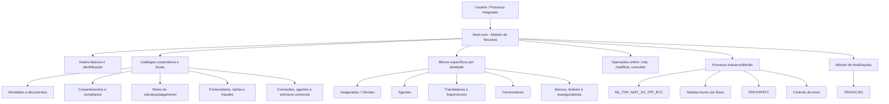
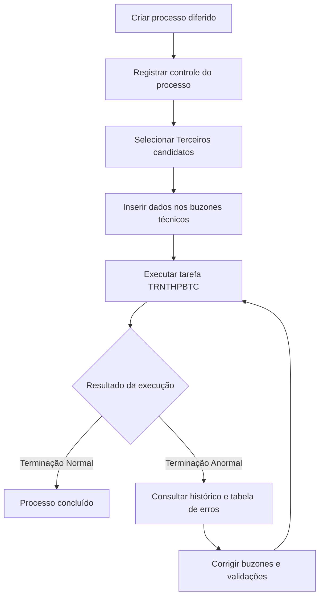

# Reef.core — Módulo de Terceiros: Catálogos, Operações, Processos Massivos e Configurações

## 1. Metadados do Documento
- **Arquivo de Origem:** Não identificado; conteúdo bruto fornecido na conversa.
- **Tipo de Documento:** Manual Operacional, Especificação Funcional e Referência Técnica.
- **Domínio / Sistema:** Reef.core — Módulo de Terceiros da MAPFRE.
- **Público-Alvo:** Arquitetos, desenvolvedores, operação, áreas de negócio, tesouraria, sinistros, compliance e administração local.
- **Data/Versão Identificada:** Não identificada. Lifecycle indicado: `Approved`.

---

## 2. Resumo Executivo & Contexto de Negócio

O módulo de **Terceiros do Reef.core** centraliza a identificação, classificação, criação, alteração, consulta, inabilitação e histórico de pessoas físicas e jurídicas que participam dos processos de uma entidade seguradora. Cada Terceiro é relacionado a uma ou mais atividades, e cada atividade define seu uso operacional em processos como emissão, sinistros, comissões, pagamentos, cobranças, fornecedores, compliance e relacionamento com clientes.

A atividade atribuída a um Terceiro é um elemento estruturante do modelo. Por exemplo, a atividade de Agente permite participação em processos de comissionamento; a atividade de Perito pode ser usada em processos de sinistros; a atividade de Asegurado/Cliente permite operar apólices, consentimentos, fidelização, dados analíticos e permissões de condução. O documento determina que determinados códigos de atividade pertencem ao núcleo do Reef.core e devem ser obrigatoriamente respeitados.

O modelo combina catálogos configuráveis por companhia e idioma com valores corporativos obrigatórios. Entre os principais catálogos estão atividades, atividades econômicas, categorias, agrupamentos, classificações, qualidade, consentimentos, documentos identificadores, meios de cobrança/pagamento, perfis financeiros, regimes fiscais, relações entre Terceiros, tipos de pessoa jurídica, profissões, formações e classificações de fraude.

O conteúdo também define operações online para criação, alteração e consulta de Terceiros, operações específicas por atividade e processamento massivo/diferido. O processo massivo utiliza tabelas de controle e “buzones” técnicos para registrar candidatos, detalhes e erros, sendo executado pela tarefa `TRNTHPBTC`. A geração de documentação de Terceiros é executada pela tarefa `TRNJVC001`, condicionada à configuração do módulo de Notificações e à habilitação da atividade.

---

## 3. Arquitetura, Componentes & Tecnologias Envolvidas

### Componentes funcionais identificados

| Componente | Função no contexto Reef.core |
| :--- | :--- |
| Módulo de Terceiros | Cadastro e manutenção de pessoas físicas e jurídicas. |
| Catálogos de Terceiros | Definição de códigos, classificações, estados, atributos e regras locais. |
| Módulo de Notificações | Geração de documentos de saída para Terceiros habilitados. |
| Módulo de Sinistros | Utiliza Supervisores, Tramitadores, critérios de atribuição e cessões temporárias. |
| Módulo de Tesouraria | Utiliza impostos, retenções, meios de cobrança/pagamento, tokens e entidades bancárias. |
| Estrutura de Produtos | Fornece Setor, Ramo Técnico, tratamentos de emissão e critérios operacionais. |
| Estrutura Comercial | Organiza Primeiro, Segundo e Terceiro Níveis; o terceiro nível pode representar escritório. |
| Estrutura Geográfica | Fornece país, estado, província, localidade, distrito e código postal. |
| Processo Massivo de Terceiros | Processamento diferido para criação e modificação de Terceiros. |
| Oracle | Banco de dados referenciado pelo modelo de catálogos, sequências e tabelas técnicas. |
| Lógica de Negócio Local | Componentes implementados localmente para validações, cálculos, atribuições e identificadores. |



### Fluxo do processo massivo/diferido



---

## 4. Regras de Negócio, Especificações Funcionais & Processos

### 4.1 Identificação e atividade de Terceiros

- Um Terceiro pode ser pessoa física ou jurídica.
- A identificação básica utiliza tipo e chave de documento identificador.
- A atividade determina os processos, estruturas de dados, comportamentos e operações disponíveis para o Terceiro.
- O Terceiro pode possuir código interno caso a atividade esteja configurada para isso.
- Quando houver geração automática do código interno, a tecnologia local deve definir a sequência Oracle correspondente.
- Um documento principal pode relacionar documentos adicionais ou alternativos, evitando tratar a mesma pessoa como Terceiros distintos.
- Documentos alternativos não devem ser capturados nos processos de Gestão de Apólices e Contratos nem de Gestão de Sinistros e Benefícios.
- A utilização de documentos fictícios depende da propriedade configurada para a atividade.
- A consulta de dados por usuários de agências depende do atributo da atividade; essa restrição visa reduzir risco de violação do RGPD.

### 4.2 Atividades corporativas relevantes

| Código | Atividade |
| :--- | :--- |
| 1 | Tomadores / Asegurados |
| 2 | Agentes |
| 3 | Peritos |
| 8 | Supervisores |
| 9 | Tramitadores |
| 10 | Proveedores |
| 13 | Aseguradoras |
| 14 | Reaseguradoras |
| 15 | Empleados |
| 16 | Brokers |
| 17 | Talleres |
| 18 | Clínicas |
| 37 | Empleados de Agentes |
| 39 | Compañías |
| 40 | Entidades Bancarias |
| 41 | Oficinas Bancarias |
| 42 | Primer Nivel Estructura Comercial |
| 43 | Segundo Nivel Estructura Comercial |
| 44 | Tercer Nivel Estructura Comercial |
| 45 | Representantes Legales |
| 99 | Otros Beneficiarios |

### 4.3 Regras de inabilitação, validade e histórico

- Diversos catálogos usam os atributos `Inhabilitación` e `Fecha de Validez`.
- `Inhabilitación` impede o uso do registro em operações de captura e/ou modificação, conforme o catálogo.
- `Fecha de Validez` determina a partir de quando o registro se torna operacional e permite histórico das alterações.
- Causas de inabilitação por atividade devem ser previamente definidas no catálogo mestre de causas de inabilitação.
- Se um Terceiro, Agente, Supervisor ou Tramitador estiver inabilitado, deve ser informada a causa de inabilitação aplicável.

### 4.4 Asegurados / Clientes

- Reef.core identifica Asegurados/Clientes pela atividade `1`.
- Podem ser classificados, receber qualidade, agrupamento comercial, tipo de retenção e forma de cobrança/pagamento.
- Podem possuir consentimentos, documentos alternativos, contatos, endereços, dados bancários, obrigações fiscais, representantes legais, acionistas, perfil analítico e licença de condução.
- Um Asegurado pode ser identificado como VIP, Robinson, participante de plano de fidelização ou Terceiro não desejado.
- Caso o controle de prevenção à lavagem de dinheiro esteja ativo e o Asegurado seja pessoa jurídica, o aviso de operações pode requerer um contato marcado como Terceiro de Referência.
- O campo “Primas Mayores a...” é associado ao controle de prevenção à lavagem de dinheiro.
- A cópia de dados de outro Terceiro para um novo Asegurado não transfere dados bancários.

### 4.5 Consentimentos

- Consentimento é manifestação livre, inequívoca, específica e informada para tratamento de dados pessoais.
- O catálogo de consentimentos é configurado por companhia e idioma.
- Os valores de tipos de consentimento habilitados no Reef.core devem ser respeitados.
- Cada consentimento pode possuir tipo, código, formato, data de início, data de fim, validade e inabilitação.
- Exemplos apresentados de tipo incluem publicidade, cessão de dados e perfilamento.
- Exemplos apresentados de formato incluem não concedido, tácito, expresso e retirado.

### 4.6 Agentes e comissões

- Reef.core identifica Agentes pela atividade `2`.
- Agentes podem ser classificados como produtores diretos e podem possuir situação ativa, inativa ou aposentada.
- Um Agente pode ter escritório comercial padrão, fonte de produção padrão, executivo de conta, assessor, organizador, contrato, credencial e número de colegiação.
- Quadros de comissões podem ser associados ao Agente por tratamento de emissão.
- A inabilitação de um quadro de comissões pode afetar somente nova produção ou também movimentos de carteira.
- Nova produção corresponde a comissões do primeiro ano de vigência da apólice.
- Carteira corresponde a comissões incidentes sobre apólices vigentes em anos posteriores.
- Um quadro de comissões não deve ser confundido com quadro de distribuição de comissões.
- Um quadro de distribuição pode estruturar até seis figuras de intermediação: Agente Principal, Segundo Agente, Terceiro Agente, Quarto Agente, Organizador e Assessor. O Executivo de Conta pode existir sem receber comissões.
- Fontes de produção e escritórios complementares inabilitados deixam de ser usados em nova produção, preservando o uso em apólices que já os possuíam.

### 4.7 Fidelização e Tréboles

- O Trébol é a moeda do plano de fidelização MAPFRE.
- Clientes precisam aderir ao plano para participar de promoções e obter Tréboles.
- As ações com códigos `1 - Cobro del Recibo` e `2 - Anulado de Cobro del Recibo` devem ser obrigatoriamente definidas.
- O tipo de ação pode ser `REDIMIR GENÉRICO` ou `INCREMENTAR GENÉRICO`.
- O número de Tréboles pode ser positivo ou negativo conforme a definição apresentada.
- Para ações com impacto em recibos e passíveis de troca de Tréboles, como emissão, suplemento ou renovação, deve ser informado zero no número de Tréboles.
- A lógica de negócio local pode calcular dinamicamente o número de Tréboles.
- A configuração pode definir acumulação, validade, parceiro colaborador e inabilitação.

### 4.8 Supervisores e Tramitadores

- Supervisores usam a atividade `8`; Tramitadores usam a atividade `9`.
- Supervisores e Tramitadores podem ser especializados por setor, ramo técnico, apólice e outros critérios.
- O setor genérico `9999` e o ramo técnico genérico `999` podem ser usados nas configurações descritas.
- A atribuição automática considera critérios de especialização e carga de trabalho.
- O número máximo de expedientes e o número de pendências podem impedir uma atribuição, ainda que os demais critérios sejam atendidos.
- Supervisores podem ter estrutura hierárquica multinível como Supervisor e Supervisor Responsável.
- Cessões temporárias permitem que um Tramitador destinatário assuma expedientes de um Tramitador cedente.
- Na cessão, as operações ficam registradas com o usuário do Tramitador que atua, mas o código de Tramitador permanece o do cedente.
- Tramitadores podem receber atuações secundárias para setor, ramo técnico e tipo de expediente.
- Tramitadores podem ser autorizados ou não a gerir expedientes judiciais, perda total, ocorridos no exterior, clientes VIP ou com contrário na MAPFRE.

### 4.9 Fornecedores

- Uma atividade deve estar marcada como fornecedor para habilitar as definições específicas de fornecedores.
- A configuração pode determinar blocos de informação por atividade: tarifas, zonas geográficas, serviços, serviços de valor agregado, dados de atendimento, capacidades, IQRFs, fraudes, avaliação e formação.
- O bloco de formação é explicitamente indicado como não implementado.
- Critérios de atribuição de serviços podem usar lógica de negócio local para proximidade, capacidade, avaliação ou outros critérios definidos pela companhia.
- A responsabilidade pela nomenclatura, implementação e associação da lógica de negócio de atribuição de serviços é do departamento local de Tecnologia e Processos.
- Tipologias, categorias, serviços, tarifas e zonas podem ser associadas por atividade de fornecedor.
- Para categorias e tipologias, pode existir um único registro genérico/não real por subconjunto de companhia e idioma.

### 4.10 Fraudes de fornecedores

- O modelo contempla classificação de fraude, tipologias, motivos, estados de gestão e tipos de conclusão.
- Uma matriz relaciona tipologia de fraude, tipo de conclusão e motivo de fraude.
- A configuração da matriz de motivos e tipos de fraude deve respeitar a configuração realizada no Reef.core.
- O controle de importes de fraude por ramo pode permitir ou impedir alteração de valores de salvamentos e honorários.
- O cálculo pode ser definido por tipo padrão ou por lógica de negócio dinâmica.

### 4.11 Meios de cobrança e pagamento

- Tipos, validações e mascaramentos de meios de cobrança/pagamento definidos e habilitados pelo núcleo devem ser obrigatoriamente respeitados.
- O catálogo pode classificar conta bancária, pagamento móvel/celular e cartão bancário.
- O meio pode ter entidade comercializadora, token, moeda, validade, validação, preferência e indicação de padrão.
- Após validar um meio de cobrança/pagamento, o sistema permite somente sua inabilitação, não a modificação de seus dados.
- O valor real, o valor mascarado e o valor criptografado são tratados como atributos distintos no modelo técnico.
- A tokenização substitui o número tradicional de conta ou cartão por token para uso em transações online ou móveis.

### 4.12 Entidades e escritórios bancários

- Entidades bancárias usam a atividade `40`; escritórios bancários usam a atividade `41`.
- O valor de atividade é constante e não pode ser alterado.
- Se não houver documento identificador próprio, o tipo de documento indicado é `THP`.
- SWIFT/BIC possui 8 ou 11 caracteres alfanuméricos.
- O documento declara que SWIFT/BIC é aplicado apenas em países fora da zona SEPA.
- Os três últimos caracteres do SWIFT podem identificar a sucursal; ausentes, considera-se o código configurado para a entidade bancária.
- O modelo também contempla entidade compradora para rastrear fusões e concentrações bancárias.

### 4.13 Processo massivo e tabelas buzón

- O processo diferido suporta Alta/Creación e Modificación.
- Inabilitar ou reabilitar um Terceiro deve ser implementado como Modificación.
- A situação inicial do processo é valor `1`.
- São listados os estados: `Sin Filtrar`, `Detalle Filtrado`, `Excepcionando`, `Ya Excepcionado` e `Ya Tratado`.
- A tarefa de execução é `TRNTHPBTC`.
- Resultado normal: `Terminación Normal`.
- Resultado com falha: `Terminación Anormal`.
- Em falha, devem ser consultados o histórico de execução, a situação do processo e o catálogo de erros, corrigindo os buzones antes de reprocessar.
- A revisão do processo requer participação da área de Tecnologia MAPFRE local.

---

## 5. Tabelas de Parâmetros, Ambientes e Estruturas de Dados

### Atividades e operações principais

| Item / Parâmetro | Descrição / Função | Tipo / Valores / Formato | Ambiente / Observações |
| :--- | :--- | :--- | :--- |
| Código de Atividade | Identifica a natureza operacional do Terceiro | Código numérico | Códigos corporativos devem ser respeitados. |
| Companhia | Contexto organizacional de catálogos e Terceiros | Código de companhia | Presente na maioria das configurações. |
| Idioma | Idioma da descrição de catálogos | Espanhol, inglês, turco e outros citados | Catálogos frequentemente definidos por companhia e idioma. |
| Inhabilitación | Desativa o uso de um registro | Indicador | Aplica-se a catálogos e dados operacionais. |
| Fecha de Validez | Início de vigência operacional | Data | Permite histórico de mudanças. |
| Lógica de Negócio | Implementa validação, cálculo ou decisão dinâmica | Componente local | Dependente da Direção de Tecnologia local em vários casos. |
| Código de Terceiro | Identificador interno do Terceiro | Código interno | Pode ser automático ou manual conforme atividade. |
| Tipo Documento + Chave | Identificação primária do Terceiro | Tipo e valor | Usado em criação, consulta e processo massivo. |

### Tarefas do núcleo

| Tarefa | Função | Parâmetros / Observações |
| :--- | :--- | :--- |
| `TRNJVC001` | Gera documentação de saída do Terceiro | Executada pelo lançador de tarefas; requer módulo de Notificações e atividade habilitada. |
| `TRNTHPBTC` | Executa processo massivo/diferido de Terceiros | Requer companhia, data de tratamento, identificador do processo, ordem, reprocessamento em erro, idioma e usuário. |

### Principais tabelas técnicas

| Tabela | Descrição | Uso técnico |
| :--- | :--- | :--- |
| `ML_THP_NWT_XX_TPP_BTC` | Tabela controle de processos massivos de Terceiros | Controle de candidatos, movimento, estado, data, ordem e atividade. |
| `ML_THP_NWT_XX_TPP_BTC_ERR` | Tabela buzón de erros de processos batch | Armazena identificador, erro, observação e rota do erro. |
| `ML_THP_NWT_XX_SHL` | Tabela buzón de acionistas | Dados de acionistas em movimento diferido. |
| `T_THP_TRN_M_ACV` | Tabela buzón de atividades de um Terceiro | Atividades, relações e vigência. |
| `T_THP_TRN_M_AGN` | Tabela buzón de Agente | Dados específicos de Agentes. |
| `ML_THP_NWT_XX_UNI` | Tabela buzón de Asegurado No Deseado | Marcação por setor, ramo, escritório, agente e causa. |
| `T_THP_TRN_M_INY` | Tabela buzón Terceiro Asegurado | Dados específicos de Asegurados. |
| `ML_THP_NWT_XX_TMN` | Tabela buzón de consentimento de cliente | Consentimentos, formato, vigência e inabilitação. |
| `ML_THP_NWT_XX_CNT` | Tabela buzón de contatos | Meios de contato, prioridade, validação e referência. |
| `ML_THP_NWT_XX_ADR` | Tabela buzón de endereços | Endereço, geografia, padrão, fiscal e validação. |
| `ML_THP_NWT_XX_ARM` | Tabela buzón de documentos alternativos | Documento alternativo, emissor, validade e validação. |
| `T_THP_TRN_M_LCN` | Tabela buzón de licenças | Licença de condução, estado e zona de expedição. |
| `ML_THP_NWT_XX_PCM` | Buzón de meios de pagamento e cobrança | Meio criptografado, token, moeda, validação e preferência. |
| `ML_THP_NWT_XX_TXL_CNY` | Tabela buzón de países com obrigações fiscais | País adicional, identificador tributário e vigência. |
| `ML_TPD_NWT_XX_ALP` | Tabela buzón de perfil analítico | CLTV, abandono, propensões, score e comportamento digital. |
| `T_THP_TRN_M_PRS` | Tabela buzón de pessoa | Dados pessoais, jurídicos, fiscais, econômicos e documentais. |
| `ML_THP_NWT_XX_PRS_PCE` | Buzón de pessoas politicamente expostas | Relação PEP, cargo, familiar/colaborador e validade. |
| `ML_THP_NWT_XX_LGR` | Tabela buzón de representantes legais | Representação, PEP, investigação e atividades ilícitas. |
| `ML_TRN_NWT_XX_GTP` | Tabela buzón Terceiro Genérico | Dados específicos de Terceiros Genéricos. |

### Campos mínimos recorrentes em buzones

| Campo | Descrição / Função | Tipo / Valores / Formato | Ambiente / Observações |
| :--- | :--- | :--- | :--- |
| `CMP_VAL` | Companhia | Código | Frequentemente obrigatório. |
| `BTC_IDN_VAL` / `IDN_VAL` | Identificador do processo ou registro | Identificador | Obrigatório em diversos buzones. |
| `SQN_VAL` / `IDN_SQN` | Sequência | Número | Distingue linhas dentro do identificador. |
| `THP_DCM_TYP_VAL` | Tipo de documento do Terceiro | Código | Usado para identificação. |
| `THP_DCM_VAL` | Documento do Terceiro | Valor | Usado para identificação. |
| `THP_ACV_VAL` | Atividade do Terceiro | Código de atividade | Define tipo funcional. |
| `VLD_DAT` | Data de validade | Data | Controle de vigência. |
| `DSB_ROW` | Linha inabilitada | Indicador | Usado para inabilitação. |
| `USR_VAL` | Usuário que atualizou a linha | Código de usuário | Normalmente obrigatório. |
| `MDF_DAT` / `MDF_VAL` | Data de modificação | Data | Normalmente obrigatória. |
| `ACN_ORG_VAL` | Ação de origem | `I` para inserir; `M` para modificar | Opcional em várias tabelas. |
| `ERR_IDN_VAL` | Identificador interno de erro | Código | Usado em processamento e controle de erros. |
| `PRC_THD_VAL` | Hilo / thread de processo | Código | Usado em execução paralela. |
| `PRC_STS_VAL` | Situação do processo | Estado | Processo inicial pode receber valor `1`. |

---

## 6. Bateria de Perguntas & Respostas para RAG (FAQ Sintético)

### P1: Qual é a finalidade do código de atividade de um Terceiro no Reef.core?
**R:** O código de atividade identifica a natureza funcional do Terceiro e determina os processos, estruturas de dados e regras operacionais aplicáveis. Por exemplo, Asegurados utilizam atividade `1`, Agentes utilizam `2`, Supervisores utilizam `8`, Tramitadores utilizam `9`, Entidades Bancárias utilizam `40` e Escritórios Bancários utilizam `41`.

### P2: Quais atividades devem ser respeitadas obrigatoriamente no núcleo do Reef.core?
**R:** O documento estabelece que os códigos próprios do núcleo devem ser obrigatoriamente respeitados. Também determina que as intervenções permitidas por atividade e os tipos de Terceiro configurados corporativamente devem ser respeitados.

### P3: Como funciona a inabilitação de um Terceiro ou catálogo?
**R:** O atributo `Inhabilitación` indica que o registro não pode ser usado em operações de captura e/ou modificação, conforme o catálogo ou bloco funcional. Quando aplicável, deve ser associado a uma causa de inabilitação previamente definida. A data de validade permite preservar o histórico da alteração.

### P4: Como o Reef.core executa o processo massivo de Terceiros?
**R:** Primeiro é criado o processo diferido e registrados os Terceiros candidatos no catálogo de controle. Depois, os dados são inseridos nas tabelas buzón correspondentes. A execução ocorre com a tarefa `TRNTHPBTC`. Em caso de terminação anormal, devem ser analisados o histórico, a situação do processo e a tabela de erros; os buzones devem ser corrigidos e o processo reexecutado.

### P5: Qual tarefa gera documentos para um Terceiro?
**R:** A geração de documentos é feita pela tarefa do núcleo `TRNJVC001`, executada pelo lançador de tarefas. A atividade do Terceiro deve permitir geração documental e a integração com o módulo de Notificações deve estar habilitada.

### P6: Qual é a diferença entre comissões de nova produção e comissões de carteira?
**R:** Comissões de nova produção são percebidas exclusivamente durante o primeiro ano de vigência da apólice e normalmente têm maior valor para incentivar captação. Comissões de carteira decorrem das apólices vigentes em anos posteriores e permanecem enquanto essas apólices estiverem vigentes.

### P7: Como funcionam os critérios de atribuição de Tramitadores?
**R:** Tramitadores podem ser especializados por setor, ramo técnico, apólice, agente, apólice grupo, contrato, subcontrato, níveis da estrutura comercial e tipo de expediente. Também podem ser habilitados ou não para expedientes judiciais, perda total, ocorridos no exterior, clientes VIP e casos com contrário na MAPFRE. A capacidade máxima e o volume pendente podem impedir a atribuição.

### P8: Quais são os códigos genéricos disponíveis para especialização de Supervisores e Tramitadores?
**R:** O Reef.core permite utilizar o setor genérico `9999` e o ramo técnico genérico `999`. A combinação desses valores com critérios mais específicos permite atribuir sinistros de todos, alguns ou apenas um setor ou ramo técnico.

### P9: O que acontece quando um meio de cobrança ou pagamento é validado?
**R:** Depois que um meio de cobrança/pagamento é comprovado e validado, o sistema permite somente sua inabilitação; a modificação de seus dados deixa de ser permitida.

### P10: Os documentos alternativos podem ser usados em qualquer processo?
**R:** Não. Embora possam identificar alternativamente o Terceiro e relacionar documentos como NIF, NUU ou TEC, a captura de documentos alternativos não está permitida nem deve ser permitida em Gestão de Apólices e Contratos ou Gestão de Sinistros e Benefícios.

### P11: Como o sistema trata Pessoas Politicamente Expostas?
**R:** O sistema permite identificar o próprio Terceiro como PEP ou relacioná-lo a familiar ou colaborador próximo com essa condição. O bloco registra cargo ou relação, documentos da pessoa relacionada, datas de alta e baixa e situação de inabilitação, permitindo suporte a controles de compliance e prevenção de delitos financeiros.

### P12: Quais dados são necessários para uma entidade bancária no Reef.core?
**R:** A entidade bancária usa atividade constante `40`, identificação documental, chave bancária, nome, dados geográficos e de contato, tipologia bancária, tipo de instituição, tipo de domiciliação, data de constituição, nacionalidade, SWIFT/BIC, referência, entidade compradora e dias adicionais para data valor.

---

## 7. Glossário de Termos, Siglas & Conceitos-Chave

- **Asegurado / Cliente:** Terceiro identificado pela atividade `1`.
- **Agente:** Intermediário identificado pela atividade `2`.
- **BIC:** *Bank Identifier Code*; denominação também usada para código SWIFT.
- **Broker:** Intermediário de seguros ou resseguros; atividade `16`.
- **CLTV:** *Customer Lifetime Value*; previsão de valor econômico de um cliente durante seu relacionamento com a empresa.
- **DPM:** Daños Materiales Propios; exemplo de tipo de expediente.
- **IQRF:** Incidências, Quejas, Reclamaciones y Felicitaciones relacionadas a fornecedores.
- **MAPFRE:** Entidade corporativa citada como responsável por configurações e processos locais.
- **PEP / P.E.P.:** *Politically Exposed Person*; Pessoa Politicamente Exposta.
- **RGPD:** Regulamento Geral de Proteção de Dados.
- **Ramo Técnico:** Classificação de produto usada em emissão, sinistros, comissões e especialização.
- **Reef.core:** Sistema núcleo documentado para gestão de Terceiros e processos associados.
- **SEPA:** Zona Única de Pagamentos em Euros.
- **SWIFT:** *Society for Worldwide Interbank Financial Telecommunication*.
- **Terceiro Genérico:** Conjunto de atividades como Peritos, Médicos, Advogados, Oficinas, Clínicas, Prestadores e outras listadas no documento.
- **Tramitador:** Responsável por gerir expedientes de sinistros; atividade `9`.
- **Trébol:** Moeda utilizada no Plano de Fidelização MAPFRE.
- **Buzón:** Tabela de staging/caixa postal usada no processo massivo diferido.
- **Nueva Producción:** Primeiro ano de vigência da apólice para fins de comissionamento.
- **Cartera:** Apólices vigentes em períodos posteriores ao primeiro ano.

---

## 8. Notas Críticas, Riscos & Limitações

- **Nota de Análise:** O conteúdo é uma extração bruta com repetições, falhas de codificação e fragmentos truncados; termos como `con guración`, `identi cación` e `O cina` refletem a extração original.
- O documento não informa versões do Reef.core, URLs, endpoints, contratos HTTP, portas ou arquitetura de infraestrutura.
- Diversas funcionalidades dependem de configuração local, lógica de negócio local ou intervenção da Direção de Tecnologia local.
- O catálogo de Métodos de Envio está explicitamente descontinuado e obsoleto; foi substituído pelo módulo de Notificações.
- O bloco de Formação de Fornecedores é declarado como não implementado.
- A revisão de processos massivos requer participação da área de Tecnologia da MAPFRE local.
- A obrigatoriedade de campos varia por atividade, tipo de pessoa física/jurídica, parâmetros da companhia e modificações locais.
- Algumas descrições do material possuem inconsistências aparentes, como referências de Tramitador em seções de níveis da estrutura comercial; a síntese preserva o significado declarado sem corrigir ou inferir comportamento adicional.
- Não há detalhamento dos valores corporativos habilitados para diversos atributos; o documento apenas exige que sejam respeitados.

---

## 9. Conteúdo Bruto Estruturado (Referência Fiel)

```text
Fonte: conteúdo bruto integral fornecido na mensagem de entrada.

Principais blocos literais identificados:
- DEFINICIÓN de las Actividades de los Terceros
- DEFINICIÓN de las Actividades Económicas
- DEFINICIÓN de las Agrupaciones de Terceros
- DEFINICIÓN de los Códigos de Calificación (Rating)
- DEFINICIÓN de los Campos Obligatorios en el Registro de la Información de los Terceros
- DEFINICIÓN de Cargos en Personas Jurídicas
- DEFINICIÓN del Catálogo de Catálogos Multipropósito de Terceros
- DEFINICIÓN de Categorías
- DEFINICIÓN de Causas de Inhabilitación
- DEFINICIÓN de Consentimientos de los Asegurados
- DEFINICIÓN de Tipos de Documentos Identificativos de Terceros
- DEFINICIÓN de Entidades Comercializadoras de Medios de Cobro y Pago
- DEFINICIÓN de Estados del Permiso de Conducir
- DEFINICIÓN de Impuestos y Retenciones por Actividad
- DEFINICIÓN de Asegurados, Agentes, Supervisores y Tramitadores
- DEFINICIONES de Proveedores, Tarifas, Zonas, Servicios y Fraudes
- OPERACIONES de crear, modificar y consultar Terceiros
- PROCESOS masivos/diferidos y modelo técnico de tablas buzón.
```
