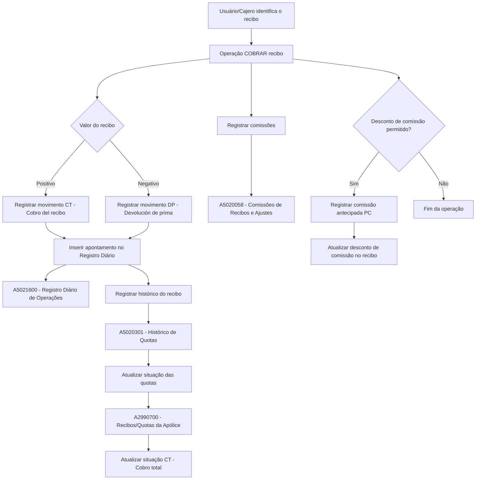
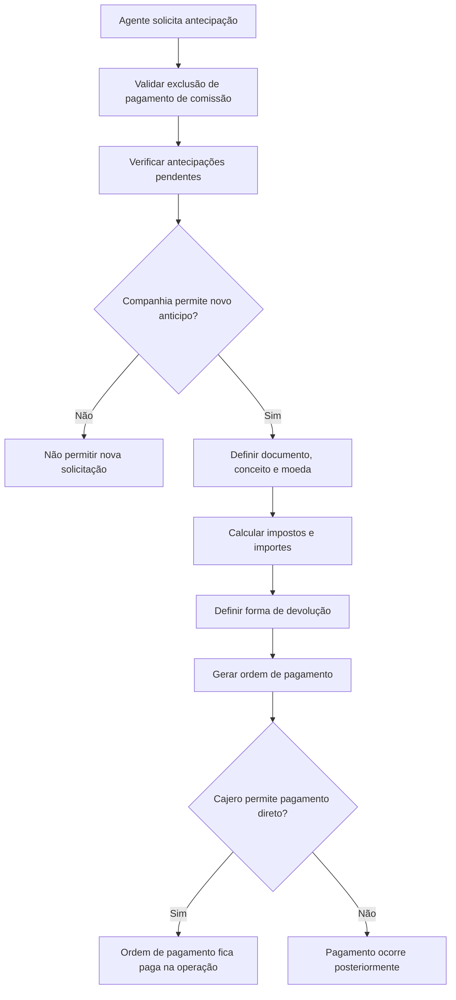

# Documentação Reef — Tesouraria: Definições, Operações de Cobro/Pagamento e Modelo de Dados

## 1. Metadados do Documento
- **Arquivo de Origem:** Texto bruto extraído de documentação corporativa Reef / Mapfredocument.
- **Tipo de Documento:** Manual Operacional, Especificação Funcional e Modelo de Dados.
- **Domínio / Sistema:** Reef — Tesouraria, Cobros, Ordens de Pagamento, Comissões, Impostos e Contabilidade.
- **Público-Alvo:** Analistas funcionais, desenvolvedores, arquitetos, operação de tesouraria e equipes contábeis.
- **Data/Versão Identificada:** Não identificada. O conteúdo aparece como `Approved` e `Source` no Mapfredocument.

---

## 2. Resumo Executivo & Contexto de Negócio

A documentação Reef descreve a configuração e operação do módulo de **Tesouraria**, incluindo a definição de cajeros, impostos, contas simplificadas, gestores de cobrança, documentos de cobrança e pagamento, ordens de pagamento, conceitos contábeis, cartões de crédito e operações de cobro de recibos.

O papel de **cajero** controla quem pode operar o registro diário de tesouraria, quais ambientes funcionais estão disponíveis e quais usuários podem executar funções críticas, como fechar o registro diário. A estrutura comercial, especialmente os níveis 2 e 3, determina a abrangência de consulta, imputação de despesas e responsabilidades de fechamento.

O processo de **cobro de recibo** registra o recebimento financeiro, atualiza a situação do recibo para `CT — Cobro total`, cria movimentos no histórico de quotas, registra apontamentos no registro diário e calcula ou registra comissões relacionadas ao agente e demais intervenientes da apólice. Quando o recibo é negativo, o processo registra uma devolução de prêmio identificada como `DP`.

As operações de ordens de pagamento dependem de definições prévias, como reservas de numeração, tipos de documentos, autorização por valor, relação entre escritórios geradores e pagadores, conceitos de cobro/pagamento e permissões por usuário. O documento também descreve antecipações de comissões para agentes, incluindo formas de devolução em parcelas, no vencimento ou por percentual aplicado nas liquidações de comissões.

Grande parte das páginas de configuração aparece marcada como `EN CONSTRUCCIÓN`. Portanto, a documentação confirma os objetivos e alguns atributos dessas configurações, mas não detalha todos os campos, contratos, telas, validações técnicas ou processos de persistência.

---

## 3. Arquitetura, Componentes & Tecnologias Envolvidas

### Componentes funcionais identificados

| Componente | Responsabilidade documentada |
| :--- | :--- |
| Reef / Reef.core | Aplicação corporativa referenciada para operações de tesouraria e geração de ordens de pagamento. |
| Registro diário de operações | Registra apontamentos contábeis de tesouraria, incluindo cobro de recibos, devoluções e comissões antecipadas. |
| Parte contábil | Contexto operacional aberto no qual os cajeros registram operações e realizam fechamentos. |
| Estrutura comercial | Estrutura organizacional com níveis, especialmente nível 2 e nível 3, usada para definir escritório, cajero e imputação. |
| Cajero | Usuário autorizado a operar ambientes de tesouraria e registro diário. |
| Gestor de cobro | Pessoa ou entidade classificada para a cobrança de recibos. |
| Ordem de pagamento | Documento operacional para pagamentos, inclusive antecipações de comissão. |
| Conceito de cobro y pago | Conceito contábil que determina natureza da despesa, impostos e conta de imputação. |
| Agrupación contable | Classificação contábil gravada nos apontamentos para análise posterior. |
| Agrupación de impuestos | Agrupa impostos e retenções aplicáveis a conceitos de cobro/pagamento. |
| Registro histórico de quotas | Histórico de movimentos realizados sobre recibos e quotas. |
| Liquidação de comissões | Processo posterior que utiliza os registros de comissão e antecipações como base. |

### Fluxo funcional de cobro de recibo



### Fluxo de antecipação de comissão



> **Nota de Análise:** O conteúdo não especifica tecnologias de implementação, APIs, protocolos, versões de banco de dados, microsserviços, URLs, servidores ou contratos JSON.

---

## 4. Regras de Negócio, Especificações Funcionais & Processos

### 4.1 Definição e responsabilidades do cajero

- Cada cajero é associado a uma **companhia** e a um usuário da aplicação.
- O cajero pode ser:
  - `P`: cajero principal.
  - `S`: cajero secundário.
- Para cada nível 3 da estrutura comercial deve existir um cajero principal e podem existir tantos cajeros secundários quanto necessários.
- Somente o cajero principal pode fechar o registro diário.
- Um cajero secundário com tipo de substituição `R` pode substituir o cajero principal.
- Se um cajero secundário substituto entrar no parte contábil antes do cajero principal da oficina comercial, o cajero secundário assume o papel de principal naquele dia.
- Um cajero principal pode ser marcado como o **último principal da companhia**. Esse cajero é responsável por fechar o registro diário e gerar o assento de tesouraria do dia.
- O fechamento do registro diário requer que todos os cajeros da companhia tenham fechado seus registros e estejam quadrados.
- Após o fechamento do parte contábil, somente o cajero último principal pode abrir o próximo parte com a nova data de assento.
- Um cajero principal de nível 2 pode consultar movimentos de cajeros de todos os níveis 3 de sua estrutura comercial.
- O atributo de data de valor permite que o cajero altere a data usada para obtenção do tipo de câmbio em cobranças de moeda estrangeira.
- Um cajero central pode pagar qualquer tipo de ordem de pagamento, incluindo sinistros, tesouraria e agente.
- Um cajero com permissão de pagamento direto pode efetuar pagamentos durante a geração da ordem de pagamento.
- Cajeros externos são usados em processos automáticos de cobrança.

### 4.2 Ambientes de operação do registro diário

| Ambiente | Operação permitida |
| :--- | :--- |
| Entorno 1 | Cobros. |
| Entorno 2 | Geração de ordens de pagamento. |
| Entorno 3 | Pagamento de ordens de pagamento. |
| Entorno 4 | Anulação de ordens de pagamento. |

### 4.3 Estado e auditoria do cajero

- Um cajero ativo está trabalhando com o registro diário.
- Um cajero quadrado não possui diferença entre saldo devedor e saldo credor das operações realizadas no parte contábil.
- A situação de quadratura é atualizada em cada fechamento.
- O sistema mantém o último ambiente em que o cajero trabalhou.
- O sistema mantém o último número de transação para cobros, pagamento de ordens, geração de ordens e anulação de ordens.
- Um cajero inabilitado não pode acessar o registro diário de operações.
- A auditoria registra data de alta, data de baixa e observações associadas à inabilitação.

### 4.4 Cobro de recibo

O processo de cobro de recibo registra dinheiro entregue pelo cliente para quitar o prêmio devido em uma apólice para determinado período. Durante o cobro, agentes podem descontar comissões, recargos e impostos, desde que os respetivos valores sejam registrados.

O processo inclui:

1. Registrar o recibo cobrado.
2. Descontar comissão do recibo, quando aplicável.
3. Descontar impostos do recibo, quando aplicável.
4. Descontar recargos do recibo, quando aplicável.
5. Executar outras operações.

#### Regras do movimento de cobro

- Recibo positivo gera movimento `CT — Cobro del recibo`.
- Recibo negativo gera movimento `DP — Devolución de prima`.
- O apontamento é criado como novo movimento no assento contábil aberto.
- O apontamento é registrado na conta de recibos pendentes.
- Recibo positivo é imputado no `Haber`.
- Devolução de prêmio é imputada no `Debe`.
- Os importes são registrados na moeda do recibo.
- O histórico de movimentos do recibo é atualizado.
- A situação de todas as quotas que compõem o recibo é atualizada para `CT`.
- Comissões do agente e de demais intervenções da apólice são registradas para utilização futura na liquidação de comissões.

### 4.5 Desconto de comissão durante o cobro

- Cada instalação pode decidir se permite ao agente descontar a comissão durante o cobro.
- O desconto é permitido somente ao agente principal da apólice, desde que seja o gestor de cobro do recibo.
- A comissão descontada é líquida de retenções e impostos.
- O registro diário identifica o movimento como `PC — Comisión anticipada`.
- Para recibo positivo, a comissão descontada é imputada no `Debe`.
- Para devolução de prêmio, a comissão descontada é imputada no `Haber`.
- O valor é registrado na moeda do recibo.
- A comissão descontada é registrada como antecipação com:
  - Tipo de devolução `2 — vencimiento`.
  - Tipo de antecipação `3 — montos`.
- O recibo é atualizado para registrar que a comissão já foi descontada.

### 4.6 Ordens de pagamento

A definição de ordem de pagamento contempla:

1. Reserva de numeração de ordem de pagamento.
2. Ordem de pagamento por usuário.
3. Tipos de documentos.
4. Relação entre agências/escritórios geradores e pagadores.

A relação entre escritórios geradores e pagadores define, para cada escritório que gera uma ordem de pagamento, o escritório ao qual o gasto será imputado. Ambos devem existir no catálogo da estrutura comercial no nível 3.

No Reef.core, a oficina geradora é obtida a partir do usuário que está criando a ordem de pagamento. Cada usuário possui uma oficina de nível 3 associada.

### 4.7 Tipos de documento de cobro e pagamento

- O tipo de documento identifica documentos usados para cobrar ou pagar em tesouraria e sinistros.
- O documento pode indicar se:
  - Pode ser utilizado em operações de cobrança, pagamento ou ambas.
  - Inclui IVA.
  - Inclui retenção.
  - Deve ser registrado no livro de compras.
  - Retifica documento oficial previamente emitido.
  - É documento real/oficial.
  - Deve ser registrado antes da geração da ordem de pagamento.
  - Possui lógica de validação.
  - Permite exclusão física após registro.
  - Pode agrupar outros documentos.
  - É utilizado em sinistros.
  - Exige número de fatura em sinistros.
  - Tem imposto que compõe custo do sinistro.
  - É registrado no processo de registro de faturas.

### 4.8 Conceitos de cobro e pagamento

- O conceito de cobro/pagamento determina o tipo de gasto, impostos aplicáveis e conta contábil de imputação da ordem de pagamento.
- Um conceito deve possuir agrupação contábil.
- Um conceito pode possuir agrupação de impostos.
- A classificação do conceito identifica a natureza do gasto ou âmbito de uso, como sinistros ou comissões de agentes.
- A data estimada de pagamento é influenciada pelo atributo `Días de pago`.
- Quando uma ordem de pagamento possui mais de um conceito, a data estimada utiliza o menor número de dias entre os conceitos informados.

### 4.9 Antecipação de comissão para agente

- O agente não pode solicitar nova antecipação com antecipações pendentes, exceto se a companhia permitir.
- A operação gera uma ordem de pagamento.
- O pagamento pode ocorrer posteriormente ou na mesma operação, quando o cajero tiver permissão para pagamento direto.
- O tipo de documento deve ser de pagamento (`P`) ou de cobrança e pagamento (`A`).
- O conceito de antecipação deve:
  - Pertencer à agrupação contábil `PC — anticipo de comisiones`.
  - Estar classificado como `AC — Agentes comisiones`.
  - Estar classificado como movimento de pagamento `P`.
- Para moedas não locais, o tipo de câmbio é obtido na data da solicitação.
- A antecipação pode ser devolvida:
  1. Por número de parcelas.
  2. No vencimento.
  3. Por percentual aplicado nas liquidações de comissão.

---

## 5. Tabelas de Parâmetros, Ambientes e Estruturas de Dados

### 5.1 Parâmetros do cajero

| Item / Parâmetro | Descrição / Função | Tipo / Valores / Formato | Ambiente / Observações |
| :--- | :--- | :--- | :--- |
| Compañía | Identifica a companhia em que o cajero pode trabalhar. | Chave de companhia. | Geral. |
| Cajero | Identifica o usuário da aplicação como cajero. | Chave de usuário. | Geral. |
| Nombre del cajero | Nome exibido para identificar o cajero. | Texto. | Pode ser igual ou diferente do nome do usuário. |
| Tipo de cajero | Define se o cajero é principal ou secundário. | `P`, `S`. | Somente principal fecha registro diário. |
| Tipo de reemplazo | Define capacidade de substituir cajero principal. | `P`, `R`, sem valor. | `P` somente para cajero principal. |
| Último | Define o último cajero principal da companhia. | Indicador. | Fecha o registro diário e gera assento de tesouraria. |
| Principal de nivel 2 | Permite consultar cajeros dos níveis 3 subordinados. | Indicador. | Estrutura comercial. |
| Fecha de valor | Permite alterar data de câmbio em cobranças estrangeiras. | Indicador. | Cobros em moeda estrangeira. |
| Cajero central | Identifica cajero da oficina central contábil. | Indicador. | Pode pagar qualquer tipo de ordem. |
| Pago directo | Autoriza pagar a ordem na própria geração. | Indicador. | Ordens de pagamento. |
| Nivel 3 | Nível 3 associado ao usuário/cajero. | Código. | Estrutura comercial. |
| Traspasos de caja a banco | Autoriza transferências de caixa para banco. | Indicador. | Tesouraria. |
| Externo | Identifica cajero para processos automáticos de cobro. | Indicador. | Processos automáticos. |
| Activo | Indica se trabalha no registro diário. | Indicador. | Estado. |
| Cuadrado | Indica equilíbrio entre saldos devedores e credores. | Indicador. | Atualizado nos fechamentos. |
| Entorno | Último ambiente em que trabalhou. | Código de ambiente. | Atualizado pelo registro diário. |
| Inhabilitado | Impede acesso ao registro diário. | Indicador. | Auditoria. |
| Fecha de alta | Data de identificação do usuário como cajero. | Data. | Auditoria. |
| Fecha de baja | Data de inabilitação do cajero. | Data. | Auditoria. |
| Observaciones | Motivo ou comentário sobre inabilitação. | Texto. | Auditoria. |

### 5.2 Gestores de cobro

| Item / Parâmetro | Descrição / Função | Tipo / Valores / Formato | Ambiente / Observações |
| :--- | :--- | :--- | :--- |
| Compañía | Companhia da definição. | Código. | Obrigatório no contexto da definição. |
| Tipo de gestor | Chave do gestor na aplicação. | Ex.: `AG`, `BA`. | Identificação funcional. |
| Nombre de tipo de gestor | Descrição do tipo de gestor. | Texto. | Ex.: Agente, Banco. |
| Clase de gestor | Determina comportamento na aplicação. | `1` a `10`, ou valor não padrão. | Valores fora da lista padrão não são gestores padrão. |
| Programa | Lógica que obtém relação de tipos por classificação. | Lógica de negócio. | Não há implementação detalhada. |
| Programa valida | Lógica que valida gestor não padrão. | Lógica de negócio. | Não há implementação detalhada. |

| Classe | Classificação |
| :--- | :--- |
| `1` | AGENTE |
| `2` | BANCO |
| `3` | COBRADOR |
| `4` | DÉBITO AUTOMÁTICO EM CONTA |
| `5` | GESTOR DIRETO |
| `6` | GESTOR PILOTO COASEGURO |
| `7` | OFICINA COMERCIAL |
| `8` | DÉBITO COM CARTÃO DE CRÉDITO |
| `10` | GESTOR DE IMPAGOS |

### 5.3 Documentos de cobro e pagamento — exemplos

| Documento | Nome |
| :--- | :--- |
| `FA` | Factura |
| `IN` | Indemnización |
| `NC` | Nota de Crédito |
| `ND` | Nota de Débito |

### 5.4 Exemplos de conceitos de cobro e pagamento

| Conceito | Nome | Nome curto | Tipo de conceito |
| :--- | :--- | :--- | :--- |
| `S07` | Honorarios perito | Honorarios | `SI` — Siniestros |
| `DCT` | Descuento comisiones | Dcto.Comi. | `AC` — Agentes comisiones |
| `S06` | Indemnización lesionado | Indemniza. | `SI` — Siniestros |
| `DC` | Descuento de comisiones cobro | Dcto.Cobro | `AC` — Agentes comisiones |
| `PC1` | Comisiones anticipadas | Anticipo | `AC` — Agentes comisiones |

| Agrupação contábil | Conceito associado |
| :--- | :--- |
| `PS` — Pago de siniestros | `S07` — Honorarios Perito |
| `PS` — Pago de siniestros | `S06` — Indemnización lesionado |
| `DC` — Comisión automática | `DC` — Descuento de comisiones cobro |
| `PC` — Comisión anticipada | `DCT` — Descuento comisión |
| `PC` — Comisión anticipada | `PC1` — Comisión anticipada |

### 5.5 Tabelas envolvidas em “Registrar recibo cobrado”

| Tabela | Descrição | Papel no processo |
| :--- | :--- | :--- |
| `A5021600` | Registro diario de operaciones | Registra o apontamento contábil do cobro ou devolução. |
| `A5020301` | Movimientos o histórico de cuotas | Cria histórico de movimento do recibo/quotas. |
| `A2990700` | Recibos/cuotas de una póliza | Atualiza a situação do recibo e suas quotas. |
| `A5020058` | Comisiones de recibos y ajustes | Registra comissões e ajustes vinculados ao recibo. |

### 5.6 Campos relevantes — A5021600

| Item / Parâmetro | Descrição / Função | Tipo / Valores / Formato | Ambiente / Observações |
| :--- | :--- | :--- | :--- |
| `COD_CIA` | Companhia. | Mantido. | Registro diário. |
| `FEC_ASTO` | Data do assento. | Atualizada quando muda. | Registro diário. |
| `NUM_ASTO` | Número do assento. | Atualizada quando muda. | Registro diário. |
| `NUM_OPER_ASTO` | Número sequencial da operação. | Sequencial. | Registro diário. |
| `COD_NIVEL3` | Nível 3 da estrutura comercial. | Obrigatório. | Estrutura comercial. |
| `TIP_ACTU` | Tipo de atualização. | `CT` ou `DP`. | `CT` para recibo positivo; `DP` para devolução. |
| `COD_CTA` | Conta contábil. | Obrigatório. | Conta de recibos pendentes. |
| `FEC_VALOR` | Data de valor. | Obrigatória. | Data informada pelo usuário, se permitida; caso contrário, data do assento. |
| `NUM_CRUCE` | Número de cruce. | Opcional. | Preenchido quando existir cobro antecipado. |
| `NOM_MOVIM` | Descrição do movimento. | Obrigatório. | Descrição da agrupação contábil do tipo de atualização. |
| `TIP_GESTOR` / `COD_GESTOR` | Gestor de cobro. | Opcional. | Atualizado quando for permitida alteração de gestor. |
| `IMP_MON_PAIS` | Valor na moeda do país. | Obrigatório. | Aplica tipo de câmbio se moeda do recibo for estrangeira. |
| `IMP_MON_EXT` | Valor na moeda original. | Opcional. | Moeda estrangeira. |
| `COD_MON` | Moeda. | Obrigatório. | Moeda do recibo. |
| `VAL_CAMBIO` | Tipo de câmbio. | Opcional. | Tipo de câmbio na data do assento. |
| `TIP_IMP` | Tipo de importe contábil. | `H` ou `D`. | `H` para positivo; `D` para devolução. |
| `TIP_ENTORNO` | Ambiente do registro. | Valor `1`. | Ambiente de recibos. |
| `NUM_BLOQUE_TES` | Número da transação de tesouraria. | Obrigatório. | Número de bloco do assento. |
| `COD_CAJERO` | Cajero executor. | Obrigatório. | Registro diário. |
| `TIP_COBRO` | Tipo de cobro. | Valor `3`. | Cobro por parte de tesouraria. |
| `TXT_AUX1`, `TXT_AUX2`, `TXT_AUX3` | Campos auxiliares. | Não usar em instalações novas. | Dados específicos de instalação. |
| `NUM_ASTO_220` | Número definitivo de assento contábil. | Opcional. | Contabilidade. |
| `NUM_APUNTE_220` | Número de apontamento contábil. | Opcional. | Contabilidade. |

### 5.7 Campos relevantes — A5020301 e A2990700

| Tabela | Campos / comportamento relevante |
| :--- | :--- |
| `A5020301` | `NUM_MVTO` incrementa em 1 sobre o máximo movimento do recibo. |
| `A5020301` | `TIP_SITUACION` recebe `CT — Cobro total`. |
| `A5020301` | `FEC_SITUACION` recebe a data do assento de tesouraria. |
| `A5020301` | `NUM_BLOQUE_TES` recebe o número do bloco de tesouraria. |
| `A5020301` | `TIP_COBRO` recebe valor `3 — Por parte de tesorería`. |
| `A5020301` | `MCA_DCTO_COMIS` é atualizado quando há desconto de comissão. |
| `A5020301` | `MCA_DTO_IMPTO` é atualizado quando há desconto de impostos. |
| `A5020301` | `MCA_DTO_RECARGO` é atualizado quando há desconto de recargos. |
| `A2990700` | `TIP_SITUACION` recebe `CT — Cobro total`. |
| `A2990700` | `FEC_VALOR` é alterada quando há mudança de data de valor no cobro. |
| `A2990700` | Mantém valores de recibo, prêmio líquido, recargos, impostos, comissões, agente e gestor. |
| `A2990700` | Mantém marcas de desconto de comissão, impostos e recargos. |

### 5.8 Campos relevantes — A5020058

| Item / Parâmetro | Descrição / Função | Tipo / Valores / Formato | Ambiente / Observações |
| :--- | :--- | :--- | :--- |
| `TIP_SITUACION` | Situação do recibo. | `CT` ou `DP`. | `CT` para positivo; `DP` para devolução. |
| `COD_AGT` | Agente. | Chave do agente pai. | Comissão. |
| `COD_MVTO` | Código do movimento. | `DC — Devengo de comisiones`. | Comissão. |
| `COD_CTA` | Conta contábil do agente. | Conta contábil. | Comissão. |
| `COD_MON` | Moeda. | Obrigatório. | Comissão. |
| `IMP_RECIBO` | Total do recibo. | Valor monetário. | Zero em comissões por outros conceitos. |
| `IMP_MVTO` | Valor da comissão. | Valor monetário. | Comissão. |
| `FEC_MVTO` | Data do movimento. | Data do assento de tesouraria. | Comissão. |
| `ANIO_MES` | Ano/mês do movimento. | Derivado da data do assento. | Comissão. |
| `FOR_ACTUACION` | Forma de atuação do intermediário. | `P`, `O`, `A`. | Principal, organizador ou assessor. |
| `NUM_MVTO_301` | Movimento no histórico de recibos. | Número. | Referência à tabela histórica. |
| `NUM_BLOQUE_TES` | Transação de tesouraria. | Número de bloco. | Comissão. |

---

## 6. Bateria de Perguntas & Respostas para RAG (FAQ Sintético)

### P1: Qual cajero pode fechar o registro diário em Reef?
**R:** Somente o cajero principal pode fechar o registro diário. Além disso, entre os cajeros principais existentes na companhia, o cajero marcado como último principal é o responsável pelo fechamento global do registro diário e pela geração do assento de tesouraria do dia.

### P2: O que acontece quando um cajero secundário substituto acessa o parte contábil antes do cajero principal?
**R:** Quando um cajero secundário possui tipo de substituição `R — Reemplazante` e entra no parte contábil antes do cajero principal da oficina comercial, o cajero secundário assume o papel de cajero principal naquele dia.

### P3: Quais condições devem ser atendidas para fechar o registro diário?
**R:** Para fechar o registro diário, todos os cajeros da companhia devem ter fechado suas operações e devem estar quadrados, ou seja, sem diferença entre saldo devedor e saldo credor das operações realizadas no parte contábil.

### P4: Como o sistema distingue um cobro de recibo de uma devolução de prêmio?
**R:** Se o recibo possui valor positivo, o sistema registra o tipo de atualização `CT — Cobro del recibo`. Se o recibo possui valor negativo, o sistema registra `DP — Devolución de prima`.

### P5: Em qual lado contábil é registrado o cobro de um recibo positivo?
**R:** Um recibo positivo gera um novo movimento no assento contábil aberto, na conta de recibos pendentes, imputado no `Haber`. Uma devolução de prêmio é imputada no `Debe`.

### P6: Quais tabelas são atualizadas no processo técnico de registrar recibo cobrado?
**R:** O processo envolve a tabela `A5021600` para o registro diário de operações, `A5020301` para o histórico de movimentos de quotas, `A2990700` para recibos e quotas da apólice e `A5020058` para comissões de recibos e ajustes.

### P7: Como funciona o desconto de comissão durante o cobro de recibo?
**R:** O desconto pode ser permitido por instalação e somente pode ser feito pelo agente principal da apólice quando esse agente também é o gestor de cobro do recibo. A comissão é descontada líquida de retenções e impostos, registrada como `PC — Comisión anticipada` e refletida como antecipação de comissão.

### P8: Como é calculada a data estimada de pagamento de uma ordem com vários conceitos?
**R:** Quando uma ordem de pagamento contém mais de um conceito de cobro/pagamento, a data estimada de pagamento é determinada pelo menor valor de `Días de pago` entre todos os conceitos que compõem a ordem.

### P9: Como Reef identifica a oficina que está gerando uma ordem de pagamento?
**R:** O Reef.core toma a oficina associada ao usuário que está gerando a ordem de pagamento. Essa oficina corresponde ao nível 3 da estrutura comercial atribuído ao usuário da aplicação.

### P10: Quais formas de devolução existem para uma antecipação de comissão?
**R:** A antecipação pode ser devolvida por número de parcelas, em uma única parcela no vencimento ou por percentual aplicado nas liquidações de comissões do agente até a data de vencimento definida.

### P11: O que ocorre se um agente já tiver antecipações pendentes?
**R:** O agente só pode solicitar uma nova antecipação se a companhia permitir a geração de antecipações mesmo quando existirem antecipações anteriores pendentes. Caso contrário, deve devolver a antecipação anterior antes de realizar nova solicitação.

### P12: Qual é a função da agrupação de impostos em um conceito de cobro e pagamento?
**R:** Quando um conceito de cobro/pagamento deve incluir impostos, a agrupação de impostos identifica o conjunto de impostos aplicáveis ao conceito.

---

## 7. Glossário de Termos, Siglas & Conceitos-Chave

- **AC:** Agentes comisiones; classificação de conceito aplicável a agentes e comissões.
- **A5020058:** Tabela de comissões de recibos e ajustes.
- **A5020301:** Tabela de movimentos ou histórico de quotas.
- **A2990700:** Tabela de recibos/quotas de uma apólice.
- **A5021600:** Tabela de registro diário de operações.
- **Cajero:** Usuário autorizado a operar funcionalidades do registro diário de tesouraria.
- **CT:** `Cobro total` ou `Cobro del recibo`, conforme o contexto da tabela/processo.
- **DP:** `Devolución de prima`.
- **Haber:** Lado credor de um apontamento contábil.
- **Debe:** Lado devedor de um apontamento contábil.
- **IVA:** Imposto sobre valor agregado.
- **PC:** `Comisión anticipada` ou agrupação contábil de antecipação de comissões.
- **PS:** `Pago de siniestros`.
- **SI:** `Siniestros`; classificação de conceitos de pagamento ligados a sinistros.
- **Registro diario:** Registro operacional e contábil diário da tesouraria.
- **Parte contable:** Contexto ou parte operacional contábil aberto para registro de operações.
- **Nivel 2 / Nivel 3:** Níveis da estrutura comercial usados para delimitar escritórios, acesso e imputação.
- **Gestor de cobro:** Pessoa ou entidade responsável ou classificada para cobrança de recibos.
- **Cobro anticipado:** Cobrança antecipada, relacionada ao número de cruce quando aplicável.
- **Orden de pago:** Ordem operacional para execução de pagamento.
- **Agrupación contable:** Classificação contábil associada a movimentos e conceitos.
- **Agrupación de impuestos:** Grupo de impostos e retenções aplicável a um conceito.

---

## 8. Notas Críticas, Riscos & Limitações

- Diversas seções de configuração estão explicitamente marcadas como `EN CONSTRUCCIÓN`, incluindo impostos, contas simplificadas, cartões de crédito, autorizações de ordens de pagamento e parte da documentação operacional.
- O documento cita lógicas denominadas `Programa` e `Programa valida` para gestores de cobro, mas não detalha implementação, linguagem, algoritmo, contrato ou tratamento de erros.
- Não há especificação de APIs, endpoints, tecnologias, infraestrutura, serviços, servidores, URLs, credenciais ou mecanismos de autenticação.
- Campos auxiliares `TXT_AUX1`, `TXT_AUX2` e `TXT_AUX3` são descritos como específicos de instalações e não devem ser usados em instalações novas.
- O fechamento do registro diário depende da quadratura de todos os cajeros da companhia; essa é uma dependência operacional crítica.
- A permissão de alterar data de valor tem impacto no tipo de câmbio utilizado em cobranças em moeda estrangeira.
- A regra de pagamento direto depende da configuração do cajero.
- A documentação não detalha quais validações impedem inconsistências entre ordem de pagamento, documento, conceito, impostos, contas contábeis e estrutura comercial.

---

## 9. Conteúdo Bruto Estruturado (Referência Fiel)

```text
# DEFINICIÓN de cajero

Objetivo

Definición de los usuarios del sistema que pueden trabajar con el módulo de Tesorería.

## Pasos a seguir

DEFINIR Cajero

DEFINIR Saldo inicial cajero

# DEFINICIÓN de cajero

## Objetivo

Identificar los usuarios de la aplicación que podrán tener acceso a las operaciones de tesorería y su contabilización.

* Propiedades generales
* Propiedades de acceso a entornos
* Propiedades del estado del cajero
* Propiedades de auditoría

## Propiedades Generales

Compañía

Este atributo contiene la clave que Identifica la compañía para la que puede trabajar el cajero.

Cajero

Este atributo contiene la clave con la que se Identifica el usuario de la aplicación.

### Nombre del cajero

Este atributo contiene el nombre del cajero.

### Tipo de cajero

* P: Cajero principal
* S: Cajero secundario

Por cada tercer nivel de la estructura comercial, debe existir un cajero principal y tantos secundarios como sea necesario.

El cajero principal es el único que puede cerrar el registro diario.

### Tipo de reemplazo

* P: Principal
* R: Reemplazante
* Sin valor: el cajero no puede reemplazar al cajero principal.

### Último

El último cajero principal de la compañía será el encargado de cerrar el registro diario, generando el asiento de tesorería del día.

Para poder cerrar el registro diario, todos los cajeros de la compañía deben haber cerrado y estar cuadrados.

# COBRAR recibo prima

¿En qué consiste?

Se trata de registrar el dinero entregado, por parte del cliente, para saldar la prima adeudada en la póliza, para un determinado período de tiempo.

En el proceso de cobro de recibo los agentes podrán descontarse las comisiones, recargos e impuestos.

## Objetivo

Registrar la recepción del dinero correspondiente a un recibo en la contabilidad y actualizar la situación del recibo como cobrado.

## Proceso a seguir

REGISTRAR recibo cobrado
DESCONTAR comisión recibo
DESCONTAR impuestos recibo
DESCONTAR recargo recibo
EJECUTAR otras operaciones

# REGISTRAR recibo cobrado

Las tablas que intervienen en esta operación son:

A5021600 — REGISTRO DIARIO DE OPERACIONES
A5020301 — MOVIMIENTOS O HISTORICO DE CUOTAS
A2990700 — RECIBOS/CUOTAS DE UNA POLIZA
A5020058 — COMISIONES DE RECIBOS Y AJUSTES

# REGISTRAR recibo cobrado

La operación de cobro de recibo registra un apunte en el registro diario, identificando el movimiento como cobro de recibo (CT) si el importe del recibo es positivo, o como una devolución de la prima (DP), cuando el recibo es negativo.

Este apunte se generará como un nuevo movimiento en el asiento contable que esté abierto, a la cuenta de recibos pendientes, imputado en el Haber cuando el recibo sea positivo o en el Debe cuando se trate de una devolución de prima.

Los importes se registran siempre en la moneda del recibo.

Registrar movimiento histórico

Registra el movimiento de cobro del recibo en el registro histórico de movimientos.

Actualizar situación recibo

Actualiza la situación del recibo para indicar que ha sido cobrado (CT). Al realizar el cobro de un recibo se actualiza la situación en todas las cuotas que componen el recibo cobrado.

Registrar comisiones

En el proceso de cobro se registran las comisiones devengadas por el cobro del recibo, tanto para el agente como para el resto de intervenciones de la póliza.

# CREAR anticipo comisión agente

Esta operación registra la información de un anticipo de comisión que solicita un agente.

Desde esta operación se registra también la forma en la que el agente devolverá el importe del anticipo, generando las cuotas correspondientes a la forma de devolución elegida por el agente.

## Premisas

Si un agente tiene anticipos anteriores pendientes, solo podrá solicitar un nuevo anticipo si la compañía lo permite.

## Tipos de devolución

1 - Devolución por número de cuotas
2 - Devolución a vencimiento
3 - Devolución por porcentaje

# DESCONTAR comisión en el cobro de recibo

Solamente podrá descontarse la comisión el agente principal de la póliza, siempre que sea el gestor de cobro del recibo.

Se realiza un apunte en el registro diario, identificando el movimiento como comisión anticipada (PC), el importe de la comisión que se registra es neto de retenciones e impuestos.

# DOCUMENTACIÓN - TESORERÍA

La información se encuentra dividida en los apartados siguientes:

* Definición
* Operación
* Modelo de datos

DEFINICIÓN

Documentos que detallan aquellos conceptos que se han de definir y el orden que se ha de seguir para conseguir la Definición necesaria con lo que poder operar un módulo funcional.

OPERACIÓN

Documentos relacionados con las operaciones funcionales que el módulo soporta.

MODELO DE DATOS

Documentación orientada hacia las tablas de la aplicación. Adicionalmente, se describe con detalle el movimiento de distintos elementos como tablas, filas y columnas atendiendo a las operaciones funcionales.
```
