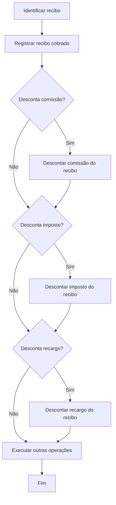
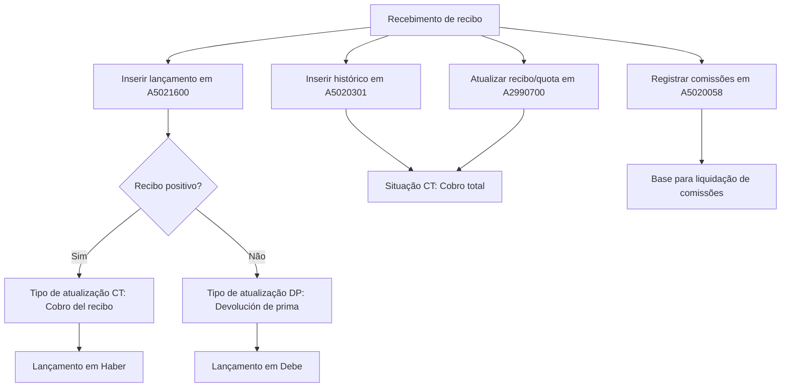
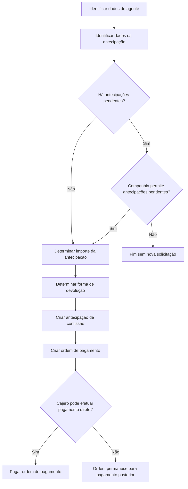

# Documentação Reef.core — Módulo de Tesouraria: Definições, Operações e Modelo de Dados

## 1. Metadados do Documento
- **Arquivo de Origem:** Não informado; conteúdo bruto de 78 páginas extraídas.
- **Tipo de Documento:** Manual Operacional, Especificação Funcional e Modelo de Dados.
- **Domínio / Sistema:** Reef.core / Tesouraria / MAPFRE.
- **Público-Alvo:** Desenvolvedores, Arquitetos, Operação, Negócio e Contabilidade.
- **Data/Versão Identificada:** Não identificada.
- **Estado documental identificado:** Diversas seções estão marcadas como `EN CONSTRUCCIÓN`.

---

## 2. Resumo Executivo & Contexto de Negócio

A documentação descreve o módulo de **Tesouraria** de Reef.core, abordando os elementos de configuração necessários para operar o módulo, processos funcionais de cobrança e pagamento e o modelo de dados afetado pelas operações. O conteúdo está organizado conceitualmente em três áreas: **Definição**, **Operação** e **Modelo de Dados**.

No âmbito de definição, o módulo exige configurações compartilhadas — usuários, programas, companhia, moeda, estrutura comercial, terceiros, agentes, seguradoras, conceitos econômicos, plano de pagamento, bancos, exercício contábil, plano de contas e conceito contábil — além de configurações próprias de tesouraria, como caixas/cajeros, impostos, contas simplificadas, gestores de cobrança, ordens de pagamento, autorizações, conceitos de cobrança/pagamento e cartões de crédito.

O documento detalha especialmente a administração de **cajeros**: usuários autorizados a operar o registro diário de tesouraria. A definição de um cajero controla permissões por ambiente operacional, substituição do cajero principal, fechamento diário, capacidade de modificar data de valor, pagamento direto, transferências caixa-banco, auditoria e estado de quadratura.

Os principais fluxos funcionais detalhados são o **cobro de recibo de prêmio**, o desconto antecipado de comissão durante o recebimento e a criação de antecipação de comissão para agente. O recebimento de um recibo registra lançamentos contábeis, atualiza a situação do recibo e suas quotas, registra histórico de movimentos e gera comissões para o agente e demais intervenientes da apólice.

A visão técnica explicita que o recebimento de recibo altera registros nas tabelas `A5021600`, `A5020301`, `A2990700` e `A5020058`. O documento fornece regras de preenchimento, obrigatoriedade, condição de alteração e significado de muitas colunas, criando uma base relevante para rastreabilidade contábil e recuperação RAG sobre operações de tesouraria.

---

## 3. Arquitetura, Componentes & Tecnologias Envolvidas

### Componentes funcionais identificados

| Componente | Função documentada |
| :--- | :--- |
| Reef.core | Aplicação onde são executadas operações funcionais, definições e atualizações de tesouraria. |
| Módulo de Tesouraria | Módulo para definição de parâmetros, registro diário, recebimentos, pagamentos, operações de caixa/banco, fechamento e consultas. |
| Registro diário de operações | Registro de lançamentos de tesouraria e contabilidade durante operações como cobrança de recibos. |
| Estrutura comercial | Organização territorial/comercial; seus níveis são usados para associação de cajeros, usuários e imputação de gasto. |
| Cajero | Usuário habilitado a trabalhar no registro diário de tesouraria. |
| Ordem de pagamento | Estrutura usada para processar pagamentos, incluindo antecipações de comissão de agentes. |
| Gestor de cobrança | Pessoa ou entidade que administra o recebimento de recibos, classificada por tipo e classe de gestor. |
| Conceito de cobrança e pagamento | Conceito contábil associado a ordens de pagamento e movimentos de conta corrente de agentes. |
| Documento de cobrança/pagamento | Tipo documental usado como comprovante de cobrança ou pagamento em tesouraria e sinistros. |
| Registro histórico de movimentos | Histórico que registra movimentos executados sobre recibos. |
| Liquidação de comissões | Processo que considera comissões e antecipações relacionadas ao agente. |
| Processos batch | Processos massivos de geração, carga, cobrança e pagamento. |

### Estrutura documental do módulo

```mermaid
graph TD
    A[Documentação de Tesouraria] --> B[Definição]
    A --> C[Operação]
    A --> D[Modelo de Dados]

    B --> B1[Definições comuns]
    B --> B2[Definições específicas de Tesouraria]
    B1 --> B11[Usuários e programas]
    B1 --> B12[Companhia e moeda]
    B1 --> B13[Estrutura comercial]
    B1 --> B14[Terceiros, agentes, bancos e seguradoras]
    B1 --> B15[Exercício, plano de contas e conceito contábil]

    B2 --> B21[Cajero]
    B2 --> B22[Impostos e contas]
    B2 --> B23[Gestor de cobrança]
    B2 --> B24[Ordens de pagamento e autorização]
    B2 --> B25[Conceitos de cobrança/pagamento]
    B2 --> B26[Cartões de crédito]

    C --> C1[Cobranças e devoluções]
    C --> C2[Pagamentos]
    C --> C3[Comissões]
    C --> C4[Fechamento de cajero]
    C --> C5[Consultas]
    C --> C6[Processos massivos]

    D --> D1[A5021600 Registro diário]
    D --> D2[A5020301 Histórico de quotas]
    D --> D3[A2990700 Recibos/quotas]
    D --> D4[A5020058 Comissões e ajustes]
```



### Fluxo funcional: cobrança de recibo



### Fluxo técnico: registrar recibo cobrado



### Fluxo: antecipação de comissão solicitada pelo agente



---

## 4. Regras de Negócio, Especificações Funcionais & Processos

### 4.1 Definição de cajero

O cajero é o usuário que pode trabalhar no módulo de Tesouraria e acessar o registro diário. A configuração do cajero inclui propriedades gerais, acesso a ambientes, estado operacional e auditoria.

#### Regras de tipo de cajero

- `P` identifica um **cajero principal**.
- `S` identifica um **cajero secundário**.
- Para cada terceiro nível da estrutura comercial deve existir um cajero principal e quantos cajeros secundários forem necessários.
- Apenas o cajero principal pode fechar o registro diário.
- Um cajero secundário com tipo de substituição `R` pode substituir o cajero principal.
- Se o cajero secundário substituto entrar no parte contable antes do cajero principal da oficina comercial, o cajero secundário assume o papel de principal naquele dia.

#### Regras de fechamento

- Pode existir mais de um cajero principal em uma companhia, pois há um cajero principal por nível 3 da estrutura comercial.
- Um cajero principal deve ser identificado como **último principal** da companhia.
- O último cajero principal é responsável por fechar o registro diário e gerar o asiento de tesorería do dia.
- Para fechar o registro diário, todos os cajeros da companhia precisam estar fechados e quadrados.
- Depois do fechamento do parte contable, somente o último cajero principal pode abrir o próximo parte, com a nova data de asiento.

#### Regras de acesso e capacidades

- A propriedade **Principal de nível 2** permite ao cajero principal consultar movimentos de cajeros de todos os níveis 3 de sua estrutura comercial.
- A propriedade **Fecha de valor** permite alterar a data dos recebimentos durante cobrança, para obter o câmbio em recebimentos em moeda estrangeira.
- A propriedade **Cajero central** identifica o cajero associado ao nível 3 definido pelo país como oficina central contábil; esse cajero pode pagar qualquer tipo de ordem de pagamento.
- A propriedade **Pago directo** permite pagar diretamente durante a geração da ordem de pagamento.
- A propriedade **Traspasos de caja a banco** permite realizar transferências de tesouraria de caixa para banco.
- A propriedade **Externo** identifica cajero utilizado em processos automáticos de cobrança.

#### Ambientes do registro diário

| Ambiente | Operação permitida |
| :--- | :--- |
| Entorno 1 | Cobros. |
| Entorno 2 | Generación de órdenes de pago. |
| Entorno 3 | Pago de órdenes de pago. |
| Entorno 4 | Anulación de órdenes de pago. |

#### Estado e auditoria do cajero

- **Activo:** indica se o cajero trabalha no registro diário.
- **Cuadrado:** indica se os lançamentos realizados pelo cajero no parte contable estão balanceados.
- A quadratura é atualizada a cada fechamento, verificando ausência de diferença entre saldo credor e saldo devedor das operações do cajero.
- **Inhabilitado:** impede o acesso do cajero ao registro diário.
- **Fecha de alta:** data em que o usuário foi identificado como cajero.
- **Fecha de baja:** data de inabilitação.
- **Observaciones:** comentário de inabilitação, normalmente o motivo.

### 4.2 Impostos

O módulo prevê definição de impostos, características, contas contábeis por imposto e agrupamentos de impostos.

- A definição de imposto identifica as obrigações tributárias com que a companhia trabalha.
- As características de impostos definem percentual aplicável e valores mínimos por imposto.
- A conta contábil por imposto identifica a conta onde é contabilizado o valor de cada imposto por moeda.
- Uma agrupação de impostos permite aplicar impostos conjuntamente.
- Uma mesma agrupação pode conter códigos de IVA e códigos de retenção.

> **Nota de Análise:** As páginas referentes a propriedades detalhadas de impostos estão marcadas como `EN CONSTRUCCIÓN`; não há detalhes adicionais de campos, fórmulas ou critérios de cálculo.

### 4.3 Contas simplificadas

As contas simplificadas representam chaves que identificam contas contábeis no contexto de tesouraria.

A sequência documental indicada para definição é:

1. Definir tipo de conta simplificada.
2. Definir códigos de formato.
3. Definir características de conta simplificada.
4. Definir saldo de conta simplificada.
5. Definir intervalo de numeração de cheques e transferências.
6. Definir contas simplificadas por cajero.

Regras declaradas:

- Características de contas simplificadas associam contas simplificadas a contas contábeis e definem suas propriedades.
- Códigos de formato definem características de cheques e transferências.
- Contas simplificadas por cajero determinam as contas e moedas com as quais cada cajero pode trabalhar.
- Faixas de numeração controlam numeração de cheques e transferências por estrutura comercial e formato.
- Saldos de contas simplificadas definem valores iniciais por moeda.
- Tipos de contas simplificadas definem chaves associadas às contas contábeis para simplificar sua identificação em tesouraria.

### 4.4 Gestor de cobrança

A definição de gestor de cobrança classifica pessoas ou entidades que realizam cobrança de recibos.

| Classe | Classificação padrão |
| :--- | :--- |
| `1` | AGENTE |
| `2` | BANCO |
| `3` | COBRADOR |
| `4` | DÉBITO AUTOMÁTICO EM CONTA |
| `5` | GESTOR DIRETO |
| `6` | GESTOR PILOTO COASEGURO |
| `7` | OFICINA COMERCIAL |
| `8` | DÉBITO COM CARTÃO DE CRÉDITO |
| `10` | GESTOR DE IMPAGOS |

Regras:

- Classes fora da classificação padrão identificam gestor não padrão.
- A classe de gestor determina o comportamento do gestor na aplicação.
- O atributo **Programa** contém a lógica de negócio que obtém tipos de gestores conforme sua classificação.
- O atributo **Programa valida** contém a lógica que valida um gestor não classificado como padrão.

### 4.5 Relação entre oficinas geradoras e pagadoras

- Para cada oficina que gera ordem de pagamento, deve ser definida a oficina pagadora à qual será imputado o gasto.
- Ambas as oficinas devem existir no catálogo da estrutura comercial da companhia.
- Ambas correspondem ao nível 3 da estrutura comercial.
- Em Reef.core, a oficina geradora é obtida a partir da oficina associada ao usuário que gera a ordem de pagamento.

### 4.6 Tipos de documentos de cobrança e pagamento

Os documentos são comprovantes tratados como cobrança ou pagamento, tanto em tesouraria quanto em sinistros.

| Exemplo de documento | Nome |
| :--- | :--- |
| `FA` | Factura |
| `IN` | Indemnización |
| `NC` | Nota de Crédito |
| `ND` | Nota de Débito |

Regras:

- **Documento de cobro o pago:** define em quais operações o documento pode ser usado conforme sua classificação.
- **Incluye IVA:** determina se o documento pode conter IVA.
- **Incluye retención:** determina se pode conter retenção.
- **Libro de compras:** determina se deve ser registrado no livro de compras.
- **Rectifica documento:** identifica documento capaz de corrigir documento oficial previamente emitido quando o prazo legal para modificar o documento original já expirou.
- Notas de crédito e de débito são citadas como documentos normalmente usados para correções.
- **Documento real:** identifica se é documento oficial sujeito a impostos.
- Documentos não oficiais são usados, por exemplo, para pagamentos de indenização a segurados e antecipações de comissões a agentes.
- **Registra documento:** determina se o documento é registrado antes de gerar uma ordem de pagamento.
- Quando o documento já está registrado na geração da ordem, ele deve ser validado contra as informações registradas.
- **Procesos de validación:** lógica de negócio que pode validar qualquer aspecto do documento, como numeração ou codificação específica.
- **Permite borrado físico:** determina se o documento registrado pode ser removido fisicamente.
- **Agrupa documentos:** se habilitado, na liquidação deve-se validar que todas as liquidações agrupadas pelo documento foram geradas.

### 4.7 Conceitos de cobrança e pagamento

O conceito de cobrança e pagamento é elemento da ordem de pagamento e representa um conceito contábil que define:

- tipo de gasto;
- impostos aplicáveis;
- conta à qual o gasto é imputado;
- movimentos da conta corrente do agente.

Regras:

- Se o conceito associa conta contábil, deve ser definida a conta contábil por conceito.
- Todo conceito deve estar associado a uma agrupação contábil, registrada nos apontamentos contábeis para posterior análise.
- Caso seja tributável, o conceito deve identificar uma agrupação de impostos.
- A classificação do conceito identifica a natureza do gasto ou seu âmbito de uso.
- O atributo **Días de pago** define a data estimada de pagamento da ordem de pagamento gerada por tesouraria.
- Quando uma ordem possui mais de um conceito, a data estimada de pagamento é determinada pelo menor valor de dias de pagamento entre todos os conceitos da ordem.

| Conceito | Nome | Nome curto |
| :--- | :--- | :--- |
| `S07` | Honorarios perito | Honorarios |
| `DCT` | Descuento comisiones | Dcto.Comi. |
| `S06` | Indemnización lesionado | Indemniza. |
| `DC` | Descuento de comisiones cobro | Dcto.Cobro |
| `PC1` | Comisiones anticipadas | Anticipo |

| Agrupação contábil | Conceito associado |
| :--- | :--- |
| `PS` — Pago de siniestros | `S07` — Honorarios Perito |
| `PS` — Pago de siniestros | `S06` — Indemnización lesionado |
| `DC` — Comisión automática | `DC` — Descuento de comisiones cobro |
| `PC` — Comisión anticipada | `DCT` — Descuento comisión |
| `PC` — Comisión anticipada | `PC1` — Comisión anticipada |

| Conceito | Tipo de conceito |
| :--- | :--- |
| `S07` | `SI` — Siniestros |
| `S06` | `SI` — Siniestros |
| `DC` | `AC` — Agentes comisiones |
| `DCT` | `AC` — Agentes comisiones |
| `PC1` | `AC` — Agentes comisiones |

### 4.8 Cobrar recibo prima

O recebimento de recibo registra o dinheiro entregue pelo cliente para liquidar a prima de uma apólice em um período determinado.

O processo tem os seguintes objetivos:

- registrar a entrada de dinheiro na contabilidade;
- atualizar o recibo para situação cobrado;
- permitir descontos de comissão, recargos e impostos;
- registrar separadamente o valor descontado para cada conceito aplicável.

### 4.9 Registrar recibo cobrado

Quando um recibo é cobrado:

1. É inserido lançamento no registro diário.
2. É inserido histórico de movimento do recibo.
3. A situação do recibo é atualizada para `CT`.
4. A situação de todas as quotas componentes do recibo também é atualizada.
5. São registradas comissões devidas ao agente e demais intervenientes da apólice.

Regras contábeis:

- Para recibo positivo, o tipo de atualização é `CT` — Cobro del recibo.
- Para recibo negativo, o tipo de atualização é `DP` — Devolución de prima.
- O lançamento é feito na conta de recibos pendentes.
- Recibo positivo é contabilizado no **Haber**.
- Devolução de prima é contabilizada no **Debe**.
- Os valores são registrados na moeda do recibo.
- O movimento de cobrança serve de base para a liquidação de comissões.

### 4.10 Desconto de comissão no cobro de recibo

- Cada instalação pode decidir se permite que o agente desconte comissão no momento da cobrança.
- A comissão descontada é líquida de retenções e impostos.
- Apenas o agente principal da apólice, desde que seja o gestor de cobrança do recibo, pode efetuar o desconto.
- O movimento é tratado como antecipação de comissão.

Regras de lançamento:

- O registro diário identifica o movimento como `PC` — Comisión anticipada.
- O lançamento usa a conta de desconto de comissões.
- Para recibo positivo, o desconto de comissão é contabilizado no **Debe**.
- Para devolução de prima, o desconto de comissão é contabilizado no **Haber**.
- Os valores são registrados na moeda do recibo.
- A comissão descontada é registrada como antecipação com:
  - tipo de devolução `2` — vencimiento;
  - tipo de antecipação `3` — montos.
- O recibo é atualizado para registrar que sua comissão já foi descontada.

### 4.11 Criar antecipação de comissão para agente

A operação registra uma solicitação de antecipação de comissão e a forma de devolução definida pelo agente.

Premissa:

- Se houver antecipações pendentes, o agente só pode solicitar nova antecipação quando a companhia permitir.
- Caso a companhia não permita antecipações pendentes, não é possível solicitar nova antecipação até o agente devolver a antecipação anterior.

Regras do agente:

- O agente solicitante é identificado e verificado para confirmar que não está excluído do pagamento de comissões.
- A oficina de imputação corresponde, por padrão, à oficina do agente, mas pode ser alterada para qualquer outra oficina da estrutura comercial.

Regras da antecipação:

- O tipo de documento deve ser de cobrança/pagamento aplicável a pagamentos (`P`) ou cobrança e pagamentos (`A`).
- O tipo de antecipação `1` corresponde à operação de antecipação.
- O conceito de antecipação deve:
  - pertencer à agrupação contábil `PC` — anticipo de comisiones;
  - ser classificado como `AC` — agentes y comisiones;
  - possuir tipo de movimento de pagamento `P`.

Regras de moeda e valor:

- A moeda identifica a expressão monetária da antecipação.
- Quando a moeda for diferente da moeda local, é recuperada a taxa de câmbio da moeda na data da solicitação.
- O importe base inicia o cálculo de impostos, valor de antecipação e montantes na moeda da antecipação e do país, quando aplicável.

Formas de devolução:

| Tipo | Forma de devolução | Regra principal |
| :--- | :--- | :--- |
| `1` | Por número de cuotas | Divide o total da antecipação por um número definido de quotas. |
| `2` | A vencimiento | Devolve o total em uma única quota com vencimento acordado. |
| `3` | Por porcentaje | Desconta percentual em cada liquidação de comissões até o vencimento. |

#### Devolução por número de quotas

- Exige número de quotas.
- Exige data de início das quotas.
- A data de início corresponde ao vencimento da primeira quota.
- Para cada quota subsequente, soma-se um mês à data anterior.
- O valor inicial de cada quota é proporcional: total da antecipação dividido pelo número de quotas.
- Datas de vencimento e valores podem ser alterados desde que a soma das quotas seja igual ao total da antecipação.

#### Devolução a vencimento

- Gera uma única quota.
- Exige data de vencimento.
- O valor da quota corresponde ao total da antecipação.
- A data de vencimento gerada pode ser modificada.

#### Devolução por percentual

- Exige percentual aplicado em cada liquidação de comissões.
- Exige data de início do desconto.
- Exige data de vencimento, até a qual o total da antecipação deve estar liquidado.
- O valor restante deve ser cancelado para concluir a devolução integral na data de vencimento.
- A data de vencimento pode ser ajustada.
- A descrição do movimento é opcional.

---

## 5. Tabelas de Parâmetros, Ambientes e Estruturas de Dados

### 5.1 Propriedades do cajero

| Item / Parâmetro | Descrição / Função | Tipo / Valores / Formato | Ambiente / Observações |
| :--- | :--- | :--- | :--- |
| Compañía | Identifica a companhia na qual o cajero pode trabalhar. | Chave de companhia. | Geral. |
| Cajero | Identifica o usuário como cajero. | Chave de usuário. | Geral. |
| Nombre del cajero | Nome identificador do cajero. | Texto. | Pode manter o nome do usuário ou ter nome específico. |
| Tipo de cajero | Define atuação principal ou secundária. | `P` principal; `S` secundário. | Um principal por nível 3; secundários conforme necessário. |
| Tipo de reemplazo | Define se o cajero substitui o principal. | `P`, `R` ou sem valor. | `P` apenas para cajero principal; `R` para secundário substituto. |
| Último | Define o último cajero principal da companhia. | Indicador. | Fecha registro diário e gera asiento de tesorería. |
| Principal de nivel 2 | Permite consultar movimentos de níveis 3 associados. | Indicador. | Estrutura comercial. |
| Fecha de valor | Permite alterar data de cobrança para câmbio. | Indicador. | Cobranças em moeda estrangeira. |
| Cajero central | Identifica cajero de oficina central contábil. | Indicador. | Pode pagar qualquer tipo de ordem de pagamento. |
| Pago directo | Permite pagar ao gerar ordem de pagamento. | Indicador. | Pagamentos. |
| Nivel 3 de estructura comercial | Nível 3 associado ao cajero. | Código nível 3. | Associado na alta do usuário. |
| Traspasos de caja a banco | Permite transferências de caixa para banco. | Indicador. | Tesouraria. |
| Externo | Identifica cajero para cobrança automática. | Indicador. | Processos automáticos. |
| Entorno 1 | Permite operar cobranças. | Indicador. | Registro diário. |
| Entorno 2 | Permite gerar ordens de pagamento. | Indicador. | Registro diário. |
| Entorno 3 | Permite pagar ordens de pagamento. | Indicador. | Registro diário. |
| Entorno 4 | Permite anular ordens de pagamento. | Indicador. | Registro diário. |
| Activo | Indica se trabalha no registro diário. | Indicador. | Estado do cajero. |
| Cuadrado | Indica equilíbrio de lançamentos. | Indicador. | Atualizado em cada fechamento. |
| Entorno | Último ambiente de trabalho. | Código de ambiente. | Atualizado pelo registro diário. |
| Último número de recibo | Última transação do ambiente de cobranças. | Número de transação. | Atualizado pelo registro diário. |
| Última orden de pago | Última transação do pagamento de ordens. | Número de transação. | Atualizado pelo registro diário. |
| Último número de giro | Última transação de geração de ordens. | Número de transação. | Atualizado pelo registro diário. |
| Último número de anulación | Última transação de anulação de ordens. | Número de transação. | Atualizado pelo registro diário. |
| Inhabilitado | Bloqueia trabalho no registro diário. | Indicador. | Auditoria. |
| Fecha de alta | Data de identificação do usuário como cajero. | Data. | Auditoria. |
| Fecha de baja | Data de inabilitação. | Data. | Auditoria. |
| Observaciones | Comentários sobre inabilitação. | Texto. | Normalmente registra motivo. |

### 5.2 Tabelas impactadas pelo registro de recibo cobrado

| Tabela | Descrição |
| :--- | :--- |
| `A5021600` | Registro diario de operaciones. |
| `A5020301` | Movimientos o histórico de cuotas. |
| `A2990700` | Recibos/cuotas de una póliza. |
| `A5020058` | Comisiones de recibos y ajustes. |

### 5.3 Campos principais — `A5021600` Registro diário de operações

| Item / Parâmetro | Descrição / Função | Tipo / Valores / Formato | Ambiente / Observações |
| :--- | :--- | :--- | :--- |
| `COD_CIA` | Companhia. | Obrigatório. | Registro diário. |
| `FEC_ASTO` | Data de asiento. | Atualiza quando difere da situação anterior; obrigatório. | Registro diário. |
| `NUM_ASTO` | Número de asiento. | Atualiza quando difere; obrigatório. | Registro diário. |
| `NUM_OPER_ASTO` | Número da operação do asiento. | Valor sequencial; obrigatório. | Registro diário. |
| `COD_NIVEL2_CAPTURA` | Segundo nível da estrutura do usuário que capturou o movimento. | Atualiza quando difere. | Não obrigatório. |
| `COD_NIVEL3_CAPTURA` | Nível 3 da estrutura do usuário que capturou o movimento. | Atualiza quando difere. | Não obrigatório. |
| `COD_NIVEL1` | Nível 1 da estrutura comercial. | Atualiza quando difere. | Não obrigatório. |
| `COD_NIVEL2` | Nível 2 da estrutura comercial. | Atualiza quando difere. | Não obrigatório. |
| `COD_NIVEL3` | Nível 3 da estrutura comercial. | Atualiza quando difere; obrigatório. | Registro diário. |
| `TIP_ACTU` | Tipo de atualização. | `CT` para recibo positivo; `DP` para recibo negativo. | Obrigatório. |
| `COD_CTA` | Conta contábil. | Atualiza quando difere; obrigatório. | Registro diário. |
| `FEC_VALOR` | Data de valor. | Data do usuário quando permitida alteração; caso contrário, data do asiento. | Obrigatório. |
| `NUM_CRUCE` | Número de cruzamento. | Número do cobro antecipado, se existir. | Não obrigatório. |
| `NOM_MOVIM` | Descrição do movimento. | Descrição da agrupação contábil para o tipo de atualização. | Obrigatório. |
| `COD_CAUSA_ANU` | Causa de anulação. | Preenchido em devolução de prima. | Não obrigatório. |
| `TIP_GESTOR` | Tipo de gestor. | Novo tipo se alteração de gestor for permitida. | Não obrigatório. |
| `COD_GESTOR` | Gestor de cobrança. | Novo código se alteração de gestor for permitida. | Não obrigatório. |
| `IMP_MON_PAIS` | Valor na moeda do país. | Valor do recibo convertido se moeda for diferente. | Obrigatório. |
| `IMP_MON_EXT` | Valor em moeda estrangeira. | Valor original do recibo. | Não obrigatório. |
| `COD_MON` | Moeda. | Obrigatório. | Registro diário. |
| `VAL_CAMBIO` | Taxa de câmbio. | Taxa na data do asiento de cobrança. | Não obrigatório. |
| `TIP_IMP` | Tipo de importe contábil. | `H` para recibo positivo; `D` para devolução de prima. | Obrigatório. |
| `TIP_ENTORNO` | Tipo de ambiente. | `1` — Entorno de recibos. | Não obrigatório. |
| `NUM_BLOQUE_TES` | Número de transação de tesouraria. | Número do bloco de tesouraria do asiento. | Obrigatório. |
| `COD_CAJERO` | Cajero. | Atualiza quando difere; obrigatório. | Registro diário. |
| `FEC_ACTU` | Data de atualização da linha. | Atualiza quando difere; obrigatório. | Auditoria. |
| `TIP_COBRO` | Tipo de cobrança. | `3` — Por parte de tesorería. | Não obrigatório. |
| `TXT_AUX1`, `TXT_AUX2`, `TXT_AUX3` | Campos auxiliares. | Não usar em instalações novas. | Dados específicos de instalação. |

### 5.4 Campos principais — `A5020301` Histórico de quotas

| Item / Parâmetro | Descrição / Função | Tipo / Valores / Formato | Ambiente / Observações |
| :--- | :--- | :--- | :--- |
| `COD_CIA` | Companhia. | Obrigatório. | Histórico. |
| `NUM_POLIZA` | Apólice. | Obrigatório. | Histórico. |
| `NUM_SPTO` | Número de suplemento. | Obrigatório. | Histórico. |
| `NUM_APLI` | Número de aplicação. | Obrigatório. | Histórico. |
| `NUM_SPTO_APLI` | Suplemento da aplicação. | Obrigatório. | Histórico. |
| `NUM_CUOTA` | Quota. | Obrigatório. | Histórico. |
| `NUM_RECIBO` | Recibo. | Obrigatório. | Histórico. |
| `NUM_MVTO` | Número de movimento. | Máximo número de movimento do recibo incrementado em 1. | Obrigatório. |
| `TIP_GESTOR` | Tipo de gestor. | Obrigatório. | Histórico. |
| `COD_GESTOR` | Gestor de cobrança. | Obrigatório. | Histórico. |
| `TIP_SITUACION` | Situação. | `CT` — Cobro total. | Obrigatório. |
| `FEC_SITUACION` | Data de origem da situação. | Data do asiento de tesouraria. | Não obrigatório. |
| `COD_MON` | Moeda. | Obrigatório. | Histórico. |
| `VAL_CAMBIO` | Taxa de câmbio. | Taxa na data do asiento de cobrança. | Não obrigatório. |
| `IMP_RECIBO` | Total do recibo. | Obrigatório. | Histórico. |
| `IMP_COMIS` | Valor de comissão. | Obrigatório. | Histórico. |
| `COD_NIVEL3` | Nível 3 da estrutura comercial. | Obrigatório. | Histórico. |
| `COD_AGT` | Agente. | Obrigatório. | Histórico. |
| `NUM_BLOQUE_TES` | Número da transação de tesouraria. | Número do bloco de tesouraria do asiento. | Não obrigatório. |
| `TIP_COBRO` | Tipo de cobrança. | `3` — Por parte de tesorería. | Não obrigatório. |
| `MCA_DCTO_COMIS` | Indicador de desconto de comissão. | Preenchido quando há desconto de comissão. | Não obrigatório. |
| `MCA_DTO_IMPTO` | Indicador de desconto de imposto. | Preenchido quando há desconto de imposto. | Não obrigatório. |
| `MCA_DTO_RECARGO` | Indicador de desconto de recargo. | Preenchido quando há desconto de recargo. | Não obrigatório. |
| `FEC_AUX1` | Data real de cobrança. | Data indicada pelo usuário se alteração permitida; senão, data do asiento. | Não obrigatório. |
| `COD_USR` | Usuário que atualizou a linha. | Atualiza quando difere; obrigatório. | Auditoria. |
| `FEC_ACTU` | Data de atualização da linha. | Atualiza quando difere; obrigatório. | Auditoria. |

### 5.5 Campos principais — `A2990700` Recibos/quotas de apólice

| Item / Parâmetro | Descrição / Função | Tipo / Valores / Formato | Ambiente / Observações |
| :--- | :--- | :--- | :--- |
| `COD_CIA` | Companhia. | Obrigatório. | Recibo/quota. |
| `NUM_POLIZA` | Apólice. | Obrigatório. | Recibo/quota. |
| `NUM_SPTO` | Número de suplemento. | Obrigatório. | Recibo/quota. |
| `NUM_APLI` | Número de aplicação. | Obrigatório. | Recibo/quota. |
| `NUM_SPTO_APLI` | Suplemento da aplicação. | Obrigatório. | Recibo/quota. |
| `NUM_CUOTA` | Quota. | Obrigatório. | Recibo/quota. |
| `NUM_RECIBO` | Recibo. | Obrigatório. | Recibo/quota. |
| `TIP_SITUACION` | Situação do recibo. | `CT` — Cobro total. | Obrigatório. |
| `FEC_VALOR` | Data de valor. | Alterada se a data de valor for modificada no cobro. | Não obrigatório. |
| `COD_MON` | Moeda. | Obrigatório. | Recibo/quota. |
| `IMP_RECIBO` | Total do recibo. | Obrigatório. | Recibo/quota. |
| `IMP_NETA` | Prêmio líquido. | Obrigatório. | Recibo/quota. |
| `IMP_RECARGO` | Recargos. | Obrigatório. | Recibo/quota. |
| `IMP_IMPTOS` | Impostos. | Obrigatório. | Recibo/quota. |
| `IMP_BONI` | Bonificações. | Obrigatório. | Recibo/quota. |
| `IMP_COMIS` | Comissão. | Não obrigatório. | Recibo/quota. |
| `COD_AGT` | Agente. | Obrigatório. | Recibo/quota. |
| `MCA_DCTO_COMIS` | Indicador de desconto de comissão. | Não obrigatório. | Registra desconto na cobrança. |
| `MCA_DTO_IMPTO` | Indicador de desconto de imposto. | Não obrigatório. | Registra desconto na cobrança. |
| `MCA_DTO_RECARGO` | Indicador de desconto de recargo. | Não obrigatório. | Registra desconto na cobrança. |
| `FEC_ACTU` | Data de atualização da linha. | Atualizada quando difere. | Não obrigatório. |

### 5.6 Campos principais — `A5020058` Comissões de recibos e ajustes

| Item / Parâmetro | Descrição / Função | Tipo / Valores / Formato | Ambiente / Observações |
| :--- | :--- | :--- | :--- |
| `COD_CIA` | Companhia. | Obrigatório. | Comissões. |
| `TIP_SITUACION` | Situação. | `CT` para recibo positivo; `DP` para recibo negativo. | Não obrigatório. |
| `COD_NIVEL2` | Nível 2 da estrutura comercial. | Obrigatório. | Comissões. |
| `COD_NIVEL3` | Nível 3 da estrutura comercial. | Obrigatório. | Comissões. |
| `TIP_DOCUM` | Tipo de documento do tomador. | Obtido da apólice. | Não obrigatório. |
| `COD_DOCUM` | Documento do tomador. | Obtido da apólice. | Não obrigatório. |
| `COD_AGT` | Agente. | Chave do agente pai. | Não obrigatório. |
| `COD_MVTO` | Código de movimento. | `DC` — Devengo de comisiones. | Não obrigatório. |
| `COD_CTA` | Conta contábil. | Conta contábil do agente. | Não obrigatório. |
| `COD_MON` | Moeda. | Obrigatório. | Comissões. |
| `VAL_CAMBIO` | Taxa de câmbio. | Taxa na data do asiento de cobrança. | Não obrigatório. |
| `IMP_RECIBO` | Total do recibo. | Zero para comissões por outros conceitos; total do recibo nas demais. | Não obrigatório. |
| `IMP_MVTO` | Valor do movimento. | Valor da comissão. | Não obrigatório. |
| `FEC_MVTO` | Data do movimento. | Data do asiento de tesouraria. | Não obrigatório. |
| `ANIO_MES` | Ano/mês do movimento. | Mês e ano da data do asiento. | Não obrigatório. |
| `FOR_ACTUACION` | Forma de atuação do intermediário. | `P`, `O` ou `A`; regras dependem do intermediário. | Não obrigatório. |
| `NUM_MVTO_301` | Número do movimento histórico. | Número em histórico de movimentos de recibos. | Não obrigatório. |
| `COD_TIP_COMISION` | Tipo de comissão. | Preenchido para comissões não padrão. | Não obrigatório. |
| `IMP_MVTO_RECA` | Comissão sobre recargo. | Valor da comissão sobre recargo para comissão padrão. | Não obrigatório. |
| `COD_HIJO_AGT` | Código do agente filho. | Valor do código do agente principal. | Não obrigatório. |
| `NUM_BLOQUE_TES` | Número de transação de tesouraria. | Número do bloco de tesouraria do asiento. | Não obrigatório. |

---

## 6. Bateria de Perguntas & Respostas para RAG (FAQ Sintético)

### P1: Qual usuário pode fechar o registro diário de Tesouraria?
**R:** Apenas o cajero principal pode fechar o registro diário. Entre os cajeros principais da companhia, deve existir um identificado como último principal; esse cajero é responsável por fechar o registro diário global e gerar o asiento de tesorería do dia. O fechamento exige que todos os cajeros da companhia estejam fechados e quadrados.

### P2: Quando um cajero secundário pode assumir o papel de cajero principal?
**R:** Um cajero secundário pode assumir o papel de principal quando possui tipo de reemplazo `R` e entra no parte contable antes do cajero principal da oficina comercial. Nessa situação, o cajero secundário assume o rol de principal naquele dia.

### P3: O que acontece quando um recibo positivo é cobrado em Reef.core?
**R:** A operação insere um lançamento no registro diário com tipo de atualização `CT` — Cobro del recibo, registra o valor na conta de recibos pendentes no Haber, atualiza a situação do recibo e de suas quotas para `CT`, cria histórico de movimento e registra as comissões relacionadas ao agente e aos demais intervenientes da apólice.

### P4: Como Reef.core registra uma devolução de prima?
**R:** Quando o recibo é negativo, o processo usa o tipo de atualização `DP` — Devolución de prima. No registro diário, o tipo de importe contábil é `D` — Debe, diferentemente de um recibo positivo, que é imputado no Haber.

### P5: Quais tabelas são impactadas pelo processo de registrar recibo cobrado?
**R:** O processo técnico documentado impacta `A5021600` para o registro diário de operações, `A5020301` para movimentos ou histórico de quotas, `A2990700` para recibos e quotas de apólices e `A5020058` para comissões de recibos e ajustes.

### P6: Quem pode descontar comissão no momento da cobrança de recibo?
**R:** Somente o agente principal da apólice pode descontar a comissão no momento do cobro, desde que esse agente seja também o gestor de cobrança do recibo. A instalação deve permitir esse comportamento.

### P7: Como é contabilizado o desconto de comissão durante a cobrança?
**R:** O desconto é registrado como `PC` — Comisión anticipada e representa comissão líquida de retenções e impostos. Para um recibo positivo, o lançamento ocorre no Debe, em sentido oposto ao cobro; para uma devolução de prima, o lançamento ocorre no Haber. O valor é registrado na moeda do recibo.

### P8: Qual regra define a data estimada de pagamento de uma ordem com múltiplos conceitos?
**R:** Quando uma ordem de pagamento contém mais de um conceito de cobrança e pagamento, a data estimada de pagamento é determinada pelo menor número de dias de pagamento entre todos os conceitos associados à ordem.

### P9: Quais são as formas de devolução de antecipação de comissão de agente?
**R:** Há três formas documentadas: `1` — devolução por número de quotas, que divide o total entre quotas; `2` — devolução a vencimento, que cria uma única quota; e `3` — devolução por percentual, que desconta um percentual em cada liquidação de comissões até a data de vencimento.

### P10: O que ocorre se um agente já tiver antecipações pendentes?
**R:** O agente somente poderá solicitar nova antecipação se a companhia permitir antecipações com antecipações pendentes. Se a companhia não permitir, o agente não poderá solicitar uma nova antecipação até devolver a antecipação anterior.

### P11: Qual oficina é considerada geradora de uma ordem de pagamento em Reef.core?
**R:** A oficina geradora é a oficina associada ao usuário que gera a ordem de pagamento. Essa oficina corresponde ao nível 3 da estrutura comercial. A oficina pagadora ou de imputação do gasto também deve ser definida no catálogo de estrutura comercial no nível 3.

### P12: Para que serve a propriedade Fecha de valor do cajero?
**R:** A propriedade Fecha de valor determina se o cajero pode modificar a data de cobranças durante operações de cobro. A alteração permite obter a taxa de câmbio aplicável em cobranças realizadas em moeda estrangeira.

### P13: O que caracteriza um documento como documento real?
**R:** A propriedade Documento real identifica se o documento é oficial e, portanto, sujeito a impostos. Documentos não oficiais podem ser usados, por exemplo, para pagamentos de indenizações a segurados ou antecipações de comissões para agentes.

### P14: Como funciona a conta simplificada por cajero?
**R:** A definição de contas simplificadas por cajero determina quais contas simplificadas podem ser utilizadas por cada cajero e para quais moedas. O documento não especifica os campos técnicos dessa definição.

### P15: Quais operações massivas de tesouraria são listadas?
**R:** São listadas geração de tabela de buzón de cobros batch, geração de carga de cobros batch, cobro de prima batch, consulta de cobros batch, geração de tabela de buzón de pagos batch, geração de carga de pagos batch, inclusão de ordem de pagamento batch, pagamento de ordem de pagamento batch e consulta de pagos batch.

---

## 7. Glossário de Termos, Siglas & Conceitos-Chave

- **AC:** Agentes comisiones; classificação de conceito associada a agentes e comissões.
- **Asiento:** Lançamento ou assento contábil.
- **Cajero:** Usuário autorizado a operar o registro diário do módulo de Tesouraria.
- **Cobro:** Operação de recebimento.
- **CT:** `Cobro del recibo` ou `Cobro total`, conforme o contexto da tabela/operação.
- **Debe (D):** Lado de débito do lançamento contábil.
- **DP:** `Devolución de prima`.
- **Haber (H):** Lado de crédito do lançamento contábil.
- **IVA:** Imposto sobre valor agregado; documento pode indicar se o inclui.
- **Nivel 3:** Terceiro nível da estrutura comercial; usado para associação de cajeros e oficinas.
- **Orden de pago:** Ordem usada para processar pagamentos.
- **Parte contable:** Período ou parte contábil operacional associado ao registro diário.
- **PC:** `Comisión anticipada` ou agrupação contábil de antecipação de comissões, conforme o contexto.
- **Recargo:** Encargo adicional associado ao recibo.
- **Recibo:** Documento/registro de prêmio ou quota de apólice objeto de cobrança.
- **Reef.core:** Sistema de aplicação referenciado pela documentação.
- **Retención:** Retenção tributária aplicável.
- **SI:** Siniestros; classificação de conceito ligada a sinistros.
- **Tesorería:** Módulo de tesouraria que administra cobranças, pagamentos, caixa, banco, ordens e fechamento.
- **Tipo de actualización:** Código que caracteriza o movimento contábil, por exemplo `CT` ou `DP`.

---

## 8. Notas Críticas, Riscos & Limitações

- Grande parte das páginas está explicitamente marcada como **`EN CONSTRUCCIÓN`**. Para essas áreas, o documento fornece objetivos e sequências gerais, mas não detalha campos, contratos, regras de validação ou implementação.
- O documento não apresenta endpoints HTTP, APIs, mensagens assíncronas, versões de tecnologias, URLs de ambientes, portas, topologia de infraestrutura, pipelines de CI/CD ou credenciais.
- O documento menciona o atributo **Programa** e **Programa valida** para gestor de cobrança, mas não especifica nomes, contratos, linguagens ou lógica dessas rotinas.
- As tabelas técnicas apresentam códigos de tipo como `S`, `D` e `N` na coluna `CAMBIA`, mas o significado formal desses códigos não é definido no conteúdo fornecido.
- Não são informadas chaves primárias, chaves estrangeiras, índices, tipos físicos de dados, regras de integridade ou relacionamento técnico entre as tabelas `A5021600`, `A5020301`, `A2990700` e `A5020058`.
- Os campos auxiliares `TXT_AUX1`, `TXT_AUX2` e `TXT_AUX3` são declarados como não recomendados para instalações novas.
- A documentação lista várias operações de tesouraria, mas não detalha os respectivos processos, exceções, permissões ou impactos de dados.
- A implementação da autorização de ordens de pagamento é mencionada, mas apenas seus objetivos gerais estão disponíveis; importes máximos e usuários autorizadores não possuem regras detalhadas.

---

## 9. Conteúdo Bruto Estruturado (Referência Fiel)

```text
--- [PÁGINAS 1 A 6] ---
DEFINICIÓN de cajero.
Objetivo: definição dos usuários do sistema que podem trabalhar com o módulo de Tesorería.
Passos: DEFINIR Cajero; DEFINIR Saldo inicial cajero.

Propriedades gerais de cajero:
- Compañía; Cajero; Nombre del cajero.
- Tipo de cajero: P = Cajero principal; S = Cajero secundario.
- Para cada nível 3 da estrutura comercial deve existir um cajero principal.
- O cajero principal é o único que pode fechar o registro diário.
- Tipo de reemplazo: P = Principal; R = Reemplazante; sem valor = não pode substituir.
- O cajero secundário substituto que entra antes do principal assume papel de principal no dia.
- Último: identifica o último cajero principal da companhia.
- Para fechar o registro diário, todos os cajeros devem estar fechados e quadrados.
- Depois do fechamento, somente o último principal abre o próximo parte com nova data de asiento.
- Principal de nivel 2; Fecha de valor; Cajero central; Pago directo; Nivel 3; Traspasos caja-banco; Externo.
- Entorno 1 = Cobros.
- Entorno 2 = Generación de órdenes de pago.
- Entorno 3 = Pago de órdenes de pago.
- Entorno 4 = Anulación de órdenes de pago.
- Estado: Activo, Cuadrado, Entorno, último número de recibo, última orden de pago, último número de giro e último número de anulación.
- Auditoria: Inhabilitado, Fecha de alta, Fecha de baja e Observaciones.

--- [PÁGINAS 7 A 19] ---
Definições de impostos:
- Imposto; características de impostos; conta contábil por imposto; agrupação de impostos.
- A agrupação pode conter códigos de IVA e retenção.
- Características de impostos definem percentual e importes mínimos.
- Conta contábil por imposto identifica conta para cada imposto por moeda.

Definições de contas simplificadas:
- Tipo de conta simplificada.
- Códigos de formato.
- Características de conta simplificada.
- Saldo de conta simplificada.
- Intervalos de numeração de cheques e transferências.
- Contas simplificadas por cajero.

--- [PÁGINAS 20 A 21] ---
DEFINICIÓN de Gestor de cobro.
Classes padrão:
1 AGENTE
2 BANCO
3 COBRADOR
4 DÉBITO AUTOMATICO EN CUENTA
5 GESTOR DIRECTO
6 GESTOR PILOTO COASEGURO
7 OFICINA COMERCIAL
8 DEBITO CON TARJETA DE CREDITO
10 GESTOR DE IMPAGOS
Classe fora dessa lista identifica gestor não padrão.
Programa: lógica que obtém tipos de gestores segundo classificação.
Programa valida: lógica que valida gestor não padrão.

--- [PÁGINAS 23 A 32] ---
Definição de ordem de pagamento:
- Reserva de numeração.
- Ordem de pagamento por usuário.
- Tipos de documentos.
- Agências pagadoras por geradoras.

Relação entre oficinas geradoras e pagadoras:
- A oficina geradora e a oficina de imputação devem pertencer ao nível 3 da estrutura comercial.
- Em Reef.core, a oficina geradora é a oficina associada ao usuário que cria a ordem.

Tipos de documentos:
- FA = Factura.
- IN = Indemnización.
- NC = Nota de Crédito.
- ND = Nota de Débito.
- Propriedades: inclui IVA, inclui retenção, livro de compras, retifica documento, documento real, registra documento, validações, borrado físico, agrupação de documentos.
- Propriedades de sinistros: documento para sinistros, nome para sinistros, número de fatura, custo de sinistro e registro de documento de sinistros.

--- [PÁGINAS 33 A 35] ---
Conceitos de cobrança e pagamento:
- Conceito contábil da ordem de pagamento que determina gasto, impostos e conta de imputação.
- Todo conceito deve estar associado a agrupação contábil.
- Agrupação de impostos identifica impostos aplicáveis.
- Dias de pagamento definem a data estimada.
- Para ordem com mais de um conceito, utiliza-se o menor número de dias de pagamento.

--- [PÁGINAS 39 A 40] ---
DEFINICIÓN DE TESORERÍA.
Elementos comuns:
Usuários, programas, companhia, moeda, estrutura comercial, terceiros, agente, seguradora,
conceitos econômicos, plano de pagamento, bancos, exercício contábil, plano de contas e conceito contábil.

Elementos específicos de Tesouraria:
Cajero, impuesto, cuenta por tipo actualización, cuenta simplificada, gestor cobro,
cobros anticipados, orden pago, autorización orden pago, concepto cobro pago,
tarjetas crédito, subvención agente, parámetros y definiciones e proceso masivo.

--- [PÁGINAS 41 E 58] ---
COBRAR recibo prima:
- Registra dinheiro entregue pelo cliente para liquidar prima.
- Pode descontar comissões, recargos e impostos.
- Processo: registrar recibo; descontar comissão; descontar imposto; descontar recargo; executar outras operações.

REGISTRAR recibo cobrado:
- Registra apunte em registro diário.
- Recibo positivo: CT, conta de recibos pendentes, Haber.
- Recibo negativo: DP, conta de recibos pendentes, Debe.
- Valores sempre na moeda do recibo.
- Registra movimento histórico.
- Atualiza situação do recibo e de todas suas quotas para CT.
- Registra comissões para agente e intervenientes.

--- [PÁGINAS 42 A 55] ---
Tabelas técnicas:
A5021600 — Registro diario de operaciones.
A5020301 — Movimientos o histórico de cuotas.
A2990700 — Recibos/cuotas de una póliza.
A5020058 — Comisiones de recibos y ajustes.

A5021600:
- TIP_ACTU: CT para recibo positivo; DP para recibo negativo.
- FEC_VALOR: data indicada pelo usuário quando permitida alteração; caso contrário, data do asiento.
- IMP_MON_PAIS: valor convertido se a moeda do recibo for diferente da moeda do país.
- TIP_IMP: H para recebimento positivo; D para devolução de prima.
- TIP_ENTORNO: 1 — Entorno de recibos.
- TIP_COBRO: 3 — Por parte de tesoreria.
- TXT_AUX1/TXT_AUX2/TXT_AUX3: não usar em instalações novas.

A5020301:
- NUM_MVTO: incrementa em 1 o máximo movimento do recibo.
- TIP_SITUACION: CT — Cobro total.
- FEC_SITUACION: data do asiento de tesoreria.
- MCA_DCTO_COMIS: preenchido quando comissão é descontada.
- MCA_DTO_IMPTO: preenchido quando imposto é descontado.
- MCA_DTO_RECARGO: preenchido quando recargo é descontado.

A2990700:
- TIP_SITUACION: CT — Cobro total.
- FEC_VALOR: atualizada se a data de valor for modificada no cobro.
- MCA_DCTO_COMIS, MCA_DTO_IMPTO e MCA_DTO_RECARGO registram descontos efetuados.

A5020058:
- COD_MVTO: DC — Devengo de comisiones.
- IMP_MVTO: valor da comissão.
- FEC_MVTO: data do asiento de tesouraria.
- NUM_MVTO_301: número correspondente ao histórico de movimentos de recibos.

--- [PÁGINAS 62 A 66] ---
CREAR anticipo comisión agente:
- Registra antecipação solicitada pelo agente e forma de devolução.
- Se houver antecipações pendentes, nova solicitação somente é permitida se a companhia autorizar.
- Verifica se o agente está excluído de pagamento de comissões.
- Documento deve ser de pagamento P ou cobrança/pagamento A.
- Tipo de antecipação da operação: 1.
- Conceito deve pertencer à agrupação PC, classificação AC e tipo de movimento P.
- Para moeda diferente da local, recupera-se taxa de câmbio na data da solicitação.
- Tipos de devolução:
  1: por número de quotas;
  2: a vencimento;
  3: por percentual.

--- [PÁGINAS 68 A 69] ---
DESCONTAR comisión en el cobro de recibo:
- Instalação pode permitir desconto de comissão no ato do cobro.
- Somente agente principal e gestor de cobrança do recibo pode descontar.
- Movimento PC — Comisión anticipada.
- Comissão líquida de retenções e impostos.
- Recibo positivo: Debe.
- Devolução de prima: Haber.
- Antecipação registrada com devolução tipo 2 e tipo de antecipação 3.
- Informação do recibo é atualizada para indicar comissão descontada.

CREAR anticipo comisión:
- Cria antecipação e ordem de pagamento.
- Caso cajero tenha pagamento direto, paga a ordem na mesma operação.

--- [PÁGINAS 71 A 77] ---
Operações listadas:
- Pagamentos: pagar, autorizar, anular, mudar oficina, imprimir ou modificar cheque.
- Reaseguro e coaseguro: gerar cobro/pago de remessa.
- Fechamento: fechar cajero, fechar com erro de outra data, gerar asiento de tesoreria.
- Não contábeis: ajustar/criar comissão, remessar/desremessar recibo, mudar gestor, registrar factura.
- Consultas: recibo, ordem de pagamento, registro diário, histórico, agente gestor, cheque, cartão, saldo banco e saldo cajero.
- Processos massivos: geração/carga/consulta de cobros e pagos batch, inclusão e pagamento de ordem de pagamento batch.

--- [PÁGINA 78] ---
Estrutura da documentação de Tesouraria:
- Definición: conceitos e ordem de configuração necessária para operar um módulo.
- Operación: operações funcionais suportadas.
- Modelo de datos: tabelas da aplicação e movimentação de tabelas, filas e colunas conforme operações funcionais.
```
