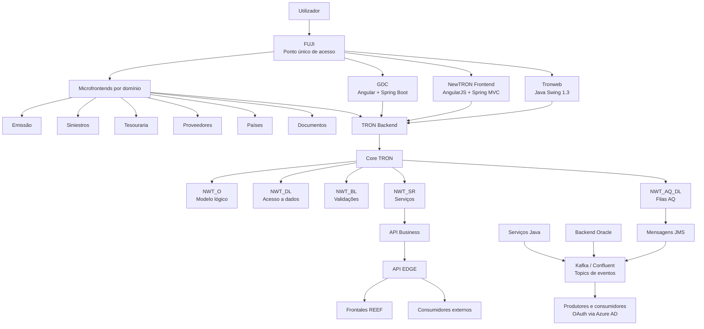

# Arquitetura TRON, REEF como PaaS e Capacidades de Integração, Eventos, Reporting e Cloud

## 1. Metadados do Documento
- **Arquivo de Origem:** Não identificado no conteúdo extraído
- **Tipo de Documento:** Apresentação Executiva / Arquitetura de Software
- **Domínio / Sistema:** TRON, REEF, NewTRON, Plataforma de Eventos, Plataforma Documental
- **Público-Alvo:** Arquitetos, Desenvolvedores, Operação, Equipas de Integração e Negócio
- **Data/Versão Identificada:** 26 Outubro 2023; referência à versão `rls2023.01`

---

## 2. Resumo Executivo & Contexto de Negócio

A apresentação descreve a arquitetura da plataforma TRON no contexto do REEF como PaaS. O REEF Core é apresentado como o núcleo da plataforma, responsável pela configuração de produtos, processos de emissão, sinistros, administração e funcionalidades comuns. O ecossistema também contempla soluções globais para atendimento ao cliente final e distribuidores, autosserviços, cotadores, emissores e capacidades de suporte, como gestão documental, BPM, motor de regras, gestão de eventos e clientes.

A arquitetura evolui de uma aplicação TRON tradicional, com componentes como Tronweb e frontend Java Swing, para uma abordagem composta por NewTRON, GDC, microfrontends por domínio funcional e o componente Fuji. Fuji é definido como o ponto único de acesso de utilizadores, responsável por orquestrar frontends, gerir menu, idioma e companhia, permitir comunicação entre frontends e realizar autenticação SSO através de Azure.

No backend, a solução adota arquitetura em camadas baseada em esquemas de base de dados Oracle. A arquitetura Core separa código original, modelo físico, modelo lógico, acesso a dados, validações, serviços, filas AQ e esquemas de conexão. O código Core não é alterável e não permite personalização por substituição de sinónimos. Para cada país, existe uma arquitetura equivalente, porém independente do Core, com personalização baseada em configuração, parametrização, execução dinâmica e extensões por procedimentos ou funções configuradas.

A apresentação também posiciona APIs e eventos como capacidades complementares de integração. APIs representam ações a executar no sistema, como emitir uma apólice ou gerar condições particulares. Eventos representam factos já ocorridos, como uma apólice emitida, e permitem que consumidores reajam de forma desacoplada. A plataforma de eventos usa Kafka fornecido pela Confluent, com acesso protegido por OAuth contra Azure AD, e recebe eventos a partir de Oracle, Java, TRON on-premise e sistemas locais.

Por fim, o documento aborda capacidades de reporting e gestão documental, além de dois cenários cloud: América Central e Vida. Os cenários apresentam diferentes regiões de deployment, estratégias de disaster recovery, componentes Java, observabilidade com Dynatrace, integrações e tecnologias de execução, incluindo WebLogic, Fargate, RDS Oracle e arquitetura baseada em MAR 2.0.

---

## 3. Arquitetura, Componentes & Tecnologias Envolvidas

### Componentes e capacidades identificados

| Componente / Tecnologia | Função descrita no documento | Observações |
| :--- | :--- | :--- |
| REEF Core | Coração da plataforma; configuração de produtos, emissão, sinistros, administração e comuns | Parte do conceito REEF como PaaS |
| Marketplace | Oferta contínua de capacidades funcionais | Inclui desenvolvimentos próprios, de mercado e de Insurtechs |
| Governo | Modelo de entrega para regiões, unidades e países | Não há detalhamento adicional do modelo |
| TRON Backend | Backend associado a Tronweb, NewTRON e GDC | Implementação detalhada por camadas Oracle |
| Tronweb | Frontend histórico e pacote de APIs | Java Swing 1.3; manutenção corretiva; uso temporário para Tesouraria |
| NewTRON Frontend | Frontend para processos e famílias TRON, exceto Tesouraria | AngularJS + Spring MVC |
| GDC | Gerador de ecrãs e manutenção zero code de tabelas | Angular + Spring Boot; baseado em MAR 2.0 |
| Microfrontends | Frontends independentes por domínio funcional | Baseados em MAR, componentes reutilizáveis e configuração em BD |
| Fuji | Ponto único de acesso e orquestração de frontends | SSO Azure, menu, idioma, companhia e comunicação entre frontends |
| NWT_O | Modelo lógico, constantes e definição de tipos | Usa type objects |
| NWT_DL | Camada de acesso a dados | Possui níveis interno e de interface |
| NWT_AQ_DL | Modelo de filas AQ | Gera mensagens JMS |
| NWT_BL | Camada de validação | Valida atributos de conceitos de negócio |
| NWT_SR | Camada de serviços | Orquestra propriedades, processos e interfaces de serviço |
| NWT_APP | Esquema de conexão Oracle | Acesso a interfaces de serviço de NWT_SR |
| NWT_DM_APP | Esquema de conexão Oracle | Acesso ao modelo físico para novos desenvolvimentos Java |
| TRON2000_APP | Esquema de conexão Oracle | Acesso à paqueteria TRONWEB, APIs, Tronweb e Tesouraria |
| NWT_AQ_APP | Esquema de conexão Oracle | Acesso a filas AQ como fonte de mensagens JMS para eventos Kafka |
| TRP_XX | Esquema de produto | Objetos de definição de produtos Core; acesso a dados via programas PTD em TRON2000 |
| NWT_IL | Camada de mediação | Tradução entre modelo lógico NewTRON e types records de TRONWEB |
| NWT_TS / NWT_TB / NWT_TD | Esquemas de mediação | Acesso de TRONWEB à lógica NewTRON |
| TRC_XX_O | Modelo lógico de país | Baseado em type objects |
| TRC_XX_DL | Camada de dados do país | Tabelas próprias e paqueteria interna/interface |
| TRON2000_XX | Esquema previsto para código local legado | Previsto para controlar dívida técnica de processos TRONWEB locais |
| API EDGE | Camada de API voltada a frontends REEF e consumidores | Comunicada com API Business |
| API Business | Catálogo de serviços com linguagem mais standard | Intermediação com Core TRON |
| API Batch | API de tarefas e tarefas Java | Sem detalhamento adicional |
| API de Convivência | Integração entre REEF e sistemas locais de país | APIs REST e integrações síncronas |
| Kafka / Confluent | Broker e plataforma de eventos | Serviço centralizado, referido como implantado em AWS Irlanda |
| Azure AD | Provedor de identidade para OAuth | Protege acesso de produtores e consumidores aos topics |
| Plataforma Documental | Composição, distribuição e gestão documental | FIS, email, SMS, Webplus e Documentum |
| Dynatrace | Observabilidade | Usado em América Central e Vida |
| WebLogic Server | Runtime para componentes Java | Cenário América Central |
| AWS Fargate | Serviço serverless para containers Java | Cenário Vida |
| RDS Oracle | Base de dados Oracle gerida | Cenário Vida |
| Control-M | Agente cloud integrado com o maestro de Espacio MAPFRE | Cenário América Central |
| MAR 2.0 | Base arquitetural / arquetipo | GDC e toda a arquitetura Vida |



### Arquitetura do Core TRON

A arquitetura Core é composta por camadas em esquemas de base de dados, onde cada camada possui uma finalidade. O modelo lógico é baseado em **type objects**. O código Core não pode ser alterado e não é permitida personalização através de substituição de sinónimos.

O Core é multi-país e multi-companhia. O código específico de cada país é separado do Core. A solução inclui utilitários para diagnóstico de erros em execução. Não são permitidos utilitários que abram comunicações externas, especificamente `UTL_HTTP` e `UTL_FILE`.

### Arquitetura de País

A arquitetura Backend País é semelhante à arquitetura Core, mas contém código independente. A personalização é feita por configuração, parametrização e execução dinâmica. O documento menciona extensão por procedimentos e funções configurados, executados dinamicamente.

O modelo do país encontra-se desacoplado do modelo físico para minimizar impactos de novas versões de Core e favorecer compatibilidade retroativa de versões NewTRON. É mencionado que variáveis globais a nível de package devem ser tratadas com cautela numa arquitetura desconectada.

---

## 4. Regras de Negócio, Especificações Funcionais & Processos

### REEF como PaaS

1. O REEF Core atua como coração da plataforma.
2. O REEF Core é responsável pela configuração de:
   - Produtos.
   - Processos de emissão.
   - Sinistros.
   - Administração.
   - Funcionalidades comuns.
3. As soluções globais incluem atendimento ao cliente final e distribuidores.
4. As soluções globais incluem autosserviços, cotadores e emissores.
5. O ecossistema oferece suporte para gestão documental, BPM, motor de regras, gestor de eventos e clientes.
6. Microsserviços podem responder a necessidades específicas, como cotação e subscrição de riscos.
7. O Marketplace incorpora continuamente capacidades funcionais próprias, de mercado e de Insurtechs.
8. O governo da plataforma deve suportar regiões, unidades e países através de um modelo de entrega.

### Regras do frontend

1. O Tronweb utiliza Java Swing 1.3.
2. O Tronweb é mantido corretivamente.
3. O Tronweb é utilizado temporariamente para ecrãs de Tesouraria.
4. O NewTRON Frontend contempla todos os processos e famílias TRON, exceto Tesouraria.
5. O NewTRON Frontend usa AngularJS e Spring MVC.
6. O NewTRON Frontend disponibiliza componentes modulares e reutilizáveis.
7. O look and feel do NewTRON Frontend é 100% personalizável.
8. O GDC permite geração de ecrãs e manutenção de tabelas sem código.
9. O GDC usa Angular e Spring Boot e é baseado em MAR 2.0.
10. A definição de funcionalidades no GDC é feita por parametrização.
11. As validações do GDC ocorrem por integração de API.
12. Os microfrontends são organizados por domínio funcional.
13. Os microfrontends permitem deployment independente.
14. Os microfrontends usam componentes reutilizáveis.
15. Os módulos personalizados são configurados em base de dados.
16. Fuji é o único ponto de acesso para utilizadores.
17. Fuji orquestra frontends e gere menu, idioma e companhia.
18. Fuji permite comunicação entre frontends.
19. Fuji realiza autenticação SSO com Azure.

### Regras e restrições do Core Backend

1. O modelo lógico é baseado em type objects.
2. O código Core não pode ser alterado.
3. Não é permitida personalização por substituição de sinónimos.
4. O código de país deve permanecer separado do Core.
5. Devem existir utilitários de diagnóstico de erros em execução.
6. Não são permitidos utilitários que abram comunicações externas através de `UTL_HTTP` ou `UTL_FILE`.
7. O esquema `NWT_DL` possui:
   - Nível interno para acesso a tabelas e carga/descarga de informação dos objetos do modelo lógico.
   - Nível de interface que recebe conceitos de negócio e orquestra os data layers internos.
8. O esquema `NWT_SR` possui três níveis:
   - Orquestração de propriedades de um conceito lógico.
   - Orquestração de processo utilizando conceitos lógicos envolvidos numa funcionalidade.
   - Interface de serviço visível a partir dos esquemas de conexão.
9. `NWT_IL` traduz o modelo lógico NewTRON baseado em type objects para o modelo TRONWEB baseado em types records.
10. `NWT_TS`, `NWT_TB` e `NWT_TD` permitem acesso de TRONWEB à lógica NewTRON.

### Regras de personalização por país

1. Cada país possui os seus próprios esquemas para alojar código.
2. O código Core e o código de país não podem ser misturados.
3. A personalização não é realizada por substituição de sinónimos.
4. A personalização ocorre através da configuração do processo de negócio.
5. Extensões podem ser criadas por procedimentos ou funções configuradas e executadas dinamicamente.
6. Processos locais desenvolvidos no contexto de Uruguai / REEF Latam Vida foram incorporados em `TRC_XX_DL` como dívida técnica.
7. O documento informa a intenção de abrir `TRON2000_XX` para alojar a paqueteria local e controlar a dívida técnica.
8. A arquitetura desacoplada do modelo físico procura reduzir impacto de novas versões NewTRON nos países.

### APIs e integração

1. A API Business disponibiliza um catálogo de serviços com linguagem mais standard.
2. A API Business intermedeia a comunicação com o Core TRON.
3. A API EDGE expõe funcionalidade Core, módulos e capacidades para frontends REEF e consumidores.
4. A API Batch trata tarefas e tarefas Java.
5. A API de Convivência integra REEF com sistemas locais de cada país.
6. A API de Convivência usa APIs REST e integrações síncronas.
7. APIs representam ações a executar no sistema, como:
   - Emitir uma apólice.
   - Gerar condições particulares de uma apólice.

### Eventos

1. Um evento é um facto que já ocorreu no sistema.
2. Um evento é imutável e persistente.
3. Um evento pode ser entendido como uma representação de um facto ou como um registo de alteração de estado num sistema.
4. Eventos possuem menor acoplamento do que arquiteturas cliente/servidor, porque o emissor não conhece a identidade dos recetores no momento de compilação.
5. A orientação a eventos permite isolar processos e delimitar responsabilidades.
6. Processos pós-emissão podem reagir a eventos em vez de serem orquestrados na mesma transação de emissão.
7. A execução de várias operações na mesma transação pode afetar performance, aumentar a possibilidade de erros e envolver mais equipas na resolução de problemas.
8. Eventos podem ser emitidos a partir de backend Oracle, através de serviço PL/SQL e filas AQ, e a partir de Java.
9. Eventos podem ser usados por TRON on-premise e sistemas locais.
10. Kafka, fornecido pela Confluent, funciona como broker de eventos.
11. Kafka permite publicar, subscrever, guardar e processar fluxos de registos em tempo real.
12. As mensagens são validadas contra um esquema para armazenamento num topic.
13. Clientes ou subscritores leem e confirmam a leitura de eventos.
14. Cada consumidor mantém a sua própria referência do último evento lido.
15. Cada consumidor processa eventos em ordem.
16. O acesso aos topics é protegido por OAuth através de Azure AD.
17. Cada país possui um conjunto de topics fornecidos pelo Core e topics adicionais definidos pelo próprio país.
18. Desde a versão `rls2023.01`, existe um serviço TRON parametrizado para gerar mensagens em bases de dados TRON.
19. Para países, a utilização de eventos requer versão mínima de Core e habilitação de comunicações através da rede interna Mapfre.

### Casos de uso de eventos

| Caso de Uso | Processo descrito |
| :--- | :--- |
| Gestão de Impagos | Sincronização de recibos impagados em TRON com o ativo centralizado Gestão de Impagos para processamento |
| Autosserviço Proveedores | Sincronização de dados de terceiros do tipo fornecedor entre TRON Chile e Autosserviço Proveedor |
| Ficha Cliente 360 | Sincronização de dados de clientes de sistemas transacionais para a base de dados do ativo Ficha Cliente 360 |
| REEF Vida | Sincronização bidirecional de dados de clientes entre REEF e TRON local Uruguai |
| Salesforce CRM | Sincronização de dados de cotações, orçamentos e apólices |
| Prestaciones Salud | Novo sistema de prestações de saúde em Espanha; método principal de integração entre domínios do sistema e sistemas externos |

### Reporting e Plataforma Documental

1. A Plataforma Documental oferece:
   - Composição de documentos através de FIS.
   - Distribuição de documentos por email, SMS, Webplus e outros meios indicados.
   - Gestão de documentos através de Documentum.
2. Existe normalização do mapa documental.
3. TRON fornece serviços funcionais que exploram as capacidades da Plataforma Documental com base em parametrização.
4. As capacidades documentais estão integradas no frontal TRON, tanto em D2 como no módulo Gestor de Documentos.
5. O módulo Gestor de Documentos cobre apólices, orçamentos, sinistros, expedientes, serviços, faturas e fornecedores.
6. Documentos enviados aos clientes são geridos pela Plataforma Documental.

---

## 5. Tabelas de Parâmetros, Ambientes e Estruturas de Dados

### Camadas e esquemas Core

| Item / Parâmetro | Descrição / Função | Tipo / Valores / Formato | Ambiente / Observações |
| :--- | :--- | :--- | :--- |
| TRON2000 | Código original do sistema e modelo físico Core | Tabelas e vistas | Originalmente concentrava objetos e lógica de dados/negócio |
| NWT_O | Definição de modelo lógico, constantes e tipos | Type objects | Core |
| NWT_DL interno | Acesso a tabelas; carga e descarga de objetos lógicos | Camada de acesso a dados | Core |
| NWT_DL interface | Recebe conceitos de negócio e orquestra DLs internos | Interface de dados | Core |
| NWT_AQ_DL | Modelo de filas AQ para mensagens JMS | Filas AQ / JMS | Core |
| NWT_BL | Validação de atributos de conceitos de negócio | Camada de validação | Core |
| NWT_SR | Orquestração de propriedades, processos e serviços | Três níveis de serviço | Core |
| NWT_APP | Acesso às interfaces de serviço NWT_SR | Esquema de conexão Oracle | Backend Oracle |
| NWT_DM_APP | Acesso ao modelo físico para novos desenvolvimentos Java | Esquema de conexão Oracle | Backend Oracle |
| TRON2000_APP | Acesso à paqueteria TRONWEB, APIs, Tronweb e Tesouraria | Esquema de conexão Oracle | Backend Oracle |
| NWT_AQ_APP | Acesso a filas AQ como fonte JMS para eventos Kafka | Esquema de conexão Oracle | Backend Oracle |
| TRP_XX | Definição de produtos Core | Objetos de produto | Acesso aos dados através de programas PTD em TRON2000 |
| NWT_IL | Tradução entre modelo NewTRON e modelo TRONWEB | Camada de mediação | NewTRON para TRONWEB |
| NWT_TS / NWT_TB / NWT_TD | Acesso de TRONWEB à lógica NewTRON | Esquemas de mediação | TRONWEB para NewTRON |

### Camadas e esquemas de país

| Item / Parâmetro | Descrição / Função | Tipo / Valores / Formato | Ambiente / Observações |
| :--- | :--- | :--- | :--- |
| TRC_XX_O | Modelo lógico específico de país | Type objects | Código de país separado do Core |
| TRC_XX_DL | Tabelas próprias do país e paqueteria de dados | Camada interna e interface | Também acolheu dívida técnica em determinados casos |
| TRON2000_XX | Esquema para paqueteria TRONWEB local | Esquema previsto | Mencionado para controlo de dívida técnica |
| Configuração de processo | Personalização de processos de negócio | Parametrização e execução dinâmica | Alternativa à substituição de sinónimos |
| Procedimentos / funções configuradas | Extensão de processos | Execução dinâmica | Backend País |

### Ambientes cloud e deployment

| Item / Parâmetro | Descrição / Função | Tipo / Valores / Formato | Ambiente / Observações |
| :--- | :--- | :--- | :--- |
| Região primária América Central | Região de deployment | Ashburn / US East | América Central |
| Disaster Recovery América Central | Região de recuperação | San José / US West | América Central |
| Runtime Java América Central | Deployment de componentes Java | WebLogic Server | América Central |
| Observabilidade América Central | Monitorização | Dynatrace | Inclui serviços locais, como API de Convivência |
| Frameworks documentais | Reutilização de instalação de gestão documental | Data center de Miami | América Central |
| API de Convivência Panamá | Integração REEF com SISMAP | API de convivência | Panamá |
| Control-M cloud | Agente integrado com maestro de Espacio MAPFRE | Control-M | América Central |
| Região primária Vida | Região de deployment | São Paulo / `sa-east-1` | Vida |
| Disaster Recovery Vida | Região de recuperação | Ohio / `us-east-2` | Vida |
| Runtime Java Vida | Componentes Java em contentores | AWS Fargate serverless | Vida |
| Base de dados Vida | Base de dados Oracle | RDS Oracle | Vida |
| Arquitetura Vida | Arquetipos em toda a arquitetura | MAR 2.0 | Vida |
| Deployment Vida | Deployment automatizado em múltiplas regiões | Multiregion automatizado | Vida |
| Observabilidade Vida | Monitorização | Dynatrace | Vida |
| Integração Vida | Sincronização de clientes entre REEF e TRON Uruguai | Eventos | Vida |
| Serviços Vida | Integração de serviços para seleção de riscos e módulos | DUP e RTE | Vida |

### Tecnologias e protocolos citados

| Item / Parâmetro | Descrição / Função | Tipo / Valores / Formato | Ambiente / Observações |
| :--- | :--- | :--- | :--- |
| Java Swing 1.3 | Tecnologia do Tronweb | Frontend | Manutenção corretiva |
| AngularJS | Tecnologia do NewTRON Frontend | Frontend | Usado com Spring MVC |
| Spring MVC | Tecnologia do NewTRON Frontend | Framework | NewTRON Frontend |
| Angular | Tecnologia do GDC | Frontend | Usado com Spring Boot |
| Spring Boot | Tecnologia do GDC | Framework | GDC |
| MAR / MAR 2.0 | Base arquitetural | Arquitetura / arquetipo | GDC, microfrontends e Vida |
| Oracle | Backend e base de dados | Base de dados / backend | Camadas por esquemas |
| PL/SQL | Emissão de eventos a partir do Oracle | Linguagem / serviço | Serviço PL/SQL e filas AQ |
| AQ | Fonte de mensagens JMS | Filas Oracle | Integração de eventos |
| JMS | Mensagens geradas por AQ | Mensageria | Convertidas ou encaminhadas como eventos |
| Kafka | Plataforma de eventos | Broker / streaming | Serviço fornecido por Confluent |
| Confluent | Fornecedor do serviço Kafka | Plataforma de eventos | Referido como implantado em AWS Irlanda |
| OAuth | Autorização de acesso a topics | Protocolo | Contra Azure AD |
| Azure AD | IdP para OAuth | Gestão de identidade | Protege produtores e consumidores |
| REST | Integração da API de Convivência | API | Integrações síncronas |
| Dynatrace | Observabilidade | Monitorização | América Central e Vida |
| WebLogic | Runtime Java | Application server | América Central |
| AWS Fargate | Runtime serverless de contentores | Serviço cloud | Vida |
| RDS Oracle | Base de dados Oracle gerida | Serviço cloud | Vida |

---

## 6. Bateria de Perguntas & Respostas para RAG (FAQ Sintético)

### P1: Qual é a responsabilidade principal do REEF Core na plataforma REEF como PaaS?
**R:** O REEF Core atua como coração da plataforma. O REEF Core é responsável pela configuração de produtos, processos de emissão, sinistros, administração e funcionalidades comuns. O documento também posiciona o REEF como uma plataforma que integra soluções globais, capacidades de suporte e microsserviços específicos.

### P2: Quais são as diferenças entre Tronweb, NewTRON Frontend e GDC?
**R:** Tronweb é um frontend em Java Swing 1.3, mantido corretivamente e utilizado temporariamente para ecrãs de Tesouraria. NewTRON Frontend usa AngularJS e Spring MVC, suporta todos os processos e famílias TRON exceto Tesouraria, oferece componentes modulares reutilizáveis e look and feel personalizável. GDC é um gerador de ecrãs e mecanismo de manutenção zero code de tabelas, usa Angular e Spring Boot, baseia-se em MAR 2.0 e utiliza parametrização e validações através de integração de API.

### P3: Qual é o papel do Fuji na arquitetura de frontends TRON?
**R:** Fuji é o ponto único de acesso para utilizadores. Fuji orquestra os frontends, gere menu, idioma e companhia, permite comunicação entre frontends e disponibiliza autenticação SSO através de Azure.

### P4: Como a arquitetura Core TRON separa as responsabilidades entre modelos, acesso a dados, validações e serviços?
**R:** A arquitetura Core usa esquemas Oracle organizados por camadas. `NWT_O` define o modelo lógico, constantes e tipos. `NWT_DL` executa o acesso a dados através de níveis interno e de interface. `NWT_BL` valida atributos de conceitos de negócio. `NWT_SR` orquestra propriedades, processos e interfaces de serviço. `NWT_AQ_DL` modela filas AQ para geração de mensagens JMS.

### P5: Que restrições existem para a personalização do Core TRON?
**R:** O código Core não é alterável e não é permitida personalização por substituição de sinónimos. O código específico de país deve permanecer separado do Core. Também não são permitidos utilitários que abram comunicações externas usando `UTL_HTTP` ou `UTL_FILE`.

### P6: Como a arquitetura Backend País permite personalização sem alterar o Core?
**R:** Cada país possui esquemas próprios, como `TRC_XX_O` e `TRC_XX_DL`, mantendo o código de país separado do Core. A personalização é feita por configuração de processos de negócio, parametrização e execução dinâmica. O documento também permite extensão através de procedimentos e funções configurados que são executados dinamicamente.

### P7: Qual é a diferença entre API e evento no contexto de integração REEF/TRON?
**R:** APIs representam ações que se pretende executar no sistema, como emitir uma apólice ou gerar condições particulares. Eventos representam factos que já ocorreram, como uma apólice emitida. Consumidores reagem aos eventos e executam os respetivos processos de negócio. O documento afirma que APIs e eventos são capacidades complementares.

### P8: Como os eventos são produzidos e protegidos na plataforma descrita?
**R:** Eventos podem ser emitidos pelo backend Oracle através de serviço PL/SQL e filas AQ, bem como por Java. O broker de eventos é Kafka, fornecido pela Confluent. O acesso aos topics é protegido por OAuth através de Azure AD para produtores e consumidores.

### P9: Que garantias de processamento dos eventos são descritas?
**R:** O documento descreve eventos como mensagens imutáveis e persistentes, validadas contra um esquema antes de armazenamento num topic. Clientes ou subscritores leem e confirmam eventos. Cada consumidor possui uma referência própria do último evento lido e processa eventos por ordem.

### P10: Que pré-requisitos são mencionados para países adotarem a plataforma de eventos?
**R:** Para países, é necessária uma versão mínima de Core e a habilitação de comunicações através da rede interna Mapfre. O documento informa ainda que, desde a versão `rls2023.01`, existe um serviço TRON parametrizado que permite gerar mensagens nas bases de dados TRON.

### P11: Quais são os principais casos de uso de eventos citados?
**R:** Os casos incluem sincronização de recibos impagados com Gestão de Impagos, sincronização de fornecedores de TRON Chile para Autosserviço Proveedor, sincronização de clientes para Ficha Cliente 360, sincronização bidirecional de clientes entre REEF e TRON Uruguai, sincronização de cotações/orçamentos/apólices com Salesforce CRM e integração do sistema de Prestaciones Salud em Espanha.

### P12: Que serviços a Plataforma Documental disponibiliza?
**R:** A Plataforma Documental disponibiliza composição de documentos através de FIS, distribuição por email, SMS, Webplus e outros meios indicados, além de gestão documental através de Documentum. TRON explora estas capacidades através de serviços funcionais baseados em parametrização, integrados no frontal TRON e no módulo Gestor de Documentos.

### P13: Como diferem os deployments cloud de América Central e Vida?
**R:** América Central usa Ashburn como região principal, San José como disaster recovery, componentes Java em WebLogic, frameworks documentais reutilizados do data center de Miami e Dynatrace para observabilidade. Vida usa São Paulo como região principal, Ohio para disaster recovery, componentes Java em contentores AWS Fargate, RDS Oracle, MAR 2.0, deployment multirregião automatizado e Dynatrace.

---

## 7. Glossário de Termos, Siglas & Conceitos-Chave

- **API:** Interface de programação utilizada para expor ações e funcionalidades do sistema.
- **API Batch:** API de tarefas e tarefas Java.
- **API Business:** Catálogo de serviços com linguagem mais standard e intermediação com o Core TRON.
- **API EDGE:** Camada de API para funcionalidade Core, módulos, frontends REEF e consumidores.
- **API de Convivência:** API REST síncrona para integração entre REEF e sistemas locais de país.
- **AQ:** Filas Oracle AQ utilizadas para gerar mensagens JMS.
- **Azure AD:** Provedor de identidade utilizado para validação OAuth no acesso a topics.
- **BBDD:** Base de dados.
- **BPM:** Business Process Management; citado como capacidade de suporte.
- **Core:** Núcleo da plataforma responsável por capacidades transversais e de negócio.
- **D2:** Elemento citado como integrado ao frontal TRON no contexto documental; o documento não detalha o significado.
- **DR:** Disaster Recovery; região de recuperação perante desastre.
- **DUP:** Serviço integrado no cenário Vida para seleção de riscos e módulos; o documento não expande a sigla.
- **EDA:** Event-Driven Architecture; paradigma em que um componente é executado em resposta a notificações de eventos.
- **FIS:** Serviço técnico de composição de documentos oferecido pela Plataforma Documental.
- **GDC:** Gerador de ecrãs e manutenção zero code de tabelas.
- **IdP:** Identity Provider; Azure AD atua como IdP no controlo de acesso OAuth.
- **JMS:** Mensagens geradas pelas filas AQ e usadas no fluxo de eventos.
- **Kafka:** Plataforma open source para publicar, subscrever, armazenar e processar fluxos de registos em tempo real.
- **MAR / MAR 2.0:** Base arquitetural ou conjunto de arquetipos utilizado no GDC, microfrontends e arquitetura Vida.
- **Microfrontend:** Frontend independente organizado por domínio funcional.
- **NewTRON:** Evolução arquitetural TRON com frontend e camadas backend próprias.
- **NWT:** Prefixo de esquemas associados ao modelo NewTRON/Core.
- **OAuth:** Mecanismo de autorização utilizado para acesso protegido aos topics Kafka.
- **PaaS:** Platform as a Service; modelo sob o qual o REEF é apresentado.
- **PTD:** Programas disponíveis em TRON2000 que controlam acesso a dados do sistema para objetos de produto; o documento não expande a sigla.
- **RDS Oracle:** Serviço de base de dados Oracle usado no cenário Vida.
- **REEF:** Plataforma que incorpora Core, soluções globais, Marketplace e modelo de governo.
- **RLS2023.01:** Versão mínima/referência a partir da qual existe serviço TRON parametrizado para geração de mensagens.
- **RTE:** Serviço integrado no cenário Vida para seleção de riscos e módulos; o documento não expande a sigla.
- **SSO:** Single Sign-On; autenticação centralizada disponibilizada por Fuji através de Azure.
- **Topic:** Canal Kafka onde eventos são armazenados e consumidos.
- **TRON2000:** Código original do sistema e modelo físico Core.
- **TRP_XX:** Esquema de produto para objetos de definição de produtos Core.
- **TRC_XX:** Prefixo de esquemas específicos de país.
- **UTL_FILE:** Utilitário Oracle proibido para abertura de comunicações externas no Core.
- **UTL_HTTP:** Utilitário Oracle proibido para abertura de comunicações externas no Core.

---

## 8. Notas Críticas, Riscos & Limitações

- **Nota de Análise:** O documento não identifica o nome do ficheiro de origem, autor, versão formal da apresentação ou organização responsável.
- **Nota de Análise:** Os slides não apresentam detalhes de contratos HTTP, endpoints, métodos, formatos JSON, códigos de erro ou mecanismos de versionamento para API EDGE, API Business, API Batch ou API de Convivência.
- **Nota de Análise:** A apresentação informa que a API de Convivência usa REST e integrações síncronas, mas não especifica autenticação, autorização, timeout, retry, idempotência ou SLA.
- **Risco de manutenção:** Tronweb usa Java Swing 1.3 e encontra-se em manutenção corretiva, com utilização temporária para Tesouraria.
- **Risco de dívida técnica:** Processos locais associados a Uruguai / REEF Latam Vida foram incorporados em `TRC_XX_DL`; o documento refere a criação de `TRON2000_XX` para controlo dessa dívida técnica.
- **Restrição de extensibilidade:** O código Core não pode ser alterado e não permite substituição de sinónimos; extensões devem respeitar a arquitetura por configuração e separação entre Core e país.
- **Restrição técnica:** O Core proíbe utilitários que abram comunicações externas através de `UTL_HTTP` e `UTL_FILE`.
- **Risco de arquitetura desconectada:** O documento alerta para cuidado com globais a nível de package no Backend País.
- **Dependência de plataforma:** A gestão de eventos depende de Kafka fornecido por Confluent, OAuth contra Azure AD, conectividade pela rede interna Mapfre e versão mínima de Core para países.
- **Limitação de adoção:** O documento não informa qual é a versão mínima de Core necessária para habilitar eventos em países.
- **Nota de Análise:** A apresentação afirma que mensagens de eventos são validadas contra um esquema, mas não especifica tecnologia de schema, compatibilidade, versionamento ou política de evolução.
- **Nota de Análise:** O slide de comparação entre APIs e eventos menciona que existe uma comparação, mas não apresenta a matriz comparativa no conteúdo extraído.
- **Nota de Análise:** O documento lista DUP, RTE, Finametrix, Impagos e Ficha 360, mas não detalha contratos, arquitetura interna ou responsabilidades completas dessas capacidades.

---

## 9. Conteúdo Bruto Estruturado (Referência Fiel)

```text
--- [SLIDE 1 DE 21: Sem Título] ---

* Arquitectura TRON
* 26 Octubre 2023

--- [SLIDE 2 DE 21: Sem Título] ---

* 2
* _Reef como PaaS
* Core
* Actúa como corazón de la Plataforma, responsable de la configuración de los productos, procesos de emisión, siniestros, administración y comunes.
* .
* Soluciones globales
* de atención al cliente final y distribuidor Autoservicios, Cotizadores / Emisores.
* de soporte para Gestión Documental, BPM, Motor de Reglas, gestor de eventos, Clientes…
* microservicios para dar respuesta a necesidades específicas (cotización, suscripción de riesgos)
* Marketplace
* Los componentes son ofertados en un Marketplace en el que se van incorporando más capacidades funcionales de forma continua (desarrollos propios, de mercado, de Insurtechs,…).
* Gobierno
* Para establecer un modelo de entrega que sea capaz de servir a todas las regiones, unidades y países, en base a un modelo de gobierno.

--- [SLIDE 3 DE 21: Sem Título] ---

* Reef como PaaS
* Arquitectura Reef Core
  * TRON
  * Gestion Documental
* Arquitectura Soluciones Globales
  * RTE / DUP
  * Impagos
  * Ficha 360
  * Plataforma Eventos
* 3
  * Finametrix
  * Cotizador / Contratador
  * BPM/LowCode

--- [SLIDE 4 DE 21: Sem Título] ---

* _front
* Tronweb
* Tronweb
* Java Swing 1.3
* Mantenimiento correctivo
* Temporalmente para pantallas de Tesorería
* TRON Backend

--- [SLIDE 5 DE 21: Sem Título] ---

* _front
* Newtron Frontend
* AngularJS + Spring MVC
* Todos los procesos y familias de TRON excepto Tesorería
* Componentes modulares y reutilizables
* Look & feel 100% personalizable
* Tronweb
* TRON Backend
* NewTRON

--- [SLIDE 6 DE 21: Sem Título] ---

* _front
* Generador de pantallas
* Mantenimiento de tablas zero code
* Angular + Spring Boot
* Basado en MAR 2.0
* Definición por parametrización
* Todas las funcionalidades mantenimiento
* Validaciones a través de integración de API
* Tronweb
* TRON Backend
* NewTRON
* GDC

--- [SLIDE 7 DE 21: Sem Título] ---

* _front
* Microfrontends
* Uno por dominio funcional
* Presentación de pantallas generadas por parametrización.
* Basado en MAR
* Despliegue independiente
* Basado en componentes reutilizables
* Módulos personalizados por configuración en BD
* Tronweb
* TRON Backend
* NewTRON
* GDC
* Siniestros
* Emisión
* Proveedores
* Tesorería
* Países
* Documentos

--- [SLIDE 8 DE 21: Sem Título] ---

* _front
* Fuji
* Único punto de acceso para usuarios
* Orquestación de frontales
* Gestión del Menú, idioma y compañía
* Comunicación entre frontales
* Autenticación SSO AZURE
* Tronweb
* TRON Backend
* NewTRON
* GDC
* Proveedores
* Siniestros
* Emisión
* Tesorería
* FUJI
* Países
* Documentos

--- [SLIDE 9 DE 21: Sem Título] ---

* _backend Core
* Core Backend
* Arquitectura en capas (esquemas). Cada capa tiene un propósito.
* Modelo Lógico basado en type Objects.
* Código de Core no alterable.
* No se permite la personalización por sustitución de sinónimos.
* Core Multi-País y Multi-Compañía
* Se separa el código de País del Core.
* Utilidades diagnóstico errores en Ejecución.
* No se permite utilidades que abren comunicaciones externas (UTL_HTTP, UTL_FILE)

📌 **[NOTAS DO APRESENTADOR / CONTEXTO ADICIONAL]:**
> Si recuerdan, originalmente TRON disponía de todos los objetos en un único esquema TRON2000, donde se mezclaba la lógia de acceso a datos con la lógica de negocio. Para ordenar todo este software se genera esta arquitectura basada en esquemas de BBDD:
> - TRON2000: código original del sistema + modelo físico de CORE (tablas + vistas)
> - NWT_O – definición del modelo lógico y ficheos de constantes y definición de tipos que va a manejar el sistema.
> - NWT_DL – capa de acceso a datos. Dos niveles:
> + interno – acceso a las tables y carga y descarga de información sobre los objetos del modelo lógico (conceptos lógicos).
> + interfaz – recibe los conectpos de negocio y orquesta los dl internos
> - NWT_AQ_DL: modelo de colas AQ para generar los mensajes JMS.
> - NWT_BL – validaciones de los atributos de los conceptos de negocio.
> - NWT_SR: Capa de servicio con tres niveles:
> + Orquestador de propiedades de un concepto lógico
> + Orquestador de proceso, donde se hace uso de los distintos conceptos lógicos que intervienen en una funcionalidad.
> + interfaz de servicio visible desde los esquemas de conexión.
> Esquemas de conexión al backend Oracle:
> - NWT_APP: acceso a las intefaces de servicio definidas en NWT_SR
> - NWT_DM_APP: acceso al modelo físico (nuevos desarrollos con implementación complete en java).
> - TRON2000_APP: acceso a la paquetería TRONWEB (APIS + TRONWEB + Módulo de Tesorería)
> - NWT_AQ_APP: acceso a las colas AQ como Fuente de mensajes JMS (eventos kafka)
> Esquema de product o :
> TRP_XX: objetos de definición de productos de CORE (como puede ser el caso de vida). Se controla los datos del Sistema a los que accede a través de programas PTDs disponibles en TRON2000.
> Esquemas de mediación entre NEWTron y TRONWEB:
> NWT_IL: acceso desde los esquemas de NEWTron a la lógica original de TRONWEB. Es una capa de traducción entre modelo lógico NEWTron (type objects) y el de TRONWEB (types records)
> NWT_TS, NWT_TB y NWT_TD: acceso desde los esquemas de TRONWEB a lógica de NEWTron. Desde hace años, la evolución del Sistema se realiza en las capas de NEWTron, por lo que hay casos que es encesario acceder a funcioalidades presents en NEWTron.

--- [SLIDE 10 DE 21: Sem Título] ---

* _backend País
* Backend País
* Arquitectura en capas (esquemas). Cada capa tiene un propósito. Similar al CORE.
* Código independiente al de CORE
* Personalización por configuración (parametrización & ejecución dinámica).
* Nuevo esquema para incorporar procesos TRONWEB originales del Tron local (deuda técnica).
* Arquitectura desconectada. Cuidado con las globales a nivel paquete.
* Desacoplamiento del modelo físico para minimizar el impacto con las nuevas versiones de CORE

📌 **[NOTAS DO APRESENTADOR / CONTEXTO ADICIONAL]:**
> Estructura muy similar a la de CORE pero para el país.
> Cada país dispondrá de sus porpios esquemas donde alojar su código.
> TRC_XX_O: Modelo Lógico basa en type objects
> TRC_XX_DL: Tablas propias del país y dos niveles de paquetería, interna de acceso a estas tablas y de interfaz para exposición del concepto lógico hacia el resto de capas.
> Como pueden observar, no se mezcla el código de core con el de país, van a esquemas separados.
> En este modelo, la personalización no se realiza por sustitución de sinónimos, sino por configuración del proceso de negocio correspondiente, con posibilidad de extensión vía definición de procedimientos / funciones configuradas y que se ejecutan de forma dinámica.
> Con Uruguay (reef latam vida) ciertos procesos ya desarrollados localmente se han incorporado a TRC_XX_DL como esquema donde albergar esta deuda técnica. Tras un segundo análisis realizado, vamos a abrir un nuevo esquema TRON2000_XX para albergar esta paquetería y tener controlada esta deuda téncia. El resto del modelo está desacoplado del modelo físico, con lo que las versiones de NEWTron, deberían ser compatibles hacia atrás, minimizando el impacto en los países y favoreciendo la incorporación de las nuevas versiones.

--- [SLIDE 11 DE 21: Sem Título] ---

* _integracion
* API
* 11
* API EDGE
* Funcionalidad de Core
* Módulos
* Consumidores
* API BATCH. Tareas. Tareas Java
* API Business
* Catálogo de servicios con lenguaje más estándar
* Comunicación con API EDGE
* Preconstruido
* API EDGE
* CORE TRON
* Frontales REEF
* API Business
* Consumidores Externos
* Introducción
* Catálogo de servicios
* Intermediación con el Core

--- [SLIDE 12 DE 21: Sem Título] ---

* _integracion
* API de convivencia
* 12
* API EDGE
* CORE TRON
* Frontales REEF
* API Business
* Integración REEF y sistema local del país
* Integraciones síncronas
* API de Convivencia vs API EDGE
* API REST
* Sistema Local
* CORE Local
* API Convivencia

--- [SLIDE 13 DE 21: Sem Título] ---

* _integracion
* Eventos

📌 **[NOTAS DO APRESENTADOR / CONTEXTO ADICIONAL]:**
> Cuando hablamos de eventos, no sólo hablamos de una nueva plataforma o capacidad de integración que se ofrece desde Reef.
> Eventos y las arquitecturas orientas a eventos es un nuevo paradigama de diseño de aplicaciones. Si observamos algunas definiciones esto es lo que nos dicen:
> - Gartner: Arquitecturas basada en eventos (EDA) es un paradigma de diseño en el que un componente de software se ejecuta en respuesta a recibir una o más notificaciones de eventos.
> EDA tiene un menor acoplamiento que arquitecturas cliente/servidor porque el componente que envía la notificación no conoce la identidad de los componentes receptores en el momento de la compilación.
> Es decir, permite aislar los procesos y fijar mejor las responsabilidades de los mismos. Por ejemplo, procesos como la emisión de póliza y todos los procesos post emisión que ejecutamos.
> Actualmente, dentro de la misma transacción incluimos la orquestación de llamadas al resto de operaciones / funcionalidades que se han de ejecutar, lo cual impacta directamente en performance, mayor posibilidad de errores de ejecución, más equipos interviniendo en la resolución de posibles errores.
> - ChatGPT:

--- [SLIDE 14 DE 21: Sem Título] ---

* _integracion
* Eventos
* Los eventos son cosas que pasan o definidos de otra manera, representaciones de hechos.
* En el flujo de eventos, un evento (también llamado mensaje o registro) es simplemente un registro de un cambio de estado en un sistema.

📌 **[NOTAS DO APRESENTADOR / CONTEXTO ADICIONAL]:**
> Si vemos algunas definiciones de lo que es un Evento, por ejemplo del equipo de Confluent (origen de Kafka): Cosas que pasan o representacioens de hechos (mensajes inmutables).
> Si atendemos a la definición que da RedHat. Registro de un cambio de estado en un sistema.
> Por lo que estamos viendo, la gestión de eventos es algo más que una cola de mensajería tradicional: entre otras cosas, incorpora persistencia y además es inmutable (no se pueden modificar los mensajes). Además, los mensajes se validan contra un esquema para poder ser almancenados en un topic. Los clientes (también llamados suscriptores) se subscriben al topic de eventos correspondiente y van leyendo y confirmando la lectura de los eventos. Cada consumidor dispone de una referencia distinta de cual es el último mensaje leído y van procesando siempre por orden, puesto que cada consumidor puede tener capacidades distintas de lectura de los eventos que van llegando.

--- [SLIDE 15 DE 21: Sem Título] ---

* _integracion
* Eventos
* Eventos
* Definición: Hecho que ya ha sucedido en el sistema, inmutable y con persistencia.
* Emisión de eventos desde backend Oracle (servicio plsql&colas AQ) y Java.
* Uso desde los Tron onPremise y Sistemas locales.
* Broker de Eventos, a través de servicio Kafka ofrecido por Confluent. Kafka es una plataforma de software de código abierto que permite publicar, subscribirte, guardar y procesar flujos de registros en tiempo real.
* Acceso a los topics securizado a través de Oauth vía IdP Azure AD.

📌 **[NOTAS DO APRESENTADOR / CONTEXTO ADICIONAL]:**
> Disponbilizamos una plataforma de evenetos centralizada a través de un servicio que nos provee Confluent y actualmente desplegado en AWS en la región de Irlanda. Desde esta plataforma, disponibilizamos conectores a las BBDD TRON para que funcionen como fuentes de mensajes JMS que son convertidos a eventos y se encaminan a los topics.
> Cada país dispone de un juego de topics, que son los que originalmente proporciona CORE + aquellos propios que el país defina. A su vez, se disponibliza a nivel de TRON de un servicio parametrizado que permite generar estos mensajes en estas BBDD Tron desde la versión rls2023.01.
> A su vez, existen multitud de librerías para los diferentes lenguajes de programación para poder integrar los topics de la plataforma de eventos (El nativo es java, puesto que Kafka está desarrollado en java). El acceso está securizado y actualmente se valida a través de Oauth contra Azure AD el acceso de los diferentes productores / consumidores. Por tanto, podemos generar eventos, tando desde las BBDD de los Trones, como de forma externa desde los serviios pertinentes.
> Los reef, tanto Centro América como Vida Latam, nacen con la integración establecida. Para los países, se requiere como comentábamos una versión mínima de core + hablitar comunicaciones a través de la red interna de Mapfre.
> A su vez, disponemos de activos que ya disponen y tendrán estas capacidades de generar o consumir eventos, como son Autorservicios (Autoservicio proveedores, Cotizadores, Tarificador, impagos, Ficha Cliente 360).

--- [SLIDE 16 DE 21: Sem Título] ---

* Casos de uso
* 01.
* Gestión de Impagos
* 02.
* Autoservicio Proveedores
* 03.
* Ficha Cliente 360
* 04.
* REEF Vida
* Sincronización de recibos impagados en TRON con el activo centralizado de Gestión de Impagos para su procesamiento
* Sincronización de datos de terceros de tipo Proveedor desde TRON Chile a Autoservicio Proveedor
* Sincronización de datos de clientes desde los distintos sistemas transaccionales hacia la BD del activo Ficha Cliente 360
* Sincronización bidireccional de datos de Clientes entre REEF y TRON local Uruguay
* 05.
* Salesforce CRM
* Sincronización de datos de Cotizaciones, Presupuestos y Pólizas
* 06.
* Prestaciones Salud
* Nuevos Sistema de Prestaciones de Salud España. Método principal de integración entre dominios del sistema, así como sistemas externos.
* _integracion
* Eventos

--- [SLIDE 17 DE 21: Sem Título] ---

* _integracion

📌 **[NOTAS DO APRESENTADOR / CONTEXTO ADICIONAL]:**
> Resumen de las capacidades de Integración, Centrándonos en APIS y Eventos.
> APIS: Acciones que quiero ejecutar en el sistema (Emitir Póliza, Generar Condiciones Particulares de una Póliza)
> Eventos: Hechos que ya se han producido en el sistema (Poliza Emitida) donde los consumidores reaccionan a estos eventos y ejecutan sus proceso de negocio.
> Las dos capacidades son complementarias. Si vemos una pequeña comparative entre estas dos capacidades temenos:

--- [SLIDE 18 DE 21: Sem Título] ---

* _reporting
* REPORTING
* Plataforma Documental ofrece servicios téncios de Composición de Documentos (FIS) + Distribucción de Documentos (email, SMS, Webplus...) + Gestión de Documentos (Documentum)
* Normalización del Mapa Documental
* TRON ofrece servicios funcionales que, en base a una parametrización, explota las capacidades de la Plataforma Documental.
* Integrados en Frontal TRON, tanto D2 como módulo Gestor de Documentos (pólizas, presupuestos, Siniestros, Expedientes, Servicios, Facturas, Proveedores).
* Los documentos enviados a los clientes son gestionados a través de la plataforma Documental

--- [SLIDE 19 DE 21: Sem Título] ---

* _cloud
* Despliegue en la region de Ashburn (US East) y DR en San José (US West)
* Componentes Java desplegados sobre Weblogic server
* Observabilidad con Dynatrace incluyendo servicios locales como el API de convivencia
* Reutilización de la instalación de los frameworks de Gestion Documental disponibles en el DC de Miami
* API de Convivencia en Panamá para integración desde REEF con SISMAP
* Agente Control-M en cloud integrado con el maestro de Espacio MAPFRE
* America Central

--- [SLIDE 20 DE 21: Sem Título] ---

* _cloud
* Despliegue en la region de Sao Paulo (sa-east-1) y DR en Ohio (us-east-2)
* Componentes Java desplegados como contenedores en el servicio serverless Fargate
* Base de datos en RDS Oracle
* Arquetipos MAR 2.0 en toda la arquitectura
* Despliegue multiregion automatizado
* Observabilidad con Dynatrace
* Sincronizacion de datos de clientes entre REEF y TRON Uruguay mediante eventos
* Integracion de los servicios DUP y RTE para selección de riesgos y modulos.
* Vida

--- [SLIDE 21 DE 21: Sem Título] ---

* GRACIAS
```
