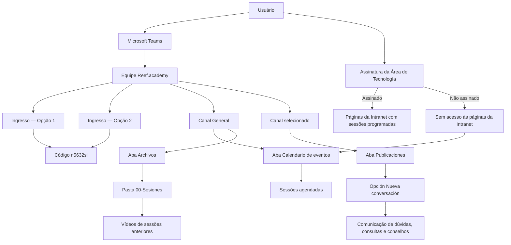

# Guia Operacional do Equipe Microsoft Teams “Reef.academy”

## 1. Metadados do Documento
- **Arquivo de Origem:** Não identificado no conteúdo fornecido
- **Tipo de Documento:** Procedimento
- **Domínio / Sistema:** Reef.academy / Microsoft Teams / Área de Tecnologia / Portal de Documentação MAPFRE
- **Público-Alvo:** Colaboradores, usuários do Microsoft Teams e consumidores de sessões Reef.academy
- **Data/Versão Identificada:** 06/11/2023

---

## 2. Resumo Executivo & Contexto de Negócio

O documento apresenta um guia operacional para utilização do time Microsoft Teams denominado **“Reef.academy”**, pertencente à ACS — Área Corporativas de Soluciones. O objetivo central é orientar usuários sobre ingresso no time, consulta de sessões, acesso a gravações e comunicação de dúvidas.

O processo de adesão ao time Reef.academy possui duas alternativas, condicionadas à versão do Microsoft Teams utilizada. Ambas empregam o código de ingresso **`n5632sl`** e conduzem o usuário à seleção do time Reef.academy.

Após o ingresso, o canal **“General”** centraliza o acesso ao calendário de eventos e aos arquivos de sessões anteriores. O calendário permite consultar sessões agendadas, enquanto a pasta **“00-Sesiones”**, acessada pela aba **“Archivos”**, contém vídeos de sessões anteriores.

O documento também descreve o processo para iniciar conversas em canais do time e explicita uma restrição de acesso: usuários não inscritos na **Área de Tecnologia** não podem acessar páginas da Intranet que exibem sessões programadas. Ainda assim, esses usuários podem acessar o Calendário de Eventos de Reef.academy e visualizar as sessões.

---

## 3. Arquitetura, Componentes & Tecnologias Envolvidas

| Componente | Papel identificado no documento |
| :--- | :--- |
| ACS — Área Corporativas de Soluciones | Área corporativa identificada no cabeçalho do material. |
| Microsoft Teams | Plataforma usada para ingresso no time, consulta de sessões, acesso a vídeos e comunicação. |
| Equipe “Reef.academy” | Time do Microsoft Teams destinado às atividades Reef.academy. |
| Canal “General” | Canal usado para consultar o Calendário de eventos e os arquivos de sessões anteriores. |
| Aba “Calendario de eventos” | Local de consulta das sessões agendadas. |
| Aba “Archivos” | Local de acesso aos arquivos do canal General. |
| Pasta “00-Sesiones” | Pasta indicada para visualizar vídeos de sessões anteriores. |
| Aba “Publicaciones” | Local para iniciar comunicação no canal escolhido. |
| Opção “Nueva conversación” | Ação usada para criar uma nova conversa. |
| Área de Tecnología | Área cuja assinatura condiciona o acesso às páginas de Intranet sobre sessões programadas. |
| Intranet | Ambiente que apresenta páginas de sessões programadas para assinantes da Área de Tecnología. |
| Portal de Documentação MAPFRE | Portal com documentação acessível pela URL informada no documento. |



**Nota de Análise:** O documento descreve procedimentos de navegação no Microsoft Teams, mas não detalha versões específicas do aplicativo, permissões administrativas, responsáveis pelo time, critérios de aprovação de ingresso ou políticas de retenção dos vídeos.

---

## 4. Regras de Negócio, Especificações Funcionais & Processos

### 4.1. Ingresso no time Microsoft Teams “Reef.academy”

O documento informa que existem diferentes formas de ingresso no time Reef.academy, dependendo da versão do Microsoft Teams.

#### Opção 1
1. No Microsoft Teams, selecionar o ícone **“Equipos”**.
2. Selecionar **“Unirse a un equipo o crea…”**.
3. Introduzir o código **`n5632sl`** ou selecionar o time **“Reef.academy”**.

#### Opção 2
1. No Microsoft Teams, selecionar o ícone **“Equipos”**.
2. Selecionar o sinal de adição **“+”**.
3. Selecionar a opção **“Unirse al equipo”**.
4. Introduzir o código **`n5632sl`** ou selecionar o time **“Reef.academy”**.

### 4.2. Consulta de sessões agendadas
1. No Microsoft Teams, selecionar o ícone **“Equipos”**.
2. Selecionar o canal **“General”**.
3. Selecionar a aba **“Calendario de eventos”**.

### 4.3. Acesso a vídeos de sessões anteriores
1. No Microsoft Teams, selecionar o ícone **“Equipos”**.
2. Selecionar o canal **“General”**.
3. Selecionar a aba **“Archivos”**.
4. Selecionar a pasta **“00-Sesiones”**.

### 4.4. Comunicação de dúvidas, consultas e conselhos
1. No Microsoft Teams, selecionar o ícone **“Equipos”**.
2. Selecionar o canal no qual a conversa deverá ser iniciada.
3. Selecionar a aba **“Publicaciones”**.
4. Selecionar a opção **“Nueva conversación”**.

### 4.5. Assinatura da Área de Tecnologia
- Usuários não inscritos na **Área de Tecnología** não podem acessar as páginas da Intranet que apresentam sessões programadas.
- Mesmo sem assinatura da Área de Tecnología, o usuário pode acessar o **Calendario de Eventos de Reef.academy** e visualizar as sessões.
- Para realizar a assinatura, o documento instrui o usuário a seguir as etapas apresentadas em um vídeo, reproduzível por meio de um botão.
- O texto informa que existe um link para acesso ao perfil do usuário, porém a URL desse link não foi apresentada na extração fornecida.

### 4.6. Acesso ao portal de documentação
A documentação é acessada pelo portal:

`https://marketplace.mapfre.com/docs/default/mapfredocument/documentacion_reef.core`

**Nota de Análise:** O documento não detalha o conteúdo do portal, o mecanismo de autenticação, os perfis necessários, nem a relação técnica entre Reef.academy e a documentação `reef.core`.

---

## 5. Tabelas de Parâmetros, Ambientes e Estruturas de Dados

| Item / Parâmetro | Descrição / Função | Tipo / Valores / Formato | Ambiente / Observações |
| :--- | :--- | :--- | :--- |
| Nome do time | Identifica o time a ser acessado pelos usuários. | `Reef.academy` | Microsoft Teams |
| Código de ingresso | Código apresentado para ingresso no time Reef.academy. | `n5632sl` | Microsoft Teams |
| Ícone de navegação | Ponto inicial dos procedimentos de ingresso, consulta e comunicação. | `Equipos` | Microsoft Teams |
| Ação de ingresso — Opção 1 | Opção de ingresso descrita para determinadas versões do Microsoft Teams. | `Unirse a un equipo o crea…` | Microsoft Teams |
| Ação de ingresso — Opção 2 | Opção de ingresso alternativa descrita para determinadas versões do Microsoft Teams. | Sinal `+` e `Unirse al equipo` | Microsoft Teams |
| Canal | Canal usado para eventos e vídeos anteriores. | `General` | Equipe Reef.academy |
| Aba de agenda | Aba para consulta de sessões agendadas. | `Calendario de eventos` | Canal General |
| Aba de arquivos | Aba para acesso aos arquivos do canal. | `Archivos` | Canal General |
| Pasta de vídeos | Pasta que contém os vídeos de sessões anteriores. | `00-Sesiones` | Aba Archivos do canal General |
| Aba de comunicação | Aba para publicar mensagens em um canal. | `Publicaciones` | Canal selecionado |
| Ação de comunicação | Ação para iniciar uma conversa em um canal. | `Nueva conversación` | Aba Publicaciones |
| Área de assinatura | Área cuja assinatura habilita acesso às páginas de Intranet sobre sessões programadas. | `Área de Tecnología` | Intranet |
| Restrição de acesso | Consequência da ausência de assinatura da Área de Tecnología. | Sem acesso às páginas de Intranet de sessões programadas | Não impede acesso ao Calendário de Eventos de Reef.academy |
| URL do portal | Endereço fornecido para acesso ao portal de documentação. | `https://marketplace.mapfre.com/docs/default/mapfredocument/documentacion_reef.core` | Portal MAPFRE |
| Data identificada | Data exibida na primeira página do material. | `06/11/2023` | Formato não explicitado no documento |

---

## 6. Bateria de Perguntas & Respostas para RAG (FAQ Sintético)

### P1: Como posso entrar no time Microsoft Teams Reef.academy?
**R:** O ingresso no time Reef.academy é realizado no Microsoft Teams. O documento apresenta duas alternativas, dependentes da versão do Microsoft Teams: usar a opção “Unirse a un equipo o crea…” ou selecionar o sinal “+” e depois “Unirse al equipo”. Em ambas as alternativas, deve-se introduzir o código `n5632sl` ou selecionar o time “Reef.academy”.

### P2: Qual é o código de ingresso do time Reef.academy?
**R:** O código de ingresso apresentado para o time Microsoft Teams “Reef.academy” é `n5632sl`.

### P3: Onde são consultadas as sessões agendadas de Reef.academy?
**R:** As sessões agendadas são consultadas no Microsoft Teams, acessando o ícone “Equipos”, o canal “General” e a aba “Calendario de eventos”.

### P4: Como acessar os vídeos de sessões anteriores de Reef.academy?
**R:** Para visualizar vídeos de sessões anteriores, o usuário deve abrir o Microsoft Teams, selecionar “Equipos”, entrar no canal “General”, abrir a aba “Archivos” e selecionar a pasta “00-Sesiones”.

### P5: Em qual pasta ficam os vídeos de sessões anteriores?
**R:** Os vídeos de sessões anteriores são acessados na pasta “00-Sesiones”, localizada na aba “Archivos” do canal “General” da equipe Reef.academy.

### P6: Como publicar uma dúvida ou consulta em Reef.academy?
**R:** Para comunicar dúvidas, consultas ou conselhos, o usuário deve acessar “Equipos” no Microsoft Teams, selecionar o canal desejado, abrir a aba “Publicaciones” e selecionar a opção “Nueva conversación”.

### P7: O que acontece se eu não estiver inscrito na Área de Tecnología?
**R:** Sem assinatura da Área de Tecnología, o usuário não pode acessar as páginas da Intranet que mostram sessões programadas. Entretanto, o documento afirma que ainda é possível acessar o Calendário de Eventos de Reef.academy e visualizar as sessões.

### P8: É possível ver as sessões Reef.academy sem assinatura da Área de Tecnología?
**R:** Sim. Embora a falta de assinatura impeça o acesso às páginas da Intranet com sessões programadas, o documento informa que o Calendário de Eventos de Reef.academy permanece acessível e permite visualizar as sessões.

### P9: Como posso me inscrever na Área de Tecnología?
**R:** O documento orienta que a inscrição deve seguir os passos apresentados em um vídeo, reproduzível por um botão. Também informa a existência de um link para acesso ao perfil do usuário, mas a URL do perfil não foi incluída no conteúdo extraído.

### P10: Qual é a URL do portal de documentação Reef?
**R:** A URL fornecida para acesso ao portal de documentação é `https://marketplace.mapfre.com/docs/default/mapfredocument/documentacion_reef.core`.

### P11: O documento explica quais conteúdos existem no portal de documentação?
**R:** Não. O documento fornece somente a URL de acesso ao portal de documentação. Não detalha categorias documentais, permissões, mecanismos de autenticação ou conteúdo disponível.

---

## 7. Glossário de Termos, Siglas & Conceitos-Chave

- **ACS:** Área Corporativas de Soluciones, identificação exibida no cabeçalho do documento.
- **Área de Tecnología:** Área cuja assinatura é necessária para acessar páginas de Intranet que mostram sessões programadas.
- **Calendario de eventos:** Aba do canal General usada para consultar sessões agendadas.
- **Equipos:** Ícone/opção do Microsoft Teams usado como ponto de entrada para os procedimentos descritos.
- **General:** Canal da equipe Reef.academy usado para acessar o calendário e os arquivos das sessões.
- **Intranet:** Ambiente cujas páginas de sessões programadas requerem assinatura da Área de Tecnología.
- **Nueva conversación:** Opção usada para iniciar uma nova conversa em um canal.
- **Publicaciones:** Aba do Microsoft Teams usada para comunicação em um canal.
- **Reef.academy:** Equipe Microsoft Teams abordada pelo documento.
- **Reef.core:** Termo presente na URL do portal de documentação. O documento não fornece definição adicional.
- **00-Sesiones:** Pasta indicada para acesso a vídeos de sessões anteriores.

---

## 8. Notas Críticas, Riscos & Limitações

- O acesso às páginas da Intranet que mostram sessões programadas depende de assinatura na **Área de Tecnología**.
- A ausência de assinatura não bloqueia o acesso ao Calendário de Eventos de Reef.academy, mas limita o acesso às páginas da Intranet.
- O guia menciona que há diferentes procedimentos de ingresso conforme a versão do Microsoft Teams, mas não identifica as versões às quais cada opção se aplica.
- O documento menciona um vídeo e um link de perfil para assinatura da Área de Tecnología, mas a extração não contém a URL do perfil nem detalhes do vídeo.
- Não há especificação sobre permissões, responsáveis pela equipe, aprovação de membros, requisitos de licenciamento ou tratamento de falhas no ingresso.
- A página 17 foi identificada como página em branco ou contendo apenas elementos visuais/imagem; não há conteúdo textual adicional recuperável.

---

## 9. Conteúdo Bruto Estruturado (Referência Fiel)

```text
--- [PÁGINA 1 DE 17] ---

ACS - Área Corporativas de Soluciones
Equipo en Microsoft Teams – ¿Cómo puedo …?
Reef.academy
06/11/2023


--- [PÁGINA 2 DE 17] ---

ACS - Área Corporativas de Soluciones
Reef.academy - Equipo en Microsoft Teams – Como hacer…
Índice
Reef.academy - ¿Cómo puedo…?
1. Darme de alta en el Equipo de Microsoft Teams “Reef.Academy”
1. Opción 1
2. Opción 2
2. Conocer las sesiones agendadas
3. Ver vídeos de sesiones anteriores
4. Comunicar dudas, consultas, consejos, …
5. Suscripción al Área de Tecnología
6. Acceder a la documentación en el Portal
2


--- [PÁGINA 3 DE 17] ---

ACS - Área Corporativas de Soluciones
Reef.academy - Equipo en Microsoft Teams – Como hacer…
Darme de alta en el Equipo de Microsoft Teams “Reef.academy”
3


--- [PÁGINA 4 DE 17] ---

ACS - Área Corporativas de Soluciones
Reef.academy - Equipo en Microsoft Teams – Como hacer…4
Dependiendo de la versión de Microsoft Teams, hay varias formas de darse de alta en un Equipo:
1. Opción 1
2. Opción 2


--- [PÁGINA 5 DE 17] ---

ACS - Área Corporativas de Soluciones
Reef.academy - Equipo en Microsoft Teams – Como hacer…
Darme de alta en el Equipo de Microsoft Teams “Reef.academy” – Opción 1
5
En Microsoft Teams 
pulsar sobre el 
icono de “Equipos”
1er paso
Pulsar sobre 
“Unirse a un equipo 
o crea…”
2do paso 3er paso
Introducir el código  
n5632sl
o, también  
puedes…
Pulsa sobre el 
Equipo 
“Reef.academy”


--- [PÁGINA 6 DE 17] ---

ACS - Área Corporativas de Soluciones
Reef.academy - Equipo en Microsoft Teams – Como hacer…
Darme de alta en el Equipo de Microsoft Teams “Reef.academy” – Opción 2
6
En Microsoft Teams 
pulsar sobre el 
icono de “Equipos”
1er paso 3er paso
Introducir el código  
n5632sl
o, también  
puedes…
Pulsa sobre el 
Equipo 
“Reef.academy”
2do paso
Pulsando el signo 
mas (+) y luego la 
opción de “Unirse al 
equipo”


--- [PÁGINA 7 DE 17] ---

ACS - Área Corporativas de Soluciones
Reef.academy - Equipo en Microsoft Teams – Como hacer…
Conocer las sesiones agendadas
7


--- [PÁGINA 8 DE 17] ---

ACS - Área Corporativas de Soluciones
Reef.academy - Equipo en Microsoft Teams – Como hacer…
Conocer las sesiones agendadas
8
En Microsoft Teams 
pulsar sobre el 
icono de “Equipos”
1er paso 2do paso
Pulsa sobre el canal 
“General”
3er paso
Seleccionar la 
pestaña 
“Calendario de 
eventos”


--- [PÁGINA 9 DE 17] ---

ACS - Área Corporativas de Soluciones
Reef.academy - Equipo en Microsoft Teams – Como hacer…
Ver vídeos de sesiones anteriores
9


--- [PÁGINA 10 DE 17] ---

ACS - Área Corporativas de Soluciones
Reef.academy - Equipo en Microsoft Teams – Como hacer…
Ver vídeos de sesiones anteriores
10
En Microsoft Teams 
pulsar sobre el 
icono de “Equipos”
1er paso 2do paso
Pulsa sobre el canal 
“General”
3er paso
Seleccionar la 
pestaña 
“Archivos”
4to paso
Pulsa sobre la 
carpeta
“00-Sesiones”


--- [PÁGINA 11 DE 17] ---

ACS - Área Corporativas de Soluciones
Reef.academy - Equipo en Microsoft Teams – Como hacer…
Comunicar dudas, consultas, consejos, …
11


--- [PÁGINA 12 DE 17] ---

ACS - Área Corporativas de Soluciones
Reef.academy - Equipo en Microsoft Teams – Como hacer…
Comunicar dudas, consultas, consejos, …
12
En Microsoft Teams 
pulsar sobre el 
icono de “Equipos”
1er paso 2do paso
Seleccionar el canal 
sobre el cual 
quieres comenzar 
una conversación
3er paso
Seleccionar la 
pestaña 
“Publicaciones”
4to paso
Seleccionar la 
opción
“Nueva 
conversación”


--- [PÁGINA 13 DE 17] ---

ACS - Área Corporativas de Soluciones
Reef.academy - Equipo en Microsoft Teams – Como hacer…
Suscripción al Área de Tecnología
13


--- [PÁGINA 14 DE 17] ---

ACS - Área Corporativas de Soluciones
Reef.academy - Equipo en Microsoft Teams – Como hacer…14
Si no se está suscrito al Área de Tecnología, no se podrá acceder a las páginas de la Intranet en la 
que muestran las sesiones programadas, aunque siempre es posible acceder al Calendario de 
Eventos de Reef.academy y verlas. 
Si te interesa suscribirte hay que seguir los pasos que se indican en el vídeo que se muestra a 
continuación que puedes reproducir pulsando el botón. El acceso a tu perfil se puede hacer desde 
este enlace.


--- [PÁGINA 15 DE 17] ---

ACS - Área Corporativas de Soluciones
Reef.academy - Equipo en Microsoft Teams – Como hacer…
Acceder a la documentación en el Portal
15


--- [PÁGINA 16 DE 17] ---

ACS - Área Corporativas de Soluciones
Reef.academy - Equipo en Microsoft Teams – Como hacer…16
La dirección con la que se accede al portal es:
https://marketplace.mapfre.com/docs/default/mapfredocument/documentacion_reef.core


--- [PÁGINA 17 DE 17] ---

[Página em branco ou apenas elementos visuais/imagem]
```
