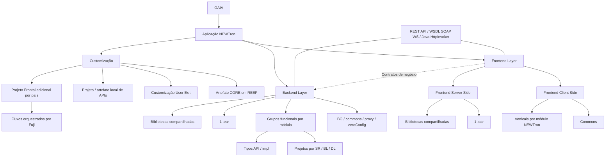

# Arquitetura de Alto Nível GAIA e NEWTron: Camadas Frontend, Backend e Customização

## 1. Metadados do Documento
- **Arquivo de Origem:** `Não identificado no conteúdo extraído`
- **Tipo de Documento:** `Arquitetura de Software / Apresentação Executiva`
- **Domínio / Sistema:** `GAIA / NEWTron`
- **Público-Alvo:** `Arquitetos, Desenvolvedores, Equipes de Customização e Operação`
- **Data/Versão Identificada:** `Não identificada`

---

## 2. Resumo Executivo & Contexto de Negócio

O documento apresenta a arquitetura de alto nível da aplicação NEWTron no contexto da plataforma GAIA. A arquitetura separa responsabilidades entre camadas de Frontend, Backend e mecanismos de customização, permitindo que diferentes áreas funcionais e equipes de desenvolvimento evoluam componentes de forma independente.

A separação entre Frontend e Backend estabelece ciclos de vida próprios, versionamento independente e configuração individual na plataforma de Integração Contínua (CI). O contrato de negócio entre as camadas é formado por interfaces de serviço, incluindo REST API, WSDL para serviços SOAP e interfaces Java para HttpInvoker.

A aplicação NEWTron é organizada em módulos funcionais, como Common, Coinsurance, Issue, Reinsurance, Loss, Treasury e Third Person. Cada módulo possui um acrônimo de três letras e é representado por conceitos estruturais específicos: verticais no Frontend e grupos funcionais no Backend.

O documento também descreve a evolução do modelo de customização. O modelo anterior permitia novos verticais, telas, objetos BO e extensões em camadas Java e Oracle. O modelo User Exit busca centralizar personalizações sob demanda no artefato CORE publicado em REEF, reduzir artefatos locais por módulo e concentrar código de personalização e novas APIs em um único projeto ou artefato de APIs.

A apresentação não detalha contratos HTTP específicos, modelos de dados, endpoints, versões de tecnologias, rotas de implantação, configurações de servidores ou mecanismos internos de Fuji, REEF e iFactory. Esses tópicos são citados, mas não possuem detalhamento técnico adicional no conteúdo extraído.

---

## 3. Arquitetura, Componentes & Tecnologias Envolvidas

A arquitetura apresentada possui camadas de Frontend e Backend, complementadas por mecanismos de customização. A aplicação possui perspectivas de arquitetura denominadas visão de aplicação e visão de tecnologia; uma terceira perspectiva é mencionada nas notas do slide 9, mas o nome não está completo no conteúdo extraído.

### Componentes e conceitos identificados

| Componente / Tecnologia | Papel descrito no documento |
| :--- | :--- |
| GAIA | Plataforma ou contexto arquitetural no qual NEWTron está organizado. |
| NEWTron | Aplicação organizada por módulos funcionais, camadas Frontend e Backend e mecanismos de customização. |
| Frontend Layer | Camada que contém partes cliente e servidor do Frontend. |
| Frontend Client Side | Parte cliente do Frontend, composta por elementos comuns e elementos específicos por módulo funcional. |
| Frontend Server Side | Parte servidor do Frontend; o modelo de implantação corporativo possui um `.ear` e bibliotecas compartilhadas associadas. |
| Backend Layer | Camada Backend com partes comuns e partes específicas por módulo funcional. |
| BO | Parte comum da camada Backend; o documento também cita customização de objetos BO em Java e Oracle. |
| commons | Parte comum da camada Backend e conceito comum na aplicação cliente. |
| proxy | Parte comum da camada Backend. |
| zeroConfig | Parte comum da camada Backend. |
| Vertical | Conceito usado no Frontend para a parte específica de cada módulo funcional. |
| Functional group | Conceito usado no Backend para a parte específica de cada módulo funcional. |
| REST API | Uma das formas de contrato de negócio entre Frontend e Backend. |
| WSDL / SOAP WS | Forma de contrato de negócio entre Frontend e Backend. |
| Java interface for HttpInvoker | Forma de contrato de negócio entre Frontend e Backend. |
| CI platform | Plataforma em que Frontend e Backend podem ser configurados individualmente. |
| iFactory plugin | Plugin usado para criar conteúdo; há uma vertical por módulo NEWTron. |
| Java Tasks | Elemento citado na estrutura do Backend e na adaptação de processos existentes. |
| Oracle | Tecnologia citada para customização de objetos BO. |
| REEF | Ambiente ou plataforma onde o artefato CORE é publicado com capacidade de customização User Exit. |
| Fuji | Mecanismo citado para orquestração de fluxos no projeto Frontal adicional de cada país. |
| CORE | Artefato publicado em REEF e extensível por User Exit em pontos específicos sob demanda. |
| API local | Projeto ou artefato local que integra personalizações e novas APIs. |
| Tronweb | Elemento presente no diagrama legado de arquitetura NEWTron. |
| TW Client | Cliente presente no diagrama legado de arquitetura NEWTron. |
| TW Server | Servidor presente no diagrama legado de arquitetura NEWTron. |
| API CORE | Componente apresentado no diagrama legado de arquitetura NEWTron. |
| Data Model | Modelo de dados apresentado no diagrama legado de arquitetura NEWTron. |



> **Nota de Análise:** O diagrama Mermaid representa relações explicitamente descritas na apresentação. A apresentação contém imagens de arquitetura adicionais, mas os seus detalhes visuais não foram extraídos como texto estruturado.

> **Nota de Análise:** O documento cita Tronweb, TW Client, TW Server, API CORE e Data Model em um diagrama de arquitetura anterior, mas não descreve responsabilidades, protocolos, métodos HTTP ou contratos de integração desses componentes.

---

## 4. Regras de Negócio, Especificações Funcionais & Processos

### Separação entre Frontend e Backend

1. Frontend e Backend possuem ciclos de vida próprios.
2. Frontend e Backend são versionados de forma independente.
3. Frontend e Backend são configurados individualmente na plataforma de Integração Contínua.
4. Equipes de desenvolvimento diferentes podem trabalhar nas camadas Frontend e Backend.
5. O contrato de negócio entre as camadas é estabelecido por interfaces de serviço.
6. As interfaces de serviço mencionadas são REST API, WSDL para SOAP Web Services e interface Java para HttpInvoker.

### Organização do Frontend

1. A camada cliente do Frontend contém uma parte comum a toda a aplicação cliente.
2. A camada cliente do Frontend contém uma parte específica para cada módulo funcional da aplicação.
3. A parte específica de cada módulo funcional no Frontend utiliza o conceito de **vertical**.
4. A camada Frontend inclui as partes cliente e servidor.
5. O conteúdo da camada Frontend foi criado usando o plugin iFactory.
6. Existe uma vertical por módulo NEWTron.
7. O modelo de implantação do Frontend Server Side em um servidor corporativo é composto por um `.ear` e `n` bibliotecas compartilhadas associadas.

### Organização do Backend

1. A camada Backend possui quatro partes comuns a toda a aplicação:
   - `bo`
   - `commons`
   - `proxy`
   - `zeroConfig`
2. A camada Backend possui uma parte específica para cada módulo funcional da aplicação.
3. A parte específica do Backend utiliza o conceito de **Functional group**.
4. Existe um grupo funcional por módulo NEWTron.
5. Existe um projeto por combinação de:
   - Grupo funcional;
   - Camada `sr`, `bl` ou `dl`;
   - Tipo de projeto `api` ou `impl`.
6. O modelo de implantação do Backend em um servidor corporativo é composto por um `.ear` e `n` bibliotecas compartilhadas associadas.
7. Java Tasks são mencionadas como elemento relacionado à camada Backend e à adaptação de processos existentes.

### Customização anterior do NEWTron

A plataforma GAIA define mecanismos para customizar componentes em diferentes camadas:

1. No Frontend, é possível adicionar novos verticais.
2. No Frontend, é possível adicionar novas telas por meio do componente de interface de usuário de menu de opções.
3. Objetos BO podem ser customizados em Java e Oracle.
4. Cada camada Java pode receber customização.
5. Serviços podem ser customizados no Backend.
6. Controllers podem ser customizados no Frontend.
7. Existe um arquétipo e um guia para criação de projetos de customização.

### Customização User Exit

O modelo User Exit estabelece as seguintes diretrizes:

1. Os artefatos devem poder ser atualizados de maneira transparente.
2. Uma atualização deve eliminar a necessidade de implantar outros artefatos.
3. O artefato CORE é publicado em REEF com capacidade de personalização User Exit.
4. A personalização é adicionada sob demanda em pontos específicos do CORE.
5. O modelo busca eliminar artefatos locais separados para cada módulo.
6. Um único projeto ou artefato de APIs deve incluir:
   - Código de personalização;
   - Novas APIs.

### Princípios de customização User Exit

1. Não é permitido modificar os fluxos atuais do Frontend CORE.
2. A personalização deve ocorrer por:
   - Menu de opções;
   - Tarefas;
   - Novos fluxos;
   - Parametrização.
3. Cada país deve possuir um projeto Frontal adicional para novos fluxos.
4. Os fluxos do projeto Frontal adicional são orquestrados por Fuji.
5. Personalizações que alteram o fluxo do CORE e podem ser parametrizadas devem ser incorporadas ao CORE.
6. A incorporação de personalizações ao CORE busca minimizar customizações e oferecer novas capacidades a outros países.
7. Processos existentes devem ser adaptados, incluindo Java Tasks e o módulo de notificações de saída.
8. Projetos API locais devem ser integrados com toda sua funcionalidade.

### Arquitetura NEWTron anterior

As notas do slide 3 registram limitações da arquitetura Tronweb:

1. Tronweb é descrito como um cliente pesado.
2. Existem problemas para atualizar a aplicação.
3. Não existe suporte a múltiplos dispositivos.
4. A solução depende de JDK.

---

## 5. Tabelas de Parâmetros, Ambientes e Estruturas de Dados

### Módulos funcionais NEWTron

| Item / Parâmetro | Descrição / Função | Tipo / Valores / Formato | Ambiente / Observações |
| :--- | :--- | :--- | :--- |
| Common | Módulo funcional NEWTron. | Acrônimo: `CMN` | Não detalhado. |
| Coinsurance | Módulo funcional NEWTron. | Acrônimo: `CIN` | Não detalhado. |
| Issue | Módulo funcional NEWTron. | Acrônimo: `ISU` | Não detalhado. |
| Reinsurance | Módulo funcional NEWTron. | Acrônimo: `RNS` | Não detalhado. |
| Loss | Módulo funcional NEWTron. | Acrônimo: `LSS` | Não detalhado. |
| Treasury | Módulo funcional NEWTron. | Acrônimo: `TSY` | Não detalhado. |
| Third Person | Módulo funcional NEWTron. | Acrônimo: `THP` | Não detalhado. |
| Coinsurance Definition | Módulo de definição relacionado a Coinsurance. | Acrônimo: `CSD` | Não detalhado. |
| Issue Definition | Módulo de definição relacionado a Issue. | Acrônimo: `ISD` | Não detalhado. |
| Reinsurance Definition | Módulo de definição relacionado a Reinsurance. | Acrônimo: `RRD` | Não detalhado. |
| Loss Definition | Módulo de definição relacionado a Loss. | Acrônimo: `LSF` | Não detalhado. |
| Treasury Definition | Módulo de definição relacionado a Treasury. | Acrônimo: `TRF` | Não detalhado. |
| Third Person Definition | Módulo de definição relacionado a Third Person. | Acrônimo: `TPD` | Não detalhado. |

### Contratos de negócio entre camadas

| Item / Parâmetro | Descrição / Função | Tipo / Valores / Formato | Ambiente / Observações |
| :--- | :--- | :--- | :--- |
| REST API | Interface de serviço para contrato de negócio entre Frontend e Backend. | REST API | Não há endpoints, métodos HTTP ou contratos JSON informados. |
| WSDL | Interface de serviço para SOAP Web Services. | WSDL para SOAP WS | Não há definições WSDL informadas. |
| Java interface for HttpInvoker | Interface Java para contrato de negócio. | Interface Java / HttpInvoker | Não há assinaturas Java ou configuração de HttpInvoker informadas. |

### Estrutura de implantação e projetos

| Item / Parâmetro | Descrição / Função | Tipo / Valores / Formato | Ambiente / Observações |
| :--- | :--- | :--- | :--- |
| Frontend Server Side deployment | Implantação corporativa do Frontend Server Side. | `1 .ear` + `n` bibliotecas compartilhadas | Quantidade e nomes das bibliotecas não informados. |
| Backend deployment | Implantação corporativa do Backend. | `1 .ear` + `n` bibliotecas compartilhadas | Quantidade e nomes das bibliotecas não informados. |
| Frontend vertical | Parte específica de cada módulo funcional na camada cliente Frontend. | Uma vertical por módulo NEWTron | Criada com iFactory plugin. |
| Backend functional group | Parte específica de cada módulo funcional na camada Backend. | Um grupo funcional por módulo NEWTron | Não há lista explícita de grupos por módulo. |
| Projeto Backend | Estrutura de projeto do Backend. | Grupo funcional + camada `sr` / `bl` / `dl` + tipo `api` / `impl` | Significado de `sr`, `bl` e `dl` não detalhado. |
| Artefato CORE | Artefato extensível por User Exit. | Publicado em REEF | Pontos específicos de extensão são adicionados sob demanda. |
| Projeto Frontal adicional | Projeto destinado a novos fluxos por país. | Um projeto adicional por país | Fluxos orquestrados por Fuji. |
| Projeto / artefato local de APIs | Consolida personalização e novas APIs. | Projeto ou artefato único | Substitui artefatos locais por módulo. |

### Restrições e condições de customização

| Item / Parâmetro | Descrição / Função | Tipo / Valores / Formato | Ambiente / Observações |
| :--- | :--- | :--- | :--- |
| Fluxos Frontend CORE | Fluxos existentes do CORE. | Não modificáveis diretamente | A personalização deve ocorrer por mecanismos permitidos. |
| Mecanismos de personalização permitidos | Formas permitidas de estender comportamentos. | Menu de opções; tarefas; novos fluxos; parametrização | Aplicável ao modelo User Exit. |
| Personalização parametrizável | Alteração de fluxo CORE que pode ser parametrizada. | Deve ser incorporada ao CORE | Visa reduzir customizações locais e ampliar capacidades para outros países. |
| Java Tasks | Processo ou componente sujeito a adaptação. | Java Tasks | Citado junto ao módulo de notificações de saída. |
| Módulo de notificações de saída | Processo ou módulo sujeito a adaptação. | Não detalhado | Não há especificação funcional adicional. |

---

## 6. Bateria de Perguntas & Respostas para RAG (FAQ Sintético)

### P1: Qual é o objetivo da separação entre Frontend e Backend na arquitetura GAIA-NEWTron?
**R:** A separação permite que Frontend e Backend tenham ciclos de vida independentes, versionamento independente e configuração individual na plataforma de Integração Contínua. A apresentação também informa que equipes de desenvolvimento diferentes podem trabalhar em cada camada, mantendo o contrato de negócio por interfaces de serviço.

### P2: Quais interfaces podem formar o contrato de negócio entre Frontend e Backend?
**R:** O documento cita três alternativas para o contrato de negócio entre Frontend e Backend: REST API, WSDL para SOAP Web Services e interface Java para HttpInvoker. O conteúdo não detalha endpoints REST, métodos HTTP, contratos JSON, documentos WSDL ou assinaturas Java.

### P3: Como o Frontend NEWTron é organizado por módulo funcional?
**R:** A camada cliente do Frontend possui uma parte comum para toda a aplicação e uma parte específica por módulo funcional. A parte específica é chamada de vertical. O documento afirma que existe uma vertical por módulo NEWTron e que o conteúdo foi criado com o plugin iFactory.

### P4: Como o Backend NEWTron é dividido?
**R:** O Backend possui quatro partes comuns para toda a aplicação: `bo`, `commons`, `proxy` e `zeroConfig`. A parte específica de cada módulo funcional é chamada de Functional group. Existe um grupo funcional por módulo NEWTron.

### P5: Qual é a estrutura de projetos do Backend NEWTron?
**R:** O documento informa que há um projeto por combinação de grupo funcional, camada e tipo de projeto. As camadas listadas são `sr`, `bl` e `dl`; os tipos de projeto listados são `api` e `impl`. O significado expandido das siglas de camada não é fornecido.

### P6: Qual é o modelo de implantação corporativa das camadas Frontend Server Side e Backend?
**R:** Tanto para o Frontend Server Side quanto para o Backend, o modelo informado é um arquivo `.ear` e `n` bibliotecas compartilhadas associadas. A apresentação não especifica os nomes, versões, servidores ou quantidade concreta dessas bibliotecas.

### P7: Quais módulos funcionais NEWTron são apresentados?
**R:** Os módulos apresentados são Common (`CMN`), Coinsurance (`CIN`), Issue (`ISU`), Reinsurance (`RNS`), Loss (`LSS`), Treasury (`TSY`), Third Person (`THP`), Coinsurance Definition (`CSD`), Issue Definition (`ISD`), Reinsurance Definition (`RRD`), Loss Definition (`LSF`), Treasury Definition (`TRF`) e Third Person Definition (`TPD`).

### P8: Quais mecanismos de customização eram permitidos no modelo anterior do NEWTron?
**R:** O modelo anterior permitia adicionar novos verticais ou novas telas por meio do componente de menu de opções no Frontend. Também permitia customizar objetos BO em Java e Oracle, estender camadas Java, customizar serviços no Backend e controllers no Frontend. O documento informa ainda a existência de um arquétipo e de um guia para criar projetos de customização.

### P9: O que é a customização User Exit no contexto apresentado?
**R:** User Exit é a capacidade de adicionar personalizações sob demanda em pontos específicos do artefato CORE. O CORE é publicado em REEF com essa capacidade de personalização. O objetivo é permitir atualizações transparentes, reduzir a necessidade de implantar outros artefatos e eliminar artefatos locais separados para cada módulo.

### P10: É permitido modificar diretamente os fluxos Frontend atuais do CORE?
**R:** Não. O documento estabelece que não é permitido modificar os fluxos Frontend atuais do CORE. A personalização deve ocorrer por menu de opções, tarefas, novos fluxos ou parametrização.

### P11: Como novos fluxos devem ser implementados para cada país?
**R:** Cada país deve possuir um projeto Frontal adicional para novos fluxos. Esses fluxos devem ser orquestrados por Fuji. A apresentação não descreve tecnicamente Fuji, seu protocolo, configuração ou forma de integração.

### P12: Quando uma personalização deve ser incorporada ao CORE?
**R:** Personalizações que alteram o fluxo do CORE e podem ser parametrizadas devem ser incorporadas ao CORE. Segundo o documento, isso busca minimizar personalizações e disponibilizar novas capacidades para outros países.

### P13: O que o projeto ou artefato local de APIs deve conter?
**R:** O projeto ou artefato local de APIs deve concentrar o código de personalização e novas APIs. Esse modelo elimina a necessidade de manter artefatos locais separados para cada módulo.

### P14: Quais limitações são mencionadas para Tronweb?
**R:** As notas do documento descrevem Tronweb como um cliente pesado, com problemas de atualização da aplicação, sem suporte a múltiplos dispositivos e dependente de JDK.

---

## 7. Glossário de Termos, Siglas & Conceitos-Chave

- **API:** Interface de programação; o documento cita projetos e tipos de projeto `api`, mas não expande a sigla.
- **API CORE:** Componente mostrado no diagrama de arquitetura NEWTron anterior; não há detalhamento adicional.
- **BE:** Backend, conforme a referência a serviços em BE no conteúdo de customização.
- **BL:** Camada de projeto Backend citada na estrutura `sr/bl/dl`; significado expandido não informado.
- **BO:** Parte comum do Backend e tipo de objeto customizável em Java e Oracle; significado expandido não informado.
- **CI:** Continuous Integration; plataforma onde Frontend e Backend podem ser configurados individualmente.
- **CMN:** Acrônimo NEWTron para o módulo Common.
- **CIN:** Acrônimo NEWTron para o módulo Coinsurance.
- **CORE:** Artefato publicado em REEF com capacidade de customização User Exit.
- **CSD:** Acrônimo NEWTron para Coinsurance Definition.
- **DL:** Camada de projeto Backend citada na estrutura `sr/bl/dl`; significado expandido não informado.
- **EAR:** Formato de artefato de implantação citado no modelo corporativo de Frontend Server Side e Backend; significado expandido não informado no documento.
- **FE:** Frontend, conforme a referência a controllers em FE no conteúdo de customização.
- **Functional group:** Conceito usado no Backend para a parte específica de cada módulo funcional.
- **Fuji:** Mecanismo citado para orquestrar fluxos do projeto Frontal adicional; sem detalhamento adicional.
- **GAIA:** Plataforma ou contexto arquitetural da aplicação NEWTron.
- **HttpInvoker:** Tecnologia ou mecanismo de interface Java citado como contrato de negócio entre Frontend e Backend.
- **iFactory:** Plugin usado na criação do conteúdo da camada Frontend.
- **impl:** Tipo de projeto Backend citado em conjunto com `api`; significado expandido não informado.
- **ISD:** Acrônimo NEWTron para Issue Definition.
- **ISU:** Acrônimo NEWTron para Issue.
- **JDK:** Dependência mencionada nas limitações de Tronweb; significado expandido não informado no documento.
- **LSS:** Acrônimo NEWTron para Loss.
- **LSF:** Acrônimo NEWTron para Loss Definition.
- **NEWTron:** Aplicação composta por módulos funcionais, camadas Frontend e Backend e mecanismos de customização.
- **REEF:** Ambiente ou plataforma onde o artefato CORE é publicado; não há detalhamento adicional.
- **REST API:** Interface de serviço usada como possível contrato de negócio entre Frontend e Backend.
- **RNS:** Acrônimo NEWTron para Reinsurance.
- **RRD:** Acrônimo NEWTron para Reinsurance Definition.
- **SOAP WS:** SOAP Web Services, citados em conjunto com WSDL como contrato de negócio.
- **SR:** Camada de projeto Backend citada na estrutura `sr/bl/dl`; significado expandido não informado.
- **THP:** Acrônimo NEWTron para Third Person.
- **TPD:** Acrônimo NEWTron para Third Person Definition.
- **TRF:** Acrônimo NEWTron para Treasury Definition.
- **TSY:** Acrônimo NEWTron para Treasury.
- **TW Client:** Cliente mostrado no diagrama de arquitetura NEWTron anterior; não há detalhamento adicional.
- **TW Server:** Servidor mostrado no diagrama de arquitetura NEWTron anterior; não há detalhamento adicional.
- **Tronweb:** Solução ou camada apresentada na arquitetura NEWTron anterior; descrita como cliente pesado, dependente de JDK e sem suporte a múltiplos dispositivos.
- **User Exit:** Capacidade de inserir personalização sob demanda em pontos específicos do artefato CORE.
- **Vertical:** Conceito usado no Frontend para a parte específica de cada módulo funcional.
- **WSDL:** Contrato de serviço para SOAP Web Services.

---

## 8. Notas Críticas, Riscos & Limitações

- A arquitetura Tronweb anterior é descrita como cliente pesado, com dificuldades para atualização, ausência de suporte a múltiplos dispositivos e dependência de JDK.
- O documento não fornece detalhes técnicos sobre endpoints REST, métodos HTTP, payloads, esquemas JSON, WSDLs, interfaces Java, autenticação ou tratamento de falhas.
- As imagens dos diagramas de arquitetura não foram convertidas integralmente em texto; portanto, componentes visuais não identificados não foram inferidos.
- O significado das camadas `sr`, `bl` e `dl` não é explicado.
- O significado operacional de `bo`, `proxy` e `zeroConfig` não é detalhado, embora sejam identificados como partes comuns do Backend.
- Fuji é citado como orquestrador de fluxos, mas não há descrição de tecnologia, configuração, responsabilidades ou protocolo.
- REEF é citado como local de publicação do CORE, mas o documento não informa ambiente, URL, pipeline, permissões ou processo de publicação.
- A regra de não modificar fluxos atuais do Frontend CORE pode limitar customizações locais; novos comportamentos devem utilizar menu de opções, tarefas, novos fluxos ou parametrização.
- A incorporação de personalizações parametrizáveis ao CORE depende de avaliação sobre a possibilidade de parametrização e pode exigir governança entre países.
- A apresentação menciona adaptação de Java Tasks e do módulo de notificações de saída, mas não apresenta impactos, procedimentos de migração ou critérios de teste.
- Não há detalhes sobre modelo de dados, embora o termo Data Model esteja presente no diagrama da arquitetura anterior.
- Não há versões identificadas de GAIA, NEWTron, Java, Oracle, REEF, Fuji, iFactory ou demais tecnologias citadas.

---

## 9. Conteúdo Bruto Estruturado (Referência Fiel)

```text
<!-- Slide number: 1 -->


Backend Java

### Notes:

<!-- Slide number: 2 -->

High Level Architecture
GAIA
NEWTron Application Architecture
Frontend Layer
Backend Layer
Customization

<!-- Slide number: 3 -->


NEWTron Frontend

NEWtron Backend

NEWTron


TW Client


API CORE

TW Server


Tronweb


Data Model

### Notes:
Tronweb Layers: Heavy client , prblems updating the application, no multidevice, depends on JDK

<!-- Slide number: 4 -->

High Level Architecture
GAIA
NEWTron Application Architecture
Frontend Layer
Backend Layer
Customization

<!-- Slide number: 5 -->
5


GAIA Layers


GAIA - Newtron
Each on them has its own life cycle. Versioned independently and configured in the Continuous Integration (CI) platform by itself.
You can also have different development teams working in frontend and backend
The business contract between them are the service interfaces (REST API / WSDL for SOAP WS / Java interface for HttpInvoker)

<!-- Slide number: 6 -->
6


GAIA – Physical división vs Logical division


<!-- Slide number: 7 -->
10


GAIA – Application types


<!-- Slide number: 8 -->

High Level Architecture
GAIA
NEWTron Application Architecture
Frontend Layer
Backend Layer
Customization

<!-- Slide number: 9 -->
Application Architecture / High Level


### Notes:
We have 3 diferent views of the archtecture, the application view, the technology view and the

<!-- Slide number: 10 -->
Application Architecture


<!-- Slide number: 11 -->


NEWTron – Modules
| Module / Family | NewTron acronym (3 letters) |
| --- | --- |
| Common | CMN |
| Coinsurance | CIN |
| Issue | ISU |
| Reinsurance | RNS |
| Loss | LSS |
| Treasury | TSY |
| Third Person | THP |
| Coinsurance Definition | CSD |
| Issue Definition | ISD |
| Reinsurance Definition | RRD |
| Loss Definition | LSF |
| Treasury Definition | TRF |
| Third Person Definition | TPD |

### Notes:

<!-- Slide number: 12 -->

High Level Architecture
GAIA
NEWTron Application Architecture
Frontend Layer
Backend Layer
Customization

### Notes:

<!-- Slide number: 13 -->
Frontend Client Side


If we zoom in this layer, we have a common part to the whole client application (commons) and a specific part for each functional module of the application (the concept used is 'vertical').

### Notes:

<!-- Slide number: 14 -->
Frontend Server Side


The deployment model of the application in a corporate server  1 .ear and n shared libraries associated to it.


### Notes:

<!-- Slide number: 15 -->
Frontend Layer


Stores the client-side layer and the server-side layer for the FrontEnd

Content was created using iFactory plugin: 1 vertical per NewTron module 


### Notes:

<!-- Slide number: 16 -->

High Level Architecture
GAIA
NEWTron Application Architecture
Frontend Layer
Backend Layer
Customization

### Notes:

<!-- Slide number: 17 -->
Backend Layer


If we zoom in this layer we have 4 parts common to the whole application (bo/commons/proxy/zeroConfig) and a specific part for each functional module of the application (the concept used is 'Functional group').
The deployment model of the application in a corporate server  1 .ear and n shared libraries associated to it.


### Notes:

<!-- Slide number: 18 -->
Backend Layer


1 functional group per NewTron Module
1 Project per functional group + layer (sr/bl/dl) + Project type (api/impl)
Java Tasks


<!-- Slide number: 19 -->

High Level Architecture
GAIA
NEWTron Application Architecture
Frontend Layer
Backend Layer
Customization

### Notes:

<!-- Slide number: 20 -->


Former Newtron Customization

GAIA provides/defines mechanisms to customize the components in the different layers.

By adding new verticals or new screens (through the option menu UI component) at the frontend layer
For BO objects in both Java and Oracle
For each Java layer. Services in BE and Controllers in FE
There is an archetype and a guide for creating custom projects.

<!-- Slide number: 21 -->


Customization User Exit


Actualización de artefactos
Capacidad de actualizar artefactos de manera transparente.
Eliminación de la necesidad de desplegar otros artefactos debido a una actualización.
Artefacto CORE en REEF
Publicación del artefacto CORE en REEF con capacidad de personalización “User Exit”.
Personalización añadida en puntos específicos de CORE bajo demanda.
Artefacto local del país
Eliminación de artefactos locales para cada módulo.
Manejo de un único proyecto/artefacto de APIS que incluye código de personalización y nuevas APIs.

<!-- Slide number: 22 -->


Customization User Exit - Principios


Personalización de los flujos
No se permite modificar los flujos de frontal actuales de CORE.
Personalización a través de un menú de opciones, tareas, nuevos flujos o parametrización.
Proyecto Frontal adicional
Cada país tendrá un proyecto Frontal adicional para nuevos flujos.
Flujos orquestados a través de Fuji.
Incorporación de funcionalidad a CORE
Personalizaciones que alteran el flujo de CORE y pueden parametrizarse deben incorporarse al CORE.
Minimización de personalización y oferta de nuevas capacidades a otros países.
Impacto en procesos existentes
Adaptación de procesos como Tareas Java y Módulo de notificaciones de salida.
Integración de proyectos API locales con toda su funcionalidad.

<!-- Slide number: 23 -->


GRACIAS


### Notes:
```
