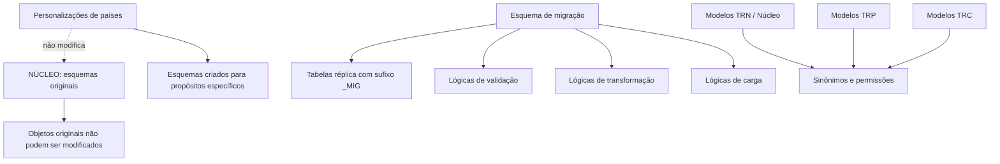

# Backend Oracle — Core, Migração, Política e Personalização

## 1. Metadados do Documento
- **Arquivo de Origem:** Não identificado no conteúdo extraído
- **Tipo de Documento:** Apresentação Executiva / Arquitetura de Software
- **Domínio / Sistema:** Backend Oracle; NÚCLEO; TRON/TRN; TRP; TRC; REEF Mapfre
- **Público-Alvo:** Arquitetos, desenvolvedores de banco de dados, equipes de personalização por país e operação
- **Data/Versão Identificada:** Não identificada

---

## 2. Resumo Executivo & Contexto de Negócio

O material apresenta tópicos relacionados ao **Backend Oracle**, ao núcleo de uma solução denominada **NÚCLEO** e ao processo de personalização por países. O conteúdo extraído possui estrutura de apresentação, com vários slides sem texto adicional além de títulos e notas do apresentador.

A principal regra arquitetural explicitada é que objetos existentes nos esquemas originais de NÚCLEO **não podem ser modificados pelas personalizações dos países**. Para permitir extensões nacionais sem alterar a base original, o documento informa que são criados esquemas com propósitos específicos, embora os propósitos individuais desses esquemas não estejam detalhados no conteúdo fornecido.

O documento também descreve um **esquema de migração** baseado em tabelas réplica com sufixo `_MIG`, além de lógicas de validação, transformação e carga. Não há detalhamento sobre nomes de tabelas, regras de transformação, sequência operacional ou contratos de entrada e saída.

Como referência operacional, a apresentação aponta URLs de modelos para TRN/NÚCLEO, TRP e TRC. Esses modelos servem para obter sinônimos e permissões conforme o objeto construído. O esquema geral de permissões e sinônimos entre esquemas é mencionado como disponível em um documento Excel, mas esse arquivo não foi incluído no conteúdo extraído.

---

## 3. Arquitetura, Componentes & Tecnologias Envolvidas

### Componentes e conceitos identificados

| Componente / Conceito | Descrição sustentada pelo documento |
| :--- | :--- |
| Backend Oracle | Tema central apresentado no primeiro slide. |
| NÚCLEO | Conjunto de esquemas originais cujos objetos não podem ser modificados por personalizações de países. |
| Personalizações de países | Adaptações nacionais que devem respeitar a imutabilidade dos objetos dos esquemas originais de NÚCLEO. |
| Esquemas adicionais | Esquemas criados para propósitos específicos relacionados à personalização, sem detalhamento individual no material. |
| Esquema de migração | Estrutura que inclui tabelas réplica com sufixo `_MIG` e lógicas de validação, transformação e carga. |
| Tabelas réplica `_MIG` | Tabelas de réplica identificadas pelo sufixo `_MIG`. O documento não especifica tabelas concretas nem estrutura de colunas. |
| TRN / Núcleo | Referência para modelos de sinônimos e permissões, por meio de URL REEF. |
| TRP | Referência para modelos de sinônimos e permissões, por meio de URL REEF. |
| TRC | Referência para modelos de sinônimos e permissões, por meio de URL REEF. |
| REEF Mapfre | Portal citado como fonte de modelos de TRN, TRP e TRC. |
| Tronweb Layers | Item citado nas notas do apresentador como contexto de introdução. |
| Heavy client | Característica atribuída a Tronweb Layers nas notas do apresentador. |
| JDK | Dependência mencionada nas notas do apresentador para Tronweb Layers. |



**Nota de Análise:** o conteúdo não define a finalidade específica de TRN, TRP e TRC, nem descreve a estrutura dos esquemas adicionais, tabelas `_MIG`, permissões, sinônimos ou lógicas de migração.

---

## 4. Regras de Negócio, Especificações Funcionais & Processos

### 4.1 Imutabilidade dos objetos do NÚCLEO

1. Os objetos presentes nos esquemas originais de **NÚCLEO** não podem ser modificados pelas personalizações realizadas pelos países.
2. Para permitir personalizações sem modificar os objetos originais de NÚCLEO, são criados esquemas com propósitos específicos.
3. O documento afirma que os propósitos dos esquemas seriam comentados posteriormente, mas o conteúdo extraído não apresenta essa explicação.

### 4.2 Sinônimos e permissões entre esquemas

1. Existem modelos para obtenção de sinônimos e permissões de acordo com o objeto construído.
2. Os modelos citados são:
   - Plantillas TRN (Núcleo);
   - Plantillas TRP;
   - Plantillas TRC.
3. O esquema geral de permissões e sinônimos entre esquemas pode ser consultado em um documento Excel.
4. O documento Excel referido não está presente no conteúdo fornecido; portanto, não é possível recuperar a matriz de permissões, os sinônimos ou os objetos envolvidos.

### 4.3 Esquema de migração

O slide “Core Backend Oracle II” lista os seguintes elementos de migração:

1. Tabelas réplica com sufixo `_MIG`;
2. Lógicas de validação;
3. Lógicas de transformação;
4. Lógicas de carga.

**Nota de Análise:** o documento não detalha a ordem de execução entre validação, transformação e carga; também não informa regras de erro, critérios de aprovação, origem dos dados, destino dos dados ou mecanismos de reversão.

### 4.4 Contexto de Tronweb Layers

As notas do apresentador associadas à introdução listam os seguintes aspectos de Tronweb Layers:

- Heavy client;
- Problemas para atualizar a aplicação;
- Ausência de multidevice;
- Dependência de JDK.

**Nota de Análise:** o conteúdo não explica a relação técnica entre Tronweb Layers e o Backend Oracle, nem apresenta plano de modernização, arquitetura alvo ou solução para os problemas mencionados.

---

## 5. Tabelas de Parâmetros, Ambientes e Estruturas de Dados

| Item / Parâmetro | Descrição / Função | Tipo / Valores / Formato | Ambiente / Observações |
| :--- | :--- | :--- | :--- |
| Objetos dos esquemas originais de NÚCLEO | Objetos protegidos contra alteração por personalizações dos países. | Regra arquitetural | Os nomes dos objetos não foram informados. |
| Esquemas para personalização | Esquemas criados para permitir personalizações sem modificar NÚCLEO. | Esquemas Oracle; propósito não especificado | O documento afirma que cada esquema possui um propósito, mas não os detalha. |
| Sufixo `_MIG` | Identificador de tabelas réplica usadas no esquema de migração. | Sufixo de nome de tabela | Não há lista de tabelas ou definição de colunas. |
| Lógicas de validação | Componente listado no esquema de migração. | Lógica de processamento | Critérios de validação não especificados. |
| Lógicas de transformação | Componente listado no esquema de migração. | Lógica de processamento | Regras de transformação não especificadas. |
| Lógicas de carga | Componente listado no esquema de migração. | Lógica de processamento | Destino e mecanismo de carga não especificados. |
| Plantillas TRN (Núcleo) | Fonte de modelos de sinônimos e permissões conforme o objeto construído. | URL | `https://reef.mapfre.com/es/plantillas-trn-nucleo/` |
| Plantillas TRP | Fonte de modelos de sinônimos e permissões conforme o objeto construído. | URL | `https://reef.mapfre.com/es/plantillas-trp/` |
| Plantillas TRC | Fonte de modelos de sinônimos e permissões conforme o objeto construído. | URL | `https://reef.mapfre.com/es/plantillas-trc/` |
| Documento Excel de permissões e sinônimos | Fonte citada para consulta do esquema geral entre esquemas. | Documento Excel | URL, nome e conteúdo não informados. |
| Tronweb Layers | Contexto de introdução citado nas notas do apresentador. | Camadas / solução, não detalhada | Associado a heavy client, problemas de atualização, ausência de multidevice e dependência de JDK. |
| JDK | Dependência citada para Tronweb Layers. | Tecnologia / dependência | Versão não identificada. |

---

## 6. Bateria de Perguntas & Respostas para RAG (FAQ Sintético)

### P1: Os países podem modificar objetos dos esquemas originais de NÚCLEO?
**R:** Não. O documento estabelece explicitamente que os objetos existentes nos esquemas originais de NÚCLEO não podem ser modificados pelas personalizações dos países.

### P2: Como as personalizações por país são realizadas sem alterar o NÚCLEO?
**R:** O material informa que são criados esquemas com propósitos específicos para suportar personalizações sem modificar os objetos presentes nos esquemas originais de NÚCLEO. Os propósitos individuais desses esquemas não foram detalhados no conteúdo extraído.

### P3: Qual é o padrão de nomenclatura das tabelas réplica no esquema de migração?
**R:** As tabelas réplica do esquema de migração utilizam o sufixo `_MIG`. O documento não fornece exemplos de nomes completos de tabelas.

### P4: Quais lógicas são mencionadas no esquema de migração do Backend Oracle?
**R:** O esquema de migração cita lógicas de validação, lógicas de transformação e lógicas de carga, além de tabelas réplica identificadas pelo sufixo `_MIG`.

### P5: O documento descreve a sequência entre validação, transformação e carga?
**R:** Não. O documento apenas lista lógicas de validação, transformação e carga, sem definir sequência de execução, regras de dependência ou condições de falha.

### P6: Onde obter os modelos de sinônimos e permissões para TRN ou Núcleo?
**R:** O documento aponta a URL `https://reef.mapfre.com/es/plantillas-trn-nucleo/` como fonte das plantillas TRN (Núcleo) para sinônimos e permissões conforme o objeto construído.

### P7: Quais URLs são citadas para os modelos TRP e TRC?
**R:** As URLs citadas são `https://reef.mapfre.com/es/plantillas-trp/` para plantillas TRP e `https://reef.mapfre.com/es/plantillas-trc/` para plantillas TRC.

### P8: Onde está o esquema geral de permissões e sinônimos entre esquemas?
**R:** O documento informa que o esquema geral de permissões e sinônimos entre esquemas pode ser consultado em um documento Excel. Entretanto, esse documento Excel não foi fornecido no conteúdo extraído.

### P9: Quais limitações de Tronweb Layers são apresentadas nas notas do apresentador?
**R:** As notas associadas à introdução indicam que Tronweb Layers é um heavy client, apresenta problemas para atualização da aplicação, não possui multidevice e depende de JDK.

### P10: O documento detalha quais objetos Oracle recebem sinônimos ou permissões?
**R:** Não. O documento apenas informa que existem modelos para sinônimos e permissões conforme o objeto construído, sem listar objetos, usuários, roles ou privilégios específicos.

---

## 7. Glossário de Termos, Siglas & Conceitos-Chave

- **Backend Oracle:** Tema central da apresentação; o documento não especifica versões, produtos Oracle ou arquitetura detalhada.
- **NÚCLEO:** Conjunto de esquemas originais cujos objetos não podem ser modificados pelas personalizações dos países.
- **TRN:** Referência denominada “TRN (Núcleo)” nas URLs de modelos para sinônimos e permissões.
- **TRP:** Referência de modelo de sinônimos e permissões disponibilizado em URL REEF.
- **TRC:** Referência de modelo de sinônimos e permissões disponibilizado em URL REEF.
- **`_MIG`:** Sufixo associado às tabelas réplica do esquema de migração.
- **Sinônimo:** Termo utilizado no contexto de modelos de sinônimos entre esquemas; o documento não apresenta definição técnica adicional.
- **Permissões:** Termo utilizado no contexto de modelos de permissões entre esquemas; privilégios específicos não são descritos.
- **Tronweb Layers:** Solução ou conjunto de camadas citado nas notas do apresentador, associada a heavy client, atualização problemática, ausência de multidevice e dependência de JDK.
- **Heavy client:** Característica mencionada para Tronweb Layers; não há detalhamento técnico adicional.
- **JDK:** Dependência mencionada para Tronweb Layers; versão não identificada.
- **REEF:** Portal Mapfre citado como origem das plantillas TRN, TRP e TRC.

---

## 8. Notas Críticas, Riscos & Limitações

- O material possui diversos slides sem conteúdo textual, reduzindo a capacidade de recuperar detalhes arquiteturais e funcionais.
- Os títulos “Core Backend Oracle I”, “Política Core”, “Personalización I”, “Personalización II” e “Tablas Configuración Base” não possuem detalhamento suficiente no texto extraído.
- As notas sobre NÚCLEO, esquemas, permissões e sinônimos são repetidas em diversos slides; o conteúdo não diferencia regras específicas por seção.
- Os propósitos dos esquemas criados para personalização não são explicados.
- A matriz de permissões e sinônimos entre esquemas depende de um documento Excel externo não fornecido.
- O esquema de migração não detalha tabelas concretas, estruturas de dados, regras de validação, transformações, cargas, processamento de erro ou rollback.
- Tronweb Layers é citado com limitações, mas o documento não apresenta arquitetura atual, arquitetura alvo, plano de substituição ou mitigação.
- Não foram identificados ambientes, servidores, portas, credenciais, versões de Oracle, versões de JDK, pipelines de CI/CD ou contratos de integração.

---

## 9. Conteúdo Bruto Estruturado (Referência Fiel)

```text
--- [SLIDE 1 DE 14: Sem Título] ---

* Backend Oracle

--- [SLIDE 2 DE 14: Sem Título] ---


--- [SLIDE 3 DE 14: Sem Título] ---

* _Introducción

📌 **[NOTAS DO APRESENTADOR / CONTEXTO ADICIONAL]:**
> Tronweb Layers: Heavy client , prblems updating the application, no multidevice, depends on JDK


--- [SLIDE 4 DE 14: Sem Título] ---


--- [SLIDE 5 DE 14: Sem Título] ---

* 5
* _Core Backend Oracle I

📌 **[NOTAS DO APRESENTADOR / CONTEXTO ADICIONAL]:**
> Los objetos presentes en los esquemas originales de NÚCLEO no podrán ser modificados por las personalizaciones de los países. Para ello, se crean estos esquemas con un propósito cada uno que comentaremos a continuación.
> Las plantillas con los sinónimos y permisos a otorgar en función del objeto que se construye se puede obtener de esta URLS:
> plantillas TRN (Núcleo): https://reef.mapfre.com/es/plantillas-trn-nucleo/
> plantillas TRP: https://reef.mapfre.com/es/plantillas-trp/
> plantillas TRC: https://reef.mapfre.com/es/plantillas-trc/
> El esquema de permisos y sinónimos general entre esquemas, se puede consultar en el sigueinte documento excel:


--- [SLIDE 6 DE 14: Sem Título] ---

* 5
* _Core Backend Oracle II
* ESQUEMA DE MIGRACIÓN:
* Tablas réplica sufijo _MIG
* Lógicas de validación
* Lógicas de Transformación
* Lógicas de Carga

📌 **[NOTAS DO APRESENTADOR / CONTEXTO ADICIONAL]:**
> Los objetos presentes en los esquemas originales de NÚCLEO no podrán ser modificados por las personalizaciones de los países. Para ello, se crean estos esquemas con un propósito cada uno que comentaremos a continuación.
> Las plantillas con los sinónimos y permisos a otorgar en función del objeto que se construye se puede obtener de esta URLS:
> plantillas TRN (Núcleo): https://reef.mapfre.com/es/plantillas-trn-nucleo/
> plantillas TRP: https://reef.mapfre.com/es/plantillas-trp/
> plantillas TRC: https://reef.mapfre.com/es/plantillas-trc/
> El esquema de permisos y sinónimos general entre esquemas, se puede consultar en el sigueinte documento excel:


--- [SLIDE 7 DE 14: Sem Título] ---


--- [SLIDE 8 DE 14: Sem Título] ---

* 5
* _Política Core

📌 **[NOTAS DO APRESENTADOR / CONTEXTO ADICIONAL]:**
> Los objetos presentes en los esquemas originales de NÚCLEO no podrán ser modificados por las personalizaciones de los países. Para ello, se crean estos esquemas con un propósito cada uno que comentaremos a continuación.
> Las plantillas con los sinónimos y permisos a otorgar en función del objeto que se construye se puede obtener de esta URLS:
> plantillas TRN (Núcleo): https://reef.mapfre.com/es/plantillas-trn-nucleo/
> plantillas TRP: https://reef.mapfre.com/es/plantillas-trp/
> plantillas TRC: https://reef.mapfre.com/es/plantillas-trc/
> El esquema de permisos y sinónimos general entre esquemas, se puede consultar en el sigueinte documento excel:


--- [SLIDE 9 DE 14: Sem Título] ---


--- [SLIDE 10 DE 14: Sem Título] ---

* 5
* _Personalización I

📌 **[NOTAS DO APRESENTADOR / CONTEXTO ADICIONAL]:**
> Los objetos presentes en los esquemas originales de NÚCLEO no podrán ser modificados por las personalizaciones de los países. Para ello, se crean estos esquemas con un propósito cada uno que comentaremos a continuación.
> Las plantillas con los sinónimos y permisos a otorgar en función del objeto que se construye se puede obtener de esta URLS:
> plantillas TRN (Núcleo): https://reef.mapfre.com/es/plantillas-trn-nucleo/
> plantillas TRP: https://reef.mapfre.com/es/plantillas-trp/
> plantillas TRC: https://reef.mapfre.com/es/plantillas-trc/
> El esquema de permisos y sinónimos general entre esquemas, se puede consultar en el sigueinte documento excel:


--- [SLIDE 11 DE 14: Sem Título] ---

* 5
* _Personalización II

📌 **[NOTAS DO APRESENTADOR / CONTEXTO ADICIONAL]:**
> Los objetos presentes en los esquemas originales de NÚCLEO no podrán ser modificados por las personalizaciones de los países. Para ello, se crean estos esquemas con un propósito cada uno que comentaremos a continuación.
> Las plantillas con los sinónimos y permisos a otorgar en función del objeto que se construye se puede obtener de esta URLS:
> plantillas TRN (Núcleo): https://reef.mapfre.com/es/plantillas-trn-nucleo/
> plantillas TRP: https://reef.mapfre.com/es/plantillas-trp/
> plantillas TRC: https://reef.mapfre.com/es/plantillas-trc/
> El esquema de permisos y sinónimos general entre esquemas, se puede consultar en el sigueinte documento excel:


--- [SLIDE 12 DE 14: Sem Título] ---


--- [SLIDE 13 DE 14: Sem Título] ---

* 5
* _Tablas Configuración Base

📌 **[NOTAS DO APRESENTADOR / CONTEXTO ADICIONAL]:**
> Los objetos presentes en los esquemas originales de NÚCLEO no podrán ser modificados por las personalizaciones de los países. Para ello, se crean estos esquemas con un propósito cada uno que comentaremos a continuación.
> Las plantillas con los sinónimos y permisos a otorgar en función del objeto que se construye se puede obtener de esta URLS:
> plantillas TRN (Núcleo): https://reef.mapfre.com/es/plantillas-trn-nucleo/
> plantillas TRP: https://reef.mapfre.com/es/plantillas-trp/
> plantillas TRC: https://reef.mapfre.com/es/plantillas-trc/
> El esquema de permisos y sinónimos general entre esquemas, se puede consultar en el sigueinte documento excel:


--- [SLIDE 14 DE 14: Sem Título] ---

* GRACIAS
```
