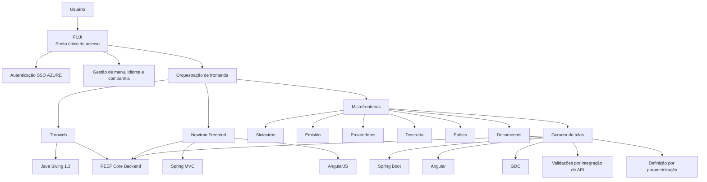

# Evolução da Arquitetura Frontend do Ecossistema TRON, REEF Core, NewTRON, GDC e FUJI

## 1. Metadados do Documento
- **Arquivo de Origem:** Não identificado; conteúdo bruto composto por 7 slides.
- **Tipo de Documento:** Apresentação Executiva.
- **Domínio / Sistema:** TRON, REEF Core Backend, NewTRON, GDC e FUJI.
- **Público-Alvo:** Arquitetos, desenvolvedores, responsáveis por manutenção e equipes de negócio.
- **Data/Versão Identificada:** Não identificada.

---

## 2. Resumo Executivo & Contexto de Negócio

O documento apresenta uma visão resumida da evolução e convivência de diferentes soluções frontend no ecossistema TRON. A apresentação cita o frontend legado baseado em Tronweb e Java Swing 1.3, o Newtron Frontend, um gerador de telas orientado por parametrização, microfrontends organizados por domínio funcional e FUJI como ponto central de acesso para usuários.

O frontend Tronweb é associado a manutenção corretiva e ao uso temporário em telas de Tesouraria. O documento também relaciona Tronweb ao REEF Core Backend, sem detalhar contratos de integração, protocolos, métodos HTTP ou estruturas de dados trocadas entre as camadas.

O Newtron Frontend utiliza AngularJS e Spring MVC, cobre todos os processos e famílias de TRON, exceto Tesouraria, e enfatiza componentes modulares, reutilizáveis e uma experiência visual totalmente personalizável. Entretanto, a apresentação estabelece expressamente que Newtron Frontend não deve ser utilizado para novos desenvolvimentos.

A evolução posterior inclui um gerador de telas com Angular e Spring Boot, baseado em MAR 2.0, destinado à manutenção de tabelas por uma abordagem zero code e definição parametrizada. O gerador realiza validações por integração de API e é relacionado aos componentes Tronweb, REEF Core Backend, NewTRON e GDC.

Por fim, a arquitetura de microfrontends e FUJI orienta uma composição de interfaces por domínios funcionais. Cada microfrontend é associado a um domínio, pode ser implantado independentemente e utiliza componentes reutilizáveis e módulos configurados em banco de dados. FUJI atua como ponto único de acesso, orquestra os frontends, gerencia menu, idioma e companhia, permite comunicação entre frontends e utiliza autenticação SSO AZURE.

---

## 3. Arquitetura, Componentes & Tecnologias Envolvidas

| Componente / Tecnologia | Papel descrito no documento |
| :--- | :--- |
| **Tronweb** | Solução frontend associada a Java Swing 1.3, manutenção corretiva e uso temporário para telas de Tesouraria. |
| **Java Swing 1.3** | Tecnologia citada para o frontend Tronweb. |
| **REEF Core Backend** | Backend relacionado aos frontends e soluções apresentadas. |
| **Newtron Frontend** | Frontend baseado em AngularJS e Spring MVC, destinado aos processos e famílias TRON, exceto Tesouraria. |
| **AngularJS** | Tecnologia frontend do Newtron Frontend. |
| **Spring MVC** | Tecnologia citada na composição do Newtron Frontend. |
| **NewTRON** | Componente ou sistema relacionado às soluções Newtron Frontend, gerador de telas, microfrontends e FUJI. |
| **GDC** | Componente ou sistema relacionado ao gerador de telas e à arquitetura de microfrontends. |
| **Gerador de telas** | Solução para manutenção de tabelas zero code, com definição por parametrização e validações por integração de API. |
| **Angular** | Tecnologia citada no gerador de telas. |
| **Spring Boot** | Tecnologia citada no gerador de telas. |
| **MAR 2.0** | Base mencionada para o gerador de telas. |
| **MAR** | Base mencionada para a arquitetura de microfrontends. |
| **Microfrontends** | Frontends organizados com um módulo por domínio funcional, implantação independente e componentes reutilizáveis. |
| **Banco de dados (BD)** | Repositório citado para configuração de módulos personalizados dos microfrontends. |
| **FUJI** | Ponto único de acesso para usuários e orquestrador de frontends. |
| **SSO AZURE** | Mecanismo de autenticação mencionado para FUJI. |
| **Siniestros** | Domínio funcional citado para microfrontends e FUJI. |
| **Emisión** | Domínio funcional citado para microfrontends e FUJI. |
| **Proveedores** | Domínio funcional citado para microfrontends e FUJI. |
| **Tesorería** | Domínio funcional citado para microfrontends e FUJI; também associado temporariamente ao Tronweb. |
| **Países** | Domínio funcional citado para microfrontends e FUJI. |
| **Documentos** | Domínio funcional citado para microfrontends e FUJI. |



> **Nota de Análise:** O diagrama representa somente relações explicitamente sugeridas pela apresentação. O documento não detalha protocolos, contratos de API, mecanismos de comunicação, infraestrutura de implantação ou topologia de rede.

---

## 4. Regras de Negócio, Especificações Funcionais & Processos

### 4.1 Tronweb e uso temporário para Tesouraria

- Tronweb é apresentado como um frontend associado a **Java Swing 1.3**.
- O uso de Tronweb é relacionado a **mantenimiento correctivo**.
- Tronweb é utilizado **temporalmente para pantallas de Tesorería**.
- Tronweb é relacionado ao **REEF Core Backend**.

> **Nota de Análise:** O documento não informa quais telas de Tesouraria permanecem em Tronweb, nem apresenta critérios de migração, descontinuação ou substituição dessa solução.

### 4.2 Newtron Frontend

- Newtron Frontend utiliza **AngularJS + Spring MVC**.
- Newtron Frontend cobre **todos os processos e famílias de TRON, exceto Tesorería**.
- Newtron Frontend possui **componentes modulares e reutilizáveis**.
- Newtron Frontend oferece **look & feel 100% personalizável**.
- Newtron Frontend **não deve ser usado para novos desenvolvimentos**.
- Newtron Frontend é relacionado a **Tronweb**, **REEF Core Backend** e **NewTRON**.

### 4.3 Gerador de telas

- O gerador de telas é destinado à **manutenção de tabelas zero code**.
- O gerador de telas utiliza **Angular + Spring Boot**.
- O gerador de telas é baseado em **MAR 2.0**.
- A definição de telas e funcionalidades ocorre por **parametrização**.
- O gerador de telas cobre **todas as funcionalidades de manutenção**.
- As validações são realizadas por **integração de API**.
- O gerador de telas é relacionado a **Tronweb**, **REEF Core Backend**, **NewTRON** e **GDC**.

> **Nota de Análise:** O documento não especifica os parâmetros disponíveis, os formatos de configuração, as APIs de validação, nem as regras de tratamento de erro associadas ao gerador de telas.

### 4.4 Microfrontends

- A solução utiliza **microfrontends**.
- Existe **um microfrontend por domínio funcional**.
- Os microfrontends apresentam telas geradas por parametrização.
- A arquitetura de microfrontends é baseada em **MAR**.
- Cada microfrontend possui **despliegue independente**.
- Os microfrontends utilizam **componentes reutilizáveis**.
- Módulos personalizados são definidos por **configuração em BD**.
- Os domínios funcionais citados são:
  - Siniestros;
  - Emisión;
  - Proveedores;
  - Tesorería;
  - Países;
  - Documentos.
- A arquitetura é relacionada a **Tronweb**, **REEF Core Backend**, **NewTRON** e **GDC**.

### 4.5 FUJI

- FUJI é o **único ponto de acesso para usuários**.
- FUJI é responsável pela **orquestração de frontais**.
- FUJI gerencia:
  - menu;
  - idioma;
  - companhia.
- FUJI permite **comunicação entre frontais**.
- FUJI utiliza **autenticação SSO AZURE**.
- FUJI é relacionado a Tronweb, REEF Core Backend, NewTRON, GDC e aos domínios Proveedores, Siniestros, Emisión, Tesorería, Países e Documentos.

> **Nota de Análise:** A apresentação não detalha o modelo de autorização, os provedores de identidade, a propagação de sessão, os protocolos de SSO, a gestão de tokens ou os mecanismos técnicos de comunicação entre frontends.

---

## 5. Tabelas de Parâmetros, Ambientes e Estruturas de Dados

| Item / Parâmetro | Descrição / Função | Tipo / Valores / Formato | Ambiente / Observações |
| :--- | :--- | :--- | :--- |
| Tronweb | Frontend associado a manutenção corretiva. | Tecnologia frontend; detalhes não informados. | Uso temporário para telas de Tesorería. |
| Java Swing 1.3 | Tecnologia do frontend Tronweb. | Versão identificada: 1.3. | Não há ambiente informado. |
| REEF Core Backend | Backend relacionado às soluções apresentadas. | Backend; tecnologia e contratos não detalhados. | Relacionado a Tronweb, Newtron Frontend, gerador de telas e FUJI. |
| Newtron Frontend | Frontend para processos e famílias TRON. | AngularJS + Spring MVC. | Não destinado a novos desenvolvimentos. Exclui Tesorería. |
| Cobertura do Newtron Frontend | Escopo funcional do Newtron Frontend. | Todos os processos e famílias TRON, exceto Tesorería. | Sem detalhamento de processos ou famílias. |
| Componentes Newtron | Estrutura de interface do Newtron Frontend. | Modulares e reutilizáveis. | Look & feel 100% personalizável. |
| Gerador de telas | Solução para manutenção de tabelas. | Angular + Spring Boot. | Manutenção zero code; baseado em MAR 2.0. |
| Definição de telas | Modo de construção das telas no gerador. | Parametrização. | Não há formato de parâmetros informado. |
| Validações | Mecanismo de validação do gerador de telas. | Integração de API. | APIs, regras e contratos não informados. |
| MAR 2.0 | Base citada para o gerador de telas. | Versão identificada: 2.0. | Sem expansão da sigla ou detalhamento técnico. |
| Microfrontends | Organização de frontends por domínio funcional. | Um microfrontend por domínio funcional. | Despliegue independente. |
| Base dos microfrontends | Referência arquitetural dos microfrontends. | MAR. | O documento não detalha a versão de MAR. |
| Módulos personalizados | Personalização funcional dos microfrontends. | Configuração em BD. | Estrutura de banco e atributos não informados. |
| Domínios de microfrontends | Domínios funcionais citados. | Siniestros, Emisión, Proveedores, Tesorería, Países e Documentos. | Não há mapeamento técnico por domínio. |
| FUJI | Ponto único de acesso e orquestrador de frontends. | Gestão de menu, idioma, companhia e comunicação entre frontends. | Autenticação por SSO AZURE. |
| SSO AZURE | Autenticação utilizada por FUJI. | SSO. | Protocolo, tenant, grupos e permissões não informados. |
| Ambientes | Ambientes de desenvolvimento, teste, homologação ou produção. | Não informados. | Não há URLs, servidores, portas ou rotas de log no conteúdo. |
| Logs | Rotas, níveis ou mecanismos de log. | Não informados. | Não há informações de observabilidade. |

---

## 6. Bateria de Perguntas & Respostas para RAG (FAQ Sintético)

### P1: Qual é o papel do Tronweb no ecossistema apresentado?
**R:** Tronweb é um frontend associado à tecnologia Java Swing 1.3. O documento indica que Tronweb é mantido de forma corretiva e utilizado temporariamente para telas de Tesorería. Tronweb também é relacionado ao REEF Core Backend.

### P2: O Newtron Frontend pode ser utilizado em novos desenvolvimentos?
**R:** Não. O documento afirma explicitamente que o Newtron Frontend não deve ser utilizado para novos desenvolvimentos, embora ele cubra todos os processos e famílias de TRON, exceto Tesorería.

### P3: Quais tecnologias são utilizadas pelo Newtron Frontend?
**R:** O Newtron Frontend utiliza AngularJS e Spring MVC. A apresentação também informa que a solução utiliza componentes modulares e reutilizáveis e possui look & feel 100% personalizável.

### P4: Qual área funcional é excluída da cobertura do Newtron Frontend?
**R:** Tesorería é excluída da cobertura do Newtron Frontend. O documento declara que Newtron Frontend cobre todos os processos e famílias de TRON, exceto Tesorería.

### P5: Para que serve o gerador de telas?
**R:** O gerador de telas é destinado à manutenção de tabelas zero code. A solução utiliza Angular e Spring Boot, é baseada em MAR 2.0, permite definição por parametrização e contempla todas as funcionalidades de manutenção.

### P6: Como são realizadas as validações no gerador de telas?
**R:** As validações no gerador de telas são realizadas por integração de API. O documento não informa quais APIs são utilizadas, quais validações existem ou como erros de validação são tratados.

### P7: Como os microfrontends são organizados?
**R:** Os microfrontends são organizados com um microfrontend por domínio funcional. O documento cita os domínios Siniestros, Emisión, Proveedores, Tesorería, Países e Documentos. Cada microfrontend possui implantação independente e utiliza componentes reutilizáveis.

### P8: Como módulos personalizados são tratados na arquitetura de microfrontends?
**R:** Os módulos personalizados são tratados por configuração em banco de dados. O documento não detalha o modelo de dados, as entidades, os atributos configuráveis ou o processo operacional de alteração dessas configurações.

### P9: Qual é a função de FUJI?
**R:** FUJI é o único ponto de acesso para usuários e atua na orquestração dos frontends. FUJI gerencia menu, idioma e companhia, permite comunicação entre frontends e utiliza autenticação SSO AZURE.

### P10: Quais mecanismos de autenticação são citados para acesso dos usuários?
**R:** O mecanismo de autenticação explicitamente citado é SSO AZURE, utilizado por FUJI. A apresentação não especifica protocolo de autenticação, fluxo de login, gestão de tokens, perfis ou regras de autorização.

### P11: O documento descreve APIs, URLs, portas ou contratos JSON?
**R:** Não. O documento apenas menciona validações por integração de API no gerador de telas. Não são apresentados métodos HTTP, URLs, portas, contratos JSON, esquemas de payload ou códigos de resposta.

### P12: Quais componentes são relacionados ao REEF Core Backend?
**R:** O REEF Core Backend é relacionado ao Tronweb, Newtron Frontend, gerador de telas e FUJI. A natureza técnica dessas relações não é detalhada na apresentação.

---

## 7. Glossário de Termos, Siglas & Conceitos-Chave

- **Angular:** Tecnologia citada na implementação do gerador de telas.
- **AngularJS:** Tecnologia citada na implementação do Newtron Frontend.
- **BD:** Banco de dados; utilizado para configuração de módulos personalizados nos microfrontends.
- **Componentes modulares:** Componentes organizados de forma modular, citados para Newtron Frontend.
- **Componentes reutilizáveis:** Componentes que podem ser utilizados em mais de um contexto; citados para Newtron Frontend e microfrontends.
- **Despliegue independente:** Implantação independente; característica atribuída aos microfrontends.
- **FUJI:** Solução apresentada como ponto único de acesso de usuários e orquestrador de frontends.
- **GDC:** Sistema ou componente relacionado ao gerador de telas, microfrontends e FUJI; significado não expandido no documento.
- **Look & feel:** Aspecto visual e experiência de interface; no Newtron Frontend é apresentado como 100% personalizável.
- **MAR:** Referência arquitetural ou base mencionada para microfrontends; significado não expandido no documento.
- **MAR 2.0:** Versão identificada de MAR, mencionada como base do gerador de telas.
- **Microfrontends:** Arquitetura de frontends distribuídos por domínio funcional.
- **NewTRON:** Componente ou sistema relacionado ao Newtron Frontend, gerador de telas, microfrontends e FUJI; não detalhado.
- **REEF Core Backend:** Backend relacionado às soluções frontend descritas; tecnologia e responsabilidades específicas não detalhadas.
- **SSO:** Single Sign-On; autenticação única citada no documento em associação com AZURE.
- **SSO AZURE:** Autenticação SSO utilizada por FUJI.
- **Spring Boot:** Tecnologia citada na implementação do gerador de telas.
- **Spring MVC:** Tecnologia citada na implementação do Newtron Frontend.
- **Tesorería:** Domínio funcional citado na arquitetura e associado temporariamente ao Tronweb.
- **TRON:** Ecossistema ou sistema cujos processos e famílias são atendidos pelo Newtron Frontend, exceto Tesorería.
- **Tronweb:** Frontend associado a Java Swing 1.3, manutenção corretiva e telas temporárias de Tesorería.
- **Zero code:** Abordagem citada para manutenção de tabelas por meio do gerador de telas.

---

## 8. Notas Críticas, Riscos & Limitações

- A apresentação é resumida e não possui título nos slides.
- Não há identificação de autor, organização, data, versão, ambiente ou histórico de revisões.
- Não são informados URLs, domínios, servidores, portas, variáveis de ambiente, rotas de logs ou dados de monitoramento.
- O documento não descreve contratos entre Tronweb, Newtron Frontend, gerador de telas, microfrontends, FUJI, REEF Core Backend, NewTRON e GDC.
- Não há especificação de protocolos, APIs, métodos HTTP, payloads JSON, códigos de retorno ou mecanismos de tratamento de falha.
- A expressão “No para nuevos desarrollos” aplicada ao Newtron Frontend indica uma restrição arquitetural relevante: novos desenvolvimentos não devem adotar essa solução.
- O uso de Tronweb para Tesorería é caracterizado como temporário, mas não existe cronograma, estratégia de migração ou critério de encerramento informado.
- A autenticação SSO AZURE é citada, porém não são detalhadas regras de autorização, papéis, perfis, grupos, sessão, tenant ou ciclo de vida de credenciais.
- A parametrização por banco de dados nos microfrontends é mencionada, mas não existem informações sobre governança, auditoria, versionamento ou controles de alteração.
- As siglas MAR, GDC e NewTRON não são expandidas ou definidas no conteúdo fornecido.

---

## 9. Conteúdo Bruto Estruturado (Referência Fiel)

```text
--- [SLIDE 1 DE 7: Sem Título] ---

* Arquitectura Core

--- [SLIDE 2 DE 7: Sem Título] ---

* _front
* Tronweb
* Tronweb
* Java Swing 1.3
* Mantenimiento correctivo
* Temporalmente para pantallas de Tesorería
* REEF Core Backend

--- [SLIDE 3 DE 7: Sem Título] ---

* _front
* Newtron Frontend
* AngularJS + Spring MVC
* Todos los procesos y familias de TRON excepto Tesorería
* Componentes modulares y reutilizables
* Look & feel 100% personalizable
* No para nuevos desarrollos
* Tronweb
* REEF Core Backend
* NewTRON

--- [SLIDE 4 DE 7: Sem Título] ---

* _front
* Generador de pantallas
* Mantenimiento de tablas zero code
* Angular + Spring Boot
* Basado en MAR 2.0
* Definición por parametrización
* Todas las funcionalidades mantenimiento
* Validaciones a través de integración de API
* Tronweb
* REEF Core Backend
* NewTRON
* GDC

--- [SLIDE 5 DE 7: Sem Título] ---

* _front
* Microfrontends
* Uno por dominio funcional
* Presentación de pantallas generadas por parametrización.
* Basado en MAR
* Despliegue independiente
* Basado en componentes reutilizables
* Módulos personalizados por configuración en BD
* Tronweb
* REEF Core Backend
* NewTRON
* GDC
* Siniestros
* Emisión
* Proveedores
* Tesorería
* Países
* Documentos

--- [SLIDE 6 DE 7: Sem Título] ---

* _front
* Fuji
* Único punto de acceso para usuarios
* Orquestación de frontales
* Gestión del Menú, idioma y compañía
* Comunicación entre frontales
* Autenticación SSO AZURE
* Tronweb
* REEF Core Backend
* NewTRON
* GDC
* Proveedores
* Siniestros
* Emisión
* Tesorería
* FUJI
* Países
* Documentos

--- [SLIDE 7 DE 7: Sem Título] ---

* GRACIAS
```
