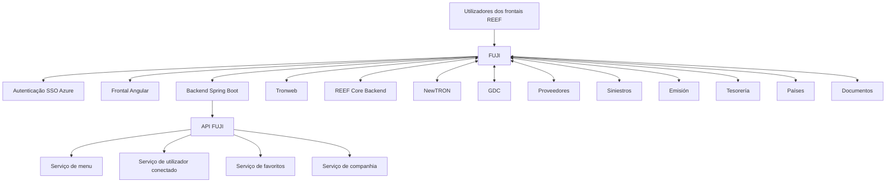
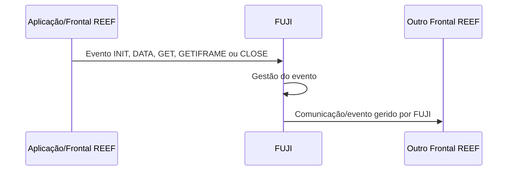

# REEF — Arquitetura de Frontais e FUJI como Integrador

## 1. Metadados do Documento
- **Arquivo de Origem:** `Não identificado`
- **Tipo de Documento:** `Apresentação Executiva`
- **Domínio / Sistema:** `REEF / FUJI / Tronweb / NewTRON`
- **Público-Alvo:** `Arquitetos, Desenvolvedores e Equipas de Integração`
- **Data/Versão Identificada:** `Não identificada`

---

## 2. Resumo Executivo & Contexto de Negócio

O documento apresenta uma arquitetura de frontais do ecossistema REEF e posiciona FUJI como a solução responsável por unificar o acesso, a segurança e a comunicação entre os artefactos de frontend de REEF.

FUJI atua como ponto único de acesso para os frontais, centralizando capacidades de integração e comunicação, gestão de menu, idioma e companhia. A apresentação também indica que FUJI utiliza autenticação SSO Azure.

A solução FUJI é descrita como uma aplicação composta por um frontend Angular e um backend Spring Boot, distribuídos como um único artefacto. Por meio de uma API, FUJI integra serviços de menu, utilizador conectado, favoritos e companhia.

A comunicação entre os diferentes frontais é mediada por eventos. Esses eventos podem ser lançados pelo próprio FUJI ou enviados pelas aplicações para que FUJI efetue a respetiva gestão. O documento enumera os eventos `INIT`, `DATA`, `GET`, `GETIFRAME` e `CLOSE`, sem detalhar os respetivos contratos, payloads ou comportamentos.

---

## 3. Arquitetura, Componentes & Tecnologias Envolvidas

| Componente / Tecnologia | Papel identificado no documento |
| :--- | :--- |
| REEF Core Backend | Backend citado na arquitetura de frontais REEF. |
| FUJI | Solução integradora dos frontais REEF; ponto único de acesso, segurança e comunicação. |
| Angular | Tecnologia do frontal da aplicação FUJI. |
| Spring Boot | Tecnologia do backend da aplicação FUJI. |
| API FUJI | Interface pela qual FUJI integra serviços de menu, utilizador conectado, favoritos e companhia. |
| SSO Azure | Mecanismo de autenticação identificado para FUJI. |
| Tronweb | Componente citado na arquitetura de frontais. |
| NewTRON | Componente citado na arquitetura de frontais. |
| GDC | Componente citado na arquitetura de frontais. |
| Proveedores | Domínio ou componente citado na arquitetura. |
| Siniestros | Domínio ou componente citado na arquitetura. |
| Emisión | Domínio ou componente citado na arquitetura. |
| Tesorería | Domínio ou componente citado na arquitetura. |
| Países | Componente ou dimensão funcional citada na arquitetura. |
| Documentos | Componente ou domínio citado na arquitetura. |



> **Nota de Análise:** O documento cita os componentes da arquitetura, mas não define protocolos, URLs, métodos HTTP, contratos de API, mecanismos de autorização nem a direção precisa dos fluxos de dados entre FUJI e cada componente.

---

## 4. Regras de Negócio, Especificações Funcionais & Processos

### Responsabilidades funcionais de FUJI

1. **Unificação do acesso:** FUJI é a solução para unificar o acesso aos artefactos de frontend de REEF.
2. **Ponto único de acesso:** FUJI é apresentado como o único ponto de acesso aos frontais REEF.
3. **Segurança:** FUJI centraliza a segurança dos frontais, utilizando autenticação SSO Azure.
4. **Integração de frontais:** FUJI integra e permite a comunicação entre os diferentes frontais.
5. **Gestão de menu:** FUJI integra o serviço de menu.
6. **Gestão de utilizador conectado:** FUJI integra o serviço de utilizador conectado.
7. **Gestão de favoritos:** FUJI integra o serviço de favoritos.
8. **Gestão de companhia:** FUJI integra o serviço de companhia.
9. **Gestão de idioma:** FUJI é responsável pela gestão de idioma.
10. **Distribuição:** FUJI é descrito como um único artefacto que contém frontend Angular e backend Spring Boot.

### Processo de comunicação entre frontais



### Eventos de comunicação identificados

| Evento | Descrição sustentada pelo documento |
| :--- | :--- |
| `INIT` | Evento listado para comunicação entre frontais; não há detalhamento funcional adicional. |
| `DATA` | Evento listado para comunicação entre frontais; não há detalhamento de payload ou processamento. |
| `GET` | Evento listado para comunicação entre frontais; não há detalhamento funcional adicional. |
| `GETIFRAME` | Evento listado para comunicação entre frontais; o documento não explica o comportamento associado a iframe. |
| `CLOSE` | Evento listado para comunicação entre frontais; não há detalhamento de encerramento ou ciclo de vida. |

> **Nota de Análise:** O documento informa que os eventos podem ser lançados por FUJI ou pelas aplicações para FUJI. Não são especificados os critérios de validação, o formato das mensagens, a origem permitida de eventos, a persistência, o tratamento de erros ou a semântica operacional de cada evento.

---

## 5. Tabelas de Parâmetros, Ambientes e Estruturas de Dados

| Item / Parâmetro | Descrição / Função | Tipo / Valores / Formato | Ambiente / Observações |
| :--- | :--- | :--- | :--- |
| FUJI | Solução para unificar acesso, segurança e comunicação entre frontais REEF. | Aplicação integradora. | Atua como ponto único de acesso. |
| Frontal FUJI | Interface frontend de FUJI. | Angular. | Não há versão identificada. |
| Backend FUJI | Camada backend de FUJI. | Spring Boot. | Não há versão identificada. |
| Artefacto FUJI | Unidade de distribuição da aplicação. | Um único artefacto. | O documento não detalha empacotamento ou pipeline de entrega. |
| Autenticação | Mecanismo de autenticação de FUJI. | SSO Azure. | Não há detalhes sobre fluxos, tenants, claims ou autorização. |
| Serviço de menu | Serviço integrado por FUJI via API. | Não especificado. | Não há endpoint ou contrato informado. |
| Serviço de utilizador conectado | Serviço integrado por FUJI via API. | Não especificado. | Não há endpoint ou contrato informado. |
| Serviço de favoritos | Serviço integrado por FUJI via API. | Não especificado. | Não há endpoint ou contrato informado. |
| Serviço de companhia | Serviço integrado por FUJI via API. | Não especificado. | Não há endpoint ou contrato informado. |
| Comunicação entre frontais | Comunicação mediada e gerida por FUJI. | Eventos. | Eventos identificados: `INIT`, `DATA`, `GET`, `GETIFRAME`, `CLOSE`. |
| Ambientes | Ambientes de execução ou URLs. | Não informado. | O documento não apresenta ambientes, servidores, portas ou URLs. |
| Logs | Rotas, níveis ou configurações de logging. | Não informado. | O documento não apresenta configurações de logs. |

---

## 6. Bateria de Perguntas & Respostas para RAG (FAQ Sintético)

### P1: Qual é a função principal de FUJI na arquitetura REEF?
**R:** FUJI é a solução responsável por unificar o acesso, a segurança e a comunicação entre os artefactos de frontend de REEF. O documento define FUJI como o ponto único de acesso e como o integrador dos frontais.

### P2: Quais responsabilidades funcionais são centralizadas por FUJI?
**R:** FUJI centraliza a integração e comunicação dos frontais, a gestão de menu, idioma e companhia, além da autenticação através de SSO Azure. FUJI também integra, por meio de uma API, os serviços de menu, utilizador conectado, favoritos e companhia.

### P3: Quais tecnologias compõem a aplicação FUJI?
**R:** FUJI é composta por um frontal Angular e um backend Spring Boot. A apresentação declara que ambos fazem parte de um único artefacto.

### P4: Como FUJI autentica os utilizadores?
**R:** O documento informa que FUJI utiliza autenticação SSO Azure. Não há informação adicional sobre o fluxo de autenticação, configuração de Azure, tokens, claims ou políticas de autorização.

### P5: Quais serviços são integrados pela API de FUJI?
**R:** A API de FUJI integra os serviços de menu, utilizador conectado, favoritos e companhia. O documento não descreve os endpoints, métodos HTTP, contratos de dados ou regras de disponibilidade desses serviços.

### P6: Como ocorre a comunicação entre os diferentes frontais REEF?
**R:** A comunicação entre os frontais é gerida por FUJI através de eventos. Os eventos podem ser lançados diretamente por FUJI ou enviados pelas aplicações para FUJI, que passa a gerir a comunicação.

### P7: Quais eventos de comunicação entre frontais são listados no documento?
**R:** Os eventos listados são `INIT`, `DATA`, `GET`, `GETIFRAME` e `CLOSE`. O documento não fornece definição funcional, estrutura de payload, sequência obrigatória ou tratamento de erro para esses eventos.

### P8: FUJI é distribuído em múltiplos artefactos?
**R:** Não. O documento afirma que FUJI é “un único artefacto”, apesar de ser constituído por um frontend Angular e um backend Spring Boot.

### P9: Quais componentes são citados na arquitetura de frontais REEF?
**R:** A arquitetura cita Tronweb, REEF Core Backend, NewTRON, GDC, Proveedores, Siniestros, Emisión, Tesorería, FUJI, Países e Documentos.

### P10: O documento especifica URLs, ambientes, portas ou servidores da solução FUJI?
**R:** Não. A apresentação não fornece URLs, ambientes de desenvolvimento/homologação/produção, endereços de servidores, portas de rede ou configurações de deployment.

### P11: O documento detalha os contratos técnicos dos eventos `INIT`, `DATA`, `GET`, `GETIFRAME` e `CLOSE`?
**R:** Não. O documento apenas enumera os eventos como parte da comunicação entre frontais. Não são apresentados contratos JSON, parâmetros, regras de validação, mecanismos de resposta ou comportamento esperado para cada evento.

---

## 7. Glossário de Termos, Siglas & Conceitos-Chave

- **REEF:** Ecossistema ou sistema ao qual pertencem os frontais e o componente REEF Core Backend citados no documento.
- **FUJI:** Solução integradora que unifica acesso, segurança e comunicação entre os artefactos de frontend de REEF.
- **SSO:** *Single Sign-On*; mecanismo de autenticação única. No documento, FUJI utiliza SSO Azure.
- **Azure:** Plataforma associada ao mecanismo de autenticação SSO Azure citado na apresentação.
- **Angular:** Tecnologia utilizada no frontal da aplicação FUJI.
- **Spring Boot:** Tecnologia utilizada no backend da aplicação FUJI.
- **API:** Interface utilizada por FUJI para integrar os serviços de menu, utilizador conectado, favoritos e companhia.
- **Frontend / Frontal:** Artefacto de interface ou aplicação de front-end integrado por FUJI.
- **REEF Core Backend:** Backend citado como componente da arquitetura de frontais REEF.
- **Tronweb:** Componente citado na arquitetura de frontais.
- **NewTRON:** Componente citado na arquitetura de frontais.
- **GDC:** Componente citado na arquitetura de frontais; o significado da sigla não é detalhado.
- **INIT:** Evento de comunicação entre frontais listado no documento.
- **DATA:** Evento de comunicação entre frontais listado no documento.
- **GET:** Evento de comunicação entre frontais listado no documento.
- **GETIFRAME:** Evento de comunicação entre frontais listado no documento.
- **CLOSE:** Evento de comunicação entre frontais listado no documento.

---

## 8. Notas Críticas, Riscos & Limitações

- O documento tem caráter resumido e não apresenta contratos técnicos da API de FUJI.
- Não há definição de métodos HTTP, URLs, schemas JSON, autenticação de API, autorização ou códigos de erro.
- Os eventos `INIT`, `DATA`, `GET`, `GETIFRAME` e `CLOSE` são apenas listados, sem semântica, estrutura ou ciclo de vida documentados.
- Não foram identificados ambientes, servidores, portas, pipelines de CI/CD, observabilidade, rotas de logs ou requisitos de disponibilidade.
- A apresentação cita diversos componentes — Tronweb, REEF Core Backend, NewTRON, GDC, Proveedores, Siniestros, Emisión, Tesorería, Países e Documentos — sem descrever as responsabilidades individuais ou interfaces de integração.
- O significado de `GDC` não é expandido no conteúdo fornecido.
- Não há detalhamento sobre a gestão de sessão, propagação de identidade SSO Azure, permissões por utilizador, idioma ou companhia.

---

## 9. Conteúdo Bruto Estruturado (Referência Fiel)

```text
--- [SLIDE 1 DE 7: REEF - Arquitectura] ---

* FUJI

--- [SLIDE 2 DE 7: Sem Título] ---

* 01                 ARQUTECTURA front
* 02 	FUJI – integrador de frontales
* 03 	Arquitectura
* 04 	Comunicación
* Arquitectura

--- [SLIDE 3 DE 7: ARQUITECTURA front] ---

* Tronweb
* REEF Core Backend
* NewTRON
* GDC
* Proveedores
* Siniestros
* Emisión
* Tesorería
* FUJI
* Países
* Documentos

--- [SLIDE 4 DE 7: FUJI, integrador de frontales] ---

* FUJI es la solución para unificar el acceso, seguridad y comunicación entre todos los artefactos de frontal de REEF
* Único punto de acceso
* Integración y comunicación de frontales
* Gestión menú, idioma y Cía
* Autenticación SSO Azure

--- [SLIDE 5 DE 7: DIAGRAMA Arquitectura] ---

* FUJI es una aplicación con un frontal ANGULAR y un Backend Spring boot
* Integra mediante un API los servicios de menu, usuario conectado, favoritos y compañía.
* Un único artefacto.

--- [SLIDE 6 DE 7: Comunicación entre frontales] ---

* La comunicación entre los distintos frontales la gestiona FUJI mediante eventos, que pueden ser lanzados desde FUJI o desde las aplicaciones a FUJI para que este los gestione.
* INIT
* DATA
* GET
* GETIFRAME
* CLOSE

--- [SLIDE 7 DE 7: Sem Título] ---

* Gracias
```
