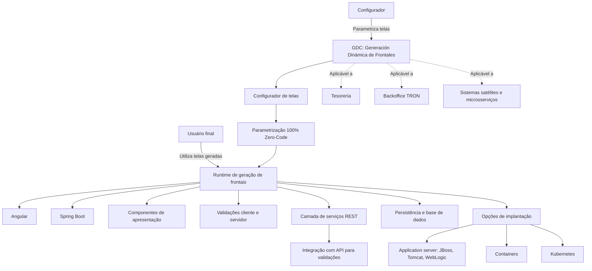

# GDC — Generación Dinámica de Frontales: Arquitetura, Capacidades e Critérios de Seleção

## 1. Metadados do Documento
- **Arquivo de Origem:** Não identificado no conteúdo fornecido
- **Tipo de Documento:** Apresentação Executiva / Arquitetura de Software
- **Domínio / Sistema:** GDC, TRON, NewTRON, Tesorería e frontais corporativos
- **Público-Alvo:** Arquitetos, Desenvolvedores, Equipes de Operação e Negócio
- **Data/Versão Identificada:** Não identificada

---

## 2. Resumo Executivo & Contexto de Negócio

O documento apresenta o GDC (*Generación Dinámica de Frontales*) como uma ferramenta independente de TRON para geração dinâmica de interfaces corporativas. O foco do GDC é permitir a manutenção de tabelas e a implementação de fluxos simples de telas por meio de parametrização integral, caracterizada no material como abordagem *Zero-Code*.

A estratégia está vinculada ao desenvolvimento de novos frontais baseados em tecnologias atuais de frontend, inicialmente aplicada ao módulo de Tesorería e alinhada com MAR. O material aponta como objetivos a reutilização de componentes, o aumento da manutenibilidade, a integração com o frontal existente e a preparação para ambientes cloud e práticas DevOps.

O GDC não se limita ao backoffice de TRON. A ferramenta é apresentada como aplicável também a sistemas satélites e microsserviços, incluindo como exemplo um calibrador de tarifas. A primeira aplicação indicada para o GDC ocorre no México.

O contexto também inclui a obsolescência dos frontais atuais de TRON. O cliente TRONweb é descrito como um cliente pesado em Swing com JDK 1.3, tecnologia em desuso e com dificuldade de obtenção de recursos de desenvolvimento. O documento cita ainda a atualização tecnológica do frontal de NewTRON para AngularJS.

A decisão entre usar GDC ou realizar desenvolvimento na nova arquitetura depende principalmente do nível de customização de comportamento e apresentação exigido. GDC é destinado a telas orientadas a manutenção de tabelas e comportamentos padrão; cenários com lógica de apresentação rica, chamadas entre microfrontais, fluxos aninhados ou alta personalização devem adotar desenvolvimento na nova arquitetura.

---

## 3. Arquitetura, Componentes & Tecnologias Envolvidas

O GDC possui um configurador para parametrização de telas e um runtime que gera frontais em tempo de execução. O runtime utiliza Angular e Spring Boot, não produzindo código-fonte gerado. A plataforma inclui persistência, validações, base de dados e uma camada de serviços REST.

Os dois perfis explicitamente definidos são **Configurador**, responsável por parametrizar telas, e **Usuário final**, responsável por utilizar as telas resultantes da parametrização. As telas podem incorporar componentes como tabelas, formulários, navegação, calendário, sliders e mapas, além de listas de valores, listas de opções e validações executadas no cliente e no servidor.

O GDC pode ser implantado em application servers, containers ou Kubernetes. Entre os application servers mencionados estão JBoss, Tomcat e WebLogic. As validações também podem ocorrer por integração com API.



### Componentes, sistemas e tecnologias citados

| Item / Componente | Descrição / Função | Tipo / Valores / Formato | Ambiente / Observações |
| :--- | :--- | :--- | :--- |
| GDC | Ferramenta de geração dinâmica de frontais | Zero-Code; 100% parametrização | Módulo independente de TRON |
| Configurador | Perfil que parametriza telas | Perfil de usuário | Atua sobre telas geradas pelo GDC |
| Usuário final | Perfil que usa as telas parametrizadas | Perfil de usuário | Consumidor das telas geradas |
| Runtime GDC | Geração de frontais em execução | Não gera código-fonte | Baseado em Angular e Spring Boot |
| Angular | Tecnologia do runtime de frontais | Tecnologia frontend | Citada junto a Spring Boot |
| Spring Boot | Tecnologia do runtime GDC | Tecnologia backend | Citada junto a Angular |
| Base de dados | Suporte à persistência e validações | Camada de dados | Inclui dados temporários, como borradores |
| Serviços REST | Camada de serviços do GDC | REST | Integração com API para validações |
| TRONweb | Frontal atual de TRON | Cliente pesado em Swing; JDK 1.3 | Identificado como obsoleto |
| NewTRON | Frontal TRON atualizado tecnologicamente | AngularJS | O documento não detalha arquitetura adicional |
| Tesorería | Módulo alvo inicial da estratégia | Domínio funcional | Primeira aplicação do GDC indicada no México |
| Kubernetes | Alternativa de implantação | Orquestração de containers | Citado como opção de despliegue |
| JBoss | Application server | Servidor de aplicação | Citado como opção de despliegue |
| Tomcat | Application server | Servidor de aplicação | Citado como opção de despliegue |
| WebLogic | Application server | Servidor de aplicação | Citado como opção de despliegue |
| MAR | Referência de alinhamento estratégico | Sigla não expandida | Significado não detalhado |
| FUJI | Sistema listado na arquitetura geral | Sistema / domínio | Sem detalhamento adicional |
| Emisión | Sistema ou domínio listado | Sistema / domínio | Sem detalhamento adicional |
| Siniestros | Sistema ou domínio listado | Sistema / domínio | Sem detalhamento adicional |
| Proveedores | Sistema ou domínio listado | Sistema / domínio | Sem detalhamento adicional |
| Documentos | Sistema ou domínio listado | Sistema / domínio | Sem detalhamento adicional |
| Países | Sistema ou domínio listado | Sistema / domínio | Sem detalhamento adicional |
| REEF core Backend | Backend listado na arquitetura geral | Backend | Sem detalhamento adicional |

> **Nota de Análise:** O documento relaciona GDC a sistemas como FUJI, Emisión, Siniestros, TRONweb, NewTRON, Tesorería, Proveedores, Documentos, Países e REEF core Backend, mas não descreve contratos de integração, protocolos, métodos HTTP, formatos JSON ou fluxos de dados entre esses sistemas.

---

## 4. Regras de Negócio, Especificações Funcionais & Processos

### 4.1 Capacidades funcionais do GDC

1. O GDC permite o **mantenimiento de tablas**, ou seja, a manutenção de tabelas por interfaces parametrizadas.
2. O GDC permite a construção de **flujos sencillos de pantallas**, isto é, fluxos simples entre telas.
3. A abordagem do GDC é **Zero-Code**, caracterizada como **100% parametrização**.
4. O GDC suporta armazenamento temporário de dados, denominado no documento como **Borradores**.
5. O GDC oferece componentes de apresentação, incluindo:
   - Tabelas;
   - Formulários;
   - Navegação;
   - Calendário;
   - Sliders;
   - Mapas.
6. O GDC suporta ajudas de interface:
   - Listas de valores;
   - Listas de opções.
7. O GDC suporta validações no cliente e no servidor.
8. O GDC possui persistência, validações, base de dados e camada de serviços REST.
9. O GDC suporta validações por integração com API.
10. O frontal é produzido em tempo de execução; o runtime não gera código-fonte.

### 4.2 Perfis de usuário

| Perfil | Responsabilidade | Restrição ou escopo declarado |
| :--- | :--- | :--- |
| Configurador | Parametrizar telas | Atua na configuração das telas do GDC |
| Usuário final | Usar as telas geradas por parametrização | Não é responsável pela parametrização |

### 4.3 Critérios de decisão: GDC versus desenvolvimento na nova arquitetura

| Critério | GDC | Desenvolvimento Nova Arquitetura |
| :--- | :--- | :--- |
| Paradigma | Orientado a telas | Orientado à reutilização |
| Comportamento | Comportamento por padrão | Lógica de apresentação rica |
| Tipos de telas | Manutenções de tabelas | Qualquer tela |
| Integrações | Apenas recebe dados | Chamadas entre microfrontais |

### 4.4 Cenários que desaconselham o uso de GDC

O documento indica que GDC não é apropriado quando a parametrização se torna excessivamente complexa ou quando existem requisitos de personalização avançada. Os seguintes cenários apontam para desenvolvimento na nova arquitetura:

1. Necessidade de reutilização de um conceito com comportamento personalizado por fluxo, exigindo a geração de várias versões.
2. Existência de comportamentos personalizados em diferentes telas, conceitos e campos.
3. Necessidade de lógica de apresentação dinâmica ou desenvolvida sob medida, dependente de campos no frontal.
4. Existência de dependências entre conceitos dentro de uma tela, sendo citado o exemplo **CLIENTE**.
5. Necessidade de ações em nível de campo que sejam diferentes de validações.
6. Necessidade de maquetación altamente personalizada e variável.
7. Necessidade de fluxos aninhados.
8. Necessidade de passagem de parâmetros entre fluxos.
9. Necessidade de fluxos dependentes de dados presentes na tela.
10. Necessidade de chamadas entre microfrontais.

> **Nota de Análise:** O material não descreve um algoritmo formal, pontuação, checklist de aprovação ou autoridade decisória para selecionar entre GDC e desenvolvimento na nova arquitetura. Os critérios apresentados são qualitativos.

---

## 5. Tabelas de Parâmetros, Ambientes e Estruturas de Dados

### 5.1 Tipos de tela, componentes e suporte funcional

| Item / Parâmetro | Descrição / Função | Tipo / Valores / Formato | Ambiente / Observações |
| :--- | :--- | :--- | :--- |
| Tipo de tela | Manutenção de tabelas | Tela GDC | Caso de uso explicitamente suportado |
| Tipo de tela | Fluxos simples de telas | Tela GDC | Caso de uso explicitamente suportado |
| Dados temporários | Armazenamento de borradores | Persistência temporária | Detalhes de retenção não informados |
| Tabela | Componente de apresentação | Componente visual | Suportado pelo GDC |
| Formulário | Componente de apresentação | Componente visual | Suportado pelo GDC |
| Navegação | Componente de apresentação | Componente visual | Suportado pelo GDC |
| Calendário | Componente de apresentação | Componente visual | Suportado pelo GDC |
| Slider | Componente de apresentação | Componente visual | Suportado pelo GDC |
| Mapa | Componente de apresentação | Componente visual | Suportado pelo GDC |
| Lista de valores | Ajuda de interface | Lista | Suportada pelo GDC |
| Lista de opções | Ajuda de interface | Lista | Suportada pelo GDC |
| Validação no cliente | Verificação executada no frontal | Validação | Regras não detalhadas |
| Validação no servidor | Verificação executada no backend | Validação | Regras não detalhadas |
| Validação por API | Validação via integração externa | Integração com API | Contratos não detalhados |
| Persistência | Armazenamento de dados | Base de dados | Tecnologia não informada |
| Serviços REST | Exposição ou consumo de serviços | REST | Endpoints não informados |

### 5.2 Opções de implantação

| Item / Parâmetro | Descrição / Função | Tipo / Valores / Formato | Ambiente / Observações |
| :--- | :--- | :--- | :--- |
| Application server | Hospedagem do runtime GDC | JBoss, Tomcat, WebLogic, etc. | Versões não identificadas |
| Containers | Hospedagem do runtime GDC | Containerização | Tecnologia de container não identificada |
| Kubernetes | Orquestração para implantação | Kubernetes | Distribuição e versão não identificadas |
| Runtime | Geração de frontais em execução | Angular + Spring Boot | Não gera código-fonte |

### 5.3 Restrições identificadas

| Item / Parâmetro | Descrição / Função | Tipo / Valores / Formato | Ambiente / Observações |
| :--- | :--- | :--- | :--- |
| Integração GDC | GDC somente recebe dados | Restrição funcional | Não contempla chamadas entre microfrontais |
| Ações por campo | GDC não cobre ações por campo além de validações | Restrição funcional | Requer nova arquitetura quando necessário |
| Fluxos complexos | Fluxos aninhados, passagem de parâmetros ou dependência de dados não são indicados para GDC | Restrição funcional | Direcionar para nova arquitetura |
| Customização visual | Maquetación muito personalizada e variável não é indicada para GDC | Restrição de apresentação | Direcionar para nova arquitetura |
| Código-fonte | O runtime não gera código-fonte | Característica arquitetural | Frontais são gerados em tempo de execução |

---

## 6. Bateria de Perguntas & Respostas para RAG (FAQ Sintético)

### P1: O que é o GDC no contexto de frontais corporativos?
**R:** GDC significa *Generación Dinámica de Frontales*. O GDC é uma ferramenta independente de TRON para gerar frontais dinamicamente por parametrização integral, descrita como Zero-Code. O GDC é direcionado especialmente à manutenção de tabelas e a fluxos simples de telas.

### P2: O GDC gera código-fonte Angular ou Spring Boot para cada frontal configurado?
**R:** Não. O documento afirma que o GDC possui um runtime de geração de frontais baseado em Angular e Spring Boot, mas que o frontal é gerado em tempo de execução e não gera código-fonte.

### P3: Quais perfis de usuário existem no GDC?
**R:** O GDC possui dois perfis: o **Configurador**, responsável por parametrizar as telas, e o **Usuário final**, responsável por utilizar as telas produzidas a partir da parametrização.

### P4: Que tipos de interface podem ser criados com GDC?
**R:** O GDC suporta manutenção de tabelas e fluxos simples de telas. Entre os componentes de apresentação citados estão tabelas, formulários, navegação, calendário, sliders e mapas. O GDC também fornece listas de valores e listas de opções como ajudas de interface.

### P5: Como o GDC trata validações?
**R:** O GDC suporta validações no cliente e no servidor. O documento também informa que validações podem ser realizadas por meio de integração com API, mas não detalha os contratos, endpoints ou regras de validação.

### P6: Em quais opções de infraestrutura o runtime GDC pode ser implantado?
**R:** O runtime GDC pode ser implantado em application servers, incluindo JBoss, Tomcat e WebLogic, além de containers e Kubernetes. O documento não identifica versões, configurações de infraestrutura ou estratégia de distribuição.

### P7: Quando o GDC deve ser escolhido em vez de desenvolvimento na nova arquitetura?
**R:** GDC deve ser considerado para telas orientadas à manutenção de tabelas, com comportamento padrão e integrações em que a aplicação apenas recebe dados. O desenvolvimento na nova arquitetura é indicado quando for necessária lógica rica de apresentação, chamadas entre microfrontais ou suporte a qualquer tipo de tela.

### P8: Quais requisitos indicam que o GDC não é adequado?
**R:** O GDC não é indicado quando existem comportamentos personalizados por fluxo, várias versões de um conceito, regras específicas em campos além de validação, dependências entre conceitos da tela, lógica dinâmica dependente de campos, maquetación muito personalizada, fluxos aninhados, passagem de parâmetros ou fluxos dependentes dos dados presentes na tela.

### P9: Qual problema dos frontais atuais de TRON motiva a estratégia apresentada?
**R:** O documento identifica obsolescência no cliente TRONweb, descrito como um cliente pesado Swing baseado em JDK 1.3. Essa tecnologia é indicada como em desuso e associada à dificuldade de encontrar recursos de desenvolvimento.

### P10: Qual é a relação entre GDC e Tesorería?
**R:** A estratégia de desenvolvimento de novos frontais baseada em tecnologias atuais de frontend será aplicada ao desenvolvimento do módulo de Tesorería. O documento também informa que a primeira aplicação do GDC ocorrerá no México.

### P11: GDC serve apenas para aplicações de backoffice de TRON?
**R:** Não. O documento declara que o GDC não se destina apenas a aplicações de backoffice de TRON. A ferramenta também pode ser usada em sistemas satélites e microsserviços, citando um calibrador de tarifas como exemplo.

### P12: O que o documento informa sobre a arquitetura e integrações com FUJI, Emisión, Siniestros e REEF core Backend?
**R:** O documento lista FUJI, Emisión, Siniestros, TRONweb, NewTRON, Tesorería, Proveedores, Documentos, Países e REEF core Backend na arquitetura geral. Entretanto, não detalha responsabilidades, fluxos de dados, protocolos, interfaces, contratos REST ou dependências técnicas entre esses componentes.

---

## 7. Glossário de Termos, Siglas & Conceitos-Chave

- **GDC:** *Generación Dinámica de Frontales*; ferramenta de geração dinâmica de frontais por parametrização.
- **Zero-Code:** Abordagem descrita como 100% parametrização, sem geração de código-fonte pelo runtime.
- **TRON:** Sistema ou domínio corporativo relacionado aos frontais e ao GDC; a expansão da sigla não é informada.
- **TRONweb:** Frontal atual de TRON, descrito como cliente pesado Swing baseado em JDK 1.3.
- **NewTRON:** Frontal TRON cuja atualização tecnológica é indicada como AngularJS.
- **Angular:** Tecnologia utilizada no runtime de geração de frontais GDC.
- **AngularJS:** Tecnologia associada à atualização do frontal NewTRON.
- **Spring Boot:** Tecnologia utilizada no runtime de geração de frontais GDC.
- **REST:** Camada de serviços REST mencionada na arquitetura do GDC.
- **API:** Interface usada para integração de validações; contratos não detalhados.
- **Borradores:** Dados temporários armazenados pelo GDC.
- **Microfrontal:** Frontal ou unidade de interface integrada a outros frontais; citado no critério de desenvolvimento na nova arquitetura.
- **MAR:** Referência de alinhamento estratégico; expansão não informada.
- **Tesorería:** Módulo funcional ao qual a estratégia de novos frontais será aplicada.
- **Siniestros:** Sistema ou domínio listado na arquitetura geral; sem definição adicional.
- **Emisión:** Sistema ou domínio listado na arquitetura geral; sem definição adicional.
- **FUJI:** Sistema listado na arquitetura geral; sem definição adicional.
- **REEF core Backend:** Backend listado na arquitetura geral; sem definição adicional.
- **JDK 1.3:** Versão de Java associada ao TRONweb e caracterizada como tecnologia em desuso.

---

## 8. Notas Críticas, Riscos & Limitações

1. O cliente TRONweb utiliza Swing e JDK 1.3, descritos como tecnologias em desuso.
2. A obsolescência do TRONweb pode dificultar a manutenção devido à dificuldade de encontrar recursos de desenvolvimento.
3. O GDC não é indicado para lógica de apresentação rica, comportamento altamente personalizado ou maquetación muito variável.
4. O GDC não é indicado para fluxos aninhados, passagem de parâmetros e fluxos dependentes dos dados em tela.
5. O GDC não atende ações em nível de campo que sejam distintas de validações.
6. O documento limita as integrações GDC à condição de “solo recibe datos”; chamadas entre microfrontais devem usar desenvolvimento na nova arquitetura.
7. O material não informa versões de Angular, Spring Boot, AngularJS, JBoss, Tomcat, WebLogic ou Kubernetes.
8. O material não identifica banco de dados, modelo de persistência, mecanismos de autenticação, autorização, observabilidade, logging, monitoramento, URLs de ambiente, portas ou estratégias de segurança.
9. O material não detalha contratos de APIs, métodos HTTP, esquemas de payload, mensagens de erro ou SLAs.
10. O significado de MAR e as responsabilidades dos sistemas FUJI, Emisión, Siniestros, Proveedores, Documentos, Países e REEF core Backend não são detalhados.

---

## 9. Conteúdo Bruto Estruturado (Referência Fiel)

```text
<!-- Slide number: 1 -->


GDC
Generacion
Dinámica
de Frontales
ARQUITECTURA

### Notes:

<!-- Slide number: 2 -->


Arquitectura
De frontales
Arquitectura

Herramienta

CRITERIOS DE SELECCION

### Notes:

<!-- Slide number: 3 -->
GDC

Arquitectura General


FUJI

Emisión
Siniestros
GDC
Tronweb
NewTRON
Tesorería
Proveedores
Documentos
Países
REEF core Backend

### Notes:
Nuevos desarrollos
-------------------------
Estrategia de desarrollo de frontales de nuevos desarrollos basado en ultimas tecnologías de front que se aplicará en el desarrollo del modulo de Tesorería. Alineado con MAR.
Conjunto de componentes reutilizables, mejora en la mantenibilidad, integración con el frontal actual, cloud-ready, devops ready
No solo para aplicaciones de backoffice de Tron sino también satélites y microservicios (calibrador de tarifas, etc.)

GDC. Herramienta de generación de frontales
Mantenimiento de tablas y flujos sencillos de pantallas
Zero-Code : 100% parametrización
Modulo independiente a Tron
Primera aplicación en México

Frontales actuales Tron
-----------------------------
Análisis impacto obsolescencia cliente de Tronweb  Cliente pesado swing, jdk 1.3 Tecnología en desuso, dificultad para encontrar recursos de desarrollo, etc.
Actualización tecnológica del frontal de Newtron  AngularJS

<!-- Slide number: 4 -->
GDC

Arquitectura Herramienta


Configurador

Zero-code: 100 % parametrización
Diferentes tipos de pantallas:
Mantenimiento de tablas
Flujos sencillos de pantallas
Almacenamiento de datos temporales (Borradores)
Componentes de presentación: tablas, formularios, navegación, calendario, sliders, mapas, etc
Ayudas: Listas de valores y listas de opciones
Validaciones en cliente y servidor
Persistencia y validaciones
Base de datos
Capa de servicios REST
2 perfiles de usuario, Configurador y Usuario final
Configurador: Parametriza pantallas
Usuario final: Usa las pantallas generadas por parametrización


### Notes:
Nuevos desarrollos
-------------------------
Estrategia de desarrollo de frontales de nuevos desarrollos basado en ultimas tecnologías de front que se aplicará en el desarrollo del modulo de Tesorería. Alineado con MAR.
Conjunto de componentes reutilizables, mejora en la mantenibilidad, integración con el frontal actual, cloud-ready, devops ready
No solo para aplicaciones de backoffice de Tron sino también satélites y microservicios (calibrador de tarifas, etc.)

GDC. Herramienta de generación de frontales
Mantenimiento de tablas y flujos sencillos de pantallas
Zero-Code : 100% parametrización
Modulo independiente a Tron
Primera aplicación en México

Frontales actuales Tron
-----------------------------
Análisis impacto obsolescencia cliente de Tronweb  Cliente pesado swing, jdk 1.3 Tecnología en desuso, dificultad para encontrar recursos de desarrollo, etc.
Actualización tecnológica del frontal de Newtron  AngularJS

<!-- Slide number: 5 -->
GDC

Arquitectura GDC


Características


Runtime de generación de frontales
Angular + spring Boot
Frontal generado en tiempo de ejecución, no genera código fuente
Distintos tipos de despliegue
Application server  (Jboss, Tomcat, Weblogic, etc)
Containers
Kubernetes
Validaciones a través de integración con API


### Notes:
Nuevos desarrollos
-------------------------
Estrategia de desarrollo de frontales de nuevos desarrollos basado en ultimas tecnologías de front que se aplicará en el desarrollo del modulo de Tesorería. Alineado con MAR.
Conjunto de componentes reutilizables, mejora en la mantenibilidad, integración con el frontal actual, cloud-ready, devops ready
No solo para aplicaciones de backoffice de Tron sino también satélites y microservicios (calibrador de tarifas, etc.)

GDC. Herramienta de generación de frontales
Mantenimiento de tablas y flujos sencillos de pantallas
Zero-Code : 100% parametrización
Modulo independiente a Tron
Primera aplicación en México

Frontales actuales Tron
-----------------------------
Análisis impacto obsolescencia cliente de Tronweb  Cliente pesado swing, jdk 1.3 Tecnología en desuso, dificultad para encontrar recursos de desarrollo, etc.
Actualización tecnológica del frontal de Newtron  AngularJS

<!-- Slide number: 6 -->
GDC

CRITERIOS DE SELECCIÓN  ¿Desarrollo nuevo o GDC?


|  | GDC | Desarrollo Nueva Arquitectura |
| --- | --- | --- |
| PARADIGMA | Orientado a pantallas | Orientado a reutilización |
| COMPORTAMIENTO | Comportamiento por defecto | Lógica de presentación rica |
| TIPOS DE PANTALLAS | Mantenimientos de tablas | Cualquier pantalla |
| INTEGRACIONES | Solo recibe datos | Llamadas entre microfrontales |

### Notes:
No GDC complica la parametrización
Reutilización del concepto con comportamiento personalizado por flujo – Generar varias versiones
Comportamientos personalizados en diferentes pantallas, conceptos y campos
Lógica de presentación dinámica o a medida dependiente de campos en frontal
Dependencias entre conceptos de una pantalla - CLIENTE
Sin acciones a nivel de campo distintas a validaciones
Maquetación muy personalizada y variable
Flujos anidados, con paso de parámetros o dependientes de datos en pantalla

<!-- Slide number: 7 -->


Muchas Gracias


### Notes:
```
