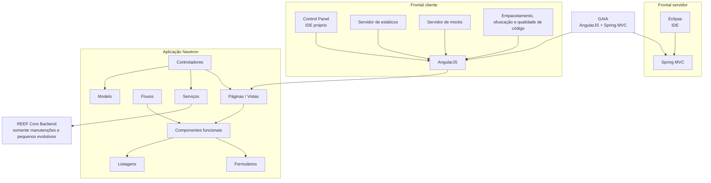

# Arquitetura Newtron baseada em GAIA: Componentes, Desenvolvimento e Conceitos Principais

## 1. Metadados do Documento
- **Arquivo de Origem:** Não identificado no conteúdo extraído
- **Tipo de Documento:** Apresentação Executiva / Arquitetura de Software
- **Domínio / Sistema:** Newtron, GAIA, REEF Core Backend
- **Público-Alvo:** Desenvolvedores, Arquitetos, Operação e equipes de manutenção evolutiva
- **Data/Versão Identificada:** Não identificada

---

## 2. Resumo Executivo & Contexto de Negócio

O documento apresenta a arquitetura da aplicação Newtron e sua base tecnológica no framework GAIA, descrito como uma combinação de AngularJS e Spring MVC. A apresentação posiciona Newtron em um cenário corporativo que contempla domínios funcionais como emissão, sinistros, tesouraria, provedores, documentos, países e terceiros.

GAIA é apresentado como um framework voltado ao desempenho, capaz de suportar grande número de usuários concorrentes e volume elevado de dados. O framework também busca produtividade por meio de ferramentas, geradores de código e recursos destinados à incorporação rápida de novos desenvolvimentos.

A arquitetura GAIA declara suporte a requisitos “Multi-*”, abrangendo multi-país, multi-moeda, multi-idioma e multi-dispositivo. O documento também enfatiza flexibilidade para aplicações simples ou complexas, destinadas tanto a intranet quanto à internet.

O desacoplamento entre camadas é um princípio arquitetural central. Cada camada possui ciclo de vida próprio, permitindo desenvolvimento paralelo e evolução futura independente. A padronização dos desenvolvimentos é associada à melhoria de suporte, manutenção corretiva e evolutiva e à possibilidade de criação de uma KDB de problemas conhecidos.

Newtron utiliza componentes técnicos de GAIA e componentes Angular funcionais. O desenvolvimento organiza-se segundo os conceitos de controlador, modelo, vista, componentes funcionais, formulários, listagens, páginas ou vistas, fluxos e serviços. O documento indica que o REEF Core Backend recebe somente manutenções e pequenos evolutivos.

---

## 3. Arquitetura, Componentes & Tecnologias Envolvidas

| Componente / Tecnologia | Papel descrito no documento | Observações |
| :--- | :--- | :--- |
| Newtron | Aplicação apresentada e baseada em componentes GAIA e Angular | Inclui fluxos como emissão e componentes funcionais reutilizáveis |
| GAIA | Base arquitetural do desenvolvimento | Baseada em AngularJS + Spring MVC |
| AngularJS | Tecnologia do frontal cliente | Citada como parte da arquitetura GAIA |
| Spring MVC | Tecnologia da camada de servidor | Citada como parte da arquitetura GAIA |
| Componentes GAIA técnicos | Componentes técnicos utilizados por Newtron | Não há detalhamento de interfaces ou contratos |
| Componentes Angular funcionais | Componentes funcionais utilizados por Newtron | Reutilizados ao longo da aplicação e em diferentes fluxos |
| REEF Core Backend | Backend citado na arquitetura | Apenas manutenções e pequenos evolutivos |
| Control Panel | IDE próprio para desenvolvimento do frontal cliente | Associado ao ecossistema GAIA |
| Eclipse | IDE do frontal servidor | Citado explicitamente |
| Servidor de estáticos | Componente do frontal cliente | Sem detalhamento de infraestrutura |
| Servidor de mocks | Componente do frontal cliente | Sem detalhamento de endpoints ou dados simulados |
| Empacotamento | Atividade de desenvolvimento frontal | Inclui ofuscação e qualidade de código |
| Emissão | Domínio ou fluxo funcional | Há exemplo de tela de emissão de apólices |
| Siniestros | Domínio ou fluxo funcional citado | Não detalhado |
| GDC | Componente ou domínio citado | Sigla não expandida no documento |
| Tronweb | Componente ou domínio citado | Não detalhado |
| Tesorería | Domínio ou fluxo funcional citado | Associado ao módulo Treasury / TSY |
| Proveedores | Domínio ou fluxo funcional citado | Não detalhado |
| Documentos | Domínio ou fluxo funcional citado | Não detalhado |
| Países | Domínio ou configuração funcional citada | Relacionável ao requisito multi-país, sem regra explícita |



**Nota de Análise:** O documento apresenta a arquitetura em nível conceitual. Não detalha interfaces HTTP, contratos JSON, mecanismos de autenticação, bancos de dados, portas, URLs, protocolos de integração ou topologia de implantação.

---

## 4. Regras de Negócio, Especificações Funcionais & Processos

### 4.1 Princípios arquiteturais do framework GAIA

1. **Orientação ao desempenho**
   - GAIA deve suportar um grande número de usuários concorrentes.
   - GAIA deve suportar grande volume de dados.

2. **Produtividade de desenvolvimento**
   - GAIA disponibiliza ferramentas, geradores de código e recursos.
   - Os recursos devem facilitar a incorporação rápida de novos desenvolvimentos.

3. **Suporte a requisitos Multi-\***
   - Multi-país.
   - Multi-moeda.
   - Multi-idioma.
   - Multi-dispositivo.

4. **Flexibilidade de aplicação**
   - GAIA deve ser aplicável a aplicações simples.
   - GAIA deve ser aplicável a aplicações muito complexas.
   - GAIA deve ser aplicável a contextos de intranet.
   - GAIA deve ser aplicável a contextos de internet.

5. **Desacoplamento de camadas**
   - As camadas devem ser desacopladas.
   - Cada camada possui ciclo de vida próprio.
   - O desacoplamento busca garantir evolução futura.
   - O desacoplamento permite desenvolvimento paralelo entre camadas.

6. **Padronização de desenvolvimento**
   - Os desenvolvimentos devem ser padronizados.
   - A padronização busca facilitar o suporte.
   - A padronização permite, após determinado período, a criação de uma KDB de problemas conhecidos.
   - A padronização facilita manutenção corretiva e evolutiva das aplicações e do framework.

### 4.2 Estrutura funcional de desenvolvimento Newtron

O desenvolvimento Newtron é apresentado com os seguintes elementos:

1. **Controlador**
   - Gerencia a lógica de frontal.
   - Atua no modelo de desenvolvimento apresentado.

2. **Modelo**
   - Elemento do padrão controlador-modelo-vista citado no documento.
   - Não há detalhamento sobre estruturas, entidades ou persistência.

3. **Vista**
   - Composta por páginas ou vistas.
   - Relaciona-se a formulários e listagens.

4. **Componentes funcionais**
   - São componentes criados em Newtron utilizando componentes fornecidos por GAIA.
   - São reutilizados em toda a aplicação.
   - São reutilizados em diferentes fluxos.

5. **Formulários e listagens**
   - São elementos funcionais indicados no modelo Newtron.
   - O documento não descreve campos, regras de validação ou operações específicas.

6. **Fluxos**
   - Fazem uso dos objetos funcionais de Newtron.
   - Um exemplo citado é o fluxo de emissão de apólices.

7. **Serviços**
   - São elementos da estrutura de desenvolvimento.
   - Não há detalhamento de contratos, operações, protocolos ou integrações.

### 4.3 Escopo de manutenção do REEF Core Backend

| Regra / Restrição | Descrição |
| :--- | :--- |
| Escopo permitido | Manutenções |
| Escopo permitido | Pequenos evolutivos |
| Escopo não detalhado | O documento não especifica critérios objetivos para distinguir uma manutenção de um pequeno evolutivo |
| Contratos técnicos | O documento não detalha serviços, métodos, APIs ou estruturas de dados do REEF Core Backend |

---

## 5. Tabelas de Parâmetros, Ambientes e Estruturas de Dados

### 5.1 Mapeamento de módulos e siglas Newtron

| Item / Parâmetro | Descrição / Função | Tipo / Valores / Formato | Ambiente / Observações |
| :--- | :--- | :--- | :--- |
| Common | Família ou módulo Newtron | Acrônimo `CMN` | Sem detalhamento funcional adicional |
| Coinsurance | Família ou módulo Newtron | Acrônimo `CIN` | Sem detalhamento funcional adicional |
| Issue | Família ou módulo Newtron | Acrônimo `ISU` | Relacionável ao termo “Emisión”, sem equivalência explicitamente formalizada |
| Reinsurance | Família ou módulo Newtron | Acrônimo `RNS` | Sem detalhamento funcional adicional |
| Loss | Família ou módulo Newtron | Acrônimo `LSS` | Relacionável ao termo “Siniestros”, sem equivalência explicitamente formalizada |
| Treasury | Família ou módulo Newtron | Acrônimo `TSY` | Relacionável ao termo “Tesorería”, sem equivalência explicitamente formalizada |
| Third Person | Família ou módulo Newtron | Acrônimo `THP` | Sem detalhamento funcional adicional |
| Coinsurance Definition | Família ou módulo Newtron | Acrônimo `CSD` | Sem detalhamento funcional adicional |
| Issue Definition | Família ou módulo Newtron | Acrônimo `ISD` | Sem detalhamento funcional adicional |
| Reinsurance Definition | Família ou módulo Newtron | Acrônimo `RRD` | Sem detalhamento funcional adicional |
| Loss Definition | Família ou módulo Newtron | Acrônimo `LSF` | Sem detalhamento funcional adicional |
| Treasury Definition | Família ou módulo Newtron | Acrônimo `TRF` | Sem detalhamento funcional adicional |
| Third Person Definition | Família ou módulo Newtron | Acrônimo `TPD` | Sem detalhamento funcional adicional |

### 5.2 Domínios, aplicações e componentes citados

| Item / Parâmetro | Descrição / Função | Tipo / Valores / Formato | Ambiente / Observações |
| :--- | :--- | :--- | :--- |
| Emisión | Fluxo ou domínio citado em Newtron | Funcional | Há exemplo de tela de emissão de apólices |
| Siniestros | Fluxo ou domínio citado | Funcional | Não detalhado |
| GDC | Componente ou domínio citado | Sigla | Significado não informado |
| Tronweb | Componente ou domínio citado | Aplicação ou componente | Não detalhado |
| NewTRON | Aplicação citada | Aplicação corporativa | Nome apresentado também como Newtron |
| Tesorería | Fluxo ou domínio citado | Funcional | Associado conceitualmente a Treasury, sem detalhe adicional |
| Proveedores | Fluxo ou domínio citado | Funcional | Não detalhado |
| Documentos | Fluxo ou domínio citado | Funcional | Não detalhado |
| Países | Elemento ou domínio citado | Configuração / funcional | Coerente com multi-país, sem regras explícitas |
| REEF Core Backend | Backend da arquitetura | Backend | Somente manutenções e pequenos evolutivos |
| GAIA | Framework/base arquitetural | AngularJS + Spring MVC | Orientado a desempenho, produtividade, Multi-*, flexibilidade e desacoplamento |
| Fuji | Termo exibido no diagrama arquitetural | Não especificado | Sem explicação textual adicional |

### 5.3 Camadas e ferramentas de desenvolvimento

| Item / Parâmetro | Descrição / Função | Tipo / Valores / Formato | Ambiente / Observações |
| :--- | :--- | :--- | :--- |
| Frontal cliente | Camada cliente da arquitetura GAIA | Camada de aplicação | Utiliza AngularJS |
| Control Panel | IDE próprio | Ferramenta de desenvolvimento | Associado ao frontal cliente |
| Servidor de estáticos | Fornecimento de recursos estáticos | Componente de infraestrutura | Sem detalhes de host, URL ou tecnologia |
| Servidor de mocks | Simulação de comportamentos ou dados | Componente de desenvolvimento | Sem detalhes de contratos ou dados |
| Empacotado | Processo citado para frontal cliente | Processo de build | Não detalhado |
| Ofuscado | Processo citado para frontal cliente | Processo de proteção/transformação de código | Não detalhado |
| Qualidade de código | Atividade citada para frontal cliente | Qualidade | Ferramentas e critérios não informados |
| Frontal servidor | Camada de servidor da arquitetura GAIA | Camada de aplicação | Utiliza Spring MVC |
| Eclipse | IDE do frontal servidor | Ferramenta de desenvolvimento | Citada explicitamente |
| Controlador | Gerenciamento da lógica de frontal | Componente arquitetural | Não há contratos detalhados |
| Modelo | Elemento do padrão de desenvolvimento | Componente arquitetural | Não há estrutura de dados detalhada |
| Vista | Páginas ou vistas da aplicação | Componente arquitetural | Inclui elementos como formulários e listagens |
| Serviços | Elemento do desenvolvimento Newtron | Componente de serviço | Sem métodos ou contratos especificados |

---

## 6. Bateria de Perguntas & Respostas para RAG (FAQ Sintético)

### P1: Qual arquitetura tecnológica fundamenta a aplicação Newtron?
**R:** A aplicação Newtron é apresentada como baseada no framework GAIA. O documento identifica GAIA como uma arquitetura composta por AngularJS e Spring MVC. AngularJS é citado no frontal cliente, enquanto Spring MVC é citado no frontal servidor.

### P2: Quais são os objetivos arquiteturais declarados para o framework GAIA?
**R:** O framework GAIA busca desempenho para suportar grande número de usuários concorrentes e volume de dados, produtividade para acelerar novos desenvolvimentos, suporte a requisitos multi-país, multi-moeda, multi-idioma e multi-dispositivo, flexibilidade para aplicações simples ou complexas e desacoplamento entre camadas.

### P3: Como o documento define o desacoplamento de camadas no GAIA?
**R:** O documento informa que as camadas são desacopladas para garantir desenvolvimento futuro e permitir desenvolvimento paralelo. Cada camada possui seu próprio ciclo de vida.

### P4: Quais ferramentas e componentes são citados para o frontal cliente do GAIA?
**R:** Para o frontal cliente, o documento cita AngularJS, um IDE de desenvolvimento próprio chamado Control Panel, servidor de estáticos, servidor de mocks e processos de empacotamento, ofuscação e qualidade de código.

### P5: Qual ferramenta é utilizada no frontal servidor da arquitetura GAIA?
**R:** O documento cita Eclipse como IDE utilizado no frontal servidor. A tecnologia de servidor apresentada como parte de GAIA é Spring MVC.

### P6: Como é organizado o desenvolvimento da aplicação Newtron?
**R:** O desenvolvimento Newtron é apresentado com controlador, modelo, vista, componentes funcionais, formulários, listagens, páginas ou vistas, fluxos e serviços. Os controladores gerenciam a lógica de frontal, enquanto os fluxos utilizam objetos funcionais de Newtron.

### P7: O que são os componentes funcionais de Newtron?
**R:** Os componentes funcionais de Newtron são componentes criados utilizando os componentes fornecidos por GAIA. Segundo o documento, esses componentes são reutilizados ao longo de toda a aplicação e em diferentes fluxos.

### P8: Qual exemplo funcional de Newtron aparece na apresentação?
**R:** A apresentação mostra como exemplo uma tela de emissão de apólices em Newtron. O exemplo é utilizado para indicar o uso de componentes fornecidos por GAIA na criação de componentes funcionais reutilizáveis.

### P9: Qual é o escopo permitido para o REEF Core Backend?
**R:** O documento informa que o REEF Core Backend recebe somente manutenções e pequenos evolutivos. Não são apresentados critérios para classificar uma mudança como manutenção ou pequeno evolutivo.

### P10: Quais módulos Newtron e acrônimos são listados no documento?
**R:** O documento lista Common (CMN), Coinsurance (CIN), Issue (ISU), Reinsurance (RNS), Loss (LSS), Treasury (TSY), Third Person (THP), Coinsurance Definition (CSD), Issue Definition (ISD), Reinsurance Definition (RRD), Loss Definition (LSF), Treasury Definition (TRF) e Third Person Definition (TPD).

### P11: Quais domínios funcionais são citados na arquitetura Newtron?
**R:** A arquitetura cita Emisión, Siniestros, GDC, Tronweb, NewTRON, Tesorería, Proveedores, Documentos, Países e REEF Core Backend. O documento não descreve em profundidade as responsabilidades de cada domínio.

### P12: O documento informa APIs, URLs, portas ou contratos de integração dos componentes Newtron?
**R:** Não. O conteúdo extraído não apresenta URLs, portas, endpoints HTTP, métodos, contratos JSON, mecanismos de autenticação, bancos de dados ou detalhes de implantação.

---

## 7. Glossário de Termos, Siglas & Conceitos-Chave

- **AngularJS:** Tecnologia citada como parte da base GAIA e utilizada no frontal cliente.
- **CIN:** Acrônimo Newtron para Coinsurance.
- **CMN:** Acrônimo Newtron para Common.
- **Control Panel:** IDE próprio citado para desenvolvimento do frontal cliente.
- **CSD:** Acrônimo Newtron para Coinsurance Definition.
- **Eclipse:** IDE citado para o frontal servidor.
- **GAIA:** Framework ou arquitetura base de Newtron, indicado como AngularJS + Spring MVC.
- **GDC:** Sigla citada entre os componentes ou domínios da arquitetura; significado não definido no documento.
- **ISD:** Acrônimo Newtron para Issue Definition.
- **ISU:** Acrônimo Newtron para Issue.
- **KDB:** Base de problemas conhecidos mencionada como possível resultado da padronização; expansão da sigla não informada no documento.
- **LSS:** Acrônimo Newtron para Loss.
- **LSF:** Acrônimo Newtron para Loss Definition.
- **Multi-\*:** Conjunto de requisitos que inclui multi-país, multi-moeda, multi-idioma e multi-dispositivo.
- **Newtron / NewTRON:** Aplicação corporativa apresentada no documento.
- **REEF Core Backend:** Backend citado na arquitetura, limitado a manutenções e pequenos evolutivos.
- **RRD:** Acrônimo Newtron para Reinsurance Definition.
- **RNS:** Acrônimo Newtron para Reinsurance.
- **Spring MVC:** Tecnologia citada como parte da base GAIA e utilizada no frontal servidor.
- **THP:** Acrônimo Newtron para Third Person.
- **TPD:** Acrônimo Newtron para Third Person Definition.
- **TRF:** Acrônimo Newtron para Treasury Definition.
- **TSY:** Acrônimo Newtron para Treasury.

---

## 8. Notas Críticas, Riscos & Limitações

- O documento é uma apresentação de alto nível e não descreve contratos de integração, APIs, endpoints, URLs, portas, protocolos, autenticação, autorização, bancos de dados ou topologia de infraestrutura.
- As imagens referenciadas na extração não fornecem conteúdo textual adicional interpretável além das referências de arquivo e legendas presentes.
- Os componentes GDC, Tronweb, Fuji, Proveedores, Documentos e Países são citados, mas não possuem responsabilidades técnicas ou funcionais detalhadas.
- Não há detalhamento sobre o escopo exato, critérios de aprovação, ciclo de entrega ou limites técnicos para “manutenções e pequenos evolutivos” do REEF Core Backend.
- O documento cita servidor de estáticos, servidor de mocks, empacotamento, ofuscação e qualidade de código, mas não informa tecnologias, ferramentas, políticas ou pipelines de CI/CD correspondentes.
- Não são apresentadas regras específicas de emissão de apólices, campos de formulários, regras de validação, cálculos, perfis de acesso ou matrizes de permissão.
- **Nota de Análise:** O documento lista os componentes e domínios da arquitetura Newtron, porém não detalha métodos HTTP, contratos JSON ou modelos de dados expostos por esses componentes.

---

## 9. Conteúdo Bruto Estruturado (Referência Fiel)

```text
<!-- Slide number: 1 -->


ARQUITECTURA
Newtron


### Notes:

<!-- Slide number: 2 -->
  ÍNDICE


<!-- Slide number: 3 -->
ARQUITECTURA
QUÉ ARQUITECTURA USA NWT


ARQUITECTURA GAIA
FUJI
GAIA
AngularJS + SpringMVC

NEWTRON
Componentes GAIA (técnicos)
Componentes Angular
(Funcionales)

Emisión
Siniestros
GDC
Tronweb
NewTRON
Tesorería
Proveedores
Documentos
Países
REEF core Backend
SOLO MANTENIMIENTOS Y PEQUEÑOS EVOLUTIVOS
3

### Notes:

<!-- Slide number: 4 -->
GAIA

Orientado al rendimiento: Debe soportar un gran número de usuarios concurrentes y volumen de datos.
Garantizar la productividad, proporcionando herramientas, generadores de código y recursos para incorporar rápidamente nuevos desarrollos.
Soporte de requisitos Multi-*: multi-país, multi-moneda, multi-idioma, multi-dispositivo.
Flexibilidad, que se aplique a aplicaciones simples o muy complejas, intranet o internet.

Desacoplamiento de las capas, para garantizar su desarrollo futuro, permitiendo el desarrollo paralelo de cada una. Cada capa tiene su propio ciclo de vida.

Estandarizar los desarrollos: Así el soporte será más fácil / pasado un tiempo podemos tener una KDB de problemas conocidos / facilita el mantenimiento correctivo y evolutivo tanto de las aplicaciones como del framework.
Basada en
GAIA (AngularJS + Spring MVC)
Documentación

Frontal cliente
IDE de desarrollo propio (Control Panel)
Servidor de estáticos
Servidor de mocks
Empaquetado, ofuscado, calidad de código, etc…
Frontal servidor
IDE Eclipse


### Notes:

<!-- Slide number: 5 -->
GAIA
CONCEPTOS PRINCIPALES


| Module / Family | NewTron acronym (3 letters) |
| --- | --- |
| Common | CMN |
| Coinsurance | CIN |
| Issue | ISU |
| Reinsurance | RNS |
| Loss | LSS |
| Treasury | TSY |
| Third Person | THP |
| Coinsurance Definition | CSD |
| Issue Definition | ISD |
| Reinsurance Definition | RRD |
| Loss Definition | LSF |
| Treasury Definition | TRF |
| Third Person Definition | TPD |
5

### Notes:

<!-- Slide number: 6 -->
NEWTRON
EN QUE SE BASA EL DESARROLLO


CONTROLADOR
MODELO
VISTA
COMPONENTES Funcionales
Formularios
Listados

Páginas/vistas

Flujos
Uso de los objetos funcionales de Newtron
Controladores que gestionan la lógica de frontal

Servicios

6

### Notes:

<!-- Slide number: 7 -->
APLICACIÓN NEWTRON
EJEMPLO


Ejemplo de emisión
Pantalla de emisión de Pólizas en Newtron
Usando los componentes que provee GAIA se han creado componentes funcionales en Newtron que se reutilizan a lo largo de toda la aplicación y en los distintos flujos.

### Notes:

<!-- Slide number: 8 -->


Muchas gracias


### Notes:
```
