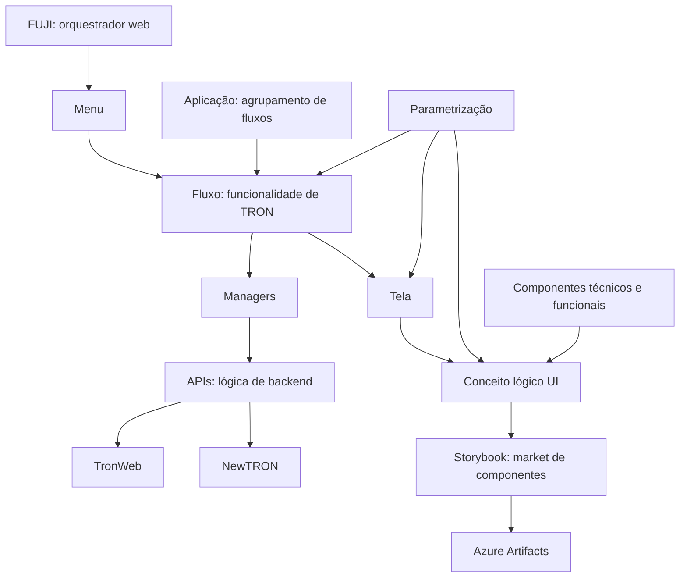

# Arquitetura de Microfrontais FUJI para Integração com TRON, NewTRON e GDC

## 1. Metadados do Documento
- **Arquivo de Origem:** Não identificado no conteúdo fornecido
- **Tipo de Documento:** Apresentação Executiva de Arquitetura de Software
- **Domínio / Sistema:** FUJI, microfrontais, TRON, TronWeb, NewTRON, GDC e Tesouraria
- **Público-Alvo:** Não identificado explicitamente; conteúdo direcionado a equipes técnicas, desenvolvimento e arquitetura
- **Data/Versão Identificada:** Não identificada

---

## 2. Resumo Executivo & Contexto de Negócio

O documento apresenta uma arquitetura de microfrontais baseada em FUJI para construir e integrar funcionalidades relacionadas a TRON, TronWeb, REEF Core Backend, NewTRON e GDC. A arquitetura pretende suportar domínios e aplicações como fornecedores, sinistros, emissão, tesouraria, países e documentos.

FUJI atua como orquestrador web responsável por idioma, troca de companhia, segurança e menu. Cada opção do menu invoca um fluxo em uma aplicação. Os fluxos correspondem a funcionalidades de TRON e são compostos por uma ou mais telas, podendo trocar parâmetros entre si.

A construção dos fluxos e telas é orientada por parametrização, sem desenvolvimento de código para essas estruturas. A lógica de negócio e integração é deslocada para APIs e para managers, enquanto componentes técnicos, funcionais e conceitos lógicos de UI são reutilizados entre aplicações.

A arquitetura busca aumentar reutilização, personalização por país, produtividade, manutenção e desempenho. A abordagem também é apresentada como uma alternativa para reduzir obsolescência, utilizando Angular em versões recentes e TypeScript.

O exemplo de Tesouraria descreve a exposição de PLs de Tesouraria em uma API. Com componentes funcionais de Tesouraria, parametrização e managers que consomem a API, os fluxos do frontal TronWeb estão sendo refatorados para o microfrontal de Tesouraria.

---

## 3. Arquitetura, Componentes & Tecnologias Envolvidas

### Componentes identificados

| Componente | Papel descrito no documento | Observações |
| :--- | :--- | :--- |
| FUJI | Orquestrador web | Gerencia idioma, troca de companhia, segurança e menu. |
| Microfrontais | Arquitetura de front-end baseada em reutilização e parametrização | Sem sessão; integram-se com lógicas de TronWeb e NewTRON. |
| Aplicação | Agrupamento de fluxos | A granularidade depende do ciclo de vida; exemplos: Emissão, Sinistros e Tesouraria. |
| Fluxo | Funcionalidade de TRON composta por uma ou mais telas | É invocado pelo menu do orquestrador; pode trocar parâmetros com outros fluxos. |
| Tela | Passo de um fluxo composto por conceitos lógicos de UI | Construída e ordenada por parametrização, sem código. |
| Conceito lógico UI | Representação gráfica de um conceito de negócio | Exemplos: recibo, atividade e pessoa. É construído uma única vez e reutilizado. |
| Componentes técnicos | Elementos técnicos reutilizáveis | Exemplos: lista de valores, lista de opções, navegação, botonera de validação, tela e fluxo. |
| Componentes funcionais | Componentes associados a conceitos lógicos funcionais | São citados conceitos lógicos de TSY, RPT, LSS e ISU. |
| Managers | Elementos que invocam lógica de negócio por APIs | No exemplo de Tesouraria, os managers chamam a API exposta pelos PLs. |
| APIs | Camada de lógica de backend e integração | A lógica de negócio é invocada por APIs. |
| Storybook | Market e visualização de componentes funcionais | Permite visualizar, interagir e observar comportamento de ocultação/exibição de campos. |
| Azure Artifacts | Repositório para distribuição de componentes | Projetos podem importar componentes publicados como dependências. |
| TronWeb | Sistema integrado | Há conector com TronWeb para TSY e migração do frontal de Tesouraria. |
| NewTRON | Sistema integrado | Os microfrontais podem integrar-se com lógicas de NewTRON. |
| REEF Core Backend | Backend citado no escopo arquitetural | O documento não detalha responsabilidades, interfaces ou integrações específicas. |
| GDC | Sistema citado no escopo arquitetural | O documento não detalha responsabilidades, interfaces ou integrações específicas. |



### Nota de análise

O documento lista REEF Core Backend, GDC, fornecedores, sinistros, emissão, tesouraria, países e documentos como elementos relacionados à arquitetura, mas não especifica contratos técnicos, métodos HTTP, formatos JSON, URLs, bancos de dados, servidores ou responsabilidades detalhadas para cada elemento.

---

## 4. Regras de Negócio, Especificações Funcionais & Processos

### 4.1 Orquestração pelo FUJI

1. FUJI é uma aplicação web implantada em servidor ou contêiner.
2. FUJI gerencia idioma.
3. FUJI permite mudança de companhia.
4. FUJI gerencia segurança.
5. FUJI disponibiliza um menu.
6. Cada opção do menu invoca um fluxo em uma aplicação.
7. Os fluxos são criados com desenho técnico orientado à reutilização.

### 4.2 Estrutura de aplicações, fluxos e telas

1. Uma aplicação é um agrupamento de fluxos.
2. A granularidade de uma aplicação depende do ciclo de vida da aplicação.
3. Emissão, Sinistros e Tesouraria são exemplos de aplicações.
4. Um fluxo corresponde a uma funcionalidade de TRON.
5. Um fluxo é composto por uma ou mais telas.
6. Fluxos são invocados pelo menu do orquestrador.
7. Fluxos podem comunicar-se entre si.
8. Fluxos podem trocar parâmetros.
9. Fluxos são construídos por parametrização, sem desenvolvimento de código.
10. Uma tela é formada por conceitos lógicos de UI.
11. Uma tela representa um passo dentro de um fluxo.
12. A construção da tela ocorre por parametrização, sem código.
13. A ordem dos conceitos lógicos de UI em uma tela também é parametrizável.

### 4.3 Conceitos lógicos de UI

1. Um conceito lógico de UI representa graficamente um conceito de negócio.
2. Recibo, atividade e pessoa são exemplos de conceitos de negócio citados.
3. Um conceito lógico de UI inclui lógica de apresentação.
4. Um conceito lógico de UI inclui dependências entre campos.
5. Um conceito lógico de UI controla atributos de visibilidade.
6. Um conceito lógico de UI controla atributos de modificação.
7. Um conceito lógico de UI controla atributos de obrigatoriedade.
8. Um conceito lógico de UI deve ser construído uma única vez.
9. Um conceito lógico de UI deve ser reutilizado em todas as aplicações.

### 4.4 Componentes, parametrização e integração

1. A arquitetura contém componentes técnicos, incluindo:
   - Lista de valores.
   - Lista de opções.
   - Navegação.
   - Botonera de validação.
   - Tela.
   - Fluxo.
2. A arquitetura contém componentes funcionais associados a conceitos lógicos de TSY, RPT, LSS e ISU.
3. A parametrização abrange fluxos, telas, conceitos lógicos e atributos de visibilidade, obrigatoriedade e modificação.
4. A parametrização também contempla dependências entre conceitos lógicos.
5. A lógica de negócio é invocada por APIs.
6. Há um conector com TronWeb para TSY.
7. Os microfrontais podem integrar-se com lógicas de TronWeb e NewTRON.
8. A arquitetura é descrita como sem sessão.

### 4.5 Publicação e reutilização de componentes

1. Conceitos lógicos de UI reutilizáveis são publicados em um market de componentes.
2. Storybook é utilizado como market de componentes e mecanismo de documentação de uso.
3. Os componentes também são publicados no Azure Artifacts.
4. Projetos podem importar os componentes do Azure Artifacts como dependências.
5. Storybook permite visualizar componentes funcionais, interagir com eles e observar o comportamento de mostrar e ocultar campos.

### 4.6 Exemplo de migração de Tesouraria

1. Os PLs de Tesouraria foram expostos em uma API.
2. Componentes funcionais de Tesouraria são utilizados na refatoração.
3. A parametrização participa da construção dos fluxos de Tesouraria.
4. Managers chamam a API de Tesouraria.
5. Os fluxos do frontal de Tesouraria de TronWeb estão sendo refatorados para o microfrontal de Tesouraria.

---

## 5. Tabelas de Parâmetros, Ambientes e Estruturas de Dados

| Item / Parâmetro | Descrição / Função | Tipo / Valores / Formato | Ambiente / Observações |
| :--- | :--- | :--- | :--- |
| Idioma | Informação gerenciada pelo orquestrador FUJI | Não detalhado | Não detalhado |
| Companhia | Alteração de companhia gerenciada por FUJI | Não detalhado | Não detalhado |
| Segurança | Aspecto gerenciado pelo FUJI | Segurança SSO Azure AD é citada no índice | Não há detalhamento de configuração ou fluxo de autenticação |
| Menu | Mecanismo que invoca fluxos em aplicações | Pontos de menu | Cada ponto do menu invoca um fluxo |
| Aplicação | Agrupamento de fluxos | Exemplos: Emissão, Sinistros, Tesouraria | Granularidade definida pelo ciclo de vida |
| Fluxo | Funcionalidade de TRON | Composto por 1..N telas | Pode comunicar-se com outros fluxos e receber/enviar parâmetros |
| Tela | Passo de um fluxo | Composta por 1..N conceitos lógicos de UI | Ordem dos conceitos é parametrizável |
| Conceito lógico UI | Representação gráfica de conceito de negócio | Exemplos: recibo, atividade, pessoa | Inclui apresentação e dependências de campos |
| Visível | Configuração de exibição de conceitos lógicos | Parametrizável | Não detalhado |
| Modificável | Configuração de edição de conceitos lógicos | Parametrizável | Não detalhado |
| Requerido | Configuração de obrigatoriedade de conceitos lógicos | Parametrizável | Não detalhado |
| Dependência entre campos | Relacionamento entre campos de conceitos lógicos | Parametrizável | Não detalhado |
| Lista de valores | Componente técnico | Não detalhado | Parte dos componentes técnicos |
| Lista de opções | Componente técnico | Não detalhado | Parte dos componentes técnicos |
| Navegação | Componente técnico | Não detalhado | Parte dos componentes técnicos |
| Botonera de validação | Componente técnico | Não detalhado | Parte dos componentes técnicos |
| CL de TSY, RPT, LSS e ISU | Componentes funcionais citados | Siglas não expandidas no documento | Não detalhado |
| API de Tesouraria | API que expõe PLs de Tesouraria | Não detalhado | Consumida por managers na refatoração |
| Storybook | Ferramenta para biblioteca/market de componentes | Visualização e interação | Documenta uso dos componentes |
| Azure Artifacts | Repositório de distribuição de componentes | Dependências importáveis por projetos | Não detalhado |
| Sessão | Modelo de sessão da arquitetura | Sem sessão | Não há detalhamento técnico |

---

## 6. Bateria de Perguntas & Respostas para RAG (FAQ Sintético)

### P1: Qual é a responsabilidade do FUJI na arquitetura de microfrontais?
**R:** FUJI atua como orquestrador web implantado em servidor ou contêiner. FUJI gerencia idioma, troca de companhia, segurança e menu. Cada ponto do menu do FUJI invoca um fluxo em uma aplicação.

### P2: O que é um fluxo na arquitetura de microfrontais?
**R:** Um fluxo corresponde a uma funcionalidade de TRON. Um fluxo é composto por uma ou mais telas, é invocado pelo menu do orquestrador, pode comunicar-se com outros fluxos e pode trocar parâmetros. Os fluxos são construídos por parametrização, sem desenvolvimento de código.

### P3: Como uma tela é construída no modelo FUJI?
**R:** Uma tela é um passo do fluxo formado por conceitos lógicos de UI. A tela é construída por parametrização, sem código, e a ordem dos conceitos lógicos de UI na tela também pode ser parametrizada.

### P4: O que representa um conceito lógico de UI?
**R:** Um conceito lógico de UI representa graficamente um conceito de negócio, como recibo, atividade ou pessoa. O conceito lógico de UI inclui lógica de apresentação, dependências entre campos e atributos de visibilidade, modificação e obrigatoriedade. Cada conceito deve ser construído uma única vez e reutilizado nas aplicações.

### P5: Onde os componentes reutilizáveis são disponibilizados?
**R:** Os conceitos lógicos de UI reutilizáveis são publicados em um market de componentes usando Storybook, com documentação sobre o uso do componente. Os componentes também são publicados no Azure Artifacts para que outros projetos possam importá-los como dependências.

### P6: Qual é o papel do Storybook neste modelo?
**R:** Storybook é utilizado como biblioteca, market e mecanismo de visualização de componentes funcionais. A ferramenta permite visualizar componentes, interagir com eles e observar como se comportam quando campos são exibidos ou ocultados.

### P7: Onde fica a lógica de negócio na arquitetura apresentada?
**R:** A lógica de negócio é invocada por APIs. O documento também indica a presença de managers, que no exemplo de Tesouraria chamam a API que expõe os PLs de Tesouraria.

### P8: Como ocorre a migração do frontal de Tesouraria de TronWeb?
**R:** Os PLs de Tesouraria foram expostos em uma API. Os componentes funcionais de Tesouraria, a parametrização e os managers que chamam essa API são utilizados para refatorar os fluxos do frontal de Tesouraria de TronWeb para o microfrontal de Tesouraria.

### P9: Quais atributos dos conceitos lógicos de UI podem ser parametrizados?
**R:** O documento cita parametrização de conceitos lógicos, atributos de visibilidade, obrigatoriedade e modificação. Também cita a parametrização de dependências entre conceitos lógicos e a ordenação dos conceitos dentro de uma tela.

### P10: A arquitetura de microfrontais possui sessão?
**R:** Não. O documento declara explicitamente que a arquitetura é “Sin sesión” e “Sem sessão”, sem apresentar detalhes adicionais sobre autenticação, tokens ou persistência de contexto.

### P11: Quais são os benefícios de reutilização descritos para a arquitetura?
**R:** A arquitetura elimina a lógica de integração de serviços do frontal e mantém conceitos lógicos reutilizáveis, disponíveis em um market para uso por todos os desenvolvimentos. Os componentes são construídos uma única vez e reutilizados em diferentes aplicações.

### P12: Como os países podem personalizar funcionalidades?
**R:** Os países podem personalizar acessos ao menu e os fluxos necessários sem estender os fluxos de Core. A personalização é realizada por parametrização dos fluxos.

### P13: Quais tecnologias são citadas para redução de obsolescência?
**R:** O documento cita Angular em versões recentes, consideradas facilmente atualizáveis, e TypeScript como linguagem que traz melhorias. Não são informadas versões específicas de Angular ou TypeScript.

---

## 7. Glossário de Termos, Siglas & Conceitos-Chave

- **API:** Interface citada como mecanismo para invocação de lógica de negócio e exposição dos PLs de Tesouraria. O documento não detalha contratos ou protocolos.
- **Angular:** Tecnologia citada como utilizada em versões recentes para facilitar atualização e reduzir obsolescência.
- **Azure AD:** Serviço citado no índice em relação à segurança SSO. O documento não fornece detalhes adicionais.
- **Azure Artifacts:** Repositório utilizado para publicar componentes que podem ser importados como dependências por projetos.
- **CL:** Abreviação utilizada na expressão “CL de TSY, RPT, LSS e ISU”; o significado não é expandido no documento.
- **Conceito lógico UI:** Representação gráfica reutilizável de um conceito de negócio, incluindo apresentação, dependências e atributos de campos.
- **FUJI:** Orquestrador web da arquitetura, responsável por idioma, companhia, segurança e menu.
- **GDC:** Sistema citado na arquitetura; significado e responsabilidade não detalhados.
- **ISU:** Sigla citada em “CL de TSY, RPT, LSS e ISU”; significado não expandido.
- **LSS:** Sigla citada em “CL de TSY, RPT, LSS e ISU”; significado não expandido.
- **Manager:** Elemento que participa da invocação de lógica de negócio via APIs; no exemplo de Tesouraria, chama a API exposta.
- **Microfrontal:** Unidade de front-end pertencente à arquitetura baseada em FUJI, componentes reutilizáveis e parametrização.
- **NewTRON:** Sistema cujas lógicas podem ser integradas aos microfrontais.
- **PLs de Tesouraria:** Elementos de Tesouraria expostos em uma API; o documento não expande a sigla PL.
- **REEF Core Backend:** Backend citado no escopo da arquitetura; não detalhado.
- **RPT:** Sigla citada em “CL de TSY, RPT, LSS e ISU”; significado não expandido.
- **SSO:** Sigla citada na expressão “Seguridad SSO Azure AD”; o documento não a expande.
- **Storybook:** Ferramenta para biblioteca, visualização, interação, documentação e market de componentes funcionais.
- **TRON:** Sistema cujas funcionalidades correspondem aos fluxos da arquitetura.
- **TronWeb:** Sistema integrado pelos microfrontais; há conector para TSY e migração do frontal de Tesouraria.
- **TSY:** Sigla citada em componentes funcionais e em conector com TronWeb; significado não expandido.
- **TypeScript:** Linguagem citada como fonte de melhorias na arquitetura.
- **UI:** Sigla utilizada em “conceito lógico UI”; o documento a associa à representação gráfica e à apresentação de conceitos de negócio.

---

## 8. Notas Críticas, Riscos & Limitações

- O documento não identifica arquivo de origem, versão, data, autores ou responsáveis.
- Não há detalhamento de URLs, servidores, portas, ambientes, redes, mecanismos de implantação, pipelines de CI/CD ou configurações de observabilidade.
- A segurança SSO Azure AD é citada apenas no índice; não há detalhes sobre autenticação, autorização, tokens, perfis, permissões ou fluxo de login.
- A arquitetura é declarada como sem sessão, mas não descreve como contexto de usuário, idioma, companhia ou parâmetros entre fluxos são tecnicamente preservados ou transportados.
- REEF Core Backend, GDC, fornecedores, sinistros, emissão, tesouraria, países e documentos são citados, mas suas interfaces e responsabilidades não são detalhadas.
- As siglas TSY, RPT, LSS, ISU e PL não são expandidas no conteúdo fornecido.
- Não há especificação de contratos de APIs, métodos HTTP, esquemas de dados, códigos de erro ou políticas de versionamento.
- Não há detalhamento de governança para publicação, aprovação, compatibilidade ou descontinuação de componentes no Storybook e Azure Artifacts.
- O documento afirma ganhos de desempenho, produtividade, manutenção e redução de obsolescência, mas não apresenta métricas, indicadores ou critérios quantitativos de validação.

---

## 9. Conteúdo Bruto Estruturado (Referência Fiel)

```text
--- [SLIDE 1 DE 9: Sem Título] ---

* ARQUITECTURA
* de microfrontales

--- [SLIDE 2 DE 9: Sem Título] ---

* ÍNDICE

--- [SLIDE 3 DE 9: Sem Título] ---

* 3
* FUJI con integración de los flujos de Microfrontales, NWT y GDC
* Seguridad SSO Azure AD
* ARQUITECTURA
* ARQUITECTURA
* QUÉ FRONTALES SE DESARROLLAN CON ESTA ARQUITECTURA
* Tronweb
* REEF core Backend
* NewTRON
* GDC
* Proveedores
* Siniestros
* Emisión
* Tesorería
* FUJI
* Países
* Documentos

--- [SLIDE 4 DE 9: Sem Título] ---

* MICROFRONTALES
* Basada en
* Fuji – Seguridad, comunicación, menú
* Diseño técnico enfocado a reutilización
* Componentes UI
  * Conceptos lógicos
  * Componentes técnicos
* Construcción de pantallas y flujos por parametrización – codeless
* Lógicas de backend en APIs
* Sin sesión
* Market de componentes / conceptos lógicos UI
* FUJI
* FLUJO
* PANTALLA
* CONCEPTO
* LÓGICO UI
* Storybook
* Azure Artifacts
* Publica en repositorio
* Publica en market
* PARAMETRIZACIÓN
* 1..N
* 1..N
* 1..N
* Aplicación

📌 **[NOTAS DO APRESENTADOR / CONTEXTO ADICIONAL]:**
> Orquestador: Aplicación Web desplegada en un servidor o contenedor. Gestiona idioma, cambio de compañía, seguridad, menú (cada punto de menú invoca a un flujo en una aplicación). Los flujos se crean con un diseño técnico orientado a reutilización.
> Flujo: Un flujo corresponde con una funcionalidad de TRON y se compone de 1 o N pantallas. Se invocan desde el menú del orquestador. Pueden comunicarse entre ellos y pasarse parámetros. El flujo se construye por parametrización, sin desarrollo de código.
> Aplicación: Es una agrupación de flujos. La granularidad de cada aplicación depende de su ciclo de vida. Como ejemplo: Emisión, siniestros, tesorería.
> Pantalla: Conjunto de “UI conceptos lógicos” que forman un paso del flujo. La pantalla se construye por parametrización, sin código y el orden en pantalla de los “UI Conceptos lógicos” también es parametrizable.
> Concepto lógico UI: Es la representación gráfica de un concepto de negocio como Recibo, actividad, persona… Incluye la lógica de presentación, dependencias enre campos, visibles, modificables, requeridos… SOLO SE CONRUYEN UNA VEZ y se reutilizan en todas las aplicaciones.
> Para que se puedan reutilizar se publican en un market de componentes (storybook) con documentación del uso del componente y se suben a Azure Artiacts para que cualquier proyecto los pueda importar como dependencia.
> Se pueden integrar con lógicas de TronWeb y NewTron
> Sin sesión

--- [SLIDE 5 DE 9: Sem Título] ---

* 5
* Técnicos:
  * Lista de valores.
  * Lista de opciones.
  * Navegación.
  * Botonera validación.
  * Pantalla.
  * Flujo.
  * …
* Funcionales
  * CL de TSY, RPT, LSS E ISU.
* Flujos.
* Pantallas.
* Parametrización de los , conceptos lógicos, visibles, requeridos y modificables.
* Dependencia entre conceptos lógicos.
* COMPONENTES
* PARAMETRIZACIÓN
* Lógica de negocio invocando a APIs
* Conector con TronWeb para TSY
* MANAGERS
* MICROFRONTALES
* EN QUE SE BASA EL DESARROLLO

--- [SLIDE 6 DE 9: Sem Título] ---

* MICROFRONTALES
* EJEMPLO
* Los PLs de Tesorería se han expuesto en un API y con los componentes funcionales de tesorería, la parametrización y sus mánagers llamando a ese API se están refactorizando todos los flujos al microfrontal de tesorería
* Migración del frontal de Tesorería
* de Tronweb
* Ejemplo de tesorería

--- [SLIDE 7 DE 9: Sem Título] ---

* STORYBOOK
* LIBRERÍA DE COMPONENTES
* En la herramienta de Storybook se pueden ver todos los componentes funcionales así como interactuar con ellos y ver como se comportan cuando se muestran y ocultan campos.
* Librerías de componentes funcionales
* UI e interacción
* VISUALIZACIÓN

--- [SLIDE 8 DE 9: Sem Título] ---

* 1. REUTILIZACION
* Desaparece la lógica de integración de servicios de frontal quedado conceptos lógicos reutilizables y disponibles en un market para que todos los desarrollos puedan usarlos.
* 2. PERSONALIZACION
* Los países pueden personalizar sus accesos al menú y los flujos que necesiten sin necesidad de extender los de Core, solo con parametrización de sus flujos.
* 3. OBSOLESCENCIA
* Usamos Angular en sus últimas versiones que que son fácilmente actualizables además de usar otros lenguajes como typescript que aportan grandes mejoras.
* 4. PRODUCTIVIDAD
* Al quitar toda la lógica de negocio e integración de frontal los tiempos de desarrollo se ven reducidos en gran medida puesto que ya no hay que programar las pantallas y los flujos.
* 5. MANTENIBILIDAD DEL CÓDIGO
* Mucho menos código generado y más estandarizado, todo se hace siempre de la misma manera y el resto se parametriza en BBDD.
* 6. RENDIMIENTO
* Con las nuevas tecnologías se minimiza la carga y el peso de los estáticos de la aplicación optimizando el rendimiento de esta.
* MICROFRONTALES
* QUÉ BUSCA LA ARQUITECTURA

--- [SLIDE 9 DE 9: Sem Título] ---

* Muchas gracias
```
