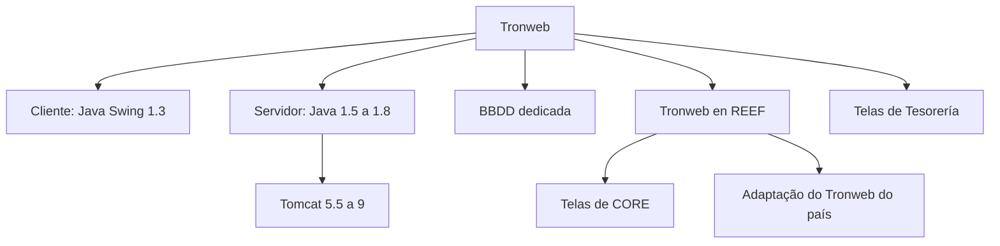

# TRONWEB: Situação Legada, Tecnologias e Adaptação para REEF

## 1. Metadados do Documento
- **Arquivo de Origem:** Não informado
- **Tipo de Documento:** Apresentação Executiva
- **Domínio / Sistema:** Tronweb, REEF Core Backend, NewTRON
- **Público-Alvo:** Arquitetos, Desenvolvedores, Operação e Negócio
- **Data/Versão Identificada:** Não identificada

---

## 2. Resumo Executivo & Contexto de Negócio

O documento apresenta o sistema **Tronweb** no contexto de sistemas corporativos como **REEF Core Backend**, **NewTRON**, **GDC**, **FUJI**, Proveedores, Siniestros, Emisión e Tesorería. A apresentação indica que Tronweb possui abrangência relacionada a países, documentos e funcionalidades de CORE.

Tronweb é caracterizado como uma **aplicação Java Swing**. O documento afirma que o sistema está classificado como “**A decomisar**”, expressão que sinaliza intenção de desativação ou retirada, sem detalhar cronograma, responsáveis, critérios ou processo técnico de descomissionamento.

A manutenção prevista para Tronweb é limitada a **mantenimientos correctivos**. O documento declara explicitamente que **não há evolutivos**, ou seja, não são previstas evoluções funcionais. A permanência do sistema é descrita como temporária para telas de **Tesorería**.

A apresentação também descreve uma iniciativa de **“tronweb en REEF”**, incluindo telas de CORE e uma adaptação do Tronweb de cada país. Essa adaptação envolve avaliar as telas específicas do país para minimizar sua presença. O documento menciona ainda um esquema próprio de conexão com banco de dados.

Não há detalhamento técnico adicional sobre contratos de integração, métodos HTTP, interfaces, modelo de dados, mecanismos de sincronização, responsáveis operacionais ou plano de migração. Os slides sobre sincronização cliente-servidor, CORE e País possuem somente títulos.

---

## 3. Arquitetura, Componentes & Tecnologias Envolvidas

Os componentes, sistemas e contextos citados são:

- **Tronweb:** aplicação Java Swing e objeto central da apresentação.
- **REEF Core Backend:** sistema ou contexto mencionado em associação com Tronweb.
- **NewTRON:** sistema citado.
- **GDC:** sigla/sistema citado sem expansão no documento.
- **FUJI:** sistema citado sem detalhamento adicional.
- **Proveedores:** domínio funcional citado.
- **Siniestros:** domínio funcional citado.
- **Emisión:** domínio funcional citado.
- **Tesorería:** domínio funcional citado; há referência à permanência temporária de Tronweb para suas telas.
- **Países:** contexto de adaptação de telas por país.
- **Documentos:** domínio ou artefato citado.
- **CORE:** conjunto de telas incluídas na iniciativa “tronweb en REEF”.
- **Banco de dados dedicado:** conexão mencionada para Tronweb.
- **Esquema próprio de conexão a banco de dados:** mencionado para Tronweb em REEF.



**Nota de Análise:** o diagrama representa somente associações explícitas ou diretamente descritas pela apresentação. O documento menciona “Sincronización cliente-servidor”, mas não especifica protocolo, direção do fluxo, frequência, payload, mecanismo de autenticação ou tratamento de erros.

---

## 4. Regras de Negócio, Especificações Funcionais & Processos

### 4.1 Situação de manutenção de Tronweb

1. Tronweb é identificado como uma aplicação Java Swing.
2. Tronweb está indicado como “A decomisar”.
3. A manutenção permitida para Tronweb é de natureza corretiva.
4. O documento afirma que não existem evoluções previstas para Tronweb.
5. A permanência de Tronweb é temporária para telas de Tesorería.

### 4.2 Adaptação de Tronweb em REEF

1. A iniciativa “tronweb en REEF” inclui telas de CORE.
2. A iniciativa prevê adaptação do Tronweb do país.
3. As telas do país devem ser avaliadas.
4. O objetivo declarado da avaliação das telas do país é minimizar sua presença.
5. A iniciativa “tronweb en REEF” possui um esquema próprio de conexão a banco de dados.

### 4.3 Sincronização cliente-servidor

O documento possui um slide intitulado **“_tronweb Sincronización cliente-servidor”**. Entretanto, não apresenta regras, sequência operacional, protocolo, parâmetros, frequência, mecanismos de conflito ou detalhes técnicos adicionais sobre a sincronização.

### 4.4 CORE e País

Os slides intitulados **“_tronweb CORE”** e **“_tronweb País”** não contêm conteúdo adicional além de seus títulos. Portanto, o documento não permite definir regras funcionais detalhadas para CORE ou para os comportamentos específicos por país.

---

## 5. Tabelas de Parâmetros, Ambientes e Estruturas de Dados

| Item / Parâmetro | Descrição / Função | Tipo / Valores / Formato | Ambiente / Observações |
| :--- | :--- | :--- | :--- |
| Tronweb | Aplicação central da apresentação | Aplicação Java Swing | Indicada como “A decomisar” |
| Cliente | Tecnologia do cliente Tronweb | Java Swing 1.3 | Versão explicitamente mencionada |
| Servidor | Tecnologia de servidor Tronweb | Java 1.5–1.8 | Intervalo de versões explicitamente mencionado |
| Contêiner de aplicação | Tecnologia de execução do servidor | Tomcat 5.5–9 | Intervalo de versões explicitamente mencionado |
| Conexão a BBDD | Conexão de banco de dados para Tronweb | BBDD dedicada | Não há nome de banco, host, porta ou credenciais |
| Tronweb en REEF | Contexto de adaptação de Tronweb | Inclui telas de CORE | Possui esquema próprio de conexão a BBDD |
| Adaptação por país | Avaliação de telas específicas do país | Processo de análise | Objetivo: minimizar a presença das telas do país |
| Tesorería | Domínio funcional citado | Telas de Tesorería | Tronweb permanece temporariamente para essas telas |
| Manutenção | Política de sustentação de Tronweb | Mantenimientos correctivos | Não há evolutivos |
| Estado futuro | Situação declarada para Tronweb | A decomisar | Sem cronograma ou estratégia de retirada |

---

## 6. Bateria de Perguntas & Respostas para RAG (FAQ Sintético)

### P1: Qual é a tecnologia cliente utilizada pelo Tronweb?
**R:** O Tronweb utiliza **Java Swing 1.3** no cliente. O documento descreve Tronweb como uma aplicação Java Swing.

### P2: Quais versões de Java são mencionadas para o servidor do Tronweb?
**R:** O documento informa que o servidor do Tronweb utiliza **Java 1.5 a Java 1.8**.

### P3: Quais versões de Tomcat são suportadas ou citadas para Tronweb?
**R:** A apresentação cita **Tomcat 5.5 a Tomcat 9** como tecnologias de servidor associadas ao Tronweb.

### P4: Qual é a política de manutenção do Tronweb?
**R:** A política declarada é realizar apenas **mantenimientos correctivos**. O documento afirma explicitamente que não há evoluções previstas para Tronweb.

### P5: O Tronweb continuará recebendo novas evoluções funcionais?
**R:** Não. A apresentação registra “**No hay evolutivos**”, indicando que não há evoluções funcionais previstas para Tronweb.

### P6: Qual é a situação futura indicada para o Tronweb?
**R:** O Tronweb é identificado como “**A decomisar**”. O documento não especifica prazo, plano, critérios técnicos, responsáveis ou etapas para esse descomissionamento.

### P7: Por que o Tronweb continua existindo temporariamente?
**R:** O documento informa que Tronweb permanece temporariamente para as **pantallas de Tesorería**. Não são descritas quais telas de Tesorería são abrangidas nem a duração dessa permanência.

### P8: O que está incluído na iniciativa “tronweb en REEF”?
**R:** A iniciativa “tronweb en REEF” inclui as **telas de CORE**, a adaptação do Tronweb do país e um esquema próprio de conexão a banco de dados.

### P9: Como a adaptação de Tronweb por país deve ser conduzida?
**R:** O documento determina que as telas do país sejam avaliadas para **minimizar sua presença**. Não há critérios de avaliação, lista de telas, processo decisório ou resultado esperado detalhado.

### P10: Que tipo de conexão de banco de dados é mencionada para o Tronweb?
**R:** O documento menciona uma **conexão a BBDD dedicada** para Tronweb. No contexto de “tronweb en REEF”, também é citado um **esquema de conexão a BBDD próprio**.

### P11: O documento descreve como funciona a sincronização cliente-servidor?
**R:** Não. Existe um slide intitulado “_tronweb Sincronización cliente-servidor”, mas o conteúdo fornecido não detalha protocolo, fluxo de mensagens, frequência de sincronização, campos transmitidos ou tratamento de falhas.

### P12: Quais outros sistemas ou domínios são citados junto com Tronweb?
**R:** A apresentação cita REEF Core Backend, NewTRON, GDC, Proveedores, Siniestros, Emisión, Tesorería, FUJI, Países e Documentos. O documento não descreve as responsabilidades nem as integrações técnicas desses itens.

---

## 7. Glossário de Termos, Siglas & Conceitos-Chave

- **BBDD:** abreviação usada no documento para banco de dados.
- **CORE:** conjunto de telas incluídas na iniciativa “tronweb en REEF”; não há definição adicional.
- **GDC:** termo citado no documento sem expansão ou explicação.
- **Java Swing:** tecnologia de interface gráfica utilizada pelo cliente Tronweb.
- **NewTRON:** sistema citado sem detalhamento adicional.
- **REEF Core Backend:** sistema ou contexto citado em associação com Tronweb; não há detalhamento de arquitetura.
- **Tesorería:** domínio funcional relacionado a telas para as quais Tronweb permanece temporariamente.
- **Tomcat:** tecnologia de servidor citada nas versões 5.5 a 9.
- **Tronweb:** aplicação Java Swing apresentada no documento.
- **FUJI:** sistema citado sem explicação adicional.
- **Proveedores:** domínio citado sem detalhamento adicional.
- **Siniestros:** domínio citado sem detalhamento adicional.
- **Emisión:** domínio citado sem detalhamento adicional.

---

## 8. Notas Críticas, Riscos & Limitações

- O documento classifica Tronweb como “A decomisar”, mas não fornece cronograma, plano de transição, critérios de saída, responsáveis ou contingência operacional.
- A política de manutenção limitada a correções, sem evoluções, pode restringir a capacidade de resposta a novas necessidades funcionais.
- A permanência temporária para telas de Tesorería cria uma dependência operacional do Tronweb, mas o documento não identifica as telas, o prazo de permanência ou a estratégia de substituição.
- As versões citadas de Java Swing, Java e Tomcat indicam um contexto tecnológico legado; a apresentação não documenta riscos de compatibilidade, segurança, suporte ou atualização.
- O documento menciona conexão a BBDD dedicada e esquema próprio de conexão a BBDD, porém não detalha topologia, tecnologia do banco, controles de acesso, disponibilidade ou recuperação.
- O slide sobre sincronização cliente-servidor não contém detalhamento técnico. Não é possível estabelecer contratos, protocolos, responsabilidades ou tratamento de falhas.
- CORE, País, NewTRON, GDC, FUJI, Proveedores, Siniestros, Emisión e Documentos são apenas citados. Suas responsabilidades e relações arquiteturais não são explicadas.

---

## 9. Conteúdo Bruto Estruturado (Referência Fiel)

```text
--- [SLIDE 1 DE 8: Sem Título] ---

* Tronweb

--- [SLIDE 2 DE 8: Sem Título] ---

* _tronweb
* Tronweb
* REEF Core Backend
* NewTRON
* GDC
* Proveedores
* Siniestros
* Emisión
* Tesorería
* FUJI
* Países
* Documentos
* Tronweb
* Aplicación Java Swing
* A decomisar
* Mantenimientos correctivos
* No hay evolutivos
* Temporalmente para pantallas de Tesorería

--- [SLIDE 3 DE 8: Sem Título] ---

* _tronweb
* Tronweb
* Tecnologías:
  * Cliente. Java Swing 1.3
  * Servidor. Java 1.5-1.8
    * Tomcat 5.5-9
* Conexión a BBDD dedicada

--- [SLIDE 4 DE 8: Sem Título] ---

* _tronweb en REEF
* Tronweb
* Incluye las pantallas de CORE
* Adaptación del Tronweb del país
  * Se evalúan pantallas del país para minimizar su presencia
* Esquema de conexión a BBDD propio

--- [SLIDE 5 DE 8: Sem Título] ---

* _tronweb Sincronización cliente-servidor

--- [SLIDE 6 DE 8: Sem Título] ---

* _tronweb CORE

--- [SLIDE 7 DE 8: Sem Título] ---

* _tronweb País

--- [SLIDE 8 DE 8: Sem Título] ---

* GRACIAS
```
