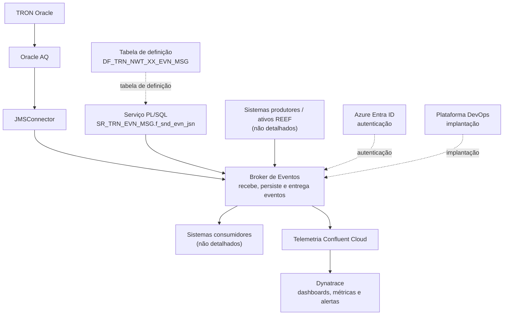

# Plataforma de Eventos: Broker, Segurança, Observabilidade, Governança e Ferramentas de Integração

## 1. Metadados do Documento
- **Arquivo de Origem:** Não identificado no conteúdo fornecido
- **Tipo de Documento:** Apresentação Executiva
- **Domínio / Sistema:** Plataforma Eventos; REEF; TRON Oracle; Confluent Cloud; Dynatrace
- **Público-Alvo:** Arquitetos, Desenvolvedores, Operação e Governança
- **Data/Versão Identificada:** CIMS 23.01; demais versão/data não identificadas

---

## 2. Resumo Executivo & Contexto de Negócio

A apresentação descreve uma **Plataforma de Eventos** corporativa voltada ao recebimento, à persistência e à entrega de eventos em tempo real. O **Broker de Eventos** é identificado como o sistema central da plataforma, embora o conteúdo fornecido não informe sua implementação, protocolos, topologia, contratos de mensagens ou métodos de integração detalhados.

A Plataforma de Eventos oferece capacidades de governança, ferramentas, arquitetura e segurança, observabilidade, broker de eventos e conectores com sistemas MAPFRE. Entre os elementos de governança listados estão convenção de nomenclatura, gerenciamento de partições, réplicas e topics, esquemas e estrutura de eventos, definição por AsyncAPI e marketplace.

A segurança e a arquitetura incluem autenticação por **Azure Entra ID**, integração com ativos REEF, isolamento por país, distinção entre eventos core e eventos de país, além de perfilado. O documento também referencia uma integração por serviço PL/SQL no contexto TRON Oracle.

A observabilidade é realizada por quadros de comando no Dynatrace, usando serviços de telemetria do Confluent Cloud. As capacidades observáveis explicitamente mencionadas são métricas funcionais, métricas por topic e Consumer_Group, além de alertas.

A plataforma também prevê aceleradores, conectores Kafka padronizados para Java, Python e TypeScript, uma consola de erros e implantação mediante a Plataforma DevOps. O documento lista esses recursos em nível resumido e não detalha procedimentos operacionais, configurações, endpoints ou contratos técnicos.

---

## 3. Arquitetura, Componentes & Tecnologias Envolvidas

| Componente / Tecnologia | Papel identificado no documento |
| :--- | :--- |
| Plataforma de Eventos | Plataforma corporativa que engloba governança, ferramentas, arquitetura, segurança, observabilidade, broker e conectores. |
| Broker de Eventos | Sistema central que recebe, persiste e entrega eventos em tempo real. |
| Azure Entra ID | Serviço citado para autenticação. |
| REEF | Ativos REEF integrados com a solução; o documento não detalha o mecanismo de integração. |
| Confluent Cloud | Fonte de serviços de telemetria consumidos pelos quadros de comando Dynatrace. |
| Dynatrace | Ferramenta usada para quadros de comando e observabilidade. |
| Kafka | Tecnologia para a qual há conectores estandarizados para Java, Python e TypeScript. |
| TRON Oracle | Contexto de integração que utiliza Oracle AQ, JMSConnector e uma utilidade PL/SQL TRON. |
| Oracle AQ | Componente citado na integração desde TRON Oracle. |
| JMSConnector | Componente citado em conjunto com Oracle AQ na integração desde TRON Oracle. |
| Serviço PL/SQL | Serviço identificado como `SR_TRN_EVN_MSG.f_snd_evn_jsn`. |
| `op_trn_evn_msg.p_evn_och_jsn` | Elemento associado ao serviço PL/SQL. O documento não especifica se é procedimento, parâmetro ou pacote. |
| `DF_TRN_NWT_XX_EVN_MSG` | Tabela de definição citada para o contexto de eventos. |
| AsyncAPI | Mecanismo citado para definição de eventos. |
| Plataforma DevOps | Plataforma usada para implantação. |



**Nota de Análise:** O diagrama representa exclusivamente relações explicitamente listadas ou semanticamente indicadas pela apresentação. O documento não detalha protocolos, métodos HTTP, tópicos Kafka específicos, contratos JSON, fluxos de autenticação ou relações técnicas precisas entre todos os componentes.

---

## 4. Regras de Negócio, Especificações Funcionais & Processos

### Capacidades fornecidas pela Plataforma de Eventos

1. **Governança**
   - Nomenclatura.
   - Versionamento.
   - Controle.
   - Documentação.
   - Convenção de nomenclatura.
   - Partições, réplicas e topics.
   - Esquemas e estrutura de eventos.
   - Definição por AsyncAPI.
   - Marketplace.

2. **Ferramentas**
   - Conectores com sistemas MAPFRE.
   - Exemplos.
   - Librerías.
   - Aceleradores e conectores.
   - Conectores Kafka estandarizados para Java, Python, TypeScript e outros, indicados por “etc”.
   - Consola de erros.

3. **Arquitetura e Segurança**
   - Autenticação via Azure Entra ID.
   - Integração de caixa com ativos REEF.
   - Isolamento por país.
   - Eventos core e eventos de país.
   - Perfilado.
   - Serviço PL/SQL `SR_TRN_EVN_MSG.f_snd_evn_jsn`.
   - Elemento associado `op_trn_evn_msg.p_evn_och_jsn`.
   - Tabela de definição `DF_TRN_NWT_XX_EVN_MSG`.

4. **Broker de Eventos**
   - Recebe eventos.
   - Persiste eventos.
   - Entrega eventos em tempo real.
   - Integração entre o broker e distintos sistemas.
   - Autenticação.
   - Trazabilidade.

5. **Observabilidade**
   - Quadros de comando no Dynatrace.
   - Uso de serviços de telemetria do Confluent Cloud.
   - Métricas funcionais.
   - Métricas por topic e Consumer_Group.
   - Alertas.

6. **Integração a partir de TRON Oracle**
   - Oracle AQ.
   - JMSConnector.
   - Utilidade PL/SQL TRON, indicada para CIMS 23.01.

7. **DevOps**
   - Despliegue mediante a Plataforma DevOps.

**Nota de Análise:** A apresentação não descreve regras condicionais, fórmulas de cálculo, critérios de autorização, nomes de países, convenções concretas de nomes, políticas de retenção, número de partições, fator de réplica, SLAs ou passos operacionais detalhados.

---

## 5. Tabelas de Parâmetros, Ambientes e Estruturas de Dados

| Item / Parâmetro | Descrição / Função | Tipo / Valores / Formato | Ambiente / Observações |
| :--- | :--- | :--- | :--- |
| Autenticação | Mecanismo de autenticação citado para arquitetura e segurança. | Azure Entra ID | Fluxo e configuração não detalhados. |
| Isolamento | Separação arquitetural indicada por país. | Por país | Países e mecanismo de isolamento não identificados. |
| Classificação de eventos | Separação de eventos mencionada no documento. | Eventos core / país | Critérios de classificação não detalhados. |
| Perfilado | Capacidade indicada em arquitetura e segurança. | Não especificado | Perfis, permissões e matriz de acesso não detalhados. |
| Serviço PL/SQL | Serviço listado na arquitetura e segurança. | `SR_TRN_EVN_MSG.f_snd_evn_jsn` | Assinatura, entradas, saídas e comportamento não detalhados. |
| Elemento PL/SQL associado | Referência vinculada ao serviço PL/SQL. | `op_trn_evn_msg.p_evn_och_jsn` | Tipo técnico não identificado no conteúdo. |
| Tabela de definição | Tabela listada para definição relacionada a eventos. | `DF_TRN_NWT_XX_EVN_MSG` | Colunas, chaves e modelo de dados não detalhados. |
| Observabilidade | Quadros de comando. | Dynatrace | Usa serviços de telemetria do Confluent Cloud. |
| Métricas | Indicadores de observabilidade. | Funcionais; por topic; por Consumer_Group | Fórmulas, limiares e nomes de métricas não informados. |
| Alertas | Capacidade de monitoramento. | Não especificado | Regras, canais e níveis de severidade não informados. |
| Governança de mensageria | Elementos de gestão de eventos. | Partições / réplicas / topics | Valores e políticas não detalhados. |
| Contrato de eventos | Definição de eventos. | AsyncAPI | Versão e localização das definições não identificadas. |
| Conectores Kafka | Conectores padronizados. | Java, Python, TypeScript, etc. | Bibliotecas concretas e versões não detalhadas. |
| Integração TRON Oracle | Integração indicada a partir de TRON Oracle. | Oracle AQ + JMSConnector | Fluxo, configuração e responsabilidades não detalhados. |
| Utilidade PL/SQL TRON | Utilitário de integração. | CIMS 23.01 | Sem procedimento de uso descrito. |
| Implantação | Mecanismo de entrega/deploy. | Plataforma DevOps | Pipeline, ambientes e aprovações não detalhados. |

---

## 6. Bateria de Perguntas & Respostas para RAG (FAQ Sintético)

### P1: Qual é a função central do Broker de Eventos da Plataforma de Eventos?
**R:** O Broker de Eventos é apresentado como o sistema central da Plataforma de Eventos. Sua função é receber, persistir e entregar eventos em tempo real. O documento também associa o broker à integração com distintos sistemas, autenticação e trazabilidade, sem detalhar protocolos, contratos ou implementação técnica.

### P2: Como a Plataforma de Eventos realiza autenticação?
**R:** A apresentação informa que a arquitetura e a segurança utilizam Authentication Azure Entra ID. O conteúdo não especifica o fluxo de autenticação, tipos de credenciais, escopos, tokens, perfis ou configuração do Azure Entra ID.

### P3: Quais recursos de observabilidade são fornecidos pela Plataforma de Eventos?
**R:** A observabilidade inclui quadros de comando no Dynatrace por meio dos serviços de telemetria do Confluent Cloud, métricas funcionais, métricas por topic e Consumer_Group, além de alertas. O documento não informa quais são as métricas específicas, seus limites ou regras de alerta.

### P4: Quais aspectos de governança de eventos são mencionados?
**R:** A apresentação menciona convenção de nomenclatura, partições, réplicas, topics, esquemas, estrutura de eventos, definição usando AsyncAPI e marketplace. Também lista nomenclatura, versionamento, controle e documentação como capacidades da plataforma.

### P5: A Plataforma de Eventos fornece conectores para quais tecnologias?
**R:** O documento cita conectores Kafka estandarizados para Java, Python e TypeScript, além de mencionar “etc.”, sem identificar outras linguagens. Também são citados conectores com sistemas MAPFRE, exemplos e librerías.

### P6: Como ocorre a integração desde TRON Oracle?
**R:** A apresentação indica, para integração desde TRON Oracle, o uso de Oracle AQ com JMSConnector e uma utilidade PL/SQL TRON associada à versão CIMS 23.01. O documento não detalha a sequência operacional, a configuração do Oracle AQ, o contrato do JMSConnector ou o destino das mensagens.

### P7: Qual serviço PL/SQL é citado na arquitetura da Plataforma de Eventos?
**R:** O serviço PL/SQL citado é `SR_TRN_EVN_MSG.f_snd_evn_jsn`. O documento também associa o elemento `op_trn_evn_msg.p_evn_och_jsn` e a tabela de definição `DF_TRN_NWT_XX_EVN_MSG`, mas não detalha assinatura, parâmetros, retorno ou lógica interna do serviço.

### P8: Como a Plataforma de Eventos separa eventos por contexto?
**R:** A arquitetura e segurança mencionam isolamento por país e a existência de eventos core e eventos de país. O documento não apresenta a regra que determina quando um evento é core ou de país, nem descreve a implementação do isolamento.

### P9: Qual ferramenta é usada para dashboards e quais dados a alimentam?
**R:** Os quadros de comando são disponibilizados no Dynatrace e utilizam serviços de telemetria do Confluent Cloud. A apresentação não informa integrações técnicas, credenciais, dashboards específicos ou períodos de retenção das métricas.

### P10: Como são definidos os contratos ou esquemas dos eventos?
**R:** A governança da Plataforma de Eventos cita esquemas, estrutura de eventos e definição por AsyncAPI. O documento não especifica a versão do AsyncAPI, os repositórios, os formatos de payload ou o processo de aprovação dos contratos.

### P11: Qual mecanismo de implantação é mencionado?
**R:** A apresentação afirma que o despliegue é realizado mediante a Plataforma DevOps. Não há detalhes sobre pipelines, ferramentas internas, ambientes, validações, aprovações ou estratégias de rollback.

### P12: Quais capacidades de tratamento de falhas são mencionadas?
**R:** O documento cita uma consola de erros e alertas no contexto de ferramentas e observabilidade. Não são detalhados fluxos de tratamento, responsáveis, classificação de erros, retenção de falhas ou procedimentos de resolução.

---

## 7. Glossário de Termos, Siglas & Conceitos-Chave

- **AsyncAPI:** Tecnologia citada para a definição de eventos; a apresentação não fornece expansão ou versão.
- **Azure Entra ID:** Serviço citado como mecanismo de autenticação.
- **Broker de Eventos:** Sistema central que recebe, persiste e entrega eventos em tempo real.
- **CIMS 23.01:** Versão associada à utilidade PL/SQL TRON.
- **Consumer_Group:** Agrupamento usado como dimensão de métricas de observabilidade, conforme apresentado.
- **Confluent Cloud:** Origem dos serviços de telemetria usados pelos quadros de comando no Dynatrace.
- **DF_TRN_NWT_XX_EVN_MSG:** Tabela de definição citada no contexto da arquitetura e segurança.
- **Dynatrace:** Ferramenta usada para quadros de comando, métricas e alertas.
- **Eventos core:** Categoria de eventos mencionada juntamente com eventos de país; sem definição adicional.
- **Eventos de país:** Categoria de eventos mencionada juntamente com eventos core; sem definição adicional.
- **JMSConnector:** Componente citado na integração desde TRON Oracle.
- **Kafka:** Tecnologia para a qual são mencionados conectores estandarizados.
- **MAPFRE:** Sistemas para os quais a plataforma menciona conectores.
- **Oracle AQ:** Componente citado para integração desde TRON Oracle.
- **REEF:** Ativos citados como integrados de caixa; a apresentação não expande a sigla.
- **SR_TRN_EVN_MSG.f_snd_evn_jsn:** Serviço PL/SQL mencionado no documento.
- **topic:** Unidade mencionada no contexto de métricas, partições, réplicas e governança.
- **TRON Oracle:** Contexto/origem de integração que cita Oracle AQ, JMSConnector e utilidade PL/SQL.

---

## 8. Notas Críticas, Riscos & Limitações

- O conteúdo é resumido e predominantemente composto por tópicos de apresentação, sem notas do apresentador disponibilizadas.
- Não há detalhamento de arquitetura física ou lógica do Broker de Eventos, incluindo clusters, regiões, protocolos, endpoints, portas, tópicos concretos ou estratégia de persistência.
- A autenticação por Azure Entra ID é citada, mas fluxos de identidade, autorização, escopos, perfis e integração técnica não são especificados.
- O isolamento por país e a separação entre eventos core e eventos de país não possuem regras, países participantes ou mecanismo técnico descritos.
- Os conectores Kafka são mencionados para Java, Python e TypeScript, porém versões, artefatos, APIs e exemplos de implementação não estão presentes.
- A observabilidade não apresenta catálogo de métricas, thresholds, SLAs, regras de alerta, responsáveis ou procedimentos de resposta.
- O serviço PL/SQL, o elemento associado e a tabela de definição são identificados apenas por nome; o documento não descreve contratos, campos, procedimentos ou dependências.
- A integração TRON Oracle lista Oracle AQ, JMSConnector e a utilidade PL/SQL TRON, mas não fornece fluxo detalhado, configuração ou diagnóstico de falhas.
- A Plataforma DevOps é citada como mecanismo de implantação, sem informações sobre ambientes, pipelines, controles de mudança ou rollback.

---

## 9. Conteúdo Bruto Estruturado (Referência Fiel)

```text
--- [SLIDE 1 DE 18: Sem Título] ---

* Plataforma Eventos

--- [SLIDE 2 DE 18: Sem Título] ---


--- [SLIDE 3 DE 18: Sem Título] ---

* _Introducción

--- [SLIDE 4 DE 18: Sem Título] ---


--- [SLIDE 5 DE 18: Sem Título] ---

* 5
* ¿Qué proporcionamos en la Plataforma?
* Gobierno
* Herramientas
* Arquitectura y Seguridad
* Observabilidad
* Broker de Eventos
* Nomenclatura, versionado, control, documentación.
* Conectores con sistemas MAPFRE, ejemplos, librerías
* Sistema central de la plataforma, recibe, persiste y entrega eventos en tiempo real
* Integración entre el broker y los distintos sistemas, autenticación, trazabilidad, etc
* Cuadros de mando, monitorización y gestión de errores

--- [SLIDE 6 DE 18: Sem Título] ---


--- [SLIDE 7 DE 18: Sem Título] ---

* 5
* _Broker de Eventos

--- [SLIDE 8 DE 18: Sem Título] ---

* 5
* _Broker de Eventos

--- [SLIDE 9 DE 18: Sem Título] ---

* 5
* _Arquitectura y Seguridad
* Authentication Azure Entra ID
* Integrado de caja con activos REEF
* Aislamiento por país
* Eventos core / pais
* Perfilado

--- [SLIDE 10 DE 18: Sem Título] ---

* 5
* _Arquitectura y Seguridad

--- [SLIDE 11 DE 18: Sem Título] ---

* 5
* _Arquitectura y Seguridad

--- [SLIDE 12 DE 18: Sem Título] ---

* 5
* _Arquitectura y Seguridad
* Servicio plsql:
* SR_TRN_EVN_MSG.f_snd_evn_jsn
* - op_trn_evn_msg.p_evn_och_jsn
* Tabla de definición:
* DF_TRN_NWT_XX_EVN_MSG

--- [SLIDE 13 DE 18: Sem Título] ---

* 5
* _Arquitectura y Seguridad

--- [SLIDE 14 DE 18: Sem Título] ---

* 5
* _Observabilidad
* Cuadros de mando en Dynatrace a través de los servicios de  telemetría de Confluent Cloud
* Métricas funcionales
* Métricas la por topic / Consumer_Group
* Alertas

--- [SLIDE 15 DE 18: Sem Título] ---

* 5
* _Observabilidad

--- [SLIDE 16 DE 18: Sem Título] ---

* 5
* _Gobierno
* Convención de nomenclatura
* Particiones / Réplicas / Topics
* Esquemas / Estructura de eventos
* Definición  AsyncAPI
* Marketplace

--- [SLIDE 17 DE 18: Sem Título] ---

* 5
* _TOOLS
* Aceleradores y Conectores
* Conectores estandar Kafka para: Java, Python, TypeScript, etc
* Consola de errores
* Desde TRON Oracle:
* Oracle AQ + JMSConnector 	+
* Utilidad PL/SQL TRON (CIMS 23.01)
* DevOps
* Despliegue mediante la Plataforma DevOps

--- [SLIDE 18 DE 18: Sem Título] ---

* GRACIAS
```
