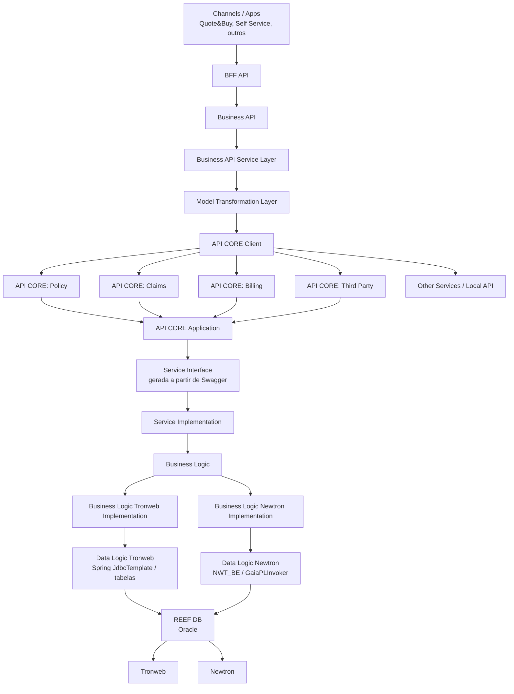
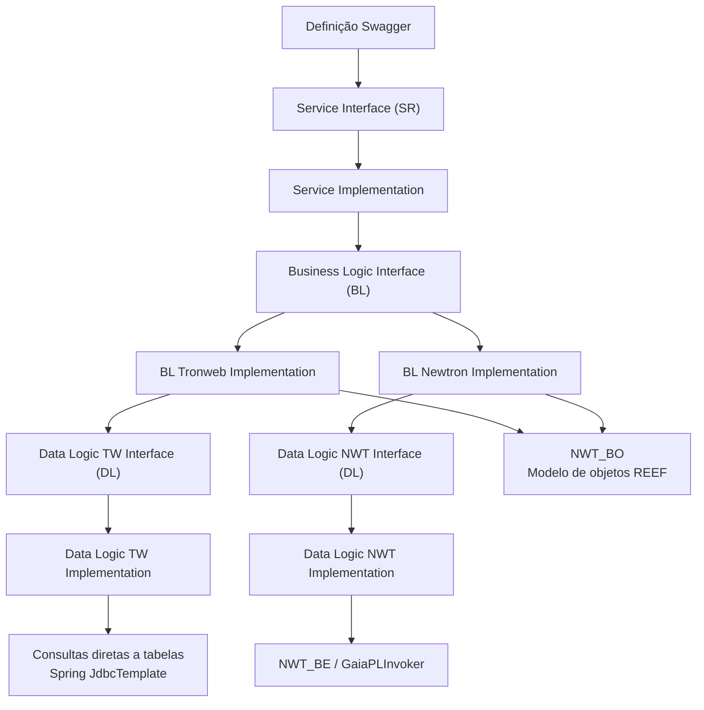
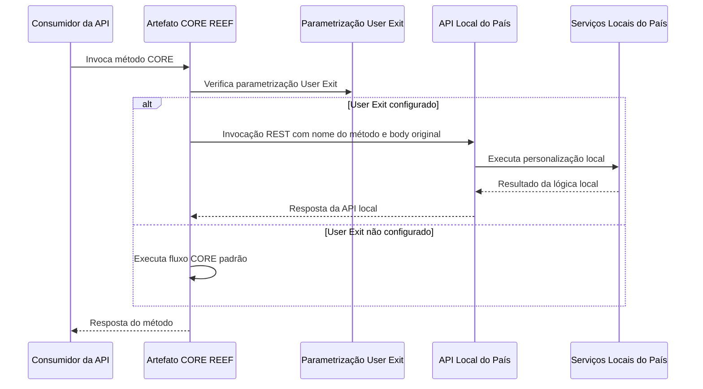

# Integração em REEF — Arquitetura, APIs CORE, APIs de Negócio e Estratégias de Customização

## 1. Metadados do Documento
- **Arquivo de Origem:** Não identificado no conteúdo extraído
- **Tipo de Documento:** Apresentação Executiva / Arquitetura de Software
- **Domínio / Sistema:** REEF, Tronweb, Newtron, GAIA e APIs corporativas
- **Público-Alvo:** Arquitetos, desenvolvedores, equipes de integração, países consumidores da solução e operação
- **Data/Versão Identificada:** Não identificada

---

## 2. Resumo Executivo & Contexto de Negócio

O documento apresenta a arquitetura de integração do sistema REEF por meio de APIs organizadas em três níveis: **BFF API**, **API de Negócio** e **API CORE**. A proposta busca padronizar a exposição de capacidades corporativas, simplificar a integração de aplicações clientes e reduzir o acoplamento direto com os sistemas e modelos de dados subjacentes.

A **API CORE de REEF** é o único ponto permitido para invocações ao REEF. A apresentação determina explicitamente que não é permitido acessar diretamente a base de dados REEF. A API CORE expõe funcionalidades por domínios funcionais independentes, incluindo emissão, terceiros, sinistros, tesouraria, componentes comuns, relatórios, batch e fornecedores.

A solução suporta dois modelos tecnológicos e funcionais já existentes no REEF: **Tronweb** e **Newtron**. A API CORE isola as diferenças de acesso entre esses modelos por meio de implementações configuráveis nas camadas de lógica de negócio e lógica de dados. Para Newtron, o acesso a dados utiliza componentes como `NWT_BE` e `NWT_BO`; para Tronweb, o acesso é realizado diretamente às tabelas, utilizando Spring `JdbcTemplate`.

A camada de **API de Negócio** oferece uma interface corporativa unificada, independente da linguagem ou modelo dos sistemas CORE. Essa camada realiza transformação de modelos, orquestração e agregação de informações, permitindo que canais e aplicações — como Quote&Buy e Self Service — consumam APIs homogêneas mesmo quando os sistemas de origem utilizam linguagens ou modelos distintos, como “Lenguaje TRON” e “Lenguaje Guidewire”.

O documento também descreve estratégias de customização para países. A customização preserva a interface pública existente e permite alterar implementações específicas, adicionar extensões de objetos ou criar novos serviços via Swagger. Há ainda um modelo de **User Exit**, no qual artefatos CORE podem invocar APIs locais de países de forma síncrona ou assíncrona, sujeitos a restrições de serialização e presença da companhia como parâmetro de entrada.

---

## 3. Arquitetura, Componentes & Tecnologias Envolvidas

### Níveis de APIs

| Nível | Finalidade |
| :--- | :--- |
| BFF API | Expõe apenas a parte da API necessária ao front-end, no formato necessário ao front-end. Simplifica a interação entre aplicação cliente e API de Negócio. |
| API de Negócio | Expõe o negócio corporativo de forma uniforme, legível e clara. Inclui API Management, segurança, cache, análise, documentação, mediação, transformação e orquestração. |
| API CORE | Expõe a funcionalidade de cada sistema CORE da melhor forma possível. No REEF, é o canal obrigatório para invocações ao sistema. |

### Componentes identificados

| Componente | Descrição |
| :--- | :--- |
| REEF DB | Base de dados Oracle do REEF. Contém o modelo de dados e as lógicas de negócio REEF, tanto Tronweb quanto Newtron. |
| Tronweb Frontend | Frontal composto por `TWClient`, cliente Java pesado instalável localmente, e `TWServer`, aplicação middleware entre cliente e lógicas de negócio Tronweb na base de dados. |
| Newtron Frontend | Frontal composto por interface web multidispositivo, multinavegador e multilíngue e por backend de acesso às lógicas de negócio na base de dados. |
| API CORE | API REST modular por domínio funcional. Todas as invocações ao REEF devem ocorrer por essa API. |
| Business API | Camada corporativa de negócio responsável por transformação, mapeamento, orquestração e agregação de informações entre consumidores e APIs CORE. |
| BFF API | Camada voltada às necessidades de front-ends consumidores. |
| NWT_BE | Biblioteca utilizada pela implementação Newtron para acesso à base de dados. |
| NWT_BO | Modelo de objetos REEF utilizado pela aplicação para fornecer informações. |
| GAIA | Arquitetura global de referência, framework e conjunto de tecnologias, ferramentas, arquetipos e configurações. |
| GaiaPLInvoker | Mencionado como mecanismo utilizado pelo modelo Newtron para acesso via `NWT_BE`. |
| Swagger | Tecnologia utilizada para definição de contratos, geração de interfaces, documentação e consumo de APIs REST. |
| Spring MVC | Tecnologia utilizada para exposição de serviços REST na API CORE. |
| Spring Boot / Gaia Boot | Base do projeto Backend de API de país no modelo de User Exit. |
| MapStruct | Framework de mapeamento indicado para a solução de API de Negócio. |
| Swagger Codegen | Ferramenta indicada para geração de clientes. |
| GAIA Apify | Ferramenta indicada para geração da exposição de serviços. |
| JasperReports | Tecnologia encapsulada pela API RPT de geração de documentos. |
| Mapfre-services | Serviços encapsulados pela API RPT, incluindo Exstream e FIS. |
| SoapUI | Ferramenta apresentada em um protótipo de uso da API. |

### Domínios funcionais REEF

| Sigla / Módulo | Nome apresentado |
| :--- | :--- |
| ISU | Emissão |
| THP | Terceiros |
| LSS | Sinistros / Prestaciones |
| TSY | Tesouraria |
| CMN | Comuns |
| RPT | Relatórios / geração de documentos |
| BTC | Batch |
| SPL | Fornecedores |
| Policy | Apólices |
| Claims | Sinistros |
| Billing | Faturamento |
| Third Party | Terceiros |

> **Nota de Análise:** O documento apresenta `LSS` como “Siniestros” em um slide e como “Prestaciones” nas notas de outro slide. Não há detalhamento para resolver essa diferença terminológica.

### Arquitetura geral extraída



### Camadas da API CORE



---

## 4. Regras de Negócio, Especificações Funcionais & Processos

### 4.1 Regras de acesso ao REEF

1. Todas as invocações ao REEF devem ser realizadas por meio da **API CORE**.
2. Não é permitido acesso direto à base de dados REEF.
3. A API CORE expõe funcionalidades REST em módulos independentes por domínio funcional.
4. A API CORE entrega informações conforme o modelo de objetos REEF e, por isso, utiliza `NWT_BO`.

### 4.2 Implementações de lógica por configuração

1. A API CORE possui três camadas principais: `SR`, `BL` e `DL`.
2. Cada camada é separada entre interfaces e implementações.
3. A camada `SR` contém interfaces de serviço geradas, em princípio, a partir da definição Swagger.
4. A definição Swagger representa o contrato dos serviços expostos pela API CORE.
5. A camada `BL` possui duas implementações:
   - Implementação Newtron.
   - Implementação Tronweb.
6. A implementação a ser utilizada é definida por configuração.
7. A implementação Newtron utiliza `NWT_BE` como biblioteca de acesso à base de dados e menciona `GaiaPLInvoker`.
8. A implementação Tronweb consulta tabelas diretamente e utiliza Spring `JdbcTemplate`.

### 4.3 Customização da API CORE

1. O padrão é implantar a **API CORE CORE**.
2. Caso seja necessária personalização, deve ser utilizada uma **API CUSTOM**.
3. É fornecido ao país um projeto customizado para o módulo específico.
4. O projeto customizado mantém a interface e a funcionalidade do projeto CORE até que algum componente seja alterado.
5. O projeto customizado possui dependência com o CORE.
6. Não é possível modificar o Swagger do CORE.
7. É permitido modificar a funcionalidade, mas não a interface do CORE.
8. É necessário modificar apenas as camadas envolvidas na alteração.
9. A customização pode afetar apenas um método dentro de uma funcionalidade completa.
10. Novos serviços e novos endpoints podem ser adicionados.
11. Necessidades de novos serviços devem ser consultadas com a Autoridade de Design.
12. Atualizações do CORE ocorrem por incremento do número de versão.
13. O projeto inclui uma configuração inicial de IC.

### 4.4 Casos de customização contemplados

| Caso | Interface | Modelo de objeto | Mecanismo indicado |
| :--- | :--- | :--- | :--- |
| Modificação de serviço existente sem mudança de interface e objeto | Sem alteração | Sem alteração | Personalização |
| Modificação de serviço existente sem mudança de interface, com mudança de objeto | Sem alteração | Alteração por extensão | Personalização |
| Modificação com alteração de interface | Alterada | Não detalhado | Definição em Swagger |
| Novo serviço | Novo contrato | Não detalhado | Definição em Swagger |

### 4.5 Formas de personalização

| Forma | Regra apresentada |
| :--- | :--- |
| Extensão de implementação | Pode estender uma implementação para alterar algum método. |
| Nova implementação | Pode implementar uma nova implementação quando todos os métodos precisarem ser tratados. |
| Extensão de objeto CORE | Pode estender uma classe de objeto CORE para adicionar novas propriedades. |
| Novo serviço | Deve ser definido em Swagger e não pode colidir com serviço existente. |

### 4.6 User Exit Customization

O modelo User Exit visa permitir atualização transparente de artefatos CORE e reduzir a necessidade de implantar outros artefatos devido a atualizações. O modelo prevê publicação de artefato CORE com capacidade de personalização em pontos específicos, sob demanda, e um único projeto/artefato de APIs local contendo código de personalização e novas APIs.



#### Regras e restrições do User Exit

1. O artefato CORE determina, por parametrização, se uma chamada remota ao API local do país deve ser executada.
2. As invocações podem ser síncronas ou assíncronas, conforme a necessidade.
3. O mecanismo é permitido apenas em métodos que recebem a companhia como parâmetro de entrada.
4. O mecanismo não é permitido em métodos que possuem atributos não serializáveis.
5. A chamada enviada possui a mesma estrutura de parâmetros do método invocado.
6. A API do país deve construir um serviço REST com o nome do método.
7. A API do país deve receber o mesmo corpo (`body`) contendo os parâmetros originais.

#### Regras para a API de país

1. O projeto Backend da API de país deve ser baseado em Spring Boot / Gaia Boot.
2. A API de país deve incluir um controller com a mesma interface do método a personalizar.
3. O país deve construir seus próprios serviços locais a partir do Swagger de definição da API.
4. Os módulos locais devem ser diferenciados por nomenclatura.
5. A API de país não pode utilizar bibliotecas CORE.
6. A API de país não pode realizar chamadas diretas à camada `SR` do CORE.
7. A API de país deve invocar APIs para obter informações do CORE.

### 4.7 Segurança

1. A solução permite diversos modos de autenticação.
2. A autorização de serviços é baseada em papéis presentes no Diretório Ativo ou no AAD.
3. O país pode aplicar seus próprios grupos de segurança para cada serviço.
4. O documento apresenta uma amostra de papéis de ISU, mas o conteúdo desses papéis não foi extraído.

### 4.8 Geração de documentos

1. A API de geração de documentos pertence ao módulo `RPT`.
2. A API `RPT` encapsula o acesso a JasperReports e Mapfre-services.
3. Os serviços mencionados incluem Exstream e FIS.
4. A API de geração de documentos oferece interfaces SOAP e REST.
5. A solução possui compatibilidade com `wtw_reports`.

### 4.9 API de Negócio: mediação e transformação

1. A API de Negócio atende à necessidade de transformação entre uma interface API REST e outra camada de serviços.
2. O objetivo declarado é encontrar uma solução homogênea, mecânica e simples.
3. A abordagem busca selecionar ferramentas e utilidades adequadas e minimizar tempos de desenvolvimento.
4. A solução permite mapear objetos entre API de Negócio e API CORE.
5. A camada de transformação:
   - Transforma serviços.
   - Mapeia objetos.
   - Orquestra chamadas.
   - Transforma estruturas.
   - Agrega informações.
6. A API de Negócio utiliza camada de serviço, camada de transformação de modelos, `ObjectMapper`, constantes e cliente da API CORE.

### 4.10 Customização da API de Negócio

1. O padrão é implantar a **BUSINESS API preconstruída**.
2. Quando há necessidade de personalização, é utilizada a **BUSINESS API CUSTOM**.
3. O país recebe o projeto personalizado.
4. O projeto customizado mantém interface e funcionalidade do preconstruído até que componentes tenham seu comportamento modificado.
5. O projeto customizado depende do projeto preconstruído.
6. Não é possível modificar o Swagger do preconstruído.
7. É possível modificar funcionalidade, mas não a interface.
8. Devem ser modificadas apenas as camadas necessárias.
9. A camada normalmente personalizada é a camada intermediária de transformação de modelos.

### 4.11 Implantação da API de Negócio

| Cenário | Entrega / ação |
| :--- | :--- |
| Implantação sem personalização | Um artefato `EAR` disponível para implantação. |
| Implantação com personalização | Repositório completo do projeto CUSTOM. |
| Desenvolvimento local com personalização | O país personaliza o projeto e pode utilizar o guia “Integración Business API & API CORE”. |
| Implantação customizada | Implantar o artefato produzido pelo projeto CUSTOM. |
| Configuração de ambiente | Implantar CORE ou CUSTOM com configuração zero. |
| Configuração zero | Artefato independente do `EAR`, contendo configuração para um ambiente. O país deve alterá-lo para incluir sua configuração. |

---

## 5. Tabelas de Parâmetros, Ambientes e Estruturas de Dados

### Tecnologias e responsabilidades

| Item / Parâmetro | Descrição / Função | Tipo / Valores / Formato | Ambiente / Observações |
| :--- | :--- | :--- | :--- |
| REEF DB | Armazena modelo de dados e lógicas de negócio REEF | Base de dados Oracle | Contém lógicas Tronweb e Newtron |
| API CORE | Canal obrigatório de invocação ao REEF | Serviços REST modulares | Não permite acesso direto à base de dados |
| Swagger | Define contratos e suporta documentação e consumo de APIs REST | Framework / especificação de APIs | Interfaces SR são geradas a partir da definição Swagger |
| Spring MVC | Exposição de serviços REST | Framework | Utilizado na API CORE |
| Spring JdbcTemplate | Consultas diretas a tabelas | Componente Spring | Utilizado na implementação Tronweb |
| NWT_BE | Acesso à base de dados para Newtron | Biblioteca | Utilizado pela implementação Newtron |
| NWT_BO | Modelo de objetos REEF | Biblioteca / modelo de objetos | Utilizado para fornecer informação segundo o modelo REEF |
| GaiaPLInvoker | Mencionado no acesso Newtron à base de dados | Componente não detalhado | Não há detalhes adicionais no documento |
| MapStruct | Mapeamento de modelos | Framework de mapeamento | Indicado para API de Negócio |
| Swagger Codegen | Geração de clientes | Ferramenta | Indicado para API de Negócio |
| GAIA Apify | Geração da exposição de serviços | Ferramenta | Indicado para API de Negócio |
| JasperReports | Geração de documentos | Tecnologia | Encapsulado por RPT |
| Exstream | Serviço de geração de documentos | Mapfre-services | Encapsulado por RPT |
| FIS | Serviço de geração de documentos | Mapfre-services | Encapsulado por RPT |
| SOAP | Interface de serviços | Protocolo | Disponível na API RPT |
| REST | Interface de serviços | Estilo arquitetural | Disponível na API CORE e API RPT |
| EAR | Artefato de implantação | Pacote de aplicação | Entrega padrão da Business API CORE |
| Configuração zero | Configuração específica de ambiente | Artefato separado do EAR | Deve ser ajustado pelo país |

### Camadas técnicas da API CORE

| Camada | Interface | Implementação | Responsabilidade |
| :--- | :--- | :--- | :--- |
| SR | Service Interface | Service Implementation | Expõe o contrato definido por Swagger e serviços da API CORE |
| BL | Business Logic Interface | Tronweb Implementation / Newtron Implementation | Contém lógica de negócio com implementação selecionada por configuração |
| DL | Data Logic TW Interface / Data Logic NWT Interface | TW Implementation / NWT Implementation | Executa acesso a dados segundo a tecnologia Tronweb ou Newtron |

### Estruturas de front-end REEF

| Frontal | Componente | Descrição |
| :--- | :--- | :--- |
| Tronweb | TWClient | Cliente Java pesado instalável na estação local do usuário. |
| Tronweb | TWServer | Aplicação de servidor que atua como middleware entre TWClient e lógicas de negócio Tronweb na base de dados. |
| Newtron | Frontend | Interface REEF web, multidispositivo, multinavegador e multilíngue. |
| Newtron | Serviços de apresentação | Java/Spring Framework executado em servidor de aplicações JBOSS. |
| Newtron | Backend | Aplicação GAIA Java/Spring Framework para acesso às lógicas de negócio na base de dados. |
| Newtron | Tecnologias de cliente | AngularJS, Bootstrap, HTML5 e CSS3. |

### Limites de customização

| Item / Parâmetro | Descrição / Função | Tipo / Valores / Formato | Ambiente / Observações |
| :--- | :--- | :--- | :--- |
| Swagger CORE | Contrato público da API CORE | Não modificável | Customização não altera interface CORE |
| Swagger preconstruído Business API | Contrato público da Business API | Não modificável | Customização altera funcionalidade, não interface |
| Novo endpoint | Serviço adicional | Definição Swagger | Deve ser consultado com Autoridade de Design no caso CORE |
| Extensão de objeto | Inclusão de novas propriedades | Extensão de classe CORE | Aplicável quando propriedades precisam ser adicionadas |
| Extensão de implementação | Alteração de método específico | Extensão parcial | Indicada para alterar algum método |
| Nova implementação | Substituição de implementação | Implementação completa | Indicada quando todos os métodos precisam ser tratados |
| User Exit | Chamada para API local de país | Síncrona ou assíncrona | Exige companhia como parâmetro e atributos serializáveis |

---

## 6. Bateria de Perguntas & Respostas para RAG (FAQ Sintético)

### P1: Qual é o canal permitido para invocar funcionalidades do REEF?
**R:** Todas as invocações ao REEF devem ser realizadas por meio da API CORE. O documento determina que o acesso direto à base de dados REEF não é permitido. A API CORE expõe funcionalidades REST organizadas em módulos independentes por domínio funcional.

### P2: Quais são os três níveis de APIs descritos para a arquitetura REEF?
**R:** A arquitetura possui BFF API, API de Negócio e API CORE. A BFF API expõe somente o necessário para o front-end. A API de Negócio apresenta o negócio corporativo de forma uniforme e suporta mediação, transformação e orquestração. A API CORE expõe diretamente a funcionalidade do sistema CORE.

### P3: Como a API CORE diferencia o acesso a Tronweb e Newtron?
**R:** A API CORE possui camadas de lógica de negócio e lógica de dados com implementações específicas para Tronweb e Newtron, selecionadas por configuração. Newtron utiliza `NWT_BE` como biblioteca de acesso à base de dados e menciona `GaiaPLInvoker`; Tronweb realiza consultas diretas às tabelas por meio de Spring `JdbcTemplate`.

### P4: Quais são as camadas principais da API CORE de REEF?
**R:** A API CORE é separada nas camadas `SR`, `BL` e `DL`. A camada `SR` contém interfaces de serviço geradas a partir de Swagger. A camada `BL` contém a lógica de negócio com implementações Tronweb e Newtron. A camada `DL` contém a lógica de acesso a dados para Tronweb e Newtron.

### P5: É possível modificar o Swagger da API CORE durante uma customização?
**R:** Não. O documento determina que o Swagger do CORE não pode ser modificado. É possível alterar a funcionalidade nas camadas necessárias, mas a interface existente deve ser preservada. Novos serviços podem ser adicionados mediante definição em Swagger e consulta à Autoridade de Design.

### P6: Como um país pode customizar um serviço existente da API CORE?
**R:** Um país pode customizar uma implementação específica, por exemplo alterando algum método por extensão, ou implementar uma nova implementação quando todos os métodos precisarem ser tratados. A customização pode ocorrer somente nas camadas envolvidas e em componentes específicos. Se forem necessárias novas propriedades em objetos CORE, a classe pode ser estendida.

### P7: Quais são as restrições para utilizar User Exit em um método CORE?
**R:** User Exit é permitido somente para métodos que possuem a companhia como parâmetro de entrada. Não é permitido para métodos que contenham atributos não serializáveis. A chamada à API local do país pode ser síncrona ou assíncrona e deve utilizar o mesmo corpo de parâmetros do método original.

### P8: A API local de um país pode utilizar bibliotecas CORE ou chamar diretamente a camada SR do CORE?
**R:** Não. A API de país não pode utilizar bibliotecas CORE nem realizar chamadas diretas à camada `SR` do CORE. Para obter informações do CORE, a API local deve realizar invocações às APIs disponíveis.

### P9: Qual é a responsabilidade da API de Negócio?
**R:** A API de Negócio fornece uma interface corporativa uniforme sobre APIs CORE potencialmente heterogêneas. Ela executa transformação de modelos, mapeamento de objetos, orquestração de serviços e agregação de informações, reduzindo a complexidade de integração para canais e aplicações consumidores.

### P10: Quais tecnologias são indicadas na solução de API de Negócio?
**R:** A solução menciona GAIA Backend como framework de aplicação, GAIA Apify para geração de exposição de serviços, Swagger Codegen para geração de clientes, MapStruct como framework de mapeamento, publicação de projeto CORE preconstruído, repositório para projeto CUSTOM e documentação de uso para países.

### P11: O que é entregue para implantar a Business API sem personalização?
**R:** Para implantação sem personalização, é entregue um único artefato `EAR`, disponível para implantação. Caso o país necessite de customização, é fornecido um repositório completo com o projeto CUSTOM, e o país deve implantar o artefato gerado por esse projeto.

### P12: O que é a configuração zero na implantação da API de Negócio?
**R:** A configuração zero é um artefato independente da implantação do `EAR`. Esse artefato contém a configuração para um ambiente específico. Os países devem alterar esse artefato para incluir sua própria configuração de ambiente, seja para implantação CORE ou CUSTOM.

### P13: Como funciona a segurança das APIs REEF?
**R:** A segurança suporta vários modos de autenticação. A autorização dos serviços é baseada em papéis existentes no Diretório Ativo ou no AAD. Cada país pode aplicar seus próprios grupos de segurança a cada serviço.

### P14: O que a API RPT oferece para geração de documentos?
**R:** A API RPT encapsula o acesso a JasperReports e a Mapfre-services, incluindo Exstream e FIS. Ela disponibiliza interfaces SOAP e REST e possui compatibilidade com `wtw_reports`.

---

## 7. Glossário de Termos, Siglas & Conceitos-Chave

- **AAD:** Sigla apresentada como fonte de papéis para autorização junto ao Diretório Ativo; o documento não expande o significado.
- **API:** Interface de programação exposta para integração entre aplicações.
- **API CORE:** Camada que expõe funcionalidades do sistema CORE e constitui o canal obrigatório para invocações ao REEF.
- **API CUSTOM:** Projeto personalizado derivado de um projeto CORE ou Business API.
- **BFF API:** Camada que expõe somente as capacidades necessárias ao front-end, no formato necessário ao front-end.
- **BL:** Business Logic; camada de lógica de negócio da API CORE.
- **BTC:** Batch.
- **CMN:** Comuns.
- **CORE:** Sistema ou funcionalidade central exposta por APIs.
- **DL:** Data Logic; camada de lógica de acesso a dados da API CORE.
- **EAR:** Artefato de implantação entregue para implantação da Business API.
- **GAIA:** Arquitetura global de referência que define camadas, framework, bibliotecas, ferramentas, arquetipos e configurações.
- **ISU:** Emissão.
- **JasperReports:** Tecnologia de geração de documentos encapsulada pela API RPT.
- **LSS:** Sigla relacionada a Sinistros ou Prestaciones, conforme diferentes trechos do documento.
- **NWT_BE:** Biblioteca Newtron utilizada para acesso à base de dados.
- **NWT_BO:** Modelo de objetos REEF utilizado pela aplicação.
- **Newtron:** Frontal REEF composto por frontend web e backend de acesso às lógicas de negócio.
- **RPT:** Relatórios e geração de documentos.
- **SOAP:** Interface/protocolo disponibilizado pela API RPT.
- **SR:** Service Request / Service Interface; camada de interfaces de serviço geradas a partir de Swagger.
- **Swagger:** Framework e conjunto de especificações para projetar, construir, documentar e consumir APIs REST.
- **THP:** Terceiros.
- **Tronweb:** Modelo/frontal REEF composto por TWClient e TWServer.
- **TSY:** Tesouraria.
- **TWClient:** Cliente Java pesado Tronweb instalado localmente.
- **TWServer:** Aplicação middleware Tronweb entre TWClient e lógica de negócio.
- **User Exit:** Mecanismo configurável para executar personalizações locais de país a partir de pontos específicos de artefatos CORE.

---

## 8. Notas Críticas, Riscos & Limitações

- O documento proíbe acesso direto à base de dados REEF; integrações devem utilizar exclusivamente a API CORE.
- O Swagger de APIs CORE e da Business API preconstruída não pode ser modificado em customizações.
- Novos serviços da API CORE requerem definição em Swagger e devem ser consultados com a Autoridade de Design.
- A API local de país no modelo User Exit não pode usar bibliotecas CORE nem chamar diretamente a camada `SR` do CORE.
- User Exit somente pode ser utilizado em métodos que recebem companhia como parâmetro de entrada e não possuam atributos não serializáveis.
- A configuração zero é um artefato separado do `EAR`; sua manutenção é responsabilidade do país para inclusão de configurações de ambiente.
- A apresentação menciona “vários modos de autenticação”, mas não especifica os mecanismos, protocolos ou fluxos de autenticação.
- A apresentação menciona papéis de ISU, mas não fornece a lista extraível de papéis ou grupos de segurança.
- Não foram identificados URLs de ambientes, endereços de servidores, portas, credenciais, contratos JSON ou métodos HTTP.
- **Nota de Análise:** O documento lista componentes como `GaiaPLInvoker`, `iFactory` e `Apify`, mas não detalha seus contratos, configurações ou procedimentos operacionais.
- **Nota de Análise:** O documento apresenta diagramas gráficos não transcritos integralmente; os diagramas Mermaid deste relatório representam somente relações textualmente sustentadas pelo conteúdo extraído.

---

## 9. Conteúdo Bruto Estruturado (Referência Fiel)

```text
<!-- Slide number: 1 -->

Integración en REEF - APIs

<!-- Slide number: 2 -->

Niveles de API (Definición)

BFF API
Expone sólo la parte de la API que el front-end necesita, en la forma en que lo necesita.
El objetivo es simplificar la interacción de la aplicación cliente con la API de Negocio.

API de Negocio
Muestra el API de Negocio completo de la compañía de una manera clara (legible) y uniforme.
Esto implica:
API Management, para proporcionar seguridad, almacenamiento en caché, análisis, documentación de las API.
Mediación, para implementar la transformación, cuando se necesita la traducción y la orquestación cuando más de un sistema central está involucrado y las API de los COREs deben ser orquestadas.

CORE API
Expone la funcionalidad del sistema core.
Está diseñado para exponer la funcionalidad del sistema/aplicación al que pertenece de la mejor manera posible.

<!-- Slide number: 3 -->

REEF Architecture Review

REEF DB
Base de datos Oracle de REEF, en la que se encuentra tanto el modelo de datos como las lógicas de negocio de REEF (ya sean Tronweb o Newtron).

Frontal Tronweb
Frontal de Tronweb que consta de dos partes:
TWClient: Cliente pesado Java instalable en el puesto local del usuario.
TWServer: Aplicación de servidor que realiza las funciones de middleware entre el cliente y las lógicas de negocio de Tronweb en la base de datos.

API CORE
El API CORE de REEF expone toda la funcionalidad del sistema a través de servicios REST desplegables como módulos independientes por dominio funcional (Emision, siniestros, terceros, tesoreria).
Todas las invocaciones a REEF se deben realizar a través del API Core, no estando permitido el acceso directo a la base de datos.

Frontal Newtron
Frontend: Interfaz de usuario de REEF. Es una aplicación web multidispositivo, multinavegador y multidioma. Desarrollada siguiendo la arquitectura corporativa GAIA y utilizando AngularJS, Bootstrap, HTML5 y CSS3 en la capa de frontal cliente y Java/Spring framework en la capa de servicios de presentación, ejecutada en servidor de aplicaciones JBOSS.
Backend: Aplicación de acceso a las lógicas de negocio en la base de datos. Aplicación desarrollada con GAIA, Java/Spring Framework, que proporciona al frontal acceso a la base de datos.

<!-- Slide number: 4 -->

REEF Architecture Review

BFF API
Business API
CORE API

NEWTron Frontend
Tronweb Frontend
Common
Policy
Third Party
Claims
Billing
NEWTron
Tronweb
Data Model

CMN
ISU
LSS
THP
TSY
RPT
BTC
SPL

Conexiones:
Tronweb
Newtron
Modelo de datos

<!-- Slide number: 5 -->

REEF API - Technology

GAIA. Arquitectura Global.
Define arquitectura por capas:
FrontEnd Cliente
FrontEnd Server
BackEnd

GAIA en API CORE.
GAIA Backend
Exposición de los servicios REST:
Spring MVC
Uso de Swagger
Acceso a Datos. 2 sabores:
Newtron
Tronweb

Notas:
GAIA. Arquitectura global de referencia.
Arquitectura por capas.
Framework. Librerías.
Herramientas: IDE, iFactory, Apify.
Arquetipos o estructuras de proyectos predefinidas.
Configuraciones.

<!-- Slide number: 6 -->

REEF API - Layers

API CORE APPLICATION
Service Interface (from Swagger definition)
Service Implementation
Business Logic Interface
Business Logic TRONWEB Implementation
Business Logic NEWTRON Implementation
NWT_BO
Data Logic TW Interface
Data Logic NWT Interface
Data Logic TW Implementation
Data Logic NWT Implementation
NWT_BE
REEF DB

Capas API CORE de REEF
Multiples aplicaciones:
Emisión (ISU)
Terceros (THP)
Siniestros (LSS)
Tesorería (TSY)
Comunes (CMN)
Reportes (RPT)
Batch (BTC)
Proveedores (SPL)

Interfaces capa servicios generadas a partir de Swagger.
2 implementaciones por configuración:
Newtron: NWT_BE como librería.
Tronweb: Acceso a tablas.
Objetos de REEF.
Generated Code.

Notas:
Proyecto API CORE de REEF separado por capas.
Proyectos distintos funcionalmente para Emisión (ISU), Terceros (THP), Prestaciones (LSS), Tesorería (TSY) y Comunes (CMN).
3 capas: SR, BL y DL, cada una separada en interfaces e implementaciones.
Capa de interfaces SR generada a partir de la definición contenida en Swagger.
Swagger define el contrato de los servicios expuestos por API CORE.
BL tiene 2 implementaciones: Newtron y Tronweb.
Newtron utiliza NWT_BE como librería para acceder a base de datos, mediante GaiaPLInvoker.
Tronweb hace consultas directamente a tablas mediante Spring JdbcTemplate.
La aplicación proporciona información según el modelo de objetos REEF y utiliza NWT_BO.

<!-- Slide number: 7 -->

REEF API – Customization

Por defecto despliegue de API CORE CORE.
Si es necesaria personalización: API CUSTOM.
Se proporciona al país su proyecto personalizado para el módulo concreto.
Proyecto entregado mantiene interfaz y funcionalidad de Core.
Proyecto tiene dependencia con core.
No es posible modificar swagger de Core.
Se puede modificar funcionalidad pero no la interfaz.
Solo es necesario modificar en las capas implicadas.
Por ejemplo, un solo método de una funcionalidad completa.
Simplicidad de las personalizaciones.
Se pueden añadir servicios nuevos, es decir, un nuevo endpoint.
Estas necesidades deben ser consultadas a la Autoridad de Diseño.
Actualizaciones de Core se hacen incrementando número de versión.
El proyecto incluye una configuración de IC inicial.

<!-- Slide number: 8 -->

REEF API – Customization How-To

Posibles casos contemplados actualmente:
Modificación de servicio existente.
Sin cambio en el interfaz ni en objeto del modelo. Personalización.
Sin cambio en el interfaz pero sí en objeto del modelo. Personalización.
Con cambio en el interfaz. Definición en Swagger.
Nuevo servicio. Definición en Swagger.

Personalización servicio por Implementación.
Personalización servicio por Extensión.
Personalización Objeto por extensión.

Notas:
El desarrollo puede incluir la personalización de alguna de las capas del proyecto.
Si se modifica funcionalidad, puede consistir en extender una implementación para algún método o implementar una nueva para todos los métodos.
Si se añaden propiedades a objetos de core, se extiende la clase para añadir las nuevas propiedades.
Para definición en Swagger se debe seguir la normativa para definir el servicio.
No debe colisionar con un servicio existente.

<!-- Slide number: 9 -->

REEF API – User Exit Customization

Actualización de artefactos.
Capacidad de actualizar artefactos de manera transparente.
Eliminación de la necesidad de desplegar otros artefactos debido a una actualización.
Artefacto CORE en REEF.
Publicación del artefacto CORE en REEF con capacidad de personalización “User Exit”.
Personalización añadida en puntos específicos de CORE bajo demanda.
Artefacto local del país.
Eliminación de artefactos locales para cada módulo.
Manejo de un único proyecto/artefacto de APIS que incluye código de personalización y nuevas APIs.

Notas:
User Exit: Configuración en artefactos de CORE para determinar si se debe ejecutar una llamada a un método remoto del API Local del país, basada en una parametrización.
Invocaciones: Se permitirán invocaciones síncronas y asíncronas según la necesidad.
Restricciones: Solo se permitirá en métodos con la compañía como parámetro de entrada. No se permitirá en métodos con atributos no serializables.
Estandarización: Las llamadas enviarán la misma estructura de parámetros que el método invocado. El API del país construirá un servicio REST con el nombre del método y recibirá el mismo body con los parámetros originales.

API de País:
Proyecto Backend basado en Spring Boot (Gaia Boot), incorporará servicios de personalización necesarios para el país.
Controller con la misma interfaz que el método a personalizar.
El país construirá servicios locales a partir del swagger de definición de API, distinguiendo módulos por nomenclatura.
No puede usar librerías de core ni hacer llamadas directas a SR de CORE.
Deberá realizar invocaciones a las APIs para obtener información del core.

<!-- Slide number: 10 -->

REEF API – Security

Seguridad.
Permite varios modos de autenticación.
Autorización de los servicios basada en roles presentes en Directorio Activo o AAD.
El país puede aplicar sus grupos de seguridad para cada servicio.
Muestra de Roles de ISU.

<!-- Slide number: 11 -->

REEF API – Document generation

API de generacion de documentos (RPT).
Componente que encapsula el acceso a JasperReports y Mapfre-services (Exstream, FIS).
Interfaces SOAP y REST.
Compatibilidad con wtw_reports.

<!-- Slide number: 12 -->

API REEF – Documentación del API

Swagger: marco de software de código abierto respaldado por un gran ecosistema de herramientas que ayuda a los desarrolladores a diseñar, construir, documentar y consumir servicios web RESTful, a través de una serie de reglas y especificaciones.
Editor: https://editor.swagger.io/

<!-- Slide number: 13 -->

API REEF – Uso del API

Prototipo SoapUI.

<!-- Slide number: 14 -->

Niveles de API (Definición)

BFF API
Expone sólo la parte de la API que el front-end necesita, en la forma en que lo necesita.
El objetivo es simplificar la interacción de la aplicación cliente con la API de Negocio.

API de Negocio
Muestra el API de Negocio completo de la compañía de una manera clara, legible y uniforme.
Incluye API Management para seguridad, almacenamiento en caché, análisis y documentación.
Incluye mediación para transformación, traducción y orquestación de APIs CORE.

API CORE
Expone la funcionalidad del sistema core.
Está diseñado para exponer la funcionalidad del sistema o aplicación al que pertenece de la mejor manera posible.

<!-- Slide number: 15 -->

API Negocio – Capa de mediación

API en “Lenguaje TRON”.
API en “Lenguaje Guidewire”.
API Negocio único.

Necesidad de transformación entre interfaz API REST y otra capa de servicios.
Búsqueda de solución homogénea, mecánica y sencilla.
Selección de herramientas y utilidades.
Minimizar tiempos de desarrollo.

<!-- Slide number: 16 -->

API Negocio – Características de la solución

Framework aplicación: GAIA Backend.
Generación de la exposición de los servicios: GAIA Apify.
Generación de clientes: Swagger Codegen.
Framework de mapeo: MapStruct.
Publicación Proyecto Core pre-construido.
Publicación Repositorio con Proyecto Custom.
Documentación de uso para los países.

<!-- Slide number: 17 -->

API Negocio – Ejemplo mapeo Consulta de póliza

Mapeo entre objetos del API de negocio y del API CORE.

<!-- Slide number: 18 -->

API Negocio – Modelo de desarrollo

Channels / Apps.
Quote&Buy.
Self Service.

Business API - Service layer implementation.
Model Transformation layer.
Provided by GAIA.
Transform service.
Maps objects.
Orchestrates.
Transforms.
Gathers info.
ObjectMapper.
Generated Code.
Developed code.
Constants.
API CORE Client.
API CORE:
Policy.
Claims.
Billing.
Third Party.
Other Services.

<!-- Slide number: 19 -->

API Negocio – Modelo de desarrollo personalizado

Channels / Apps.
Quote&Buy.
Self Service.

Custom Service layer implementation.
Custom Model Transformation layer.
ObjectMapper.
Transform service.
Constants.
API Client.
API:
Policy.
Claims.
Billing.
Trd. Party.
Local API.
CORE Business API.
Other Services.

Notas:
Los países pueden desplegar el preconstruido, pero si necesitan alguna personalización se les proporcionará el proyecto personalizado.
El proyecto personalizado mantiene los mismos servicios expuestos, llama a los mismos servicios y realiza las mismas transformaciones hasta que se modifique el comportamiento de algún componente.
La personalización puede realizarse solo en la capa concreta y para un componente concreto, habitualmente en la capa intermedia.

<!-- Slide number: 20 -->

API Negocio – Modelo de desarrollo personalizado

Por defecto despliegue de BUSINESS API Preconstruido.
Si es necesaria personalización: BUSINESS API CUSTOM.
Se proporciona al país el proyecto personalizado.
Proyecto entregado mantiene interfaz y funcionalidad del Preconstruido.
Proyecto tiene dependencia con Preconstruido.
No es posible modificar swagger del Preconstruido.
Se modifica funcionalidad pero no la interfaz.
Solo es necesario modificar en las capas implicadas.
Normalmente capa intermedia.
Simplicidad de las personalizaciones.

<!-- Slide number: 21 -->

API Negocio – Despliegues

Qué se entrega desde CORE:
1 artefacto (EAR), disponible para su despliegue.

Si el país requiere personalización:
Se entrega un repositorio completo con el proyecto CUSTOM.
Personaliza proyecto.
Puede utilizar la guía Integración Business API & API CORE.
Despliega el artefacto del proyecto CUSTOM.

Configuración:
Despliegue CORE o CUSTOM con su configuración cero.
Configuración cero es un artefacto independiente al despliegue del EAR que contiene la configuración para un entorno.
Los países deben cambiar este artefacto para incluir su configuración.

<!-- Slide number: 22 -->

GRACIAS
```
